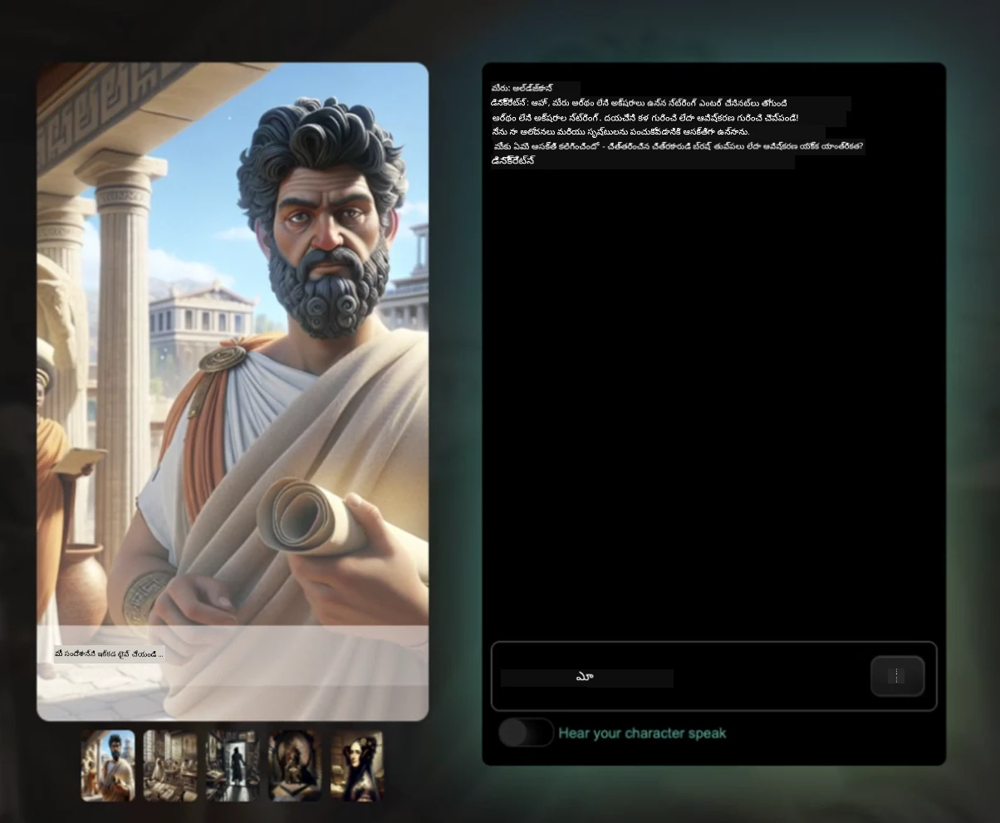
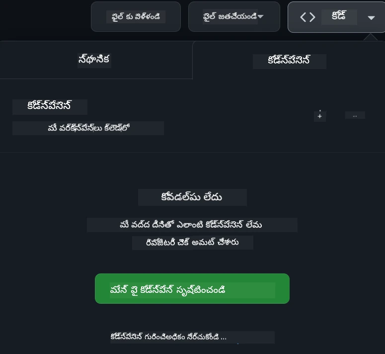

[](https://github.com/microsoft/Web-Dev-For-Beginners/blob/master/LICENSE)
[](https://GitHub.com/microsoft/Web-Dev-For-Beginners/graphs/contributors/)
[](https://GitHub.com/microsoft/Web-Dev-For-Beginners/issues/)
[](https://GitHub.com/microsoft/Web-Dev-For-Beginners/pulls/)
[](http://makeapullrequest.com) 

[](https://GitHub.com/microsoft/Web-Dev-For-Beginners/watchers/)
[](https://GitHub.com/microsoft/Web-Dev-For-Beginners/network/)
[](https://GitHub.com/microsoft/Web-Dev-For-Beginners/stargazers/)

[](https://discord.gg/nTYy5BXMWG)

# Web Development for Beginners - ఒక పాఠ్యక్రమం

Microsoft Cloud Advocates ద్వారా మా 12-వారం సమగ్ర కోర్సుతో వెబ్ అభివృద్ధి యొక్క మూలసూత్రాలను నేర్చుకోండి. 24 పాఠములలో JavaScript, CSS, మరియు HTML ని టెర్రేరియమ్స్, బ్రౌజర్ ఎక్స్‌టెన్షన్స్, మరియు స్పేస్ గేమ్స్ వంటి ప్రాక్టికల్ ప్రాజెక్టుల ద్వారా లోతుగా తెలుసుకుంటారు. క్విజ్‌లు, చర్చలు, మరియు ప్రాక్టికల్ అసైన్‌మెంట్‌లతో జాగ్రత్తగా పాల్గొనండి. మా సమర్థవంతమైన ప్రాజెక్ట్-ఆధారిత పాఠ్య విధానం ద్వారా మీ నెపుణ్యాలను పెంపొందించుకుని జ్ఞానం నిల్వను మెరుగుపరుచుకోండి. మీ కోడింగ్ ప్రయాణాన్ని ఈ రోజు ప్రారంభించండి!

Azure AI Foundry డిస్కోర్డ్ కమ్యూనిటీ లో చేరండి

[](https://discord.gg/nTYy5BXMWG)

ఈ వనరులను ఉపయోగించడాన్ని ప్రారంభించడానికి ఈ దశలను అనుసరించండి:  
1. **రిపోజిటరీని ఫోর্ক్ చేయండి**: క్లిక్ చేయండి [](https://GitHub.com/microsoft/Web-Dev-For-Beginners/fork)  
2. **రిపోజిటరీని క్లోన్ చేయండి**:   `git clone https://github.com/microsoft/Web-Dev-For-Beginners.git`  
3. [**Azure AI Foundry Discord లో చేరండి మరియు నిపుణులు మరియు ఇతర డెవలపర్లను కలవండి**](https://discord.com/invite/ByRwuEEgH4)  

### 🌐 బహుభాషా మద్దతు

#### GitHub Action ద్వారా మద్దతు (ఆటోమేటెడ్ & ఎప్పుడూ అప్డేట్)

<!-- CO-OP TRANSLATOR LANGUAGES TABLE START -->
[Arabic](../ar/README.md) | [Bengali](../bn/README.md) | [Bulgarian](../bg/README.md) | [Burmese (Myanmar)](../my/README.md) | [Chinese (Simplified)](../zh-CN/README.md) | [Chinese (Traditional, Hong Kong)](../zh-HK/README.md) | [Chinese (Traditional, Macau)](../zh-MO/README.md) | [Chinese (Traditional, Taiwan)](../zh-TW/README.md) | [Croatian](../hr/README.md) | [Czech](../cs/README.md) | [Danish](../da/README.md) | [Dutch](../nl/README.md) | [Estonian](../et/README.md) | [Finnish](../fi/README.md) | [French](../fr/README.md) | [German](../de/README.md) | [Greek](../el/README.md) | [Hebrew](../he/README.md) | [Hindi](../hi/README.md) | [Hungarian](../hu/README.md) | [Indonesian](../id/README.md) | [Italian](../it/README.md) | [Japanese](../ja/README.md) | [Kannada](../kn/README.md) | [Khmer](../km/README.md) | [Korean](../ko/README.md) | [Lithuanian](../lt/README.md) | [Malay](../ms/README.md) | [Malayalam](../ml/README.md) | [Marathi](../mr/README.md) | [Nepali](../ne/README.md) | [Nigerian Pidgin](../pcm/README.md) | [Norwegian](../no/README.md) | [Persian (Farsi)](../fa/README.md) | [Polish](../pl/README.md) | [Portuguese (Brazil)](../pt-BR/README.md) | [Portuguese (Portugal)](../pt-PT/README.md) | [Punjabi (Gurmukhi)](../pa/README.md) | [Romanian](../ro/README.md) | [Russian](../ru/README.md) | [Serbian (Cyrillic)](../sr/README.md) | [Slovak](../sk/README.md) | [Slovenian](../sl/README.md) | [Spanish](../es/README.md) | [Swahili](../sw/README.md) | [Swedish](../sv/README.md) | [Tagalog (Filipino)](../tl/README.md) | [Tamil](../ta/README.md) | [Telugu](./README.md) | [Thai](../th/README.md) | [Turkish](../tr/README.md) | [Ukrainian](../uk/README.md) | [Urdu](../ur/README.md) | [Vietnamese](../vi/README.md)

> **స్థానికంగా క్లోన్ చేయాలనుకుంటున్నారా?**
>
> ఈ రిపోజిటరీలో 50+ భాషా అనువాదాలు ఉన్నాయి, వాటివల్ల డౌన్‌లోడ్ పరిమాణం పెరుగుతుంది. అనువాదాలు లేకుండా క్లోన్ చేయడానికి sparse checkout ఉపయోగించండి:
>
> **Bash / macOS / Linux:**  
> ```bash
> git clone --filter=blob:none --sparse https://github.com/microsoft/Web-Dev-For-Beginners.git
> cd Web-Dev-For-Beginners
> git sparse-checkout set --no-cone '/*' '!translations' '!translated_images'
> ```
>  
> **CMD (విండోస్):**  
> ```cmd
> git clone --filter=blob:none --sparse https://github.com/microsoft/Web-Dev-For-Beginners.git
> cd Web-Dev-For-Beginners
> git sparse-checkout set --no-cone "/*" "!translations" "!translated_images"
> ```
>  
> ఇది మీరు కోర్సును పూర్తి చేయడానికి అవసరమైన అన్ని ఫైళ్ళను వేగంగా డౌన్‌లోడ్ చేయడానికి సహాయపడుతుంది.  
<!-- CO-OP TRANSLATOR LANGUAGES TABLE END -->

**మరింత అనువాద భాషలు మద్దతు కావాలంటే [ఇక్కడ](https://github.com/Azure/co-op-translator/blob/main/getting_started/supported-languages.md) చూడు**

[](https://open.vscode.dev/microsoft/Web-Dev-For-Beginners)

#### 🧑‍🎓 _మీరు విద్యార్థి అయితే?_

[**Student Hub పేజీ**](https://docs.microsoft.com/learn/student-hub/?WT.mc_id=academic-77807-sagibbon) ని దర్శించండి, అక్కడ మీరు ప్రారంభicke వనరులు, విద్యార్థి ప్యాక్‌లు మరియు మిద్దుకు ఉచిత సర్టిఫికెట్ వోచర్ పొందేందుకు మార్గాలును కనుగొనవచ్చు. ఈ పేజీని బుక్‌మార్క్ చేసి సమయంలోప్పుడు చూడండి, ఎందుకంటే మేము నెలవారీగా కాంటెంట్ మార్చిపోతుంటాము.

### 📣 ప్రకటన - GitHub Copilot Agent మోడ్ సవాళ్ళు పూర్తి చేయండి!

కొత్త సవాలు జోడించబడింది, ఎక్కువ అధ్యాయాలలో "GitHub Copilot Agent Challenge 🚀" కోసం చూడండి. GitHub Copilot మరియు Agent మోడ్ ఉపయోగించి పూర్తి చేయదగిన కొత్త సవాలు ఇది. మీరు Agent మోడ్ ఇప్పటివరకూ ఉపయోగించని ఉంటే, ఇది టెక్స్ట్ మాత్రమే ఉత్పత్తి చేయడానికి కాదు, ఫైల్‌లను సృష్టించడం, సవరించడం, కమాండ్లను నడవించడం కూడా చేయగలదు.

### 📣 ప్రకటన - _Generative AI ఉపయోగించి కొత్త ప్రాజెక్టు నిర్మించండి_

కొత్త AI అసిస్టెంట్ ప్రాజెక్టు జోడించబడింది, చూడండి [ప్రాజెక్టు](./9-chat-project/README.md)

### 📣 ప్రకటన - జావాస్క్రిప్ట్ కోసం Generative AI పై _కొత్త పాఠ్యక్రమం_ విడుదల

మా కొత్త Generative AI పాఠ్యక్రమం మిస్ కాకుండా చూడండి!

ప్రారంభించడానికి సందర్శించండి [https://aka.ms/genai-js-course](https://aka.ms/genai-js-course)!


- ప్రాథమిక అంశాలు నుండి RAG వరకూ పాఠాలు.  
- GenAI మరియు మా లోబడి యాప్ తో చారిత్రక పాత్రలతో ఇంటరాక్ట్ అవ్వండి.  
- రంజింపజేసే మరియు ఆసక్తికర కథనంతో, మీరు టైమ్ ట్రావెల్ చేస్తున్నట్లే అనుభూతి!  



ప్రతి పాఠంలో పూర్తి చేయాల్సిన అసైన్‌మెంట్, జ్ఞాన పరీక్ష మరియు సవాల్స్ ఉంటాయి, ఇవి మీరు నేర్చుకునే అంశాలపై మార్గనిర్దేశం చేస్తాయి:  
- ప్రాంప్ట్ చేయడం మరియు ప్రాంప్ట్ ఇంజనీరింగ్  
- టెక్స్ట్ మరియు చిత్రం యాప్ జనరేషన్  
- శోధన యాప్‌లు  

ప్రారంభించండి: [https://aka.ms/genai-js-course](https://aka.ms/genai-js-course)  

## 🌱 ప్రారంభించడానికి

> **ఉపాధ్యాయులు**, ఈ పాఠ్యక్రమాన్ని ఉపయోగించే కొన్ని సూచనలను [ఇక్కడ](for-teachers.md) మేము చేర్చాము. మీ అభిప్రాయాలను మా [చర్చా ఫోరమ్](https://github.com/microsoft/Web-Dev-For-Beginners/discussions/categories/teacher-corner) లో తెలియజేయండి!

**[అభ్యర్థులు](https://aka.ms/student-page/?WT.mc_id=academic-77807-sagibbon)**, ప్రతి పాఠం కోసం, ముందస్తు లెక్చర్ క్విజ్తో ప్రారంభించి, లెక్చర్ పదార్థం చదవడం, వివిధ కార్యకలాపాలు పూర్తి చేయడం మరియు తర్వాత లెక్చర్ క్విజ్తో మీ అర్థం తనిఖీ చేయండి.

మీ అభ్యాసం అనుభవాన్ని మెరుగుపరచడానికి, మీ తోటి విద్యార్థులతో కలిసి ప్రాజెక్టుల మీద పనిచేయండి! మా [చర్చా ఫోరమ్](https://github.com/microsoft/Web-Dev-For-Beginners/discussions) లో చర్చలు ప్రోత్సహింపబడతాయి, మా మోడరేటర్లు మీ ప్రశ్నలకు సమాధానాలను అందిస్తారు.

మీ విద్యను మరింత వృద్ధి చేయడానికి, అదనపు అధ్యయన్ పదార్థాల కోసం [Microsoft Learn](https://learn.microsoft.com/users/wirelesslife/collections/p1ddcy5jwy0jkm?WT.mc_id=academic-77807-sagibbon) ను పరిశీలించండి.

### 📋 మీ పరిసరాలను ఏర్పాటు చేయడం

ఈ పాఠ్యక్రమానికి అభివృద్ధి పరిసరాలు సిద్ధంగా ఉన్నాయి! మీరు ప్రారంభించేటప్పుడు, మీరు [Codespace](https://github.com/features/codespaces/) లో (బ్రౌజర్ ఆధారిత, ఇన్‌స్టాల్ అవసరం లేని పరిసరం) లేదా మీ కంప్యూటర్లో [Visual Studio Code](https://code.visualstudio.com/?WT.mc_id=academic-77807-sagibbon) వంటి టెక్స్ట్ ఎడిటర్ ఉపయోగించి నేరుగా పాఠ్యక్రమాన్ని నడపవచ్చు.

#### మీ రిపోజిటరీని సృష్టించండి  
మీ పని సులభంగా సేవ్ చేయడానికి, మీ స్వంత కాపీని సృష్టించడం సిఫార్సు చేయబడింది. పేజీ పై భాగంలో "Use this template" బటన్‌ను క్లిక్ చేయండి. ఇది మీ GitHub ఖాతాలో ఈ పాఠ్యక్రమ పోతిన ఒక కొత్త రిపోజిటరీని సృష్టిస్తుంది.

ఈ దశలును అనుసరించండి:  
1. **రిపోజిటరీని ఫోర్క్ చేయండి**: ఈ పేజీ యొక్క పై-కుడి మూలలో "Fork" బటన్‌ను క్లిక్ చేయండి.  
2. **రిపోజిటరీని క్లోన్ చేయండి**:   `git clone https://github.com/microsoft/Web-Dev-For-Beginners.git`  

#### Codespace లో పాఠ్య క్రమం నడపడం

మీ సృష్టించిన ఈ రిపోజిటరీ కాపీలో, **Code** బటన్ క్లిక్ చేసి **Open with Codespaces** ఎంచుకోండి. ఇది మీ పని కోసం కొత్త Codespace ని సృష్టిస్తుంది.



#### మీ కంప్యూటర్లో ఈ పాఠ్య క్రమం నడపడం

మీ కంప్యూటర్లో ఈ పాఠ్యక్రమం నడపడానికి, ఒక టెక్స్ట్ ఎడిటర్, ఒక బ్రౌజర్ మరియు ఒక కమాండ్ లైన్ టూల్ అవసరం. మా మొదటి పాఠం [Introduction to Programming Languages and Tools of the Trade](../../1-getting-started-lessons/1-intro-to-programming-languages) మీరు ఈ పరికరాల ఎంపికకు సంబంధించిన వివిధ ఎంపికలను చూపిస్తుంది.

మా సిఫార్సు [Visual Studio Code](https://code.visualstudio.com/?WT.mc_id=academic-77807-sagibbon) ని ఎడిటర్ గా ఉపయోగించడం, ఇది బిల్ట్-ఇన్ [టెర్మినల్](https://code.visualstudio.com/docs/terminal/basics/?WT.mc_id=academic-77807-sagibbon) సౌకర్యం కలిగి ఉంటుంది. Visual Studio Code ని [ఇక్కడ](https://code.visualstudio.com/?WT.mc_id=academic-77807-sagibbon) నుండి డౌన్లోడ్ చేసుకోవచ్చు.
1. మీ రిపాజిటరీని మీ కంప్యూటర్‌కు క్లోన్ చేయండి. దీన్ని మీరు **Code** బటన్‌పై క్లిక్ చేసి URLను కాపీచేయడం ద్వారా చేయవచ్చు:

    [CodeSpace](./images/createcodespace.png)

    తరువాత, [Visual Studio Code](https://code.visualstudio.com/?WT.mc_id=academic-77807-sagibbon) లో [Terminal](https://code.visualstudio.com/docs/terminal/basics/?WT.mc_id=academic-77807-sagibbon)ని తెరిచి, మీరు కాపీ చేసిన URLను `<your-repository-url>` గా బదిలీచేసి క్రింది కమాండ్‌ను నడపండి:

    ```bash 
    git clone <your-repository-url>
    ```

2. Visual Studio Codeలో ఫోల్డర్‌ను తెరవండి. మీరు క్లోన్ చేసిన ఫోల్డర్‌ను ఎంపిక చేసుకోవడానికి **File** > **Open Folder** పై క్లిక్ చేయండి.


>  సూచించబడిన Visual Studio Code విస్తరణలు:
>
> * [Live Server](https://marketplace.visualstudio.com/items?itemName=ritwickdey.LiveServer&WT.mc_id=academic-77807-sagibbon) - Visual Studio Codeలో HTML పేజీలను ప్రివ్యూకు
> * [Copilot](https://marketplace.visualstudio.com/items?itemName=GitHub.copilot&WT.mc_id=academic-77807-sagibbon) - కోడ్‌ను మరింత వేగంగా రాయడంలో సహాయం

## 📂 ప్రతి పాఠంలో ఉంటుంది:

- ఐచ్ఛిక స్కెచ్‌నోట్
- ఐచ్ఛిక అనుబంధ వీడియో
- పాఠానికి ముందు వేడి పరించుకొనే క్విజ్
- వ్రాసిన పాఠం
- ప్రాజెక్ట్-ఆధారిత పాఠాల కోసం, ప్రాజెక్ట్‌ని నిర్మించడానికి స్టెప్-బై-స్టెప్ మార్గదర్శకాలు
- విజ్ఞాన పరీక్షలు
- ఒక సవాలు
- అనుబంధ చదువు
- కఠినతరమైన [పోస్ట్-పాఠం క్విజ్](https://ff-quizzes.netlify.app/web/)

> **క్విజ్‌లు గురించి ఒక గమనిక**: అన్ని క్విజ్‌లు Quiz-app ఫোল్డర్ లో ఉంటాయి, 48 మొత్తం క్విజ్‌లు ఒక్కో మూడు ప్రశ్నలతో కూడాయి. అవి [ఇక్కడ](https://ff-quizzes.netlify.app/web/) అందుబాటులో ఉంటాయి. క్విజ్ అప్లికేషన్‌ను స్థానికంగా నడిపించవచ్చు లేదా Azureకు పంపించవచ్చు; `quiz-app` ఫోల్డర్‌లో ఉన్న సూచనలను అనుసరించండి.

## 🗃️ పాఠాలు

|     |                       ప్రాజెక్ట్ పేరు                        |                            బోధించే భావాలు                            | నేర్చుకునే విషయాలు                                                                                                               |                                                         లింక్ చేసిన పాఠం                                                          |         రచయిత          |
| :-: | :------------------------------------------------------: | :--------------------------------------------------------------------: | ----------------------------------------------------------------------------------------------------------------------------------- | :----------------------------------------------------------------------------------------------------------------------------: | :---------------------: |
| 01  |                      ప్రారంభం అవుతున్నది                      |           ప్రోగ్రామింగ్ పరిచయం మరియు ఉపకరణాలు           | ఎక్కువ భాగం ప్రోగ్రామింగ్ భాషల ఆధారాలు మరియు ప్రొఫెషనల్ డెవలపర్లు తమ పనులు చేయడానికి సహాయకంగా ఉండే సాఫ్ట్‌వేర్ గురించి తెలుసుకోండి | [ప్రోగ్రామింగ్ భాషలకు మరియు ఉపకరణాలకు పరిచయం](./1-getting-started-lessons/1-intro-to-programming-languages/README.md) |         Jasmine         |
| 02  |                      ప్రారంభం అవుతున్నది                      |              GitHub యొక్క ప్రాధమికాలు, టీంతో సహకారం               | మీ ప్రాజెక్టులో GitHubని ఎలా ఉపయోగించాలో, కోడ్ బేస్‌పై ఇతరులతో కలిసి ఎలా పని చేయాలో తెలుసుకోవడం                                                    |                            [GitHubకి పరిచయం](./1-getting-started-lessons/2-github-basics/README.md)                             |          Floor          |
| 03  |                      ప్రారంభం అవుతున్నది                      |                             యాక్సెసిబిలిటీ                              | వెబ్ యాక్సెసిబిలిటీ ప్రాథమికాలను తెలుసుకోవడం                                                                                               |                       [యాక్సెసిబిలిటీ ఫండమెంటల్స్](./1-getting-started-lessons/3-accessibility/README.md)                       |       Christopher       |
| 04  |                        JS ప్రాథమికాలు                         |                         JavaScript డేటా రకాల                           | JavaScript డేటా రకాల ప్రాథమికాలు                                                                                                 |                                       [డేటా రకాలు](./2-js-basics/1-data-types/README.md)                                        |         Jasmine         |
| 05  |                        JS ప్రాథమికాలు                         |                         ఫంక్షన్లు మరియు మెథడ్స్                          | ప్రోగ్రాం లాజిక్ ఫ్లో నిర్వహించడానికి ఫంక్షన్లు మరియు మెథడ్స్ గురించి తెలుసుకోండి                                                              |                              [ఫంక్షన్లు మరియు మెథడ్స్](./2-js-basics/2-functions-methods/README.md)                               | Jasmine మరియు Christopher |
| 06  |                        JS ప్రాథమికాలు                         |                        JS తో నిర్ణయాలు తీసుకోవడం                        | మీ కోడులో షరతులను ఎలా సృష్టించాలో నిర్ణయాలు తీసుకునే పద్ధతులు ఉపయోగించి తెలుసుకోండి                                                           |                                 [నిర్ణయాలు తీసుకోవడం](./2-js-basics/3-making-decisions/README.md)                                  |         Jasmine         |
| 07  |                        JS ప్రాథమికాలు                         |                            అర్రాలు మరియు లూపులు                            | JavaScriptలో అర్రాలు మరియు లూపులతో డేటాతో పని చేయడం                                                                                 |                                   [అర్రాలు మరియు లూపులు](./2-js-basics/4-arrays-loops/README.md)                                    |         Jasmine         |
| 08  |       [Terrarium](./3-terrarium/solution/README.md)       |                            HTML ఆచరణలో                            | ఆన్‌లైన్ టెర్రేరియం సృష్టించడానికి HTMLని నిర్మించడం, లేఅవుట్‌ నిర్మాణంపై దృష్టి పెట్టడం                                                         |                                 [HTMLకి పరిచయం](./3-terrarium/1-intro-to-html/README.md)                                 |           Jen           |
| 09  |       [Terrarium](./3-terrarium/solution/README.md)       |                            CSS ఆచరణలో                             | ఆన్‌లైన్ టెర్రేరియం స్టైల్ చేయడానికి CSS నిర్మించడం, CSS ప్రాథమికాలు మరియు పేజీని రిస్పాన్స్‌వ్‌గా చేసుకోవడం                                  |                                  [CSSకి పరిచయం](./3-terrarium/2-intro-to-css/README.md)                                  |           Jen           |
| 10  |            [Terrarium](./3-terrarium/solution/README.md)            |                 JavaScript క్లోజర్స్, DOM మానిప్యులేషన్                  | డ్రాగ్/డ్రాప్ ఇంటర్‌ఫేస్‌గా టెర్రేరియం పనిచేసేలా JavaScript నిర్మించడం, క్లోజర్‌లు మరియు DOM మానిప్యులేషన్‌పై దృష్టి పెట్టడం             |                  [JavaScript క్లోజర్స్, DOM మానిప్యులేషన్](./3-terrarium/3-intro-to-DOM-and-closures/README.md)                   |           Jen           |
| 11  |          [Typing Game](./4-typing-game/solution/README.md)          |                          టైపింగ్ గేమ్ నిర్మించడం                           | కీబోర్డ్ ఈవెంట్లను ఉపయోగించి మీ JavaScript యాప్లో లాజిక్‌ను నడిపించడం                                                          |                                [ఈవెంట్-డ్రివెన్ ప్రోగ్రామింగ్](./4-typing-game/typing-game/README.md)                                |       Christopher       |
| 12  | [Green Browser Extension](./5-browser-extension/solution/README.md) |                         బ్రౌజర్‌లతో పని చేయడం                          | బ్రౌజర్‌లు ఎలా పనిచేస్తాయో, వాటి చరిత్ర మరియు బ్రౌజర్ ఎక్స్టెన్షన్ మొదటి ఆవృతాలను ఎలా స్కాఫోల్డ్ చేయాలో తెలుసుకోవడం                               |                               [బ్రౌజర్ల గురించి](./5-browser-extension/1-about-browsers/README.md)                                |           Jen           |
| 13  | [Green Browser Extension](./5-browser-extension/solution/README.md) | ఫామ్ నిర్మించడం, API కాలింగ్ మరియు స్థానిక నిల్వలో వేరియబుల్స్ నిల్వ చేయడం | స్థానిక నిల్వలో వేరియబుల్స్ నిల్వ చేసి APIకి కాల్ చేయడానికి మీ బ్రౌజర్ ఎక్స్టెన్షన్ యొక్క JavaScript మూలకాలను నిర్మించడం                      |                [APIs, ఫారమ్లు మరియు స్థానిక నిల్వ](./5-browser-extension/2-forms-browsers-local-storage/README.md)                 |           Jen           |
| 14  | [Green Browser Extension](./5-browser-extension/solution/README.md) |          బ్రౌజర్‌లో బ్యాక్‌గ్రౌండ్ ప్రాసెస్లు, వెబ్ పనితీరు          | ఎక్స్టెన్షన్ ఐకాన్‌ను నిర్వహించడానికి బ్రౌజర్ యొక్క బ్యాక్‌గ్రౌండ్ ప్రాసెస్లు ఉపయోగించడం; వెబ్ పనితీరు మరియు కొన్ని ఆప్టిమైజేషన్ల గురించి తెలుసుకోవడం   |             [బ్యాక్‌గ్రౌండ్ టాస్కులు మరియు పనితీరు](./5-browser-extension/3-background-tasks-and-performance/README.md)              |           Jen           |
| 15  |           [Space Game](./6-space-game/solution/README.md)           |             JavaScriptతో మరింత ఉన్నత స్థాయి గేమ్ డెవలప్‌మెంట్             | క్లాసులూ మరియు కంపోజిషన్‌ను ఉపయోగించి ఇన్హెరిటెన్స్ మరియు Pub/Sub నమూనా గురించి తెలుసుకోండి, గేమ్ నిర్మాణానికి సిద్ధమవ్వడంతో              |                      [అధిక స్థాయి గేమ్ డెవలప్‌మెంట్ పరిచయం](./6-space-game/1-introduction/README.md)                       |          Chris          |
| 16  |           [Space Game](./6-space-game/solution/README.md)           |                           కేన్వాస్ ఆ పైకి డ్రాయింగ్                            | స్క్రీన్‌పై మూలకాలను గీయడానికి ఉపయోగించే Canvas API గురించి తెలుసుకోండి                                                                       |                                [కేన్వాస్‌కు డ్రాయింగ్](./6-space-game/2-drawing-to-canvas/README.md)                                |          Chris          |
| 17  |           [Space Game](./6-space-game/solution/README.md)           |                   స్క్రీన్ చుట్టూ మూలకాలను కదిలించడం                    | కార్టెసియన్ కోఆర్డినేట్లు మరియు Canvas API ఉపయోగించి మూలకాలు ఎలా కదులుతున్నాయో తెలుసుకోండి                                            |                           [మూలకాలు కదిలించడం](./6-space-game/3-moving-elements-around/README.md)                           |          Chris          |
| 18  |           [Space Game](./6-space-game/solution/README.md)           |                          ఢీకొట్టే గుర్తింపు                           | కీలను ఉపయోగించి మూలకాలు ఎలా ఢీకొంటున్నాయో మరియు పరస్పరం చర్యలు తీసుకుంటాయో గేమ్ పనితీరు కాపాడడానికి కూల్డౌన్ ఫంక్షన్‌ను ఎలా ఇవ్వాలో చేయడం    |                              [ఢీకొట్టే గుర్తింపు](./6-space-game/4-collision-detection/README.md)                              |          Chris          |
| 19  |           [Space Game](./6-space-game/solution/README.md)           |                             స్కోరు గమనించడం                              | గేమ్ పరిస్థితి మరియు పనితీపై ఆధారంగా గణనలు నిర్వహించడం                                                                |                                    [స్కోరు గమనించడం](./6-space-game/5-keeping-score/README.md)                                    |          Chris          |
| 20  |           [Space Game](./6-space-game/solution/README.md)           |                     గేమ్ ముగింపు మరియు మళ్లీ ప్రారంభించడం                     | గేమ్ ముగింపు మరియు మళ్లీ ప్రారంభించడంపై తెలుసుకోండి, ఆస్తులను క్లీనప్ చేయడం మరియు వేరియబుల్ విలువలను రీసెట్ చేయడం                              |                                [ముగింపు షరతు](./6-space-game/6-end-condition/README.md)                                 |          Chris          |
| 21  |         [Banking App](./7-bank-project/solution/README.md)          |                 వెబ్ యాప్‌లో HTML టెంప్లేట్లు మరియు రూట్లు                 | బహుముఖ పేజీల వెబ్ సైట్ నిర్మాణానికి స్కాఫోల్డ్ తయారు చేయడం రూటింగ్ మరియు HTML టెంప్లేట్ల ద్వారా                             |                            [HTML టెంప్లేట్లు మరియు రూట్లు](./7-bank-project/1-template-route/README.md)                             |          Yohan          |
| 22  |         [Banking App](./7-bank-project/solution/README.md)          |                  లాగిన్ మరియు రిజిస్ట్రేషన్ ఫారమ్ నిర్మించడం                   | ఫారమ్లు నిర్మించడం మరియు ధృవీకరణ రుతీన్ల నిర్వహణపై తెలుసుకోండి                                                                          |                                           [ఫారములు](./7-bank-project/2-forms/README.md)                                           |          Yohan          |
| 23  |         [Banking App](./7-bank-project/solution/README.md)          |                   డేటా పొందుట మరియు ఉపయోగించుట యొక్క విధానాలు                   | మీ యాప్‌లో డేటా ఎలా ప్రవహిస్తున్నదీ, దాన్ని ఎలా పొందాలి, నిల్వ చేయాలి మరియు తొలగించాలి తెలుసుకోండి                                                 |                                            [డేటా](./7-bank-project/3-data/README.md)                                            |          Yohan          |
| 24  |         [Banking App](./7-bank-project/solution/README.md)          |                      స్టేట్ మేనేజ్‌మెంట్ భావనలు                      | మీ యాప్ స్టేట్‌ను ఎలా నిలుపుకుంటుంది మరియు దాన్ని ప్రోగ్రామాటిక్‌గా ఎలా నిర్వహించాలో తెలుసుకోండి                                                              |                                [స్టేట్ మేనేజ్‌మెంట్](./7-bank-project/4-state-management/README.md)                                |          Yohan          |
| 25 | [Browser/VScode Code](../../8-code-editor) | VScodeతో పని చేయడం | కోడ్ ఎడిటర్ ఉపయోగించడం ఎలా నేర్చుకోవాలి| [VScode కోడ్ ఎడిటర్ ఉపయోగించడం](./8-code-editor/1-using-a-code-editor/README.md) | Chris |
| 26 | [AI Assistants](./9-chat-project/README.md) | AIతో పని చేయడం | మీ సొంత AI అసిస్టెంట్‌ను ఎలా నిర్మించాలో నేర్చుకోండి | [AI అసిస్టెంట్ ప్రాజెక్ట్](./9-chat-project/README.md) | Chris |

## 🏫 విధాన శాస్త్రం

మా పాఠ్యक्रमం రెండు ముఖ్యమైన విద్యా సూత్రాలతో రూపొందించబడింది:
* ప్రాజెక్ట్-ఆధారిత అధ్యయనం
* తరచూ క్విజ్‌లు

ప్రోగ్రామ్ JavaScript, HTML మరియు CSS యొక్క ప్రాథమికాలను, అలాగే నేటి వెబ్ డెవలపర్లు ఉపయోగించే తాజా టూల్స్ మరియు సాంకేతికతలను బోధిస్తుంది. విద్యార్థులు టైపింగ్ గేమ్, వర్చువల్ టెర్రేరియం, పర్యావరణహిత బ్రౌజర్ ఎక్స్టెన్షన్, స్పేస్-ఇన్వేడర్-శైలి గేమ్ మరియు వ్యాపారాల కోసం బ్యాంకింగ్ యాప్ వంటి అనుభవాలు అభివృద్ధి చేసుకునే అవకాశం ఉంటుందని ఉంటుంది. సిరీస్ చివరికి, విద్యార్థులు వెబ్ డెవలప్‌మెంట్‌పై గట్టైన అవగాహన పొందుతారు.

> 🎓 మీరు ఈ పాఠ్యక్రమంలో మొదటి కొన్ని పాఠాలను Microsoft Learnలోని [Learn Path](https://docs.microsoft.com/learn/paths/web-development-101/?WT.mc_id=academic-77807-sagibbon)గా తీసుకోవచ్చు!

విషయాలు ప్రాజెక్టులకు సరిపోలేలా ఉండటంతో, విద్యార్థులకు మరింత ఆసక్తికరం అయ్యి, భావాల నిలుపుదల మెరుగుపడుతుంది. మేము JavaScript ప్రాథమికాల్లో కొంత ప్రారంభ పాఠాలు కూడా రాశాము మరియు "[Beginners Series to: JavaScript](https://channel9.msdn.com/Series/Beginners-Series-to-JavaScript/?WT.mc_id=academic-77807-sagibbon)" వీడియో ట్యుటోరియల్స్ నుండి ఒక వీడియోతో జతచేసాము, ఆ కొంత రచయితలు ఈ పాఠ్యక్రమానికి తోడ్పడారు.

అదేవిధంగా, తరగతికి ముందు ఒక తక్కువ-మప్కు క్విజ్ విద్యార్థి అభ్యాసం మీద దృష్టి పెట్టేలా మార్గదర్శనం చేస్తుంది, తరగతి తర్వాత రెండవ క్విజ్ భావాల నిలుపుదలని పెంచుతుంది. ఈ పాఠ్యక్రమం సౌకర్యవంతంగా మరియు హస్యం కలిగించాలనే ఉద్దేశంతో రూపొందించబడింది మరియు మొత్తం లేదా భాగంగా తీసుకోవచ్చు. ప్రాజెక్టులు చిన్నవిగా మొదలుకొని 12 వారాల చక్రం చివరికి క్రమంగా క్లిష్టమవతాయి.

మేము జావాస్క్రిప్ట్ ఫ్రేమ్‌వర్క్‌లను ఉద్దేశపూర్వకంగా పరిచయం చేయకుండా ఉంచాము, ఒక వెబ్ డెవలపర్‌గా అవసరమైన ప్రాథమిక నైపుణ్యాలపై దృష్టి పెట్టడానికి ఫ్రేమ్‌వర్క్‌ను అనుసరించే ముందు; ఈ పాఠ్యక్రమాన్ని పూర్తి చేయడానికి బాగా ఉన్నతమైన తదుపరి దశగా, ఇంకొక వీడియో సేకరణ "[Beginner Series to: Node.js](https://channel9.msdn.com/Series/Beginners-Series-to-Nodejs/?WT.mc_id=academic-77807-sagibbon)" ద్వారా Node.jsని నేర్చుకోవడం ఉంటుంది.

> మాకు [Code of Conduct](CODE_OF_CONDUCT.md) మరియు [Contributing](CONTRIBUTING.md) మార్గదర్శకాలు ఉన్నాయి. మీ నిర్మాణాత్మక అభిప్రాయాన్ని మేము స్వాగతిస్తున్నాము!


## 🧭 ఆఫ్‌లైన్ ಪ್ರವೇಶం

[Docsify](https://docsify.js.org/#/) ఉపయోగించి మీరు ఈ డాక్యుమెంటేషన్‌ను ఆఫ్‌లైన్‌లో నడపవచ్చు. ఈ రెపోను ఫోర్క్ చేసుకోండి, మీ స్థానిక मशीनలో [Docsifyని ఇన్స్టాల్](https://docsify.js.org/#/quickstart) చేయండి, తదుపరి ఈ రెపో యొక్క రూట్ ఫోల్డర్‌లో `docsify serve` టైప్ చేయండి. వెబ్‌సైట్ 3000 పోర్ట్‌పై మీ లోకల్ హోస్ట్‌లో అందుబాటులో ఉంటుంది: `localhost:3000`.

## 📘 PDF
పాఠాలన్నింటి PDFను [ఇక్కడ](https://microsoft.github.io/Web-Dev-For-Beginners/pdf/readme.pdf) పొందొచ్చు.


## 🎒 ఇతర కోర్సులు

మా బృందం ఇతర కోర్సులు కూడా తయారుచేస్తోంది! చూడండి:

<!-- CO-OP TRANSLATOR OTHER COURSES START -->
### LangChain
[](https://aka.ms/langchain4j-for-beginners)
[](https://aka.ms/langchainjs-for-beginners?WT.mc_id=m365-94501-dwahlin)
[](https://github.com/microsoft/langchain-for-beginners?WT.mc_id=m365-94501-dwahlin)
---

### Azure / Edge / MCP / Agents
[](https://github.com/microsoft/AZD-for-beginners?WT.mc_id=academic-105485-koreyst)
[](https://github.com/microsoft/edgeai-for-beginners?WT.mc_id=academic-105485-koreyst)
[](https://github.com/microsoft/mcp-for-beginners?WT.mc_id=academic-105485-koreyst)
[](https://github.com/microsoft/ai-agents-for-beginners?WT.mc_id=academic-105485-koreyst)

---
 
### Generative AI శ్రేణి
[](https://github.com/microsoft/generative-ai-for-beginners?WT.mc_id=academic-105485-koreyst)
[-9333EA?style=for-the-badge&labelColor=E5E7EB&color=9333EA)](https://github.com/microsoft/Generative-AI-for-beginners-dotnet?WT.mc_id=academic-105485-koreyst)
[-C084FC?style=for-the-badge&labelColor=E5E7EB&color=C084FC)](https://github.com/microsoft/generative-ai-for-beginners-java?WT.mc_id=academic-105485-koreyst)
[-E879F9?style=for-the-badge&labelColor=E5E7EB&color=E879F9)](https://github.com/microsoft/generative-ai-with-javascript?WT.mc_id=academic-105485-koreyst)

---
 
### కోర్ లెర్నింగ్
[](https://aka.ms/ml-beginners?WT.mc_id=academic-105485-koreyst)
[](https://aka.ms/datascience-beginners?WT.mc_id=academic-105485-koreyst)
[](https://aka.ms/ai-beginners?WT.mc_id=academic-105485-koreyst)
[](https://github.com/microsoft/Security-101?WT.mc_id=academic-96948-sayoung)
[](https://aka.ms/webdev-beginners?WT.mc_id=academic-105485-koreyst)
[](https://aka.ms/iot-beginners?WT.mc_id=academic-105485-koreyst)
[](https://github.com/microsoft/xr-development-for-beginners?WT.mc_id=academic-105485-koreyst)

---
 
### కోపిలట్ శ్రేణి
[](https://aka.ms/GitHubCopilotAI?WT.mc_id=academic-105485-koreyst)
[](https://github.com/microsoft/mastering-github-copilot-for-dotnet-csharp-developers?WT.mc_id=academic-105485-koreyst)
[](https://github.com/microsoft/CopilotAdventures?WT.mc_id=academic-105485-koreyst)
<!-- CO-OP TRANSLATOR OTHER COURSES END -->

## సహాయం పొందడం

మీరు అడ్డుకట్ట పడితే లేదా AI యాప్‌లు నిర్మించడంపై ఏవైనా ప్రశ్నలు ఉంటే, MCP గురించి చర్చలలో ఇతర విద్యార్థులు మరియు అనుభవజ్ఞులైన డెవలపర్లతో చేరండి. ఇది ఒక మద్ధతుగా ఉండే కమ్యూనిటీ, అక్కడ ప్రశ్నలు స్వాగతం చేయబడతాయి మరియు జ్ఞానం స్వేచ్ఛగా పంచుకుంటారు.

[](https://discord.gg/nTYy5BXMWG)

మీకు ఉత్పత్తి అభిప్రాయం లేదా లోపాలు ఉంటే:

[](https://aka.ms/foundry/forum)

## లైసెన్స్

ఈ రిపోజిటరీ MIT లైసెన్సు క్రింద లైసెన్స్ చేయబడింది. మరింత సమాచారం కోసం [LICENSE](../../LICENSE) ఫయిల్ చూడండి.

---

<!-- CO-OP TRANSLATOR DISCLAIMER START -->
**అస్పష్టత**:
ఈ పత్రాన్ని AI అనువాద సేవ [Co-op Translator](https://github.com/Azure/co-op-translator) ఉపయోగించి అనువదించబడింది. మేము సరిగా ఉండేందుకు ప్రయత్నించినప్పటికీ, ఆటోమేటెడ్ అనువాదాల్లో తప్పిదాలు లేదా అసత్యతలు ఉండవచ్చు. స్థానిక భాషలో ఉన్న మౌలిక పత్రం అధికారిక మూలంగా పరిగణించాలి. ముఖ్యమైన సమాచారం కోసం, వృత్తి పరిజ్ఞానుల చేత అనువాదం చేయించడం ఉత్తమం. ఈ అనువాదం ఉపయోగించడంవల్ల ఏర్పడిన ఏవైనా అపర్థాలు లేదా తప్పుదారుల కోసం మేము బాధ్యుల్లో కాదు.
<!-- CO-OP TRANSLATOR DISCLAIMER END -->