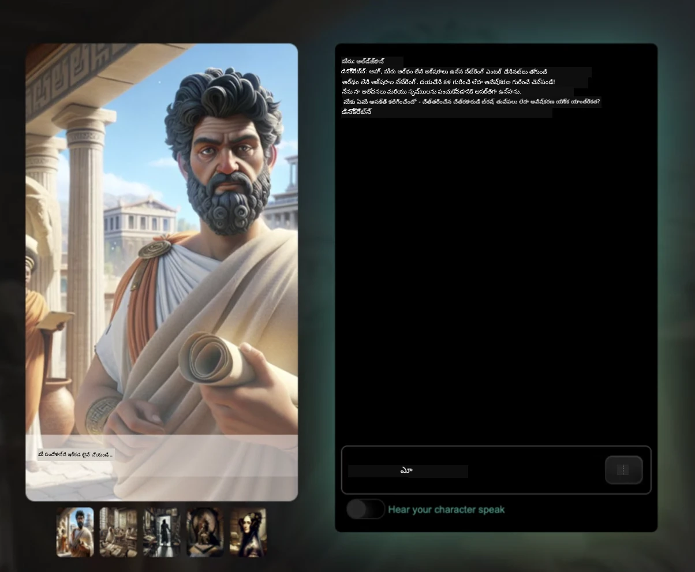
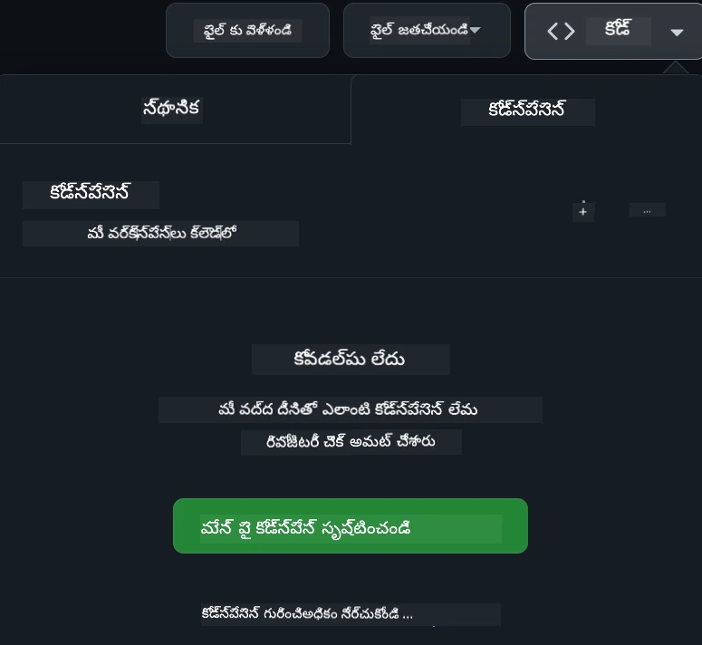

# ప్రారంభకులు కోసం వెబ్ డెవలప్మెంట్ - ఒక పాఠ్యక్రమం

మైక్రోసాఫ్ట్ క్లౌడ్ అడ్వకేట్స్ ద్వారా 12 వారాల సమగ్ర కోర్సుతో వెబ్ డెవలప్మెంట్ యొక్క మూలభూత విషయాలు నేర్చుకోండి. 24 పాఠాల ప్రతీది టెరేరియంలు, బ్రౌజర్ ఎక్స్‌టెన్షన్లు, స్పేస్ గేమ్స్ వంటి ప్రాక్టికల్ ప్రాజెక్ట్‌ల ద్వారా జావాస్క్రిప్ట్, CSS, మరియు HTML లోకి లోతుగా ప్రవేశిస్తుంది. క్విజ్‌లు, చర్చలు మరియు వినియోగ విలువైన అసైన్మెంట్‌లలో పాల్గొనండి. మా సమర్థవంతమైన ప్రాజెక్ట్ ఆధారిత విద్యా విధానంతో మీ నైపుణ్యాలను మెరుగుపరుచుకొని, జ్ఞాన సంపాదనను ఉత్తమపరచండి. మీ కోడింగ్ ప్రయాణాన్ని ఈరోజే ప్రారంభించండి!

ఆజ్యూర్ AI Foundry Discord లో చేరి నిపుణులు మరియు విభిన్న డెవలపర్లను కలుసుకోండి.

[](https://discord.gg/nTYy5BXMWG)

ఈ వనరులను ఉపయోగించడం ప్రారంభించడానికి ఈ అడుగులు పాటించండి:  
1. **రిపోజిటరీని Fork చేయండి**: క్లిక్ చేయండి [](https://GitHub.com/microsoft/Web-Dev-For-Beginners/fork)  
2. **రిపోజిటరీని Clone చేయండి**:   `git clone https://github.com/microsoft/Web-Dev-For-Beginners.git`  
3. [**ఆజ్యూర్ AI Foundry Discord లో చేరి నిపుణులు మరియు డెవలపర్లను కలుసుకోండి**](https://discord.com/invite/ByRwuEEgH4)

### 🌐 బహుభాషా మద్దతు

#### GitHub Action ద్వారా మద్దతు (స్వయంచాలకంగా & ఎప్పుడూ నూతనమైనది)

> **స్థానికంగా క్లోన్ చేయాలనుకుంటున్నారా?**  
> ఈ రిపోజిటరీలో 50+ భాషా అనువాదాలు ఉన్నాయి, ఇవి డౌన్లోడ్ పరిమాణం పెంచుతాయి. అనువాదం లేకుండా క్లోన్ చేయడానికి sparse checkout ఉపయోగించండి:  
>  
> **Bash / macOS / Linux:**  
> > ```bash
> git clone --filter=blob:none --sparse https://github.com/microsoft/Web-Dev-For-Beginners.git
> cd Web-Dev-For-Beginners
> git sparse-checkout set --no-cone '/*' '!translations' '!translated_images'
> ```
>  
> **CMD (Windows):**  
> > ```cmd
> git clone --filter=blob:none --sparse https://github.com/microsoft/Web-Dev-For-Beginners.git
> cd Web-Dev-For-Beginners
> git sparse-checkout set --no-cone "/*" "!translations" "!translated_images"
> ```
>  
>  
> ఇది మీరు కోర్సును పూర్తి చేయడానికి అవసరమయ్యే ప్రతిదాన్ని తక్కువ సమయంతో డౌన్లోడ్ చేయడానికి సహాయపడుతుంది.

**మీకు అదనపు అనువాదాలు కావాలనుకుంటే, మద్దతు పొందిన భాషల జాబితా ఇక్కడ ఉంది. [ఇక్కడ](https://github.com/Azure/co-op-translator/blob/main/getting_started/supported-languages.md)**

[](https://open.vscode.dev/microsoft/Web-Dev-For-Beginners)

#### 🧑‍🎓 _మీరు ఒక విద్యార్థినిగా ఉన్నారా?_

[**Student Hub పేజీ**](https://docs.microsoft.com/learn/student-hub/?WT.mc_id=academic-77807-sagibbon) ను సందర్శించండి, ఇక్కడ మీరు ప్రారంభ వనరులు, విద్యార్థి ప్యాక్లు మరియు ఉచిత సర్టిఫికెట్ వోచర్ పొందే మార్గాలను కనుగొనవచ్చు. ఇది మీరు బుక్‌మార్క్ చేసి నెలకూడా సమీక్షించదగ్గ పేజీ.

### 📣 ప్రకటనా - పూర్తి చేయాల్సిన కొత్త GitHub Copilot Agent మోడ్ సవాళ్లు!

కొత్త సవాలు జోడించబడింది, చాలా అధ్యాయాలలో "GitHub Copilot Agent Challenge 🚀" కోసం చూడండి. ఇది GitHub Copilot మరియు Agent మోడ్ ఉపయోగించి మీరు పూర్తి చేయవలసిన కొత్త సవాల్లలో ఒకటి. మీరు ఇప్పుడివరకు Agent మోడ్ ఉపయోగించకపోయినా, ఇది కేవలం టెక్స్ట్ సృష్టించడమే కాకుండా ఫైళ్ళను సృష్టించడం, సవరించడం, ఆజ్ఞలు నడుపడం తదితరాలు చేయగలదు.

### 📣 ప్రకటనా - _Generative AI ఉపయోగించి కొత్త ప్రాజెక్ట్_

కొత్త AI అసిస్టెంట్ ప్రాజెక్ట్ జోడించబడింది, దీన్ని చూడండి [ప్రాజెక్ట్](./9-chat-project/README.md)

### 📣 ప్రకటనా - _Generative AI కోసం కొత్త పాఠ్యక్రమం_ జావాస్క్రిప్ట్ కి

మా కొత్త Generative AI పాఠ్యక్రమం మిస్ కాకండి!  

ప్రారంభించడానికి సందర్శించండి [https://aka.ms/genai-js-course](https://aka.ms/genai-js-course)


- ప్రాథమికాంశాల నుండి RAG వరకు అన్ని అంశాలను కవర్ చేసే పాఠాలు.  
- GenAI మరియు మా సహాయక యాప్‌తో చరిత్రాత్మక పాత్రలతో సంభాషణ.  
- సరదాగా, సజీవంగా, మీరు కాల ప్రయాణం చేస్తారు!  



ప్రతి పాఠంలో పూర్తిచేయాల్సిన అసైన్మెంట్, జ్ఞాన తనిఖీ మరియు సవాలు ఉంటాయి, ఇవి ఈ విషయాలలో మీరు నేర్చుకోవడాన్ని గైడ్ చేస్తాయి:  
- ప్రాంప్ట్ మరియు ప్రాంప్ట్ ఇంజనీరింగ్  
- టెక్స్ట్ మరియు ఇమేజ్ యాప్ జనరేషన్  
- సెర్చ్ యాప్‌లు  

ప్రారంభించడానికి సందర్శించండి [https://aka.ms/genai-js-course](https://aka.ms/genai-js-course)  


## 🌱 మొదలు పెట్టడం

> **గురువులారా**, ఈ పాఠ్యక్రమాన్ని ఎలా ఉపయోగించాలో మేము కొన్ని సూచనలు [ఇక్కడ](for-teachers.md) చేర్చాము. మీ అభిప్రాయాన్ని [మా చర్చా వేదికలో](https://github.com/microsoft/Web-Dev-For-Beginners/discussions/categories/teacher-corner) తెలియజేయండి!

**[శిక్షణార్థులు](https://aka.ms/student-page/?WT.mc_id=academic-77807-sagibbon)**, ప్రతి పాఠం కోసం ముందస్తు-వర్క్‌షీట్ క్విజ్‌తో ప్రారంభించి, ఉపన్యాస పదార్థం చదవండి, వివిధ కార్యకలాపాలు పూర్తి చేయండి మరియు తరువాతి-ఉపన్యాస క్విజ్‌తో మీ బోధనను పరిశీలించండి.

మీ నేర్చుకునే అనుభవాన్ని మెరుగుపరచడానికి, మీ సహచరులతో కలిసి ప్రాజెక్టులపై పనిచేయండి! చర్చలను ప్రోత్సహించడానికి మా [చర్చా వేదిక](https://github.com/microsoft/Web-Dev-For-Beginners/discussions) లో మోడియేటర్ల టీమ్ మీ ప్రశ్నలకు సమాధానం ఇవ్వడానికి అందుబాటులో ఉంటుంది.

మీ విద్యను గురించడానికి, అదనపు అర్థం చేసుకునే పదార్థాలు కోసం [Microsoft Learn](https://learn.microsoft.com/users/wirelesslife/collections/p1ddcy5jwy0jkm?WT.mc_id=academic-77807-sagibbon) ను అన్వేషించమని మేము అందరికీ సిఫార్సు చేస్తాము.

### 📋 మీ పరిసరాలను సెటప్ చేసుకోవడం

ఈ పాఠ్యక్రమంతో ఒక అభివృద్ధి పరిసరము సిద్ధంగా ఉంది! మీరు మొదలుపెట్టిన సమయంలో, మీరు కోర్సును [Codespace](https://github.com/features/codespaces/) లో (బ్రౌజర్ ఆధారిత, ఇన్‌స్టాల్ అవసరం లేని పరిసరము), లేదా మీ కంప్యూటర్ పై స్థానికంగా [Visual Studio Code](https://code.visualstudio.com/?WT.mc_id=academic-77807-sagibbon) లాంటి టెక్స్ట్ ఎడిటర్ ద్వారా నడుపుకోవచ్చు.

#### మీ రిపోజిటరీ సృష్టించండి
మీ పని సులభంగా సేవ్ చేసుకునేందుకు, ఈ రిపోజిటరీ యొక్క మీ స్వంత కాపీని సృష్టించడం సిఫార్సు చేయబడింది. దీన్ని, పేజీ టాప్‌లో ఉన్న **Use this template** బటన్ క్లిక్ చేయడం ద్వారా చేయవచ్చు. ఇది మీ GitHub ఖాతాలో కొత్త రిపోజిటరీని సృష్టిస్తుంది, ఇందులో పాఠ్యక్రమం కాపీ ఉంటుంది.

ఈ క్రింది స్టెప్స్ పాటించండి:  
1. **రిపోజిటరీని Fork చేయండి**: ఈ పేజీ టాప్-రైట్ మూలలో ఉన్న "Fork" బటన్ క్లిక్ చేయండి.  
2. **రిపోజిటరీని Clone చేయండి**:   `git clone https://github.com/microsoft/Web-Dev-For-Beginners.git`  

#### Codespace లో పాఠ్యక్రమం నడపడం

మీ సృష్టించిన రిపోజిటరీ కాపీ లో, **Code** బటన్ క్లిక్ చేసి **Open with Codespaces** ఎంచుకోండి. ఇది మీరు పని చేయడానికి కొత్త Codespace సృష్టిస్తుంది.



#### మీ కంప్యూటర్ లో స్థానికంగా పాఠ్యక్రమం నడపడం

ఈ పాఠ్యక్రమాన్ని మీ కంప్యూటర్ లో నడపడానికి, మీకు ఒక టెక్స్ట్ ఎడిటర్, బ్రౌజర్ మరియు క‌మాండ్ లైన్ టూల్ అవసరం. మా మొదటి పాఠం, [Introduction to Programming Languages and Tools of the Trade](../../1-getting-started-lessons/1-intro-to-programming-languages), మీరు ఎంపిక చేసుకునే ప్రతి టూల్ కోసం వివిధ ఆప్షన్లను చూపిస్తుంది.

మా సిఫార్సు [Visual Studio Code](https://code.visualstudio.com/?WT.mc_id=academic-77807-sagibbon) ను ఎడిటర్‌గా ఉపయోగించడం, దీనిలో [Terminal](https://code.visualstudio.com/docs/terminal/basics/?WT.mc_id=academic-77807-sagibbon) కూడా అంతర్బురించినది. మీరు Visual Studio Code [ఇక్కడ](https://code.visualstudio.com/?WT.mc_id=academic-77807-sagibbon) నుండి డౌన్లోడ్ చేసుకోవచ్చు.
1. మీ రెపోజిటరీని మీ కంప్యూటర్‌కు క్లోన్ చేయండి. మీరు దీన్ని **Code** బటన్ పై క్లిక్ చేయడం ద్వారా మరియు URL ని కాపీ చేయడం ద్వారా చేయవచ్చు:

    [CodeSpace](./images/createcodespace.png)

    తర్వాత, [Visual Studio Code](https://code.visualstudio.com/?WT.mc_id=academic-77807-sagibbon) లో [Terminal](https://code.visualstudio.com/docs/terminal/basics/?WT.mc_id=academic-77807-sagibbon) ను తెరచి, మీరు కాపీ చేసిన URLతో `<your-repository-url>` ను మ replacesి కింద ఇచ్చిన కమాండ్ రన్ చేయండి:

    ```bash 
    git clone <your-repository-url>
    ```

2. Visual Studio Code లో ఫోల్డరును తెరవండి. మీరు దీన్ని **File** > **Open Folder** క్లిక్ చేసి మీరు క్లోన్ చేసిన ఫోల్డరును ఎన్నుకోవడం ద్వారా చేయవచ్చు.


>  సిఫార్సు చేసబడిన Visual Studio Code పొడిగింపులు:
>
> * [Live Server](https://marketplace.visualstudio.com/items?itemName=ritwickdey.LiveServer&WT.mc_id=academic-77807-sagibbon) - Visual Studio Code లో HTML పేజీలను ప్రివ్యూ చేయడానికి
> * [Copilot](https://marketplace.visualstudio.com/items?itemName=GitHub.copilot&WT.mc_id=academic-77807-sagibbon) - మీరు కోడ్ రాయడంలో వేగవంతం చేయడానికి

## 📂 ప్రతి పాఠంలో ఉన్నాయి:

- ఐచ్ఛిక స్కెచ్ నోటు
- ఐచ్ఛిక సప్లిమెంటల్ వీడియో
- పాఠం ముందు వార్మప్ క్విజ్
- రాసిన పాఠం
- ప్రాజెక్ట్ ఆధారిత పాఠాల్లో, ప్రాజెక్ట్ ని నిర్మించడానికి దశల వారీ మార్గదర్శకాలు
- జ్ఞాన పరీక్షలు
- ఒక సవాలు
- సప్లిమెంటల్ పఠనం
- అసైన్‌మెంట్
- [పాఠం తర్వాత క్విజ్](https://ff-quizzes.netlify.app/web/)

> **క్విజ్ల గురించి ఒక గమనిక**: అన్ని క్విజ్లు Quiz-app ఫోల్డర్ లో ఉన్నాయి, 48 మొత్తం క్విజ్లు, ప్రతి ఒక్కటి మూడు ప్రశ్నలతో. అవి [ఇక్కడ](https://ff-quizzes.netlify.app/web/) అందుబాటులో ఉన్నాయి; క్విజ్ యాప్ స్థానికంగా రన్ చేయవచ్చు లేదా Azure కు పంపవచ్చు; `quiz-app` ఫోల్డరులో సూచనలనే అనుసరించండి.

## 🗃️ పాఠాలు

|     |                       ప్రాజెక్ట్ పేరు                       |                            నేర్పే భావనలకు సంబంధించినవి                              | అభ్యసన లక్ష్యాలు                                                                                                                 |                                                         లింక్ చేసిన పాఠం                                                          |         రచయిత          |
| :-: | :------------------------------------------------------: | :--------------------------------------------------------------------: | ----------------------------------------------------------------------------------------------------------------------------------- | :----------------------------------------------------------------------------------------------------------------------------: | :---------------------: |
| 01  |                     Getting Started                      |           ప్రోగ్రామింగ్ ప్రవేశం మరియు వృత్తి పనికి ఉపయోగించే టూల్స్           | ఎక్కువ ప్రోగ్రామింగ్ భాషల వెనుక ఉన్న ఆధారాలను మరియు ప్రొఫెషనల్ డెవలపర్స్ తమ పనులు చేయడానికి సహాయపడే సాఫ్ట్‌వేర్ గురించి నేర్చుకోండి | [Intro to Programming Languages and Tools of the Trade](./1-getting-started-lessons/1-intro-to-programming-languages/README.md) |         Jasmine         |
| 02  |                     Getting Started                      |             GitHub యొక్క ప్రాథమికాలు, టీమ్ తో కలిసి పనిచేసే విధానం             | మీ ప్రాజెక్ట్‌లో GitHub ను ఎలా ఉపయోగించాలో, కోడ్ బేస్‌పై ఇతరులతో ఎలా కలిసి పనిచేసాలో నేర్చుకోండి                                                    |                            [Intro to GitHub](./1-getting-started-lessons/2-github-basics/README.md)                             |          Floor          |
| 03  |                     Getting Started                      |                             యాక్సెసిబిలిటీ                              | వెబ్ యాక్సెసిబిలిటీ యొక్క ప్రాథమికాలు నేర్చుకోండి                                                                                               |                       [Accessibility Fundamentals](./1-getting-started-lessons/3-accessibility/README.md)                       |       Christopher       |
| 04  |                        JS Basics                         |                         JavaScript డేటా రకాలు                          | JavaScript డేటా రకాల ప్రాథమికాలు                                                                                                 |                                       [Data Types](./2-js-basics/1-data-types/README.md)                                        |         Jasmine         |
| 05  |                        JS Basics                         |                         ఫంక్షన్స్ మరియు మెథడ్స్                          | అప్లికేషన్ యొక్క లాజిక్ ఫ్లోని నిర్వహించడానికి ఫంక్షన్స్ మరియు మెథడ్స్ గురించి నేర్చుకోండి                                                             |                              [Functions and Methods](./2-js-basics/2-functions-methods/README.md)                               | Jasmine and Christopher |
| 06  |                        JS Basics                         |                        JS తో నిర్ణయాలు తీసుకోవడం                        | కోడ్‌లో షరతులు సృష్టించడానికి నిర్ణయ తీసుకోవడం పద్ధతులు నేర్చుకోండి                                                           |                                 [Making Decisions](./2-js-basics/3-making-decisions/README.md)                                  |         Jasmine         |
| 07  |                        JS Basics                         |                            ఎర్రేస్ మరియు లూప్స్                            | JavaScript లో డేటాతో పని చేయడానికి ఎర్రేస్ మరియు లూప్స్ ఉపయోగించండి                                                                                 |                                   [Arrays and Loops](./2-js-basics/4-arrays-loops/README.md)                                    |         Jasmine         |
| 08  |       [Terrarium](./3-terrarium/solution/README.md)       |                            HTML ఆచరణలో                            | ఒక ఆన్‌లైన్ తెర్రేరియం సృష్టించేందుకూ HTML ను నిర్మించండి, లేఅవుట్ నిర్మాణంపై దృష్టి కేంద్రీకరించండి                                                         |                                 [Introduction to HTML](./3-terrarium/1-intro-to-html/README.md)                                 |           Jen           |
| 09  |       [Terrarium](./3-terrarium/solution/README.md)       |                            CSS ఆచరణలో                             | ఆన్‌లైన్ తెర్రేరియానికి శైలి ఇవ్వడానికి CSS సృష్టించండి, ప్రతిస్పందించే పేజీ చేయటం సహా CSS ప్రాథమికాలు నేర్చుకోండి                     |                                  [Introduction to CSS](./3-terrarium/2-intro-to-css/README.md)                                  |           Jen           |
| 10  |            [Terrarium](./3-terrarium/solution/README.md)            |                 JavaScript క్లోజర్స్, DOM మానిప్యులేషన్                  | తెర్రేరియాన్ని డ్రాగ్/డ్రాప్ ఇంటర్ఫేస్‌గా పనిచేయించేలా JavaScript సృష్టించండి, క్లోజర్స్ మరియు DOM మానిప్యులేషన్ పై దృష్టి పెట్టండి             |                  [JavaScript Closures, DOM manipulation](./3-terrarium/3-intro-to-DOM-and-closures/README.md)                   |           Jen           |
| 11  |          [Typing Game](./4-typing-game/solution/README.md)          |                          టైపింగ్ గేమ్ సృష్టించడం                           | కీబోర్డ్ ఈవెంట్లను ఉపయోగించి మీ JavaScript యాప్ యొక్క లాజిక్ ని ఎలా నడిపించాలో నేర్చుకోండి                                                          |                                [Event-Driven Programming](./4-typing-game/typing-game/README.md)                                |       Christopher       |
| 12  | [Green Browser Extension](./5-browser-extension/solution/README.md) |                         బ్రౌజర్లు ఎలా పనిచేస్తాయి                          | బ్రౌజర్లు ఎలా పని చేస్తాయి, వాటి చరిత్ర, మరియు బ్రౌజర్ ఎక్స్‌టెన్షన్ యొక్క మొదటి అంశాలను ఎలా సృష్టించాలో నేర్చుకోండి                               |                               [About Browsers](./5-browser-extension/1-about-browsers/README.md)                                |           Jen           |
| 13  | [Green Browser Extension](./5-browser-extension/solution/README.md) | ఫారం సృష్టించడం, API ను కాల్ చేయడం మరియు స్థానిక నిల్వలో వేరియబుల్స్ నిల్వ చేయడం | API ని కాల్ చేయడానికి బ్రౌజర్ ఎక్స్‌టెన్షన్ యొక్క JavaScript అంశాలను నిర్మించండి, స్థానిక నిల్వలో నిల్వ చేసిన వేరియబుల్స్ ఉపయోగించి                      |                [APIs, Forms, and Local Storage](./5-browser-extension/2-forms-browsers-local-storage/README.md)                 |           Jen           |
| 14  | [Green Browser Extension](./5-browser-extension/solution/README.md) |          బ్రౌజర్ బ్యాక్‌గ్రౌండ్ ప్రాసెస్‌లు, వెబ్ పనితీరు          | ఎక్స్‌టెన్షన్ యొక్క చిహ్నాన్ని నిర్వహించడానికి బ్రౌజర్ బ్యాక్‌గ్రౌండ్ ప్రాసెస్‌లను ఉపయోగించండి; వెబ్ పనితీరు మరియు కొన్ని ఆప్టిమైజేషన్ల గురించి తెలుసుకోండి   |             [Background Tasks and Performance](./5-browser-extension/3-background-tasks-and-performance/README.md)              |           Jen           |
| 15  |           [Space Game](./6-space-game/solution/README.md)           |             JavaScript తో మరింత అధునాతన గేమ్ అభివృద్ధి             | క్లాసులు మరియు కంపోజిషన్ ఉపయోగించి వారసత్వం, మరియు Pub/Sub నమూనా గురించి నేర్చుకోండి, గేమ్ ప్రాజెక్ట్ కోసం సిద్ధం అవ్వండి              |                      [Introduction to Advanced Game Development](./6-space-game/1-introduction/README.md)                       |          Chris          |
| 16  |           [Space Game](./6-space-game/solution/README.md)           |                           కాన్వాస్‌కు డ్రాయింగ్                            | స్క్రీన్‌పై అంగుళాలను చిత్రించడానికి ఉపయోగించే కాన్వాస్ API గురించి నేర్చుకోండి                                                                       |                                [Drawing to Canvas](./6-space-game/2-drawing-to-canvas/README.md)                                |          Chris          |
| 17  |           [Space Game](./6-space-game/solution/README.md)           |                   స్క్రీన్‌లో అంగుళాల చలనం                    | కార్టీసియన్ కోఆర్డినేట్లు మరియు కాన్వాస్ API ఉపయోగించి అంగుళాలకు చలనం ఎలా వస్తుందో తెలుసుకోండి                                            |                           [Moving Elements Around](./6-space-game/3-moving-elements-around/README.md)                           |          Chris          |
| 18  |           [Space Game](./6-space-game/solution/README.md)           |                          ఘర్షణ గుర్తింపు                           | కీప్రెస్సులను ఉపయోగించి అంగుళాలు ఒకదానితో ఒకటి టकरించడం మరియు స్పందించడం చేయండి; గేమ్ పనితీరు కోసం కోల్డౌన్ ఫంక్షన్ ఇవ్వండి    |                              [Collision Detection](./6-space-game/4-collision-detection/README.md)                              |          Chris          |
| 19  |           [Space Game](./6-space-game/solution/README.md)           |                             స్కోర్ నిర్వహణ                              | గేమ్ స్థితి మరియు పనితీరుపై ఆధారంగా గణిత గణనలను చేయండి                                                                |                                    [Keeping Score](./6-space-game/5-keeping-score/README.md)                                    |          Chris          |
| 20  |           [Space Game](./6-space-game/solution/README.md)           |                     గేమ్ ముగింపు మరియు పునఃప్రారంభం                     | గేమ్ ముగింపులు మరియు పునఃప్రారంభం, అసెట్స్ క్లీనప్ చేయడం మరియు వేరియబుల్ విలువలను రీసెట్ చేయడం గురించి నేర్చుకోండి                              |                                [The Ending Condition](./6-space-game/6-end-condition/README.md)                                 |          Chris          |
| 21  |         [Banking App](./7-bank-project/solution/README.md)          |                 వెబ్ యాప్‌లో HTML టెంప్లేట్లు మరియు మార్గాలు                 | మార్గదర్శకాలు మరియు HTML టెంప్లేట్లను ఉపయోగించి బహుళ పేజీల వెబ్‌సైట్ నిర్మాణాన్ని సృష్టించడం నేర్చుకోండి                             |                            [HTML Templates and Routes](./7-bank-project/1-template-route/README.md)                             |          Yohan          |
| 22  |         [Banking App](./7-bank-project/solution/README.md)          |                  లాగిన్ మరియు రిజిస్ట్రేషన్ ఫారం నిర్మించడం                   | ఫారాలు రూపొందించడం మరియు ధృవీకరణ రొటీన్‌ల నిర్వహణ గురించి నేర్చుకోండి                                                                          |                                           [Forms](./7-bank-project/2-forms/README.md)                                           |          Yohan          |
| 23  |         [Banking App](./7-bank-project/solution/README.md)          |                   డేటా తీసుకోవడం మరియు ఉపయోగించే పద్ధతులు                   | డేటా ఎలా మీ యాప్ లో ప్రవేశించి, నిల్వ చేయబడుతుందో మరియు తొలగించబడుతుందో తెలుసుకోండి                                                 |                                            [Data](./7-bank-project/3-data/README.md)                                            |          Yohan          |
| 24  |         [Banking App](./7-bank-project/solution/README.md)          |                      స్టేట్ మేనేజ్మెంట్ భావన                          | మీ యాప్ ఎలా స్టేట్ ని నిర్వహిస్తుందో, ప్రోగ్రామ్ ద్వారా దాన్ని ఎలా నియంత్రించాలో నేర్చుకోండి                                                              |                                [State Management](./7-bank-project/4-state-management/README.md)                                |          Yohan          |
| 25 | [Browser/VScode Code](../../8-code-editor) | VScode తో పని చేయడం | కోడ్ ఎడిటర్ ఉపయోగించడం నేర్చుకోండి| [Use VScode Code Editor](./8-code-editor/1-using-a-code-editor/README.md) | Chris |
| 26 | [AI Assistants](./9-chat-project/README.md) | AI తో పని చేయడం | మీ స్వంత AI అసిస్టెంట్ ని ఎలా నిర్మించాలో నేర్చుకోండి | [AI Assistant project](./9-chat-project/README.md) | Chris |

## 🏫 విద్యాశాస్త్రం

మా విద్యాదర్శనం రెండు ముఖ్యమైన విద్యాశాస్త్ర సిద్ధాంతాలతో రూపొందించబడింది:
* ప్రాజెక్ట్ ఆధారిత అధ్యయనం
* తరచైన క్విజ్లు

ఈ ప్రోగ్రామ్ JavaScript, HTML, CSS యొక్క ప్రాథమికాలు మరియు నేటి వెబ్ డెవలపర్లు ఉపయోగించే తాజా టూల్స్ మరియు సాంకేతికతలను నేర్పుతుంది. విద్యార్థులు టైపింగ్ గేమ్, వర్చువల్ తెర్రేరియం, పర్యావరణ అనుకూల బ్రౌజర్ ఎక్స్‌టెన్షన్, స్పేస్-ఇన్‌ వాడర్-శైలి గేమ్ మరియు వ్యాపారాల కోసం బ్యాంకింగ్ యాప్ తయారుచేసేందుకు అనుభవాన్ని పొందడానికి అవకాశం కలుగుతుంది. సిరీస్ ముగింపులో, విద్యార్థులు వెబ్ అభివృద్ధిపై బలమైన అవగాహన పొందుతారు.

> 🎓 మీరు ఈ పాఠ్యక్రమంలో మొదటి కొన్ని పాఠాలను Microsoft Learn లో [Learn Path](https://docs.microsoft.com/learn/paths/web-development-101/?WT.mc_id=academic-77807-sagibbon) గా అందుబాటులో ఉన్నాయి!

ప్రాజెక్ట్ లతో విద్యా విషయాలు అనుసరిస్తే, విద్యార్థులందరికీ ప్రాసెస్ మరింత ఆసక్తికరంగా మారుతుంది మరియు భావనలు మరింత కాలం నిలిచి ఉంటాయి. మేము JavaScript ప్రాథమికాలను పరిచయం చేయడానికి కొన్ని ప్రారంభ పాఠాలు కూడా వ్రాశాము, వీటితోపాటు "[Beginners Series to: JavaScript](https://channel9.msdn.com/Series/Beginners-Series-to-JavaScript/?WT.mc_id=academic-77807-sagibbon)" వీడియో ట్యుటోరియల్స్ సేకరణలోని వీడియోలు జత చేసాము, ఇందులో కొన్ని రచయితలు ఈ పాఠ్యక్రమానికి సహాయం చేశారు.

క్లాస్ ప్రారంభంలో తక్కువ-పెట్టుబడి క్విజ్ ద్వారా విద్యార్థి ఆ విషయం నేర్చుకోవాలనుకునే ఉద్దేశ్యాన్ని సెట్ చేస్తారు, తరగతి అనంతరం మరొక క్విజ్ మరింత శ్రేణి నిలిపే సహాయపడుతుంది. ఈ పాఠ్యక్రమం అనువైనదిగా, సరదాగా ఉండేలా రూపొందించబడింది మరియు మొత్తంగా లేదా కొంత భాగంగా చేపట్టవచ్చు. ప్రాజెక్ట్లు చిన్నవి మరియు 12 వారాల చక్రం చివరికి సుదీర్ఘంగా కష్టతరంగా మారతాయి.

మేము ఉద్దేశపూర్వకంగా JavaScript ఫ్రేమ్‌వర్క్‌లను పరిచయం చేయకుండా వదిలివేస్తూ, ఒక ఫ్రేమ్‌వర్క్ అవలంబించే ముందు ఒక వెబ్ డెవలపర్ కావాల్సిన బేసిక్ నైపుణ్యాలపై దృష్టి పెట్టాము, దీని తర్వాతి మంచి దశ Node.js గురించి తెలుసుకోవడం, మరో వీడియో సిరీస్ "[Beginner Series to: Node.js](https://channel9.msdn.com/Series/Beginners-Series-to-Nodejs/?WT.mc_id=academic-77807-sagibbon)" ద్వారా.

> మా [Code of Conduct](CODE_OF_CONDUCT.md) మరియు [Contributing](CONTRIBUTING.md) మార్గదర్శకాలు చూడండి. మీ నిర్మాణాత్మక అభిప్రాయాలను స్వాగతిస్తాము!


## 🧭 ఆఫ్లైన్ యాక్సెస్

మీరు ఈ డాక్యుమెంటేషన్ ను ఆఫ్లైన్ లో [Docsify](https://docsify.js.org/#/) ఉపయోగించి నడిపించవచ్చు. ఈ రిపోజిటరీని ఫోర్క్ చేసి, మీ స్థానిక పరికరంలో [Docsify ను ఇన్‍స్టాల్](https://docsify.js.org/#/quickstart) చేసి, తరువాత ఈ రిపోజిటరీ యొక్క రూట్ ఫోల్డరులో `docsify serve` టైపు చెయ్యండి. వెబ్సైట్ మీ లోకల్హోస్టు: 3000 పోర్ట్ లో సర్వ్ అవుతుంది: `localhost:3000`.

## 📘 PDF
అన్ని పాఠాల యొక్క PDF ను [ఇక్కడ](https://microsoft.github.io/Web-Dev-For-Beginners/pdf/readme.pdf) చూసుకోవచ్చు.


## 🎒 ఇతర కోర్సులు

మన టీమ్ ఇతర కోర్సులకు సంబంధించినవి కూడా తయారు చేస్తుంది! వాటిని చూడండి:

<!-- CO-OP TRANSLATOR OTHER COURSES START -->
### LangChain
[](https://aka.ms/langchain4j-for-beginners)
[](https://aka.ms/langchainjs-for-beginners?WT.mc_id=m365-94501-dwahlin)
[](https://github.com/microsoft/langchain-for-beginners?WT.mc_id=m365-94501-dwahlin)
---

### Azure / Edge / MCP / Agents
[](https://github.com/microsoft/AZD-for-beginners?WT.mc_id=academic-105485-koreyst)
[](https://github.com/microsoft/edgeai-for-beginners?WT.mc_id=academic-105485-koreyst)
[](https://github.com/microsoft/mcp-for-beginners?WT.mc_id=academic-105485-koreyst)
[](https://github.com/microsoft/ai-agents-for-beginners?WT.mc_id=academic-105485-koreyst)

---
 
### Generative AI సిరీస్
[](https://github.com/microsoft/generative-ai-for-beginners?WT.mc_id=academic-105485-koreyst)
[-9333EA?style=for-the-badge&labelColor=E5E7EB&color=9333EA)](https://github.com/microsoft/Generative-AI-for-beginners-dotnet?WT.mc_id=academic-105485-koreyst)
[-C084FC?style=for-the-badge&labelColor=E5E7EB&color=C084FC)](https://github.com/microsoft/generative-ai-for-beginners-java?WT.mc_id=academic-105485-koreyst)
[-E879F9?style=for-the-badge&labelColor=E5E7EB&color=E879F9)](https://github.com/microsoft/generative-ai-with-javascript?WT.mc_id=academic-105485-koreyst)

---
 
### కోర్ లెర్నింగ్
[](https://aka.ms/ml-beginners?WT.mc_id=academic-105485-koreyst)
[](https://aka.ms/datascience-beginners?WT.mc_id=academic-105485-koreyst)
[](https://aka.ms/ai-beginners?WT.mc_id=academic-105485-koreyst)
[](https://github.com/microsoft/Security-101?WT.mc_id=academic-96948-sayoung)
[](https://aka.ms/webdev-beginners?WT.mc_id=academic-105485-koreyst)
[](https://aka.ms/iot-beginners?WT.mc_id=academic-105485-koreyst)
[](https://github.com/microsoft/xr-development-for-beginners?WT.mc_id=academic-105485-koreyst)

---
 
### కాపైలట్ సిరీస్
[](https://aka.ms/GitHubCopilotAI?WT.mc_id=academic-105485-koreyst)
[](https://github.com/microsoft/mastering-github-copilot-for-dotnet-csharp-developers?WT.mc_id=academic-105485-koreyst)
[](https://github.com/microsoft/CopilotAdventures?WT.mc_id=academic-105485-koreyst)
<!-- CO-OP TRANSLATOR OTHER COURSES END -->

## సహాయం పొందడం

మీరు ఏ సమస్యలో ఆపడితే లేదా AI యాప్స్ తయారీలో ఏవైనా ప్రశ్నలు ఉంటే, MCP గురించి చర్చల కోసం ఇతర నేర్చుకునే వారు మరియు అనుభవజ్ఞులైన అభివృద్ధికర్తలతో చేరండి. ఇది ప్రశ్నలు స్వాగతించే, మరియు జ్ఞానం స్వేచ్ఛగా పంచుకునే మద్దతు సముదాయం.

[](https://discord.gg/nTYy5BXMWG)

మీకు ఉత్పత్తి ఫీడ్‌బ్యాక్ లేదా మరుగు సందేశాలు ఉంటే:

[](https://aka.ms/foundry/forum)

## లైసెన్స్

ఈ రిపాజిటరీ MIT లైసెన్స్ కింద లైసెన్స్ చేయబడి ఉంది. మరిన్ని వివరాలకు [LICENSE](../../LICENSE) ఫైల్‌ను చూడండి.

---

<!-- CO-OP TRANSLATOR DISCLAIMER START -->
**అస్పష్టత**:
ఈ డాక్యుమెంట్ AI అనువాద సేవ [Co-op Translator](https://github.com/Azure/co-op-translator) ఉపయోగించి అనువదించబడింది. మేము సరిగ్గా ఉండేందుకు ప్రయత్నించగా, ఆటోమేటిక్డ్ అనువాదాలు తప్పులు లేదా అస్పష్టతలు కలిగి ఉండవచ్చు అని గమనించండి. స్థానిక భాషలో ఉన్న మౌలిక డాక్యుమెంట్ అధికారిక మూలంగా పరిగణించవలెను. ముఖ్యమైన సమాచారం కోసం, ప్రొఫెషనల్ మానవ అనువాదం సూచించబడుతుంది. ఈ అనువాదం వాడకం వల్ల వచ్చే ఏ శంకరింపులు లేదా తప్పుదారితీసిన అర్థమాలకి మేము బాధ్యత వహించము.
<!-- CO-OP TRANSLATOR DISCLAIMER END -->