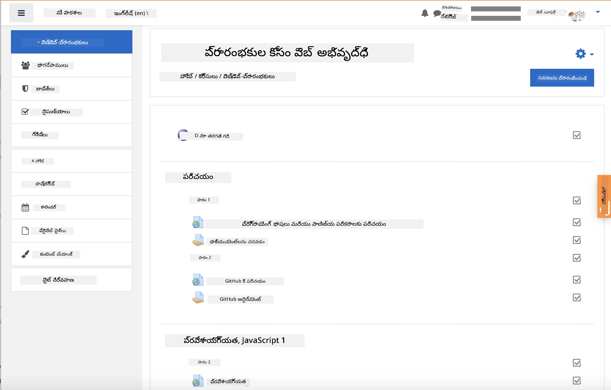
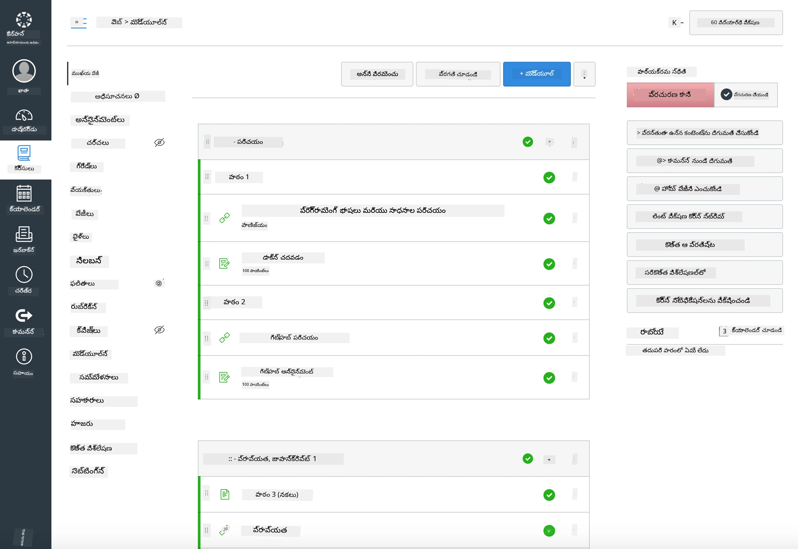

<!--
CO_OP_TRANSLATOR_METADATA:
{
  "original_hash": "71009af209f81cc01a1f2d324200375f",
  "translation_date": "2026-01-08T10:10:49+00:00",
  "source_file": "for-teachers.md",
  "language_code": "te"
}
-->
### ఉపాధ్యాయులకు

మీ తరగతిలో ఈ పాఠ్యపుస్తకాన్ని ఉపయోగించుకోవడానికి మీకు స్వాగతం. ఇది GitHub క్లాస్‌రూమ్ మరియు ప్రముఖ LMS వేదికలతో సజీవంగా పనిచేస్తుంది, అలాగే మీ విద్యార్థులతో విడివిడిగా రీపోగా కూడా ఉపయోగించవచ్చు.

### GitHub క్లాస్‌రూమ్‌తో ఉపయోగించటం

ప్రతి కూటమి కోసం పాఠాలు మరియు రాసాయనాల పరిపాలన చేయడానికి, GitHub క్లాస్‌రూమ్ ప్రతి రాసాయనాన్ని స్వతంత్రంగా జోడించేందుకు ప్రతి పాఠానికి ఒక రీపో సృష్టించండి.

- ఈ రీపోను మీ సంస్థకు ఫోర్క్ చేయండి.
- ప్రతి పాఠం కోసం వేర్వేరు రీపోలు సృష్టించండి, ప్రతి పాఠం ఫోల్డర్‌ను వేరుగా తీయండి.
  - ఎంపిక A: ఖాళీ రీపోలు (ప్రతి పాఠానికి ఒకటి) సృష్టించి, పాఠం ఫోల్డర్ కంటెంట్లను ప్రతిపాదించండి.
  - ఎంపిక B: మూలాలను నిలుపుకునే గిట్ చరిత్ర పద్ధతిని ఉపయోగించండి (ఉదా: ఫోల్డర్‌ను కొత్త రీపోగా విడగొట్టి) అవసరం అయితే.
- GitHub క్లాస్‌రూమ్‌లో, ప్రతి పాఠానికి ఒక రాసాయనం సృష్టించి, సంబంధిత పాఠం రీపోకు సూచించండి.
- సిఫార్సు కాన్ఫిగరేషన్లు:
  - రీపో దృశ్యత: విద్యార్థుల పనికి ప్రైవేట్.
  - పాఠం రీపో యొక్క డిఫాల్ట్ బ్రాంచ్ నుండి స్టార్టర్ కోడ్ ఉపయోగించండి.
  - క్విజ్‌లు మరియు సమర్పణల కోసం ఇష్యూలు మరియు పుల్ రిక్వెస్ట్ టెంప్లేట్లు జోడించండి.
  - మీ పాఠాలు వాటిని కలిగి ఉంటే ఆటోగ్రేడింగ్ మరియు పరీక్షలను ఆప్షనల్‌గా కాన్ఫిగర్ చేయండి.
- సహాయక కాంప్రోసెన్లు:
  - రీపో పేర్లు lesson-01-intro, lesson-02-html వంటి.
  - లేబల్స్: quiz, assignment, needs-review, late, resubmission.
  - ట్యాగ్లు/రివిజన్లు ప్రతి కూటమికి (ఉదా: v2025-term1).

సూచన: గిట్ ఘర్షణలు (Git conflicts) నివారించటానికి సింక్‌ అయ్యే ఫోల్డర్‌లలో (ఉదా: OneDrive/Google Drive) రీపోలు నిల్వ చేయకుండా ఉండండి.

### Moodle, Canvas లేదా Blackboard తో ఉపయోగించటం

ఈ పాఠ్యపుస్తకం సాధారణ LMS వర్క్ఫ్లోలకు దిగుమతి చేసుకునే ప్యాకేజీలను కలిగి ఉంది.

- Moodle: పూర్తి కోర్సును లోడ్ చేయడానికి Moodle అప్‌లోడ్ ఫైల్ [Moodle upload file](../../../../../../../teaching-files/webdev-moodle.mbz) ఉపయోగించండి.
- కామన్ కార్ట్రిడ్జ్: విస్తృత LMS అనుకూళత కోసం కామన్ కార్ట్రిడ్జ్ ఫైల్ [Common Cartridge file](../../../../../../../teaching-files/webdev-common-cartridge.imscc) ఉపయోగించండి.
- గమనికలు:
  - Moodle క్లౌడ్‌కు పరిమిత కామన్ కార్ట్రిడ్జ్ మద్దతు ఉంటుంది. పై Moodle ఫైల్ ప్రాధాన్యత ఇవ్వండి, అదే ఫైల్ Canvas లో కూడా అప్‌లోడ్ చేయవచ్చు.
  - దిగుమతి చేశాక, మీ కాలప్రమాణానికి అనుగుణంగా మాడ్యూల్స్, సమయాలు మరియు క్విజ్ సిద్ధతలను పునర్ సమీక్షించండి.

> Moodle క్లాస్‌రూమ్‌లో పాఠ్యపుస్తకం

> Canvas లోని పాఠ్యపుస్తకం

### రీపోను నేరుగా ఉపయోగించు (క్లాస్‌రూమ్ లేదు)

GitHub క్లాస్‌రూమ్ ఉపయోగించటం ఇష్టాలు లేకపోతే, మీరు ఈ రీపో నుండి నేరుగా కోర్సును నడిపించవచ్చు.

- సమకాలిన/ఆన్‌లైన్ ఫార్మాట్లు (Zoom/Teams):
  - చిన్న మేంటార్-నడిపిన వార్మ్‌అప్స్ నిర్వహించండి; క్విజ్‌ల కోసం బ్రేక్‌ఔట్ రూమ్స్ ఉపయోగించండి.
  - క్విజ్‌లకు సమయుబద్ధమైన తెరువు ప్రకటించండి; విద్యార్థులు జవాబులను GitHub Issues ద్వారా సమర్పిస్తారు.
  - సహకారి రాసాయనాలకు, విద్యార్థులు పబ్లిక్ పాఠం రీపోల్లో పనిచేసి పుల్ రిక్వెస్ట్‌లు ఓపెన్ చేస్తారు.
- ప్రైవేట్/అసంకలిత ఫార్మాట్లు:
  - విద్యార్థులు ప్రతి పాఠం తమ സ്വന്തം **ప్రైవేట్** రీపోలుగా ఫోర్క్ చేసి, మిమ్మల్ని సహకారిగా జోడిస్తారు.
  - వారు మీ క్లాస్‌రూమ్ రీపో లేదా వారి ప్రైవేట్ ఫోర్‌క్లల్లో ఇష్యూలు (క్విజ్‌లు) మరియు పుల్ రిక్వెస్ట్‌లు (రాసాయనాలు) ద్వారా సమర్పిస్తారు.

### ఉత్తమ అచరణలు

- Git/GitHub ప్రాథమికాలు, ఇష్యూలు మరియు PRలపై ఒక పరిచయ పాఠం ఇవ్వండి.
- బహుస్థాయి క్విజ్‌లు/రాసాయనాల కోసం ఇష్యూల్లో చెక్‌లిస్టులు ఉపయోగించండి.
- తరగతి నియమాలు స్థాపించేందుకు CONTRIBUTING.md మరియు CODE_OF_CONDUCT.md జోడించండి.
- అక్సెసిబిలిటీ గమనికలు (alt టెక్స్ట్, క్యాప్షన్లు) జోడించండి మరియు ముద్రించగల PDFలు అందించండి.
- మీ కంటెంట్‌ను ప్రతి కాలప్రమాణం కోసం వర్షన్ చేయండి మరియు ప్రచురణ తర్వాత పాఠం రీపోలను స్థిరంగా ఉంచండి.

### అభిప్రాయం మరియు మద్దతు

మేము ఈ పాఠ్యపుస్తకాన్ని మీకు మరియు మీ విద్యార్థులకు ఉపయోగకరంగా ఉండాలని కోరుకుంటున్నాము. బగ్స్, అభ్యర్థనలు లేదా మెరుగుదలలకు ఈ రీపోలో కొత్త ఇష్యూ ఓపెన్ చేయండి, లేదా టీచర్ కార్నర్‌లో చర్చ మొదలెట్టండి.

---

<!-- CO-OP TRANSLATOR DISCLAIMER START -->
**డిస్క్లేమర్**:  
ఈ డాక్యుమెంట్‌ను AI అనువాద సేవ [Co-op Translator](https://github.com/Azure/co-op-translator) ఉపయోగించి అనువదించబడింది. మనం ఖచ్చితత్వానికి ప్రయత్నిస్తుండగా, స్వయంచాలిత అనువాదాల్లో తప్పులు లేదా అసత్యతలు ఉండవచ్చని గమనించండి. అసలు డాక్యుమెంట్ దాని స్వదేశీ భాషలోనే అధికారిక మూలంగా పరిగణించాలి. ముఖ్యమైన సమాచారంకోసం, ప్రొఫెషనల్ మానవ అనువాదం సిఫార్సు చేయబడుతుంది. ఈ అనువాదం వల్ల రాబోయే ఏవైనా అపార్థాలు లేదా తప్పు అర్థం చేసుకోవడాలకు మేము బాధ్యులు కాదు.
<!-- CO-OP TRANSLATOR DISCLAIMER END -->