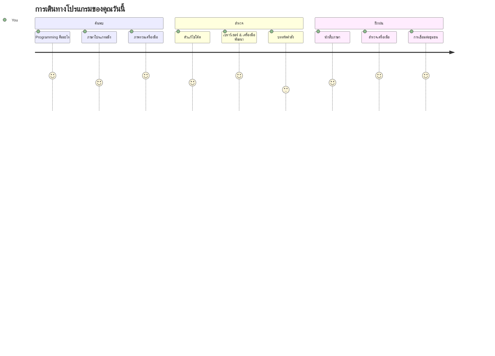
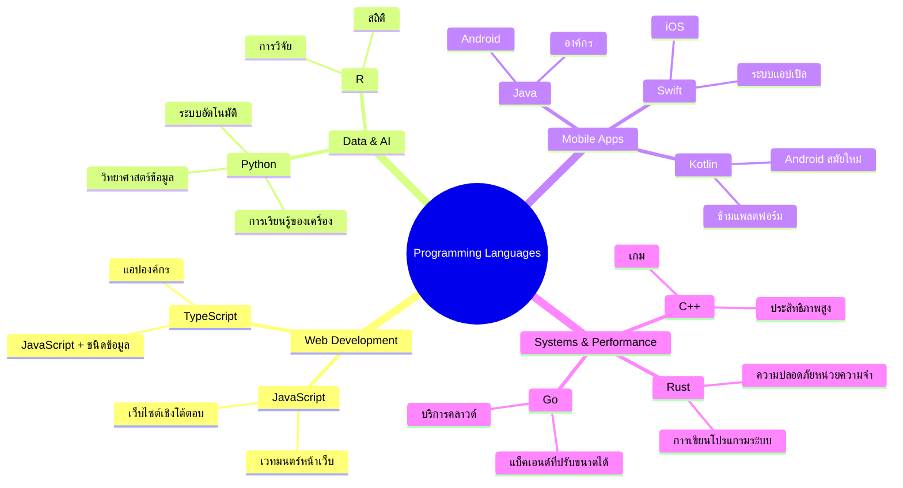
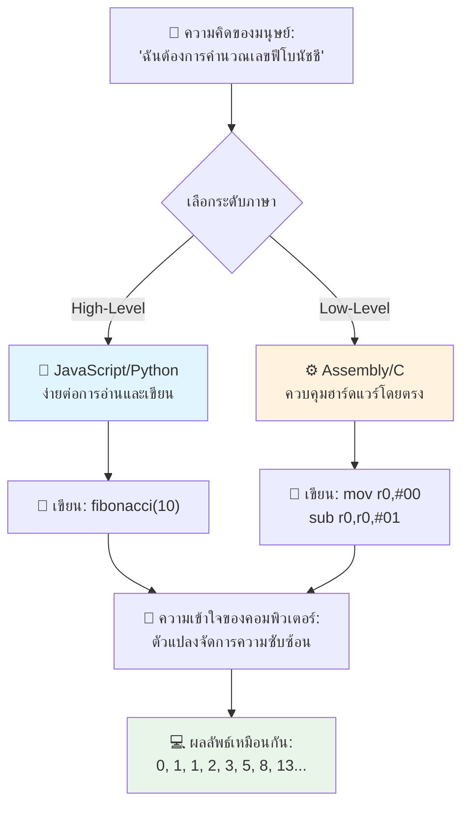
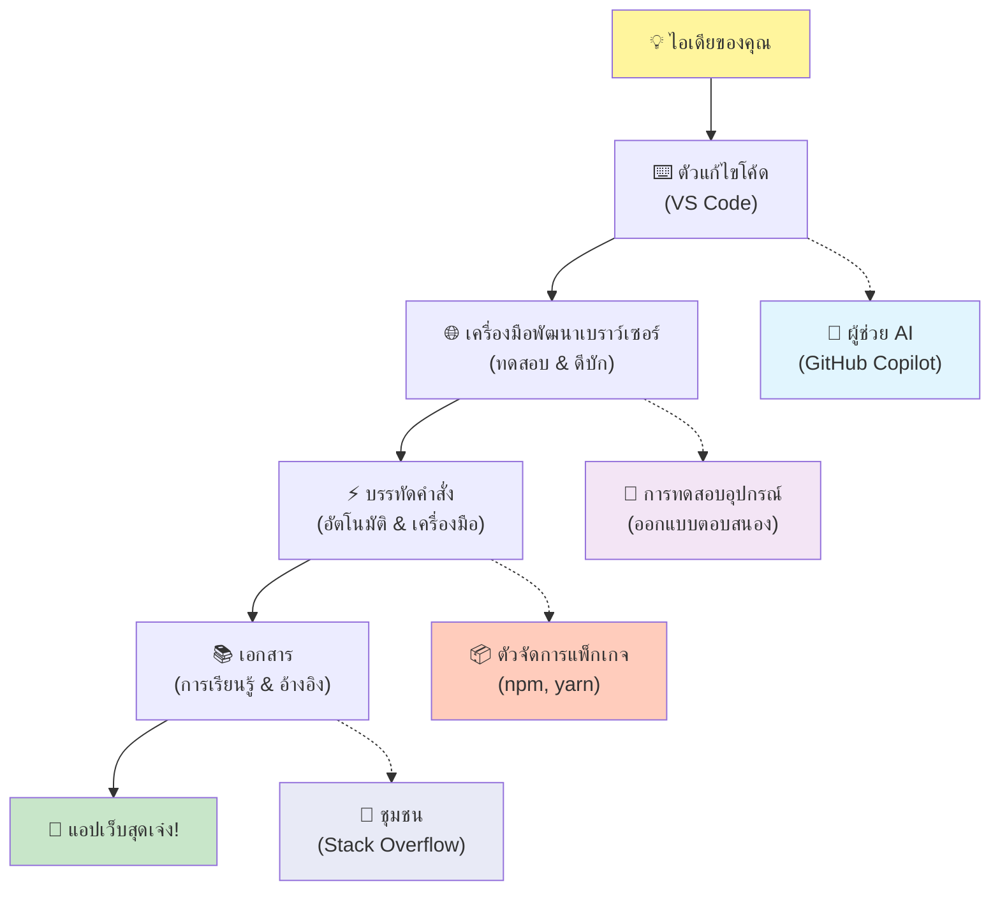
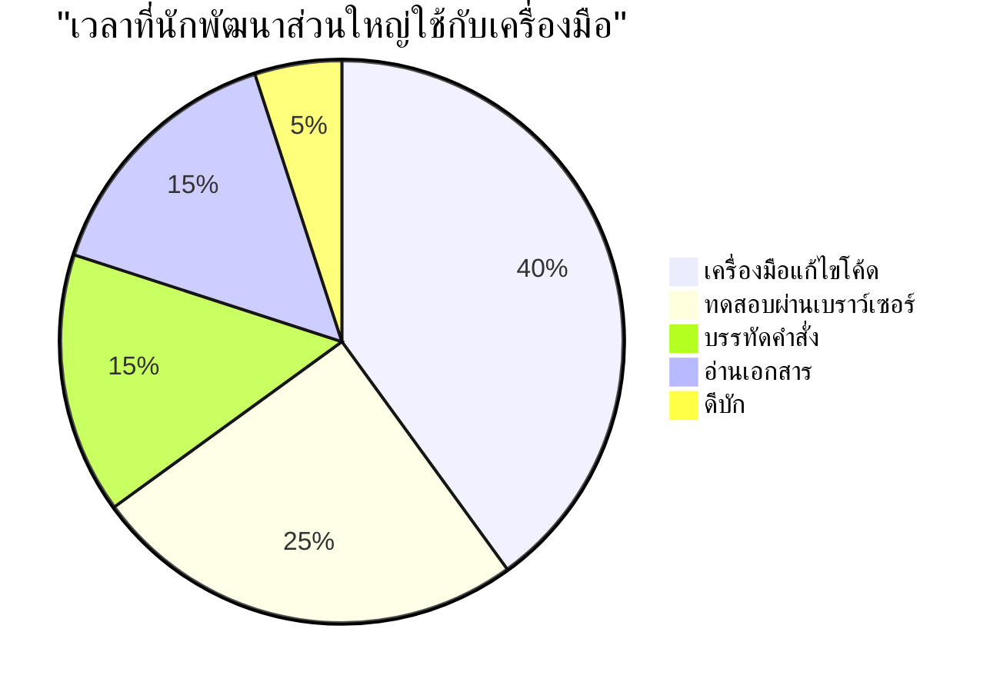
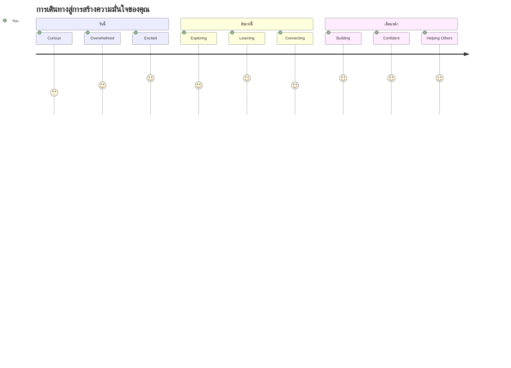

<!--
CO_OP_TRANSLATOR_METADATA:
{
  "original_hash": "d45ddcc54eb9232a76d08328b09d792e",
  "translation_date": "2026-01-06T22:22:09+00:00",
  "source_file": "1-getting-started-lessons/1-intro-to-programming-languages/README.md",
  "language_code": "th"
}
-->
# แนะนำเกี่ยวกับภาษาโปรแกรมมิ่งและเครื่องมือสำหรับนักพัฒนาสมัยใหม่

สวัสดีครับ นักพัฒนาในอนาคต! 👋 ขอเล่าอะไรที่ยังทำให้ผมตื่นเต้นทุกวันได้ไหม? คุณกำลังจะค้นพบว่าโปรแกรมมิ่งไม่ใช่แค่เรื่องของคอมพิวเตอร์ – แต่มันคือการมีพลังพิเศษจริงๆ ที่จะทำให้ไอเดียที่บ้าคลั่งของคุณกลายเป็นจริง!

คุณรู้ไหมว่าตอนที่คุณใช้แอปโปรดของคุณและทุกอย่างเกิดขึ้นได้อย่างสมบูรณ์แบบไหม? ตอนที่คุณแตะปุ่มหนึ่งและมีอะไรบางอย่างวิเศษเกิดขึ้นจนคุณต้องร้องว่า "ว้าว พวกเขาทำแบบนี้ได้ยังไง?" คนๆ นั้นเหมือนคุณเลย – อาจนั่งอยู่ในร้านกาแฟโปรดตอนตีสองกับเอสเปรสโซ่แก้วที่สาม – คนๆ นี้เขียนโค้ดที่สร้างความมหัศจรรย์นั้นขึ้นมา และนี่คือสิ่งที่จะทำให้คุณทึ่ง: เมื่อจบบทเรียนนี้ คุณจะไม่เพียงเข้าใจว่าพวกเขาทำแบบนั้นได้อย่างไร แต่คุณยังอยากจะลองเขียนเองด้วย!

ฟังนะ ผมเข้าใจดีถ้าว่าการเขียนโปรแกรมตอนนี้ดูน่าสยอง ตอนที่ผมเริ่มแรกจริงๆ ผมคิดว่าต้องเป็นอัจฉริยะด้านคณิตศาสตร์หรือเขียนโค้ดมาตั้งแต่ 5 ขวบ แต่สิ่งที่เปลี่ยนความคิดผมไปโดยสิ้นเชิงก็คือ: การเขียนโปรแกรมเหมือนกับการเรียนรู้การสนทนาในภาษาหนึ่งใหม่ คุณเริ่มจาก "สวัสดี" และ "ขอบคุณ" จากนั้นไปสั่งกาแฟ แล้วก่อนที่คุณจะรู้ตัว คุณก็มีการสนทนาลึกซึ้งทางปรัชญา! ต่างกันคือ ในกรณีนี้ คุณกำลังสนทนากับคอมพิวเตอร์ และจริงๆ นะ? พวกเขาเป็นคู่สนทนาที่อดทนที่สุด – ไม่เคยตัดสินข้อผิดพลาดของคุณ และพร้อมจะลองใหม่เสมอ!

วันนี้ เราจะสำรวจเครื่องมือสุดเจ๋งที่จะทำให้การพัฒนาเว็บสมัยใหม่ไม่เพียงเป็นไปได้ แต่ยังน่าติดใจอย่างจริงจัง ผมกำลังพูดถึงตัวแก้ไขโค้ด, เบราว์เซอร์, และเวิร์กโฟลว์เดียวกับที่นักพัฒนาของ Netflix, Spotify, และสตูดิโอแอปอินดี้ที่คุณชอบใช้ทุกวัน และนี่แหละสิ่งที่จะทำให้คุณพลิ้วไหวดีใจ: เครื่องมือระดับมืออาชีพเหล่านี้ส่วนใหญ่ใช้ฟรีทั้งหมด!


> สเก็ตช์โน้ตโดย [Tomomi Imura](https://twitter.com/girlie_mac)


## มาลองดูสิว่าคุณรู้อะไรบ้างแล้ว!

ก่อนที่เราจะเริ่มสนุกกัน ผมอยากรู้ – คุณรู้อะไรเกี่ยวกับโลกโปรแกรมมิ่งนี้แล้วบ้าง? และฟังนะ ถ้าคุณกำลังมองคำถามพวกนี้แล้วคิดว่า "ผมไม่รู้อะไรเลยเกี่ยวกับเรื่องนี้" ก็ไม่เป็นไรเลย นั่นแหละคือสิ่งที่สมบูรณ์แบบ! นั่นหมายความว่าคุณอยู่ในที่ที่ถูกต้องแล้ว คิดแบบทดสอบนี้เหมือนการยืดเส้นก่อนออกกำลังกาย – เรากำลังอุ่นเครื่องกล้ามเนื้อสมอง!

[ทำแบบทดสอบก่อนเรียน](https://forms.office.com/r/dru4TE0U9n?origin=lprLink)


## การผจญภัยที่เรากำลังจะไปด้วยกัน

โอเค ผมตื่นเต้นจริงๆ กับสิ่งที่เราจะสำรวจวันนี้! จริงๆ ผมอยากเห็นหน้าคุณตอนที่บางแนวคิดเคลื่อนไปด้วยกัน นี่คือการเดินทางที่น่าทึ่งที่เราจะร่วมกัน:

- **โปรแกรมมิ่งคืออะไรจริงๆ (และทำไมมันถึงเจ๋งที่สุด!)** – เราจะค้นพบว่าโค้ดคือเวทมนตร์ที่มองไม่เห็นซึ่งขับเคลื่อนทุกอย่างรอบตัวคุณ ตั้งแต่สัญญาณปลุกที่รู้ว่าคือเช้าวันจันทร์ไปจนถึงอัลกอริธึมที่คัดเลือกคำแนะนำ Netflix ได้อย่างแม่นยำ
- **ภาษาโปรแกรมมิ่งและบุคลิกที่น่าทึ่งของพวกมัน** – ลองจินตนาการเข้าไปในงานปาร์ตี้ที่แต่ละคนมีพลังวิเศษและวิธีการแก้ปัญหาที่แตกต่างกันสิ้นเชิง นั่นแหละโลกของภาษาโปรแกรมมิ่ง และคุณจะชอบที่จะได้รู้จักพวกเขา!
- **บล็อกสร้างพื้นฐานที่ทำให้เวทมนตร์ดิจิทัลเกิดขึ้น** – คิดซะว่านี่คือชุด LEGO สร้างสรรค์ขั้นสุดยอด เมื่อคุณเข้าใจว่าส่วนประกอบเหล่านี้รวมกันอย่างไร คุณจะรู้ว่าคุณสามารถสร้างอะไรก็ได้ตามจินตนาการของคุณ
- **เครื่องมือระดับมืออาชีพที่จะทำให้คุณรู้สึกเหมือนได้วางไม้เท้าวิเศษในมือ** – ผมไม่ได้พูดเกินจริง – เครื่องมือเหล่านี้จะทำให้คุณรู้สึกว่าคุณมีพลังพิเศษจริงๆ และส่วนที่เจ๋งที่สุด? พวกมันคือเครื่องมือเดียวกับที่มืออาชีพใช้!

> 💡 **นี่นะ**: ไม่ต้องพยายามจำทุกอย่างในวันนี้! ตอนนี้แค่อยากให้คุณรู้สึกถึงประกายความตื่นเต้นในสิ่งที่เป็นไปได้ รายละเอียดจะติดตัวเองอย่างเป็นธรรมชาติเมื่อเราฝึกไปด้วยกัน – นั่นแหละการเรียนรู้ที่แท้จริง!

> คุณสามารถเรียนบทเรียนนี้ได้ที่ [Microsoft Learn](https://docs.microsoft.com/learn/modules/web-development-101/introduction-programming/?WT.mc_id=academic-77807-sagibbon)!

## แล้วโปรแกรมมิ่งคือ *อะไร* กันแน่?

โอเค มาตอบคำถามที่มีมูลค่าล้านดอลลาร์: โปรแกรมมิ่งคืออะไรจริงๆ?

ผมจะเล่าเรื่องที่เปลี่ยนมุมมองในตัวผมสุดๆ อาทิตย์ที่แล้ว ผมพยายามอธิบายให้แม่ผมใช้รีโมตทีวีสมาร์ทตัวใหม่ เราก็ตลกตัวเองเวลาที่พูดว่า "กดปุ่มแดงนะ แต่ไม่ใช่ปุ่มแดงใหญ่ เป็นปุ่มแดงเล็กด้านซ้าย...ไม่ใช่ซ้ายนี้... โอเค ตอนนี้กดค้างสองวินาที ไม่ใช่หนึ่ง, ไม่ใช่สาม..." คุ้นๆ ไหม? 😅

นั่นแหละโปรแกรมมิ่ง! ศิลปะแห่งการให้คำสั่งอย่างละเอียดทีละขั้นตอนกับสิ่งที่ทรงพลังแต่ต้องการให้บอกแบบชัดเจนเป๊ะๆ ต่างจากอธิบายให้แม่ฟัง (ที่แม่ถามว่า "ปุ่มแดงไหน?") คุณกำลังอธิบายให้คอมพิวเตอร์ซึ่งทำตามที่คุณบอกพอดีเป๊ะ แม้ว่าคุณจะไม่ได้ตั้งใจแบบนั้นก็ตาม

นี่คือสิ่งที่ทำให้ผมทึ่งในตอนเรียนแรก: คอมพิวเตอร์จริงๆ แล้วง่ายมากในระดับแก่น แค่เข้าใจสองอย่างคือ 1 และ 0 นั่นคือ “ใช่” กับ “ไม่ใช่” หรือ “เปิด” กับ “ปิด” เท่านั้น! แต่สิ่งที่น่าสนใจคือ – เราไม่จำเป็นต้องพูดด้วย 1 กับ 0 แบบใน The Matrix นั่นแหละที่ภาษาโปรแกรมมิ่งเข้ามาช่วย พวกมันเหมือนนักแปลที่ดีที่สุดในโลกที่แปลงความคิดคนเป็นภาษาคอมพิวเตอร์

และนี่คือสิ่งที่ยังทำให้ผมตื่นเต้นทุกเช้าที่ตื่นขึ้นมา: ทุกสิ่งที่เป็นดิจิทัลในชีวิตคุณเริ่มต้นจากใครสักคนแบบคุณ อาจนั่งอยู่ในชุดนอนพร้อมกาแฟในมือ กำลังพิมพ์โค้ดบนโน้ตบุ๊ก ตัวกรอง Instagram ที่ทำให้คุณดูไร้ที่ติเหรอ? คนเขียนโค้ดมัน อัลกอริธึมแนะนำเพลงโปรดใหม่ของคุณเหรอ? นักพัฒนาสร้างมัน แอปที่ให้คุณหารบิลอาหารค่ำกับเพื่อนๆ ใช่เลย ใครสักคนคิดว่า "นี่มันน่ารำคาญ ฉันคงแก้ได้" แล้วก็ทำมันสำเร็จ!

เมื่อคุณเรียนรู้โปรแกรมมิ่ง คุณไม่ได้แค่เพิ่มทักษะใหม่ – คุณกำลังเป็นส่วนหนึ่งของชุมชนแก้ปัญหาที่ใช้เวลาคิดว่า "ถ้าฉันสร้างอะไรบางอย่างที่ทำให้วันของใครบางคนดีขึ้นนิดหน่อยได้ล่ะ?" จริงๆ มีอะไรเจ๋งกว่านี้ไหม?

✅ **ล่าสมบัติข้อเท็จจริงสนุก**: มีเรื่องน่าสนใจให้ค้นหาตอนที่มีเวลาว่าง – ใครคือโปรแกรมเมอร์คนแรกของโลก? ผมบอกใบ้ให้: อาจไม่ใช่คนที่คุณคาดหวัง! เรื่องราวของคนนี้น่าทึ่งมาก และแสดงให้เห็นว่าโปรแกรมมิ่งคือการแก้ปัญหาอย่างสร้างสรรค์และคิดนอกกรอบเสมอมา

### 🧠 **เวลาตรวจสอบ: คุณรู้สึกอย่างไร?**

**พักคิดสักครู่:**
- ไอเดียเรื่อง “การสั่งการคอมพิวเตอร์” เข้าใจไหมตอนนี้?
- คิดถึงงานประจำวันที่อยากจะเขียนโปรแกรมช่วยให้ทำอัตโนมัติได้ไหม?
- มีคำถามอะไรลอยขึ้นมาในหัวบ้างเกี่ยวกับเรื่องโปรแกรมมิ่งนี้?

> **จำไว้**: ปกติมากถ้าบางแนวคิดยังดูงงตอนนี้ การเรียนโปรแกรมมิ่งเหมือนเรียนภาษาใหม่ – ต้องใช้เวลาสมองสร้างเส้นทางประสาทใหม่ คุณทำได้ดีมาก!

## ภาษาโปรแกรมมิ่งเหมือนรสชาติของเวทมนตร์ที่แตกต่างกัน

โอเค มันจะฟังดูแปลกๆ แต่ติดตามผมหน่อย – ภาษาโปรแกรมเหมือนดนตรีหลายแบบอย่างมาก ลองนึกถึง: คุณมีแจ๊ส ที่ลื่นไหลและอิมโพรไวส์, ร็อกที่ทรงพลังและตรงไปตรงมา, คลาสสิกที่สง่างามและมีโครงสร้าง, และฮิปฮอปที่สร้างสรรค์และแสดงออก สไตล์แต่ละอย่างมีอารมณ์ของมันเอง ชุมชนแฟน passionate ของมันเอง และเหมาะกับบรรยากาศและโอกาสที่ต่างกัน

ภาษาโปรแกรมเหมือนกันเป๊ะ! คุณคงไม่ใช้ภาษาเดียวกันเขียนเกมมือถือสนุกๆ กับภาษาใช้คำนวณข้อมูลภูมิอากาศมหาศาล เหมือนไม่มีใครเปิดเดธเมทัลในคลาสโยคะ (เอ่อ ส่วนใหญ่นะ! 😄)

แต่สิ่งที่ทำให้ผมทึ่งทุกครั้งที่คิดถึงคือ: ภาษาพวกนี้เหมือนนักแปลที่อดทนและฉลาดที่สุดในโลกนั่งอยู่ข้างๆ คุณ คุณแสดงความคิดในแบบที่สมองคนรับได้ และพวกมันจัดการแปลงให้เป็น 1 กับ 0 ที่คอมพิวเตอร์เข้าใจได้ มันเหมือนมีเพื่อนที่พูดได้คล่องทั้ง “ความคิดสร้างสรรค์ของมนุษย์” กับ “ตรรกะของคอมพิวเตอร์” – และพวกเขาไม่เคยเหนื่อย ไม่ต้องพักกาแฟ และไม่เคยตัดสินคุณถ้าถามคำถามซ้ำ!

### ภาษาโปรแกรมยอดนิยมและการใช้งาน


| Language | เหมาะสำหรับ | ทำไมถึงเป็นที่นิยม |
|----------|--------------|---------------------|
| **JavaScript** | พัฒนาเว็บ, อินเทอร์เฟซผู้ใช้ | รันในเบราว์เซอร์และขับเคลื่อนเว็บไซต์ที่โต้ตอบได้ |
| **Python** | วิทยาศาสตร์ข้อมูล, อัตโนมัติ, ปัญญาประดิษฐ์ | อ่านง่าย เรียนรู้ได้ง่าย มีไลบรารีทรงพลัง |
| **Java** | แอปองค์กร, แอป Android | ข้ามแพลตฟอร์ม แข็งแรงสำหรับระบบขนาดใหญ่ |
| **C#** | แอป Windows, พัฒนาเกม | รองรับดีในระบบนิเวศของ Microsoft |
| **Go** | บริการคลาวด์, ระบบเบื้องหลัง | เร็ว, เรียบง่าย, ออกแบบสำหรับคอมพิวเตอร์สมัยใหม่ |

### ภาษาเลเวลสูงกับเลเวลต่ำ

โอเค นี่คือแนวคิดที่ทำให้ผมปวดหัวตอนเริ่มเรียนใหม่ๆ มาก ดังนั้นผมจะแบ่งปันอุปมาอุปไมยที่ทำให้ผมเข้าใจในที่สุด – และหวังว่าคุณจะช่วยได้ด้วย!

นึกภาพว่าคุณเดินทางไปประเทศที่ไม่พูดภาษาที่นั่น และต้องการหาห้องน้ำอย่างเร่งด่วน (พวกเราผ่านกันมาแล้วใช่ไหม? 😅):

- **โปรแกรมมิ่งเลเวลต่ำ** คือการเรียนภาษาท้องถิ่นดีมากจนคุยกับย่าคนขายผลไม้ตรงหัวมุมได้ ใช้อ้างอิงวัฒนธรรม สแลงท้องถิ่น และมุกภายในที่มีแต่คนโตที่นั่นจะเข้าใจ ประทับใจและมีประสิทธิภาพสูง... ถ้าคุณเป็นผู้คล่องจริงๆ! แต่ก็ค่อนข้างล้นหลามเมื่อต้องแค่หาห้องน้ำ

- **โปรแกรมมิ่งเลเวลสูง** เหมือนมีเพื่อนท้องถิ่นเจ๋งๆ ที่เข้าใจคุณ คุณพูดเป็นภาษาอังกฤษง่ายๆ ว่า "ฉันอยากห้องน้ำ" แล้วเขาจัดการแปลวัฒนธรรมและบอกทางที่สมองคุณรับได้ง่าย

ในโลกโปรแกรม:
- **ภาษาระดับต่ำ** (เช่น Assembly หรือ C) ให้คุณสนทนาอย่างละเอียดกับฮาร์ดแวร์คอมพิวเตอร์จริงๆ แต่คุณต้องคิดแบบเครื่องจักร ซึ่ง... บอกเลยว่าต้องใช้ความคิดเปลี่ยนโหมดใหญ่!
- **ภาษาระดับสูง** (เช่น JavaScript, Python, หรือ C#) ให้คุณคิดแบบมนุษย์ขณะที่พวกมันจัดการภาษาเครื่องเบื้องหลัง อีกทั้งมีชุมชนที่ต้อนรับอบอุ่นเต็มไปด้วยคนที่จำได้ว่าการเป็นมือใหม่เป็นอย่างไรและต้องการช่วยจริงใจ!

เดาว่าภาษาที่ผมจะแนะนำให้คุณเริ่มใช้คืออะไร? 😉 ภาษาระดับสูงเหมือนมีล้อฝึกขี่จักรยานที่คุณแทบไม่อยากถอดออกเลยเพราะมันทำให้ประสบการณ์มันลื่นไหลและสนุกขึ้นมาก!


### ให้ผมแสดงให้คุณเห็นว่าทำไมภาษาระดับสูงถึงเป็นมิตรกับคุณมากกว่า

โอเค ผมจะโชว์สิ่งนึงที่แสดงให้เห็นชัดว่าทำไมผมถึงรักภาษาระดับสูง แต่ก่อนอื่น – ขอให้คุณสัญญาหน่อยเวลาที่เห็นตัวอย่างโค้ดแรกนี้ อย่าตกใจ! มันต้องดูน่ากลัว นั่นแหละคือจุดที่ผมต้องการ!

เราจะดูงานเดียวกันผ่านสองสไตล์ที่แตกต่างกันโดยสิ้นเชิง ทั้งคู่สร้างเรียงลำดับฟีโบนัชชี – รูปแบบคณิตศาสตร์สวยงามที่เลขแต่ละตัวคือผลรวมของเลขสองตัวก่อนหน้า: 0, 1, 1, 2, 3, 5, 8, 13... (ข้อเท็จจริงสนุก: คุณจะพบรูปแบบนี้ในธรรมชาติทุกที่ – จากเกลียวเมล็ดดอกทานตะวัน ลวดลายเมล็ดสน ไปจนถึงการก่อตัวของกาแล็กซี่!)

พร้อมดูความแตกต่างแล้ว? ไปกันเลย!

**ภาษาระดับสูง (JavaScript) – เป็นมิตรกับมนุษย์:**

```javascript
// ขั้นตอนที่ 1: การตั้งค่า Fibonacci เบื้องต้น
const fibonacciCount = 10;
let current = 0;
let next = 1;

console.log('Fibonacci sequence:');
```

**โค้ดนี้ทำอะไร:**
- **ประกาศ** ค่าคงที่เพื่อกำหนดจำนวนเลขฟีโบนัชชีที่ต้องการสร้าง
- **เริ่มต้น** ตัวแปรสองตัวเพื่อติดตามเลขปัจจุบันและเลขถัดไปในลำดับ
- **ตั้งค่า** ค่าต้นแบบ (0 กับ 1) สำหรับโครงสร้างฟีโบนัชชี
- **แสดง** ข้อความหัวเรื่องเพื่อบอกผลลัพธ์ของเรา

```javascript
// ขั้นตอนที่ 2: สร้างลำดับด้วยการวนรอบ
for (let i = 0; i < fibonacciCount; i++) {
  console.log(`Position ${i + 1}: ${current}`);
  
  // คำนวณตัวเลขถัดไปในลำดับ
  const sum = current + next;
  current = next;
  next = sum;
}
```

**อธิบายสิ่งที่เกิดขึ้น:**
- **วนลูป** ผ่านตำแหน่งแต่ละตัวในลำดับโดยใช้ `for` loop
- **แสดง** เลขแต่ละตัวพร้อมตำแหน่งโดยใช้รูปแบบข้อความแม่แบบ
- **คำนวณ** เลขฟีโบนัชชีถัดไปโดยบวกเลขปัจจุบันและถัดไป
- **อัปเดต** ตัวแปรติดตามเพื่อขยับไปลูปถัดไป

```javascript
// ขั้นตอนที่ 3: วิธีการเชิงฟังก์ชันสมัยใหม่
const generateFibonacci = (count) => {
  const sequence = [0, 1];
  
  for (let i = 2; i < count; i++) {
    sequence[i] = sequence[i - 1] + sequence[i - 2];
  }
  
  return sequence;
};

// ตัวอย่างการใช้งาน
const fibSequence = generateFibonacci(10);
console.log(fibSequence);
```

**ในข้างบน เราได้:**
- **สร้าง** ฟังก์ชันที่ใช้ซ้ำได้โดยใช้ไวยากรณ์ arrow function แบบสมัยใหม่
- **สร้าง** อาร์เรย์เพื่อเก็บลำดับทั้งหมดแทนการแสดงทีละตัว
- **ใช้** ดัชนีอาร์เรย์คำนวณแต่ละตัวใหม่จากค่าก่อนหน้า
- **คืนค่า** ลำดับทั้งหมดเพื่อนำไปใช้ในส่วนอื่นของโปรแกรมได้อย่างยืดหยุ่น

**ภาษาระดับต่ำ (ARM Assembly) – เป็นมิตรกับคอมพิวเตอร์:**

```assembly
 area ascen,code,readonly
 entry
 code32
 adr r0,thumb+1
 bx r0
 code16
thumb
 mov r0,#00
 sub r0,r0,#01
 mov r1,#01
 mov r4,#10
 ldr r2,=0x40000000
back add r0,r1
 str r0,[r2]
 add r2,#04
 mov r3,r0
 mov r0,r1
 mov r1,r3
 sub r4,#01
 cmp r4,#00
 bne back
 end
```

สังเกตว่ารุ่น JavaScript อ่านเหมือนคำสั่งภาษาอังกฤษ ในขณะที่รุ่น Assembly ใช้คำสั่งลึกลับที่ควบคุมตัวประมวลผลโดยตรง ทั้งสองทำงานเดียวกัน แต่วิธีที่ภาษาระดับสูงทำให้คนเข้าใจ เขียน และดูแลได้ง่ายกว่ามาก

**ความแตกต่างหลักที่คุณจะเห็น:**
- **ความอ่านง่าย**: JavaScript ใช้ชื่อตัวแปรบอกความหมายเช่น `fibonacciCount` ในขณะที่ Assembly ใช้ป้ายชื่อที่ดูลึกลับเช่น `r0`, `r1`
- **คอมเมนต์**: ภาษาระดับสูงสนับสนุนการเขียนคอมเมนต์อธิบายเพื่อทำให้โค้ดสามารถอธิบายตัวเองได้  
- **โครงสร้าง**: ลำดับตรรกะของ JavaScript สอดคล้องกับวิธีที่คนคิดแก้ปัญหาเป็นขั้นตอน  
- **การบำรุงรักษา**: การปรับเวอร์ชัน JavaScript ให้เหมาะกับความต้องการที่แตกต่างเป็นเรื่องง่ายและชัดเจน  

✅ **เกี่ยวกับลำดับฟีโบนัชชี**: รูปแบบตัวเลขที่สวยงามสุดยอดนี้ (ที่ตัวเลขแต่ละตัวเท่ากับผลบวกของสองตัวก่อนหน้า: 0, 1, 1, 2, 3, 5, 8...) ปรากฏแทบจะ *ทุกที่* ในธรรมชาติเลย! คุณจะพบในเกลียวของดอกทานตะวัน รูปแบบของต้นสน วิธีเปลือกหอยนอติลุสโค้งงอ และแม้แต่การแตกกิ่งของต้นไม้ มันน่าทึ่งมากที่คณิตศาสตร์และโค้ดช่วยให้เราเข้าใจและสร้า่งซ้ำแบบรูปแบบที่ธรรมชาติเกิดความสวยงามขึ้น!  

## บล็อกพื้นฐานที่สร้างความมหัศจรรย์

เอาล่ะ ทีนี้คุณได้เห็นว่าภาษาการเขียนโปรแกรมออกมาเป็นอย่างไรแล้ว มาแยกส่วนประกอบพื้นฐานที่เป็นส่วนประกอบของทุกโปรแกรมที่เคยเขียนกัน ดั่งส่วนผสมสำคัญในสูตรโปรดของคุณ — เมื่อคุณเข้าใจแต่ละส่วนแล้ว คุณจะอ่านและเขียนโค้ดได้แทบทุกภาษาเลย!  

นี่ก็เหมือนการเรียนรู้ไวยากรณ์ของการเขียนโปรแกรม จำตอนที่คุณเรียนเกี่ยวกับคำนาม กริยา และการสร้างประโยคได้ไหม? การเขียนโปรแกรมก็มีไวยากรณ์ของมันเอง และพูดตามตรง มันมีตรรกะมากกว่าและให้อภัยกว่าการไวยากรณ์ภาษาอังกฤษมาก! 😄  

### คำสั่ง: คำแนะนำแบบทีละขั้นตอน

มาเริ่มที่ **คำสั่ง** — เหล่านี้เหมือนประโยคแยกในบทสนทนากับคอมพิวเตอร์ของคุณ คำสั่งแต่ละอันบอกคอมพิวเตอร์ให้ทำสิ่งใดสิ่งหนึ่งเฉพาะ เหมือนให้คำแนะนำ: "เลี้ยวซ้ายตรงนี้," "หยุดที่ไฟแดง," "จอดรถตรงนั้น"  

สิ่งที่ผมชอบเกี่ยวกับคำสั่งคือความอ่านง่าย ลองดูนี่:  

```javascript
// คำสั่งพื้นฐานที่ทำการกระทำเดียว
const userName = "Alex";                    
console.log("Hello, world!");              
const sum = 5 + 3;                         
```
  
**โค้ดนี้ทำอะไร:**  
- **ประกาศ** ตัวแปรคงที่เพื่อเก็บชื่อผู้ใช้  
- **แสดง** ข้อความทักทายออกไปยังคอนโซล  
- **คำนวณ** และเก็บผลลัพธ์ของการคำนวณทางคณิตศาสตร์  

```javascript
// คำสั่งที่โต้ตอบกับหน้าเว็บ
document.title = "My Awesome Website";      
document.body.style.backgroundColor = "lightblue";
```
  
**ทีละขั้นตอน นี่คือสิ่งที่เกิดขึ้น:**  
- **แก้ไข** ชื่อเว็บเพจที่แสดงในแท็บเบราว์เซอร์  
- **เปลี่ยน** สีพื้นหลังของส่วนเนื้อหาทั้งหมด  

### ตัวแปร: ระบบความจำของโปรแกรมคุณ

โอเค, **ตัวแปร** เป็นหนึ่งในแนวคิดที่ผมชอบสอนมากที่สุดเพราะมันเหมือนกับสิ่งที่คุณใช้ทุกวันจริงๆ!  

ลองคิดถึงสมุดโทรศัพท์ในมือถือคุณชั่วครู่ คุณไม่ได้จดจำหมายเลขทุกคน — แต่บันทึกชื่ออย่าง “แม่,” “เพื่อนสนิท,” หรือ “ร้านพิซซ่าที่ส่งถึงตี 2” และปล่อยให้มือถือจำหมายเลขจริงแทน ตัวแปรก็ทำงานแบบเดียวกัน! เป็นเหมือนภาชนะที่ติดป้ายชื่อซึ่งโปรแกรมของคุณจะเก็บข้อมูลและเรียกใช้ทีหลังด้วยชื่อที่เข้าใจได้  

นี่คือสิ่งที่เจ๋งจริงๆ: ตัวแปรสามารถเปลี่ยนแปลงได้ในขณะที่โปรแกรมทำงาน (เพราะชื่อ “ตัวแปร” นั่นแหละ — เข้าใจเจตนาใช่ไหม?). เหมือนที่คุณอาจอัปเดตรายชื่อร้านพิซซ่าเมื่อตัวเลือกใหม่ที่ดีกว่ามา ตัวแปรก็อัปเดตได้เมื่อโปรแกรมเรียนรู้ข้อมูลใหม่หรือเมื่อสถานการณ์เปลี่ยนแปลง!  

ขอให้ผมแสดงให้ดูว่ามันง่ายแค่ไหน:  

```javascript
// ขั้นตอนที่ 1: การสร้างตัวแปรพื้นฐาน
const siteName = "Weather Dashboard";        
let currentWeather = "sunny";               
let temperature = 75;                       
let isRaining = false;                      
```
  
**เข้าใจแนวคิดเหล่านี้:**  
- **เก็บ** ค่าที่ไม่เปลี่ยนแปลงในตัวแปร `const` (เช่น ชื่อไซต์)  
- **ใช้** `let` สำหรับค่าที่อาจเปลี่ยนแปลงตลอดโปรแกรม  
- **กำหนด** ประเภทข้อมูลต่างๆ: สตริง (ข้อความ), ตัวเลข, และบูลีน (จริง/เท็จ)  
- **เลือก** ชื่อที่บอกอย่างชัดเจนว่าตัวแปรเก็บอะไร  

```javascript
// ขั้นตอนที่ 2: การทำงานกับอ็อบเจ็กต์เพื่อจัดกลุ่มข้อมูลที่เกี่ยวข้องกัน
const weatherData = {                       
  location: "San Francisco",
  humidity: 65,
  windSpeed: 12
};
```
  
**ในตัวอย่างข้างบน เราได้:**  
- **สร้าง** อ็อบเจ็กต์เพื่อรวบรวมข้อมูลเกี่ยวกับสภาพอากาศ  
- **จัดการ** ข้อมูลหลายชิ้นภายใต้ชื่อตัวแปรเดียว  
- **ใช้** คู่คีย์-ค่าเพื่อระบุข้อมูลแต่ละชิ้นอย่างชัดเจน  

```javascript
// ขั้นตอนที่ 3: การใช้และการอัปเดตตัวแปร
console.log(`${siteName}: Today is ${currentWeather} and ${temperature}°F`);
console.log(`Wind speed: ${weatherData.windSpeed} mph`);

// การอัปเดตตัวแปรที่เปลี่ยนแปลงได้
currentWeather = "cloudy";                  
temperature = 68;                          
```
  
**มาทำความเข้าใจแต่ละส่วน:**  
- **แสดง** ข้อมูลโดยใช้เทมเพลตลิเทอรัลด้วย `${}`  
- **เข้าถึง** คุณสมบัติของอ็อบเจ็กต์โดยใช้จุด (`weatherData.windSpeed`)  
- **อัปเดต** ตัวแปรที่ประกาศด้วย `let` เพื่อสะท้อนสภาพที่เปลี่ยนไป  
- **รวม** ตัวแปรหลายตัวเพื่อสร้างข้อความที่มีความหมาย  

```javascript
// ขั้นตอนที่ 4: การแยกโครงสร้างแบบทันสมัยสำหรับโค้ดที่สะอาดขึ้น
const { location, humidity } = weatherData; 
console.log(`${location} humidity: ${humidity}%`);
```
  
**ที่ควรทราบ:**  
- **แยก** คุณสมบัติเฉพาะจากอ็อบเจ็กต์ด้วยการมอบหมายแบบ destructuring  
- **สร้าง** ตัวแปรใหม่โดยอัตโนมัติที่มีชื่อเหมือนกับคีย์ของอ็อบเจ็กต์  
- **ทำให้โค้ดง่ายขึ้น** โดยหลีกเลี่ยงการใช้จุดซ้ำๆ  

### ควบคุมลำดับโปรแกรม: สอนให้โปรแกรมคิด

โอเค นี่แหละคือจุดที่การเขียนโปรแกรมสุดยอดมาก! **การควบคุมลำดับโปรแกรม** คือการสอนโปรแกรมให้ตัดสินใจอย่างชาญฉลาด เหมือนที่คุณทำทุกวันโดยไม่ต้องคิด  

ลองนึกภาพว่าตอนเช้านี้คุณอาจผ่านเหตุการณ์แบบ “ถ้าฝนตกก็จะเอาร่ม ถ้าอากาศหนาวก็ใส่เสื้อแจ็กเก็ต ถ้าฉันสายก็ข้ามอาหารเช้าแล้วซื้อกาแฟระหว่างทาง” สมองคุณติดตามตรรกะ if-then นี้หลายสิบครั้งทุกวัน!  

นี่คือสิ่งที่ทำให้โปรแกรมดูเหมือนฉลาดและมีชีวิต แทนที่จะทำตามสคริปต์น่าเบื่อที่คาดเดาได้ พวกมันสามารถดูเหตุการณ์ ประเมินสิ่งที่เกิดขึ้น และตอบสนองอย่างเหมาะสม เหมือนกับให้โปรแกรมมีสมองที่ปรับตัวและตัดสินใจได้!  

อยากเห็นว่ามันทำงานอย่างไร? ให้ผมแสดง:  

```javascript
// ขั้นตอนที่ 1: ตรรกะเงื่อนไขพื้นฐาน
const userAge = 17;

if (userAge >= 18) {
  console.log("You can vote!");
} else {
  const yearsToWait = 18 - userAge;
  console.log(`You'll be able to vote in ${yearsToWait} year(s).`);
}
```
  
**โค้ดนี้ทำอะไร:**  
- **ตรวจสอบ** วัยของผู้ใช้ว่ามีสิทธิ์เลือกตั้งหรือไม่  
- **รัน** บล็อกโค้ดต่างๆ ตามผลลัพธ์ของเงื่อนไข  
- **คำนวณ** และแสดงเวลาที่เหลือจนกว่าจะมีสิทธิเลือกตั้งหากอายุต่ำกว่า 18  
- **ให้** คำแนะนำที่เหมาะสมในแต่ละสถานการณ์  

```javascript
// ขั้นตอนที่ 2: เงื่อนไขหลายอย่างพร้อมตัวดำเนินการเชิงตรรกะ
const userAge = 17;
const hasPermission = true;

if (userAge >= 18 && hasPermission) {
  console.log("Access granted: You can enter the venue.");
} else if (userAge >= 16) {
  console.log("You need parent permission to enter.");
} else {
  console.log("Sorry, you must be at least 16 years old.");
}
```
  
**อธิบายสิ่งที่เกิดขึ้น:**  
- **รวม** หลายเงื่อนไขด้วยตัวดำเนินการ `&&` (และ)  
- **สร้าง** ลำดับชั้นของเงื่อนไขด้วย `else if` สำหรับหลายสถานการณ์  
- **จัดการ** ทุกกรณีด้วยคำสั่ง `else` สุดท้าย  
- **ให้** คำแนะนำชัดเจนและทำได้จริงสำหรับแต่ละสถานการณ์  

```javascript
// ขั้นตอนที่ 3: เงื่อนไขแบบย่อด้วยตัวดำเนินการแบบเทอร์นารี
const votingStatus = userAge >= 18 ? "Can vote" : "Cannot vote yet";
console.log(`Status: ${votingStatus}`);
```
  
**สิ่งที่ควรจำ:**  
- **ใช้** ตัวดำเนินการ ternary (`? :`) สำหรับเงื่อนไขสองทางง่ายๆ  
- **เขียน** เงื่อนไขก่อน ตามด้วย `?` ผลลัพธ์ถ้าเป็นจริง แล้ว `:` ผลลัพธ์ถ้าเป็นเท็จ  
- **ใช้** รูปแบบนี้เมื่อคุณต้องกำหนดค่าตามเงื่อนไข  

```javascript
// ขั้นตอนที่ 4: การจัดการกรณีเฉพาะหลายกรณี
const dayOfWeek = "Tuesday";

switch (dayOfWeek) {
  case "Monday":
  case "Tuesday":
  case "Wednesday":
  case "Thursday":
  case "Friday":
    console.log("It's a weekday - time to work!");
    break;
  case "Saturday":
  case "Sunday":
    console.log("It's the weekend - time to relax!");
    break;
  default:
    console.log("Invalid day of the week");
}
```
  
**โค้ดนี้ทำสิ่งต่อไปนี้:**  
- **แมตช์** ค่าของตัวแปรกับหลายกรณีพิเศษ  
- **จัดกลุ่ม** กรณีที่คล้ายกัน (วันธรรมดา vs วันสุดสัปดาห์)  
- **รัน** บล็อกโค้ดที่เหมาะสมเมื่อพบแมตช์  
- **รวม** กรณี `default` เพื่อจัดการค่าที่ไม่คาดคิด  
- **ใช้** คำสั่ง `break` เพื่อป้องกันการรันต่อกรณีถัดไป  

> 💡 **ตัวอย่างในชีวิตจริง**: ลองนึกถึงการควบคุมลำดับโปรแกรมเหมือนมี GPS ที่ใจเย็นที่สุดในโลกคอยบอกทาง คุณอาจจะได้ยินว่า "ถ้ารถติดตรงถนนเมน ให้ใช้ทางด่วนแทน ถ้ามีการก่อสร้างกั้นทางด่วน ลองใช้เส้นทางชมวิว" โปรแกรมใช้ตรรกะเงื่อนไขแบบนี้เพื่อตอบสนองอย่างชาญฉลาดในสถานการณ์ต่าง ๆ และให้ประสบการณ์ที่ดีที่สุดแก่ผู้ใช้เสมอ  

### 🎯 **ตรวจสอบแนวคิด: ความชำนาญบล็อกพื้นฐาน**

**มาดูกันว่าคุณเข้าใจพื้นฐานแค่ไหน:**  
- คุณอธิบายความแตกต่างระหว่างตัวแปรและคำสั่งด้วยคำพูดของคุณเองได้ไหม?  
- ลองคิดเหตุการณ์ในชีวิตจริงที่คุณจะใช้การตัดสินใจแบบ if-then (เหมือนตัวอย่างการเลือกตั้งของเรา)  
- มีอะไรหนึ่งอย่างในตรรกะการเขียนโปรแกรมที่ทำให้คุณประหลาดใจไหม?  

**เพิ่มความมั่นใจอย่างรวดเร็ว:**  

✅ **สิ่งที่จะเกิดขึ้นต่อไป**: เราจะสนุกกันอย่างมากกับการเจาะลึกแนวคิดเหล่านี้ในขั้นตอนต่อไป! ตอนนี้ให้โฟกัสที่ความตื่นเต้นกับความเป็นไปได้มหัศจรรย์ที่รอคุณอยู่ ทักษะและเทคนิคเฉพาะจะซึมซับเข้ามาอย่างเป็นธรรมชาติเมื่อเราฝึกด้วยกัน — รับรองว่านี่จะสนุกกว่าที่คุณคิดเยอะ!  

## เครื่องมือในวงการ

เอาล่ะ ตรงนี้แหละที่ผมตื่นเต้นจนทนไม่ไหว! 🚀 เรากำลังจะพูดถึงเครื่องมือสุดเจ๋งที่จะทำให้คุณรู้สึกเหมือนได้กุญแจยานอวกาศดิจิทัลมาในมือ  

คุณรู้ไหมว่ามือครัวมีมีดที่สมดุลอย่างสมบูรณ์แบบที่เหมือนเป็นส่วนต่อขยายของมือเจ้า หรือมือกีต้าร์มีตัวกีต้าร์ที่เหมือนร้องเพลงทันทีที่สัมผัส? นักพัฒนาก็มีเครื่องมือเวอร์ชันเวทมนตร์แบบนี้ของตัวเอง และนี่คือสิ่งที่จะทำให้คุณตะลึง — เครื่องมือส่วนใหญ่เหล่านี้ฟรีทั้งหมด!  

ผมแทบจะกระโดดไปมาไปมาในเก้าอี้เพราะตื่นเต้นที่จะแบ่งปันสิ่งเหล่านี้กับคุณ เพราะมันปฏิวัติวิธีที่เราสร้างซอฟต์แวร์เลย เรากำลังพูดถึงผู้ช่วยเขียนโค้ดที่ใช้ AI ที่ช่วยเขียนโค้ดของคุณได้ (ผมไม่ได้ล้อเล่น!), สภาพแวดล้อมบนคลาวด์ที่คุณสามารถสร้างแอปพลิเคชันทั้งตัวได้จากทุกที่ที่มี Wi-Fi และเครื่องมือดีบักที่ซับซ้อนจนเหมือนมีวิสัยทัศน์เอ็กซ์เรย์สำหรับโปรแกรมของคุณ  

และนี่คือส่วนที่ยังทำให้ผมรู้สึกตื่นเต้น: เหล่านี้ไม่ใช่ “เครื่องมือสำหรับมือใหม่” ที่คุณจะโตเกินไปแล้วต้องทิ้ง เหล่านี้คือเครื่องมือระดับมืออาชีพเดียวกับที่นักพัฒนาที่ Google, Netflix และสตูดิโอแอพอิสระที่คุณชื่นชอบใช้ในขณะนี้ คุณจะรู้สึกเหมือนเป็นโปรฯ ตัวจริงเมื่อใช้พวกมัน!  


### ตัวแก้ไขโค้ดและ IDE: เพื่อนดิจิทัลใหม่ของคุณ  

มาพูดถึงตัวแก้ไขโค้ดกัน — พวกนี้กำลังจะเป็นสถานที่โปรดที่คุณอยากอยู่! ลองคิดว่าเป็นที่ที่คุณหลบภัยส่วนตัวในการเขียนโค้ดที่คุณจะใช้เวลาส่วนใหญ่สร้างสรรค์และปรับแต่งผลงานดิจิทัลของคุณ  

แต่สิ่งที่น่ามหัศจรรย์เกี่ยวกับตัวแก้ไขสมัยใหม่คือ — พวกมันไม่ใช่แค่โปรแกรมแก้ไขข้อความหรูหรา แต่เหมือนมีโค้ชเขียนโค้ดอัจฉริยะและคอยช่วยเหลืออยู่ข้างๆ คุณตลอด 24 ชั่วโมง 7 วัน พวกมันจับคำพิมพ์ผิดก่อนที่คุณจะรู้สึกตัว เสนอแนะแนวทางที่ทำให้คุณดูเก่ง ช่วยคุณเข้าใจโค้ดทุกบรรทัด และบางตัวแม้จะเดาว่าคุณกำลังจะพิมพ์อะไรและเสนอที่จะเติมความคิดของคุณ!  

ผมจำได้เมื่อค้นพบฟีเจอร์เติมโค้ดอัตโนมัติครั้งแรก — รู้สึกเหมือนอยู่ในโลกอนาคต พิมพ์อะไรก็มีตัวแก้ไขบอกว่า “เฮ้ คุณกำลังนึกถึงฟังก์ชันนี้ที่ทำงานแบบที่คุณต้องการหรือเปล่า?” เหมือนมีเพื่อนที่อ่านใจในโค้ด!  

**อะไรทำให้ตัวแก้ไขเหล่านี้น่าทึ่ง?**  

ตัวแก้ไขโค้ดสมัยใหม่มีฟีเจอร์มากมายที่ออกแบบมาเพื่อเพิ่มประสิทธิภาพ:  

| ฟีเจอร์ | ทำอะไร | ทำไมช่วย |  
|---------|---------|----------|  
| **เน้นไวยากรณ์** | ลงสีส่วนต่างๆ ของโค้ด | ทำให้โค้ดอ่านง่ายและหาข้อผิดพลาดได้สะดวก |  
| **เติมโค้ดอัตโนมัติ** | เสนอคำสั่งโค้ดขณะพิมพ์ | เร่งความเร็วการเขียนโค้ดและลดคำผิด |  
| **เครื่องมือดีบัก** | ช่วยหาจุดผิดพลาดและแก้ไข | ประหยัดเวลาหลายชั่วโมงในการตรวจสอบข้อผิดพลาด |  
| **ส่วนเสริม** | เพิ่มฟีเจอร์เฉพาะทาง | ปรับแต่งตัวแก้ไขให้เหมาะกับเทคโนโลยีต่างๆ |  
| **ผู้ช่วย AI** | เสนอโค้ดและคำอธิบาย | เร่งการเรียนรู้และเพิ่มผลผลิต |  

> 🎥 **แหล่งวิดีโอ**: อยากเห็นเครื่องมือเหล่านี้ทำงานใช่ไหม? ดูวิดีโอ [Tools of the Trade](https://youtube.com/watch?v=69WJeXGBdxg) เพื่อภาพรวมที่ครบถ้วน  

#### ตัวแก้ไขแนะนำสำหรับเว็บดีเวลอปเมนต์  

**[Visual Studio Code](https://code.visualstudio.com/?WT.mc_id=academic-77807-sagibbon)** (ฟรี)  
- ได้รับความนิยมสูงสุดในหมู่นักพัฒนาเว็บ  
- มีระบบส่วนเสริมที่ยอดเยี่ยม  
- มีเทอร์มินัลและการรวม Git ในตัว  
- **ส่วนเสริมที่ควรมี**:  
  - [GitHub Copilot](https://marketplace.visualstudio.com/items?itemName=GitHub.copilot) - แนะนำโค้ดด้วย AI  
  - [Live Share](https://marketplace.visualstudio.com/items?itemName=MS-vsliveshare.vsliveshare) - ทำงานร่วมกันแบบเรียลไทม์  
  - [Prettier](https://marketplace.visualstudio.com/items?itemName=esbenp.prettier-vscode) - ฟอร์แมตโค้ดอัตโนมัติ  
  - [Code Spell Checker](https://marketplace.visualstudio.com/items?itemName=streetsidesoftware.code-spell-checker) - ตรวจคำผิดในโค้ด  

**[JetBrains WebStorm](https://www.jetbrains.com/webstorm/)** (เสียเงิน, ฟรีสำหรับนักเรียน)  
- เครื่องมือ debug และทดสอบขั้นสูง  
- เติมโค้ดอัจฉริยะ  
- ระบบควบคุมเวอร์ชันในตัว  

**IDE บนคลาวด์** (ราคาหลากหลาย)  
- [GitHub Codespaces](https://github.com/features/codespaces) - VS Code เต็มรูปแบบในเบราว์เซอร์  
- [Replit](https://replit.com/) - ดีสำหรับเรียนรู้และแชร์โค้ด  
- [StackBlitz](https://stackblitz.com/) - สร้างเว็บแอปเต็มสแตกทันที  

> 💡 **คำแนะนำเริ่มต้น**: เริ่มต้นกับ Visual Studio Code – ฟรี ใช้กันเยอะในวงการ และมีชุมชนขนาดใหญ่ที่สร้างบทเรียนและส่วนเสริมช่วยเหลือ  

### เว็บเบราว์เซอร์: ห้องทดลองนักพัฒนาลับของคุณ  

โอเค เตรียมตัวให้ใจสั่นไปกับเรื่องนี้! คุณรู้อยู่แล้วว่าใช้เบราว์เซอร์เพื่อเลื่อนดูโซเชียลและดูวิดีโอ แต่จริงๆ แล้วมันซ่อนห้องทดลองนักพัฒนาลับที่น่าเหลือเชื่อมานานแล้ว รอให้คุณค้นพบ!  

ทุกครั้งที่คุณคลิกขวาบนหน้าเว็บและเลือก "Inspect Element" คุณกำลังเปิดโลกที่ซ่อนเร้นของเครื่องมือนักพัฒนาซึ่งมีพลังมากกว่าซอฟต์แวร์แพงๆ ที่ผมเคยจ่ายไปหลายร้อยดอลลาร์ มันเหมือนค้นพบว่าครัวธรรมดาของคุณมีห้องทดลองเชฟมืออาชีพซ่อนอยู่หลังแผงลับ!
ครั้งแรกที่ใครสักคนแสดงให้ฉันดู browser DevTools ฉันใช้เวลาประมาณสามชั่วโมงแค่คลิกไปมาแล้วพูดว่า "เดี๋ยวนะ มันทำแบบนั้นได้ด้วยเหรอ?!" คุณสามารถแก้ไขเว็บไซต์ใดก็ได้แบบเรียลไทม์ ดูว่าแต่ละอย่างโหลดเร็วแค่ไหน ทดสอบว่าสไตล์เว็บของคุณเป็นอย่างไรบนอุปกรณ์ต่าง ๆ และแม้แต่ดีบัก JavaScript เหมือนมือโปรจริง ๆ มันน่าทึ่งสุด ๆ เลย!

**นี่คือเหตุผลว่าทำไมเบราว์เซอร์ถึงเป็นอาวุธลับของคุณ:**

เมื่อคุณสร้างเว็บไซต์หรือแอปเว็บ คุณจำเป็นต้องเห็นว่ามันดูเป็นอย่างไรและทำงานอย่างไรในโลกจริง เบราว์เซอร์ไม่เพียงแค่แสดงผลงานของคุณ แต่ยังให้ข้อมูลเชิงลึกเกี่ยวกับประสิทธิภาพ การเข้าถึง และปัญหาที่อาจเกิดขึ้นอย่างละเอียด

#### เครื่องมือสำหรับนักพัฒนาเบราว์เซอร์ (DevTools)

เบราว์เซอร์สมัยใหม่มีชุดเครื่องมือพัฒนาอย่างครบถ้วน:

| หมวดเครื่องมือ | ทำอะไรได้บ้าง | ตัวอย่างการใช้งาน |
|---------------|--------------|------------------|
| **เครื่องมือตรวจสอบองค์ประกอบ (Element Inspector)** | ดูและแก้ไข HTML/CSS แบบเรียลไทม์ | ปรับแต่งสไตล์เพื่อดูผลลัพธ์ทันที |
| **คอนโซล (Console)** | ดูข้อความผิดพลาดและทดสอบ JavaScript | ดีบักปัญหาและทดลองโค้ด |
| **ตัวตรวจสอบเครือข่าย (Network Monitor)** | ติดตามการโหลดทรัพยากร | ปรับปรุงประสิทธิภาพและเวลาโหลด |
| **ตัวตรวจสอบการเข้าถึง (Accessibility Checker)** | ทดสอบการออกแบบที่ครอบคลุม | ให้แน่ใจว่าเว็บไซต์ของคุณใช้งานได้สำหรับทุกคน |
| **อุปกรณ์จำลอง (Device Simulator)** | ดูตัวอย่างบนขนาดหน้าจอต่าง ๆ | ทดสอบดีไซน์ตอบสนองโดยไม่ต้องมีอุปกรณ์หลายชิ้น |

#### เบราว์เซอร์แนะนำสำหรับการพัฒนา

- **[Chrome](https://developers.google.com/web/tools/chrome-devtools/)** - DevTools มาตรฐานอุตสาหกรรมพร้อมเอกสารครอบคลุม
- **[Firefox](https://developer.mozilla.org/docs/Tools)** - เครื่องมือ CSS Grid และการเข้าถึงที่ยอดเยี่ยม
- **[Edge](https://docs.microsoft.com/microsoft-edge/devtools-guide-chromium/?WT.mc_id=academic-77807-sagibbon)** - สร้างบน Chromium พร้อมทรัพยากรสำหรับนักพัฒนาของ Microsoft

> ⚠️ **เคล็ดลับการทดสอบสำคัญ**: ทดสอบเว็บไซต์ของคุณในเบราว์เซอร์หลายตัวเสมอ! สิ่งที่ทำงานได้ดีใน Chrome อาจดูต่างใน Safari หรือ Firefox นักพัฒนามืออาชีพจึงทดสอบในทุกเบราว์เซอร์หลักเพื่อให้ผู้ใช้ได้รับประสบการณ์ที่สอดคล้องกัน


### เครื่องมือบรรทัดคำสั่ง: ประตูสู่พลังของนักพัฒนา

เอาล่ะ มาพูดตรง ๆ กันหน่อยเกี่ยวกับบรรทัดคำสั่ง เพราะฉันอยากให้คุณได้ยินจากคนที่เข้าใจจริง ๆ ตอนแรกที่ฉันเห็นมัน — แค่หน้าจอดำที่มีข้อความกระพริบ — ฉันคิดในใจว่า "ไม่เอาน่า ไม่มีทาง! มันเหมือนฉากจากหนังแฮกเกอร์ยุค 1980 แล้วฉันก็ไม่ฉลาดพอจะใช้!" 😅

แต่สิ่งที่ฉันหวังว่ามีคนบอกฉันตอนนั้น และตอนนี้บอกคุณคือ: บรรทัดคำสั่งไม่ได้ดูน่ากลัว — มันเหมือนกับการสนทนาโดยตรงกับคอมพิวเตอร์คุณเลย คิดซะว่ามันเหมือนการสั่งอาหารผ่านแอปหรูที่มีรูปภาพและเมนู (ซึ่งสะดวกและง่าย) เทียบกับการเดินเข้าไปร้านอาหารท้องถิ่นที่เชฟรู้ว่าคุณชอบอะไรและทำเมนูสุดพิเศษให้แค่คุณพูดว่า "เซอร์ไพรส์ด้วยอะไรเจ๋ง ๆ"

บรรทัดคำสั่งคือที่ที่นักพัฒนาไปเพื่อรู้สึกเหมือนพ่อมดตัวจริง คุณพิมพ์คำสั่งที่ดูเหมือนเวทมนตร์ (เอาหน่า มันแค่คำสั่ง แต่รู้สึกเหมือนเวทมนตร์!), กด enter แล้ว บูม! — คุณได้สร้างโครงสร้างโปรเจกต์ทั้งหมด ติดตั้งเครื่องมือทรงพลังจากทั่วโลก หรือดีพลอยแอปของคุณไปยังอินเทอร์เน็ตให้ผู้คนนับล้านดูแล้ว เมื่อลองชิมพลังนี้ครั้งแรกแล้ว มันติดใจแน่นอน!

**ทำไมบรรทัดคำสั่งจะกลายเป็นเครื่องมือโปรดของคุณ:**

ในขณะที่ส่วนติดต่อกราฟิกเหมาะกับงานหลายอย่าง บรรทัดคำสั่งเด่นด้านงานอัตโนมัติ ความแม่นยำ และความเร็ว เครื่องมือพัฒนาหลายตัวทำงานผ่าน CLI เป็นหลัก และการรู้วิธีใช้มันอย่างมีประสิทธิภาพสามารถช่วยเพิ่มผลผลิตของคุณได้มาก

```bash
# ขั้นตอนที่ 1: สร้างและไปยังโฟลเดอร์โปรเจกต์
mkdir my-awesome-website
cd my-awesome-website
```

**โค้ดนี้ทำอะไร:**
- **สร้าง** โฟลเดอร์ใหม่ชื่อ "my-awesome-website" สำหรับโปรเจกต์ของคุณ
- **เข้าไปยัง** โฟลเดอร์ที่สร้างขึ้นเพื่อเริ่มทำงาน

```bash
# ขั้นตอนที่ 2: เริ่มต้นโครงการด้วย package.json
npm init -y

# ติดตั้งเครื่องมือพัฒนาใหม่ ๆ
npm install --save-dev vite prettier eslint
npm install --save-dev @eslint/js
```

**ทีละขั้นตอน สิ่งที่เกิดขึ้นคือ:**
- **เริ่มต้น** โปรเจกต์ Node.js ใหม่ด้วยการตั้งค่าเริ่มต้นโดยใช้ `npm init -y`
- **ติดตั้ง** Vite เป็นเครื่องมือ build สมัยใหม่สำหรับการพัฒนาและ build ที่รวดเร็ว
- **เพิ่ม** Prettier สำหรับจัดรูปแบบโค้ดอัตโนมัติ และ ESLint สำหรับตรวจสอบคุณภาพโค้ด
- **ใช้** ธง `--save-dev` เพื่อระบุว่าเป็น dependencies เฉพาะสำหรับพัฒนาเท่านั้น

```bash
# ขั้นตอนที่ 3: สร้างโครงสร้างและไฟล์ของโปรเจกต์
mkdir src assets
echo '<!DOCTYPE html><html><head><title>My Site</title></head><body><h1>Hello World</h1></body></html>' > index.html

# เริ่มเซิร์ฟเวอร์สำหรับพัฒนา
npx vite
```

**ในขั้นตอนข้างบน เราได้:**
- **จัดระเบียบ** โปรเจกต์โดยสร้างโฟลเดอร์แยกสำหรับซอร์สโค้ดและแอสเซ็ต
- **สร้าง** ไฟล์ HTML ขั้นพื้นฐานพร้อมโครงสร้างเอกสารที่ถูกต้อง
- **เริ่ม** เซิร์ฟเวอร์พัฒนา Vite สำหรับการรีโหลดแบบสดและการแทนที่โมดูลร้อน

#### เครื่องมือบรรทัดคำสั่งจำเป็นสำหรับการพัฒนาเว็บ

| เครื่องมือ | จุดประสงค์ | ทำไมคุณต้องใช้ |
|------|---------|-----------------|
| **[Git](https://git-scm.com/)** | ควบคุมเวอร์ชัน | ติดตามการเปลี่ยนแปลง, ทำงานร่วมกับผู้อื่น, สำรองงาน |
| **[Node.js & npm](https://nodejs.org/)** | runtime JavaScript & การจัดการแพ็กเกจ | รัน JavaScript นอกเบราว์เซอร์ ติดตั้งเครื่องมือพัฒนาใหม่ ๆ |
| **[Vite](https://vitejs.dev/)** | เครื่องมือ build & เซิร์ฟเวอร์ dev | พัฒนาเร็วมากพร้อมการแทนที่โมดูลร้อน |
| **[ESLint](https://eslint.org/)** | คุณภาพโค้ด | ค้นหาและแก้ปัญหาใน JavaScript โดยอัตโนมัติ |
| **[Prettier](https://prettier.io/)** | การจัดรูปแบบโค้ด | รักษาการจัดรูปแบบโค้ดให้สม่ำเสมอและอ่านง่าย |

#### ตัวเลือกเฉพาะแพลตฟอร์ม

**Windows:**
- **[Windows Terminal](https://docs.microsoft.com/windows/terminal/?WT.mc_id=academic-77807-sagibbon)** - เทอร์มินัลทันสมัย ฟีเจอร์ครบครัน
- **[PowerShell](https://docs.microsoft.com/powershell/?WT.mc_id=academic-77807-sagibbon)** 💻 - สภาพแวดล้อมสคริปต์ทรงพลัง
- **[Command Prompt](https://docs.microsoft.com/windows-server/administration/windows-commands/?WT.mc_id=academic-77807-sagibbon)** 💻 - บรรทัดคำสั่ง Windows แบบดั้งเดิม

**macOS:**
- **[Terminal](https://support.apple.com/guide/terminal/)** 💻 - แอปเทอร์มินัลติดเครื่อง
- **[iTerm2](https://iterm2.com/)** - เทอร์มินัลที่ปรับปรุงด้วยฟีเจอร์ขั้นสูง

**Linux:**
- **[Bash](https://www.gnu.org/software/bash/)** 💻 - เชลล์มาตรฐานของ Linux
- **[KDE Konsole](https://docs.kde.org/trunk5/en/konsole/konsole/index.html)** - เทอร์มินัลอีมูเลเตอร์ขั้นสูง

> 💻 = ติดตั้งมาแล้วบนระบบปฏิบัติการ

> 🎯 **เส้นทางการเรียนรู้**: เริ่มจากคำสั่งพื้นฐานเช่น `cd` (เปลี่ยนไดเรกทอรี), `ls` หรือ `dir` (แสดงรายการไฟล์), และ `mkdir` (สร้างโฟลเดอร์) ฝึกคำสั่งในเวิร์กโฟลว์สมัยใหม่เช่น `npm install`, `git status` และ `code .` (เปิดไดเรกทอรีปัจจุบันใน VS Code) เมื่อคุณคุ้นเคยแล้ว จะสามารถเรียนรู้คำสั่งขั้นสูงและอัตโนมัติต่าง ๆ ได้ตามธรรมชาติ


### เอกสารประกอบ: ที่ปรึกษาการเรียนรู้อยู่กับคุณเสมอ

เอาล่ะ ให้ฉันบอกความลับนิดหน่อยที่จะทำให้คุณรู้สึกดีขึ้นเกี่ยวกับการเริ่มต้น: นักพัฒนามืออาชีพที่มีประสบการณ์มากที่สุดก็ใช้เวลาส่วนใหญ่อ่านเอกสารประกอบ และนั่นไม่ใช่เพราะพวกเขาไม่รู้ว่าทำอะไรอยู่ — แต่มันเป็นเครื่องหมายของความเฉลียวฉลาด!

คิดว่าเอกสารประกอบเหมือนการเข้าถึงครูที่อดทนและมีความรู้มากที่สุดในโลก ที่พร้อมช่วยเหลือคุณ 24/7 เจอปัญหาตอนตีสอง? เอกสารก็เหมือนกอดอบอุ่นเสมือนจริงพร้อมคำตอบที่คุณต้องการ ต้องการเรียนรู้ฟีเจอร์ใหม่สุดเจ๋งที่ทุกคนพูดถึง? เอกสารมีตัวอย่างทีละขั้นตอนให้คุณแน่นอน พยายามเข้าใจว่าทำไมสิ่งนั้นถึงทำงานแบบนี้? แน่นอน — เอกสารพร้อมอธิบายในแบบที่คุณเข้าใจได้ในที่สุด!

นี่คือสิ่งที่เปลี่ยนมุมมองฉันโดยสิ้นเชิง: โลกการพัฒนาเว็บเคลื่อนไหวรวดเร็วมาก และไม่มีใคร (หมายถึงไม่มีใครจริง ๆ!) จำทุกอย่างในหัวได้ ฉันเคยเห็นนักพัฒนาระดับสูงที่มีประสบการณ์กว่า 15 ปี ต้องค้นหาสัญกรณ์พื้นฐาน และรู้ไหม? นั่นไม่ใช่เรื่องน่าอาย — แต่มันฉลาด! ไม่ใช่เรื่องของความจำที่สมบูรณ์แบบ แต่มันคือการรู้ว่าจะหาคำตอบที่น่าเชื่อถือได้อย่างรวดเร็วและรู้วิธีนำไปใช้

**นี่คือที่ที่เวทมนตร์จริง ๆ เกิดขึ้น:**

นักพัฒนามืออาชีพใช้เวลาส่วนใหญ่กับการอ่านเอกสาร — ไม่ใช่เพราะไม่รู้ว่าทำอะไร แต่เพราะโลกของการพัฒนาเว็บเปลี่ยนแปลงเร็วมาก การตามให้ทันจึงต้องเรียนรู้อย่างต่อเนื่อง เอกสารที่ดีจะช่วยให้คุณเข้าใจไม่ใช่แค่ *วิธีใช้* แต่ยังรวมถึง *ทำไม* และ *เมื่อไหร่* ที่ควรใช้

#### แหล่งข้อมูลเอกสารสำคัญ

**[Mozilla Developer Network (MDN)](https://developer.mozilla.org/docs/Web)**
- มาตรฐานทองคำสำหรับเอกสารเทคโนโลยีเว็บ
- คู่มือครบถ้วนสำหรับ HTML, CSS, และ JavaScript
- รวมข้อมูลความเข้ากันได้ของเบราว์เซอร์
- มีตัวอย่างใช้งานจริงและสาธิตแบบโต้ตอบ

**[Web.dev](https://web.dev)** (โดย Google)
- แนวปฏิบัติที่ดีที่สุดของการพัฒนาเว็บสมัยใหม่
- คู่มือการปรับปรุงประสิทธิภาพ
- หลักการการเข้าถึงและออกแบบเพื่อทุกคน
- กรณีศึกษาจากโปรเจกต์จริง

**[Microsoft Developer Documentation](https://docs.microsoft.com/microsoft-edge/#microsoft-edge-for-developers)**
- ทรัพยากรสำหรับพัฒนาเบราว์เซอร์ Edge
- คู่มือ Progressive Web App
- ข้อมูลเชิงลึกการพัฒนาแบบข้ามแพลตฟอร์ม

**[Frontend Masters Learning Paths](https://frontendmasters.com/learn/)**
- หลักสูตรการเรียนรู้ที่มีโครงสร้าง
- คอร์สวิดีโอจากผู้เชี่ยวชาญในวงการ
- แบบฝึกหัดเขียนโค้ดแบบลงมือทำ

> 📚 **กลยุทธ์การศึกษา**: อย่าพยายามจำเอกสาร แต่ให้เรียนรู้วิธีการค้นหาอย่างมีประสิทธิภาพ ทำบุ๊กมาร์กเอกสารที่ใช้งานบ่อย และฝึกใช้ฟังก์ชันค้นหาเพื่อหาข้อมูลเฉพาะอย่างรวดเร็ว

### 🔧 **ทดสอบความชำนาญเครื่องมือ: อะไรที่โดนใจคุณ?**

**ใช้เวลาสักครู่คิด:**
- เครื่องมือชิ้นไหนที่คุณอยากลองใช้เป็นอันดับแรก? (ไม่มีคำตอบผิด!)
- บรรทัดคำสั่งยังดูน่ากลัวอยู่ไหม หรือคุณสนใจอยากลองใช้มัน?
- คุณนึกภาพใช้ browser DevTools แอบดูเบื้องหลังเว็บไซต์โปรดของคุณได้ไหม?


> **ข้อมูลน่าสนุก:** นักพัฒนาส่วนใหญ่ใช้เวลาประมาณ 40% อยู่ในตัวแก้ไขโค้ด แต่สังเกตดูว่าเวลาที่เหลือใช้ไปกับการทดสอบ เรียนรู้ และแก้ปัญหา การเขียนโปรแกรมไม่ใช่แค่การเขียนโค้ด – แต่มันคือการสร้างประสบการณ์!

✅ **ข้อคิด**: นี่คือสิ่งที่น่าสนใจให้คิด — คุณคิดว่าเครื่องมือสำหรับสร้างเว็บไซต์ (การพัฒนา) กับเครื่องมือสำหรับออกแบบรูปลักษณ์ (การออกแบบ) จะต่างกันอย่างไร? มันเหมือนความแตกต่างระหว่างสถาปนิกที่ออกแบบบ้านสวย ๆ กับผู้รับเหมาที่สร้างบ้านนั้นจริง ๆ ทั้งคู่สำคัญ แต่ต้องใช้กล่องเครื่องมือคนละแบบ! ความคิดแบบนี้จะช่วยให้คุณเห็นภาพใหญ่ของการทำเว็บไซต์ได้ชัดเจนขึ้น

## ท้าทาย GitHub Copilot Agent 🚀

ใช้โหมด Agent เพื่อทำภารกิจต่อไปนี้ให้สำเร็จ:

**คำอธิบาย:** สำรวจฟีเจอร์ของ code editor หรือ IDE สมัยใหม่ และแสดงให้เห็นว่ามันช่วยปรับปรุงเวิร์กโฟลว์ของคุณในฐานะนักพัฒนาเว็บได้อย่างไร

**คำชี้แนะ:** เลือก code editor หรือ IDE (เช่น Visual Studio Code, WebStorm หรือ IDE บนคลาวด์) ระบุสามฟีเจอร์หรือส่วนขยายที่ช่วยให้คุณเขียน ดีบัก หรือบำรุงรักษาโค้ดได้อย่างมีประสิทธิภาพ พร้อมคำอธิบายสั้น ๆ ว่ามันช่วยเวิร์กโฟลว์ของคุณอย่างไร

---

## 🚀 ท้าทาย

**เอาล่ะ นักสืบ พร้อมสำหรับคดีแรกไหม?**

ตอนนี้คุณมีพื้นฐานเจ๋ง ๆ นี้แล้ว ฉันมีการผจญภัยที่จะช่วยให้คุณเห็นว่าโลกของการเขียนโปรแกรมนั้นมีความหลากหลายและน่าหลงใหลแค่ไหน และฟังนะ — นี่ไม่ใช่เรื่องการเขียนโค้ดยังไม่ต้องเครียด! นึกว่าคุณเป็นนักสืบภาษาโปรแกรมในการสืบสวนคดีแรกสุดที่น่าตื่นเต้น!

**ภารกิจของคุณ ถ้าคุณยอมรับ:**
1. **กลายเป็นนักสำรวจภาษา**: เลือกภาษาโปรแกรมสามภาษา จากโลกที่แตกต่างกันอย่างสิ้นเชิง — อาจเป็นหนึ่งที่สร้างเว็บไซต์ หนึ่งที่ทำแอปมือถือ และหนึ่งที่คำนวณข้อมูลสำหรับนักวิทยาศาสตร์ หาตัวอย่างการทำงานเดียวกันในแต่ละภาษา ฉันสัญญาคุณจะทึ่งกับความแตกต่างขณะที่ผลลัพธ์เหมือนกัน!
2. **ค้นหาต้นกำเนิด**: อะไรที่ทำให้แต่ละภาษามีเอกลักษณ์? นี่คือข้อเท็จจริงเจ๋ง ๆ — ทุกภาษาโปรแกรมถูกสร้างขึ้นเพราะใครสักคนคิดว่า "เราน่าจะมีวิธีที่ดีกว่านี้ในการแก้ปัญหานี้" คุณพอจะหาปัญหาเหล่านั้นได้ไหม? บางเรื่องราวน่าสนใจมาก!
3. **พบกับชุมชน**: ดูว่าชุมชนของแต่ละภาษาต้อนรับอย่างไรและมีความกระตือรือร้นแค่ไหน บางภาษามีนักพัฒนาหลายล้านคนแชร์ความรู้และช่วยเหลือกัน บางที่เล็กแต่แน่นแฟ้นและเกื้อหนุนกัน คุณจะชอบเห็นบุคลิกของชุมชนเหล่านี้!
4. **ตามความรู้สึก**: ภาษาไหนที่คุณรู้สึกว่าน่าเข้าถึงที่สุดตอนนี้? อย่ากดดันกับการเลือกที่ "ถูกต้องที่สุด" — ฟังสัญชาตญาณของคุณ! ไม่มีคำตอบผิด และคุณสามารถสำรวจภาษาอื่น ๆ ได้ภายหลังเสมอ

**งานนักสืบพิเศษ:** ลองค้นหาว่าเว็บไซต์หรือแอปใหญ่ ๆ ตัวไหนสร้างด้วยภาษาอะไรบ้าง รับรองว่าคุณจะประหลาดใจกับสิ่งที่ขับเคลื่อน Instagram, Netflix หรือเกมมือถือที่คุณเล่นไม่หยุด!

> 💡 **จำไว้:** วันนี้คุณไม่ต้องเป็นผู้เชี่ยวชาญในภาษาไหนเลย แค่ทำความรู้จักกับละแวกนั้นก่อนตัดสินใจว่าจะตั้งแคมป์ที่ไหน ใช้เวลาสนุกกับมันและปล่อยให้ความอยากรู้นำทางคุณ!

## มาเฉลิมฉลองสิ่งที่คุณค้นพบกันเถอะ!

ว้าวว คุณดูดซับข้อมูลเจ๋ง ๆ ไปเยอะมาก! ฉันตื่นเต้นจริง ๆ ที่เห็นว่าการเดินทางสุดยอดนี้ติดตัวคุณไปมากแค่ไหน และจำไว้ — นี่ไม่ใช่การทดสอบที่คุณต้องทำให้สมบูรณ์แบบ แต่มันคือการเฉลิมฉลองสิ่งเจ๋ง ๆ ที่คุณได้เรียนรู้เกี่ยวกับโลกที่น่าหลงใหลนี้ที่คุณกำลังจะเข้าไปดำน้ำ!

[ทำแบบทดสอบหลังบทเรียน](https://ff-quizzes.netlify.app/web/)
## Review & Self Study

**ใช้เวลาของคุณสำรวจและสนุกกับมัน!**

คุณได้ผ่านสิ่งต่างๆ มามากมายในวันนี้ และนั่นคือสิ่งที่ควรภูมิใจ! ตอนนี้ถึงเวลาที่สนุก – การสำรวจหัวข้อที่จุดประกายความอยากรู้ของคุณ จำไว้ว่านี่ไม่ใช่การบ้าน – นี่คือการผจญภัย!

**ดำดิ่งลึกลงไปในสิ่งที่คุณรู้สึกตื่นเต้น:**

**ลองใช้ภาษาการเขียนโปรแกรมด้วยตัวเอง:**
- เยี่ยมชมเว็บไซต์อย่างเป็นทางการของภาษาที่ดึงดูดความสนใจของคุณ 2-3 ภาษา แต่ละภาษาแสดงบุคลิกและเรื่องราวของตัวเอง!
- ลองใช้สนามเด็กเล่นเขียนโค้ดออนไลน์อย่าง [CodePen](https://codepen.io/), [JSFiddle](https://jsfiddle.net/), หรือ [Replit](https://replit.com/) อย่ากลัวที่จะทดลอง – คุณทำอะไรพังไม่ได้หรอก!
- อ่านเรื่องราวว่าภาษาที่คุณชื่นชอบเกิดขึ้นมาได้อย่างไร จริงจังนะ บางเรื่องราวต้นกำเนิดเหล่านี้น่าสนใจมากและจะช่วยให้คุณเข้าใจว่าทำไมภาษาเหล่านั้นถึงทำงานในลักษณะนั้น

**ทำความคุ้นเคยกับเครื่องมือใหม่ของคุณ:**
- ดาวน์โหลด Visual Studio Code ถ้าคุณยังไม่มี – มันฟรีและคุณจะชอบมันแน่นอน!
- ใช้เวลาสักครู่ดูตลาดส่วนขยาย มันเหมือนกับร้านแอปสำหรับโปรแกรมแก้ไขโค้ดของคุณ!
- เปิด Developer Tools ของเบราว์เซอร์และคลิกเล่นไปมา ไม่ต้องกังวลว่าจะเข้าใจทุกอย่าง – แค่ทำความรู้จักกับสิ่งที่มีอยู่นั่นแหละ

**เข้าร่วมชุมชน:**
- ติดตามชุมชนนักพัฒนาบางกลุ่มที่ [Dev.to](https://dev.to/), [Stack Overflow](https://stackoverflow.com/), หรือ [GitHub](https://github.com/) ชุมชนนักเขียนโปรแกรมต้อนรับผู้เริ่มต้นอย่างอบอุ่นมาก!
- ดูวิดีโอสอนเขียนโปรแกรมสำหรับผู้เริ่มต้นบน YouTube มีครีเอเตอร์เก่งๆ มากมายที่รู้ว่าการเริ่มต้นเป็นอย่างไร
- พิจารณาเข้าร่วมกลุ่มพบปะในพื้นที่หรือชุมชนออนไลน์ เชื่อฉันเถอะ นักพัฒนาชอบช่วยเหลือผู้เริ่มต้น!

> 🎯 **ฟังนะ นี่คือสิ่งที่ฉันอยากให้คุณจำไว้**: คุณไม่จำเป็นต้องกลายเป็นนักเขียนโปรแกรมอัจฉริยะในวันเดียว! ตอนนี้คุณแค่กำลังทำความรู้จักกับโลกใหม่อันน่าทึ่งที่คุณกำลังจะเป็นส่วนหนึ่ง ใช้เวลาของคุณ สนุกกับการเดินทาง และจำไว้ – นักพัฒนาทุกคนที่คุณชื่นชมนั่งอยู่ในจุดที่คุณอยู่ตอนนี้ เคยรู้สึกตื่นเต้นและ บางทีอาจจะรู้สึกเหนื่อยหน่อยๆ นั่นเป็นเรื่องปกติอย่างสมบูรณ์ และหมายความว่าคุณกำลังทำถูกต้อง!


## Assignment

[Reading the Docs](assignment.md)

> 💡 **แรงจูงใจเล็กๆ สำหรับงานของคุณ**: ฉันอยากเห็นคุณสำรวจเครื่องมือต่างๆ ที่เราไม่ได้พูดถึง! ข้ามโปรแกรมแก้ไข เบราว์เซอร์ และเครื่องมือบรรทัดคำสั่งที่เราได้พูดถึงไปแล้ว – ยังมีจักรวาลอันน่าทึ่งของเครื่องมือพัฒนาที่รอให้คุณค้นพบ มองหาเครื่องมือที่ได้รับการดูแลอย่างต่อเนื่องและมีชุมชนที่กระตือรือร้นและช่วยเหลือดี (พวกนี้มักจะมีบทเรียนที่ดีที่สุดและคนที่ช่วยเหลืออย่างเป็นมิตรเมื่อคุณติดปัญหาและต้องการมือช่วย)


---

## 🚀 Your Programming Journey Timeline

### ⚡ **สิ่งที่คุณทำได้ใน 5 นาทีข้างหน้า**
- [ ] บุ๊กมาร์กเว็บไซต์ภาษาการเขียนโปรแกรม 2-3 ภาษา ที่ดึงดูดใจคุณ
- [ ] ดาวน์โหลด Visual Studio Code ถ้าคุณยังไม่มี
- [ ] เปิด DevTools ของเบราว์เซอร์ (F12) แล้วคลิกเล่นในเว็บไซต์ใดก็ได้
- [ ] เข้าร่วมชุมชนนักพัฒนาหนึ่งแห่ง (Dev.to, Reddit r/webdev, หรือ Stack Overflow)

### ⏰ **สิ่งที่คุณทำสำเร็จได้ภายในชั่วโมงนี้**
- [ ] ทำแบบทดสอบหลังบทเรียนเสร็จและทบทวนคำตอบของคุณ
- [ ] ตั้งค่า VS Code กับส่วนขยาย GitHub Copilot
- [ ] ลองเขียนโค้ด “Hello World” ในภาษาโปรแกรม 2 ภาษาออนไลน์
- [ ] ดูวิดีโอ “Day in the Life of a Developer” บน YouTube
- [ ] เริ่มงานสืบสวนภาษาการเขียนโปรแกรมของคุณ (จากความท้าทาย)

### 📅 **การผจญภัยตลอดสัปดาห์ของคุณ**
- [ ] ทำงานบ้านให้เสร็จและสำรวจเครื่องมือพัฒนาใหม่ 3 ตัว
- [ ] ติดตามนักพัฒนาหรือบัญชีการเขียนโปรแกรม 5 คนบนโซเชียลมีเดีย
- [ ] ลองสร้างอะไรเล็กๆ ใน CodePen หรือ Replit (แม้แต่แค่ “Hello, [Your Name]!”)
- [ ] อ่านบล็อกนักพัฒนาเกี่ยวกับการเดินทางของใครสักคน
- [ ] เข้าร่วมการพบปะเสมือนหรือดูการบรรยายเรื่องการเขียนโปรแกรม
- [ ] เริ่มเรียนภาษาที่คุณเลือกด้วยบทเรียนออนไลน์

### 🗓️ **การเปลี่ยนแปลงตลอดหนึ่งเดือนของคุณ**
- [ ] สร้างโปรเจกต์ขนาดเล็กชิ้นแรกของคุณ (แม้แต่เว็บเพจง่ายๆ ก็ได้!)
- [ ] มีส่วนร่วมกับโครงการโอเพนซอร์ส (เริ่มจากแก้ไขเอกสาร)
- [ ] ให้คำปรึกษาใครสักคนที่เพิ่งเริ่มการเดินทางเขียนโปรแกรม
- [ ] สร้างเว็บไซต์พอร์ตโฟลิโอของนักพัฒนาของคุณ
- [ ] ติดต่อกับชุมชนนักพัฒนาในพื้นที่หรือกลุ่มศึกษา
- [ ] เริ่มวางแผนเป้าหมายการเรียนรู้ครั้งถัดไปของคุณ

### 🎯 **การสะท้อนความคิดเห็นขั้นสุดท้าย**

**ก่อนที่คุณจะไปต่อ ให้หยุดฉลองสักครู่:**
- สิ่งใดเกี่ยวกับการเขียนโปรแกรมที่ทำให้คุณตื่นเต้นวันนี้?
- อะไรคือเครื่องมือหรือแนวคิดที่คุณอยากสำรวจก่อน?
- คุณรู้สึกอย่างไรกับการเริ่มต้นการเดินทางเขียนโปรแกรมนี้?
- มีคำถามใดที่คุณอยากถามนักพัฒนาในตอนนี้?


> 🌟 **จำไว้**: ผู้เชี่ยวชาญทุกคนเคยเป็นผู้เริ่มต้น นักพัฒนาระดับอาวุโสทุกคนเคยรู้สึกเหมือนคุณในตอนนี้ – ตื่นเต้น บางทีอาจจะรู้สึกท่วมท้น และแน่นอนว่ามีความอยากรู้อยากเห็นเกี่ยวกับสิ่งที่เป็นไปได้ คุณอยู่ในบริษัทที่ยอดเยี่ยม และการเดินทางนี้จะน่าทึ่งมาก ยินดีต้อนรับสู่โลกมหัศจรรย์ของการเขียนโปรแกรม! 🎉

---

<!-- CO-OP TRANSLATOR DISCLAIMER START -->
**ข้อจำกัดความรับผิดชอบ**:
เอกสารนี้ได้รับการแปลโดยใช้บริการแปลภาษาด้วย AI [Co-op Translator](https://github.com/Azure/co-op-translator) แม้เราจะพยายามให้การแปลมีความถูกต้อง โปรดทราบว่าการแปลอัตโนมัติอาจมีข้อผิดพลาดหรือความคลาดเคลื่อนได้ เอกสารต้นฉบับในภาษาต้นทางควรถูกพิจารณาเป็นแหล่งข้อมูลที่น่าเชื่อถือ สำหรับข้อมูลที่สำคัญ ขอแนะนำให้ใช้การแปลโดยนักแปลมืออาชีพ เราไม่รับผิดชอบต่อความเข้าใจผิดหรือการตีความผิดที่เกิดจากการใช้การแปลนี้
<!-- CO-OP TRANSLATOR DISCLAIMER END -->