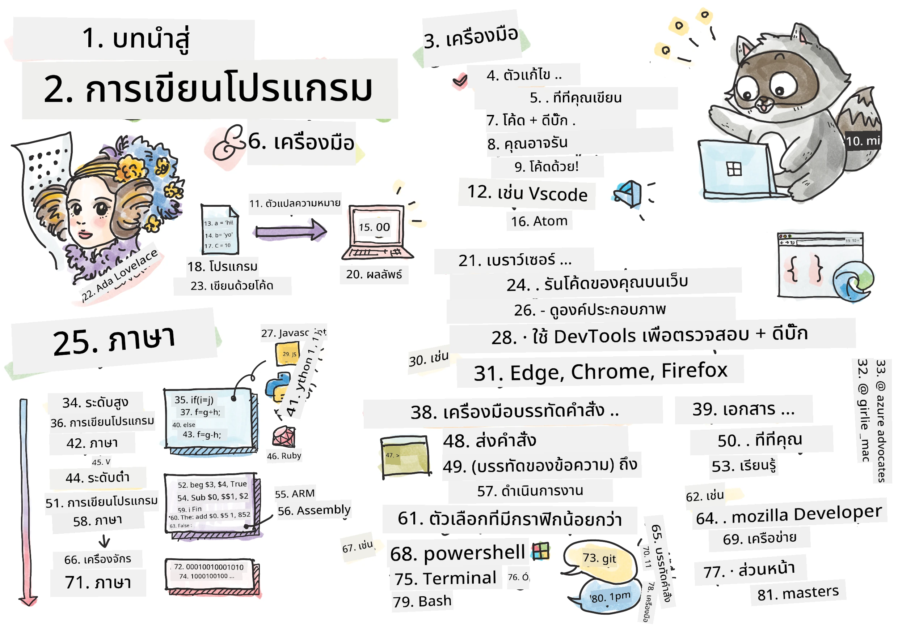
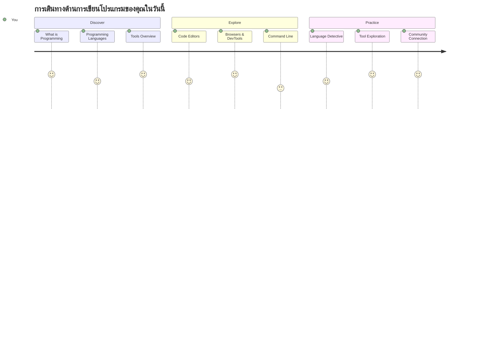
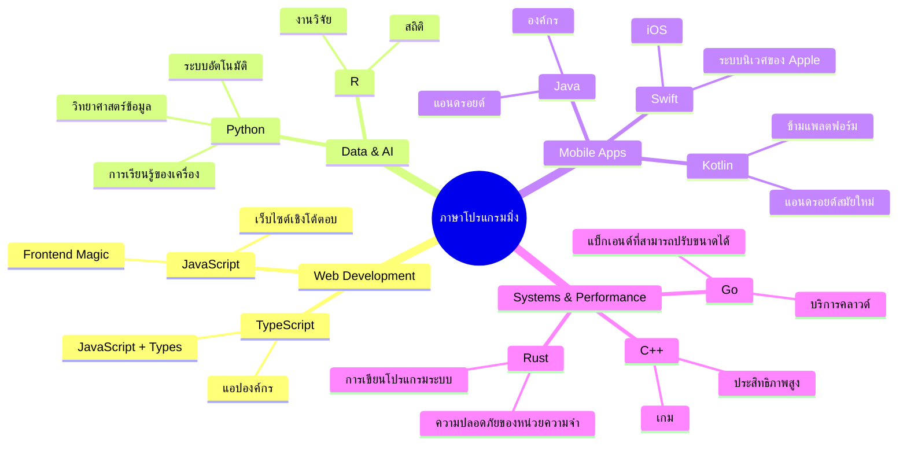
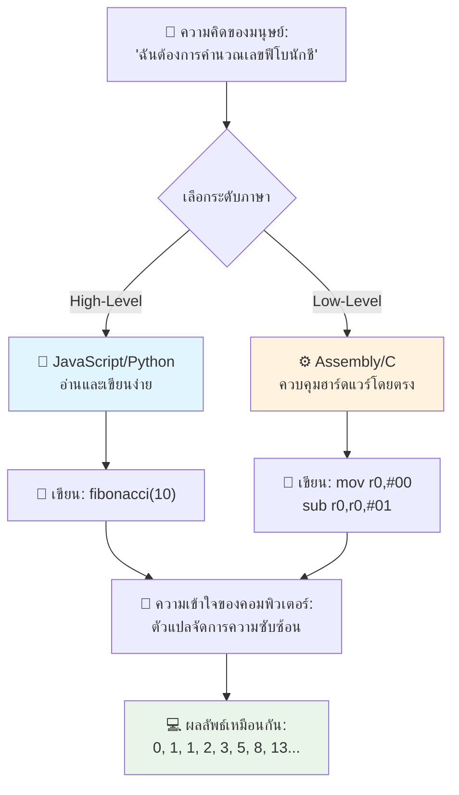
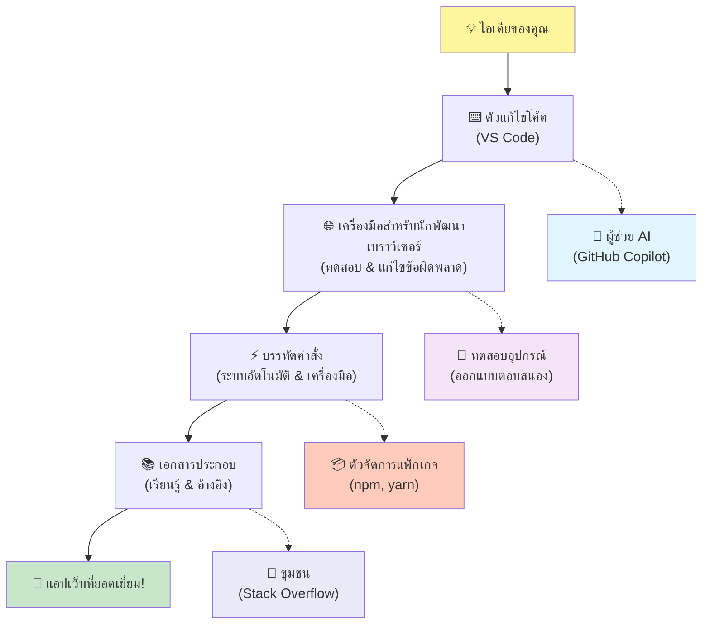
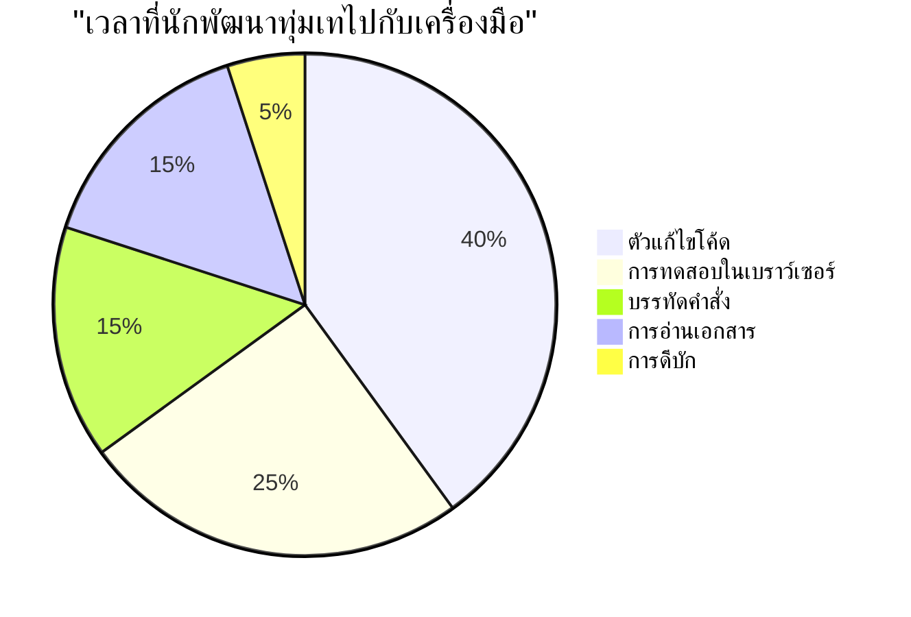
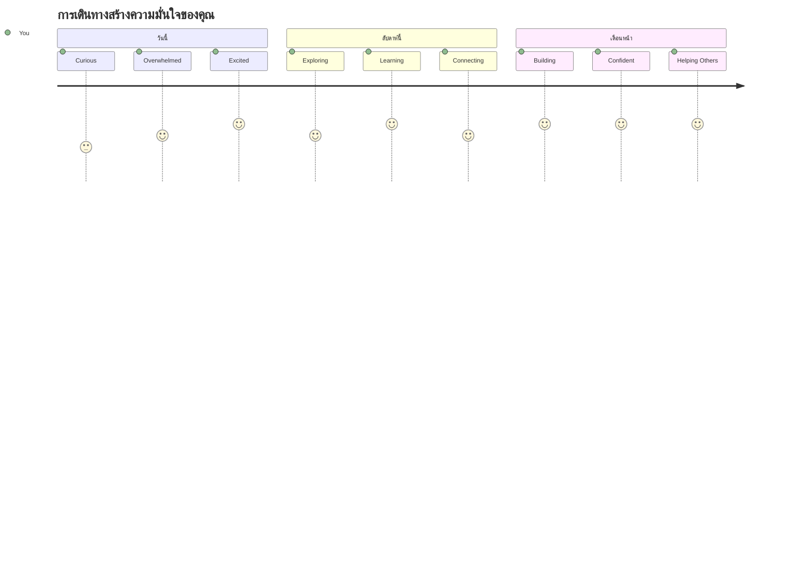

# บทนำสู่ภาษาโปรแกรมและเครื่องมือสำหรับนักพัฒนายุคใหม่

สวัสดีครับ นักพัฒนาในอนาคต! 👋 ขอเล่าอะไรที่ยังทำให้ผมตื่นเต้นทุกวันได้ไหม? คุณกำลังจะค้นพบว่า การเขียนโปรแกรมไม่ใช่แค่เรื่องของคอมพิวเตอร์เท่านั้น – แต่มันคือการมีพลังวิเศษจริง ๆ ที่จะทำให้ไอเดียล้ำ ๆ ของคุณเป็นจริงได้!

คุณเคยรู้สึกตอนที่ใช้แอปโปรด แล้วทุกอย่างลงตัวแบบเป๊ะ ๆ ไหม? เวลาแตะปุ่มแล้วเกิดอะไรบางอย่างที่มหัศจรรย์จนคุณต้องพูดว่า "ว้าว พวกเขาทำกันยังไงเนี่ย?" ก็มีใครสักคนเหมือนคุณ – อาจจะนั่งอยู่ที่ร้านกาแฟโปรดตอนตี 2 พร้อมกาแฟเอสเปรสโซ่แก้วที่สาม – ที่เขียนโค้ดสร้างความมหัศจรรย์นั้นขึ้นมา และนี่เลยที่ทำให้คุณต้องตะลึง: พอจบบทเรียนนี้ คุณจะไม่แค่เข้าใจว่าพวกเขาทำได้ยังไง แต่คุณจะอยากลองเองแน่นอน!

ฟังนะ ผมเข้าใจดีถ้าการเขียนโปรแกรมตอนนี้ดูน่ากลัว เมื่อแรกเริ่ม ผมเองก็คิดว่าต้องเป็นอัจฉริยะคณิตศาสตร์ หรือเขียนโค้มาผ่านตอนอายุห้าขวบเท่านั้น แต่สิ่งที่เปลี่ยนมุมมองผมไปเลยคือ: การเขียนโปรแกรมก็เหมือนการเรียนรู้การสนทนาในภาษาต่างประเทศ คุณเริ่มจาก "สวัสดี" และ "ขอบคุณ" จากนั้นก็พัฒนามาถึงสั่งกาแฟ และไม่นานคุณก็พูดคุยเชิงปรัชญาลึกซึ้ง! แต่กรณีนี้คือคุณคุยกับคอมพิวเตอร์ และจริง ๆ นะ? เขาคือคู่สนทนาที่อดทนที่สุดที่คุณจะเจอ – ไม่เคยตัดสินความผิดพลาด และพร้อมจะลองใหม่เสมอ!

วันนี้เราจะสำรวจเครื่องมือสุดเจ๋งที่ทำให้การพัฒนาเว็บยุคใหม่ไม่ได้แค่เป็นไปได้ แต่สนุกจนติดงอมแงมเลยนะ ผมกำลังพูดถึงโปรแกรมแก้ไข โบร์วเซอร์ และขั้นตอนการทำงานเดียวกับที่นักพัฒนาที่ Netflix, Spotify และสตูดิโอแอปอินดี้โปรดของคุณใช้ทุกวัน และนี่แหละที่คุณจะต้องเต้นดีใจ: เครื่องมือเกรดมืออาชีพและมาตรฐานอุตสาหกรรมเหล่านี้ส่วนใหญ่ใช้ฟรีทั้งหมด!


> บันทึกภาพโดย [Tomomi Imura](https://twitter.com/girlie_mac)


```mermaid
journey
    title การเดินทางด้านการเขียนโปรแกรมของคุณในวันนี้
    section Discover
      What is Programming: 5: You
      Programming Languages: 4: You
      Tools Overview: 5: You
    section Explore
      Code Editors: 4: You
      Browsers & DevTools: 5: You
      Command Line: 3: You
    section Practice
      Language Detective: 4: You
      Tool Exploration: 5: You
      Community Connection: 5: You
```
## มาดูกันว่าคุณรู้อะไรอยู่แล้วบ้าง!

ก่อนจะเริ่มสนุก ๆ ผมอยากรู้ว่า คุณรู้อะไรบ้างเกี่ยวกับโลกโปรแกรมมิ่งนี้? และถ้าคุณมองคำถามเหล่านี้แล้วคิดว่า "ผมแทบไม่รู้เลยสักนิด" นั่นไม่ใช่แค่โอเคนะ แต่มันเพอร์เฟกต์เลย! นั่นหมายความว่าคุณอยู่ที่ถูกที่ถูกเวลาเหมาะสมสุด คิดว่าควิซนี้แบบเหมือนการยืดกล้ามเนื้อก่อนออกกำลังกาย – เรากำลังอบอุ่นสมองนั่นเอง!

[ทำควิซก่อนบทเรียน](https://ff-quizzes.netlify.app/web/)


## การผจญภัยที่เราจะไปด้วยกัน

โอเค ผมตื่นเต้นจริง ๆ กับสิ่งที่เราจะสำรวจวันนี้! จริง ๆ ผมหวังจะเห็นหน้าคุณตอนที่บางแนวคิดในนี้ซึมซาบลงใจ นี่คือเส้นทางวิเศษที่เราจะไปด้วยกัน:

- **โปรแกรมมิ่งคืออะไรจริง ๆ (และทำไมมันเจ๋งที่สุด!)** – เราจะค้นพบว่ารหัสโปรแกรมคือเวทมนตร์ที่ไม่เห็นที่ขับเคลื่อนทุกสิ่งรอบตัวคุณ ตั้งแต่เสียงนาฬิกาปลุกที่รู้ว่ามันคือเช้าวันจันทร์ ไปจนถึงอัลกอริทึมที่เลือกคัดสรร Netflix ให้คุณแบบเป๊ะ ๆ
- **ภาษาโปรแกรมและบุคลิกที่น่าทึ่งของพวกมัน** – ลองจินตนาการว่าคุณเดินเข้าปาร์ตี้ แล้วแต่ละคนมีพลังวิเศษและวิธีแก้ปัญหาที่แตกต่างกัน นั่นแหละคือโลกของภาษาโปรแกรม และคุณจะต้องชอบที่ได้รู้จักพวกเขา!
- **บล็อกพื้นฐานที่ทำให้เกิดเวทมนตร์ดิจิทัล** – คิดว่าสิ่งนี้เหมือนบล็อก LEGO ชั้นยอด เมื่อเข้าใจว่าชิ้นส่วนเหล่านี้ประกอบกันได้อย่างไร คุณจะรู้ว่าคุณสามารถสร้างอะไรจากจินตนาการของคุณได้
- **เครื่องมือมืออาชีพที่ทำให้คุณรู้สึกเหมือนได้ไม้เท้าพ่อมด** – ผมไม่ได้พูดเกินจริง เครื่องมือเหล่านี้จะทำให้คุณรู้สึกว่าคุณมีพลังวิเศษจริง ๆ และดีที่สุดคือ? นี่แหละคือสิ่งที่มืออาชีพใช้กัน!

> 💡 **จำไว้นะ**: อย่าพยายามจำทุกอย่างตอนนี้เลย! ตอนนี้ผมแค่อยากให้คุณรู้สึกตื่นเต้นเกี่ยวกับสิ่งที่เป็นไปได้ รายละเอียดจะค่อย ๆ ซึมซับเองเมื่อเราฝึกไปด้วยกัน – นั่นแหละคือการเรียนรู้ที่แท้จริง!

> คุณสามารถเรียนบทเรียนนี้บน [Microsoft Learn](https://learn.microsoft.com/en-us/learn/modules/web-development-101/introduction-programming/?WT.mc_id=academic-77807-sagibbon)!

## แล้วโปรแกรมมิ่งมันคืออะไรล่ะ?

โอเค มาจับโจทย์ล้านดอลลาร์กัน: จริง ๆ แล้วโปรแกรมมิ่งคืออะไร?

ผมจะเล่าเรื่องที่เปลี่ยนมุมมองผมไปหมด เมื่อสัปดาห์ก่อน ผมพยายามอธิบายให้แม่ฟังว่าต้องใช้รีโมตทีวีสมาร์ทใหม่ยังไง ผมจับได้ว่าตัวเองพูดว่า "กดปุ่มสีแดงนะ แต่ไม่ใช่ปุ่มแดงใหญ่ เป็นปุ่มแดงเล็กซ้ายมือ... ไม่ใช่ซ้ายอันนั้น... เอาล่ะ กดค้างสองวินาที ไม่ใช่หนึ่ง ไม่ใช่สาม..." ฟังดูคุ้น ๆ ไหม? 😅

นั่นแหละคือโปรแกรมมิ่ง! มันคือศิลปะของการให้คำสั่งละเอียดมาก ๆ ทีละขั้นตอนกับสิ่งที่ทรงพลัง แต่ต้องอธิบายละเอียดทุกอย่างให้ชัดเจน นอกจากไม่ใช่การอธิบายกับแม่ (ซึ่งแม่ถามได้ว่า "ปุ่มแดงไหน?") แต่เรากำลังอธิบายกับคอมพิวเตอร์ (ซึ่งมันทำตามคำสั่งเป๊ะ ๆ ถึงแม้คำสั่งนั้นอาจจะไม่ใช่สิ่งที่คุณตั้งใจจริง ๆ)

นี่สร้างความประทับใจผมมากตอนเรียนครั้งแรก: คอมพิวเตอร์จริง ๆ แล้วมันง่ายมากที่แกนกลาง พวกมันเข้าใจแค่สองอย่างคือ 1 กับ 0 ซึ่งก็คือ "ใช่" และ "ไม่ใช่" หรือ "เปิด" กับ "ปิด" เท่านั้น! แต่นี่แหละคือที่มหัศจรรย์ – เราไม่ต้องพูดเป็นเลข 1 กับ 0 เหมือนในหนัง The Matrix อันนี้แหละคือที่ **ภาษาโปรแกรม** ช่วยเรา พวกนี้เหมือนล่ามที่ดีที่สุดในโลกที่เปลี่ยนความคิดของคนธรรมดาเป็นภาษาคอมพิวเตอร์

และนี่คือสิ่งที่ทำให้ผมขนลุกทุกเช้าเปิดตาขึ้นมา: ทุกอย่างในชีวิตดิจิทัลของคุณเริ่มต้นจากใครสักคนแบบคุณ อาจจะใส่ชุดนอน มีแก้วกาแฟนั่งพิมพ์โค้ดในแล็ปท็อป ตัวกรอง Instagram ที่ทำให้คุณดูดีไม่มีที่ติ? ใครสักคนเขียนโค้ดอันนั้น แนะนำนำเพลงใหม่ที่คุณชอบ? นักพัฒนาคนนั้นเขียนอัลกอริทึมแหละ แอปที่ช่วยแยกจ่ายบิลอาหารเย็นกับเพื่อน ๆ? ใช่แล้ว มีคนคิดว่า "นี่มันน่ารำคาญ ฉันจะแก้ปัญหานี้" แล้วก็ทำจริง ๆ!

เมื่อคุณเรียนเขียนโปรแกรม คุณไม่ได้แค่ได้ทักษะใหม่ – คุณกำลังเป็นส่วนหนึ่งของชุมชนที่น่าทึ่งของผู้แก้ปัญหา ที่ใช้เวลาวัน ๆ คิดว่า "ถ้าฉันสร้างอะไรสักอย่างที่ทำให้วันของใครสักคนดีขึ้นสักนิดจะเป็นยังไง?" จริง ๆ แล้ว มีอะไรเจ๋งกว่านี้ไหมล่ะ?

✅ **สนุกกับการค้นหาเรื่องจริง**: นี่คือเรื่องเจ๋ง ๆ ให้ลองค้นหาตอนมีเวลาว่าง – คุณคิดว่าใครคือโปรแกรมเมอร์คนแรกของโลก? ผมจะให้ใบ้หน่อย: ไม่ใช่คนที่คุณคาดหวังแน่! เรื่องราวเบื้องหลังคนนี้น่าสนใจมาก และบอกว่าโปรแกรมมิ่งเป็นการแก้ปัญหาสร้างสรรค์และคิดนอกกรอบมาตลอด

### 🧠 **เวลาตรวจสอบตัวเอง: คุณรู้สึกอย่างไรบ้าง?**

**ลองคิดทบทวน:**
- ไอเดียของการ "ให้คำสั่งกับคอมพิวเตอร์" เข้าใจมากขึ้นไหมตอนนี้?
- คุณนึกถึงงานประจำวันอะไรที่อยากจะทำอัตโนมัติด้วยโปรแกรมมิ่งไหม?
- มีคำถามอะไรในใจเกี่ยวกับการเขียนโปรแกรมบ้าง?

> **จำไว้**: เป็นเรื่องปกติมากถ้าแนวคิดบางอย่างยังดูยากตอนนี้ การเรียนโปรแกรมเหมือนเรียนภาษาใหม่ – ต้องใช้เวลาให้สมองสร้างเส้นทางเชื่อมโยงใหม่ คุณทำได้ดีมาก!

## ภาษาโปรแกรมเหมือนรสชาติเวทมนตร์ที่แตกต่างกัน

โอเค นี่อาจดูแปลก แต่มาตามผมนะ – ภาษาโปรแกรมก็เหมือนเพลงหลายประเภทนะ ลองคิดดูสิ: มีแจ๊ส ที่รื่นรมย์และฟรีสไตล์, ร็อกที่ทรงพลังและตรงไปตรงมา, คลาสสิกที่สง่างามและมีโครงสร้าง และฮิปฮอปที่สร้างสรรค์และแสดงออก แต่ละสไตล์มีบรรยากาศของตัวเอง ชุมชนแฟนที่หลงใหลของตัวเอง และแต่ละแบบเหมาะกับอารมณ์และโอกาสต่างกัน

ภาษาโปรแกรมก็เช่นกัน! คุณจะไม่ใช้ภาษาเดียวกันสร้างเกมมือถือสนุก ๆ กับการวิเคราะห์ข้อมูลสภาพอากาศมหาศาล เช่นเดียวกับที่คุณไม่เอาเพลงเดธเมทัลไปเปิดในคลาสโยคะ (ก็ส่วนใหญ่คลาสโยคะอะนะ! 😄)

แต่สิ่งที่ทำให้ผมอึ้งทุกครั้งที่คิดคือ: ภาษาพวกนี้เหมือนมีล่ามฉลาดและอดทนที่สุดในโลกนั่งอยู่ข้าง ๆ คุณ คุณสามารถแสดงความคิดของคุณในแบบที่สมองมนุษย์คุณเข้าใจได้อย่างเป็นธรรมชาติ แล้วพวกเขาก็แปลงสิ่งเหล่านั้นเป็น 1 กับ 0 ที่คอมพิวเตอร์พูดได้ เหมือนมีเพื่อนที่พูดได้ทั้ง "ความคิดสร้างสรรค์ของมนุษย์" และ "ตรรกะของคอมพิวเตอร์" – และเขาไม่เหนื่อย ไม่ต้องพักกาแฟ และไม่เคยดุคุณเมื่อถามซ้ำ!

### ภาษาโปรแกรมยอดนิยมและการใช้งานของแต่ละภาษา


```mermaid
mindmap
  root((ภาษาโปรแกรมมิ่ง))
    Web Development
      JavaScript
        Frontend Magic
        เว็บไซต์เชิงโต้ตอบ
      TypeScript
        JavaScript + Types
        แอปองค์กร
    Data & AI
      Python
        วิทยาศาสตร์ข้อมูล
        การเรียนรู้ของเครื่อง
        ระบบอัตโนมัติ
      R
        สถิติ
        งานวิจัย
    Mobile Apps
      Java
        แอนดรอยด์
        องค์กร
      Swift
        iOS
        ระบบนิเวศของ Apple
      Kotlin
        แอนดรอยด์สมัยใหม่
        ข้ามแพลตฟอร์ม
    Systems & Performance
      C++
        เกม
        ประสิทธิภาพสูง
      Rust
        ความปลอดภัยของหน่วยความจำ
        การเขียนโปรแกรมระบบ
      Go
        บริการคลาวด์
        แบ็กเอนด์ที่สามารถปรับขนาดได้
```
| ภาษา | เหมาะสำหรับ | ทำไมจึงนิยม |
|----------|----------|------------------|
| **JavaScript** | พัฒนาเว็บ, ส่วนติดต่อผู้ใช้ | รันในเบราว์เซอร์และขับเคลื่อนเว็บไซต์โต้ตอบได้ |
| **Python** | วิทยาศาสตร์ข้อมูล, งานอัตโนมัติ, ปัญญาประดิษฐ์ | อ่านง่าย เรียนรู้เร็ว มีไลบรารีทรงพลัง |
| **Java** | แอปพลิเคชันองค์กร, แอป Android | ใช้ได้บนหลายแพลตฟอร์ม ทนทานสำหรับระบบใหญ่ |
| **C#** | แอป Windows, พัฒนาเกม | ได้รับการสนับสนุนจากระบบนิเวศ Microsoft อย่างแข็งแกร่ง |
| **Go** | บริการคลาวด์, ระบบหลังบ้าน | เร็ว ง่าย ออกแบบสำหรับคอมพิวเตอร์ยุคใหม่ |

### ภาษาโปรแกรมระดับสูงกับระดับต่ำ

โอเค นี่คือแนวคิดที่ทำให้ผมลนลานตอนเริ่มเรียนครั้งแรก ผมเลยอยากเล่าอุปมาอุปมัยที่ทำให้ผมเข้าใจ – และหวังว่าคุณจะเข้าใจนะ!

ลองนึกภาพว่าคุณไปเที่ยวประเทศที่ไม่รู้ภาษาท้องถิ่นและกำลังมองหาห้องน้ำอย่างสุดชีวิต (เราทุกคนผ่านมานะ 😅):

- **โปรแกรมมิ่งระดับต่ำ** เหมือนคุณเรียนภาษาถิ่นจนคุยกับยายขายผลไม้ตรงหัวมุมถนนรู้เรื่อง ใช้อ้างอิงวัฒนธรรม คำแสลง และมุกที่คนโตที่นั่นเท่านั้นเข้าใจ สุดยอดและมีประสิทธิภาพมาก... ถ้าคุณพูดภาษานั้นคล่อง! แต่ถ้าคุณแค่หาห้องน้ำก็... ท้อแน่

- **โปรแกรมมิ่งระดับสูง** เหมือนมีเพื่อนท้องถิ่นที่เข้าใจคุณดีมาก คุณบอกว่า "ฉันหาห้องน้ำ" เป็นภาษาอังกฤษธรรมดา ๆ เขาจะจัดการแปลวัฒนธรรมให้และบอกทางแบบที่สมองไม่ถนัดของคุณเข้าใจได้ดี

ในศัพท์โปรแกรม:
- **ภาษาระดับต่ำ** (เช่น Assembly หรือ C) เปิดโอกาสให้คุณสื่อสารกับฮาร์ดแวร์คอมพิวเตอร์ละเอียดมาก แต่คุณต้องคิดเหมือนเครื่องจักร อันนี้... บอกเลยเปลี่ยนความคิดมหาศาล!
- **ภาษาระดับสูง** (เช่น JavaScript, Python หรือ C#) ทำให้คุณคิดแบบมนุษย์ในขณะที่จัดการกับภาษาของเครื่องจักรเบื้องหลัง นอกจากนี้ยังมีชุมชนที่อบอุ่นของคนที่เคยเป็นมือใหม่และช่วยเหลือจริงใจ!

ทายซิผมจะแนะนำให้เริ่มจากอะไร? 😉 ภาษาระดับสูงเหมือนมีล้อฝึกที่คุณแทบไม่อยากถอดเพราะมันทำให้ประสบการณ์ง่ายและสนุกกว่ามาก!


```mermaid
flowchart TB
    A["👤 ความคิดของมนุษย์:<br/>'ฉันต้องการคำนวณเลขฟีโบนักชี'"] --> B{เลือกระดับภาษา}
    
    B -->|High-Level| C["🌟 JavaScript/Python<br/>อ่านและเขียนง่าย"]
    B -->|Low-Level| D["⚙️ Assembly/C<br/>ควบคุมฮาร์ดแวร์โดยตรง"]
    
    C --> E["📝 เขียน: fibonacci(10)"]
    D --> F["📝 เขียน: mov r0,#00<br/>sub r0,r0,#01"]
    
    E --> G["🤖 ความเข้าใจของคอมพิวเตอร์:<br/>ตัวแปลจัดการความซับซ้อน"]
    F --> G
    
    G --> H["💻 ผลลัพธ์เหมือนกัน:<br/>0, 1, 1, 2, 3, 5, 8, 13..."]
    
    style C fill:#e1f5fe
    style D fill:#fff3e0
    style H fill:#e8f5e8
```
### ขอแสดงให้ดูว่าทำไมภาษาระดับสูงถึงเป็นมิตรกว่าเยอะ

โอเค ผมกำลังจะโชว์ตัวอย่างโค้ดที่แสดงเหตุผลว่าทำไมผมถึงรักภาษาระดับสูง แต่ก่อนอื่น – ขอให้สัญญาหน่อยว่าเมื่อเห็นตัวอย่างโค้ดแรก อย่าตกใจ! มันถูกออกแบบให้ดูน่ากลัวแบบนั้นแหละ!

เราจะดูงานเดียวกันเขียนสองสไตล์แตกต่างกันอย่างสุดขั้ว ทั้งคู่สร้างสิ่งที่เรียกว่า ลำดับฟีโบนักชี – รูปแบบทางคณิตศาสตร์สวยงามที่แต่ละจำนวนเป็นผลรวมของสองจำนวนก่อนหน้า: 0, 1, 1, 2, 3, 5, 8, 13... (เรื่องสนุก: รูปแบบนี้พบเห็นได้แทบทุกที่ในธรรมชาติ – ผังเมล็ดดอกทานตะวัน, รูปทรงของเมล็ดสน, แม้แต่โครงสร้างกาแล็กซี่!)

พร้อมดูความแตกต่างหรือยัง? ไปกันเลย!

**ภาษาระดับสูง (JavaScript) – รู้เรื่องง่ายสำหรับมนุษย์:**

```javascript
// ขั้นตอนที่ 1: การตั้งค่า Fibonacci ขั้นพื้นฐาน
const fibonacciCount = 10;
let current = 0;
let next = 1;

console.log('Fibonacci sequence:');
```

**โค้ดนี้ทำอะไรบ้าง:**
- **ประกาศ** ค่าคงที่เพื่อระบุจำนวนตัวเลขฟีโบนักชีที่ต้องการสร้าง
- **เริ่มต้น** ตัวแปรสองตัวเพื่อติดตามค่าปัจจุบันและค่าต่อไปในลำดับ
- **ตั้งค่า** ค่าตั้งต้น (0 และ 1) ที่กำหนดรูปแบบฟีโบนักชี
- **แสดง** ข้อความหัวเรื่องเพื่อระบุผลลัพธ์ของเรา

```javascript
// ขั้นตอนที่ 2: สร้างลำดับด้วยการใช้ลูป
for (let i = 0; i < fibonacciCount; i++) {
  console.log(`Position ${i + 1}: ${current}`);
  
  // คำนวณตัวเลขถัดไปในลำดับ
  const sum = current + next;
  current = next;
  next = sum;
}
```

**แยกส่วนสิ่งที่เกิดขึ้นที่นี่:**
- **วนลูป** ผ่านแต่ละตำแหน่งในลำดับโดยใช้ลูป `for`
- **แสดง** ตัวเลขแต่ละตัวพร้อมตำแหน่งด้วยการฟอร์แมตแบบเทมเพลต
- **คำนวณ** ตัวเลขฟีโบนักชีถัดไปโดยบวกค่าปัจจุบันกับค่าถัดไป
- **อัปเดต** ตัวแปรเพื่อล่วงไปขั้นถัดไป

```javascript
// ขั้นตอนที่ 3: วิธีการเชิงฟังก์ชันสมัยใหม่
const generateFibonacci = (count) => {
  const sequence = [0, 1];
  
  for (let i = 2; i < count; i++) {
    sequence[i] = sequence[i - 1] + sequence[i - 2];
  }
  
  return sequence;
};

// ตัวอย่างการใช้งาน
const fibSequence = generateFibonacci(10);
console.log(fibSequence);
```

**ในตัวอย่างบน, เราได้:**
- **สร้าง** ฟังก์ชันที่ใช้งานซ้ำได้ด้วยไวยากรณ์ลูกศรสมัยใหม่
- **สร้าง** อาร์เรย์เพื่อเก็บลำดับเต็มแทนการแสดงทีละตัว
- **ใช้** การเข้าถึงอาร์เรย์สำหรับคำนวณตัวเลขแต่ละตัวจากค่าก่อนหน้า
- **ส่งคืน** ลำดับเต็มเพื่อใช้งานยืดหยุ่นในส่วนอื่นของโปรแกรม

**ภาษาระดับต่ำ (ARM Assembly) – เข้าใจง่ายสำหรับคอมพิวเตอร์:**

```assembly
 area ascen,code,readonly
 entry
 code32
 adr r0,thumb+1
 bx r0
 code16
thumb
 mov r0,#00
 sub r0,r0,#01
 mov r1,#01
 mov r4,#10
 ldr r2,=0x40000000
back add r0,r1
 str r0,[r2]
 add r2,#04
 mov r3,r0
 mov r0,r1
 mov r1,r3
 sub r4,#01
 cmp r4,#00
 bne back
 end
```

สังเกตว่าเวอร์ชัน JavaScript อ่านเหมือนคำสั่งภาษาอังกฤษ ในขณะที่เวอร์ชัน Assembly ใช้คำสั่งลึกลับที่ควบคุมโปรเซสเซอร์ของคอมพิวเตอร์โดยตรง ทั้งสองทำงานให้งานเดียวกัน แต่ภาษาระดับสูงง่ายกว่าที่มนุษย์จะเข้าใจ เขียน และดูแลรักษา

**ความแตกต่างสำคัญที่คุณจะสังเกตได้:**
- **ความอ่านง่าย**: JavaScript ใช้ชื่อตัวแปรที่บ่งบอกความหมาย เช่น `fibonacciCount` ในขณะที่ Assembly ใช้ป้ายกำกับที่ดูเข้าใจยากอย่าง `r0`, `r1`
- **คอมเมนต์**: ภาษาในระดับสูงส่งเสริมการมีคอมเมนต์อธิบายที่ช่วยให้โค้ดเป็นเอกสารตัวเอง
- **โครงสร้าง**: การไหลของตรรกะใน JavaScript สอดคล้องกับวิธีที่มนุษย์คิดแก้ปัญหาเป็นขั้นตอน
- **การบำรุงรักษา**: การอัปเดตเวอร์ชัน JavaScript ให้ตรงกับความต้องการต่างๆ ทำได้ง่ายและชัดเจน

✅ **เกี่ยวกับลำดับฟีโบนักชี**: รูปแบบตัวเลขที่สวยงามอย่างมากนี้ (ที่แต่ละตัวเลขเป็นผลบวกของสองตัวก่อนหน้า: 0, 1, 1, 2, 3, 5, 8...) พบได้แทบทุกที่ในธรรมชาติ! คุณจะเจอมันในเกลียวดอกทานตะวัน ลวดลายของเมล็ดสน รูปทรงของเปลือกหอยนอติลัส และแม้แต่ในวิธีที่กิ่งไม้เจริญเติบโต มันน่าทึ่งมากที่คณิตศาสตร์และโค้ดช่วยให้เราเข้าใจและสร้างรูปแบบที่ธรรมชาติเข้าใช้ในการสร้างความงามได้!

## บล็อกพื้นฐานที่ทำให้เวทมนตร์เกิดขึ้น

เอาล่ะ ตอนนี้คุณเห็นภาพการใช้ภาษาการเขียนโปรแกรมแล้ว มาแบ่งส่วนพื้นฐานที่ประกอบขึ้นเป็นทุกโปรแกรมที่เคยเขียนไว้กันเถอะ คิดว่ามันเหมือนส่วนผสมสำคัญในสูตรอาหารที่คุณชื่นชอบ – เมื่อคุณเข้าใจว่าทุกชิ้นส่วนทำหน้าที่อะไร คุณก็จะอ่านและเขียนโค้ดได้แทบทุกภาษา!

นี่ก็เหมือนการเรียนไวยากรณ์ของการเขียนโปรแกรม จำได้ไหมตอนเรียนในโรงเรียนที่เรียนเรื่องคำนาม คำกริยา และวิธีต่อประโยค? การเขียนโปรแกรมก็มีไวยากรณ์ของตัวเอง และบอกเลยว่ามันมีตรรกะมากกว่าและยืดหยุ่นกว่าการใช้งานไวยากรณ์ภาษาอังกฤษเยอะ! 😄

### คำสั่ง: คำแนะนำทีละขั้นตอน

มาเริ่มกันที่ **คำสั่ง** – เหล่านี้เหมือนประโยคแต่ละประโยคในบทสนทนากับคอมพิวเตอร์ของคุณ แต่ละคำสั่งบอกให้คอมพิวเตอร์ทำสิ่งหนึ่งอย่างเฉพาะ เช่น การบอกทางว่า "เลี้ยวซ้ายตรงนี้" "หยุดที่ไฟแดง" "จอดรถตรงนั้น"

สิ่งที่ฉันชอบเกี่ยวกับคำสั่งคือความอ่านง่าย ดูสิ:

```javascript
// คำสั่งพื้นฐานที่ทำการกระทำเดียว
const userName = "Alex";                    
console.log("Hello, world!");              
const sum = 5 + 3;                         
```

**โค้ดนี้ทำอะไร:**
- **ประกาศ** ตัวแปรค่าคงที่เพื่อเก็บชื่อผู้ใช้
- **แสดง** ข้อความทักทายบนคอนโซล
- **คำนวณ** และเก็บผลลัพธ์ของการดำเนินการทางคณิตศาสตร์

```javascript
// คำสั่งที่โต้ตอบกับหน้าเว็บ
document.title = "My Awesome Website";      
document.body.style.backgroundColor = "lightblue";
```

**ทีละขั้นตอน โค้ดทำอะไรบ้าง:**
- **แก้ไข** ชื่อเรื่องของเว็บเพจที่แสดงบนแท็บเบราว์เซอร์
- **เปลี่ยน** สีพื้นหลังของส่วนเนื้อหาทั้งหมดในหน้า

### ตัวแปร: ระบบหน่วยความจำของโปรแกรมคุณ

โอเค, **ตัวแปร** เป็นแนวคิดที่ฉันชอบสอนมากเพราะมันคล้ายกับสิ่งที่คุณใช้อยู่ทุกวัน!

ลองนึกถึงรายชื่อผู้ติดต่อในโทรศัพท์ของคุณสักนิด คุณไม่ได้จดจำหมายเลขทุกเบอร์ – แต่เก็บเอาไว้ในชื่อเช่น "แม่" "เพื่อนสนิท" หรือ "ร้านพิซซ่าส่งถึงตีสอง" และโทรศัพท์จะจำหมายเลขให้ ตัวแปรก็ทำหน้าที่เหมือนกัน! มันเหมือนภาชนะที่มีป้ายชื่อซึ่งโปรแกรมของคุณเก็บข้อมูลและเรียกกลับมาใช้โดยใช้ชื่อที่มีความหมาย

อีกอย่างที่เจ๋งสุดๆ คือ ตัวแปรสามารถเปลี่ยนแปลงค่าได้ในขณะที่โปรแกรมทำงาน (จึงชื่อว่า "ตัวแปร") เช่นเดียวกับที่คุณอาจอัพเดตรายชื่อร้านพิซซ่าถ้าเจอที่ดีกว่า ตัวแปรก็สามารถเปลี่ยนอัพเดตตามข้อมูลหรือสถานการณ์

ขอแสดงให้เห็นว่ามันง่ายสวยงามแค่ไหน:

```javascript
// ขั้นตอนที่ 1: การสร้างตัวแปรพื้นฐาน
const siteName = "Weather Dashboard";        
let currentWeather = "sunny";               
let temperature = 75;                       
let isRaining = false;                      
```

**เข้าใจแนวคิดเหล่านี้:**
- **เก็บ** ค่าที่ไม่เปลี่ยนแปลงในตัวแปร `const` (เช่นชื่อเว็บไซต์)
- **ใช้** `let` สำหรับค่าที่สามารถเปลี่ยนแปลงได้ตลอดโปรแกรม
- **กำหนด** ชนิดข้อมูลต่างๆ เช่น สตริง (ข้อความ) ตัวเลข และบูลีน (จริง/เท็จ)
- **เลือก** ชื่อที่บ่งบอกความหมายชัดเจนสำหรับแต่ละตัวแปร

```javascript
// ขั้นตอนที่ 2: การทำงานกับอ็อบเจ็กต์เพื่อจัดกลุ่มข้อมูลที่เกี่ยวข้องกัน
const weatherData = {                       
  location: "San Francisco",
  humidity: 65,
  windSpeed: 12
};
```

**ในข้างต้นเราได้:**
- **สร้าง** อ็อบเจกต์เพื่อจัดกลุ่มข้อมูลสภาพอากาศที่เกี่ยวข้องกัน
- **จัดระเบียบ** ข้อมูลหลายชิ้นภายใต้ชื่อตัวแปรเดียว
- **ใช้** คู่กุญแจ-ค่าเพื่อระบุแต่ละข้อมูลให้ชัดเจน

```javascript
// ขั้นตอนที่ 3: การใช้และอัปเดตตัวแปร
console.log(`${siteName}: Today is ${currentWeather} and ${temperature}°F`);
console.log(`Wind speed: ${weatherData.windSpeed} mph`);

// การอัปเดตตัวแปรที่สามารถเปลี่ยนแปลงได้
currentWeather = "cloudy";                  
temperature = 68;                          
```

**มาดูแต่ละส่วน:**
- **แสดง** ข้อมูลโดยใช้ template literals ด้วย `${}` 
- **เข้าถึง** คุณสมบัติของอ็อบเจกต์ด้วย dot notation (`weatherData.windSpeed`)
- **อัปเดต** ตัวแปรที่ประกาศด้วย `let` เพื่อสะท้อนสถานการณ์ที่เปลี่ยนแปลง
- **ผสมผสาน** ตัวแปรหลายตัวเพื่อสร้างข้อความที่มีความหมาย

```javascript
// ขั้นตอนที่ 4: การแตกโครงสร้างแบบทันสมัยเพื่อโค้ดที่สะอาดขึ้น
const { location, humidity } = weatherData; 
console.log(`${location} humidity: ${humidity}%`);
```

**สิ่งที่คุณต้องรู้:**
- **ดึง** คุณสมบัติเฉพาะจากอ็อบเจกต์โดยใช้ destructuring assignment
- **สร้าง** ตัวแปรใหม่โดยอัตโนมัติที่ใช้ชื่อเดียวกับกุญแจในอ็อบเจกต์
- **ทำให้โค้ดง่ายขึ้น** โดยหลีกเลี่ยงการเขียน dot notation ซ้ำๆ

### การควบคุมการไหล: สอนโปรแกรมของคุณให้คิด

โอเค นี่แหละที่การเขียนโปรแกรมเริ่มน่าทึ่งสุดๆ! **การควบคุมการไหล** คือการสอนโปรแกรมให้ตัดสินใจอย่างชาญฉลาด เหมือนที่คุณทำในชีวิตประจำวันโดยไม่ต้องคิดเลย

ลองนึกภาพเช้านี้คุณคงทำแบบนี้ "ถ้าฝนตก ฉันจะถือร่ม ถ้าหนาวฉันใส่เสื้อแจ็คเก็ต ถ้าฉันไปสาย ฉันจะข้ามอาหารเช้าและซื้อกาแฟระหว่างทาง" สมองคุณติดตามตรรกะแบบ if-then นี้เป็นสิบๆ ครั้งทุกวัน!

นี่คือเหตุผลที่โปรแกรมรู้สึกมีความฉลาดและมีชีวิตชีวา ไม่ได้ทำตามสคริปต์น่าเบื่อและคาดเดาได้ พวกมันดูสถานการณ์ วินิจฉัยสิ่งที่เกิดขึ้น และตอบสนองอย่างเหมาะสม ราวกับมอบสมองที่ปรับตัวและเลือกได้ให้โปรแกรม!

อยากเห็นความงดงามของมันไหม? เอาเลย:

```javascript
// ขั้นตอนที่ 1: ตรรกะเงื่อนไขพื้นฐาน
const userAge = 17;

if (userAge >= 18) {
  console.log("You can vote!");
} else {
  const yearsToWait = 18 - userAge;
  console.log(`You'll be able to vote in ${yearsToWait} year(s).`);
}
```

**โค้ดนี้ทำอะไร:**
- **ตรวจสอบ** ว่าผู้ใช้มีอายุถึงเกณฑ์เลือกตั้งหรือไม่
- **ทำงาน** โค้ดที่ต่างกันโดยอิงจากผลลัพธ์เงื่อนไข
- **คำนวณ** และแสดงเวลาที่เหลือจนถึงวันมีสิทธิเลือกตั้งถ้าอายุไม่ถึง 18
- **ให้** ข้อมูลย้อนกลับที่ช่วยเหลืออย่างเจาะจงสำหรับแต่ละกรณี

```javascript
// ขั้นตอนที่ 2: หลายเงื่อนไขด้วยตัวดำเนินการเชิงตรรกะ
const userAge = 17;
const hasPermission = true;

if (userAge >= 18 && hasPermission) {
  console.log("Access granted: You can enter the venue.");
} else if (userAge >= 16) {
  console.log("You need parent permission to enter.");
} else {
  console.log("Sorry, you must be at least 16 years old.");
}
```

**แยกแยะสิ่งที่เกิดขึ้น:**
- **รวม** เงื่อนไขหลายอย่างโดยใช้ตัวดำเนินการ `&&` (และ)
- **สร้าง** ลำดับชั้นของเงื่อนไขด้วย `else if` สำหรับหลากหลายสถานการณ์
- **จัดการ** กรณีทั้งหมดด้วยคำสั่ง `else` สุดท้าย
- **ให้** ข้อมูลย้อนกลับที่ชัดเจนและช่วยเหลือสำหรับทุกสถานการณ์

```javascript
// ขั้นตอนที่ 3: เงื่อนไขที่กระชับด้วยตัวดำเนินการเทอร์นารี
const votingStatus = userAge >= 18 ? "Can vote" : "Cannot vote yet";
console.log(`Status: ${votingStatus}`);
```

**จำสิ่งนี้ไว้:**
- **ใช้** ตัวดำเนินการ ternary (`? :`) สำหรับเงื่อนไขสองตัวเลือกง่ายๆ
- **เขียน** เงื่อนไขก่อน ตามด้วย `?` แล้วค่าผลลัพธ์เมื่อจริง, `:`, และค่าผลลัพธ์เมื่อเท็จ
- **ใช้** รูปแบบนี้เมื่อคุณต้องการกำหนดค่าตามเงื่อนไข

```javascript
// ขั้นตอนที่ 4: การจัดการหลายกรณีเฉพาะเจาะจง
const dayOfWeek = "Tuesday";

switch (dayOfWeek) {
  case "Monday":
  case "Tuesday":
  case "Wednesday":
  case "Thursday":
  case "Friday":
    console.log("It's a weekday - time to work!");
    break;
  case "Saturday":
  case "Sunday":
    console.log("It's the weekend - time to relax!");
    break;
  default:
    console.log("Invalid day of the week");
}
```

**โค้ดนี้ทำได้:**
- **จับคู่** ค่าตัวแปรกับหลายกรณีเฉพาะ
- **จัดกลุ่ม** กรณีที่คล้ายกัน (วันธรรมดา vs วันหยุดสุดสัปดาห์)
- **ดำเนินการ** โค้ดที่เหมาะสมเมื่อพบการจับคู่
- **รวม** กรณี `default` เพื่อจัดการค่าที่ไม่คาดคิด
- **ใช้** คำสั่ง `break` ป้องกันไม่ให้โค้ดรันต่อไปที่กรณีถัดไป

> 💡 **ตัวอย่างจากโลกจริง**: คิดว่าการควบคุมการไหลเหมือนกับการมี GPS ที่อดทนที่สุดในโลกมาบอกทาง คุณอาจเจอ "ถ้าถนนเมนมีรถติด ให้ไปทางด่วนแทน ถ้าการก่อสร้างปิดถนนด่วน ลองใช้เส้นทางชมวิว" โปรแกรมก็ใช้ตรรกะแบบมีเงื่อนไขเช่นนี้เพื่อตอบสนองอย่างชาญฉลาดในสถานการณ์ต่างๆ และมอบประสบการณ์ที่ดีที่สุดให้ผู้ใช้เสมอ

### 🎯 **ตรวจสอบความเข้าใจ: ชำนาญบล็อกพื้นฐาน**

**มาดูกันว่าคุณเป็นอย่างไรกับพื้นฐานเหล่านี้:**
- อธิบายความแตกต่างระหว่างตัวแปรกับคำสั่งโดยใช้คำพูดของคุณเองได้ไหม?
- นึกถึงสถานการณ์จริงที่คุณจะใช้การตัดสินใจ if-then (เหมือนตัวอย่างการเลือกตั้งของเรา)
- มีอะไรอย่างหนึ่งในตรรกะการเขียนโปรแกรมที่ทำให้คุณแปลกใจไหม?

**ตัวช่วยเพิ่มความมั่นใจอย่างรวดเร็ว:**

```mermaid
flowchart LR
    A["📝 คำสั่ง<br/>(คำสั่ง)"] --> B["📦 ตัวแปร<br/>(เก็บข้อมูล)"] --> C["🔀 การควบคุมการทำงาน<br/>(การตัดสินใจ)"] --> D["🎉 โปรแกรมที่ทำงานได้!"]
    
    style A fill:#ffeb3b
    style B fill:#4caf50
    style C fill:#2196f3
    style D fill:#ff4081
```
✅ **สิ่งที่จะเกิดขึ้นต่อไป**: เราจะมีความสนุกสุดๆ เมื่อลงลึกในแนวคิดเหล่านี้ในเส้นทางที่น่าทึ่งนี้! ตอนนี้แค่โฟกัสกับความตื่นเต้นของความเป็นไปได้มหาศาลข้างหน้า ทักษะและเทคนิคเฉพาะจะซึมซับได้เองตามธรรมชาติเพราะเราฝึกฝนด้วยกัน – ฉันสัญญาว่านี่จะสนุกกว่าที่คุณคาดไว้เยอะ!

## เครื่องมือแห่งการค้า

โอเค นี่แหละที่ทำให้ฉันตื่นเต้นมากจนแทบไม่อยู่กับที่! 🚀 เรากำลังจะพูดถึงเครื่องมือสุดวิเศษที่จะทำให้คุณรู้สึกเหมือนได้กุญแจยานอวกาศดิจิทัลมาครอบครอง

คุณรู้ไหมว่าพ่อครัวมีมีดที่สมดุลอย่างยอดเยี่ยมซึ่งกลายเป็นส่วนขยายของมือพวกเขา? หรือมือกีตาร์ที่ดูเหมือนจะร้องเพลงทันทีที่พวกเขาสัมผัส? นักพัฒนาซอฟต์แวร์ก็มีเวอร์ชันของเครื่องมือวิเศษเหล่านี้ และนี่คือสิ่งที่จะทำให้คุณทึ่งสุดๆ – ส่วนใหญ่ของเครื่องมือเหล่านี้ฟรีทั้งหมด!

ฉันกรีดร้องอยากแบ่งปันเพราะเครื่องมือเหล่านี้เปลี่ยนแปลงวิธีที่เราสร้างซอฟต์แวร์ไปโดยสิ้นเชิง เรากำลังพูดถึงผู้ช่วยเขียนโค้ดที่ขับเคลื่อนด้วย AI ที่ช่วยเขียนโค้ดให้คุณ (ไม่ได้ล้อเล่น!) สภาพแวดล้อมโครงสร้างพื้นฐานบนคลาวด์ที่ให้คุณสร้างแอปพลิเคชันได้จากทุกที่ที่มี Wi-Fi และเครื่องมือดีบักขั้นสูงเหมือนมีวิสัยทัศน์เอกซเรย์ของโปรแกรม

และนี่คือส่วนที่ยังทำให้ฉันขนลุก: เครื่องมือเหล่านี้ไม่ใช่เพียงเครื่องมือสำหรับผู้เริ่มต้นที่คุณจะเลิกใช้เร็ว เครื่องมือเหล่านี้คือเครื่องมือระดับมืออาชีพเดียวกันกับที่นักพัฒนาของ Google, Netflix และสตูดิโอแอปอินดี้ที่คุณชื่นชอบใช้กันในตอนนี้ คุณจะรู้สึกเหมือนมือโปรสุดๆเมื่อใช้มัน!


```mermaid
graph TD
    A["💡 ไอเดียของคุณ"] --> B["⌨️ ตัวแก้ไขโค้ด<br/>(VS Code)"] 
    B --> C["🌐 เครื่องมือสำหรับนักพัฒนาเบราว์เซอร์<br/>(ทดสอบ & แก้ไขข้อผิดพลาด)"]
    C --> D["⚡ บรรทัดคำสั่ง<br/>(ระบบอัตโนมัติ & เครื่องมือ)"]
    D --> E["📚 เอกสารประกอบ<br/>(เรียนรู้ & อ้างอิง)"]
    E --> F["🚀 แอปเว็บที่ยอดเยี่ยม!"]
    
    B -.-> G["🤖 ผู้ช่วย AI<br/>(GitHub Copilot)"]
    C -.-> H["📱 ทดสอบอุปกรณ์<br/>(ออกแบบตอบสนอง)"]
    D -.-> I["📦 ตัวจัดการแพ็กเกจ<br/>(npm, yarn)"]
    E -.-> J["👥 ชุมชน<br/>(Stack Overflow)"]
    
    style A fill:#fff59d
    style F fill:#c8e6c9
    style G fill:#e1f5fe
    style H fill:#f3e5f5
    style I fill:#ffccbc
    style J fill:#e8eaf6
```
### ตัวแก้ไขโค้ดและ IDEs: เพื่อนรักดิจิทัลคนใหม่ของคุณ

มาคุยเรื่องตัวแก้ไขโค้ดกัน – เหล่านี้กำลังจะกลายเป็นสถานที่โปรดของคุณ! คิดว่ามันเป็นที่พักส่วนตัวของคุณในการเขียนโค้ด ที่ที่คุณใช้เวลาส่วนใหญ่สร้างสรรค์และปรับแต่งผลงานดิจิทัล

แต่สิ่งวิเศษของตัวแก้ไขโค้ดสมัยใหม่คือ มันไม่ใช่แค่ตัวแก้ไขข้อความระดับหรูหรา มันเหมือนกับการมีเมนเทอร์โค้ดดิ้งอัจฉริยะและคอยช่วยเหลือตลอด 24 ชั่วโมง เขาจับคำผิดของคุณก่อนที่คุณจะสังเกตเห็น, แนะนำการปรับปรุงที่ทำให้คุณดูฉลาด, ช่วยให้คุณเข้าใจโค้ดทุกบรรทัด และบางตัวสามารถทำนายสิ่งที่คุณกำลังจะพิมพ์และเสนอว่าจะพิมพ์ต่อให้!

ฉันจำได้ตอนค้นพบฟีเจอร์เติมคำอัตโนมัติ – รู้สึกเหมือนอยู่ในอนาคตเลยล่ะ คุณเริ่มพิมพ์อะไรสักอย่าง ตัวแก้ไขก็จะบอกว่า "เฮ้ คุณกำลังคิดถึงฟังก์ชันนี้ใช่ไหมที่ทำสิ่งที่คุณต้องการ?" เหมือนมีเพื่อนอ่านใจเวลาคุณเขียนโค้ด!

**อะไรทำให้ตัวแก้ไขเหล่านี้น่าทึ่ง?**

ตัวแก้ไขโค้ดสมัยใหม่มอบฟีเจอร์หลากหลายที่ช่วยเพิ่มประสิทธิภาพของคุณ:

| ฟีเจอร์ | ทำอะไร | ช่วยอย่างไร |
|---------|---------|-------------|
| **เน้นไวยากรณ์** | ให้สีกับส่วนต่างๆ ของโค้ด | ทำให้โค้ดอ่านง่ายและจับข้อผิดพลาดได้ดีขึ้น |
| **เติมคำอัตโนมัติ** | แนะนำโค้ดตอนพิมพ์ | เร่งความเร็วในการเขียนโค้ดและลดข้อผิดพลาด |
| **เครื่องมือดีบัก** | ช่วยค้นหาและแก้ไขข้อผิดพลาด | ประหยัดเวลาหลายชั่วโมงในการแก้ปัญหา |
| **ส่วนขยาย** | เพิ่มฟีเจอร์เฉพาะทาง | ปรับแต่งตัวแก้ไขสำหรับเทคโนโลยีต่างๆ |
| **ผู้ช่วย AI** | แนะนำโค้ดและคำอธิบาย | เร่งการเรียนรู้และเพิ่มประสิทธิภาพ |

> 🎥 **วิดีโอแนะนำ**: อยากเห็นเครื่องมือเหล่านี้ทำงานไหม? ดูได้ที่ [วิดีโอ Tools of the Trade](https://youtube.com/watch?v=69WJeXGBdxg) สำหรับภาพรวมอย่างครบถ้วน

#### ตัวแก้ไขแนะนำสำหรับพัฒนาเว็บ

**[Visual Studio Code](https://code.visualstudio.com/?WT.mc_id=academic-77807-sagibbon)** (ฟรี)
- เป็นที่นิยมสุดในหมู่นักพัฒนาเว็บ
- ระบบส่วนขยายที่ยอดเยี่ยม
- มีเทอร์มินัลและการรวม Git ในตัว
- **ส่วนขยายจำเป็น**:
  - [GitHub Copilot](https://marketplace.visualstudio.com/items?itemName=GitHub.copilot) - แนะนำโค้ดโดย AI
  - [Live Share](https://marketplace.visualstudio.com/items?itemName=MS-vsliveshare.vsliveshare) - การทำงานร่วมกันแบบเรียลไทม์
  - [Prettier](https://marketplace.visualstudio.com/items?itemName=esbenp.prettier-vscode) - รูปแบบโค้ดอัตโนมัติ
  - [Code Spell Checker](https://marketplace.visualstudio.com/items?itemName=streetsidesoftware.code-spell-checker) - ตรวจจับคำผิดในโค้ด

**[JetBrains WebStorm](https://www.jetbrains.com/webstorm/)** (จ่ายเงิน, ฟรีสำหรับนักเรียน)
- เครื่องมือดีบักและทดสอบขั้นสูง
- เติมโค้ดอย่างชาญฉลาด
- ระบบควบคุมเวอร์ชันในตัว

**IDE บนคลาวด์** (ราคาต่างกัน)
- [GitHub Codespaces](https://github.com/features/codespaces) - VS Code เต็มรูปแบบในเบราว์เซอร์
- [Replit](https://replit.com/) - ดีสำหรับการเรียนและแชร์โค้ด
- [StackBlitz](https://stackblitz.com/) - การพัฒนาเว็บสแต็กเต็มรูปแบบทันที

> 💡 **เคล็ดลับเริ่มต้น**: เริ่มต้นที่ Visual Studio Code – ฟรี ใช้งานอย่างกว้างขวางในวงการ และมีชุมชนขนาดใหญ่สร้างบทช่วยสอนและส่วนขยายมากมาย

### เว็บเบราว์เซอร์: ห้องทดลองลับสำหรับการพัฒนา

โอเค เตรียมตัวให้พร้อมสำหรับประสบการณ์สุดทึ่ง! คุณรู้ไหมว่าคุณใช้เบราว์เซอร์เลื่อนดูโซเชียลและดูวิดีโออยู่ใช่ไหม? ที่จริงพวกมันซ่อนห้องทดลองนักพัฒนาอันน่าอัศจรรย์นี้ไว้ตลอดเวลารอให้คุณค้นพบ!

ทุกครั้งที่คุณคลิกขวาบนเว็บเพจแล้วเลือก "Inspect Element" (ตรวจสอบองค์ประกอบ) คุณกำลังเปิดประตูสู่โลกของเครื่องมือสำหรับนักพัฒนาที่ทรงพลังกว่าซอฟต์แวร์ราคาแพงที่ฉันเคยจ่ายเงินหลายร้อยดอลลาร์เหมือนกัน มันเหมือนการค้นพบว่าครัวธรรมดาของคุณแอบซ่อนห้องทดลองเชฟมืออาชีพไว้หลังแผงลับ!
ครั้งแรกที่มีคนสอนฉันเกี่ยวกับ DevTools ของเบราว์เซอร์ ฉันใช้เวลาราวสามชั่วโมงเพียงแค่คลิกเล่นและพูดว่า "เดี๋ยวนะ มันทำแบบนั้นได้ด้วยเหรอ?!" คุณสามารถแก้ไขเว็บไซต์ใด ๆ แบบเรียลไทม์ได้จริง ๆ เห็นความเร็วในการโหลดทุกอย่างอย่างชัดเจน ทดสอบว่าเว็บไซต์ของคุณเป็นอย่างไรบนอุปกรณ์ต่าง ๆ และแม้แต่ดีบัก JavaScript เหมือนมือโปรได้เลย มันน่าทึ่งสุด ๆ!

**นี่คือเหตุผลที่เบราว์เซอร์เป็นอาวุธลับของคุณ:**

เมื่อคุณสร้างเว็บไซต์หรือแอปเว็บ คุณต้องเห็นว่ามันดูและทำงานอย่างไรในโลกจริง ๆ เบราว์เซอร์ไม่เพียงแค่แสดงผลงานของคุณเท่านั้น แต่ยังให้ข้อมูลย้อนกลับอย่างละเอียดเกี่ยวกับประสิทธิภาพ การเข้าถึง และปัญหาที่อาจเกิดขึ้น

#### เครื่องมือสำหรับนักพัฒนาเบราว์เซอร์ (DevTools)

เบราว์เซอร์สมัยใหม่มีชุดเครื่องมือสำหรับนักพัฒนาที่ครบถ้วน:

| หมวดหมู่เครื่องมือ | สิ่งที่ทำ | ตัวอย่างการใช้งาน |
|---------------|--------------|------------------|
| **Element Inspector** | ดูและแก้ไข HTML/CSS แบบเรียลไทม์ | ปรับแต่งสไตล์เพื่อดูผลทันที |
| **Console** | ดูข้อความข้อผิดพลาดและทดสอบ JavaScript | ดีบักปัญหาและทดลองเขียนโค้ด |
| **Network Monitor** | ติดตามวิธีโหลดทรัพยากร | ปรับแต่งประสิทธิภาพและเวลาโหลด |
| **Accessibility Checker** | ทดสอบการออกแบบที่ครอบคลุม | ตรวจสอบให้แน่ใจว่าไซต์ของคุณใช้งานได้กับทุกคน |
| **Device Simulator** | ดูตัวอย่างบนขนาดหน้าจอที่ต่างกัน | ทดสอบการออกแบบตอบสนองโดยไม่ต้องใช้หลายอุปกรณ์ |

#### เบราว์เซอร์ที่แนะนำสำหรับการพัฒนา

- **[Chrome](https://developers.google.com/web/tools/chrome-devtools/)** - DevTools มาตรฐานอุตสาหกรรมพร้อมเอกสารอธิบายอย่างละเอียด
- **[Firefox](https://developer.mozilla.org/docs/Tools)** - เครื่องมือ CSS Grid และการเข้าถึงยอดเยี่ยม
- **[Edge](https://docs.microsoft.com/microsoft-edge/devtools-guide-chromium/?WT.mc_id=academic-77807-sagibbon)** - สร้างบน Chromium พร้อมทรัพยากรนักพัฒนาของ Microsoft

> ⚠️ **คำแนะนำการทดสอบสำคัญ**: ทดสอบเว็บไซต์ของคุณบนหลายเบราว์เซอร์เสมอ! สิ่งที่ทำงานได้อย่างสมบูรณ์ใน Chrome อาจดูแตกต่างใน Safari หรือ Firefox นักพัฒนามืออาชีพจึงทดสอบบนทุกเบราว์เซอร์หลักเพื่อให้ประสบการณ์ผู้ใช้สอดคล้องกัน


### เครื่องมือบรรทัดคำสั่ง: ช่องทางสู่พลังมหัศจรรย์ของนักพัฒนา

เอาล่ะ มาพูดคุยกันอย่างตรงไปตรงมาสักตอนเกี่ยวกับบรรทัดคำสั่ง เพราะฉันอยากให้คุณได้ยินจากคนที่เข้าใจจริง ๆ ตอนแรกที่เห็นมัน—แค่หน้าจอสีดำที่น่ากลัวกับข้อความกะพริบ ๆ—ฉันนึกในใจว่า "ไม่เอาแน่นอน! นี่ดูเหมือนฉากจากหนังแฮกเกอร์ยุค 1980s ที่ฉันไม่ฉลาดพอจะทำ!" 😅

แต่สิ่งที่ฉันอยากให้ใครสักคนบอกฉันตอนนั้น และที่กำลังบอกคุณตอนนี้: บรรทัดคำสั่งไม่ได้ดูน่ากลัว มันเหมือนกับการสนทนาโดยตรงกับคอมพิวเตอร์ของคุณ คิดซะว่าเหมือนความแตกต่างระหว่างการสั่งอาหารผ่านแอปหรูที่มีรูปและเมนู (ซึ่งสะดวกและง่าย) กับการเดินเข้าไปร้านอาหารท้องถิ่นที่เชฟรู้จักความชอบของคุณและทำอาหารอร่อยๆ ให้แค่คุณพูดว่า "เซอร์ไพรส์ฉันด้วยอะไรที่เจ๋ง ๆ"

บรรทัดคำสั่งคือที่ที่นักพัฒนาไปเพื่อรู้สึกเหมือนพ่อมดจริง ๆ คุณพิมพ์คำสั่งวิเศษไม่กี่คำ (โอเค มันคือคำสั่ง แต่มันรู้สึกวิเศษ!) กด enter และบูม—คุณสร้างโครงสร้างโปรเจกต์ทั้งหมด ติดตั้งเครื่องมือทรงพลังจากทั่วโลก หรือดีพลอยแอปของคุณสู่โลกออนไลน์ให้คนล้านเห็น เมื่อคุณได้ลองสัมผัสอำนาจนั้นครั้งแรก มันติดใจแน่นอน!

**ทำไมบรรทัดคำสั่งจะเป็นเครื่องมือโปรดของคุณ:**

ในขณะที่อินเทอร์เฟซกราฟิกเหมาะกับหลายงาน บรรทัดคำสั่งโดดเด่นด้านอัตโนมัติ ความแม่นยำ และความเร็ว เครื่องมือพัฒนาหลายอย่างทำงานผ่านอินเทอร์เฟซบรรทัดคำสั่งโดยหลัก และการเรียนรู้ใช้งานอย่างมีประสิทธิภาพจะเพิ่มผลผลิตของคุณอย่างมาก

```bash
# ขั้นตอนที่ 1: สร้างและเข้าสู่ไดเรกทอรีโครงการ
mkdir my-awesome-website
cd my-awesome-website
```

**โค้ดนี้ทำอะไร:**
- **สร้าง** โฟลเดอร์ใหม่ชื่อ "my-awesome-website" สำหรับโปรเจกต์ของคุณ
- **เข้าไปยัง** โฟลเดอร์ที่สร้างขึ้นเพื่อเริ่มทำงาน

```bash
# ขั้นตอนที่ 2: เริ่มต้นโปรเจกต์ด้วย package.json
npm init -y

# ติดตั้งเครื่องมือพัฒนาที่ทันสมัย
npm install --save-dev vite prettier eslint
npm install --save-dev @eslint/js
```

**ทีละขั้นตอน โค้ดนี้ทำอะไร:**
- **เริ่มต้น** โปรเจกต์ Node.js ใหม่ด้วยการตั้งค่าเริ่มต้นโดยใช้ `npm init -y`
- **ติดตั้ง** Vite เป็นเครื่องมือสร้างสมัยใหม่สำหรับพัฒนาและสร้างโปรเจกต์อย่างรวดเร็ว
- **เพิ่ม** Prettier สำหรับจัดรูปแบบโค้ดอัตโนมัติ และ ESLint สำหรับตรวจสอบคุณภาพโค้ด
- **ใช้** ธง `--save-dev` เพื่อระบุว่าเป็น dependencies ที่ใช้เฉพาะในการพัฒนา

```bash
# ขั้นตอนที่ 3: สร้างโครงสร้างโปรเจคและไฟล์
mkdir src assets
echo '<!DOCTYPE html><html><head><title>My Site</title></head><body><h1>Hello World</h1></body></html>' > index.html

# เริ่มเซิร์ฟเวอร์สำหรับพัฒนา
npx vite
```

**ในส่วนข้างบน เรา:**
- **จัดระเบียบ** โปรเจกต์โดยการสร้างโฟลเดอร์แยกสำหรับโค้ดต้นทางและไฟล์ทรัพยากร
- **สร้าง** ไฟล์ HTML พื้นฐานที่มีโครงสร้างเอกสารครบถ้วน
- **เริ่มต้น** เซิร์ฟเวอร์พัฒนา Vite สำหรับรีโหลดสดและแทนที่โมดูลร้อน

#### เครื่องมือบรรทัดคำสั่งจำเป็นสำหรับการพัฒนาเว็บ

| เครื่องมือ | วัตถุประสงค์ | ทำไมคุณถึงต้องการ |
|------|---------|-----------------|
| **[Git](https://git-scm.com/)** | ควบคุมเวอร์ชัน | ติดตามการเปลี่ยนแปลง ร่วมงานกับผู้อื่น สำรองงานของคุณ |
| **[Node.js & npm](https://nodejs.org/)** | รันไทม์ JavaScript และการจัดการแพ็กเกจ | รัน JavaScript นอกเบราว์เซอร์ ติดตั้งเครื่องมือพัฒนาแบบสมัยใหม่ |
| **[Vite](https://vitejs.dev/)** | เครื่องมือสร้างและเซิร์ฟเวอร์สำหรับพัฒนา | พัฒนารวดเร็วด้วยการแทนที่โมดูลแบบร้อน |
| **[ESLint](https://eslint.org/)** | คุณภาพโค้ด | ค้นหาและแก้ไขปัญหาใน JavaScript อัตโนมัติ |
| **[Prettier](https://prettier.io/)** | จัดรูปแบบโค้ด | ทำให้โค้ดของคุณมีรูปแบบสม่ำเสมอและอ่านง่าย |

#### ตัวเลือกเฉพาะแพลตฟอร์ม

**Windows:**
- **[Windows Terminal](https://docs.microsoft.com/windows/terminal/?WT.mc_id=academic-77807-sagibbon)** - เทอร์มินัลสมัยใหม่ มีฟีเจอร์ครบครัน
- **[PowerShell](https://docs.microsoft.com/powershell/?WT.mc_id=academic-77807-sagibbon)** 💻 - สภาพแวดล้อมเขียนสคริปต์ทรงพลัง
- **[Command Prompt](https://learn.microsoft.com/windows-server/administration/windows-commands/windows-commands)** 💻 - บรรทัดคำสั่งแบบเดิมของ Windows

**macOS:**
- **[Terminal](https://support.apple.com/guide/terminal/)** 💻 - แอปเทอร์มินัลติดเครื่อง
- **[iTerm2](https://iterm2.com/)** - เทอร์มินัลพัฒนาพร้อมฟีเจอร์ล้ำสมัย

**Linux:**
- **[Bash](https://www.gnu.org/software/bash/)** 💻 - เชลล์มาตรฐานของ Linux
- **[KDE Konsole](https://docs.kde.org/trunk5/en/konsole/konsole/index.html)** - โปรแกรมจำลองเทอร์มินัลขั้นสูง

> 💻 = ติดตั้งมากับระบบปฏิบัติการ

> 🎯 **เส้นทางการเรียนรู้**: เริ่มจากคำสั่งพื้นฐานอย่าง `cd` (เปลี่ยนไดเรกทอรี), `ls` หรือ `dir` (แสดงไฟล์), และ `mkdir` (สร้างโฟลเดอร์) ฝึกใช้คำสั่งเวิร์กโฟลว์สมัยใหม่ เช่น `npm install`, `git status`, และ `code .` (เปิดไดเรกทอรีปัจจุบันใน VS Code) เมื่อคุณคุ้นเคยแล้ว จะเรียนรู้คำสั่งขั้นสูงและเทคนิคอัตโนมัติแบบธรรมชาติ

### เอกสารประกอบ: Mentor สอนเรียนรู้ที่พร้อมให้คุณเสมอ

โอเค ฉันจะบอกความลับเล็ก ๆ ที่จะทำให้คุณรู้สึกดีขึ้นมากกับการเป็นมือใหม่: แม้นักพัฒนามือโปรส่วนใหญ่ยังใช้เวลาส่วนใหญ่อ่านเอกสารประกอบ และนั่นไม่ใช่เพราะพวกเขาไม่รู้ตัวเอง—แต่เป็นสัญญาณของความฉลาด!

คิดว่าเอกสารประกอบเหมือนการเข้าถึงครูที่อดทนและรู้มากที่สุดในโลก ที่พร้อมให้คำตอบตลอด 24/7 ติดขัดปัญหาตอนตีสองไหม? เอกสารอยู่ตรงนั้นพร้อมโอบกอดเสมือนจริงและคำตอบที่คุณต้องการ อยากเรียนรู้ฟีเจอร์เจ๋ง ๆ ที่ทุกคนพูดถึงไหม? เอกสารจะช่วยคุณพร้อมตัวอย่างทีละขั้นตอน กำลังพยายามเข้าใจว่าทำไมบางสิ่งถึงทำงานแบบนั้น? เอกสารจะอธิบายจนคุณนึกออก!

นี่คือสิ่งที่เปลี่ยนมุมมองของฉันอย่างสิ้นเชิง: โลกการพัฒนาเว็บเปลี่ยนเร็วมาก และไม่มีใคร (หมายถึงไม่มีจริง ๆ) จำทุกอย่างได้หมด ฉันเคยเห็นนักพัฒนาระดับสูงที่มีประสบการณ์กว่า 15 ปีค้นหาวิธีการใช้ไวยากรณ์พื้นฐาน และรู้ไหม? นั่นไม่ได้น่าอาย—นั่นแหละคือความฉลาด! ไม่ใช่การมีความจำสมบูรณ์แบบ แต่มันคือการรู้ว่าจะหาคำตอบที่เชื่อถือได้ได้ที่ไหนอย่างรวดเร็วและรู้วิธีใช้มัน

**นี่คือที่ที่เวทมนตร์เกิดขึ้น:**

นักพัฒนามืออาชีพใช้เวลาส่วนใหญ่ไปกับการอ่านเอกสาร — ไม่ใช่เพราะไม่รู้สิ่งที่ทำ แต่เพราะโลกการพัฒนาเว็บเปลี่ยนแปลงเร็วมาก การพัฒนาอย่างต่อเนื่องจึงจำเป็น เอกสารที่ดีจะช่วยให้คุณเข้าใจไม่เพียงแค่ *วิธี* ใช้สิ่งหนึ่ง แต่ยัง *ทำไม* และ *เมื่อไหร่* ถึงควรใช้ด้วย

#### แหล่งข้อมูลเอกสารสำคัญ

**[Mozilla Developer Network (MDN)](https://developer.mozilla.org/docs/Web)**
- มาตรฐานทองคำสำหรับเอกสารเทคโนโลยีเว็บ
- คู่มือครบถ้วนสำหรับ HTML, CSS, และ JavaScript
- มีข้อมูลความเข้ากันได้กับเบราว์เซอร์
- มีตัวอย่างจริงและสาธิตเชิงโต้ตอบ

**[Web.dev](https://web.dev)** (โดย Google)
- แนวปฏิบัติที่ดีที่สุดสำหรับการพัฒนาเว็บสมัยใหม่
- คู่มือปรับแต่งประสิทธิภาพ
- หลักการออกแบบการเข้าถึงและครอบคลุม
- กรณีศึกษาโครงการจริง

**[Microsoft Developer Documentation](https://docs.microsoft.com/microsoft-edge/#microsoft-edge-for-developers)**
- ทรัพยากรสำหรับการพัฒนาเบราว์เซอร์ Edge
- คู่มือ Progressive Web Apps
- ความรู้เกี่ยวกับการพัฒนาข้ามแพลตฟอร์ม

**[Frontend Masters Learning Paths](https://frontendmasters.com/learn/)**
- หลักสูตรเรียนรู้อย่างเป็นระบบ
- วิดีโอคอร์สจากผู้เชี่ยวชาญ
- แบบฝึกหัดเขียนโค้ดภาคปฏิบัติ

> 📚 **กลยุทธ์การศึกษา**: อย่าพยายามจำเอกสารทั้งหมด—แต่ให้เรียนรู้วิธีนำทางเอกสารอย่างมีประสิทธิภาพ บุ๊กมาร์กข้อมูลอ้างอิงที่ใช้บ่อยและฝึกใช้ฟังก์ชันค้นหาเพื่อหาข้อมูลเฉพาะอย่างรวดเร็ว

### 🔧 **ตรวจสอบความเชี่ยวชาญเครื่องมือ: อะไรโดนใจคุณ?**

**ลองหยุดคิดดูสักครู่:**
- เครื่องมือใดที่คุณตื่นเต้นจะลองใช้ที่สุด? (ไม่มีคำตอบผิด!)
- บรรทัดคำสั่งยังรู้สึกน่ากลัวอยู่ไหม หรือคุณเริ่มสนใจ?
- คุณนึกภาพการใช้ DevTools ของเบราว์เซอร์เพื่อแอบดูเบื้องหลังเว็บไซต์โปรดได้ไหม?


```mermaid
pie title "เวลาที่นักพัฒนาทุ่มเทไปกับเครื่องมือ"
    "ตัวแก้ไขโค้ด" : 40
    "การทดสอบในเบราว์เซอร์" : 25
    "บรรทัดคำสั่ง" : 15
    "การอ่านเอกสาร" : 15
    "การดีบัก" : 5
```
> **ข้อมูลที่น่าสนุก**: นักพัฒนาส่วนใหญ่ใช้เวลาราว 40% ในโปรแกรมแก้ไขโค้ด แต่สังเกตดูเวลาที่ใช้ในการทดสอบ เรียนรู้ และแก้ปัญหาที่มากมาย การเขียนโปรแกรมไม่ใช่แค่การเขียนโค้ด—แต่มันคือการสร้างประสบการณ์!

✅ **ข้อคิดให้คิดต่อ**: นี่คือสิ่งที่น่าสนใจให้คุณคิด—คุณคิดว่าเครื่องมือสำหรับสร้างเว็บไซต์ (พัฒนา) จะต่างกับเครื่องมือสำหรับออกแบบลักษณะเว็บไซต์ (ออกแบบ) อย่างไร? มันเหมือนกับความแตกต่างระหว่างสถาปนิกที่ออกแบบบ้านสวย ๆ กับผู้รับเหมาก่อสร้างที่สร้างมันจริง ๆ ทั้งสองมีความสำคัญ แต่ต้องการเครื่องมือที่แตกต่าง! การคิดแนวนี้จะช่วยให้คุณเห็นภาพรวมว่าทำไมเว็บไซต์ถึงมีชีวิต

## ความท้าทาย GitHub Copilot Agent 🚀

ใช้โหมด Agent เพื่อทำความท้าทายต่อไปนี้ให้สำเร็จ:

**รายละเอียด:** สำรวจฟีเจอร์ของโปรแกรมแก้ไขโค้ดหรือ IDE สมัยใหม่และอธิบายว่ามันช่วยพัฒนากระบวนงานของคุณในฐานะนักพัฒนาเว็บอย่างไร

**คำถาม:** เลือกโปรแกรมแก้ไขโค้ดหรือ IDE (เช่น Visual Studio Code, WebStorm หรือ IDE บนคลาวด์) ระบุสามฟีเจอร์หรือส่วนขยายที่ช่วยให้คุณเขียน ดีบัก หรือดูแลโค้ดได้อย่างมีประสิทธิภาพ และอธิบายสั้น ๆ ว่าฟีเจอร์แต่ละอย่างช่วยกระบวนงานของคุณอย่างไร

---

## 🚀 ความท้าทาย

**เอาล่ะ นักสืบ พร้อมรับคดีแรกของคุณหรือยัง?**

ตอนนี้ที่คุณมีพื้นฐานเจ๋ง ๆ นี้แล้ว ฉันมีผจญภัยที่ช่วยให้คุณเห็นว่าโลกการเขียนโปรแกรมนั้นหลากหลายและน่าหลงใหลแค่ไหน และฟังนะ—นี่ไม่ใช่การเขียนโค้ดจริง ๆ ยังไม่ต้องกดดัน! คิดว่าคุณเป็นนักสืบภาษาโปรแกรมในการสืบคดีแรกที่น่าตื่นเต้นเลย!

**ภารกิจของคุณ ถ้าจะรับมีดังนี้:**
1. **เป็นนักสำรวจภาษา:** เลือกสามภาษาการเขียนโปรแกรมจากจักรวาลที่ต่างกันอย่างสิ้นเชิง—อาจเป็นหนึ่งที่สร้างเว็บไซต์ หนึ่งที่สร้างแอปมือถือ และหนึ่งที่ประมวลผลข้อมูลสำหรับนักวิทยาศาสตร์ ค้นหาตัวอย่างงานง่าย ๆ ที่เขียนด้วยภาษาทั้งสาม ฉันสัญญาว่าคุณจะต้องตะลึงที่แต่ละภาษามันต่างกันมากแม้ทำงานเหมือนกัน!
2. **ค้นหาที่มาที่ไป:** อะไรทำให้แต่ละภาษาโดดเด่น? นี่เป็นเรื่องเจ๋ง—ภาษาโปรแกรมทุกภาษาถูกสร้างขึ้นเพราะมีคนคิดว่า "รู้ไหม? ต้องมีวิธีที่ดีกว่านี้สำหรับแก้ปัญหานี้" คุณจับใจความได้ไหมว่าแต่ละปัญหาคืออะไร? เรื่องราวเหล่านี้น่าทึ่งมาก!
3. **ทำความรู้จักกับชุมชน:** ดูว่าชุมชนของแต่ละภาษาเป็นอย่างไร อบอุ่นและมีใจรักกันแค่ไหน บางชุมชนมีนักพัฒนาล้าน ๆ คนแบ่งปันความรู้และช่วยเหลือกัน บางที่มีขนาดเล็กแต่แน่นแฟ้นและสนับสนุนกันอย่างดี คุณจะชอบการได้เจอบุคลิกที่หลากหลายของชุมชนเหล่านี้!
4. **ฟังความรู้สึกตัวเอง:** ภาษาไหนดูเข้าถึงได้ง่ายที่สุดสำหรับคุณตอนนี้? อย่ากังวลว่าต้องเลือกอย่าง “สมบูรณ์แบบ” แค่ฟังสัญชาตญาณของคุณก็พอ! ไม่มีคำตอบผิดแน่นอน และคุณสามารถสำรวจภาษาอื่น ๆ ทีหลังได้เสมอ

**งานนักสืบเพิ่ม:** ลองดูว่าคุณค้นพบหรือไม่ว่าเว็บไซต์หรือแอปใหญ่ ๆ อะไรบ้างที่สร้างด้วยแต่ละภาษา ฉันรับรองว่าคุณจะประหลาดใจเมื่อรู้ว่า Instagram, Netflix หรือเกมมือถือที่คุณเล่นนั้นสร้างจากอะไร!

> 💡 **จำไว้:** วันนี้คุณไม่ได้พยายามเป็นผู้เชี่ยวชาญในภาษาใดภาษาเดียว คุณแค่ทำความรู้จักย่านนั้นก่อนตัดสินใจตั้งรกราก ใช้เวลาให้เต็มที่ สนุกสนาน และปล่อยให้ความอยากรู้นำทาง!

## มาฉลองกันกับสิ่งที่คุณค้นพบ!

ว้าว คุณได้รับข้อมูลสุดเจ๋งมากมายในวันนี้! ฉันตื่นเต้นจริง ๆ ที่จะเห็นว่าการเดินทางอันน่าทึ่งนี้ทำให้คุณได้รับอะไรบ้าง และจำไว้ว่านี่ไม่ใช่การทดสอบให้ต้องสมบูรณ์แบบ แต่เป็นการเฉลิมฉลองความเจ๋งทั้งหมดที่คุณเรียนรู้เกี่ยวกับโลกน่าหลงใหลที่คุณกำลังจะก้าวเข้าสู่!

[ทำแบบทดสอบหลังบทเรียน](https://ff-quizzes.netlify.app/web/)

## ทบทวน & ศึกษาด้วยตนเอง

**ใช้เวลาของคุณสำรวจและสนุกกับมัน!**
คุณได้เรียนรู้อะไรมามากมายในวันนี้ และนั่นคือสิ่งที่ควรภูมิใจ! ตอนนี้ถึงเวลาสนุก – สำรวจหัวข้อที่กระตุ้นความสนใจของคุณ จำไว้ว่า นี่ไม่ใช่งานที่ต้องส่ง – นี่คือการผจญภัย!

**เจาะลึกในสิ่งที่ทำให้คุณตื่นเต้น:**

**ลงมือทำกับภาษาการเขียนโปรแกรม:**
- เยี่ยมชมเว็บไซต์ทางการของภาษาโปรแกรม 2-3 ภาษา ที่คุณสนใจ แต่ละภาษามีลักษณะและเรื่องราวเป็นของตัวเอง!
- ลองใช้สนามเล่นโค้ดออนไลน์อย่าง [CodePen](https://codepen.io/), [JSFiddle](https://jsfiddle.net/), หรือ [Replit](https://replit.com/) อย่ากลัวที่จะทดลอง – คุณไม่สามารถทำพังอะไรได้!
- อ่านเกี่ยวกับประวัติของภาษาที่คุณชื่นชอบ จริงจัง บางเรื่องราวต้นกำเนิดน่าสนใจมากและจะช่วยให้คุณเข้าใจว่าภาษาเหล่านั้นทำงานอย่างไร

**ทำความคุ้นเคยกับเครื่องมือใหม่ของคุณ:**
- ดาวน์โหลด Visual Studio Code ถ้ายังไม่ได้ทำ – มันฟรีและคุณจะชอบมันแน่นอน!
- ใช้เวลาสักครู่เพื่อเรียกดูตลาด Extensions มันเหมือนกับร้านแอปของตัวแก้ไขโค้ด!
- เปิด Developer Tools ของบราวเซอร์และคลิกเล่นดู อย่ากังวลถ้าไม่เข้าใจทั้งหมด – แค่ทำความคุ้นเคยกับสิ่งที่มีอยู่

**เข้าร่วมชุมชน:**
- ติดตามชุมชนนักพัฒนาบางแห่งบน [Dev.to](https://dev.to/), [Stack Overflow](https://stackoverflow.com/), หรือ [GitHub](https://github.com/) ชุมชนนักโปรแกรมเมอร์เป็นมิตรและต้อนรับคนใหม่มาก!
- ดูวิดีโอการเขียนโค้ดสำหรับผู้เริ่มต้นบน YouTube มีครีเอเตอร์มากมายที่เข้าใจว่าการเริ่มต้นเป็นอย่างไร
- พิจารณาเข้าร่วมพบปะท้องถิ่นหรือชุมชนออนไลน์ เชื่อเถอะ นักพัฒนาชอบช่วยเหลือคนใหม่!

> 🎯 **ฟังนะ นี่คือสิ่งที่ฉันอยากให้คุณจำไว้**: คุณไม่จำเป็นต้องเป็นนักเวทโค้ดในชั่วข้ามคืน! ตอนนี้คุณกำลังเริ่มรู้จักโลกอันน่าอัศจรรย์นี้ด้วยตัวเอง ค่อยๆ ไป เพลิดเพลินกับการเดินทาง และจำไว้ว่า นักพัฒนาทุกคนที่คุณชื่นชมนั่งอยู่ตรงที่คุณกำลังนั่งอยู่ตอนนี้ รู้สึกตื่นเต้นและอาจจะงงเล็กน้อย นั่นเป็นเรื่องปกติ และแสดงว่าคุณกำลังทำได้ถูกต้อง!


## Assignment

[Reading the Docs](assignment.md)

> 💡 **แรงกระตุ้นเล็กน้อยสำหรับงานที่คุณได้รับมอบหมาย**: ฉันอยากเห็นคุณสำรวจเครื่องมือที่เราไม่เคยพูดถึงมาก่อน! ข้ามตัวแก้ไข บราวเซอร์ และเครื่องมือคำสั่งที่เราได้พูดถึงไปแล้ว – ยังมีจักรวาลอันน่าทึ่งของเครื่องมือพัฒนาที่น่าทึ่งรอให้คุณค้นพบ มองหาเครื่องมือที่ยังมีการดูแลอย่างต่อเนื่องและมีชุมชนที่มีชีวิตชีวาและช่วยเหลือดี (ซึ่งมักจะมีบทเรียนที่ดีที่สุดและคนที่ช่วยเหลือเมื่อคุณติดขัดและต้องการความช่วยเหลือ)

---

## 🚀 ไทม์ไลน์การเดินทางสู่การเขียนโปรแกรมของคุณ

### ⚡ **สิ่งที่คุณทำได้ใน 5 นาทีข้างหน้า**
- [ ] บุ๊คมาร์กเว็บไซต์ภาษาการเขียนโปรแกรม 2-3 แห่งที่คุณสนใจ
- [ ] ดาวน์โหลด Visual Studio Code ถ้ายังไม่ได้ทำ
- [ ] เปิด DevTools ของบราวเซอร์ (กด F12) และคลิกเล่นในเว็บไซต์ใดก็ได้
- [ ] เข้าร่วมหนึ่งชุมชนนักโปรแกรมเมอร์ (Dev.to, Reddit r/webdev, หรือ Stack Overflow)

### ⏰ **สิ่งที่คุณทำได้ในชั่วโมงนี้**
- [ ] ทำแบบทดสอบหลังบทเรียนและทบทวนคำตอบของคุณ
- [ ] ตั้งค่า VS Code พร้อมส่วนขยาย GitHub Copilot
- [ ] ลองตัวอย่าง "Hello World" ในภาษาโปรแกรม 2 ภาษาออนไลน์
- [ ] ดูวิดีโอ "ชีวิตประจำวันของนักพัฒนา" บน YouTube
- [ ] เริ่มทำงานสืบสวนภาษาการเขียนโปรแกรม (ตามความท้าทาย)

### 📅 **การผจญภัยตลอดสัปดาห์ของคุณ**
- [ ] ทำงานที่ได้รับมอบหมายให้เสร็จและสำรวจเครื่องมือพัฒนาใหม่ 3 ชนิด
- [ ] ติดตามนักพัฒนาหรือบัญชีการเขียนโปรแกรม 5 รายบนโซเชียลมีเดีย
- [ ] ลองสร้างอะไรเล็กๆ ใน CodePen หรือ Replit (แม้แค่ "Hello, [Your Name]!")
- [ ] อ่านบล็อกนักพัฒนาเกี่ยวกับการเดินทางในการเขียนโปรแกรมของใครสักคน
- [ ] เข้าร่วมพบปะเสมือนหรือดูบรรยายเกี่ยวกับการเขียนโปรแกรม
- [ ] เริ่มเรียนภาษาที่เลือกด้วยบทเรียนออนไลน์

### 🗓️ **การเปลี่ยนแปลงตลอดเดือนของคุณ**
- [ ] สร้างโปรเจกต์เล็กๆ แรกของคุณ (แม้แต่เว็บเพจง่ายๆ ก็ได้!)
- [ ] มีส่วนร่วมในโปรเจกต์โอเพนซอร์ส (เริ่มจากการแก้ไขเอกสาร)
- [ ] เป็นพี่เลี้ยงคนที่เพิ่งเริ่มต้นเส้นทางการเขียนโปรแกรม
- [ ] สร้างเว็บไซต์ผลงานนักพัฒนาของคุณ
- [ ] เชื่อมต่อกับชุมชนนักพัฒนาท้องถิ่นหรือกลุ่มศึกษา
- [ ] เริ่มวางแผนเป้าหมายการเรียนรู้ครั้งถัดไป

### 🎯 **การทบทวนสุดท้าย**

**ก่อนจะก้าวไปต่อ ใช้เวลาสักนิดเพื่อเฉลิมฉลอง:**
- มีอะไรเกี่ยวกับการเขียนโปรแกรมที่ทำให้คุณตื่นเต้นในวันนี้บ้าง?
- เครื่องมือหรือแนวคิดใดที่คุณอยากสำรวจเป็นอันดับแรก?
- คุณรู้สึกอย่างไรกับการเริ่มต้นเส้นทางการเขียนโปรแกรมนี้?
- คุณอยากถามคำถามอะไรกับนักพัฒนาในตอนนี้?


```mermaid
journey
    title การเดินทางสร้างความมั่นใจของคุณ
    section วันนี้
      Curious: 3: You
      Overwhelmed: 4: You
      Excited: 5: You
    section สัปดาห์นี้
      Exploring: 4: You
      Learning: 5: You
      Connecting: 4: You
    section เดือนหน้า
      Building: 5: You
      Confident: 5: You
      Helping Others: 5: You
```
> 🌟 **จำไว้ว่าทุกคนเคยเป็นมือใหม่**: นักพัฒนาชั้นยอดทุกคนเคยเป็นมือใหม่ นักพัฒนารุ่นพี่ทุกคนเคยรู้สึกเหมือนคุณตอนนี้ – ตื่นเต้น บางทีอาจจะรู้สึกงงเล็กน้อย และแน่นอนว่ามีความอยากรู้อยากเห็นเกี่ยวกับสิ่งที่เป็นไปได้ คุณอยู่ท่ามกลางเพื่อนที่ยอดเยี่ยม และการเดินทางครั้งนี้จะน่าทึ่งมาก ยินดีต้อนรับสู่โลกสุดวิเศษของการเขียนโปรแกรม! 🎉

---

<!-- CO-OP TRANSLATOR DISCLAIMER START -->
**ข้อจำกัดความรับผิดชอบ**:  
เอกสารนี้ได้รับการแปลโดยใช้บริการแปลภาษา AI [Co-op Translator](https://github.com/Azure/co-op-translator) แม้ว่าเราจะพยายามให้ความถูกต้องสูงสุด โปรดทราบว่าการแปลโดยอัตโนมัติอาจมีข้อผิดพลาดหรือความไม่ถูกต้อง เอกสารฉบับต้นฉบับในภาษาพื้นเมืองควรถูกพิจารณาเป็นแหล่งข้อมูลที่น่าเชื่อถือ สำหรับข้อมูลที่สำคัญ ขอแนะนำให้ใช้บริการแปลโดยมนุษย์มืออาชีพ เราจะไม่รับผิดชอบต่อความเข้าใจผิดหรือการตีความผิดที่เกิดจากการใช้การแปลนี้
<!-- CO-OP TRANSLATOR DISCLAIMER END -->