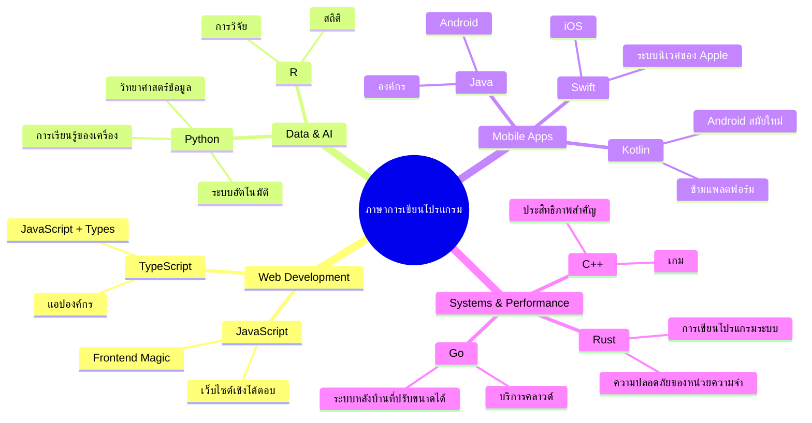
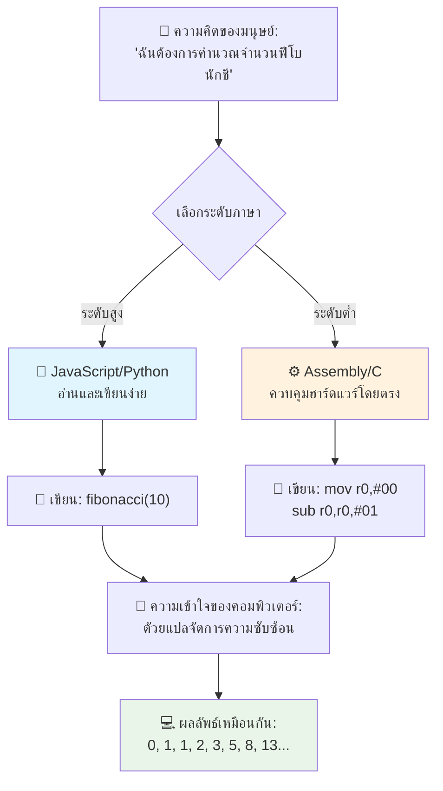
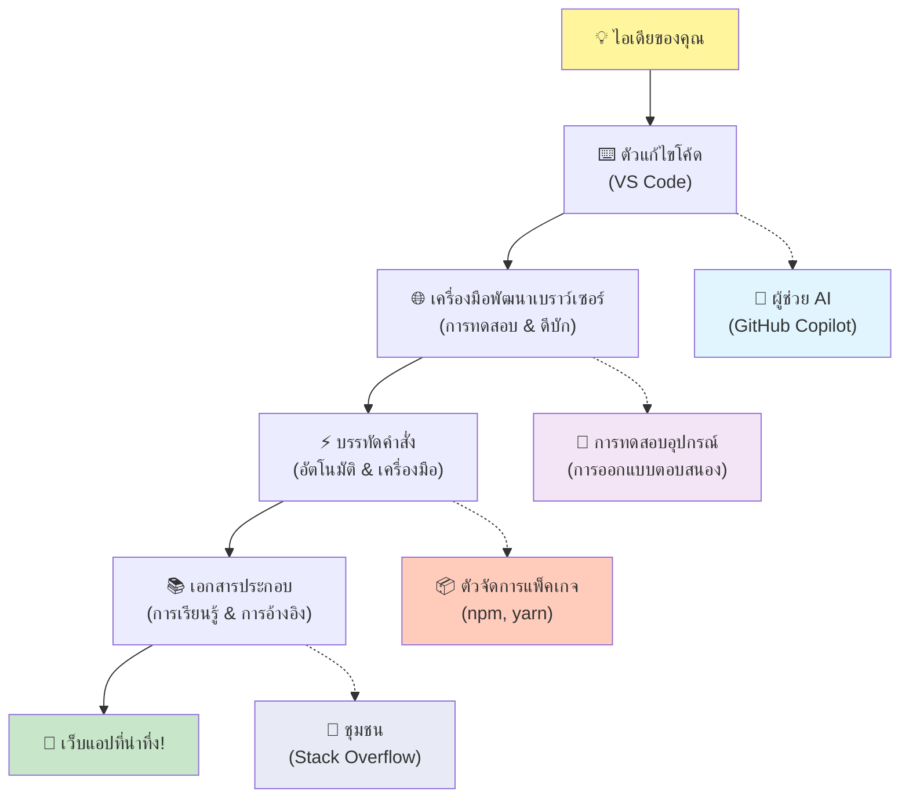
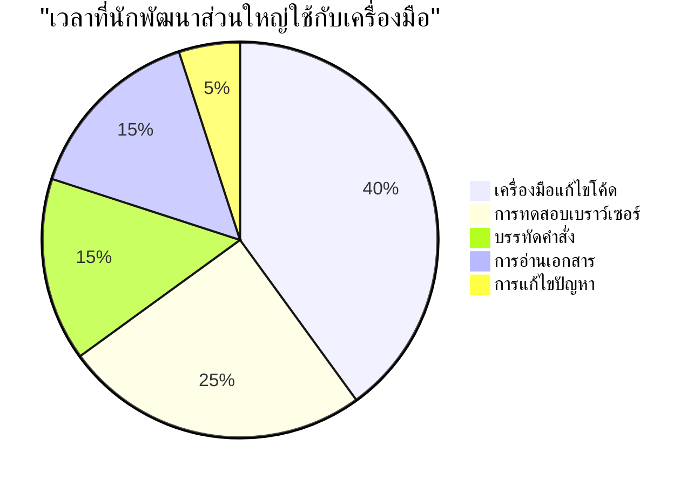
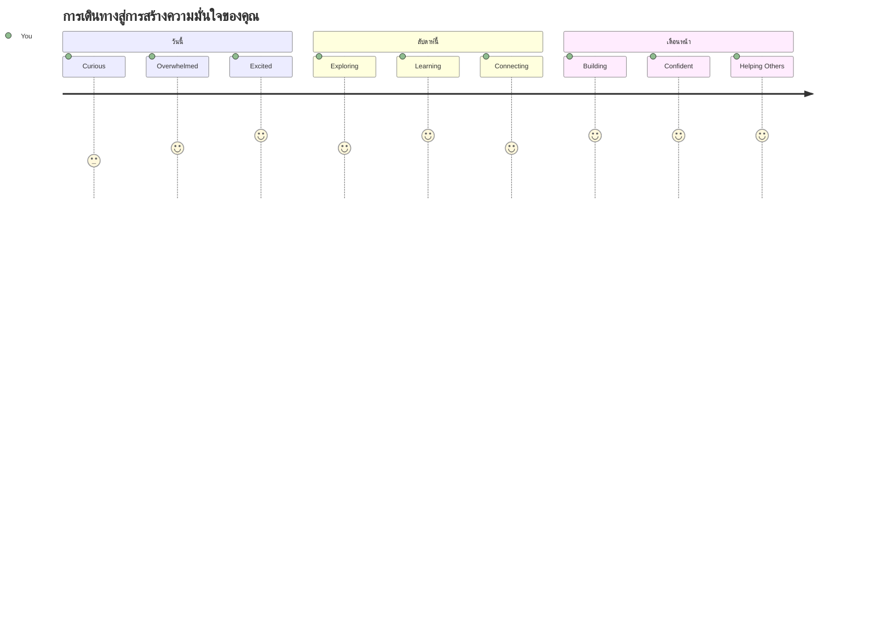

# บทนำสู่ภาษาโปรแกรมและเครื่องมือสำหรับนักพัฒนาในยุคปัจจุบัน
 
สวัสดีครับ นักพัฒนาในอนาคต! 👋 ขอเล่าอะไรให้ฟังที่ยังทำให้ผมตื่นเต้นได้ทุกวันไหม? คุณกำลังจะได้ค้นพบว่า การเขียนโปรแกรมไม่ได้เป็นแค่เรื่องของคอมพิวเตอร์ – แต่มันคือพลังวิเศษที่แท้จริงที่จะทำให้ไอเดียสุดบ้าคลั่งของคุณกลายเป็นจริง!

คุณเคยเจอช่วงเวลาที่ใช้แอปที่ชอบแล้วทุกอย่างมันลงตัวเป๊ะๆ ไหม? ตอนที่แตะปุ่มแล้วมีอะไรบางอย่างแสนวิเศษเกิดขึ้นจนคุณต้องร้อง "ว้าว พวกเขาทำได้ยังไง?" คนที่เขียนโค้ดสร้างความวิเศษนั้นอาจจะเป็นคนเหมือนคุณ – กำลังนั่งอยู่ในร้านกาแฟที่ชอบตอนตี 2 พร้อมกับกาแฟเอสเปรสโซ่แก้วที่สาม – และนี่แหละที่จะทำให้คุณตกใจ: เมื่อจบบทเรียนนี้ คุณจะไม่เพียงแต่เข้าใจว่าพวกเขาทำแบบนั้นอย่างไร แต่คุณยังจะตื่นเต้นอยากลองทำเองด้วย!

ฟังนะ ผมเข้าใจดีว่าการโปรแกรมอาจดูลึกลับและน่ากลัวตอนนี้ ตอนที่ผมเริ่มแรกๆ ผมคิดจริงๆ ว่าต้องเป็นอัจฉริยะคณิตศาสตร์หรือเขียนโค้ดมาตั้งแต่อายุ 5 ขวบ แต่สิ่งที่เปลี่ยนมุมมองผมโดยสิ้นเชิงคือ: การเขียนโปรแกรมเหมือนกับการเรียนรู้การสนทนาในภาษาใหม่ คุณเริ่มต้นที่ "สวัสดี" กับ "ขอบคุณ" แล้วพัฒนาจนสั่งกาแฟได้ ก่อนที่คุณจะรู้ตัว คุณก็พูดคุยปรัชญากันลึกซึ้งแล้ว! แต่ในกรณีนี้ คุณกำลังคุยกับคอมพิวเตอร์ และจริงๆ แล้ว พวกมันเป็นคู่สนทนาที่อดทนที่สุด – ไม่เคยตัดสินความผิดพลาดของคุณและพร้อมลองใหม่เสมอ!

วันนี้ เราจะมาสำรวจเครื่องมือสุดเจ๋งที่ทำให้การพัฒนาเว็บสมัยใหม่ไม่ใช่แค่เรื่องเป็นไปได้ แต่ติดใจได้จริงๆ ผมกำลังพูดถึงตัวแก้ไขโค้ด, เบราว์เซอร์ และเวิร์กโฟลวเดียวกับที่นักพัฒนาที่ Netflix, Spotify และสตูดิโอแอปอินดี้ที่คุณชอบใช้ทุกวัน และนี่คือสิ่งที่จะทำให้คุณกระโดดโลดเต้น: เครื่องมือมืออาชีพระดับสูงและมาตรฐานอุตสาหกรรมส่วนใหญ่ใช้ได้ฟรีเลย!


> Sketchnote โดย [Tomomi Imura](https://twitter.com/girlie_mac)


```mermaid
journey
    title การเดินทางในการเขียนโปรแกรมของคุณในวันนี้
    section ค้นพบ
      โปรแกรมมิ่งคืออะไร: 5: You
      ภาษาโปรแกรมมิ่ง: 4: You
      ภาพรวมเครื่องมือ: 5: You
    section สำรวจ
      ตัวแก้ไขโค้ด: 4: You
      เบราว์เซอร์ & DevTools: 5: You
      แถวคำสั่ง: 3: You
    section ฝึกฝน
      นักสืบภาษา: 4: You
      การสำรวจเครื่องมือ: 5: You
      การเชื่อมต่อชุมชน: 5: You
```
## มาลองดูสิ่งที่คุณรู้กันเถอะ!

ก่อนจะกระโดดเข้าสู่สิ่งสนุกๆ ผมอยากรู้นะ – คุณรู้อะไรเกี่ยวกับโลกการเขียนโปรแกรมนี้บ้าง? และฟังนะ ถ้าคุณดูคำถามพวกนี้แล้วคิดว่า "ผมไม่รู้อะไรเลย" นั่นไม่ใช่แค่โอเค แต่มันสมบูรณ์แบบ! นั่นหมายความว่าคุณอยู่ในที่ที่ถูกต้องที่สุด คิดว่าควิซนี้เหมือนการยืดเหยียดก่อนออกกำลังกาย – เราแค่กำลังอุ่นเครื่องกล้ามเนื้อสมองกัน!

[ทำแบบทดสอบก่อนบทเรียน](https://ff-quizzes.netlify.app/web/)


## การผจญภัยที่เรากำลังจะได้ออกเดินทางไปด้วยกัน

โอเค ผมตื่นเต้นจริงๆ กับสิ่งที่เราจะได้สำรวจในวันนี้! จริงๆ ผมอยากเห็นหน้าคุณตอนแนวคิดพวกนี้เริ่มเข้าใจ นี่คือการเดินทางที่น่าทึ่งที่เรากำลังจะร่วมกัน:

- **โปรแกรมมิ่งคืออะไรจริงๆ (และทำไมมันถึงเจ๋งที่สุด!)** – เราจะค้นพบว่าโค้ดคือเวทมนตร์ที่มองไม่เห็นที่ขับเคลื่อนทุกอย่างรอบตัวคุณ ตั้งแต่สัญญาณเตือนที่รู้ว่ามันคือเช้าวันจันทร์ไปจนถึงอัลกอริทึมที่คัดสรรรายชื่อแนะนำ Netflix ของคุณอย่างแม่นยำ
- **ภาษาโปรแกรมและบุคลิกที่น่าทึ่งของพวกมัน** – จินตนาการว่าคุณเดินเข้าปาร์ตี้ที่แต่ละคนมีพลังวิเศษและวิธีแก้ปัญหาที่แตกต่างกัน นั่นแหละคือโลกของภาษาโปรแกรม และคุณจะต้องชอบที่ได้รู้จักพวกเขา!
- **บล็อกสร้างสรรค์พื้นฐานที่ทำให้เวทมนตร์ดิจิทัลเกิดขึ้น** – คิดว่าสิ่งเหล่านี้คือชุดตัวต่อ LEGO ที่สร้างสรรค์ที่สุด เมื่อคุณเข้าใจว่าชิ้นส่วนเหล่านี้ประกอบกันอย่างไร คุณจะรู้ว่าคุณสามารถสร้างอะไรก็ได้จากจินตนาการของคุณ
- **เครื่องมือมืออาชีพที่จะทำให้คุณรู้สึกเหมือนเพิ่งได้รับไม้คาถาของพ่อมด** – ผมไม่ได้พูดเกินจริง – เครื่องมือพวกนี้จะทำให้คุณรู้สึกเหมือนมีพลังวิเศษจริงๆ และส่วนที่ดีที่สุดคือ? มันคือเครื่องมือเดียวกับที่มือโปรใช้!

> 💡 **นี่แหละประเด็นสำคัญ**: อย่าคิดแม้แต่จะจำทุกอย่างในวันนี้เลย! ตอนนี้แค่ให้คุณรู้สึกถึงประกายแห่งความตื่นเต้นว่ามีสิ่งที่เป็นไปได้แค่ไหน รายละเอียดจะติดตามมาเองตามธรรมชาติเมื่อลองทำจริง – นี่แหละคือการเรียนรู้ของแท้!

> คุณสามารถเรียนบทเรียนนี้ได้ที่ [Microsoft Learn](https://learn.microsoft.com/en-us/learn/modules/web-development-101/introduction-programming/?WT.mc_id=academic-77807-sagibbon)!

## แล้วโปรแกรมมิ่ง *คืออะไร* กันแน่?

ดี เรามาจับคำถามเงินล้าน: โปรแกรมมิ่งคืออะไรจริงๆ?

ผมจะเล่าเรื่องที่เปลี่ยนวิธีคิดของผมไปเลย เมื่อสัปดาห์ก่อน ผมพยายามอธิบายให้แม่ฟังว่าจะใช้รีโมตทีวีอัจฉริยะเครื่องใหม่ยังไง ผมจับได้ว่ากำลังพูดว่า "กดปุ่มแดง ไม่ใช่ปุ่มแดงใหญ่ ปุ่มแดงเล็กฝั่งซ้าย... ไม่ ฝั่งซ้ายอีกข้าง... โอเค ตอนนี้กดค้างไว้สองวินาที ไม่ใช่หนึ่งหรือสาม..." คุ้นๆ ไหม? 😅

นั่นแหละคือการเขียนโปรแกรม! มันคือศิลปะการให้คำแนะนำอย่างละเอียดทีละขั้นตอนกับสิ่งที่ทรงพลังแต่ต้องอธิบายทุกอย่างให้ชัดเจน เทียบกับการอธิบายให้แม่ฟัง (แม่อาจถามว่า "ปุ่มแดงไหน?") ครั้งนี้คือการอธิบายให้คอมพิวเตอร์ฟัง (ซึ่งทำตามคำสั่งเป๊ะๆ แม้ว่าคำสั่งนั้นจะไม่ตรงกับที่คุณตั้งใจ)

สิ่งที่ทำให้ผมตะลึงตอนแรกเรียนคือ: คอมพิวเตอร์จริงๆ แล้วง่ายมากในแก่นแท้ มันเข้าใจแค่สองอย่าง – 1 และ 0 ซึ่งก็คือ "ใช่" และ "ไม่ใช่" หรือ "เปิด" กับ "ปิด" เท่านั้น! แต่สิ่งที่เป็นเวทมนตร์คือ – เราไม่ต้องพูดด้วย 1 และ 0 เหมือนใน The Matrix นั่นแหละ ที่มาของ **ภาษาโปรแกรม** ที่คอยแปลภาษามนุษย์ที่เราคิดให้กลายเป็นภาษาคอมพิวเตอร์

และนี่คือสิ่งที่ยังทำให้ผมรู้สึกเย็นวูบทุกเช้าเมื่อผมตื่นขึ้นมา: ทุกสิ่งดิจิทัลในชีวิตคุณเริ่มต้นจากคนที่เหมือนคุณ กำลังนั่งในชุดนอนกับแก้วกาแฟ พิมพ์โค้ดบนแล็ปท็อป ฟิลเตอร์ Instagram ที่ทำให้คุณดูไม่มีที่ติ? คนคนหนึ่งเขียนโค้ดอันนั้น คำแนะนำที่ทำให้คุณเจอเพลงโปรดใหม่? นักพัฒนาเขียนอัลกอริทึมนั้น แอปที่ช่วยแยกบิลมื้อค่ำกับเพื่อน? ใช่เลย ใครสักคนคิดว่า "นี่น่ารำคาญ ฉันน่าจะแก้ได้" แล้วก็ทำจริง!

เมื่อคุณเรียนรู้โปรแกรมมิ่ง คุณไม่ได้แค่เพิ่มทักษะใหม่ – แต่เป็นส่วนหนึ่งของชุมชนนักแก้ปัญหาสุดวิเศษที่ใช้เวลาทั้งวันคิดว่า "ถ้าฉันสร้างอะไรสักอย่างที่ทำให้วันของใครสักคนดีขึ้นนิดหน่อยได้ล่ะ?" จริงๆ จะมีอะไรเจ๋งกว่านี้ไหม?

✅ **สนุกกับการค้นหาข้อมูล**: นี่เป็นสิ่งเจ๋งที่ควรค้นหาเมื่อคุณมีเวลาว่าง – คุณคิดว่าใครคือโปรแกรมเมอร์คนแรกของโลก? ผมจะให้คำใบ้: อาจไม่ใช่คนที่คุณคาดคิด! เรื่องราวของคนนี้น่าทึ่งมากและแสดงให้เห็นว่าการเขียนโปรแกรมคือศิลปะแห่งการแก้ปัญหาอย่างสร้างสรรค์และคิดนอกกรอบเสมอมา

### 🧠 **เช็คอิน: ตอนนี้คุณรู้สึกยังไง?**

**ขอเวลาสักครู่ไตร่ตรอง:**
- ความคิดเรื่อง "การให้คำสั่งกับคอมพิวเตอร์" เข้าใจไหมตอนนี้?
- คุณนึกถึงงานประจำวันที่อยากอัตโนมัติด้วยโปรแกรมไหม?
- มีคำถามอะไรเด่นชัดในหัวเกี่ยวกับการเขียนโปรแกรมนี้ไหม?

> **จำไว้ว่า**: ปกติหมดถ้าแนวคิดบางอย่างยังไม่ชัดเจน การเรียนเขียนโปรแกรมเหมือนการเรียนภาษาใหม่ – ต้องใช้เวลาสร้างทางเดินประสาทในสมอง คุณทำได้ดีมาก!

## ภาษาโปรแกรมคือรสชาติเวทมนตร์ที่แตกต่างกัน

โอเค ฟังดูแปลกนิดหน่อยแต่ขอให้ตามผมไป – ภาษาโปรแกรมเหมือนกับประเภทดนตรีที่แตกต่างกัน ลองนึกถึง: คุณมีแจ๊สที่ลื่นไหลและเล่นสด, ร็อกที่ทรงพลังและตรงไปตรงมา, คลาสสิกที่สง่างามและมีโครงสร้าง และฮิปฮอปที่สร้างสรรค์และแสดงออก สไตล์แต่ละอย่างมีบรรยากาศเป็นของตัวเอง ชุมชนแฟนคลับที่คลั่งไคล้ และเหมาะกับอารมณ์และโอกาสที่แตกต่างกัน

ภาษาโปรแกรมก็เหมือนกัน! คุณไม่ใช้ภาษาเดียวกันสร้างเกมมือถือสนุกๆ กับภาษาที่ใช้ประมวลผลข้อมูลภูมิอากาศจำนวนมาก เหมือนกับคุณไม่เปิดเพลงเดธเมทัลที่คลาสเรียนโยคะ (เอ่อ ส่วนใหญ่ก็ใช่! 😄)

แต่สิ่งที่ทำให้ผมประหลาดใจทุกครั้งที่คิดถึง: ภาษาเหล่านี้เหมือนล่ามที่อดทนและอัจฉริยะที่สุดในโลกนั่งอยู่ข้างๆ คุณ คุณสามารถแสดงความคิดในรูปแบบที่เป็นธรรมชาติกับสมองมนุษย์ และพวกเขาจะจัดการเรื่องซับซ้อนทั้งหมดในการแปลงเป็น 1 และ 0 ที่คอมพิวเตอร์เข้าใจ มันเหมือนมีเพื่อนที่พูดได้คล่องทั้ง "ความสร้างสรรค์มนุษย์" และ "ตรรกะคอมพิวเตอร์" – และเขาไม่เคยเหนื่อย ไม่ต้องพักกาแฟ และไม่เคยดุเวลาคุณถามคำถามเดิมซ้ำ!

### ภาษาที่ได้รับความนิยมและการใช้งาน


```mermaid
mindmap
  root((ภาษาการเขียนโปรแกรม))
    Web Development
      JavaScript
        Frontend Magic
        เว็บไซต์เชิงโต้ตอบ
      TypeScript
        JavaScript + Types
        แอปองค์กร
    Data & AI
      Python
        วิทยาศาสตร์ข้อมูล
        การเรียนรู้ของเครื่อง
        ระบบอัตโนมัติ
      R
        สถิติ
        การวิจัย
    Mobile Apps
      Java
        Android
        องค์กร
      Swift
        iOS
        ระบบนิเวศของ Apple
      Kotlin
        Android สมัยใหม่
        ข้ามแพลตฟอร์ม
    Systems & Performance
      C++
        เกม
        ประสิทธิภาพสำคัญ
      Rust
        ความปลอดภัยของหน่วยความจำ
        การเขียนโปรแกรมระบบ
      Go
        บริการคลาวด์
        ระบบหลังบ้านที่ปรับขนาดได้
```
| ภาษา | เหมาะสำหรับ | ทำไมถึงได้รับความนิยม |
|----------|----------|------------------|
| **JavaScript** | พัฒนาเว็บ, ส่วนติดต่อผู้ใช้ | รันในเบราว์เซอร์และขับเคลื่อนเว็บไซต์โต้ตอบได้ |
| **Python** | วิทยาศาสตร์ข้อมูล, อัตโนมัติ, ปัญญาประดิษฐ์ | อ่านและเรียนรู้ง่าย, มีไลบรารีทรงพลัง |
| **Java** | แอปองค์กร, แอป Android | ใช้งานข้ามแพลตฟอร์ม, แข็งแกร่งสำหรับระบบใหญ่ |
| **C#** | แอป Windows, พัฒนาเกม | ได้รับการสนับสนุนระบบนิเวศของ Microsoft อย่างเข้มแข็ง |
| **Go** | บริการคลาวด์, ระบบแบ็คเอนด์ | เร็ว, เรียบง่าย, ออกแบบสำหรับคอมพิวเตอร์ยุคใหม่ |

### ภาษาเลเวลสูงกับเลเวลต่ำ

โอเค นี่คือแนวคิดที่ทำให้ผมปวดหัวสุดตอนเริ่มเรียน ผมจะแบ่งปันเปรียบเทียบที่ทำให้ผมเข้าใจและหวังว่าจะช่วยคุณได้ด้วย!

ลองนึกภาพว่าคุณไปประเทศที่พูดภาษานั้นไม่ได้และต้องหาห้องน้ำด่วน (เราผ่านเรื่องนี้กันมาแล้วใช่ไหม? 😅):

- **การโปรแกรมระดับต่ำ** เหมือนเรียนภาษาพื้นเมืองจนสามารถคุยกับยายขายผลไม้ตรงมุมถนนโดยใช้ความรู้ทางวัฒนธรรม, สแลงในท้องถิ่น, และมุกลับหัวที่มีเฉพาะคนโตที่นั่นจะเข้าใจ ฟังดูประทับใจและมีประสิทธิภาพมาก...ถ้าคุณพูดภาษานั้นคล่อง! แต่ก็ลำบากเหลือเกินเมื่อแค่อยากหาห้องน้ำ

- **การโปรแกรมระดับสูง** เหมือนมีเพื่อนท้องถิ่นที่เข้าใจคุณ คุณบอก "ฉันอยากหาห้องน้ำ" แบบอังกฤษง่ายๆ และเขาจัดการแปลวัฒนธรรมและบอกทางให้ในแบบที่สมองที่ไม่ใช่คนท้องถิ่นเข้าใจได้ดีมาก

ในภาษาโปรแกรม:
- **ระดับต่ำ** (เช่น Assembly หรือ C) ให้คุณมีบทสนทนาอย่างละเอียดกับฮาร์ดแวร์คอมพิวเตอร์จริงๆ แต่ต้องคิดเหมือนเครื่องจักร ซึ่ง...บอกเลยเป็นการเปลี่ยนความคิดที่ใหญ่มาก!
- **ระดับสูง** (เช่น JavaScript, Python, หรือ C#) ให้คุณคิดเหมือนมนุษย์ ขณะที่พวกมันจัดการเรื่องภาษาเครื่องที่ซับซ้อนอยู่เบื้องหลัง ยิ่งไปกว่านั้น มีชุมชนต้อนรับที่อบอุ่นเต็มไปด้วยคนที่จำได้ว่ารู้สึกยังไงตอนเริ่มใหม่และอยากช่วยเหลือจริงใจ!

เดาไหมว่าภาษาแบบไหนที่ผมจะแนะนำให้เริ่มด้วย? 😉 ภาษาเลเวลสูงเหมือนการใส่ล้อฝึกที่คุณแทบไม่อยากถอดเพราะมันทำให้ประสบการณ์สนุกมากขึ้น!


```mermaid
flowchart TB
    A["👤 ความคิดของมนุษย์:<br/>'ฉันต้องการคำนวณจำนวนฟีโบนักชี'"] --> B{เลือกระดับภาษา}
    
    B -->|ระดับสูง| C["🌟 JavaScript/Python<br/>อ่านและเขียนง่าย"]
    B -->|ระดับต่ำ| D["⚙️ Assembly/C<br/>ควบคุมฮาร์ดแวร์โดยตรง"]
    
    C --> E["📝 เขียน: fibonacci(10)"]
    D --> F["📝 เขียน: mov r0,#00<br/>sub r0,r0,#01"]
    
    E --> G["🤖 ความเข้าใจของคอมพิวเตอร์:<br/>ตัวยแปลจัดการความซับซ้อน"]
    F --> G
    
    G --> H["💻 ผลลัพธ์เหมือนกัน:<br/>0, 1, 1, 2, 3, 5, 8, 13..."]
    
    style C fill:#e1f5fe
    style D fill:#fff3e0
    style H fill:#e8f5e8
```
### ให้ผมโชว์ให้เห็นว่าทำไมภาษาเลเวลสูงถึงมิตรไมตรีแบบนี้

โอเค ผมกำลังจะโชว์อะไรบางอย่างที่แสดงได้อย่างชัดเจนว่าทำไมผมถึงหลงรักภาษาเลเวลสูง แต่ก่อนอื่น – ขอให้สัญญาอย่างหนึ่งนะเมื่อเห็นตัวอย่างโค้ดแรก อย่าตกใจ! มันควรดูน่ากลัว นั่นคือประเด็นที่ผมจะสื่อ!

เราจะดูงานเดียวกันเขียนด้วยสองสไตล์ที่ต่างกันสุดขั้ว ทั้งสองโค้ดสร้างสิ่งที่เรียกว่าลำดับฟีโบนักชี – แบบแผนทางคณิตศาสตร์ที่สวยงาม ซึ่งแต่ละเลขเป็นผลบวกของสองตัวก่อนหน้า: 0, 1, 1, 2, 3, 5, 8, 13... (ข้อสนุก: ลายนี้พบได้ทุกที่ในธรรมชาติ – เช่นเกลียวเมล็ดทานตะวัน, ลวดลายเมล็ดสน และแม้แต่การก่อตัวของกาแล็กซี!)

พร้อมดูความแตกต่างแล้วใช่ไหม? ไปกันเลย!

**ภาษาเลเวลสูง (JavaScript) – เป็นมิตรกับคน:**

```javascript
// ขั้นตอนที่ 1: การตั้งค่าพื้นฐานของฟีโบนัชชี
const fibonacciCount = 10;
let current = 0;
let next = 1;

console.log('Fibonacci sequence:');
```

**โค้ดนี้ทำอะไร:**
- **ประกาศ** ค่าคงที่เพื่อระบุจำนวนเลขฟีโบนักชีที่ต้องการสร้าง
- **เริ่ม** ตัวแปรสองตัวเพื่อติดตามเลขปัจจุบันและถัดไปในลำดับ
- **ตั้งค่า** ค่าต้น (0 และ 1) ที่ก่อตัวลำดับฟีโบนักชี
- **แสดง** หัวข้อเพื่อระบุผลลัพธ์

```javascript
// ขั้นตอนที่ 2: สร้างลำดับด้วยการใช้ลูป
for (let i = 0; i < fibonacciCount; i++) {
  console.log(`Position ${i + 1}: ${current}`);
  
  // คำนวณตัวเลขถัดไปในลำดับ
  const sum = current + next;
  current = next;
  next = sum;
}
```

**แยกส่วนสิ่งที่เกิดขึ้น:**
- **วนลูป** ผ่านทุกตำแหน่งในลำดับด้วย `for` loop
- **แสดง** แต่ละตัวเลขพร้อมตำแหน่งโดยใช้ template literal
- **คำนวณ** เลขฟีโบนักชีตัวถัดไปโดยบวกค่าในปัจจุบันกับตัวถัดไป
- **อัปเดต** ตัวแปรเพื่อไปยังรอบถัดไป

```javascript
// ขั้นตอนที่ 3: วิธีการเชิงฟังก์ชันสมัยใหม่
const generateFibonacci = (count) => {
  const sequence = [0, 1];
  
  for (let i = 2; i < count; i++) {
    sequence[i] = sequence[i - 1] + sequence[i - 2];
  }
  
  return sequence;
};

// ตัวอย่างการใช้งาน
const fibSequence = generateFibonacci(10);
console.log(fibSequence);
```

**ในโค้ดด้านบน:**
- **สร้าง** ฟังก์ชันที่ใช้ซ้ำได้ด้วย syntax ลูกศรแบบใหม่
- **สร้าง** อาร์เรย์เพื่อเก็บลำดับทั้งหมดแทนการแสดงผลทีละตัว
- **ใช้** ดัชนีอาร์เรย์คำนวณเลขใหม่จากค่าก่อนหน้า
- **ส่งคืน** ลำดับทั้งหมดเพื่อการใช้งานยืดหยุ่นในโปรแกรมส่วนอื่น

**ภาษาเลเวลต่ำ (ARM Assembly) – เป็นมิตรกับคอมพิวเตอร์:**

```assembly
 area ascen,code,readonly
 entry
 code32
 adr r0,thumb+1
 bx r0
 code16
thumb
 mov r0,#00
 sub r0,r0,#01
 mov r1,#01
 mov r4,#10
 ldr r2,=0x40000000
back add r0,r1
 str r0,[r2]
 add r2,#04
 mov r3,r0
 mov r0,r1
 mov r1,r3
 sub r4,#01
 cmp r4,#00
 bne back
 end
```

สังเกตว่าเวอร์ชัน JavaScript อ่านเหมือนคำสั่งภาษาอังกฤษ ในขณะที่ Assembly ใช้คำสั่งลึกลับที่ควบคุมโปรเซสเซอร์โดยตรง ทั้งสองอย่างทำงานเหมือนกันเป๊ะ แต่ภาษาเลเวลสูงเข้าใจง่ายกว่าเขียนและบำรุงรักษาสำหรับคนมาก

**ความแตกต่างหลักที่คุณจะสังเกตเห็น:**
- **ความอ่านง่าย**: JavaScript ใช้ชื่อที่บรรยายความหมายชัดเจนเช่น `fibonacciCount` ขณะที่ Assembly ใช้ป้ายกำกับที่เข้าใจยากอย่าง `r0`, `r1`
- **คอมเมนต์**: ภาษาระดับสูงส่งเสริมให้มีคอมเมนต์ที่อธิบายชัดเจนซึ่งทำให้โค้ดเป็นเอกสารด้วยตัวเอง
- **โครงสร้าง**: โฟลว์เชิงตรรกะของ JavaScript สอดคล้องกับวิธีที่มนุษย์คิดแก้ปัญหาเป็นขั้นตอน
- **การบำรุงรักษา**: การอัพเดตเวอร์ชัน JavaScript สำหรับความต้องการที่ต่างกันเป็นเรื่องง่ายและชัดเจน

✅ **เกี่ยวกับลำดับฟีโบนัชชี**: รูปแบบตัวเลขที่งดงามอย่างยิ่งนี้ (ที่แต่ละตัวเท่ากับผลบวกของสองตัวก่อนหน้า: 0, 1, 1, 2, 3, 5, 8...) ปรากฏอยู่ในธรรมชาติแทบจะ *ทุกที่*! คุณจะพบมันในเกลียวในดอกทานตะวัน, ลวดลายในเมล็ดสน, วิธีที่เปลือกหอยนอติลุสโค้ง และแม้แต่ในวิธีที่กิ่งไม้ต้นไม้เติบโต มันช่างน่าทึ่งที่คณิตศาสตร์และโค้ดช่วยให้เราเข้าใจและสร้างรูปแบบที่ธรรมชาติเข้าใจในการสร้างความงาม!

## องค์ประกอบพื้นฐานที่ทำให้เวทมนตร์เกิดขึ้น

เอาล่ะ ตอนนี้ที่คุณได้เห็นภาษาการเขียนโปรแกรมทำงานอย่างไร ให้เรามาแยกส่วนประกอบพื้นฐานที่ประกอบขึ้นเป็นโปรแกรมทุกโปรแกรมที่เคยถูกเขียนขึ้น คิดว่าพวกนี้เหมือนส่วนผสมที่จำเป็นในสูตรอาหารที่คุณชอบ — เมื่อคุณเข้าใจว่าทุกส่วนทำอะไร คุณจะอ่านและเขียนโค้ดได้แทบทุกภาษา!

นี่ก็เหมือนกับการเรียนไวยากรณ์ของโปรแกรมมิ่ง จำได้ไหมตอนเรียนที่โรงเรียนพูดถึงคำนาม คำกริยา และวิธีต่อประโยค? การเขียนโปรแกรมก็มีไวยากรณ์ของตัวเอง และบอกเลยว่ามันมีเหตุผลมากกว่าและให้อภัยได้มากกว่าไวยากรณ์ภาษาอังกฤษเยอะ! 😄

### คำสั่ง: คำแนะนำทีละขั้นตอน

มาเริ่มต้นด้วย **คำสั่ง** – เหมือนประโยคเดียวในการสนทนากับคอมพิวเตอร์ของคุณ คำสั่งแต่ละประโยคบอกคอมพิวเตอร์ให้ทำสิ่งหนึ่งสิ่งที่เฉพาะเจาะจง เหมือนการให้ทิศทาง: "เลี้ยวซ้ายที่นี่," "หยุดที่สัญญาณไฟแดง," "จอดที่จุดนั้น"

สิ่งที่ฉันชอบเกี่ยวกับคำสั่งคือความอ่านง่ายของมัน ลองดูสิ:

```javascript
// คำสั่งพื้นฐานที่ทำงานเพียงอย่างเดียว
const userName = "Alex";                    
console.log("Hello, world!");              
const sum = 5 + 3;                         
```

**โค้ดนี้ทำอะไร:**
- **ประกาศ** ตัวแปรคงที่เพื่อเก็บชื่อนักใช้
- **แสดง** ข้อความทักทายบนคอนโซล
- **คำนวณ** และเก็บผลลัพธ์จากการดำเนินการทางคณิตศาสตร์

```javascript
// คำสั่งที่โต้ตอบกับเว็บเพจ
document.title = "My Awesome Website";      
document.body.style.backgroundColor = "lightblue";
```

**ทีละขั้นตอน นี่คือสิ่งที่เกิดขึ้น:**
- **แก้ไข** ชื่อเรื่องของเว็บเพจที่แสดงในแท็บเบราว์เซอร์
- **เปลี่ยนสีพื้นหลัง** ของส่วนเนื้อหาทั้งหมดของหน้าเพจ

### ตัวแปร: ระบบหน่วยความจำของโปรแกรมคุณ

โอเค, **ตัวแปร** เป็นหนึ่งในแนวคิดที่ฉันชอบสอนมากที่สุดเพราะมันเหมือนสิ่งที่คุณใช้ในชีวิตประจำวัน!

ลองนึกถึงรายชื่อผู้ติดต่อในโทรศัพท์ของคุณสักครู่ คุณไม่ได้จำหมายเลขโทรศัพท์ของทุกคน — แต่คุณบันทึกชื่อ "แม่," "เพื่อนสนิท," หรือ "ร้านพิซซ่าที่ส่งถึงตี 2" ให้โทรศัพท์จดจำหมายเลขจริง ตัวแปรก็ทำงานเหมือนกัน! มันเหมือนภาชนะมีป้ายชื่อที่โปรแกรมของคุณสามารถเก็บข้อมูลและนำมาใช้ได้โดยใช้ชื่อที่เข้าใจได้จริง

สิ่งที่เจ๋งที่สุด: ตัวแปรเปลี่ยนค่าได้ระหว่างการทำงานของโปรแกรม (จึงชื่อว่า "ตัวแปร" – ดูสิสิว่าพวกเขาคิดยังไง?) เช่นเดียวกับคุณอาจอัพเดตข้อมูลร้านพิซซ่าเมื่อพบร้านที่ดีกว่า ตัวแปรก็อัพเดตได้ขณะที่โปรแกรมเรียนรู้ข้อมูลใหม่หรือสถานการณ์เปลี่ยน!

ให้ฉันแสดงวิธีที่เรียบง่ายอย่างสวยงามนี้:

```javascript
// ขั้นตอนที่ 1: การสร้างตัวแปรพื้นฐาน
const siteName = "Weather Dashboard";        
let currentWeather = "sunny";               
let temperature = 75;                       
let isRaining = false;                      
```

**ทำความเข้าใจแนวคิดเหล่านี้:**
- **เก็บ** ค่าที่ไม่เปลี่ยนแปลงในตัวแปร `const` (เช่นชื่อเว็บไซต์)
- **ใช้** `let` สำหรับค่าที่สามารถเปลี่ยนแปลงได้ตลอดโปรแกรม
- **กำหนด** ชนิดข้อมูลต่างๆ: สตริง (ข้อความ), ตัวเลข, และบูลีน (จริง/เท็จ)
- **เลือก** ชื่อที่บรรยายความหมายว่าแต่ละตัวแปรเก็บอะไร

```javascript
// ขั้นตอนที่ 2: การทำงานกับอ็อบเจ็กต์เพื่อจัดกลุ่มข้อมูลที่เกี่ยวข้องกัน
const weatherData = {                       
  location: "San Francisco",
  humidity: 65,
  windSpeed: 12
};
```

**ในตัวอย่างนี้เราได้:**
- **สร้าง** อ็อบเจกต์เพื่อรวมข้อมูลสภาพอากาศที่เกี่ยวข้องเข้าด้วยกัน
- **จัดระเบียบ** ข้อมูลหลายชิ้นไว้ภายใต้ชื่อตัวแปรเดียว
- **ใช้** คู่คีย์-ค่าเพื่อให้ป้ายชื่อข้อมูลแต่ละส่วนชัดเจน

```javascript
// ขั้นตอนที่ 3: การใช้และอัปเดตตัวแปร
console.log(`${siteName}: Today is ${currentWeather} and ${temperature}°F`);
console.log(`Wind speed: ${weatherData.windSpeed} mph`);

// การอัปเดตตัวแปรที่สามารถเปลี่ยนแปลงได้
currentWeather = "cloudy";                  
temperature = 68;                          
```

**มาเข้าใจแต่ละส่วนกัน:**
- **แสดง** ข้อมูลโดยใช้เทมเพลตลิเทอรัล `${}` 
- **เข้าถึง** คุณสมบัติของอ็อบเจกต์โดยใช้จุด (`weatherData.windSpeed`)
- **อัปเดต** ตัวแปรที่ประกาศด้วย `let` เพื่อสะท้อนสภาพเปลี่ยนแปลง
- **ผสมผสาน** ตัวแปรหลายตัวเพื่อสร้างข้อความที่มีความหมาย

```javascript
// ขั้นตอนที่ 4: การทำลายโครงสร้างแบบทันสมัยสำหรับโค้ดที่สะอาดขึ้น
const { location, humidity } = weatherData; 
console.log(`${location} humidity: ${humidity}%`);
```

**สิ่งที่ต้องรู้:**
- **แยก** คุณสมบัติเฉพาะจากอ็อบเจกต์โดยใช้การมอบหมายแบบแยกส่วน (destructuring assignment)
- **สร้าง** ตัวแปรใหม่โดยอัตโนมัติที่มีชื่อเดียวกับคีย์ของอ็อบเจกต์
- **ทำให้โค้ดเรียบง่าย** โดยหลีกเลี่ยงการใช้จุดซ้ำๆ

### การควบคุมโฟลว์: สอนโปรแกรมของคุณให้คิด

โอเค นี่คือจุดที่การเขียนโปรแกรมเริ่มน่าทึ่งอย่างแท้จริง! **การควบคุมโฟลว์** เป็นการสอนโปรแกรมของคุณให้ตัดสินใจอย่างชาญฉลาด เหมือนกับที่คุณทำทุกวันโดยแทบไม่ต้องคิดเลย

ลองจินตนาการสิ: เช้านี้คุณอาจผ่านกระบวนการตัดสินใจแบบ "ถ้าฝนตก ฉันจะหยิบร่ม ถ้าหนาว ฉันจะใส่เสื้อแจ็คเก็ต ถ้าฉันสาย ฉันจะไม่กินเช้าแล้วไปซื้อกาแฟระหว่างทาง" สมองของคุณทำตามตรรกะ if-then นี้นับสิบครั้งทุกวัน!

นี่แหละที่ทำให้โปรแกรมรู้สึกฉลาดและมีชีวิตมากกว่าการทำตามสคริปต์ที่น่าเบื่อและเดาได้ พวกมันสามารถดูสถานการณ์ ประเมินสิ่งที่เกิดขึ้น และตอบสนองได้เหมาะสม เหมือนให้โปรแกรมมีสมองที่ปรับตัวและตัดสินใจได้!

อยากเห็นว่างดงามแค่ไหน? ให้ฉันโชว์ให้ดู:

```javascript
// ขั้นตอนที่ 1: ตรรกะเงื่อนไขพื้นฐาน
const userAge = 17;

if (userAge >= 18) {
  console.log("You can vote!");
} else {
  const yearsToWait = 18 - userAge;
  console.log(`You'll be able to vote in ${yearsToWait} year(s).`);
}
```

**โค้ดนี้ทำอะไร:**
- **ตรวจสอบ** ว่าผู้ใช้มีอายุถึงเกณฑ์ลงคะแนนหรือไม่
- **ดำเนินการ** โค้ดต่างกันตามผลเงื่อนไข
- **คำนวณ** และแสดงเวลาที่เหลือจนกว่าจะมีสิทธิ์ลงคะแนนหากอายุน้อยกว่า 18
- **ให้** ข้อมูลย้อนกลับที่ชัดเจนและเป็นประโยชน์สำหรับแต่ละสถานการณ์

```javascript
// ขั้นตอนที่ 2: เงื่อนไขหลายอย่างด้วยตัวดำเนินการตรรกะ
const userAge = 17;
const hasPermission = true;

if (userAge >= 18 && hasPermission) {
  console.log("Access granted: You can enter the venue.");
} else if (userAge >= 16) {
  console.log("You need parent permission to enter.");
} else {
  console.log("Sorry, you must be at least 16 years old.");
}
```

**แยกแยะสิ่งที่เกิดขึ้นที่นี่:**
- **รวม** เงื่อนไขหลายอย่างโดยใช้ตัวดำเนินการ `&&` (และ)
- **สร้าง** ลำดับชั้นของเงื่อนไขโดยใช้ `else if` สำหรับหลายสถานการณ์
- **จัดการ** ทุกกรณีที่เป็นไปได้ด้วยคำสั่ง `else` สุดท้าย
- **ให้** ข้อมูลย้อนกลับที่ชัดเจนและใช้งานได้สำหรับแต่ละกรณี

```javascript
// ขั้นตอนที่ 3: เงื่อนไขสั้น ๆ ด้วยตัวดำเนินการเทอร์นารี
const votingStatus = userAge >= 18 ? "Can vote" : "Cannot vote yet";
console.log(`Status: ${votingStatus}`);
```

**สิ่งที่ต้องจำ:**
- **ใช้** ตัวดำเนินการเทอร์นารี (`? :`) สำหรับเงื่อนไขสองทางแบบง่าย
- **เขียน** เงื่อนไขก่อน ตามด้วย `?` ผลลัพธ์ถ้าเป็นจริง และ `:` ผลลัพธ์ถ้าเป็นเท็จ
- **ใช้** แบบนี้เมื่อต้องกำหนดค่าโดยขึ้นกับเงื่อนไข

```javascript
// ขั้นตอนที่ 4: การจัดการกรณีเฉพาะหลายกรณี
const dayOfWeek = "Tuesday";

switch (dayOfWeek) {
  case "Monday":
  case "Tuesday":
  case "Wednesday":
  case "Thursday":
  case "Friday":
    console.log("It's a weekday - time to work!");
    break;
  case "Saturday":
  case "Sunday":
    console.log("It's the weekend - time to relax!");
    break;
  default:
    console.log("Invalid day of the week");
}
```

**โค้ดนี้ทำอะไร:**
- **จับคู่** ค่าตัวแปรกับกรณีเฉพาะหลายกรณี
- **จัดกลุ่ม** กรณีที่เหมือนกัน (วันธรรมดา vs วันหยุดสุดสัปดาห์)
- **ดำเนินการ** โค้ดที่เหมาะสมเมื่อเจอคู่ที่ตรงกัน
- **รวม** กรณี `default` เพื่อจัดการค่าที่ไม่คาดคิด
- **ใช้** คำสั่ง `break` เพื่อหยุดไม่ให้โค้ดยังทำงานต่อในกรณีถัดไป

> 💡 **ตัวอย่างในชีวิตจริง**: คิดว่าการควบคุมโฟลว์เหมือนกับ GPS ที่ใจเย็นที่สุดในโลกที่ให้คำแนะนำ เช่น "ถ้ามีรถติดบนถนนเมน ให้ขึ้นทางด่วนแทน ถ้ามีการก่อสร้างบล็อกทางด่วน ให้ลองเส้นทางชมวิว" โปรแกรมก็ใช้ตรรกะเงื่อนไขแบบเดียวกันนี้ตอบสนองต่อสถานการณ์ต่างๆ อย่างชาญฉลาดและให้ประสบการณ์ที่ดีที่สุดแก่ผู้ใช้เสมอ

### 🎯 **ตรวจสอบความเข้าใจ: ความชำนาญขององค์ประกอบพื้นฐาน**

**มาดูกันว่าคุณเข้าใจพื้นฐานแค่ไหน:**
- คุณอธิบายความแตกต่างระหว่างตัวแปรกับคำสั่งได้ไหม ด้วยคำพูดของคุณเอง?
- ลองนึกสถานการณ์จริงที่คุณจะใช้การตัดสินใจ if-then (เหมือนตัวอย่างการลงคะแนนของเรา)
- มีอะไรเกี่ยวกับตรรกะการเขียนโปรแกรมที่ทำให้คุณประหลาดใจไหม?

**เพิ่มความมั่นใจอย่างรวดเร็ว:**

```mermaid
flowchart LR
    A["📝 คำสั่ง<br/>(คำแนะนำ)"] --> B["📦 ตัวแปร<br/>(การเก็บข้อมูล)"] --> C["🔀 การควบคุมลำดับ<br/>(การตัดสินใจ)"] --> D["🎉 โปรแกรมทำงาน!"]
    
    style A fill:#ffeb3b
    style B fill:#4caf50
    style C fill:#2196f3
    style D fill:#ff4081
```
✅ **สิ่งที่จะตามมา**: เรากำลังจะได้สนุกสุดๆ ดำลึกกับแนวคิดเหล่านี้ต่อไปในการเดินทางอันน่าทึ่งนี้ ตอนนี้แค่โฟกัสความตื่นเต้นกับทุกความเป็นไปได้ที่ยอดเยี่ยมข้างหน้า ทักษะและเทคนิคเฉพาะจะติดตัวคุณเองอย่างเป็นธรรมชาติเมื่อเราได้ฝึกฝนร่วมกัน — ฉันสัญญาว่ามันจะสนุกกว่าที่คุณคิดเยอะ!

## เครื่องมือแห่งการสร้างสรรค์

โอเค นี่คือจุดที่ฉันตื่นเต้นจนแทบเก็บอารมณ์ไม่อยู่! 🚀 เรากำลังจะพูดถึงเครื่องมือสุดพิเศษที่จะทำให้คุณรู้สึกเหมือนเพิ่งได้รับกุญแจยานอวกาศดิจิทัล

คุณรู้ไหมว่าเชฟมีมีดที่สมดุลอย่างลงตัวเหมือนเป็นส่วนหนึ่งของมือ? หรือมือกีตาร์ที่รู้สึกเหมือนมันร้องเพลงทันทีที่สัมผัส? นักพัฒนามีกลุ่มเครื่องมือวิเศษแบบเดียวกัน และนี่คือสิ่งที่จะทำให้คุณอ้าปากค้าง – ส่วนใหญ่ฟรีทั้งหมด!

ฉันกระโดดไปมาในเก้าอี้เพราะอยากแชร์สิ่งพวกนี้กับคุณมาก เพราะมันเปลี่ยนวิธีที่เราสร้างซอฟต์แวร์อย่างสิ้นเชิง เรากำลังพูดถึงผู้ช่วยเขียนโค้ดที่ขับเคลื่อนด้วย AI ที่ช่วยคุณเขียนโค้ด (ไม่ได้ล้อเล่น!), สภาพแวดล้อมคลาวด์ที่คุณสร้างแอปได้จากที่ไหนก็ได้ที่มี Wi-Fi และเครื่องมือดีบั๊กที่ซับซ้อนเหมือนมีสายตาเอกซ์เรย์สำหรับโปรแกรมของคุณ

และนี่คือส่วนที่ยังทำให้ฉันรู้สึกขนลุก: เครื่องมือเหล่านี้ไม่ใช่ "เครื่องมือสำหรับมือใหม่" ที่คุณจะต้องเลิกใช้ภายหลัง แต่นี่คือเครื่องมือระดับมืออาชีพที่นักพัฒนาที่ Google, Netflix และสตูดิโอแอปอินดี้ที่คุณชื่นชอบใช้กันในเวลานี้ คุณจะรู้สึกเหมือนมือโปรเลยล่ะที่ใช้พวกนี้!


```mermaid
graph TD
    A["💡 ไอเดียของคุณ"] --> B["⌨️ ตัวแก้ไขโค้ด<br/>(VS Code)"] 
    B --> C["🌐 เครื่องมือพัฒนาเบราว์เซอร์<br/>(การทดสอบ & ดีบัก)"]
    C --> D["⚡ บรรทัดคำสั่ง<br/>(อัตโนมัติ & เครื่องมือ)"]
    D --> E["📚 เอกสารประกอบ<br/>(การเรียนรู้ & การอ้างอิง)"]
    E --> F["🚀 เว็บแอปที่น่าทึ่ง!"]
    
    B -.-> G["🤖 ผู้ช่วย AI<br/>(GitHub Copilot)"]
    C -.-> H["📱 การทดสอบอุปกรณ์<br/>(การออกแบบตอบสนอง)"]
    D -.-> I["📦 ตัวจัดการแพ็คเกจ<br/>(npm, yarn)"]
    E -.-> J["👥 ชุมชน<br/>(Stack Overflow)"]
    
    style A fill:#fff59d
    style F fill:#c8e6c9
    style G fill:#e1f5fe
    style H fill:#f3e5f5
    style I fill:#ffccbc
    style J fill:#e8eaf6
```
### ตัวแก้ไขโค้ดและ IDEs: เพื่อนดิจิทัลใหม่ของคุณ

มาพูดถึงตัวแก้ไขโค้ดกัน — เหล่านี้กำลังจะกลายเป็นสถานที่โปรดใหม่ของคุณ! คิดว่ามันเหมือนสำนักเขียนโค้ดส่วนตัวที่คุณจะใช้เวลาส่วนใหญ่สร้างและปรับปรุงผลงานดิจิทัลของคุณ

แต่สิ่งที่วิเศษสุดเกี่ยวกับตัวแก้ไขสมัยใหม่คือมันไม่ใช่แค่ตัวแก้ไขข้อความสวยๆ พวกมันเหมือนมีที่ปรึกษาการเขียนโค้ดที่ฉลาดและสนับสนุนคุณนั่งอยู่ข้างๆ ตลอด 24/7 ตัวแก้ไขจะจับคำพิมพ์ผิดก่อนที่คุณจะรู้ตัว, แนะนำสิ่งที่ทำให้คุณดูฉลาด, ช่วยคุณเข้าใจโค้ดทุกบรรทัด และบางตัวก็ทำนายว่าคุณจะพิมพ์อะไรต่อและเสนอช่วยเติมคำให้!

ฉันจำได้ว่าตอนค้นพบฟีเจอร์เติมโค้ดอัตโนมัติครั้งแรก — รู้สึกเหมือนอยู่ในอนาคตจริงๆ เริ่มพิมพ์อะไร ตัวแก้ไขก็บอกว่า "เฮ้ คุณกำลังคิดถึงฟังก์ชันนี้ที่ทำสิ่งที่คุณต้องการอยู่หรือเปล่า?" เหมือนมีเพื่อนอ่านใจเป็นเพื่อนเขียนโค้ด!

**อะไรทำให้ตัวแก้ไขโค้ดพวกนี้สุดยอด?**

ตัวแก้ไขโค้ดสมัยใหม่มีฟีเจอร์หลากหลายที่ช่วยเพิ่มประสิทธิภาพของคุณ:

| คุณสมบัติ | ทำอะไร | ช่วยได้อย่างไร |
|---------|--------------|--------------|
| **การเน้นไวยากรณ์** | ลงสีส่วนต่างๆของโค้ด | ทำให้โค้ดอ่านง่ายและเห็นข้อผิดพลาด |
| **เติมโค้ดอัตโนมัติ** | แนะนำโค้ดขณะพิมพ์ | เร่งความเร็วการเขียนโค้ดและลดการพิมพ์ผิด |
| **เครื่องมือดีบั๊ก** | ช่วยค้นหาและแก้ไขข้อผิดพลาด | ประหยัดเวลาการแก้ปัญหาหลายชั่วโมง |
| **ส่วนขยาย** | เพิ่มฟีเจอร์เฉพาะทาง | ปรับแต่งตัวแก้ไขให้เหมาะกับเทคโนโลยีต่างๆ |
| **ผู้ช่วย AI** | แนะนำโค้ดและคำอธิบาย | เร่งการเรียนรู้และเพิ่มผลผลิต |

> 🎥 **วิดีโอแนะนำ**: อยากเห็นเครื่องมือเหล่านี้ทำงานจริง? ดูวิดีโอ [Tools of the Trade video](https://youtube.com/watch?v=69WJeXGBdxg) สำหรับภาพรวมโดยละเอียด

#### ตัวแก้ไขที่แนะนำสำหรับการพัฒนาเว็บ

**[Visual Studio Code](https://code.visualstudio.com/?WT.mc_id=academic-77807-sagibbon)** (ฟรี)
- เป็นที่นิยมที่สุดในหมู่นักพัฒนาเว็บ
- มีระบบส่วนขยายที่ยอดเยี่ยม
- มีเทอร์มินัลและรวม Git ในตัว
- **ส่วนขยายจำเป็น**:
  - [GitHub Copilot](https://marketplace.visualstudio.com/items?itemName=GitHub.copilot) - แนะนำโค้ดด้วย AI
  - [Live Share](https://marketplace.visualstudio.com/items?itemName=MS-vsliveshare.vsliveshare) - ทำงานร่วมกันแบบเรียลไทม์
  - [Prettier](https://marketplace.visualstudio.com/items?itemName=esbenp.prettier-vscode) - ฟอร์แมตโค้ดอัตโนมัติ
  - [Code Spell Checker](https://marketplace.visualstudio.com/items?itemName=streetsidesoftware.code-spell-checker) - ตรวจจับคำพิมพ์ผิดในโค้ดของคุณ

**[JetBrains WebStorm](https://www.jetbrains.com/webstorm/)** (เสียเงิน, ฟรีสำหรับนักเรียน)
- เครื่องมือดีบั๊กและทดสอบขั้นสูง
- เติมโค้ดอัจฉริยะ
- รวมระบบควบคุมเวอร์ชันในตัว

**IDEs บนคลาวด์** (ราคาแตกต่างกัน)
- [GitHub Codespaces](https://github.com/features/codespaces) - VS Code เต็มรูปแบบในเบราว์เซอร์คุณ
- [Replit](https://replit.com/) - ดีมากสำหรับเรียนรู้และแชร์โค้ด
- [StackBlitz](https://stackblitz.com/) - พัฒนาเว็บแบบเต็มสแตกทันที

> 💡 **คำแนะนำสำหรับเริ่มต้น**: เริ่มที่ Visual Studio Code — ฟรี ใช้กันทั่วไปในวงการ และมีชุมชนใหญ่มากที่สร้างคำแนะนำและส่วนขยายช่วยเหลือ

### เว็บเบราว์เซอร์: ห้องแล็บพัฒนาลับของคุณ

โอเค เตรียมตัวให้พร้อมกับความประหลาดใจสุด ๆ! คุณรู้ว่าคุณใช้เบราว์เซอร์เพื่อเลื่อนดูโซเชียลมีเดียและดูวิดีโอใช่ไหม? ปรากฏว่าตลอดเวลาที่ผ่านมา พวกมันซ่อนไปด้วยห้องแล็บพัฒนาที่น่าอัศจรรย์นี้ รอให้คุณค้นพบ!

ทุกครั้งที่คุณคลิกขวาบนหน้าเว็บแล้วเลือก "Inspect Element" คุณกำลังเปิดโลกที่ซ่อนอยู่ของเครื่องมือสำหรับนักพัฒนาที่ทรงพลังกว่าซอฟต์แวร์แพงๆ ที่ฉันเคยจ่ายเป็นร้อยดอลลาร์อย่างมากมาย มันเหมือนกับการค้นพบว่าครัวธรรมดาของคุณซ่อนห้องแล็บเชฟมืออาชีพไว้หลังแผงลับ!
ครั้งแรกที่มีคนสอนฉันเกี่ยวกับ DevTools ของเบราว์เซอร์ ฉันใช้เวลาประมาณสามชั่วโมงแค่คลิกดูไปรอบๆ แล้วก็พูดว่า "รอเดี๋ยว มันทำแบบนี้ได้ด้วยเหรอ?!" คุณสามารถแก้ไขเว็บไซต์ใดๆ ได้ในเวลาจริง เห็นความเร็วการโหลดอย่างชัดเจน ทดลองดูว่าหน้าเว็บของคุณจะเป็นอย่างไรบนอุปกรณ์ต่างๆ และแม้แต่ดีบัก JavaScript เหมือนมือโปรเลย มันน่าทึ่งสุดๆ!

**นี่คือเหตุผลที่ทำไมเบราว์เซอร์จึงเป็นอาวุธลับของคุณ:**

เมื่อคุณสร้างเว็บไซต์หรือแอปเว็บ คุณต้องเห็นว่ามันดูและทำงานอย่างไรในโลกจริง เบราว์เซอร์ไม่เพียงแสดงผลงานของคุณแต่ยังให้ข้อมูลเชิงลึกเกี่ยวกับประสิทธิภาพ การเข้าถึง และปัญหาที่อาจเกิดขึ้นได้อย่างละเอียด

#### เครื่องมือสำหรับนักพัฒนาเบราว์เซอร์ (DevTools)

เบราว์เซอร์สมัยใหม่มีชุดพัฒนาแบบครบวงจร:

| หมวดหมู่เครื่องมือ | การทำงาน | ตัวอย่างการใช้งาน |
|---------------|--------------|------------------|
| **Element Inspector** | ดูและแก้ไข HTML/CSS แบบเรียลไทม์ | ปรับแต่งสไตล์เพื่อดูผลลัพธ์ทันที |
| **Console** | ดูข้อความแจ้งข้อผิดพลาดและทดสอบ JavaScript | ดีบักปัญหาและทดลองโค้ด |
| **Network Monitor** | ติดตามการโหลดทรัพยากร | ปรับปรุงประสิทธิภาพและเวลาการโหลด |
| **Accessibility Checker** | ทดสอบการออกแบบที่ครอบคลุม | ตรวจสอบว่าไซต์ของคุณใช้งานได้สำหรับทุกคน |
| **Device Simulator** | ดูตัวอย่างบนหน้าจอขนาดต่างๆ | ทดสอบการออกแบบตอบสนองโดยไม่ต้องใช้หลายอุปกรณ์ |

#### เบราว์เซอร์ที่แนะนำสำหรับการพัฒนา

- **[Chrome](https://developers.google.com/web/tools/chrome-devtools/)** - DevTools มาตรฐานอุตสาหกรรมพร้อมเอกสารอย่างละเอียด
- **[Firefox](https://developer.mozilla.org/docs/Tools)** - เครื่องมือดีมากสำหรับ CSS Grid และการเข้าถึง
- **[Edge](https://docs.microsoft.com/microsoft-edge/devtools-guide-chromium/?WT.mc_id=academic-77807-sagibbon)** - สร้างบน Chromium พร้อมทรัพยากรนักพัฒนาของ Microsoft

> ⚠️ **คำแนะนำสำคัญในการทดสอบ**: ทดสอบเว็บไซต์ของคุณในเบราว์เซอร์หลายตัวเสมอ! สิ่งที่ทำงานได้อย่างสมบูรณ์ใน Chrome อาจดูแตกต่างใน Safari หรือ Firefox นักพัฒนามืออาชีพทดสอบในทุกเบราว์เซอร์หลักเพื่อให้ประสบการณ์ผู้ใช้สอดคล้องกัน


### เครื่องมือบรรทัดคำสั่ง: ประตูสู่พลังเวทมนตร์ของนักพัฒนา

เอาล่ะ มาช่วงเวลาที่ตรงไปตรงมาสักหน่อยเกี่ยวกับบรรทัดคำสั่ง เพราะฉันอยากให้คุณได้ยินจากคนที่เข้าใจจริงๆ เมื่อฉันเห็นมันครั้งแรก—แค่จอสีดำที่มีข้อความกะพริบ ฉันคิดจริงๆ ว่า "ไม่ล่ะ ไม่มีทาง! มันดูเหมือนฉากในหนังแฮกเกอร์ยุค 1980 แล้วฉันไม่ฉลาดพอแน่ๆ!" 😅

แต่สิ่งที่ฉันอยากมีคนบอกฉันตอนนั้น และฉันกำลังบอกคุณตอนนี้: บรรทัดคำสั่งไม่ได้น่ากลัวเลย—มันเหมือนพูดคุยโดยตรงกับคอมพิวเตอร์ของคุณ ลองคิดว่ามันเหมือนความแตกต่างระหว่างสั่งอาหารผ่านแอปที่สวยงามมีรูปและเมนู (ซึ่งง่ายและสะดวก) กับการเดินเข้าไปร้านอาหารท้องถิ่นที่พ่อครัวรู้ว่าคุณชอบอะไรและทำของอร่อยให้คุณแค่พูดว่า "เซอร์ไพรส์ฉันด้วยอะไรเจ๋งๆ"

บรรทัดคำสั่งคือที่ๆ นักพัฒนาไปเพื่อรู้สึกเหมือนพ่อมดจริงๆ คุณพิมพ์คำสั่งที่ดูเหมือนเวทมนตร์ (โอเค มันแค่คำสั่ง แต่มันรู้สึกเหมือนเวทมนตร์นั่นแหละ) กด enter แล้ว BOOM — คุณสร้างโครงสร้างโปรเจกต์ทั้งโปรเจกต์ ติดตั้งเครื่องมือทรงพลังจากทั่วโลก หรือดีพลอยแอปของคุณขึ้นอินเทอร์เน็ตให้ผู้คนนับล้านเห็น ทันทีที่คุณได้ลิ้มรสความสามารถนั้น มันติดใจมากจริงๆ!

**ทำไมบรรทัดคำสั่งถึงกลายเป็นเครื่องมือโปรดของคุณ:**

แม้ว่าระบบกราฟิกจะดีสำหรับหลายงาน แต่บรรทัดคำสั่งเชี่ยวชาญเรื่องอัตโนมัติ ความแม่นยำ และความเร็ว เครื่องมือพัฒนาหลายตัวทำงานผ่านอินเทอร์เฟซบรรทัดคำสั่งเป็นหลัก และการเรียนรู้ใช้งานอย่างมีประสิทธิภาพจะช่วยเพิ่มผลผลิตของคุณอย่างมาก

```bash
# ขั้นตอนที่ 1: สร้างและไปที่ไดเรกทอรีโปรเจกต์
mkdir my-awesome-website
cd my-awesome-website
```

**โค้ดนี้ทำอะไร:**
- **สร้าง** โฟลเดอร์ใหม่ชื่อ "my-awesome-website" สำหรับโปรเจกต์ของคุณ
- **เปลี่ยนเข้าไปในโฟลเดอร์ที่สร้างขึ้น** เพื่อเริ่มทำงาน

```bash
# ขั้นตอนที่ 2: เริ่มต้นโครงการด้วย package.json
npm init -y

# ติดตั้งเครื่องมือพัฒนาที่ทันสมัย
npm install --save-dev vite prettier eslint
npm install --save-dev @eslint/js
```

**ทีละขั้นตอน นี่คือสิ่งที่เกิดขึ้น:**
- **เริ่มต้น** โปรเจกต์ Node.js ใหม่โดยใช้การตั้งค่าเริ่มต้นด้วย `npm init -y`
- **ติดตั้ง** Vite เป็นเครื่องมือสร้างสมัยใหม่เพื่อการพัฒนาและสร้างโปรเจกต์อย่างรวดเร็ว
- **เพิ่ม** Prettier สำหรับจัดรูปแบบโค้ดอัตโนมัติ และ ESLint สำหรับตรวจสอบคุณภาพโค้ด
- **ใช้** ธง `--save-dev` เพื่อบ่งชี้ว่าขึ้นอยู่กับสิ่งเหล่านี้เฉพาะในระหว่างพัฒนาเท่านั้น

```bash
# ขั้นตอนที่ 3: สร้างโครงสร้างและไฟล์ของโปรเจกต์
mkdir src assets
echo '<!DOCTYPE html><html><head><title>My Site</title></head><body><h1>Hello World</h1></body></html>' > index.html

# เริ่มเซิร์ฟเวอร์สำหรับพัฒนา
npx vite
```

**ในข้างต้น เราได้:**
- **จัดระเบียบ** โปรเจกต์ของเราโดยสร้างโฟลเดอร์แยกสำหรับซอร์สโค้ดและแอสเซท
- **สร้าง** ไฟล์ HTML พื้นฐานพร้อมโครงสร้างเอกสารที่เหมาะสม
- **เริ่ม** เซิร์ฟเวอร์พัฒนา Vite เพื่อรีโหลดแบบสดและแทนที่โมดูลร้อน

#### เครื่องมือบรรทัดคำสั่งที่จำเป็นสำหรับการพัฒนาเว็บ

| เครื่องมือ | จุดประสงค์ | ทำไมคุณต้องใช้ |
|------|---------|-----------------|
| **[Git](https://git-scm.com/)** | ควบคุมเวอร์ชัน | ติดตามการเปลี่ยนแปลง ทำงานร่วมกับผู้อื่น สำรองงาน |
| **[Node.js & npm](https://nodejs.org/)** | รันไทม์ JavaScript & จัดการแพ็กเกจ | รัน JavaScript นอกเบราว์เซอร์ ติดตั้งเครื่องมือพัฒนาสมัยใหม่ |
| **[Vite](https://vitejs.dev/)** | เครื่องมือสร้าง & เซิร์ฟเวอร์พัฒนา | พัฒนาด้วยความเร็วสูงและแทนที่โมดูลร้อน |
| **[ESLint](https://eslint.org/)** | คุณภาพโค้ด | หาและแก้ไขปัญหาใน JavaScript อัตโนมัติ |
| **[Prettier](https://prettier.io/)** | จัดรูปแบบโค้ด | รักษาโค้ดให้มีรูปแบบเดียวกันและอ่านง่าย |

#### ตัวเลือกเฉพาะแพลตฟอร์ม

**Windows:**
- **[Windows Terminal](https://docs.microsoft.com/windows/terminal/?WT.mc_id=academic-77807-sagibbon)** - เทอร์มินัลล่าสุดที่มีฟีเจอร์ครบครัน
- **[PowerShell](https://docs.microsoft.com/powershell/?WT.mc_id=academic-77807-sagibbon)** 💻 - สภาพแวดล้อมสคริปต์ที่ทรงพลัง
- **[Command Prompt](https://docs.microsoft.com/windows-server/administration/windows-commands/?WT.mc_id=academic-77807-sagibbon)** 💻 - บรรทัดคำสั่งแบบดั้งเดิมของ Windows

**macOS:**
- **[Terminal](https://support.apple.com/guide/terminal/)** 💻 - แอปเทอร์มินัลติดเครื่อง
- **[iTerm2](https://iterm2.com/)** - เทอร์มินัลที่ปรับปรุงพร้อมฟีเจอร์ขั้นสูง

**Linux:**
- **[Bash](https://www.gnu.org/software/bash/)** 💻 - เชลล์มาตรฐานของ Linux
- **[KDE Konsole](https://docs.kde.org/trunk5/en/konsole/konsole/index.html)** - โปรแกรมจำลองเทอร์มินัลขั้นสูง

> 💻 = ติดตั้งมาแล้วในระบบปฏิบัติการ

> 🎯 **เส้นทางการเรียนรู้**: เริ่มจากคำสั่งพื้นฐานอย่าง `cd` (เปลี่ยนไดเรกทอรี), `ls` หรือ `dir` (แสดงไฟล์), และ `mkdir` (สร้างโฟลเดอร์) ฝึกใช้งานกับคำสั่งในเวิร์กโฟลว์สมัยใหม่อย่าง `npm install`, `git status` และ `code .` (เปิดไดเรกทอรีปัจจุบันใน VS Code) เมื่อคุณคุ้นเคย คุณจะเรียนรู้คำสั่งขั้นสูงและเทคนิคอัตโนมัติได้อย่างเป็นธรรมชาติ


### เอกสารประกอบ: ที่ปรึกษาการเรียนรู้ที่พร้อมใช้งานเสมอ

โอเค ฉันจะบอกความลับเล็กน้อยที่จะทำให้คุณรู้สึกดีขึ้นมากเมื่อเป็นมือใหม่: แม้แต่นักพัฒนาที่มีประสบการณ์มากที่สุดก็ใช้เวลามากมายในการอ่านเอกสาร และไม่ได้เป็นเพราะพวกเขาไม่รู้ว่าจะทำยังไง—แต่เป็นสัญญาณของความฉลาด!

คิดว่าเอกสารประกอบเหมือนการเข้าถึงครูที่อดทนและเชี่ยวชาญที่สุดในโลกที่พร้อมให้คำปรึกษาตลอด 24 ชั่วโมง ถ้าคุณติดปัญหาเวลาเที่ยงคืนเอกสารก็พร้อมให้คำตอบที่คุณต้องการอย่างอบอุ่น อยากเรียนรู้ฟีเจอร์เจ๋งๆ ที่ทุกคนพูดถึง? เอกสารช่วยคุณด้วยตัวอย่างทีละขั้นตอน กำลังพยายามเข้าใจว่าทำไมสิ่งนั้นจึงทำงานอย่างที่มันเป็น? เอกสารพร้อมอธิบายจนคุณเข้าใจ!

นี่คือสิ่งที่เปลี่ยนมุมมองฉันอย่างสิ้นเชิง: โลกการพัฒนาเว็บเคลื่อนไหวเร็วมาก และไม่มีใคร (จริงๆ ไม่มีเลย!) จำทุกอย่างได้หมด ฉันเคยเห็นนักพัฒนารุ่นเก๋าที่มีประสบการณ์กว่า 15 ปียังค้นหาสินทรัพย์ไวยากรณ์พื้นฐาน และคุณรู้ไหม? นั่นไม่ใช่เรื่องน่าอาย—นั่นคือความฉลาด! มันไม่ใช่เรื่องของความจำที่สมบูรณ์แบบ แต่เป็นเรื่องรู้ว่าจะไปหาคำตอบที่น่าเชื่อถือได้อย่างรวดเร็วและเข้าใจวิธีใช้มัน

**นี่คือที่ที่เวทมนตร์จริงๆ เกิดขึ้น:**

นักพัฒนามืออาชีพใช้เวลาสัดส่วนมากในการอ่านเอกสาร—ไม่ใช่เพราะไม่รู้ว่าจะทำยังไง แต่เป็นเพราะโลกของการพัฒนาเว็บเปลี่ยนแปลงเร็วมาก การก้าวตามให้ทันต้องเรียนรู้อยู่ตลอด เอกสารดีๆ ช่วยให้คุณเข้าใจไม่ใช่แค่ *วิธี* ใช้สิ่งใดสิ่งหนึ่งเท่านั้น แต่รวมถึง *ทำไม* และ *เมื่อไหร่* ที่ควรใช้ด้วย

#### แหล่งข้อมูลเอกสารสำคัญ

**[Mozilla Developer Network (MDN)](https://developer.mozilla.org/docs/Web)**
- มาตรฐานทองคำของเอกสารเทคโนโลยีเว็บ
- คู่มือครบถ้วนสำหรับ HTML, CSS และ JavaScript
- มีข้อมูลความเข้ากันได้ของเบราว์เซอร์
- มีตัวอย่างปฏิบัติและเดโมแบบโต้ตอบ

**[Web.dev](https://web.dev)** (โดย Google)
- แนวทางปฏิบัติที่ดีที่สุดของการพัฒนาเว็บสมัยใหม่
- คู่มือการเพิ่มประสิทธิภาพ
- หลักการการเข้าถึงและการออกแบบที่ครอบคลุม
- กรณีศึกษาโปรเจกต์จริง

**[Microsoft Developer Documentation](https://docs.microsoft.com/microsoft-edge/#microsoft-edge-for-developers)**
- ทรัพยากรสำหรับการพัฒนาเบราว์เซอร์ Edge
- คู่มือ Progressive Web Apps
- บทวิเคราะห์การพัฒนาข้ามแพลตฟอร์ม

**[Frontend Masters Learning Paths](https://frontendmasters.com/learn/)**
- หลักสูตรเรียงลำดับอย่างมีโครงสร้าง
- วิดีโอคอร์สจากผู้เชี่ยวชาญในอุตสาหกรรม
- แบบฝึกหัดเขียนโค้ดแบบลงมือทำ

> 📚 **กลยุทธ์การศึกษา**: อย่าพยายามจำเอกสารประกอบให้หมด—แต่เรียนรู้วิธีนำทางได้อย่างมีประสิทธิภาพ ทำบุ๊กมาร์กแหล่งที่ใช้บ่อยๆ และฝึกใช้ฟังก์ชันค้นหาเพื่อหาข้อมูลเฉพาะได้อย่างรวดเร็ว

### 🔧 **ตรวจสอบความชำนาญเครื่องมือ: อะไรที่โดนใจคุณ?**

**หยุดคิดสักครู่:**
- เครื่องมือไหนที่คุณตื่นเต้นอยากลองใช้ก่อน? (ไม่ต้องกลัวคำตอบผิด!)
- บรรทัดคำสั่งยังน่ากลัวอยู่ไหม หรือลองอยากสำรวจมันดู?
- คุณลองคิดภาพใช้ DevTools ของเบราว์เซอร์ดูว่าได้เจาะลึกเบื้องหลังเว็บไซต์โปรดของคุณหรือเปล่า?


```mermaid
pie title "เวลาที่นักพัฒนาส่วนใหญ่ใช้กับเครื่องมือ"
    "เครื่องมือแก้ไขโค้ด" : 40
    "การทดสอบเบราว์เซอร์" : 25
    "บรรทัดคำสั่ง" : 15
    "การอ่านเอกสาร" : 15
    "การแก้ไขปัญหา" : 5
```
> **ข้อมูลน่าสนุก**: นักพัฒนาส่วนใหญ่ใช้เวลาประมาณ 40% ในการเขียนโค้ด แต่สังเกตดูว่าเวลาส่วนใหญ่หมดไปกับการทดสอบ เรียนรู้ และแก้ไขปัญหา การเขียนโปรแกรมไม่ใช่แค่การเขียนโค้ด—แต่เป็นการสร้างประสบการณ์!

✅ **อาหารสมอง**: นี่คือสิ่งที่น่าสังเกต—คุณคิดว่าเครื่องมือสำหรับการสร้างเว็บไซต์ (พัฒนา) จะต่างจากเครื่องมือสำหรับการออกแบบหน้าตาอย่างไร? มันเหมือนความต่างระหว่างสถาปนิกที่ออกแบบบ้านสวยๆ กับผู้รับเหมาเจ้าของบูธที่สร้างบ้านจริง ทั้งสองสำคัญ แต่ต้องใช้กล่องเครื่องมือคนละแบบ! วิธีคิดแบบนี้จะช่วยให้คุณเห็นภาพรวมที่ใหญ่ขึ้นของการเกิดขึ้นของเว็บไซต์

## ภารกิจ GitHub Copilot Agent 🚀

ใช้โหมด Agent เพื่อทำภารกิจต่อไปนี้:

**คำอธิบาย:** สำรวจฟีเจอร์ของตัวแก้ไขโค้ดหรือ IDE สมัยใหม่และแสดงให้เห็นว่ามันช่วยปรับปรุงเวิร์กโฟลว์ของคุณในฐานะนักพัฒนาเว็บอย่างไร

**คำสั่ง:** เลือกตัวแก้ไขโค้ดหรือ IDE (เช่น Visual Studio Code, WebStorm หรือ IDE บนคลาวด์) ระบุสามฟีเจอร์หรือส่วนขยายที่ช่วยให้คุณเขียน ดีบัก หรือดูแลโค้ดได้อย่างมีประสิทธิภาพ พร้อมอธิบายสั้นๆ ว่ามันช่วยคุณอย่างไรบ้าง

---

## 🚀 ภารกิจ

**เอาล่ะ นักสืบ พร้อมสำหรับคดีแรกของคุณหรือยัง?**

ตอนนี้ที่คุณมีพื้นฐานเจ๋งๆ แล้ว ฉันมีการผจญภัยที่จะช่วยให้คุณเห็นว่ามีความหลากหลายและน่าสนใจในโลกของโปรแกรมมิ่งมากแค่ไหน และฟังนะ—นี่ไม่ใช่การเขียนโค้ดเลย ดังนั้นไม่ต้องเครียด! ให้คิดว่าคุณเป็นนักสืบภาษาการเขียนโปรแกรมในคดีที่น่าตื่นเต้นครั้งแรกของคุณ!

**ภารกิจของคุณ หากคุณยอมรับ:**
1. **เป็นนักสำรวจภาษา**: เลือกภาษาการเขียนโปรแกรมสามภาษาจากจักรวาลที่แตกต่างกันสิ้นเชิง — อาจเป็นภาษาเว็บไซต์ ภาษาแอปมือถือ และภาษาสำหรับประมวลผลข้อมูลวิทยาศาสตร์ หาตัวอย่างงานง่ายๆ เดียวกันในแต่ละภาษา รับรองว่าคุณจะต้องทึ่งกับความแตกต่างของแต่ละภาษาในขณะที่ทำงานเดียวกันได้!
2. **ค้นหาเรื่องราวต้นกำเนิด**: อะไรที่ทำให้แต่ละภาษาโดดเด่น? ข้อเท็จจริงเจ๋งๆ คือ ภาษาการเขียนโปรแกรมทุกภาษาถูกสร้างขึ้นเพราะใครบางคนคิดว่า "ต้องมีวิธีที่ดีกว่าในการแก้ปัญหานี้" คุณสามารถหาปัญหาเหล่านั้นได้หรือเปล่า? บางเรื่องราวน่าทึ่งมาก!
3. **รู้จักชุมชน**: ดูว่าชุมชนของแต่ละภาษาต้อนรับและมีความหลงใหลแค่ไหน บางภาษามีผู้พัฒนานับล้านแบ่งปันความรู้และช่วยเหลือกัน บางภาษามีขนาดเล็กแต่ใกล้ชิดและสนับสนุนกันอย่างดี คุณจะชอบเห็นลักษณะนิสัยที่แตกต่างกันของชุมชนเหล่านี้!
4. **เชื่อสัญชาตญาณตัวเอง**: ภาษาไหนที่รู้สึกเข้าถึงง่ายที่สุดตอนนี้? อย่ากังวลเรื่องเลือกให้ถูกต้อง—แค่ฟังเสียงหัวใจคุณ! ไม่มีคำตอบผิด และคุณสามารถสำรวจภาษาอื่นได้ในภายหลัง

**งานนักสืบพิเศษ:** ลองค้นหาว่าเว็บไซต์หรือแอปดังๆ ตัวไหนสร้างด้วยภาษาแต่ละภาษา ฉันรับประกันว่าคุณจะรู้สึกตกใจเมื่อรู้ว่า Instagram, Netflix หรือเกมมือถือที่คุณติดเล่นนั้นทำด้วยอะไร!

> 💡 **จำไว้:** วันนี้คุณไม่ได้พยายามเป็นผู้เชี่ยวชาญภาษาใดๆ คุณแค่ทำความรู้จักย่านที่ตัวเองจะไปตั้งรกราก หยุดพัก สนุกกับมัน และปล่อยให้ความอยากรู้อยากเห็นพาคุณไป!

## มาฉลองสิ่งที่คุณค้นพบกันเถอะ!

โอ้โห คุณดูดซับข้อมูลอันน่าทึ่งมากมายวันนี้! ฉันตื่นเต้นจริงๆ ที่จะเห็นว่าคุณจดจำอะไรจากการเดินทางที่สุดยอดนี้ได้บ้าง และจำไว้ว่านี่ไม่ใช่การสอบที่คุณต้องตอบถูกทุกข้อ แต่มันคือการฉลองสิ่งเจ๋งๆ ที่คุณได้เรียนรู้เกี่ยวกับโลกที่น่าหลงใหลนี้ที่คุณกำลังจะดำดิ่งเข้าไป!

[ทำแบบทดสอบหลังบทเรียน](https://ff-quizzes.netlify.app/web/)

## ทบทวน & ศึกษาด้วยตนเอง

**ใช้เวลาของคุณสำรวจและสนุกกับมัน!**
คุณได้เรียนรู้มากมายในวันนี้ และนั่นคือสิ่งที่ควรภูมิใจ! ตอนนี้มาถึงส่วนที่สนุก – การสำรวจหัวข้อที่จุดประกายความอยากรู้อยากเห็นของคุณ จำไว้ว่านี่ไม่ใช่การบ้าน – แต่เป็นการผจญภัย!

**เจาะลึกสิ่งที่ทำให้คุณตื่นเต้น:**

**ลองลงมือทำกับภาษาการเขียนโปรแกรม:**
- เยี่ยมชมเว็บไซต์อย่างเป็นทางการของภาษา 2-3 ภาษา ที่ดึงดูดความสนใจคุณ แต่ละภาษามีบุคลิกและเรื่องราวของตัวเอง!
- ลองใช้พื้นที่ทดลองเขียนโค้ดออนไลน์อย่าง [CodePen](https://codepen.io/), [JSFiddle](https://jsfiddle.net/), หรือ [Replit](https://replit.com/) อย่ากลัวที่จะทดลอง – คุณไม่สามารถทำอะไรพังได้!
- อ่านเกี่ยวกับที่มาของภาษาที่คุณชอบ จริงจังนะ บางเรื่องราวที่มาเป็นเรื่องน่าสนใจมาก และจะช่วยให้คุณเข้าใจว่าทำไมภาษาเหล่านั้นถึงทำงานในแบบที่มันเป็น

**ทำความคุ้นเคยกับเครื่องมือใหม่ของคุณ:**
- ดาวน์โหลด Visual Studio Code หากคุณยังไม่ได้ทำ – มันฟรี และคุณจะชอบมัน!
- ใช้เวลาสักครู่ท่องดูตลาด Extensions มันเหมือนกับร้านแอปสำหรับเครื่องมือเขียนโค้ดของคุณ!
- เปิด Developer Tools ในเบราว์เซอร์ของคุณและลองคลิกดูอย่างรอบๆ อย่ากังวลกับการเข้าใจทุกอย่าง – แค่ทำความคุ้นเคยกับสิ่งที่มีอยู่

**เข้าร่วมกับชุมชน:**
- ติดตามชุมชนนักพัฒนาบน [Dev.to](https://dev.to/), [Stack Overflow](https://stackoverflow.com/), หรือ [GitHub](https://github.com/) ชุมชนนักเขียนโปรแกรมต้อนรับผู้เริ่มต้นอย่างอบอุ่นมาก!
- ดูวิดีโอสอนโค้ดสำหรับผู้เริ่มต้นบน YouTube มีครีเอเตอร์ยอดเยี่ยมมากมายที่จำได้ว่าการเริ่มต้นเป็นอย่างไร
- ลองเข้าร่วมกลุ่มพบปะท้องถิ่นหรือชุมชนออนไลน์ เชื่อเถอะ นักพัฒนาชอบช่วยคนใหม่!

> 🎯 **ฟังนะ นี่คือสิ่งที่ฉันต้องการให้คุณจำไว้**: คุณไม่จำเป็นต้องกลายเป็นจอมเวทโค้ดดิ้งในคืนเดียว! ตอนนี้ คุณแค่กำลังรู้จักโลกที่น่าทึ่งใบนี้ที่คุณกำลังจะเป็นส่วนหนึ่งใช้เวลาของคุณ เพลิดเพลินกับการเดินทาง และจำไว้ – นักพัฒนาทุกคนที่คุณชื่นชมก็เคยนั่งอยู่ที่จุดเดียวกับคุณในตอนนี้ รู้สึกตื่นเต้นและอาจจะรู้สึกท่วมท้นบ้าง นั่นเป็นเรื่องปกติ และหมายความว่าคุณทำถูกแล้ว!


## การบ้าน

[Reading the Docs](assignment.md)

> 💡 **คำแนะนำเล็กน้อยสำหรับการบ้านของคุณ**: ฉันอยากเห็นคุณสำรวจเครื่องมือใหม่ที่เราไม่ได้พูดถึง! ข้ามไปจากตัวแก้ไข โบราว์เซอร์ และเครื่องมือบรรทัดคำสั่งที่เราคุยกันไปแล้ว – มีจักรวาลของเครื่องมือพัฒนาที่ยอดเยี่ยมอีกมากมายรอคุณค้นพบ มองหาเครื่องมือที่ยังได้รับการดูแลอย่างต่อเนื่องและมีชุมชนที่แข็งแรงและช่วยเหลือดี (ซึ่งมักจะมีบทเรียนที่ดีที่สุดและคนให้การสนับสนุนมากที่สุดเวลาคุณติดขัดและต้องการความช่วยเหลือจากเพื่อน)


---

## 🚀 ไทม์ไลน์การเดินทางเขียนโปรแกรมของคุณ

### ⚡ **สิ่งที่คุณสามารถทำใน 5 นาทีถัดไป**
- [ ] บุ๊กมาร์กเว็บไซต์ของภาษาการเขียนโปรแกรม 2-3 ภาษา ที่ดึงดูดความสนใจคุณ
- [ ] ดาวน์โหลด Visual Studio Code หากคุณยังไม่ได้ทำ
- [ ] เปิด Developer Tools ในเบราว์เซอร์ของคุณ (F12) แล้วคลิกดูในเว็บไซต์ใดก็ได้
- [ ] เข้าร่วมชุมชนนักพัฒนาหนึ่งแห่ง (Dev.to, Reddit r/webdev หรือ Stack Overflow)

### ⏰ **สิ่งที่คุณสามารถทำได้ในชั่วโมงนี้**
- [ ] ทำแบบทดสอบหลังเรียนให้ครบและทบทวนคำตอบของคุณ
- [ ] ตั้งค่า VS Code พร้อมกับส่วนขยาย GitHub Copilot
- [ ] ทดลองเขียน "Hello World" เป็นตัวอย่างในภาษาโปรแกรมสองภาษาแบบออนไลน์
- [ ] ดูวิดีโอ "Day in the Life of a Developer" บน YouTube
- [ ] เริ่มทำงานนักสืบภาษาการเขียนโปรแกรมของคุณ (จากท้าทาย)

### 📅 **การผจญภัยตลอดสัปดาห์ของคุณ**
- [ ] ทำการบ้านให้เสร็จและสำรวจเครื่องมือพัฒนาใหม่ 3 ตัว
- [ ] ติดตามนักพัฒนาหรือบัญชีโปรแกรมอย่างน้อย 5 คนในโซเชียลมีเดีย
- [ ] ลองสร้างสิ่งเล็กๆ ใน CodePen หรือ Replit (แม้แต่แค่ "Hello, [Your Name]!")
- [ ] อ่านบทความบล็อกนักพัฒนาคนหนึ่งเกี่ยวกับการเดินทางเขียนโค้ดของเขา
- [ ] เข้าร่วมการพบปะเสมือนจริงหรือชมการพูดคุยเรื่องโปรแกรมมิ่ง
- [ ] เริ่มเรียนรู้ภาษาที่เลือกด้วยบทเรียนออนไลน์

### 🗓️ **การเปลี่ยนแปลงตลอดเดือนของคุณ**
- [ ] สร้างโปรเจกต์เล็กๆ แรกของคุณ (แม้แต่หน้าเว็บง่ายๆ ก็ถือว่าได้!)
- [ ] ร่วมส่งเสริมโครงการโอเพนซอร์ส (เริ่มจากการแก้ไขเอกสาร)
- [ ] ให้คำปรึกษาคนที่เพิ่งเริ่มเดินทางโปรแกรมมิ่ง
- [ ] สร้างเว็บไซต์พอร์ตโฟลิโอของนักพัฒนาของคุณ
- [ ] เชื่อมต่อกับชุมชนนักพัฒนาในพื้นที่หรือกลุ่มศึกษาด้วยกัน
- [ ] เริ่มวางแผนเป้าหมายการเรียนรู้ครั้งต่อไป

### 🎯 **การตรวจสอบและสะท้อนความคิดครั้งสุดท้าย**

**ก่อนที่คุณจะก้าวต่อไป ขอให้หยุดพักฉลองสักครู่:**
- มีสิ่งใดเกี่ยวกับการเขียนโปรแกรมที่ทำให้คุณตื่นเต้นในวันนี้?
- เครื่องมือหรือแนวคิดใดที่คุณต้องการสำรวจเป็นอันดับแรก?
- คุณรู้สึกอย่างไรเกี่ยวกับการเริ่มต้นการเดินทางเขียนโปรแกรมนี้?
- มีคำถามอะไรที่อยากถามนักพัฒนาตอนนี้ไหม?


```mermaid
journey
    title การเดินทางสู่การสร้างความมั่นใจของคุณ
    section วันนี้
      Curious: 3: You
      Overwhelmed: 4: You
      Excited: 5: You
    section สัปดาห์นี้
      Exploring: 4: You
      Learning: 5: You
      Connecting: 4: You
    section เดือนหน้า
      Building: 5: You
      Confident: 5: You
      Helping Others: 5: You
```
> 🌟 **จำไว้ว่า**: ผู้เชี่ยวชาญทุกคนเคยเป็นผู้เริ่มต้น นักพัฒนาที่อาวุโสทุกคนเคยรู้สึกเหมือนกับคุณในตอนนี้ – ตื่นเต้น บางทีอาจรู้สึกท่วมท้นเล็กน้อย และแน่นอนว่าสงสัยว่าเป็นไปได้แค่ไหน คุณอยู่ในบริษัทที่ยอดเยี่ยม และการเดินทางนี้จะน่าทึ่งมาก ยินดีต้อนรับสู่โลกอันน่ามหัศจรรย์ของการเขียนโปรแกรม! 🎉

---

<!-- CO-OP TRANSLATOR DISCLAIMER START -->
**ข้อจำกัดความรับผิดชอบ**:
เอกสารฉบับนี้ได้รับการแปลโดยใช้บริการแปลภาษาด้วย AI [Co-op Translator](https://github.com/Azure/co-op-translator) แม้เราจะพยายามให้ความถูกต้องสูงสุด แต่โปรดทราบว่าการแปลโดยอัตโนมัติอาจมีข้อผิดพลาดหรือความไม่ถูกต้อง เอกสารต้นฉบับในภาษาต้นทางควรถูกพิจารณาเป็นแหล่งข้อมูลหลัก สำหรับข้อมูลที่สำคัญ ควรใช้บริการแปลโดยผู้เชี่ยวชาญที่เป็นมนุษย์ เราไม่รับผิดชอบต่อความเข้าใจผิดหรือการตีความผิดที่เกิดจากการใช้การแปลนี้
<!-- CO-OP TRANSLATOR DISCLAIMER END -->