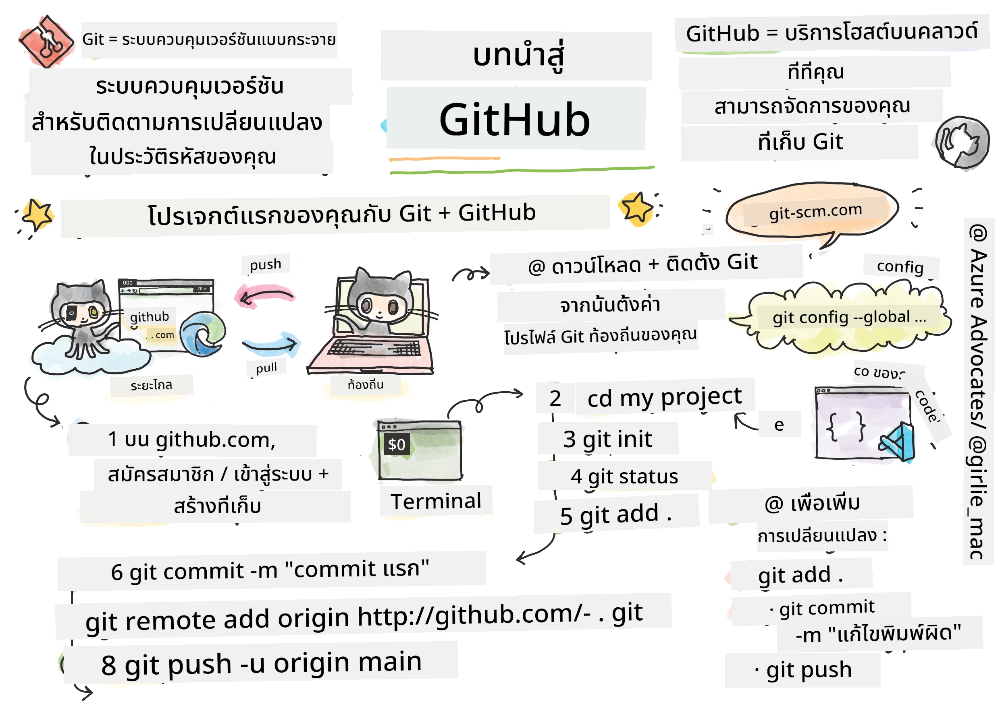
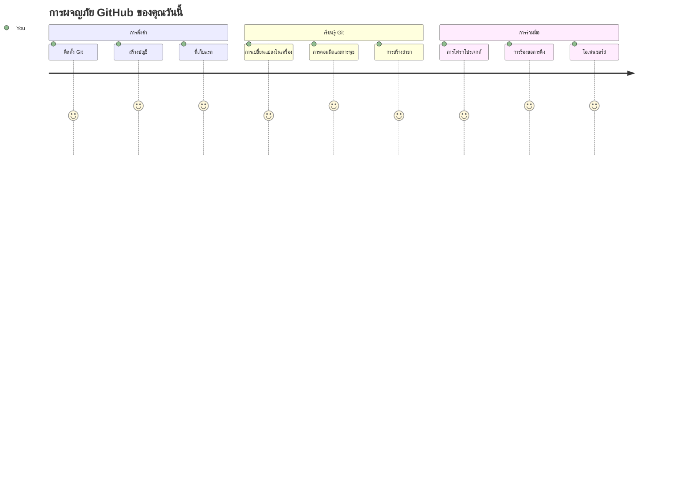
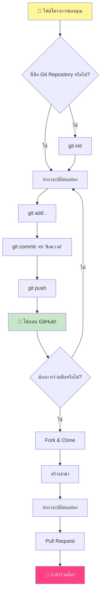
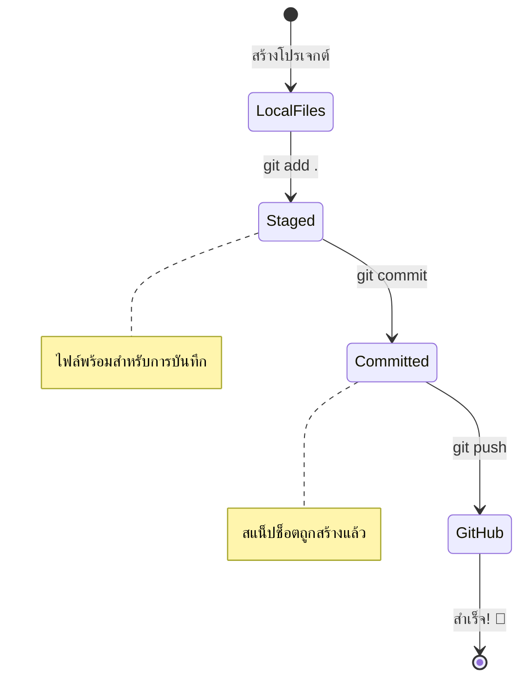
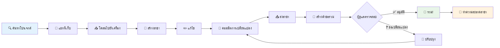
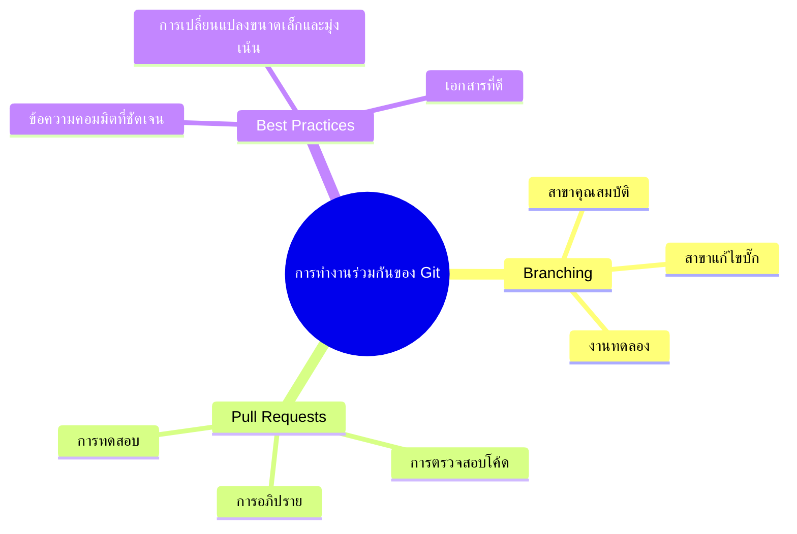
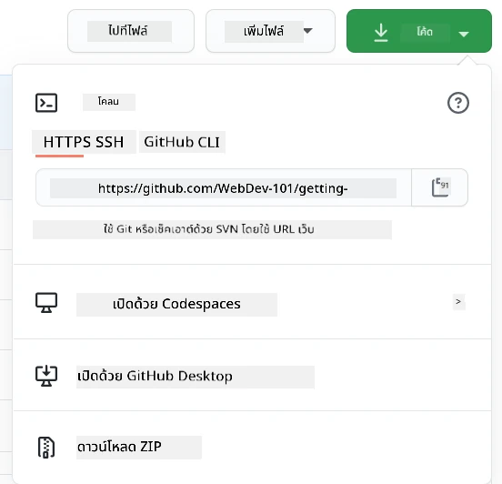
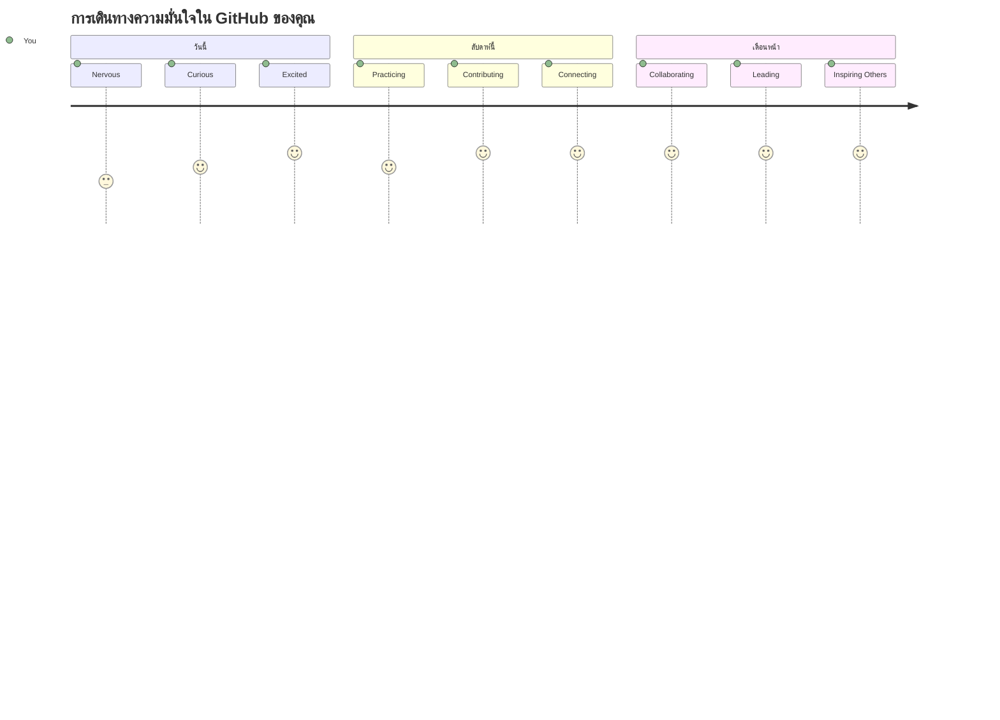

<!--
CO_OP_TRANSLATOR_METADATA:
{
  "original_hash": "5c383cc2cc23bb164b06417d1c107a44",
  "translation_date": "2026-01-06T22:25:39+00:00",
  "source_file": "1-getting-started-lessons/2-github-basics/README.md",
  "language_code": "th"
}
-->
# Introduction to GitHub

สวัสดี นักพัฒนามือใหม่ในอนาคต! 👋 พร้อมที่จะเข้าร่วมกับนักเขียนโค้ดนับล้านทั่วโลกแล้วหรือยัง? ฉันตื่นเต้นอย่างจริงใจที่จะพาคุณไปรู้จักกับ GitHub – คิดว่าเป็นแพลตฟอร์มโซเชียลมีเดียสำหรับโปรแกรมเมอร์ ต่างจากการแชร์รูปอาหารเท่านั้นที่นี่เราแชร์โค้ดและสร้างสิ่งที่น่าทึ่งร่วมกัน!

นี่คือสิ่งที่ทำให้ฉันตะลึงมาก: แอปทุกตัวในโทรศัพท์ของคุณ เว็บไซต์ทุกแหล่งที่คุณเยี่ยมชม และเครื่องมือส่วนใหญ่ที่คุณจะได้เรียนรู้ถูกสร้างโดยทีมพัฒนาซอฟต์แวร์ที่ทำงานร่วมกันบนแพลตฟอร์มอย่าง GitHub แอปเพลงที่คุณชื่นชอบ? มีคนอย่างคุณที่ช่วยสร้างมัน เกมที่คุณติดงอมแงม? ใช่แล้ว นั่นก็น่าจะถูกสร้างด้วยความร่วมมือผ่าน GitHub และตอนนี้คุณก็จะได้เรียนรู้วิธีเป็นส่วนหนึ่งของชุมชนน่าอัศจรรย์นี้!

ฉันรู้ว่าสิ่งนี้อาจดูมากในตอนแรก – โอ้ ฉันยังจำได้ตอนที่จ้องหน้าเว็บ GitHub แรกของฉันแล้วคิดว่า “นี่มันหมายความว่าอะไร?” แต่สิ่งที่ควรรู้คือ ผู้พัฒนาทุกคนเริ่มต้นที่จุดเดียวกับที่คุณอยู่ตอนนี้ เมื่อจบบทเรียนนี้ คุณจะมีเก็บข้อมูล GitHub ของตัวเอง (คิดว่ามันเป็นเหมือนโชว์เคสโปรเจกต์ส่วนตัวของคุณบนคลาวด์) และคุณจะรู้วิธีการบันทึกงาน แชร์กับคนอื่น และแม้แต่มีส่วนร่วมในโปรเจกต์ที่ผู้คนนับล้านใช้งาน

เราจะเดินทางร่วมกันทีละก้าว ไม่มีเร่ง ไม่มีแรงกดดัน – แค่คุณ ฉัน และเครื่องมือเจ๋ง ๆ ที่กำลังจะเป็นเพื่อนใหม่ของคุณ!


> Sketchnote by [Tomomi Imura](https://twitter.com/girlie_mac)


## Pre-Lecture Quiz
[Pre-lecture quiz](https://ff-quizzes.netlify.app)

## Introduction

ก่อนที่เราจะเข้าสู่สิ่งที่น่าตื่นเต้นจริงๆ มาจัดเตรียมคอมพิวเตอร์ของคุณสำหรับเวทมนตร์ GitHub กัน! คิดว่านี่เหมือนกับการจัดเตรียมอุปกรณ์ศิลปะก่อนสร้างผลงานชิ้นเอก – มีเครื่องมือที่เหมาะสมพร้อมทำให้ทุกอย่างราบรื่นและสนุกขึ้นมาก

ฉันจะพาคุณผ่านทุกขั้นตอนการติดตั้งด้วยตนเอง และสัญญาว่าไม่ได้น่ากลัวอย่างที่ดูในตอนแรก หากบางอย่างยังไม่เข้าใจทันที นั่นเป็นเรื่องปกติมาก! ฉันเคยตั้งค่าสภาพแวดล้อมพัฒนาเป็นครั้งแรกและรู้สึกเหมือนพยายามอ่านอักษรรูปภาพโบราณ ทุกผู้พัฒนาต่างก็เคยอยู่จุดที่คุณกำลังยืนสงสัยว่าทำถูกไหม แอบกระซิบว่า ถ้าคุณกำลังเรียนอยู่แบบนี้ แสดงว่าคุณทำได้ถูกต้องแล้ว! 🌟

ในบทเรียนนี้เราจะพูดถึง:

- การติดตามงานที่คุณทำบนเครื่องคุณ
- การทำงานร่วมกันในโปรเจกต์กับคนอื่น
- วิธีการมีส่วนร่วมในซอฟต์แวร์โอเพนซอร์ส

### Prerequisites

มาจัดเตรียมคอมพิวเตอร์ของคุณสำหรับเวทมนตร์ GitHub กัน! ไม่ต้องกังวล – การติดตั้งนี้ทำแค่ครั้งเดียว จากนั้นคุณจะพร้อมสำหรับการเดินทางในการเขียนโค้ดของคุณตลอดไป

เอาล่ะ เรามาเริ่มจากฐานราก! อันดับแรกเราต้องตรวจสอบว่ามี Git อยู่ในเครื่องของคุณแล้วหรือยัง Git คือเหมือนผู้ช่วยอัจฉริยะที่จำการเปลี่ยนแปลงทุกอย่างที่คุณทำกับโค้ดได้ – ดีกว่าการกด Ctrl+S รัวๆ ทุกสองวินาที (เราทุกคนเคยเป็นแบบนั้น!)

ลองดูว่า Git ติดตั้งแล้วหรือยัง โดยพิมพ์คำสั่งเวทมนตร์นี้ในเทอร์มินัลของคุณ:
`git --version`

ถ้ายังไม่มี Git ไม่ต้องกลัว! แค่ไปที่ [download Git](https://git-scm.com/downloads) แล้วดาวน์โหลด เมื่อคุณติดตั้งเสร็จ เราต้องแนะนำตัว Git ให้รู้จักคุณอย่างถูกต้อง:

> 💡 **ตั้งค่าครั้งแรก**: คำสั่งเหล่านี้จะบอก Git ว่าคุณเป็นใคร ข้อมูลนี้จะถูกแนบกับทุกคอมมิตที่คุณทำ ดังนั้นเลือกชื่อและอีเมลที่คุณมั่นใจว่าอยากแชร์สู่สาธารณะ

```bash
git config --global user.name "your-name"
git config --global user.email "your-email"
```

ถ้าต้องการเช็คว่า Git ถูกตั้งค่าแล้วหรือไม่ให้พิมพ์:
```bash
git config --list
```

นอกจากนี้คุณยังต้องมีบัญชี GitHub, ตัวแก้ไขโค้ด (เช่น Visual Studio Code) และเปิดเทอร์มินัล (หรือ: command prompt)

ไปที่ [github.com](https://github.com/) แล้วสร้างบัญชีใหม่ถ้ายังไม่มี หรือเข้าสู่ระบบและกรอกข้อมูลโปรไฟล์ของคุณ

💡 **เคล็ดลับสมัยใหม่**: ลองตั้งค่า [SSH keys](https://docs.github.com/en/authentication/connecting-to-github-with-ssh) หรือใช้ [GitHub CLI](https://cli.github.com/) สำหรับการตรวจสอบสิทธิ์ที่ง่ายขึ้นโดยไม่ต้องใช้รหัสผ่าน

✅ GitHub ไม่ใช่ที่เก็บโค้ดเดียวในโลก ยังมีที่อื่น แต่ GitHub เป็นที่รู้จักดีที่สุด

### Preparation

คุณจะต้องมีโฟลเดอร์ที่มีโปรเจกต์โค้ดบนเครื่องของคุณ (แล็ปท็อปหรือพีซี) และที่เก็บสาธารณะ (public repository) บน GitHub ซึ่งจะใช้เป็นตัวอย่างวิธีมีส่วนร่วมในโปรเจกต์ของคนอื่น

### Keeping Your Code Safe

มาคุยเรื่องความปลอดภัยกันสักครู่ – ไม่ต้องกลัว เราจะไม่ทำให้คุณกลัว! คิดว่าการปฏิบัติด้านความปลอดภัยเช่นเดียวกับการล็อกรถหรือบ้านของคุณ เป็นนิสัยง่ายๆ ที่กลายเป็นธรรมชาติและช่วยปกป้องผลงานที่คุณตั้งใจทำ

เราจะแสดงวิธีทำงานกับ GitHub แบบทันสมัยและปลอดภัยตั้งแต่เริ่มต้น เพื่อให้คุณพัฒนานิสัยที่ดีซึ่งจะช่วยคุณตลอดอาชีพเขียนโค้ด

เมื่อทำงานกับ GitHub สิ่งสำคัญคือต้องทำตามแนวทางปฏิบัติด้านความปลอดภัยที่ดีที่สุด:

| ด้านความปลอดภัย | แนวปฏิบัติที่ดีที่สุด | ทำไมถึงสำคัญ |
|---------------|---------------|----------------|
| **การตรวจสอบสิทธิ์** | ใช้ SSH keys หรือ Personal Access Tokens | รหัสผ่านปลอดภัยน้อยกว่าและกำลังถูกเลิกใช้ |
| **การตรวจสอบสองปัจจัย** | เปิดใช้ 2FA บัญชี GitHub ของคุณ | เพิ่มชั้นป้องกันบัญชีอีกชั้น |
| **ความปลอดภัยของที่เก็บข้อมูล** | หลีกเลี่ยงการคอมมิตข้อมูลสำคัญ | รหัส API และรหัสผ่านไม่ควรอยู่ในที่เก็บสาธารณะ |
| **การจัดการการพึ่งพิง** | เปิดใช้ Dependabot สำหรับอัปเดต | ช่วยให้ dependencies ปลอดภัยและทันสมัย |

> ⚠️ **คำเตือนความปลอดภัยที่สำคัญ**: หลีกเลี่ยงการคอมมิตกุญแจ API, รหัสผ่าน หรือข้อมูลลับอื่นๆ ลงในที่เก็บใด ๆ ใช้ตัวแปรสภาพแวดล้อม และไฟล์ `.gitignore` เพื่อปกป้องข้อมูลสำคัญ

**การตั้งค่าการตรวจสอบสิทธิ์สมัยใหม่:**

```bash
# สร้างกุญแจ SSH (อัลกอริทึม ed25519 รุ่นใหม่)
ssh-keygen -t ed25519 -C "your_email@example.com"

# ตั้งค่า Git ให้ใช้ SSH
git remote set-url origin git@github.com:username/repository.git
```

> 💡 **เคล็ดลับมือโปร**: SSH keys ช่วยให้ไม่ต้องป้อนรหัสผ่านซ้ำ ๆ และปลอดภัยกว่าวิธีตรวจสอบสิทธิ์แบบเก่า

---

## Managing Your Code Like a Pro

เอาล่ะ ที่นี่คือจุดที่น่าตื่นเต้นสุด ๆ! 🎉 เรากำลังจะเรียนรู้วิธีติดตามและจัดการโค้ดของคุณเหมือนมืออาชีพ และจริงๆ แล้วนี่เป็นหนึ่งในสิ่งที่ฉันชอบสอนที่สุดเพราะมันเปลี่ยนเกมได้เลย

ลองจินตนาการว่า คุณกำลังเขียนเรื่องราวที่น่าทึ่ง และอยากเก็บทุกฉบับร่าง ทุกการแก้ไขเจ๋งๆ ทุกเหตุการณ์ “ว้าว นี่มันสุดยอด!” ตลอดทาง นั่นแหละคือสิ่งที่ Git ทำให้โค้ดของคุณ! มันเหมือนสมุดบันทึกเดินทางข้ามเวลาที่จำทุกอย่าง – ทุกการพิมพ์ ทุกการเปลี่ยนแปลง ทุก “โอ๊ะ ทำพังหมดเลย” ที่คุณสามารถย้อนกลับได้ทันที

ขอบอกตามตรงว่า ในตอนแรกอาจรู้สึกสับสน พอเริ่มต้นฉันเคยคิดว่า “ทำไมฉันไม่แค่บันทึกไฟล์เหมือนปกติ?” แต่เชื่อฉันนะ เมื่อ Git คลิกในหัวคุณ (และมันจะคลิก!) คุณจะมีโมเมนต์ที่คิดว่า “ฉันเคยโค้ดโดยไม่มีสิ่งนี้ได้ยังไง?” มันเหมือนค้นพบว่าคุณบินได้ ทั้งที่เดินเท้ามาทั้งชีวิต!

สมมติว่าคุณมีโฟลเดอร์โค้ดบนเครื่อง และอยากเริ่มติดตามความก้าวหน้าด้วย git – ระบบควบคุมเวอร์ชัน บางคนเปรียบเหมือนเขียนจดหมายรักถึงตัวเองในอนาคต การอ่านข้อความคอมมิตวันหลังจะช่วยให้คุณจำได้ว่าทำไมตัดสินใจอย่างนั้น หรือ “ย้อนกลับ” การเปลี่ยนแปลงได้ – เมื่อคุณเขียนข้อความคอมมิตดีๆ


### Task: สร้าง Repository แรกของคุณ!

> 🎯 **ภารกิจของคุณ (และฉันตื่นเต้นมาก!)**: เราจะสร้าง repository แรกบน GitHub ของคุณด้วยกัน! เมื่อเราทำเสร็จ คุณจะมีมุมเล็กๆ บนอินเทอร์เน็ตเพื่อเก็บโค้ดของคุณ และได้ทำ “commit” แรก (ซึ่งแปลว่าการบันทึกงานอย่างฉลาด)  
>
> นี่เป็นช่วงเวลาสุดพิเศษ – คุณกำลังจะเข้าร่วมชุมชนนักพัฒนาทั่วโลกอย่างเป็นทางการ! ฉันยังจำความรู้สึกตื่นเต้นตอนสร้าง repo แรกได้ว่า “ว้าว ฉันทำได้จริงๆ!”

เราจะเดินผ่านการผจญภัยครั้งนี้ไปด้วยกันทีละขั้นตอน ใช้เวลาแต่ละส่วนอย่างเต็มที่ – ไม่มีการแข่งขัน และฉันสัญญาทุกขั้นตอนจะเข้าใจง่าย จำไว้ว่านักพัฒนาที่คุณชื่นชอบก็เคยนั่งตรงนี้ เตรียมสร้าง repository แรกของเขา มันเจ๋งมากใช่ไหม?

> ดูวิดีโอ
> 
> [](https://www.youtube.com/watch?v=9R31OUPpxU4)

**มาทำสิ่งนี้ด้วยกัน:**

1. **สร้าง repository ของคุณบน GitHub** ไปที่ GitHub.com แล้วหาปุ่มสีเขียวสดใส **New** (หรือเครื่องหมาย **+** ที่มุมบนขวา) คลิกเลือก **New repository**

   ต่อไปนี้คือสิ่งที่ต้องทำ:
   1. ตั้งชื่อ repository ให้มีความหมายสำหรับคุณ!
   1. เพิ่มคำอธิบายถ้าต้องการ (ช่วยให้คนอื่นเข้าใจว่าโปรเจกต์ของคุณคืออะไร)
   1. เลือกว่าจะให้เป็นสาธารณะ (ทุกคนเห็นได้) หรือส่วนตัว (เฉพาะคุณ)
   1. ฉันแนะนำให้ติ๊กเลือกกล่องเพื่อเพิ่มไฟล์ README – เหมือนหน้าปกโปรเจกต์ของคุณ
   1. คลิก **Create repository** และฉลองได้เลย – คุณเพิ่งสร้าง repo แรกสำเร็จ! 🎉

2. **ไปที่โฟลเดอร์โปรเจกต์ของคุณ** ตอนนี้มาเปิดเทอร์มินัล (ไม่ต้องกลัว มันไม่น่ากลัวอย่างที่คิด!) เราต้องบอกคอมพิวเตอร์ว่าตำแหน่งของไฟล์โปรเจกต์อยู่ที่ไหน พิมพ์คำสั่งนี้:

   ```bash
   cd [name of your folder]
   ```

   **สิ่งที่เราทำตรงนี้:**
   - พูดกับคอมพิวเตอร์ว่า “พาไปที่โฟลเดอร์โปรเจกต์ของฉัน”
   - เหมือนเปิดโฟลเดอร์บนเดสก์ท็อป แต่ใช้คำสั่งข้อความแทน
   - แทนที่ `[name of your folder]` ด้วยชื่อโฟลเดอร์โปรเจกต์จริงของคุณ

3. **เปลี่ยนโฟลเดอร์ของคุณให้เป็น Git repository** นี่คือจุดเกิดเวทมนตร์! พิมพ์:

   ```bash
   git init
   ```

   **นี่คือสิ่งที่เพิ่งเกิดขึ้น (เจ๋งมาก):**
   - Git สร้างโฟลเดอร์ `.git` ที่ถูกซ่อนอยู่ในโปรเจกต์ของคุณ – คุณจะไม่เห็น แต่มีอยู่จริง!
   - โฟลเดอร์ปกติของคุณตอนนี้กลายเป็น “repository” ที่สามารถติดตามทุกการเปลี่ยนแปลงได้
   - คิดว่ามันเหมือนให้พลังวิเศษกับโฟลเดอร์ของคุณที่จะจำได้ทุกอย่าง

4. **ตรวจสอบสถานะโปรเจกต์** มาดูว่า Git กำลังบอกอะไรเกี่ยวกับโปรเจกต์ของคุณตอนนี้:

   ```bash
   git status
   ```

   **ทำความเข้าใจสิ่งที่ Git บอก:**

   คุณอาจเห็นอะไรที่คล้ายแบบนี้:

   ```output
   Changes not staged for commit:
   (use "git add <file>..." to update what will be committed)
   (use "git restore <file>..." to discard changes in working directory)

        modified:   file.txt
        modified:   file2.txt
   ```

   **ไม่ต้องตกใจ! นี่คือความหมายของมัน:**
   - ไฟล์ที่เป็น **สีแดง** คือไฟล์ที่มีการเปลี่ยนแปลงแต่ยังไม่พร้อมบันทึก
   - ไฟล์ที่เป็น **สีเขียว** (เมื่อเห็น) คือไฟล์ที่พร้อมบันทึกแล้ว
   - Git กำลังช่วยบอกคุณว่า คุณสามารถทำอะไรต่อไปได้บ้าง

   > 💡 **เคล็ดลับมือโปร**: คำสั่ง `git status` เป็นเพื่อนที่ดีที่สุดของคุณ! ใช้มันเมื่อไหงสงสัยว่ากำลังเกิดอะไรขึ้น มันเหมือนถาม Git ว่า “เฮ้ สถานการณ์ตอนนี้เป็นไง?”

5. **เตรียมไฟล์ของคุณสำหรับการบันทึก** (เรียกว่า “staging”):

   ```bash
   git add .
   ```

   **สิ่งที่เราทำไป:**
   - บอก Git ว่า “เอาไฟล์ทั้งหมดของฉันไปรวมในบันทึกถัดไป”
   - จุด ( `.` ) คือเรียกทุกอย่างในโฟลเดอร์นี้
   - ตอนนี้ไฟล์ของคุณถูก “จัดเตรียม” และพร้อมสำหรับขั้นตอนต่อไป

   **อยากเลือกไฟล์เฉพาะเจาะจง?** คุณสามารถเพิ่มแค่ไฟล์บางไฟล์ได้:

   ```bash
   git add [file or folder name]
   ```

   **ทำไมถึงอยากทำแบบนี้?**
   - บางครั้งอยากบันทึกการเปลี่ยนแปลงที่เกี่ยวข้องกันเท่านั้น
   - ช่วยจัดระเบียบงานเป็นส่วนๆ ได้ง่ายขึ้น
   - ทำให้เข้าใจได้ง่ายว่าอะไรเปลี่ยนเมื่อไหร่

   **เปลี่ยนใจไหม?** ไม่เป็นไร! คุณสามารถยกเลิกการเตรียมไฟล์แบบนี้:

   ```bash
   # ยกเลิกการตั้งค่าสถานะทั้งหมด
   git reset
   
   # ยกเลิกการตั้งค่าสถานะไฟล์เดียวเท่านั้น
   git reset [file name]
   ```

   ไม่ต้องกังวล – วิธีนี้ไม่ลบงานคุณนะ แค่เอาไฟล์ออกจากส่วนที่ “พร้อมเก็บ”

6. **บันทึกงานของคุณอย่างถาวร** (ทำ commit แรก!):

   ```bash
   git commit -m "first commit"
   ```

   **🎉 ยินดีด้วย! คุณเพิ่งทำ commit แรก!**
   
   **นี่คือสิ่งที่เกิดขึ้น:**
   - Git ถ่าย “ภาพนิ่ง” ของไฟล์ทั้งหมดที่จัดเตรียมไว้ ณ จุดนี้
   - ข้อความ commit “first commit” อธิบายว่า จุดเก็บนี้หมายถึงอะไร
   - Git ให้ ID เฉพาะกับภาพนิ่งนี้ เพื่อให้คุณหาได้เสมอภายหลัง
   - คุณเริ่มติดตามประวัติของโปรเจกต์อย่างเป็นทางการ!

   > 💡 **ข้อความ commit ในอนาคต**: สำหรับ commit ต่อๆ ไป ให้พยายามเขียนให้บรรยายชัดเจนกว่านี้ แทนที่จะเขียนว่า “updated stuff” ลองเป็น “Add contact form to homepage” หรือ “Fix navigation menu bug” ตัวคุณในอนาคตจะขอบคุณ!

7. **เชื่อมโปรเจกต์ในเครื่องกับ GitHub** ตอนนี้โปรเจกต์อยู่แค่บนคอมพิวเตอร์คุณเอง มาเชื่อมกับ repository บน GitHub เพื่อแชร์กับโลกกัน!

   ก่อนอื่น เข้าไปที่หน้า repository บน GitHub ของคุณแล้วคัดลอก URL จากนั้นกลับมาที่นี่และพิมพ์:

   ```bash
   git remote add origin https://github.com/username/repository_name.git
   ```
   
   (แทนที่ URL นี้ด้วย URL จริงของ repository คุณ!)

   **สิ่งที่เราทำไป:**
   - เราได้สร้างการเชื่อมต่อระหว่างโปรเจคในเครื่องของคุณกับรีโพซิทอรี GitHub ของคุณแล้ว  
   - "Origin" เป็นเพียงชื่อเล่นสำหรับรีโพซิทอรี GitHub ของคุณ—เหมือนกับการเพิ่มรายชื่อผู้ติดต่อในโทรศัพท์ของคุณ  
   - ตอนนี้ Git ในเครื่องของคุณรู้แล้วว่าจะส่งโค้ดของคุณไปที่ไหนเมื่อคุณพร้อมจะแชร์  

   💡 **วิธีที่ง่ายกว่า**: ถ้าคุณติดตั้ง GitHub CLI แล้ว คุณสามารถทำสิ่งนี้ได้ในคำสั่งเดียว:  
   ```bash
   gh repo create my-repo --public --push --source=.
   ```
  
8. **ส่งโค้ดของคุณไปที่ GitHub** (ช่วงเวลาสำคัญ!):  

   ```bash
   git push -u origin main
   ```
  
   **🚀 นี่แหละ! คุณกำลังอัปโหลดโค้ดของคุณไปยัง GitHub!**  
   
   **สิ่งที่กำลังเกิดขึ้น:**  
   - คอมมิตของคุณกำลังเคลื่อนที่จากคอมพิวเตอร์ของคุณไปยัง GitHub  
   - ธง `-u` ตั้งค่าการเชื่อมต่อถาวร เพื่อให้การ push ในอนาคตง่ายขึ้น  
   - "main" คือชื่อของสาขาหลักของคุณ (เหมือนกับโฟลเดอร์หลัก)  
   - หลังจากนี้ คุณแค่พิมพ์ `git push` สำหรับการอัปโหลดในอนาคตได้เลย!  

   💡 **หมายเหตุด่วน**: ถ้าสาขาของคุณใช้ชื่ออื่น (เช่น "master") ให้ใช้ชื่อนั้นแทน คุณสามารถตรวจสอบได้ด้วย `git branch --show-current`  

9. **จังหวะการเขียนโค้ดใหม่ของคุณในแต่ละวัน** (ตรงนี้สนุกมาก!):  

   จากนี้ไป เมื่อใดก็ตามที่คุณทำการเปลี่ยนแปลงโปรเจค คุณก็มีการเต้นสามขั้นตอนง่ายๆ นี้:  

   ```bash
   git add .
   git commit -m "describe what you changed"
   git push
   ```
  
   **นี่คือจังหวะการเขียนโค้ดของคุณ:**  
   - ทำการเปลี่ยนแปลงโค้ดสุดเจ๋งของคุณ ✨  
   - วางไว้ในสเตจด้วย `git add` ("เฮ้ Git จับตาดูการเปลี่ยนแปลงพวกนี้!")  
   - บันทึกด้วย `git commit` พร้อมข้อความอธิบาย (คุณในอนาคตจะขอบคุณ!)  
   - แชร์กับโลกโดยใช้ `git push` 🚀  
   - ทำซ้ำ – จริงจังนะ นี่จะกลายเป็นธรรมชาติอย่างกับการหายใจ!  

   ฉันชอบโฟลว์นี้เพราะมันเหมือนกับมีจุดเซฟหลายจุดในวิดีโอเกม ทำการเปลี่ยนแปลงที่ชอบ? คอมมิตเลย! อยากลองอะไรเสี่ยงๆ? ไม่มีปัญหา – คุณสามารถย้อนกลับไปยังคอมมิตล่าสุดได้ถ้าเกิดสถานการณ์ผิดพลาด!  

   > 💡 **เคล็ดลับ**: คุณอาจอยากใช้ไฟล์ `.gitignore` เพื่อป้องกันไม่ให้ไฟล์ที่คุณไม่อยากติดตามแสดงบน GitHub - เช่นไฟล์โน้ตที่เก็บไว้ในโฟลเดอร์เดียวกัน แต่ไม่ควรอยู่ในรีโพซิทอรีสาธารณะ คุณสามารถหาแม่แบบไฟล์ `.gitignore` ได้ที่ [.gitignore templates](https://github.com/github/gitignore) หรือสร้างโดยใช้ [gitignore.io](https://www.toptal.com/developers/gitignore)  

### 🧠 **เช็คอินรีโพซิทอรีแรก: รู้สึกอย่างไรบ้าง?**  

**หยุดสักครู่เพื่อฉลองและสะท้อนความคิด:**  
- รู้สึกอย่างไรเมื่อเห็นโค้ดของคุณโผล่บน GitHub เป็นครั้งแรก?  
- ขั้นตอนไหนที่คุณรู้สึกสับสนที่สุด และขั้นตอนไหนที่คุณคิดว่าง่ายจริงๆ?  
- คุณสามารถอธิบายความแตกต่างระหว่าง `git add`, `git commit`, และ `git push` ด้วยคำพูดของคุณเองได้ไหม?  


> **จำไว้**: แม้แต่ผู้พัฒนาที่มีประสบการณ์ก็ยังลืมคำสั่งบางอย่างได้ การทำให้โฟลว์นี้กลายเป็นความเคยชินต้องการการฝึกฝน—คุณทำได้ดีมาก!  

#### โฟลว์การทำงาน Git แบบสมัยใหม่  

ลองใช้แนวทางปฏิบัติเหล่านี้:  

- **Conventional Commits**: ใช้รูปแบบข้อความคอมมิตมาตรฐาน เช่น `feat:`, `fix:`, `docs:` เป็นต้น เรียนรู้เพิ่มเติมได้ที่ [conventionalcommits.org](https://www.conventionalcommits.org/)  
- **Atomic commits**: ให้แต่ละคอมมิตแทนการเปลี่ยนแปลงเชิงตรรกะเพียงอย่างเดียว  
- **Frequent commits**: คอมมิตบ่อยๆ พร้อมข้อความอธิบาย ไม่ใช่คอมมิตใหญ่ๆ ที่นานๆ ครั้ง  

#### ข้อความคอมมิต  

หัวข้อคอมมิตที่ดีควรเติมประโยคต่อไปนี้:  
ถ้าใช้คอมมิตนี้ จะทำให้ <หัวข้อของคุณที่นี่>  

สำหรับหัวข้อ ใช้คำสั่งเป็นรูปแบบกริยาในปัจจุบัน: "change" ไม่ใช่ "changed" หรือ "changes"  
เหมือนกับหัวข้อ ในเนื้อความ (ถ้ามี) ก็ใช้กริยาในรูปแบบปัจจุบันเช่นกัน บอดี้ควรรวมเหตุผลของการเปลี่ยนแปลงและเปรียบเทียบกับพฤติกรรมก่อนหน้า คุณกำลังอธิบายว่า `ทำไม` ไม่ใช่ `อย่างไร`  

✅ ใช้เวลาสักพักท่อง GitHub ดู คุณเจอข้อความคอมมิตดีๆ บ้างไหม? เจอข้อความคอมมิตสั้นมากๆ บ้างไหม? คุณคิดว่าข้อมูลไหนสำคัญที่สุดและเป็นประโยชน์ที่สุดที่ควรใส่ในข้อความคอมมิต?  

## การทำงานร่วมกับผู้อื่น (ส่วนที่สนุก!)  

เตรียมตัวให้พร้อมเพราะตรงนี้แหละที่ GitHub จะกลายเป็นเวทมนตร์อย่างแท้จริง! 🪄 คุณชำนาญการจัดการโค้ดของตัวเองแล้ว แต่ตอนนี้เราจะดำดิ่งไปยังส่วนที่ฉันชอบที่สุด—การร่วมมือกับคนเจ๋งๆ จากทั่วทุกมุมโลก  

ลองนึกภาพดูสิ: คุณตื่นขึ้นมาในวันพรุ่งนี้แล้วเห็นว่ามีใครบางคนในโตเกียวปรับปรุงโค้ดของคุณในขณะที่คุณนอนหลับ จากนั้นใครบางคนในเบอร์ลินแก้บั๊กที่คุณติดค้างไว้ ช่วงบ่าย นักพัฒนาในเซาเปาโลเพิ่มฟีเจอร์ที่คุณไม่เคยคิดถึง นั่นไม่ใช่เรื่องนิยายวิทยาศาสตร์—นั่นคือวันธรรมดาในจักรวาล GitHub!  

สิ่งที่ทำให้ฉันตื่นเต้นจริงๆ คือทักษะการร่วมมือนี้? นี่คือโฟลว์การทำงานเดียวกันกับที่ทีมงาน Google, Microsoft และสตาร์ทอัพที่คุณชื่นชอบใช้ทุกวัน คุณไม่ใช่แค่เรียนรู้เครื่องมือเท่ๆ แต่คุณกำลังเรียนรู้ภาษาลับที่ทำให้โลกซอฟต์แวร์ทั้งหมดทำงานร่วมกันได้  

จริงจังนะ เมื่อคุณได้สัมผัสความตื่นเต้นจากการที่ใครบางคน merge pull request แรกของคุณ คุณจะเข้าใจว่าทำไมนักพัฒนาถึงหลงรักโอเพนซอร์สขนาดนั้น มันเหมือนกับการเป็นส่วนหนึ่งของโปรเจคทีมที่สร้างสรรค์ที่สุดในโลก!  

> ดูวิดีโอ  
>  
> [](https://www.youtube.com/watch?v=bFCM-PC3cu8)  

เหตุผลหลักที่ต้องการนำสิ่งต่างๆ ลง GitHub คือเพื่อให้สามารถร่วมงานกับนักพัฒนาคนอื่นได้  


ในรีโพซิทอรีของคุณ ให้ไปที่ `Insights > Community` เพื่อตรวจสอบว่าโปรเจคของคุณเปรียบเทียบกับมาตรฐานชุมชนที่แนะนำอย่างไร  

อยากทำให้รีโพซิทอรีของคุณดูเป็นมืออาชีพและน่าเชิญชวนไหม? ไปที่รีโพซิทอรีของคุณแล้วคลิกที่ `Insights > Community` ฟีเจอร์เจ๋งๆ นี้จะแสดงให้คุณเห็นว่าโปรเจคของคุณเปรียบเทียบกับสิ่งที่ชุมชน GitHub มองว่าเป็น "แนวทางจัดการรีโพซิทอรีที่ดี" อย่างไร  

> 🎯 **ทำให้โปรเจคของคุณโดดเด่น**: รีโพซิทอรีที่จัดระเบียบดีพร้อมเอกสารครบถ้วนเหมือนกับมีหน้าร้านที่สะอาดและเชิญชวน มันบ่งบอกว่าคุณใส่ใจงานของคุณและทำให้คนอื่นอยากจะมีส่วนร่วม!  

**นี่คือสิ่งที่ทำให้รีโพซิทอรียอดเยี่ยม:**  

| สิ่งที่ต้องเพิ่ม | ทำไมถึงสำคัญ | สิ่งที่ได้สำหรับคุณ |  
|-------------|-------------------|---------------------|  
| **Description** | ความประทับใจแรกสำคัญ! | คนรู้ทันทีว่าโปรเจคของคุณทำอะไร |  
| **README** | หน้าแรกของโปรเจค | เหมือนไกด์นำเที่ยวที่เป็นมิตรสำหรับผู้มาเยือนใหม่ |  
| **Contributing Guidelines** | แสดงว่าคุณต้อนรับความช่วยเหลือ | คนรู้ชัดเจนว่าจะช่วยยังไง |  
| **Code of Conduct** | สร้างพื้นที่เป็นมิตร | ทุกคนรู้สึกยินดีต้อนรับให้เข้าร่วม |  
| **License** | ความชัดเจนทางกฎหมาย | คนอื่นรู้ว่าจะใช้โค้ดคุณยังไง |  
| **Security Policy** | แสดงว่าคุณรับผิดชอบ | แสดงให้เห็นถึงการปฏิบัติงานอย่างมืออาชีพ |  

> 💡 **เคล็ดลับมือโปร**: GitHub จัดเตรียมแม่แบบไฟล์เหล่านี้ทั้งหมด เมื่อสร้างรีโพซิทอรีใหม่ ให้ติ๊กเลือกเพื่อสร้างไฟล์เหล่านี้โดยอัตโนมัติ  

**ฟีเจอร์ GitHub สมัยใหม่ที่ควรสำรวจ:**  

🤖 **ระบบอัตโนมัติ & CI/CD:**  
- **GitHub Actions** สำหรับการทดสอบและดีพลอยอัตโนมัติ  
- **Dependabot** สำหรับการอัปเดต dependencies อัตโนมัติ  

💬 **ชุมชน & การจัดการโปรเจค:**  
- **GitHub Discussions** สำหรับการสนทนาของชุมชนที่นอกเหนือจากประเด็นปัญหา  
- **GitHub Projects** สำหรับการจัดการโปรเจคแบบบอร์ดคัมบัง  
- **Branch protection rules** เพื่อบังคับใช้มาตรฐานคุณภาพโค้ด  

ทรัพยากรทั้งหมดนี้จะช่วยในการนำสมาชิกทีมใหม่เข้าร่วมทีม และนั่นก็มักเป็นสิ่งที่ผู้ร่วมพัฒนามักจะดูก่อนจะดูโค้ดของคุณ เพื่อหาว่าโปรเจคนี้เหมาะที่จะใช้เวลาของพวกเขาหรือไม่  

✅ ไฟล์ README แม้จะต้องใช้เวลาจัดเตรียม แต่เจ้าของโปรเจคหลายคนก็ละเลย คุณสามารถหาไฟล์ตัวอย่างที่อธิบายดีมากๆ ได้ไหม? หมายเหตุ: มี [เครื่องมือช่วยสร้าง README ดีๆ](https://www.makeareadme.com/) ที่คุณอาจอยากลองใช้  

### งาน: ผสานโค้ดบางส่วน  

เอกสารแนะนำการมีส่วนร่วมช่วยให้คนอื่นร่วมพัฒนาโปรเจคได้ มันอธิบายว่าคุณกำลังมองหาการมีส่วนร่วมประเภทไหนและกระบวนการเป็นอย่างไร ผู้ร่วมงานต้องผ่านขั้นตอนหลายอย่างเพื่อจะร่วมงานในรีโพซิทอรีของคุณบน GitHub:  

1. **Fork รีโพซิทอรีของคุณ** คุณอาจอยากให้คนอื่น _fork_ โปรเจคของคุณ Fork หมายถึงการสร้างสำเนาของรีโพซิทอรีของคุณบนโปรไฟล์ GitHub ของพวกเขา  
1. **Clone** จากนั้นพวกเขาจะ clone โปรเจคไปยังเครื่องของตน  
1. **สร้างสาขา** คุณจะอยากให้พวกเขาสร้าง _branch_ สำหรับงานของตน  
1. **เน้นการเปลี่ยนแปลงในพื้นที่เดียว** ขอให้ผู้ร่วมงานโฟกัสไปที่การเปลี่ยนแปลงอย่างใดอย่างหนึ่งครั้งละอย่าง—แบบนี้โอกาสที่คุณจะ _merge_ งานพวกเขาจะสูงขึ้น ลองจินตนาการว่าพวกเขาเขียนแก้บั๊ก, เพิ่มฟีเจอร์ใหม่, และอัปเดตเทสต์หลายอัน—ถ้าคุณอยากหรือสามารถทำได้แค่ 2 ใน 3 หรือ 1 ใน 3 อย่าง คุณจะจัดการยังไง?  

✅ ลองจินตนาการสถานการณ์ที่สาขามีความสำคัญมากต่อการเขียนและส่งมอบโค้ดดีๆ คุณคิดถึงกรณีอะไรบ้าง?  

> จำไว้ เปลี่ยนแปลงที่คุณอยากเห็นในโลก และสร้างสาขาสำหรับงานของคุณเองด้วย การคอมมิตที่คุณทำจะเป็นในสาขาที่คุณกำลัง “checked out” อยู่ ใช้ `git status` เพื่อตรวจสอบสาขาที่คุณอยู่  

มาดูเวิร์กโฟลว์ของผู้ร่วมงานกัน สมมติว่าผู้ร่วมงานได้ _fork_ และ _clone_ รีโพซิทอรีแล้ว ดังนั้นพวกเขามี Git repo พร้อมทำงานบนเครื่องของตัวเอง:  

1. **สร้างสาขา** ใช้คำสั่ง `git branch` เพื่อสร้างสาขาที่จะมีการเปลี่ยนแปลงที่ต้องการร่วม:  

   ```bash
   git branch [branch-name]
   ```
  
   > 💡 **วิธีร่วมสมัย**: คุณสามารถสร้างและสลับไปสาขาใหม่ในคำสั่งเดียวกันได้:  
   ```bash
   git switch -c [branch-name]
   ```
  
1. **สลับไปยังสาขางาน** สลับไปสาขาที่กำหนดและอัปเดตไดเรกทอรีทำงานด้วย `git switch`:  

   ```bash
   git switch [branch-name]
   ```
  
   > 💡 **หมายเหตุสมัยใหม่**: `git switch` คือคำสั่งใหม่แทน `git checkout` เมื่อต้องการเปลี่ยนสาขา เหมาะสำหรับผู้เริ่มต้นเพราะชัดเจนและปลอดภัยกว่า  

1. **ทำงาน** ตอนนี้คุณต้องเพิ่มการเปลี่ยนแปลงของคุณ อย่าลืมบอก Git ด้วยคำสั่งเหล่านี้:  

   ```bash
   git add .
   git commit -m "my changes"
   ```
  
   > ⚠️ **คุณภาพข้อความคอมมิต**: ให้แน่ใจว่าคุณตั้งชื่อคอมมิตดีๆ เพื่อประโยชน์ของทั้งตัวคุณและผู้ดูแลรีโพซิทอรีที่คุณช่วยงาน ระบุชัดเจนว่าคุณเปลี่ยนอะไร!  

1. **รวมงานกับสาขา `main`** เมื่อคุณทำงานเสร็จและต้องการรวมงานเข้ากับสาขา `main` ซึ่งอาจมีการเปลี่ยนแปลงไปแล้วในระหว่างนี้ ให้แน่ใจว่าได้อัปเดตสาขา `main` ให้เป็นเวอร์ชันล่าสุดก่อนด้วยคำสั่งดังนี้:  

   ```bash
   git switch main
   git pull
   ```
  
   ตอนนี้คุณต้องมั่นใจว่าไม่มี _conflicts_ เหตุการณ์ที่ Git ไม่สามารถ _combine_ การเปลี่ยนแปลงได้ในสาขาทำงานของคุณ ดังนั้นให้รันคำสั่งเหล่านี้:  

   ```bash
   git switch [branch_name]
   git merge main
   ```
  
   คำสั่ง `git merge main` จะนำการเปลี่ยนแปลงทั้งหมดจาก `main` เข้าสู่สาขาของคุณ หวังว่าคุณจะสามารถดำเนินต่อได้ ถ้าไม่ โปรแกรม VS Code จะแจ้งตำแหน่งที่ Git _สับสน_ และคุณก็เพียงแก้ไขไฟล์ที่ได้รับผลกระทบเพื่อระบุว่าส่วนไหนถูกต้องที่สุด  

   💡 **ทางเลือกร่วมสมัย**: ลองใช้ `git rebase` เพื่อประวัติการเปลี่ยนแปลงที่สะอาดขึ้น:  
   ```bash
   git rebase main
   ```
   
   นี่จะเล่นคอมมิตของคุณซ้ำด้านบนของสาขา main ล่าสุด สร้างประวัติแบบเส้นตรง  

1. **ส่งงานของคุณไปยัง GitHub** การส่งงานไป GitHub มีสองส่วน คือการ push สาขาของคุณขึ้นรีโพซิทอรี แล้วเปิด PR, Pull Request  

   ```bash
   git push --set-upstream origin [branch-name]
   ```
  
   คำสั่งด้านบนสร้างสาขาบนรีโพซิทอรีที่คุณ fork มาแล้ว  

### 🤝 **เช็คทักษะการทำงานร่วมกัน: พร้อมทำงานกับผู้อื่นหรือยัง?**  

**มาดูความรู้สึกของคุณเกี่ยวกับการร่วมมือกัน:**  
- คุณเข้าใจแนวคิดเรื่องการ fork และ pull request มากขึ้นไหมตอนนี้?  
- มีเรื่องอะไรเกี่ยวกับสาขาที่คุณอยากฝึกฝนเพิ่มไหม?  
- คุณรู้สึกสบายใจแค่ไหนกับการร่วมมือในโปรเจคของคนอื่น?  


> **เพิ่มความมั่นใจ**: นักพัฒนาทุกคนที่คุณชื่นชมนั้น เคยประหม่ากับ pull request แรกของตัวเองมาก่อน ชุมชน GitHub ต้อนรับผู้มาใหม่อย่างอบอุ่นเสมอ!  

1. **เปิด PR** ต่อไป คุณต้องการเปิด PR ทำได้โดยไปที่รีโพซิทอรี fork บน GitHub คุณจะเห็นแจ้งให้สร้าง PR ใหม่ คลิกแล้วคุณจะเข้าสู่หน้าแก้ไขหัวข้อข้อความและคำอธิบาย PR ให้เหมาะสม ตอนนี้ผู้ดูแลรีโพซิทอรีที่คุณ fork จะเห็น PR นี้ และ _ขอให้โชคดี_ พวกเขาจะยอมรับและ _merge_ PR ของคุณ คุณจึงกลายเป็นผู้ร่วมพัฒนาแล้ว เย้ :)  

   💡 **เคล็ดลับสมัยใหม่**: คุณยังสามารถสร้าง PR โดยใช้ GitHub CLI ได้ด้วย:  
   ```bash
   gh pr create --title "Your PR title" --body "Description of changes"
   ```
  
   🔧 **แนวปฏิบัติที่ดีสำหรับ PR:**  
   - ลิงก์ไปยัง issue ที่เกี่ยวข้องโดยใช้คำสำคัญ เช่น "Fixes #123"  
   - เพิ่มภาพหน้าจอสำหรับการเปลี่ยนแปลง UI  
   - ขอรีวิวเวอร์เฉพาะเจาะจง  
   - ใช้ draft PR สำหรับงานที่ยังดำเนินการ  
   - ตรวจสอบให้แน่ใจว่าการตรวจสอบ CI ผ่านทั้งหมดก่อนขอรีวิว  
1. **ทำความสะอาด** เป็นแนวปฏิบัติที่ดีที่จะ _ทำความสะอาด_ หลังจากที่คุณรวม PR ได้สำเร็จแล้ว คุณต้องการทำความสะอาดทั้งสาขาท้องถิ่นของคุณและสาขาที่คุณผลักไปยัง GitHub ก่อนอื่นให้ลบทิ้งในเครื่องด้วยคำสั่งต่อไปนี้:

   ```bash
   git branch -d [branch-name]
   ```

   ตรวจสอบให้แน่ใจว่าคุณไปที่หน้า GitHub สำหรับรีโปที่ถูก fork ต่อไปและลบสาขารีโมทที่คุณเพิ่งผลักไปยังนั้น

`Pull request` ดูเหมือนเป็นคำที่แปลกเพราะจริง ๆ แล้วคุณต้องการผลักการเปลี่ยนแปลงของคุณไปยังโครงการ แต่ผู้ดูแล (เจ้าของโครงการ) หรือทีมหลักจำเป็นต้องพิจารณาการเปลี่ยนแปลงของคุณก่อนที่จะผสานกับสาขา "main" ของโครงการ ดังนั้นคุณจึงกำลังร้องขอการตัดสินใจเปลี่ยนแปลงจากผู้ดูแล

Pull request คือที่ที่ใช้เปรียบเทียบและอภิปรายความแตกต่างที่แนะนำบนสาขาพร้อมกับการตรวจสอบ ความเห็น การทดสอบแบบบูรณาการ และอื่น ๆ Pull request ที่ดีจะปฏิบัติตามกฎโดยประมาณเดียวกับข้อความ commit คุณสามารถเพิ่มการอ้างอิงปัญหาในตัวติดตามปัญหา เมื่อการทำงานของคุณแก้ไขปัญหานั้น ตัวอย่างเช่น โดยใช้ `#` ตามด้วยหมายเลขของปัญหาของคุณ เช่น `#97`

🤞 ขอให้ทุกการตรวจสอบผ่านและเจ้าของโครงการรวมการเปลี่ยนแปลงของคุณเข้ากับโครงการ 🤞

อัปเดตสาขาทำงานท้องถิ่นปัจจุบันของคุณด้วย commit ใหม่ทั้งหมดจากสาขารีโมทที่สอดคล้องกันบน GitHub:

`git pull`

## การมีส่วนร่วมกับ Open Source (โอกาสของคุณที่จะสร้างผลกระทบ!)

คุณพร้อมสำหรับสิ่งที่จะทำให้คุณตะลึงมั้ย? 🤯 มาพูดถึงการมีส่วนร่วมกับโครงการโอเพนซอร์สกัน – ฉันรู้สึกตื่นเต้นมากที่จะได้แบ่งปันเรื่องนี้กับคุณ!

นี่คือโอกาสของคุณที่จะเป็นส่วนหนึ่งของสิ่งที่ยอดเยี่ยมจริง ๆ ลองจินตนาการถึงการปรับปรุงเครื่องมือที่นักพัฒนากว่าล้านคนใช้ทุกวัน หรือแก้ไขบั๊กในแอปที่เพื่อนของคุณชื่นชอบ นั่นไม่ใช่แค่ความฝัน – นั่นคือสิ่งที่การมีส่วนร่วมกับโอเพนซอร์สหมายถึง!

นี่คือสิ่งที่ทำให้ฉันตื่นเต้นทุกครั้งที่คิดถึง: ทุกเครื่องมือที่คุณเรียนรู้ – ตัวแก้ไขโค้ดของคุณ เฟรมเวิร์กที่เราจะสำรวจ และแม้แต่อินเทอร์เฟซเบราว์เซอร์ที่คุณใช้อ่านนี้ – เริ่มต้นจากใครซักคนที่เหมือนคุณ ที่สร้างการมีส่วนร่วมครั้งแรกของเขา นักพัฒนาผู้เก่งกาจที่สร้างส่วนขยาย VS Code ที่คุณชื่นชอบ? พวกเขาเคยเป็นมือใหม่ที่คลิก "create pull request" ด้วยมือที่สั่นๆ เหมือนกับที่คุณกำลังจะทำตอนนี้

และนี่คือส่วนที่สวยงามที่สุด: ชุมชนโอเพนซอร์สเปรียบเสมือนกอดกลุ่มใหญ่ที่สุดบนอินเทอร์เน็ต โครงการส่วนใหญ่จะมองหาคนใหม่อย่างจริงจังและมีปัญหาที่ติดแท็ก "good first issue" สำหรับคนอย่างคุณอย่างเฉพาะเจาะจง! ผู้ดูแลรู้สึกตื่นเต้นเมื่อเห็นผู้มีส่วนร่วมใหม่เพราะพวกเขานึกถึงก้าวแรกของตนเอง

```mermaid
flowchart TD
    A[🔍 สำรวจ GitHub] --> B[🏷️ หา "good first issue"]
    B --> C[📖 อ่านแนวทางร่วมพัฒนา]
    C --> D[🍴 Fork เก็บข้อมูล]
    D --> E[💻 ตั้งค่าสภาพแวดล้อมในเครื่อง]
    E --> F[🌿 สร้างสาขาคุณสมบัติ]
    F --> G[✨ ส่งผลงานของคุณ]
    G --> H[🧪 ทดสอบการเปลี่ยนแปลง]
    H --> I[📝 เขียนคำสั่ง commit ให้ชัดเจน]
    I --> J[📤 ดัน & สร้าง PR]
    J --> K[💬 ตอบโต้กับคำแนะนำ]
    K --> L[🎉 รวม! คุณเป็นผู้ร่วมพัฒนาแล้ว!]
    L --> M[🌟 หา issue ถัดไป]
    
    style A fill:#e1f5fe
    style L fill:#c8e6c9
    style M fill:#fff59d
```
คุณไม่ได้แค่เรียนรู้การเขียนโค้ดที่นี่ – คุณกำลังเตรียมตัวเข้าร่วมเป็นส่วนหนึ่งของครอบครัวผู้สร้างทั่วโลกที่ตื่นขึ้นทุกวันและคิดว่า "เราจะทำให้โลกดิจิทัลดีขึ้นเล็กน้อยได้อย่างไร?" ยินดีต้อนรับสู่คลับ! 🌟

ก่อนอื่น มาค้นหารีโปลที่คุณสนใจบน GitHub และคุณอยากมีส่วนร่วมเปลี่ยนแปลง คุณจะต้องคัดลอกเนื้อหานั้นไปยังเครื่องของคุณ

✅ วิธีที่ดีในการหาคลัง 'เหมาะสำหรับผู้เริ่มต้น' คือ [ค้นหาตามแท็ก 'good-first-issue'](https://github.blog/2020-01-22-browse-good-first-issues-to-start-contributing-to-open-source/)



มีหลายวิธีในการคัดลอกโค้ด วิธีหนึ่งคือการ "clone" เนื้อหาของรีโปโดยใช้ HTTPS, SSH หรือใช้ GitHub CLI (Command Line Interface)

เปิดเทอร์มินอลของคุณและโคลนรีโปดังนี้:
```bash
# การใช้ HTTPS
git clone https://github.com/ProjectURL

# การใช้ SSH (จำเป็นต้องตั้งค่า SSH key)
git clone git@github.com:username/repository.git

# การใช้ GitHub CLI
gh repo clone username/repository
```

เพื่อทำงานกับโครงการ ให้สลับไปยังโฟลเดอร์ที่ถูกต้อง:
`cd ProjectURL`

คุณยังสามารถเปิดโครงการทั้งหมดโดยใช้:
- **[GitHub Codespaces](https://github.com/features/codespaces)** - สภาพแวดล้อมการพัฒนาบนคลาวด์ของ GitHub พร้อม VS Code ในเบราว์เซอร์
- **[GitHub Desktop](https://desktop.github.com/)** - แอปพลิเคชัน GUI สำหรับการทำงานกับ Git
- **[GitHub.dev](https://github.dev)** - กดปุ่ม `.` บนรีโป GitHub ใดก็ได้เพื่อเปิด VS Code ในเบราว์เซอร์
- **VS Code** พร้อมส่วนขยาย GitHub Pull Requests

สุดท้าย คุณสามารถดาวน์โหลดโค้ดในโฟลเดอร์ซิป

### สิ่งน่าสนใจเพิ่มเติมเกี่ยวกับ GitHub

คุณสามารถกดดาว, ติดตาม และ/หรือ "fork" รีโปสาธารณะใด ๆ บน GitHub คุณสามารถค้นหารีโปที่คุณกดดาวไว้ในเมนูดรอปดาวน์ด้านบนขวา มันเหมือนการบุ๊กมาร์ก แต่นี่สำหรับโค้ด

โครงการต่าง ๆ มีตัวติดตามปัญหา โดยส่วนใหญ่บน GitHub ในแท็บ "Issues" เว้นแต่จะระบุอย่างอื่น ซึ่งผู้คนจะพูดคุยกันเกี่ยวกับปัญหาที่เกี่ยวข้องกับโครงการ และแท็บ Pull Requests คือที่ที่ผู้คนพูดคุยและตรวจสอบการเปลี่ยนแปลงที่กำลังดำเนินการ

โครงการอาจมีการอภิปรายในฟอรัม รายชื่อเมล หรือช่องแชทเช่น Slack, Discord หรือ IRC

🔧 **คุณสมบัติทันสมัยของ GitHub**:
- **GitHub Discussions** - ฟอรัมในตัวสำหรับการสนทนาของชุมชน
- **GitHub Sponsors** - สนับสนุนผู้ดูแลด้วยการเงิน
- **แท็บ Security** - รายงานช่องโหว่และคำแนะนำด้านความปลอดภัย
- **แท็บ Actions** - ดูเวิร์กโฟลว์อัตโนมัติและ pipelines CI/CD
- **แท็บ Insights** - วิเคราะห์เกี่ยวกับผู้มีส่วนร่วม, commits, และสุขภาพโครงการ
- **แท็บ Projects** - เครื่องมือจัดการโครงการในตัวของ GitHub

✅ ลองสำรวจรีโป GitHub ใหม่ของคุณและลองทำสิ่งต่าง ๆ เช่น แก้ไขการตั้งค่า, เพิ่มข้อมูลในรีโป, สร้างโครงการ (เช่น กระดาน Kanban) และตั้งค่า GitHub Actions เพื่อทำงานอัตโนมัติ มีอะไรให้ทำมากมาย!

---

## 🚀 ความท้าทาย

ได้เวลาใช้พลัง GitHub ใหม่ของคุณแล้ว! 🚀 นี่คือความท้าทายที่จะทำให้ทุกอย่างเข้าที่เข้าทางอย่างพึงพอใจที่สุด:

ชวนเพื่อน (หรือสมาชิกครอบครัวที่ชอบถามว่าคุณทำอะไรกับ "เรื่องคอมพิวเตอร์" ทั้งหมดนี้) มาร่วมผจญภัยในการเขียนโค้ดร่วมกัน! นี่แหละคือเวทมนตร์จริง ๆ – สร้างโครงการ ให้เขา fork สร้างสาขา และรวมการเปลี่ยนแปลงเหมือนมือโปรที่คุณกำลังจะกลายเป็น

ไม่โกหกนะ – คุณอาจหัวเราะกันในบางช่วง (โดยเฉพาะตอนที่คุณทั้งคู่พยายามแก้ไขบรรทัดเดียวกัน) บางทีอาจเกาหัวด้วยความสับสน แต่คุณจะมีช่วงเวลาที่น่าทึ่งแบบ "อ๋อ!" ที่ทำให้การเรียนรู้ทั้งหมดคุ้มค่า นอกจากนี้ ยังมีสิ่งพิเศษเกี่ยวกับการแบ่งปันการรวมครั้งแรกที่สำเร็จกับคนอื่น – เหมือนฉลองเล็ก ๆ ว่าคุณมาไกลแค่ไหน!

ยังไม่มีเพื่อนเขียนโค้ดหรือ? ไม่ต้องกังวลนะ! ชุมชน GitHub มีคนต้อนรับอย่างอบอุ่นที่จำได้ว่าตัวเองเคยใหม่ มองหาคลังที่มีป้าย "good first issue" – มันเหมือนบอกว่า "เฮ้ มือใหม่ มาร่วมเรียนกับเรา!" เจ๋งมากใช่มั้ย?

## แบบทดสอบหลังการบรรยาย
[Post-lecture quiz](https://ff-quizzes.netlify.app/web/en/)

## ทบทวน & เรียนรู้ต่อเนื่อง

ว้าว! 🎉 ดูสิคุณ – คุณเพิ่งพิชิตพื้นฐาน GitHub เหมือนแชมป์เปี้ยนจริง ๆ! ถ้าคุณรู้สึกสมองเต็มตอนนี้ นั่นเป็นเรื่องปกติและจริง ๆ แล้วเป็นสัญญาณที่ดี คุณเพิ่งเรียนรู้เครื่องมือที่ฉันใช้เวลาหลายสัปดาห์กว่าจะชินตอนเริ่มต้น

Git และ GitHub มีพลังอย่างมาก (อย่างจริงจังมาก) และนักพัฒนาทุกคนที่ฉันรู้จัก – รวมถึงคนที่ดูเหมือนเป็นพ่อมดตอนนี้ – ต้องฝึกฝนและทำพลาดบ้างก่อนที่จะเข้าใจทั้งหมด ความจริงที่ว่าคุณผ่านบทเรียนนี้แสดงว่าคุณกำลังอยู่บนเส้นทางเพื่อเชี่ยวชาญเครื่องมือที่สำคัญที่สุดในกล่องเครื่องมือของนักพัฒนา

นี่คือแหล่งข้อมูลดี ๆ ที่จะช่วยคุณฝึกและเก่งขึ้นอีก:

- [คู่มือการมีส่วนร่วมกับซอฟต์แวร์โอเพนซอร์ส](https://opensource.guide/how-to-contribute/#how-to-submit-a-contribution) – แผนที่เส้นทางสู่การสร้างความแตกต่าง
- [ชีทสรุปคำสั่ง Git](https://training.github.com/downloads/github-git-cheat-sheet/) – เก็บไว้สำหรับอ้างอิงอย่างรวดเร็ว!

และจำไว้: ฝึกฝนทำให้ก้าวหน้า ไม่ใช่สมบูรณ์แบบ! ยิ่งคุณใช้ Git และ GitHub มากเท่าไหร่ ก็จะยิ่งเป็นธรรมชาติมากขึ้น GitHub ได้สร้างคอร์สแบบอินเทอร์แอคทีฟที่ให้คุณฝึกในสภาพแวดล้อมที่ปลอดภัย:

- [การแนะนำ GitHub](https://github.com/skills/introduction-to-github)
- [สื่อสารด้วย Markdown](https://github.com/skills/communicate-using-markdown)
- [GitHub Pages](https://github.com/skills/github-pages)
- [จัดการความขัดแย้ง merge](https://github.com/skills/resolve-merge-conflicts)

**อยากลองของใหม่? ดูเครื่องมือทันสมัยเหล่านี้:**
- [เอกสาร GitHub CLI](https://cli.github.com/manual/) – สำหรับคนที่อยากรู้สึกเหมือนพ่อมดคอมมานด์ไลน์
- [เอกสาร GitHub Codespaces](https://docs.github.com/en/codespaces) – เขียนโค้ดบนคลาวด์!
- [เอกสาร GitHub Actions](https://docs.github.com/en/actions) – อัตโนมัติทุกสิ่ง
- [แนวปฏิบัติที่ดีที่สุดของ Git](https://www.atlassian.com/git/tutorials/comparing-workflows) – ยกระดับวิธีทำงานของคุณ

## ความท้าทาย GitHub Copilot Agent 🚀

ใช้โหมด Agent เพื่อทำความท้าทายต่อไปนี้ให้สำเร็จ:

**คำอธิบาย:** สร้างโครงการเว็บพัฒนาร่วมที่แสดงเวิร์กโฟลว์ GitHub แบบสมบูรณ์ที่คุณเรียนรู้ในบทเรียนนี้ ความท้าทายนี้จะช่วยให้คุณฝึกสร้างรีโป การทำงานร่วมกัน และเวิร์กโฟลว์ Git ที่ทันสมัยในสถานการณ์จริง

**คำกระตุ้น:** สร้างรีโป GitHub สาธารณะใหม่สำหรับโครงการ "ทรัพยากรการพัฒนาเว็บ" ที่เรียบง่าย รีโปควรรวมไฟล์ README.md ที่มีโครงสร้างดี รายการเครื่องมือและทรัพยากรการพัฒนาเว็บที่เป็นประโยชน์ แบ่งตามหมวดหมู่ (HTML, CSS, JavaScript เป็นต้น) ตั้งค่ารีโปด้วยมาตรฐานชุมชนที่เหมาะสม รวมถึงใบอนุญาต, แนวทางการร่วมมือ, และรหัสจรรยาบรรณ สร้างสาขาฟีเจอร์อย่างน้อยสองสาขา: หนึ่งสำหรับเพิ่มทรัพยากร CSS อีกหนึ่งสำหรับทรัพยากร JavaScript ทำ commit ในแต่ละสาขาพร้อมข้อความ commit ที่อธิบายรายละเอียด จากนั้นสร้าง pull request เพื่อรวมการเปลี่ยนแปลงกลับไปสู่ main เปิดใช้ฟีเจอร์ GitHub เช่น Issues, Discussions และตั้งค่าเวิร์กโฟลว์ GitHub Actions พื้นฐานสำหรับการตรวจสอบอัตโนมัติ

## การบ้าน

ภารกิจของคุณ หากคุณเลือกที่จะรับ: ทำคอร์ส [Introduction to GitHub](https://github.com/skills/introduction-to-github) บน GitHub Skills คอร์สอินเทอร์แอคทีฟนี้จะให้คุณฝึกทุกอย่างที่เรียนในสภาพแวดล้อมที่ปลอดภัยและมีคำแนะนำ และคุณจะได้รับเหรียญรางวัลเจ๋ง ๆ เมื่อจบ! 🏅

**พร้อมสำหรับความท้าทายเพิ่มเติมหรือยัง?**
- ตั้งค่า SSH authentication สำหรับบัญชี GitHub ของคุณ (ไม่ต้องใช้รหัสผ่านอีกต่อไป!)
- ลองใช้ GitHub CLI สำหรับการทำงาน Git ประจำวันของคุณ
- สร้างรีโปพร้อมเวิร์กโฟลว์ GitHub Actions
- สำรวจ GitHub Codespaces โดยการเปิดรีโปนี้ในตัวแก้ไขบนคลาวด์

---

## 🚀 เส้นเวลาความเชี่ยวชาญ GitHub ของคุณ

### ⚡ **สิ่งที่คุณทำได้ใน 5 นาทีถัดไป**
- [ ] กดดาวรีโปนี้และอีก 3 โครงการที่คุณสนใจ
- [ ] ตั้งค่าการยืนยันตัวตนสองชั้นในบัญชี GitHub ของคุณ
- [ ] สร้าง README ง่าย ๆ สำหรับรีโปแรกของคุณ
- [ ] ติดตามนักพัฒนาที่สร้างแรงบันดาลใจคุณ 5 คน

### 🎯 **สิ่งที่คุณทำได้ในชั่วโมงนี้**
- [ ] ทำแบบทดสอบหลังบทเรียนและคิดทบทวนการเดินทางกับ GitHub ของคุณ
- [ ] ตั้งค่า SSH keys สำหรับการยืนยันตัวตนแบบไม่ต้องใช้รหัสผ่าน
- [ ] สร้าง commit แรกที่มีความหมายพร้อมข้อความ commit ที่ดี
- [ ] สำรวจแท็บ "Explore" ของ GitHub เพื่อค้นหาโครงการยอดนิยม
- [ ] ฝึกการ fork รีโปและทำการเปลี่ยนแปลงเล็กน้อย

### 📅 **การผจญภัยกับ GitHub ตลอดสัปดาห์**
- [ ] ทำคอร์ส GitHub Skills (Introduction to GitHub, Markdown)
- [ ] สร้าง pull request แรกให้กับโครงการโอเพนซอร์ส
- [ ] ตั้งค่าเว็บไซต์ GitHub Pages เพื่อแสดงผลงานของคุณ
- [ ] เข้าร่วม GitHub Discussions ในโครงการที่คุณสนใจ
- [ ] สร้างรีโปพร้อมมาตรฐานชุมชนที่เหมาะสม (README, License เป็นต้น)
- [ ] ลองใช้ GitHub Codespaces สำหรับการพัฒนาบนคลาวด์

### 🌟 **การเปลี่ยนแปลงตลอดเดือน**
- [ ] มีส่วนร่วมกับโครงการโอเพนซอร์ส 3 โครงการที่แตกต่างกัน
- [ ] เป็นพี่เลี้ยงให้กับคนที่เพิ่งเริ่มใช้ GitHub (ส่งต่อความรู้)
- [ ] ตั้งค่าเวิร์กโฟลว์อัตโนมัติด้วย GitHub Actions
- [ ] สร้างผลงานแสดงการมีส่วนร่วมใน GitHub ของคุณ
- [ ] เข้าร่วมกิจกรรม Hacktoberfest หรือกิจกรรมชุมชนอื่น ๆ
- [ ] เป็นผู้ดูแลโครงการของคุณเองที่คนอื่นมีส่วนร่วมด้วย

### 🎓 **ตรวจสอบความเชี่ยวชาญ GitHub สุดท้าย**

**ฉลองความก้าวหน้าของคุณ:**
- คุณชอบอะไรที่สุดเกี่ยวกับการใช้ GitHub?
- ฟีเจอร์การทำงานร่วมกันไหนที่คุณตื่นเต้นที่สุด?
- คุณรู้สึกมั่นใจในการมีส่วนร่วมกับโอเพนซอร์สแค่ไหนตอนนี้?
- โครงการแรกที่คุณอยากมีส่วนร่วมคืออะไร?


> 🌍 **ยินดีต้อนรับสู่ชุมชนนักพัฒนาทั่วโลก!** ตอนนี้คุณมีเครื่องมือที่จะทำงานร่วมกับนักพัฒนากว่าล้านคนทั่วโลก การมีส่วนร่วมครั้งแรกของคุณอาจดูเล็กน้อย แต่จงจำไว้ – โครงการโอเพนซอร์สใหญ่ ๆ ทุกโครงการเริ่มจากใครบางคนที่ทำ commit ครั้งแรก คำถามไม่ใช่ว่าคุณจะสร้างผลกระทบได้หรือไม่ แต่คือโครงการเจ๋ง ๆ ใดจะได้รับประโยชน์จากมุมมองของคุณก่อน! 🚀

จำไว้ว่าผู้เชี่ยวชาญทุกคนเคยเป็นมือใหม่มาก่อน คุณทำได้แน่นอน! 💪

---

<!-- CO-OP TRANSLATOR DISCLAIMER START -->
**ข้อจำกัดความรับผิดชอบ**:
เอกสารนี้ได้รับการแปลโดยใช้บริการแปลภาษาอัตโนมัติ [Co-op Translator](https://github.com/Azure/co-op-translator) แม้เราจะพยายามให้การแปลมีความถูกต้อง แต่โปรดทราบว่าการแปลอัตโนมัติอาจมีข้อผิดพลาดหรือความคลาดเคลื่อนได้ เอกสารต้นฉบับในภาษาต้นทางควรถือเป็นแหล่งข้อมูลที่เชื่อถือได้ สำหรับข้อมูลสำคัญ ขอแนะนำให้ใช้บริการแปลโดยนักแปลมืออาชีพ เราจะไม่รับผิดชอบต่อความเข้าใจผิดหรือการตีความผิดที่เกิดขึ้นจากการใช้การแปลนี้
<!-- CO-OP TRANSLATOR DISCLAIMER END -->