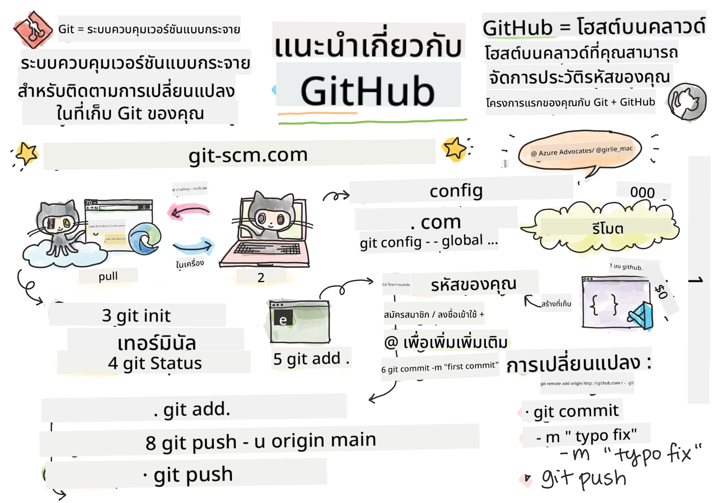
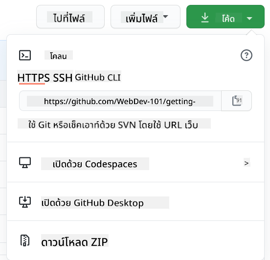

<!--
CO_OP_TRANSLATOR_METADATA:
{
  "original_hash": "acad15f3164cd6348e065ff38619aae9",
  "translation_date": "2025-10-23T20:54:58+00:00",
  "source_file": "1-getting-started-lessons/2-github-basics/README.md",
  "language_code": "th"
}
-->
# แนะนำ GitHub

สวัสดี นักพัฒนามือใหม่! 👋 พร้อมที่จะเข้าร่วมกับนักเขียนโค้ดนับล้านทั่วโลกแล้วหรือยัง? ฉันตื่นเต้นมากที่จะพาคุณมารู้จักกับ GitHub – ลองนึกถึงมันเหมือนเป็นโซเชียลมีเดียสำหรับโปรแกรมเมอร์ แต่แทนที่จะแชร์รูปอาหารกลางวัน เราแชร์โค้ดและสร้างสิ่งที่น่าทึ่งร่วมกัน!

สิ่งที่ทำให้ฉันทึ่งมากคือ ทุกแอปในโทรศัพท์ของคุณ ทุกเว็บไซต์ที่คุณเข้าไป และเครื่องมือส่วนใหญ่ที่คุณจะได้เรียนรู้ ล้วนถูกสร้างขึ้นโดยทีมพัฒนาที่ร่วมมือกันบนแพลตฟอร์มอย่าง GitHub แอปเพลงที่คุณชอบ? มีคนแบบคุณที่มีส่วนร่วมสร้างมันขึ้นมา เกมที่คุณเล่นไม่หยุด? ใช่แล้ว อาจถูกสร้างขึ้นด้วยการร่วมมือกันบน GitHub และตอนนี้คุณกำลังจะได้เรียนรู้วิธีการเป็นส่วนหนึ่งของชุมชนที่น่าทึ่งนี้!

ฉันรู้ว่ามันอาจจะดูเยอะในตอนแรก – ฉันยังจำได้เลยว่าฉันเคยจ้องหน้า GitHub ครั้งแรกแล้วคิดว่า "นี่มันหมายความว่าอะไรเนี่ย?" แต่สิ่งที่ฉันอยากบอกคือ นักพัฒนาทุกคนเริ่มต้นจากจุดเดียวกับคุณในตอนนี้นี่แหละ เมื่อจบบทเรียนนี้ คุณจะมี GitHub repository ของตัวเอง (คิดซะว่าเป็นพื้นที่แสดงผลงานส่วนตัวของคุณในคลาวด์) และคุณจะรู้วิธีบันทึกงานของคุณ แชร์กับคนอื่น และแม้กระทั่งมีส่วนร่วมในโปรเจกต์ที่มีคนใช้งานนับล้านคน

เราจะเดินทางไปด้วยกันทีละขั้นตอน ไม่ต้องรีบ ไม่ต้องกดดัน – แค่คุณกับฉัน และเครื่องมือเจ๋งๆ ที่กำลังจะกลายเป็นเพื่อนสนิทใหม่ของคุณ!


> ภาพวาดโดย [Tomomi Imura](https://twitter.com/girlie_mac)

## แบบทดสอบก่อนเรียน
[แบบทดสอบก่อนเรียน](https://ff-quizzes.netlify.app)

## บทนำ

ก่อนที่เราจะเข้าสู่เรื่องที่น่าตื่นเต้นจริงๆ มาเตรียมคอมพิวเตอร์ของคุณให้พร้อมสำหรับความมหัศจรรย์ของ GitHub กันเถอะ! ลองคิดว่ามันเหมือนกับการจัดเตรียมอุปกรณ์ศิลปะของคุณก่อนที่จะสร้างผลงานชิ้นเอก – การมีเครื่องมือที่เหมาะสมจะทำให้ทุกอย่างราบรื่นและสนุกมากขึ้น

ฉันจะพาคุณผ่านแต่ละขั้นตอนการตั้งค่าเอง และฉันสัญญาว่ามันจะไม่ดูน่ากลัวอย่างที่คิดในตอนแรก หากมีอะไรที่ยังไม่เข้าใจในทันที นั่นเป็นเรื่องปกติ! ฉันยังจำได้ว่าตอนที่ตั้งค่าครั้งแรก ฉันรู้สึกเหมือนกำลังพยายามอ่านอักษรภาพโบราณ นักพัฒนาทุกคนเคยอยู่ในจุดเดียวกับคุณตอนนี้ สงสัยว่าทำถูกหรือเปล่า เฉลยเลย: ถ้าคุณกำลังเรียนรู้ คุณก็ทำถูกแล้ว! 🌟

ในบทเรียนนี้ เราจะพูดถึง:

- การติดตามงานที่คุณทำบนเครื่องของคุณ
- การทำงานร่วมกันในโปรเจกต์กับคนอื่น
- วิธีการมีส่วนร่วมในซอฟต์แวร์โอเพ่นซอร์ส

### สิ่งที่ต้องเตรียม

มาเตรียมคอมพิวเตอร์ของคุณให้พร้อมสำหรับความมหัศจรรย์ของ GitHub กันเถอะ! ไม่ต้องกังวล – การตั้งค่านี้คุณทำแค่ครั้งเดียว แล้วคุณก็พร้อมสำหรับการเดินทางในโลกการเขียนโค้ดทั้งหมด

เริ่มต้นด้วยพื้นฐานกันเลย! ก่อนอื่นเราต้องตรวจสอบว่า Git ได้ถูกติดตั้งในคอมพิวเตอร์ของคุณหรือยัง Git เปรียบเสมือนผู้ช่วยอัจฉริยะที่จำทุกการเปลี่ยนแปลงที่คุณทำกับโค้ดของคุณ – ดีกว่าการกด Ctrl+S ทุกสองวินาที (เราทุกคนเคยทำแบบนั้น!)

ลองดูว่า Git ได้ถูกติดตั้งแล้วหรือยังโดยพิมพ์คำสั่งนี้ใน terminal ของคุณ:
`git --version`

ถ้า Git ยังไม่ได้ติดตั้ง ไม่ต้องกังวล! แค่ไปที่ [ดาวน์โหลด Git](https://git-scm.com/downloads) และดาวน์โหลดมา เมื่อคุณติดตั้งเสร็จแล้ว เราต้องแนะนำ Git ให้รู้จักกับคุณอย่างถูกต้อง:

> 💡 **การตั้งค่าครั้งแรก**: คำสั่งเหล่านี้บอก Git ว่าคุณคือใคร ข้อมูลนี้จะถูกแนบไปกับทุก commit ที่คุณทำ ดังนั้นเลือกชื่อและอีเมลที่คุณสบายใจที่จะเปิดเผยต่อสาธารณะ

```bash
git config --global user.name "your-name"
git config --global user.email "your-email"
```

เพื่อดูว่า Git ได้ถูกตั้งค่าแล้วหรือยัง คุณสามารถพิมพ์:
```bash
git config --list
```

คุณจะต้องมีบัญชี GitHub, โปรแกรมแก้ไขโค้ด (เช่น Visual Studio Code) และเปิด terminal (หรือ command prompt)

ไปที่ [github.com](https://github.com/) และสร้างบัญชีหากคุณยังไม่มี หรือเข้าสู่ระบบและกรอกข้อมูลโปรไฟล์ของคุณ

💡 **เคล็ดลับยุคใหม่**: ลองตั้งค่า [SSH keys](https://docs.github.com/en/authentication/connecting-to-github-with-ssh) หรือใช้ [GitHub CLI](https://cli.github.com/) เพื่อการยืนยันตัวตนที่ง่ายขึ้นโดยไม่ต้องใช้รหัสผ่าน

✅ GitHub ไม่ใช่ที่เก็บโค้ดเดียวในโลก ยังมีที่อื่นอีก แต่ GitHub เป็นที่รู้จักมากที่สุด

### การเตรียมตัว

คุณจะต้องมีทั้งโฟลเดอร์ที่มีโปรเจกต์โค้ดบนเครื่องของคุณ (แล็ปท็อปหรือ PC) และ repository สาธารณะบน GitHub ซึ่งจะเป็นตัวอย่างสำหรับวิธีการมีส่วนร่วมในโปรเจกต์ของคนอื่น  

### การรักษาความปลอดภัยของโค้ดของคุณ

มาพูดถึงเรื่องความปลอดภัยกันสักหน่อย – แต่ไม่ต้องกังวล เราจะไม่ทำให้คุณรู้สึกกลัว! ลองคิดว่าการปฏิบัติด้านความปลอดภัยเหล่านี้เหมือนกับการล็อกรถหรือบ้านของคุณ มันเป็นนิสัยง่ายๆ ที่จะกลายเป็นธรรมชาติและช่วยปกป้องงานของคุณ

เราจะสอนวิธีการทำงานกับ GitHub อย่างปลอดภัยและทันสมัยตั้งแต่เริ่มต้น วิธีนี้จะช่วยให้คุณพัฒนานิสัยที่ดีซึ่งจะเป็นประโยชน์ต่ออาชีพการเขียนโค้ดของคุณ

เมื่อทำงานกับ GitHub สิ่งสำคัญคือต้องปฏิบัติตามแนวทางปฏิบัติที่ดีที่สุดด้านความปลอดภัย:

| ด้านความปลอดภัย | แนวทางปฏิบัติที่ดีที่สุด | ทำไมถึงสำคัญ |
|-------------------|-----------------------------|---------------|
| **การยืนยันตัวตน** | ใช้ SSH keys หรือ Personal Access Tokens | รหัสผ่านมีความปลอดภัยน้อยกว่าและกำลังถูกยกเลิก |
| **การยืนยันตัวตนสองชั้น** | เปิดใช้งาน 2FA ในบัญชี GitHub ของคุณ | เพิ่มชั้นการป้องกันบัญชี |
| **ความปลอดภัยของ Repository** | ห้าม commit ข้อมูลที่ละเอียดอ่อน | API keys และรหัสผ่านไม่ควรอยู่ใน repos สาธารณะ |
| **การจัดการ Dependency** | เปิดใช้งาน Dependabot สำหรับการอัปเดต | ช่วยให้ dependency ของคุณปลอดภัยและทันสมัย |

> ⚠️ **คำเตือนด้านความปลอดภัยที่สำคัญ**: ห้าม commit API keys, รหัสผ่าน หรือข้อมูลที่ละเอียดอ่อนอื่นๆ ลงใน repository ใดๆ ใช้ environment variables และไฟล์ `.gitignore` เพื่อปกป้องข้อมูลที่ละเอียดอ่อน

**การตั้งค่าการยืนยันตัวตนแบบทันสมัย:**

```bash
# Generate SSH key (modern ed25519 algorithm)
ssh-keygen -t ed25519 -C "your_email@example.com"

# Set up Git to use SSH
git remote set-url origin git@github.com:username/repository.git
```

> 💡 **เคล็ดลับมือโปร**: SSH keys ช่วยลดความจำเป็นในการป้อนรหัสผ่านซ้ำๆ และมีความปลอดภัยมากกว่าวิธีการยืนยันตัวตนแบบดั้งเดิม

---

## การจัดการโค้ดของคุณอย่างมืออาชีพ

โอเค นี่คือส่วนที่น่าตื่นเต้นจริงๆ! 🎉 เรากำลังจะเรียนรู้วิธีการติดตามและจัดการโค้ดของคุณเหมือนมืออาชีพ และบอกเลยว่านี่เป็นหนึ่งในสิ่งที่ฉันชอบสอนมากที่สุด เพราะมันเปลี่ยนแปลงวิธีการทำงานของคุณได้อย่างมาก

ลองนึกภาพนี้: คุณกำลังเขียนเรื่องราวที่น่าทึ่ง และคุณอยากจะติดตามทุกฉบับร่าง ทุกการแก้ไขที่ยอดเยี่ยม และทุกช่วงเวลาที่คุณคิดว่า "โอ้ นี่มันเจ๋งมาก!" นั่นแหละคือสิ่งที่ Git ทำกับโค้ดของคุณ! มันเหมือนกับการมีสมุดบันทึกที่สามารถเดินทางข้ามเวลาได้และจำทุกสิ่งทุกอย่าง – ทุกการพิมพ์ ทุกการเปลี่ยนแปลง ทุก "โอ๊ะ นี่มันพังหมดเลย" ที่คุณสามารถย้อนกลับได้ทันที

ฉันจะบอกตรงๆ – มันอาจจะดูน่ากลัวในตอนแรก ตอนที่ฉันเริ่มต้น ฉันคิดว่า "ทำไมฉันถึงไม่สามารถบันทึกไฟล์แบบปกติได้?" แต่เชื่อฉันเถอะ: เมื่อคุณเข้าใจ Git (และคุณจะเข้าใจแน่นอน!) คุณจะมีช่วงเวลาที่เหมือนหลอดไฟสว่างขึ้นในหัว และคิดว่า "ฉันเคยเขียนโค้ดโดยไม่มีสิ่งนี้ได้ยังไงกัน?" มันเหมือนกับการค้นพบว่าคุณบินได้หลังจากเดินมาตลอดชีวิต!

สมมติว่าคุณมีโฟลเดอร์ในเครื่องที่มีโปรเจกต์โค้ด และคุณอยากเริ่มติดตามความคืบหน้าของคุณโดยใช้ git – ระบบควบคุมเวอร์ชัน บางคนเปรียบการใช้ git เหมือนการเขียนจดหมายรักถึงตัวคุณในอนาคต การอ่าน commit messages ของคุณในอีกหลายวันหรือหลายสัปดาห์หรือหลายเดือนต่อมา คุณจะสามารถระลึกถึงเหตุผลที่คุณตัดสินใจ หรือ "ย้อนกลับ" การเปลี่ยนแปลง – นั่นคือเมื่อคุณเขียน "commit messages" ที่ดี

### ภารกิจ: สร้าง Repository แรกของคุณ!

> 🎯 **ภารกิจของคุณ (และฉันตื่นเต้นมากสำหรับคุณ!)**: เรากำลังจะสร้าง GitHub repository แรกของคุณด้วยกัน! เมื่อเราทำเสร็จ คุณจะมีพื้นที่เล็กๆ บนอินเทอร์เน็ตที่โค้ดของคุณอยู่ และคุณจะได้ทำ "commit" ครั้งแรกของคุณ (นั่นคือคำศัพท์ของนักพัฒนาที่หมายถึงการบันทึกงานของคุณในวิธีที่ฉลาดมาก)
>
> นี่เป็นช่วงเวลาที่พิเศษจริงๆ – คุณกำลังจะเข้าร่วมชุมชนนักพัฒนาระดับโลกอย่างเป็นทางการ! ฉันยังจำความตื่นเต้นของการสร้าง repo แรกของฉันและคิดว่า "ว้าว ฉันกำลังทำสิ่งนี้จริงๆ!"

มาสำรวจการผจญภัยนี้ด้วยกันทีละขั้นตอน ใช้เวลาของคุณในแต่ละส่วน – ไม่มีรางวัลสำหรับการรีบ และฉันสัญญาว่าทุกขั้นตอนจะเข้าใจได้ จำไว้ว่า นักพัฒนาที่คุณชื่นชมทุกคนเคยอยู่ในจุดเดียวกับคุณ กำลังจะสร้าง repository แรกของพวกเขา มันเจ๋งแค่ไหนกัน?

> ดูวิดีโอ
> 
> [](https://www.youtube.com/watch?v=9R31OUPpxU4)

**มาทำด้วยกัน:**

1. **สร้าง repository ของคุณบน GitHub**. ไปที่ GitHub.com และมองหาปุ่ม **New** สีเขียวสดใส (หรือสัญลักษณ์ **+** ที่มุมขวาบน) คลิกมันและเลือก **New repository**

   สิ่งที่ต้องทำ:
   1. ตั้งชื่อ repository ของคุณ – ให้มันมีความหมายสำหรับคุณ!
   1. เพิ่มคำอธิบายถ้าคุณต้องการ (ช่วยให้คนอื่นเข้าใจว่าโปรเจกต์ของคุณเกี่ยวกับอะไร)
   1. ตัดสินใจว่าคุณต้องการให้มันเป็น public (ทุกคนสามารถเห็นได้) หรือ private (แค่คุณเท่านั้น)
   1. ฉันแนะนำให้ติ๊กช่องเพื่อเพิ่มไฟล์ README – มันเหมือนหน้าปกของโปรเจกต์ของคุณ
   1. คลิก **Create repository** และฉลอง – คุณเพิ่งสร้าง repo แรกของคุณ! 🎉

2. **ไปยังโฟลเดอร์โปรเจกต์ของคุณ**. ตอนนี้มาเปิด terminal ของคุณ (ไม่ต้องกังวล มันไม่ได้ดูน่ากลัวอย่างที่คิด!) เราต้องบอกคอมพิวเตอร์ของคุณว่าไฟล์โปรเจกต์ของคุณอยู่ที่ไหน พิมพ์คำสั่งนี้:

   ```bash
   cd [name of your folder]
   ```

   **สิ่งที่เรากำลังทำอยู่:**
   - เรากำลังบอกคอมพิวเตอร์ว่า "เฮ้ พาฉันไปที่โฟลเดอร์โปรเจกต์ของฉัน"
   - มันเหมือนกับการเปิดโฟลเดอร์เฉพาะบนเดสก์ท็อปของคุณ แต่เราทำด้วยคำสั่งข้อความ
   - แทนที่ `[name of your folder]` ด้วยชื่อจริงของโฟลเดอร์โปรเจกต์ของคุณ

3. **เปลี่ยนโฟลเดอร์ของคุณให้เป็น Git repository**. นี่คือจุดที่ความมหัศจรรย์เกิดขึ้น! พิมพ์:

   ```bash
   git init
   ```

   **สิ่งที่เพิ่งเกิดขึ้น (เจ๋งมาก!):**
   - Git เพิ่งสร้างโฟลเดอร์ `.git` ที่ซ่อนอยู่ในโปรเจกต์ของคุณ – คุณจะไม่เห็นมัน แต่มันอยู่ที่นั่น!
   - โฟลเดอร์ปกติของคุณตอนนี้กลายเป็น "repository" ที่สามารถติดตามทุกการเปลี่ยนแปลงที่คุณทำ
   - ลองคิดว่ามันเหมือนการให้โฟลเดอร์ของคุณมีพลังพิเศษที่จำทุกอย่างได้

4. **ตรวจสอบว่าเกิดอะไรขึ้น**. มาดูกันว่า Git คิดยังไงกับโปรเจกต์ของคุณตอนนี้:

   ```bash
   git status
   ```

   **การทำความเข้าใจสิ่งที่ Git บอกคุณ:**
   
   คุณอาจเห็นบางอย่างที่ดูเหมือนแบบนี้:

   ```output
   Changes not staged for commit:
   (use "git add <file>..." to update what will be committed)
   (use "git restore <file>..." to discard changes in working directory)

        modified:   file.txt
        modified:   file2.txt
   ```

   **อย่าตกใจ! นี่หมายความว่า:**
   - ไฟล์ใน **สีแดง** คือไฟล์ที่มีการเปลี่ยนแปลงแต่ยังไม่พร้อมที่จะบันทึก
   - ไฟล์ใน **สีเขียว** (เมื่อคุณเห็นมัน) พร้อมที่จะบันทึกแล้ว
   - Git กำลังช่วยเหลือโดยบอกคุณว่าคุณสามารถทำอะไรต่อไปได้

   > 💡 **เคล็ดลับมือโปร**: คำสั่ง `git status` คือเพื่อนที่ดีที่สุดของคุณ! ใช้มันทุกครั้งที่คุณสับสนเกี่ยวกับสิ่งที่เกิดขึ้น มันเหมือนกับการถาม Git ว่า "เฮ้ สถานการณ์ตอนนี้เป็นยังไง?"

5. **เตรียมไฟล์ของคุณให้พร้อมสำหรับการบันทึก** (เรียกว่า "staging"):

   ```bash
   git add .
   ```

   **สิ่งที่เราทำไป:**
   - เราบอก Git ว่า "เฮ้ ฉันอยากรวมไฟล์ทั้งหมดในโฟลเดอร์นี้ในบันทึกครั้งต่อไป"
   - `.` เหมือนกับการบอกว่า "ทุกอย่างในโฟลเดอร์นี้"
   - ตอนนี้ไฟล์ของคุณ "staged" และพร้อมสำหรับขั้นตอนต่อไป

   **อยากเลือกเฉพาะบางไฟล์?** คุณสามารถเพิ่มไฟล์เฉพาะได้:

   ```bash
   git add [file or folder name]
   ```

   **ทำไมคุณถึงอยากทำแบบนี้?**
   - บางครั้งคุณอยากบันทึกการเปลี่ยนแปลงที่เกี่ยวข้องกัน
   - มันช่วยให้คุณจัดการงานของคุณเป็นส่วนที่มีเหตุผล
   - ทำให้เข้าใจได้ง่ายขึ้นว่าอะไรเปลี่ยนแปลงและเมื่อไหร่

   **เปลี่ยนใจ?** ไม่ต้องกังวล! คุณสามารถยกเลิกการ stage ไฟล์ได้แบบนี้:

   ```bash
   # Unstage everything
   git reset
   
   # Unstage just one file
   git reset [file name]
   ```

   ไม่ต้องกังวล – นี่ไม่ได้ลบงานของคุณ มันแค่เอาไฟล์ออกจาก "กองที่พร้อมบันทึก"

6. **บันทึกงานของคุณอย่างถาวร** (ทำ commit ครั้งแรกของคุณ!):

   ```bash
   git commit -m "first commit"
   ```

   **🎉 ยินดีด้วย! คุณเพิ่งทำ commit ครั้งแรกของคุณ!**
   
   **สิ่งที่เพิ่งเกิดขึ้น:**
   - Git ได้ถ่าย "snapshot" ของไฟล์ทั้งหมดที่คุณ staged ในช่วงเวลานี้
   - ข้อความ commit ของคุณ "first commit" อธิบายว่า save point นี้เกี่ยวกับอะไร
   - Git ให้ snapshot นี้มี ID เฉพาะเพื่อให้คุณสามารถหาได้เสมอ
   - คุณได้เริ่มต้นติดตามประวัติของโปรเจกต์ของคุณอย่างเป็นทางการแล้ว
   - เราได้สร้างการเชื่อมต่อระหว่างโปรเจกต์ในเครื่องของคุณกับ GitHub repository ของคุณแล้ว
   - "Origin" เป็นแค่ชื่อเล่นสำหรับ GitHub repository ของคุณ – เหมือนกับการเพิ่มรายชื่อในโทรศัพท์ของคุณ
   - ตอนนี้ Git ในเครื่องของคุณรู้แล้วว่าจะส่งโค้ดไปที่ไหนเมื่อคุณพร้อมที่จะแชร์มัน

   💡 **วิธีที่ง่ายกว่า**: หากคุณติดตั้ง GitHub CLI แล้ว คุณสามารถทำสิ่งนี้ได้ด้วยคำสั่งเดียว:
   ```bash
   gh repo create my-repo --public --push --source=.
   ```

8. **ส่งโค้ดของคุณไปยัง GitHub** (ช่วงเวลาสำคัญ!):

   ```bash
   git push -u origin main
   ```

   **🚀 นี่แหละ! คุณกำลังอัปโหลดโค้ดของคุณไปยัง GitHub!**
   
   **สิ่งที่เกิดขึ้น:**
   - Commit ของคุณกำลังเดินทางจากคอมพิวเตอร์ของคุณไปยัง GitHub
   - flag `-u` จะตั้งค่าการเชื่อมต่อถาวรเพื่อให้การ push ครั้งต่อไปง่ายขึ้น
   - "main" คือชื่อของ branch หลักของคุณ (เหมือนโฟลเดอร์หลัก)
   - หลังจากนี้ คุณสามารถพิมพ์ `git push` สำหรับการอัปโหลดในอนาคตได้เลย!

   💡 **หมายเหตุด่วน**: หาก branch ของคุณมีชื่ออื่น (เช่น "master") ให้ใช้ชื่อนั้นแทน คุณสามารถตรวจสอบได้ด้วย `git branch --show-current`

9. **จังหวะการเขียนโค้ดประจำวันของคุณ** (นี่คือจุดที่มันเริ่มสนุก!):

   จากนี้ไป ทุกครั้งที่คุณทำการเปลี่ยนแปลงในโปรเจกต์ของคุณ คุณจะมีขั้นตอนง่ายๆ สามขั้นตอนนี้:

   ```bash
   git add .
   git commit -m "describe what you changed"
   git push
   ```

   **นี่จะกลายเป็นจังหวะการเขียนโค้ดของคุณ:**
   - ทำการเปลี่ยนแปลงโค้ดที่ยอดเยี่ยม ✨
   - Stage การเปลี่ยนแปลงด้วย `git add` ("เฮ้ Git, สนใจการเปลี่ยนแปลงพวกนี้หน่อย!")
   - บันทึกการเปลี่ยนแปลงด้วย `git commit` พร้อมข้อความอธิบาย (อนาคตคุณจะขอบคุณตัวเอง!)
   - แชร์ให้โลกเห็นด้วย `git push` 🚀
   - ทำซ้ำ – จริงๆ แล้วมันจะกลายเป็นธรรมชาติของคุณ!

   ฉันชอบ workflow นี้เพราะมันเหมือนกับการมีจุดเซฟหลายจุดในวิดีโอเกม ทำการเปลี่ยนแปลงที่คุณชอบ? Commit มัน! อยากลองอะไรที่เสี่ยง? ไม่มีปัญหา – คุณสามารถกลับไปยัง commit ล่าสุดได้เสมอหากมีอะไรผิดพลาด!

   > 💡 **เคล็ดลับ**: คุณอาจต้องการใช้ไฟล์ `.gitignore` เพื่อป้องกันไม่ให้ไฟล์ที่คุณไม่ต้องการติดตามปรากฏบน GitHub เช่นไฟล์บันทึกที่คุณเก็บไว้ในโฟลเดอร์เดียวกันแต่ไม่มีที่ใน repository สาธารณะ คุณสามารถค้นหาเทมเพลตสำหรับไฟล์ `.gitignore` ได้ที่ [.gitignore templates](https://github.com/github/gitignore) หรือสร้างไฟล์ด้วย [gitignore.io](https://www.toptal.com/developers/gitignore)

#### Workflow Git สมัยใหม่

ลองนำแนวทางปฏิบัติสมัยใหม่เหล่านี้มาใช้:

- **Conventional Commits**: ใช้รูปแบบข้อความ commit ที่เป็นมาตรฐาน เช่น `feat:`, `fix:`, `docs:` เป็นต้น เรียนรู้เพิ่มเติมได้ที่ [conventionalcommits.org](https://www.conventionalcommits.org/)
- **Atomic commits**: ทำให้แต่ละ commit แสดงถึงการเปลี่ยนแปลงเชิงตรรกะเพียงหนึ่งเดียว
- **Frequent commits**: Commit บ่อยๆ พร้อมข้อความอธิบายที่ชัดเจนแทนที่จะทำ commit ใหญ่ๆ นานๆ ครั้ง

#### ข้อความ Commit

หัวข้อของข้อความ commit ที่ดีควรตอบคำถามนี้:
ถ้านำไปใช้แล้ว commit นี้จะ <หัวข้อของคุณที่นี่>

สำหรับหัวข้อให้ใช้คำกริยาในรูปแบบคำสั่งและปัจจุบัน: "เปลี่ยน" ไม่ใช่ "เปลี่ยนแล้ว" หรือ "กำลังเปลี่ยน" เช่นเดียวกับหัวข้อ ในเนื้อหา (ถ้ามี) ให้ใช้คำกริยาในรูปแบบคำสั่งและปัจจุบัน เนื้อหาควรประกอบด้วยแรงจูงใจในการเปลี่ยนแปลงและเปรียบเทียบกับพฤติกรรมก่อนหน้า คุณกำลังอธิบาย `ทำไม` ไม่ใช่ `อย่างไร`

✅ ใช้เวลาสักครู่เพื่อสำรวจ GitHub คุณสามารถหาข้อความ commit ที่ยอดเยี่ยมได้ไหม? หรือข้อความที่เรียบง่ายที่สุด? คุณคิดว่าข้อมูลใดสำคัญและมีประโยชน์ที่สุดในการสื่อสารในข้อความ commit?

## การทำงานร่วมกับผู้อื่น (ส่วนที่สนุก!)

เตรียมตัวให้พร้อม เพราะนี่คือจุดที่ GitHub กลายเป็นสิ่งมหัศจรรย์! 🪄 คุณได้เรียนรู้การจัดการโค้ดของตัวเองแล้ว แต่ตอนนี้เรากำลังเข้าสู่ส่วนที่ฉันชอบที่สุด – การร่วมมือกับคนที่น่าทึ่งจากทั่วโลก

ลองจินตนาการดู: คุณตื่นขึ้นมาในวันพรุ่งนี้และพบว่ามีคนในโตเกียวปรับปรุงโค้ดของคุณในขณะที่คุณหลับ จากนั้นมีคนในเบอร์ลินแก้ไขบั๊กที่คุณติดอยู่ และในช่วงบ่าย นักพัฒนาในเซาเปาโลเพิ่มฟีเจอร์ที่คุณไม่เคยคิดถึง นี่ไม่ใช่นิยายวิทยาศาสตร์ – นี่คือวันอังคารธรรมดาในจักรวาล GitHub!

สิ่งที่ทำให้ฉันตื่นเต้นจริงๆ คือทักษะการร่วมมือที่คุณกำลังจะเรียนรู้? นี่คือ workflow เดียวกันกับที่ทีมที่ Google, Microsoft และสตาร์ทอัพที่คุณชื่นชอบใช้ทุกวัน คุณไม่ได้แค่เรียนรู้เครื่องมือเจ๋งๆ – คุณกำลังเรียนรู้ภาษาลับที่ทำให้โลกซอฟต์แวร์ทั้งหมดทำงานร่วมกันได้

จริงๆ แล้ว เมื่อคุณได้สัมผัสความรู้สึกที่มีคน merge pull request แรกของคุณ คุณจะเข้าใจว่าทำไมนักพัฒนาถึงหลงใหลใน open source มันเหมือนกับการเป็นส่วนหนึ่งของโปรเจกต์ทีมที่ใหญ่ที่สุดและสร้างสรรค์ที่สุดในโลก!

> ดูวิดีโอ
>
> [](https://www.youtube.com/watch?v=bFCM-PC3cu8)

เหตุผลหลักที่นำสิ่งต่างๆ ไปไว้บน GitHub คือการทำให้สามารถร่วมมือกับนักพัฒนาคนอื่นได้

ใน repository ของคุณ ไปที่ `Insights > Community` เพื่อดูว่าโปรเจกต์ของคุณเปรียบเทียบกับมาตรฐานชุมชนที่แนะนำอย่างไร

อยากทำให้ repository ของคุณดูเป็นมืออาชีพและน่าดึงดูด? ไปที่ repository ของคุณและคลิกที่ `Insights > Community` ฟีเจอร์เจ๋งๆ นี้จะแสดงให้คุณเห็นว่าโปรเจกต์ของคุณเปรียบเทียบกับสิ่งที่ชุมชน GitHub ถือว่าเป็น "แนวปฏิบัติที่ดีสำหรับ repository" อย่างไร

> 🎯 **ทำให้โปรเจกต์ของคุณโดดเด่น**: repository ที่จัดระเบียบดีพร้อมเอกสารที่ดีเหมือนมีหน้าร้านที่สะอาดและน่าต้อนรับ มันบอกให้คนอื่นรู้ว่าคุณใส่ใจในงานของคุณและทำให้คนอื่นอยากมีส่วนร่วม!

**สิ่งที่ทำให้ repository ยอดเยี่ยม:**

| สิ่งที่ควรเพิ่ม | ทำไมถึงสำคัญ | สิ่งที่มันทำให้คุณ |
|------------------|---------------|---------------------|
| **Description** | ความประทับใจแรกสำคัญ! | คนจะรู้ทันทีว่าโปรเจกต์ของคุณทำอะไร |
| **README** | หน้าแรกของโปรเจกต์คุณ | เหมือนไกด์นำเที่ยวที่เป็นมิตรสำหรับผู้มาเยือนใหม่ |
| **Contributing Guidelines** | แสดงว่าคุณยินดีรับความช่วยเหลือ | คนจะรู้ว่าพวกเขาสามารถช่วยคุณได้อย่างไร |
| **Code of Conduct** | สร้างพื้นที่ที่เป็นมิตร | ทุกคนรู้สึกยินดีที่จะมีส่วนร่วม |
| **License** | ความชัดเจนทางกฎหมาย | คนอื่นรู้ว่าพวกเขาสามารถใช้โค้ดของคุณได้อย่างไร |
| **Security Policy** | แสดงว่าคุณมีความรับผิดชอบ | แสดงถึงแนวปฏิบัติที่เป็นมืออาชีพ |

> 💡 **เคล็ดลับมือโปร**: GitHub มีเทมเพลตสำหรับไฟล์เหล่านี้ทั้งหมด เมื่อสร้าง repository ใหม่ ให้เลือกช่องเพื่อสร้างไฟล์เหล่านี้โดยอัตโนมัติ

**ฟีเจอร์ GitHub สมัยใหม่ที่ควรสำรวจ:**

🤖 **Automation & CI/CD:**
- **GitHub Actions** สำหรับการทดสอบและการ deploy อัตโนมัติ
- **Dependabot** สำหรับการอัปเดต dependency อัตโนมัติ

💬 **Community & Project Management:**
- **GitHub Discussions** สำหรับการสนทนาชุมชนที่นอกเหนือจาก issues
- **GitHub Projects** สำหรับการจัดการโปรเจกต์แบบ kanban
- **Branch protection rules** เพื่อบังคับใช้มาตรฐานคุณภาพโค้ด

ทรัพยากรเหล่านี้จะช่วยให้การ onboarding สมาชิกทีมใหม่เป็นไปอย่างราบรื่น และสิ่งเหล่านี้มักเป็นสิ่งที่ผู้ร่วมงานใหม่มองหาก่อนที่จะดูโค้ดของคุณ เพื่อดูว่าโปรเจกต์ของคุณเหมาะสมกับเวลาของพวกเขาหรือไม่

✅ ไฟล์ README แม้ว่าจะใช้เวลาในการเตรียม แต่ก็มักถูกละเลยโดยผู้ดูแลที่ยุ่ง คุณสามารถหาตัวอย่างไฟล์ README ที่อธิบายได้ดีเป็นพิเศษได้ไหม? หมายเหตุ: มี [เครื่องมือช่วยสร้าง README ที่ดี](https://www.makeareadme.com/) ที่คุณอาจอยากลองใช้

### งาน: รวมโค้ดบางส่วน

เอกสารการมีส่วนร่วมช่วยให้คนมีส่วนร่วมในโปรเจกต์ได้ง่ายขึ้น มันอธิบายว่าคุณกำลังมองหาการมีส่วนร่วมประเภทใดและกระบวนการทำงานเป็นอย่างไร ผู้ร่วมงานจะต้องผ่านขั้นตอนต่างๆ เพื่อสามารถมีส่วนร่วมใน repository ของคุณบน GitHub:

1. **Forking repository ของคุณ** คุณอาจต้องการให้คนอื่น _fork_ โปรเจกต์ของคุณ Forking หมายถึงการสร้างสำเนา repository ของคุณในโปรไฟล์ GitHub ของพวกเขา
1. **Clone**. จากนั้นพวกเขาจะ clone โปรเจกต์ไปยังเครื่องของพวกเขา
1. **Create a branch**. คุณอาจต้องการให้พวกเขาสร้าง _branch_ สำหรับงานของพวกเขา
1. **มุ่งเน้นการเปลี่ยนแปลงในพื้นที่เดียว**. ขอให้ผู้ร่วมงานมุ่งเน้นการเปลี่ยนแปลงในสิ่งเดียวในแต่ละครั้ง – วิธีนี้จะเพิ่มโอกาสที่คุณจะสามารถ _merge_ งานของพวกเขาได้ ลองจินตนาการว่าพวกเขาแก้ไขบั๊ก เพิ่มฟีเจอร์ใหม่ และอัปเดตการทดสอบหลายรายการ – จะเกิดอะไรขึ้นถ้าคุณต้องการหรือสามารถนำไปใช้ได้เพียง 2 ใน 3 หรือ 1 ใน 3 การเปลี่ยนแปลง?

✅ ลองจินตนาการถึงสถานการณ์ที่ branch มีความสำคัญอย่างยิ่งต่อการเขียนและส่งโค้ดที่ดี คุณคิดถึงกรณีการใช้งานอะไรได้บ้าง?

> หมายเหตุ เป็นการเปลี่ยนแปลงที่คุณอยากเห็นในโลก และสร้าง branch สำหรับงานของคุณเองด้วย Commit ใดๆ ที่คุณทำจะถูกทำใน branch ที่คุณกำลัง "checked out" อยู่ ใช้ `git status` เพื่อดูว่า branch นั้นคืออะไร

มาดู workflow ของผู้ร่วมงานกัน สมมติว่าผู้ร่วมงานได้ _fork_ และ _clone_ repository แล้ว ดังนั้นพวกเขาจึงมี Git repository พร้อมที่จะทำงานบนเครื่องของพวกเขา:

1. **Create a branch**. ใช้คำสั่ง `git branch` เพื่อสร้าง branch ที่จะเก็บการเปลี่ยนแปลงที่พวกเขาตั้งใจจะมีส่วนร่วม:

   ```bash
   git branch [branch-name]
   ```

   > 💡 **วิธีการสมัยใหม่**: คุณยังสามารถสร้างและสลับไปยัง branch ใหม่ได้ในคำสั่งเดียว:
   ```bash
   git switch -c [branch-name]
   ```

1. **สลับไปยัง branch ที่ทำงาน**. สลับไปยัง branch ที่ระบุและอัปเดต working directory ด้วย `git switch`:

   ```bash
   git switch [branch-name]
   ```

   > 💡 **หมายเหตุสมัยใหม่**: `git switch` เป็นคำสั่งที่มาแทน `git checkout` ในการเปลี่ยน branch มันชัดเจนและปลอดภัยสำหรับผู้เริ่มต้น

1. **ทำงาน**. ณ จุดนี้คุณต้องเพิ่มการเปลี่ยนแปลงของคุณ อย่าลืมบอก Git เกี่ยวกับมันด้วยคำสั่งต่อไปนี้:

   ```bash
   git add .
   git commit -m "my changes"
   ```

   > ⚠️ **คุณภาพของข้อความ Commit**: ตรวจสอบให้แน่ใจว่าคุณตั้งชื่อ commit ของคุณดี ทั้งสำหรับตัวคุณเองและผู้ดูแล repository ที่คุณกำลังช่วยเหลือ ระบุให้ชัดเจนว่าคุณเปลี่ยนแปลงอะไร!

1. **รวมงานของคุณกับ branch `main`**. ณ จุดหนึ่งคุณทำงานเสร็จแล้วและต้องการรวมงานของคุณกับ branch `main` branch `main` อาจมีการเปลี่ยนแปลงในระหว่างนี้ ดังนั้นให้แน่ใจว่าคุณอัปเดตมันให้เป็นล่าสุดด้วยคำสั่งต่อไปนี้:

   ```bash
   git switch main
   git pull
   ```

   ณ จุดนี้คุณต้องแน่ใจว่า _conflicts_ หรือสถานการณ์ที่ Git ไม่สามารถ _combine_ การเปลี่ยนแปลงได้ง่ายๆ เกิดขึ้นใน branch ที่คุณกำลังทำงานอยู่ ดังนั้นให้รันคำสั่งต่อไปนี้:

   ```bash
   git switch [branch_name]
   git merge main
   ```

   คำสั่ง `git merge main` จะนำการเปลี่ยนแปลงทั้งหมดจาก `main` เข้ามาใน branch ของคุณ หวังว่าคุณจะสามารถดำเนินการต่อได้ หากไม่เป็นเช่นนั้น VS Code จะบอกคุณว่า Git _สับสน_ ตรงไหน และคุณเพียงแค่แก้ไขไฟล์ที่ได้รับผลกระทบเพื่อบอกว่าเนื้อหาใดถูกต้องที่สุด

   💡 **ทางเลือกสมัยใหม่**: ลองใช้ `git rebase` เพื่อประวัติที่สะอาดกว่า:
   ```bash
   git rebase main
   ```
   นี่จะ replay commit ของคุณบน branch `main` ล่าสุด สร้างประวัติที่เป็นเส้นตรง

1. **ส่งงานของคุณไปยัง GitHub**. การส่งงานของคุณไปยัง GitHub หมายถึงสองสิ่ง การ push branch ของคุณไปยัง repository และจากนั้นเปิด PR, Pull Request

   ```bash
   git push --set-upstream origin [branch-name]
   ```

   คำสั่งด้านบนจะสร้าง branch บน repository ที่คุณ forked

1. **เปิด PR**. ต่อไป คุณต้องเปิด PR คุณทำได้โดยไปที่ repository ที่ forked บน GitHub คุณจะเห็นการแจ้งเตือนบน GitHub ที่ถามว่าคุณต้องการสร้าง PR ใหม่หรือไม่ คุณคลิกที่นั้นและคุณจะถูกนำไปยังอินเทอร์เฟซที่คุณสามารถเปลี่ยนหัวข้อข้อความ commit ให้เหมาะสมและให้คำอธิบายที่เหมาะสม ตอนนี้ผู้ดูแล repository ที่คุณ forked จะเห็น PR นี้และ _หวังว่า_ พวกเขาจะชื่นชมและ _merge_ PR ของคุณ คุณกลายเป็นผู้ร่วมงานแล้ว เย้ :)

   💡 **เคล็ดลับสมัยใหม่**: คุณยังสามารถสร้าง PR โดยใช้ GitHub CLI:
   ```bash
   gh pr create --title "Your PR title" --body "Description of changes"
   ```

   🔧 **แนวปฏิบัติที่ดีที่สุดสำหรับ PRs**:
   - ลิงก์ไปยัง issues ที่เกี่ยวข้องโดยใช้คำสำคัญเช่น "Fixes #123"
   - เพิ่มภาพหน้าจอสำหรับการเปลี่ยนแปลง UI
   - ขอ reviewers เฉพาะเจาะจง
   - ใช้ draft PRs สำหรับงานที่ยังไม่เสร็จ
   - ตรวจสอบให้แน่ใจว่า CI checks ทั้งหมดผ่านก่อนขอ review

1. **ทำความสะอาด**. ถือว่าเป็นแนวปฏิบัติที่ดีในการ _ทำความสะอาด_ หลังจากที่คุณ merge PR สำเร็จ คุณต้องการทำความสะอาดทั้ง branch ในเครื่องและ branch ที่คุณ push ไปยัง GitHub ก่อนอื่นให้ลบมันในเครื่องด้วยคำสั่งต่อไปนี้:

   ```bash
   git branch -d [branch-name]
   ```

   ตรวจสอบให้แน่ใจว่าคุณไปที่หน้าของ repository ที่ forked บน GitHub และลบ branch remote ที่คุณเพิ่ง push ไปยังมัน

`Pull request` ดูเหมือนคำที่แปลกเพราะจริงๆ แล้วคุณต้องการ push การเปลี่ยนแปลงของคุณไปยังโปรเจกต์ แต่ผู้ดูแล (เจ้าของโปรเจกต์) หรือทีมหลักต้องพิจารณาการเปลี่ยนแปลงของคุณก่อนที่จะ merge เข้ากับ branch "main" ของโปรเจกต์ ดังนั้นจริงๆ แล้วคุณกำลังขอการตัดสินใจเปลี่ยนแปลงจากผู้ดูแล

Pull request เป็นสถานที่สำหรับเปรียบเทียบและอภิปรายความแตกต่างที่เกิดขึ้นใน branch พร้อมกับ reviews, comments, การทดสอบที่รวมอยู่ และอื่นๆ Pull request ที่ดีจะ
🤞ขอให้ทุกอย่างผ่านไปด้วยดี และเจ้าของโปรเจกต์รวมการเปลี่ยนแปลงของคุณเข้าไปในโปรเจกต์🤞

อัปเดตสาขาที่คุณกำลังทำงานอยู่ในเครื่องของคุณด้วยคอมมิตใหม่ทั้งหมดจากสาขารีโมตที่เกี่ยวข้องบน GitHub:

`git pull`

## การมีส่วนร่วมในโอเพ่นซอร์ส (โอกาสของคุณในการสร้างความเปลี่ยนแปลง!)

พร้อมหรือยังสำหรับสิ่งที่จะทำให้คุณตื่นเต้นสุดๆ? 🤯 มาคุยกันเรื่องการมีส่วนร่วมในโปรเจกต์โอเพ่นซอร์ส – แค่คิดถึงการแบ่งปันนี้ก็ทำให้ขนลุกแล้ว!

นี่คือโอกาสของคุณที่จะเป็นส่วนหนึ่งของสิ่งที่น่าทึ่งจริงๆ ลองจินตนาการถึงการปรับปรุงเครื่องมือที่นักพัฒนาหลายล้านคนใช้ทุกวัน หรือแก้ไขบั๊กในแอปที่เพื่อนของคุณชื่นชอบ นี่ไม่ใช่แค่ความฝัน – นี่คือสิ่งที่การมีส่วนร่วมในโอเพ่นซอร์สเป็นเรื่องเกี่ยวกับ!

สิ่งที่ทำให้ฉันตื่นเต้นทุกครั้งที่คิดถึงมันคือ: ทุกเครื่องมือที่คุณเคยเรียนรู้ – ตัวแก้ไขโค้ดของคุณ เฟรมเวิร์กที่เราจะสำรวจ แม้กระทั่งเบราว์เซอร์ที่คุณกำลังอ่านนี้ – เริ่มต้นจากใครบางคนที่เหมือนคุณที่ทำการมีส่วนร่วมครั้งแรกของพวกเขา นักพัฒนาที่เก่งกาจที่สร้างส่วนขยาย VS Code ที่คุณชื่นชอบ? พวกเขาเคยเป็นมือใหม่ที่คลิก "create pull request" ด้วยมือที่สั่น เหมือนกับที่คุณกำลังจะทำ

และนี่คือส่วนที่สวยงามที่สุด: ชุมชนโอเพ่นซอร์สเหมือนกับการกอดกลุ่มใหญ่ที่สุดในอินเทอร์เน็ต โปรเจกต์ส่วนใหญ่กำลังมองหาผู้มาใหม่และมีปัญหาที่ติดแท็ก "good first issue" โดยเฉพาะสำหรับคนอย่างคุณ! ผู้ดูแลโปรเจกต์ตื่นเต้นจริงๆ เมื่อเห็นผู้มีส่วนร่วมใหม่ เพราะพวกเขาจำก้าวแรกของตัวเองได้

คุณไม่ได้แค่เรียนรู้การเขียนโค้ดที่นี่ – คุณกำลังเตรียมตัวที่จะเข้าร่วมครอบครัวระดับโลกของผู้สร้างที่ตื่นขึ้นทุกวันพร้อมกับความคิดว่า "เราจะทำให้โลกดิจิทัลดีขึ้นได้อย่างไร?" ยินดีต้อนรับสู่คลับ! 🌟

ก่อนอื่น มาหา repository (หรือ **repo**) บน GitHub ที่คุณสนใจและอยากมีส่วนร่วมในการเปลี่ยนแปลง คุณจะต้องคัดลอกเนื้อหาของมันลงในเครื่องของคุณ

✅ วิธีที่ดีในการหา repo ที่เหมาะสำหรับมือใหม่คือ [ค้นหาด้วยแท็ก 'good-first-issue'](https://github.blog/2020-01-22-browse-good-first-issues-to-start-contributing-to-open-source/)



มีหลายวิธีในการคัดลอกโค้ด วิธีหนึ่งคือ "clone" เนื้อหาของ repository โดยใช้ HTTPS, SSH หรือ GitHub CLI (Command Line Interface)

เปิด terminal ของคุณและ clone repository ดังนี้:
```bash
# Using HTTPS
git clone https://github.com/ProjectURL

# Using SSH (requires SSH key setup)
git clone git@github.com:username/repository.git

# Using GitHub CLI
gh repo clone username/repository
```

เพื่อทำงานในโปรเจกต์ ให้เปลี่ยนไปยังโฟลเดอร์ที่ถูกต้อง:
`cd ProjectURL`

คุณยังสามารถเปิดโปรเจกต์ทั้งหมดโดยใช้:
- **[GitHub Codespaces](https://github.com/features/codespaces)** - สภาพแวดล้อมการพัฒนาบนคลาวด์ของ GitHub พร้อม VS Code ในเบราว์เซอร์
- **[GitHub Desktop](https://desktop.github.com/)** - แอปพลิเคชัน GUI สำหรับการดำเนินการ Git  
- **[GitHub.dev](https://github.dev)** - กดปุ่ม `.` บน repo ใดๆ ของ GitHub เพื่อเปิด VS Code ในเบราว์เซอร์
- **VS Code** พร้อมส่วนขยาย GitHub Pull Requests

สุดท้าย คุณสามารถดาวน์โหลดโค้ดในรูปแบบโฟลเดอร์ zip ได้เช่นกัน

### สิ่งที่น่าสนใจเพิ่มเติมเกี่ยวกับ GitHub

คุณสามารถกดดาว, ติดตาม และ/หรือ "fork" repository สาธารณะใดๆ บน GitHub ได้ คุณสามารถค้นหา repository ที่คุณกดดาวไว้ในเมนูดรอปดาวน์ด้านขวาบน มันเหมือนกับการบุ๊กมาร์ก แต่สำหรับโค้ด

โปรเจกต์มีตัวติดตามปัญหา ซึ่งส่วนใหญ่อยู่บน GitHub ในแท็บ "Issues" เว้นแต่จะระบุไว้เป็นอย่างอื่น ซึ่งผู้คนจะพูดคุยเกี่ยวกับปัญหาที่เกี่ยวข้องกับโปรเจกต์ และแท็บ Pull Requests คือที่ที่ผู้คนพูดคุยและตรวจสอบการเปลี่ยนแปลงที่กำลังดำเนินการอยู่

โปรเจกต์อาจมีการพูดคุยในฟอรัม รายการอีเมล หรือช่องแชท เช่น Slack, Discord หรือ IRC

🔧 **ฟีเจอร์ GitHub สมัยใหม่**:
- **GitHub Discussions** - ฟอรัมในตัวสำหรับการสนทนาของชุมชน
- **GitHub Sponsors** - สนับสนุนผู้ดูแลโปรเจกต์ทางการเงิน  
- **Security tab** - รายงานช่องโหว่และคำแนะนำด้านความปลอดภัย
- **Actions tab** - ดูเวิร์กโฟลว์อัตโนมัติและ CI/CD pipelines
- **Insights tab** - การวิเคราะห์เกี่ยวกับผู้มีส่วนร่วม คอมมิต และสุขภาพของโปรเจกต์
- **Projects tab** - เครื่องมือการจัดการโปรเจกต์ในตัวของ GitHub

✅ ลองสำรวจ repo ใหม่ของคุณบน GitHub และลองทำสิ่งต่างๆ เช่น แก้ไขการตั้งค่า เพิ่มข้อมูลใน repo ของคุณ สร้างโปรเจกต์ (เช่น Kanban board) และตั้งค่า GitHub Actions สำหรับการทำงานอัตโนมัติ มีอะไรให้ทำอีกมากมาย!

---

## 🚀 ความท้าทาย 

เอาล่ะ ถึงเวลาทดสอบพลัง GitHub ใหม่ของคุณแล้ว! 🚀 นี่คือความท้าทายที่จะทำให้ทุกอย่างคลิกในแบบที่น่าพอใจที่สุด:

ชวนเพื่อน (หรือสมาชิกครอบครัวที่มักถามว่าคุณกำลังทำอะไรกับ "เรื่องคอมพิวเตอร์" ทั้งหมดนี้) และเริ่มต้นการผจญภัยการเขียนโค้ดร่วมกัน! นี่คือที่ที่ความมหัศจรรย์เกิดขึ้น – สร้างโปรเจกต์ ให้พวกเขา fork สร้าง branch และรวมการเปลี่ยนแปลงเหมือนมืออาชีพที่คุณกำลังจะเป็น

ฉันจะไม่โกหก – คุณอาจจะหัวเราะในบางจุด (โดยเฉพาะเมื่อคุณทั้งคู่พยายามเปลี่ยนบรรทัดเดียวกัน) อาจจะเกาหัวด้วยความสับสน แต่คุณจะมีช่วงเวลา "อ๋อ!" ที่น่าทึ่งที่ทำให้การเรียนรู้ทั้งหมดคุ้มค่า และมีบางสิ่งที่พิเศษเกี่ยวกับการแบ่งปันการรวมครั้งแรกที่สำเร็จกับใครบางคน – มันเหมือนกับการเฉลิมฉลองเล็กๆ ของความก้าวหน้าที่คุณทำได้!

ยังไม่มีเพื่อนเขียนโค้ด? ไม่ต้องกังวลเลย! ชุมชน GitHub เต็มไปด้วยคนที่ต้อนรับอย่างอบอุ่นและจำได้ว่าการเป็นมือใหม่เป็นอย่างไร มองหา repository ที่มีป้าย "good first issue" – มันเหมือนกับการบอกว่า "เฮ้ มือใหม่ มาร่วมเรียนรู้กับเรา!" มันเจ๋งมากใช่ไหม?

## แบบทดสอบหลังการบรรยาย
[แบบทดสอบหลังการบรรยาย](https://ff-quizzes.netlify.app/web/en/)

## ทบทวนและเรียนรู้ต่อไป

ว้าว! 🎉 ดูคุณสิ – คุณเพิ่งพิชิตพื้นฐาน GitHub ได้อย่างยอดเยี่ยม! ถ้าคุณรู้สึกว่าหัวสมองเต็มไปหมดตอนนี้ นั่นเป็นเรื่องปกติและจริงๆ แล้วเป็นสัญญาณที่ดี คุณเพิ่งเรียนรู้เครื่องมือที่ใช้เวลาหลายสัปดาห์กว่าฉันจะรู้สึกสบายใจเมื่อเริ่มต้น

Git และ GitHub ทรงพลังมาก (แบบทรงพลังจริงๆ) และนักพัฒนาทุกคนที่ฉันรู้จัก – รวมถึงคนที่ดูเหมือนพ่อมดตอนนี้ – ต้องฝึกฝนและสะดุดบ้างก่อนที่ทุกอย่างจะคลิก การที่คุณผ่านบทเรียนนี้มาได้หมายความว่าคุณกำลังเดินทางไปสู่การเชี่ยวชาญเครื่องมือที่สำคัญที่สุดในชุดเครื่องมือของนักพัฒนา

นี่คือทรัพยากรที่ยอดเยี่ยมที่จะช่วยให้คุณฝึกฝนและเก่งขึ้นไปอีก:

- [คู่มือการมีส่วนร่วมในซอฟต์แวร์โอเพ่นซอร์ส](https://opensource.guide/how-to-contribute/#how-to-submit-a-contribution) – แผนที่นำทางของคุณในการสร้างความแตกต่าง
- [Git cheatsheet](https://training.github.com/downloads/github-git-cheat-sheet/) – เก็บไว้ใกล้มือสำหรับการอ้างอิงอย่างรวดเร็ว!

และจำไว้ว่า: การฝึกฝนทำให้เกิดความก้าวหน้า ไม่ใช่ความสมบูรณ์แบบ! ยิ่งคุณใช้ Git และ GitHub มากเท่าไหร่ มันก็จะยิ่งเป็นธรรมชาติมากขึ้น GitHub ได้สร้างคอร์สแบบอินเทอร์แอคทีฟที่ยอดเยี่ยมที่ให้คุณฝึกฝนในสภาพแวดล้อมที่ปลอดภัย:

- [Introduction to GitHub](https://github.com/skills/introduction-to-github)
- [Communicate using Markdown](https://github.com/skills/communicate-using-markdown)  
- [GitHub Pages](https://github.com/skills/github-pages)
- [Managing merge conflicts](https://github.com/skills/resolve-merge-conflicts)

**รู้สึกอยากผจญภัย? ลองดูเครื่องมือสมัยใหม่เหล่านี้:**
- [เอกสาร GitHub CLI](https://cli.github.com/manual/) – สำหรับเมื่อคุณอยากรู้สึกเหมือนพ่อมด command-line
- [เอกสาร GitHub Codespaces](https://docs.github.com/en/codespaces) – เขียนโค้ดในคลาวด์!
- [เอกสาร GitHub Actions](https://docs.github.com/en/actions) – ทำให้ทุกอย่างเป็นอัตโนมัติ
- [แนวปฏิบัติที่ดีที่สุดของ Git](https://www.atlassian.com/git/tutorials/comparing-workflows) – ยกระดับเกมการทำงานของคุณ 

## ความท้าทาย GitHub Copilot Agent 🚀

ใช้โหมด Agent เพื่อทำความท้าทายต่อไปนี้:

**คำอธิบาย:** สร้างโปรเจกต์การพัฒนาเว็บแบบร่วมมือที่แสดงให้เห็นถึงเวิร์กโฟลว์ GitHub ที่สมบูรณ์ที่คุณได้เรียนรู้ในบทเรียนนี้ ความท้าทายนี้จะช่วยให้คุณฝึกฝนการสร้าง repository การใช้ฟีเจอร์การทำงานร่วมกัน และเวิร์กโฟลว์ Git สมัยใหม่ในสถานการณ์จริง

**คำแนะนำ:** สร้าง repository สาธารณะใหม่บน GitHub สำหรับโปรเจกต์ "Web Development Resources" แบบง่ายๆ Repository ควรมีไฟล์ README.md ที่มีโครงสร้างดีซึ่งแสดงรายการเครื่องมือและทรัพยากรการพัฒนาเว็บที่มีประโยชน์ โดยจัดหมวดหมู่ (HTML, CSS, JavaScript ฯลฯ) ตั้งค่า repository ด้วยมาตรฐานชุมชนที่เหมาะสม รวมถึงใบอนุญาต แนวทางการมีส่วนร่วม และจรรยาบรรณ สร้างอย่างน้อยสอง feature branch: หนึ่งสำหรับการเพิ่มทรัพยากร CSS และอีกหนึ่งสำหรับทรัพยากร JavaScript ทำคอมมิตในแต่ละ branch พร้อมข้อความคอมมิตที่อธิบาย จากนั้นสร้าง pull request เพื่อรวมการเปลี่ยนแปลงกลับไปยัง main เปิดใช้งานฟีเจอร์ GitHub เช่น Issues, Discussions และตั้งค่าเวิร์กโฟลว์ GitHub Actions พื้นฐานสำหรับการตรวจสอบอัตโนมัติ

## งานที่ได้รับมอบหมาย 

ภารกิจของคุณ หากคุณเลือกที่จะยอมรับ: ทำคอร์ส [Introduction to GitHub](https://github.com/skills/introduction-to-github) บน GitHub Skills คอร์สแบบอินเทอร์แอคทีฟนี้จะให้คุณฝึกฝนทุกสิ่งที่คุณได้เรียนรู้ในสภาพแวดล้อมที่ปลอดภัยและมีคำแนะนำ นอกจากนี้ คุณจะได้รับเหรียญตราเจ๋งๆ เมื่อคุณทำเสร็จ! 🏅

**รู้สึกพร้อมสำหรับความท้าทายเพิ่มเติม?**
- ตั้งค่าการรับรองความถูกต้อง SSH สำหรับบัญชี GitHub ของคุณ (ไม่ต้องใช้รหัสผ่านอีกต่อไป!)
- ลองใช้ GitHub CLI สำหรับการดำเนินการ Git ในชีวิตประจำวันของคุณ
- สร้าง repository พร้อมเวิร์กโฟลว์ GitHub Actions
- สำรวจ GitHub Codespaces โดยเปิด repository นี้ในตัวแก้ไขบนคลาวด์

จำไว้ว่า: ทุกผู้เชี่ยวชาญเคยเป็นมือใหม่มาก่อน คุณทำได้แน่นอน! 💪

---

**ข้อจำกัดความรับผิดชอบ**:  
เอกสารนี้ได้รับการแปลโดยใช้บริการแปลภาษา AI [Co-op Translator](https://github.com/Azure/co-op-translator) แม้ว่าเราจะพยายามให้การแปลมีความถูกต้อง แต่โปรดทราบว่าการแปลโดยอัตโนมัติอาจมีข้อผิดพลาดหรือความไม่ถูกต้อง เอกสารต้นฉบับในภาษาดั้งเดิมควรถือเป็นแหล่งข้อมูลที่เชื่อถือได้ สำหรับข้อมูลที่สำคัญ ขอแนะนำให้ใช้บริการแปลภาษามืออาชีพ เราไม่รับผิดชอบต่อความเข้าใจผิดหรือการตีความผิดที่เกิดจากการใช้การแปลนี้