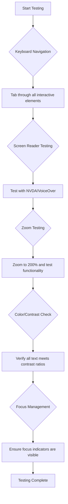
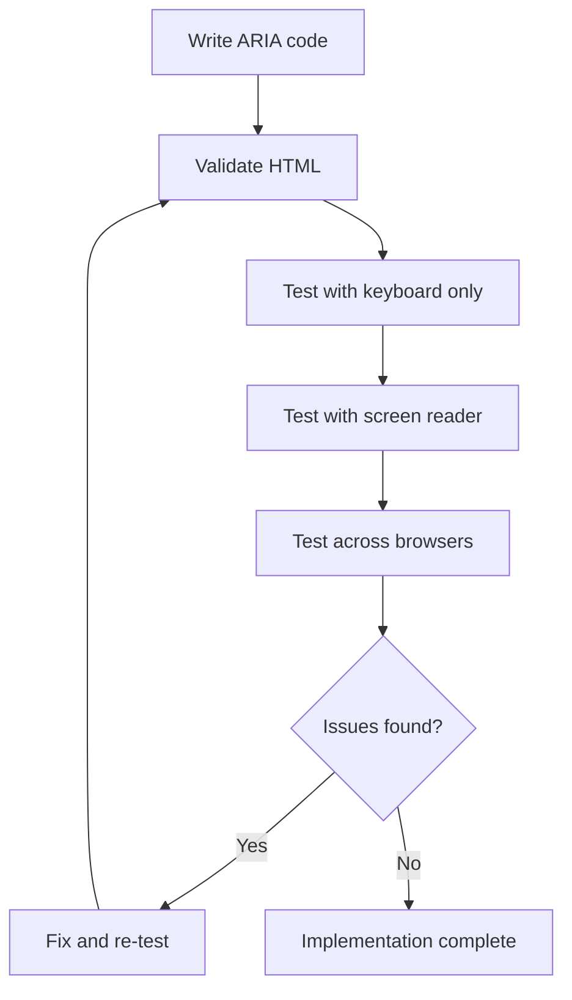

<!--
CO_OP_TRANSLATOR_METADATA:
{
  "original_hash": "90b19cde5b79b29e91babd3138cd8035",
  "translation_date": "2025-10-23T20:52:29+00:00",
  "source_file": "1-getting-started-lessons/3-accessibility/README.md",
  "language_code": "th"
}
-->
# การสร้างเว็บไซต์ที่เข้าถึงได้


> ภาพสเก็ตโน้ตโดย [Tomomi Imura](https://twitter.com/girlie_mac)

## แบบทดสอบก่อนเรียน
[แบบทดสอบก่อนเรียน](https://ff-quizzes.netlify.app/web/)

> พลังของเว็บอยู่ที่ความเป็นสากล การเข้าถึงโดยทุกคนไม่ว่าจะมีความพิการหรือไม่ถือเป็นสิ่งสำคัญ
>
> \- เซอร์ทิโมธี เบอร์เนิร์ส-ลี ผู้อำนวยการ W3C และผู้คิดค้น World Wide Web

นี่คือสิ่งที่อาจทำให้คุณประหลาดใจ: เมื่อคุณสร้างเว็บไซต์ที่เข้าถึงได้ คุณไม่ได้ช่วยแค่คนที่มีความพิการเท่านั้น แต่คุณกำลังทำให้เว็บดีขึ้นสำหรับทุกคน!

เคยสังเกตเห็นทางลาดที่มุมถนนไหม? เดิมทีออกแบบมาเพื่อรถเข็น แต่ตอนนี้มันช่วยคนที่ใช้รถเข็นเด็ก คนส่งของที่ใช้รถเข็นเดินทาง คนที่ลากกระเป๋าเดินทาง และนักปั่นจักรยานด้วย นั่นคือวิธีการทำงานของการออกแบบเว็บที่เข้าถึงได้—โซลูชันที่ช่วยกลุ่มหนึ่งมักจะช่วยทุกคนได้ในที่สุด เจ๋งใช่ไหม?

ในบทเรียนนี้ เราจะสำรวจวิธีการสร้างเว็บไซต์ที่ใช้งานได้จริงสำหรับทุกคน ไม่ว่าพวกเขาจะท่องเว็บอย่างไร คุณจะได้เรียนรู้เทคนิคที่ใช้งานได้จริงซึ่งมีอยู่ในมาตรฐานเว็บอยู่แล้ว ทดลองใช้เครื่องมือทดสอบ และเห็นว่าการเข้าถึงช่วยให้เว็บไซต์ของคุณใช้งานได้ง่ายขึ้นสำหรับผู้ใช้ทุกคนอย่างไร

เมื่อจบบทเรียนนี้ คุณจะมีความมั่นใจในการทำให้การเข้าถึงเป็นส่วนหนึ่งของกระบวนการพัฒนาเว็บไซต์ของคุณ พร้อมที่จะสำรวจว่าการออกแบบที่ใส่ใจสามารถเปิดโลกเว็บให้กับผู้ใช้หลายพันล้านคนได้อย่างไร? มาเริ่มกันเลย!

> คุณสามารถเรียนบทเรียนนี้ได้ที่ [Microsoft Learn](https://docs.microsoft.com/learn/modules/web-development-101/accessibility/?WT.mc_id=academic-77807-sagibbon)!

## ทำความเข้าใจเทคโนโลยีช่วยเหลือ

ก่อนที่เราจะเริ่มเขียนโค้ด ลองใช้เวลาสักครู่เพื่อทำความเข้าใจว่าคนที่มีความสามารถแตกต่างกันใช้งานเว็บอย่างไร นี่ไม่ใช่แค่ทฤษฎี—การเข้าใจรูปแบบการนำทางในโลกจริงจะทำให้คุณเป็นนักพัฒนาที่ดีขึ้นมาก!

เทคโนโลยีช่วยเหลือเป็นเครื่องมือที่น่าทึ่งที่ช่วยให้คนที่มีความพิการสามารถโต้ตอบกับเว็บไซต์ได้ในวิธีที่อาจทำให้คุณประหลาดใจ เมื่อคุณเข้าใจวิธีการทำงานของเทคโนโลยีเหล่านี้ การสร้างประสบการณ์เว็บที่เข้าถึงได้จะกลายเป็นเรื่องที่ง่ายขึ้นมาก มันเหมือนกับการเรียนรู้ที่จะมองโค้ดของคุณผ่านสายตาของคนอื่น

### โปรแกรมอ่านหน้าจอ

[โปรแกรมอ่านหน้าจอ](https://en.wikipedia.org/wiki/Screen_reader) เป็นเทคโนโลยีที่ซับซ้อนที่แปลงข้อความดิจิทัลเป็นเสียงหรืออักษรเบรลล์ แม้ว่าจะถูกใช้โดยคนที่มีความบกพร่องทางสายตาเป็นหลัก แต่ก็มีประโยชน์มากสำหรับผู้ใช้ที่มีความบกพร่องด้านการเรียนรู้ เช่น ดิสเล็กเซีย

ฉันชอบคิดว่าโปรแกรมอ่านหน้าจอเหมือนกับมีผู้บรรยายที่ฉลาดมากอ่านหนังสือให้คุณฟัง มันจะอ่านเนื้อหาออกเสียงตามลำดับที่สมเหตุสมผล แจ้งเตือนองค์ประกอบที่สามารถโต้ตอบได้ เช่น "ปุ่ม" หรือ "ลิงก์" และให้ทางลัดแป้นพิมพ์สำหรับการนำทางในหน้า แต่สิ่งสำคัญคือ—โปรแกรมอ่านหน้าจอจะทำงานได้ดีถ้าเราออกแบบเว็บไซต์ด้วยโครงสร้างที่เหมาะสมและเนื้อหาที่มีความหมาย นั่นคือหน้าที่ของคุณในฐานะนักพัฒนา!

**โปรแกรมอ่านหน้าจอยอดนิยมในแต่ละแพลตฟอร์ม:**
- **Windows**: [NVDA](https://www.nvaccess.org/about-nvda/) (ฟรีและได้รับความนิยมมากที่สุด), [JAWS](https://webaim.org/articles/jaws/), [Narrator](https://support.microsoft.com/windows/complete-guide-to-narrator-e4397a0d-ef4f-b386-d8ae-c172f109bdb1/?WT.mc_id=academic-77807-sagibbon) (ในตัว)
- **macOS/iOS**: [VoiceOver](https://support.apple.com/guide/voiceover/welcome/10) (ในตัวและมีความสามารถสูง)
- **Android**: [TalkBack](https://support.google.com/accessibility/android/answer/6283677) (ในตัว)
- **Linux**: [Orca](https://wiki.gnome.org/Projects/Orca) (ฟรีและโอเพ่นซอร์ส)

**วิธีที่โปรแกรมอ่านหน้าจอนำทางเนื้อหาเว็บ:**

โปรแกรมอ่านหน้าจอมีวิธีการนำทางหลายแบบที่ทำให้การท่องเว็บมีประสิทธิภาพสำหรับผู้ใช้ที่มีประสบการณ์:
- **การอ่านตามลำดับ**: อ่านเนื้อหาจากบนลงล่าง เหมือนกับการอ่านหนังสือ
- **การนำทางตามจุดสำคัญ**: ข้ามไปยังส่วนต่าง ๆ ของหน้า (ส่วนหัว, การนำทาง, ส่วนหลัก, ส่วนท้าย)
- **การนำทางตามหัวข้อ**: ข้ามไปยังหัวข้อเพื่อทำความเข้าใจโครงสร้างของหน้า
- **รายการลิงก์**: สร้างรายการลิงก์ทั้งหมดเพื่อการเข้าถึงที่รวดเร็ว
- **การควบคุมฟอร์ม**: นำทางโดยตรงระหว่างช่องป้อนข้อมูลและปุ่ม

> 💡 **นี่คือสิ่งที่ทำให้ฉันประหลาดใจ**: 68% ของผู้ใช้โปรแกรมอ่านหน้าจอนำทางโดยใช้หัวข้อเป็นหลัก ([การสำรวจของ WebAIM](https://webaim.org/projects/screenreadersurvey9/#finding)) ซึ่งหมายความว่าโครงสร้างหัวข้อของคุณเหมือนกับแผนที่สำหรับผู้ใช้—เมื่อคุณทำได้ถูกต้อง คุณกำลังช่วยให้ผู้คนค้นหาเนื้อหาของคุณได้เร็วขึ้น!

### สร้างกระบวนการทดสอบของคุณ

ข่าวดีคือ—การทดสอบการเข้าถึงที่มีประสิทธิภาพไม่จำเป็นต้องยุ่งยาก! คุณควรผสมผสานเครื่องมืออัตโนมัติ (ที่ยอดเยี่ยมในการจับปัญหาที่ชัดเจน) กับการทดสอบด้วยมือ นี่คือวิธีการที่เป็นระบบที่ฉันพบว่าจับปัญหาได้มากที่สุดโดยไม่เสียเวลาทั้งวัน:

**กระบวนการทดสอบด้วยมือที่จำเป็น:**



**รายการตรวจสอบการทดสอบทีละขั้นตอน:**
1. **การนำทางด้วยแป้นพิมพ์**: ใช้เฉพาะ Tab, Shift+Tab, Enter, Space และปุ่มลูกศร
2. **การทดสอบโปรแกรมอ่านหน้าจอ**: เปิดใช้งาน NVDA, VoiceOver หรือ Narrator และนำทางโดยหลับตา
3. **การทดสอบการซูม**: ทดสอบที่ระดับการซูม 200% และ 400%
4. **การตรวจสอบความคมชัดของสี**: ตรวจสอบข้อความและส่วนประกอบ UI ทั้งหมด
5. **การทดสอบตัวบ่งชี้โฟกัส**: ตรวจสอบให้แน่ใจว่าองค์ประกอบที่สามารถโต้ตอบได้ทั้งหมดมีสถานะโฟกัสที่มองเห็นได้

✅ **เริ่มต้นด้วย Lighthouse**: เปิด DevTools ในเบราว์เซอร์ของคุณ เรียกใช้การตรวจสอบการเข้าถึงด้วย Lighthouse จากนั้นใช้ผลลัพธ์เพื่อมุ่งเน้นพื้นที่การทดสอบด้วยมือ

### เครื่องมือซูมและขยายภาพ

คุณเคยใช้การซูมบนโทรศัพท์เมื่อข้อความเล็กเกินไป หรือเพ่งมองหน้าจอแล็ปท็อปในแสงแดดจ้าไหม? ผู้ใช้หลายคนพึ่งพาเครื่องมือขยายภาพเพื่อทำให้เนื้อหาอ่านได้ทุกวัน ซึ่งรวมถึงคนที่มีสายตาเลือนราง ผู้สูงอายุ และใครก็ตามที่เคยพยายามอ่านเว็บไซต์กลางแจ้ง

เทคโนโลยีการซูมสมัยใหม่ได้พัฒนาไปไกลกว่าการทำให้สิ่งต่าง ๆ ใหญ่ขึ้น การเข้าใจวิธีการทำงานของเครื่องมือเหล่านี้จะช่วยให้คุณสร้างการออกแบบที่ตอบสนองและยังคงใช้งานได้และดูดีในทุกระดับการขยายภาพ

**ความสามารถในการซูมของเบราว์เซอร์สมัยใหม่:**
- **การซูมหน้า**: ขยายเนื้อหาทั้งหมดตามสัดส่วน (ข้อความ, รูปภาพ, เลย์เอาต์) - วิธีนี้เป็นวิธีที่แนะนำ
- **การซูมเฉพาะข้อความ**: เพิ่มขนาดตัวอักษรในขณะที่รักษาเลย์เอาต์เดิม
- **การซูมด้วยการบีบ**: การสนับสนุนท่าทางบนมือถือสำหรับการขยายภาพชั่วคราว
- **การสนับสนุนเบราว์เซอร์**: เบราว์เซอร์สมัยใหม่ทั้งหมดรองรับการซูมได้ถึง 500% โดยไม่ทำให้ฟังก์ชันการทำงานเสียหาย

**ซอฟต์แวร์ขยายภาพเฉพาะทาง:**
- **Windows**: [Magnifier](https://support.microsoft.com/windows/use-magnifier-to-make-things-on-the-screen-easier-to-see-414948ba-8b1c-d3bd-8615-0e5e32204198) (ในตัว), [ZoomText](https://www.freedomscientific.com/training/zoomtext/getting-started/)
- **macOS/iOS**: [Zoom](https://www.apple.com/accessibility/mac/vision/) (ในตัวพร้อมฟีเจอร์ขั้นสูง)

> ⚠️ **ข้อควรพิจารณาในการออกแบบ**: WCAG กำหนดว่าเนื้อหาต้องยังคงใช้งานได้เมื่อซูมถึง 200% ในระดับนี้ การเลื่อนแนวนอนควรมีน้อยที่สุด และองค์ประกอบที่สามารถโต้ตอบได้ทั้งหมดควรยังคงเข้าถึงได้

✅ **ทดสอบการออกแบบที่ตอบสนองของคุณ**: ซูมเบราว์เซอร์ของคุณไปที่ 200% และ 400% เลย์เอาต์ของคุณปรับตัวได้ดีหรือไม่? คุณยังสามารถเข้าถึงฟังก์ชันทั้งหมดได้โดยไม่ต้องเลื่อนมากเกินไปหรือไม่?

## เครื่องมือทดสอบการเข้าถึงสมัยใหม่

ตอนนี้คุณเข้าใจแล้วว่าผู้คนใช้งานเว็บด้วยเทคโนโลยีช่วยเหลืออย่างไร ลองสำรวจเครื่องมือที่ช่วยคุณสร้างและทดสอบเว็บไซต์ที่เข้าถึงได้

ลองคิดแบบนี้: เครื่องมืออัตโนมัติยอดเยี่ยมในการจับปัญหาที่ชัดเจน (เช่น ข้อความ alt ที่หายไป) ในขณะที่การทดสอบด้วยมือช่วยให้คุณมั่นใจว่าเว็บไซต์ของคุณใช้งานได้ดีในโลกจริง เมื่อรวมกันแล้วจะช่วยให้คุณมั่นใจว่าเว็บไซต์ของคุณใช้งานได้สำหรับทุกคน

### การทดสอบความคมชัดของสี

ข่าวดีคือ: ความคมชัดของสีเป็นหนึ่งในปัญหาการเข้าถึงที่พบบ่อยที่สุด แต่ก็เป็นหนึ่งในปัญหาที่แก้ไขได้ง่ายที่สุด ความคมชัดที่ดีเป็นประโยชน์ต่อทุกคน—ตั้งแต่ผู้ใช้ที่มีความบกพร่องทางสายตาไปจนถึงคนที่พยายามอ่านโทรศัพท์ของพวกเขาที่ชายหาด

**ข้อกำหนดความคมชัดของ WCAG:**

| ประเภทข้อความ | WCAG AA (ขั้นต่ำ) | WCAG AAA (ขั้นสูง) |
|-----------------|-------------------|---------------------|
| **ข้อความปกติ** (ต่ำกว่า 18pt) | อัตราส่วนความคมชัด 4.5:1 | อัตราส่วนความคมชัด 7:1 |
| **ข้อความขนาดใหญ่** (18pt+ หรือ 14pt+ ตัวหนา) | อัตราส่วนความคมชัด 3:1 | อัตราส่วนความคมชัด 4.5:1 |
| **ส่วนประกอบ UI** (ปุ่ม, ขอบฟอร์ม) | อัตราส่วนความคมชัด 3:1 | อัตราส่วนความคมชัด 3:1 |

**เครื่องมือทดสอบที่จำเป็น:**
- [Colour Contrast Analyser](https://www.tpgi.com/color-contrast-checker/) - แอปเดสก์ท็อปพร้อมตัวเลือกสี
- [WebAIM Contrast Checker](https://webaim.org/resources/contrastchecker/) - เว็บแอปพร้อมผลตอบกลับทันที
- [Stark](https://www.getstark.co/) - ปลั๊กอินเครื่องมือออกแบบสำหรับ Figma, Sketch, Adobe XD
- [Accessible Colors](https://accessible-colors.com/) - ค้นหาพาเลตสีที่เข้าถึงได้

✅ **สร้างพาเลตสีที่ดีกว่า**: เริ่มต้นด้วยสีแบรนด์ของคุณและใช้เครื่องมือตรวจสอบความคมชัดเพื่อสร้างรูปแบบที่เข้าถึงได้ บันทึกสิ่งเหล่านี้เป็นโทเค็นสีที่เข้าถึงได้ในระบบการออกแบบของคุณ

### การตรวจสอบการเข้าถึงอย่างครอบคลุม

การทดสอบการเข้าถึงที่มีประสิทธิภาพที่สุดคือการผสมผสานวิธีการหลายแบบ ไม่มีเครื่องมือเดียวที่จับทุกอย่างได้ ดังนั้นการสร้างกิจวัตรการทดสอบด้วยวิธีการต่าง ๆ จะช่วยให้ครอบคลุมอย่างทั่วถึง

**การทดสอบในเบราว์เซอร์ (ในตัว DevTools):**
- **Chrome/Edge**: การตรวจสอบการเข้าถึงด้วย Lighthouse + แผงการเข้าถึง
- **Firefox**: Accessibility Inspector พร้อมมุมมองต้นไม้ที่ละเอียด
- **Safari**: แท็บการตรวจสอบใน Web Inspector พร้อมการจำลอง VoiceOver

**ส่วนขยายการทดสอบระดับมืออาชีพ:**
- [axe DevTools](https://www.deque.com/axe/devtools/) - การทดสอบอัตโนมัติที่เป็นมาตรฐานอุตสาหกรรม
- [WAVE](https://wave.webaim.org/extension/) - ข้อเสนอแนะภาพพร้อมการเน้นข้อผิดพลาด
- [Accessibility Insights](https://accessibilityinsights.io/) - ชุดการทดสอบที่ครอบคลุมของ Microsoft

**การรวมคำสั่งและ CI/CD:**
- [axe-core](https://github.com/dequelabs/axe-core) - ไลบรารี JavaScript สำหรับการทดสอบอัตโนมัติ
- [Pa11y](https://pa11y.org/) - เครื่องมือทดสอบการเข้าถึงแบบคำสั่ง
- [Lighthouse CI](https://github.com/GoogleChrome/lighthouse-ci) - การให้คะแนนการเข้าถึงอัตโนมัติ

> 🎯 **เป้าหมายการทดสอบ**: ตั้งเป้าคะแนนการเข้าถึง Lighthouse ที่ 95+ เป็นพื้นฐานของคุณ จำไว้ว่า เครื่องมืออัตโนมัติจับปัญหาการเข้าถึงได้เพียง 30-40%—การทดสอบด้วยมือยังคงเป็นสิ่งสำคัญ!

## สร้างการเข้าถึงตั้งแต่เริ่มต้น

กุญแจสู่ความสำเร็จในการเข้าถึงคือการสร้างมันไว้ในพื้นฐานตั้งแต่วันแรก ฉันรู้ว่ามันน่าดึงดูดที่จะคิดว่า "ฉันจะเพิ่มการเข้าถึงทีหลัง" แต่ก็เหมือนกับการพยายามเพิ่มทางลาดให้กับบ้านหลังจากที่สร้างเสร็จแล้ว เป็นไปได้? ใช่ ง่าย? ไม่จริง

ลองคิดว่าการเข้าถึงเหมือนกับการวางแผนบ้าน—มันง่ายกว่ามากที่จะรวมการเข้าถึงสำหรับรถเข็นในแผนสถาปัตยกรรมเริ่มต้นของคุณมากกว่าการปรับปรุงทุกอย่างทีหลัง

### หลักการ POUR: พื้นฐานการเข้าถึงของคุณ

Web Content Accessibility Guidelines (WCAG) สร้างขึ้นจากหลักการพื้นฐานสี่ข้อที่เรียกว่า POUR ไม่ต้องกังวล—นี่ไม่ใช่แนวคิดทางวิชาการที่น่าเบื่อ! แต่เป็นแนวทางปฏิบัติที่ช่วยให้เนื้อหาทำงานได้สำหรับทุกคน

เมื่อคุณเข้าใจหลักการ POUR การตัดสินใจเกี่ยวกับการเข้าถึงจะกลายเป็นเรื่องที่ง่ายขึ้นมาก มันเหมือนกับมีรายการตรวจสอบในใจที่ช่วยนำทางการออกแบบของคุณ ลองมาดูกัน:

**🔍 Perceivable**: ข้อมูลต้องสามารถนำเสนอในรูปแบบที่ผู้ใช้สามารถรับรู้ได้ผ่านประสาทสัมผัสที่มีอยู่

- ให้ข้อความทางเลือกสำหรับเนื้อหาที่ไม่ใช่ข้อความ (รูปภาพ, วิดีโอ, เสียง)
- ตรวจสอบให้แน่ใจว่ามีความคมชัดของสีเพียงพอสำหรับข้อความและส่วนประกอบ UI ทั้งหมด
- เสนอคำบรรยายและการถอดเสียงสำหรับเนื้อหามัลติมีเดีย
- ออกแบบเนื้อหาที่ยังคงใช้งานได้เมื่อปรับขนาดถึง 200%
- ใช้ลักษณะทางประสาทสัมผัสหลายแบบ (ไม่ใช่แค่
สีเป็นเครื่องมือที่ทรงพลังในการสื่อสาร แต่ไม่ควรใช้เป็นวิธีเดียวในการถ่ายทอดข้อมูลสำคัญ การออกแบบที่ไม่พึ่งพาสีเพียงอย่างเดียวช่วยสร้างประสบการณ์ที่ครอบคลุมและเหมาะสมในสถานการณ์ต่างๆ

**ออกแบบสำหรับความแตกต่างในการมองเห็นสี:**

ประมาณ 8% ของผู้ชายและ 0.5% ของผู้หญิงมีความแตกต่างในการมองเห็นสี (มักเรียกว่า "ตาบอดสี") ประเภทที่พบมากที่สุดคือ:
- **Deuteranopia**: มีปัญหาในการแยกแยะสีแดงและสีเขียว
- **Protanopia**: สีแดงดูมืดลง
- **Tritanopia**: มีปัญหาในการแยกแยะสีน้ำเงินและสีเหลือง (พบได้น้อย)

**กลยุทธ์การใช้สีที่ครอบคลุม:**

```css
/* ❌ Bad: Using only color to indicate status */
.error { color: red; }
.success { color: green; }

/* ✅ Good: Color plus icons and context */
.error {
  color: #d32f2f;
  border-left: 4px solid #d32f2f;
}
.error::before {
  content: "⚠️";
  margin-right: 8px;
}

.success {
  color: #2e7d32;
  border-left: 4px solid #2e7d32;
}
.success::before {
  content: "✅";
  margin-right: 8px;
}
```

**เกินกว่าข้อกำหนดพื้นฐานของความคมชัด:**
- ทดสอบการเลือกสีของคุณด้วยโปรแกรมจำลองตาบอดสี
- ใช้ลวดลาย พื้นผิว หรือรูปร่างควบคู่กับการใช้สี
- ตรวจสอบให้แน่ใจว่าสถานะการโต้ตอบยังคงสามารถแยกแยะได้โดยไม่ต้องใช้สี
- พิจารณาว่าการออกแบบของคุณดูเป็นอย่างไรในโหมดความคมชัดสูง

✅ **ทดสอบการเข้าถึงสีของคุณ**: ใช้เครื่องมืออย่าง [Coblis](https://www.color-blindness.com/coblis-color-blindness-simulator/) เพื่อดูว่าเว็บไซต์ของคุณปรากฏอย่างไรสำหรับผู้ใช้ที่มีความแตกต่างในการมองเห็นสี

### ตัวชี้ตำแหน่งโฟกัสและการออกแบบการโต้ตอบ

ตัวชี้ตำแหน่งโฟกัสเปรียบเสมือนเคอร์เซอร์ในโลกดิจิทัล—มันแสดงให้ผู้ใช้คีย์บอร์ดเห็นว่าพวกเขาอยู่ที่ไหนในหน้าเว็บ ตัวชี้ตำแหน่งโฟกัสที่ออกแบบมาอย่างดีช่วยเพิ่มประสบการณ์ให้กับทุกคนโดยทำให้การโต้ตอบชัดเจนและคาดเดาได้

**แนวปฏิบัติที่ดีที่สุดสำหรับตัวชี้ตำแหน่งโฟกัสในยุคปัจจุบัน:**

```css
/* Enhanced focus styles that work across browsers */
button:focus-visible {
  outline: 2px solid #0066cc;
  outline-offset: 2px;
  box-shadow: 0 0 0 4px rgba(0, 102, 204, 0.25);
}

/* Remove focus outline for mouse users, preserve for keyboard users */
button:focus:not(:focus-visible) {
  outline: none;
}

/* Focus-within for complex components */
.card:focus-within {
  box-shadow: 0 0 0 3px rgba(74, 144, 164, 0.5);
  border-color: #4A90A4;
}

/* Ensure focus indicators meet contrast requirements */
.custom-focus:focus-visible {
  outline: 3px solid #ffffff;
  outline-offset: 2px;
  box-shadow: 0 0 0 6px #000000;
}
```

**ข้อกำหนดของตัวชี้ตำแหน่งโฟกัส:**
- **การมองเห็น**: ต้องมีอัตราส่วนความคมชัดอย่างน้อย 3:1 กับองค์ประกอบโดยรอบ
- **ความกว้าง**: หนาอย่างน้อย 2px รอบองค์ประกอบทั้งหมด
- **ความคงอยู่**: ควรมองเห็นได้จนกว่าการโฟกัสจะย้ายไปที่อื่น
- **ความแตกต่าง**: ต้องแตกต่างจากสถานะ UI อื่นๆ อย่างชัดเจน

> 💡 **เคล็ดลับการออกแบบ**: ตัวชี้ตำแหน่งโฟกัสที่ดีมักใช้การผสมผสานระหว่างเส้นขอบ เงากล่อง และการเปลี่ยนสีเพื่อให้มองเห็นได้ชัดเจนในพื้นหลังและบริบทต่างๆ

✅ **ตรวจสอบตัวชี้ตำแหน่งโฟกัส**: ใช้ปุ่ม Tab เพื่อเลื่อนผ่านเว็บไซต์ของคุณและสังเกตว่าองค์ประกอบใดมีตัวชี้ตำแหน่งโฟกัสที่ชัดเจน มีองค์ประกอบใดที่มองเห็นได้ยากหรือขาดหายไปหรือไม่?

### HTML เชิงความหมาย: รากฐานของการเข้าถึง

HTML เชิงความหมายเปรียบเสมือนการให้ระบบ GPS แก่เทคโนโลยีช่วยเหลือสำหรับเว็บไซต์ของคุณ เมื่อคุณใช้องค์ประกอบ HTML ที่เหมาะสมกับวัตถุประสงค์ คุณกำลังให้เครื่องมือช่วยเหลือ เช่น โปรแกรมอ่านหน้าจอและคีย์บอร์ด มีแผนที่ที่ละเอียดเพื่อช่วยให้ผู้ใช้สามารถนำทางได้อย่างมีประสิทธิภาพ

นี่คือการเปรียบเทียบที่ทำให้ฉันเข้าใจได้ดี: HTML เชิงความหมายเปรียบเสมือนห้องสมุดที่จัดระเบียบอย่างดี มีหมวดหมู่ที่ชัดเจนและป้ายบอกทางที่เป็นประโยชน์ เทียบกับโกดังที่หนังสือกระจัดกระจายแบบสุ่ม ทั้งสองที่มีหนังสือเหมือนกัน แต่คุณอยากจะไปหาหนังสือที่ไหนมากกว่ากัน? ใช่เลย!

**องค์ประกอบพื้นฐานของโครงสร้างหน้าเว็บที่เข้าถึงได้:**

```html
<!-- Landmark elements provide page navigation structure -->
<header>
  <h1>Your Site Name</h1>
  <nav aria-label="Main navigation">
    <ul>
      <li><a href="/home">Home</a></li>
      <li><a href="/about">About</a></li>
      <li><a href="/services">Services</a></li>
    </ul>
  </nav>
</header>

<main>
  <article>
    <header>
      <h1>Article Title</h1>
      <p>Published on <time datetime="2024-10-14">October 14, 2024</time></p>
    </header>
    
    <section>
      <h2>First Section</h2>
      <p>Content that relates to this section...</p>
    </section>
    
    <section>
      <h2>Second Section</h2>
      <p>More related content...</p>
    </section>
  </article>
  
  <aside>
    <h2>Related Links</h2>
    <nav aria-label="Related articles">
      <ul>
        <li><a href="/related-1">First related article</a></li>
        <li><a href="/related-2">Second related article</a></li>
      </ul>
    </nav>
  </aside>
</main>

<footer>
  <p>&copy; 2024 Your Site Name. All rights reserved.</p>
  <nav aria-label="Footer links">
    <ul>
      <li><a href="/privacy">Privacy Policy</a></li>
      <li><a href="/contact">Contact Us</a></li>
    </ul>
  </nav>
</footer>
```

**เหตุผลที่ HTML เชิงความหมายเปลี่ยนแปลงการเข้าถึง:**

| องค์ประกอบเชิงความหมาย | วัตถุประสงค์ | ประโยชน์สำหรับโปรแกรมอ่านหน้าจอ |
|------------------|---------|----------------------|
| `<header>` | ส่วนหัวของหน้าเว็บหรือส่วน | "Banner landmark" - นำทางไปยังด้านบนได้อย่างรวดเร็ว |
| `<nav>` | ลิงก์นำทาง | "Navigation landmark" - รายการส่วนการนำทาง |
| `<main>` | เนื้อหาหลักของหน้า | "Main landmark" - ข้ามไปยังเนื้อหาโดยตรง |
| `<article>` | เนื้อหาที่แยกออกมา | ประกาศขอบเขตของบทความ |
| `<section>` | กลุ่มเนื้อหาที่มีธีม | ให้โครงสร้างเนื้อหา |
| `<aside>` | เนื้อหาด้านข้างที่เกี่ยวข้อง | "Complementary landmark" |
| `<footer>` | ส่วนท้ายของหน้าเว็บหรือส่วน | "Contentinfo landmark" |

**พลังพิเศษของโปรแกรมอ่านหน้าจอด้วย HTML เชิงความหมาย:**
- **การนำทางด้วยจุดสังเกต**: ข้ามระหว่างส่วนสำคัญของหน้าเว็บได้ทันที
- **โครงร่างหัวข้อ**: สร้างสารบัญจากโครงสร้างหัวข้อของคุณ
- **รายการองค์ประกอบ**: สร้างรายการลิงก์ ปุ่ม หรือการควบคุมฟอร์มทั้งหมด
- **การรับรู้บริบท**: เข้าใจความสัมพันธ์ระหว่างส่วนเนื้อหา

> 🎯 **การทดสอบอย่างรวดเร็ว**: ลองนำทางเว็บไซต์ของคุณด้วยโปรแกรมอ่านหน้าจอโดยใช้ทางลัดจุดสังเกต (D สำหรับจุดสังเกต, H สำหรับหัวข้อ, K สำหรับลิงก์ใน NVDA/JAWS) การนำทางมีความสมเหตุสมผลหรือไม่?

✅ **ตรวจสอบโครงสร้างเชิงความหมายของคุณ**: ใช้แผงการเข้าถึงใน DevTools ของเบราว์เซอร์ของคุณเพื่อดูโครงสร้างการเข้าถึงและตรวจสอบว่าโครงร่าง HTML ของคุณมีความสมเหตุสมผล

### ลำดับชั้นของหัวข้อ: สร้างโครงร่างเนื้อหาที่มีเหตุผล

หัวข้อมีความสำคัญอย่างยิ่งสำหรับเนื้อหาที่เข้าถึงได้—มันเปรียบเสมือนกระดูกสันหลังที่ช่วยจัดระเบียบทุกอย่าง ผู้ใช้โปรแกรมอ่านหน้าจอพึ่งพาหัวข้ออย่างมากในการทำความเข้าใจและนำทางเนื้อหาของคุณ คิดว่ามันเหมือนกับการให้สารบัญสำหรับหน้าเว็บของคุณ

**กฎทองสำหรับหัวข้อ:**
อย่าข้ามระดับหัวข้อ ควรดำเนินการอย่างมีเหตุผลจาก `<h1>` ไปยัง `<h2>` ไปยัง `<h3>` และต่อไป จำการทำโครงร่างในโรงเรียนได้ไหม? หลักการเดียวกันเลย—คุณจะไม่กระโดดจาก "I. ประเด็นหลัก" ไปยัง "C. ประเด็นย่อยย่อย" โดยไม่มี "A. ประเด็นย่อย" อยู่ระหว่างใช่ไหม?

**ตัวอย่างโครงสร้างหัวข้อที่สมบูรณ์แบบ:**

```html
<!-- ✅ Excellent: Logical, hierarchical progression -->
<main>
  <h1>Complete Guide to Web Accessibility</h1>
  
  <section>
    <h2>Understanding Screen Readers</h2>
    <p>Introduction to screen reader technology...</p>
    
    <h3>Popular Screen Reader Software</h3>
    <p>NVDA, JAWS, and VoiceOver comparison...</p>
    
    <h3>Testing with Screen Readers</h3>
    <p>Step-by-step testing instructions...</p>
  </section>
  
  <section>
    <h2>Color and Contrast Guidelines</h2>
    <p>Designing with sufficient contrast...</p>
    
    <h3>WCAG Contrast Requirements</h3>
    <p>Understanding the different contrast levels...</p>
    
    <h3>Testing Tools and Techniques</h3>
    <p>Tools for verifying contrast ratios...</p>
  </section>
</main>
```

```html
<!-- ❌ Problematic: Skipping levels, inconsistent structure -->
<h1>Page Title</h1>
<h3>Subsection</h3> <!-- Skipped h2 -->
<h2>This should come before h3</h2>
<h1>Another main heading?</h1> <!-- Multiple h1s -->
```

**แนวปฏิบัติที่ดีที่สุดสำหรับหัวข้อ:**
- **หนึ่ง `<h1>` ต่อหน้า**: โดยทั่วไปคือชื่อหน้าหรือหัวข้อเนื้อหาหลัก
- **ความก้าวหน้าอย่างมีเหตุผล**: อย่าข้ามระดับ (h1 → h2 → h3, ไม่ใช่ h1 → h3)
- **เนื้อหาที่อธิบายได้**: ทำให้หัวข้อมีความหมายเมื่ออ่านแยกจากบริบท
- **การจัดรูปแบบด้วย CSS**: ใช้ CSS สำหรับลักษณะการแสดงผล ระดับ HTML สำหรับโครงสร้าง

**สถิติการนำทางด้วยโปรแกรมอ่านหน้าจอ:**
- 68% ของผู้ใช้โปรแกรมอ่านหน้าจอนำทางด้วยหัวข้อ ([WebAIM Survey](https://webaim.org/projects/screenreadersurvey9/#finding))
- ผู้ใช้คาดหวังว่าจะพบโครงร่างหัวข้อที่มีเหตุผล
- หัวข้อให้วิธีที่เร็วที่สุดในการทำความเข้าใจโครงสร้างหน้าเว็บ

> 💡 **เคล็ดลับมือโปร**: ใช้ส่วนขยายเบราว์เซอร์อย่าง "HeadingsMap" เพื่อดูภาพรวมโครงสร้างหัวข้อของคุณ ควรอ่านเหมือนสารบัญที่จัดระเบียบอย่างดี

✅ **ทดสอบโครงสร้างหัวข้อของคุณ**: ใช้การนำทางหัวข้อของโปรแกรมอ่านหน้าจอ (ปุ่ม H ใน NVDA) เพื่อข้ามผ่านหัวข้อของคุณ การก้าวหน้าบอกเล่าเรื่องราวของเนื้อหาของคุณอย่างมีเหตุผลหรือไม่?

### เทคนิคการเข้าถึงภาพขั้นสูง

นอกเหนือจากพื้นฐานของความคมชัดและสี ยังมีเทคนิคที่ซับซ้อนที่ช่วยสร้างประสบการณ์การมองเห็นที่ครอบคลุมอย่างแท้จริง วิธีการเหล่านี้ช่วยให้เนื้อหาของคุณทำงานได้ในสภาพการมองเห็นที่แตกต่างกันและเทคโนโลยีช่วยเหลือ

**กลยุทธ์การสื่อสารด้วยภาพที่สำคัญ:**

- **การตอบสนองหลายรูปแบบ**: รวมสัญญาณภาพ ข้อความ และบางครั้งเสียง
- **การเปิดเผยข้อมูลแบบค่อยเป็นค่อยไป**: นำเสนอข้อมูลในส่วนที่ย่อยง่าย
- **รูปแบบการโต้ตอบที่สม่ำเสมอ**: ใช้รูปแบบ UI ที่คุ้นเคย
- **การปรับขนาดตัวอักษร**: ปรับขนาดข้อความให้เหมาะสมกับอุปกรณ์ต่างๆ
- **สถานะการโหลดและข้อผิดพลาด**: ให้ข้อมูลตอบกลับที่ชัดเจนสำหรับการกระทำของผู้ใช้ทั้งหมด

**เครื่องมือ CSS สำหรับการเข้าถึงที่ดีขึ้น:**

```css
/* Screen reader only text - visually hidden but accessible */
.sr-only {
  position: absolute;
  width: 1px;
  height: 1px;
  padding: 0;
  margin: -1px;
  overflow: hidden;
  clip: rect(0, 0, 0, 0);
  white-space: nowrap;
  border: 0;
}

/* Skip link for keyboard navigation */
.skip-link {
  position: absolute;
  top: -40px;
  left: 6px;
  background: #000000;
  color: #ffffff;
  padding: 8px 16px;
  text-decoration: none;
  border-radius: 4px;
  font-weight: bold;
  transition: top 0.3s ease;
  z-index: 1000;
}

.skip-link:focus {
  top: 6px;
}

/* Reduced motion respect */
@media (prefers-reduced-motion: reduce) {
  .skip-link {
    transition: none;
  }
  
  * {
    animation-duration: 0.01ms !important;
    animation-iteration-count: 1 !important;
    transition-duration: 0.01ms !important;
  }
}

/* High contrast mode support */
@media (prefers-contrast: high) {
  .button {
    border: 2px solid;
  }
}
```

> 🎯 **รูปแบบการเข้าถึง**: "ลิงก์ข้าม" เป็นสิ่งสำคัญสำหรับผู้ใช้คีย์บอร์ด ควรเป็นองค์ประกอบแรกที่สามารถโฟกัสได้ในหน้าเว็บของคุณและข้ามไปยังพื้นที่เนื้อหาหลักโดยตรง

✅ **เพิ่มลิงก์ข้ามการนำทาง**: เพิ่มลิงก์ข้ามไปยังหน้าเว็บของคุณและทดสอบโดยกดปุ่ม Tab ทันทีที่หน้าเว็บโหลด ลิงก์ควรปรากฏและช่วยให้คุณข้ามไปยังเนื้อหาหลักได้

## การสร้างข้อความลิงก์ที่มีความหมาย

ลิงก์เปรียบเสมือนทางหลวงของเว็บ แต่ข้อความลิงก์ที่เขียนไม่ดีเปรียบเสมือนป้ายถนนที่เขียนว่า "สถานที่" แทนที่จะเป็น "ดาวน์ทาวน์ชิคาโก" ซึ่งไม่ค่อยช่วยเท่าไหร่ใช่ไหม?

นี่คือสิ่งที่ทำให้ฉันประหลาดใจเมื่อได้เรียนรู้ครั้งแรก: โปรแกรมอ่านหน้าจอสามารถดึงลิงก์ทั้งหมดจากหน้าเว็บและแสดงเป็นรายการใหญ่รายการเดียว ลองนึกภาพว่ามีคนส่งไดเรกทอรีของลิงก์ทั้งหมดในหน้าเว็บของคุณให้คุณ แต่ละลิงก์มีความหมายในตัวเองหรือไม่? นั่นคือการทดสอบที่ข้อความลิงก์ของคุณต้องผ่าน!

### การเข้าใจรูปแบบการนำทางลิงก์

โปรแกรมอ่านหน้าจอมีฟีเจอร์การนำทางลิงก์ที่ทรงพลังซึ่งพึ่งพาข้อความลิงก์ที่เขียนดี:

**วิธีการนำทางลิงก์:**
- **การอ่านตามลำดับ**: ลิงก์จะถูกอ่านในบริบทเป็นส่วนหนึ่งของการไหลของเนื้อหา
- **การสร้างรายการลิงก์**: ลิงก์ทั้งหมดในหน้าเว็บถูกรวบรวมเป็นไดเรกทอรีที่ค้นหาได้
- **การนำทางอย่างรวดเร็ว**: ข้ามระหว่างลิงก์โดยใช้ทางลัดคีย์บอร์ด (ปุ่ม K ใน NVDA)
- **ฟังก์ชันการค้นหา**: ค้นหาลิงก์เฉพาะโดยพิมพ์ข้อความบางส่วน

**เหตุผลที่บริบทมีความสำคัญ:**
เมื่อผู้ใช้โปรแกรมอ่านหน้าจอสร้างรายการลิงก์ พวกเขาจะเห็นบางอย่างเช่นนี้:
- "ดาวน์โหลดรายงาน"
- "เรียนรู้เพิ่มเติม"
- "คลิกที่นี่"
- "นโยบายความเป็นส่วนตัว"
- "คลิกที่นี่"

มีเพียงสองลิงก์ที่ให้ข้อมูลที่เป็นประโยชน์เมื่ออ่านแยกจากบริบท!

> 📊 **ผลกระทบต่อผู้ใช้**: ผู้ใช้โปรแกรมอ่านหน้าจอสแกนรายการลิงก์เพื่อทำความเข้าใจเนื้อหาของหน้าเว็บอย่างรวดเร็ว ข้อความลิงก์ทั่วไปบังคับให้พวกเขากลับไปยังบริบทของลิงก์แต่ละลิงก์ ซึ่งทำให้การท่องเว็บช้าลงอย่างมาก

### ข้อผิดพลาดทั่วไปของข้อความลิงก์ที่ควรหลีกเลี่ยง

การเข้าใจสิ่งที่ไม่ทำงานช่วยให้คุณรับรู้และแก้ไขปัญหาการเข้าถึงในเนื้อหาที่มีอยู่

**❌ ข้อความลิงก์ทั่วไปที่ไม่มีบริบท:**

```html
<!-- Meaningless when read from a link list -->
<p>Our sustainability efforts are detailed in our recent report. 
   <a href="/sustainability-2024.pdf">Click here</a> to view it.</p>

<!-- Repeated generic text throughout the page -->
<div class="article-card">
  <h3>Web Accessibility Guide</h3>
  <p>Learn the fundamentals...</p>
  <a href="/accessibility-guide">Read more</a>
</div>
<div class="article-card">
  <h3>Color Contrast Tips</h3>
  <p>Improve your design...</p>
  <a href="/color-contrast">Read more</a>
</div>

<!-- URLs as link text (difficult for screen readers to announce) -->
<p>Visit https://www.w3.org/WAI/WCAG21/quickref/ for WCAG guidelines.</p>

<!-- Vague action words -->
<a href="/contact">Go</a> | <a href="/about">See</a> | <a href="/help">View</a>
```

**เหตุผลที่รูปแบบเหล่านี้ล้มเหลว:**
- **"คลิกที่นี่"** ไม่บอกผู้ใช้เกี่ยวกับปลายทาง
- **"อ่านเพิ่มเติม"** ที่ซ้ำหลายครั้งสร้างความสับสน
- **URL ดิบ** ยากสำหรับโปรแกรมอ่านหน้าจอในการออกเสียงอย่างชัดเจน
- **คำเดียว** เช่น "ไป" หรือ "ดู" ขาดบริบทที่อธิบายได้

### การเขียนข้อความลิงก์ที่ยอดเยี่ยม

ข้อความลิงก์ที่อธิบายได้ชัดเจนเป็นประโยชน์ต่อทุกคน—ผู้ใช้ที่มองเห็นสามารถสแกนลิงก์ได้อย่างรวดเร็ว และผู้ใช้โปรแกรมอ่านหน้าจอเข้าใจปลายทางได้ทันที

**✅ ตัวอย่างข้อความลิงก์ที่ชัดเจนและอธิบายได้:**

```html
<!-- Descriptive text that explains the destination -->
<p>Our comprehensive <a href="/sustainability-2024.pdf">2024 sustainability report (PDF, 2.1MB)</a> details our environmental initiatives.</p>

<!-- Specific, unique link text for each card -->
<div class="article-card">
  <h3>Web Accessibility Guide</h3>
  <p>Learn the fundamentals of inclusive design...</p>
  <a href="/accessibility-guide">Read our complete web accessibility guide</a>
</div>
<div class="article-card">
  <h3>Color Contrast Tips</h3>
  <p>Improve your design with better color choices...</p>
  <a href="/color-contrast">Explore color contrast best practices</a>
</div>

<!-- Meaningful text instead of raw URLs -->
<p>The <a href="https://www.w3.org/WAI/WCAG21/quickref/">WCAG 2.1 Quick Reference guide</a> provides comprehensive accessibility guidelines.</p>

<!-- Descriptive action links -->
<a href="/contact">Contact our support team</a> | 
<a href="/about">About our company</a> | 
<a href="/help">Get help with your account</a>
```

**แนวปฏิบัติที่ดีที่สุดสำหรับข้อความลิงก์:**
- **ระบุให้ชัดเจน**: "ดาวน์โหลดรายงานการเงินรายไตรมาส" เทียบกับ "ดาวน์โหลด"
- **รวมประเภทไฟล์และขนาด**: "(PDF, 1.2MB)" สำหรับไฟล์ที่ดาวน์โหลดได้
- **ระบุว่าลิงก์เปิดภายนอก**: "(เปิดในหน้าต่างใหม่)" เมื่อเหมาะสม
- **ใช้ภาษาที่กระตุ้นการกระทำ**: "ติดต่อเรา" เทียบกับ "หน้าติดต่อ"
- **ทำให้กระชับ**: ตั้งเป้าหมายที่ 2-8 คำเมื่อเป็นไปได้

### รูปแบบการเข้าถึงลิงก์ขั้นสูง

บางครั้งข้อจำกัดในการออกแบบภาพหรือข้อกำหนดทางเทคนิคต้องการวิธีแก้ปัญหาพิเศษ นี่คือเทคนิคขั้นสูงสำหรับสถานการณ์ที่ท้าทายทั่วไป:

**การใช้ ARIA เพื่อเพิ่มบริบท:**

```html
<!-- When button text must be short but needs more context -->
<a href="/report.pdf" 
   aria-label="Download 2024 annual financial report, PDF format, 2.3MB">
  Download Report
</a>

<!-- When the full context comes from surrounding content -->
<h3 id="sustainability-heading">Sustainability Initiative</h3>
<p>Our efforts to reduce environmental impact...</p>
<a href="/sustainability-details" 
   aria-labelledby="sustainability-heading"
   aria-describedby="sustainability-summary">
  Learn more
</a>
<p id="sustainability-summary">Detailed breakdown of our 2024 environmental goals and achievements</p>
```

**การระบุประเภทไฟล์และปลายทางภายนอก:**

```html
<!-- Method 1: Include information in visible link text -->
<a href="/annual-report.pdf">
  Download our 2024 annual report (PDF, 2.3MB)
</a>

<!-- Method 2: Use screen reader-only text for file details -->
<a href="/annual-report.pdf">
  Download our 2024 annual report
  <span class="sr-only">(PDF format, 2.3MB)</span>
</a>

<!-- Method 3: External link indication -->
<a href="https://example.com" 
   target="_blank" 
   aria-describedby="external-link-warning">
  Visit external resource
</a>
<span id="external-link-warning" class="sr-only">
  (opens in new window)
</span>

<!-- Method 4: Using CSS for visual indicators -->
<a href="https://example.com" class="external-link">
  External resource
</a>
```

```css
/* Visual indicator for external links */
.external-link::after {
  content: " ↗";
  font-size: 0.8em;
  color: #666;
}

/* Screen reader announcement for external links */
.external-link::before {
  content: "External link: ";
  position: absolute;
  left: -10000px;
  width: 1px;
  height: 1px;
  overflow: hidden;
}
```

> ⚠️ **สำคัญ**: เมื่อใช้ `target="_blank"` ควรแจ้งผู้ใช้ว่าลิงก์เปิดในหน้าต่างหรือแท็บใหม่ การเปลี่ยนแปลงการนำทางที่ไม่คาดคิดอาจทำให้เกิดความสับสน

✅ **ทดสอบบริบทลิงก์ของคุณ**: ใช้เครื่องมือพัฒนาในเบราว์เซอร์ของคุณเพื่อสร้างรายการลิงก์ทั้งหมดในหน้าเว็บของคุณ คุณสามารถเข้าใจวัตถุประสงค์ของแต่ละลิงก์โดยไม่มีบริบทโดยรอบได้หรือไม่?

## ARIA: การเพิ่มพลังการเข้าถึง HTML

[Accessible Rich Internet Applications (ARIA)](https://developer.mozilla.org/docs/Web/Accessibility/ARIA) เปรียบเสมือนการมีเครื่องแปลภาษาสากลระหว่างแอปพลิเคชันเว็บที่ซับซ้อนของคุณและเทคโนโลยีช่วยเหลือ เมื่อ HTML เพียงอย่างเดียวไม่สามารถแสดงทุกสิ่งที่องค์ประกอบเชิงโต้ตอบของคุณทำ ARIA จะเข้ามาเติมเต็มช่องว่างเหล่านั้น

ฉันชอบคิดว่า ARIA เปรียบเสมือนการเพิ่มคำอธิบายที่เป็นประโยชน์ลงใน HTML ของคุณ—เหมือนกับคำแนะนำบนเวทีในบทละครที่ช่วยให้นักแสดงเข้าใจบทบาทและความสัมพันธ์ของพวกเขา

**นี่คือกฎที่สำคัญที่สุดเกี่ยวกับ ARIA**: ใช้ HTML เชิงความหมายก่อนเสมอ แล้วเพิ่ม ARIA เพื่อปรับปรุงมัน
5. **เริ่มต้นด้วยความเรียบง่าย**: การใช้งาน ARIA ที่ซับซ้อนมีโอกาสเกิดข้อผิดพลาดมากขึ้น

**🔍 ขั้นตอนการทดสอบ:**



**🚫 ข้อผิดพลาดทั่วไปของ ARIA ที่ควรหลีกเลี่ยง:**

- **ข้อมูลขัดแย้งกัน**: อย่าขัดแย้งกับความหมายของ HTML
- **การใส่ข้อมูลมากเกินไป**: ข้อมูล ARIA ที่มากเกินไปอาจทำให้ผู้ใช้สับสน
- **ARIA แบบคงที่**: ลืมอัปเดตสถานะ ARIA เมื่อเนื้อหาเปลี่ยนแปลง
- **การใช้งานที่ไม่ได้ทดสอบ**: ARIA ที่ดูเหมือนจะใช้งานได้ในทางทฤษฎี แต่ล้มเหลวในทางปฏิบัติ
- **ไม่มีการรองรับคีย์บอร์ด**: บทบาท ARIA ที่ไม่มีการโต้ตอบกับคีย์บอร์ดที่เหมาะสม

> 💡 **แหล่งข้อมูลการทดสอบ**: ใช้เครื่องมืออย่าง [accessibility-checker](https://www.npmjs.com/package/accessibility-checker) สำหรับการตรวจสอบ ARIA อัตโนมัติ แต่ควรทดสอบกับโปรแกรมอ่านหน้าจอจริงเพื่อประสบการณ์ที่สมบูรณ์

✅ **เรียนรู้จากผู้เชี่ยวชาญ**: ศึกษา [ARIA Authoring Practices Guide](https://w3c.github.io/aria-practices/) เพื่อเรียนรู้รูปแบบและการใช้งานที่ผ่านการทดสอบสำหรับวิดเจ็ตแบบโต้ตอบที่ซับซ้อน

## การทำให้ภาพและสื่อเข้าถึงได้

เนื้อหาภาพและเสียงเป็นส่วนสำคัญของประสบการณ์เว็บสมัยใหม่ แต่สามารถสร้างอุปสรรคได้หากไม่ได้รับการออกแบบอย่างรอบคอบ เป้าหมายคือการทำให้ข้อมูลและผลกระทบทางอารมณ์ของสื่อเข้าถึงผู้ใช้ทุกคน เมื่อคุณเข้าใจวิธีการแล้ว มันจะกลายเป็นเรื่องธรรมชาติ

สื่อประเภทต่าง ๆ ต้องการวิธีการเข้าถึงที่แตกต่างกัน มันเหมือนกับการทำอาหาร—คุณจะไม่ปฏิบัติต่อปลาที่ละเอียดอ่อนเหมือนกับสเต็กที่หนักแน่น การเข้าใจความแตกต่างเหล่านี้ช่วยให้คุณเลือกวิธีแก้ปัญหาที่เหมาะสมสำหรับแต่ละสถานการณ์

### การเข้าถึงภาพอย่างมีกลยุทธ์

ภาพทุกภาพบนเว็บไซต์ของคุณมีวัตถุประสงค์ การเข้าใจวัตถุประสงค์นั้นช่วยให้คุณเขียนข้อความทางเลือกที่ดีขึ้นและสร้างประสบการณ์ที่ครอบคลุมมากขึ้น

**ประเภทของภาพ 4 ประเภทและกลยุทธ์ข้อความทางเลือก:**

**ภาพที่ให้ข้อมูล** - สื่อสารข้อมูลสำคัญ:
```html

```

**ภาพตกแต่ง** - ใช้เพื่อความสวยงาม ไม่มีข้อมูลสำคัญ:
```html

```

**ภาพที่มีหน้าที่** - ใช้เป็นปุ่มหรือการควบคุม:
```html
<button>
  
</button>
```

**ภาพที่ซับซ้อน** - กราฟ แผนภาพ อินโฟกราฟิก:
```html

<div id="chart-description">
  <p>Detailed description: Sales data shows a steady increase across all quarters...</p>
</div>
```

### การเข้าถึงวิดีโอและเสียง

**ข้อกำหนดสำหรับวิดีโอ:**
- **คำบรรยาย**: เวอร์ชันข้อความของเนื้อหาที่พูดและเอฟเฟกต์เสียง
- **คำบรรยายเสียง**: การบรรยายองค์ประกอบภาพสำหรับผู้ใช้ที่มีปัญหาการมองเห็น
- **บทถอดเสียง**: เวอร์ชันข้อความทั้งหมดของเนื้อหาเสียงและภาพ

```html
<video controls>
  <source src="video.mp4" type="video/mp4">
  <track kind="captions" src="captions.vtt" srclang="en" label="English">
  <track kind="descriptions" src="descriptions.vtt" srclang="en" label="Audio descriptions">
</video>
```

**ข้อกำหนดสำหรับเสียง:**
- **บทถอดเสียง**: เวอร์ชันข้อความของเนื้อหาที่พูดทั้งหมด
- **ตัวบ่งชี้ภาพ**: สำหรับเนื้อหาเสียงเท่านั้น ให้มีตัวบ่งชี้ภาพ

### เทคนิคภาพสมัยใหม่

**การใช้ CSS สำหรับภาพตกแต่ง:**
```css
.hero-section {
  background-image: url('decorative-hero.jpg');
  /* Decorative images in CSS don't need alt text */
}
```

**ภาพที่ตอบสนองพร้อมการเข้าถึง:**
```html
<picture>
  <source media="(min-width: 800px)" srcset="large-chart.png">
  <source media="(min-width: 400px)" srcset="medium-chart.png">
  
</picture>
```

✅ **ทดสอบการเข้าถึงภาพ**: ใช้โปรแกรมอ่านหน้าจอเพื่อสำรวจหน้าเว็บที่มีภาพ คุณได้รับข้อมูลเพียงพอที่จะเข้าใจเนื้อหาหรือไม่?

## การนำทางด้วยคีย์บอร์ดและการจัดการโฟกัส

ผู้ใช้หลายคนใช้คีย์บอร์ดในการนำทางเว็บทั้งหมด ซึ่งรวมถึงผู้ที่มีความพิการทางการเคลื่อนไหว ผู้ใช้ที่ชำนาญที่พบว่าคีย์บอร์ดเร็วกว่าเมาส์ และใครก็ตามที่เมาส์เสีย การทำให้เว็บไซต์ของคุณทำงานได้ดีด้วยการป้อนข้อมูลผ่านคีย์บอร์ดเป็นสิ่งสำคัญ และมักทำให้เว็บไซต์ของคุณมีประสิทธิภาพมากขึ้นสำหรับทุกคน

### รูปแบบการนำทางด้วยคีย์บอร์ดที่จำเป็น

**การโต้ตอบมาตรฐานด้วยคีย์บอร์ด:**
- **Tab**: ย้ายโฟกัสไปข้างหน้าผ่านองค์ประกอบที่โต้ตอบได้
- **Shift + Tab**: ย้ายโฟกัสย้อนกลับ
- **Enter**: เปิดใช้งานปุ่มและลิงก์
- **Space**: เปิดใช้งานปุ่ม ทำเครื่องหมายในช่อง
- **ปุ่มลูกศร**: นำทางภายในกลุ่มองค์ประกอบ (ปุ่มวิทยุ เมนู)
- **Escape**: ปิดหน้าต่างโมดอล เมนูแบบดรอปดาวน์ หรือยกเลิกการดำเนินการ

### แนวทางปฏิบัติที่ดีที่สุดในการจัดการโฟกัส

**ตัวบ่งชี้โฟกัสที่มองเห็นได้:**
```css
/* Ensure focus is always visible */
button:focus-visible {
  outline: 2px solid #4A90A4;
  outline-offset: 2px;
}

/* Custom focus styles for different components */
.card:focus-within {
  box-shadow: 0 0 0 3px rgba(74, 144, 164, 0.5);
}
```

**ลิงก์ข้ามสำหรับการนำทางที่มีประสิทธิภาพ:**
```html
<a href="#main-content" class="skip-link">Skip to main content</a>
<a href="#navigation" class="skip-link">Skip to navigation</a>

<nav id="navigation">
  <!-- navigation content -->
</nav>
<main id="main-content">
  <!-- main content -->
</main>
```

**ลำดับแท็บที่เหมาะสม:**
```html
<!-- Use semantic HTML for natural tab order -->
<form>
  <label for="name">Name:</label>
  <input type="text" id="name" tabindex="0">
  
  <label for="email">Email:</label>
  <input type="email" id="email" tabindex="0">
  
  <button type="submit" tabindex="0">Submit</button>
</form>
```

### การดักจับโฟกัสในโมดอล

เมื่อเปิดหน้าต่างโมดอล โฟกัสควรถูกดักจับภายในโมดอล:

```javascript
// Modern focus trap implementation
function trapFocus(element) {
  const focusableElements = element.querySelectorAll(
    'button, [href], input, select, textarea, [tabindex]:not([tabindex="-1"])'
  );
  
  const firstElement = focusableElements[0];
  const lastElement = focusableElements[focusableElements.length - 1];

  element.addEventListener('keydown', (e) => {
    if (e.key === 'Tab') {
      if (e.shiftKey && document.activeElement === firstElement) {
        e.preventDefault();
        lastElement.focus();
      } else if (!e.shiftKey && document.activeElement === lastElement) {
        e.preventDefault();
        firstElement.focus();
      }
    }
    
    if (e.key === 'Escape') {
      closeModal();
    }
  });
  
  // Focus first element when modal opens
  firstElement.focus();
}
```

✅ **ทดสอบการนำทางด้วยคีย์บอร์ด**: ลองนำทางเว็บไซต์ของคุณโดยใช้เพียงปุ่ม Tab คุณสามารถเข้าถึงองค์ประกอบที่โต้ตอบได้ทั้งหมดหรือไม่? ลำดับโฟกัสมีความสมเหตุสมผลหรือไม่? ตัวบ่งชี้โฟกัสมองเห็นได้ชัดเจนหรือไม่?

## การเข้าถึงแบบฟอร์ม

แบบฟอร์มเป็นสิ่งสำคัญสำหรับการโต้ตอบของผู้ใช้และต้องให้ความสำคัญกับการเข้าถึงเป็นพิเศษ

### การเชื่อมโยงป้ายกำกับและการควบคุมแบบฟอร์ม

**ทุกการควบคุมแบบฟอร์มต้องมีป้ายกำกับ:**
```html
<!-- Explicit labeling (preferred) -->
<label for="username">Username:</label>
<input type="text" id="username" name="username" required>

<!-- Implicit labeling -->
<label>
  Password:
  <input type="password" name="password" required>
</label>

<!-- Using aria-label when visual label isn't desired -->
<input type="search" aria-label="Search products" placeholder="Search...">
```

### การจัดการข้อผิดพลาดและการตรวจสอบ

**ข้อความข้อผิดพลาดที่เข้าถึงได้:**
```html
<label for="email">Email Address:</label>
<input type="email" id="email" name="email" 
       aria-describedby="email-error" 
       aria-invalid="true" required>
<div id="email-error" role="alert">
  Please enter a valid email address
</div>
```

**แนวทางปฏิบัติที่ดีที่สุดในการตรวจสอบแบบฟอร์ม:**
- ใช้ `aria-invalid` เพื่อระบุฟิลด์ที่ไม่ถูกต้อง
- ให้ข้อความข้อผิดพลาดที่ชัดเจนและเฉพาะเจาะจง
- ใช้ `role="alert"` สำหรับการประกาศข้อผิดพลาดสำคัญ
- แสดงข้อผิดพลาดทั้งทันทีและเมื่อส่งแบบฟอร์ม

### Fieldsets และการจัดกลุ่ม

**จัดกลุ่มการควบคุมแบบฟอร์มที่เกี่ยวข้อง:**
```html
<fieldset>
  <legend>Shipping Address</legend>
  <label for="street">Street Address:</label>
  <input type="text" id="street" name="street">
  
  <label for="city">City:</label>
  <input type="text" id="city" name="city">
</fieldset>

<fieldset>
  <legend>Preferred Contact Method</legend>
  <input type="radio" id="contact-email" name="contact" value="email">
  <label for="contact-email">Email</label>
  
  <input type="radio" id="contact-phone" name="contact" value="phone">
  <label for="contact-phone">Phone</label>
</fieldset>
```

## การเดินทางสู่การเข้าถึง: สิ่งสำคัญที่ควรจดจำ

ยินดีด้วย! คุณเพิ่งได้รับความรู้พื้นฐานในการสร้างประสบการณ์เว็บที่ครอบคลุมอย่างแท้จริง นี่เป็นเรื่องที่น่าตื่นเต้นมาก! การเข้าถึงเว็บไม่ใช่แค่การทำตามข้อกำหนด แต่เป็นการตระหนักถึงวิธีการที่หลากหลายที่ผู้คนโต้ตอบกับเนื้อหาดิจิทัลและการออกแบบเพื่อความซับซ้อนที่น่าทึ่งนั้น

คุณเป็นส่วนหนึ่งของชุมชนที่เติบโตขึ้นของนักพัฒนาที่เข้าใจว่าการออกแบบที่ยอดเยี่ยมทำงานได้สำหรับทุกคน ยินดีต้อนรับสู่คลับ!

**🎯 เครื่องมือการเข้าถึงของคุณตอนนี้ประกอบด้วย:**

| หลักการสำคัญ | การใช้งาน | ผลกระทบ |
|----------------|----------------|---------|
| **พื้นฐาน HTML เชิงความหมาย** | ใช้องค์ประกอบ HTML ที่เหมาะสมตามวัตถุประสงค์ | โปรแกรมอ่านหน้าจอนำทางได้อย่างมีประสิทธิภาพ คีย์บอร์ดทำงานอัตโนมัติ |
| **การออกแบบภาพที่ครอบคลุม** | ความคมชัดที่เพียงพอ การใช้สีที่มีความหมาย ตัวบ่งชี้โฟกัสที่มองเห็นได้ | ชัดเจนสำหรับทุกคนในทุกสภาพแสง |
| **เนื้อหาที่มีคำอธิบาย** | ข้อความลิงก์ที่มีความหมาย ข้อความทางเลือก หัวข้อ | ผู้ใช้เข้าใจเนื้อหาโดยไม่ต้องมีบริบทภาพ |
| **การเข้าถึงคีย์บอร์ด** | ลำดับแท็บ ทางลัดคีย์บอร์ด การจัดการโฟกัส | การเข้าถึงสำหรับผู้มีปัญหาทางการเคลื่อนไหวและประสิทธิภาพสำหรับผู้ใช้ที่ชำนาญ |
| **การเพิ่ม ARIA** | การใช้งานเชิงกลยุทธ์เพื่อเติมเต็มช่องว่างเชิงความหมาย | แอปพลิเคชันที่ซับซ้อนทำงานร่วมกับเทคโนโลยีช่วยเหลือ |
| **การทดสอบที่ครอบคลุม** | เครื่องมืออัตโนมัติ + การตรวจสอบด้วยมือ + การทดสอบผู้ใช้จริง | จับปัญหาก่อนที่จะส่งผลกระทบต่อผู้ใช้ |

**🚀 ขั้นตอนต่อไปของคุณ:**

1. **รวมการเข้าถึงในกระบวนการทำงานของคุณ**: ทำให้การทดสอบเป็นส่วนหนึ่งของกระบวนการพัฒนา
2. **เรียนรู้จากผู้ใช้จริง**: ขอความคิดเห็นจากผู้ที่ใช้เทคโนโลยีช่วยเหลือ
3. **ติดตามข่าวสาร**: เทคนิคการเข้าถึงพัฒนาไปพร้อมกับเทคโนโลยีและมาตรฐานใหม่
4. **สนับสนุนการรวมกลุ่ม**: แบ่งปันความรู้ของคุณและทำให้การเข้าถึงเป็นสิ่งสำคัญของทีม

> 💡 **จำไว้เสมอ**: ข้อจำกัดด้านการเข้าถึงมักนำไปสู่การแก้ปัญหาที่สร้างสรรค์และสง่างามที่เป็นประโยชน์ต่อทุกคน ทางลาด คำบรรยาย และการควบคุมด้วยเสียงล้วนเริ่มต้นจากฟีเจอร์การเข้าถึงและกลายเป็นการปรับปรุงที่เป็นกระแสหลัก

**เหตุผลทางธุรกิจชัดเจนมาก**: เว็บไซต์ที่เข้าถึงได้เข้าถึงผู้ใช้มากขึ้น มีอันดับที่ดีขึ้นในเครื่องมือค้นหา มีค่าใช้จ่ายในการบำรุงรักษาต่ำกว่า และหลีกเลี่ยงความเสี่ยงทางกฎหมาย แต่จริง ๆ แล้ว เหตุผลที่ควรใส่ใจเรื่องการเข้าถึงนั้นลึกซึ้งกว่านั้น เว็บไซต์ที่เข้าถึงได้สะท้อนถึงค่านิยมที่ดีที่สุดของเว็บ—ความเปิดกว้าง การรวมกลุ่ม และแนวคิดที่ว่าทุกคนสมควรได้รับการเข้าถึงข้อมูลอย่างเท่าเทียมกัน

ตอนนี้คุณพร้อมที่จะสร้างเว็บที่ครอบคลุมในอนาคตแล้ว ทุกเว็บไซต์ที่เข้าถึงได้ที่คุณสร้างทำให้อินเทอร์เน็ตเป็นสถานที่ที่น่ายินดีมากขึ้นสำหรับทุกคน นั่นเป็นสิ่งที่น่าทึ่งมากเมื่อคุณคิดถึงมัน!

## แหล่งข้อมูลเพิ่มเติม

เรียนรู้เพิ่มเติมเกี่ยวกับการเข้าถึงด้วยแหล่งข้อมูลสำคัญเหล่านี้:

**📚 มาตรฐานและแนวทางอย่างเป็นทางการ:**
- [WCAG 2.1 Guidelines](https://www.w3.org/WAI/WCAG21/quickref/) - มาตรฐานการเข้าถึงอย่างเป็นทางการพร้อมการอ้างอิงอย่างรวดเร็ว
- [ARIA Authoring Practices Guide](https://w3c.github.io/aria-practices/) - รูปแบบที่ครอบคลุมสำหรับวิดเจ็ตแบบโต้ตอบ
- [WebAIM Guidelines](https://webaim.org/) - คำแนะนำการเข้าถึงที่ใช้งานง่ายสำหรับผู้เริ่มต้น

**🛠️ เครื่องมือและแหล่งข้อมูลการทดสอบ:**
- [axe DevTools](https://www.deque.com/axe/devtools/) - เครื่องมือทดสอบการเข้าถึงมาตรฐานอุตสาหกรรม
- [A11y Project Checklist](https://www.a11yproject.com/checklist/) - การตรวจสอบการเข้าถึงทีละขั้นตอน
- [Accessibility Insights](https://accessibilityinsights.io/) - ชุดทดสอบที่ครอบคลุมของ Microsoft
- [Color Oracle](https://colororacle.org/) - ตัวจำลองการมองเห็นสีสำหรับการทดสอบการออกแบบ

**🎓 การเรียนรู้และชุมชน:**
- [WebAIM Screen Reader Survey](https://webaim.org/projects/screenreadersurvey9/) - ความชอบและพฤติกรรมของผู้ใช้จริง
- [Inclusive Components](https://inclusive-components.design/) - รูปแบบส่วนประกอบที่เข้าถึงได้ในยุคใหม่
- [A11y Coffee](https://a11y.coffee/) - เคล็ดลับและข้อมูลเชิงลึกเกี่ยวกับการเข้าถึง
- [Web Accessibility Initiative (WAI)](https://www.w3.org/WAI/) - แหล่งข้อมูลการเข้าถึงที่ครอบคลุมของ W3C

**🎥 การเรียนรู้แบบลงมือทำ:**
- [Accessibility Developer Guide](https://www.accessibility-developer-guide.com/) - คำแนะนำการใช้งานจริง
- [Deque University](https://dequeuniversity.com/) - หลักสูตรการฝึกอบรมการเข้าถึงระดับมืออาชีพ

## ความท้าทาย GitHub Copilot Agent 🚀

ใช้โหมด Agent เพื่อทำความท้าทายต่อไปนี้:

**คำอธิบาย:** สร้างส่วนประกอบหน้าต่างโมดอลที่เข้าถึงได้ซึ่งแสดงการจัดการโฟกัสที่เหมาะสม คุณลักษณะ ARIA และรูปแบบการนำทางด้วยคีย์บอร์ด

**คำสั่ง:** สร้างส่วนประกอบหน้าต่างโมดอลที่สมบูรณ์ด้วย HTML, CSS และ JavaScript ที่รวมถึง: การดักจับโฟกัสที่เหมาะสม ปุ่ม ESC เพื่อปิด คลิกด้านนอกเพื่อปิด คุณลักษณะ ARIA สำหรับโปรแกรมอ่านหน้าจอ และตัวบ่งชี้โฟกัสที่มองเห็นได้ หน้าต่างโมดอลควรมีแบบฟอร์มที่มีป้ายกำกับและการจัดการข้อผิดพลาดที่เหมาะสม ตรวจสอบให้แน่ใจว่าส่วนประกอบตรงตามมาตรฐาน WCAG 2.1 AA


## 🚀 ความท้าทาย

นำ HTML นี้และเขียนใหม่ให้เข้าถึงได้มากที่สุด โดยใช้กลยุทธ์ที่คุณได้เรียนรู้

```html
<!DOCTYPE html>
<html lang="en">
  <head>
    <meta charset="UTF-8">
    <meta name="viewport" content="width=device-width, initial-scale=1.0">
    <title>Turtle Ipsum - The World's Premier Turtle Fan Club</title>
    <link href='../assets/style.css' rel='stylesheet' type='text/css'>
  </head>
  <body>
    <header class="site-header">
      <h1 class="site-title">Turtle Ipsum</h1>
      <p class="site-subtitle">The World's Premier Turtle Fan Club</p>
    </header>
    
    <nav class="main-nav" aria-label="Main navigation">
      <h2 class="nav-header">Resources</h2>
      <ul class="nav-list">
        <li><a href="https://www.youtube.com/watch?v=CMNry4PE93Y">"I like turtles" video</a></li>
        <li><a href="https://en.wikipedia.org/wiki/Turtle">Basic turtle information</a></li>
        <li><a href="https://en.wikipedia.org/wiki/Turtles_(chocolate)">Chocolate turtles candy</a></li>
      </ul>
    </nav>
    
    <main class="main-content">
      <article>
        <h1>Welcome to Turtle Ipsum</h1>
        <p class="intro">
          <a href="/about">Learn more about our turtle community</a> and discover fascinating facts about these amazing creatures.
        </p>
        <p class="article-text">
          Turtle ipsum dolor sit amet, consectetur adipiscing elit, sed do eiusmod tempor incididunt ut labore et dolore magna aliqua. Ut enim ad minim veniam, quis nostrud exercitation ullamco laboris nisi ut aliquip ex ea commodo consequat. Duis aute irure dolor in reprehenderit in voluptate velit esse cillum dolore eu fugiat nulla pariatur. Excepteur sint occaecat cupidatat non proident, sunt in culpa qui officia deserunt mollit anim id est laborum.
        </p>
      </article>
    </main>
    
    <footer class="footer">
      <section class="newsletter-signup">
        <h2>Stay Updated</h2>
        <button type="button" onclick="showNewsletterForm()">Sign up for turtle news</button>
      </section>
      
      <nav class="footer-nav" aria-label="Footer navigation">
        <h2>Site Pages</h2>
        <ul>
          <li><a href="../">Home</a></li>
          <li><a href="../semantic">Semantic HTML example</a></li>
        </ul>
      </nav>
      
      <p class="footer-copyright">&copy; 2024 Instrument. All rights reserved.</p>
    </footer>
  </body>
</html>
```

**การปรับปรุงที่สำคัญที่ทำ:**
- เพิ่มโครงสร้าง HTML เชิงความหมายที่เหมาะสม
- แก้ไขลำดับชั้นของหัวข้อ (มี h1 เดียวและลำดับที่สมเหตุสมผล)
- เพิ่มข้อความลิงก์ที่มีความหมายแทน "คลิกที่นี่"
- รวมป้ายกำกับ ARIA ที่เหมาะสมสำหรับการนำทาง
- เพิ่มแอตทริบิวต์ lang และแท็ก meta ที่เหมาะสม
- ใช้องค์ประกอบปุ่มสำหรับองค์ประกอบที่โต้ตอบได้
- จัดโครงสร้างเนื้อหาในส่วนท้ายด้วยแลนด์มาร์กที่เหมาะสม

## แบบทดสอบหลังการบรรยาย
[แบบทดสอบหลังการบรรยาย](https://ff-quizzes.netlify.app/web/en/)

## การทบทวนและการศึกษาด้วยตนเอง

รัฐบาลหลายประเทศมีกฎหมายเกี่ยวกับข้อกำหนดการเข้าถึง อ่านเกี่ยวกับกฎหมายการเข้าถึงในประเทศของคุณ ครอบคลุมอะไรบ้าง และไม่ครอบคลุมอะไร ตัวอย่างเช่น [เว็บไซต์รัฐบาลนี้](https://accessibility.blog.gov.uk/)

## งานที่ได้รับมอบหมาย
 
[วิเคราะห์เว็บไซต์ที่ไม่สามารถเข้าถึงได้](assignment.md)

เครดิต: [Turtle Ipsum](https://github.com/Instrument/semantic-html-sample) โดย Instrument

---

**ข้อจำกัดความรับผิดชอบ**:  
เอกสารนี้ได้รับการแปลโดยใช้บริการแปลภาษา AI [Co-op Translator](https://github.com/Azure/co-op-translator) แม้ว่าเราจะพยายามให้การแปลมีความถูกต้อง แต่โปรดทราบว่าการแปลโดยอัตโนมัติอาจมีข้อผิดพลาดหรือความไม่ถูกต้อง เอกสารต้นฉบับในภาษาดั้งเดิมควรถือเป็นแหล่งข้อมูลที่เชื่อถือได้ สำหรับข้อมูลที่สำคัญ ขอแนะนำให้ใช้บริการแปลภาษามืออาชีพ เราจะไม่รับผิดชอบต่อความเข้าใจผิดหรือการตีความผิดที่เกิดจากการใช้การแปลนี้