<!--
CO_OP_TRANSLATOR_METADATA:
{
  "original_hash": "7f2c48e04754724123ea100a822765e5",
  "translation_date": "2026-01-06T22:18:49+00:00",
  "source_file": "1-getting-started-lessons/3-accessibility/README.md",
  "language_code": "th"
}
-->
# สร้างหน้าเว็บที่เข้าถึงได้

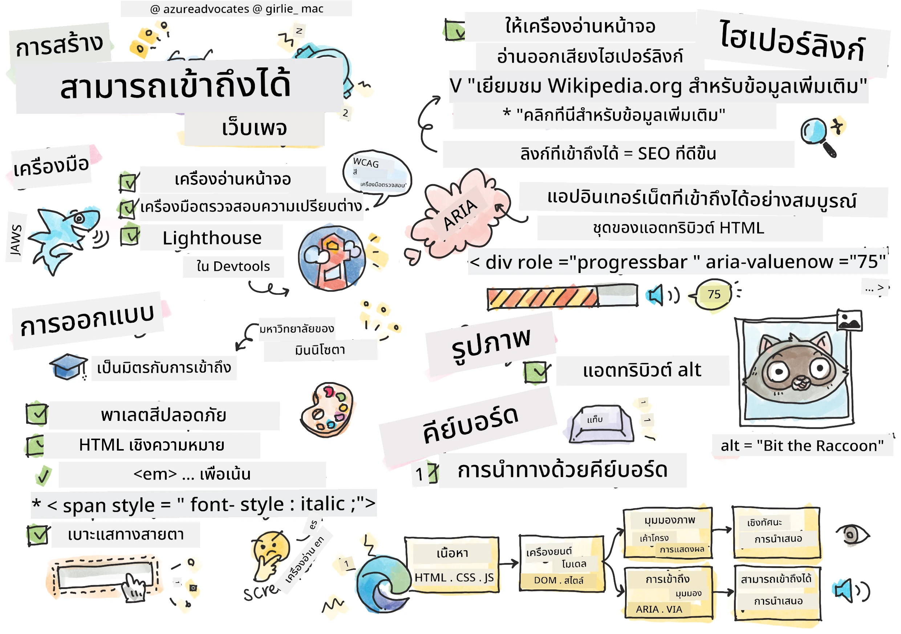
> สเก็ตช์โน้ตโดย [Tomomi Imura](https://twitter.com/girlie_mac)

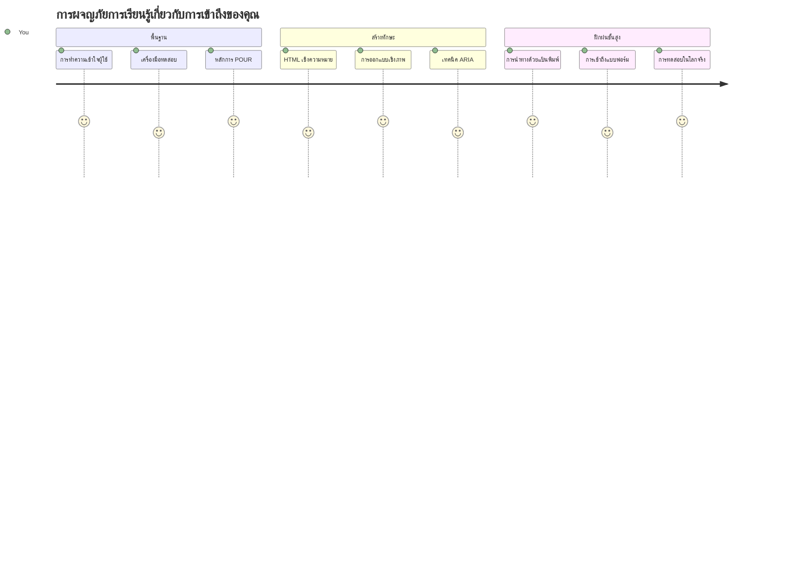
## แบบทดสอบก่อนบรรยาย
[แบบทดสอบก่อนบรรยาย](https://ff-quizzes.netlify.app/web/)

> พลังของเว็บอยู่ที่ความเป็นสากล การเข้าถึงโดยทุกคนไม่ว่าจะมีความบกพร่องใดๆ เป็นสิ่งสำคัญยิ่ง
>
> \- Sir Timothy Berners-Lee, ผู้อำนวยการ W3C และผู้คิดค้นเวิลด์ไวด์เว็บ

นี่คือสิ่งที่อาจทำให้คุณประหลาดใจ: เมื่อคุณสร้างเว็บไซต์ที่เข้าถึงได้ คุณไม่ได้ช่วยเพียงผู้ที่มีความบกพร่องเท่านั้น—แต่คุณกำลังทำให้เว็บดีขึ้นสำหรับทุกคน!

เคยสังเกตทางเท้าตรงมุมถนนไหม? ตอนแรกนั้นออกแบบมาสำหรับรถเข็นคนพิการ แต่ตอนนี้ช่วยผู้ที่ใช้รถเข็นเด็ก, คนส่งของที่ลากรถเข็น, นักเดินทางที่ลากกระเป๋าล้อ, และนักปั่นจักรยานด้วย นั่นแหละคือวิธีที่การออกแบบเว็บที่เข้าถึงได้ทำงาน—วิธีแก้ปัญหาที่ช่วยกลุ่มหนึ่งมักจะเป็นประโยชน์กับทุกคน เจ๋งใช่ไหม?

ในบทเรียนนี้ เราจะสำรวจวิธีสร้างเว็บไซต์ที่ใช้งานได้สำหรับทุกคน ไม่ว่าจะท่องเว็บอย่างไร คุณจะได้ค้นพบเทคนิคที่ใช้งานได้จริงซึ่งฝังอยู่ในมาตรฐานเว็บ ทดสอบด้วยตัวเองผ่านเครื่องมือต่างๆ และเห็นว่าการเข้าถึงช่วยให้ไซต์ของคุณใช้งานง่ายขึ้นสำหรับผู้ใช้ทุกคนอย่างไร

เมื่อจบบทเรียนนี้ คุณจะมั่นใจในการทำให้การเข้าถึงเป็นส่วนหนึ่งของกระบวนการพัฒนาของคุณอย่างเป็นธรรมชาติ พร้อมสำรวจวิธีที่การออกแบบอย่างรอบคอบจะเปิดโอกาสให้ผู้คนหลายพันล้านเข้าถึงเว็บได้อย่างไร? ไปกันเลย!

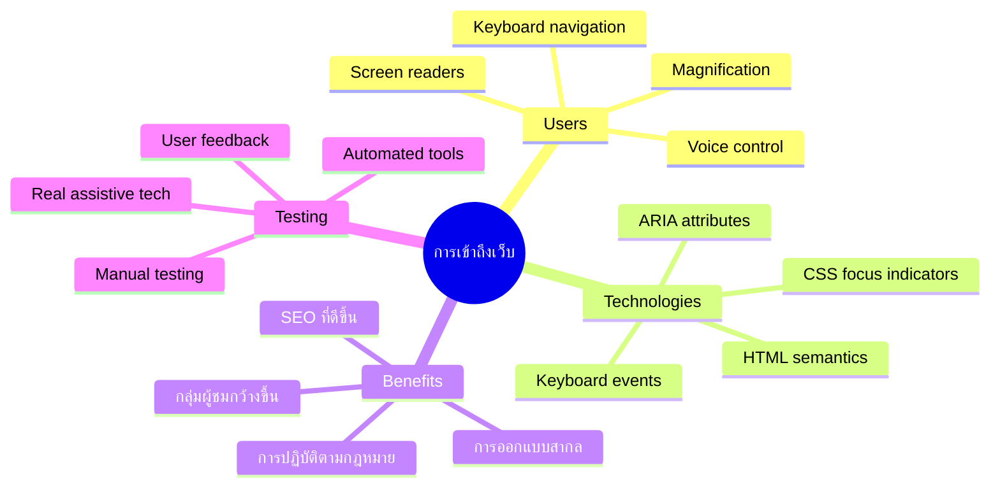
> คุณสามารถเรียนบทเรียนนี้ได้บน [Microsoft Learn](https://docs.microsoft.com/learn/modules/web-development-101/accessibility/?WT.mc_id=academic-77807-sagibbon)!

## ทำความเข้าใจเทคโนโลยีช่วยเหลือ

ก่อนที่เราจะลงมือเขียนโค้ด มาทำความเข้าใจก่อนว่าผู้คนที่มีความสามารถแตกต่างกันเหล่านี้สัมผัสเว็บอย่างไร นี่ไม่ใช่แค่ทฤษฎี—การเข้าใจรูปแบบการนำทางในโลกจริงจะทำให้คุณเป็นนักพัฒนาที่ดียิ่งขึ้น!

เทคโนโลยีช่วยเหลือเป็นเครื่องมือที่น่าทึ่งซึ่งช่วยให้ผู้ที่มีความบกพร่องสามารถโต้ตอบกับเว็บไซต์ได้ในแบบที่คุณอาจประหลาดใจ เมื่อคุณเข้าใจวิธีที่เทคโนโลยีเหล่านี้ทำงาน การสร้างประสบการณ์เว็บที่เข้าถึงได้จะกลายเป็นเรื่องง่ายขึ้นมาก เหมือนกับการเรียนรู้ที่จะมองโค้ดผ่านสายตาของคนอื่น

### โปรแกรมอ่านหน้าจอ

[โปรแกรมอ่านหน้าจอ](https://en.wikipedia.org/wiki/Screen_reader) เป็นเทคโนโลยีที่ซับซ้อนซึ่งแปลงข้อความดิจิทัลเป็นเสียงพูดหรือระบบอักษรเบรลล์ แม้ว่าจะมีผู้ใช้หลักคือผู้ที่มีปัญหาทางสายตา แต่ก็มีประโยชน์อย่างมากสำหรับผู้ใช้ที่มีปัญหาเรียนรู้เช่นดิสเล็กเซีย

ผมชอบคิดว่าโปรแกรมอ่านหน้าจอเหมือนมีผู้บรรยายที่ฉลาดมากกำลังอ่านหนังสือให้คุณฟัง มันอ่านเนื้อหาออกเสียงตามลำดับที่สมเหตุสมผล ประกาศส่วนที่โต้ตอบได้เช่น "ปุ่ม" หรือ "ลิงก์" และมีทางลัดแป้นพิมพ์ให้กระโดดไปรอบๆ หน้า แต่ข้อสำคัญคือ—โปรแกรมอ่านหน้าจอจะทำงานได้ดีถ้าเราออกแบบเว็บไซต์ด้วยโครงสร้างและเนื้อหาที่มีความหมาย นั่นคือหน้าที่ของคุณในฐานะนักพัฒนา!

**โปรแกรมอ่านหน้าจอยอดนิยมในแต่ละแพลตฟอร์ม:**
- **Windows**: [NVDA](https://www.nvaccess.org/about-nvda/) (ฟรีและเป็นที่นิยมที่สุด), [JAWS](https://webaim.org/articles/jaws/), [Narrator](https://support.microsoft.com/windows/complete-guide-to-narrator-e4397a0d-ef4f-b386-d8ae-c172f109bdb1/?WT.mc_id=academic-77807-sagibbon) (ติดตั้งมาในระบบ)
- **macOS/iOS**: [VoiceOver](https://support.apple.com/guide/voiceover/welcome/10) (ติดตั้งมาและมีความสามารถสูง)
- **Android**: [TalkBack](https://support.google.com/accessibility/android/answer/6283677) (ติดตั้งมา)
- **Linux**: [Orca](https://wiki.gnome.org/Projects/Orca) (ฟรีและโอเพนซอร์ส)

**วิธีนำทางเนื้อหาเว็บด้วยโปรแกรมอ่านหน้าจอ:**

โปรแกรมอ่านหน้าจอมีหลายวิธีนำทางที่ช่วยให้ผู้ใช้ที่มีประสบการณ์ท่องเว็บได้อย่างมีประสิทธิภาพ:
- **การอ่านตามลำดับ**: อ่านเนื้อหาจากบนลงล่าง เหมือนอ่านหนังสือ
- **การนำทางผ่านแลนด์มาร์ก**: กระโดดไปยังส่วนต่างๆ ของหน้า (ส่วนหัว, เมนู, เนื้อหาหลัก, ส่วนท้าย)
- **การนำทางหัวข้อ**: ข้ามไปมาระหว่างหัวข้อเพื่อทำความเข้าใจโครงสร้างหน้า
- **รายการลิงก์**: สร้างรายการลิงก์ทั้งหมดเพื่อเข้าถึงอย่างรวดเร็ว
- **การควบคุมฟอร์ม**: นำทางระหว่างช่องกรอกข้อมูลและปุ่มโดยตรง

> 💡 **นี่คือสิ่งที่ทำให้ผมทึ่ง**: 68% ของผู้ใช้โปรแกรมอ่านหน้าจอนำทางโดยอาศัยหัวข้อมากที่สุด ([WebAIM Survey](https://webaim.org/projects/screenreadersurvey9/#finding)) นั่นหมายความว่าโครงสร้างหัวข้อของคุณเป็นเสมือนแผนที่สำหรับผู้ใช้—ถ้าคุณทำถูกต้อง คุณกำลังช่วยให้ผู้ใช้หาทางไปรอบๆ เนื้อหาของคุณได้เร็วขึ้น!

### สร้างเวิร์กโฟลว์ทดสอบของคุณ

นี่คือข่าวดี—การทดสอบการเข้าถึงอย่างมีประสิทธิภาพไม่จำเป็นต้องยุ่งยาก! คุณจะอยากผสมผสานเครื่องมืออัตโนมัติ (ที่ยอดเยี่ยมในการจับปัญหาที่ชัดเจน) กับการทดสอบด้วยมือ นี่คือวิธีที่เป็นระบบที่ผมพบว่าจับปัญหาได้มากที่สุดโดยไม่เสียเวลาทั้งวัน:

**เวิร์กโฟลว์ทดสอบด้วยมือที่สำคัญ:**

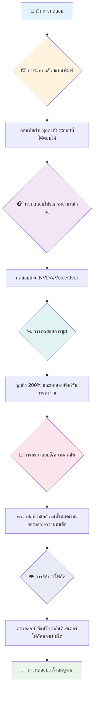
**รายการตรวจสอบการทดสอบทีละขั้นตอน:**
1. **การนำทางด้วยคีย์บอร์ด**: ใช้ได้เฉพาะ Tab, Shift+Tab, Enter, Space และปุ่มลูกศร
2. **ทดสอบโปรแกรมอ่านหน้าจอ**: เปิด NVDA, VoiceOver หรือ Narrator และนำทางโดยปิดตา
3. **ทดสอบการขยาย**: ทดสอบที่ระดับขยาย 200% และ 400%
4. **ตรวจสอบความแตกต่างของสี**: ตรวจสอบข้อความและส่วนประกอบ UI ทั้งหมด
5. **ทดสอบตัวชี้นำโฟกัส**: ตรวจสอบให้แน่ใจว่าส่วนที่โต้ตอบได้ทั้งหมดมีสถานะโฟกัสที่มองเห็นได้

✅ **เริ่มด้วย Lighthouse**: เปิด DevTools ของเบราว์เซอร์ รันการตรวจสอบการเข้าถึงด้วย Lighthouse จากนั้นใช้ผลลัพธ์เป็นแนวทางในการทดสอบด้วยมือของคุณ

### เครื่องมือซูมและขยาย

คุณรู้ไหมว่าคุณมักจะใช้นิ้วบีบเพื่อซูมบนมือถือเมื่อข้อความเล็กเกินไป หรือเพ่งหน้าจอแล็ปท็อปในแสงแดดจ้า? ผู้ใช้หลายคนพึ่งพาเครื่องมือขยายเพื่อทำให้เนื้อหาอ่านง่ายทุกวัน ซึ่งรวมถึงผู้ที่มีปัญหาสายตา ผู้สูงอายุ และใครก็ตามที่เคยลองอ่านเว็บไซต์กลางแจ้ง

เทคโนโลยีซูมสมัยใหม่ได้พัฒนามากกว่าแค่ทำให้สิ่งต่างๆ ใหญ่ขึ้น การเข้าใจวิธีทำงานของเครื่องมือเหล่านี้จะช่วยให้คุณสร้างดีไซน์ที่ตอบสนองซึ่งยังคงใช้งานได้ดีและดูดีในทุกระดับการขยาย

**ความสามารถการซูมของเบราว์เซอร์สมัยใหม่:**
- **ซูมหน้าเว็บ**: การปรับขนาดเนื้อหาทุกอย่างอย่างสมส่วน (ข้อความ, รูปภาพ, การจัดวาง) - วิธีนี้เป็นที่นิยม
- **ซูมเฉพาะข้อความ**: ขยายขนาดฟอนต์โดยคงโครงร่างเดิมไว้
- **บีบนิ้วเพื่อซูม**: ท่าทางมือถือสำหรับขยายชั่วคราว
- **การรองรับเบราว์เซอร์**: เบราว์เซอร์สมัยใหม่ทั้งหมดรองรับซูมถึง 500% โดยไม่เสียฟังก์ชัน

**ซอฟต์แวร์ขยายภาพเฉพาะทาง:**
- **Windows**: [Magnifier](https://support.microsoft.com/windows/use-magnifier-to-make-things-on-the-screen-easier-to-see-414948ba-8b1c-d3bd-8615-0e5e32204198) (ติดตั้งมา), [ZoomText](https://www.freedomscientific.com/training/zoomtext/getting-started/)
- **macOS/iOS**: [Zoom](https://www.apple.com/accessibility/mac/vision/) (ติดตั้งมาและมีฟีเจอร์ขั้นสูง)

> ⚠️ **ข้อควรพิจารณาการออกแบบ**: WCAG กำหนดให้เนื้อหายังคงใช้งานได้เมื่อซูม 200% ระดับนี้การเลื่อนแนวนอนควรน้อยที่สุด และส่วนโต้ตอบทั้งหมดควรเข้าถึงได้

✅ **ทดสอบดีไซน์ตอบสนองของคุณ**: ซูมเบราว์เซอร์ที่ 200% และ 400% การจัดวางของคุณปรับตัวอย่างราบรื่นหรือไม่? คุณยังเข้าถึงฟังก์ชันทั้งหมดได้โดยไม่ต้องเลื่อนมากเกินไปหรือเปล่า?

## เครื่องมือทดสอบการเข้าถึงสมัยใหม่

ตอนนี้คุณเข้าใจวิธีที่ผู้คนใช้เทคโนโลยีช่วยเหลือนำทางเว็บแล้ว มาดูเครื่องมือที่ช่วยคุณสร้างและทดสอบเว็บที่เข้าถึงได้

คิดแบบนี้: เครื่องมืออัตโนมัติดีในการจับปัญหาชัดเจน (เช่นข้อความ alt ที่ขาดหาย) ในขณะที่การทดสอบด้วยมือช่วยยืนยันว่าเว็บไซต์ใช้งานได้จริงในโลกจริง ทั้งคู่รวมกันช่วยให้คุณมั่นใจว่าไซต์ของคุณทำงานได้สำหรับทุกคน

### การทดสอบความแตกต่างของสี

นี่คือข่าวดี: ความแตกต่างของสีเป็นปัญหาการเข้าถึงที่พบบ่อยมาก แต่ง่ายมากที่จะปรับปรุง ความแตกต่างที่ดีส่งผลดีต่อทุกคน—ตั้งแต่ผู้ที่มีปัญหาสายตาจนถึงคนที่พยายามอ่านมือถือบนชายหาด

**ข้อกำหนดความแตกต่างของสีตาม WCAG:**

| ประเภทข้อความ | WCAG AA (ขั้นต่ำ) | WCAG AAA (ขั้นสูง) |
|--------------|------------------|--------------------|
| **ข้อความปกติ** (ต่ำกว่า 18pt) | อัตราความแตกต่าง 4.5:1 | อัตราความแตกต่าง 7:1 |
| **ข้อความใหญ่** (18pt+ หรือ 14pt+ ตัวหนา) | อัตราความแตกต่าง 3:1 | อัตราความแตกต่าง 4.5:1 |
| **ส่วนประกอบ UI** (ปุ่ม, เส้นขอบฟอร์ม) | อัตราความแตกต่าง 3:1 | อัตราความแตกต่าง 3:1 |

**เครื่องมือทดสอบที่จำเป็น:**
- [Colour Contrast Analyser](https://www.tpgi.com/color-contrast-checker/) - โปรแกรมเดสก์ท็อปพร้อมตัวเลือกสี
- [WebAIM Contrast Checker](https://webaim.org/resources/contrastchecker/) - เว็บที่ให้ฟีดแบ็กทันที
- [Stark](https://www.getstark.co/) - ปลั๊กอินสำหรับ Figma, Sketch, Adobe XD
- [Accessible Colors](https://accessible-colors.com/) - ค้นหาโทนสีที่เข้าถึงได้

✅ **สร้างโทนสีที่ดีกว่า**: เริ่มจากสีแบรนด์ของคุณและใช้ตัวตรวจสอบความแตกต่างเพื่อสร้างโทนสีที่เข้าถึงได้ บันทึกไว้เป็นโทนสีเข้าถึงได้ของระบบการออกแบบของคุณ

### การตรวจสอบการเข้าถึงแบบครบวงจร

การทดสอบการเข้าถึงที่มีประสิทธิภาพที่สุดรวมหลายวิธีไว้ด้วยกัน ไม่มีเครื่องมือเดียวจับทุกปัญหาได้ทั้งหมด ดังนั้นการสร้างกิจวัตรทดสอบด้วยหลายวิธีจึงช่วยให้ครอบคลุมอย่างถี่ถ้วน

**การทดสอบบนเบราว์เซอร์ (ฝังใน DevTools):**
- **Chrome/Edge**: การตรวจสอบการเข้าถึง Lighthouse + แผงการเข้าถึง
- **Firefox**: ตัวตรวจสอบการเข้าถึงพร้อมมุมมองโครงสร้างต้นไม้ละเอียด
- **Safari**: แท็บการตรวจสอบใน Web Inspector พร้อมการจำลอง VoiceOver

**ส่วนขยายสำหรับการทดสอบมืออาชีพ:**
- [axe DevTools](https://www.deque.com/axe/devtools/) - การทดสอบอัตโนมัติมาตรฐานอุตสาหกรรม
- [WAVE](https://wave.webaim.org/extension/) - ฟีดแบ็กทางภาพพร้อมเน้นข้อผิดพลาด
- [Accessibility Insights](https://accessibilityinsights.io/) - ชุดทดสอบครบเครื่องของ Microsoft

**บรรทัดคำสั่งและการผนวกใน CI/CD:**
- [axe-core](https://github.com/dequelabs/axe-core) - ไลบรารี JavaScript สำหรับการทดสอบอัตโนมัติ
- [Pa11y](https://pa11y.org/) - เครื่องมือทดสอบการเข้าถึงแบบบรรทัดคำสั่ง
- [Lighthouse CI](https://github.com/GoogleChrome/lighthouse-ci) - การให้คะแนนการเข้าถึงอัตโนมัติ

> 🎯 **เป้าหมายการทดสอบ**: ตั้งเป้าคะแนนการเข้าถึง Lighthouse ที่ 95+ เป็นเกณฑ์พื้นฐาน จำไว้ว่าการใช้เครื่องมืออัตโนมัติจับได้เพียงประมาณ 30-40% ของปัญหาการเข้าถึง—การทดสอบด้วยมือยังคงจำเป็น!

### 🧠 **ตรวจสอบทักษะการทดสอบ: พร้อมค้นหาปัญหาหรือยัง?**

**มาดูความรู้สึกคุณเกี่ยวกับการทดสอบการเข้าถึงกัน:**
- วิธีการทดสอบแบบไหนที่ดูเหมาะกับคุณที่สุดตอนนี้?
- คุณคิดจะใช้การนำทางด้วยคีย์บอร์ดเต็มวันได้ไหม?
- คุณเคยเจออุปสรรคการเข้าถึงอะไรบ้างในโลกออนไลน์?

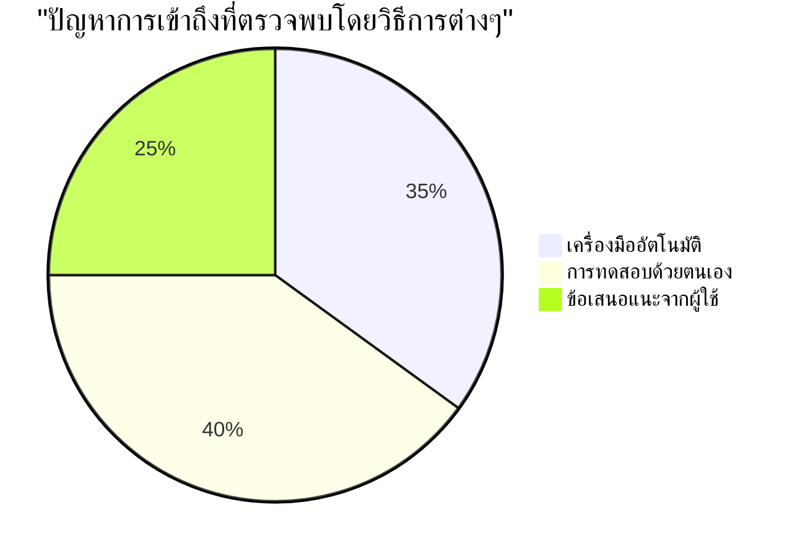
> **เพิ่มความมั่นใจ**: ผู้ทดสอบการเข้าถึงมืออาชีพใช้วิธีการผสมผสานแบบนี้ คุณกำลังเรียนรู้ฝึกฝนอุตสาหกรรม!

## สร้างการเข้าถึงตั้งแต่รากฐาน

กุญแจสำคัญของความสำเร็จด้านการเข้าถึงคือการฝังมันไว้ในรากฐานตั้งแต่วันแรก ผมรู้ว่าคุณอาจคิดว่า "ผมจะเพิ่มการเข้าถึงทีหลัง" แต่นั่นเหมือนกับการพยายามติดตั้งทางลาดให้บ้านหลังสร้างเสร็จแล้ว ได้ไหม? ได้. ง่ายไหม? ไม่จริงเลย

คิดว่าการเข้าถึงเหมือนการวางแผนสร้างบ้าน—คุณรวมทางลาดสำหรับรถเข็นไว้ในแผนสถาปัตยกรรมตั้งแต่แรกจะง่ายกว่าการมาติดทีหลังทั้งหมด

### หลักการ POUR: รากฐานการเข้าถึงของคุณ

แนวทางเนื้อหาเว็บที่เข้าถึงได้ (WCAG) สร้างขึ้นบนหลักการพื้นฐานสี่ข้อที่เรียกว่า POUR ไม่ต้องห่วง—นี่ไม่ใช่แนวคิดวิชาการที่ซับซ้อน! แต่เป็นแนวทางปฏิบัติสำหรับการทำเนื้อหาที่ใช้งานได้กับทุกคน

เมื่อคุณเข้าใจ POUR การตัดสินใจด้านการเข้าถึงจะง่ายขึ้นมาก เหมือนมีเช็กลิสต์ในหัวที่ช่วยชี้แนะการออกแบบ มาดูรายละเอียดกัน:

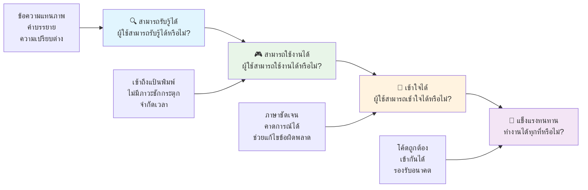
**🔍 Perceivable (สามารถรับรู้ได้)**: ข้อมูลต้องนำเสนอในรูปแบบที่ผู้ใช้สามารถรับรู้ผ่านประสาทสัมผัสที่มี

- ให้ทางเลือกเป็นข้อความสำหรับเนื้อหาที่ไม่ใช่ข้อความ (รูปภาพ, วิดีโอ, เสียง)
- รับประกันความแตกต่างของสีที่เพียงพอสำหรับข้อความและส่วนประกอบ UI ทั้งหมด
- ให้คำบรรยายและคำถอดเสียงสำหรับสื่อมัลติมีเดีย
- ออกแบบเนื้อหาให้ยังใช้งานได้เมื่อปรับขนาดถึง 200%
- ใช้ลักษณะทางประสาทสัมผัสหลายอย่าง (ไม่ใช่แค่สี) เพื่อสื่อสารข้อมูล

**🎮 Operable (สามารถใช้งานได้)**: ส่วนติดต่อทั้งหมดต้องใช้งานได้ผ่านวิธีป้อนข้อมูลที่มีอยู่

- ทำให้ฟังก์ชันทั้งหมดเข้าถึงได้ผ่านการนำทางด้วยคีย์บอร์ด
- ให้เวลาผู้ใช้เพียงพอในการอ่านและโต้ตอบกับเนื้อหา
- หลีกเลี่ยงเนื้อหาที่ทำให้เกิดอาการชักหรือปัญหาการทรงตัว
- ช่วยผู้ใช้นำทางอย่างมีประสิทธิภาพด้วยโครงสร้างและแลนด์มาร์กที่ชัดเจน
- รับประกันว่าส่วนโต้ตอบมีขนาดเป้าหมายที่เหมาะสม (อย่างน้อย 44px)

**📖 Understandable (เข้าใจได้ง่าย)**: ข้อมูลและการทำงานของ UI ต้องชัดเจนและเข้าใจง่าย

- ใช้ภาษาที่ชัดเจนและง่ายที่เหมาะสมกับผู้ใช้ของคุณ
- รับประกันว่าเนื้อหาปรากฏและทำงานในแบบที่คาดเดาได้และสม่ำเสมอ
- ให้คำแนะนำและข้อความแสดงข้อผิดพลาดที่ชัดเจนสำหรับการป้อนข้อมูลของผู้ใช้
- ช่วยผู้ใช้เข้าใจและแก้ไขข้อผิดพลาดในแบบฟอร์ม
- จัดระเบียบเนื้อหาด้วยลำดับการอ่านและลำดับชั้นของข้อมูลที่เหมาะสม

**💪 Robust (มั่นคง)**: เนื้อหาต้องทำงานได้อย่างน่าเชื่อถือกับเทคโนโลยีและอุปกรณ์ช่วยเหลือต่างๆ

- **ใช้ HTML ที่ถูกต้องและมีความหมายเป็นฐานของคุณ**
- **รับประกันความเข้ากันได้กับเทคโนโลยีช่วยเหลือในปัจจุบันและอนาคต**
- **ปฏิบัติตามมาตรฐานเว็บและแนวทางปฏิบัติที่ดีที่สุดสำหรับการทำมาร์กอัป**
- **ทดสอบบนเบราว์เซอร์ต่างๆ อุปกรณ์ และเครื่องมือช่วยเหลือ**
- **จัดโครงสร้างเนื้อหาให้ลดทอนอย่างราบรื่นเมื่อฟีเจอร์ขั้นสูงไม่รองรับ**

### 🎯 **การตรวจสอบหลักการ POUR: ทำให้ยั่งยืน**

**การสะท้อนอย่างรวดเร็วเกี่ยวกับพื้นฐาน:**
- คุณนึกถึงฟีเจอร์เว็บไซต์ใดที่ล้มเหลวในแต่ละหลักการ POUR ได้ไหม?
- หลักการใดที่รู้สึกเป็นธรรมชาติมากที่สุดสำหรับคุณในฐานะนักพัฒนา?
- หลักการเหล่านี้จะช่วยปรับปรุงการออกแบบให้กับทุกคน ไม่ใช่แค่ผู้พิการอย่างไร?

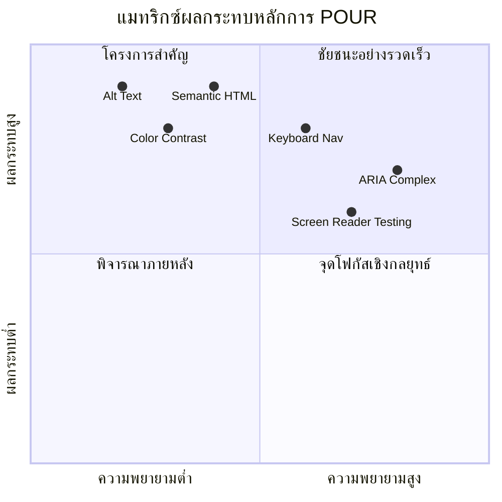
> **จำไว้**: เริ่มด้วยการปรับปรุงที่มีผลกระทบสูงและใช้ความพยายามน้อย HTML เชิงความหมายและข้อความทดแทนช่วยให้คุณเพิ่มการเข้าถึงใหญ่ที่สุดด้วยความพยายามน้อยที่สุด!

## การสร้างการออกแบบเชิงภาพที่เข้าถึงได้

การออกแบบเชิงภาพที่ดีและการเข้าถึงมักไปด้วยกัน เมื่อคุณออกแบบโดยคำนึงถึงการเข้าถึง คุณมักจะพบว่าข้อจำกัดเหล่านี้นำไปสู่โซลูชันที่เรียบง่ายและสง่างามมากขึ้นซึ่งเป็นประโยชน์ต่อผู้ใช้ทุกคน

มาสำรวจวิธีการสร้างการออกแบบที่น่าดึงดูดตาซึ่งใช้งานได้กับทุกคน โดยไม่คำนึงถึงความสามารถในการมองเห็นหรือสภาพแวดล้อมที่พวกเขาดูเนื้อหาของคุณ

### กลยุทธ์สีและการเข้าถึงทางสายตา

สีมีอำนาจในการสื่อสาร แต่ไม่ควรเป็นวิธีเดียวที่คุณสื่อสารข้อมูลสำคัญ การออกแบบที่เกินกว่าสีทำให้เกิดประสบการณ์ที่แข็งแกร่งและครอบคลุมมากขึ้น ซึ่งใช้งานได้ในหลายสถานการณ์มากขึ้น

**ออกแบบสำหรับความแตกต่างทางการมองเห็นสี:**

ประมาณ 8% ของผู้ชายและ 0.5% ของผู้หญิงมีความแตกต่างทางการมองเห็นสีบางรูปแบบ (มักเรียกว่า "ตาบอดสี") ประเภทที่พบบ่อยที่สุดคือ:
- **Deuteranopia**: มีปัญหาแยกแยะสีแดงและเขียว
- **Protanopia**: สีแดงดูมืดลง
- **Tritanopia**: มีปัญหากับสีฟ้าและเหลือง (พบได้น้อย)

**กลยุทธ์สีแบบครอบคลุม:**

```css
/* ❌ Bad: Using only color to indicate status */
.error { color: red; }
.success { color: green; }

/* ✅ Good: Color plus icons and context */
.error {
  color: #d32f2f;
  border-left: 4px solid #d32f2f;
}
.error::before {
  content: "⚠️";
  margin-right: 8px;
}

.success {
  color: #2e7d32;
  border-left: 4px solid #2e7d32;
}
.success::before {
  content: "✅";
  margin-right: 8px;
}
```

**เกินกว่าข้อกำหนดความคมชัดพื้นฐาน:**
- ทดสอบสีของคุณด้วยโปรแกรมจำลองคนตาบอดสี
- ใช้รูปแบบพื้นผิว หรือรูปทรงร่วมกับการใช้สี
- ทำให้สถานะโต้ตอบต่างๆ สามารถแยกแยะได้แม้ไม่มีสี
- พิจารณาว่าการออกแบบของคุณดูอย่างไรในโหมดความคมชัดสูง

✅ **ทดสอบการเข้าถึงสีของคุณ**: ใช้เครื่องมืออย่าง [Coblis](https://www.color-blindness.com/coblis-color-blindness-simulator/) เพื่อตรวจสอบว่าเว็บไซต์ของคุณดูเป็นอย่างไรสำหรับผู้ที่มีความแตกต่างทางการมองเห็นสีประเภทต่างๆ

### ตัวบ่งชี้โฟกัสและการออกแบบการโต้ตอบ

ตัวบ่งชี้โฟกัสคือเทียบได้กับเคอร์เซอร์ในดิจิทัล — มันแสดงตำแหน่งที่ผู้ใช้คีย์บอร์ดอยู่บนหน้า ตัวบ่งชี้โฟกัสที่ออกแบบได้ดีช่วยเพิ่มประสบการณ์สำหรับทุกคนด้วยการทำให้การโต้ตอบชัดเจนและคาดเดาได้

**แนวทางปฏิบัติตัวบ่งชี้โฟกัสสมัยใหม่:**

```css
/* Enhanced focus styles that work across browsers */
button:focus-visible {
  outline: 2px solid #0066cc;
  outline-offset: 2px;
  box-shadow: 0 0 0 4px rgba(0, 102, 204, 0.25);
}

/* Remove focus outline for mouse users, preserve for keyboard users */
button:focus:not(:focus-visible) {
  outline: none;
}

/* Focus-within for complex components */
.card:focus-within {
  box-shadow: 0 0 0 3px rgba(74, 144, 164, 0.5);
  border-color: #4A90A4;
}

/* Ensure focus indicators meet contrast requirements */
.custom-focus:focus-visible {
  outline: 3px solid #ffffff;
  outline-offset: 2px;
  box-shadow: 0 0 0 6px #000000;
}
```

**ข้อกำหนดตัวบ่งชี้โฟกัส:**
- **การมองเห็น**: ต้องมีอัตราส่วนความคมชัดอย่างน้อย 3:1 กับองค์ประกอบรอบข้าง
- **ความกว้าง**: หนาอย่างน้อย 2px รอบองค์ประกอบทั้งหมด
- **ความคงอยู่**: ควรยังคงมองเห็นได้จนกว่าโฟกัสจะย้ายไปที่อื่น
- **ความแตกต่าง**: ต้องแตกต่างทางสายตาจากสถานะ UI อื่นๆ

> 💡 **เคล็ดลับการออกแบบ**: ตัวบ่งชี้โฟกัสที่ดีมักใช้การรวมกันของเส้นขอบ เงากล่อง และการเปลี่ยนสีเพื่อให้มั่นใจว่ามองเห็นได้ในพื้นหลังและบริบทต่างๆ

✅ **ตรวจสอบตัวบ่งชี้โฟกัส**: กดแท็บผ่านเว็บไซต์ของคุณและสังเกตองค์ประกอบที่มีตัวบ่งชี้โฟกัสชัดเจน มีองค์ประกอบใดที่มองเห็นยากหรือขาดหายไปบ้างไหม?

### Semantic HTML: พื้นฐานของการเข้าถึง

Semantic HTML คือการให้เทคโนโลยีช่วยเหลือระบบนำทาง GPS สำหรับเว็บไซต์ของคุณ เมื่อคุณใช้ HTML ที่เหมาะสมกับวัตถุประสงค์ คุณให้เครื่องมืออ่านหน้าจอ คีย์บอร์ด และเครื่องมืออื่นๆ แผนที่เส้นทางที่ชัดเจนเพื่อช่วยผู้ใช้สำรวจได้อย่างมีประสิทธิภาพ

นี่คือตัวอย่างที่ทำให้ผมเข้าใจอย่างชัดเจน: Semantic HTML ก็เหมือนกับห้องสมุดที่จัดระเบียบดีมีหมวดหมู่ที่ชัดเจนและป้ายช่วยเหลือ เทียบกับโกดังที่วางหนังสือกระจัดกระจาย สถานที่ทั้งสองมีหนังสือเหมือนกัน แต่คุณอยากหาอะไรในที่ไหนมากกว่ากัน? ถูกต้อง!

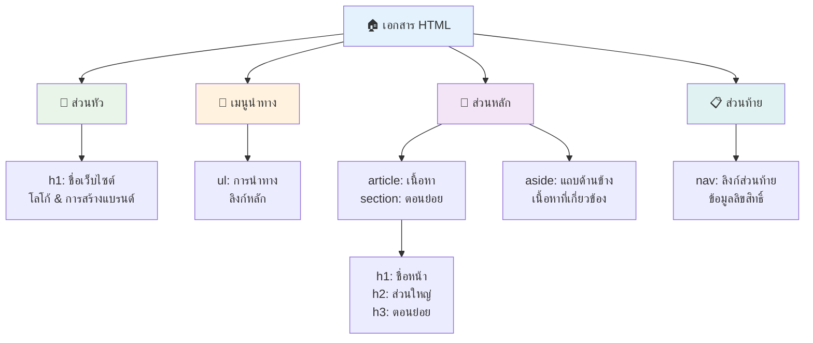
**องค์ประกอบพื้นฐานของโครงสร้างหน้าที่สามารถเข้าถึงได้:**

```html
<!-- Landmark elements provide page navigation structure -->
<header>
  <h1>Your Site Name</h1>
  <nav aria-label="Main navigation">
    <ul>
      <li><a href="/home">Home</a></li>
      <li><a href="/about">About</a></li>
      <li><a href="/services">Services</a></li>
    </ul>
  </nav>
</header>

<main>
  <article>
    <header>
      <h1>Article Title</h1>
      <p>Published on <time datetime="2024-10-14">October 14, 2024</time></p>
    </header>
    
    <section>
      <h2>First Section</h2>
      <p>Content that relates to this section...</p>
    </section>
    
    <section>
      <h2>Second Section</h2>
      <p>More related content...</p>
    </section>
  </article>
  
  <aside>
    <h2>Related Links</h2>
    <nav aria-label="Related articles">
      <ul>
        <li><a href="/related-1">First related article</a></li>
        <li><a href="/related-2">Second related article</a></li>
      </ul>
    </nav>
  </aside>
</main>

<footer>
  <p>&copy; 2024 Your Site Name. All rights reserved.</p>
  <nav aria-label="Footer links">
    <ul>
      <li><a href="/privacy">Privacy Policy</a></li>
      <li><a href="/contact">Contact Us</a></li>
    </ul>
  </nav>
</footer>
```

**ทำไม Semantic HTML ถึงเปลี่ยนแปลงการเข้าถึงได้:**

| องค์ประกอบเชิงความหมาย | วัตถุประสงค์ | ประโยชน์สำหรับเครื่องอ่านหน้าจอ |
|----------------------------|-------------|---------------------------------|
| `<header>` | หัวหน้าของหน้า หรือส่วน | "แบนเนอร์แลนด์มาร์ก" — นำทางไปบนสุดได้รวดเร็ว |
| `<nav>` | ลิงก์นำทาง | "แลนด์มาร์กนำทาง" — รายการส่วนการนำทาง |
| `<main>` | เนื้อหาหลักของหน้า | "แลนด์มาร์กหลัก" — ข้ามไปที่เนื้อหาโดยตรง |
| `<article>` | เนื้อหาที่เป็นอิสระ | ประกาศขอบเขตบทความ |
| `<section>` | กลุ่มเนื้อหาตามธีม | ให้โครงสร้างเนื้อหา |
| `<aside>` | เนื้อหารองในแถบข้าง | "แลนด์มาร์กเสริม" |
| `<footer>` | ท้ายนของหน้า หรือส่วน | "แลนด์มาร์กข้อมูลเนื้อหา" |

**พลังของเครื่องอ่านหน้าจอด้วย Semantic HTML:**
- **การนำทางแลนด์มาร์ก**: กระโดดระหว่างส่วนหลักของหน้าได้ทันที
- **โครงร่างหัวข้อ**: สร้างสารบัญจากโครงสร้างหัวข้อของคุณ
- **รายการองค์ประกอบ**: สร้างรายการลิงก์ ปุ่ม หรือฟอร์มทั้งหมด
- **ความเข้าใจบริบท**: เข้าใจความสัมพันธ์ระหว่างส่วนเนื้อหา

> 🎯 **ทดสอบอย่างรวดเร็ว**: ลองนำทางเว็บไซต์ของคุณด้วยเครื่องอ่านหน้าจอโดยใช้ทางลัดแลนด์มาร์ก (D สำหรับแลนด์มาร์ก, H สำหรับหัวข้อ, K สำหรับลิงก์ใน NVDA/JAWS) การนำทางสมเหตุสมผลไหม?

### 🏗️ **การตรวจสอบความชำนาญ Semantic HTML: สร้างรากฐานที่แข็งแรง**

**มาประเมินความเข้าใจเชิงความหมายของคุณ:**
- คุณสามารถระบุแลนด์มาร์กบนหน้าเว็บได้จากการดู HTML อย่างเดียวไหม?
- คุณจะอธิบายความแตกต่างระหว่าง `<section>` กับ `<div>` ให้เพื่อนฟังอย่างไร?
- สิ่งแรกที่คุณจะตรวจสอบเมื่อผู้ใช้เครื่องอ่านหน้าจอแจ้งปัญหาการนำทางคืออะไร?

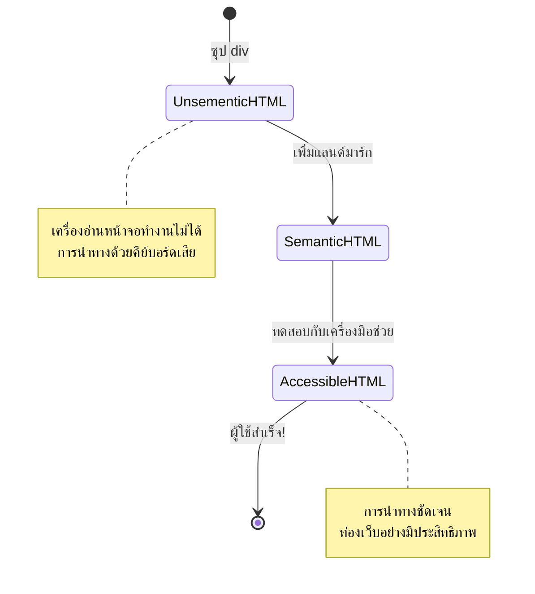
> **คำแนะนำระดับโปร**: Semantic HTML ที่ดีช่วยแก้ปัญหาการเข้าถึงได้ประมาณ 70% โดยอัตโนมัติ ชำนาญรากฐานนี้แล้วคุณก็อยู่ในเส้นทางที่ดี!

✅ **ตรวจสอบโครงสร้างเชิงความหมายของคุณ**: ใช้แผง Accessibility ใน DevTools ของเบราว์เซอร์เพื่อดูโครงสร้างการเข้าถึงและยืนยันว่าเครื่องหมายของคุณสร้างโครงสร้างตรรกะได้

### ลำดับหัวข้อ: สร้างโครงร่างเนื้อหาอย่างมีเหตุผล

หัวข้อมีความสำคัญยิ่งต่อเนื้อหาที่เข้าถึงได้ — มันเหมือนกระดูกสันหลังที่ช่วยประสานทุกอย่างเข้าด้วยกัน ผู้ใช้เครื่องอ่านหน้าจอพึ่งพาหัวข้ออย่างมากเพื่อทำความเข้าใจและนำทางเนื้อหาของคุณ คิดว่ามันเหมือนกับการให้สารบัญแก่หน้าของคุณ

**กฎทองของหัวข้อ:**
ห้ามข้ามระดับ หมั่นเดินหน้าอย่างมีเหตุผลจาก `<h1>` ไป `<h2>` และ `<h3>` ต่อไป จำได้ไหมตอนทำโครงร่างในโรงเรียน? มันเหมือนกันเป๊ะคุณจะไม่ข้ามจาก "I. จุดหลัก" ไปที่ "C. จุดย่อย-ย่อย" โดยไม่มี "A. จุดย่อย" ด้านในใช่ไหม?

**ตัวอย่างโครงสร้างหัวข้อที่สมบูรณ์แบบ:**

```html
<!-- ✅ Excellent: Logical, hierarchical progression -->
<main>
  <h1>Complete Guide to Web Accessibility</h1>
  
  <section>
    <h2>Understanding Screen Readers</h2>
    <p>Introduction to screen reader technology...</p>
    
    <h3>Popular Screen Reader Software</h3>
    <p>NVDA, JAWS, and VoiceOver comparison...</p>
    
    <h3>Testing with Screen Readers</h3>
    <p>Step-by-step testing instructions...</p>
  </section>
  
  <section>
    <h2>Color and Contrast Guidelines</h2>
    <p>Designing with sufficient contrast...</p>
    
    <h3>WCAG Contrast Requirements</h3>
    <p>Understanding the different contrast levels...</p>
    
    <h3>Testing Tools and Techniques</h3>
    <p>Tools for verifying contrast ratios...</p>
  </section>
</main>
```

```html
<!-- ❌ Problematic: Skipping levels, inconsistent structure -->
<h1>Page Title</h1>
<h3>Subsection</h3> <!-- Skipped h2 -->
<h2>This should come before h3</h2>
<h1>Another main heading?</h1> <!-- Multiple h1s -->
```

**แนวทางปฏิบัติที่ดีที่สุดสำหรับหัวข้อ:**
- **มี `<h1>` หนึ่งอันต่อหน้า**: โดยปกติคือชื่อหน้าหลักหรือหัวข้อเนื้อหาหลัก
- **ลำดับตรรกะ**: ห้ามข้ามระดับ (h1 → h2 → h3, ไม่ใช่ h1 → h3)
- **เนื้อหาที่มีความหมาย**: ทำให้หัวข้อมีความหมายเมื่ออ่านแยกออกจากบริบท
- **การจัดแต่งด้วย CSS**: ใช้ CSS เพื่อรูปลักษณ์ ระดับ HTML สำหรับโครงสร้าง

**สถิติการนำทางด้วยหัวข้อของเครื่องอ่านหน้าจอ:**
- 68% ของผู้ใช้เครื่องอ่านหน้าจอนำทางด้วยหัวข้อ ([WebAIM Survey](https://webaim.org/projects/screenreadersurvey9/#finding))
- ผู้ใช้คาดหวังว่าจะพบโครงร่างหัวข้อที่มีเหตุผล
- หัวข้อให้วิธีที่เร็วที่สุดในการเข้าใจโครงสร้างหน้า

> 💡 **เคล็ดลับมือโปร**: ใช้ส่วนขยายเบราว์เซอร์เช่น "HeadingsMap" เพื่อแสดงโครงสร้างหัวข้อของคุณ มันควรอ่านเหมือนสารบัญที่จัดระเบียบดี

✅ **ทดสอบโครงสร้างหัวข้อของคุณ**: ใช้การนำทางหัวข้อของเครื่องอ่านหน้าจอ (กด H ใน NVDA) เพื่อกระโดดผ่านหัวข้อของคุณ ลำดับเล่าเรื่องของเนื้อหาอย่างมีเหตุผลไหม?

### เทคนิคการเข้าถึงเชิงภาพขั้นสูง

นอกจากความคมชัดและสีแล้ว ยังมีเทคนิคขั้นสูงที่ช่วยสร้างประสบการณ์ภาพรวมที่ครอบคลุมจริงๆ วิธีเหล่านี้ช่วยให้เนื้อหาของคุณใช้งานได้ในสภาพแวดล้อมการรับชมและเทคโนโลยีช่วยเหลือที่หลากหลาย

**กลยุทธ์การสื่อสารเชิงภาพสำคัญ:**

- **การตอบสนองหลายโหมด**: ผสมผสานสัญญาณเชิงภาพ ข้อความ และบางครั้งเสียง
- **การเปิดเผยข้อมูลแบบก้าวหน้า**: นำเสนอข้อมูลเป็นส่วนที่ง่ายต่อการย่อย
- **รูปแบบการโต้ตอบที่สม่ำเสมอ**: ใช้รูปแบบ UI ที่คุ้นเคย
- **การพิมพ์ที่ตอบสนอง**: ปรับขนาดข้อความให้เหมาะสมกับอุปกรณ์ต่างๆ
- **สถานะการโหลดและข้อผิดพลาด**: ให้คำชี้แจงที่ชัดเจนสำหรับทุกการกระทำของผู้ใช้

**ยูทิลิตี้ CSS สำหรับการเข้าถึงที่ดียิ่งขึ้น:**

```css
/* Screen reader only text - visually hidden but accessible */
.sr-only {
  position: absolute;
  width: 1px;
  height: 1px;
  padding: 0;
  margin: -1px;
  overflow: hidden;
  clip: rect(0, 0, 0, 0);
  white-space: nowrap;
  border: 0;
}

/* Skip link for keyboard navigation */
.skip-link {
  position: absolute;
  top: -40px;
  left: 6px;
  background: #000000;
  color: #ffffff;
  padding: 8px 16px;
  text-decoration: none;
  border-radius: 4px;
  font-weight: bold;
  transition: top 0.3s ease;
  z-index: 1000;
}

.skip-link:focus {
  top: 6px;
}

/* Reduced motion respect */
@media (prefers-reduced-motion: reduce) {
  .skip-link {
    transition: none;
  }
  
  * {
    animation-duration: 0.01ms !important;
    animation-iteration-count: 1 !important;
    transition-duration: 0.01ms !important;
  }
}

/* High contrast mode support */
@media (prefers-contrast: high) {
  .button {
    border: 2px solid;
  }
}
```

> 🎯 **รูปแบบการเข้าถึง**: "ลิงก์ข้าม" สำคัญสำหรับผู้ใช้คีย์บอร์ด ควรเป็นองค์ประกอบที่สามารถโฟกัสได้เป็นอันดับแรกของหน้าคุณและข้ามไปยังเนื้อหาหลักโดยตรง

✅ **ใช้ลิงก์ข้ามการนำทาง**: เพิ่มลิงก์ข้ามในหน้าของคุณและทดสอบโดยกด Tab ทันทีที่หน้าโหลด ควรปรากฏและช่วยให้กระโดดไปที่เนื้อหาหลักได้

## การเขียนข้อความลิงก์ที่มีความหมาย

ลิงก์ก็เหมือนทางหลวงของเว็บ แต่ข้อความลิงก์ที่เขียนได้ไม่ดีเหมือนป้ายถนนที่เขียนว่า "สถานที่" แทนที่จะเป็น "ดาวน์ทาวน์ชิคาโก" ไม่ช่วยอะไรเลยใช่ไหม?

นี่คือสิ่งที่ทำให้ผมทึ่งตอนเรียนรู้ครั้งแรก: เครื่องอ่านหน้าจอสามารถดึงลิงก์ทั้งหมดจากหน้าและแสดงในรูปแบบรายการใหญ่ ลองนึกภาพมีคนให้ไดเรกทอรีของลิงก์ทั้งหมดในหน้าคุณ คุณจะทำให้แต่ละลิงก์มีความหมายเมื่อแยกเดี่ยวได้ไหม? นั่นคือตัวทดสอบข้อความลิงก์ของคุณ!

### การเข้าใจรูปแบบการนำทางลิงก์

เครื่องอ่านหน้าจอมีฟีเจอร์นำทางลิงก์ที่ทรงพลังโดยอิงจากข้อความลิงก์ที่เขียนดี:

**วิธีการนำทางลิงก์:**
- **การอ่านตามลำดับ**: ลิงก์ถูกอ่านในบริบทเป็นส่วนหนึ่งของเนื้อหา
- **การสร้างรายการลิงก์**: รวบรวมลิงก์ทั้งหมดในหน้าลงในไดเรกทอรีที่ค้นหาได้
- **การนำทางอย่างรวดเร็ว**: กระโดดระหว่างลิงก์โดยใช้ทางลัดคีย์บอร์ด (K ใน NVDA)
- **ฟังก์ชันค้นหา**: ค้นหาลิงก์เฉพาะโดยพิมพ์ข้อความบางส่วน

**ทำไมบริบทจึงสำคัญ:**
เมื่อผู้ใช้เครื่องอ่านหน้าจอสร้างรายการลิงก์พวกเขาจะเห็นประมาณนี้:
- "ดาวน์โหลดรายงาน"
- "เรียนรู้เพิ่มเติม"
- "คลิกที่นี่"
- "นโยบายความเป็นส่วนตัว"
- "คลิกที่นี่"

มีแค่ 2 ลิงก์นี้ที่ให้ข้อมูลที่เป็นประโยชน์เมื่ออ่านแยกออกจากบริบท!

> 📊 **ผลกระทบต่อผู้ใช้**: ผู้ใช้เครื่องอ่านหน้าจอสแกนรายการลิงก์เพื่อเข้าใจเนื้อหาของหน้านั้นเร็วๆ ข้อความลิงก์ทั่วไปบังคับให้พวกเขาต้องกลับไปดูบริบทแต่ละลิงก์ ทำให้การท่องเว็บช้าลงอย่างมาก

### ข้อผิดพลาดที่พบบ่อยของข้อความลิงก์ที่ควรหลีกเลี่ยง

การเข้าใจสิ่งที่ไม่ได้ผลจะช่วยให้คุณรับรู้และแก้ปัญหาการเข้าถึงในเนื้อหาที่มีอยู่

**❌ ข้อความลิงก์ทั่วไปที่ไม่ให้บริบท:**

```html
<!-- Meaningless when read from a link list -->
<p>Our sustainability efforts are detailed in our recent report. 
   <a href="/sustainability-2024.pdf">Click here</a> to view it.</p>

<!-- Repeated generic text throughout the page -->
<div class="article-card">
  <h3>Web Accessibility Guide</h3>
  <p>Learn the fundamentals...</p>
  <a href="/accessibility-guide">Read more</a>
</div>
<div class="article-card">
  <h3>Color Contrast Tips</h3>
  <p>Improve your design...</p>
  <a href="/color-contrast">Read more</a>
</div>

<!-- URLs as link text (difficult for screen readers to announce) -->
<p>Visit https://www.w3.org/WAI/WCAG21/quickref/ for WCAG guidelines.</p>

<!-- Vague action words -->
<a href="/contact">Go</a> | <a href="/about">See</a> | <a href="/help">View</a>
```

**ทำไมรูปแบบนี้ถึงล้มเหลว:**
- **"คลิกที่นี่"** ไม่บอกอะไรผู้ใช้เกี่ยวกับจุดหมายปลายทาง
- **"อ่านเพิ่มเติม"** ซ้ำหลายครั้งทำให้สับสน
- **URL ดิบ** ยากต่อการออกเสียงอย่างชัดเจนของเครื่องอ่านหน้าจอ
- **คำเดียว** เช่น "ไป" หรือ "ดู" ไม่มีบริบทที่อธิบายได้

### การเขียนข้อความลิงก์ที่ยอดเยี่ยม

ข้อความลิงก์ที่มีคำอธิบายชัดเจนเป็นประโยชน์กับทุกคน — ผู้ใช้ที่มองเห็นสแกนลิงก์ได้เร็ว และผู้ที่ใช้เครื่องอ่านหน้าจอเข้าใจจุดหมายปลายทางทันที

**✅ ตัวอย่างข้อความลิงก์ที่ชัดเจนและมีคำอธิบาย:**

```html
<!-- Descriptive text that explains the destination -->
<p>Our comprehensive <a href="/sustainability-2024.pdf">2024 sustainability report (PDF, 2.1MB)</a> details our environmental initiatives.</p>

<!-- Specific, unique link text for each card -->
<div class="article-card">
  <h3>Web Accessibility Guide</h3>
  <p>Learn the fundamentals of inclusive design...</p>
  <a href="/accessibility-guide">Read our complete web accessibility guide</a>
</div>
<div class="article-card">
  <h3>Color Contrast Tips</h3>
  <p>Improve your design with better color choices...</p>
  <a href="/color-contrast">Explore color contrast best practices</a>
</div>

<!-- Meaningful text instead of raw URLs -->
<p>The <a href="https://www.w3.org/WAI/WCAG21/quickref/">WCAG 2.1 Quick Reference guide</a> provides comprehensive accessibility guidelines.</p>

<!-- Descriptive action links -->
<a href="/contact">Contact our support team</a> | 
<a href="/about">About our company</a> | 
<a href="/help">Get help with your account</a>
```

**แนวทางปฏิบัติที่ดีที่สุดสำหรับข้อความลิงก์:**
- **ระบุเฉพาะเจาะจง**: "ดาวน์โหลดรายงานการเงินประจำไตรมาส" แทน "ดาวน์โหลด"
- **รวมประเภทไฟล์และขนาด**: "(PDF, 1.2MB)" สำหรับไฟล์ดาวน์โหลด
- **ระบุถ้าลิงก์เปิดในหน้าต่างใหม่**: "(เปิดในหน้าต่างใหม่)" เมื่อเหมาะสม
- **ใช้ภาษาที่แอคทีฟ**: "ติดต่อเรา" แทน "หน้าติดต่อ"
- **กระชับ**: ตั้งเป้า 2-8 คำเมื่อเป็นไปได้

### รูปแบบการเข้าถึงลิงก์ขั้นสูง

บางครั้งข้อจำกัดการออกแบบเชิงภาพหรือความต้องการทางเทคนิคต้องการโซลูชันพิเศษ นี่คือเทคนิคขั้นสูงสำหรับสถานการณ์ทั่วไปที่ท้าทาย:

**การใช้ ARIA สำหรับเพิ่มบริบท:**

```html
<!-- When button text must be short but needs more context -->
<a href="/report.pdf" 
   aria-label="Download 2024 annual financial report, PDF format, 2.3MB">
  Download Report
</a>

<!-- When the full context comes from surrounding content -->
<h3 id="sustainability-heading">Sustainability Initiative</h3>
<p>Our efforts to reduce environmental impact...</p>
<a href="/sustainability-details" 
   aria-labelledby="sustainability-heading"
   aria-describedby="sustainability-summary">
  Learn more
</a>
<p id="sustainability-summary">Detailed breakdown of our 2024 environmental goals and achievements</p>
```

**การระบุประเภทไฟล์และจุดหมายภายนอก:**

```html
<!-- Method 1: Include information in visible link text -->
<a href="/annual-report.pdf">
  Download our 2024 annual report (PDF, 2.3MB)
</a>

<!-- Method 2: Use screen reader-only text for file details -->
<a href="/annual-report.pdf">
  Download our 2024 annual report
  <span class="sr-only">(PDF format, 2.3MB)</span>
</a>

<!-- Method 3: External link indication -->
<a href="https://example.com" 
   target="_blank" 
   aria-describedby="external-link-warning">
  Visit external resource
</a>
<span id="external-link-warning" class="sr-only">
  (opens in new window)
</span>

<!-- Method 4: Using CSS for visual indicators -->
<a href="https://example.com" class="external-link">
  External resource
</a>
```

```css
/* Visual indicator for external links */
.external-link::after {
  content: " ↗";
  font-size: 0.8em;
  color: #666;
}

/* Screen reader announcement for external links */
.external-link::before {
  content: "External link: ";
  position: absolute;
  left: -10000px;
  width: 1px;
  height: 1px;
  overflow: hidden;
}
```

> ⚠️ **สำคัญ**: เมื่อใช้ `target="_blank"` ให้แจ้งผู้ใช้เสมอว่าลิงก์จะเปิดในหน้าต่างหรือแท็บใหม่ การเปลี่ยนเส้นทางโดยไม่คาดคิดอาจทำให้ผู้ใช้สับสน

✅ **ทดสอบบริบทลิงก์ของคุณ**: ใช้เครื่องมือสำหรับนักพัฒนาเบราว์เซอร์สร้างรายการลิงก์ทั้งหมดในหน้า คุณเข้าใจวัตถุประสงค์ของแต่ละลิงก์โดยไม่ต้องพึ่งบริบทอื่นไหม?

## ARIA: การเสริมพลังการเข้าถึง HTML

[Accessible Rich Internet Applications (ARIA)](https://developer.mozilla.org/docs/Web/Accessibility/ARIA) เหมือนกับการมีล่ามสากลระหว่างเว็บแอปพลิเคชันที่ซับซ้อนของคุณกับเทคโนโลยีช่วยเหลือ เมื่อ HTML เพียวๆ ไม่สามารถแสดงความหมายความสามารถทั้งหมดที่ส่วนประกอบโต้ตอบของคุณทำ ARIA จะเข้ามาเติมเต็มช่องว่างเหล่านั้น

ผมชอบคิดว่า ARIA เหมือนการเพิ่มหมายเหตุช่วยเหลือลงใน HTML—เหมือนทิศทางการแสดงในบทละครที่ช่วยให้นักแสดงเข้าใจบทบาทและความสัมพันธ์ของตัวละคร

**กฎสำคัญที่สุดเกี่ยวกับ ARIA คือ**: ใช้ Semantic HTML ก่อนเสมอ จากนั้นค่อยเพิ่ม ARIA เพื่อเสริมความสามารถ คิดว่า ARIA คือเครื่องปรุงรส ไม่ใช่อาหารจานหลัก ควรช่วยทำให้โครงสร้าง HTML ชัดเจนและดียิ่งขึ้น ไม่ใช่แทนที่มัน ได้รากฐานนี้ถูกต้องก่อน!

### การใช้งาน ARIA อย่างมีกลยุทธ์

ARIA มีพลัง แต่พลังมาพร้อมความรับผิดชอบ ARIA ใช้ไม่ถูกต้องอาจทำให้การเข้าถึงแย่กว่าการไม่มี ARIA เลย นี่คือเมื่อไหร่และอย่างไรที่ควรใช้:

**✅ ใช้ ARIA เมื่อ:**
- สร้างวิดเจ็ตโต้ตอบที่กำหนดเอง (แอคคอร์ดีออน, แท็บ, แครูเซล)
- สร้างเนื้อหาไดนามิกที่เปลี่ยนแปลงโดยไม่ต้องโหลดหน้าใหม่
- ให้บริบทเพิ่มเติมสำหรับความสัมพันธ์ UI ที่ซับซ้อน
- บอกสถานะการโหลดหรืออัปเดตเนื้อหาแบบสด
- สร้างอินเทอร์เฟซเหมือนแอปที่มีควบคุมกำหนดเอง

**❌ หลีกเลี่ยง ARIA เมื่อ:**
- องค์ประกอบ HTML มาตรฐานให้ความหมายที่ต้องการอยู่แล้ว
- คุณไม่แน่ใจว่าจะใช้อย่างไรให้ถูกต้อง
- มันซ้ำซ้อนข้อมูลที่ HTML เชิงความหมายให้แล้ว
- คุณยังไม่ได้ทดสอบกับเทคโนโลยีช่วยเหลือจริงๆ

> 🎯 **กฎทอง ARIA**: "อย่าปรับเปลี่ยนความหมายเว้นแต่จำเป็น ต้องมั่นใจว่าเข้าถึงด้วยคีย์บอร์ดได้เสมอ และทดสอบกับเทคโนโลยีช่วยเหลือจริง"
**ห้าหมวดหมู่ของ ARIA:**

1. **บทบาท (Roles)**: องค์ประกอบนี้คืออะไร? (`button`, `tab`, `dialog`)
2. **คุณสมบัติ (Properties)**: มีคุณลักษณะอะไรบ้าง? (`aria-required`, `aria-haspopup`)
3. **สถานะ (States)**: สภาพปัจจุบันเป็นอย่างไร? (`aria-expanded`, `aria-checked`)
4. **Landmarks**: อยู่ที่ไหนในโครงสร้างหน้า? (`banner`, `navigation`, `main`)
5. **Live regions**: ควรประกาศการเปลี่ยนแปลงอย่างไร? (`aria-live`, `aria-atomic`)

### รูปแบบ ARIA สำคัญสำหรับแอปเว็บสมัยใหม่

รูปแบบเหล่านี้แก้ไขปัญหาการเข้าถึงที่พบบ่อยที่สุดในแอปเว็บเชิงโต้ตอบ:

**การตั้งชื่อและอธิบายองค์ประกอบ:**

```html
<!-- aria-label: Provides accessible name when visible text isn't sufficient -->
<button aria-label="Close newsletter subscription dialog">×</button>

<!-- aria-labelledby: References existing text as the accessible name -->
<section aria-labelledby="news-heading">
  <h2 id="news-heading">Latest News</h2>
  <!-- news content -->
</section>

<!-- aria-describedby: Links to additional descriptive text -->
<input type="password" 
       aria-describedby="pwd-requirements pwd-strength"
       required>
<div id="pwd-requirements">
  Password must contain at least 8 characters, including uppercase, lowercase, and numbers.
</div>
<div id="pwd-strength" aria-live="polite">
  <!-- Dynamic password strength indicator -->
</div>
```

**Live regions สำหรับเนื้อหาแบบไดนามิก:**

```html
<!-- Polite announcements (don't interrupt current speech) -->
<div aria-live="polite" id="status-updates">
  <!-- Status messages appear here -->
</div>

<!-- Assertive announcements (interrupt and announce immediately) -->
<div aria-live="assertive" id="urgent-alerts">
  <!-- Error messages and critical alerts -->
</div>

<!-- Loading states with live regions -->
<button id="submit-btn" aria-describedby="loading-status">
  Submit Application
</button>
<div id="loading-status" aria-live="polite" aria-atomic="true">
  <!-- "Processing your application..." appears here -->
</div>
```

**ตัวอย่างวิดเจ็ตเชิงโต้ตอบ (accordion):**

```html
<div class="accordion">
  <h3>
    <button aria-expanded="false" 
            aria-controls="panel-1" 
            id="accordion-trigger-1"
            class="accordion-trigger">
      Accessibility Guidelines
    </button>
  </h3>
  <div id="panel-1" 
       role="region"
       aria-labelledby="accordion-trigger-1" 
       hidden>
    <p>WCAG 2.1 provides comprehensive guidelines...</p>
  </div>
</div>
```

```javascript
// JavaScript สำหรับจัดการสถานะแอคคอร์เดียน
function toggleAccordion(trigger) {
  const panel = document.getElementById(trigger.getAttribute('aria-controls'));
  const isExpanded = trigger.getAttribute('aria-expanded') === 'true';
  
  // สลับสถานะ
  trigger.setAttribute('aria-expanded', !isExpanded);
  panel.hidden = isExpanded;
  
  // แจ้งการเปลี่ยนแปลงสำหรับโปรแกรมอ่านหน้าจอ
  const status = document.getElementById('status-updates');
  status.textContent = isExpanded ? 'Section collapsed' : 'Section expanded';
}
```

### แนวปฏิบัติที่ดีที่สุดในการใช้งาน ARIA

ARIA มีพลังแต่ต้องใช้อย่างระมัดระวัง การปฏิบัติตามแนวทางเหล่านี้ช่วยให้ ARIA ของคุณส่งเสริมการเข้าถึงแทนที่จะเป็นอุปสรรค:

**🛡️ หลักการสำคัญ:**

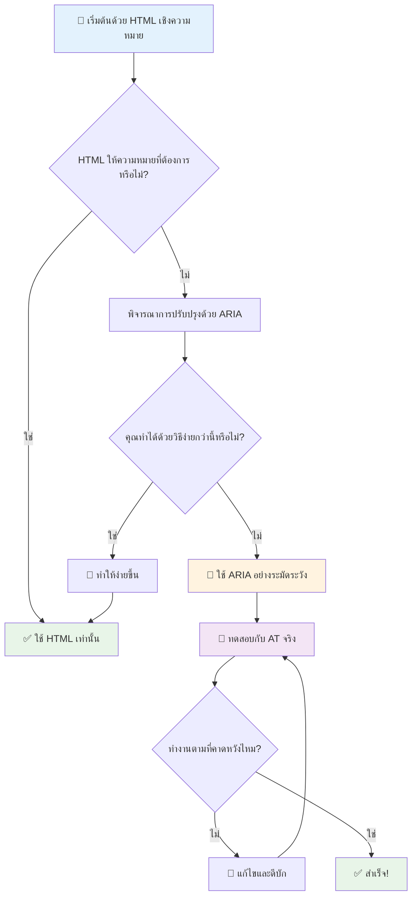
1. **HTML เชิงความหมายก่อน**: เลือกใช้ `<button>` แทน `<div role="button">` เสมอ
2. **อย่าทำลายความหมาย HTML**: อย่าลบล้างความหมายของ HTML ที่มีอยู่ (หลีกเลี่ยง `<h1 role="button">`)
3. **รักษาการเข้าถึงด้วยคีย์บอร์ด**: องค์ประกอบ ARIA เชิงโต้ตอบทุกตัวต้องเข้าถึงด้วยคีย์บอร์ดได้เต็มที่
4. **ทดสอบกับผู้ใช้จริง**: การสนับสนุน ARIA แตกต่างกันมากในแต่ละเทคโนโลยีช่วยเหลือ
5. **เริ่มต้นอย่างง่าย**: การใช้ ARIA ที่ซับซ้อนมักมีโอกาสเกิดข้อผิดพลาดมากกว่า

**🔍 ขั้นตอนการทดสอบ:**

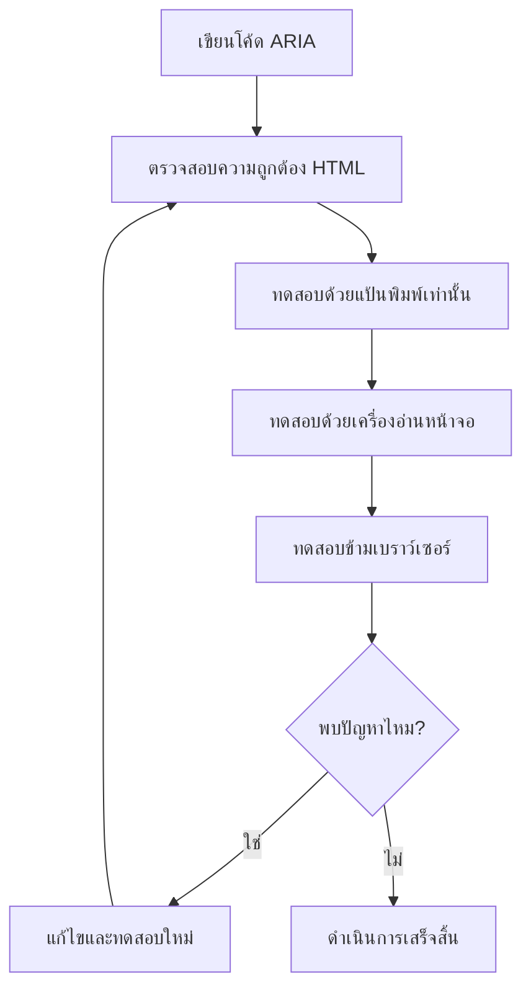
**🚫 ข้อผิดพลาด ARIA ที่ควรหลีกเลี่ยง:**

- **ข้อมูลขัดแย้งกัน**: อย่าขัดแย้งกับความหมายของ HTML
- **ป้ายกำกับมากเกินไป**: ข้อมูล ARIA มากเกินไปทำให้ผู้ใช้สับสน
- **ARIA แบบคงที่**: ลืมอัปเดตสถานะ ARIA เมื่อเนื้อหาเปลี่ยน
- **การใช้งานที่ไม่ได้ทดสอบ**: ARIA ที่ดูเหมือนใช้ได้แต่ล้มเหลวในทางปฏิบัติ
- **ขาดการสนับสนุนคีย์บอร์ด**: บทบาท ARIA ที่ไม่มีการโต้ตอบกับคีย์บอร์ด

> 💡 **แหล่งข้อมูลสำหรับการทดสอบ**: ใช้เครื่องมือเช่น [accessibility-checker](https://www.npmjs.com/package/accessibility-checker) สำหรับการตรวจสอบ ARIA อัตโนมัติ แต่ควรทดสอบกับโปรแกรมอ่านหน้าจอจริงเพื่อประสบการณ์ที่ครบถ้วน

### 🎭 **ตรวจสอบทักษะ ARIA: พร้อมสำหรับโต้ตอบซับซ้อนหรือยัง?**

**ประเมินความมั่นใจของคุณกับ ARIA:**
- คุณจะเลือกใช้ ARIA แทน HTML เชิงความหมายเมื่อไหร่? (แอบบอก: แทบจะไม่เคย!)
- คุณอธิบายได้ไหมว่าทำไม `<div role="button">` มักแย่กว่าการใช้ `<button>`?
- สิ่งสำคัญที่สุดที่ควรจำเกี่ยวกับการทดสอบ ARIA คืออะไร?

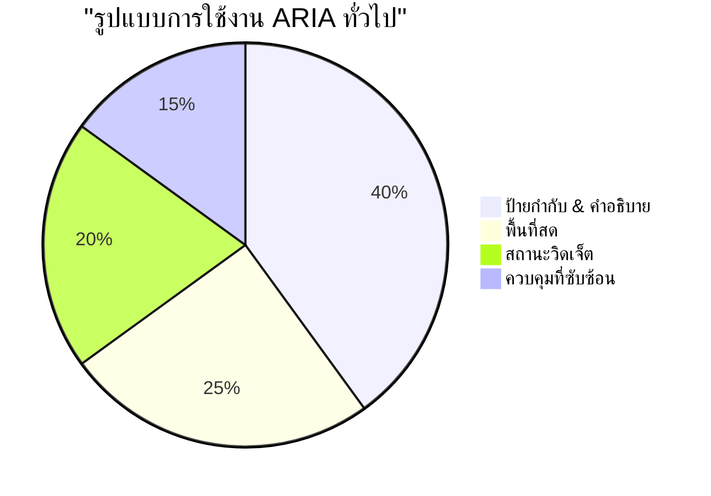
> **ข้อมูลสำคัญ**: การใช้งาน ARIA ส่วนใหญ่เพื่อการตั้งชื่อและอธิบายองค์ประกอบ รูปแบบวิดเจ็ตที่ซับซ้อนพบได้น้อยกว่าที่คุณคิด!

✅ **เรียนรู้จากผู้เชี่ยวชาญ**: ศึกษา [ARIA Authoring Practices Guide](https://w3c.github.io/aria-practices/) สำหรับรูปแบบและการใช้งานวิดเจ็ตเชิงโต้ตอบที่ผ่านการพิสูจน์

## การทำภาพและสื่อเข้าถึงได้

เนื้อหาทางภาพและเสียงเป็นส่วนสำคัญของประสบการณ์เว็บสมัยใหม่ แต่สามารถสร้างอุปสรรคได้หากไม่วางแผนอย่างรอบคอบ เป้าหมายคือการรับประกันว่า ข้อมูลและอารมณ์จากสื่อของคุณเข้าถึงผู้ใช้ทุกคน เมื่อคุณชำนาญแล้ว มันจะกลายเป็นเรื่องธรรมชาติ

สื่อประเภทต่าง ๆ ต้องการแนวทางการเข้าถึงที่แตกต่างกัน มันเหมือนกับการทำอาหาร—คุณคงไม่ปฏิบัติกับปลาที่อ่อนโยนเหมือนกับสเต็กชิ้นใหญ่ การเข้าใจความแตกต่างช่วยให้คุณเลือกวิธีแก้ปัญหาที่เหมาะสมในแต่ละสถานการณ์

### ยุทธศาสตร์การเข้าถึงภาพ

ภาพแต่ละภาพในเว็บไซต์ของคุณมีจุดประสงค์ การเข้าใจจุดประสงค์นี้ช่วยให้คุณเขียนข้อความทางเลือก (alt text) ได้ดีขึ้นและสร้างประสบการณ์ที่ครอบคลุมมากขึ้น

**สี่ประเภทของภาพและกลยุทธ์ข้อความทางเลือก:**

**ภาพให้ข้อมูล** - ถ่ายทอดข้อมูลสำคัญ:
```html

```

**ภาพตกแต่ง** - แค่ภาพที่มีคุณค่าแค่ในเชิงมองเห็น ไม่มีข้อมูล:
```html

```

**ภาพเชิงฟังก์ชัน** - ทำหน้าที่เป็นปุ่มหรือควบคุม:
```html
<button>
  
</button>
```

**ภาพซับซ้อน** - แผนภูมิ, แผนภาพ, อินโฟกราฟิก:
```html

<div id="chart-description">
  <p>Detailed description: Sales data shows a steady increase across all quarters...</p>
</div>
```

### การเข้าถึงวิดีโอและเสียง

**ข้อกำหนดสำหรับวิดีโอ:**
- **ซับไตเติ้ล**: ข้อความสำหรับเนื้อหาที่พูดและเสียงประกอบ
- **คำบรรยายเสียง**: บรรยายภาพสำหรับผู้พิการทางสายตา
- **ถอดเสียง**: ข้อความเต็มของเนื้อหาเสียงและภาพทั้งหมด

```html
<video controls>
  <source src="video.mp4" type="video/mp4">
  <track kind="captions" src="captions.vtt" srclang="en" label="English">
  <track kind="descriptions" src="descriptions.vtt" srclang="en" label="Audio descriptions">
</video>
```

**ข้อกำหนดสำหรับเสียง:**
- **ถอดเสียง**: ข้อความของเนื้อหาที่พูดทั้งหมด
- **ตัวชี้วัดเชิงภาพ**: สำหรับเนื้อหาเสียงเท่านั้น ให้สัญญาณเชิงภาพ

### เทคนิคภาพสมัยใหม่

**ใช้ CSS สำหรับภาพตกแต่ง:**
```css
.hero-section {
  background-image: url('decorative-hero.jpg');
  /* Decorative images in CSS don't need alt text */
}
```

**ภาพตอบสนองที่เข้าถึงได้:**
```html
<picture>
  <source media="(min-width: 800px)" srcset="large-chart.png">
  <source media="(min-width: 400px)" srcset="medium-chart.png">
  
</picture>
```

✅ **ทดสอบการเข้าถึงภาพ**: ใช้โปรแกรมอ่านหน้าจอเพื่อสำรวจหน้าเว็บที่มีภาพ คุณได้รับข้อมูลเพียงพอที่จะเข้าใจเนื้อหาหรือไม่?

## การนำทางด้วยคีย์บอร์ดและการจัดการโฟกัส

ผู้ใช้จำนวนมากนำทางเว็บด้วยคีย์บอร์ดเท่านั้น ซึ่งรวมถึงผู้ที่มีความบกพร่องทางการเคลื่อนไหว, ผู้ใช้ที่เชี่ยวชาญที่พบว่าคีย์บอร์ดเร็วกว่าการใช้เมาส์ และผู้ที่เมาส์หยุดทำงาน การทำให้ไซต์ของคุณใช้งานกับคีย์บอร์ดได้ดีจึงเป็นสิ่งสำคัญ และมักทำให้ไซต์ของคุณมีประสิทธิภาพสำหรับทุกคนมากขึ้น

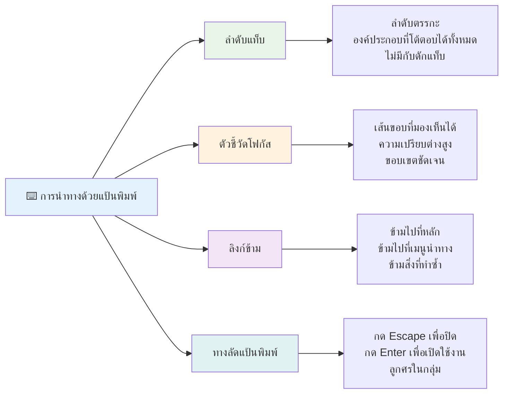
### รูปแบบการนำทางด้วยคีย์บอร์ดที่จำเป็น

**การโต้ตอบคีย์บอร์ดมาตรฐาน:**
- **Tab**: เลื่อนโฟกัสไปข้างหน้าผ่านองค์ประกอบโต้ตอบ
- **Shift + Tab**: เลื่อนโฟกัสถอยหลัง
- **Enter**: เปิดใช้งานปุ่มและลิงก์
- **Space**: เปิดใช้งานปุ่ม, ทำเครื่องหมายกล่องเลือก
- **ปุ่มลูกศร**: นำทางภายในกลุ่มคอมโพเนนต์ (ปุ่มวิทยุ, เมนู)
- **Escape**: ปิดโมดอล, เมนูดรอปดาวน์, หรือยกเลิกการทำงาน

### แนวปฏิบัติที่ดีที่สุดในการจัดการโฟกัส

**ตัวชี้วัดโฟกัสที่มองเห็นได้:**
```css
/* Ensure focus is always visible */
button:focus-visible {
  outline: 2px solid #4A90A4;
  outline-offset: 2px;
}

/* Custom focus styles for different components */
.card:focus-within {
  box-shadow: 0 0 0 3px rgba(74, 144, 164, 0.5);
}
```

**ลิงก์ข้ามสำหรับนำทางเร็ว:**
```html
<a href="#main-content" class="skip-link">Skip to main content</a>
<a href="#navigation" class="skip-link">Skip to navigation</a>

<nav id="navigation">
  <!-- navigation content -->
</nav>
<main id="main-content">
  <!-- main content -->
</main>
```

**ลำดับแท็บที่เหมาะสม:**
```html
<!-- Use semantic HTML for natural tab order -->
<form>
  <label for="name">Name:</label>
  <input type="text" id="name" tabindex="0">
  
  <label for="email">Email:</label>
  <input type="email" id="email" tabindex="0">
  
  <button type="submit" tabindex="0">Submit</button>
</form>
```

### การกักโฟกัสในโมดอล

เมื่อเปิดโต้ตอบโมดอล, โฟกัสควรถูกกักไว้ภายในโมดอล:

```javascript
// การใช้งานกับดักโฟกัสแบบทันสมัย
function trapFocus(element) {
  const focusableElements = element.querySelectorAll(
    'button, [href], input, select, textarea, [tabindex]:not([tabindex="-1"])'
  );
  
  const firstElement = focusableElements[0];
  const lastElement = focusableElements[focusableElements.length - 1];

  element.addEventListener('keydown', (e) => {
    if (e.key === 'Tab') {
      if (e.shiftKey && document.activeElement === firstElement) {
        e.preventDefault();
        lastElement.focus();
      } else if (!e.shiftKey && document.activeElement === lastElement) {
        e.preventDefault();
        firstElement.focus();
      }
    }
    
    if (e.key === 'Escape') {
      closeModal();
    }
  });
  
  // โฟกัสที่องค์ประกอบแรกเมื่อโมดัลเปิดขึ้น
  firstElement.focus();
}
```

✅ **ทดสอบการนำทางด้วยคีย์บอร์ด**: ลองนำทางเว็บไซต์ของคุณด้วยปุ่ม Tab เท่านั้น คุณเข้าถึงองค์ประกอบเชิงโต้ตอบทั้งหมดได้หรือไม่? ลำดับโฟกัสสมเหตุสมผลไหม? ตัวชี้วัดโฟกัสมองเห็นชัดเจนไหม?

## การเข้าถึงแบบฟอร์ม

แบบฟอร์มเป็นสิ่งจำเป็นสำหรับการโต้ตอบของผู้ใช้และต้องการการใส่ใจเป็นพิเศษในเรื่องการเข้าถึง

### การเชื่อมโยงป้ายกำกับและคอนโทรลแบบฟอร์ม

**ทุกคอนโทรลแบบฟอร์มต้องมีป้ายกำกับ:**
```html
<!-- Explicit labeling (preferred) -->
<label for="username">Username:</label>
<input type="text" id="username" name="username" required>

<!-- Implicit labeling -->
<label>
  Password:
  <input type="password" name="password" required>
</label>

<!-- Using aria-label when visual label isn't desired -->
<input type="search" aria-label="Search products" placeholder="Search...">
```

### การจัดการข้อผิดพลาดและการตรวจสอบ

**ข้อความแสดงข้อผิดพลาดที่เข้าถึงได้:**
```html
<label for="email">Email Address:</label>
<input type="email" id="email" name="email" 
       aria-describedby="email-error" 
       aria-invalid="true" required>
<div id="email-error" role="alert">
  Please enter a valid email address
</div>
```

**แนวปฏิบัติที่ดีที่สุดสำหรับการตรวจสอบแบบฟอร์ม:**
- ใช้ `aria-invalid` เพื่อระบุฟิลด์ที่ไม่ถูกต้อง
- ให้ข้อความแสดงข้อผิดพลาดที่ชัดเจนและเฉพาะเจาะจง
- ใช้ `role="alert"` สำหรับประกาศข้อผิดพลาดสำคัญ
- แสดงข้อผิดพลาดทันทีและเมื่อส่งแบบฟอร์ม

### Fieldsets และการจัดกลุ่ม

**จัดกลุ่มคอนโทรลแบบฟอร์มที่เกี่ยวข้อง:**
```html
<fieldset>
  <legend>Shipping Address</legend>
  <label for="street">Street Address:</label>
  <input type="text" id="street" name="street">
  
  <label for="city">City:</label>
  <input type="text" id="city" name="city">
</fieldset>

<fieldset>
  <legend>Preferred Contact Method</legend>
  <input type="radio" id="contact-email" name="contact" value="email">
  <label for="contact-email">Email</label>
  
  <input type="radio" id="contact-phone" name="contact" value="phone">
  <label for="contact-phone">Phone</label>
</fieldset>
```

## การเดินทางสู่การเข้าถึงของคุณ: ประเด็นสำคัญ

ยินดีด้วย! คุณได้รับความรู้พื้นฐานเพื่อสร้างประสบการณ์เว็บที่ครอบคลุมอย่างแท้จริง นี่คือเรื่องที่น่าตื่นเต้น! การเข้าถึงเว็บไม่ใช่แค่การตรวจสอบข้อบังคับ แต่มันคือการยอมรับวิธีที่หลากหลายที่ผู้คนโต้ตอบกับเนื้อหาดิจิทัลและออกแบบเพื่อความซับซ้อนอันน่าทึ่งนั้น

ตอนนี้คุณเป็นส่วนหนึ่งของชุมชนนักพัฒนาที่เข้าใจว่าการออกแบบที่ดีต้องทำงานได้สำหรับทุกคน ยินดีต้อนรับสู่คลับ!

**🎯 ชุดเครื่องมือการเข้าถึงของคุณตอนนี้ประกอบด้วย:**

| หลักการสำคัญ | การใช้งาน | ผลกระทบ |
|----------------|----------------|---------|
| **พื้นฐาน HTML เชิงความหมาย** | ใช้องค์ประกอบ HTML ที่เหมาะสมตามจุดประสงค์ | โปรแกรมอ่านหน้าจอสามารถนำทางได้อย่างมีประสิทธิภาพ, คีย์บอร์ดทำงานโดยอัตโนมัติ |
| **การออกแบบภาพที่ครอบคลุม** | คอนทราสต์เพียงพอ, การใช้สีที่มีความหมาย, ตัวชี้วัดโฟกัสที่มองเห็นได้ | ชัดเจนสำหรับทุกคนในสภาพแสงทุกแบบ |
| **เนื้อหาที่ให้รายละเอียด** | ข้อความลิงก์ที่มีความหมาย, ข้อความทางเลือก (alt), หัวข้อ | ผู้ใช้เข้าใจเนื้อหาโดยไม่ต้องมองเห็น |
| **การเข้าถึงด้วยคีย์บอร์ด** | ลำดับแท็บ, ทางลัดคีย์บอร์ด, การจัดการโฟกัส | การเข้าถึงสำหรับผู้มีปัญหาการเคลื่อนไหวและประสิทธิภาพสำหรับผู้ใช้ที่เชี่ยวชาญ |
| **การเสริม ARIA** | ใช้อย่างมีกลยุทธ์เพื่อเติมช่องว่างความหมาย | แอปพลิเคชันซับซ้อนทำงานร่วมกับเทคโนโลยีช่วยเหลือ |
| **การทดสอบครบถ้วน** | เครื่องมืออัตโนมัติ + การตรวจสอบด้วยมือ + การทดสอบกับผู้ใช้จริง | พบปัญหาก่อนที่จะส่งผลกระทบต่อผู้ใช้ |

**🚀 ขั้นตอนถัดไปของคุณ:**

1. **บูรณาการการเข้าถึงเข้าสู่ขั้นตอนการทำงานของคุณ**: ทำให้การทดสอบเป็นส่วนหนึ่งของกระบวนการพัฒนา
2. **เรียนรู้จากผู้ใช้จริง**: ขอคำติชมจากคนที่ใช้เทคโนโลยีช่วยเหลือ
3. **ติดตามเทคโนโลยีล่าสุด**: เทคนิคการเข้าถึงปรับตัวตามเทคโนโลยีและมาตรฐานใหม่
4. **สนับสนุนความครอบคลุม**: แบ่งปันความรู้และทำให้การเข้าถึงเป็นสิ่งสำคัญของทีม

> 💡 **จงจำไว้**: ข้อจำกัดด้านการเข้าถึงมักนำไปสู่แนวทางแก้ปัญหาที่สร้างสรรค์และสง่างาม ราวกับทางลาด, ซับไตเติ้ล, และการควบคุมด้วยเสียงเริ่มจากฟีเจอร์เข้าถึงแล้วกลายเป็นการปรับปรุงที่ใช้กันทั่ว

**กรณีธุรกิจชัดเจน**: เว็บไซต์ที่เข้าถึงได้ทำให้ผู้ใช้มากขึ้น, ติดอันดับดีขึ้นในเครื่องมือค้นหา, มีต้นทุนการบำรุงรักษาต่ำลง, และหลีกเลี่ยงความเสี่ยงทางกฎหมาย แต่จริง ๆ แล้ว? เหตุผลที่แท้จริงของการใส่ใจเรื่องการเข้าถึงลึกซึ้งกว่า เว็บไซต์ที่เข้าถึงได้เป็นตัวแทนคุณค่าที่ดีที่สุดของเว็บ — ความเปิดกว้าง, ความครอบคลุม, และแนวคิดที่ว่าทุกคนควรได้รับการเข้าถึงข้อมูลอย่างเท่าเทียม

ตอนนี้คุณพร้อมที่จะสร้างเว็บที่ครอบคลุมสำหรับอนาคต ทุกไซต์ที่เข้าถึงได้ที่คุณสร้างทำให้อินเทอร์เน็ตเป็นสถานที่ที่อบอุ่นสำหรับทุกคน นั่นน่าทึ่งมากเมื่อคุณคิดดู!

## แหล่งข้อมูลเพิ่มเติม

ดำเนินการเรียนรู้การเข้าถึงของคุณต่อด้วยแหล่งข้อมูลสำคัญเหล่านี้:

**📚 มาตรฐานและแนวทางอย่างเป็นทางการ:**
- [คำแนะนำ WCAG 2.1](https://www.w3.org/WAI/WCAG21/quickref/) - มาตรฐานการเข้าถึงอย่างเป็นทางการพร้อมอ้างอิงด่วน
- [ARIA Authoring Practices Guide](https://w3c.github.io/aria-practices/) - รูปแบบเต็มรูปแบบสำหรับวิดเจ็ตเชิงโต้ตอบ
- [แนวทาง WebAIM](https://webaim.org/) - คำแนะนำการเข้าถึงที่เป็นประโยชน์และเหมาะสำหรับผู้เริ่มต้น

**🛠️ เครื่องมือและแหล่งทดสอบ:**
- [axe DevTools](https://www.deque.com/axe/devtools/) - การทดสอบการเข้าถึงมาตรฐานอุตสาหกรรม
- [A11y Project Checklist](https://www.a11yproject.com/checklist/) - รายการตรวจสอบการเข้าถึงทีละขั้นตอน
- [Accessibility Insights](https://accessibilityinsights.io/) - ชุดทดสอบครบวงจรจาก Microsoft
- [Color Oracle](https://colororacle.org/) - โปรแกรมจำลองการบอดสีสำหรับทดสอบการออกแบบ

**🎓 การเรียนรู้และชุมชน:**
- [การสำรวจโปรแกรมอ่านหน้าจอ WebAIM](https://webaim.org/projects/screenreadersurvey9/) - ความชอบและพฤติกรรมผู้ใช้จริง
- [Inclusive Components](https://inclusive-components.design/) - รูปแบบคอมโพเนนต์เข้าถึงได้สมัยใหม่
- [A11y Coffee](https://a11y.coffee/) - เคล็ดลับและข้อมูลการเข้าถึงที่รวดเร็ว
- [โครงการความเข้าถึงเว็บ (WAI)](https://www.w3.org/WAI/) - แหล่งข้อมูลการเข้าถึงของ W3C

**🎥 การเรียนรู้เชิงปฏิบัติ:**
- [Accessibility Developer Guide](https://www.accessibility-developer-guide.com/) - คำแนะนำการใช้งานจริง
- [Deque University](https://dequeuniversity.com/) - คอร์สฝึกอบรมการเข้าถึงระดับมืออาชีพ

## ความท้าทาย GitHub Copilot Agent 🚀

ใช้โหมด Agent เพื่อทำความท้าทายต่อไปนี้ให้สำเร็จ:

**คำอธิบาย:** สร้างส่วนประกอบโต้ตอบโมดอลที่เข้าถึงได้ซึ่งแสดงการจัดการโฟกัสที่ถูกต้อง, คุณลักษณะ ARIA, และรูปแบบการนำทางด้วยคีย์บอร์ด

**คำสั่ง:** สร้างส่วนประกอบโต้ตอบโมดอลครบถ้วนด้วย HTML, CSS, และ JavaScript ที่รวมถึง: การกักโฟกัสอย่างเหมาะสม, ปิดด้วยปุ่ม ESC, ปิดเมื่อคลิกล้างนอกโมดอล, คุณลักษณะ ARIA สำหรับโปรแกรมอ่านหน้าจอ และตัวชี้วัดโฟกัสที่มองเห็นได้ โมดอลควรมีแบบฟอร์มที่มีป้ายกำกับและการจัดการข้อผิดพลาดอย่างถูกต้อง รับรองว่าส่วนประกอบเป็นไปตามมาตรฐาน WCAG 2.1 AA

## 🚀 ความท้าทาย

นำ HTML นี้มาเขียนใหม่ให้เข้าถึงได้มากที่สุดเท่าที่จะเป็นไปได้ โดยใช้กลยุทธ์ที่คุณได้เรียนรู้:

```html
<!DOCTYPE html>
<html lang="en">
  <head>
    <meta charset="UTF-8">
    <meta name="viewport" content="width=device-width, initial-scale=1.0">
    <title>Turtle Ipsum - The World's Premier Turtle Fan Club</title>
    <link href='../assets/style.css' rel='stylesheet' type='text/css'>
  </head>
  <body>
    <header class="site-header">
      <h1 class="site-title">Turtle Ipsum</h1>
      <p class="site-subtitle">The World's Premier Turtle Fan Club</p>
    </header>
    
    <nav class="main-nav" aria-label="Main navigation">
      <h2 class="nav-header">Resources</h2>
      <ul class="nav-list">
        <li><a href="https://www.youtube.com/watch?v=CMNry4PE93Y">"I like turtles" video</a></li>
        <li><a href="https://en.wikipedia.org/wiki/Turtle">Basic turtle information</a></li>
        <li><a href="https://en.wikipedia.org/wiki/Turtles_(chocolate)">Chocolate turtles candy</a></li>
      </ul>
    </nav>
    
    <main class="main-content">
      <article>
        <h1>Welcome to Turtle Ipsum</h1>
        <p class="intro">
          <a href="/about">Learn more about our turtle community</a> and discover fascinating facts about these amazing creatures.
        </p>
        <p class="article-text">
          Turtle ipsum dolor sit amet, consectetur adipiscing elit, sed do eiusmod tempor incididunt ut labore et dolore magna aliqua. Ut enim ad minim veniam, quis nostrud exercitation ullamco laboris nisi ut aliquip ex ea commodo consequat. Duis aute irure dolor in reprehenderit in voluptate velit esse cillum dolore eu fugiat nulla pariatur. Excepteur sint occaecat cupidatat non proident, sunt in culpa qui officia deserunt mollit anim id est laborum.
        </p>
      </article>
    </main>
    
    <footer class="footer">
      <section class="newsletter-signup">
        <h2>Stay Updated</h2>
        <button type="button" onclick="showNewsletterForm()">Sign up for turtle news</button>
      </section>
      
      <nav class="footer-nav" aria-label="Footer navigation">
        <h2>Site Pages</h2>
        <ul>
          <li><a href="../">Home</a></li>
          <li><a href="../semantic">Semantic HTML example</a></li>
        </ul>
      </nav>
      
      <p class="footer-copyright">&copy; 2024 Instrument. All rights reserved.</p>
    </footer>
  </body>
</html>
```

**การปรับปรุงหลักที่ทำ:**
- เพิ่มโครงสร้าง HTML เชิงความหมายที่ถูกต้อง
- แก้ลำดับหัวเรื่อง (หัวเรื่องหลัก h1 เดียว, การจัดลำดับอย่างมีตรรกะ)
- ใช้ข้อความลิงก์ที่มีความหมายแทน "คลิกที่นี่"
- รวมป้ายกำกับ ARIA ที่เหมาะสมสำหรับการนำทาง
- เพิ่มแอตทริบิวต์ lang และแท็ก meta ที่ถูกต้อง
- ใช้องค์ประกอบ button สำหรับองค์ประกอบเชิงโต้ตอบ
- จัดโครงสร้างเนื้อหา footer ด้วย landmarks ที่เหมาะสม

## แบบทดสอบหลังเรียน
[แบบทดสอบหลังเรียน](https://ff-quizzes.netlify.app/web/en/)

## ทบทวนและศึกษาด้วยตนเอง

รัฐบาลหลายแห่งมีกฎหมายเกี่ยวกับข้อกำหนดการเข้าถึง อ่านกฎหมายการเข้าถึงของประเทศบ้านเกิดคุณ ครอบคลุมอะไรบ้าง และไม่ครอบคลุมอะไร? ตัวอย่างเช่น [เว็บไซต์รัฐบาลนี้](https://accessibility.blog.gov.uk/)

## แบบฝึกหัด

[วิเคราะห์เว็บไซต์ที่ไม่สามารถเข้าถึงได้](assignment.md)

เครดิต: [Turtle Ipsum](https://github.com/Instrument/semantic-html-sample) โดย Instrument

---

## 🚀 ไทม์ไลน์ความชำนาญด้านการเข้าถึงของคุณ

### ⚡ **สิ่งที่คุณทำได้ใน 5 นาทีหน้า**
- [ ] ติดตั้งส่วนขยาย axe DevTools ในเบราว์เซอร์ของคุณ
- [ ] รันการตรวจสอบการเข้าถึงด้วย Lighthouse ในเว็บไซต์โปรดของคุณ
- [ ] ลองนำทางเว็บไซต์ใดก็ได้โดยใช้เพียงปุ่ม Tab
- [ ] ทดสอบโปรแกรมอ่านหน้าจอในตัวของเบราว์เซอร์คุณ (Narrator/VoiceOver)

### 🎯 **สิ่งที่คุณทำได้ในชั่วโมงนี้**
- [ ] ทำแบบทดสอบหลังบทเรียนและสะท้อนความเข้าใจในการเข้าถึง
- [ ] ฝึกเขียนข้อความทางเลือกที่มีความหมายสำหรับภาพ 10 ภาพ
- [ ] ตรวจสอบโครงสร้างหัวเรื่องของเว็บไซต์ด้วยส่วนขยาย HeadingsMap
- [ ] แก้ไขปัญหาการเข้าถึงที่พบใน HTML ของความท้าทาย
- [ ] ทดสอบคอนทราสต์สีในโปรเจกต์ปัจจุบันของคุณด้วยเครื่องมือของ WebAIM

### 📅 **การเดินทางการเข้าถึงตลอดสัปดาห์ของคุณ**
- [ ] ทำแบบฝึกหัดวิเคราะห์เว็บไซต์ที่ไม่สามารถเข้าถึงได้ให้เสร็จสิ้น
- [ ] ตั้งค่าสภาพแวดล้อมพัฒนาโดยใช้เครื่องมือทดสอบการเข้าถึง
- [ ] ฝึกการนำทางบนแป้นพิมพ์ในเว็บไซต์ที่ซับซ้อน 5 แห่งที่แตกต่างกัน
- [ ] สร้างฟอร์มง่ายๆ พร้อมป้ายกำกับที่เหมาะสม การจัดการข้อผิดพลาด และ ARIA
- [ ] เข้าร่วมชุมชนด้านการเข้าถึง (A11y Slack, ฟอรัม WebAIM)
- [ ] ดูผู้ใช้จริงที่มีความบกพร่องใช้เว็บไซต์ (YouTube มีตัวอย่างดีๆ มากมาย)

### 🌟 **การเปลี่ยนแปลงตลอดทั้งเดือนของคุณ**
- [ ] รวมการทดสอบการเข้าถึงเข้าไว้ในกระบวนการพัฒนาของคุณ
- [ ] มีส่วนร่วมในโครงการโอเพ่นซอร์สโดยการแก้ไขปัญหาการเข้าถึง
- [ ] ทำการทดสอบความใช้งานง่ายกับผู้ที่ใช้เทคโนโลยีช่วยเหลือ
- [ ] สร้างไลบรารีคอมโพเนนต์ที่เข้าถึงได้สำหรับทีมของคุณ
- [ ] สนับสนุนเรื่องการเข้าถึงในที่ทำงานหรือชุมชนของคุณ
- [ ] ให้คำปรึกษากับผู้ที่เพิ่งเริ่มเรียนรู้แนวคิดการเข้าถึง

### 🏆 **การตรวจสอบแชมป์เปี้ยนด้านการเข้าถึงขั้นสุดท้าย**

**เฉลิมฉลองการเดินทางของคุณด้านการเข้าถึง:**
- มีอะไรที่ทำให้คุณประหลาดใจที่สุดที่ได้เรียนรู้เกี่ยวกับวิธีการที่ผู้คนใช้เว็บ?
- หลักการเข้าถึงข้อใดที่สอดคล้องกับสไตล์การพัฒนาของคุณมากที่สุด?
- การเรียนรู้เรื่องการเข้าถึงมีผลต่อมุมมองของคุณเกี่ยวกับการออกแบบอย่างไร?
- การปรับปรุงการเข้าถึงชิ้นแรกที่คุณอยากทำในโครงการจริงคืออะไร?

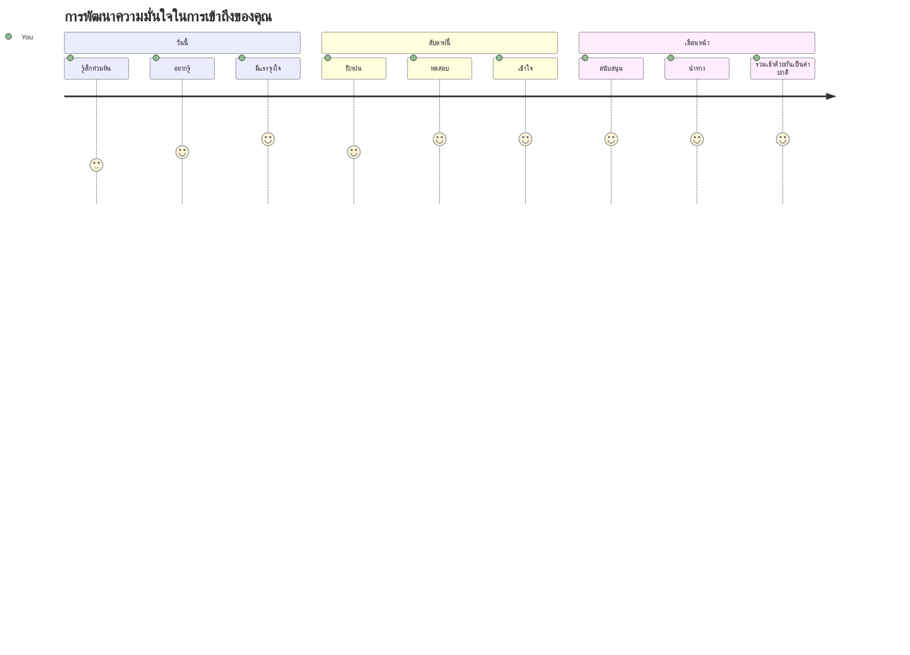
> 🌍 **คุณคือแชมป์เปี้ยนด้านการเข้าถึงแล้ว!** คุณเข้าใจว่าประสบการณ์เว็บที่ดีนั้นใช้งานได้สำหรับทุกคน ไม่ว่าพวกเขาจะเข้าถึงเว็บอย่างไร ฟีเจอร์ที่สามารถเข้าถึงได้ทุกชิ้นที่คุณสร้างทำให้อินเทอร์เน็ตเป็นพื้นที่ที่ครอบคลุมยิ่งขึ้น เว็บต้องการนักพัฒนาที่เหมือนคุณซึ่งมองว่าการเข้าถึงไม่ได้เป็นข้อจำกัด แต่เป็นโอกาสในการสร้างประสบการณ์ที่ดียิ่งขึ้นสำหรับผู้ใช้ทุกคน ยินดีต้อนรับสู่การเคลื่อนไหว! 🎉

---

<!-- CO-OP TRANSLATOR DISCLAIMER START -->
**ข้อจำกัดความรับผิดชอบ**:  
เอกสารฉบับนี้ได้รับการแปลโดยใช้บริการแปลภาษาด้วย AI [Co-op Translator](https://github.com/Azure/co-op-translator) แม้เราจะพยายามให้เกิดความถูกต้อง โปรดทราบว่าการแปลอัตโนมัติอาจมีข้อผิดพลาดหรือความไม่แม่นยำ เอกสารต้นฉบับในภาษาต้นฉบับถือเป็นแหล่งข้อมูลที่มีอำนาจสูงสุด สำหรับข้อมูลที่มีความสำคัญ ขอแนะนำให้ใช้บริการแปลโดยผู้เชี่ยวชาญมนุษย์เป็นหลัก เราจะไม่รับผิดชอบต่อความเข้าใจผิดหรือการตีความที่ผิดพลาดที่เกิดขึ้นจากการใช้การแปลนี้
<!-- CO-OP TRANSLATOR DISCLAIMER END -->