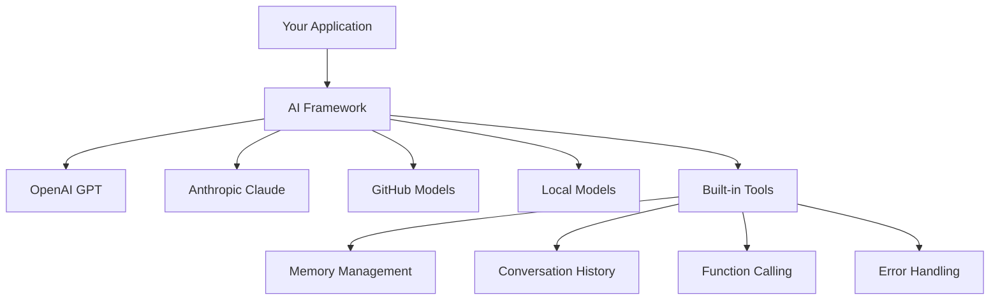
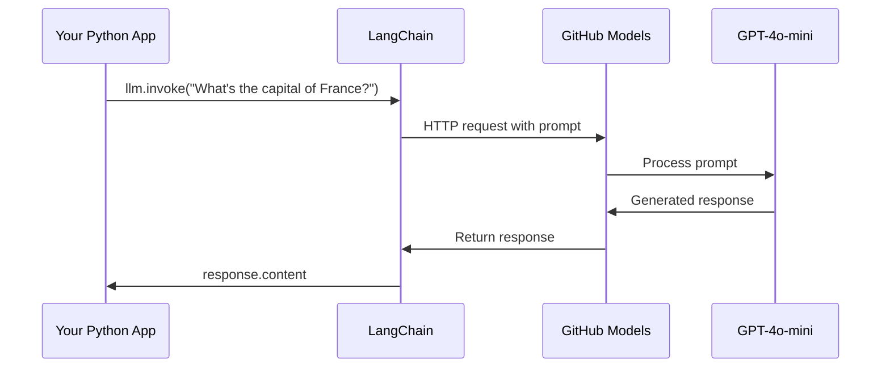
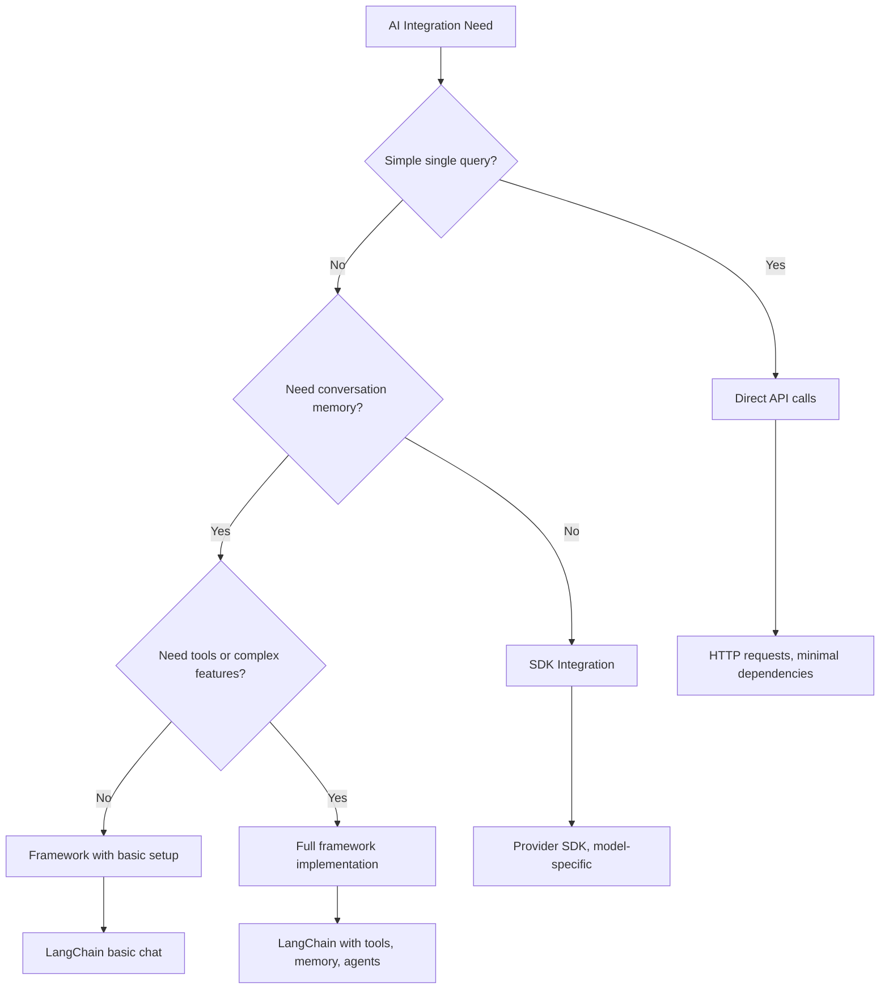

<!--
CO_OP_TRANSLATOR_METADATA:
{
  "original_hash": "e2c4ae5688e34b4b8b09d52aec56c79e",
  "translation_date": "2025-10-23T20:57:05+00:00",
  "source_file": "10-ai-framework-project/README.md",
  "language_code": "th"
}
-->
# เฟรมเวิร์ก AI

เคยรู้สึกหนักใจเมื่อต้องสร้างแอปพลิเคชัน AI ตั้งแต่เริ่มต้นไหม? คุณไม่ได้อยู่คนเดียว! เฟรมเวิร์ก AI เปรียบเสมือนมีมีดสารพัดประโยชน์สำหรับการพัฒนา AI - เป็นเครื่องมือที่ทรงพลังที่ช่วยประหยัดเวลาและลดความยุ่งยากเมื่อสร้างแอปพลิเคชันอัจฉริยะ ลองนึกถึงเฟรมเวิร์ก AI เหมือนห้องสมุดที่จัดระเบียบอย่างดี: มันมีส่วนประกอบที่สร้างไว้ล่วงหน้า API ที่เป็นมาตรฐาน และการจัดการที่ชาญฉลาด เพื่อให้คุณสามารถมุ่งเน้นไปที่การแก้ปัญหาแทนที่จะต้องวุ่นวายกับรายละเอียดการใช้งาน

ในบทเรียนนี้ เราจะสำรวจว่าเฟรมเวิร์กอย่าง LangChain สามารถเปลี่ยนงานที่เคยซับซ้อนในการรวม AI ให้กลายเป็นโค้ดที่สะอาดและอ่านง่ายได้อย่างไร คุณจะได้เรียนรู้วิธีจัดการกับความท้าทายในโลกจริง เช่น การติดตามการสนทนา การเรียกใช้เครื่องมือ และการจัดการโมเดล AI ต่างๆ ผ่านอินเทอร์เฟซที่รวมเป็นหนึ่งเดียว

เมื่อจบบทเรียนนี้ คุณจะรู้ว่าเมื่อไหร่ควรใช้เฟรมเวิร์กแทนการเรียก API โดยตรง วิธีใช้การจัดการของเฟรมเวิร์กอย่างมีประสิทธิภาพ และวิธีสร้างแอปพลิเคชัน AI ที่พร้อมใช้งานในโลกจริง มาเริ่มสำรวจว่าเฟรมเวิร์ก AI สามารถทำอะไรให้กับโปรเจกต์ของคุณได้บ้าง

## ทำไมต้องเลือกใช้เฟรมเวิร์ก?

คุณพร้อมที่จะสร้างแอป AI แล้ว - เยี่ยมไปเลย! แต่มีหลายเส้นทางที่คุณสามารถเลือกเดินได้ และแต่ละเส้นทางก็มีข้อดีและข้อเสียของตัวเอง มันเหมือนกับการเลือกว่าจะเดิน ขี่จักรยาน หรือขับรถไปยังที่หมาย - ทุกวิธีสามารถพาคุณไปถึงจุดหมายได้ แต่ประสบการณ์ (และความพยายาม) จะต่างกันออกไป

มาดูวิธีหลักๆ สามวิธีที่คุณสามารถรวม AI เข้ากับโปรเจกต์ของคุณ:

| วิธีการ | ข้อดี | เหมาะสำหรับ | สิ่งที่ต้องพิจารณา |
|---------|-------|--------------|--------------------|
| **การเรียก HTTP โดยตรง** | ควบคุมได้เต็มที่ ไม่มีการพึ่งพา | คำถามง่ายๆ การเรียนรู้พื้นฐาน | โค้ดที่ยาวขึ้น การจัดการข้อผิดพลาดด้วยตัวเอง |
| **การรวม SDK** | ลดโค้ดที่ซ้ำซ้อน ปรับแต่งเฉพาะโมเดล | แอปพลิเคชันที่ใช้โมเดลเดียว | จำกัดเฉพาะผู้ให้บริการที่ระบุ |
| **เฟรมเวิร์ก AI** | API ที่รวมเป็นหนึ่งเดียว การจัดการที่สร้างไว้ล่วงหน้า | แอปหลายโมเดล เวิร์กโฟลว์ที่ซับซ้อน | มีช่วงการเรียนรู้ อาจมีการจัดการที่ซับซ้อนเกินไป |

### ประโยชน์ของเฟรมเวิร์กในทางปฏิบัติ



**ทำไมเฟรมเวิร์กถึงสำคัญ:**
- **รวม**ผู้ให้บริการ AI หลายรายไว้ในอินเทอร์เฟซเดียว
- **จัดการ**หน่วยความจำการสนทนาโดยอัตโนมัติ
- **มีเครื่องมือ**ที่สร้างไว้ล่วงหน้าสำหรับงานทั่วไป เช่น embeddings และการเรียกฟังก์ชัน
- **จัดการ**ข้อผิดพลาดและตรรกะการลองใหม่
- **เปลี่ยน**เวิร์กโฟลว์ที่ซับซ้อนให้เป็นการเรียกเมธอดที่อ่านง่าย

> 💡 **เคล็ดลับมือโปร**: ใช้เฟรมเวิร์กเมื่อสลับระหว่างโมเดล AI ต่างๆ หรือสร้างฟีเจอร์ที่ซับซ้อน เช่น agents, memory หรือการเรียกใช้เครื่องมือ ใช้ API โดยตรงเมื่อเรียนรู้พื้นฐานหรือสร้างแอปพลิเคชันที่เรียบง่ายและมุ่งเน้น

**สรุป**: เหมือนการเลือกใช้เครื่องมือเฉพาะทางของช่างฝีมือและเวิร์กช็อปที่ครบครัน มันเกี่ยวกับการจับคู่เครื่องมือให้เหมาะกับงาน เฟรมเวิร์กเหมาะสำหรับแอปพลิเคชันที่ซับซ้อนและมีฟีเจอร์หลากหลาย ในขณะที่ API โดยตรงเหมาะสำหรับกรณีการใช้งานที่เรียบง่าย

## บทนำ

ในบทเรียนนี้ เราจะเรียนรู้:
- การใช้เฟรมเวิร์ก AI ทั่วไป
- การแก้ปัญหาทั่วไป เช่น การสนทนา การใช้เครื่องมือ หน่วยความจำ และบริบท
- การใช้สิ่งนี้เพื่อสร้างแอป AI

## คำถามแรกของคุณกับ AI

มาเริ่มต้นด้วยพื้นฐานโดยการสร้างแอปพลิเคชัน AI แรกของคุณที่ส่งคำถามและรับคำตอบกลับมา เหมือนกับอาร์คิมิดีสที่ค้นพบหลักการการแทนที่ในอ่างอาบน้ำของเขา บางครั้งการสังเกตที่ง่ายที่สุดนำไปสู่ข้อมูลเชิงลึกที่ทรงพลังที่สุด - และเฟรมเวิร์กทำให้ข้อมูลเชิงลึกเหล่านี้เข้าถึงได้ง่าย

### การตั้งค่า LangChain กับโมเดล GitHub

เราจะใช้ LangChain เพื่อเชื่อมต่อกับโมเดล GitHub ซึ่งดีมากเพราะมันให้คุณเข้าถึงโมเดล AI ต่างๆ ได้ฟรี ส่วนที่ดีที่สุด? คุณต้องการเพียงพารามิเตอร์การตั้งค่าที่ง่ายๆ เพื่อเริ่มต้น:

```python
from langchain_openai import ChatOpenAI
import os

llm = ChatOpenAI(
    api_key=os.environ["GITHUB_TOKEN"],
    base_url="https://models.github.ai/inference",
    model="openai/gpt-4o-mini",
)

# Send a simple prompt
response = llm.invoke("What's the capital of France?")
print(response.content)
```

**มาดูว่าเกิดอะไรขึ้นที่นี่:**
- **สร้าง**ไคลเอนต์ LangChain โดยใช้คลาส `ChatOpenAI` - นี่คือประตูสู่ AI ของคุณ!
- **ตั้งค่า**การเชื่อมต่อกับโมเดล GitHub ด้วยโทเค็นการยืนยันตัวตนของคุณ
- **ระบุ**ว่าใช้โมเดล AI ใด (`gpt-4o-mini`) - คิดว่านี่คือการเลือกผู้ช่วย AI ของคุณ
- **ส่ง**คำถามของคุณโดยใช้เมธอด `invoke()` - นี่คือจุดที่เกิดเวทมนตร์
- **ดึง**และแสดงผลลัพธ์ - และ voilà คุณกำลังสนทนากับ AI!

> 🔧 **หมายเหตุการตั้งค่า**: หากคุณใช้ GitHub Codespaces คุณโชคดี - `GITHUB_TOKEN` ได้รับการตั้งค่าไว้แล้ว! ทำงานในเครื่อง? ไม่ต้องกังวล คุณเพียงแค่ต้องสร้างโทเค็นการเข้าถึงส่วนบุคคลที่มีสิทธิ์ที่เหมาะสม

**ผลลัพธ์ที่คาดหวัง:**
```text
The capital of France is Paris.
```



## การสร้าง AI ที่สนทนาได้

ตัวอย่างแรกแสดงพื้นฐาน แต่เป็นเพียงการแลกเปลี่ยนเดียว - คุณถามคำถาม ได้คำตอบ และจบแค่นั้น ในแอปพลิเคชันจริง คุณต้องการให้ AI ของคุณจำสิ่งที่คุณพูดถึง เหมือนกับที่วัตสันและโฮล์มส์สร้างการสนทนาเชิงสืบสวนของพวกเขา

นี่คือจุดที่ LangChain มีประโยชน์อย่างยิ่ง มันมีประเภทข้อความที่แตกต่างกันที่ช่วยจัดโครงสร้างการสนทนาและให้คุณสร้างบุคลิกภาพให้ AI ของคุณ คุณจะสร้างประสบการณ์การแชทที่รักษาบริบทและลักษณะนิสัย

### การทำความเข้าใจประเภทข้อความ

คิดว่าประเภทข้อความเหล่านี้เป็น "หมวก" ต่างๆ ที่ผู้เข้าร่วมสวมใส่ในบทสนทนา LangChain ใช้คลาสข้อความที่แตกต่างกันเพื่อเก็บข้อมูลว่าใครพูดอะไร:

| ประเภทข้อความ | วัตถุประสงค์ | ตัวอย่างการใช้งาน |
|---------------|--------------|--------------------|
| `SystemMessage` | กำหนดบุคลิกภาพและพฤติกรรมของ AI | "คุณเป็นผู้ช่วยด้านการเขียนโค้ดที่มีประโยชน์" |
| `HumanMessage` | แสดงถึงข้อมูลที่ผู้ใช้ป้อน | "อธิบายการทำงานของฟังก์ชัน" |
| `AIMessage` | เก็บการตอบกลับของ AI | การตอบกลับของ AI ก่อนหน้าในบทสนทนา |

### การสร้างการสนทนาแรกของคุณ

มาสร้างการสนทนาที่ AI ของเรารับบทบาทเฉพาะกัน เราจะให้มันเป็นตัวแทนของกัปตันพิคาร์ด - ตัวละครที่มีชื่อเสียงในด้านปัญญาทางการทูตและความเป็นผู้นำ:

```python
messages = [
    SystemMessage(content="You are Captain Picard of the Starship Enterprise"),
    HumanMessage(content="Tell me about you"),
]
```

**การแยกย่อยการตั้งค่าการสนทนานี้:**
- **กำหนด**บทบาทและบุคลิกภาพของ AI ผ่าน `SystemMessage`
- **ให้**คำถามเริ่มต้นของผู้ใช้ผ่าน `HumanMessage`
- **สร้าง**รากฐานสำหรับการสนทนาแบบหลายรอบ

โค้ดทั้งหมดสำหรับตัวอย่างนี้มีลักษณะดังนี้:

```python
from langchain_core.messages import HumanMessage, SystemMessage
from langchain_openai import ChatOpenAI
import os

llm = ChatOpenAI(
    api_key=os.environ["GITHUB_TOKEN"],
    base_url="https://models.github.ai/inference",
    model="openai/gpt-4o-mini",
)

messages = [
    SystemMessage(content="You are Captain Picard of the Starship Enterprise"),
    HumanMessage(content="Tell me about you"),
]


# works
response  = llm.invoke(messages)
print(response.content)
```

คุณควรเห็นผลลัพธ์ที่คล้ายกับ:

```text
I am Captain Jean-Luc Picard, the commanding officer of the USS Enterprise (NCC-1701-D), a starship in the United Federation of Planets. My primary mission is to explore new worlds, seek out new life and new civilizations, and boldly go where no one has gone before. 

I believe in the importance of diplomacy, reason, and the pursuit of knowledge. My crew is diverse and skilled, and we often face challenges that test our resolve, ethics, and ingenuity. Throughout my career, I have encountered numerous species, grappled with complex moral dilemmas, and have consistently sought peaceful solutions to conflicts.

I hold the ideals of the Federation close to my heart, believing in the importance of cooperation, understanding, and respect for all sentient beings. My experiences have shaped my leadership style, and I strive to be a thoughtful and just captain. How may I assist you further?
```

เพื่อรักษาความต่อเนื่องของการสนทนา (แทนที่จะรีเซ็ตบริบททุกครั้ง) คุณต้องเพิ่มการตอบกลับลงในรายการข้อความของคุณ เหมือนกับประเพณีการเล่าขานที่รักษาเรื่องราวผ่านยุคสมัย วิธีนี้จะสร้างหน่วยความจำที่ยั่งยืน:

```python
from langchain_core.messages import HumanMessage, SystemMessage
from langchain_openai import ChatOpenAI
import os

llm = ChatOpenAI(
    api_key=os.environ["GITHUB_TOKEN"],
    base_url="https://models.github.ai/inference",
    model="openai/gpt-4o-mini",
)

messages = [
    SystemMessage(content="You are Captain Picard of the Starship Enterprise"),
    HumanMessage(content="Tell me about you"),
]


# works
response  = llm.invoke(messages)

print(response.content)

print("---- Next ----")

messages.append(response)
messages.append(HumanMessage(content="Now that I know about you, I'm Chris, can I be in your crew?"))

response  = llm.invoke(messages)

print(response.content)

```

เจ๋งใช่ไหม? สิ่งที่เกิดขึ้นที่นี่คือเรากำลังเรียก LLM สองครั้ง - ครั้งแรกด้วยข้อความสองข้อความเริ่มต้นของเรา แต่ครั้งที่สองด้วยประวัติการสนทนาทั้งหมด มันเหมือนกับว่า AI กำลังติดตามการสนทนาของเรา!

เมื่อคุณรันโค้ดนี้ คุณจะได้รับการตอบกลับครั้งที่สองที่ฟังดูคล้ายกับ:

```text
Welcome aboard, Chris! It's always a pleasure to meet those who share a passion for exploration and discovery. While I cannot formally offer you a position on the Enterprise right now, I encourage you to pursue your aspirations. We are always in need of talented individuals with diverse skills and backgrounds. 

If you are interested in space exploration, consider education and training in the sciences, engineering, or diplomacy. The values of curiosity, resilience, and teamwork are crucial in Starfleet. Should you ever find yourself on a starship, remember to uphold the principles of the Federation: peace, understanding, and respect for all beings. Your journey can lead you to remarkable adventures, whether in the stars or on the ground. Engage!
```

ถือว่าเป็นคำตอบที่น่าสนใจ ;)

## การตอบกลับแบบสตรีม

เคยสังเกตไหมว่า ChatGPT ดูเหมือนจะ "พิมพ์" การตอบกลับแบบเรียลไทม์? นั่นคือการสตรีมที่กำลังทำงานอยู่ เหมือนกับการดูนักเขียนพู่กันที่มีฝีมือทำงาน - เห็นตัวอักษรปรากฏทีละเส้นแทนที่จะปรากฏขึ้นทันที - การสตรีมทำให้การโต้ตอบดูเป็นธรรมชาติมากขึ้นและให้ผลตอบรับทันที

### การใช้งานการสตรีมกับ LangChain

```python
from langchain_openai import ChatOpenAI
import os

llm = ChatOpenAI(
    api_key=os.environ["GITHUB_TOKEN"],
    base_url="https://models.github.ai/inference",
    model="openai/gpt-4o-mini",
    streaming=True
)

# Stream the response
for chunk in llm.stream("Write a short story about a robot learning to code"):
    print(chunk.content, end="", flush=True)
```

**ทำไมการสตรีมถึงยอดเยี่ยม:**
- **แสดง**เนื้อหาในขณะที่กำลังถูกสร้าง - ไม่ต้องรออย่างอึดอัดอีกต่อไป!
- **ทำให้**ผู้ใช้รู้สึกว่ามีบางอย่างเกิดขึ้นจริง
- **รู้สึก**เร็วขึ้น แม้ว่าจะไม่ได้เร็วขึ้นจริงๆ
- **ให้**ผู้ใช้เริ่มอ่านในขณะที่ AI ยัง "คิด" อยู่

> 💡 **เคล็ดลับประสบการณ์ผู้ใช้**: การสตรีมโดดเด่นเมื่อคุณจัดการกับการตอบกลับที่ยาว เช่น การอธิบายโค้ด การเขียนเชิงสร้างสรรค์ หรือบทเรียนที่ละเอียด ผู้ใช้ของคุณจะชอบการเห็นความคืบหน้าแทนที่จะจ้องหน้าจอเปล่า!

## เทมเพลตคำถาม

เทมเพลตคำถามทำงานเหมือนโครงสร้างเชิงวาทศิลป์ที่ใช้ในวาทศิลป์คลาสสิก - คิดถึงวิธีที่ซิเซโรปรับรูปแบบการพูดของเขาให้เหมาะกับผู้ฟังที่แตกต่างกันในขณะที่ยังคงรักษากรอบการโน้มน้าวใจเดียวกันไว้ มันช่วยให้คุณสร้างคำถามที่ใช้ซ้ำได้ซึ่งคุณสามารถเปลี่ยนชิ้นส่วนข้อมูลต่างๆ ได้โดยไม่ต้องเขียนใหม่ทั้งหมด เมื่อคุณตั้งค่าเทมเพลตแล้ว คุณเพียงแค่เติมค่าตัวแปรที่คุณต้องการ

### การสร้างเทมเพลตคำถามที่ใช้ซ้ำได้

```python
from langchain_core.prompts import ChatPromptTemplate

# Define a template for code explanations
template = ChatPromptTemplate.from_messages([
    ("system", "You are an expert programming instructor. Explain concepts clearly with examples."),
    ("human", "Explain {concept} in {language} with a practical example for {skill_level} developers")
])

# Use the template with different values
questions = [
    {"concept": "functions", "language": "JavaScript", "skill_level": "beginner"},
    {"concept": "classes", "language": "Python", "skill_level": "intermediate"},
    {"concept": "async/await", "language": "JavaScript", "skill_level": "advanced"}
]

for question in questions:
    prompt = template.format_messages(**question)
    response = llm.invoke(prompt)
    print(f"Topic: {question['concept']}\n{response.content}\n---\n")
```

**ทำไมคุณจะชอบใช้เทมเพลต:**
- **รักษา**ความสม่ำเสมอของคำถามในแอปของคุณทั้งหมด
- **ไม่ต้อง**ต่อข้อความแบบยุ่งเหยิง - แค่ตัวแปรที่สะอาดและเรียบง่าย
- **AI ของคุณ**ทำงานได้อย่างคาดเดาได้เพราะโครงสร้างยังคงเหมือนเดิม
- **การอัปเดต**ทำได้ง่าย - เปลี่ยนเทมเพลตครั้งเดียว และมันจะถูกแก้ไขทุกที่

## ผลลัพธ์ที่มีโครงสร้าง

เคยรู้สึกหงุดหงิดเมื่อพยายามวิเคราะห์การตอบกลับของ AI ที่กลับมาเป็นข้อความที่ไม่มีโครงสร้างไหม? ผลลัพธ์ที่มีโครงสร้างเหมือนการสอน AI ของคุณให้ปฏิบัติตามวิธีการที่เป็นระบบที่ Linnaeus ใช้สำหรับการจำแนกทางชีววิทยา - มีการจัดระเบียบ คาดเดาได้ และใช้งานง่าย คุณสามารถขอ JSON โครงสร้างข้อมูลเฉพาะ หรือรูปแบบใดๆ ที่คุณต้องการ

### การกำหนดโครงร่างผลลัพธ์

```python
from langchain_core.prompts import ChatPromptTemplate
from langchain_core.output_parsers import JsonOutputParser
from pydantic import BaseModel, Field

class CodeReview(BaseModel):
    score: int = Field(description="Code quality score from 1-10")
    strengths: list[str] = Field(description="List of code strengths")
    improvements: list[str] = Field(description="List of suggested improvements")
    overall_feedback: str = Field(description="Summary feedback")

# Set up the parser
parser = JsonOutputParser(pydantic_object=CodeReview)

# Create prompt with format instructions
prompt = ChatPromptTemplate.from_messages([
    ("system", "You are a code reviewer. {format_instructions}"),
    ("human", "Review this code: {code}")
])

# Format the prompt with instructions
chain = prompt | llm | parser

# Get structured response
code_sample = """
def calculate_average(numbers):
    return sum(numbers) / len(numbers)
"""

result = chain.invoke({
    "code": code_sample,
    "format_instructions": parser.get_format_instructions()
})

print(f"Score: {result['score']}")
print(f"Strengths: {', '.join(result['strengths'])}")
```

**ทำไมผลลัพธ์ที่มีโครงสร้างถึงเปลี่ยนเกม:**
- **ไม่ต้อง**เดาว่าจะได้รูปแบบอะไรกลับมา - มันสม่ำเสมอทุกครั้ง
- **เชื่อมต่อ**โดยตรงกับฐานข้อมูลและ API ของคุณโดยไม่ต้องทำงานเพิ่มเติม
- **จับ**การตอบกลับ AI ที่แปลกๆ ก่อนที่มันจะทำให้แอปของคุณพัง
- **ทำให้**โค้ดของคุณสะอาดขึ้นเพราะคุณรู้ว่ากำลังทำงานกับอะไร

## การเรียกใช้เครื่องมือ

ตอนนี้เรามาถึงหนึ่งในฟีเจอร์ที่ทรงพลังที่สุด: เครื่องมือ นี่คือวิธีที่คุณให้ AI ของคุณมีความสามารถในทางปฏิบัตินอกเหนือจากการสนทนา เหมือนกับที่สมาคมช่างฝีมือในยุคกลางพัฒนาเครื่องมือเฉพาะสำหรับงานฝีมือ คุณสามารถติดตั้ง AI ของคุณด้วยเครื่องมือที่มุ่งเน้น คุณอธิบายว่าเครื่องมือใดที่มีอยู่ และเมื่อมีคนร้องขอสิ่งที่ตรงกัน AI ของคุณสามารถดำเนินการได้

### การใช้ Python

มาสร้างเครื่องมือกัน:

```python
from typing_extensions import Annotated, TypedDict

class add(TypedDict):
    """Add two integers."""

    # Annotations must have the type and can optionally include a default value and description (in that order).
    a: Annotated[int, ..., "First integer"]
    b: Annotated[int, ..., "Second integer"]

tools = [add]

functions = {
    "add": lambda a, b: a + b
}
```

สิ่งที่เกิดขึ้นที่นี่คือเรากำลังสร้างพิมพ์เขียวสำหรับเครื่องมือที่เรียกว่า `add` โดยการสืบทอดจาก `TypedDict` และใช้ประเภท `Annotated` สำหรับ `a` และ `b` เรากำลังให้ภาพที่ชัดเจนแก่ LLM ว่าเครื่องมือนี้ทำอะไรและต้องการอะไร `functions` dictionary เปรียบเสมือนกล่องเครื่องมือของเรา - มันบอกโค้ดของเราว่าต้องทำอะไรเมื่อ AI ตัดสินใจใช้เครื่องมือเฉพาะ

มาดูวิธีเรียก LLM ด้วยเครื่องมือนี้ต่อไป:

```python
llm = ChatOpenAI(
    api_key=os.environ["GITHUB_TOKEN"],
    base_url="https://models.github.ai/inference",
    model="openai/gpt-4o-mini",
)

llm_with_tools = llm.bind_tools(tools)
```

ที่นี่เราเรียก `bind_tools` กับอาร์เรย์ `tools` ของเรา และด้วยเหตุนี้ LLM `llm_with_tools` จึงมีความรู้เกี่ยวกับเครื่องมือนี้

ในการใช้ LLM ใหม่นี้ เราสามารถพิมพ์โค้ดดังนี้:

```python
query = "What is 3 + 12?"

res = llm_with_tools.invoke(query)
if(res.tool_calls):
    for tool in res.tool_calls:
        print("TOOL CALL: ", functions[tool["name"]](../../../10-ai-framework-project/**tool["args"]))
print("CONTENT: ",res.content)
```

ตอนนี้เมื่อเราเรียก `invoke` บน llm ใหม่ที่มีเครื่องมือ เราอาจเห็น property `tool_calls` ถูกเติมเต็ม หากเป็นเช่นนั้น เครื่องมือที่ระบุใดๆ จะมี property `name` และ `args` ที่ระบุว่าเครื่องมือใดควรเรียกใช้และด้วยอาร์กิวเมนต์อะไร โค้ดทั้งหมดมีลักษณะดังนี้:

```python
from langchain_core.messages import HumanMessage, SystemMessage
from langchain_openai import ChatOpenAI
import os
from typing_extensions import Annotated, TypedDict

class add(TypedDict):
    """Add two integers."""

    # Annotations must have the type and can optionally include a default value and description (in that order).
    a: Annotated[int, ..., "First integer"]
    b: Annotated[int, ..., "Second integer"]

tools = [add]

functions = {
    "add": lambda a, b: a + b
}

llm = ChatOpenAI(
    api_key=os.environ["GITHUB_TOKEN"],
    base_url="https://models.github.ai/inference",
    model="openai/gpt-4o-mini",
)

llm_with_tools = llm.bind_tools(tools)

query = "What is 3 + 12?"

res = llm_with_tools.invoke(query)
if(res.tool_calls):
    for tool in res.tool_calls:
        print("TOOL CALL: ", functions[tool["name"]](../../../10-ai-framework-project/**tool["args"]))
print("CONTENT: ",res.content)
```

เมื่อรันโค้ดนี้ คุณควรเห็นผลลัพธ์ที่คล้ายกับ:

```text
TOOL CALL:  15
CONTENT: 
```

AI วิเคราะห์ "What is 3 + 12" และรับรู้ว่านี่เป็นงานสำหรับเครื่องมือ `add` เหมือนกับที่บรรณารักษ์ที่มีทักษะรู้ว่าต้องปรึกษาอ้างอิงใดตามประเภทของคำถามที่ถาม มันทำการตัดสินใจนี้จากชื่อเครื่องมือ คำอธิบาย และข้อกำหนดของฟิลด์ ผลลัพธ์ของ 15 มาจาก `functions` dictionary ของเราที่ดำเนินการเครื่องมือ:

```python
print("TOOL CALL: ", functions[tool["name"]](../../../10-ai-framework-project/**tool["args"]))
```

### เครื่องมือที่น่าสนใจมากขึ้นที่เรียกใช้ API เว็บ

การบวกตัวเลขแสดงแนวคิด แต่เครื่องมือจริงมักดำเนินการที่ซับซ้อนมากขึ้น เช่น การเรียก API เว็บ มาขยายตัวอย่างของเราเพื่อให้ AI ดึงเนื้อหาจากอินเทอร์เน็ต - คล้ายกับที่ผู้ดำเนินการโทรเลขเคยเชื่อมต่อสถานที่ห่างไกล:

```python
class joke(TypedDict):
    """Tell a joke."""

    # Annotations must have the type and can optionally include a default value and description (in that order).
    category: Annotated[str, ..., "The joke category"]

def get_joke(category: str) -> str:
    response = requests.get(f"https://api.chucknorris.io/jokes/random?category={category}", headers={"Accept": "application/json"})
    if response.status_code == 200:
        return response.json().get("value", f"Here's a {category} joke!")
    return f"Here's a {category} joke!"

functions = {
    "add": lambda a, b: a + b,
    "joke": lambda category: get_joke(category)
}

query = "Tell me a joke about animals"

# the rest of the code is the same
```

ตอนนี้หากคุณรันโค้ดนี้ คุณจะได้รับการตอบกลับที่คล้ายกับ:

```text
TOOL CALL:  Chuck Norris once rode a nine foot grizzly bear through an automatic car wash, instead of taking a shower.
CONTENT:  
```

นี่คือโค้ดทั้งหมด:

```python
from langchain_openai import ChatOpenAI
import requests
import os
from typing_extensions import Annotated, TypedDict

class add(TypedDict):
    """Add two integers."""

    # Annotations must have the type and can optionally include a default value and description (in that order).
    a: Annotated[int, ..., "First integer"]
    b: Annotated[int, ..., "Second integer"]

class joke(TypedDict):
    """Tell a joke."""

    # Annotations must have the type and can optionally include a default value and description (in that order).
    category: Annotated[str, ..., "The joke category"]

tools = [add, joke]

def get_joke(category: str) -> str:
    response = requests.get(f"https://api.chucknorris.io/jokes/random?category={category}", headers={"Accept": "application/json"})
    if response.status_code == 200:
        return response.json().get("value", f"Here's a {category} joke!")
    return f"Here's a {category} joke!"

functions = {
    "add": lambda a, b: a + b,
    "joke": lambda category: get_joke(category)
}

llm = ChatOpenAI(
    api_key=os.environ["GITHUB_TOKEN"],
    base_url="https://models.github.ai/inference",
    model="openai/gpt-4o-mini",
)

llm_with_tools = llm.bind_tools(tools)

query = "Tell me a joke about animals"

res = llm_with_tools.invoke(query)
if(res.tool_calls):
    for tool in res.tool_calls:
        # print("TOOL CALL: ", tool)
        print("TOOL CALL: ", functions[tool["name"]](../../../10-ai-framework-project/**tool["args"]))
print("CONTENT: ",res.content)
```

## Embeddings และการประมวลผลเอกสาร

Embeddings เป็นหนึ่งในวิธีแก้ปัญหาที่สง่างามที่สุดใน AI สมัยใหม่ ลองจินตนาการว่าคุณสามารถนำข้อความใดๆ และแปลงเป็นพิกัดตัวเลขที่จับความหมายของมันได้ น
3. **การเรียนรู้แบบเฉพาะบุคคล**: ใช้ข้อความระบบเพื่อปรับการตอบสนองให้เหมาะสมกับระดับทักษะที่แตกต่างกัน  
4. **การจัดรูปแบบการตอบสนอง**: ใช้รูปแบบโครงสร้างสำหรับคำถามแบบทดสอบ  

### ขั้นตอนการดำเนินการ  

**ขั้นตอนที่ 1: ตั้งค่าสภาพแวดล้อมของคุณ**  
```bash
pip install langchain langchain-openai
```
  
**ขั้นตอนที่ 2: ฟังก์ชันการแชทพื้นฐาน**  
- สร้างคลาส `StudyAssistant`  
- เพิ่มความสามารถในการจดจำการสนทนา  
- เพิ่มการตั้งค่าบุคลิกภาพเพื่อสนับสนุนการเรียนรู้  

**ขั้นตอนที่ 3: เพิ่มเครื่องมือการเรียนรู้**  
- **Code Explainer**: แยกส่วนโค้ดให้เข้าใจง่าย  
- **Quiz Generator**: สร้างคำถามเกี่ยวกับแนวคิดการเขียนโปรแกรม  
- **Progress Tracker**: ติดตามหัวข้อที่ครอบคลุม  

**ขั้นตอนที่ 4: ฟีเจอร์ขั้นสูง (ตัวเลือกเพิ่มเติม)**  
- ใช้การตอบสนองแบบสตรีมเพื่อประสบการณ์ผู้ใช้ที่ดีขึ้น  
- เพิ่มการโหลดเอกสารเพื่อรวมเนื้อหาหลักสูตร  
- สร้าง embeddings เพื่อการดึงข้อมูลที่คล้ายคลึงกัน  

### เกณฑ์การประเมิน  

| ฟีเจอร์ | ยอดเยี่ยม (4) | ดี (3) | พอใช้ (2) | ต้องปรับปรุง (1) |  
|---------|---------------|----------|------------------|----------------|  
| **การไหลของการสนทนา** | การตอบสนองที่เป็นธรรมชาติและเข้าใจบริบท | การรักษาบริบทได้ดี | การสนทนาแบบพื้นฐาน | ไม่มีการจดจำระหว่างการแลกเปลี่ยน |  
| **การรวมเครื่องมือ** | เครื่องมือที่มีประโยชน์หลายตัวทำงานร่วมกันได้อย่างราบรื่น | เครื่องมือ 2+ ตัวที่ใช้งานได้ถูกต้อง | เครื่องมือพื้นฐาน 1-2 ตัว | เครื่องมือไม่ทำงาน |  
| **คุณภาพของโค้ด** | โครงสร้างสะอาด มีเอกสารประกอบ และการจัดการข้อผิดพลาด | โครงสร้างดี มีเอกสารบางส่วน | ฟังก์ชันพื้นฐานทำงานได้ | โครงสร้างไม่ดี ไม่มีการจัดการข้อผิดพลาด |  
| **คุณค่าด้านการศึกษา** | มีประโยชน์จริงสำหรับการเรียนรู้ ปรับตัวได้ | สนับสนุนการเรียนรู้ได้ดี | อธิบายพื้นฐาน | ประโยชน์ด้านการศึกษามีจำกัด |  

### โครงสร้างตัวอย่างโค้ด  

```python
class StudyAssistant:
    def __init__(self, skill_level="beginner"):
        # Initialize LLM, tools, and conversation memory
        pass
    
    def explain_code(self, code, language):
        # Tool: Explain how code works
        pass
    
    def generate_quiz(self, topic, difficulty):
        # Tool: Create practice questions
        pass
    
    def chat(self, user_input):
        # Main conversation interface
        pass

# Example usage
assistant = StudyAssistant(skill_level="intermediate")
response = assistant.chat("Explain how Python functions work")
```
  
**ความท้าทายเพิ่มเติม:**  
- เพิ่มความสามารถในการรับ/ส่งเสียง  
- ใช้ Streamlit หรือ Flask เพื่อสร้างอินเทอร์เฟซเว็บ  
- สร้างฐานความรู้จากเนื้อหาหลักสูตรโดยใช้ embeddings  
- เพิ่มการติดตามความก้าวหน้าและเส้นทางการเรียนรู้แบบเฉพาะบุคคล  

## สรุป  

🎉 ตอนนี้คุณได้เชี่ยวชาญพื้นฐานของการพัฒนาเฟรมเวิร์ก AI และเรียนรู้วิธีสร้างแอปพลิเคชัน AI ที่ซับซ้อนโดยใช้ LangChain เหมือนกับการฝึกงานที่ครอบคลุม คุณได้พัฒนาทักษะที่หลากหลาย ลองมาทบทวนสิ่งที่คุณได้ทำสำเร็จ  

### สิ่งที่คุณได้เรียนรู้  

**แนวคิดเฟรมเวิร์กหลัก:**  
- **ประโยชน์ของเฟรมเวิร์ก**: เข้าใจว่าเมื่อใดควรเลือกใช้เฟรมเวิร์กแทนการเรียก API โดยตรง  
- **พื้นฐานของ LangChain**: การตั้งค่าและการกำหนดค่าการเชื่อมต่อโมเดล AI  
- **ประเภทข้อความ**: ใช้ `SystemMessage`, `HumanMessage` และ `AIMessage` สำหรับการสนทนาแบบมีโครงสร้าง  

**ฟีเจอร์ขั้นสูง:**  
- **การเรียกใช้เครื่องมือ**: สร้างและรวมเครื่องมือที่กำหนดเองเพื่อเพิ่มความสามารถของ AI  
- **การจดจำการสนทนา**: รักษาบริบทระหว่างการสนทนา  
- **การตอบสนองแบบสตรีม**: ใช้การส่งคำตอบแบบเรียลไทม์  
- **Prompt Templates**: สร้างคำสั่งที่นำกลับมาใช้ใหม่ได้และมีความยืดหยุ่น  
- **ผลลัพธ์แบบมีโครงสร้าง**: รับรองการตอบสนองของ AI ที่สอดคล้องและสามารถวิเคราะห์ได้  
- **Embeddings**: สร้างการค้นหาเชิงความหมายและความสามารถในการประมวลผลเอกสาร  

**การใช้งานจริง:**  
- **การสร้างแอปพลิเคชันที่สมบูรณ์**: รวมฟีเจอร์หลายตัวเข้าด้วยกันเพื่อสร้างแอปพลิเคชันที่พร้อมใช้งาน  
- **การจัดการข้อผิดพลาด**: ใช้การจัดการข้อผิดพลาดและการตรวจสอบที่มีประสิทธิภาพ  
- **การรวมเครื่องมือ**: สร้างเครื่องมือที่กำหนดเองเพื่อขยายความสามารถของ AI  

### สิ่งสำคัญที่ควรจดจำ  

> 🎯 **จำไว้**: เฟรมเวิร์ก AI อย่าง LangChain เปรียบเสมือนเพื่อนที่ช่วยซ่อนความซับซ้อนและเต็มไปด้วยฟีเจอร์ที่มีประโยชน์ เหมาะสำหรับการจดจำการสนทนา การเรียกใช้เครื่องมือ หรือการทำงานกับโมเดล AI หลายตัวโดยไม่ทำให้คุณสับสน  

**กรอบการตัดสินใจสำหรับการรวม AI:**  


  
### คุณจะไปต่อที่ไหน?  

**เริ่มสร้างได้เลยตอนนี้:**  
- นำแนวคิดเหล่านี้ไปสร้างสิ่งที่คุณสนใจ!  
- ทดลองใช้โมเดล AI ต่าง ๆ ผ่าน LangChain - เหมือนกับสนามเด็กเล่นของโมเดล AI  
- สร้างเครื่องมือที่แก้ปัญหาจริงที่คุณพบในงานหรือโปรเจกต์  

**พร้อมสำหรับระดับถัดไป?**  
- **AI Agents**: สร้างระบบ AI ที่สามารถวางแผนและดำเนินการงานที่ซับซ้อนได้ด้วยตัวเอง  
- **RAG (Retrieval-Augmented Generation)**: รวม AI กับฐานความรู้ของคุณเองเพื่อสร้างแอปพลิเคชันที่ทรงพลัง  
- **Multi-Modal AI**: ทำงานกับข้อความ รูปภาพ และเสียงพร้อมกัน - ความเป็นไปได้ไม่มีที่สิ้นสุด!  
- **การปรับใช้ในระดับการผลิต**: เรียนรู้วิธีขยายแอป AI ของคุณและตรวจสอบการทำงานในโลกจริง  

**เข้าร่วมชุมชน:**  
- ชุมชน LangChain เป็นแหล่งที่ยอดเยี่ยมสำหรับการติดตามข่าวสารและเรียนรู้แนวทางปฏิบัติที่ดีที่สุด  
- GitHub Models ให้คุณเข้าถึงความสามารถ AI ที่ล้ำสมัย - เหมาะสำหรับการทดลอง  
- ฝึกฝนกับกรณีการใช้งานต่าง ๆ - แต่ละโปรเจกต์จะสอนสิ่งใหม่ ๆ ให้คุณ  

ตอนนี้คุณมีความรู้ในการสร้างแอปพลิเคชันการสนทนาอัจฉริยะที่สามารถช่วยผู้คนแก้ปัญหาจริงได้ เหมือนกับช่างฝีมือในยุคเรเนซองส์ที่ผสมผสานวิสัยทัศน์ทางศิลปะกับทักษะทางเทคนิค คุณสามารถรวมความสามารถของ AI เข้ากับการใช้งานจริงได้ คำถามคือ: คุณจะสร้างอะไร? 🚀  

## ความท้าทาย GitHub Copilot Agent 🚀  

ใช้โหมด Agent เพื่อทำความท้าทายต่อไปนี้:  

**คำอธิบาย:** สร้างผู้ช่วยตรวจสอบโค้ดที่ขับเคลื่อนด้วย AI ขั้นสูงที่รวมฟีเจอร์ LangChain หลายตัว เช่น การเรียกใช้เครื่องมือ ผลลัพธ์แบบมีโครงสร้าง และการจดจำการสนทนา เพื่อให้คำแนะนำที่ครอบคลุมเกี่ยวกับการส่งโค้ด  

**คำสั่ง:** สร้างคลาส CodeReviewAssistant ที่มี:  
1. เครื่องมือสำหรับวิเคราะห์ความซับซ้อนของโค้ดและแนะนำการปรับปรุง  
2. เครื่องมือสำหรับตรวจสอบโค้ดตามแนวปฏิบัติที่ดีที่สุด  
3. ผลลัพธ์แบบมีโครงสร้างโดยใช้โมเดล Pydantic เพื่อรูปแบบการตรวจสอบที่สอดคล้องกัน  
4. การจดจำการสนทนาเพื่อติดตามเซสชันการตรวจสอบ  
5. อินเทอร์เฟซแชทหลักที่สามารถจัดการการส่งโค้ดและให้คำแนะนำที่ละเอียดและนำไปใช้ได้  

ผู้ช่วยควรสามารถตรวจสอบโค้ดในหลายภาษาโปรแกรม รักษาบริบทระหว่างการส่งโค้ดหลายครั้งในเซสชัน และให้ทั้งคะแนนสรุปและคำแนะนำการปรับปรุงโดยละเอียด  

เรียนรู้เพิ่มเติมเกี่ยวกับ [agent mode](https://code.visualstudio.com/blogs/2025/02/24/introducing-copilot-agent-mode) ที่นี่  

---

**ข้อจำกัดความรับผิดชอบ**:  
เอกสารนี้ได้รับการแปลโดยใช้บริการแปลภาษา AI [Co-op Translator](https://github.com/Azure/co-op-translator) แม้ว่าเราจะพยายามให้การแปลมีความถูกต้อง แต่โปรดทราบว่าการแปลโดยอัตโนมัติอาจมีข้อผิดพลาดหรือความไม่ถูกต้อง เอกสารต้นฉบับในภาษาดั้งเดิมควรถือเป็นแหล่งข้อมูลที่เชื่อถือได้ สำหรับข้อมูลที่สำคัญ ขอแนะนำให้ใช้บริการแปลภาษามืออาชีพ เราไม่รับผิดชอบต่อความเข้าใจผิดหรือการตีความผิดที่เกิดจากการใช้การแปลนี้