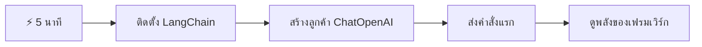
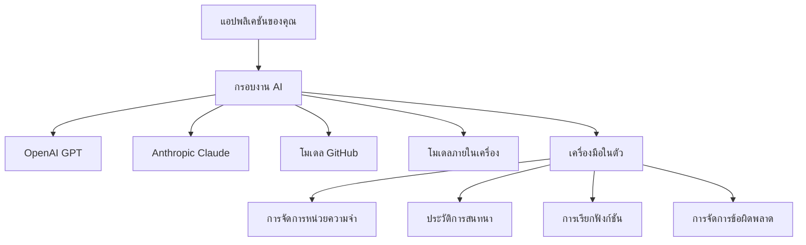
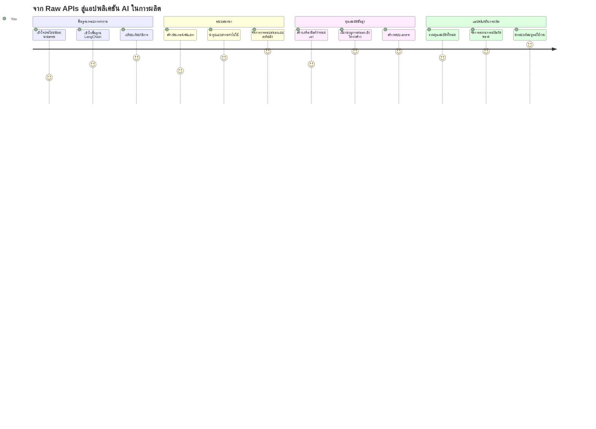
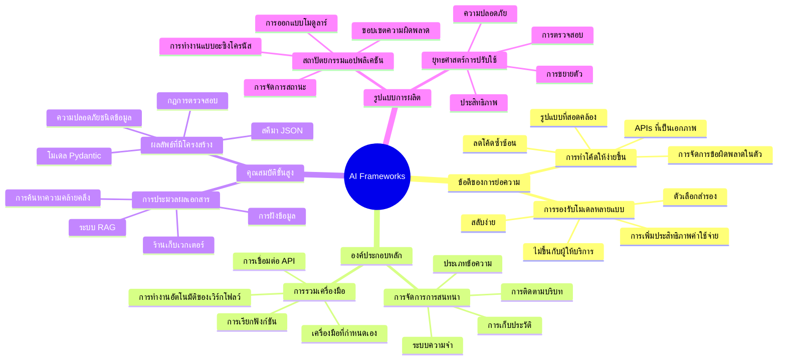
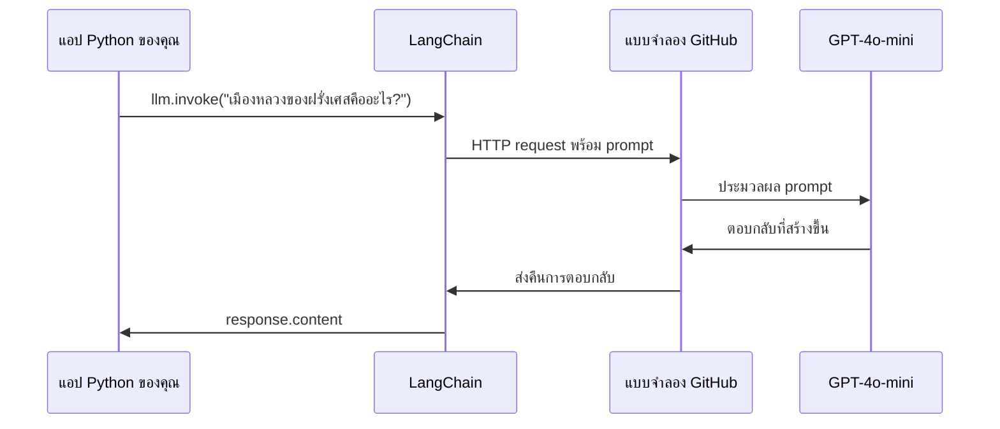
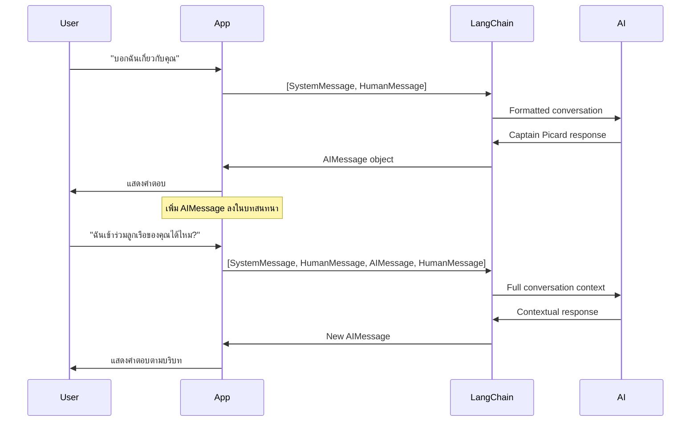
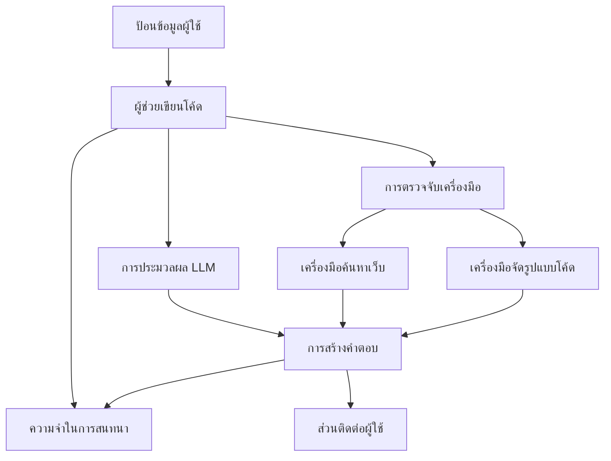
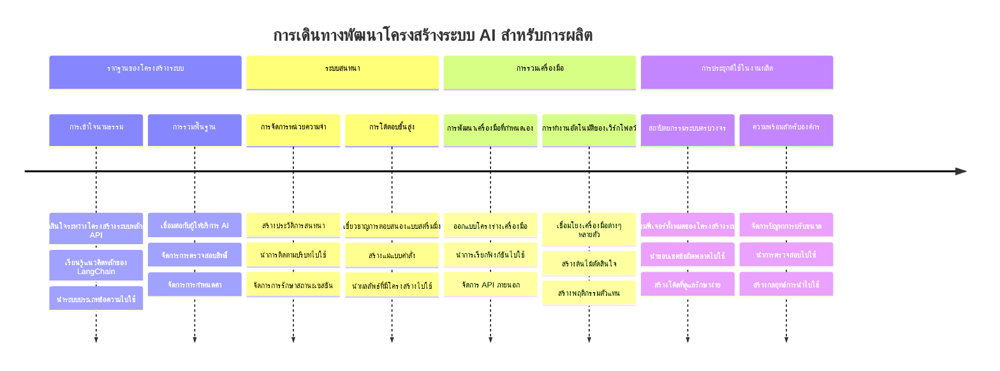
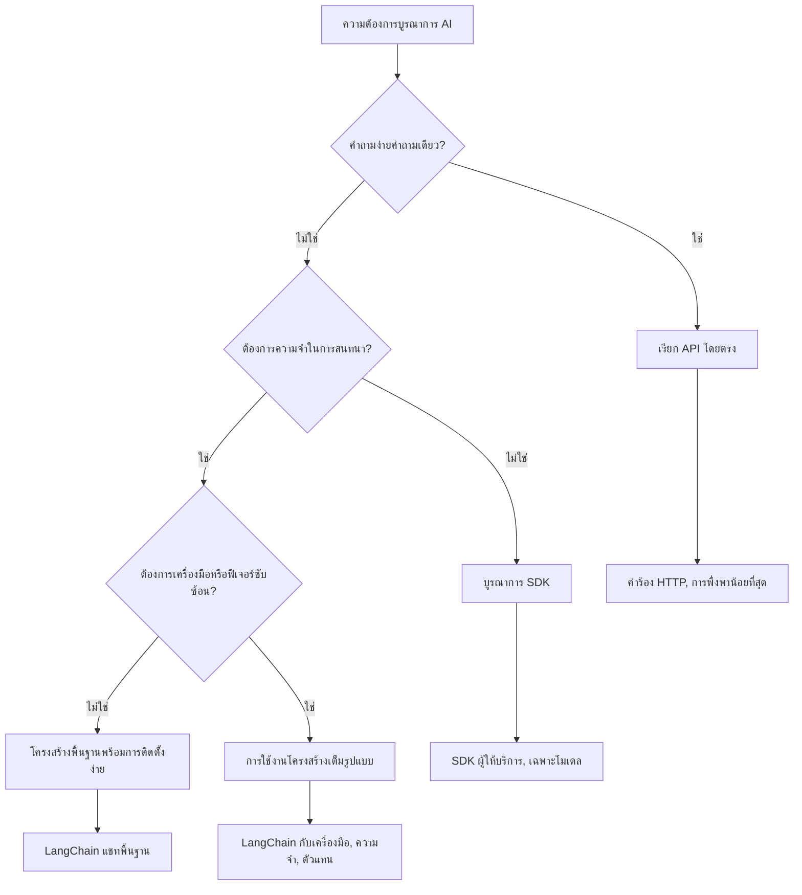

<!--
CO_OP_TRANSLATOR_METADATA:
{
  "original_hash": "3925b6a1c31c60755eaae4d578232c25",
  "translation_date": "2026-01-06T21:27:11+00:00",
  "source_file": "10-ai-framework-project/README.md",
  "language_code": "th"
}
-->
# AI Framework

เคยรู้สึกว่าเอ๊ะ! มึนงงกับการสร้างแอป AI ตั้งแต่ต้นไหม? คุณไม่ได้อยู่คนเดียว! AI frameworks ก็เหมือนมีอุปกรณ์ Swiss Army knife สำหรับการพัฒนา AI — เป็นเครื่องมือที่ทรงพลังซึ่งช่วยประหยัดเวลารวมถึงลดปัญหาที่อาจเกิดขึ้นเมื่อสร้างแอปอัจฉริยะ ลองคิดว่า AI framework เป็นเหมือนห้องสมุดที่จัดระเบียบอย่างดี: มันมีส่วนประกอบสำเร็จรูป, APIs ที่เป็นมาตรฐาน, และการจัดการแบบนามธรรมอัจฉริยะ ทำให้คุณสามารถมุ่งเน้นแก้ปัญหาจริงแทนที่จะต้องต่อสู้กับรายละเอียดการนำไปใช้งาน

ในบทเรียนนี้ เราจะสำรวจว่า frameworks อย่าง LangChain สามารถเปลี่ยนงานบูรณาการ AI ที่ซับซ้อนในอดีตให้กลายเป็นโค้ดที่อ่านง่ายได้อย่างไร คุณจะค้นพบวิธีจัดการกับปัญหาในโลกจริง เช่น การติดตามบทสนทนา, การเรียกใช้เครื่องมือ, และการจัดการกับโมเดล AI ต่างๆ ผ่านอินเทอร์เฟซเดียวกัน

เมื่อจบบทเรียนนี้ คุณจะเข้าใจว่าเมื่อไรควรใช้ framework แทนการเรียก API ตรงๆ, วิธีใช้การแอบสแตรกชันของ framework อย่างมีประสิทธิภาพ, และวิธีสร้างแอป AI ที่พร้อมใช้งานในโลกจริง พร้อมแล้วมาสำรวจดูว่า AI frameworks สามารถทำอะไรได้บ้างสำหรับโปรเจกต์ของคุณ

## ⚡ สิ่งที่คุณทำได้ใน 5 นาทีถัดไป

**เส้นทางเริ่มต้นด่วนสำหรับนักพัฒนาที่รีบเร่ง**


- **นาทีที่ 1**: ติดตั้ง LangChain: `pip install langchain langchain-openai`
- **นาทีที่ 2**: ตั้งค่า token ของ GitHub และ import ไคลเอนต์ ChatOpenAI
- **นาทีที่ 3**: สร้างบทสนทนาอย่างง่ายด้วยข้อความระบบและมนุษย์
- **นาทีที่ 4**: เพิ่มเครื่องมือพื้นฐาน (เช่น ฟังก์ชันบวก) และดูการเรียกใช้เครื่องมือ AI
- **นาทีที่ 5**: สัมผัสความแตกต่างระหว่างการเรียก API ตรงกับการใช้ framework abstraction

**โค้ดทดสอบด่วน**:
```python
from langchain_openai import ChatOpenAI
from langchain_core.messages import SystemMessage, HumanMessage

llm = ChatOpenAI(
    api_key=os.environ["GITHUB_TOKEN"],
    base_url="https://models.github.ai/inference",
    model="openai/gpt-4o-mini"
)

response = llm.invoke([
    SystemMessage(content="You are a helpful coding assistant"),
    HumanMessage(content="Explain Python functions briefly")
])
print(response.content)
```

**ทำไมสิ่งนี้ถึงสำคัญ**: ใน 5 นาทีคุณจะสัมผัสว่า AI frameworks เปลี่ยนงานบูรณาการ AI ที่ซับซ้อนให้กลายเป็นการเรียกเมธอดง่ายๆ อย่างไร นี่คือพื้นฐานที่ขับเคลื่อนแอป AI สำหรับผลิตจริง

## ทำไมต้องเลือก framework?

คุณพร้อมที่จะสร้างแอป AI — เยี่ยม! แต่นี่คือสิ่งที่ควรรู้: คุณมีหลายเส้นทางให้เลือกเดิน แต่ละทางมีข้อดีและข้อจำกัดไม่เหมือนกัน เหมือนกับการเลือกเดินเท้า, ขี่จักรยาน หรือขับรถไปที่ไหนสักแห่ง — ทั้งหมดนี้พาคุณไปถึงจุดหมายได้ แต่ประสบการณ์และความพยายามจะแตกต่างกันโดยสิ้นเชิง

มาลองแยกประเภทวิธีหลักๆ ที่คุณสามารถรวม AI เข้ากับโปรเจกต์ของคุณ:

| วิธีการ | ข้อดี | เหมาะสำหรับ | ข้อควรพิจารณา |
|----------|------------|----------|--------------|
| **เรียก HTTP ตรง** | ควบคุมเต็มที่ ไม่มีการพึ่งพา | คำถามง่ายๆ เรียนรู้พื้นฐาน | โค้ดจะเยอะ ต้องจัดการข้อผิดพลาดเอง |
| **รวม SDK** | โค้ดกระชับลง ปรับแต่งเฉพาะโมเดล | แอปที่ใช้โมเดลตัวเดียว | จำกัดเฉพาะผู้ให้บริการบางราย |
| **AI Frameworks** | API เดียว, มีการจัด abstraction ในตัว | แอปโมเดลหลายตัว, งานซับซ้อน | มีความโค้งความชันในการเรียนรู้ อาจใช้ abstraction มากเกิน |

### ประโยชน์ของ Framework ในการใช้งานจริง


**ทำไม frameworks ถึงสำคัญ:**
- **รวม** ผู้ให้บริการ AI หลายรายในอินเทอร์เฟซเดียว
- **จัดการ** หน่วยความจำบทสนทนาให้อัตโนมัติ
- **มี** เครื่องมือพร้อมใช้สำหรับงานทั่วไป เช่น embeddings และการเรียกฟังก์ชัน
- **บริหาร** การจัดการข้อผิดพลาดและตรรกะ retry
- **เปลี่ยน** งานซับซ้อนเป็นเมธอดที่อ่านง่าย

> 💡 **เคล็ดลับโปร**: ใช้ frameworks เมื่อสลับโมเดล AI หลายตัว หรือสร้างฟีเจอร์ซับซ้อน เช่น agents, memory, หรือการเรียกใช้เครื่องมือ ใช้ API ตรงเมื่อต้องการเรียนรู้พื้นฐานหรือสร้างแอปง่ายๆ ที่มีโฟกัส

**สรุป**: เหมือนเลือกใช้เครื่องมือช่างเฉพาะทางกับเวิร์กช็อปครบชุด ขึ้นอยู่กับงานที่ต้องทำ Frameworks เหมาะสำหรับแอปที่ซับซ้อนและมีคุณสมบัติมากมาย ในขณะที่ API ตรงเหมาะกับกรณีใช้งานที่ตรงไปตรงมา

## 🗺️ การเดินทางเรียนรู้สู่ความเชี่ยวชาญ AI Framework


**จุดหมายปลายทางของคุณ**: เมื่อจบบทเรียนนี้ คุณจะมีความเชี่ยวชาญในการพัฒนา AI framework และสามารถสร้างแอป AI ชั้นสูงที่พร้อมสำหรับการทำงานเชิงพาณิชย์ที่เทียบเคียงผู้ช่วย AI ที่มีอยู่พาณิชย์

## บทนำ

ในบทเรียนนี้ เราจะเรียนรู้ที่จะ:

- ใช้ AI framework ที่เป็นที่นิยม
- แก้ปัญหาทั่วไป เช่น บทสนทนา, การใช้เครื่องมือ, memory และ context
- นำสิ่งนี้มาสร้างแอป AI

## 🧠 ระบบนิเวศการพัฒนา AI Framework


**หลักการสำคัญ**: AI frameworks จะจัดการความซับซ้อนไว้ให้ และให้ abstraction ที่ทรงพลังในเรื่องการบริหารบทสนทนา, การรวมเครื่องมือ และการประมวลผลเอกสาร ช่วยให้นักพัฒนาสร้างแอป AI ที่ซับซ้อนด้วยโค้ดที่สะอาดและดูแลรักษาง่าย

## prompt AI แรกของคุณ

มาเริ่มต้นด้วยพื้นฐานโดยการสร้างแอป AI ตัวแรกที่ส่งคำถามแล้วรับคำตอบกลับ เหมือนอาร์คีมีดีสค้นพบหลักการของการแทนที่น้ำในอ่างอาบน้ำบางครั้งการสังเกตที่ง่ายที่สุดก็นำไปสู่องค์ความรู้ที่ทรงพลัง — และ frameworks ทำให้การค้นพบเหล่านี้เข้าถึงได้

### การตั้งค่า LangChain กับ GitHub Models

เราจะใช้ LangChain เพื่อเชื่อมกับ GitHub Models ซึ่งดีมากเพราะให้คุณเข้าถึงโมเดล AI หลายตัวฟรี ส่วนที่ดีที่สุด? คุณแค่ต้องตั้งค่าพารามิเตอร์ง่ายๆ นิดหน่อยก็เริ่มได้เลย:

```python
from langchain_openai import ChatOpenAI
import os

llm = ChatOpenAI(
    api_key=os.environ["GITHUB_TOKEN"],
    base_url="https://models.github.ai/inference",
    model="openai/gpt-4o-mini",
)

# ส่งคำสั่งง่าย ๆ
response = llm.invoke("What's the capital of France?")
print(response.content)
```

**มาดูว่าเกิดอะไรขึ้นบ้าง:**
- **สร้าง** ไคลเอนต์ LangChain ด้วยคลาส `ChatOpenAI` — นี่คือประตูสู่ AI ของคุณ!
- **ตั้งค่า** การเชื่อมต่อกับ GitHub Models โดยใช้โทเค็นยืนยันตัวตนของคุณ
- **ระบุ** โมเดล AI ที่จะใช้ (`gpt-4o-mini`) — เหมือนเลือกผู้ช่วย AI ของคุณ
- **ส่ง** คำถามของคุณด้วยเมธอด `invoke()` — ที่นี่คือเวทมนตร์เกิดขึ้น
- **ดึง** และแสดงคำตอบ — แค่นี้ก็เหมือนได้คุยกับ AI แล้ว!

> 🔧 **หมายเหตุการตั้งค่า**: หากใช้ GitHub Codespaces โชคดีที่ `GITHUB_TOKEN` ได้จัดเตรียมไว้แล้ว! ถ้าใช้ในเครื่องตัวเอง ไม่ต้องกังวล คุณแค่ต้องสร้าง personal access token พร้อมสิทธิ์ที่ต้องการ

**ผลลัพธ์ที่คาดหวัง:**
```text
The capital of France is Paris.
```


## การสร้าง AI สนทนา

ตัวอย่างแรกนี้แสดงพื้นฐาน แต่เป็นการแลกเปลี่ยนแค่รอบเดียว — คุณถามคำถาม, ได้คำตอบ, จบ นั่นเอง ในแอปจริงคุณอยากให้ AI จำสิ่งที่คุณคุยกันมาเหมือนที่ Watson และ Holmes สร้างบทสนทนาเพื่อการสืบสวนขึ้นเรื่อยๆ

นี่คือจุดที่ LangChain มีประโยชน์มาก มันมีประเภทข้อความต่างๆ ที่ช่วยจัดโครงสร้างบทสนทนาและให้ AI ของคุณมีบุคลิกภาพ คุณจะสร้างประสบการณ์การแชทที่คงสถานะ context และตัวละคร

### ความเข้าใจประเภทข้อความ

คิดว่าแต่ละประเภทข้อความเหมือน "หมวก" ที่ผู้เข้าร่วมใส่ในบทสนทนา LangChain ใช้คลาสข้อความหลากหลายเพื่อเก็บว่าใครพูดอะไร:

| ประเภทข้อความ | วัตถุประสงค์ | ตัวอย่างการใช้งาน |
|--------------|---------|------------------|
| `SystemMessage` | กำหนดบุคลิกและพฤติกรรม AI | "คุณเป็นผู้ช่วยเขียนโค้ดที่ช่วยเหลือดี" |
| `HumanMessage` | แทนผู้ใช้ | "อธิบายการทำงานของฟังก์ชันหน่อย" |
| `AIMessage` | เก็บคำตอบ AI | คำตอบ AI ที่เคยคุยกันก่อนหน้า |

### สร้างบทสนทนาแรกของคุณ

มาสร้างบทสนทนาโดยให้ AI ของเรารับบทบาทเฉพาะ เราจะให้มันรับบทกัปตันพิคาร์ด — ตัวละครที่มีชื่อเสียงเรื่องความเฉลียวฉลาดทางการทูตและความเป็นผู้นำ:

```python
messages = [
    SystemMessage(content="You are Captain Picard of the Starship Enterprise"),
    HumanMessage(content="Tell me about you"),
]
```

**ทำความเข้าใจการตั้งค่านี้:**
- **กำหนด** บทบาทและบุคลิก AI ผ่าน `SystemMessage`
- **ให้** คำถามผู้ใช้เริ่มต้นผ่าน `HumanMessage`
- **สร้าง** รากฐานสำหรับบทสนทนาหลายรอบ

โค้ดทั้งหมดของตัวอย่างนี้มีลักษณะดังนี้:

```python
from langchain_core.messages import HumanMessage, SystemMessage
from langchain_openai import ChatOpenAI
import os

llm = ChatOpenAI(
    api_key=os.environ["GITHUB_TOKEN"],
    base_url="https://models.github.ai/inference",
    model="openai/gpt-4o-mini",
)

messages = [
    SystemMessage(content="You are Captain Picard of the Starship Enterprise"),
    HumanMessage(content="Tell me about you"),
]


# ใช้งานได้
response  = llm.invoke(messages)
print(response.content)
```

คุณควรเห็นผลลัพธ์ประมาณนี้:

```text
I am Captain Jean-Luc Picard, the commanding officer of the USS Enterprise (NCC-1701-D), a starship in the United Federation of Planets. My primary mission is to explore new worlds, seek out new life and new civilizations, and boldly go where no one has gone before. 

I believe in the importance of diplomacy, reason, and the pursuit of knowledge. My crew is diverse and skilled, and we often face challenges that test our resolve, ethics, and ingenuity. Throughout my career, I have encountered numerous species, grappled with complex moral dilemmas, and have consistently sought peaceful solutions to conflicts.

I hold the ideals of the Federation close to my heart, believing in the importance of cooperation, understanding, and respect for all sentient beings. My experiences have shaped my leadership style, and I strive to be a thoughtful and just captain. How may I assist you further?
```

เพื่อรักษาความต่อเนื่องของบทสนทนา (แทนการรีเซ็ต context ทุกครั้ง) คุณต้องเพิ่มคำตอบใหม่ลงในรายการข้อความต่อเนื่อง เช่นเดียวกับการถ่ายทอดปากเปล่าที่เก็บเรื่องเล่าไว้ข้ามชั่วอายุคน วิธีนี้สร้าง memory ที่อยู่ยั่งยืน:

```python
from langchain_core.messages import HumanMessage, SystemMessage
from langchain_openai import ChatOpenAI
import os

llm = ChatOpenAI(
    api_key=os.environ["GITHUB_TOKEN"],
    base_url="https://models.github.ai/inference",
    model="openai/gpt-4o-mini",
)

messages = [
    SystemMessage(content="You are Captain Picard of the Starship Enterprise"),
    HumanMessage(content="Tell me about you"),
]


# ใช้งานได้
response  = llm.invoke(messages)

print(response.content)

print("---- Next ----")

messages.append(response)
messages.append(HumanMessage(content="Now that I know about you, I'm Chris, can I be in your crew?"))

response  = llm.invoke(messages)

print(response.content)

```

เจ๋งใช่ไหม? สิ่งที่เกิดขึ้นคือเรากำลังเรียก LLM สองครั้ง — ครั้งแรกด้วยข้อความสองข้อความแรกของเรา แต่ครั้งที่สองด้วยประวัติบทสนทนาเต็มๆ เหมือน AI กำลังติดตามแชทเราจริงๆ!

เมื่อคุณรันโค้ดนี้ คุณจะได้คำตอบครั้งที่สองประมาณนี้:

```text
Welcome aboard, Chris! It's always a pleasure to meet those who share a passion for exploration and discovery. While I cannot formally offer you a position on the Enterprise right now, I encourage you to pursue your aspirations. We are always in need of talented individuals with diverse skills and backgrounds. 

If you are interested in space exploration, consider education and training in the sciences, engineering, or diplomacy. The values of curiosity, resilience, and teamwork are crucial in Starfleet. Should you ever find yourself on a starship, remember to uphold the principles of the Federation: peace, understanding, and respect for all beings. Your journey can lead you to remarkable adventures, whether in the stars or on the ground. Engage!
```


ผมตีความว่านี่เป็น "อาจจะ" ;)

## การตอบสนองแบบสตรีมมิ่ง

เคยสังเกตไหมว่า ChatGPT ดูเหมือน "พิมพ์" คำตอบแบบเรียลไทม์? นั่นคือ streaming ทำงาน เหมือนดูช่างเขียนพู่กันขั้นเทพ — เห็นตัวอักษรปรากฏเส้นต่อเส้นไม่ใช่โผล่มาทั้งหมดทันที — streaming ทำให้การโต้ตอบรู้สึกเป็นธรรมชาติมากขึ้นและสร้างฟีดแบ็กทันที

### การใช้งาน streaming กับ LangChain

```python
from langchain_openai import ChatOpenAI
import os

llm = ChatOpenAI(
    api_key=os.environ["GITHUB_TOKEN"],
    base_url="https://models.github.ai/inference",
    model="openai/gpt-4o-mini",
    streaming=True
)

# สตรีมการตอบกลับ
for chunk in llm.stream("Write a short story about a robot learning to code"):
    print(chunk.content, end="", flush=True)
```

**ทำไม streaming เก๋**:
- **แสดง** เนื้อหาเมื่อตัวมันถูกสร้าง — ไม่ต้องรอแบบอึดอัด!
- **ทำให้** ผู้ใช้รู้สึกว่าสิ่งต่างๆ กำลังเกิดขึ้นจริง
- **รู้สึก** ว่าเร็วขึ้น แม้เทคนิคอาจไม่เร็วขึ้นจริง
- **ให้** ผู้ใช้เริ่มอ่านในขณะที่ AI ยัง "คิด" อยู่

> 💡 **เคล็ดลับ UX**: Streaming จะเด่นมากเมื่อเจอกับคำตอบยาว เช่น อธิบายโค้ด, เขียนสร้างสรรค์, หรือบทเรียนละเอียด ผู้ใช้จะรักการเห็นความคืบหน้ามากกว่านั่งจ้องหน้าจอว่างเปล่า!

### 🎯 เช็คความเข้าใจ: ประโยชน์ของ Framework Abstraction

**หยุดและไตร่ตรอง**: คุณเพิ่งสัมผัสพลังของ AI framework abstraction เทียบกับการเรียก API ตรงที่เคยเรียนมาก่อน

**ประเมินตัวเองเร็วๆ**:
- อธิบายได้ไหมว่า LangChain ทำให้การจัดการบทสนทนาใกล้เคียงการติดตามข้อความด้วยมืออย่างไร?
- ต่างกันอย่างไรระหว่างเมธอด `invoke()` กับ `stream()` และเมื่อไรควรใช้แต่ละอัน?
- ระบบประเภทข้อความของ framework ช่วยปรับปรุงการจัดระเบียบโค้ดอย่างไร?

**เชื่อมกับโลกจริง**: รูปแบบ abstraction ที่เรียนรู้ (ประเภทข้อความ, อินเทอร์เฟซ streaming, memory บทสนทนา) ถูกใช้ในแอป AI หลักๆ ทุกตัว — ตั้งแต่ ChatGPT ไปจนถึง GitHub Copilot คุณกำลังเรียนรู้รูปแบบสถาปัตยกรรมเดียวกับทีมพัฒนา AI มืออาชีพ

**คำถามท้าทาย**: คุณจะออกแบบ abstraction ของ framework เพื่อจัดการผู้ให้บริการโมเดล AI ต่างๆ (OpenAI, Anthropic, Google) ด้วยอินเทอร์เฟซเดียวกันอย่างไร? ลองพิจารณาข้อดีและข้อจำกัด

## Prompt templates

Prompt templates ทำงานเหมือนโครงสร้างวาทศิลป์ในคำปราศรัยแบบคลาสสิก — นึกถึงว่า Cicero ปรับรูปแบบคำพูดเพื่อผู้ชมต่างกันอย่างไรโดยยังคงโครงสร้างโน้มน้าวใจเหมือนเดิม มันช่วยให้คุณสร้าง prompts ที่นำกลับมาใช้ซ้ำได้ ซึ่งคุณสามารถเปลี่ยนส่วนข้อมูลต่างๆ ได้โดยไม่ต้องเขียนใหม่ทั้งหมด เมื่อคุณตั้งค่าเทมเพลตแล้ว แค่เติมตัวแปรด้วยค่าที่คุณต้องการ

### การสร้าง prompt ที่นำกลับมาใช้ซ้ำได้

```python
from langchain_core.prompts import ChatPromptTemplate

# กำหนดแม่แบบสำหรับคำอธิบายโค้ด
template = ChatPromptTemplate.from_messages([
    ("system", "You are an expert programming instructor. Explain concepts clearly with examples."),
    ("human", "Explain {concept} in {language} with a practical example for {skill_level} developers")
])

# ใช้แม่แบบกับค่าที่แตกต่างกัน
questions = [
    {"concept": "functions", "language": "JavaScript", "skill_level": "beginner"},
    {"concept": "classes", "language": "Python", "skill_level": "intermediate"},
    {"concept": "async/await", "language": "JavaScript", "skill_level": "advanced"}
]

for question in questions:
    prompt = template.format_messages(**question)
    response = llm.invoke(prompt)
    print(f"Topic: {question['concept']}\n{response.content}\n---\n")
```

**ทำไมคุณจะชอบใช้ templates:**
- **ทำให้** prompts ของคุณเป็นมาตรฐานตลอดทั้งแอป
- **ไม่ต้อง** ต่อ string สับสน — แค่ใช้ตัวแปรง่าย ๆ
- **AI ของคุณ** จึงทำงานสม่ำเสมอเพราะโครงสร้างคงที่
- **อัพเดต** ง่าย — เปลี่ยนเทมเพลตครั้งเดียวแล้วถูกแก้ไขทั่วแอป

## Structured output

เคยหงุดหงิดกับ AI ที่ตอบกลับเป็นข้อความไม่มีโครงสร้างไหม? Structured output เหมือนสอน AI ให้ปฏิบัติตามวิธีจัดแบ่งแบบเป็นระบบที่ Linnaeus ใช้ในการจัดประเภทสิ่งมีชีวิต — เป็นระเบียบ, คาดเดาได้, และง่ายต่อการทำงาน คุณสามารถขอ JSON, โครงสร้างข้อมูลเฉพาะ หรือฟอร์แมตใดๆ ที่คุณต้องการได้

### การกำหนด schema สำหรับ output

```python
from langchain_core.prompts import ChatPromptTemplate
from langchain_core.output_parsers import JsonOutputParser
from pydantic import BaseModel, Field

class CodeReview(BaseModel):
    score: int = Field(description="Code quality score from 1-10")
    strengths: list[str] = Field(description="List of code strengths")
    improvements: list[str] = Field(description="List of suggested improvements")
    overall_feedback: str = Field(description="Summary feedback")

# ตั้งค่าตัวแยกวิเคราะห์
parser = JsonOutputParser(pydantic_object=CodeReview)

# สร้างพรอมต์พร้อมคำแนะนำรูปแบบ
prompt = ChatPromptTemplate.from_messages([
    ("system", "You are a code reviewer. {format_instructions}"),
    ("human", "Review this code: {code}")
])

# จัดรูปแบบพรอมต์ด้วยคำแนะนำ
chain = prompt | llm | parser

# รับการตอบกลับในรูปแบบโครงสร้าง
code_sample = """
def calculate_average(numbers):
    return sum(numbers) / len(numbers)
"""

result = chain.invoke({
    "code": code_sample,
    "format_instructions": parser.get_format_instructions()
})

print(f"Score: {result['score']}")
print(f"Strengths: {', '.join(result['strengths'])}")
```

**ทำไม structured output ถึงเปลี่ยนเกม:**
- **ไม่ต้อง** เดาอีกว่าฟอร์แมตจะเป็นแบบไหน — มันคงที่ทุกครั้ง
- **เชื่อม** กับฐานข้อมูลและ APIs ได้ตรงๆ โดยไม่มีงานเพิ่ม
- **ตรวจจับ** คำตอบ AI แปลกๆ ก่อนได้ทำให้แอปพัง
- **โค้ด** ของคุณสะอาดขึ้น เพราะรู้ชัดว่ากำลังจัดการข้อมูลอะไร

## การเรียกใช้เครื่องมือ

ตอนนี้เรามาถึงหนึ่งในฟีเจอร์ทรงพลังที่สุด: เครื่องมือ นี่คือวิธีที่คุณมอบความสามารถใช้งานจริงนอกเหนือจากแค่บทสนทนา เหมือนกับที่กลุ่มช่างฝีมือยุคกลางสร้างเครื่องมือเฉพาะทางสำหรับงานฝีมือต่างๆ คุณสามารถติดตั้งเครื่องมือเฉพาะให้ AI ของคุณ คุณบอกว่าเครื่องมือไหนพร้อมใช้ แล้วเมื่อตรงกับคำขอ AI ก็จะลงมือทำงาน

### การใช้ Python

มาลองเพิ่มเครื่องมือกันแบบนี้:

```python
from typing_extensions import Annotated, TypedDict

class add(TypedDict):
    """Add two integers."""

    # คำอธิบายประกอบต้องมีประเภท และสามารถใส่ค่าเริ่มต้นและคำอธิบายได้ (ตามลำดับนั้น)
    a: Annotated[int, ..., "First integer"]
    b: Annotated[int, ..., "Second integer"]

tools = [add]

functions = {
    "add": lambda a, b: a + b
}
```

แล้วเหตุการณ์ที่เกิดขึ้นคืออะไร? เรากำลังสร้างแบบแผน (blueprint) สำหรับเครื่องมือชื่อ `add` โดยสืบทอดจาก `TypedDict` และใช้ `Annotated` ชนิดของ `a` และ `b` ทำให้ LLM เข้าใจชัดว่าเครื่องมือนี้ทำอะไรและต้องการอะไร พจนานุกรม `functions` เปรียบเสมือนกล่องเครื่องมือ — บอกโค้ดเราอย่างชัดเจนว่าจะทำอะไรเมื่อ AI ตัดสินใจใช้เครื่องมือชนิดนี้

มาดูวิธีเรียก LLM พร้อมเครื่องมือนี้กัน:

```python
llm = ChatOpenAI(
    api_key=os.environ["GITHUB_TOKEN"],
    base_url="https://models.github.ai/inference",
    model="openai/gpt-4o-mini",
)

llm_with_tools = llm.bind_tools(tools)
```

ที่นี่เราเรียกใช้ `bind_tools` กับอาร์เรย์ `tools` และทำให้ LLM ตัวใหม่ `llm_with_tools` มีความรู้เกี่ยวกับเครื่องมือนี้

เพื่อใช้ LLM ตัวใหม่นี้ เราก็เขียนโค้ดแบบนี้:

```python
query = "What is 3 + 12?"

res = llm_with_tools.invoke(query)
if(res.tool_calls):
    for tool in res.tool_calls:
        print("TOOL CALL: ", functions[tool["name"]](../../../10-ai-framework-project/**tool["args"]))
print("CONTENT: ",res.content)
```

เมื่อเราเรียก `invoke` บน llm ตัวใหม่นี้ที่มีเครื่องมือ อาจมี property `tool_calls` เติมข้อมูล หากใช่ เครื่องมือที่ระบุจะมี `name` และ `args` บอกว่าเรียกใช้เครื่องมืออะไรและด้วยอาร์กิวเมนต์อะไร โค้ดเต็มตัวอย่างนี้:

```python
from langchain_core.messages import HumanMessage, SystemMessage
from langchain_openai import ChatOpenAI
import os
from typing_extensions import Annotated, TypedDict

class add(TypedDict):
    """Add two integers."""

    # คำอธิบายประกอบต้องมีชนิดข้อมูลและสามารถมีค่าปริยายและคำอธิบายเพิ่มเติมได้ (ตามลำดับนั้น)
    a: Annotated[int, ..., "First integer"]
    b: Annotated[int, ..., "Second integer"]

tools = [add]

functions = {
    "add": lambda a, b: a + b
}

llm = ChatOpenAI(
    api_key=os.environ["GITHUB_TOKEN"],
    base_url="https://models.github.ai/inference",
    model="openai/gpt-4o-mini",
)

llm_with_tools = llm.bind_tools(tools)

query = "What is 3 + 12?"

res = llm_with_tools.invoke(query)
if(res.tool_calls):
    for tool in res.tool_calls:
        print("TOOL CALL: ", functions[tool["name"]](../../../10-ai-framework-project/**tool["args"]))
print("CONTENT: ",res.content)
```

เมื่อรันโค้ดนี้ คุณควรเห็นผลลัพธ์ประมาณนี้:

```text
TOOL CALL:  15
CONTENT: 
```

AI วิเคราะห์คำถาม "What is 3 + 12" และรู้ว่านี่คือภารกิจสำหรับเครื่องมือ `add` เหมือนบรรณารักษ์ผู้เชี่ยวชาญรู้ว่าจะดูข้อมูลอ้างอิงไหนตามคำถามที่ถาม มันตัดสินใจโดยอิงจากชื่อ, คำอธิบาย และสเปคฟิลด์ของเครื่องมือ ผลลัพธ์ 15 มาจากพจนานุกรม `functions` ที่รันเครื่องมือนี้:

```python
print("TOOL CALL: ", functions[tool["name"]](../../../10-ai-framework-project/**tool["args"]))
```

### เครื่องมือที่น่าสนใจมากขึ้นซึ่งเรียกใช้งานเว็บ API
การบวกตัวเลขแสดงให้เห็นแนวคิด แต่เครื่องมือจริงมักจะทำงานที่ซับซ้อนกว่า เช่น การเรียกใช้เว็บ API มาขยายตัวอย่างของเราให้ AI ดึงเนื้อหาจากอินเทอร์เน็ต — คล้ายกับวิธีที่ผู้ควบคุมโทรเลขเคยเชื่อมต่อสถานที่ไกล ๆ:

```python
class joke(TypedDict):
    """Tell a joke."""

    # การแอนโนเทชันต้องมีชนิดข้อมูลและสามารถมีค่าดีฟอลต์และคำอธิบายได้ (ตามลำดับนั้น).
    category: Annotated[str, ..., "The joke category"]

def get_joke(category: str) -> str:
    response = requests.get(f"https://api.chucknorris.io/jokes/random?category={category}", headers={"Accept": "application/json"})
    if response.status_code == 200:
        return response.json().get("value", f"Here's a {category} joke!")
    return f"Here's a {category} joke!"

functions = {
    "add": lambda a, b: a + b,
    "joke": lambda category: get_joke(category)
}

query = "Tell me a joke about animals"

# โค้ดที่เหลือเหมือนเดิม
```

ตอนนี้ถ้าคุณรันโค้ดนี้ คุณจะได้รับการตอบกลับที่มีข้อความประมาณว่า:

```text
TOOL CALL:  Chuck Norris once rode a nine foot grizzly bear through an automatic car wash, instead of taking a shower.
CONTENT:  
```

```mermaid
flowchart TD
    A[คำถามของผู้ใช้: "เล่าเรื่องตลกเกี่ยวกับสัตว์ให้ฉันฟัง"] --> B[การวิเคราะห์ LangChain]
    B --> C{มีเครื่องมือหรือไม่?}
    C -->|ใช่| D[เลือกเครื่องมือมุกตลก]
    C -->|ไม่| E[สร้างคำตอบโดยตรง]
    
    D --> F[ดึงพารามิเตอร์]
    F --> G[เรียกใช้มุก(category="animals")]
    G --> H[คำขอ API ไปยัง chucknorris.io]
    H --> I[ส่งคืนเนื้อหามุก]
    I --> J[แสดงให้ผู้ใช้]
    
    E --> K[คำตอบที่สร้างโดย AI]
    K --> J
    
    subgraph "ชั้นนิยามเครื่องมือ"
        L[สคีมา TypedDict]
        M[การใช้งานฟังก์ชัน]
        N[การตรวจสอบพารามิเตอร์]
    end
    
    D --> L
    F --> N
    G --> M
```
นี่คือโค้ดทั้งหมด:

```python
from langchain_openai import ChatOpenAI
import requests
import os
from typing_extensions import Annotated, TypedDict

class add(TypedDict):
    """Add two integers."""

    # คำอธิบายประกอบต้องมีประเภทและอาจรวมถึงค่าดีฟอลต์และคำอธิบาย (ในลำดับนั้น)
    a: Annotated[int, ..., "First integer"]
    b: Annotated[int, ..., "Second integer"]

class joke(TypedDict):
    """Tell a joke."""

    # คำอธิบายประกอบต้องมีประเภทและอาจรวมถึงค่าดีฟอลต์และคำอธิบาย (ในลำดับนั้น)
    category: Annotated[str, ..., "The joke category"]

tools = [add, joke]

def get_joke(category: str) -> str:
    response = requests.get(f"https://api.chucknorris.io/jokes/random?category={category}", headers={"Accept": "application/json"})
    if response.status_code == 200:
        return response.json().get("value", f"Here's a {category} joke!")
    return f"Here's a {category} joke!"

functions = {
    "add": lambda a, b: a + b,
    "joke": lambda category: get_joke(category)
}

llm = ChatOpenAI(
    api_key=os.environ["GITHUB_TOKEN"],
    base_url="https://models.github.ai/inference",
    model="openai/gpt-4o-mini",
)

llm_with_tools = llm.bind_tools(tools)

query = "Tell me a joke about animals"

res = llm_with_tools.invoke(query)
if(res.tool_calls):
    for tool in res.tool_calls:
        # print("TOOL CALL: ", tool)
        print("TOOL CALL: ", functions[tool["name"]](../../../10-ai-framework-project/**tool["args"]))
print("CONTENT: ",res.content)
```

## Embeddings และการประมวลผลเอกสาร

Embeddings เป็นหนึ่งในวิธีการที่สวยงามที่สุดใน AI สมัยใหม่ ลองนึกดูว่าคุณสามารถนำข้อความใด ๆ แล้วแปลงเป็นพิกัดเชิงตัวเลขที่สะท้อนความหมาย นั่นคือสิ่งที่ embeddings ทำ — พวกมันเปลี่ยนข้อความเป็นจุดในพื้นที่หลายมิติที่แนวคิดที่คล้ายกันจะรวมกันเหมือนมีระบบพิกัดสำหรับไอเดีย คล้ายกับที่เมนเดลีเยฟจัดตารางธาตุตามคุณสมบัติอะตอม

### การสร้างและใช้งาน embeddings

```python
from langchain_openai import OpenAIEmbeddings
from langchain_community.vectorstores import FAISS
from langchain_community.document_loaders import TextLoader
from langchain.text_splitter import CharacterTextSplitter

# เริ่มต้นการฝังข้อมูล
embeddings = OpenAIEmbeddings(
    api_key=os.environ["GITHUB_TOKEN"],
    base_url="https://models.github.ai/inference",
    model="text-embedding-3-small"
)

# โหลดและแยกเอกสาร
loader = TextLoader("documentation.txt")
documents = loader.load()

text_splitter = CharacterTextSplitter(chunk_size=1000, chunk_overlap=0)
texts = text_splitter.split_documents(documents)

# สร้างคลังเวกเตอร์
vectorstore = FAISS.from_documents(texts, embeddings)

# ดำเนินการค้นหาความคล้ายคลึง
query = "How do I handle user authentication?"
similar_docs = vectorstore.similarity_search(query, k=3)

for doc in similar_docs:
    print(f"Relevant content: {doc.page_content[:200]}...")
```

### ตัวโหลดเอกสารสำหรับรูปแบบต่าง ๆ

```python
from langchain_community.document_loaders import (
    PyPDFLoader,
    CSVLoader,
    JSONLoader,
    WebBaseLoader
)

# โหลดเอกสารประเภทต่าง ๆ
pdf_loader = PyPDFLoader("manual.pdf")
csv_loader = CSVLoader("data.csv")
json_loader = JSONLoader("config.json")
web_loader = WebBaseLoader("https://example.com/docs")

# ประมวลผลเอกสารทั้งหมด
all_documents = []
for loader in [pdf_loader, csv_loader, json_loader, web_loader]:
    docs = loader.load()
    all_documents.extend(docs)
```

**สิ่งที่คุณทำได้ด้วย embeddings:**
- **สร้าง** การค้นหาที่เข้าใจความหมาย ไม่ใช่แค่จับคีย์เวิร์ด
- **สร้าง** AI ที่ตอบคำถามเกี่ยวกับเอกสารของคุณได้
- **ทำ** ระบบแนะนำที่เสนอเนื้อหาที่เกี่ยวข้องจริง ๆ
- **จัดระเบียบ** และจัดหมวดหมู่เนื้อหาโดยอัตโนมัติ

```mermaid
flowchart LR
    A[เอกสาร] --> B[ตัวแบ่งข้อความ]
    B --> C[สร้างเวกเตอร์ฝัง]
    C --> D[ที่เก็บเวกเตอร์]
    
    E[คำถามของผู้ใช้] --> F[เวกเตอร์ฝังคำถาม]
    F --> G[การค้นหาความคล้ายคลึง]
    G --> D
    D --> H[เอกสารที่เกี่ยวข้อง]
    H --> I[การตอบสนองของ AI]
    
    subgraph "เวกเตอร์สเปซ"
        J[เอกสาร A: [0.1, 0.8, 0.3...]]
        K[เอกสาร B: [0.2, 0.7, 0.4...]]
        L[คำถาม: [0.15, 0.75, 0.35...]]
    end
    
    C --> J
    C --> K
    F --> L
    G --> J
    G --> K
```
## การสร้างแอป AI ครบวงจร

ตอนนี้เราจะผสานทุกอย่างที่คุณได้เรียนรู้เข้าด้วยกันในแอปพลิเคชันครบถ้วน — ผู้ช่วยโค้ดดิ้งที่ตอบคำถาม ใช้เครื่องมือ และเก็บความทรงจำการสนทนา เหมือนกับที่เครื่องพิมพ์ผสมผสานเทคโนโลยี (ตัวอักษรเคลื่อนที่ หมึก กระดาษ และแรงกด) เป็นสิ่งที่เปลี่ยนแปลงโลก เราจะรวมส่วนประกอบ AI ของเราให้เป็นสิ่งที่ใช้งานได้จริงและมีประโยชน์

### ตัวอย่างแอปครบวงจร

```python
from langchain_openai import ChatOpenAI, OpenAIEmbeddings
from langchain_core.prompts import ChatPromptTemplate
from langchain_core.messages import HumanMessage, SystemMessage, AIMessage
from langchain_community.vectorstores import FAISS
from typing_extensions import Annotated, TypedDict
import os
import requests

class CodingAssistant:
    def __init__(self):
        self.llm = ChatOpenAI(
            api_key=os.environ["GITHUB_TOKEN"],
            base_url="https://models.github.ai/inference",
            model="openai/gpt-4o-mini"
        )
        
        self.conversation_history = [
            SystemMessage(content="""You are an expert coding assistant. 
            Help users learn programming concepts, debug code, and write better software.
            Use tools when needed and maintain a helpful, encouraging tone.""")
        ]
        
        # กำหนดเครื่องมือ
        self.setup_tools()
    
    def setup_tools(self):
        class web_search(TypedDict):
            """Search for programming documentation or examples."""
            query: Annotated[str, "Search query for programming help"]
        
        class code_formatter(TypedDict):
            """Format and validate code snippets."""
            code: Annotated[str, "Code to format"]
            language: Annotated[str, "Programming language"]
        
        self.tools = [web_search, code_formatter]
        self.llm_with_tools = self.llm.bind_tools(self.tools)
    
    def chat(self, user_input: str):
        # เพิ่มข้อความผู้ใช้ลงในการสนทนา
        self.conversation_history.append(HumanMessage(content=user_input))
        
        # รับการตอบกลับจาก AI
        response = self.llm_with_tools.invoke(self.conversation_history)
        
        # จัดการการเรียกใช้เครื่องมือถ้ามี
        if response.tool_calls:
            for tool_call in response.tool_calls:
                tool_result = self.execute_tool(tool_call)
                print(f"🔧 Tool used: {tool_call['name']}")
                print(f"📊 Result: {tool_result}")
        
        # เพิ่มการตอบกลับของ AI ในการสนทนา
        self.conversation_history.append(response)
        
        return response.content
    
    def execute_tool(self, tool_call):
        tool_name = tool_call['name']
        args = tool_call['args']
        
        if tool_name == 'web_search':
            return f"Found documentation for: {args['query']}"
        elif tool_name == 'code_formatter':
            return f"Formatted {args['language']} code: {args['code'][:50]}..."
        
        return "Tool execution completed"

# ตัวอย่างการใช้งาน
assistant = CodingAssistant()

print("🤖 Coding Assistant Ready! Type 'quit' to exit.\n")

while True:
    user_input = input("You: ")
    if user_input.lower() == 'quit':
        break
    
    response = assistant.chat(user_input)
    print(f"🤖 Assistant: {response}\n")
```

**สถาปัตยกรรมของแอปพลิเคชัน:**


**ฟีเจอร์หลักที่เราได้ทำ:**
- **จำ** การสนทนาทั้งหมดของคุณเพื่อความต่อเนื่องของบริบท
- **ทำงาน** ผ่านการเรียกใช้เครื่องมือ ไม่ใช่แค่สนทนา
- **ปฏิบัติตาม** รูปแบบการโต้ตอบที่สามารถคาดเดาได้
- **จัดการ** การจัดการข้อผิดพลาดและเวิร์กโฟลว์ที่ซับซ้อนโดยอัตโนมัติ

### 🎯 การตรวจสอบเพื่อการเรียนรู้: สถาปัตยกรรม AI ระดับผลิต

**ความเข้าใจสถาปัตยกรรม**: คุณสร้างแอป AI ครบถ้วนที่ผสมผสานการจัดการสนทนา การเรียกใช้เครื่องมือ และเวิร์กโฟลว์ที่มีโครงสร้าง นี่คือการพัฒนาแอป AI ระดับผลิต

**แนวคิดสำคัญที่เชี่ยวชาญ**:
- **สถาปัตยกรรมแบบคลาส**: โครงสร้างแอป AI ที่จัดระเบียบและดูแลรักษาง่าย
- **ผสานเครื่องมือ**: ฟังก์ชันที่กำหนดเองนอกเหนือจากการสนทนา
- **การจัดการความทรงจำ**: บริบทการสนทนาที่คงอยู่
- **การจัดการข้อผิดพลาด**: พฤติกรรมแอปที่มั่นคง

**ความเชื่อมโยงกับอุตสาหกรรม**: รูปแบบสถาปัตยกรรมที่คุณใช้ (คลาสสนทนา ระบบเครื่องมือ การจัดการความทรงจำ) เหมือนกับที่ใช้ในแอป AI ระดับองค์กร เช่น Slack AI assistant, GitHub Copilot, และ Microsoft Copilot คุณกำลังสร้างด้วยแนวคิดสถาปัตยกรรมระดับมืออาชีพ

**คำถามสะท้อนความคิด**: คุณจะขยายแอปนี้ให้รองรับผู้ใช้หลายคน การจัดเก็บถาวร หรือผสานกับฐานข้อมูลภายนอกได้อย่างไร? โปรดพิจารณาปัญหาการขยายตัวและการจัดการสถานะ

## งานที่ได้รับมอบหมาย: สร้างผู้ช่วยเรียนรู้ที่ใช้ AI ของคุณเอง

**วัตถุประสงค์**: สร้างแอป AI ที่ช่วยนักเรียนเรียนรู้แนวคิดการเขียนโปรแกรมด้วยคำอธิบาย ตัวอย่างโค้ด และแบบทดสอบเชิงโต้ตอบ

### ข้อกำหนด

**ฟีเจอร์หลัก (จำเป็น):**
1. **อินเทอร์เฟซสนทนา**: สร้างระบบแชทที่เก็บบริบทได้ข้ามหลายคำถาม
2. **เครื่องมือการศึกษา**: สร้างเครื่องมืออย่างน้อยสองอย่างที่ช่วยในการเรียนรู้:
   - เครื่องมืออธิบายโค้ด
   - เครื่องมือสร้างแบบทดสอบแนวคิด
3. **การเรียนรู้แบบปรับแต่งส่วนบุคคล**: ใช้ข้อความระบบเพื่อปรับคำตอบให้เหมาะสมกับระดับทักษะต่าง ๆ
4. **การจัดรูปแบบการตอบกลับ**: สร้างโครงสร้างผลลัพธ์สำหรับคำถามแบบทดสอบ

### ขั้นตอนการนำไปปฏิบัติ

**ขั้นตอนที่ 1: ตั้งค่าสภาพแวดล้อมของคุณ**
```bash
pip install langchain langchain-openai
```

**ขั้นตอนที่ 2: ฟังก์ชันแชทพื้นฐาน**
- สร้างคลาส `StudyAssistant`
- นำความทรงจำในการสนทนามาใช้
- เพิ่มการตั้งค่านิสัยบุคลิกภาพเพื่อสนับสนุนการศึกษา

**ขั้นตอนที่ 3: เพิ่มเครื่องมือการศึกษา**
- **อธิบายโค้ด**: แยกโค้ดเป็นส่วนที่เข้าใจง่าย
- **สร้างแบบทดสอบ**: สร้างคำถามเกี่ยวกับแนวคิดโปรแกรมมิ่ง
- **ติดตามความก้าวหน้า**: เก็บข้อมูลหัวข้อที่ครอบคลุม

**ขั้นตอนที่ 4: ฟีเจอร์ขั้นสูง (ไม่บังคับ)**
- ใช้การตอบสนองแบบสตรีมมิ่งเพื่อประสบการณ์ใช้งานที่ดีขึ้น
- เพิ่มการโหลดเอกสารเพื่อรวมเนื้อหาหลักสูตร
- สร้าง embeddings เพื่อเรียกคืนเนื้อหาที่คล้ายคลึงกัน

### เกณฑ์การประเมิน

| ฟีเจอร์ | ดีเลิศ (4) | ดี (3) | พอใช้ (2) | ต้องปรับปรุง (1) |
|---------|------------|--------|-----------|-------------------|
| **ลำดับการสนทนา** | ตอบสนองเป็นธรรมชาติ เข้าใจบริบท | เก็บบริบทได้ดี | สนทนาพื้นฐาน | ไม่มีความทรงจำระหว่างคำถาม |
| **การผสานเครื่องมือ** | เครื่องมือที่ใช้ได้หลายอย่างทำงานลื่นไหล | 2+ เครื่องมือทำงานถูกต้อง | 1-2 เครื่องมือพื้นฐาน | เครื่องมือไม่ทำงาน |
| **คุณภาพโค้ด** | โค้ดสะอาด อธิบายดี จัดการข้อผิดพลาด | โครงสร้างดี เอกสารบางส่วน | ฟังก์ชันพื้นฐานทำงาน | โครงสร้างแย่ ไม่มีจัดการข้อผิดพลาด |
| **คุณค่าทางการศึกษา** | เป็นประโยชน์จริง ปรับได้ | สนับสนุนการเรียนรู้ดี | อธิบายพื้นฐาน | คุณค่าการศึกษาจำกัด |

### โครงสร้างโค้ดตัวอย่าง

```python
class StudyAssistant:
    def __init__(self, skill_level="beginner"):
        # เริ่มต้น LLM เครื่องมือ และการจดจำการสนทนา
        pass
    
    def explain_code(self, code, language):
        # เครื่องมือ: อธิบายการทำงานของโค้ด
        pass
    
    def generate_quiz(self, topic, difficulty):
        # เครื่องมือ: สร้างคำถามสำหรับฝึกฝน
        pass
    
    def chat(self, user_input):
        # อินเทอร์เฟซการสนทนาหลัก
        pass

# ตัวอย่างการใช้งาน
assistant = StudyAssistant(skill_level="intermediate")
response = assistant.chat("Explain how Python functions work")
```

**ความท้าทายเพิ่มพิเศษ:**
- เพิ่มความสามารถป้อน/รับเสียง
- สร้างอินเทอร์เฟซเว็บด้วย Streamlit หรือ Flask
- สร้างฐานความรู้จากเนื้อหาหลักสูตรด้วย embeddings
- เพิ่มการติดตามความก้าวหน้าและเส้นทางการเรียนรู้ส่วนบุคคล

## 📈 ไทม์ไลน์การเชี่ยวชาญพัฒนากรอบงาน AI ของคุณ


**🎓 ก้าวสำคัญจบการศึกษา**: คุณได้เชี่ยวชาญการพัฒนากรอบงาน AI ด้วยเครื่องมือและรูปแบบเดียวกับที่ขับเคลื่อนแอป AI สมัยใหม่ ทักษะเหล่านี้คือขอบเขตที่ล้ำสมัยของการพัฒนาแอป AI และเตรียมคุณสำหรับการสร้างระบบอัจฉริยะระดับองค์กร

**🔄 ความสามารถขั้นถัดไป**:
- พร้อมสำรวจสถาปัตยกรรม AI ขั้นสูง (เอเจนต์ ระบบมัลติเอเจนต์)
- พร้อมสร้างระบบ RAG ด้วยฐานข้อมูลเวกเตอร์
- พร้อมสร้างแอป AI แบบมัลติโหมด
- มีพื้นฐานสำหรับการขยายและปรับแต่งแอป AI

## สรุป

🎉 ตอนนี้คุณเชี่ยวชาญพื้นฐานการพัฒนากรอบงาน AI และเรียนรู้วิธีสร้างแอป AI ขั้นสูงด้วย LangChain เหมือนกับการฝึกฝนครั้งใหญ่ คุณได้รับชุดทักษะที่ครบถ้วน มาดูสิ่งที่คุณได้เรียนรู้กัน

### สิ่งที่คุณเรียนรู้

**แนวคิดกรอบงานหลัก:**
- **ประโยชน์ของกรอบงาน**: ทำความเข้าใจว่าเมื่อไหร่ควรเลือกใช้กรอบงานแทนการเรียก API โดยตรง
- **พื้นฐาน LangChain**: ตั้งค่าและกำหนดการเชื่อมต่อโมเดล AI
- **ประเภทข้อความ**: ใช้ `SystemMessage`, `HumanMessage`, และ `AIMessage` สำหรับสนทนาแบบมีโครงสร้าง

**ฟีเจอร์ขั้นสูง:**
- **การเรียกใช้เครื่องมือ**: สร้างและผสานเครื่องมือกำหนดเองเพื่อขยายความสามารถ AI
- **ความทรงจำสนทนา**: รักษาบริบทข้ามหลายรอบสนทนา
- **ตอบสนองแบบสตรีม**: ส่งข้อมูลแบบเรียลไทม์
- **เทมเพลตคำสั่ง**: สร้างคำสั่งซ้ำได้และไดนามิก
- **ผลลัพธ์แบบมีโครงสร้าง**: ให้ AI ตอบในรูปแบบสม่ำเสมอและแยกวิเคราะห์ได้
- **Embeddings**: สร้างความสามารถค้นหาความหมายและประมวลผลเอกสาร

**แอปพลิเคชันเชิงปฏิบัติ:**
- **สร้างแอปครบถ้วน**: รวมหลายฟีเจอร์เป็นแอปที่พร้อมใช้งาน
- **จัดการข้อผิดพลาด**: สร้างระบบจัดการและตรวจสอบข้อผิดพลาดอย่างมั่นคง
- **ผสานเครื่องมือ**: สร้างเครื่องมือกำหนดเองเพื่อขยายความสามารถ AI

### ประเด็นสำคัญที่ควรจำ

> 🎯 **จดจำ**: กรอบงาน AI อย่าง LangChain เป็นเหมือนเพื่อนที่คอยซ่อนความซับซ้อนไว้และเต็มไปด้วยฟีเจอร์ เหมาะสำหรับเมื่อต้องการความทรงจำสนทนา การเรียกเครื่องมือ หรือใช้งานโมเดล AI หลายตัวโดยไม่สับสน

**กรอบการตัดสินใจสำหรับการผสาน AI:**


### ไปต่อจากนี้อย่างไร?

**เริ่มสร้างตอนนี้เลย:**
- นำแนวคิดเหล่านี้มาสร้างสิ่งที่คุณรู้สึกตื่นเต้น!
- เล่นกับโมเดล AI ต่าง ๆ ผ่าน LangChain — เหมือนมีสนามเด็กเล่นของโมเดล AI
- สร้างเครื่องมือที่แก้ปัญหาจริงที่คุณเจอในงานหรือโปรเจกต์

**พร้อมสำหรับระดับถัดไป?**
- **เอเจนต์ AI**: สร้างระบบ AI ที่วางแผนและทำงานซับซ้อนได้ด้วยตนเอง
- **RAG (Retrieval-Augmented Generation)**: ผสมผสาน AI กับฐานความรู้ส่วนตัวเพื่อแอปทรงพลัง
- **AI มัลติโหมด**: ทำงานกับข้อความ รูปภาพ และเสียงพร้อมกัน — โอกาสไม่มีที่สิ้นสุด!
- **การนำไปผลิต**: เรียนรู้การสเกลแอป AI และการติดตามในโลกจริง

**เข้าร่วมชุมชน:**
- ชุมชน LangChain ยอดเยี่ยมสำหรับติดตามข่าวสารและเรียนรู้แนวปฏิบัติที่ดีที่สุด
- GitHub Models ให้คุณเข้าถึงความสามารถ AI ล้ำสมัย เหมาะสำหรับทดลอง
- ฝึกฝนกับกรณีใช้งานต่าง ๆ — ทุกโปรเจกต์จะสอนอะไรใหม่ ๆ ให้คุณ

ตอนนี้คุณมีความรู้ในการสร้างแอปที่ชาญฉลาดและสนทนาได้ ที่ช่วยแก้ปัญหาจริง เหมือนช่างฝีมือยุคฟื้นฟูศิลปวิทยาที่ผสมผสานวิสัยทัศน์ทางศิลปะและทักษะทางเทคนิค คุณสามารถผสมผสานความสามารถ AI กับการใช้งานจริง คำถามคือ: คุณจะสร้างอะไร? 🚀

## ความท้าทาย GitHub Copilot Agent 🚀

ใช้โหมด Agent เพื่อทำความท้าทายนี้ให้สำเร็จ:

**คำอธิบาย:** สร้างผู้ช่วยรีวิวโค้ดที่ใช้ AI ขั้นสูงที่ผสานหลายฟีเจอร์ LangChain รวมทั้งการเรียกเครื่องมือ ผลลัพธ์แบบมีโครงสร้าง และความทรงจำในการสนทนา เพื่อให้คำแนะนำครบถ้วนเกี่ยวกับการส่งโค้ด

**คำสั่ง:** สร้างคลาส CodeReviewAssistant ที่มี:
1. เครื่องมือวิเคราะห์ความซับซ้อนของโค้ดและแนะนำการปรับปรุง
2. เครื่องมือเช็คโค้ดเทียบกับแนวปฏิบัติที่ดีที่สุด
3. ผลลัพธ์แบบมีโครงสร้างโดยใช้โมเดล Pydantic เพื่อรูปแบบรีวิวที่สม่ำเสมอ
4. ความทรงจำสนทนาเพื่อติดตามเซสชันรีวิว
5. อินเทอร์เฟซแชทหลักที่รับมือกับการส่งโค้ดและให้คำแนะนำละเอียดที่ปฏิบัติได้

ผู้ช่วยต้องสามารถรีวิวโค้ดหลายภาษา รักษาบริบทข้ามหลายการส่งโค้ดในเซสชัน และให้คะแนนสรุปพร้อมคำแนะนำปรับปรุงละเอียด

เรียนรู้เพิ่มเติมเกี่ยวกับ [agent mode](https://code.visualstudio.com/blogs/2025/02/24/introducing-copilot-agent-mode) ที่นี่ได้เลย.

---

<!-- CO-OP TRANSLATOR DISCLAIMER START -->
**ข้อจำกัดความรับผิดชอบ**:  
เอกสารนี้ได้รับการแปลโดยใช้บริการแปลภาษาอัตโนมัติ [Co-op Translator](https://github.com/Azure/co-op-translator) แม้ว่าเราจะมุ่งมั่นเพื่อความถูกต้อง แต่โปรดทราบว่าการแปลอัตโนมัติอาจมีข้อผิดพลาดหรือความไม่แม่นยำ เอกสารต้นฉบับในภาษาต้นทางควรถือเป็นแหล่งข้อมูลที่เชื่อถือได้ สำหรับข้อมูลที่สำคัญ ควรใช้บริการแปลโดยผู้เชี่ยวชาญมืออาชีพ เราไม่รับผิดชอบต่อความเข้าใจผิดหรือการตีความผิดที่เกิดจากการใช้การแปลนี้
<!-- CO-OP TRANSLATOR DISCLAIMER END -->