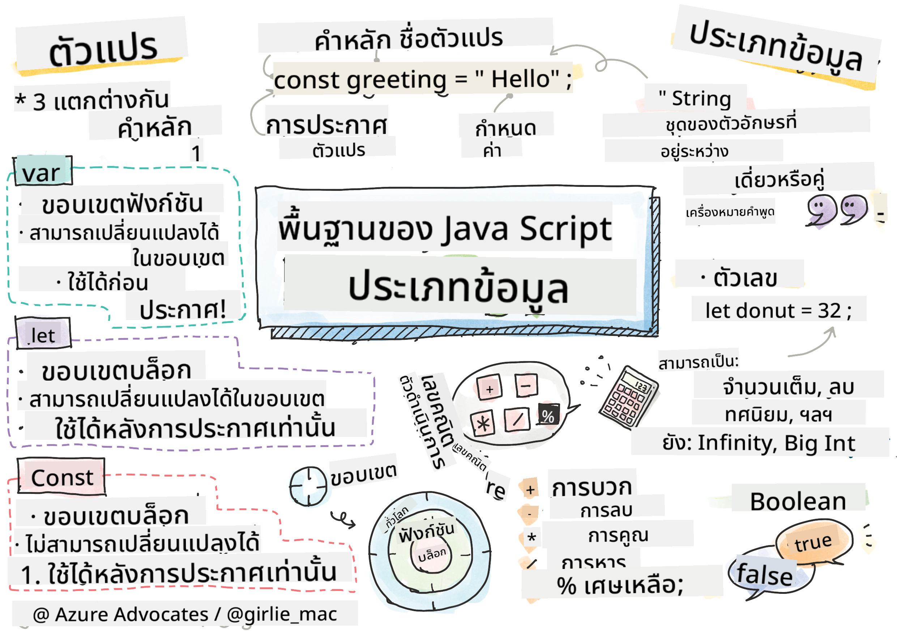

<!--
CO_OP_TRANSLATOR_METADATA:
{
  "original_hash": "d0092f6533ae3ec3adad5b5ece68efaf",
  "translation_date": "2025-10-23T20:42:37+00:00",
  "source_file": "2-js-basics/1-data-types/README.md",
  "language_code": "th"
}
-->
# พื้นฐาน JavaScript: ประเภทข้อมูล


> สเก็ตโน้ตโดย [Tomomi Imura](https://twitter.com/girlie_mac)

ประเภทข้อมูลเป็นหนึ่งในแนวคิดพื้นฐานของ JavaScript ที่คุณจะพบในทุกโปรแกรมที่คุณเขียน ลองนึกถึงประเภทข้อมูลเหมือนระบบจัดเก็บเอกสารที่บรรณารักษ์ในอเล็กซานเดรียใช้ – พวกเขามีที่เฉพาะเจาะจงสำหรับม้วนกระดาษที่มีบทกวี คณิตศาสตร์ และบันทึกประวัติศาสตร์ JavaScript จัดระเบียบข้อมูลในลักษณะเดียวกันโดยมีหมวดหมู่ต่าง ๆ สำหรับข้อมูลประเภทต่าง ๆ

ในบทเรียนนี้ เราจะสำรวจประเภทข้อมูลหลักที่ทำให้ JavaScript ทำงานได้ คุณจะได้เรียนรู้วิธีจัดการตัวเลข ข้อความ ค่าจริง/เท็จ และเข้าใจว่าทำไมการเลือกประเภทที่ถูกต้องจึงสำคัญต่อโปรแกรมของคุณ แนวคิดเหล่านี้อาจดูเป็นนามธรรมในตอนแรก แต่เมื่อฝึกฝน คุณจะคุ้นเคยกับมัน

การเข้าใจประเภทข้อมูลจะทำให้ทุกอย่างใน JavaScript ชัดเจนขึ้น เช่นเดียวกับสถาปนิกที่ต้องเข้าใจวัสดุก่อสร้างต่าง ๆ ก่อนสร้างวิหาร แนวคิดพื้นฐานเหล่านี้จะสนับสนุนทุกสิ่งที่คุณสร้างในอนาคต

## แบบทดสอบก่อนเรียน
[แบบทดสอบก่อนเรียน](https://ff-quizzes.netlify.app/web/)

บทเรียนนี้ครอบคลุมพื้นฐานของ JavaScript ซึ่งเป็นภาษาที่ช่วยเพิ่มความสามารถในการโต้ตอบบนเว็บ

> คุณสามารถเรียนบทเรียนนี้ได้ที่ [Microsoft Learn](https://docs.microsoft.com/learn/modules/web-development-101-variables/?WT.mc_id=academic-77807-sagibbon)!

[](https://youtube.com/watch?v=JNIXfGiDWM8 "Variables in JavaScript")

[](https://youtube.com/watch?v=AWfA95eLdq8 "Data Types in JavaScript")

> 🎥 คลิกที่ภาพด้านบนเพื่อดูวิดีโอเกี่ยวกับตัวแปรและประเภทข้อมูล

มาเริ่มต้นด้วยตัวแปรและประเภทข้อมูลที่เติมเต็มมันกันเถอะ!

## ตัวแปร

ตัวแปรเป็นองค์ประกอบพื้นฐานในโปรแกรม เหมือนกับขวดที่มีฉลากที่นักเล่นแร่แปรธาตุในยุคกลางใช้เก็บสารต่าง ๆ ตัวแปรช่วยให้คุณเก็บข้อมูลและตั้งชื่อที่อธิบายได้เพื่อให้คุณสามารถอ้างอิงได้ในภายหลัง ต้องการจำอายุของใครบางคนใช่ไหม? เก็บไว้ในตัวแปรที่ชื่อว่า `age` ต้องการติดตามชื่อผู้ใช้ใช่ไหม? เก็บไว้ในตัวแปรที่ชื่อว่า `userName`

เราจะเน้นวิธีการสร้างตัวแปรใน JavaScript ที่ทันสมัย เทคนิคที่คุณจะได้เรียนรู้ที่นี่เป็นผลมาจากการพัฒนาภาษาหลายปีและแนวปฏิบัติที่ดีที่สุดที่ชุมชนโปรแกรมเมอร์พัฒนาขึ้น

การสร้างและ **ประกาศ** ตัวแปรมีไวยากรณ์ดังนี้ **[keyword] [name]** ซึ่งประกอบด้วยสองส่วน:

- **Keyword** ใช้ `let` สำหรับตัวแปรที่สามารถเปลี่ยนแปลงได้ หรือ `const` สำหรับค่าที่คงที่
- **ชื่อของตัวแปร** เป็นชื่อที่อธิบายได้ที่คุณเลือกเอง

✅ คำว่า `let` ถูกนำมาใช้ใน ES6 และให้ตัวแปรของคุณมีสิ่งที่เรียกว่า _block scope_ ขอแนะนำให้คุณใช้ `let` หรือ `const` แทนคำว่า `var` ที่เก่ากว่า เราจะครอบคลุม block scopes อย่างละเอียดในส่วนถัดไป

### งาน - การทำงานกับตัวแปร

1. **ประกาศตัวแปร** มาเริ่มต้นด้วยการสร้างตัวแปรแรกของเรา:

    ```javascript
    let myVariable;
    ```

   **สิ่งที่สิ่งนี้ทำสำเร็จ:**
   - บอก JavaScript ให้สร้างตำแหน่งจัดเก็บที่ชื่อว่า `myVariable`
   - JavaScript จัดสรรพื้นที่ในหน่วยความจำสำหรับตัวแปรนี้
   - ตัวแปรยังไม่มีค่า (undefined)

2. **ให้ค่าแก่ตัวแปร** ตอนนี้มาใส่บางสิ่งในตัวแปรของเรา:

    ```javascript
    myVariable = 123;
    ```

   **วิธีการทำงานของการกำหนดค่า:**
   - ตัวดำเนินการ `=` กำหนดค่า 123 ให้กับตัวแปรของเรา
   - ตัวแปรตอนนี้มีค่านี้แทนที่จะเป็น undefined
   - คุณสามารถอ้างอิงค่านี้ได้ทั่วทั้งโค้ดของคุณโดยใช้ `myVariable`

   > หมายเหตุ: การใช้ `=` ในบทเรียนนี้หมายถึงเราใช้ "ตัวดำเนินการกำหนดค่า" เพื่อกำหนดค่าตัวแปร ไม่ได้หมายถึงความเท่ากัน

3. **ทำให้ฉลาดขึ้น** จริง ๆ แล้ว มารวมสองขั้นตอนนี้เข้าด้วยกัน:

    ```javascript
    let myVariable = 123;
    ```

    **วิธีนี้มีประสิทธิภาพมากขึ้น:**
    - คุณกำลังประกาศตัวแปรและกำหนดค่าในคำสั่งเดียว
    - นี่เป็นแนวปฏิบัติมาตรฐานในหมู่นักพัฒนา
    - ลดความยาวของโค้ดในขณะที่ยังคงความชัดเจน

4. **เปลี่ยนใจ** ถ้าเราต้องการเก็บตัวเลขอื่นล่ะ?

   ```javascript
   myVariable = 321;
   ```

   **การเข้าใจการกำหนดค่าใหม่:**
   - ตัวแปรตอนนี้มีค่า 321 แทนที่จะเป็น 123
   - ค่าก่อนหน้านี้ถูกแทนที่ – ตัวแปรเก็บค่าได้เพียงค่าเดียวในแต่ละครั้ง
   - ความสามารถในการเปลี่ยนแปลงนี้เป็นลักษณะสำคัญของตัวแปรที่ประกาศด้วย `let`

   ✅ ลองดูสิ! คุณสามารถเขียน JavaScript ได้ในเบราว์เซอร์ของคุณ เปิดหน้าต่างเบราว์เซอร์และไปที่ Developer Tools ในคอนโซล คุณจะพบพรอมต์; พิมพ์ `let myVariable = 123` กด Enter แล้วพิมพ์ `myVariable` เกิดอะไรขึ้น? หมายเหตุ คุณจะได้เรียนรู้เพิ่มเติมเกี่ยวกับแนวคิดเหล่านี้ในบทเรียนถัดไป

## ค่าคงที่

บางครั้งคุณจำเป็นต้องเก็บข้อมูลที่ไม่ควรเปลี่ยนแปลงระหว่างการทำงานของโปรแกรม ลองนึกถึงค่าคงที่เหมือนหลักการทางคณิตศาสตร์ที่ Euclid กำหนดไว้ในกรีกโบราณ – เมื่อพิสูจน์และบันทึกแล้ว มันยังคงคงที่สำหรับการอ้างอิงในอนาคต

ค่าคงที่ทำงานคล้ายกับตัวแปร แต่มีข้อจำกัดสำคัญ: เมื่อคุณกำหนดค่าให้แล้ว คุณไม่สามารถเปลี่ยนแปลงได้ ความไม่เปลี่ยนแปลงนี้ช่วยป้องกันการแก้ไขค่าที่สำคัญในโปรแกรมของคุณโดยไม่ได้ตั้งใจ

การประกาศและการกำหนดค่าคงที่มีแนวคิดเดียวกับตัวแปร ยกเว้นคำว่า `const` ค่าคงทีมักจะถูกประกาศด้วยตัวอักษรใหญ่ทั้งหมด

```javascript
const MY_VARIABLE = 123;
```

**นี่คือสิ่งที่โค้ดนี้ทำ:**
- **สร้าง** ค่าคงที่ชื่อ `MY_VARIABLE` ที่มีค่า 123
- **ใช้** การตั้งชื่อแบบตัวอักษรใหญ่สำหรับค่าคงที่
- **ป้องกัน** การเปลี่ยนแปลงค่าในอนาคต

ค่าคงที่มีสองกฎหลัก:

- **คุณต้องกำหนดค่าให้ทันที** – ไม่อนุญาตให้มีค่าคงที่ว่างเปล่า!
- **คุณไม่สามารถเปลี่ยนแปลงค่านั้นได้** – JavaScript จะแสดงข้อผิดพลาดหากคุณพยายาม ลองดูตัวอย่าง:

   **ค่าธรรมดา** - สิ่งต่อไปนี้ไม่ได้รับอนุญาต:
   
      ```javascript
      const PI = 3;
      PI = 4; // ไม่อนุญาต
      ```

   **สิ่งที่คุณต้องจำ:**
   - **การพยายาม** กำหนดค่าคงที่ใหม่จะทำให้เกิดข้อผิดพลาด
   - **ป้องกัน** การเปลี่ยนแปลงค่าที่สำคัญโดยไม่ได้ตั้งใจ
   - **รับรอง** ว่าค่าจะคงที่ตลอดโปรแกรมของคุณ
 
   **การอ้างอิงวัตถุได้รับการป้องกัน** - สิ่งต่อไปนี้ไม่ได้รับอนุญาต:
   
      ```javascript
      const obj = { a: 3 };
      obj = { b: 5 } // ไม่อนุญาต
      ```

   **การเข้าใจแนวคิดเหล่านี้:**
   - **ป้องกัน** การแทนที่วัตถุทั้งหมดด้วยวัตถุใหม่
   - **ปกป้อง** การอ้างอิงไปยังวัตถุดั้งเดิม
   - **รักษา** ตัวตนของวัตถุในหน่วยความจำ

    **ค่าของวัตถุไม่ได้รับการป้องกัน** - สิ่งต่อไปนี้ได้รับอนุญาต:
    
      ```javascript
      const obj = { a: 3 };
      obj.a = 5;  // ได้รับอนุญาต
      ```

      **การแยกแยะสิ่งที่เกิดขึ้นที่นี่:**
      - **แก้ไข** ค่าคุณสมบัติภายในวัตถุ
      - **รักษา** การอ้างอิงวัตถุเดิม
      - **แสดงให้เห็น** ว่าค่าภายในวัตถุสามารถเปลี่ยนแปลงได้ในขณะที่การอ้างอิงยังคงคงที่

   > หมายเหตุ คำว่า `const` หมายถึงการอ้างอิงได้รับการป้องกันจากการกำหนดค่าใหม่ อย่างไรก็ตาม ค่านั้นไม่ได้ _ไม่เปลี่ยนแปลง_ และสามารถเปลี่ยนแปลงได้ โดยเฉพาะอย่างยิ่งหากเป็นโครงสร้างที่ซับซ้อนเช่นวัตถุ

## ประเภทข้อมูล

JavaScript จัดระเบียบข้อมูลเป็นหมวดหมู่ต่าง ๆ ที่เรียกว่าประเภทข้อมูล แนวคิดนี้คล้ายกับวิธีที่นักปราชญ์โบราณจัดหมวดหมู่ความรู้ – อริสโตเติลแยกแยะระหว่างประเภทของการให้เหตุผลที่แตกต่างกัน โดยรู้ว่าหลักการเชิงตรรกะไม่สามารถนำไปใช้กับบทกวี คณิตศาสตร์ และปรัชญาธรรมชาติได้อย่างสม่ำเสมอ

ประเภทข้อมูลมีความสำคัญเพราะการดำเนินการต่าง ๆ ใช้กับข้อมูลประเภทต่าง ๆ เช่นเดียวกับที่คุณไม่สามารถคำนวณทางคณิตศาสตร์กับชื่อของบุคคลหรือจัดเรียงสมการทางคณิตศาสตร์ JavaScript ต้องการประเภทข้อมูลที่เหมาะสมสำหรับการดำเนินการแต่ละอย่าง การเข้าใจสิ่งนี้ช่วยป้องกันข้อผิดพลาดและทำให้โค้ดของคุณเชื่อถือได้มากขึ้น

ตัวแปรสามารถเก็บค่าประเภทต่าง ๆ ได้ เช่น ตัวเลขและข้อความ ค่าประเภทต่าง ๆ เหล่านี้เรียกว่า **ประเภทข้อมูล** ประเภทข้อมูลเป็นส่วนสำคัญของการพัฒนาซอฟต์แวร์เพราะช่วยให้นักพัฒนาสามารถตัดสินใจได้ว่าควรเขียนโค้ดอย่างไรและซอฟต์แวร์ควรทำงานอย่างไร นอกจากนี้ ประเภทข้อมูลบางประเภทมีคุณสมบัติที่เป็นเอกลักษณ์ซึ่งช่วยเปลี่ยนแปลงหรือดึงข้อมูลเพิ่มเติมจากค่า

✅ ประเภทข้อมูลยังเรียกว่าข้อมูลพื้นฐานของ JavaScript เนื่องจากเป็นประเภทข้อมูลระดับต่ำสุดที่ภาษาให้มา มีประเภทข้อมูลพื้นฐาน 7 ประเภท: string, number, bigint, boolean, undefined, null และ symbol ลองใช้เวลาสักครู่เพื่อจินตนาการว่าข้อมูลพื้นฐานแต่ละประเภทแสดงถึงอะไร เช่น `zebra` คืออะไร? แล้ว `0` ล่ะ? `true`?

### ตัวเลข

ตัวเลขเป็นประเภทข้อมูลที่ตรงไปตรงมาที่สุดใน JavaScript ไม่ว่าคุณจะทำงานกับตัวเลขเต็ม เช่น 42 ทศนิยม เช่น 3.14 หรือเลขติดลบ เช่น -5 JavaScript จะจัดการกับมันอย่างสม่ำเสมอ

จำตัวแปรของเราจากก่อนหน้านี้ได้ไหม? ตัวเลข 123 ที่เราเก็บไว้จริง ๆ แล้วเป็นประเภทข้อมูลตัวเลข:

```javascript
let myVariable = 123;
```

**ลักษณะสำคัญ:**
- JavaScript รับรู้ค่าตัวเลขโดยอัตโนมัติ
- คุณสามารถทำการคำนวณทางคณิตศาสตร์กับตัวแปรเหล่านี้ได้
- ไม่จำเป็นต้องประกาศประเภทอย่างชัดเจน

ตัวแปรสามารถเก็บตัวเลขทุกประเภท รวมถึงทศนิยมหรือเลขติดลบ ตัวเลขยังสามารถใช้ร่วมกับตัวดำเนินการทางคณิตศาสตร์ ซึ่งจะครอบคลุมใน [ส่วนถัดไป](../../../../2-js-basics/1-data-types)

### ตัวดำเนินการทางคณิตศาสตร์

ตัวดำเนินการทางคณิตศาสตร์ช่วยให้คุณสามารถทำการคำนวณทางคณิตศาสตร์ใน JavaScript ตัวดำเนินการเหล่านี้ทำงานตามหลักการเดียวกับที่นักคณิตศาสตร์ใช้มาหลายศตวรรษ – สัญลักษณ์เดียวกันที่ปรากฏในผลงานของนักปราชญ์เช่น Al-Khwarizmi ผู้พัฒนาสัญลักษณ์พีชคณิต

ตัวดำเนินการทำงานตามที่คุณคาดหวังจากคณิตศาสตร์แบบดั้งเดิม: บวกสำหรับการบวก ลบสำหรับการลบ และอื่น ๆ

มีตัวดำเนินการหลายประเภทที่ใช้เมื่อทำฟังก์ชันทางคณิตศาสตร์ และบางส่วนมีดังนี้:

| สัญลักษณ์ | คำอธิบาย                                                              | ตัวอย่าง                          |
| ---------- | ---------------------------------------------------------------------- | ---------------------------------- |
| `+`        | **การบวก**: คำนวณผลรวมของตัวเลขสองตัว                                | `1 + 2 //คำตอบที่คาดหวังคือ 3`   |
| `-`        | **การลบ**: คำนวณผลต่างของตัวเลขสองตัว                                | `1 - 2 //คำตอบที่คาดหวังคือ -1`  |
| `*`        | **การคูณ**: คำนวณผลคูณของตัวเลขสองตัว                                | `1 * 2 //คำตอบที่คาดหวังคือ 2`   |
| `/`        | **การหาร**: คำนวณผลหารของตัวเลขสองตัว                                | `1 / 2 //คำตอบที่คาดหวังคือ 0.5` |
| `%`        | **เศษเหลือ**: คำนวณเศษเหลือจากการหารของตัวเลขสองตัว                 | `1 % 2 //คำตอบที่คาดหวังคือ 1`   |

✅ ลองดูสิ! ลองทำการคำนวณทางคณิตศาสตร์ในคอนโซลของเบราว์เซอร์ของคุณ ผลลัพธ์ทำให้คุณประหลาดใจไหม?

### สตริง

ใน JavaScript ข้อมูลข้อความจะแสดงเป็นสตริง คำว่า "string" มาจากแนวคิดของตัวอักษรที่เชื่อมต่อกันเป็นลำดับ เหมือนกับวิธีที่นักเขียนในยุคกลางเชื่อมโยงตัวอักษรเพื่อสร้างคำและประโยคในต้นฉบับของพวกเขา

สตริงเป็นพื้นฐานของการพัฒนาเว็บ ข้อความทุกชิ้นที่แสดงบนเว็บไซต์ – ชื่อผู้ใช้ ป้ายปุ่ม ข้อความแสดงข้อผิดพลาด เนื้อหา – ถูกจัดการเป็นข้อมูลสตริง การเข้าใจสตริงเป็นสิ่งสำคัญสำหรับการสร้างส่วนติดต่อผู้ใช้ที่ใช้งานได้

สตริงคือตัวอักษรที่อยู่ระหว่างเครื่องหมายคำพูดเดี่ยวหรือคู่

```javascript
'This is a string'
"This is also a string"
let myString = 'This is a string value stored in a variable';
```

**การเข้าใจแนวคิดเหล่านี้:**
- **ใช้** เครื่องหมายคำพูดเดี่ยว `'` หรือเครื่องหมายคำพูดคู่ `"` เพื่อกำหนดสตริง
- **เก็บ** ข้อมูลข้อความที่สามารถรวมตัวอักษร ตัวเลข และสัญลักษณ์
- **กำหนด** ค่าสตริงให้กับตัวแปรเพื่อใช้ในภายหลัง
- **ต้องการ** เครื่องหมายคำพูดเพื่อแยกข้อความออกจากชื่อของตัวแปร

อย่าลืมใช้เครื่องหมายคำพูดเมื่อเขียนสตริง มิฉะนั้น JavaScript จะถือว่าเป็นชื่อของตัวแปร

### การจัดรูปแบบสตริง

การจัดการสตริงช่วยให้คุณรวมองค์ประกอบข้อความ รวมตัวแปร และสร้างเนื้อหาแบบไดนามิกที่ตอบสนองต่อสถานะของโปรแกรม เทคนิคนี้ช่วยให้คุณสร้างข้อความได้อย่างเป็นโปรแกรม

บ่อยครั้งที่คุณต้องการรวมสตริงหลาย ๆ ตัวเข้าด้วยกัน – กระบวนการนี้เรียกว่าการเชื่อมต่อ

ในการ **เชื่อมต่อ** สตริงสองตัวหรือมากกว่า หรือรวมเข้าด้วยกัน ให้ใช้ตัวดำเนินการ `+`

```javascript
let myString1 = "Hello";
let myString2 = "World";

myString1 + myString2 + "!"; //HelloWorld!
myString1 + " " + myString2 + "!"; //Hello World!
myString1 + ", " + myString2 + "!"; //Hello, World!
```

**ทีละขั้นตอน นี่คือสิ่งที่เกิดขึ้น:**
- **รวม** สตริงหลายตัวโดยใช้ตัวดำเนินการ `+`
- **เชื่อมต่อ** สตริงเข้าด้วยกัน
คุณสามารถบรรลุเป้าหมายการจัดรูปแบบของคุณได้ด้วยวิธีใดวิธีหนึ่ง แต่ template literals จะรักษาช่องว่างและการขึ้นบรรทัดใหม่

✅ คุณจะใช้ template literal เมื่อไหร่แทนที่จะใช้ string ธรรมดา?

### Booleans

Boolean เป็นรูปแบบข้อมูลที่ง่ายที่สุด: สามารถมีค่าได้เพียงสองค่าเท่านั้น – `true` หรือ `false` ระบบตรรกะแบบไบนารีนี้มีต้นกำเนิดมาจากงานของ George Boole นักคณิตศาสตร์ในศตวรรษที่ 19 ผู้พัฒนา Boolean algebra

แม้ว่า Boolean จะดูเรียบง่าย แต่ก็มีความสำคัญต่อการเขียนโปรแกรมอย่างมาก เพราะช่วยให้โค้ดของคุณสามารถตัดสินใจได้ตามเงื่อนไขต่าง ๆ เช่น ผู้ใช้เข้าสู่ระบบหรือยัง, ปุ่มถูกคลิกหรือไม่, หรือเงื่อนไขบางอย่างได้รับการตอบสนองหรือไม่

Boolean สามารถมีค่าได้เพียงสองค่าเท่านั้น: `true` หรือ `false` Boolean ช่วยในการตัดสินใจว่าโค้ดบรรทัดใดควรทำงานเมื่อเงื่อนไขบางอย่างได้รับการตอบสนอง ในหลายกรณี [operators](../../../../2-js-basics/1-data-types) จะช่วยในการกำหนดค่าของ Boolean และคุณจะพบว่ามักมีการกำหนดค่าเริ่มต้นหรืออัปเดตค่าของตัวแปรด้วย operator

```javascript
let myTrueBool = true;
let myFalseBool = false;
```

**ในตัวอย่างข้างต้น เราได้:**
- **สร้าง** ตัวแปรที่เก็บค่าของ Boolean `true`
- **แสดงให้เห็น** วิธีการเก็บค่าของ Boolean `false`
- **ใช้** คำสำคัญ `true` และ `false` โดยตรง (ไม่ต้องใส่เครื่องหมายคำพูด)
- **เตรียม** ตัวแปรเหล่านี้สำหรับการใช้งานในคำสั่งเงื่อนไข

✅ ตัวแปรสามารถถือว่า 'truthy' ได้หากมันประเมินค่าเป็น Boolean `true` ที่น่าสนใจคือ ใน JavaScript [ค่าทั้งหมดถือว่าเป็น truthy เว้นแต่จะถูกกำหนดให้เป็น falsy](https://developer.mozilla.org/docs/Glossary/Truthy)

---

## GitHub Copilot Agent Challenge 🚀

ใช้โหมด Agent เพื่อทำภารกิจต่อไปนี้ให้สำเร็จ:

**คำอธิบาย:** สร้างตัวจัดการข้อมูลส่วนบุคคลที่แสดงให้เห็นถึงประเภทข้อมูล JavaScript ทั้งหมดที่คุณได้เรียนรู้ในบทเรียนนี้ พร้อมกับจัดการสถานการณ์ข้อมูลในโลกจริง

**คำสั่ง:** สร้างโปรแกรม JavaScript ที่สร้างวัตถุโปรไฟล์ผู้ใช้ซึ่งประกอบด้วย: ชื่อของบุคคล (string), อายุ (number), สถานะเป็นนักเรียน (boolean), สีโปรดในรูปแบบ array และวัตถุที่อยู่ซึ่งมีคุณสมบัติ street, city และ zip code รวมถึงฟังก์ชันเพื่อแสดงข้อมูลโปรไฟล์และอัปเดตฟิลด์แต่ละรายการ อย่าลืมแสดงการเชื่อม string, template literals, การดำเนินการทางคณิตศาสตร์กับอายุ และตรรกะ Boolean สำหรับสถานะนักเรียน

เรียนรู้เพิ่มเติมเกี่ยวกับ [agent mode](https://code.visualstudio.com/blogs/2025/02/24/introducing-copilot-agent-mode) ได้ที่นี่

## 🚀 Challenge

JavaScript มีพฤติกรรมบางอย่างที่อาจทำให้นักพัฒนาสับสน ลองพิมพ์ตัวอย่างนี้ใน console ของเบราว์เซอร์: `let age = 1; let Age = 2; age == Age` แล้วสังเกตผลลัพธ์ มันจะคืนค่า `false` – คุณสามารถหาสาเหตุได้หรือไม่?

นี่เป็นหนึ่งในหลายพฤติกรรมของ JavaScript ที่ควรทำความเข้าใจ ความคุ้นเคยกับสิ่งเหล่านี้จะช่วยให้คุณเขียนโค้ดที่เชื่อถือได้มากขึ้นและแก้ไขปัญหาได้อย่างมีประสิทธิภาพ

## แบบทดสอบหลังการบรรยาย
[แบบทดสอบหลังการบรรยาย](https://ff-quizzes.netlify.app)

## ทบทวนและศึกษาด้วยตนเอง

ลองดู [รายการแบบฝึกหัด JavaScript นี้](https://css-tricks.com/snippets/javascript/) และลองทำสักข้อ คุณได้เรียนรู้อะไรบ้าง?

## งานที่ได้รับมอบหมาย

[การฝึกฝนประเภทข้อมูล](assignment.md)

---

**ข้อจำกัดความรับผิดชอบ**:  
เอกสารนี้ได้รับการแปลโดยใช้บริการแปลภาษา AI [Co-op Translator](https://github.com/Azure/co-op-translator) แม้ว่าเราจะพยายามให้การแปลมีความถูกต้อง แต่โปรดทราบว่าการแปลโดยอัตโนมัติอาจมีข้อผิดพลาดหรือความไม่ถูกต้อง เอกสารต้นฉบับในภาษาดั้งเดิมควรถือเป็นแหล่งข้อมูลที่เชื่อถือได้ สำหรับข้อมูลสำคัญ ขอแนะนำให้ใช้บริการแปลภาษามืออาชีพ เราไม่รับผิดชอบต่อความเข้าใจผิดหรือการตีความผิดที่เกิดจากการใช้การแปลนี้