# JavaScript เบื้องต้น: ประเภทข้อมูล

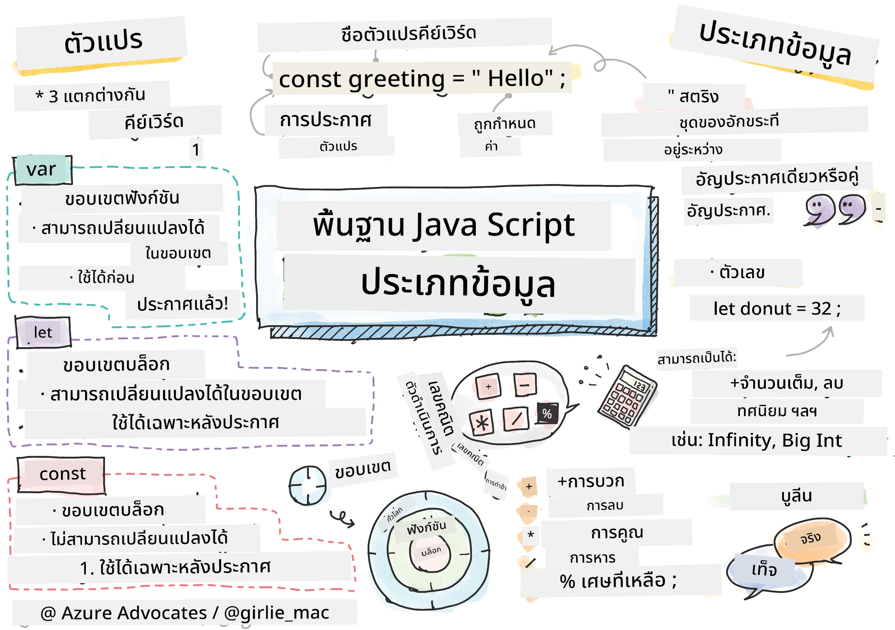
> ภาพสเก็ตช์โดย [Tomomi Imura](https://twitter.com/girlie_mac)

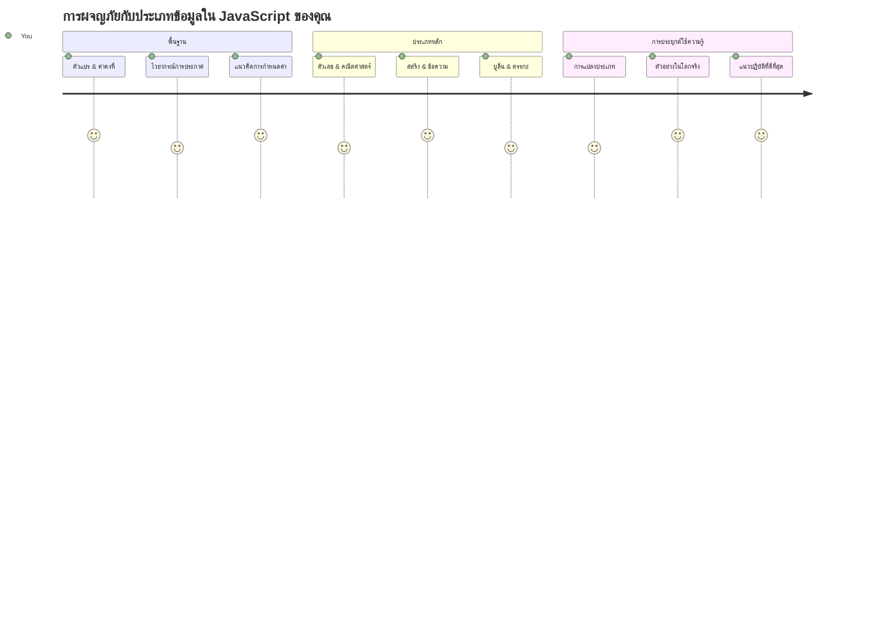
ประเภทข้อมูลเป็นหนึ่งในแนวคิดพื้นฐานของ JavaScript ที่คุณจะพบเจอในทุกโปรแกรมที่คุณเขียน ลองนึกถึงประเภทข้อมูลเหมือนระบบจัดเก็บของบรรณารักษ์โบราณในเมืองอเล็กซานเดรีย – พวกเขามีที่จัดเก็บเฉพาะสำหรับม้วนกระดาษที่เก็บบทกวี คณิตศาสตร์ และบันทึกประวัติศาสตร์ JavaScript จัดการข้อมูลในลักษณะที่คล้ายกันโดยแยกเป็นหมวดหมู่ต่างๆ สำหรับข้อมูลแต่ละชนิด

ในบทเรียนนี้ เราจะสำรวจประเภทข้อมูลหลักที่ทำให้ JavaScript ทำงานได้ คุณจะได้เรียนรู้วิธีจัดการกับตัวเลข ข้อความ ค่าจริง/เท็จ และเข้าใจว่าทำไมการเลือกประเภทข้อมูลที่ถูกต้องจึงมีความสำคัญสำหรับโปรแกรมของคุณ แนวคิดเหล่านี้อาจดูเป็นนามธรรมในตอนแรก แต่เมื่อฝึกฝนแล้ว จะกลายเป็นเรื่องปกติไปเอง

การเข้าใจประเภทข้อมูลจะทำให้ทุกอย่างใน JavaScript ชัดเจนขึ้นมาก เหมือนกับที่สถาปนิกต้องเข้าใจวัสดุก่อสร้างต่างๆ ก่อนที่จะสร้างโบสถ์ ศาสตร์พื้นฐานเหล่านี้จะสนับสนุนทุกสิ่งที่คุณจะสร้างในอนาคต

## แบบทดสอบก่อนเรียน
[Pre-lecture quiz](https://ff-quizzes.netlify.app/web/)

บทเรียนนี้ครอบคลุมพื้นฐานของ JavaScript ซึ่งเป็นภาษาโปรแกรมที่ใช้เพิ่มความโต้ตอบในเว็บ

> คุณสามารถเรียนบทเรียนนี้ได้ที่ [Microsoft Learn](https://docs.microsoft.com/learn/modules/web-development-101-variables/?WT.mc_id=academic-77807-sagibbon)!

[](https://youtube.com/watch?v=JNIXfGiDWM8 "Variables in JavaScript")

[](https://youtube.com/watch?v=AWfA95eLdq8 "Data Types in JavaScript")

> 🎥 คลิกที่รูปภาพด้านบนเพื่อดูวิดีโอเกี่ยวกับตัวแปรและประเภทข้อมูล

เริ่มกันที่ตัวแปรและประเภทข้อมูลที่ใช้เก็บข้อมูลกันเลย!

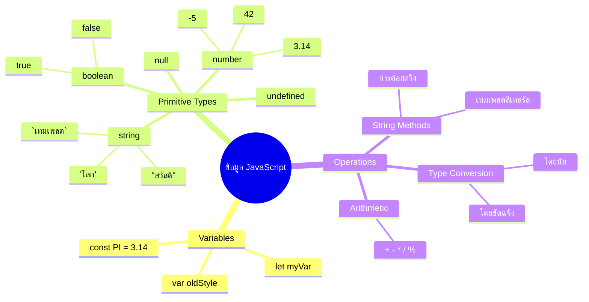
## ตัวแปร

ตัวแปรคือตัวสร้างพื้นฐานในโปรแกรม เหมือนกับโหลที่ติดป้ายชื่อซึ่งนักเล่นแร่แปรธาตุในยุคกลางใช้เก็บสารต่าง ๆ ตัวแปรช่วยให้คุณเก็บข้อมูลและตั้งชื่อที่บ่งบอก เพื่อให้คุณสามารถอ้างอิงภายหลังได้ ต้องการจดจำอายุของใครบางคนไหม? เก็บไว้ในตัวแปรชื่อ `age` ต้องการติดตามชื่อลูกค้าไหม? เก็บไว้ในตัวแปรชื่อ `userName`

เราจะเน้นวิธีการสมัยใหม่ในการสร้างตัวแปรใน JavaScript เทคนิคที่คุณจะได้เรียนนี้สะท้อนการพัฒนาภาษามาหลายปีและแนวปฏิบัติที่ดีที่สุดที่ชุมชนนักพัฒนาได้สร้างขึ้น

การสร้างและ **ประกาศ** ตัวแปรมีไวยากรณ์ดังนี้ **[keyword] [name]** ประกอบด้วยสองส่วนดังนี้:

- **คำสำคัญ (Keyword)** ใช้ `let` สำหรับตัวแปรที่สามารถเปลี่ยนแปลงได้ หรือ `const` สำหรับค่าที่คงที่
- **ชื่อตัวแปร** เป็นชื่อที่บ่งบอกความหมายซึ่งคุณเลือกเอง

✅ คำสำคัญ `let` ถูกเพิ่มเข้ามาใน ES6 และให้ตัวแปรมีสิ่งที่เรียกว่า _block scope_ แนะนำให้ใช้ `let` หรือ `const` แทนคำเดิม `var` เราจะเรียนรู้เกี่ยวกับ block scope ให้ลึกขึ้นในบทต่อไป

### งาน - การทำงานกับตัวแปร

1. **ประกาศตัวแปร** เริ่มจากสร้างตัวแปรตัวแรกกัน:

    ```javascript
    let myVariable;
    ```
  
   **สิ่งที่เกิดขึ้น:**
   - แจ้ง JavaScript ให้สร้างที่เก็บข้อมูลชื่อ `myVariable`
   - JavaScript จัดสรรพื้นที่ในหน่วยความจำสำหรับตัวแปรนี้
   - ตัวแปรยังไม่มีค่า (undefined)

2. **กำหนดค่าให้ตัวแปร** มาลองใส่ค่าในตัวแปรกัน:

    ```javascript
    myVariable = 123;
    ```
  
   **การทำงานของการกำหนดค่า:**
   - ตัวดำเนินการ `=` กำหนดค่า 123 ให้กับตัวแปร
   - ตัวแปรตอนนี้จะเก็บค่านี้แทนที่จะเป็น undefined
   - คุณสามารถอ้างอิงค่าที่เก็บในตัวแปรนี้ภายในโค้ดได้โดยใช้ `myVariable`

   > หมายเหตุ: การใช้ `=` ในบทเรียนนี้หมายถึงตัวดำเนินการ "assignment operator" เพื่อกำหนดค่าให้ตัวแปร ไม่ได้หมายถึงการเท่ากัน

3. **ทำแบบฉลาด** จริงๆ แล้ว มารวมสองขั้นตอนนี้เข้าด้วยกัน:

    ```javascript
    let myVariable = 123;
    ```
  
    **วิธีนี้มีประสิทธิภาพกว่า:**
    - ประกาศตัวแปรและกำหนดค่าในคำสั่งเดียวกัน
    - เป็นแนวปฏิบัติที่นักพัฒนาทั่วไปใช้
    - ลดความยาวโค้ดในขณะที่ยังคงความชัดเจน

4. **เปลี่ยนใจ** ถ้าอยากเก็บเลขอื่นล่ะ?

   ```javascript
   myVariable = 321;
   ```
  
   **เข้าใจการกำหนดค่าใหม่:**
   - ตัวแปรตอนนี้มีค่า 321 แทน 123
   - ค่าก่อนหน้าถูกแทนที่ – ตัวแปรเก็บค่าได้ทีละค่าเท่านั้น
   - ความเปลี่ยนแปลงนี้คือจุดเด่นของตัวแปรที่ประกาศด้วย `let`

   ✅ ลองดู! คุณสามารถเขียนโค้ด JavaScript ได้ในเบราว์เซอร์ เปิดหน้าเบราว์เซอร์และไปที่ Developer Tools บนแท็บ console จะมีช่องให้พิมพ์คำสั่ง; พิมพ์ `let myVariable = 123` แล้วกด Enter จากนั้นพิมพ์ `myVariable` ผลลัพธ์เป็นอย่างไร? คุณจะได้เรียนรู้เรื่องนี้เพิ่มเติมในบทเรียนต่อไป

### 🧠 **ตรวจสอบความเข้าใจตัวแปร: รู้สึกคุ้นเคยหรือยัง**

**ลองดูว่าคุณเข้าใจตัวแปรแค่ไหน:**
- อธิบายความแตกต่างระหว่างการประกาศและกำหนดค่าตัวแปรได้ไหม?
- จะเกิดอะไรขึ้นถ้าคุณพยายามใช้ตัวแปรก่อนประกาศ?
- เมื่อไรคุณจะเลือกใช้ `let` แทน `const`?

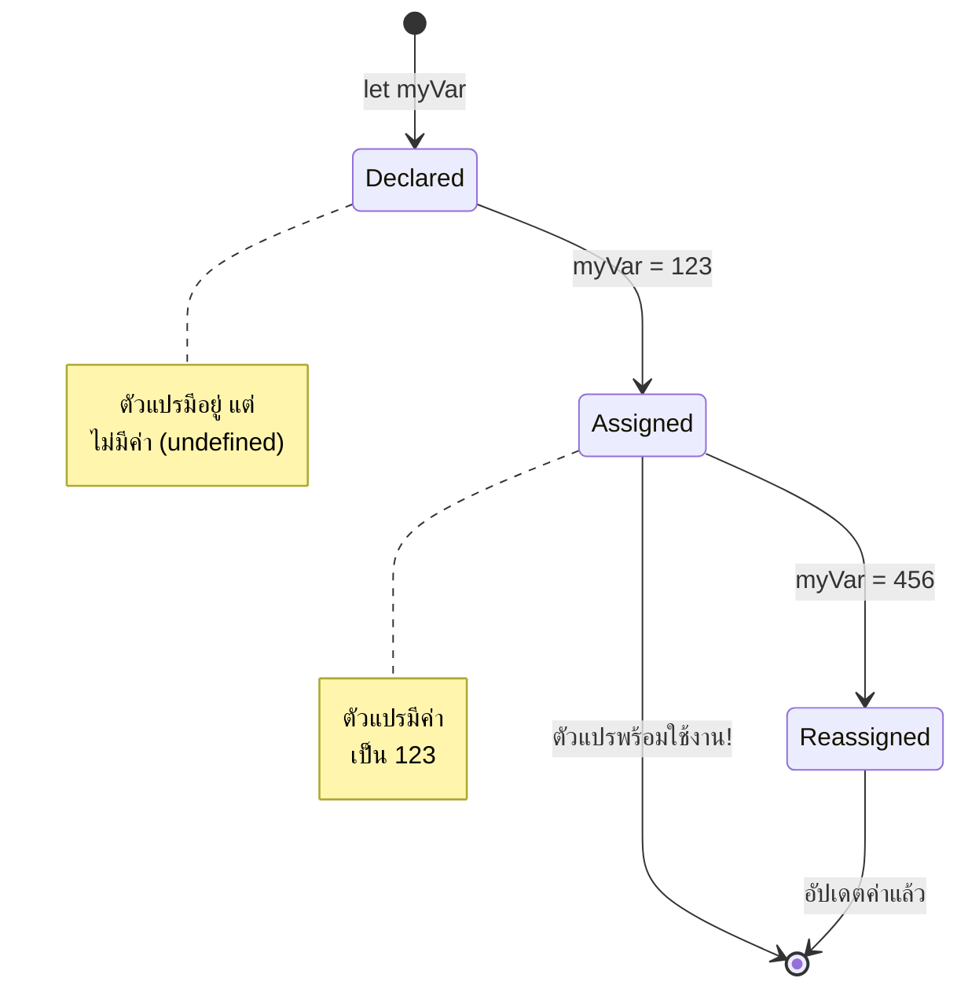
> **คำแนะนำเร็ว**: คิดว่าตัวแปรเหมือนกล่องเก็บของที่มีป้าย คุณสร้างกล่อง (`let`) ใส่ของ (`=`) และสามารถเปลี่ยนของในกล่องได้ทีหลัง!

## ค่าคงที่ (Constants)

บางครั้งคุณต้องเก็บข้อมูลซึ่งไม่ควรเปลี่ยนแปลงตลอดเวลาที่โปรแกรมทำงาน คิดถึงค่าคงที่เหมือนหลักการคณิตศาสตร์ที่ยูคลิดกำหนดในกรีกโบราณ – เมื่อตั้งหลักการแล้วและบันทึกไว้ มันจะคงที่ตลอดไป

ค่าคงที่ทำงานคล้ายตัวแปร แต่มีข้อจำกัดสำคัญ: เมื่อตั้งค่าคงที่แล้วค่าไม่สามารถเปลี่ยนแปลงได้ คุณสมบัตินี้ช่วยป้องกันไม่ให้เกิดการแก้ไขค่าที่สำคัญโดยบังเอิญในโปรแกรม

การประกาศและตั้งค่าค่าคงที่ทำเหมือนกับตัวแปร แต่ใช้คำสำคัญ `const` ซึ่งโดยทั่วไปค่าคงที่จะตั้งด้วยตัวพิมพ์ใหญ่ทั้งหมด

```javascript
const MY_VARIABLE = 123;
```
  
**โค้ดนี้ทำอะไร:**
- **สร้าง** ค่าคงที่ชื่อ `MY_VARIABLE` ที่มีค่า 123
- **ใช้** ตัวพิมพ์ใหญ่ทั้งหมดเพื่อระบุค่าคงที่
- **ป้องกัน** การเปลี่ยนแปลงค่าในอนาคต

ค่าคงที่มีสองกฎหลัก:

- **ต้องกำหนดค่าเลยทันที** – ไม่อนุญาตให้ค่าคงที่ว่างเปล่า!
- **ไม่สามารถเปลี่ยนค่าได้เลย** – JavaScript จะรายงานข้อผิดพลาดถ้าพยายามทำ ลองดูสิ:

   **ค่าธรรมดา** – ต่อไปนี้ไม่อนุญาต:
   
      ```javascript
      const PI = 3;
      PI = 4; // ไม่อนุญาต
      ```

   **สิ่งที่ควรจำ:**
   - **การพยายาม** ตั้งค่าคงที่ใหม่จะเกิดข้อผิดพลาด
   - **ป้องกัน** การเปลี่ยนค่าโดยไม่ตั้งใจ
   - **ทำให้** ค่าคงที่เป็นที่เชื่อถือได้ตลอดโปรแกรม
 
   **การอ้างอิงอ็อบเจ็กต์ถูกป้องกัน** – ต่อไปนี้ไม่อนุญาต:
   
      ```javascript
      const obj = { a: 3 };
      obj = { b: 5 } // ไม่อนุญาต
      ```

   **เข้าใจแนวคิดนี้:**
   - **ป้องกัน** การแทนอ็อบเจ็กต์ต้นฉบับด้วยอ็อบเจ็กต์ใหม่
   - **รักษา** การอ้างอิงไปยังอ็อบเจ็กต์เดิม
   - **ทำให้** อัตลักษณ์ของอ็อบเจ็กต์ไม่เปลี่ยนแปลงในหน่วยความจำ

    **ค่าสมบัติภายในอ็อบเจ็กต์เปลี่ยนได้** – ต่อไปนี้อนุญาต:
    
      ```javascript
      const obj = { a: 3 };
      obj.a = 5;  // อนุญาต
      ```

      **สิ่งที่เกิดขึ้น:**
      - **แก้ไข** ค่าสมบัติภายในอ็อบเจ็กต์
      - **เก็บ** การอ้างอิงไปยังอ็อบเจ็กต์เดิม
      - **แสดงให้เห็น** ว่าสมบัติของอ็อบเจ็กต์สามารถเปลี่ยนแปลงได้ในขณะที่อ้างอิงคงที่

   > หมายเหตุ `const` หมายความว่าการอ้างอิงถูกป้องกันไม่ให้ถูกเปลี่ยนแปลง ค่าเองไม่จำเป็นต้องไม่เปลี่ยนแปลง (_immutable_) และสามารถเปลี่ยนได้ โดยเฉพาะอย่างยิ่งถ้าเป็นโครงสร้างซับซ้อนเช่นอ็อบเจ็กต์

## ประเภทข้อมูล

JavaScript จัดข้อมูลออกเป็นหมวดหมู่ที่เรียกว่าประเภทข้อมูล แนวคิดนี้คล้ายกับที่นักปราชญ์โบราณแยกประเภทความรู้ – อริสโตเติลจำแนกประเภทตรรกะต่างๆ อย่างชัดเจนว่าไม่สามารถประยุกต์ใช้หลักตรรกะเดียวกับบทกวี คณิตศาสตร์ และปรัชญาธรรมชาติได้อย่างเท่าเทียมกัน

ประเภทข้อมูลสำคัญเพราะการดำเนินการต่าง ๆ ทำงานกับข้อมูลชนิดต่างกันได้ไม่เหมือนกัน เหมือนกับคุณไม่สามารถคำนวณทางคณิตศาสตร์กับชื่อคน หรือจัดเรียงสมการคณิตศาสตร์ตามตัวอักษรได้ JavaScript ต้องการประเภทข้อมูลที่เหมาะสมสำหรับการทำงานแต่ละอย่าง การเข้าใจเรื่องนี้ช่วยป้องกันความผิดพลาดและทำให้โค้ดน่าเชื่อถือมากขึ้น

ตัวแปรสามารถเก็บค่าได้หลายประเภท เช่น ตัวเลขและข้อความ ประเภทของค่าที่ต่างกันเหล่านี้เรียกว่า **ประเภทข้อมูล (data type)** ประเภทข้อมูลเป็นส่วนสำคัญของการพัฒนาโปรแกรมเพราะช่วยให้นักพัฒนาตัดสินใจได้ว่าโค้ดควรเขียนอย่างไรและโปรแกรมควรทำงานอย่างไร นอกจากนี้ บางประเภทข้อมูลมีคุณสมบัติเฉพาะช่วยแปลงหรือดึงข้อมูลเพิ่มเติมจากค่าที่เก็บได้

✅ ประเภทข้อมูลยังเรียกว่า data primitives ของ JavaScript ซึ่งเป็นประเภทข้อมูลพื้นฐานที่สุดที่ภาษามีอยู่ มี 7 ประเภท primitives คือ string, number, bigint, boolean, undefined, null และ symbol ลองนึกถึงสิ่งที่แต่ละ primitive อาจแทน เช่น `zebra` คืออะไร? แล้ว `0` หละ? หรือ `true`?

### ตัวเลข (Numbers)

ตัวเลขเป็นประเภทข้อมูลที่ตรงไปตรงมาที่สุดใน JavaScript ไม่ว่าคุณจะใช้เลขจำนวนเต็ม เช่น 42 เลขทศนิยม เช่น 3.14 หรือเลขศูนย์ลบ เช่น -5 JavaScript จะจัดการเหมือนกันหมด

จำตัวแปรที่เราสร้างไว้ก่อนหน้านี้ได้ไหม? ค่าที่เราเก็บ 123 นั้นเป็นประเภทข้อมูลตัวเลขจริงๆ:

```javascript
let myVariable = 123;
```
  
**ลักษณะสำคัญ:**
- JavaScript รู้จักค่าตัวเลขโดยอัตโนมัติ
- คุณสามารถทำคำนวณทางคณิตศาสตร์กับตัวแปรพวกนี้ได้
- ไม่จำเป็นต้องประกาศประเภทข้อมูลอย่างชัดเจน

ตัวแปรสามารถเก็บตัวเลขทุกประเภทได้ รวมถึงทศนิยมและตัวเลขลบ ตัวเลขยังสามารถใช้กับตัวดำเนินการทางคณิตศาสตร์ ซึ่งเราจะอธิบายใน [ส่วนถัดไป](../../../../2-js-basics/1-data-types)

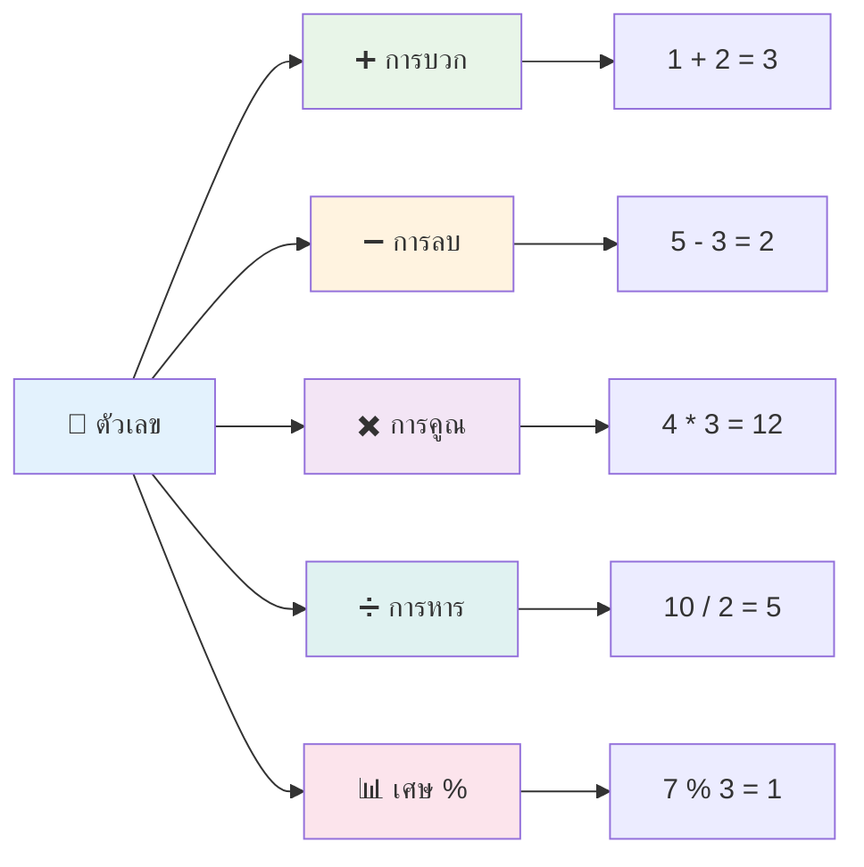
### ตัวดำเนินการทางคณิตศาสตร์

ตัวดำเนินการทางคณิตศาสตร์ช่วยให้คุณทำการคำนวณทางคณิตศาสตร์ใน JavaScript ตัวดำเนินการเหล่านี้เป็นไปตามหลักการเดียวกับที่นักคณิตศาสตร์ใช้มาหลายศตวรรษ – สัญลักษณ์เดียวกับที่ปรากฏในผลงานของนักปราชญ์อย่าง อัล-คอวาริซมี ซึ่งพัฒนาระบบสัญลักษณ์ทางพีชคณิต

ตัวดำเนินการทำงานตามที่คุณคาดหวังจากคณิตศาสตร์ทั่วไป เช่น บวกสำหรับการบวก ลบสำหรับการลบ เป็นต้น

มีตัวดำเนินการหลายประเภทเมื่อทำฟังก์ชันทางคณิตศาสตร์ บางตัวที่ใช้บ่อยได้แก่:

| สัญลักษณ์ | คำอธิบาย                                                             | ตัวอย่าง                         |
| --------- | -------------------------------------------------------------------- | -------------------------------- |
| `+`       | **บวก**: คำนวณผลบวกของตัวเลขสองตัว                                 | `1 + 2 // คำตอบที่คาดหวังคือ 3` |
| `-`       | **ลบ**: คำนวณผลต่างของตัวเลขสองตัว                                | `1 - 2 // คำตอบที่คาดหวังคือ -1`|
| `*`       | **คูณ**: คำนวณผลคูณของตัวเลขสองตัว                                | `1 * 2 // คำตอบที่คาดหวังคือ 2` |
| `/`       | **หาร**: คำนวณผลหารของตัวเลขสองตัว                               | `1 / 2 // คำตอบที่คาดหวังคือ 0.5`|
| `%`       | **เศษเหลือ**: คำนวณเศษเหลือเมื่อหารตัวเลขสองตัว                 | `1 % 2 // คำตอบที่คาดหวังคือ 1` |

✅ ลองดู! ลองทำการคำนวณทางคณิตศาสตร์ใน console ของเบราว์เซอร์ คุณรู้สึกประหลาดใจกับผลลัพธ์ไหม?

### 🧮 **ทดสอบทักษะคณิตศาสตร์: คำนวณอย่างมั่นใจ**

**ทดสอบความเข้าใจทางคณิตศาสตร์ของคุณ:**
- ความแตกต่างระหว่าง `/` (หาร) และ `%` (เศษเหลือ) คืออะไร?
- คุณทำนายได้ไหมว่า `10 % 3` จะเท่ากับเท่าไหร่? (ฮินต์: ไม่ใช่ 3.33...)
- ทำไมตัวดำเนินการเศษเหลือถึงมีประโยชน์ในโปรแกรมมิ่ง?

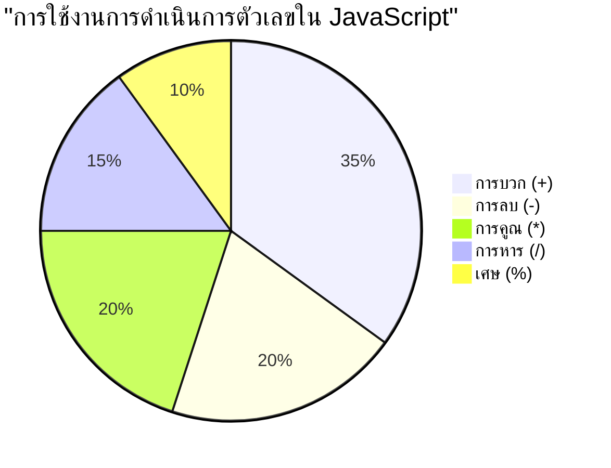
> **คำแนะนำจากโลกจริง**: ตัวดำเนินการเศษเหลือ (%) มีประโยชน์มากสำหรับตรวจสอบเลขคู่/คี่ สร้างแพทเทิร์น หรือหมุนวนผ่านอาร์เรย์!

### ข้อความ (Strings)

ใน JavaScript ข้อมูลข้อความจะแทนด้วยสตริง คำว่า "สตริง" มาจากแนวคิดของตัวอักษรที่ถูกเรียงต่อกันเป็นลำดับ เหมือนกับที่นักเขียนในอารามยุคกลางเชื่อมตัวอักษรเพื่อสร้างคำและประโยคในคัมภีร์ของพวกเขา

สตริงเป็นองค์ประกอบสำคัญของการพัฒนาเว็บ ข้อความทุกชิ้นที่แสดงบนเว็บไซต์ – ชื่อผู้ใช้ ป้ายปุ่ม ข้อความแสดงความผิดพลาด เนื้อหา – ถูกจัดการเป็นข้อมูลสตริง การเข้าใจสตริงเป็นสิ่งจำเป็นสำหรับการสร้างส่วนต่อประสานผู้ใช้ที่ใช้งานได้ดี

สตริงคือชุดตัวอักษรที่อยู่ระหว่างเครื่องหมายคำพูดเดี่ยวหรือคู่

```javascript
'This is a string'
"This is also a string"
let myString = 'This is a string value stored in a variable';
```
  
**ทำความเข้าใจแนวคิด:**
- **ใช้** เครื่องหมายคำพูดเดี่ยว `'` หรือคู่ `"` เพื่อกำหนดสตริง
- **เก็บ** ข้อมูลข้อความซึ่งรวมตัวอักษร ตัวเลข และสัญลักษณ์ต่าง ๆ
- **กำหนดค่า** สตริงให้ตัวแปรเพื่อใช้งานภายหลัง
- **ต้อง** ใช้เครื่องหมายคำพูดเพื่อแยกระหว่างข้อความกับชื่อตัวแปร

อย่าลืมใส่เครื่องหมายคำพูดเมื่อเขียนสตริง มิฉะนั้น JavaScript จะถือว่าเป็นชื่อตัวแปรแทน

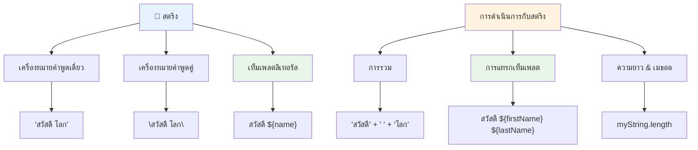
### การจัดรูปแบบสตริง

การจัดการกับสตริงช่วยให้คุณรวมข้อความหลายๆ ส่วนเข้าด้วยกัน ใส่ตัวแปรภายในข้อความ และสร้างเนื้อหาแบบไดนามิกที่ตอบสนองตามสถานะโปรแกรม เทคนิคนี้ทำให้คุณสร้างข้อความขึ้นโดยโปรแกรมได้

บ่อยครั้งที่คุณต้องรวมสตริงหลายชิ้นเข้าด้วยกัน – กระบวนการนี้เรียกว่าการเชื่อมสตริง (concatenation)
ในการ **เชื่อมต่อ** สตริงสองตัวขึ้นไป หรือรวมเข้าด้วยกัน ให้ใช้ตัวดำเนินการ `+`

```javascript
let myString1 = "Hello";
let myString2 = "World";

myString1 + myString2 + "!"; //สวัสดีชาวโลก!
myString1 + " " + myString2 + "!"; //สวัสดี โลก!
myString1 + ", " + myString2 + "!"; //สวัสดี, โลก!
```

**ทีละขั้นตอน นี่คือสิ่งที่เกิดขึ้น:**
- **รวม** สตริงหลายตัวโดยใช้ตัวดำเนินการ `+`
- **เชื่อม** สตริงเข้าด้วยกันโดยตรงโดยไม่มีช่องว่างในตัวอย่างแรก
- **เพิ่ม** ตัวอักษรเว้นวรรค `" "` ระหว่างสตริงเพื่อให้อ่านง่ายขึ้น
- **แทรก** เครื่องหมายวรรคตอน เช่น เครื่องหมายจุลภาคเพื่อสร้างรูปแบบที่ถูกต้อง

✅ ทำไม `1 + 1 = 2` ใน JavaScript แต่ `'1' + '1' = 11`? ลองคิดดูสิ แล้ว `'1' + 1` ล่ะ?

**Template literals** คือวิธีการจัดรูปแบบสตริงอีกแบบหนึ่ง โดยแทนที่การใช้เครื่องหมายคำพูดด้วย backtick (`) สิ่งที่ไม่ใช่ข้อความธรรมดาจะต้องวางไว้ในตัวแทนที่ `${ }` ซึ่งรวมถึงตัวแปรใด ๆ ที่อาจเป็นสตริงด้วย

```javascript
let myString1 = "Hello";
let myString2 = "World";

`${myString1} ${myString2}!` //สวัสดี โลก!
`${myString1}, ${myString2}!` //สวัสดี, โลก!
```

**มาทำความเข้าใจแต่ละส่วน:**
- **ใช้** backtick `` ` `` แทนที่จะเป็นเครื่องหมายคำพูดปกติเพื่อสร้าง template literals
- **ฝัง** ตัวแปรโดยตรงโดยใช้ไวยากรณ์ตัวแทนที่ `${}`
- **รักษา** ช่องว่างและการจัดรูปแบบไว้เหมือนที่เขียน
- **ให้** วิธีที่สะอาดกว่าในการสร้างสตริงที่ซับซ้อนพร้อมตัวแปร

คุณสามารถทำให้รูปแบบของคุณสำเร็จได้โดยวิธีใดก็ได้ แต่ template literals จะเคารพช่องว่างและการขึ้นบรรทัดใหม่

✅ คุณจะใช้ template literal เมื่อใด เทียบกับสตริงธรรมดา?

### 🔤 **ตรวจสอบความชำนาญสตริง: ความมั่นใจในการจัดการข้อความ**

**ประเมินทักษะสตริงของคุณ:**
- คุณอธิบายได้ไหมว่าทำไม `'1' + '1'` ถึงเท่ากับ `'11'` แทนที่จะเป็น `2`?
- คุณชอบวิธีการสตริงแบบไหนที่อ่านง่ายกว่า: การเชื่อมต่อ หรือ template literals?
- จะเกิดอะไรขึ้นถ้าคุณลืมเครื่องหมายคำพูดรอบสตริง?

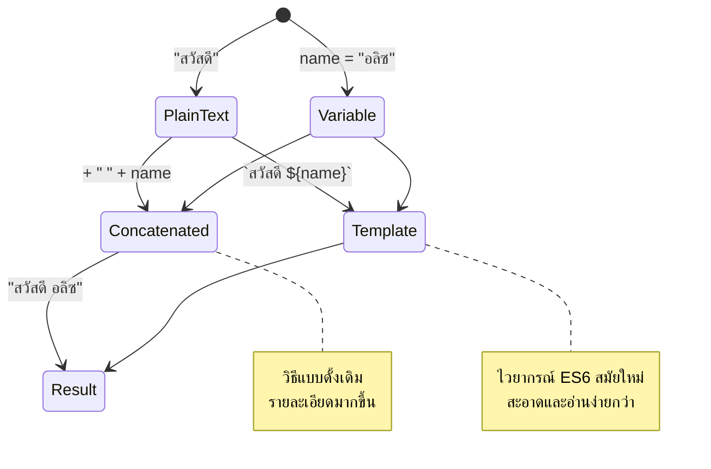
> **เคล็ดลับมือโปร**: โดยทั่วไปแล้ว template literals จะเป็นที่นิยมสำหรับการสร้างสตริงที่ซับซ้อนเพราะอ่านง่ายกว่าและจัดการสตริงหลายบรรทัดได้สวยงาม!

### บูลีน (Booleans)

บูลีนแทนรูปแบบข้อมูลที่ง่ายที่สุด: สามารถเก็บค่าได้เพียงสองค่า คือ `true` หรือ `false` ระบบตรรกะสองค่านี้มีต้นกำเนิดจากงานของ George Boole นักคณิตศาสตร์ในศตวรรษที่ 19 ผู้พัฒนาพีชคณิตบูลีน

แม้จะเรียบง่าย บูลีนมีความสำคัญต่อตรรกะโปรแกรมอย่างยิ่ง เพราะช่วยให้โค้ดของคุณสามารถตัดสินใจโดยอิงตามเงื่อนไข — ว่าผู้ใช้ได้เข้าสู่ระบบหรือไม่, ปุ่มถูกกดหรือไม่, หรือเงื่อนไขบางอย่างได้รับการตอบสนองหรือไม่

บูลีนสามารถมีค่าได้เพียงสองค่า: `true` หรือ `false` บูลีนช่วยให้ตัดสินใจได้ว่าโค้ดบางบรรทัดควรถูกเรียกใช้เมื่อเงื่อนไขบางอย่างเป็นจริงหรือไม่ ในหลายกรณี [โอเปอเรเตอร์](../../../../2-js-basics/1-data-types) ช่วยตั้งค่าค่าของบูลีน และคุณมักจะเห็นการสร้างตัวแปรหรืออัปเดตค่าของตัวแปรโดยใช้โอเปอเรเตอร์เหล่านี้

```javascript
let myTrueBool = true;
let myFalseBool = false;
```

**จากข้างต้น เราได้:**
- **สร้าง** ตัวแปรที่เก็บค่าบูลีน `true`
- **สาธิต** วิธีเก็บค่าบูลีน `false`
- **ใช้** คีย์เวิร์ด `true` และ `false` อย่างถูกต้อง (ไม่ต้องใส่เครื่องหมายคำพูด)
- **เตรียม** ตัวแปรเหล่านี้ใช้งานในคำสั่งเงื่อนไข

✅ ตัวแปรสามารถถือเป็น 'truthy' ถ้ามันประเมินค่าเป็นบูลีน `true` น่าสนใจว่าใน JavaScript [ค่าทั้งหมดถือเป็น truthy ยกเว้นที่ถูกนิยามเป็น falsy](https://developer.mozilla.org/docs/Glossary/Truthy)

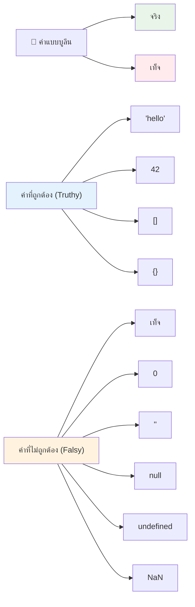
### 🎯 **ตรวจสอบตรรกะบูลีน: ทักษะการตัดสินใจ**

**ทดสอบความเข้าใจบูลีนของคุณ:**
- ทำไมคุณคิดว่า JavaScript จึงมีค่า "truthy" และ "falsy" นอกเหนือจากแค่ `true` และ `false`?
- คุณทำนายได้ไหมว่าค่าไหนเป็น falsy: `0`, `"0"`, `[]`, `"false"`?
- บูลีนมีประโยชน์อย่างไรในการควบคุมการทำงานของโปรแกรม?

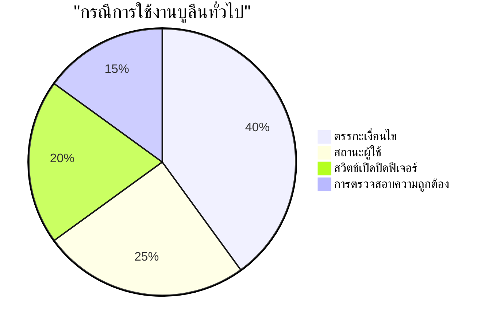
> **จำไว้**: ใน JavaScript มีค่า falsy เพียง 6 ค่า คือ `false`, `0`, `""`, `null`, `undefined` และ `NaN` ส่วนที่เหลือทั้งหมดถือเป็น truthy!

---

## 📊 **สรุปชุดเครื่องมือข้อมูลของคุณ**

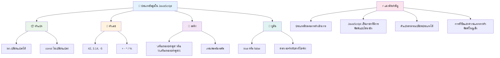
## ความท้าทาย GitHub Copilot Agent 🚀

ใช้โหมด Agent เพื่อทำความท้าทายต่อไปนี้ให้สำเร็จ:

**คำอธิบาย:** สร้างตัวจัดการข้อมูลส่วนบุคคลที่แสดงข้อมูลทุกประเภทข้อมูลใน JavaScript ที่คุณได้เรียนรู้ในบทนี้ ขณะจัดการสถานการณ์ข้อมูลจริง

**คำสั่ง:** สร้างโปรแกรม JavaScript ที่สร้างอ็อบเจกต์โปรไฟล์ผู้ใช้ซึ่งมี: ชื่อบุคคล (สตริง), อายุ (ตัวเลข), สถานะนักเรียน (บูลีน), สีโปรดเป็นอาเรย์ และอ็อบเจกต์ที่อยู่ ประกอบด้วยถนน, เมือง, และรหัสไปรษณีย์ รวมฟังก์ชันเพื่อแสดงข้อมูลโปรไฟล์และอัปเดตแต่ละฟิลด์ แน่ใจว่าได้สาธิตการเชื่อมสตริง, template literals, การคำนวณเชิงคณิตศาสตร์กับอายุ และตรรกะบูลีนสำหรับสถานะนักเรียน

เรียนรู้เพิ่มเติมเกี่ยวกับ [agent mode](https://code.visualstudio.com/blogs/2025/02/24/introducing-copilot-agent-mode) ที่นี่

## 🚀 ความท้าทาย

JavaScript มีพฤติกรรมบางอย่างที่อาจทำให้นักพัฒนาประหลาดใจ นี่คือตัวอย่างคลาสสิก: ลองพิมพ์ในคอนโซลเบราว์เซอร์ของคุณ: `let age = 1; let Age = 2; age == Age` และสังเกตผลลัพธ์ มันคืนค่า `false` – คุณสามารถหาสาเหตุได้ไหม?

นี่เป็นหนึ่งในพฤติกรรมของ JavaScript ที่ควรเข้าใจ การคุ้นเคยกับสิ่งเหล่านี้จะช่วยให้คุณเขียนโค้ดที่เชื่อถือได้มากขึ้นและแก้ไขข้อผิดพลาดได้ดีขึ้น

## แบบทดสอบหลังบรรยาย
[แบบทดสอบหลังบรรยาย](https://ff-quizzes.netlify.app)

## ทบทวน & ศึกษาด้วยตนเอง

ดูที่ [รายการแบบฝึกหัด JavaScript นี้](https://css-tricks.com/snippets/javascript/) และลองทำดู คุณได้เรียนรู้อะไรบ้าง?

## การบ้าน

[การฝึกฝนชนิดข้อมูล](assignment.md)

## 🚀 ไทม์ไลน์ความชำนาญชนิดข้อมูล JavaScript ของคุณ

### ⚡ **สิ่งที่คุณทำได้ใน 5 นาทีถัดไป**
- [ ] เปิดคอนโซลเบราว์เซอร์และสร้างตัวแปร 3 ตัวที่มีชนิดข้อมูลต่างกัน
- [ ] ลองความท้าทาย: `let age = 1; let Age = 2; age == Age` และหาสาเหตุว่าทำไมมันเป็น false
- [ ] ฝึกการเชื่อมสตริงกับชื่อและตัวเลขโปรดของคุณ
- [ ] ทดสอบสิ่งที่จะเกิดขึ้นเมื่อคุณบวกตัวเลขกับสตริง

### 🎯 **สิ่งที่คุณทำได้ภายในชั่วโมงนี้**
- [ ] ทำแบบทดสอบหลังบทเรียนและทบทวนแนวคิดที่สับสน
- [ ] สร้างเครื่องคิดเลขขนาดเล็กที่บวก ลบ คูณ และหารตัวเลขสองตัว
- [ ] สร้างรูปแบบชื่อเรียบง่ายโดยใช้ template literals
- [ ] สำรวจความแตกต่างระหว่างโอเปอเรเตอร์เปรียบเทียบ `==` และ `===`
- [ ] ฝึกแปลงชนิดข้อมูลระหว่างประเภทต่าง ๆ

### 📅 **พื้นฐาน JavaScript ของคุณในหนึ่งสัปดาห์**
- [ ] ทำการบ้านอย่างมั่นใจและสร้างสรรค์
- [ ] สร้างอ็อบเจกต์โปรไฟล์ส่วนบุคคลโดยใช้ชนิดข้อมูลที่เรียนทั้งหมด
- [ ] ฝึกทำแบบฝึกหัด JavaScript จาก [CSS-Tricks](https://css-tricks.com/snippets/javascript/)
- [ ] สร้างตัวยืนยันแบบฟอร์มง่าย ๆ โดยใช้ตรรกะบูลีน
- [ ] ทดลองกับชนิดข้อมูลอาเรย์และอ็อบเจกต์ (พรีวิวบทเรียนที่จะมา)
- [ ] เข้าร่วมชุมชน JavaScript แล้วถามคำถามเกี่ยวกับชนิดข้อมูล

### 🌟 **การเปลี่ยนแปลงในหนึ่งเดือนของคุณ**
- [ ] ผนวกความรู้ชนิดข้อมูลในโปรเจกต์โปรแกรมที่ใหญ่ขึ้น
- [ ] เข้าใจว่าเมื่อไรและทำไมต้องใช้ชนิดข้อมูลแต่ละชนิดในแอปพลิเคชันจริง
- [ ] ช่วยเหลือผู้เริ่มต้นทำความเข้าใจพื้นฐานของ JavaScript
- [ ] สร้างแอปพลิเคชันขนาดเล็กเพื่อจัดการข้อมูลผู้ใช้ชนิดต่าง ๆ
- [ ] สำรวจแนวคิดขั้นสูง เช่น การบังคับแปลงชนิดข้อมูลและการเปรียบเทียบแบบเข้มงวด
- [ ] มีส่วนร่วมในโปรเจกต์โอเพนซอร์ส JavaScript โดยปรับปรุงเอกสาร

### 🧠 **การตรวจสอบความชำนาญชนิดข้อมูลสุดท้าย**

**ฉลองความรู้พื้นฐาน JavaScript ของคุณ:**
- ชนิดข้อมูลใดทำให้คุณประหลาดใจที่สุดในเรื่องพฤติกรรมของมัน?
- คุณรู้สึกมั่นใจแค่ไหนในการอธิบายตัวแปรและค่าคงที่ให้เพื่อนฟัง?
- สิ่งที่น่าสนใจที่สุดที่คุณค้นพบเกี่ยวกับระบบชนิดข้อมูลของ JavaScript คืออะไร?
- คุณนึกภาพได้ไหมว่าจะสร้างแอปพลิเคชันจริงอะไรโดยใช้พื้นฐานเหล่านี้?

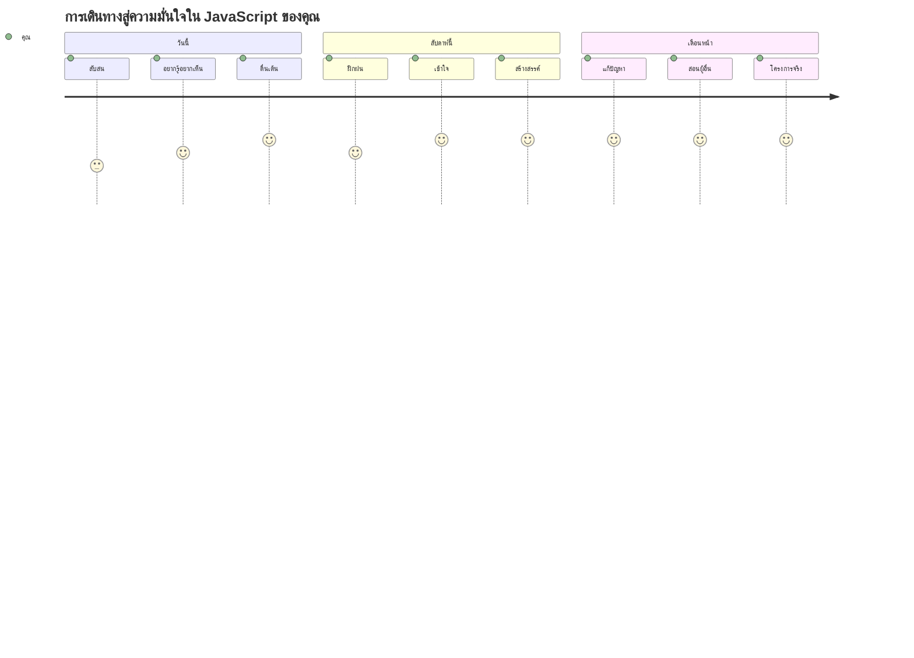
> 💡 **คุณได้สร้างรากฐานแล้ว!** การเข้าใจชนิดข้อมูลเหมือนเรียนรู้ตัวอักษรก่อนเขียนเรื่องราว ทุกโปรแกรม JavaScript ที่คุณจะเขียนจะใช้แนวคิดพื้นฐานเหล่านี้ คุณมีบล็อกสำหรับสร้างเว็บไซต์ที่โต้ตอบได้ แอปพลิเคชันไดนามิก และแก้ปัญหาโลกจริงด้วยโค้ด ยินดีต้อนรับสู่โลกมหัศจรรย์ของ JavaScript! 🎉

---

<!-- CO-OP TRANSLATOR DISCLAIMER START -->
**คำปฏิเสธความรับผิดชอบ**:
เอกสารนี้ได้รับการแปลโดยใช้บริการแปลภาษาอัตโนมัติ [Co-op Translator](https://github.com/Azure/co-op-translator) แม้เราจะพยายามให้ความถูกต้องสูงสุด แต่โปรดทราบว่าการแปลโดยอัตโนมัติอาจมีข้อผิดพลาดหรือความไม่แม่นยำ เอกสารต้นฉบับในภาษาดั้งเดิมถือเป็นแหล่งข้อมูลที่เชื่อถือได้ สำหรับข้อมูลที่สำคัญ แนะนำให้ใช้บริการแปลโดยมนุษย์มืออาชีพ เราไม่รับผิดชอบต่อความเข้าใจผิดหรือการตีความที่ผิดพลาดที่เกิดจากการใช้การแปลนี้
<!-- CO-OP TRANSLATOR DISCLAIMER END -->