# JavaScript Basics: Methods and Functions

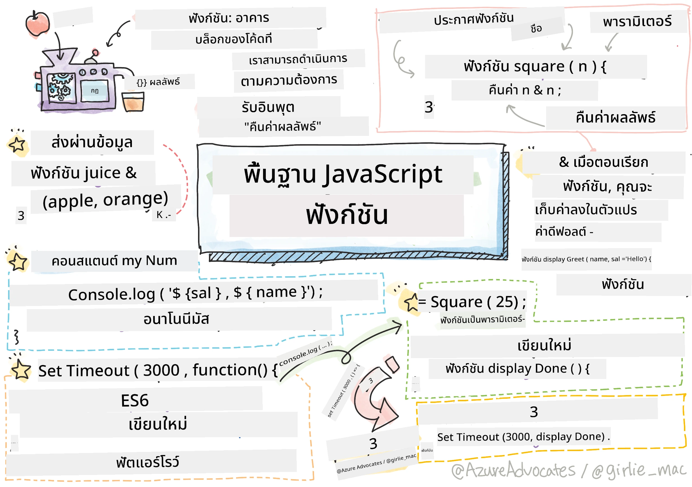
> Sketchnote by [Tomomi Imura](https://twitter.com/girlie_mac)

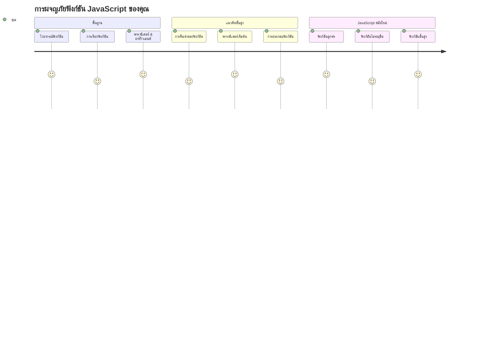
## Pre-Lecture Quiz
[แบบทดสอบก่อนบรรยาย](https://ff-quizzes.netlify.app)

การเขียนโค้ดแบบเดิมซ้ำ ๆ เป็นหนึ่งในความน่าหงุดหงิดที่พบบ่อยที่สุดในการเขียนโปรแกรม ฟังก์ชันช่วยแก้ปัญหานี้ด้วยการให้คุณแพ็กโค้ดให้อยู่ในบล็อกที่ใช้ซ้ำได้ คิดถึงฟังก์ชันเหมือนกับชิ้นส่วนมาตรฐานที่ทำให้สายพานการประกอบของ Henry Ford ธรรมดากลายเป็นนวัตกรรม — เมื่อคุณสร้างส่วนประกอบที่เชื่อถือได้แล้ว คุณสามารถใช้ซ้ำได้ทุกที่โดยไม่ต้องสร้างใหม่จากศูนย์

ฟังก์ชันช่วยให้คุณรวบรวมชิ้นส่วนของโค้ดเพื่อให้สามารถใช้ซ้ำทั่วโปรแกรมของคุณ แทนที่จะคัดลอกและวางตรรกะเดียวกันซ้ำ ๆ คุณสามารถสร้างฟังก์ชันครั้งเดียวแล้วเรียกใช้เมื่อจำเป็น วิธีนี้ช่วยให้โค้ดของคุณเป็นระเบียบและทำให้อัปเดตง่ายขึ้นมาก

ในบทเรียนนี้ คุณจะได้เรียนรู้วิธีสร้างฟังก์ชันของคุณเอง ส่งข้อมูลให้ฟังก์ชัน และรับผลลัพธ์ที่มีประโยชน์กลับมา คุณจะได้ค้นพบความแตกต่างระหว่างฟังก์ชันและเมธอด เรียนรู้วิธีเขียนซินแท็กซ์แบบใหม่ และดูว่าฟังก์ชันสามารถทำงานร่วมกับฟังก์ชันอื่น ๆ ได้อย่างไร เราจะสร้างแนวคิดเหล่านี้ทีละขั้นตอน

[](https://youtube.com/watch?v=XgKsD6Zwvlc "Methods and Functions")

> 🎥 คลิกที่ภาพด้านบนเพื่อดูวิดีโอเกี่ยวกับเมธอดและฟังก์ชัน

> คุณสามารถเรียนบทเรียนนี้บน [Microsoft Learn](https://docs.microsoft.com/learn/modules/web-development-101-functions/?WT.mc_id=academic-77807-sagibbon)!

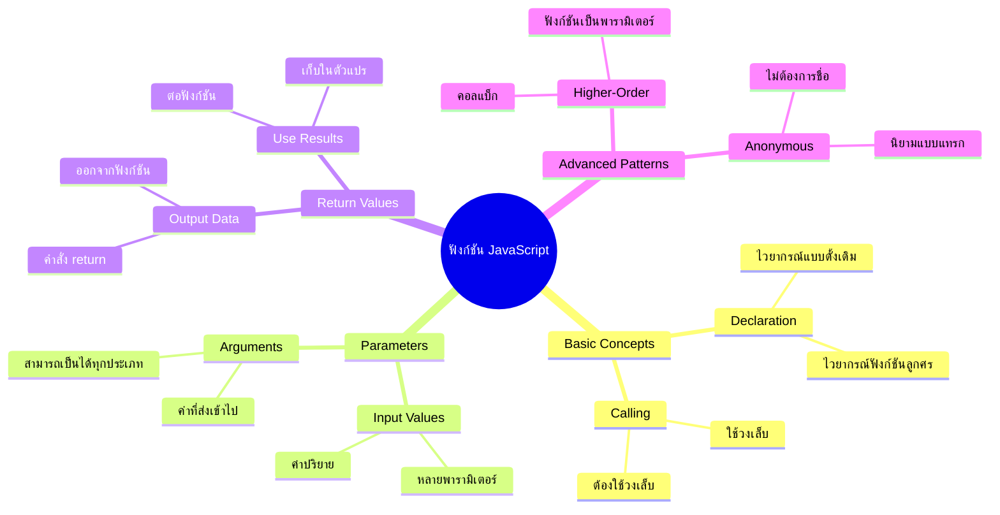
## Functions

ฟังก์ชันคือบล็อกโค้ดที่แยกตัวออกเองและทำงานเฉพาะเจาะจง มันบรรจุตรรกะที่คุณสามารถเรียกใช้ได้เมื่อจำเป็น

แทนที่จะเขียนโค้ดเดียวกันซ้ำหลายครั้งทั่วโปรแกรม คุณสามารถแพ็กโค้ดนี้ลงในฟังก์ชันแล้วเรียกใช้ฟังก์ชันเมื่อใดก็ได้ที่ต้องการ วิธีนี้ช่วยให้โค้ดของคุณสะอาดและทำให้อัปเดตง่ายขึ้น ลองนึกภาพความท้าทายในการบำรุงรักษาหากคุณต้องเปลี่ยนตรรกะที่กระจายอยู่ทั่วโค้ดโค้ดของคุณถึง 20 จุด

การตั้งชื่อฟังก์ชันให้บรรยายความหมายเป็นสิ่งสำคัญ ฟังก์ชันที่มีชื่อดีจะสื่อความหมายของมันได้ชัดเจน — เมื่อคุณเห็น `cancelTimer()` คุณจะเข้าใจได้ทันทีว่าฟังก์ชันนี้ทำอะไร เหมือนกับปุ่มที่ติดป้ายไว้อย่างชัดเจนบอกคุณว่าเมื่อคลิกแล้วจะเกิดอะไรขึ้น

## Creating and calling a function

ลองดูวิธีสร้างฟังก์ชันกัน ซินแท็กซ์จะเป็นรูปแบบที่สม่ำเสมอดังนี้:

```javascript
function nameOfFunction() { // นิยามฟังก์ชัน
 // นิยาม/เนื้อหาฟังก์ชัน
}
```

มาทำความเข้าใจกัน:
- คีย์เวิร์ด `function` บอก JavaScript ว่า "เฮ้ ฉันกำลังสร้างฟังก์ชัน!"
- `nameOfFunction` คือที่ที่คุณตั้งชื่อฟังก์ชันของคุณให้บ่งบอกความหมาย
- วงเล็บ `()` คือที่วางพารามิเตอร์ (เราจะเรียนรู้เรื่องนี้เร็ว ๆ นี้)
- เครื่องหมายปีกกา `{}` คือส่วนของโค้ดจริงที่จะทำงานเมื่อคุณเรียกฟังก์ชัน

ลองสร้างฟังก์ชันทักทายง่าย ๆ เพื่อดูตัวอย่าง:

```javascript
function displayGreeting() {
  console.log('Hello, world!');
}
```

ฟังก์ชันนี้จะแสดง "Hello, world!" ในคอนโซล เมื่อคุณกำหนดฟังก์ชันนี้แล้ว คุณสามารถใช้ได้หลายครั้งตามต้องการ

เพื่อเรียกใช้ (หรือ "call") ฟังก์ชัน ให้เขียนชื่อฟังก์ชันตามด้วยวงเล็บ JavaScript อนุญาตให้คุณกำหนดฟังก์ชันก่อนหรือหลังการเรียกใช้งาน — เครื่องยนต์ JavaScript จะจัดลำดับการทำงานให้เอง

```javascript
// เรียกใช้ฟังก์ชันของเรา
displayGreeting();
```

เมื่อคุณรันบรรทัดนี้ มันจะทำงานโค้ดทั้งหมดที่อยู่ภายในฟังก์ชัน `displayGreeting` โดยแสดงข้อความ "Hello, world!" ในคอนโซลเบราว์เซอร์ คุณสามารถเรียกฟังก์ชันนี้ซ้ำได้ตามต้องการ

### 🧠 **ฟังก์ชันเบื้องต้น: สร้างฟังก์ชันแรกของคุณ**

**มาลองตรวจสอบความเข้าใจฟังก์ชันพื้นฐานของคุณ:**
- ทำไมเราถึงใช้เครื่องหมายปีกกา `{}` ในการกำหนดฟังก์ชัน?
- จะเกิดอะไรขึ้นถ้าคุณเขียน `displayGreeting` โดยไม่มีวงเล็บ?
- ทำไมคุณถึงอยากเรียกใช้ฟังก์ชันเดียวกันหลาย ๆ ครั้ง?

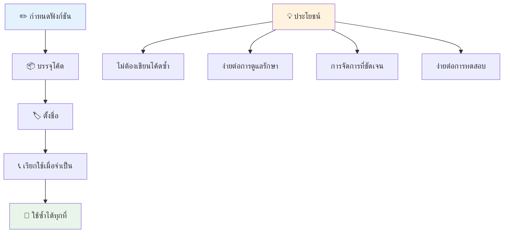
> **หมายเหตุ:** คุณใช้ **methods** ตลอดบทเรียนนี้ `console.log()` เป็นเมธอด — จริง ๆ แล้วคือฟังก์ชันที่ผูกกับอ็อบเจกต์ `console` ความแตกต่างสำคัญคือเมธอดผูกอยู่กับอ็อบเจกต์ ในขณะที่ฟังก์ชันแยกตัวเป็นอิสระ นักพัฒนาหลายคนใช้คำเหล่านี้แทนกันในบทสนทนาทั่วไป

### แนวทางปฏิบัติที่ดีสำหรับฟังก์ชัน

นี่คือเคล็ดลับเล็กน้อยที่ช่วยให้คุณเขียนฟังก์ชันได้ดีขึ้น:

- ตั้งชื่อฟังก์ชันให้ชัดเจนและบรรยายความหมาย – คุณในอนาคตจะขอบคุณ!
- ใช้ **camelCasing** สำหรับชื่อหลายคำ (เช่น `calculateTotal` แทน `calculate_total`)
- ให้ฟังก์ชันทำงานเพียงสิ่งเดียวอย่างมีประสิทธิภาพ

## Passing information to a function

ฟังก์ชัน `displayGreeting` ของเราเอาไว้แสดง "Hello, world!" เท่านั้น พารามิเตอร์ช่วยให้ฟังก์ชันยืดหยุ่นและมีประโยชน์มากขึ้น

**พารามิเตอร์** ทำหน้าที่เหมือนตัวแทนที่คุณจะใส่ค่าต่าง ๆ ลงไปในแต่ละครั้งที่ใช้ฟังก์ชัน วิธีนี้ทำให้ฟังก์ชันเดียวกันสามารถทำงานกับข้อมูลที่ต่างกันในแต่ละการเรียกใช้

เมื่อคุณกำหนดฟังก์ชัน ให้ระบุพารามิเตอร์ไว้ในวงเล็บ คั่นด้วยเครื่องหมายจุลภาคหากมีหลายพารามิเตอร์:

```javascript
function name(param, param2, param3) {

}
```

แต่ละพารามิเตอร์จะทำหน้าที่เป็นตัวแทน — เมื่อใครสักคนเรียกใช้ฟังก์ชัน จะส่งค่าจริงมาแทนที่เหล่านี้

ลองปรับฟังก์ชันทักทายให้รับชื่อคน:

```javascript
function displayGreeting(name) {
  const message = `Hello, ${name}!`;
  console.log(message);
}
```

สังเกตว่าตอนนี้เราใช้ backticks (`` ` ``) และ `${}` เพื่อแทรกชื่อคนตรง ๆ ในข้อความ — สิ่งนี้เรียกว่า template literal เป็นวิธีที่สะดวกมากในการสร้างสตริงที่มีตัวแปรผสมอยู่

ตอนนี้เมื่อเรียกฟังก์ชัน เราสามารถส่งชื่อใดก็ได้เข้าไป:

```javascript
displayGreeting('Christopher');
// แสดง "Hello, Christopher!" เมื่อรัน
```

JavaScript จะเอาสตริง `'Christopher'` ไปกำหนดให้กับพารามิเตอร์ `name` และสร้างข้อความส่วนบุคคล "Hello, Christopher!" ขึ้นมา

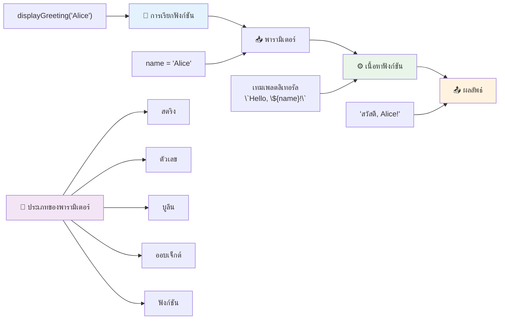
## Default values

ถ้าอยากให้บางพารามิเตอร์ไม่จำเป็นต้องใส่ (optional) เราทำได้ด้วยค่าเริ่มต้น!

สมมติว่าอยากให้ผู้ใช้ปรับคำทักทายได้ แต่ถ้าไม่ระบุจะใช้คำว่า "Hello" แทน เราสามารถกำหนดค่าดีฟอลต์ได้ด้วยเครื่องหมายเท่ากับเหมือนการตั้งตัวแปร:

```javascript
function displayGreeting(name, salutation='Hello') {
  console.log(`${salutation}, ${name}`);
}
```

ที่นี่ `name` ยังจำเป็นต้องใส่ แต่ `salutation` มีค่าดีฟอลต์เป็น `'Hello'` ถ้าไม่มีใครป้อนคำทักทายมา

ตอนนี้เราสามารถเรียกใช้ฟังก์ชันนี้ได้สองแบบ:

```javascript
displayGreeting('Christopher');
// แสดงข้อความ "Hello, Christopher"

displayGreeting('Christopher', 'Hi');
// แสดงข้อความ "Hi, Christopher"
```

การเรียกครั้งแรก JavaScript จะใช้ "Hello" ซึ่งเป็นค่าดีฟอลต์เพราะเราไม่ได้ส่งคำทักทายเข้ามา ครั้งที่สองจะใช้คำว่า "Hi" ที่เราส่งเข้าไป ฟีเจอร์นี้ทำให้ฟังก์ชันยืดหยุ่นกับสถานการณ์ที่แตกต่างกัน

### 🎛️ **ตรวจสอบความเข้าใจพารามิเตอร์: ทำให้ฟังก์ชันยืดหยุ่น**

**ทดสอบความเข้าใจเรื่องพารามิเตอร์:**
- ความแตกต่างระหว่างพารามิเตอร์กับอาร์กิวเมนต์คืออะไร?
- ทำไมค่าดีฟอลต์จึงมีประโยชน์ในโปรแกรมจริง ๆ?
- คุณคาดการณ์ได้ไหมว่าจะเกิดอะไรขึ้นถ้าส่งอาร์กิวเมนต์มากกว่าพารามิเตอร์?

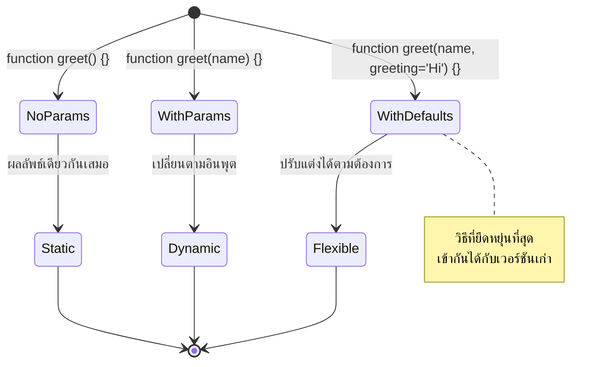
> **คำแนะนำระดับโปร:** การใช้ค่าเริ่มต้นช่วยทำให้ฟังก์ชันของคุณใช้งานง่าย ผู้ใช้เริ่มต้นได้รวดเร็วด้วยค่าดีฟอลต์ที่สมเหตุสมผล แต่ก็ยังปรับแต่งได้เมื่อจำเป็น!

## Return values

ฟังก์ชันที่เราสร้างจนถึงตรงนี้แค่แสดงข้อความในคอนโซล แต่ถ้าคุณอยากให้ฟังก์ชันคำนวณสิ่งใดสิ่งหนึ่งแล้วคืนผลลัพธ์กลับมา?

นี่แหละคือที่มาของ **ค่าคืน (return values)** แทนที่จะแค่แสดงข้อความ ฟังก์ชันสามารถส่งค่ากลับมาให้คุณเก็บไว้ในตัวแปรหรือใช้ในส่วนอื่นของโค้ดได้

ส่งค่ากลับได้โดยใช้คีย์เวิร์ด `return` ตามด้วยค่าที่ต้องการส่งกลับ:

```javascript
return myVariable;
```

สิ่งสำคัญคือ เมื่อฟังก์ชันเจอ `return` ก็จะหยุดทำงานทันทีและส่งค่ากลับให้คนที่เรียกใช้งาน

ลองดัดแปลงฟังก์ชันทักทายให้ส่งข้อความกลับแทนการแสดงผล:

```javascript
function createGreetingMessage(name) {
  const message = `Hello, ${name}`;
  return message;
}
```

ตอนนี้ฟังก์ชันนี้ไม่ได้แสดงข้อความ แต่สร้างข้อความแล้วส่งกลับมาแทน

เพื่อใช้ค่าที่คืนมา เราสามารถเก็บไว้ในตัวแปรเหมือนกับค่าทั่วไปได้:

```javascript
const greetingMessage = createGreetingMessage('Christopher');
```

ตอนนี้ `greetingMessage` จะเก็บข้อความ "Hello, Christopher" และเราสามารถใช้มันที่ไหนก็ได้ในโค้ด — จะแสดงบนเว็บเพจ ส่งในอีเมล หรือส่งไปยังฟังก์ชันอื่น

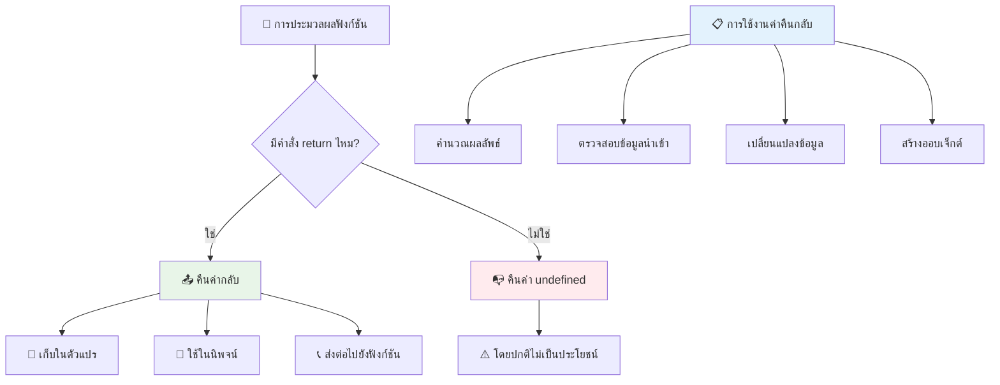
### 🔄 **ตรวจสอบค่าคืน: รับผลลัพธ์กลับ**

**ประเมินความเข้าใจค่าคืน:**
- โค้ดหลังบรรทัด `return` ในฟังก์ชันจะเกิดอะไรขึ้น?
- ทำไมการส่งค่าคืนถึงดีกว่าการแสดงผลแค่ในคอนโซล?
- ฟังก์ชันสามารถส่งค่ากลับหลายประเภทได้ไหม (เช่น สตริง ตัวเลข บูลีน)?

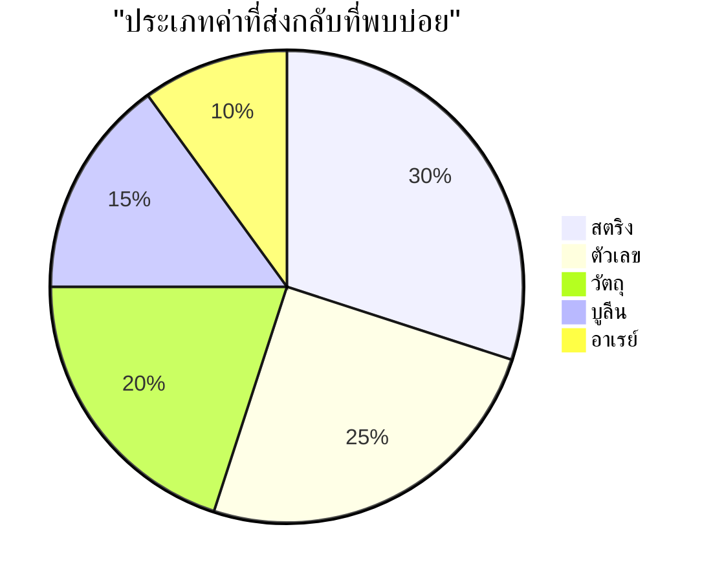
> **ข้อสังเกตสำคัญ:** ฟังก์ชันที่ส่งค่ากลับมีความยืดหยุ่นมากกว่า เพราะคนเรียกฟังก์ชันจะตัดสินใจว่าจะทำอะไรกับผลลัพธ์ ทำให้โค้ดของคุณยืดหยุ่นและใช้ซ้ำได้ง่าย!

## Functions as parameters for functions

ฟังก์ชันสามารถถูกส่งเป็นพารามิเตอร์ให้ฟังก์ชันอื่นได้ แม้แนวคิดนี้จะดูซับซ้อนในตอนแรก แต่มันเป็นฟีเจอร์ที่ทรงพลังที่ช่วยให้โปรแกรมมีความยืดหยุ่นตามรูปแบบต่างๆ

รูปแบบนี้พบได้บ่อยมากเวลาที่ต้องการพูดว่า "เมื่อบางสิ่งเกิดขึ้น ให้ทำสิ่งนี้" เช่น "เมื่อไทม์เมอร์หมดเวลา ให้รันโค้ดนี้" หรือ "เมื่อผู้ใช้คลิกปุ่ม ให้เรียกฟังก์ชันนี้"

ลองดู `setTimeout` ฟังก์ชันในตัวที่รอเวลาหนึ่งแล้วจึงรันโค้ด เราต้องบอกมันว่าให้รันโค้ดอะไร — นี่แหละจุดที่ส่งฟังก์ชันไปเป็นพารามิเตอร์เหมาะมาก!

ลองโค้ดนี้ — ผ่านไป 3 วินาที คุณจะเห็นข้อความ:

```javascript
function displayDone() {
  console.log('3 seconds has elapsed');
}
// ค่าตัวจับเวลาเป็นมิลลิวินาที
setTimeout(displayDone, 3000);
```

สังเกตว่าเราไม่ได้เรียก `displayDone` (ไม่มีวงเล็บ) แต่ส่งชื่อฟังก์ชันไปยัง `setTimeout` พร้อมบอกว่า "เรียกใช้ฟังก์ชันนี้ใน 3 วินาที"

### Anonymous functions

บางครั้งคุณแค่ต้องการฟังก์ชันเพื่องานเดียวเท่านั้นและไม่อยากตั้งชื่อ ถ้าคุณใช้งานฟังก์ชันนั้นแค่ครั้งเดียว การเพิ่มชื่อจะทำให้โค้ดรกไปโดยไม่จำเป็น

JavaScript ให้คุณสร้าง **ฟังก์ชันไร้ชื่อ (anonymous functions)** — ฟังก์ชันที่ไม่มีชื่อที่คุณกำหนดไว้ตรงที่ใช้งานเลย

นี่คือตัวอย่างการเขียน timer ใหม่โดยใช้ฟังก์ชันไร้ชื่อ:

```javascript
setTimeout(function() {
  console.log('3 seconds has elapsed');
}, 3000);
```

ผลลัพธ์เหมือนเดิม แต่ฟังก์ชันถูกกำหนดในคำสั่ง `setTimeout` โดยตรงโดยไม่ต้องประกาศฟังก์ชันแยกต่างหาก

### Fat arrow functions

JavaScript สมัยใหม่มีวิธีเขียนฟังก์ชันสั้นกว่าที่เรียกว่า **arrow functions** ใช้สัญลักษณ์ `=>` (เหมือนลูกศร — จำง่าย!) และเป็นที่นิยมในกลุ่มนักพัฒนา

Arrow functions ช่วยข้ามคีย์เวิร์ด `function` และเขียนโค้ดให้น้อยลง

นี่คือตัวอย่างโค้ดไทม์เมอร์โดยใช้ arrow function:

```javascript
setTimeout(() => {
  console.log('3 seconds has elapsed');
}, 3000);
```

วงเล็บ `()` คือที่ใส่พารามิเตอร์ (ในกรณีนี้ว่างเปล่า) ตามด้วยลูกศร `=>` และส่วนของฟังก์ชันในเครื่องหมายปีกกา ฟังก์ชันนี้ทำงานเหมือนกับตัวอย่างก่อนหน้าแต่ซินแท็กซ์สั้นกว่า

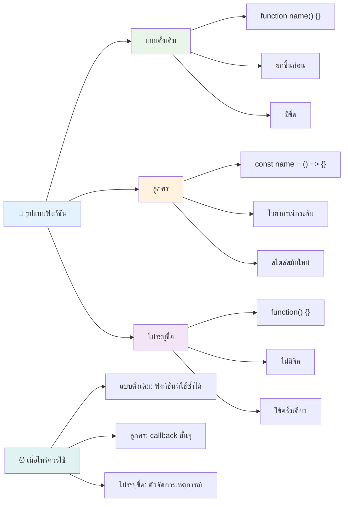
### เมื่อไหร่ควรใช้แต่ละวิธี

ควรใช้วิธีไหน? คำแนะนำง่าย ๆ: ถ้าจะใช้ฟังก์ชันนั้นหลายครั้ง ให้ตั้งชื่อและประกาศแยกต่างหาก ถ้าจะใช้แค่ครั้งเดียว ให้พิจารณาฟังก์ชันไร้ชื่อ สำหรับ arrow functions และฟังก์ชันปกติเป็นทางเลือกที่ถูกต้องทั้งคู่ แม้ arrow functions กำลังเป็นที่นิยมในโค้ด JavaScript สมัยใหม่

### 🎨 **ตรวจสอบความเข้าใจสไตล์ฟังก์ชัน: เลือกซินแท็กซ์ที่เหมาะสม**

**ทดสอบความเข้าใจซินแท็กซ์:**
- เมื่อไหร่คุณจะชอบใช้ arrow functions มากกว่าฟังก์ชันแบบดั้งเดิม?
- ข้อดีหลักของฟังก์ชันไร้ชื่อคืออะไร?
- คุณนึกสถานการณ์ที่ควรใช้ฟังก์ชันมีชื่อดีกว่าฟังก์ชันไร้ชื่อได้ไหม?

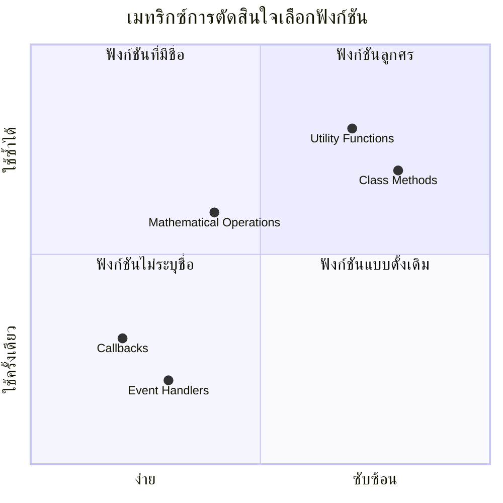
> **เทรนด์สมัยใหม่:** Arrow functions กำลังกลายเป็นตัวเลือกมาตรฐานสำหรับนักพัฒนาหลายคนเพราะซินแท็กซ์ที่สั้นกว่า แต่ฟังก์ชันแบบดั้งเดิมก็ยังคงมีประโยชน์อยู่!

---


## 🚀 Challenge

คุณสามารถอธิบายในประโยคเดียวได้ไหมว่าความแตกต่างระหว่างฟังก์ชันกับเมธอดคืออะไร? ลองดู!

## GitHub Copilot Agent Challenge 🚀

ใช้โหมด Agent เพื่อทำภารกิจต่อไปนี้:

**คำอธิบาย:** สร้างไลบรารียูทิลิตี้ของฟังก์ชันคณิตศาสตร์ที่แสดงแนวคิดฟังก์ชันต่าง ๆ ที่ครอบคลุมในบทเรียนนี้ รวมถึงพารามิเตอร์, ค่าดีฟอลต์, ค่าคืน, และ arrow functions

**พรอมต์:** สร้างไฟล์ JavaScript ชื่อ `mathUtils.js` ที่มีฟังก์ชันดังนี้:
1. ฟังก์ชัน `add` ที่รับสองพารามิเตอร์และคืนผลรวมของทั้งสอง
2. ฟังก์ชัน `multiply` ที่มีค่าพารามิเตอร์ดีฟอลต์ (พารามิเตอร์ที่สองดีฟอลต์เป็น 1)
3. ฟังก์ชันลูกศร `square` ที่รับเลขและคืนกำลังสองของเลขนั้น
4. ฟังก์ชัน `calculate` ที่รับฟังก์ชันอีกตัวเป็นพารามิเตอร์ และเลขสองตัว แล้วประยุกต์ใช้ฟังก์ชันกับตัวเลขเหล่านั้น
5. แสดงการเรียกใช้ฟังก์ชันแต่ละตัวด้วยกรณีทดสอบที่เหมาะสม

เรียนรู้เพิ่มเติมเกี่ยวกับ [agent mode](https://code.visualstudio.com/blogs/2025/02/24/introducing-copilot-agent-mode) ได้ที่นี่

## Post-Lecture Quiz
[แบบทดสอบหลังบรรยาย](https://ff-quizzes.netlify.app)

## Review & Self Study

ควร [อ่านเพิ่มเติมเกี่ยวกับ arrow functions](https://developer.mozilla.org/docs/Web/JavaScript/Reference/Functions/Arrow_functions) เพราะกำลังถูกใช้มากขึ้นในฐานโค้ด ลองฝึกเขียนฟังก์ชันและเขียนใหม่โดยใช้ซินแท็กซ์นี้ดู

## Assignment

[Fun with Functions](assignment.md)

---

## 🧰 **สรุปเครื่องมือฟังก์ชัน JavaScript ของคุณ**

```mermaid
graph TD
    A["🎯 ฟังก์ชัน JavaScript"] --> B["📋 การประกาศฟังก์ชัน"]
    A --> C["📥 พารามิเตอร์"]
    A --> D["📤 ค่าที่ส่งกลับ"]
    A --> E["🎨 ไวยากรณ์สมัยใหม่"]
    
    B --> B1["function name() {}"]
    B --> B2["การตั้งชื่อที่บ่งบอกความหมาย"]
    B --> B3["บล็อกโค้ดที่นำกลับมาใช้ใหม่ได้"]
    
    C --> C1["ข้อมูลนำเข้า"]
    C --> C2["ค่าเริ่มต้น"]
    C --> C3["พารามิเตอร์หลายตัว"]
    
    D --> D1["คำสั่ง return"]
    D --> D2["ออกจากฟังก์ชัน"]
    D --> D3["ส่งข้อมูลกลับ"]
    
    E --> E1["ฟังก์ชันลูกศร: () =>"]
    E --> E2["ฟังก์ชันไม่มีชื่อ"]
    E --> E3["ฟังก์ชันระดับสูง"]
    
    F["⚡ ประโยชน์หลัก"] --> F1["นำโค้ดกลับมาใช้ใหม่ได้"]
    F --> F2["การจัดระเบียบที่ดีขึ้น"]
    F --> F3["ทดสอบได้ง่ายขึ้น"]
    F --> F4["การออกแบบแบบโมดูล"]
    
    style A fill:#e3f2fd
    style B fill:#e8f5e8
    style C fill:#fff3e0
    style D fill:#f3e5f5
    style E fill:#e0f2f1
    style F fill:#fce4ec
```
---

## 🚀 กรอบเวลาการเป็นผู้เชี่ยวชาญฟังก์ชัน JavaScript ของคุณ

### ⚡ **สิ่งที่คุณทำได้ใน 5 นาทีข้างหน้า**
- [ ] เขียนฟังก์ชันง่าย ๆ ที่คืนค่าตัวเลขโปรดของคุณ
- [ ] สร้างฟังก์ชันที่รับพารามิเตอร์สองตัวแล้วบวกกัน
- [ ] ลองแปลงฟังก์ชันแบบดั้งเดิมเป็นไวยากรณ์ฟังก์ชันลูกศร
- [ ] ฝึกทำชาเลนจ์: อธิบายความแตกต่างระหว่างฟังก์ชันและเมธอด

### 🎯 **สิ่งที่คุณสามารถทำได้ในชั่วโมงนี้**
- [ ] ทำแบบทดสอบหลังบทเรียนให้เสร็จและทบทวนแนวคิดที่สับสน
- [ ] สร้างไลบรารีเครื่องมือคณิตศาสตร์จากชาเลนจ์ GitHub Copilot
- [ ] สร้างฟังก์ชันที่ใช้ฟังก์ชันอื่นเป็นพารามิเตอร์
- [ ] ฝึกเขียนฟังก์ชันที่มีพารามิเตอร์ค่าปริยาย
- [ ] ทดลองใช้ template literals ในค่าที่ฟังก์ชันส่งกลับ

### 📅 **การฝึกฝนฟังก์ชันตลอดสัปดาห์ของคุณ**
- [ ] ทำการบ้าน "สนุกกับฟังก์ชัน" อย่างสร้างสรรค์
- [ ] ปรับปรุงโค้ดที่เขียนซ้ำซากให้เป็นฟังก์ชันที่นำกลับมาใช้ซ้ำได้
- [ ] สร้างเครื่องคิดเลขเล็ก ๆ โดยใช้เฉพาะฟังก์ชัน (ไม่มีตัวแปร global)
- [ ] ฝึกใช้ฟังก์ชันลูกศรกับเมธอดอาร์เรย์เช่น `map()` และ `filter()`
- [ ] สร้างคอลเลกชันฟังก์ชันเครื่องมือสำหรับงานทั่วไป
- [ ] ศึกษาฟังก์ชันระดับสูงและแนวคิดการเขียนโปรแกรมเชิงฟังก์ชัน

### 🌟 **การเปลี่ยนแปลงของคุณในเดือนนี้**
- [ ] ฝึกฝนแนวคิดฟังก์ชันขั้นสูง เช่น closures และ scope
- [ ] สร้างโปรเจกต์ที่ใช้ composition ของฟังก์ชันอย่างหนัก
- [ ] มีส่วนร่วมในโอเพนซอร์สโดยพัฒนาการจัดทำเอกสารฟังก์ชัน
- [ ] สอนผู้อื่นเกี่ยวกับฟังก์ชันและไวยากรณ์ที่แตกต่างกัน
- [ ] สำรวจแนวทางการเขียนโปรแกรมเชิงฟังก์ชันใน JavaScript
- [ ] สร้างไลบรารีฟังก์ชันส่วนตัวที่นำกลับมาใช้ใหม่ได้สำหรับโปรเจกต์อนาคต

### 🏆 **การตรวจสอบแชมป์ฟังก์ชันขั้นสุดท้าย**

**เฉลิมฉลองความชำนาญด้านฟังก์ชันของคุณ:**
- ฟังก์ชันที่มีประโยชน์ที่สุดที่คุณสร้างจนถึงตอนนี้คืออะไร?
- การเรียนรู้เกี่ยวกับฟังก์ชันเปลี่ยนวิธีคิดในการจัดระเบียบโค้ดของคุณอย่างไร?
- คุณชอบไวยากรณ์ฟังก์ชันแบบไหนและเพราะอะไร?
- ปัญหาในโลกแห่งความจริงใดที่คุณจะแก้ได้ด้วยการเขียนฟังก์ชัน?

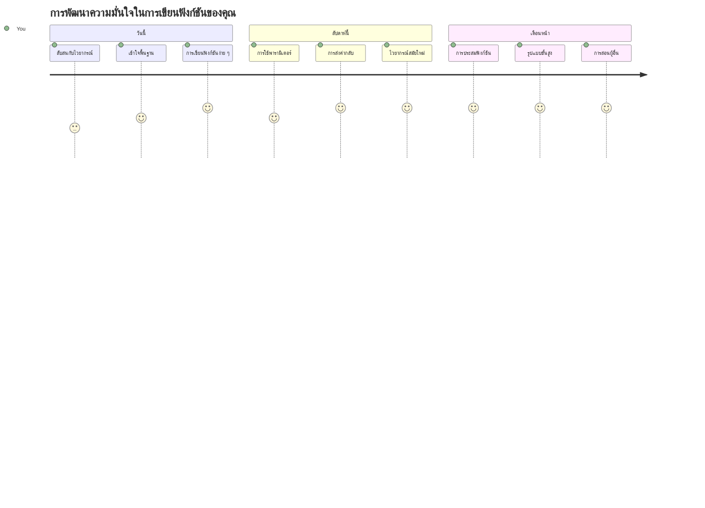
> 🎉 **คุณได้เชี่ยวชาญหนึ่งในแนวคิดที่ทรงพลังที่สุดของการเขียนโปรแกรมแล้ว!** ฟังก์ชันคือบล็อกก่อสร้างของโปรแกรมขนาดใหญ่ โปรแกรมทุกตัวที่คุณจะสร้างจะใช้ฟังก์ชันเพื่อจัดระเบียบ ใช้ซ้ำ และโครงสร้างโค้ด ตอนนี้คุณเข้าใจวิธีการบรรจุตรรกะลงในส่วนประกอบที่นำกลับมาใช้ซ้ำได้ ทำให้คุณเป็นโปรแกรมเมอร์ที่มีประสิทธิภาพและมีประสิทธิผลยิ่งขึ้น ยินดีต้อนรับสู่โลกของการเขียนโปรแกรมแบบโมดูลาร์! 🚀

---

<!-- CO-OP TRANSLATOR DISCLAIMER START -->
**ข้อจำกัดความรับผิดชอบ**:
เอกสารนี้ได้รับการแปลโดยใช้บริการแปลภาษาด้วย AI [Co-op Translator](https://github.com/Azure/co-op-translator) ถึงแม้เราจะพยายามให้มีความถูกต้องสูงสุด กรุณาทราบว่าการแปลอัตโนมัติอาจมีข้อผิดพลาดหรือความไม่ถูกต้องได้ เอกสารต้นฉบับในภาษาต้นทางถือเป็นแหล่งข้อมูลที่เชื่อถือได้ สำหรับข้อมูลสำคัญ แนะนำให้ใช้บริการแปลโดยมืออาชีพ เราไม่รับผิดชอบต่อความเข้าใจผิดหรือการตีความผิดพลาดที่เกิดขึ้นจากการใช้การแปลนี้
<!-- CO-OP TRANSLATOR DISCLAIMER END -->