<!--
CO_OP_TRANSLATOR_METADATA:
{
  "original_hash": "c688385d15dd3645e924ea0ffee8967f",
  "translation_date": "2026-01-06T21:40:13+00:00",
  "source_file": "2-js-basics/3-making-decisions/README.md",
  "language_code": "th"
}
-->
# พื้นฐาน JavaScript: การตัดสินใจ

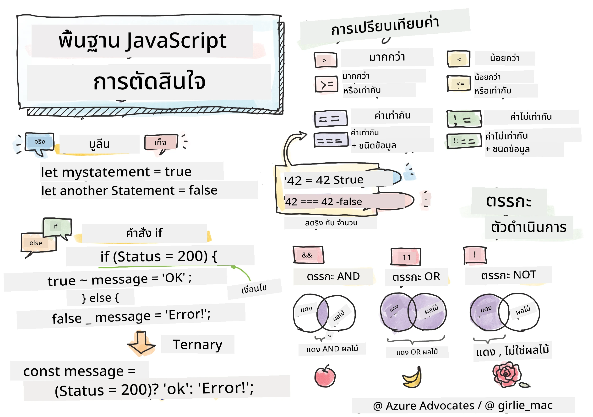

> สเก็ตช์โน้ตโดย [Tomomi Imura](https://twitter.com/girlie_mac)

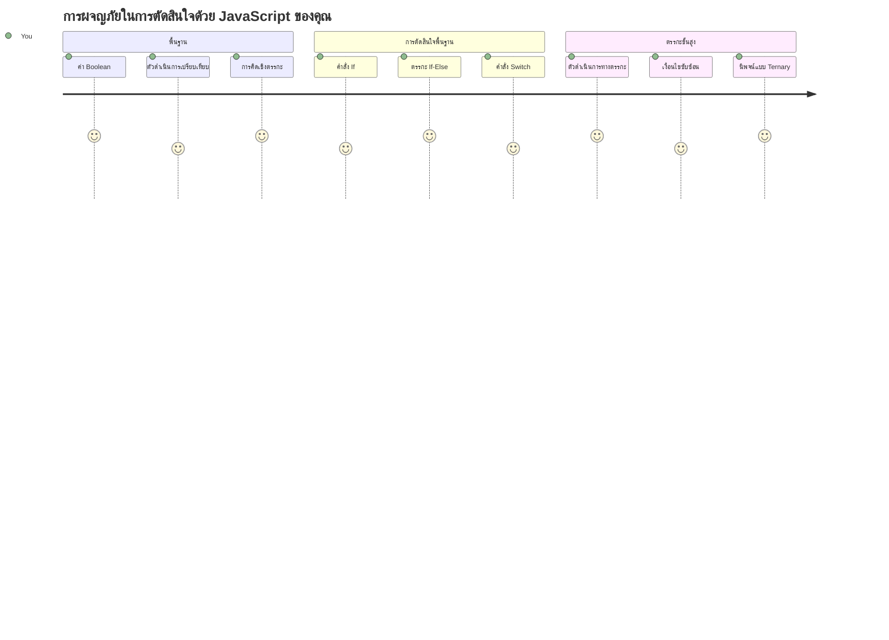
คุณเคยสงสัยไหมว่าแอปพลิเคชันทำไมถึงตัดสินใจได้อย่างชาญฉลาด? เช่น ระบบนำทางเลือกเส้นทางที่เร็วที่สุดอย่างไร หรือเทอร์โมสตัทตัดสินใจเปิดความร้อนไปเมื่อไหร่? นี่คือแนวคิดพื้นฐานของการตัดสินใจในการเขียนโปรแกรม

เช่นเดียวกับที่เครื่องมือวิเคราะห์ของ Charles Babbage ถูกออกแบบมาให้ปฏิบัติตามลำดับการทำงานที่แตกต่างกันตามเงื่อนไข โปรแกรม JavaScript สมัยใหม่จำเป็นต้องตัดสินใจตามสถานการณ์ที่แตกต่างกัน ความสามารถนี้ในการแยกสาขาและตัดสินใจคือสิ่งที่เปลี่ยนโค้ดนิ่งให้เป็นแอปพลิเคชันที่ตอบสนองและชาญฉลาด

ในบทเรียนนี้ คุณจะได้เรียนรู้วิธีใช้ตรรกะเชิงเงื่อนไขในโปรแกรมของคุณ เราจะสำรวจคำสั่งเงื่อนไข ตัวดำเนินการเปรียบเทียบ และนิพจน์ตรรกะที่ช่วยให้โค้ดของคุณประเมินสถานการณ์และตอบสนองได้อย่างเหมาะสม

## แบบทดสอบก่อนบรรยาย

[แบบทดสอบก่อนบรรยาย](https://ff-quizzes.netlify.app/web/quiz/11)

ความสามารถในการตัดสินใจและควบคุมลำดับการทำงานของโปรแกรมเป็นสิ่งสำคัญในการเขียนโปรแกรม ส่วนนี้จะครอบคลุมวิธีควบคุมเส้นทางการทำงานของโปรแกรม JavaScript โดยใช้ค่าบูลีนและตรรกะเชิงเงื่อนไข

[](https://youtube.com/watch?v=SxTp8j-fMMY "Making Decisions")

> 🎥 คลิกที่ภาพข้างบนเพื่อดูวิดีโอเกี่ยวกับการตัดสินใจ

> คุณสามารถเรียนบทเรียนนี้ได้ที่ [Microsoft Learn](https://docs.microsoft.com/learn/modules/web-development-101-if-else/?WT.mc_id=academic-77807-sagibbon)!

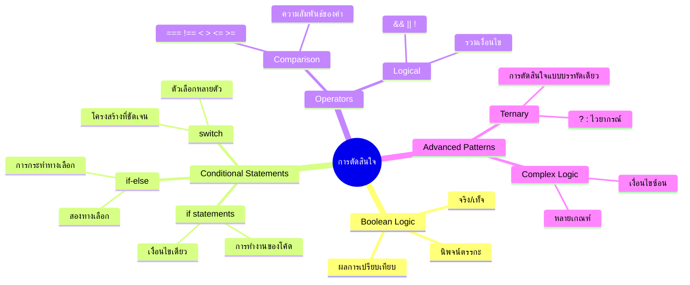
## ทบทวนย่อ ๆ เกี่ยวกับบูลีน

ก่อนที่จะสำรวจการตัดสินใจ มาทบทวนค่าบูลีนที่เรียนมาก่อนหน้านี้ ชื่อค่าบูลีนตั้งตามนักคณิตศาสตร์ George Boole ค่าบูลีนแทนสถานะไบนารี – คือ `true` หรือ `false` ไม่มีความกำกวม ไม่มีค่าเต็มกลาง

ค่าบูลีนนี้สร้างฐานตรรกะคอมพิวเตอร์ทั้งหมด การตัดสินใจทุกอย่างที่โปรแกรมทำในที่สุดแล้วสรุปเป็นการประเมินบูลีน

การสร้างตัวแปรบูลีนทำได้ง่าย:

```javascript
let myTrueBool = true;
let myFalseBool = false;
```

นี่สร้างตัวแปรสองตัวโดยกำหนดค่าเป็นบูลีนอย่างชัดเจน

✅ บูลีนตั้งตามนักคณิตศาสตร์ นักปรัชญา และนักตรรกะชาวอังกฤษ George Boole (1815–1864)

## ตัวดำเนินการเปรียบเทียบและบูลีน

ในทางปฏิบัติ คุณจะตั้งค่าบูลีนด้วยตนเองน้อยมาก แทนที่จะสร้างโดยประเมินเงื่อนไข เช่น "ตัวเลขนี้มากกว่าตัวนั้นไหม?" หรือ "ค่าพวกนี้เท่ากันไหม?"

ตัวดำเนินการเปรียบเทียบช่วยให้การประเมินเหล่านี้ ตัวดำเนินการเหล่านี้เปรียบเทียบค่าและส่งคืนผลลัพธ์บูลีนตามความสัมพันธ์ระหว่างตัวแปรสองฝั่ง

| สัญลักษณ์ | คำอธิบาย                                                                                                                                                   | ตัวอย่าง            |
| ------ | ------------------------------------------------------------------------------------------------------------------------------------------------------------- | ------------------ |
| `<`    | **น้อยกว่า**: เปรียบเทียบสองค่าและส่งคืนค่า `true` หากค่าด้านซ้ายต่ำกว่าด้านขวา                                                                | `5 < 6 // true`    |
| `<=`   | **น้อยกว่าหรือเท่ากับ**: เปรียบเทียบสองค่าและส่งคืนค่า `true` หากค่าด้านซ้ายต่ำกว่าหรือเท่ากับด้านขวา                                            | `5 <= 6 // true`   |
| `>`    | **มากกว่า**: เปรียบเทียบสองค่าและส่งคืนค่า `true` หากค่าด้านซ้ายมากกว่าด้านขวา                                                                    | `5 > 6 // false`   |
| `>=`   | **มากกว่าหรือเท่ากับ**: เปรียบเทียบสองค่าและส่งคืนค่า `true` หากค่าด้านซ้ายมากกว่าหรือเท่ากับด้านขวา                                            | `5 >= 6 // false`  |
| `===`  | **เท่ากันอย่างเคร่งครัด**: เปรียบเทียบสองค่าและส่งคืนค่า `true` หากค่าทั้งสองด้านเท่ากันและมีชนิดข้อมูลเดียวกัน                                | `5 === 6 // false` |
| `!==`  | **ไม่เท่ากัน**: เปรียบเทียบสองค่าและส่งคืนค่าตรงข้ามของค่าที่ `===` จะส่งคืน                                                                          | `5 !== 6 // true`  |

✅ ตรวจสอบความเข้าใจโดยการเขียนการเปรียบเทียบบางอย่างในคอนโซลของเบราว์เซอร์ คุณพบค่าที่แปลกใจไหม?

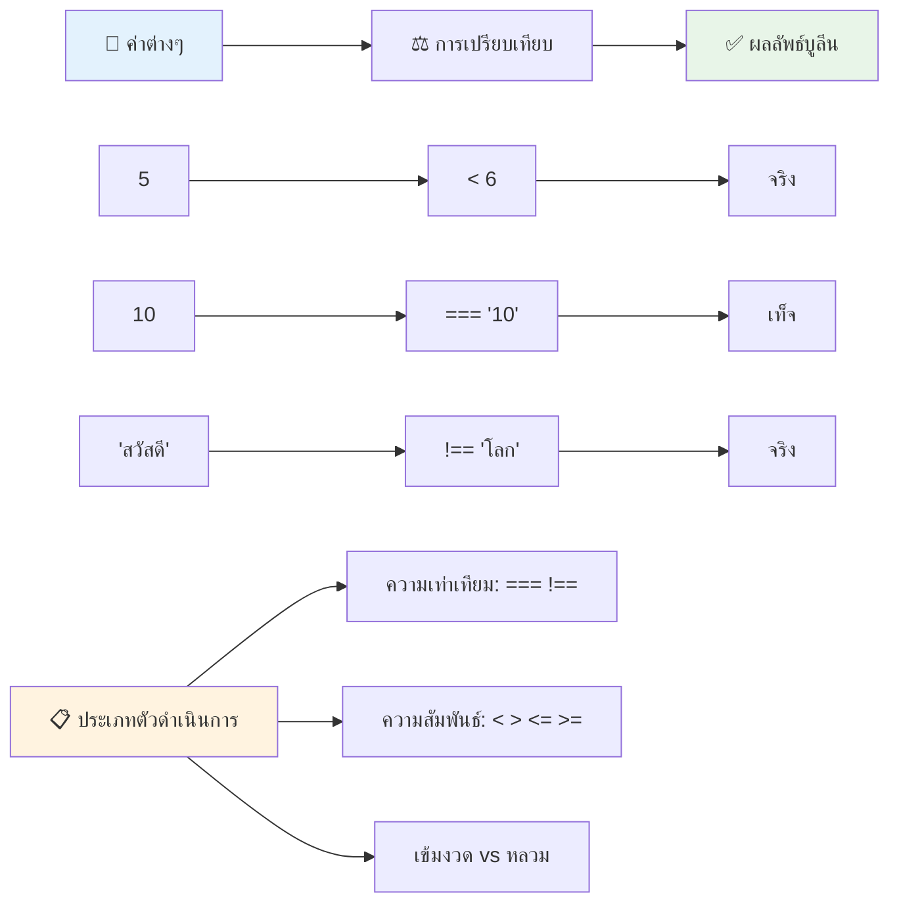
### 🧠 **ทดสอบความชำนาญการเปรียบเทียบ: เข้าใจตรรกะบูลีน**

**ทดสอบความเข้าใจของคุณเกี่ยวกับการเปรียบเทียบ:**
- ทำไมถึงนิยมใช้ `===` (เท่ากันอย่างเคร่งครัด) มากกว่า `==` (เท่ากันแบบหย่อนยาน)?
- คุณคาดเดาได้ไหมว่า `5 === '5'` จะให้ค่าอะไร? แล้ว `5 == '5'` ล่ะ?
- ความแตกต่างระหว่าง `!==` กับ `!=` คืออะไร?

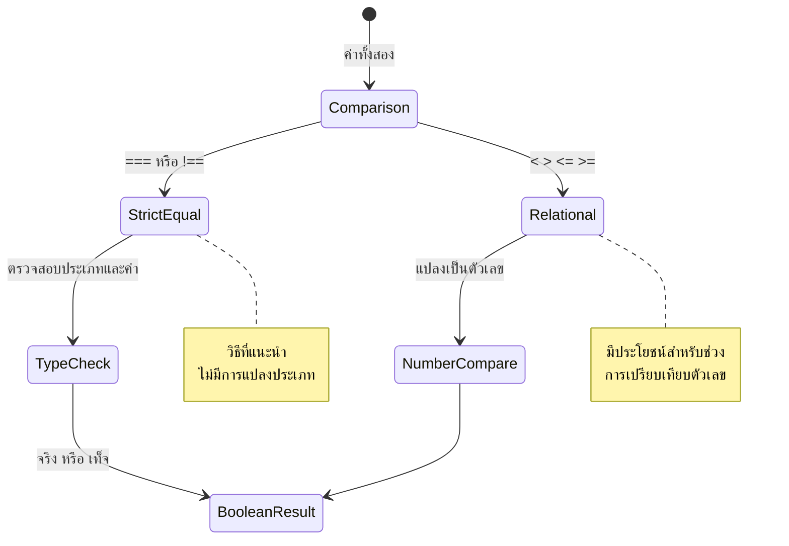
> **เคล็ดลับมือโปร**: ใช้ `===` และ `!==` เสมอสำหรับตรวจสอบความเท่าเทียมเว้นแต่คุณจะต้องการการแปลงชนิดข้อมูลโดยเฉพาะ เพื่อป้องกันพฤติกรรมที่ไม่คาดคิด!

## คำสั่ง If

คำสั่ง `if` เปรียบเสมือนการถามคำถามในโค้ดของคุณ "ถ้าเงื่อนไขนี้เป็นจริง ให้ทำสิ่งนี้" เป็นเครื่องมือที่สำคัญที่สุดที่คุณจะใช้ในการตัดสินใจใน JavaScript

วิธีการทำงานคือ:

```javascript
if (condition) {
  // เงื่อนไขเป็นจริง โค้ดในบล็อกนี้จะทำงาน
}
```

เงื่อนไขจะอยู่ในวงเล็บ และถ้าเป็น `true` JavaScript จะรันโค้ดในวงเล็บปีกกานั้น ถ้าเป็น `false` JavaScript จะข้ามบล็อกนั้นไปเลย

คุณจะใช้ตัวดำเนินการเปรียบเทียบเพื่อสร้างเงื่อนไขเหล่านี้ ดูตัวอย่างใช้งานจริงด้านล่าง:

```javascript
let currentMoney = 1000;
let laptopPrice = 800;

if (currentMoney >= laptopPrice) {
  // เงื่อนไขเป็นจริง โค้ดในบล็อกนี้จะทำงาน.
  console.log("Getting a new laptop!");
}
```

เนื่องจาก `1000 >= 800` ประเมินเป็น `true` โค้ดในบล็อกจะรันแสดงผล "Getting a new laptop!" ในคอนโซล

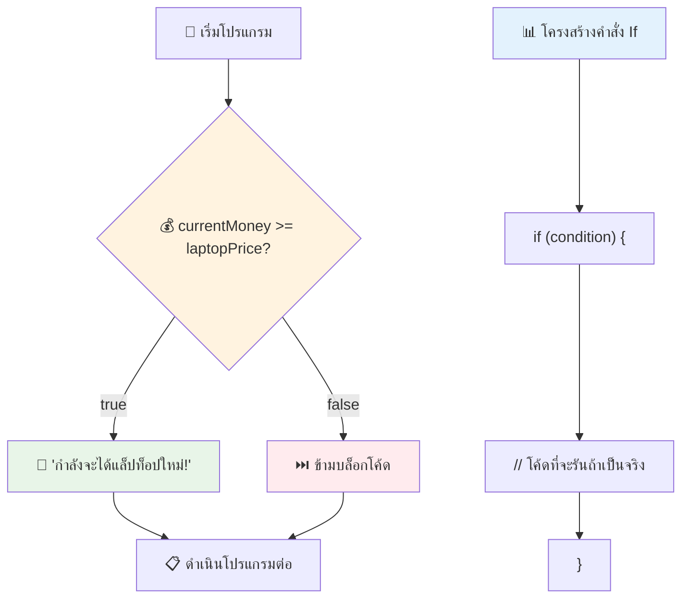
## คำสั่ง If..Else

แต่ถ้าคุณอยากให้โปรแกรมทำอย่างอื่นเมื่อเงื่อนไขเป็นเท็จล่ะ? นี่คือที่มาของ `else` – เหมือนมีแผนสำรอง

คำสั่ง `else` ให้คุณบอกว่า "ถ้าเงื่อนไขนี้ไม่เป็นจริง ให้ทำอย่างอื่นแทน"

```javascript
let currentMoney = 500;
let laptopPrice = 800;

if (currentMoney >= laptopPrice) {
  // เงื่อนไขเป็นจริง โค้ดในบล็อกนี้จะทำงาน
  console.log("Getting a new laptop!");
} else {
  // เงื่อนไขเป็นเท็จ โค้ดในบล็อกนี้จะทำงาน
  console.log("Can't afford a new laptop, yet!");
}
```

ตอนนี้ เนื่องจาก `500 >= 800` เป็น `false` JavaScript จะข้ามบล็อกแรกแล้วรันบล็อก `else` แทน คุณจะเห็นข้อความ "Can't afford a new laptop, yet!" ในคอนโซล

✅ ทดสอบความเข้าใจโค้ดนี้และโค้ดถัดไปด้วยการรันในคอนโซลเบราว์เซอร์ เปลี่ยนค่าตัวแปร currentMoney และ laptopPrice เพื่อดูผลลัพธ์ใน `console.log()`

### 🎯 **ตรวจสอบตรรกะ If-Else: เส้นทางแยก**

**ประเมินความเข้าใจตรรกะเชิงเงื่อนไขของคุณ:**
- จะเกิดอะไรขึ้นถ้า `currentMoney` เท่ากับ `laptopPrice` พอดี?
- คุณคิดสถานการณ์จริงที่ตรรกะ if-else จะมีประโยชน์ไหม?
- คุณจะขยายตรรกะนี้อย่างไรเพื่อจัดการช่วงราคาหลายระดับ?

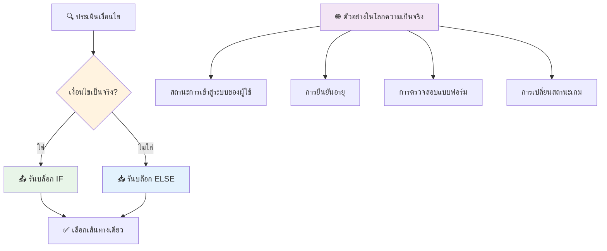
> **ข้อสังเกตสำคัญ**: if-else ทำให้แน่ใจว่าจะมีเส้นทางเดียวที่ถูกเลือก วิธีนี้รับประกันว่าโปรแกรมของคุณจะมีการตอบสนองต่อทุกเงื่อนไขเสมอ!

## คำสั่ง Switch

บางครั้งคุณอาจต้องเปรียบเทียบค่าหนึ่งกับตัวเลือกหลายค่า แม้ว่าจะใช้ if..else หลาย ๆ บรรทัดได้ แต่วิธีนั้นจะยุ่งยาก คำสั่ง `switch` จึงเป็นโครงสร้างที่สะอาดกว่าในการจัดการค่าหลายค่าแยกกัน

แนวคิดคล้ายกับระบบสวิตช์เชิงกลที่ใช้ในสถานีโทรศัพท์สมัยก่อน – ค่าอินพุตตัวเดียวกำหนดเส้นทางที่การทำงานจะไป

```javascript
switch (expression) {
  case x:
    // บล็อกโค้ด
    break;
  case y:
    // บล็อกโค้ด
    break;
  default:
    // บล็อกโค้ด
}
```

นี่คือโครงสร้าง:
- JavaScript ประเมินนิพจน์ครั้งเดียว
- ตรวจสอบแต่ละกรณี `case` เพื่อหาตรงกัน
- เมื่อเจอตรงกัน จะรันโค้ดในบล็อกนั้น
- `break` บอกให้ JavaScript หยุดและออกจาก switch
- หากไม่มีกรณีใดตรงกัน จะรันบล็อก `default` (ถ้ามี)

```javascript
// โปรแกรมที่ใช้คำสั่งสวิตช์สำหรับวันในสัปดาห์
let dayNumber = 2;
let dayName;

switch (dayNumber) {
  case 1:
    dayName = "Monday";
    break;
  case 2:
    dayName = "Tuesday";
    break;
  case 3:
    dayName = "Wednesday";
    break;
  default:
    dayName = "Unknown day";
    break;
}
console.log(`Today is ${dayName}`);
```

ในตัวอย่างนี้ JavaScript เห็นว่า `dayNumber` คือ `2` เจอกรณีที่ตรงกับ `case 2` กำหนดค่า `dayName` เป็น "Tuesday" แล้วหยุดออกจาก switch ผลลัพธ์คือ "Today is Tuesday" แสดงในคอนโซล

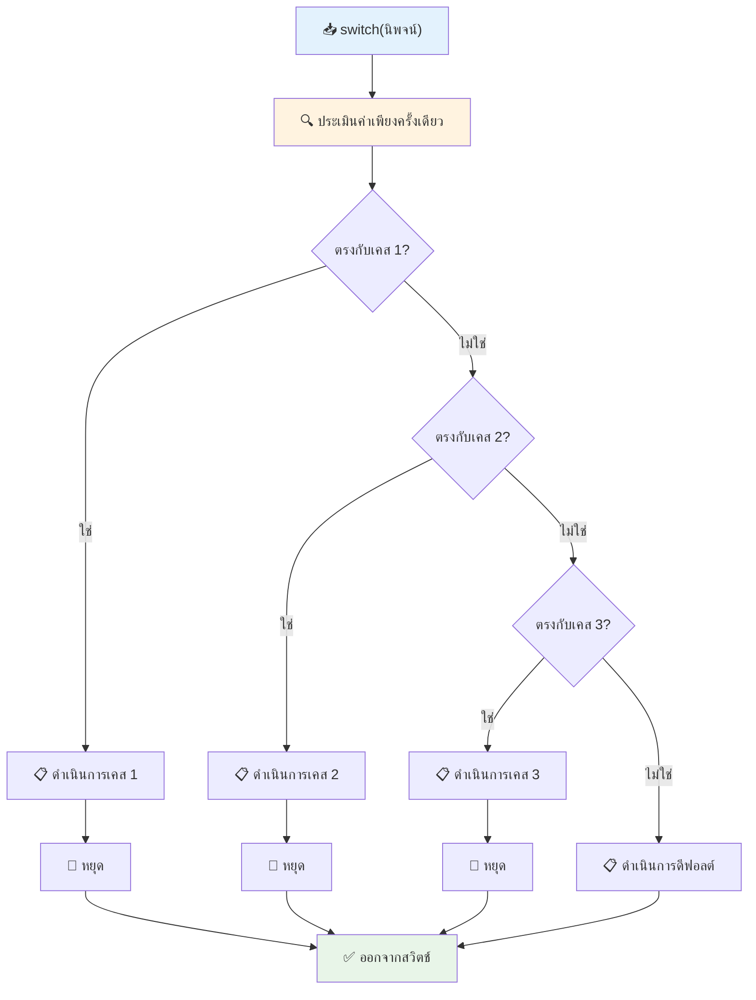
✅ ทดสอบความเข้าใจโค้ดนี้และถัดไปด้วยการรันในคอนโซลเบราว์เซอร์ เปลี่ยนค่าตัวแปร a เพื่อดูผลลัพธ์ใน `console.log()`

### 🔄 **ทดสอบความชำนาญคำสั่ง Switch: ตัวเลือกหลายทาง**

**ลองทดสอบความเข้าใจ switch:**
- จะเกิดอะไรขึ้นถ้าคุณลืมใส่คำสั่ง `break`?
- คุณจะเลือกใช้ `switch` แทน if-else หลาย ๆ ครั้งเมื่อไหร่?
- ทำไมถึงต้องมีกรณี `default` ถึงแม้ว่าคุณคิดว่าครอบคลุมทุกกรณีแล้ว?

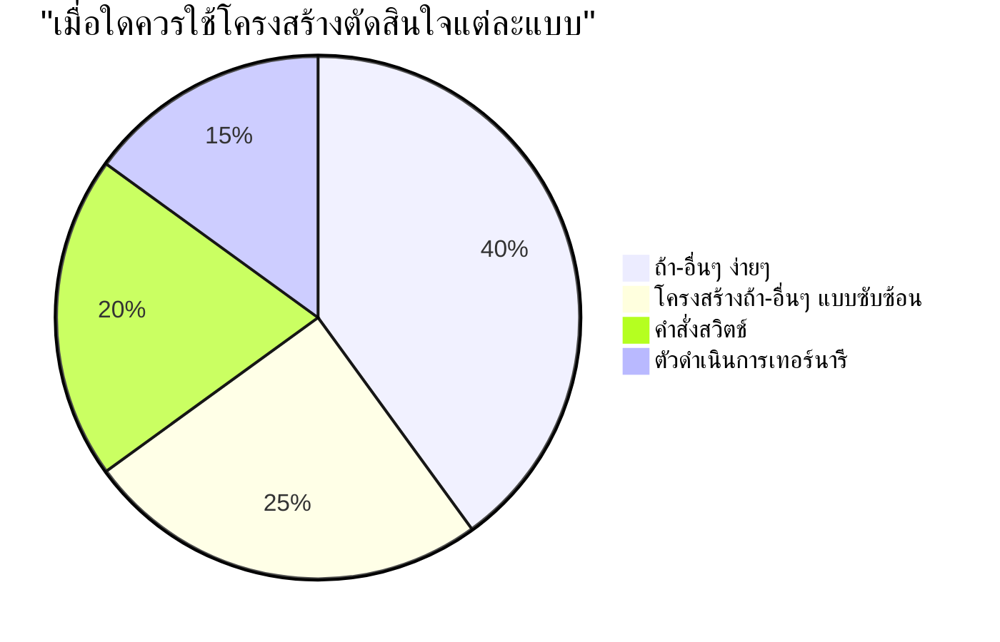
> **แนวทางปฏิบัติที่ดีที่สุด**: ใช้ `switch` เมื่อเปรียบเทียบตัวแปรหนึ่งกับค่าหลายค่าเฉพาะ ใช้ if-else สำหรับการตรวจสอบช่วงค่าหรือเงื่อนไขซับซ้อน!

## ตัวดำเนินการตรรกะและบูลีน

การตัดสินใจที่ซับซ้อนมักต้องประเมินหลายเงื่อนไขพร้อมกัน เช่นเดียวกับพีชคณิตบูลีนที่ให้นักคณิตศาสตร์รวมเชิงตรรกะต่าง ๆ การเขียนโปรแกรมมีตัวดำเนินการตรรกะที่เชื่อมเงื่อนไขบูลีนหลาย ๆ เงื่อนไขเข้าด้วยกัน

ตัวดำเนินการเหล่านี้ช่วยให้ตรรกะเชิงเงื่อนไขซับซ้อนโดยรวมการประเมิน true/false อย่างง่ายได้

| สัญลักษณ์ | คำอธิบาย                                                                                     | ตัวอย่าง                                                                 |
| ------ | ----------------------------------------------------------------------------------------------- | ----------------------------------------------------------------------- |
| `&&`   | **ตรรกะ AND**: เปรียบเทียบสองนิพจน์บูลีน คืนค่า true **ก็ต่อเมื่อ** ทั้งสองฝั่งเป็น true          | `(5 > 3) && (5 < 10) // ทั้งสองฝั่งเป็นจริง คืนค่า true`          |
| `\|\|` | **ตรรกะ OR**: เปรียบเทียบสองนิพจน์บูลีน คืนค่า true ถ้ามีฝั่งใดฝั่งหนึ่งเป็นจริง                     | `(5 > 10) \|\| (5 < 10) // ฝั่งหนึ่งเป็นเท็จ อีกฝั่งเป็นจริง คืนค่า true` |
| `!`    | **ตรรกะ NOT**: คืนค่าตรงข้ามของนิพจน์บูลีน                                                       | `!(5 > 10) // 5 ไม่มากกว่า 10 ดังนั้น "!" ทำให้เป็น true`             |

ตัวดำเนินการเหล่านี้ช่วยให้คุณรวมเงื่อนไขในแบบมีประโยชน์:
- AND (`&&`) หมายความว่าเงื่อนไขทั้งสองต้องเป็นจริง
- OR (`||`) หมายความว่ามีเงื่อนไขหนึ่งอย่างน้อยต้องเป็นจริง  
- NOT (`!`) เปลี่ยนค่า true เป็น false (และในทางกลับกัน)

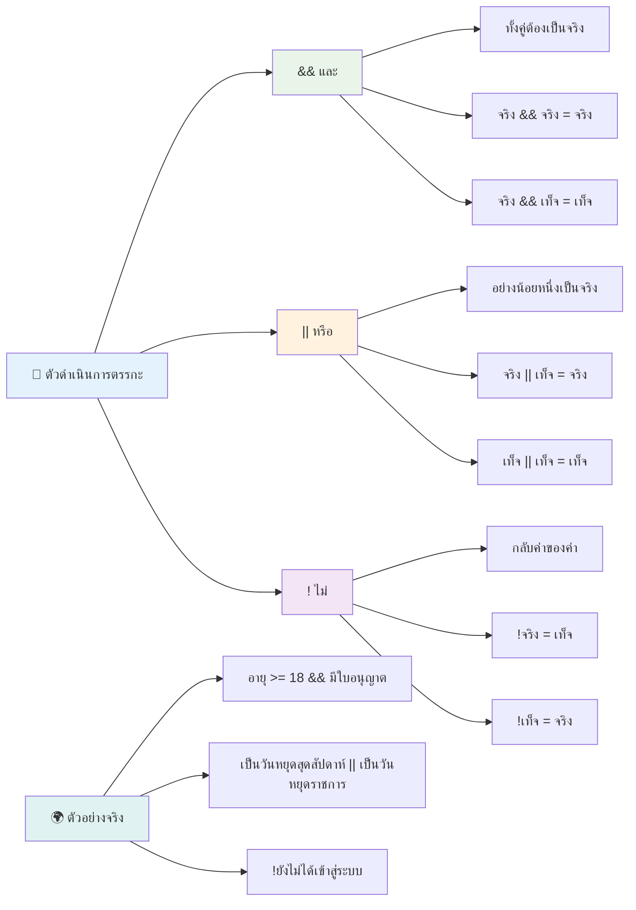
## เงื่อนไขและการตัดสินใจกับตัวดำเนินการตรรกะ

มาดูตัวดำเนินการตรรกะนี้ในตัวอย่างที่สมจริงมากขึ้น:

```javascript
let currentMoney = 600;
let laptopPrice = 800;
let laptopDiscountPrice = laptopPrice - (laptopPrice * 0.2); // ราคาคอมพิวเตอร์โน้ตบุ๊คลด 20 เปอร์เซ็นต์

if (currentMoney >= laptopPrice || currentMoney >= laptopDiscountPrice) {
  // เงื่อนไขเป็นจริง โค้ดในบล็อกนี้จะทำงาน
  console.log("Getting a new laptop!");
} else {
  // เงื่อนไขเป็นเท็จ โค้ดในบล็อกนี้จะทำงาน
  console.log("Can't afford a new laptop, yet!");
}
```

ในตัวอย่างนี้: เราคำนวณราคาลด 20% (640) แล้วประเมินว่ากองทุนของเราครอบคลุมราคาทั้งหมด OR ราคาลดหรือไม่ เนื่องจาก 600 ไม่ถึงเกณฑ์ราคาลด 640 เงื่อนไขประเมินเป็น false

### 🧮 **ตรวจสอบตัวดำเนินการตรรกะ: การรวมเงื่อนไข**

**ทดสอบความเข้าใจตัวดำเนินการตรรกะ:**
- ในนิพจน์ `A && B` เกิดอะไรขึ้นถ้า A เป็นเท็จ? B จะถูกประเมินไหม?
- คุณนึกสถานการณ์ที่ต้องใช้ตัวดำเนินการทั้งสาม (`&&`, `||`, `!`) พร้อมกันได้ไหม?
- ความแตกต่างระหว่าง `!user.isActive` กับ `user.isActive !== true` คืออะไร?

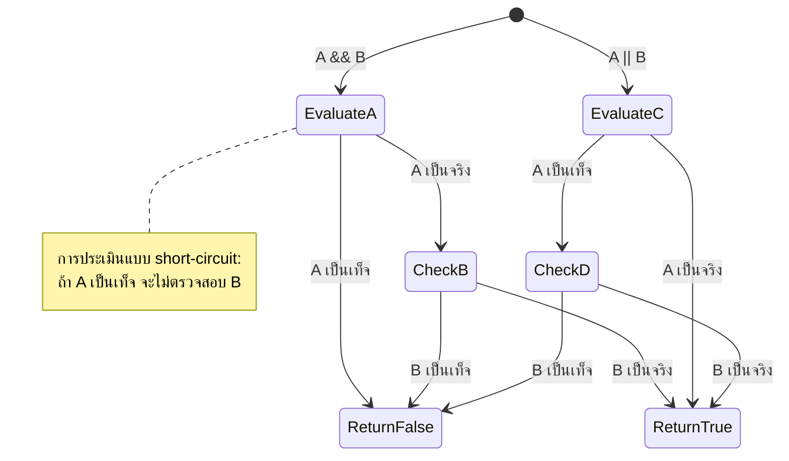
> **เคล็ดลับประสิทธิภาพ**: JavaScript ใช้ "การประเมินแบบสั้น" – ใน `A && B` ถ้า A เป็นเท็จ B จะไม่ถูกประเมิน ใช้จุดนี้ให้เป็นประโยชน์!

### ตัวดำเนินการปฏิเสธ (Negation)

บางครั้งง่ายกว่าที่จะคิดว่าเมื่อไรบางอย่างไม่ใช่ความจริง เช่นแทนที่จะถามว่า "ผู้ใช้เข้าสู่ระบบหรือไม่?" คุณอาจจะถามว่า "ผู้ใช้ยังไม่ได้เข้าสู่ระบบหรือเปล่า?" เครื่องหมายตกใจ (`!`) จะเปลี่ยนตรรกะให้คุณ

```javascript
if (!condition) {
  // ทำงานถ้าสภาวะเป็นเท็จ
} else {
  // ทำงานถ้าสภาวะเป็นจริง
}
```

ตัวดำเนินการ `!` เปรียบเสมือนพูดว่า "ตรงข้ามกับ..." – ถ้าบางอย่างเป็น `true` ตัว `!` จะทำให้เป็น `false` และในทางกลับกัน

### นิพจน์เทอร์นารี (Ternary Expressions)

สำหรับการกำหนดเงื่อนไขอย่างง่าย JavaScript มี **ตัวดำเนินการเทอร์นารี** ไวยากรณ์นี้กระทัดรัดช่วยให้เขียนนิพจน์เงื่อนไขในบรรทัดเดียว เหมาะสำหรับการกำหนดค่าหนึ่งในสองค่าโดยขึ้นกับเงื่อนไข

```javascript
let variable = condition ? returnThisIfTrue : returnThisIfFalse;
```

อ่านเหมือนคำถามว่า: "เงื่อนไขนี้เป็นจริงไหม? ถ้าใช่ ใช้ค่านี้ ถ้าไม่ ใช้อีกค่านึง"

ด้านล่างเป็นตัวอย่างที่เข้าใจง่ายขึ้น:

```javascript
let firstNumber = 20;
let secondNumber = 10;
let biggestNumber = firstNumber > secondNumber ? firstNumber : secondNumber;
```

✅ ใช้เวลาสักครู่อ่านข้อความโค้ดนี้หลาย ๆ รอบ คุณเข้าใจการทำงานของตัวดำเนินการเหล่านี้ไหม?

บรรทัดนี้หมายความว่า: "ค่า `firstNumber` มากกว่า `secondNumber` หรือไม่? ถ้าใช่ ให้ใส่ `firstNumber` ใน `biggestNumber` ถ้าไม่ ให้ใส่ `secondNumber` ใน `biggestNumber`"

ตัวดำเนินการเทอร์นารีเป็นวิธีสั้น ๆ ในการเขียนคำสั่ง `if..else` แบบดั้งเดิมนี้:

```javascript
let biggestNumber;
if (firstNumber > secondNumber) {
  biggestNumber = firstNumber;
} else {
  biggestNumber = secondNumber;
}
```

ทั้งสองวิธีให้ผลลัพธ์เหมือนกัน ตัวดำเนินการเทอร์นารีกระชับกว่า ในขณะที่โครงสร้าง if-else แบบดั้งเดิมอ่านง่ายกว่าในกรณีเงื่อนไขซับซ้อน

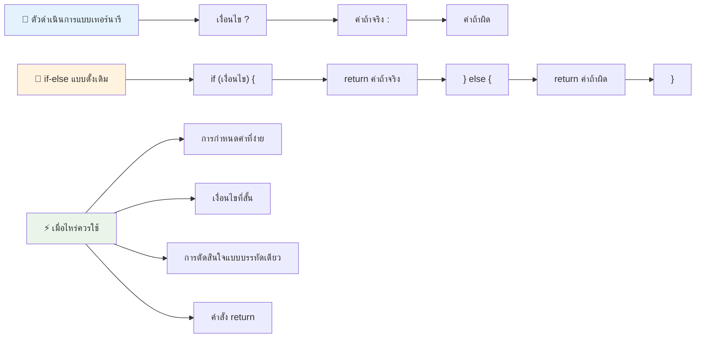
---


## 🚀 ความท้าทาย

สร้างโปรแกรมที่เขียนด้วยตัวดำเนินการตรรกะก่อน แล้วเขียนใหม่โดยใช้นิพจน์เทอร์นารี คุณชอบไวยากรณ์แบบไหนมากกว่ากัน?

---

## ความท้าทาย GitHub Copilot Agent 🚀

ใช้โหมด Agent เพื่อทำความท้าทายต่อไปนี้:

**คำอธิบาย:** สร้างเครื่องคำนวณเกรดอย่างครบถ้วนที่แสดงให้เห็นแนวคิดหลายอย่างของการตัดสินใจในบทเรียนนี้ รวมถึงคำสั่ง if-else, switch, ตัวดำเนินการตรรกะ และนิพจน์เทอร์นารี

**คำสั่ง:** เขียนโปรแกรม JavaScript ที่รับคะแนนตัวเลขของนักเรียน (0-100) แล้วกำหนดเกรดตัวอักษรตามเกณฑ์เหล่านี้:
- A: 90-100
- B: 80-89  
- C: 70-79
- D: 60-69
- F: ต่ำกว่า 60

ข้อกำหนด:
1. ใช้คำสั่ง if-else เพื่อกำหนดเกรดตัวอักษร
2. ใช้ตัวดำเนินการเชิงตรรกะเพื่อตรวจสอบว่านักเรียนผ่าน (grade >= 60) และได้รับเกียรตินิยม (grade >= 90)
3. ใช้คำสั่ง switch เพื่อนำเสนอความคิดเห็นเฉพาะสำหรับแต่ละเกรดตัวอักษร
4. ใช้ตัวดำเนินการ ternary เพื่อกำหนดว่านักเรียนมีสิทธิ์เข้าเรียนหลักสูตรถัดไปหรือไม่ (grade >= 70)
5. รวมการตรวจสอบอินพุตเพื่อให้แน่ใจว่าคะแนนอยู่ระหว่าง 0 ถึง 100

ทดสอบโปรแกรมของคุณด้วยคะแนนต่างๆ รวมถึงกรณีขอบเช่น 59, 60, 89, 90, และอินพุตที่ไม่ถูกต้อง

เรียนรู้เพิ่มเติมเกี่ยวกับ [agent mode](https://code.visualstudio.com/blogs/2025/02/24/introducing-copilot-agent-mode) ได้ที่นี่


## Post-Lecture Quiz

[Post-lecture quiz](https://ff-quizzes.netlify.app/web/quiz/12)

## Review & Self Study

อ่านเพิ่มเติมเกี่ยวกับตัวดำเนินการมากมายที่มีให้ผู้ใช้ [บน MDN](https://developer.mozilla.org/docs/Web/JavaScript/Reference/Operators)

ลองดู [operator lookup](https://joshwcomeau.com/operator-lookup/) อันยอดเยี่ยมของ Josh Comeau!

## Assignment

[Operators](assignment.md)

---

## 🧠 **สรุปชุดเครื่องมือการตัดสินใจของคุณ**

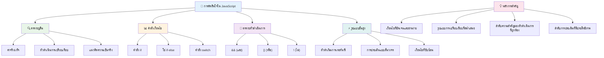
---

## 🚀 เส้นเวลาการฝึกความชำนาญในการตัดสินใจของ JavaScript ของคุณ

### ⚡ **สิ่งที่คุณทำได้ใน 5 นาทีถัดไป**
- [ ] ฝึกใช้ตัวดำเนินการเปรียบเทียบในคอนโซลเบราว์เซอร์ของคุณ
- [ ] เขียน if-else ง่ายๆ เพื่อตรวจสอบอายุของคุณ
- [ ] ลองทำโจทย์: เขียน if-else ใหม่โดยใช้ตัวดำเนินการ ternary
- [ ] ทดสอบสิ่งที่จะเกิดขึ้นกับค่าที่เป็น "truthy" และ "falsy" ต่างๆ

### 🎯 **สิ่งที่คุณทำสำเร็จได้ในหนึ่งชั่วโมงนี้**
- [ ] ทำแบบทดสอบหลังบทเรียนและทบทวนแนวคิดที่สับสน
- [ ] สร้างเครื่องคิดเลขเกรดแบบครบวงจรจากความท้าทาย GitHub Copilot
- [ ] สร้างต้นไม้การตัดสินใจง่ายๆ สำหรับสถานการณ์จริง (เช่น เลือกเสื้อผ้าที่จะใส่)
- [ ] ฝึกการรวมเงื่อนไขหลายๆ อย่างด้วยตัวดำเนินการเชิงตรรกะ
- [ ] ทดลองใช้คำสั่ง switch สำหรับกรณีการใช้งานต่างๆ

### 📅 **ความชำนาญตรรกะตลอดสัปดาห์ของคุณ**
- [ ] ทำงานมอบหมายเกี่ยวกับตัวดำเนินการพร้อมตัวอย่างสร้างสรรค์
- [ ] สร้างแอปทดสอบขนาดเล็กโดยใช้โครงสร้างเงื่อนไขหลากหลาย
- [ ] สร้างตัวตรวจสอบฟอร์มที่เช็คหลายเงื่อนไขของอินพุต
- [ ] ฝึกทำแบบฝึกหัด [operator lookup](https://joshwcomeau.com/operator-lookup/) ของ Josh Comeau
- [ ] ปรับปรุงโค้ดที่มีอยู่ให้ใช้โครงสร้างเงื่อนไขที่เหมาะสมขึ้น
- [ ] ศึกษาการประเมินสั้นวงจรและผลกระทบต่อประสิทธิภาพ

### 🌟 **การเปลี่ยนแปลงตลอดเดือนของคุณ**
- [ ] เชี่ยวชาญเงื่อนไขซ้อนซับซ้อนและรักษาความอ่านง่ายของโค้ด
- [ ] สร้างแอปที่มีตรรกะการตัดสินใจซับซ้อน
- [ ] มีส่วนร่วมกับโครงการโอเพ่นซอร์สโดยปรับปรุงตรรกะเงื่อนไขในโปรเจกต์ที่มีอยู่
- [ ] สอนคนอื่นเกี่ยวกับโครงสร้างเงื่อนไขต่างๆ และเมื่อไหร่ควรใช้แต่ละแบบ
- [ ] สำรวจแนวทางการเขียนโปรแกรมเชิงฟังก์ชันกับตรรกะเงื่อนไข
- [ ] สร้างคู่มืออ้างอิงส่วนตัวเกี่ยวกับแนวปฏิบัติที่ดีที่สุดของเงื่อนไข

### 🏆 **เช็คอินแชมป์การตัดสินใจขั้นสุดท้าย**

**ฉลองความชำนาญการคิดเชิงตรรกะของคุณ:**
- ตรรกะการตัดสินใจที่ซับซ้อนที่สุดที่คุณเคยนำไปใช้ได้สำเร็จคืออะไร?
- โครงสร้างเงื่อนไขไหนที่คุณรู้สึกว่าเป็นธรรมชาติมากที่สุดและเพราะเหตุใด?
- การเรียนรู้เกี่ยวกับตัวดำเนินการเชิงตรรกะเปลี่ยนวิธีแก้ปัญหาของคุณอย่างไร?
- แอปพลิเคชันในโลกจริงใดที่จะได้รับประโยชน์จากตรรกะการตัดสินใจที่ซับซ้อนได้บ้าง?

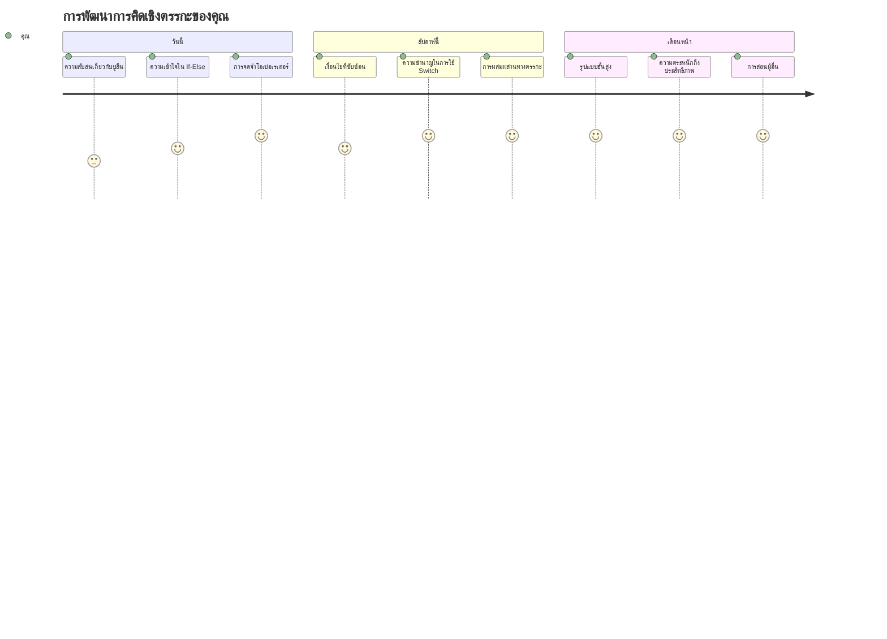
> 🧠 **คุณเชี่ยวชาญศิลปะการตัดสินใจในโลกดิจิทัลแล้ว!** แอปพลิเคชันเชิงโต้ตอบทุกชนิดขึ้นอยู่กับตรรกะเงื่อนไขเพื่อตอบสนองอย่างชาญฉลาดต่อการกระทำของผู้ใช้และสภาพแวดล้อมที่เปลี่ยนแปลง คุณเข้าใจแล้วว่าจะทำให้โปรแกรมของคุณคิด ประเมิน และเลือกตอบสนองอย่างเหมาะสมได้อย่างไร พื้นฐานตรรกะนี้จะขับเคลื่อนทุกแอปพลิเคชันแบบไดนามิกที่คุณสร้าง! 🎉

---

<!-- CO-OP TRANSLATOR DISCLAIMER START -->
**คำปฏิเสธความรับผิดชอบ**:
เอกสารนี้ได้รับการแปลโดยใช้บริการแปลภาษาอัตโนมัติ [Co-op Translator](https://github.com/Azure/co-op-translator) แม้เราจะพยายามให้มีความถูกต้อง โปรดทราบว่าการแปลโดยอัตโนมัติอาจมีข้อผิดพลาดหรือความคลาดเคลื่อน เอกสารต้นฉบับในภาษาต้นทางควรถือเป็นแหล่งข้อมูลที่น่าเชื่อถือ สำหรับข้อมูลสำคัญ ขอแนะนำให้ใช้บริการแปลโดยมนุษย์มืออาชีพ เราไม่รับผิดชอบต่อความเข้าใจผิดหรือการตีความผิดที่อาจเกิดขึ้นจากการใช้การแปลนี้
<!-- CO-OP TRANSLATOR DISCLAIMER END -->