<!--
CO_OP_TRANSLATOR_METADATA:
{
  "original_hash": "c688385d15dd3645e924ea0ffee8967f",
  "translation_date": "2026-01-06T21:40:13+00:00",
  "source_file": "2-js-basics/3-making-decisions/README.md",
  "language_code": "th"
}
-->
# พื้นฐาน JavaScript: การตัดสินใจ


> สเก็ตช์โน้ตโดย [Tomomi Imura](https://twitter.com/girlie_mac)

```mermaid
journey
    title การผจญภัยในการตัดสินใจด้วย JavaScript ของคุณ
    section พื้นฐาน
      ค่า Boolean: 5: You
      ตัวดำเนินการเปรียบเทียบ: 4: You
      การคิดเชิงตรรกะ: 5: You
    section การตัดสินใจพื้นฐาน
      คำสั่ง If: 4: You
      ตรรกะ If-Else: 5: You
      คำสั่ง Switch: 4: You
    section ตรรกะขั้นสูง
      ตัวดำเนินการทางตรรกะ: 5: You
      เงื่อนไขซับซ้อน: 4: You
      นิพจน์แบบ Ternary: 5: You
```
คุณเคยสงสัยไหมว่าแอปพลิเคชันทำไมถึงตัดสินใจได้อย่างชาญฉลาด? เช่น ระบบนำทางเลือกเส้นทางที่เร็วที่สุดอย่างไร หรือเทอร์โมสตัทตัดสินใจเปิดความร้อนไปเมื่อไหร่? นี่คือแนวคิดพื้นฐานของการตัดสินใจในการเขียนโปรแกรม

เช่นเดียวกับที่เครื่องมือวิเคราะห์ของ Charles Babbage ถูกออกแบบมาให้ปฏิบัติตามลำดับการทำงานที่แตกต่างกันตามเงื่อนไข โปรแกรม JavaScript สมัยใหม่จำเป็นต้องตัดสินใจตามสถานการณ์ที่แตกต่างกัน ความสามารถนี้ในการแยกสาขาและตัดสินใจคือสิ่งที่เปลี่ยนโค้ดนิ่งให้เป็นแอปพลิเคชันที่ตอบสนองและชาญฉลาด

ในบทเรียนนี้ คุณจะได้เรียนรู้วิธีใช้ตรรกะเชิงเงื่อนไขในโปรแกรมของคุณ เราจะสำรวจคำสั่งเงื่อนไข ตัวดำเนินการเปรียบเทียบ และนิพจน์ตรรกะที่ช่วยให้โค้ดของคุณประเมินสถานการณ์และตอบสนองได้อย่างเหมาะสม

## แบบทดสอบก่อนบรรยาย

[แบบทดสอบก่อนบรรยาย](https://ff-quizzes.netlify.app/web/quiz/11)

ความสามารถในการตัดสินใจและควบคุมลำดับการทำงานของโปรแกรมเป็นสิ่งสำคัญในการเขียนโปรแกรม ส่วนนี้จะครอบคลุมวิธีควบคุมเส้นทางการทำงานของโปรแกรม JavaScript โดยใช้ค่าบูลีนและตรรกะเชิงเงื่อนไข

[](https://youtube.com/watch?v=SxTp8j-fMMY "Making Decisions")

> 🎥 คลิกที่ภาพข้างบนเพื่อดูวิดีโอเกี่ยวกับการตัดสินใจ

> คุณสามารถเรียนบทเรียนนี้ได้ที่ [Microsoft Learn](https://docs.microsoft.com/learn/modules/web-development-101-if-else/?WT.mc_id=academic-77807-sagibbon)!

```mermaid
mindmap
  root((การตัดสินใจ))
    Boolean Logic
      จริง/เท็จ
      ผลการเปรียบเทียบ
      นิพจน์ตรรกะ
    Conditional Statements
      if statements
        เงื่อนไขเดียว
        การทำงานของโค้ด
      if-else
        สองทางเลือก
        การกระทำทางเลือก
      switch
        ตัวเลือกหลายตัว
        โครงสร้างที่ชัดเจน
    Operators
      Comparison
        === !== < > <= >=
        ความสัมพันธ์ของค่า
      Logical
        && || !
        รวมเงื่อนไข
    Advanced Patterns
      Ternary
        ? : ไวยากรณ์
        การตัดสินใจแบบบรรทัดเดียว
      Complex Logic
        เงื่อนไขซ้อน
        หลายเกณฑ์
```
## ทบทวนย่อ ๆ เกี่ยวกับบูลีน

ก่อนที่จะสำรวจการตัดสินใจ มาทบทวนค่าบูลีนที่เรียนมาก่อนหน้านี้ ชื่อค่าบูลีนตั้งตามนักคณิตศาสตร์ George Boole ค่าบูลีนแทนสถานะไบนารี – คือ `true` หรือ `false` ไม่มีความกำกวม ไม่มีค่าเต็มกลาง

ค่าบูลีนนี้สร้างฐานตรรกะคอมพิวเตอร์ทั้งหมด การตัดสินใจทุกอย่างที่โปรแกรมทำในที่สุดแล้วสรุปเป็นการประเมินบูลีน

การสร้างตัวแปรบูลีนทำได้ง่าย:

```javascript
let myTrueBool = true;
let myFalseBool = false;
```

นี่สร้างตัวแปรสองตัวโดยกำหนดค่าเป็นบูลีนอย่างชัดเจน

✅ บูลีนตั้งตามนักคณิตศาสตร์ นักปรัชญา และนักตรรกะชาวอังกฤษ George Boole (1815–1864)

## ตัวดำเนินการเปรียบเทียบและบูลีน

ในทางปฏิบัติ คุณจะตั้งค่าบูลีนด้วยตนเองน้อยมาก แทนที่จะสร้างโดยประเมินเงื่อนไข เช่น "ตัวเลขนี้มากกว่าตัวนั้นไหม?" หรือ "ค่าพวกนี้เท่ากันไหม?"

ตัวดำเนินการเปรียบเทียบช่วยให้การประเมินเหล่านี้ ตัวดำเนินการเหล่านี้เปรียบเทียบค่าและส่งคืนผลลัพธ์บูลีนตามความสัมพันธ์ระหว่างตัวแปรสองฝั่ง

| สัญลักษณ์ | คำอธิบาย                                                                                                                                                   | ตัวอย่าง            |
| ------ | ------------------------------------------------------------------------------------------------------------------------------------------------------------- | ------------------ |
| `<`    | **น้อยกว่า**: เปรียบเทียบสองค่าและส่งคืนค่า `true` หากค่าด้านซ้ายต่ำกว่าด้านขวา                                                                | `5 < 6 // true`    |
| `<=`   | **น้อยกว่าหรือเท่ากับ**: เปรียบเทียบสองค่าและส่งคืนค่า `true` หากค่าด้านซ้ายต่ำกว่าหรือเท่ากับด้านขวา                                            | `5 <= 6 // true`   |
| `>`    | **มากกว่า**: เปรียบเทียบสองค่าและส่งคืนค่า `true` หากค่าด้านซ้ายมากกว่าด้านขวา                                                                    | `5 > 6 // false`   |
| `>=`   | **มากกว่าหรือเท่ากับ**: เปรียบเทียบสองค่าและส่งคืนค่า `true` หากค่าด้านซ้ายมากกว่าหรือเท่ากับด้านขวา                                            | `5 >= 6 // false`  |
| `===`  | **เท่ากันอย่างเคร่งครัด**: เปรียบเทียบสองค่าและส่งคืนค่า `true` หากค่าทั้งสองด้านเท่ากันและมีชนิดข้อมูลเดียวกัน                                | `5 === 6 // false` |
| `!==`  | **ไม่เท่ากัน**: เปรียบเทียบสองค่าและส่งคืนค่าตรงข้ามของค่าที่ `===` จะส่งคืน                                                                          | `5 !== 6 // true`  |

✅ ตรวจสอบความเข้าใจโดยการเขียนการเปรียบเทียบบางอย่างในคอนโซลของเบราว์เซอร์ คุณพบค่าที่แปลกใจไหม?

```mermaid
flowchart LR
    A["🔢 ค่าต่างๆ"] --> B["⚖️ การเปรียบเทียบ"]
    B --> C["✅ ผลลัพธ์บูลีน"]
    
    D["5"] --> E["< 6"]
    E --> F["จริง"]
    
    G["10"] --> H["=== '10'"]
    H --> I["เท็จ"]
    
    J["'สวัสดี'"] --> K["!== 'โลก'"]
    K --> L["จริง"]
    
    M["📋 ประเภทตัวดำเนินการ"] --> M1["ความเท่าเทียม: === !=="]
    M --> M2["ความสัมพันธ์: < > <= >="]
    M --> M3["เข้มงวด vs หลวม"]
    
    style A fill:#e3f2fd
    style C fill:#e8f5e8
    style M fill:#fff3e0
```
### 🧠 **ทดสอบความชำนาญการเปรียบเทียบ: เข้าใจตรรกะบูลีน**

**ทดสอบความเข้าใจของคุณเกี่ยวกับการเปรียบเทียบ:**
- ทำไมถึงนิยมใช้ `===` (เท่ากันอย่างเคร่งครัด) มากกว่า `==` (เท่ากันแบบหย่อนยาน)?
- คุณคาดเดาได้ไหมว่า `5 === '5'` จะให้ค่าอะไร? แล้ว `5 == '5'` ล่ะ?
- ความแตกต่างระหว่าง `!==` กับ `!=` คืออะไร?

```mermaid
stateDiagram-v2
    [*] --> Comparison: ค่าทั้งสอง
    Comparison --> StrictEqual: === หรือ !==
    Comparison --> Relational: < > <= >=
    
    StrictEqual --> TypeCheck: ตรวจสอบประเภทและค่า
    Relational --> NumberCompare: แปลงเป็นตัวเลข
    
    TypeCheck --> BooleanResult: จริง หรือ เท็จ
    NumberCompare --> BooleanResult
    
    note right of StrictEqual
        วิธีที่แนะนำ
        ไม่มีการแปลงประเภท
    end note
    
    note right of Relational
        มีประโยชน์สำหรับช่วง
        การเปรียบเทียบตัวเลข
    end note
```
> **เคล็ดลับมือโปร**: ใช้ `===` และ `!==` เสมอสำหรับตรวจสอบความเท่าเทียมเว้นแต่คุณจะต้องการการแปลงชนิดข้อมูลโดยเฉพาะ เพื่อป้องกันพฤติกรรมที่ไม่คาดคิด!

## คำสั่ง If

คำสั่ง `if` เปรียบเสมือนการถามคำถามในโค้ดของคุณ "ถ้าเงื่อนไขนี้เป็นจริง ให้ทำสิ่งนี้" เป็นเครื่องมือที่สำคัญที่สุดที่คุณจะใช้ในการตัดสินใจใน JavaScript

วิธีการทำงานคือ:

```javascript
if (condition) {
  // เงื่อนไขเป็นจริง โค้ดในบล็อกนี้จะทำงาน
}
```

เงื่อนไขจะอยู่ในวงเล็บ และถ้าเป็น `true` JavaScript จะรันโค้ดในวงเล็บปีกกานั้น ถ้าเป็น `false` JavaScript จะข้ามบล็อกนั้นไปเลย

คุณจะใช้ตัวดำเนินการเปรียบเทียบเพื่อสร้างเงื่อนไขเหล่านี้ ดูตัวอย่างใช้งานจริงด้านล่าง:

```javascript
let currentMoney = 1000;
let laptopPrice = 800;

if (currentMoney >= laptopPrice) {
  // เงื่อนไขเป็นจริง โค้ดในบล็อกนี้จะทำงาน.
  console.log("Getting a new laptop!");
}
```

เนื่องจาก `1000 >= 800` ประเมินเป็น `true` โค้ดในบล็อกจะรันแสดงผล "Getting a new laptop!" ในคอนโซล

```mermaid
flowchart TD
    A["🚀 เริ่มโปรแกรม"] --> B{"💰 currentMoney >= laptopPrice?"}
    B -->|true| C["🎉 'กำลังจะได้แล็ปท็อปใหม่!'"]
    B -->|false| D["⏭️ ข้ามบล็อกโค้ด"]
    C --> E["📋 ดำเนินโปรแกรมต่อ"]
    D --> E
    
    F["📊 โครงสร้างคำสั่ง If"] --> F1["if (condition) {"]
    F1 --> F2["  // โค้ดที่จะรันถ้าเป็นจริง"]
    F2 --> F3["}"]
    
    style B fill:#fff3e0
    style C fill:#e8f5e8
    style D fill:#ffebee
    style F fill:#e3f2fd
```
## คำสั่ง If..Else

แต่ถ้าคุณอยากให้โปรแกรมทำอย่างอื่นเมื่อเงื่อนไขเป็นเท็จล่ะ? นี่คือที่มาของ `else` – เหมือนมีแผนสำรอง

คำสั่ง `else` ให้คุณบอกว่า "ถ้าเงื่อนไขนี้ไม่เป็นจริง ให้ทำอย่างอื่นแทน"

```javascript
let currentMoney = 500;
let laptopPrice = 800;

if (currentMoney >= laptopPrice) {
  // เงื่อนไขเป็นจริง โค้ดในบล็อกนี้จะทำงาน
  console.log("Getting a new laptop!");
} else {
  // เงื่อนไขเป็นเท็จ โค้ดในบล็อกนี้จะทำงาน
  console.log("Can't afford a new laptop, yet!");
}
```

ตอนนี้ เนื่องจาก `500 >= 800` เป็น `false` JavaScript จะข้ามบล็อกแรกแล้วรันบล็อก `else` แทน คุณจะเห็นข้อความ "Can't afford a new laptop, yet!" ในคอนโซล

✅ ทดสอบความเข้าใจโค้ดนี้และโค้ดถัดไปด้วยการรันในคอนโซลเบราว์เซอร์ เปลี่ยนค่าตัวแปร currentMoney และ laptopPrice เพื่อดูผลลัพธ์ใน `console.log()`

### 🎯 **ตรวจสอบตรรกะ If-Else: เส้นทางแยก**

**ประเมินความเข้าใจตรรกะเชิงเงื่อนไขของคุณ:**
- จะเกิดอะไรขึ้นถ้า `currentMoney` เท่ากับ `laptopPrice` พอดี?
- คุณคิดสถานการณ์จริงที่ตรรกะ if-else จะมีประโยชน์ไหม?
- คุณจะขยายตรรกะนี้อย่างไรเพื่อจัดการช่วงราคาหลายระดับ?

```mermaid
flowchart TD
    A["🔍 ประเมินเงื่อนไข"] --> B{"เงื่อนไขเป็นจริง?"}
    B -->|ใช่| C["📤 รันบล็อก IF"]
    B -->|ไม่ใช่| D["📥 รันบล็อก ELSE"]
    
    C --> E["✅ เลือกเส้นทางเดียว"]
    D --> E
    
    F["🌐 ตัวอย่างในโลกความเป็นจริง"] --> F1["สถานะการเข้าสู่ระบบของผู้ใช้"]
    F --> F2["การยืนยันอายุ"]
    F --> F3["การตรวจสอบแบบฟอร์ม"]
    F --> F4["การเปลี่ยนสถานะเกม"]
    
    style B fill:#fff3e0
    style C fill:#e8f5e8
    style D fill:#e3f2fd
    style F fill:#f3e5f5
```
> **ข้อสังเกตสำคัญ**: if-else ทำให้แน่ใจว่าจะมีเส้นทางเดียวที่ถูกเลือก วิธีนี้รับประกันว่าโปรแกรมของคุณจะมีการตอบสนองต่อทุกเงื่อนไขเสมอ!

## คำสั่ง Switch

บางครั้งคุณอาจต้องเปรียบเทียบค่าหนึ่งกับตัวเลือกหลายค่า แม้ว่าจะใช้ if..else หลาย ๆ บรรทัดได้ แต่วิธีนั้นจะยุ่งยาก คำสั่ง `switch` จึงเป็นโครงสร้างที่สะอาดกว่าในการจัดการค่าหลายค่าแยกกัน

แนวคิดคล้ายกับระบบสวิตช์เชิงกลที่ใช้ในสถานีโทรศัพท์สมัยก่อน – ค่าอินพุตตัวเดียวกำหนดเส้นทางที่การทำงานจะไป

```javascript
switch (expression) {
  case x:
    // บล็อกโค้ด
    break;
  case y:
    // บล็อกโค้ด
    break;
  default:
    // บล็อกโค้ด
}
```

นี่คือโครงสร้าง:
- JavaScript ประเมินนิพจน์ครั้งเดียว
- ตรวจสอบแต่ละกรณี `case` เพื่อหาตรงกัน
- เมื่อเจอตรงกัน จะรันโค้ดในบล็อกนั้น
- `break` บอกให้ JavaScript หยุดและออกจาก switch
- หากไม่มีกรณีใดตรงกัน จะรันบล็อก `default` (ถ้ามี)

```javascript
// โปรแกรมที่ใช้คำสั่งสวิตช์สำหรับวันในสัปดาห์
let dayNumber = 2;
let dayName;

switch (dayNumber) {
  case 1:
    dayName = "Monday";
    break;
  case 2:
    dayName = "Tuesday";
    break;
  case 3:
    dayName = "Wednesday";
    break;
  default:
    dayName = "Unknown day";
    break;
}
console.log(`Today is ${dayName}`);
```

ในตัวอย่างนี้ JavaScript เห็นว่า `dayNumber` คือ `2` เจอกรณีที่ตรงกับ `case 2` กำหนดค่า `dayName` เป็น "Tuesday" แล้วหยุดออกจาก switch ผลลัพธ์คือ "Today is Tuesday" แสดงในคอนโซล

```mermaid
flowchart TD
    A["📥 switch(นิพจน์)"] --> B["🔍 ประเมินค่าเพียงครั้งเดียว"]
    B --> C{"ตรงกับเคส 1?"}
    C -->|ใช่| D["📋 ดำเนินการเคส 1"]
    C -->|ไม่ใช่| E{"ตรงกับเคส 2?"}
    E -->|ใช่| F["📋 ดำเนินการเคส 2"]
    E -->|ไม่ใช่| G{"ตรงกับเคส 3?"}
    G -->|ใช่| H["📋 ดำเนินการเคส 3"]
    G -->|ไม่ใช่| I["📋 ดำเนินการดีฟอลต์"]
    
    D --> J["🛑 หยุด"]
    F --> K["🛑 หยุด"]
    H --> L["🛑 หยุด"]
    
    J --> M["✅ ออกจากสวิตช์"]
    K --> M
    L --> M
    I --> M
    
    style A fill:#e3f2fd
    style B fill:#fff3e0
    style M fill:#e8f5e8
```
✅ ทดสอบความเข้าใจโค้ดนี้และถัดไปด้วยการรันในคอนโซลเบราว์เซอร์ เปลี่ยนค่าตัวแปร a เพื่อดูผลลัพธ์ใน `console.log()`

### 🔄 **ทดสอบความชำนาญคำสั่ง Switch: ตัวเลือกหลายทาง**

**ลองทดสอบความเข้าใจ switch:**
- จะเกิดอะไรขึ้นถ้าคุณลืมใส่คำสั่ง `break`?
- คุณจะเลือกใช้ `switch` แทน if-else หลาย ๆ ครั้งเมื่อไหร่?
- ทำไมถึงต้องมีกรณี `default` ถึงแม้ว่าคุณคิดว่าครอบคลุมทุกกรณีแล้ว?

```mermaid
pie title "เมื่อใดควรใช้โครงสร้างตัดสินใจแต่ละแบบ"
    "ถ้า-อื่นๆ ง่ายๆ" : 40
    "โครงสร้างถ้า-อื่นๆ แบบซับซ้อน" : 25
    "คำสั่งสวิตช์" : 20
    "ตัวดำเนินการเทอร์นารี" : 15
```
> **แนวทางปฏิบัติที่ดีที่สุด**: ใช้ `switch` เมื่อเปรียบเทียบตัวแปรหนึ่งกับค่าหลายค่าเฉพาะ ใช้ if-else สำหรับการตรวจสอบช่วงค่าหรือเงื่อนไขซับซ้อน!

## ตัวดำเนินการตรรกะและบูลีน

การตัดสินใจที่ซับซ้อนมักต้องประเมินหลายเงื่อนไขพร้อมกัน เช่นเดียวกับพีชคณิตบูลีนที่ให้นักคณิตศาสตร์รวมเชิงตรรกะต่าง ๆ การเขียนโปรแกรมมีตัวดำเนินการตรรกะที่เชื่อมเงื่อนไขบูลีนหลาย ๆ เงื่อนไขเข้าด้วยกัน

ตัวดำเนินการเหล่านี้ช่วยให้ตรรกะเชิงเงื่อนไขซับซ้อนโดยรวมการประเมิน true/false อย่างง่ายได้

| สัญลักษณ์ | คำอธิบาย                                                                                     | ตัวอย่าง                                                                 |
| ------ | ----------------------------------------------------------------------------------------------- | ----------------------------------------------------------------------- |
| `&&`   | **ตรรกะ AND**: เปรียบเทียบสองนิพจน์บูลีน คืนค่า true **ก็ต่อเมื่อ** ทั้งสองฝั่งเป็น true          | `(5 > 3) && (5 < 10) // ทั้งสองฝั่งเป็นจริง คืนค่า true`          |
| `\|\|` | **ตรรกะ OR**: เปรียบเทียบสองนิพจน์บูลีน คืนค่า true ถ้ามีฝั่งใดฝั่งหนึ่งเป็นจริง                     | `(5 > 10) \|\| (5 < 10) // ฝั่งหนึ่งเป็นเท็จ อีกฝั่งเป็นจริง คืนค่า true` |
| `!`    | **ตรรกะ NOT**: คืนค่าตรงข้ามของนิพจน์บูลีน                                                       | `!(5 > 10) // 5 ไม่มากกว่า 10 ดังนั้น "!" ทำให้เป็น true`             |

ตัวดำเนินการเหล่านี้ช่วยให้คุณรวมเงื่อนไขในแบบมีประโยชน์:
- AND (`&&`) หมายความว่าเงื่อนไขทั้งสองต้องเป็นจริง
- OR (`||`) หมายความว่ามีเงื่อนไขหนึ่งอย่างน้อยต้องเป็นจริง  
- NOT (`!`) เปลี่ยนค่า true เป็น false (และในทางกลับกัน)

```mermaid
flowchart LR
    A["🔗 ตัวดำเนินการตรรกะ"] --> B["&& และ"]
    A --> C["|| หรือ"]
    A --> D["! ไม่"]
    
    B --> B1["ทั้งคู่ต้องเป็นจริง"]
    B --> B2["จริง && จริง = จริง"]
    B --> B3["จริง && เท็จ = เท็จ"]
    
    C --> C1["อย่างน้อยหนึ่งเป็นจริง"]
    C --> C2["จริง || เท็จ = จริง"]
    C --> C3["เท็จ || เท็จ = เท็จ"]
    
    D --> D1["กลับค่าของค่า"]
    D --> D2["!จริง = เท็จ"]
    D --> D3["!เท็จ = จริง"]
    
    E["🌍 ตัวอย่างจริง"] --> E1["อายุ >= 18 && มีใบอนุญาต"]
    E --> E2["เป็นวันหยุดสุดสัปดาห์ || เป็นวันหยุดราชการ"]
    E --> E3["!ยังไม่ได้เข้าสู่ระบบ"]
    
    style A fill:#e3f2fd
    style B fill:#e8f5e8
    style C fill:#fff3e0
    style D fill:#f3e5f5
    style E fill:#e0f2f1
```
## เงื่อนไขและการตัดสินใจกับตัวดำเนินการตรรกะ

มาดูตัวดำเนินการตรรกะนี้ในตัวอย่างที่สมจริงมากขึ้น:

```javascript
let currentMoney = 600;
let laptopPrice = 800;
let laptopDiscountPrice = laptopPrice - (laptopPrice * 0.2); // ราคาคอมพิวเตอร์โน้ตบุ๊คลด 20 เปอร์เซ็นต์

if (currentMoney >= laptopPrice || currentMoney >= laptopDiscountPrice) {
  // เงื่อนไขเป็นจริง โค้ดในบล็อกนี้จะทำงาน
  console.log("Getting a new laptop!");
} else {
  // เงื่อนไขเป็นเท็จ โค้ดในบล็อกนี้จะทำงาน
  console.log("Can't afford a new laptop, yet!");
}
```

ในตัวอย่างนี้: เราคำนวณราคาลด 20% (640) แล้วประเมินว่ากองทุนของเราครอบคลุมราคาทั้งหมด OR ราคาลดหรือไม่ เนื่องจาก 600 ไม่ถึงเกณฑ์ราคาลด 640 เงื่อนไขประเมินเป็น false

### 🧮 **ตรวจสอบตัวดำเนินการตรรกะ: การรวมเงื่อนไข**

**ทดสอบความเข้าใจตัวดำเนินการตรรกะ:**
- ในนิพจน์ `A && B` เกิดอะไรขึ้นถ้า A เป็นเท็จ? B จะถูกประเมินไหม?
- คุณนึกสถานการณ์ที่ต้องใช้ตัวดำเนินการทั้งสาม (`&&`, `||`, `!`) พร้อมกันได้ไหม?
- ความแตกต่างระหว่าง `!user.isActive` กับ `user.isActive !== true` คืออะไร?

```mermaid
stateDiagram-v2
    [*] --> EvaluateA: A && B
    EvaluateA --> CheckB: A เป็นจริง
    EvaluateA --> ReturnFalse: A เป็นเท็จ
    CheckB --> ReturnTrue: B เป็นจริง
    CheckB --> ReturnFalse: B เป็นเท็จ
    
    [*] --> EvaluateC: A || B
    EvaluateC --> ReturnTrue: A เป็นจริง
    EvaluateC --> CheckD: A เป็นเท็จ
    CheckD --> ReturnTrue: B เป็นจริง
    CheckD --> ReturnFalse: B เป็นเท็จ
    
    note right of EvaluateA
        การประเมินแบบ short-circuit:
        ถ้า A เป็นเท็จ จะไม่ตรวจสอบ B
    end note
```
> **เคล็ดลับประสิทธิภาพ**: JavaScript ใช้ "การประเมินแบบสั้น" – ใน `A && B` ถ้า A เป็นเท็จ B จะไม่ถูกประเมิน ใช้จุดนี้ให้เป็นประโยชน์!

### ตัวดำเนินการปฏิเสธ (Negation)

บางครั้งง่ายกว่าที่จะคิดว่าเมื่อไรบางอย่างไม่ใช่ความจริง เช่นแทนที่จะถามว่า "ผู้ใช้เข้าสู่ระบบหรือไม่?" คุณอาจจะถามว่า "ผู้ใช้ยังไม่ได้เข้าสู่ระบบหรือเปล่า?" เครื่องหมายตกใจ (`!`) จะเปลี่ยนตรรกะให้คุณ

```javascript
if (!condition) {
  // ทำงานถ้าสภาวะเป็นเท็จ
} else {
  // ทำงานถ้าสภาวะเป็นจริง
}
```

ตัวดำเนินการ `!` เปรียบเสมือนพูดว่า "ตรงข้ามกับ..." – ถ้าบางอย่างเป็น `true` ตัว `!` จะทำให้เป็น `false` และในทางกลับกัน

### นิพจน์เทอร์นารี (Ternary Expressions)

สำหรับการกำหนดเงื่อนไขอย่างง่าย JavaScript มี **ตัวดำเนินการเทอร์นารี** ไวยากรณ์นี้กระทัดรัดช่วยให้เขียนนิพจน์เงื่อนไขในบรรทัดเดียว เหมาะสำหรับการกำหนดค่าหนึ่งในสองค่าโดยขึ้นกับเงื่อนไข

```javascript
let variable = condition ? returnThisIfTrue : returnThisIfFalse;
```

อ่านเหมือนคำถามว่า: "เงื่อนไขนี้เป็นจริงไหม? ถ้าใช่ ใช้ค่านี้ ถ้าไม่ ใช้อีกค่านึง"

ด้านล่างเป็นตัวอย่างที่เข้าใจง่ายขึ้น:

```javascript
let firstNumber = 20;
let secondNumber = 10;
let biggestNumber = firstNumber > secondNumber ? firstNumber : secondNumber;
```

✅ ใช้เวลาสักครู่อ่านข้อความโค้ดนี้หลาย ๆ รอบ คุณเข้าใจการทำงานของตัวดำเนินการเหล่านี้ไหม?

บรรทัดนี้หมายความว่า: "ค่า `firstNumber` มากกว่า `secondNumber` หรือไม่? ถ้าใช่ ให้ใส่ `firstNumber` ใน `biggestNumber` ถ้าไม่ ให้ใส่ `secondNumber` ใน `biggestNumber`"

ตัวดำเนินการเทอร์นารีเป็นวิธีสั้น ๆ ในการเขียนคำสั่ง `if..else` แบบดั้งเดิมนี้:

```javascript
let biggestNumber;
if (firstNumber > secondNumber) {
  biggestNumber = firstNumber;
} else {
  biggestNumber = secondNumber;
}
```

ทั้งสองวิธีให้ผลลัพธ์เหมือนกัน ตัวดำเนินการเทอร์นารีกระชับกว่า ในขณะที่โครงสร้าง if-else แบบดั้งเดิมอ่านง่ายกว่าในกรณีเงื่อนไขซับซ้อน

```mermaid
flowchart LR
    A["🤔 ตัวดำเนินการแบบเทอร์นารี"] --> B["เงื่อนไข ?"]
    B --> C["ค่าถ้าจริง :"]
    C --> D["ค่าถ้าผิด"]
    
    E["📝 if-else แบบดั้งเดิม"] --> F["if (เงื่อนไข) {"]
    F --> G["  return ค่าถ้าจริง"]
    G --> H["} else {"]
    H --> I["  return ค่าถ้าผิด"]
    I --> J["}"]
    
    K["⚡ เมื่อไหร่ควรใช้"] --> K1["การกำหนดค่าที่ง่าย"]
    K --> K2["เงื่อนไขที่สั้น"]
    K --> K3["การตัดสินใจแบบบรรทัดเดียว"]
    K --> K4["คำสั่ง return"]
    
    style A fill:#e3f2fd
    style E fill:#fff3e0
    style K fill:#e8f5e8
```
---


## 🚀 ความท้าทาย

สร้างโปรแกรมที่เขียนด้วยตัวดำเนินการตรรกะก่อน แล้วเขียนใหม่โดยใช้นิพจน์เทอร์นารี คุณชอบไวยากรณ์แบบไหนมากกว่ากัน?

---

## ความท้าทาย GitHub Copilot Agent 🚀

ใช้โหมด Agent เพื่อทำความท้าทายต่อไปนี้:

**คำอธิบาย:** สร้างเครื่องคำนวณเกรดอย่างครบถ้วนที่แสดงให้เห็นแนวคิดหลายอย่างของการตัดสินใจในบทเรียนนี้ รวมถึงคำสั่ง if-else, switch, ตัวดำเนินการตรรกะ และนิพจน์เทอร์นารี

**คำสั่ง:** เขียนโปรแกรม JavaScript ที่รับคะแนนตัวเลขของนักเรียน (0-100) แล้วกำหนดเกรดตัวอักษรตามเกณฑ์เหล่านี้:
- A: 90-100
- B: 80-89  
- C: 70-79
- D: 60-69
- F: ต่ำกว่า 60

ข้อกำหนด:
1. ใช้คำสั่ง if-else เพื่อกำหนดเกรดตัวอักษร
2. ใช้ตัวดำเนินการเชิงตรรกะเพื่อตรวจสอบว่านักเรียนผ่าน (grade >= 60) และได้รับเกียรตินิยม (grade >= 90)
3. ใช้คำสั่ง switch เพื่อนำเสนอความคิดเห็นเฉพาะสำหรับแต่ละเกรดตัวอักษร
4. ใช้ตัวดำเนินการ ternary เพื่อกำหนดว่านักเรียนมีสิทธิ์เข้าเรียนหลักสูตรถัดไปหรือไม่ (grade >= 70)
5. รวมการตรวจสอบอินพุตเพื่อให้แน่ใจว่าคะแนนอยู่ระหว่าง 0 ถึง 100

ทดสอบโปรแกรมของคุณด้วยคะแนนต่างๆ รวมถึงกรณีขอบเช่น 59, 60, 89, 90, และอินพุตที่ไม่ถูกต้อง

เรียนรู้เพิ่มเติมเกี่ยวกับ [agent mode](https://code.visualstudio.com/blogs/2025/02/24/introducing-copilot-agent-mode) ได้ที่นี่


## Post-Lecture Quiz

[Post-lecture quiz](https://ff-quizzes.netlify.app/web/quiz/12)

## Review & Self Study

อ่านเพิ่มเติมเกี่ยวกับตัวดำเนินการมากมายที่มีให้ผู้ใช้ [บน MDN](https://developer.mozilla.org/docs/Web/JavaScript/Reference/Operators)

ลองดู [operator lookup](https://joshwcomeau.com/operator-lookup/) อันยอดเยี่ยมของ Josh Comeau!

## Assignment

[Operators](assignment.md)

---

## 🧠 **สรุปชุดเครื่องมือการตัดสินใจของคุณ**

```mermaid
graph TD
    A["🎯 การตัดสินใจใน JavaScript"] --> B["🔍 ตรรกะบูลีน"]
    A --> C["📊 คำสั่งเงื่อนไข"]
    A --> D["🔗 ตรรกะตัวดำเนินการ"]
    A --> E["⚡ รูปแบบขั้นสูง"]
    
    B --> B1["ค่าจริง/เท็จ"]
    B --> B2["ตัวดำเนินการเปรียบเทียบ"]
    B --> B3["แนวคิดความเป็นจริง"]
    
    C --> C1["คำสั่ง if"]
    C --> C2["โซ่ if-else"]
    C --> C3["คำสั่ง switch"]
    
    D --> D1["&& (และ)"]
    D --> D2["|| (หรือ)"]
    D --> D3["! (ไม่)"]
    
    E --> E1["ตัวดำเนินการเทอร์นารี"]
    E --> E2["การประเมินแบบสั้นวงจร"]
    E --> E3["เงื่อนไขที่ซับซ้อน"]
    
    F["💡 หลักการสำคัญ"] --> F1["เงื่อนไขที่ชัดเจนและอ่านง่าย"]
    F --> F2["รูปแบบการเปรียบเทียบที่สม่ำเสมอ"]
    F --> F3["ลำดับความสำคัญของตัวดำเนินการที่ถูกต้อง"]
    F --> F4["ลำดับการประเมินที่มีประสิทธิภาพ"]
    
    style A fill:#e3f2fd
    style B fill:#e8f5e8
    style C fill:#fff3e0
    style D fill:#f3e5f5
    style E fill:#e0f2f1
    style F fill:#fce4ec
```
---

## 🚀 เส้นเวลาการฝึกความชำนาญในการตัดสินใจของ JavaScript ของคุณ

### ⚡ **สิ่งที่คุณทำได้ใน 5 นาทีถัดไป**
- [ ] ฝึกใช้ตัวดำเนินการเปรียบเทียบในคอนโซลเบราว์เซอร์ของคุณ
- [ ] เขียน if-else ง่ายๆ เพื่อตรวจสอบอายุของคุณ
- [ ] ลองทำโจทย์: เขียน if-else ใหม่โดยใช้ตัวดำเนินการ ternary
- [ ] ทดสอบสิ่งที่จะเกิดขึ้นกับค่าที่เป็น "truthy" และ "falsy" ต่างๆ

### 🎯 **สิ่งที่คุณทำสำเร็จได้ในหนึ่งชั่วโมงนี้**
- [ ] ทำแบบทดสอบหลังบทเรียนและทบทวนแนวคิดที่สับสน
- [ ] สร้างเครื่องคิดเลขเกรดแบบครบวงจรจากความท้าทาย GitHub Copilot
- [ ] สร้างต้นไม้การตัดสินใจง่ายๆ สำหรับสถานการณ์จริง (เช่น เลือกเสื้อผ้าที่จะใส่)
- [ ] ฝึกการรวมเงื่อนไขหลายๆ อย่างด้วยตัวดำเนินการเชิงตรรกะ
- [ ] ทดลองใช้คำสั่ง switch สำหรับกรณีการใช้งานต่างๆ

### 📅 **ความชำนาญตรรกะตลอดสัปดาห์ของคุณ**
- [ ] ทำงานมอบหมายเกี่ยวกับตัวดำเนินการพร้อมตัวอย่างสร้างสรรค์
- [ ] สร้างแอปทดสอบขนาดเล็กโดยใช้โครงสร้างเงื่อนไขหลากหลาย
- [ ] สร้างตัวตรวจสอบฟอร์มที่เช็คหลายเงื่อนไขของอินพุต
- [ ] ฝึกทำแบบฝึกหัด [operator lookup](https://joshwcomeau.com/operator-lookup/) ของ Josh Comeau
- [ ] ปรับปรุงโค้ดที่มีอยู่ให้ใช้โครงสร้างเงื่อนไขที่เหมาะสมขึ้น
- [ ] ศึกษาการประเมินสั้นวงจรและผลกระทบต่อประสิทธิภาพ

### 🌟 **การเปลี่ยนแปลงตลอดเดือนของคุณ**
- [ ] เชี่ยวชาญเงื่อนไขซ้อนซับซ้อนและรักษาความอ่านง่ายของโค้ด
- [ ] สร้างแอปที่มีตรรกะการตัดสินใจซับซ้อน
- [ ] มีส่วนร่วมกับโครงการโอเพ่นซอร์สโดยปรับปรุงตรรกะเงื่อนไขในโปรเจกต์ที่มีอยู่
- [ ] สอนคนอื่นเกี่ยวกับโครงสร้างเงื่อนไขต่างๆ และเมื่อไหร่ควรใช้แต่ละแบบ
- [ ] สำรวจแนวทางการเขียนโปรแกรมเชิงฟังก์ชันกับตรรกะเงื่อนไข
- [ ] สร้างคู่มืออ้างอิงส่วนตัวเกี่ยวกับแนวปฏิบัติที่ดีที่สุดของเงื่อนไข

### 🏆 **เช็คอินแชมป์การตัดสินใจขั้นสุดท้าย**

**ฉลองความชำนาญการคิดเชิงตรรกะของคุณ:**
- ตรรกะการตัดสินใจที่ซับซ้อนที่สุดที่คุณเคยนำไปใช้ได้สำเร็จคืออะไร?
- โครงสร้างเงื่อนไขไหนที่คุณรู้สึกว่าเป็นธรรมชาติมากที่สุดและเพราะเหตุใด?
- การเรียนรู้เกี่ยวกับตัวดำเนินการเชิงตรรกะเปลี่ยนวิธีแก้ปัญหาของคุณอย่างไร?
- แอปพลิเคชันในโลกจริงใดที่จะได้รับประโยชน์จากตรรกะการตัดสินใจที่ซับซ้อนได้บ้าง?

```mermaid
journey
    title การพัฒนาการคิดเชิงตรรกะของคุณ
    section วันนี้
      ความสับสนเกี่ยวกับบูลีน: 3: คุณ
      ความเข้าใจใน If-Else: 4: คุณ
      การจดจำโอเปอเรเตอร์: 5: คุณ
    section สัปดาห์นี้
      เงื่อนไขที่ซับซ้อน: 4: คุณ
      ความชำนาญในการใช้ Switch: 5: คุณ
      การผสมผสานทางตรรกะ: 5: คุณ
    section เดือนหน้า
      รูปแบบขั้นสูง: 5: คุณ
      ความตระหนักถึงประสิทธิภาพ: 5: คุณ
      การสอนผู้อื่น: 5: คุณ
```
> 🧠 **คุณเชี่ยวชาญศิลปะการตัดสินใจในโลกดิจิทัลแล้ว!** แอปพลิเคชันเชิงโต้ตอบทุกชนิดขึ้นอยู่กับตรรกะเงื่อนไขเพื่อตอบสนองอย่างชาญฉลาดต่อการกระทำของผู้ใช้และสภาพแวดล้อมที่เปลี่ยนแปลง คุณเข้าใจแล้วว่าจะทำให้โปรแกรมของคุณคิด ประเมิน และเลือกตอบสนองอย่างเหมาะสมได้อย่างไร พื้นฐานตรรกะนี้จะขับเคลื่อนทุกแอปพลิเคชันแบบไดนามิกที่คุณสร้าง! 🎉

---

<!-- CO-OP TRANSLATOR DISCLAIMER START -->
**คำปฏิเสธความรับผิดชอบ**:
เอกสารนี้ได้รับการแปลโดยใช้บริการแปลภาษาอัตโนมัติ [Co-op Translator](https://github.com/Azure/co-op-translator) แม้เราจะพยายามให้มีความถูกต้อง โปรดทราบว่าการแปลโดยอัตโนมัติอาจมีข้อผิดพลาดหรือความคลาดเคลื่อน เอกสารต้นฉบับในภาษาต้นทางควรถือเป็นแหล่งข้อมูลที่น่าเชื่อถือ สำหรับข้อมูลสำคัญ ขอแนะนำให้ใช้บริการแปลโดยมนุษย์มืออาชีพ เราไม่รับผิดชอบต่อความเข้าใจผิดหรือการตีความผิดที่อาจเกิดขึ้นจากการใช้การแปลนี้
<!-- CO-OP TRANSLATOR DISCLAIMER END -->