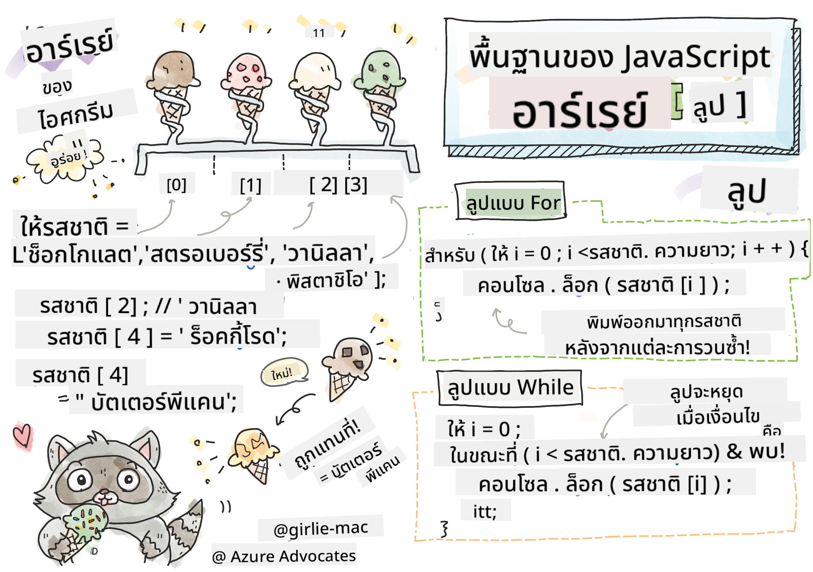

<!--
CO_OP_TRANSLATOR_METADATA:
{
  "original_hash": "3f7f87871312cf6cc12662da7d973182",
  "translation_date": "2025-08-26T21:46:01+00:00",
  "source_file": "2-js-basics/4-arrays-loops/README.md",
  "language_code": "th"
}
-->
# พื้นฐาน JavaScript: อาเรย์และลูป

  
> สเก็ตโน้ตโดย [Tomomi Imura](https://twitter.com/girlie_mac)

## แบบทดสอบก่อนเรียน
[แบบทดสอบก่อนเรียน](https://ashy-river-0debb7803.1.azurestaticapps.net/quiz/13)

บทเรียนนี้ครอบคลุมพื้นฐานของ JavaScript ซึ่งเป็นภาษาที่ช่วยเพิ่มความสามารถในการโต้ตอบบนเว็บ ในบทเรียนนี้ คุณจะได้เรียนรู้เกี่ยวกับอาเรย์และลูป ซึ่งใช้ในการจัดการข้อมูล

[](https://youtube.com/watch?v=1U4qTyq02Xw "Arrays")

[](https://www.youtube.com/watch?v=Eeh7pxtTZ3k "Loops")

> 🎥 คลิกที่ภาพด้านบนเพื่อดูวิดีโอเกี่ยวกับอาเรย์และลูป

> คุณสามารถเรียนบทเรียนนี้ได้ที่ [Microsoft Learn](https://docs.microsoft.com/learn/modules/web-development-101-arrays/?WT.mc_id=academic-77807-sagibbon)!

## อาเรย์

การทำงานกับข้อมูลเป็นงานที่พบได้บ่อยในทุกภาษา และจะง่ายขึ้นมากเมื่อข้อมูลถูกจัดระเบียบในรูปแบบโครงสร้าง เช่น อาเรย์ ด้วยอาเรย์ ข้อมูลจะถูกเก็บในโครงสร้างที่คล้ายกับรายการ หนึ่งในข้อดีหลักของอาเรย์คือคุณสามารถเก็บข้อมูลหลายประเภทในอาเรย์เดียวกันได้

✅ อาเรย์มีอยู่รอบตัวเรา! คุณนึกถึงตัวอย่างอาเรย์ในชีวิตจริงได้ไหม เช่น แผงโซลาร์เซลล์?

ไวยากรณ์ของอาเรย์คือการใช้วงเล็บเหลี่ยมคู่

```javascript
let myArray = [];
```

นี่คือตัวอย่างอาเรย์ว่างเปล่า แต่คุณสามารถประกาศอาเรย์ที่มีข้อมูลอยู่แล้วได้ ค่าหลายค่าภายในอาเรย์จะถูกคั่นด้วยเครื่องหมายจุลภาค

```javascript
let iceCreamFlavors = ["Chocolate", "Strawberry", "Vanilla", "Pistachio", "Rocky Road"];
```

ค่าภายในอาเรย์จะถูกกำหนดค่าที่ไม่ซ้ำกันเรียกว่า **ดัชนี (index)** ซึ่งเป็นตัวเลขจำนวนเต็มที่กำหนดตามระยะห่างจากจุดเริ่มต้นของอาเรย์ ในตัวอย่างด้านบน ค่าสตริง "Chocolate" มีดัชนีเป็น 0 และดัชนีของ "Rocky Road" คือ 4 คุณสามารถใช้ดัชนีร่วมกับวงเล็บเหลี่ยมเพื่อดึง เปลี่ยน หรือเพิ่มค่าภายในอาเรย์

✅ คุณแปลกใจไหมที่ดัชนีของอาเรย์เริ่มต้นที่ศูนย์? ในบางภาษาการเขียนโปรแกรม ดัชนีเริ่มต้นที่ 1 มีประวัติที่น่าสนใจเกี่ยวกับเรื่องนี้ ซึ่งคุณสามารถ [อ่านได้ใน Wikipedia](https://en.wikipedia.org/wiki/Zero-based_numbering)

```javascript
let iceCreamFlavors = ["Chocolate", "Strawberry", "Vanilla", "Pistachio", "Rocky Road"];
iceCreamFlavors[2]; //"Vanilla"
```

คุณสามารถใช้ดัชนีเพื่อเปลี่ยนค่าได้ เช่นนี้:

```javascript
iceCreamFlavors[4] = "Butter Pecan"; //Changed "Rocky Road" to "Butter Pecan"
```

และคุณสามารถเพิ่มค่าลงในดัชนีที่กำหนดได้ เช่นนี้:

```javascript
iceCreamFlavors[5] = "Cookie Dough"; //Added "Cookie Dough"
```

✅ วิธีที่พบบ่อยกว่าในการเพิ่มค่าลงในอาเรย์คือการใช้ตัวดำเนินการอาเรย์ เช่น array.push()

หากต้องการทราบจำนวนรายการในอาเรย์ ให้ใช้คุณสมบัติ `length`

```javascript
let iceCreamFlavors = ["Chocolate", "Strawberry", "Vanilla", "Pistachio", "Rocky Road"];
iceCreamFlavors.length; //5
```

✅ ลองทำด้วยตัวเอง! ใช้คอนโซลของเบราว์เซอร์เพื่อสร้างและจัดการอาเรย์ที่คุณสร้างขึ้นเอง

## ลูป

ลูปช่วยให้เราทำงานซ้ำ ๆ หรือ **iterative** ได้ และสามารถประหยัดเวลาและโค้ดได้มาก การวนซ้ำแต่ละครั้งสามารถเปลี่ยนแปลงตัวแปร ค่า และเงื่อนไขได้ ลูปใน JavaScript มีหลายประเภท ซึ่งแต่ละประเภทมีความแตกต่างเล็กน้อย แต่โดยพื้นฐานแล้วทำสิ่งเดียวกัน: วนซ้ำข้อมูล

### For Loop

`for` loop ต้องการ 3 ส่วนเพื่อทำการวนซ้ำ:
- `counter` ตัวแปรที่มักเริ่มต้นด้วยตัวเลขที่นับจำนวนการวนซ้ำ
- `condition` นิพจน์ที่ใช้ตัวดำเนินการเปรียบเทียบเพื่อหยุดลูปเมื่อเป็น `false`
- `iteration-expression` ทำงานเมื่อสิ้นสุดการวนซ้ำแต่ละครั้ง โดยปกติใช้เพื่อเปลี่ยนค่าของตัวนับ

```javascript
// Counting up to 10
for (let i = 0; i < 10; i++) {
  console.log(i);
}
```

✅ รันโค้ดนี้ในคอนโซลของเบราว์เซอร์ เกิดอะไรขึ้นเมื่อคุณเปลี่ยนแปลงเล็กน้อยกับตัวนับ เงื่อนไข หรือการแสดงออกของการวนซ้ำ? คุณสามารถทำให้มันวนถอยหลังเพื่อสร้างการนับถอยหลังได้ไหม?

### While loop

ต่างจากไวยากรณ์ของ `for` loop, `while` loop ต้องการเพียงเงื่อนไขที่หยุดลูปเมื่อเงื่อนไขกลายเป็น `false` เงื่อนไขในลูปมักพึ่งพาค่าต่าง ๆ เช่น ตัวนับ และต้องจัดการระหว่างลูป ค่าตั้งต้นสำหรับตัวนับต้องถูกสร้างขึ้นนอกลูป และนิพจน์ใด ๆ ที่ใช้เพื่อตอบสนองเงื่อนไข รวมถึงการเปลี่ยนแปลงตัวนับต้องถูกจัดการภายในลูป

```javascript
//Counting up to 10
let i = 0;
while (i < 10) {
 console.log(i);
 i++;
}
```

✅ ทำไมคุณถึงเลือกใช้ for loop แทน while loop? ผู้ชม 17,000 คนมีคำถามเดียวกันใน StackOverflow และบางความคิดเห็น [อาจน่าสนใจสำหรับคุณ](https://stackoverflow.com/questions/39969145/while-loops-vs-for-loops-in-javascript)

## ลูปและอาเรย์

อาเรย์มักถูกใช้ร่วมกับลูป เพราะเงื่อนไขส่วนใหญ่ต้องการความยาวของอาเรย์เพื่อหยุดลูป และดัชนียังสามารถใช้เป็นค่าของตัวนับได้

```javascript
let iceCreamFlavors = ["Chocolate", "Strawberry", "Vanilla", "Pistachio", "Rocky Road"];

for (let i = 0; i < iceCreamFlavors.length; i++) {
  console.log(iceCreamFlavors[i]);
} //Ends when all flavors are printed
```

✅ ลองทดลองวนซ้ำอาเรย์ที่คุณสร้างขึ้นเองในคอนโซลของเบราว์เซอร์

---

## 🚀 ความท้าทาย

มีวิธีอื่นในการวนซ้ำอาเรย์นอกเหนือจาก for และ while loop เช่น [forEach](https://developer.mozilla.org/docs/Web/JavaScript/Reference/Global_Objects/Array/forEach), [for-of](https://developer.mozilla.org/docs/Web/JavaScript/Reference/Statements/for...of), และ [map](https://developer.mozilla.org/docs/Web/JavaScript/Reference/Global_Objects/Array/map) ลองเขียนลูปอาเรย์ของคุณใหม่โดยใช้เทคนิคเหล่านี้

## แบบทดสอบหลังเรียน
[แบบทดสอบหลังเรียน](https://ashy-river-0debb7803.1.azurestaticapps.net/quiz/14)

## ทบทวนและศึกษาด้วยตัวเอง

อาเรย์ใน JavaScript มีเมธอดมากมายที่มีประโยชน์อย่างยิ่งสำหรับการจัดการข้อมูล [อ่านเพิ่มเติมเกี่ยวกับเมธอดเหล่านี้](https://developer.mozilla.org/docs/Web/JavaScript/Reference/Global_Objects/Array) และลองใช้บางเมธอด (เช่น push, pop, slice และ splice) กับอาเรย์ที่คุณสร้างขึ้นเอง

## งานที่ได้รับมอบหมาย

[วนซ้ำอาเรย์](assignment.md)

---

**ข้อจำกัดความรับผิดชอบ**:  
เอกสารนี้ได้รับการแปลโดยใช้บริการแปลภาษา AI [Co-op Translator](https://github.com/Azure/co-op-translator) แม้ว่าเราจะพยายามให้การแปลมีความถูกต้องมากที่สุด แต่โปรดทราบว่าการแปลอัตโนมัติอาจมีข้อผิดพลาดหรือความไม่ถูกต้อง เอกสารต้นฉบับในภาษาดั้งเดิมควรถือเป็นแหล่งข้อมูลที่เชื่อถือได้ สำหรับข้อมูลที่สำคัญ ขอแนะนำให้ใช้บริการแปลภาษามืออาชีพ เราไม่รับผิดชอบต่อความเข้าใจผิดหรือการตีความผิดที่เกิดจากการใช้การแปลนี้