<!--
CO_OP_TRANSLATOR_METADATA:
{
  "original_hash": "1710a50a519a6e4a1b40a5638783018d",
  "translation_date": "2026-01-06T21:42:17+00:00",
  "source_file": "2-js-basics/4-arrays-loops/README.md",
  "language_code": "th"
}
-->
# JavaScript Basics: Arrays and Loops


> Sketchnote โดย [Tomomi Imura](https://twitter.com/girlie_mac)

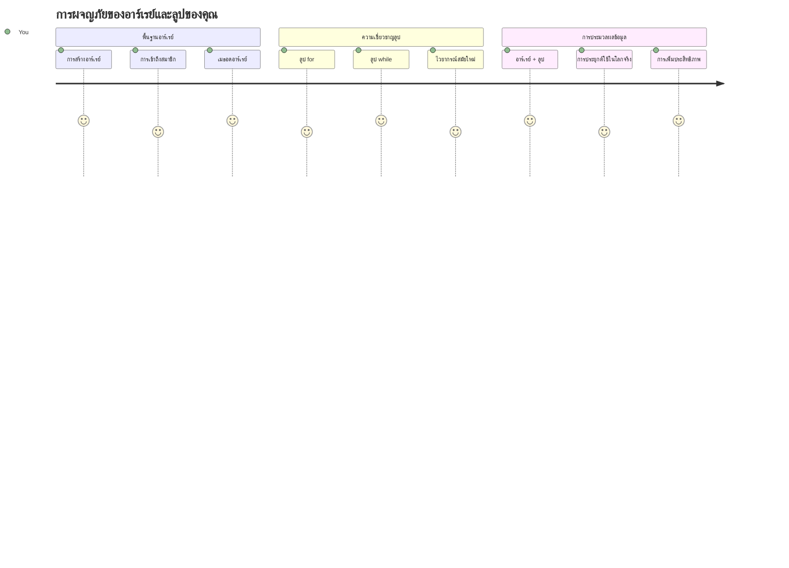
## การทดสอบก่อนเรียน
[แบบทดสอบก่อนเรียน](https://ff-quizzes.netlify.app/web/quiz/13)

เคยสงสัยไหมว่าเว็บไซต์เก็บข้อมูลของสินค้าที่อยู่ในตะกร้าช็อปปิ้งหรือแสดงรายการเพื่อนของคุณได้อย่างไร? นั่นคือที่มาของอาร์เรย์และลูป อาร์เรย์เหมือนภาชนะดิจิทัลที่เก็บข้อมูลหลายชิ้นไว้ด้วยกัน ในขณะที่ลูปช่วยให้คุณทำงานกับข้อมูลทั้งหมดอย่างมีประสิทธิภาพโดยไม่ต้องเขียนโค้ดซ้ำๆ

สองแนวคิดนี้รวมกันเป็นรากฐานสำหรับจัดการข้อมูลในโปรแกรมของคุณ คุณจะเรียนรู้การเปลี่ยนจากเขียนทีละขั้นตอนด้วยมือมาเป็นการสร้างโค้ดอัจฉริยะและมีประสิทธิภาพที่สามารถประมวลผลรายการหลายร้อยหรือหลายพันรายการได้อย่างรวดเร็ว

เมื่อจบบทเรียนนี้ คุณจะเข้าใจวิธีทำงานกับข้อมูลที่ซับซ้อนโดยใช้โค้ดเพียงไม่กี่บรรทัด มาเรียนรู้แนวคิดสำคัญของการเขียนโปรแกรมนี้ไปด้วยกัน

[](https://youtube.com/watch?v=1U4qTyq02Xw "Arrays")

[](https://www.youtube.com/watch?v=Eeh7pxtTZ3k "Loops")

> 🎥 คลิกที่ภาพด้านบนเพื่อชมวิดีโอเกี่ยวกับอาร์เรย์และลูป

> คุณสามารถเรียนบทนี้บน [Microsoft Learn](https://docs.microsoft.com/learn/modules/web-development-101-arrays/?WT.mc_id=academic-77807-sagibbon)!

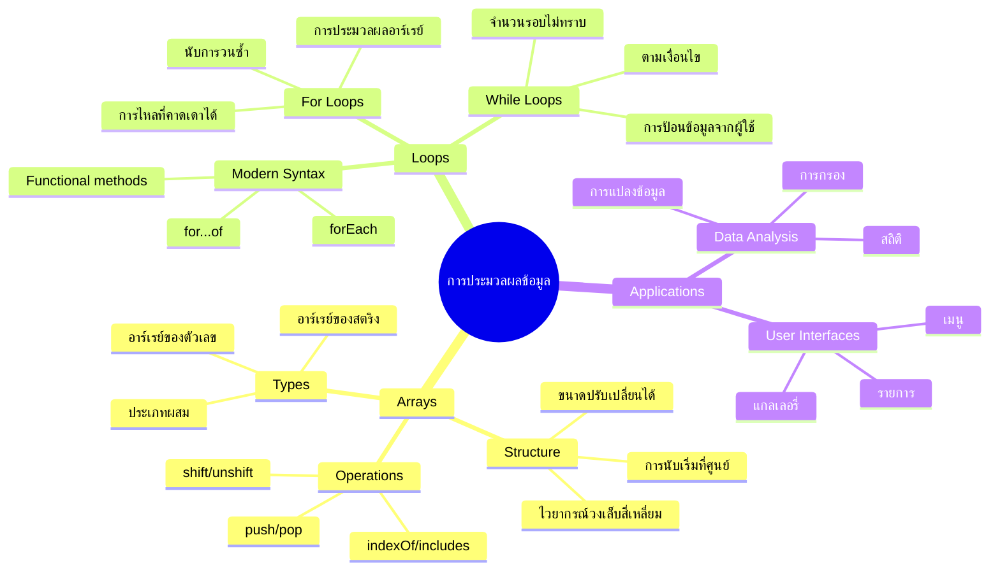
## อาร์เรย์

คิดว่าอาร์เรย์เหมือนกับตู้เก็บเอกสารดิจิทัล — แทนที่จะเก็บเอกสารเพียงชิ้นเดียวในลิ้นชักแต่ละลิ้นชัก คุณสามารถจัดหมวดหมู่รายการที่เกี่ยวข้องกันหลายรายการในภาชนะที่มีโครงสร้างเดียว ในทางโปรแกรมมิ่ง อาร์เรย์ช่วยให้คุณเก็บข้อมูลหลายชิ้นในแพ็กเกจเดียวที่จัดระเบียบไว้แล้ว

ไม่ว่าจะเป็นการสร้างแกลเลอรี่ภาพ จัดการกับรายการสิ่งที่ต้องทำ หรือเก็บคะแนนสูงสุดในเกม อาร์เรย์เป็นพื้นฐานสำหรับการจัดระเบียบข้อมูล มาดูกันว่ามันทำงานอย่างไร

✅ อาร์เรย์อยู่รอบตัวเรา! คุณนึกตัวอย่างในชีวิตจริงของอาร์เรย์ได้ไหม เช่น แผงโซลาร์เซลล์?

### การสร้างอาร์เรย์

การสร้างอาร์เรย์ง่ายมาก — ใช้วงเล็บเหลี่ยม!

```javascript
// อาร์เรย์ว่างเปล่า - เหมือนรถเข็นช้อปปิ้งว่างเปล่าที่รอใส่สินค้า
const myArray = [];
```

**เกิดอะไรขึ้นที่นี่?**
คุณเพิ่งสร้างภาชนะว่างเปล่าด้วยวงเล็บเหลี่ยม `[]` คิดว่ามันเหมือนชั้นหนังสือเปล่าที่พร้อมจะเก็บหนังสือในแบบที่คุณต้องการจัดระเบียบไว้ที่นั่น

คุณยังสามารถเติมค่าเริ่มต้นในอาร์เรย์ของคุณตั้งแต่ต้นได้ด้วย:

```javascript
// เมนูรสชาติของร้านไอศกรีมของคุณ
const iceCreamFlavors = ["Chocolate", "Strawberry", "Vanilla", "Pistachio", "Rocky Road"];

// ข้อมูลโปรไฟล์ของผู้ใช้ (ผสมผสานข้อมูลประเภทต่าง ๆ)
const userData = ["John", 25, true, "developer"];

// คะแนนทดสอบสำหรับคลาสที่คุณชื่นชอบ
const scores = [95, 87, 92, 78, 85];
```

**สิ่งเจ๋งที่ควรสังเกต:**
- คุณสามารถเก็บข้อความ ตัวเลข หรือค่าจริง/เท็จในอาร์เรย์เดียวกัน
- เพียงแค่คั่นแต่ละรายการด้วยเครื่องหมายจุลภาค - ง่ายมาก!
- อาร์เรย์เหมาะสำหรับเก็บข้อมูลที่เกี่ยวข้องกันไว้ด้วยกัน

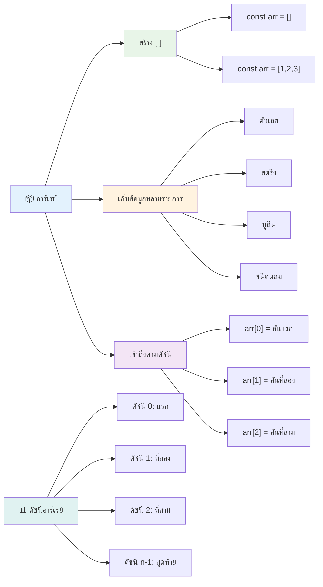
### ดัชนีของอาร์เรย์

สิ่งหนึ่งที่อาจดูแปลกในตอนแรก: อาร์เรย์จะเริ่มนับรายการจาก 0 ไม่ใช่ 1 การเข้ารหัสแบบมีดัชนีเริ่มต้นที่ศูนย์นี้มีรากฐานมาจากวิธีทำงานของหน่วยความจำคอมพิวเตอร์ — เป็นข้อปฏิบัติในโปรแกรมมิ่งตั้งแต่ช่วงแรกของภาษาคอมพิวเตอร์อย่าง C แต่ละตำแหน่งในอาร์เรย์จะมีหมายเลขที่เรียกว่า **ดัชนี**

| ดัชนี | ค่า | คำอธิบาย |
|-------|-------|-------------|
| 0 | "ช็อกโกแลต" | องค์ประกอบตัวแรก |
| 1 | "สตรอเบอร์รี่" | องค์ประกอบตัวที่สอง |
| 2 | "วานิลลา" | องค์ประกอบตัวที่สาม |
| 3 | "พิสตาชิโอ" | องค์ประกอบตัวที่สี่ |
| 4 | "ร็อกกี้โร้ด" | องค์ประกอบตัวที่ห้า |

✅ คุณรู้สึกประหลาดใจไหมที่อาร์เรย์เริ่มนับจากดัชนีศูนย์? ในบางภาษาการเขียนโปรแกรม ดัชนีเริ่มต้นที่ 1 มีประวัติที่น่าสนใจเกี่ยวกับเรื่องนี้ คุณสามารถ [อ่านเพิ่มเติมได้ที่ Wikipedia](https://en.wikipedia.org/wiki/Zero-based_numbering)

**การเข้าถึงองค์ประกอบในอาร์เรย์:**

```javascript
const iceCreamFlavors = ["Chocolate", "Strawberry", "Vanilla", "Pistachio", "Rocky Road"];

// เข้าถึงองค์ประกอบแต่ละตัวโดยใช้สัญลักษณ์วงเล็บ
console.log(iceCreamFlavors[0]); // "ช็อกโกแลต" - องค์ประกอบตัวแรก
console.log(iceCreamFlavors[2]); // "วานิลลา" - องค์ประกอบตัวที่สาม
console.log(iceCreamFlavors[4]); // "ร็อกกี้ โร้ด" - องค์ประกอบตัวสุดท้าย
```

**แตกย่อยสิ่งที่เกิดขึ้นที่นี่:**
- **ใช้** การเข้าถึงด้วยวงเล็บเหลี่ยมพร้อมหมายเลขดัชนี
- **ส่งคืน** ค่าที่จัดเก็บในตำแหน่งนั้นในอาร์เรย์
- **เริ่มนับ** จาก 0 โดยองค์ประกอบตัวแรกมีดัชนีเป็น 0

**การแก้ไของค์ประกอบในอาร์เรย์:**

```javascript
// เปลี่ยนค่าเดิม
iceCreamFlavors[4] = "Butter Pecan";
console.log(iceCreamFlavors[4]); // "บัตเตอร์พีแคน"

// เพิ่มองค์ประกอบใหม่ที่ส่วนท้าย
iceCreamFlavors[5] = "Cookie Dough";
console.log(iceCreamFlavors[5]); // "คุกกี้โดว์"
```

**ในตัวอย่างข้างต้นเราได้:**
- **แก้ไข** องค์ประกอบที่ดัชนี 4 จาก "ร็อกกี้โร้ด" เป็น "บัตเตอร์พีแคน"
- **เพิ่ม** องค์ประกอบใหม่ "คุกกี้โดว์" ที่ดัชนีที่ 5
- **ขยาย** ความยาวอาร์เรย์โดยอัตโนมัติเมื่อต้องเพิ่มเกินขอบเขตปัจจุบัน

### ความยาวอาร์เรย์และเมธอดทั่วไป

อาร์เรย์มาพร้อมกับคุณสมบัติและเมธอดในตัวที่ช่วยให้การทำงานกับข้อมูลง่ายขึ้นมาก

**การหาความยาวของอาร์เรย์:**

```javascript
const iceCreamFlavors = ["Chocolate", "Strawberry", "Vanilla", "Pistachio", "Rocky Road"];
console.log(iceCreamFlavors.length); // 5

// ความยาวจะอัปเดตโดยอัตโนมัติเมื่ออาเรย์เปลี่ยนแปลง
iceCreamFlavors.push("Mint Chip");
console.log(iceCreamFlavors.length); // 6
```

**จุดสำคัญที่จดจำได้:**
- **ส่งคืน** จำนวนองค์ประกอบทั้งหมดในอาร์เรย์
- **อัปเดต** อัตโนมัติเมื่อต้องเพิ่มหรือลบองค์ประกอบ
- **ให้** ตัวนับแบบไดนามิกที่มีประโยชน์สำหรับลูปและการตรวจสอบ

**เมธอดพื้นฐานของอาร์เรย์:**

```javascript
const fruits = ["apple", "banana", "orange"];

// เพิ่มองค์ประกอบ
fruits.push("grape");           // เพิ่มที่ท้าย: ["apple", "banana", "orange", "grape"]
fruits.unshift("strawberry");   // เพิ่มที่ต้น: ["strawberry", "apple", "banana", "orange", "grape"]

// ลบองค์ประกอบ
const lastFruit = fruits.pop();        // ลบและคืนค่า "grape"
const firstFruit = fruits.shift();     // ลบและคืนค่า "strawberry"

// ค้นหาองค์ประกอบ
const index = fruits.indexOf("banana"); // คืนค่า 1 (ตำแหน่งของ "banana")
const hasApple = fruits.includes("apple"); // คืนค่า true
```

**เข้าใจเมธอดเหล่านี้:**
- **เพิ่ม** องค์ประกอบด้วย `push()` (ท้าย) และ `unshift()` (ต้น)
- **ลบ** องค์ประกอบด้วย `pop()` (ท้าย) และ `shift()` (ต้น)
- **ค้นหา** องค์ประกอบด้วย `indexOf()` และตรวจสอบการมีอยู่ด้วย `includes()`
- **ส่งคืน** ค่าที่มีประโยชน์ เช่น องค์ประกอบที่ถูกลบหรือดัชนีตำแหน่ง

✅ ลองทำดูเอง! ใช้คอนโซลของเบราว์เซอร์สร้างและจัดการอาร์เรย์ที่คุณสร้างขึ้นเอง

### 🧠 **ตรวจสอบพื้นฐานอาร์เรย์: การจัดระเบียบข้อมูลของคุณ**

**ทดสอบความเข้าใจอาร์เรย์:**
- ทำไมคุณคิดว่าอาร์เรย์เริ่มนับที่ 0 แทนที่จะเป็น 1?
- จะเกิดอะไรขึ้นถ้าคุณพยายามเข้าถึงดัชนีที่ไม่มี (เช่น `arr[100]` ในอาร์เรย์ 5 องค์ประกอบ)?
- คุณนึกสถานการณ์จริงที่เหมาะกับการใช้ อาร์เรย์ ได้สามสถานการณ์ไหม?

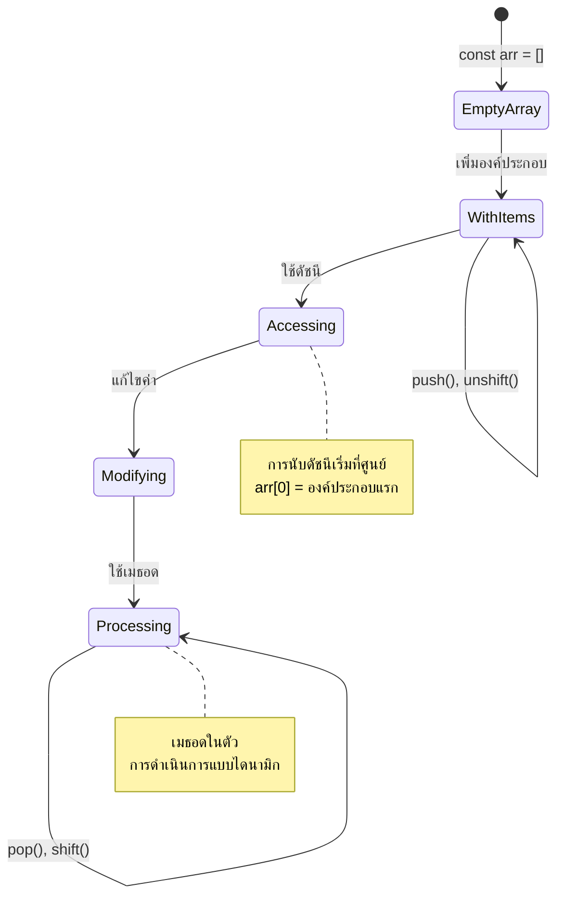
> **ข้อมูลในโลกความเป็นจริง**: อาร์เรย์อยู่ทุกที่ในการเขียนโปรแกรม! ฟีดโซเชียลมีเดีย ตะกร้าช็อปปิ้ง แกลเลอรี่ภาพ เพลงในเพลย์ลิสต์ — ทั้งหมดนี้คืออาร์เรย์ที่ดำเนินงานอยู่เบื้องหลัง!

## ลูป

คิดถึงบทลงโทษในนิยายของชาลส์ ดิคเก้นส์ ที่นักเรียนต้องเขียนประโยคซ้ำๆ บนกระดานดำ ลองจินตนาการว่าคุณสามารถสั่งใครสักคนว่า "เขียนประโยคนี้ 100 ครั้ง" แล้วมันก็ทำได้โดยอัตโนมัติ นั่นคือสิ่งที่ลูปทำกับโค้ดของคุณ

ลูปเหมือนผู้ช่วยที่ไม่เหน็ดเหนื่อย สามารถทำงานซ้ำๆ ได้โดยไม่ผิดพลาด ไม่ว่าคุณจะต้องตรวจสอบสินค้าทุกชิ้นในตะกร้าหรือแสดงภาพทั้งหมดในอัลบั้ม ลูปจัดการงานซ้ำๆ เหล่านี้ได้อย่างมีประสิทธิภาพ

JavaScript มีลูปหลายประเภทให้เลือก เรามาดูแต่ละแบบและเข้าใจว่าจะใช้เมื่อไร

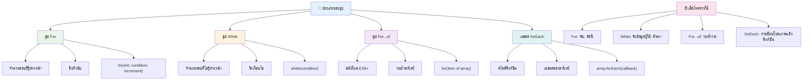
### ลูป for

ลูป `for` เหมือนตั้งเวลานับถอยหลัง — คุณรู้ว่าต้องการให้เกิดขึ้นกี่ครั้ง จึงมีความเป็นระเบียบและคาดการณ์ได้ดี เหมาะมากเมื่อคุณทำงานกับอาร์เรย์หรือต้องนับจำนวน

**โครงสร้างลูป for:**

| ส่วนประกอบ | จุดประสงค์ | ตัวอย่าง |
|-----------|---------|----------|
| **การเริ่มต้น** | กำหนดจุดเริ่มต้น | `let i = 0` |
| **เงื่อนไข** | เมื่อใดถึงจะทำต่อ | `i < 10` |
| **การเพิ่มค่า** | วิธีอัปเดต | `i++` |

```javascript
// นับจาก 0 ถึง 9
for (let i = 0; i < 10; i++) {
  console.log(`Count: ${i}`);
}

// ตัวอย่างที่ใช้งานได้จริงมากขึ้น: การประมวลผลคะแนน
const testScores = [85, 92, 78, 96, 88];
for (let i = 0; i < testScores.length; i++) {
  console.log(`Student ${i + 1}: ${testScores[i]}%`);
}
```

**ทีละขั้นตอน สิ่งที่เกิดขึ้นคือ:**
- **กำหนดค่าเริ่มต้น** ตัวแปรนับ `i` เท่ากับ 0 ตอนเริ่มต้น
- **ตรวจสอบ** เงื่อนไข `i < 10` ก่อนแต่ละรอบลูป
- **เรียกใช้** บล็อกโค้ดเมื่อเงื่อนไขเป็นจริง
- **เพิ่มค่า** `i` ทีละ 1 หลังจากแต่ละรอบด้วย `i++`
- **หยุด** เมื่อเงื่อนไขเป็นเท็จ (เมื่อ `i` ถึง 10)

✅ รันโค้ดนี้ในคอนโซลเบราว์เซอร์ดูสิ จะเกิดอะไรขึ้นถ้าคุณเปลี่ยนค่าตัวนับ เงื่อนไข หรือการเพิ่มค่าเล็กน้อย? คุณทำให้มันนับถอยหลังได้ไหม?

### 🗓️ **ตรวจสอบความชำนาญลูป for: การทำซ้ำที่ควบคุมได้**

**ประเมินความเข้าใจลูป for:**
- ลูป for มีสามส่วน คืออะไร และแต่ละส่วนทำหน้าที่อะไร?
- คุณจะเขียนลูปสำหรับผ่านอาร์เรย์ย้อนหลังอย่างไร?
- จะเกิดอะไรขึ้นถ้าคุณลืมเขียนส่วนเพิ่มค่า (`i++`)?

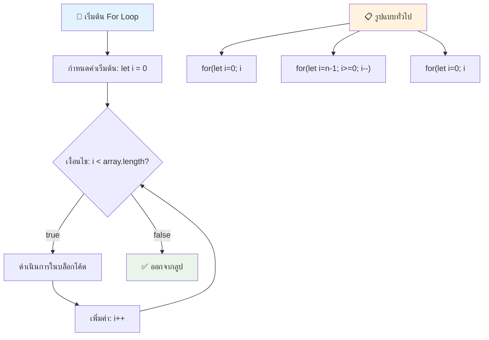
> **ภูมิปัญญาของลูป**: ลูป for เหมาะที่สุดเมื่อคุณรู้จำนวนรอบที่ต้องการซ้ำ มันเป็นตัวเลือกที่ใช้บ่อยที่สุดสำหรับการประมวลผลอาร์เรย์!

### ลูป while

ลูป `while` เหมือนการบอกว่า "ทำสิ่งนี้ต่อไปจนกว่า…" — คุณอาจไม่รู้จำนวนครั้งที่แน่นอน แต่มักรู้ว่าเมื่อใดควรหยุด เหมาะสำหรับการขอรับข้อมูลจากผู้ใช้จนกว่าจะได้รับข้อมูลครบถ้วน หรือค้นหาข้อมูลจนกว่าจะเจอเป้าหมาย

**ลักษณะลูป while:**
- **ดำเนินการ** ต่อเนื่องตราบใดที่เงื่อนไขเป็นจริง
- **ต้อง** จัดการตัวแปรนับด้วยตนเอง
- **ตรวจสอบ** เงื่อนไขก่อนทำทุกครั้ง
- **เสี่ยง** ที่จะเกิดลูปไม่รู้จบถ้าเงื่อนไขไม่เคยเป็นเท็จ

```javascript
// ตัวอย่างการนับพื้นฐาน
let i = 0;
while (i < 10) {
  console.log(`While count: ${i}`);
  i++; // อย่าลืมเพิ่มค่า!
}

// ตัวอย่างที่ใช้งานได้จริงมากขึ้น: การประมวลผลข้อมูลนำเข้าของผู้ใช้
let userInput = "";
let attempts = 0;
const maxAttempts = 3;

while (userInput !== "quit" && attempts < maxAttempts) {
  userInput = prompt(`Enter 'quit' to exit (attempt ${attempts + 1}):`);
  attempts++;
}

if (attempts >= maxAttempts) {
  console.log("Maximum attempts reached!");
}
```

**ทำความเข้าใจกับตัวอย่าง:**
- **จัดการ** ตัวแปรนับ `i` ด้วยตนเองภายในบอดี้ลูป
- **เพิ่มค่า** ตัวนับเพื่อป้องกันลูปไม่รู้จบ
- **แสดง** กรณีใช้งานจริงกับการรับข้อมูลจากผู้ใช้และจำกัดจำนวนครั้ง
- **มี** กลไกความปลอดภัยป้องกันการทำงานไม่จบสิ้น

### ♾️ **ทดสอบความรู้ลูป while: การทำซ้ำตามเงื่อนไข**

**ทดสอบความเข้าใจลูป while:**
- อันตรายหลักของการใช้ลูป while คืออะไร?
- เมื่อไหร่คุณจะเลือกใช้ลูป while แทนลูป for?
- คุณป้องกันการเกิดลูปไม่รู้จบอย่างไร?

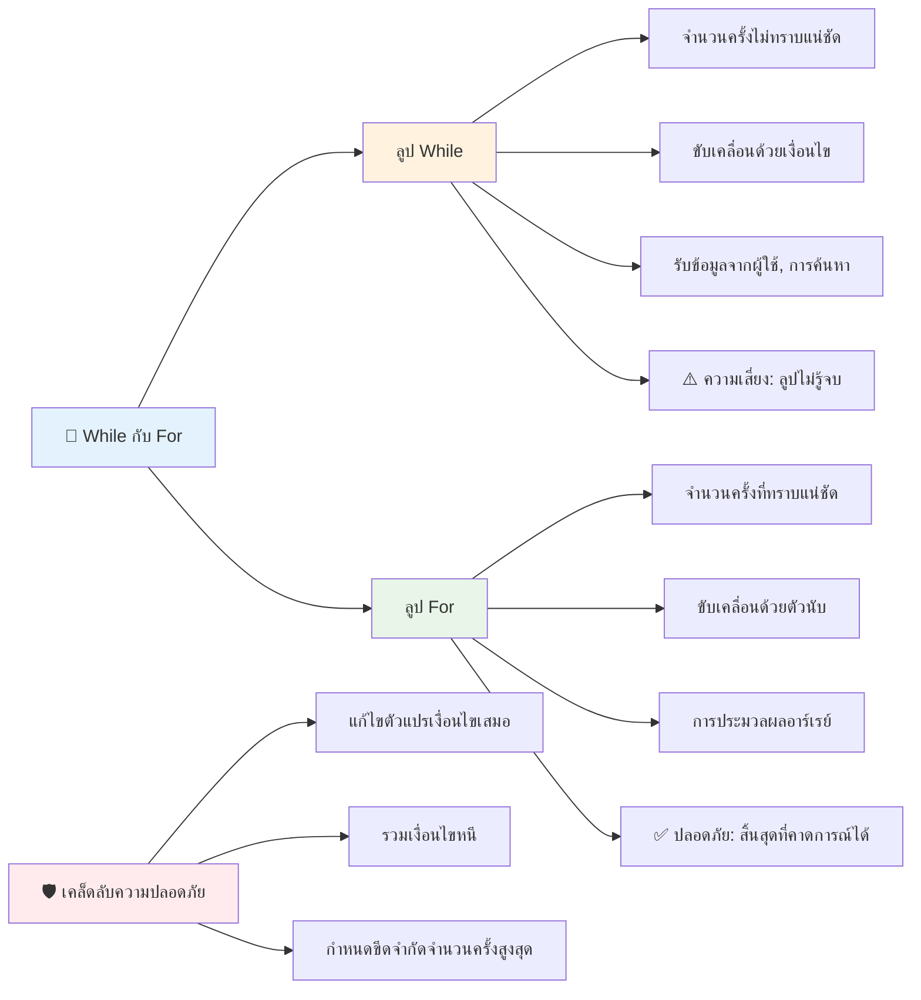
> **ความปลอดภัยก่อน**: ลูป while มีพลังแต่ต้องจัดการเงื่อนไขอย่างระมัดระวัง ให้แน่ใจว่าในที่สุดเงื่อนไขจะกลายเป็นเท็จ!

### ทางเลือกลูปสมัยใหม่

JavaScript มีไวยากรณ์ลูปสมัยใหม่ที่ทำให้โค้ดของคุณอ่านง่ายขึ้นและลดความผิดพลาด

**for...of Loop (ES6+):**

```javascript
const colors = ["red", "green", "blue", "yellow"];

// วิธีสมัยใหม่ - สะอาดและปลอดภัยมากขึ้น
for (const color of colors) {
  console.log(`Color: ${color}`);
}

// เปรียบเทียบกับลูป for แบบดั้งเดิม
for (let i = 0; i < colors.length; i++) {
  console.log(`Color: ${colors[i]}`);
}
```

**ข้อดีหลักของ for...of:**
- **ขจัด** การจัดการดัชนีและข้อผิดพลาดดัชนีเกิน/ต่ำ
- **ให้** การเข้าถึงองค์ประกอบในอาร์เรย์ตรง ๆ
- **ปรับปรุง** ความอ่านง่ายและลดความซับซ้อนของไวยากรณ์

**เมธอด forEach:**

```javascript
const prices = [9.99, 15.50, 22.75, 8.25];

// ใช้ forEach สำหรับสไตล์การเขียนโปรแกรมเชิงฟังก์ชัน
prices.forEach((price, index) => {
  console.log(`Item ${index + 1}: $${price.toFixed(2)}`);
});

// forEach กับฟังก์ชันลูกศรสำหรับงานที่ง่ายขึ้น
prices.forEach(price => console.log(`Price: $${price}`));
```

**สิ่งที่ควรรู้เกี่ยวกับ forEach:**
- **รัน** ฟังก์ชันสำหรับองค์ประกอบแต่ละตัวในอาร์เรย์
- **ให้** ทั้งค่าองค์ประกอบและดัชนีเป็นพารามิเตอร์
- **ไม่สามารถ** หยุดกลางคัน (ต่างจากลูปแบบดั้งเดิม)
- **คืนค่า** undefined (ไม่สร้างอาร์เรย์ใหม่)

✅ ทำไมคุณถึงเลือกใช้ลูป for แทนลูป while? มีผู้ชม 17,000 คนตั้งคำถามนี้บน StackOverflow และบางความคิดเห็น [อาจน่าสนใจสำหรับคุณ](https://stackoverflow.com/questions/39969145/while-loops-vs-for-loops-in-javascript)

### 🎨 **ตรวจสอบไวยากรณ์ลูปสมัยใหม่: ยอมรับ ES6+**

**ประเมินความเข้าใจ JavaScript สมัยใหม่ของคุณ:**
- ข้อดีของ `for...of` เมื่อเทียบกับลูป for แบบดั้งเดิมคืออะไร?
- เมื่อใดที่คุณยังเลือกใช้ลูป for แบบดั้งเดิม?
- ความแตกต่างระหว่าง `forEach` กับ `map` คืออะไร?

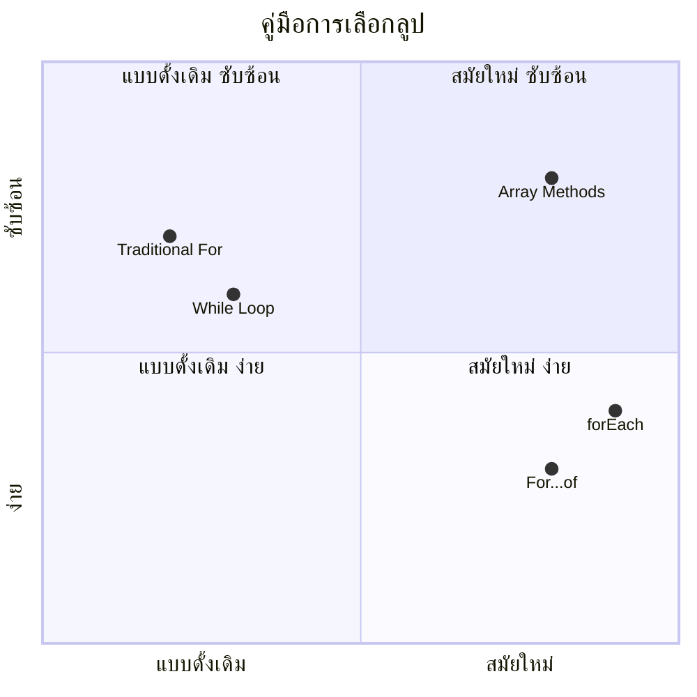
> **เทรนด์สมัยใหม่**: ไวยากรณ์ ES6+ เช่น `for...of` และ `forEach` กำลังเป็นที่นิยมสำหรับการวนอาร์เรย์เพราะสะอาดตาและลดข้อผิดพลาด!

## ลูปและอาร์เรย์

การรวมกันของอาร์เรย์และลูปสร้างความสามารถในการประมวลผลข้อมูลที่ทรงพลัง คู่ผสมนี้เป็นพื้นฐานสำหรับงานหลักหลายประเภทในโปรแกรม เช่น การแสดงรายการหรือการคำนวณสถิติ

**การประมวลผลอาร์เรย์แบบดั้งเดิม:**

```javascript
const iceCreamFlavors = ["Chocolate", "Strawberry", "Vanilla", "Pistachio", "Rocky Road"];

// วิธีการใช้ลูป for แบบคลาสสิก
for (let i = 0; i < iceCreamFlavors.length; i++) {
  console.log(`Flavor ${i + 1}: ${iceCreamFlavors[i]}`);
}

// วิธีการใช้ for...of แบบสมัยใหม่
for (const flavor of iceCreamFlavors) {
  console.log(`Available flavor: ${flavor}`);
}
```

**เข้าใจวิธีนี้:**
- **ใช้** คุณสมบัติความยาวของอาร์เรย์เพื่อกำหนดขอบเขตลูป
- **เข้าถึง** องค์ประกอบด้วยดัชนีในลูป for แบบดั้งเดิม
- **ให้** การเข้าถึงองค์ประกอบโดยตรงในลูป for...of
- **ประมวลผล** ทุกองค์ประกอบในอาร์เรย์ทีละตัว

**ตัวอย่างการประมวลผลข้อมูลจริง:**

```javascript
const studentGrades = [85, 92, 78, 96, 88, 73, 89];
let total = 0;
let highestGrade = studentGrades[0];
let lowestGrade = studentGrades[0];

// ประมวลผลเกรดทั้งหมดด้วยลูปเดียว
for (let i = 0; i < studentGrades.length; i++) {
  const grade = studentGrades[i];
  total += grade;
  
  if (grade > highestGrade) {
    highestGrade = grade;
  }
  
  if (grade < lowestGrade) {
    lowestGrade = grade;
  }
}

const average = total / studentGrades.length;
console.log(`Average: ${average.toFixed(1)}`);
console.log(`Highest: ${highestGrade}`);
console.log(`Lowest: ${lowestGrade}`);
```

**โค้ดนี้ทำงานอย่างไร:**
- **กำหนด** ตัวแปรติดตามผลรวมและค่าสูงสุดต่ำสุด
- **ประมวลผล** คะแนนแต่ละตัวด้วยลูปลูปเดียวที่มีประสิทธิภาพ
- **สะสม** ผลรวมเพื่อคำนวณค่าเฉลี่ย
- **ติดตาม** ค่าสูงสุดและต่ำสุดในระหว่างการวนซ้ำ
- **คำนวณ** สถิติสุดท้ายหลังจากจบลูป

✅ ทดลองใช้ลูปกับอาร์เรย์ที่คุณสร้างเองในคอนโซลบราวเซอร์ของคุณ

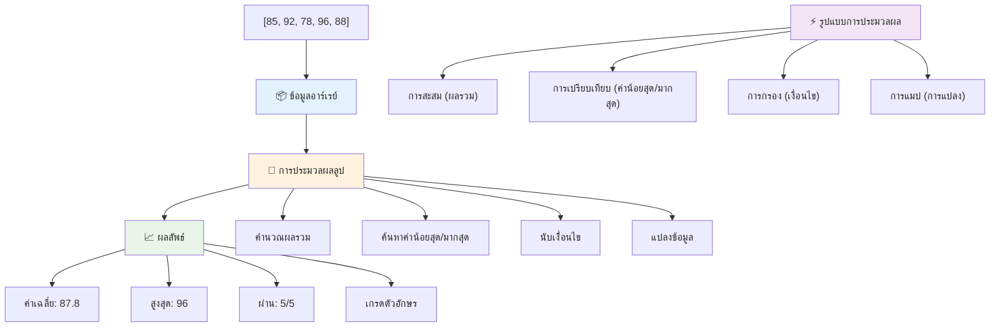
---

## ความท้าทาย GitHub Copilot Agent 🚀

ใช้โหมด Agent เพื่อทำความท้าทายดังนี้:

**คำอธิบาย:** สร้างฟังก์ชันประมวลผลข้อมูลครบถ้วนที่รวมอาร์เรย์และลูป เพื่อวิเคราะห์ชุดข้อมูลและสร้างข้อมูลเชิงลึกที่มีความหมาย

**คำสั่ง:** สร้างฟังก์ชันชื่อ `analyzeGrades` ที่รับอาร์เรย์ของอ็อบเจกต์เกรดนักเรียน (ซึ่งแต่ละอ็อบเจกต์ประกอบด้วยชื่อและคะแนน) และส่งคืนอ็อบเจกต์ที่มีสถิติรวมถึงคะแนนสูงสุด คะแนนต่ำสุด ค่าเฉลี่ย จำนวนผู้ผ่าน (คะแนน >= 70) และอาร์เรย์ของชื่อนักเรียนที่ได้คะแนนสูงกว่าค่าเฉลี่ย ใช้ลูปอย่างน้อยสองชนิดในโค้ดของคุณ

เรียนรู้เพิ่มเติมเกี่ยวกับ [โหมด agent](https://code.visualstudio.com/blogs/2025/02/24/introducing-copilot-agent-mode) ที่นี่

## 🚀 ความท้าทาย
JavaScript มีเมธอดอาร์เรย์สมัยใหม่หลายอย่างที่สามารถแทนที่ลูปแบบดั้งเดิมในงานเฉพาะได้ สำรวจ [forEach](https://developer.mozilla.org/docs/Web/JavaScript/Reference/Global_Objects/Array/forEach), [for-of](https://developer.mozilla.org/docs/Web/JavaScript/Reference/Statements/for...of), [map](https://developer.mozilla.org/docs/Web/JavaScript/Reference/Global_Objects/Array/map), [filter](https://developer.mozilla.org/docs/Web/JavaScript/Reference/Global_Objects/Array/filter), และ [reduce](https://developer.mozilla.org/docs/Web/JavaScript/Reference/Global_Objects/Array/reduce)

**ความท้าทายของคุณ:** ปรับปรุงตัวอย่างเกรดของนักเรียนโดยใช้เมธอดอาร์เรย์ที่แตกต่างกันอย่างน้อยสามตัว สังเกตว่ารหัสสะอาดและอ่านง่ายขึ้นมากด้วยไวยากรณ์ JavaScript สมัยใหม่

## แบบทดสอบหลังบรรยาย
[แบบทดสอบหลังบรรยาย](https://ff-quizzes.netlify.app/web/quiz/14)


## ทบทวน & การเรียนรู้ด้วยตนเอง

อาร์เรย์ใน JavaScript มีเมธอดมากมายที่แนบมาด้วย ซึ่งมีประโยชน์มากสำหรับการจัดการข้อมูล [อ่านเกี่ยวกับเมธอดเหล่านี้](https://developer.mozilla.org/docs/Web/JavaScript/Reference/Global_Objects/Array) และลองใช้บางส่วน (เช่น push, pop, slice และ splice) กับอาร์เรย์ที่คุณสร้างขึ้น

## การบ้าน

[การวนลูปอาร์เรย์](assignment.md)

---

## 📊 **สรุปเครื่องมืออาร์เรย์ & ลูป ของคุณ**

```mermaid
graph TD
    A["🎯 ความชำนาญอาเรย์ & ลูป"] --> B["📦 พื้นฐานอาเรย์"]
    A --> C["🔄 ประเภทลูป"]
    A --> D["🔗 การประมวลผลข้อมูล"]
    A --> E["🎨 เทคนิคสมัยใหม่"]
    
    B --> B1["การสร้าง: [ ]"]
    B --> B2["การจัดทำดัชนี: arr[0]"]
    B --> B3["เมธอด: push, pop"]
    B --> B4["คุณสมบัติ: length"]
    
    C --> C1["For: รอบที่ทราบ"]
    C --> C2["While: ตามเงื่อนไข"]
    C --> C3["For...of: เข้าถึงโดยตรง"]
    C --> C4["forEach: เชิงฟังก์ชัน"]
    
    D --> D1["การคำนวณสถิติ"]
    D --> D2["การแปลงข้อมูล"]
    D --> D3["การกรอง & การค้นหา"]
    D --> D4["การประมวลผลแบบเรียลไทม์"]
    
    E --> E1["ฟังก์ชันลูกศร"]
    E --> E2["การเชนเมธอด"]
    E --> E3["การแยกโครงสร้าง"]
    E --> E4["เทมเพลตลิเทอรัล"]
    
    F["💡 ประโยชน์สำคัญ"] --> F1["การจัดการข้อมูลที่มีประสิทธิภาพ"]
    F --> F2["ลดการเขียนโค้ดซ้ำ"]
    F --> F3["โซลูชันที่ปรับขนาดได้"]
    F --> F4["ไวยากรณ์ที่สะอาดขึ้น"]
    
    style A fill:#e3f2fd
    style B fill:#e8f5e8
    style C fill:#fff3e0
    style D fill:#f3e5f5
    style E fill:#e0f2f1
    style F fill:#fce4ec
```
---

## 🚀 เส้นเวลาความชำนาญในอาร์เรย์ & ลูป ของคุณ

### ⚡ **สิ่งที่คุณทำได้ใน 5 นาทีถัดไป**
- [ ] สร้างอาร์เรย์ของภาพยนตร์ที่คุณชื่นชอบและเข้าถึงองค์ประกอบเฉพาะ
- [ ] เขียนลูป for ที่นับจาก 1 ถึง 10
- [ ] ลองความท้าทายเมธอดอาร์เรย์สมัยใหม่จากบทเรียนนี้
- [ ] ฝึกดัชนีอาร์เรย์ในคอนโซลเบราว์เซอร์ของคุณ

### 🎯 **สิ่งที่คุณทำสำเร็จในชั่วโมงนี้**
- [ ] ทำแบบทดสอบหลังบทเรียนให้เสร็จและทบทวนแนวคิดที่ยาก
- [ ] สร้างโปรแกรมวิเคราะห์เกรดอย่างครบถ้วนจากความท้าทาย GitHub Copilot
- [ ] สร้างตะกร้าสินค้าแบบง่ายที่สามารถเพิ่มและลบรายการ
- [ ] ฝึกแปลงระหว่างประเภทลูปต่าง ๆ
- [ ] ทดลองใช้เมธอดอาร์เรย์เช่น `push`, `pop`, `slice` และ `splice`

### 📅 **เส้นทางการประมวลผลข้อมูลระยะเวลา 1 สัปดาห์ของคุณ**
- [ ] ทำการบ้าน "วนลูปอาร์เรย์" ให้เสร็จพร้อมเติมเต็มความคิดสร้างสรรค์
- [ ] สร้างแอปพลิเคชันรายการสิ่งที่ต้องทำโดยใช้ อาร์เรย์และลูป
- [ ] สร้างเครื่องคิดเลขสถิติพื้นฐานสำหรับข้อมูลตัวเลข
- [ ] ฝึกใช้ [เมธอดอาร์เรย์ MDN](https://developer.mozilla.org/docs/Web/JavaScript/Reference/Global_Objects/Array)
- [ ] สร้างแกลเลอรีรูปภาพหรืออินเทอร์เฟซเพลย์ลิสต์เพลง
- [ ] สำรวจการเขียนโปรแกรมเชิงฟังก์ชันด้วย `map`, `filter` และ `reduce`

### 🌟 **การเปลี่ยนแปลงตลอด 1 เดือนของคุณ**
- [ ] เชี่ยวชาญการทำงานกับอาร์เรย์ขั้นสูงและการปรับประสิทธิภาพ
- [ ] สร้างแดชบอร์ดภาพข้อมูลอย่างครบวงจร
- [ ] มีส่วนร่วมในโปรเจคโอเพนซอร์สเกี่ยวกับการประมวลผลข้อมูล
- [ ] สอนผู้อื่นเกี่ยวกับอาร์เรย์และลูปด้วยตัวอย่างใช้งานจริง
- [ ] สร้างห้องสมุดส่วนตัวของฟังก์ชันการประมวลผลข้อมูลที่นำกลับมาใช้ใหม่ได้
- [ ] สำรวจอัลกอริทึมและโครงสร้างข้อมูลที่สร้างบนอาร์เรย์

### 🏆 **การตรวจสอบความเป็นแชมป์การประมวลผลข้อมูลขั้นสุดท้าย**

**เฉลิมฉลองความชำนาญอาร์เรย์และลูปของคุณ:**
- การดำเนินการอาร์เรย์ใดที่มีประโยชน์ที่สุดที่คุณได้เรียนรู้สำหรับการใช้งานในโลกจริง?
- ลูปประเภทใดที่รู้สึกว่าสอดคล้องกับคุณที่สุดและเพราะเหตุใด?
- การเข้าใจอาร์เรย์และลูปได้เปลี่ยนวิธีการจัดระเบียบข้อมูลของคุณอย่างไร?
- งานประมวลผลข้อมูลซับซ้อนใดที่คุณต้องการจะทำในขั้นตอนต่อไป?

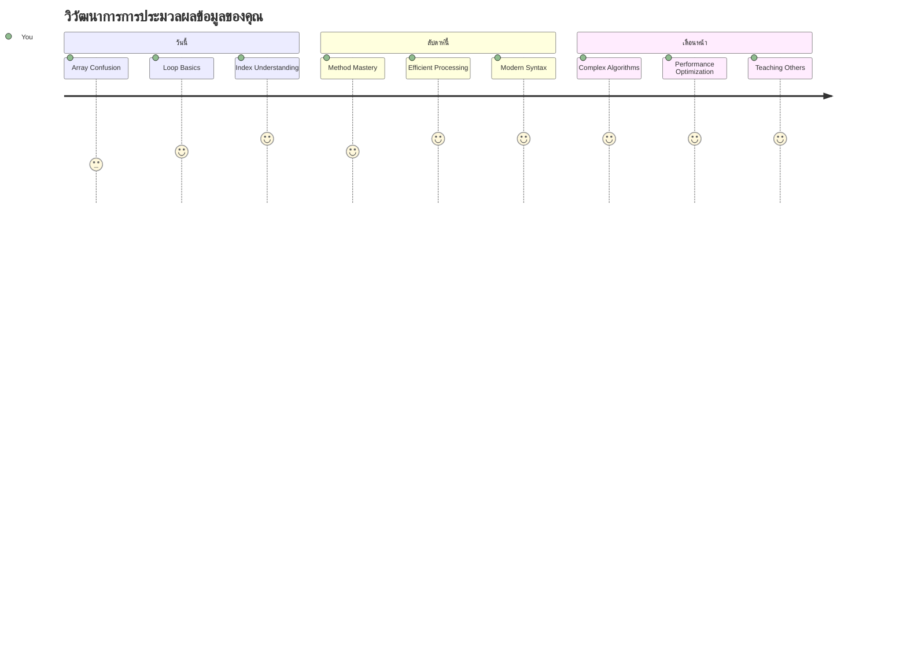
> 📦 **คุณได้ปลดล็อกพลังแห่งการจัดระเบียบและประมวลผลข้อมูลแล้ว!** อาร์เรย์และลูปคือพื้นฐานของแอปพลิเคชันแทบทุกตัวที่คุณจะสร้าง ตั้งแต่รายการง่าย ๆ ไปจนถึงการวิเคราะห์ข้อมูลที่ซับซ้อน ตอนนี้คุณมีเครื่องมือที่จะจัดการข้อมูลอย่างมีประสิทธิภาพและสวยงาม เว็บไซต์ไดนามิก แอปมือถือ และแอปที่ขับเคลื่อนด้วยข้อมูลทุกตัวพึ่งพาแนวคิดพื้นฐานเหล่านี้ ยินดีต้อนรับสู่โลกของการประมวลผลข้อมูลที่ขยายตัวได้! 🎉

---

<!-- CO-OP TRANSLATOR DISCLAIMER START -->
**ข้อจำกัดความรับผิด**:  
เอกสารนี้ได้รับการแปลโดยใช้บริการแปลภาษาอัตโนมัติ [Co-op Translator](https://github.com/Azure/co-op-translator) แม้เราจะพยายามให้การแปลมีความถูกต้อง โปรดทราบว่าการแปลโดยอัตโนมัติอาจมีข้อผิดพลาดหรือความไม่ถูกต้อง เอกสารต้นฉบับในภาษาต้นทางถือเป็นแหล่งข้อมูลที่เชื่อถือได้ สำหรับข้อมูลที่สำคัญ ขอแนะนำให้ใช้บริการแปลโดยมืออาชีพซึ่งเป็นมนุษย์ เราไม่รับผิดชอบต่อความเข้าใจผิดหรือการตีความที่ผิดพลาดที่เกิดจากการใช้การแปลนี้
<!-- CO-OP TRANSLATOR DISCLAIMER END -->