<!--
CO_OP_TRANSLATOR_METADATA:
{
  "original_hash": "1710a50a519a6e4a1b40a5638783018d",
  "translation_date": "2026-01-06T21:42:17+00:00",
  "source_file": "2-js-basics/4-arrays-loops/README.md",
  "language_code": "th"
}
-->
# JavaScript Basics: Arrays and Loops


> Sketchnote โดย [Tomomi Imura](https://twitter.com/girlie_mac)

```mermaid
journey
    title การผจญภัยของอาร์เรย์และลูปของคุณ
    section พื้นฐานอาร์เรย์
      การสร้างอาร์เรย์: 5: You
      การเข้าถึงสมาชิก: 4: You
      เมธอดอาร์เรย์: 5: You
    section ความเชี่ยวชาญลูป
      ลูป for: 4: You
      ลูป while: 5: You
      ไวยากรณ์สมัยใหม่: 4: You
    section การประมวลผลข้อมูล
      อาร์เรย์ + ลูป: 5: You
      การประยุกต์ใช้ในโลกจริง: 4: You
      การเพิ่มประสิทธิภาพ: 5: You
```
## การทดสอบก่อนเรียน
[แบบทดสอบก่อนเรียน](https://ff-quizzes.netlify.app/web/quiz/13)

เคยสงสัยไหมว่าเว็บไซต์เก็บข้อมูลของสินค้าที่อยู่ในตะกร้าช็อปปิ้งหรือแสดงรายการเพื่อนของคุณได้อย่างไร? นั่นคือที่มาของอาร์เรย์และลูป อาร์เรย์เหมือนภาชนะดิจิทัลที่เก็บข้อมูลหลายชิ้นไว้ด้วยกัน ในขณะที่ลูปช่วยให้คุณทำงานกับข้อมูลทั้งหมดอย่างมีประสิทธิภาพโดยไม่ต้องเขียนโค้ดซ้ำๆ

สองแนวคิดนี้รวมกันเป็นรากฐานสำหรับจัดการข้อมูลในโปรแกรมของคุณ คุณจะเรียนรู้การเปลี่ยนจากเขียนทีละขั้นตอนด้วยมือมาเป็นการสร้างโค้ดอัจฉริยะและมีประสิทธิภาพที่สามารถประมวลผลรายการหลายร้อยหรือหลายพันรายการได้อย่างรวดเร็ว

เมื่อจบบทเรียนนี้ คุณจะเข้าใจวิธีทำงานกับข้อมูลที่ซับซ้อนโดยใช้โค้ดเพียงไม่กี่บรรทัด มาเรียนรู้แนวคิดสำคัญของการเขียนโปรแกรมนี้ไปด้วยกัน

[](https://youtube.com/watch?v=1U4qTyq02Xw "Arrays")

[](https://www.youtube.com/watch?v=Eeh7pxtTZ3k "Loops")

> 🎥 คลิกที่ภาพด้านบนเพื่อชมวิดีโอเกี่ยวกับอาร์เรย์และลูป

> คุณสามารถเรียนบทนี้บน [Microsoft Learn](https://docs.microsoft.com/learn/modules/web-development-101-arrays/?WT.mc_id=academic-77807-sagibbon)!

```mermaid
mindmap
  root((การประมวลผลข้อมูล))
    Arrays
      Structure
        ไวยากรณ์วงเล็บสี่เหลี่ยม
        การนับเริ่มที่ศูนย์
        ขนาดปรับเปลี่ยนได้
      Operations
        push/pop
        shift/unshift
        indexOf/includes
      Types
        อาร์เรย์ของตัวเลข
        อาร์เรย์ของสตริง
        ประเภทผสม
    Loops
      For Loops
        นับการวนซ้ำ
        การประมวลผลอาร์เรย์
        การไหลที่คาดเดาได้
      While Loops
        ตามเงื่อนไข
        จำนวนรอบไม่ทราบ
        การป้อนข้อมูลจากผู้ใช้
      Modern Syntax
        for...of
        forEach
        Functional methods
    Applications
      Data Analysis
        สถิติ
        การกรอง
        การแปลงข้อมูล
      User Interfaces
        รายการ
        เมนู
        แกลเลอรี่
```
## อาร์เรย์

คิดว่าอาร์เรย์เหมือนกับตู้เก็บเอกสารดิจิทัล — แทนที่จะเก็บเอกสารเพียงชิ้นเดียวในลิ้นชักแต่ละลิ้นชัก คุณสามารถจัดหมวดหมู่รายการที่เกี่ยวข้องกันหลายรายการในภาชนะที่มีโครงสร้างเดียว ในทางโปรแกรมมิ่ง อาร์เรย์ช่วยให้คุณเก็บข้อมูลหลายชิ้นในแพ็กเกจเดียวที่จัดระเบียบไว้แล้ว

ไม่ว่าจะเป็นการสร้างแกลเลอรี่ภาพ จัดการกับรายการสิ่งที่ต้องทำ หรือเก็บคะแนนสูงสุดในเกม อาร์เรย์เป็นพื้นฐานสำหรับการจัดระเบียบข้อมูล มาดูกันว่ามันทำงานอย่างไร

✅ อาร์เรย์อยู่รอบตัวเรา! คุณนึกตัวอย่างในชีวิตจริงของอาร์เรย์ได้ไหม เช่น แผงโซลาร์เซลล์?

### การสร้างอาร์เรย์

การสร้างอาร์เรย์ง่ายมาก — ใช้วงเล็บเหลี่ยม!

```javascript
// อาร์เรย์ว่างเปล่า - เหมือนรถเข็นช้อปปิ้งว่างเปล่าที่รอใส่สินค้า
const myArray = [];
```

**เกิดอะไรขึ้นที่นี่?**
คุณเพิ่งสร้างภาชนะว่างเปล่าด้วยวงเล็บเหลี่ยม `[]` คิดว่ามันเหมือนชั้นหนังสือเปล่าที่พร้อมจะเก็บหนังสือในแบบที่คุณต้องการจัดระเบียบไว้ที่นั่น

คุณยังสามารถเติมค่าเริ่มต้นในอาร์เรย์ของคุณตั้งแต่ต้นได้ด้วย:

```javascript
// เมนูรสชาติของร้านไอศกรีมของคุณ
const iceCreamFlavors = ["Chocolate", "Strawberry", "Vanilla", "Pistachio", "Rocky Road"];

// ข้อมูลโปรไฟล์ของผู้ใช้ (ผสมผสานข้อมูลประเภทต่าง ๆ)
const userData = ["John", 25, true, "developer"];

// คะแนนทดสอบสำหรับคลาสที่คุณชื่นชอบ
const scores = [95, 87, 92, 78, 85];
```

**สิ่งเจ๋งที่ควรสังเกต:**
- คุณสามารถเก็บข้อความ ตัวเลข หรือค่าจริง/เท็จในอาร์เรย์เดียวกัน
- เพียงแค่คั่นแต่ละรายการด้วยเครื่องหมายจุลภาค - ง่ายมาก!
- อาร์เรย์เหมาะสำหรับเก็บข้อมูลที่เกี่ยวข้องกันไว้ด้วยกัน

```mermaid
flowchart LR
    A["📦 อาร์เรย์"] --> B["สร้าง [ ]"]
    A --> C["เก็บข้อมูลหลายรายการ"]
    A --> D["เข้าถึงตามดัชนี"]
    
    B --> B1["const arr = []"]
    B --> B2["const arr = [1,2,3]"]
    
    C --> C1["ตัวเลข"]
    C --> C2["สตริง"]
    C --> C3["บูลีน"]
    C --> C4["ชนิดผสม"]
    
    D --> D1["arr[0] = อันแรก"]
    D --> D2["arr[1] = อันที่สอง"]
    D --> D3["arr[2] = อันที่สาม"]
    
    E["📊 ดัชนีอาร์เรย์"] --> E1["ดัชนี 0: แรก"]
    E --> E2["ดัชนี 1: ที่สอง"]
    E --> E3["ดัชนี 2: ที่สาม"]
    E --> E4["ดัชนี n-1: สุดท้าย"]
    
    style A fill:#e3f2fd
    style B fill:#e8f5e8
    style C fill:#fff3e0
    style D fill:#f3e5f5
    style E fill:#e0f2f1
```
### ดัชนีของอาร์เรย์

สิ่งหนึ่งที่อาจดูแปลกในตอนแรก: อาร์เรย์จะเริ่มนับรายการจาก 0 ไม่ใช่ 1 การเข้ารหัสแบบมีดัชนีเริ่มต้นที่ศูนย์นี้มีรากฐานมาจากวิธีทำงานของหน่วยความจำคอมพิวเตอร์ — เป็นข้อปฏิบัติในโปรแกรมมิ่งตั้งแต่ช่วงแรกของภาษาคอมพิวเตอร์อย่าง C แต่ละตำแหน่งในอาร์เรย์จะมีหมายเลขที่เรียกว่า **ดัชนี**

| ดัชนี | ค่า | คำอธิบาย |
|-------|-------|-------------|
| 0 | "ช็อกโกแลต" | องค์ประกอบตัวแรก |
| 1 | "สตรอเบอร์รี่" | องค์ประกอบตัวที่สอง |
| 2 | "วานิลลา" | องค์ประกอบตัวที่สาม |
| 3 | "พิสตาชิโอ" | องค์ประกอบตัวที่สี่ |
| 4 | "ร็อกกี้โร้ด" | องค์ประกอบตัวที่ห้า |

✅ คุณรู้สึกประหลาดใจไหมที่อาร์เรย์เริ่มนับจากดัชนีศูนย์? ในบางภาษาการเขียนโปรแกรม ดัชนีเริ่มต้นที่ 1 มีประวัติที่น่าสนใจเกี่ยวกับเรื่องนี้ คุณสามารถ [อ่านเพิ่มเติมได้ที่ Wikipedia](https://en.wikipedia.org/wiki/Zero-based_numbering)

**การเข้าถึงองค์ประกอบในอาร์เรย์:**

```javascript
const iceCreamFlavors = ["Chocolate", "Strawberry", "Vanilla", "Pistachio", "Rocky Road"];

// เข้าถึงองค์ประกอบแต่ละตัวโดยใช้สัญลักษณ์วงเล็บ
console.log(iceCreamFlavors[0]); // "ช็อกโกแลต" - องค์ประกอบตัวแรก
console.log(iceCreamFlavors[2]); // "วานิลลา" - องค์ประกอบตัวที่สาม
console.log(iceCreamFlavors[4]); // "ร็อกกี้ โร้ด" - องค์ประกอบตัวสุดท้าย
```

**แตกย่อยสิ่งที่เกิดขึ้นที่นี่:**
- **ใช้** การเข้าถึงด้วยวงเล็บเหลี่ยมพร้อมหมายเลขดัชนี
- **ส่งคืน** ค่าที่จัดเก็บในตำแหน่งนั้นในอาร์เรย์
- **เริ่มนับ** จาก 0 โดยองค์ประกอบตัวแรกมีดัชนีเป็น 0

**การแก้ไของค์ประกอบในอาร์เรย์:**

```javascript
// เปลี่ยนค่าเดิม
iceCreamFlavors[4] = "Butter Pecan";
console.log(iceCreamFlavors[4]); // "บัตเตอร์พีแคน"

// เพิ่มองค์ประกอบใหม่ที่ส่วนท้าย
iceCreamFlavors[5] = "Cookie Dough";
console.log(iceCreamFlavors[5]); // "คุกกี้โดว์"
```

**ในตัวอย่างข้างต้นเราได้:**
- **แก้ไข** องค์ประกอบที่ดัชนี 4 จาก "ร็อกกี้โร้ด" เป็น "บัตเตอร์พีแคน"
- **เพิ่ม** องค์ประกอบใหม่ "คุกกี้โดว์" ที่ดัชนีที่ 5
- **ขยาย** ความยาวอาร์เรย์โดยอัตโนมัติเมื่อต้องเพิ่มเกินขอบเขตปัจจุบัน

### ความยาวอาร์เรย์และเมธอดทั่วไป

อาร์เรย์มาพร้อมกับคุณสมบัติและเมธอดในตัวที่ช่วยให้การทำงานกับข้อมูลง่ายขึ้นมาก

**การหาความยาวของอาร์เรย์:**

```javascript
const iceCreamFlavors = ["Chocolate", "Strawberry", "Vanilla", "Pistachio", "Rocky Road"];
console.log(iceCreamFlavors.length); // 5

// ความยาวจะอัปเดตโดยอัตโนมัติเมื่ออาเรย์เปลี่ยนแปลง
iceCreamFlavors.push("Mint Chip");
console.log(iceCreamFlavors.length); // 6
```

**จุดสำคัญที่จดจำได้:**
- **ส่งคืน** จำนวนองค์ประกอบทั้งหมดในอาร์เรย์
- **อัปเดต** อัตโนมัติเมื่อต้องเพิ่มหรือลบองค์ประกอบ
- **ให้** ตัวนับแบบไดนามิกที่มีประโยชน์สำหรับลูปและการตรวจสอบ

**เมธอดพื้นฐานของอาร์เรย์:**

```javascript
const fruits = ["apple", "banana", "orange"];

// เพิ่มองค์ประกอบ
fruits.push("grape");           // เพิ่มที่ท้าย: ["apple", "banana", "orange", "grape"]
fruits.unshift("strawberry");   // เพิ่มที่ต้น: ["strawberry", "apple", "banana", "orange", "grape"]

// ลบองค์ประกอบ
const lastFruit = fruits.pop();        // ลบและคืนค่า "grape"
const firstFruit = fruits.shift();     // ลบและคืนค่า "strawberry"

// ค้นหาองค์ประกอบ
const index = fruits.indexOf("banana"); // คืนค่า 1 (ตำแหน่งของ "banana")
const hasApple = fruits.includes("apple"); // คืนค่า true
```

**เข้าใจเมธอดเหล่านี้:**
- **เพิ่ม** องค์ประกอบด้วย `push()` (ท้าย) และ `unshift()` (ต้น)
- **ลบ** องค์ประกอบด้วย `pop()` (ท้าย) และ `shift()` (ต้น)
- **ค้นหา** องค์ประกอบด้วย `indexOf()` และตรวจสอบการมีอยู่ด้วย `includes()`
- **ส่งคืน** ค่าที่มีประโยชน์ เช่น องค์ประกอบที่ถูกลบหรือดัชนีตำแหน่ง

✅ ลองทำดูเอง! ใช้คอนโซลของเบราว์เซอร์สร้างและจัดการอาร์เรย์ที่คุณสร้างขึ้นเอง

### 🧠 **ตรวจสอบพื้นฐานอาร์เรย์: การจัดระเบียบข้อมูลของคุณ**

**ทดสอบความเข้าใจอาร์เรย์:**
- ทำไมคุณคิดว่าอาร์เรย์เริ่มนับที่ 0 แทนที่จะเป็น 1?
- จะเกิดอะไรขึ้นถ้าคุณพยายามเข้าถึงดัชนีที่ไม่มี (เช่น `arr[100]` ในอาร์เรย์ 5 องค์ประกอบ)?
- คุณนึกสถานการณ์จริงที่เหมาะกับการใช้ อาร์เรย์ ได้สามสถานการณ์ไหม?

```mermaid
stateDiagram-v2
    [*] --> EmptyArray: const arr = []
    EmptyArray --> WithItems: เพิ่มองค์ประกอบ
    WithItems --> Accessing: ใช้ดัชนี
    Accessing --> Modifying: แก้ไขค่า
    Modifying --> Processing: ใช้เมธอด
    
    WithItems --> WithItems: push(), unshift()
    Processing --> Processing: pop(), shift()
    
    note right of Accessing
        การนับดัชนีเริ่มที่ศูนย์
        arr[0] = องค์ประกอบแรก
    end note
    
    note right of Processing
        เมธอดในตัว
        การดำเนินการแบบไดนามิก
    end note
```
> **ข้อมูลในโลกความเป็นจริง**: อาร์เรย์อยู่ทุกที่ในการเขียนโปรแกรม! ฟีดโซเชียลมีเดีย ตะกร้าช็อปปิ้ง แกลเลอรี่ภาพ เพลงในเพลย์ลิสต์ — ทั้งหมดนี้คืออาร์เรย์ที่ดำเนินงานอยู่เบื้องหลัง!

## ลูป

คิดถึงบทลงโทษในนิยายของชาลส์ ดิคเก้นส์ ที่นักเรียนต้องเขียนประโยคซ้ำๆ บนกระดานดำ ลองจินตนาการว่าคุณสามารถสั่งใครสักคนว่า "เขียนประโยคนี้ 100 ครั้ง" แล้วมันก็ทำได้โดยอัตโนมัติ นั่นคือสิ่งที่ลูปทำกับโค้ดของคุณ

ลูปเหมือนผู้ช่วยที่ไม่เหน็ดเหนื่อย สามารถทำงานซ้ำๆ ได้โดยไม่ผิดพลาด ไม่ว่าคุณจะต้องตรวจสอบสินค้าทุกชิ้นในตะกร้าหรือแสดงภาพทั้งหมดในอัลบั้ม ลูปจัดการงานซ้ำๆ เหล่านี้ได้อย่างมีประสิทธิภาพ

JavaScript มีลูปหลายประเภทให้เลือก เรามาดูแต่ละแบบและเข้าใจว่าจะใช้เมื่อไร

```mermaid
flowchart TD
    A["🔄 ประเภทของลูป"] --> B["ลูป For"]
    A --> C["ลูป While"]
    A --> D["ลูป For...of"]
    A --> E["เมธอด forEach"]
    
    B --> B1["จำนวนรอบที่รู้ล่วงหน้า"]
    B --> B2["อิงตัวนับ"]
    B --> B3["for(init; condition; increment)"]
    
    C --> C1["จำนวนรอบที่ไม่รู้ล่วงหน้า"]
    C --> C2["อิงเงื่อนไข"]
    C --> C3["while(condition)"]
    
    D --> D1["สมัยใหม่ ES6+"]
    D --> D2["วนซ้ำอาร์เรย์"]
    D --> D3["for(item of array)"]
    
    E --> E1["สไตล์ฟังก์ชัน"]
    E --> E2["เมธอดของอาร์เรย์"]
    E --> E3["array.forEach(callback)"]
    
    F["⏰ เมื่อไหร่ควรใช้"] --> F1["For: นับ, ดัชนี"]
    F --> F2["While: รับข้อมูลผู้ใช้, ค้นหา"]
    F --> F3["For...of: วนซ้ำง่าย"]
    F --> F4["forEach: การเขียนโปรแกรมเชิงฟังก์ชัน"]
    
    style A fill:#e3f2fd
    style B fill:#e8f5e8
    style C fill:#fff3e0
    style D fill:#f3e5f5
    style E fill:#e0f2f1
    style F fill:#fce4ec
```
### ลูป for

ลูป `for` เหมือนตั้งเวลานับถอยหลัง — คุณรู้ว่าต้องการให้เกิดขึ้นกี่ครั้ง จึงมีความเป็นระเบียบและคาดการณ์ได้ดี เหมาะมากเมื่อคุณทำงานกับอาร์เรย์หรือต้องนับจำนวน

**โครงสร้างลูป for:**

| ส่วนประกอบ | จุดประสงค์ | ตัวอย่าง |
|-----------|---------|----------|
| **การเริ่มต้น** | กำหนดจุดเริ่มต้น | `let i = 0` |
| **เงื่อนไข** | เมื่อใดถึงจะทำต่อ | `i < 10` |
| **การเพิ่มค่า** | วิธีอัปเดต | `i++` |

```javascript
// นับจาก 0 ถึง 9
for (let i = 0; i < 10; i++) {
  console.log(`Count: ${i}`);
}

// ตัวอย่างที่ใช้งานได้จริงมากขึ้น: การประมวลผลคะแนน
const testScores = [85, 92, 78, 96, 88];
for (let i = 0; i < testScores.length; i++) {
  console.log(`Student ${i + 1}: ${testScores[i]}%`);
}
```

**ทีละขั้นตอน สิ่งที่เกิดขึ้นคือ:**
- **กำหนดค่าเริ่มต้น** ตัวแปรนับ `i` เท่ากับ 0 ตอนเริ่มต้น
- **ตรวจสอบ** เงื่อนไข `i < 10` ก่อนแต่ละรอบลูป
- **เรียกใช้** บล็อกโค้ดเมื่อเงื่อนไขเป็นจริง
- **เพิ่มค่า** `i` ทีละ 1 หลังจากแต่ละรอบด้วย `i++`
- **หยุด** เมื่อเงื่อนไขเป็นเท็จ (เมื่อ `i` ถึง 10)

✅ รันโค้ดนี้ในคอนโซลเบราว์เซอร์ดูสิ จะเกิดอะไรขึ้นถ้าคุณเปลี่ยนค่าตัวนับ เงื่อนไข หรือการเพิ่มค่าเล็กน้อย? คุณทำให้มันนับถอยหลังได้ไหม?

### 🗓️ **ตรวจสอบความชำนาญลูป for: การทำซ้ำที่ควบคุมได้**

**ประเมินความเข้าใจลูป for:**
- ลูป for มีสามส่วน คืออะไร และแต่ละส่วนทำหน้าที่อะไร?
- คุณจะเขียนลูปสำหรับผ่านอาร์เรย์ย้อนหลังอย่างไร?
- จะเกิดอะไรขึ้นถ้าคุณลืมเขียนส่วนเพิ่มค่า (`i++`)?

```mermaid
flowchart TD
    A["🚀 เริ่มต้น For Loop"] --> B["กำหนดค่าเริ่มต้น: let i = 0"]
    B --> C{"เงื่อนไข: i < array.length?"}
    C -->|true| D["ดำเนินการในบล็อกโค้ด"]
    D --> E["เพิ่มค่า: i++"]
    E --> C
    C -->|false| F["✅ ออกจากลูป"]
    
    G["📋 รูปแบบทั่วไป"] --> G1["for(let i=0; i<n; i++)"]
    G --> G2["for(let i=n-1; i>=0; i--)"]
    G --> G3["for(let i=0; i<arr.length; i+=2)"]
    
    style A fill:#e3f2fd
    style F fill:#e8f5e8
    style G fill:#fff3e0
```
> **ภูมิปัญญาของลูป**: ลูป for เหมาะที่สุดเมื่อคุณรู้จำนวนรอบที่ต้องการซ้ำ มันเป็นตัวเลือกที่ใช้บ่อยที่สุดสำหรับการประมวลผลอาร์เรย์!

### ลูป while

ลูป `while` เหมือนการบอกว่า "ทำสิ่งนี้ต่อไปจนกว่า…" — คุณอาจไม่รู้จำนวนครั้งที่แน่นอน แต่มักรู้ว่าเมื่อใดควรหยุด เหมาะสำหรับการขอรับข้อมูลจากผู้ใช้จนกว่าจะได้รับข้อมูลครบถ้วน หรือค้นหาข้อมูลจนกว่าจะเจอเป้าหมาย

**ลักษณะลูป while:**
- **ดำเนินการ** ต่อเนื่องตราบใดที่เงื่อนไขเป็นจริง
- **ต้อง** จัดการตัวแปรนับด้วยตนเอง
- **ตรวจสอบ** เงื่อนไขก่อนทำทุกครั้ง
- **เสี่ยง** ที่จะเกิดลูปไม่รู้จบถ้าเงื่อนไขไม่เคยเป็นเท็จ

```javascript
// ตัวอย่างการนับพื้นฐาน
let i = 0;
while (i < 10) {
  console.log(`While count: ${i}`);
  i++; // อย่าลืมเพิ่มค่า!
}

// ตัวอย่างที่ใช้งานได้จริงมากขึ้น: การประมวลผลข้อมูลนำเข้าของผู้ใช้
let userInput = "";
let attempts = 0;
const maxAttempts = 3;

while (userInput !== "quit" && attempts < maxAttempts) {
  userInput = prompt(`Enter 'quit' to exit (attempt ${attempts + 1}):`);
  attempts++;
}

if (attempts >= maxAttempts) {
  console.log("Maximum attempts reached!");
}
```

**ทำความเข้าใจกับตัวอย่าง:**
- **จัดการ** ตัวแปรนับ `i` ด้วยตนเองภายในบอดี้ลูป
- **เพิ่มค่า** ตัวนับเพื่อป้องกันลูปไม่รู้จบ
- **แสดง** กรณีใช้งานจริงกับการรับข้อมูลจากผู้ใช้และจำกัดจำนวนครั้ง
- **มี** กลไกความปลอดภัยป้องกันการทำงานไม่จบสิ้น

### ♾️ **ทดสอบความรู้ลูป while: การทำซ้ำตามเงื่อนไข**

**ทดสอบความเข้าใจลูป while:**
- อันตรายหลักของการใช้ลูป while คืออะไร?
- เมื่อไหร่คุณจะเลือกใช้ลูป while แทนลูป for?
- คุณป้องกันการเกิดลูปไม่รู้จบอย่างไร?

```mermaid
flowchart LR
    A["🔄 While กับ For"] --> B["ลูป While"]
    A --> C["ลูป For"]
    
    B --> B1["จำนวนครั้งไม่ทราบแน่ชัด"]
    B --> B2["ขับเคลื่อนด้วยเงื่อนไข"]
    B --> B3["รับข้อมูลจากผู้ใช้, การค้นหา"]
    B --> B4["⚠️ ความเสี่ยง: ลูปไม่รู้จบ"]
    
    C --> C1["จำนวนครั้งที่ทราบแน่ชัด"]
    C --> C2["ขับเคลื่อนด้วยตัวนับ"]
    C --> C3["การประมวลผลอาร์เรย์"]
    C --> C4["✅ ปลอดภัย: สิ้นสุดที่คาดการณ์ได้"]
    
    D["🛡️ เคล็ดลับความปลอดภัย"] --> D1["แก้ไขตัวแปรเงื่อนไขเสมอ"]
    D --> D2["รวมเงื่อนไขหนี"]
    D --> D3["กำหนดขีดจำกัดจำนวนครั้งสูงสุด"]
    
    style A fill:#e3f2fd
    style B fill:#fff3e0
    style C fill:#e8f5e8
    style D fill:#ffebee
```
> **ความปลอดภัยก่อน**: ลูป while มีพลังแต่ต้องจัดการเงื่อนไขอย่างระมัดระวัง ให้แน่ใจว่าในที่สุดเงื่อนไขจะกลายเป็นเท็จ!

### ทางเลือกลูปสมัยใหม่

JavaScript มีไวยากรณ์ลูปสมัยใหม่ที่ทำให้โค้ดของคุณอ่านง่ายขึ้นและลดความผิดพลาด

**for...of Loop (ES6+):**

```javascript
const colors = ["red", "green", "blue", "yellow"];

// วิธีสมัยใหม่ - สะอาดและปลอดภัยมากขึ้น
for (const color of colors) {
  console.log(`Color: ${color}`);
}

// เปรียบเทียบกับลูป for แบบดั้งเดิม
for (let i = 0; i < colors.length; i++) {
  console.log(`Color: ${colors[i]}`);
}
```

**ข้อดีหลักของ for...of:**
- **ขจัด** การจัดการดัชนีและข้อผิดพลาดดัชนีเกิน/ต่ำ
- **ให้** การเข้าถึงองค์ประกอบในอาร์เรย์ตรง ๆ
- **ปรับปรุง** ความอ่านง่ายและลดความซับซ้อนของไวยากรณ์

**เมธอด forEach:**

```javascript
const prices = [9.99, 15.50, 22.75, 8.25];

// ใช้ forEach สำหรับสไตล์การเขียนโปรแกรมเชิงฟังก์ชัน
prices.forEach((price, index) => {
  console.log(`Item ${index + 1}: $${price.toFixed(2)}`);
});

// forEach กับฟังก์ชันลูกศรสำหรับงานที่ง่ายขึ้น
prices.forEach(price => console.log(`Price: $${price}`));
```

**สิ่งที่ควรรู้เกี่ยวกับ forEach:**
- **รัน** ฟังก์ชันสำหรับองค์ประกอบแต่ละตัวในอาร์เรย์
- **ให้** ทั้งค่าองค์ประกอบและดัชนีเป็นพารามิเตอร์
- **ไม่สามารถ** หยุดกลางคัน (ต่างจากลูปแบบดั้งเดิม)
- **คืนค่า** undefined (ไม่สร้างอาร์เรย์ใหม่)

✅ ทำไมคุณถึงเลือกใช้ลูป for แทนลูป while? มีผู้ชม 17,000 คนตั้งคำถามนี้บน StackOverflow และบางความคิดเห็น [อาจน่าสนใจสำหรับคุณ](https://stackoverflow.com/questions/39969145/while-loops-vs-for-loops-in-javascript)

### 🎨 **ตรวจสอบไวยากรณ์ลูปสมัยใหม่: ยอมรับ ES6+**

**ประเมินความเข้าใจ JavaScript สมัยใหม่ของคุณ:**
- ข้อดีของ `for...of` เมื่อเทียบกับลูป for แบบดั้งเดิมคืออะไร?
- เมื่อใดที่คุณยังเลือกใช้ลูป for แบบดั้งเดิม?
- ความแตกต่างระหว่าง `forEach` กับ `map` คืออะไร?

```mermaid
quadrantChart
    title คู่มือการเลือกลูป
    x-axis แบบดั้งเดิม --> สมัยใหม่
    y-axis ง่าย --> ซับซ้อน
    quadrant-1 สมัยใหม่ ซับซ้อน
    quadrant-2 แบบดั้งเดิม ซับซ้อน
    quadrant-3 แบบดั้งเดิม ง่าย
    quadrant-4 สมัยใหม่ ง่าย
    
    Traditional For: [0.2, 0.7]
    While Loop: [0.3, 0.6]
    For...of: [0.8, 0.3]
    forEach: [0.9, 0.4]
    Array Methods: [0.8, 0.8]
```
> **เทรนด์สมัยใหม่**: ไวยากรณ์ ES6+ เช่น `for...of` และ `forEach` กำลังเป็นที่นิยมสำหรับการวนอาร์เรย์เพราะสะอาดตาและลดข้อผิดพลาด!

## ลูปและอาร์เรย์

การรวมกันของอาร์เรย์และลูปสร้างความสามารถในการประมวลผลข้อมูลที่ทรงพลัง คู่ผสมนี้เป็นพื้นฐานสำหรับงานหลักหลายประเภทในโปรแกรม เช่น การแสดงรายการหรือการคำนวณสถิติ

**การประมวลผลอาร์เรย์แบบดั้งเดิม:**

```javascript
const iceCreamFlavors = ["Chocolate", "Strawberry", "Vanilla", "Pistachio", "Rocky Road"];

// วิธีการใช้ลูป for แบบคลาสสิก
for (let i = 0; i < iceCreamFlavors.length; i++) {
  console.log(`Flavor ${i + 1}: ${iceCreamFlavors[i]}`);
}

// วิธีการใช้ for...of แบบสมัยใหม่
for (const flavor of iceCreamFlavors) {
  console.log(`Available flavor: ${flavor}`);
}
```

**เข้าใจวิธีนี้:**
- **ใช้** คุณสมบัติความยาวของอาร์เรย์เพื่อกำหนดขอบเขตลูป
- **เข้าถึง** องค์ประกอบด้วยดัชนีในลูป for แบบดั้งเดิม
- **ให้** การเข้าถึงองค์ประกอบโดยตรงในลูป for...of
- **ประมวลผล** ทุกองค์ประกอบในอาร์เรย์ทีละตัว

**ตัวอย่างการประมวลผลข้อมูลจริง:**

```javascript
const studentGrades = [85, 92, 78, 96, 88, 73, 89];
let total = 0;
let highestGrade = studentGrades[0];
let lowestGrade = studentGrades[0];

// ประมวลผลเกรดทั้งหมดด้วยลูปเดียว
for (let i = 0; i < studentGrades.length; i++) {
  const grade = studentGrades[i];
  total += grade;
  
  if (grade > highestGrade) {
    highestGrade = grade;
  }
  
  if (grade < lowestGrade) {
    lowestGrade = grade;
  }
}

const average = total / studentGrades.length;
console.log(`Average: ${average.toFixed(1)}`);
console.log(`Highest: ${highestGrade}`);
console.log(`Lowest: ${lowestGrade}`);
```

**โค้ดนี้ทำงานอย่างไร:**
- **กำหนด** ตัวแปรติดตามผลรวมและค่าสูงสุดต่ำสุด
- **ประมวลผล** คะแนนแต่ละตัวด้วยลูปลูปเดียวที่มีประสิทธิภาพ
- **สะสม** ผลรวมเพื่อคำนวณค่าเฉลี่ย
- **ติดตาม** ค่าสูงสุดและต่ำสุดในระหว่างการวนซ้ำ
- **คำนวณ** สถิติสุดท้ายหลังจากจบลูป

✅ ทดลองใช้ลูปกับอาร์เรย์ที่คุณสร้างเองในคอนโซลบราวเซอร์ของคุณ

```mermaid
flowchart TD
    A["📦 ข้อมูลอาร์เรย์"] --> B["🔄 การประมวลผลลูป"]
    B --> C["📈 ผลลัพธ์"]
    
    A1["[85, 92, 78, 96, 88]"] --> A
    
    B --> B1["คำนวณผลรวม"]
    B --> B2["ค้นหาค่าน้อยสุด/มากสุด"]
    B --> B3["นับเงื่อนไข"]
    B --> B4["แปลงข้อมูล"]
    
    C --> C1["ค่าเฉลี่ย: 87.8"]
    C --> C2["สูงสุด: 96"]
    C --> C3["ผ่าน: 5/5"]
    C --> C4["เกรดตัวอักษร"]
    
    D["⚡ รูปแบบการประมวลผล"] --> D1["การสะสม (ผลรวม)"]
    D --> D2["การเปรียบเทียบ (ค่าน้อยสุด/มากสุด)"]
    D --> D3["การกรอง (เงื่อนไข)"]
    D --> D4["การแมป (การแปลง)"]
    
    style A fill:#e3f2fd
    style B fill:#fff3e0
    style C fill:#e8f5e8
    style D fill:#f3e5f5
```
---

## ความท้าทาย GitHub Copilot Agent 🚀

ใช้โหมด Agent เพื่อทำความท้าทายดังนี้:

**คำอธิบาย:** สร้างฟังก์ชันประมวลผลข้อมูลครบถ้วนที่รวมอาร์เรย์และลูป เพื่อวิเคราะห์ชุดข้อมูลและสร้างข้อมูลเชิงลึกที่มีความหมาย

**คำสั่ง:** สร้างฟังก์ชันชื่อ `analyzeGrades` ที่รับอาร์เรย์ของอ็อบเจกต์เกรดนักเรียน (ซึ่งแต่ละอ็อบเจกต์ประกอบด้วยชื่อและคะแนน) และส่งคืนอ็อบเจกต์ที่มีสถิติรวมถึงคะแนนสูงสุด คะแนนต่ำสุด ค่าเฉลี่ย จำนวนผู้ผ่าน (คะแนน >= 70) และอาร์เรย์ของชื่อนักเรียนที่ได้คะแนนสูงกว่าค่าเฉลี่ย ใช้ลูปอย่างน้อยสองชนิดในโค้ดของคุณ

เรียนรู้เพิ่มเติมเกี่ยวกับ [โหมด agent](https://code.visualstudio.com/blogs/2025/02/24/introducing-copilot-agent-mode) ที่นี่

## 🚀 ความท้าทาย
JavaScript มีเมธอดอาร์เรย์สมัยใหม่หลายอย่างที่สามารถแทนที่ลูปแบบดั้งเดิมในงานเฉพาะได้ สำรวจ [forEach](https://developer.mozilla.org/docs/Web/JavaScript/Reference/Global_Objects/Array/forEach), [for-of](https://developer.mozilla.org/docs/Web/JavaScript/Reference/Statements/for...of), [map](https://developer.mozilla.org/docs/Web/JavaScript/Reference/Global_Objects/Array/map), [filter](https://developer.mozilla.org/docs/Web/JavaScript/Reference/Global_Objects/Array/filter), และ [reduce](https://developer.mozilla.org/docs/Web/JavaScript/Reference/Global_Objects/Array/reduce)

**ความท้าทายของคุณ:** ปรับปรุงตัวอย่างเกรดของนักเรียนโดยใช้เมธอดอาร์เรย์ที่แตกต่างกันอย่างน้อยสามตัว สังเกตว่ารหัสสะอาดและอ่านง่ายขึ้นมากด้วยไวยากรณ์ JavaScript สมัยใหม่

## แบบทดสอบหลังบรรยาย
[แบบทดสอบหลังบรรยาย](https://ff-quizzes.netlify.app/web/quiz/14)


## ทบทวน & การเรียนรู้ด้วยตนเอง

อาร์เรย์ใน JavaScript มีเมธอดมากมายที่แนบมาด้วย ซึ่งมีประโยชน์มากสำหรับการจัดการข้อมูล [อ่านเกี่ยวกับเมธอดเหล่านี้](https://developer.mozilla.org/docs/Web/JavaScript/Reference/Global_Objects/Array) และลองใช้บางส่วน (เช่น push, pop, slice และ splice) กับอาร์เรย์ที่คุณสร้างขึ้น

## การบ้าน

[การวนลูปอาร์เรย์](assignment.md)

---

## 📊 **สรุปเครื่องมืออาร์เรย์ & ลูป ของคุณ**

```mermaid
graph TD
    A["🎯 ความชำนาญอาเรย์ & ลูป"] --> B["📦 พื้นฐานอาเรย์"]
    A --> C["🔄 ประเภทลูป"]
    A --> D["🔗 การประมวลผลข้อมูล"]
    A --> E["🎨 เทคนิคสมัยใหม่"]
    
    B --> B1["การสร้าง: [ ]"]
    B --> B2["การจัดทำดัชนี: arr[0]"]
    B --> B3["เมธอด: push, pop"]
    B --> B4["คุณสมบัติ: length"]
    
    C --> C1["For: รอบที่ทราบ"]
    C --> C2["While: ตามเงื่อนไข"]
    C --> C3["For...of: เข้าถึงโดยตรง"]
    C --> C4["forEach: เชิงฟังก์ชัน"]
    
    D --> D1["การคำนวณสถิติ"]
    D --> D2["การแปลงข้อมูล"]
    D --> D3["การกรอง & การค้นหา"]
    D --> D4["การประมวลผลแบบเรียลไทม์"]
    
    E --> E1["ฟังก์ชันลูกศร"]
    E --> E2["การเชนเมธอด"]
    E --> E3["การแยกโครงสร้าง"]
    E --> E4["เทมเพลตลิเทอรัล"]
    
    F["💡 ประโยชน์สำคัญ"] --> F1["การจัดการข้อมูลที่มีประสิทธิภาพ"]
    F --> F2["ลดการเขียนโค้ดซ้ำ"]
    F --> F3["โซลูชันที่ปรับขนาดได้"]
    F --> F4["ไวยากรณ์ที่สะอาดขึ้น"]
    
    style A fill:#e3f2fd
    style B fill:#e8f5e8
    style C fill:#fff3e0
    style D fill:#f3e5f5
    style E fill:#e0f2f1
    style F fill:#fce4ec
```
---

## 🚀 เส้นเวลาความชำนาญในอาร์เรย์ & ลูป ของคุณ

### ⚡ **สิ่งที่คุณทำได้ใน 5 นาทีถัดไป**
- [ ] สร้างอาร์เรย์ของภาพยนตร์ที่คุณชื่นชอบและเข้าถึงองค์ประกอบเฉพาะ
- [ ] เขียนลูป for ที่นับจาก 1 ถึง 10
- [ ] ลองความท้าทายเมธอดอาร์เรย์สมัยใหม่จากบทเรียนนี้
- [ ] ฝึกดัชนีอาร์เรย์ในคอนโซลเบราว์เซอร์ของคุณ

### 🎯 **สิ่งที่คุณทำสำเร็จในชั่วโมงนี้**
- [ ] ทำแบบทดสอบหลังบทเรียนให้เสร็จและทบทวนแนวคิดที่ยาก
- [ ] สร้างโปรแกรมวิเคราะห์เกรดอย่างครบถ้วนจากความท้าทาย GitHub Copilot
- [ ] สร้างตะกร้าสินค้าแบบง่ายที่สามารถเพิ่มและลบรายการ
- [ ] ฝึกแปลงระหว่างประเภทลูปต่าง ๆ
- [ ] ทดลองใช้เมธอดอาร์เรย์เช่น `push`, `pop`, `slice` และ `splice`

### 📅 **เส้นทางการประมวลผลข้อมูลระยะเวลา 1 สัปดาห์ของคุณ**
- [ ] ทำการบ้าน "วนลูปอาร์เรย์" ให้เสร็จพร้อมเติมเต็มความคิดสร้างสรรค์
- [ ] สร้างแอปพลิเคชันรายการสิ่งที่ต้องทำโดยใช้ อาร์เรย์และลูป
- [ ] สร้างเครื่องคิดเลขสถิติพื้นฐานสำหรับข้อมูลตัวเลข
- [ ] ฝึกใช้ [เมธอดอาร์เรย์ MDN](https://developer.mozilla.org/docs/Web/JavaScript/Reference/Global_Objects/Array)
- [ ] สร้างแกลเลอรีรูปภาพหรืออินเทอร์เฟซเพลย์ลิสต์เพลง
- [ ] สำรวจการเขียนโปรแกรมเชิงฟังก์ชันด้วย `map`, `filter` และ `reduce`

### 🌟 **การเปลี่ยนแปลงตลอด 1 เดือนของคุณ**
- [ ] เชี่ยวชาญการทำงานกับอาร์เรย์ขั้นสูงและการปรับประสิทธิภาพ
- [ ] สร้างแดชบอร์ดภาพข้อมูลอย่างครบวงจร
- [ ] มีส่วนร่วมในโปรเจคโอเพนซอร์สเกี่ยวกับการประมวลผลข้อมูล
- [ ] สอนผู้อื่นเกี่ยวกับอาร์เรย์และลูปด้วยตัวอย่างใช้งานจริง
- [ ] สร้างห้องสมุดส่วนตัวของฟังก์ชันการประมวลผลข้อมูลที่นำกลับมาใช้ใหม่ได้
- [ ] สำรวจอัลกอริทึมและโครงสร้างข้อมูลที่สร้างบนอาร์เรย์

### 🏆 **การตรวจสอบความเป็นแชมป์การประมวลผลข้อมูลขั้นสุดท้าย**

**เฉลิมฉลองความชำนาญอาร์เรย์และลูปของคุณ:**
- การดำเนินการอาร์เรย์ใดที่มีประโยชน์ที่สุดที่คุณได้เรียนรู้สำหรับการใช้งานในโลกจริง?
- ลูปประเภทใดที่รู้สึกว่าสอดคล้องกับคุณที่สุดและเพราะเหตุใด?
- การเข้าใจอาร์เรย์และลูปได้เปลี่ยนวิธีการจัดระเบียบข้อมูลของคุณอย่างไร?
- งานประมวลผลข้อมูลซับซ้อนใดที่คุณต้องการจะทำในขั้นตอนต่อไป?

```mermaid
journey
    title วิวัฒนาการการประมวลผลข้อมูลของคุณ
    section วันนี้
      Array Confusion: 3: You
      Loop Basics: 4: You
      Index Understanding: 5: You
    section สัปดาห์นี้
      Method Mastery: 4: You
      Efficient Processing: 5: You
      Modern Syntax: 5: You
    section เดือนหน้า
      Complex Algorithms: 5: You
      Performance Optimization: 5: You
      Teaching Others: 5: You
```
> 📦 **คุณได้ปลดล็อกพลังแห่งการจัดระเบียบและประมวลผลข้อมูลแล้ว!** อาร์เรย์และลูปคือพื้นฐานของแอปพลิเคชันแทบทุกตัวที่คุณจะสร้าง ตั้งแต่รายการง่าย ๆ ไปจนถึงการวิเคราะห์ข้อมูลที่ซับซ้อน ตอนนี้คุณมีเครื่องมือที่จะจัดการข้อมูลอย่างมีประสิทธิภาพและสวยงาม เว็บไซต์ไดนามิก แอปมือถือ และแอปที่ขับเคลื่อนด้วยข้อมูลทุกตัวพึ่งพาแนวคิดพื้นฐานเหล่านี้ ยินดีต้อนรับสู่โลกของการประมวลผลข้อมูลที่ขยายตัวได้! 🎉

---

<!-- CO-OP TRANSLATOR DISCLAIMER START -->
**ข้อจำกัดความรับผิด**:  
เอกสารนี้ได้รับการแปลโดยใช้บริการแปลภาษาอัตโนมัติ [Co-op Translator](https://github.com/Azure/co-op-translator) แม้เราจะพยายามให้การแปลมีความถูกต้อง โปรดทราบว่าการแปลโดยอัตโนมัติอาจมีข้อผิดพลาดหรือความไม่ถูกต้อง เอกสารต้นฉบับในภาษาต้นทางถือเป็นแหล่งข้อมูลที่เชื่อถือได้ สำหรับข้อมูลที่สำคัญ ขอแนะนำให้ใช้บริการแปลโดยมืออาชีพซึ่งเป็นมนุษย์ เราไม่รับผิดชอบต่อความเข้าใจผิดหรือการตีความที่ผิดพลาดที่เกิดจากการใช้การแปลนี้
<!-- CO-OP TRANSLATOR DISCLAIMER END -->