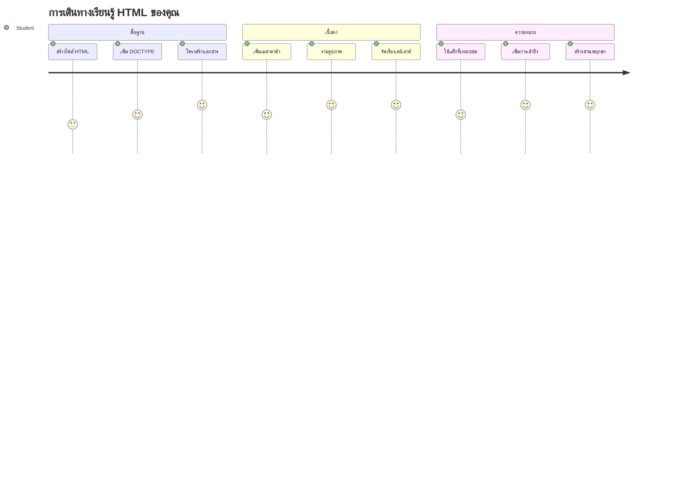
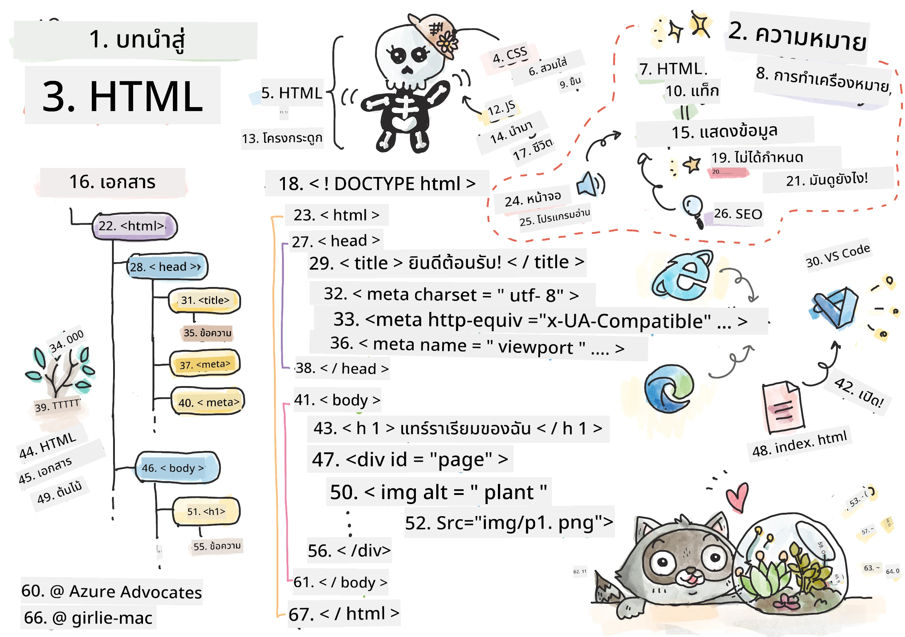
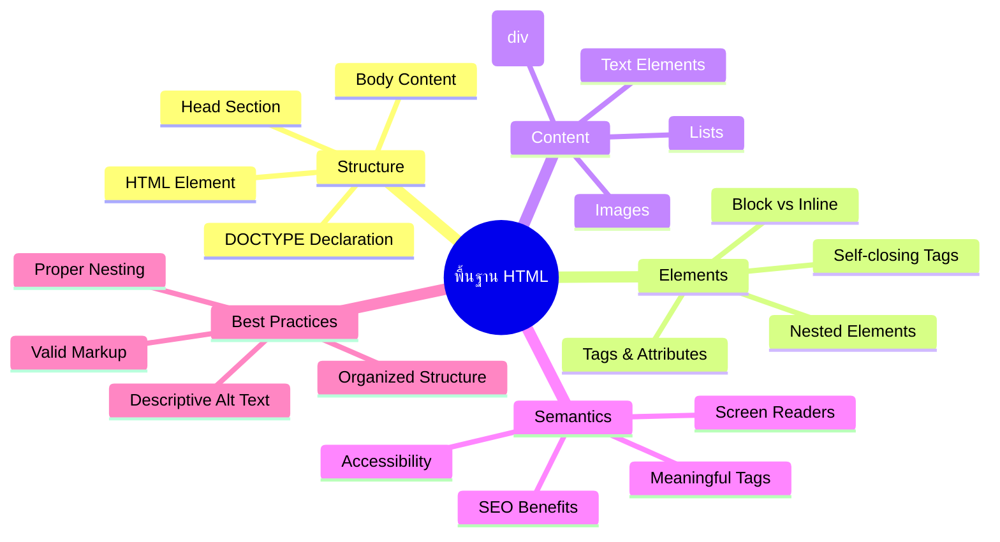
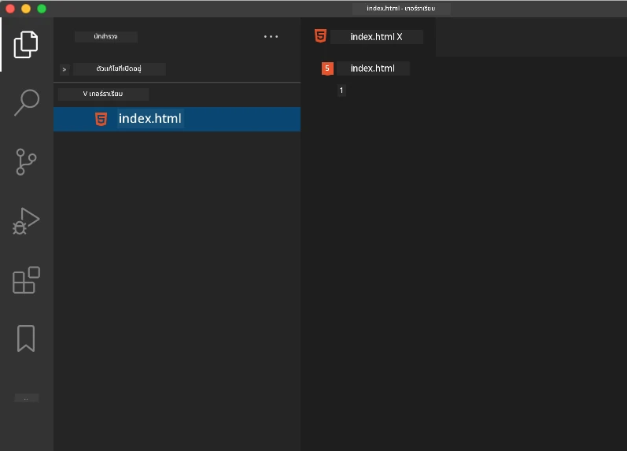
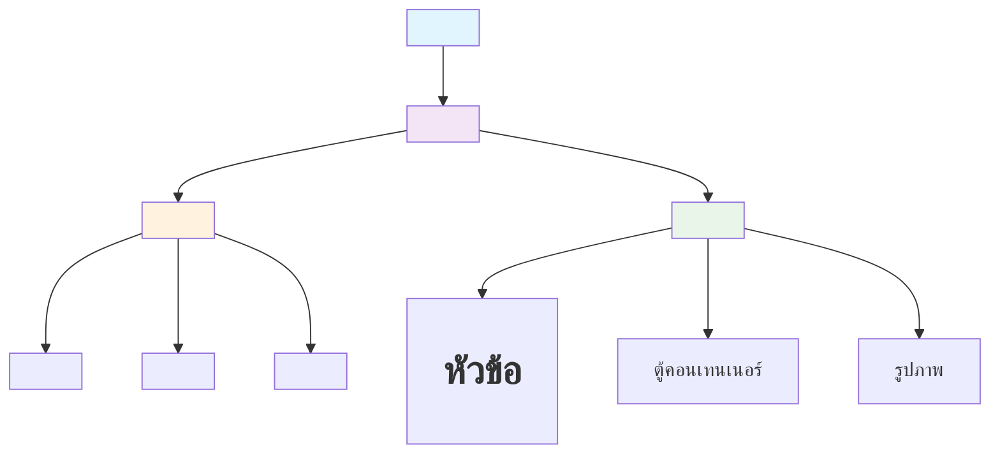
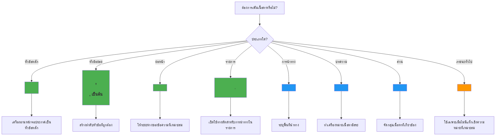
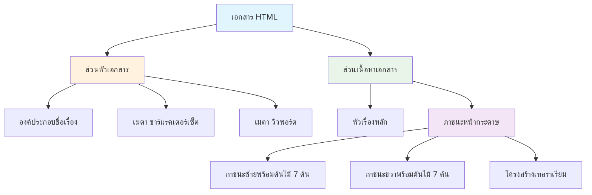
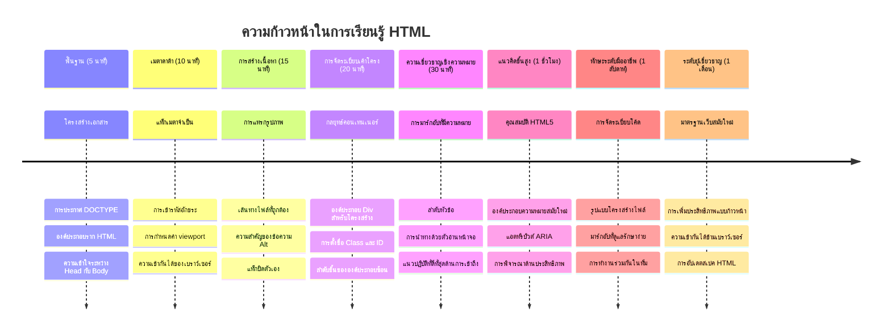

# โครงการ Terrarium ตอนที่ 1: แนะนำ HTML



> สเก็ตช์โน้ตโดย [Tomomi Imura](https://twitter.com/girlie_mac)

HTML หรือที่เรียกว่า HyperText Markup Language คือรากฐานของเว็บไซต์ทุกเว็บไซต์ที่คุณเคยเยี่ยมชม ลองคิดว่า HTML เป็นโครงกระดูกที่ให้องค์ประกอบและโครงสร้างแก่หน้าเว็บ – มันกำหนดว่าคอนเทนต์อยู่ที่ไหน จัดระเบียบอย่างไร และแต่ละส่วนแทนความหมายอะไร ในขณะที่ CSS จะเป็นการ "แต่งตัว" ให้ HTML ของคุณด้วยสีสันและการจัดวาง และ JavaScript จะทำให้มันมีชีวิตชีวาด้วยความโต้ตอบ HTML จะให้โครงสร้างที่จำเป็นซึ่งทำให้ทุกอย่างเป็นไปได้

ในบทเรียนนี้ คุณจะสร้างโครงสร้าง HTML สำหรับอินเทอร์เฟซ terrarium เสมือนจริง โปรเจกต์นี้จะสอนคุณเกี่ยวกับแนวคิดพื้นฐานของ HTML ในขณะที่สร้างสิ่งที่น่าดึงดูดทางสายตา คุณจะได้เรียนรู้การจัดระเบียบคอนเทนต์โดยใช้ส่วนประกอบที่มีความหมาย การทำงานกับภาพ และการสร้างพื้นฐานสำหรับแอปพลิเคชันเว็บที่มีการโต้ตอบ

เมื่อจบบทเรียนนี้ คุณจะมีหน้า HTML ที่ทำงานได้ โดยแสดงภาพพืชในคอลัมน์ที่จัดเรียงไว้พร้อมสำหรับการตกแต่งสไตล์ในบทเรียนถัดไป ไม่ต้องกังวลถ้าดูพื้นฐานในตอนแรก – นั่นคือสิ่งที่ HTML ควรเป็นก่อนที่ CSS จะเพิ่มความสวยงามทางสายตา


## แบบทดสอบก่อนบรรยาย

[แบบทดสอบก่อนบรรยาย](https://ff-quizzes.netlify.app/web/quiz/15)

> 📺 **ดูและเรียนรู้**: ชมวิดีโอแนะนำที่เป็นประโยชน์นี้
> 
> [](https://www.youtube.com/watch?v=1TvxJKBzhyQ)

## การตั้งค่าโปรเจกต์ของคุณ

ก่อนที่เราจะเริ่มเขียนโค้ด HTML ให้ตั้งค่าสภาพแวดล้อมการทำงานที่เหมาะสมสำหรับโปรเจกต์ terrarium ของคุณ การสร้างโครงสร้างไฟล์ที่เป็นระเบียบตั้งแต่เริ่มต้นเป็นนิสัยที่สำคัญที่จะช่วยคุณตลอดเส้นทางการพัฒนาเว็บ

### งาน: สร้างโครงสร้างโปรเจกต์ของคุณ

คุณจะสร้างโฟลเดอร์เฉพาะสำหรับโปรเจกต์ terrarium และเพิ่มไฟล์ HTML แรกของคุณ นี่คือสองวิธีที่คุณสามารถใช้:

**ตัวเลือกที่ 1: ใช้ Visual Studio Code**
1. เปิด Visual Studio Code
2. คลิก "File" → "Open Folder" หรือใช้ `Ctrl+K, Ctrl+O` (Windows/Linux) หรือ `Cmd+K, Cmd+O` (Mac)
3. สร้างโฟลเดอร์ใหม่ชื่อ `terrarium` และเลือกโฟลเดอร์นี้
4. ในแผง Explorer คลิกไอคอน "New File"
5. ตั้งชื่อไฟล์ของคุณว่า `index.html`



**ตัวเลือกที่ 2: ใช้คำสั่ง Terminal**
```bash
mkdir terrarium
cd terrarium
touch index.html
code index.html
```

**นี่คือสิ่งที่คำสั่งเหล่านี้ทำ:**
- **สร้าง** โฟลเดอร์ใหม่ชื่อ `terrarium` สำหรับโปรเจกต์ของคุณ
- **เข้าไปยัง** โฟลเดอร์ terrarium 
- **สร้าง** ไฟล์ `index.html` เปล่า ๆ
- **เปิด** ไฟล์ใน Visual Studio Code เพื่อแก้ไข

> 💡 **เคล็ดลับ**: ชื่อไฟล์ `index.html` มีความพิเศษในวงการพัฒนาเว็บ เมื่อใครสักคนเยี่ยมชมเว็บไซต์ เบราว์เซอร์จะค้นหาไฟล์ `index.html` เป็นหน้าพื้นฐานโดยอัตโนมัติ นั่นหมายความว่า URL อย่าง `https://mysite.com/projects/` จะให้บริการไฟล์ `index.html` จากโฟลเดอร์ `projects` โดยไม่จำเป็นต้องระบุชื่อไฟล์ใน URL

## ทำความเข้าใจโครงสร้างเอกสาร HTML

เอกสาร HTML ทุกไฟล์จะปฏิบัติตามโครงสร้างเฉพาะที่เบราว์เซอร์ต้องเข้าใจและแสดงผลอย่างถูกต้อง ลองคิดว่าโครงสร้างนี้เหมือนจดหมายอย่างเป็นทางการ – มีองค์ประกอบที่จำเป็นเรียงลำดับกันเพื่อช่วยผู้รับ (ในกรณีนี้คือเบราว์เซอร์) ประมวลผลเนื้อหาอย่างเหมาะสม


มาเริ่มโดยการเพิ่มโครงสร้างพื้นฐานที่สำคัญที่เอกสาร HTML ทุกไฟล์ต้องมี

### การประกาศ DOCTYPE และองค์ประกอบราก

สองบรรทัดแรกของไฟล์ HTML ใดๆ ทำหน้าที่เป็น "บทนำ" ของเอกสารให้กับเบราว์เซอร์:

```html
<!DOCTYPE html>
<html></html>
```

**ทำความเข้าใจสิ่งที่โค้ดนี้ทำ:**
- **ประกาศ** ชนิดเอกสารเป็น HTML5 โดยใช้ `<!DOCTYPE html>`
- **สร้าง** องค์ประกอบราก `<html>` ที่จะบรรจุเนื้อหาทั้งหมดของหน้า
- **กำหนด** มาตรฐานเว็บสมัยใหม่เพื่อให้เบราว์เซอร์แสดงผลอย่างถูกต้อง
- **รับประกัน** การแสดงผลที่สอดคล้องกันในเบราว์เซอร์และอุปกรณ์ต่างๆ

> 💡 **เคล็ดลับ VS Code**: วางเมาส์เหนือแท็ก HTML ใดก็ได้ใน VS Code เพื่อดูข้อมูลช่วยเหลือจาก MDN Web Docs รวมถึงตัวอย่างการใช้งานและรายละเอียดความเข้ากันได้ของเบราว์เซอร์

> 📚 **เรียนรู้เพิ่มเติม**: การประกาศ DOCTYPE จะป้องกันไม่ให้เบราว์เซอร์เข้าสู่ "quirks mode" ซึ่งเคยใช้เพื่อรองรับเว็บไซต์เก่ามาก การพัฒนาเว็บสมัยใหม่ใช้การประกาศง่ายๆ แบบ `<!DOCTYPE html>` เพื่อให้แน่ใจว่าเป็น [การเรนเดอร์ที่สอดคล้องกับมาตรฐาน](https://developer.mozilla.org/docs/Web/HTML/Quirks_Mode_and_Standards_Mode)

### 🔄 **ตรวจสอบเชิงการสอน**
**หยุดและคิด**: ก่อนจะไปต่อ ให้แน่ใจว่าคุณเข้าใจ:
- ✅ ทำไมเอกสาร HTML ทุกไฟล์จึงต้องมีประกาศ DOCTYPE
- ✅ องค์ประกอบราก `<html>` ประกอบด้วยอะไรบ้าง
- ✅ โครงสร้างนี้ช่วยให้เบราว์เซอร์แสดงหน้าต่างๆ ได้อย่างถูกต้องอย่างไร

**ทดสอบตัวเองอย่างรวดเร็ว**: คุณสามารถอธิบายด้วยคำของคุณเองได้ไหมว่า "การเรนเดอร์ที่สอดคล้องกับมาตรฐาน" หมายความว่าอย่างไร?

## การเพิ่มเมตาดาต้าเอกสารที่จำเป็น

ส่วน `<head>` ของเอกสาร HTML ประกอบด้วยข้อมูลสำคัญที่เบราว์เซอร์และเครื่องมือค้นหาต้องการ แต่ผู้เยี่ยมชมจะไม่เห็นโดยตรงบนหน้าเว็บ ลองนึกว่ามันเป็น "เบื้องหลัง" ที่ช่วยให้เว็บไซต์ของคุณทำงานได้ถูกต้องและแสดงผลอย่างเหมาะสมในอุปกรณ์และแพลตฟอร์มต่างๆ

เมตาดาต้านี้แจ้งให้เบราว์เซอร์ทราบว่าจะต้องแสดงหน้าอย่างไร ใช้การเข้ารหัสตัวอักษรแบบไหน และวิธีจัดการกับขนาดหน้าจอที่แตกต่างกัน – ซึ่งทั้งหมดนี้จำเป็นสำหรับการสร้างหน้าเว็บที่มืออาชีพและเข้าถึงได้

### งาน: เพิ่มส่วนหัวของเอกสาร

แทรกส่วน `<head>` นี้ระหว่างแท็กเปิดและปิด `<html>` ของคุณ:

```html
<head>
	<title>Welcome to my Virtual Terrarium</title>
	<meta charset="utf-8" />
	<meta http-equiv="X-UA-Compatible" content="IE=edge" />
	<meta name="viewport" content="width=device-width, initial-scale=1" />
</head>
```

**อธิบายว่าส่วนประกอบแต่ละตัวทำงานอย่างไร:**
- **ตั้งค่า** ชื่อหน้าที่ปรากฏในแท็บเบราว์เซอร์และผลการค้นหา
- **กำหนด** การเข้ารหัสตัวอักษรเป็น UTF-8 เพื่อแสดงข้อความได้อย่างถูกต้องทั่วโลก
- **รับประกัน** ความเข้ากันได้กับ Internet Explorer เวอร์ชันใหม่ๆ
- **กำหนดค่า** การออกแบบแบบตอบสนองด้วยการตั้งค่า viewport ให้ตรงกับความกว้างของอุปกรณ์
- **ควบคุม** ระดับการซูมเริ่มต้นเพื่อแสดงเนื้อหาในขนาดธรรมชาติ

> 🤔 **ลองคิดดู**: จะเกิดอะไรขึ้นถ้าคุณตั้งค่า meta viewport เป็นแบบนี้: `<meta name="viewport" content="width=600">`? นี่จะบังคับให้หน้าเว็บกว้างเพียง 600 พิกเซลตลอดเวลา ซึ่งจะทำให้การออกแบบตอบสนองพัง! เรียนรู้เพิ่มเติมเกี่ยวกับ [การตั้งค่า viewport ที่เหมาะสม](https://developer.mozilla.org/docs/Web/HTML/Viewport_meta_tag).

## การสร้างส่วนเนื้อหาของเอกสาร

องค์ประกอบ `<body>` ประกอบด้วยเนื้อหาทั้งหมดที่มองเห็นได้ของเว็บเพจคุณ – ทุกอย่างที่ผู้ใช้จะเห็นและโต้ตอบด้วย ในขณะที่ส่วน `<head>` ให้คำสั่งกับเบราว์เซอร์ ส่วน `<body>` ประกอบด้วยเนื้อหาจริง: ข้อความ ภาพ ปุ่ม และองค์ประกอบอื่น ๆ ที่สร้างอินเทอร์เฟซผู้ใช้ของคุณ

มาเพิ่มโครงสร้างของส่วนนี้และทำความเข้าใจว่าแท็ก HTML ทำงานร่วมกันอย่างไรเพื่อสร้างเนื้อหาที่มีความหมาย

### ทำความเข้าใจโครงสร้างแท็ก HTML

HTML ใช้แท็กคู่เพื่อกำหนดองค์ประกอบ แท็กส่วนใหญ่จะมีแท็กเปิดเช่น `<p>` และแท็กปิดเช่น `</p>` โดยมีเนื้อหาอยู่ระหว่างกลาง: `<p>Hello, world!</p>` ซึ่งจะสร้างองค์ประกอบย่อหน้าที่มีข้อความ "Hello, world!" อยู่ภายใน

### งาน: เพิ่มองค์ประกอบ body

อัปเดตไฟล์ HTML ของคุณให้รวมองค์ประกอบ `<body>`:

```html
<!DOCTYPE html>
<html>
	<head>
		<title>Welcome to my Virtual Terrarium</title>
		<meta charset="utf-8" />
		<meta http-equiv="X-UA-Compatible" content="IE=edge" />
		<meta name="viewport" content="width=device-width, initial-scale=1" />
	</head>
	<body></body>
</html>
```

**นี่คือสิ่งที่โครงสร้างครบถ้วนนี้มอบให้:**
- **สร้าง** โครงร่างเอกสาร HTML5 พื้นฐาน
- **รวม** เมตาดาต้าที่จำเป็นสำหรับการแสดงผลที่ถูกต้องของเบราว์เซอร์
- **สร้าง** ส่วนเนื้อหาที่ว่างเปล่าพร้อมสำหรับเนื้อหาที่มองเห็นได้ของคุณ
- **ปฏิบัติตาม** แนวทางพัฒนาเว็บสมัยใหม่ที่ดีที่สุด

ตอนนี้คุณพร้อมเพิ่มองค์ประกอบที่มองเห็นได้ของ terrarium แล้ว เราจะใช้แท็ก `<div>` เป็นภาชนะเพื่อจัดระเบียบส่วนต่างๆ ของเนื้อหา และแท็ก `` เพื่อแสดงภาพพืช

### การทำงานกับภาพและภาชนะจัดวาง

ภาพใน HTML มีความพิเศษเพราะใช้แท็กแบบ "ปิดตัวเอง" แตกต่างจากองค์ประกอบอย่าง `<p></p>` ที่ครอบคลุมเนื้อหา แท็ก `` จะบรรจุข้อมูลทั้งหมดที่ต้องการไว้ภายในแท็กเองโดยใช้แอตทริบิวต์เช่น `src` สำหรับเส้นทางไฟล์ภาพ และ `alt` สำหรับการเข้าถึง

ก่อนเพิ่มภาพใน HTML คุณต้องจัดระเบียบไฟล์โปรเจกต์ของคุณให้ถูกต้องโดยการสร้างโฟลเดอร์ images และเพิ่มภาพพืชเข้าไป

**อันดับแรก ตั้งค่าสำหรับภาพของคุณ:**
1. สร้างโฟลเดอร์ชื่อ `images` ภายในโฟลเดอร์โปรเจกต์ terrarium ของคุณ
2. ดาวน์โหลดภาพพืชจาก [โฟลเดอร์ตัวอย่าง](../../../../3-terrarium/solution/images) (รวม 14 ภาพพืช)
3. คัดลอกภาพพืชทั้งหมดใส่ในโฟลเดอร์ `images` ที่สร้างใหม่

### งาน: สร้างเลย์เอาต์แสดงพืช

ตอนนี้เพิ่มภาพพืชที่จัดวางเป็นสองคอลัมน์ระหว่างแท็ก `<body></body>` ของคุณ:

```html
<div id="page">
	<div id="left-container" class="container">
		<div class="plant-holder">
			
		</div>
		<div class="plant-holder">
			
		</div>
		<div class="plant-holder">
			
		</div>
		<div class="plant-holder">
			
		</div>
		<div class="plant-holder">
			
		</div>
		<div class="plant-holder">
			
		</div>
		<div class="plant-holder">
			
		</div>
	</div>
	<div id="right-container" class="container">
		<div class="plant-holder">
			
		</div>
		<div class="plant-holder">
			
		</div>
		<div class="plant-holder">
			
		</div>
		<div class="plant-holder">
			
		</div>
		<div class="plant-holder">
			
		</div>
		<div class="plant-holder">
			
		</div>
		<div class="plant-holder">
			
		</div>
	</div>
</div>
```

**ทีละขั้นตอน นี่คือสิ่งที่โค้ดนี้ทำ:**
- **สร้าง** ตัวภาชนะหลักของหน้าโดยใช้ `id="page"` เพื่อเก็บเนื้อหาทั้งหมด
- **จัดตั้ง** ตัวภาชนะสองคอลัมน์คือ `left-container` และ `right-container`
- **จัดระเบียบ** พืช 7 ต้นในคอลัมน์ซ้ายและ 7 ต้นในคอลัมน์ขวา
- **ล้อมรอบ** ภาพพืชแต่ละภาพด้วย `<div>` ที่มีคลาส `plant-holder` เพื่อจัดตำแหน่งแต่ละต้น
- **ใช้** ชื่อคลาสที่สอดคล้องกันสำหรับการตกแต่ง CSS ในบทเรียนถัดไป
- **กำหนด** ID เฉพาะสำหรับภาพพืชแต่ละภาพเพื่อให้สามารถโต้ตอบกับ JavaScript ในภายหลัง
- **ระบุ** เส้นทางไฟล์อย่างถูกต้องชี้ไปยังโฟลเดอร์ images

> 🤔 **ลองพิจารณา**: สังเกตว่าภาพทั้งหมดนี้มีคำอธิบายแท็ก alt ว่า "plant" เหมือนกันหมด ซึ่งไม่เหมาะสำหรับการเข้าถึง ผู้ใช้ที่ใช้เครื่องอ่านหน้าจอจะได้ยินคำว่า "plant" ซ้ำๆ 14 ครั้งโดยไม่รู้ว่าภาพแต่ละภาพคือพืชอะไร คุณสามารถคิดคำอธิบายแท็ก alt ที่ดีกว่าและมีรายละเอียดมากขึ้นสำหรับแต่ละภาพได้ไหม?

> 📝 **ประเภทองค์ประกอบ HTML**: `<div>` เป็นองค์ประกอบแบบ block-level และจะใช้ความกว้างเต็มพื้นที่ ขณะที่ `<span>` เป็นองค์ประกอบแบบ inline ใช้ความกว้างเท่าที่จำเป็น คุณคิดว่าจะเกิดอะไรขึ้นหากเปลี่ยนแท็ก `<div>` ทั้งหมดเป็น `<span>`?

### 🔄 **ตรวจสอบเชิงการสอน**
**ทำความเข้าใจโครงสร้าง**: ใช้เวลาสักครู่ทบทวนโครงสร้าง HTML ของคุณ:
- ✅ คุณสามารถระบุภาชนะหลักในเลย์เอาต์ของคุณได้หรือไม่?
- ✅ คุณเข้าใจไหมว่าทำไมแต่ละภาพถึงต้องมี ID เฉพาะ?
- ✅ คุณจะอธิบายจุดประสงค์ของ `<div>` ที่มีคลาส `plant-holder` ได้อย่างไร?

**ตรวจสอบด้วยสายตา**: เปิดไฟล์ HTML ของคุณในเบราว์เซอร์ คุณควรเห็น:
- รายการภาพพืชแบบพื้นฐาน
- ภาพที่จัดเป็นสองคอลัมน์
- เลย์เอาต์เรียบง่ายไม่มีการแต่งสไตล์

**อย่าลืม**: รูปลักษณ์พื้นฐานนี้คือสิ่งที่ HTML ควรเป็นก่อนการตกแต่งด้วย CSS!

เมื่อใส่โค้ดนี้แล้ว ภาพพืชจะปรากฏบนหน้าจอ ถึงแม้ว่าพวกมันจะยังไม่สวยงาม – นั่นคือหน้าที่ของ CSS ในบทเรียนถัดไป! ตอนนี้คุณมีพื้นฐาน HTML ที่มั่นคงซึ่งจัดระเบียบเนื้อหาอย่างถูกต้องและปฏิบัติตามแนวทางการเข้าถึงที่ดีที่สุด

## การใช้ HTML เชิงความหมายเพื่อการเข้าถึง

Semantic HTML หมายถึงการเลือกใช้แท็ก HTML ตามความหมายและจุดประสงค์ของเนื้อหา ไม่ใช่แค่รูปลักษณ์เท่านั้น เมื่อคุณใช้การมาร์กอัปที่มีความหมาย คุณกำลังสื่อสารโครงสร้างและความหมายของเนื้อหากับเบราว์เซอร์ เครื่องมือค้นหา และเทคโนโลยีช่วยเหลือต่างๆ เช่น เครื่องอ่านหน้าจอ


วิธีนี้ทำให้เว็บไซต์ของคุณเข้าถึงผู้มีความบกพร่องได้ดีขึ้น และช่วยให้เครื่องมือค้นหาทำความเข้าใจเนื้อหาของคุณได้ดีขึ้น นี่คือหลักการพื้นฐานของการพัฒนาเว็บสมัยใหม่ซึ่งสร้างประสบการณ์ที่ดีขึ้นสำหรับทุกคน

### การเพิ่มหัวข้อหน้าที่มีความหมาย

มาเพิ่มหัวข้อที่เหมาะสมให้กับหน้า terrarium ของคุณ แทรกบรรทัดนี้หลังแท็ก `<body>` เปิดทันที:

```html
<h1>My Terrarium</h1>
```

**ทำไมการมาร์กอัปเชิงความหมายจึงสำคัญ:**
- **ช่วย** เครื่องอ่านหน้าจอในการนำทางและเข้าใจโครงสร้างของหน้า
- **ปรับปรุง** การทำ SEO โดยทำให้ลำดับของเนื้อหาชัดเจนขึ้น
- **เสริม** การเข้าถึงสำหรับผู้ใช้ที่มีข้อจำกัดทางสายตาหรือความแตกต่างทางการรับรู้
- **สร้าง** ประสบการณ์ผู้ใช้ที่ดีกว่าบนอุปกรณ์และแพลตฟอร์มทุกประเภท
- **ปฏิบัติตาม** มาตรฐานเว็บและแนวทางปฏิบัติที่ดีที่สุดสำหรับงานมืออาชีพ

**ตัวอย่างการเลือกแท็กเชิงความหมายกับไม่เชิงความหมาย:**

| จุดประสงค์ | ✅ ตัวเลือกเชิงความหมาย | ❌ ตัวเลือกไม่เชิงความหมาย |
|---------|-------------------|------------------------|
| หัวข้อหลัก | `<h1>Title</h1>` | `<div class="big-text">Title</div>` |
| การนำทาง | `<nav><ul><li></li></ul></nav>` | `<div class="menu"><div></div></div>` |
| ปุ่ม | `<button>Click me</button>` | `<span onclick="...">Click me</span>` |
| เนื้อหาบทความ | `<article><p></p></article>` | `<div class="content"><div></div></div>` |

> 🎥 **ดูตัวอย่าง**: ชม [วิธีการที่เครื่องอ่านหน้าจอทำงานกับเว็บเพจ](https://www.youtube.com/watch?v=OUDV1gqs9GA) เพื่อเข้าใจว่าทำไมการมาร์กอัปเชิงความหมายจึงสำคัญสำหรับการเข้าถึง สังเกตว่าโครงสร้าง HTML ที่ถูกต้องช่วยให้ผู้ใช้สามารถนำทางได้อย่างมีประสิทธิภาพ

## การสร้างภาชนะ Terrarium

ตอนนี้มาเพิ่มโครงสร้าง HTML สำหรับ terrarium เอง – ภาชนะกระจกที่จะวางต้นไม้ภายในภายหลัง ส่วนนี้แสดงให้เห็นแนวคิดสำคัญว่า HTML ให้โครงสร้าง แต่ว่าโดยไม่มีการตกแต่งด้วย CSS เหล่านี้จะยังไม่มองเห็น

การมาร์กอัปของ terrarium ใช้ชื่อคลาสที่อธิบายความหมาย ซึ่งจะทำให้การตกแต่ง CSS ในบทเรียนถัดไปเข้าใจง่ายและดูแลได้สะดวก

### งาน: เพิ่มโครงสร้าง Terrarium

แทรกโค้ดนี้ไว้เหนือแท็ก `</div>` ตัวสุดท้าย (ก่อนปิดแท็กของตัวภาชนะหน้าหลัก):

```html
<div id="terrarium">
	<div class="jar-top"></div>
	<div class="jar-walls">
		<div class="jar-glossy-long"></div>
		<div class="jar-glossy-short"></div>
	</div>
	<div class="dirt"></div>
	<div class="jar-bottom"></div>
</div>
```

**ทำความเข้าใจโครงสร้าง terrarium นี้:**
- **สร้าง** ตัวภาชนะ terrarium หลักที่มี ID เฉพาะเพื่อการตกแต่ง
- **กำหนด** องค์ประกอบแยกต่างหากสำหรับแต่ละส่วนประกอบภาพ (ด้านบน, ผนัง, ดิน, ด้านล่าง)
- **รวม** องค์ประกอบซ้อนสำหรับเอฟเฟกต์การสะท้อนบนกระจก (องค์ประกอบเงางาม)
- **ใช้** ชื่อคลาสที่สื่อความหมายชัดเจนสำหรับแต่ละองค์ประกอบ
- **เตรียม** โครงสร้างสำหรับการจัดแต่ง CSS ที่จะสร้างรูปลักษณ์ของเทอราเรียมแก้ว

> 🤔 **สังเกตอะไรหรือเปล่า?**: ถึงแม้ว่าคุณจะเพิ่มมาร์กอัปนี้แล้วแต่ก็ยังไม่เห็นอะไรใหม่บนหน้าเลย! นี่แสดงให้เห็นอย่างสมบูรณ์ว่า HTML ให้โครงสร้าง ในขณะที่ CSS ให้รูปลักษณ์ องค์ประกอบ `<div>` เหล่านี้มีอยู่แต่ยังไม่มีการจัดแต่งใด ๆ – ซึ่งจะมาในบทเรียนถัดไป!


### 🔄 **ตรวจสอบความเข้าใจเชิงการสอน**
**การเข้าใจโครงสร้าง HTML อย่างเชี่ยวชาญ**: ก่อนจะไปต่อ ให้แน่ใจว่าคุณสามารถ:
- ✅ อธิบายความแตกต่างระหว่างโครงสร้าง HTML กับรูปลักษณ์สายตา
- ✅ ระบุองค์ประกอบ HTML เชิงความหมายกับไม่เชิงความหมาย
- ✅ อธิบายว่าการใช้มาร์กอัปที่ถูกต้องช่วยเรื่องการเข้าถึงได้อย่างไร
- ✅ รับรู้โครงสร้างต้นไม้เอกสารอย่างครบถ้วน

**ทดสอบความเข้าใจของคุณ**: ลองเปิดไฟล์ HTML ของคุณในเบราว์เซอร์ที่ปิดใช้งาน JavaScript และลบ CSS ออก นี่จะเผยให้เห็นโครงสร้างเชิงความหมายที่แท้จริงที่คุณสร้างขึ้น!

---

## การท้าทาย GitHub Copilot Agent

ใช้โหมด Agent เพื่อตอบโจทย์นี้:

**คำอธิบาย:** สร้างโครงสร้าง HTML เชิงความหมายสำหรับส่วนคำแนะนำการดูแลพืชที่สามารถเพิ่มเข้าไปในโปรเจคเทอราเรียมได้

**คำชักชวน:** สร้างส่วน HTML เชิงความหมายที่มีหัวข้อหลักว่า "Plant Care Guide" พร้อม 3 หัวข้อย่อยคือ "Watering", "Light Requirements", และ "Soil Care" แต่ละหัวข้อมาพร้อมกับย่อหน้าข้อมูลการดูแลพืช ใช้แท็ก HTML เชิงความหมายที่เหมาะสม เช่น `<section>`, `<h2>`, `<h3>`, และ `<p>` เพื่อจัดโครงสร้างเนื้อหาอย่างถูกต้อง

เรียนรู้เพิ่มเติมเกี่ยวกับ [โหมด agent](https://code.visualstudio.com/blogs/2025/02/24/introducing-copilot-agent-mode) ได้ที่นี่

## ท้าทายการสำรวจประวัติ HTML

**เรียนรู้เกี่ยวกับวิวัฒนาการของเว็บ**

HTML ได้พัฒนาอย่างมากตั้งแต่ Tim Berners-Lee สร้างเว็บเบราว์เซอร์แรกที่ CERN ในปี 1990 แท็กเก่าบางตัวเช่น `<marquee>` ถูกยกเลิกการใช้งานเพราะไม่สอดคล้องกับมาตรฐานการเข้าถึงข้อมูลและหลักการออกแบบตอบสนองสมัยใหม่

**ลองทำการทดลองนี้:**
1. ห่อหัวข้อ `<h1>` ของคุณชั่วคราวในแท็ก `<marquee>` เช่น `<marquee><h1>My Terrarium</h1></marquee>`
2. เปิดหน้าในเบราว์เซอร์และสังเกตเอฟเฟกต์เลื่อนข้อความ
3. พิจารณาว่าทำไมแท็กนี้จึงถูกยกเลิก (อินทร์: คิดถึงประสบการณ์ผู้ใช้และการเข้าถึง)
4. ลบแท็ก `<marquee>` ออกและกลับไปใช้มาร์กอัปเชิงความหมาย

**คำถามสะท้อนความคิด:**
- การมีหัวข้อเลื่อนข้อความจะส่งผลอย่างไรต่อผู้ใช้ที่มีความบกพร่องทางสายตาหรือไวต่อการเคลื่อนไหว?
- เทคนิค CSS สมัยใหม่ใดที่สามารถสร้างเอฟเฟกต์สายตาคล้ายกันได้อย่างเข้าถึงง่ายกว่า?
- ทำไมจึงสำคัญที่จะต้องใช้มาตรฐานเว็บปัจจุบันแทนการใช้แท็กที่เลิกใช้งานแล้ว?

สำรวจเพิ่มเติมเกี่ยวกับ [องค์ประกอบ HTML ที่เลิกใช้งานและล้าสมัย](https://developer.mozilla.org/docs/Web/HTML/Element#Obsolete_and_deprecated_elements) เพื่อเข้าใจการวิวัฒนาการของมาตรฐานเว็บในการปรับปรุงประสบการณ์ผู้ใช้


## แบบทดสอบหลังบรรยาย

[แบบทดสอบหลังบรรยาย](https://ff-quizzes.netlify.app/web/quiz/16)

## ทบทวน & ศึกษาด้วยตนเอง

**เสริมความรู้ HTML ของคุณ**

HTML เป็นพื้นฐานของเว็บมากว่า 30 ปี พัฒนา จากภาษามาร์กอัปเอกสารธรรมดาเป็นแพลตฟอร์มที่ซับซ้อนสำหรับสร้างแอปพลิเคชันที่โต้ตอบได้ การเข้าใจวิวัฒนาการนี้ช่วยให้คุณเห็นคุณค่าของมาตรฐานเว็บสมัยใหม่และช่วยตัดสินใจพัฒนาได้ดียิ่งขึ้น

**เส้นทางการเรียนรู้แนะนำ:**

1. **ประวัติและวิวัฒนาการของ HTML**
   - ศึกษาไทม์ไลน์ตั้งแต่ HTML 1.0 ถึง HTML5
   - สำรวจสาเหตุที่แท็กบางตัวถูกเลิกใช้ (เรื่องการเข้าถึง, มิตรกับมือถือ, การบำรุงรักษา)
   - ตรวจสอบฟีเจอร์และข้อเสนอใหม่ของ HTML ที่กำลังเกิดขึ้น

2. **เจาะลึก HTML เชิงความหมาย**
   - ศึกษารายการองค์ประกอบ [HTML5 เชิงความหมาย](https://developer.mozilla.org/docs/Web/HTML/Element)
   - ฝึกการระบุว่าเมื่อไรควรใช้ `<article>`, `<section>`, `<aside>`, และ `<main>`
   - เรียนรู้เกี่ยวกับแอตทริบิวต์ ARIA เพื่อเพิ่มการเข้าถึงข้อมูล

3. **การพัฒนาเว็บสมัยใหม่**
   - สำรวจ [การสร้างเว็บไซต์ตอบสนอง](https://docs.microsoft.com/learn/modules/build-simple-website/?WT.mc_id=academic-77807-sagibbon) บน Microsoft Learn
   - เข้าใจการรวม HTML เข้ากับ CSS และ JavaScript
   - เรียนรู้เกี่ยวกับประสิทธิภาพเว็บและแนวปฏิบัติ SEO ที่ดีที่สุด

**คำถามสะท้อนความคิด:**
- แท็ก HTML อะไรที่คุณเจอว่าถูกเลิกใช้ และทำไมมันถึงถูกลบ?
- ฟีเจอร์ใหม่ของ HTML อะไรบ้างที่กำลังถูกเสนอสำหรับเวอร์ชันในอนาคต?
- HTML เชิงความหมายช่วยให้การเข้าถึงและ SEO ดีขึ้นอย่างไร?

### ⚡ **สิ่งที่คุณทำได้ใน 5 นาทีถัดไป**
- [ ] เปิด DevTools (F12) และตรวจสอบโครงสร้าง HTML ของเว็บไซต์โปรดของคุณ
- [ ] สร้างไฟล์ HTML ง่าย ๆ ที่มีแท็กพื้นฐาน: `<h1>`, `<p>`, และ ``
- [ ] ตรวจสอบความถูกต้องของ HTML ของคุณด้วย W3C HTML Validator ออนไลน์
- [ ] ลองเพิ่มคอมเมนต์ใน HTML ด้วย `<!-- comment -->`

### 🎯 **สิ่งที่คุณทำได้ในชั่วโมงนี้**
- [ ] ทำแบบทดสอบหลังบทเรียนและทบทวนแนวคิด HTML เชิงความหมาย
- [ ] สร้างเว็บเพจง่าย ๆ เกี่ยวกับตัวคุณเองโดยใช้โครงสร้าง HTML ที่ถูกต้อง
- [ ] ทดลองกับระดับหัวข้อและแท็กจัดรูปแบบข้อความต่าง ๆ
- [ ] เพิ่มรูปภาพและลิงก์เพื่อฝึกการรวมมัลติมีเดีย
- [ ] ศึกษาฟีเจอร์ HTML5 ที่คุณยังไม่เคยลอง

### 📅 **เส้นทาง HTML ของคุณในสัปดาห์นี้**
- [ ] ทำโปรเจคเทอราเรียมให้เสร็จสมบูรณ์โดยใช้มาร์กอัปเชิงความหมาย
- [ ] สร้างเว็บที่เข้าถึงได้โดยใช้ ARIA labels และบทบาท
- [ ] ฝึกสร้างฟอร์มด้วยชนิดข้อมูลป้อนเข้าที่หลากหลาย
- [ ] สำรวจ API ของ HTML5 เช่น localStorage หรือ geolocation
- [ ] ศึกษารูปแบบ HTML ตอบสนองและการออกแบบแบบ mobile-first
- [ ] ทบทวนโค้ด HTML ของนักพัฒนาคนอื่นเพื่อหาแนวปฏิบัติที่ดีที่สุด

### 🌟 **พื้นฐานเว็บของคุณในเดือนนี้**
- [ ] สร้างเว็บไซต์ผลงานแสดงความชำนาญ HTML ของคุณ
- [ ] เรียนรู้การเทมเพลต HTML ด้วยเฟรมเวิร์กอย่าง Handlebars
- [ ] ร่วมพัฒนาโปรเจคโอเพนซอร์สโดยการปรับปรุงเอกสาร HTML
- [ ] เชี่ยวชาญแนวคิด HTML ขั้นสูงเช่นองค์ประกอบแบบกำหนดเอง
- [ ] รวม HTML เข้ากับ CSS Frameworks และไลบรารี JavaScript
- [ ] ให้คำแนะนำผู้อื่นที่เรียนรู้พื้นฐาน HTML

## 🎯 ไทม์ไลน์ความชำนาญ HTML ของคุณ


### 🛠️ สรุปชุดเครื่องมือ HTML ของคุณ

หลังจากจบบทเรียนนี้ คุณจะมี:
- **โครงสร้างเอกสาร**: พื้นฐาน HTML5 ครบถ้วนพร้อม DOCTYPE ที่ถูกต้อง
- **มาร์กอัปเชิงความหมาย**: แท็กที่มีความหมายเพิ่มการเข้าถึงและ SEO
- **การแทรกรูปภาพ**: การจัดระเบียบไฟล์และการใช้งาน alt text อย่างเหมาะสม
- **โครงร่างเลย์เอาต์**: ใช้ div อย่างมีกลยุทธ์พร้อมชื่อคลาสที่สื่อความหมาย
- **ความตระหนักเรื่องการเข้าถึง**: ความเข้าใจการนำทางของเครื่องอ่านหน้าจอ
- **มาตรฐานสมัยใหม่**: การปฏิบัติ HTML5 ปัจจุบันและความรู้เกี่ยวกับแท็กล้าสมัย
- **พื้นฐานโปรเจค**: พื้นฐานมั่นคงสำหรับการจัดแต่ง CSS และความโต้ตอบ JavaScript

**ขั้นตอนต่อไป**: โครงสร้าง HTML ของคุณพร้อมสำหรับการจัดแต่ง CSS แล้ว! พื้นฐานเชิงความหมายที่คุณสร้างจะทำให้บทเรียนถัดไปเข้าใจง่ายขึ้นมาก


## การบ้าน

[ฝึกฝน HTML ของคุณ: สร้างบล็อกจำลอง](assignment.md)

---

<!-- CO-OP TRANSLATOR DISCLAIMER START -->
**ข้อจำกัดความรับผิดชอบ**:
เอกสารนี้ได้รับการแปลโดยใช้บริการแปลภาษาด้วย AI [Co-op Translator](https://github.com/Azure/co-op-translator) แม้ว่าเราจะพยายามให้มีความถูกต้อง โปรดทราบว่าการแปลอัตโนมัติอาจมีข้อผิดพลาดหรือตำหนิไม่ถูกต้อง เอกสารต้นฉบับในภาษาดั้งเดิมถือเป็นแหล่งข้อมูลที่เชื่อถือได้ สำหรับข้อมูลที่สำคัญ ขอแนะนำให้ใช้บริการแปลโดยมืออาชีพที่เป็นมนุษย์ เราจะไม่รับผิดชอบต่อความเข้าใจผิดหรือการตีความผิดที่เกิดขึ้นจากการใช้การแปลนี้
<!-- CO-OP TRANSLATOR DISCLAIMER END -->