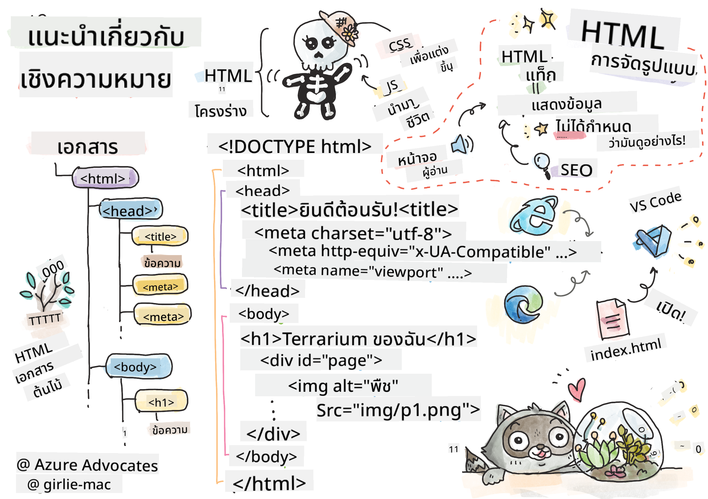

<!--
CO_OP_TRANSLATOR_METADATA:
{
  "original_hash": "89f7f9f800ce7c9f149e98baaae8491a",
  "translation_date": "2025-08-29T07:37:15+00:00",
  "source_file": "3-terrarium/1-intro-to-html/README.md",
  "language_code": "th"
}
-->
# โครงการ Terrarium ตอนที่ 1: แนะนำ HTML


> ภาพสเก็ตโน้ตโดย [Tomomi Imura](https://twitter.com/girlie_mac)

## แบบทดสอบก่อนเรียน

[แบบทดสอบก่อนเรียน](https://ff-quizzes.netlify.app/web/quiz/15)

> ดูวิดีโอ

> 
> [](https://www.youtube.com/watch?v=1TvxJKBzhyQ)

### บทนำ

HTML หรือ HyperText Markup Language คือ 'โครงกระดูก' ของเว็บ หาก CSS 'แต่งตัว' ให้ HTML และ JavaScript ทำให้มันมีชีวิต HTML ก็คือร่างกายของแอปพลิเคชันเว็บของคุณ ไวยากรณ์ของ HTML สะท้อนแนวคิดนี้ด้วยการมีแท็ก "head", "body" และ "footer"

ในบทเรียนนี้ เราจะใช้ HTML เพื่อวางโครงสร้าง 'โครงกระดูก' ของอินเทอร์เฟซ terrarium เสมือนของเรา โดยจะมีชื่อเรื่องและสามคอลัมน์: คอลัมน์ด้านขวาและด้านซ้ายที่มีพืชที่ลากได้ และพื้นที่ตรงกลางที่จะเป็น terrarium ที่ดูเหมือนแก้ว เมื่อจบบทเรียนนี้ คุณจะสามารถเห็นพืชในคอลัมน์ได้ แต่หน้าตาอินเทอร์เฟซอาจดูแปลกไป ไม่ต้องกังวล ในส่วนถัดไปคุณจะเพิ่มสไตล์ CSS เพื่อทำให้อินเทอร์เฟซดูดีขึ้น

### งานที่ต้องทำ

บนคอมพิวเตอร์ของคุณ สร้างโฟลเดอร์ชื่อ 'terrarium' และภายในนั้นสร้างไฟล์ชื่อ 'index.html' คุณสามารถทำสิ่งนี้ใน Visual Studio Code หลังจากสร้างโฟลเดอร์ terrarium โดยเปิดหน้าต่าง VS Code ใหม่ คลิก 'open folder' และไปยังโฟลเดอร์ใหม่ของคุณ คลิกปุ่ม 'file' เล็กๆ ในแถบ Explorer และสร้างไฟล์ใหม่:


หรือ

ใช้คำสั่งเหล่านี้ใน git bash:
* `mkdir terrarium`
* `cd terrarium`
* `touch index.html`
* `code index.html` หรือ `nano index.html`

> ไฟล์ index.html บอกเบราว์เซอร์ว่าไฟล์นี้เป็นไฟล์เริ่มต้นในโฟลเดอร์; URL เช่น `https://anysite.com/test` อาจถูกสร้างขึ้นโดยใช้โครงสร้างโฟลเดอร์ที่มีโฟลเดอร์ชื่อ `test` และมี `index.html` อยู่ภายใน; `index.html` ไม่จำเป็นต้องแสดงใน URL

---

## DocType และแท็ก html

บรรทัดแรกของไฟล์ HTML คือ doctype ซึ่งอาจดูแปลกที่คุณต้องมีบรรทัดนี้อยู่ด้านบนสุดของไฟล์ แต่บรรทัดนี้บอกเบราว์เซอร์รุ่นเก่าว่าต้องแสดงผลหน้าเว็บในโหมดมาตรฐานตามข้อกำหนด HTML ปัจจุบัน

> เคล็ดลับ: ใน VS Code คุณสามารถเลื่อนเมาส์ไปที่แท็กเพื่อดูข้อมูลเกี่ยวกับการใช้งานจาก MDN Reference guides

บรรทัดที่สองควรเป็นแท็กเปิด `<html>` ตามด้วยแท็กปิด `</html>` แท็กเหล่านี้เป็นองค์ประกอบรากของอินเทอร์เฟซของคุณ

### งานที่ต้องทำ

เพิ่มบรรทัดเหล่านี้ที่ด้านบนของไฟล์ `index.html` ของคุณ:

```HTML
<!DOCTYPE html>
<html></html>
```

✅ มีโหมดต่างๆ ที่สามารถกำหนดได้โดยการตั้งค่า DocType ด้วย query string: [Quirks Mode และ Standards Mode](https://developer.mozilla.org/docs/Web/HTML/Quirks_Mode_and_Standards_Mode) โหมดเหล่านี้เคยรองรับเบราว์เซอร์รุ่นเก่ามากที่ไม่ค่อยมีการใช้งานในปัจจุบัน (Netscape Navigator 4 และ Internet Explorer 5) คุณสามารถใช้การประกาศ doctype มาตรฐานได้

---

## 'head' ของเอกสาร

พื้นที่ 'head' ของเอกสาร HTML รวมข้อมูลสำคัญเกี่ยวกับหน้าเว็บของคุณ หรือที่เรียกว่า [metadata](https://developer.mozilla.org/docs/Web/HTML/Element/meta) ในกรณีของเรา เราจะบอกเซิร์ฟเวอร์เว็บที่หน้าเว็บนี้จะถูกส่งไปแสดงผลเกี่ยวกับสิ่งเหล่านี้:

-   ชื่อเรื่องของหน้า
-   เมตาดาต้าของหน้า รวมถึง:
    -   'character set' ที่บอกเกี่ยวกับการเข้ารหัสตัวอักษรที่ใช้ในหน้า
    -   ข้อมูลเบราว์เซอร์ รวมถึง `x-ua-compatible` ซึ่งระบุว่าเบราว์เซอร์ IE=edge ได้รับการสนับสนุน
    -   ข้อมูลเกี่ยวกับการทำงานของ viewport เมื่อโหลดหน้า การตั้งค่า viewport ให้มี initial scale เป็น 1 จะควบคุมระดับการซูมเมื่อหน้าโหลดครั้งแรก

### งานที่ต้องทำ

เพิ่มบล็อก 'head' ลงในเอกสารของคุณระหว่างแท็กเปิดและปิด `<html>`

```html
<head>
	<title>Welcome to my Virtual Terrarium</title>
	<meta charset="utf-8" />
	<meta http-equiv="X-UA-Compatible" content="IE=edge" />
	<meta name="viewport" content="width=device-width, initial-scale=1" />
</head>
```

✅ จะเกิดอะไรขึ้นหากคุณตั้งค่า viewport meta tag แบบนี้: `<meta name="viewport" content="width=600">`? อ่านเพิ่มเติมเกี่ยวกับ [viewport](https://developer.mozilla.org/docs/Web/HTML/Viewport_meta_tag)

---

## `body` ของเอกสาร

### แท็ก HTML

ใน HTML คุณเพิ่มแท็กลงในไฟล์ .html เพื่อสร้างองค์ประกอบของหน้าเว็บ แต่ละแท็กมักมีแท็กเปิดและปิด เช่น `<p>hello</p>` เพื่อระบุย่อหน้า สร้าง body ของอินเทอร์เฟซของคุณโดยเพิ่มชุดแท็ก `<body>` ภายในคู่แท็ก `<html>` ตอนนี้มาร์กอัปของคุณจะมีลักษณะดังนี้:

### งานที่ต้องทำ

```html
<!DOCTYPE html>
<html>
	<head>
		<title>Welcome to my Virtual Terrarium</title>
		<meta charset="utf-8" />
		<meta http-equiv="X-UA-Compatible" content="IE=edge" />
		<meta name="viewport" content="width=device-width, initial-scale=1" />
	</head>
	<body></body>
</html>
```

ตอนนี้คุณสามารถเริ่มสร้างหน้าเว็บของคุณได้ โดยปกติคุณใช้แท็ก `<div>` เพื่อสร้างองค์ประกอบแยกต่างหากในหน้า เราจะสร้างชุดของแท็ก `<div>` ซึ่งจะมีภาพอยู่ภายใน

### รูปภาพ

แท็ก HTML หนึ่งที่ไม่ต้องการแท็กปิดคือแท็ก `` เพราะมันมีองค์ประกอบ `src` ที่มีข้อมูลทั้งหมดที่หน้าเว็บต้องการเพื่อแสดงผลรายการ

สร้างโฟลเดอร์ในแอปของคุณชื่อ `images` และเพิ่มรูปภาพทั้งหมดใน [โฟลเดอร์ซอร์สโค้ด](../../../../3-terrarium/solution/images); (มีรูปภาพพืช 14 รูป)

### งานที่ต้องทำ

เพิ่มรูปภาพพืชเหล่านั้นลงในสองคอลัมน์ระหว่างแท็ก `<body></body>`:

```html
<div id="page">
	<div id="left-container" class="container">
		<div class="plant-holder">
			
		</div>
		<div class="plant-holder">
			
		</div>
		<div class="plant-holder">
			
		</div>
		<div class="plant-holder">
			
		</div>
		<div class="plant-holder">
			
		</div>
		<div class="plant-holder">
			
		</div>
		<div class="plant-holder">
			
		</div>
	</div>
	<div id="right-container" class="container">
		<div class="plant-holder">
			
		</div>
		<div class="plant-holder">
			
		</div>
		<div class="plant-holder">
			
		</div>
		<div class="plant-holder">
			
		</div>
		<div class="plant-holder">
			
		</div>
		<div class="plant-holder">
			
		</div>
		<div class="plant-holder">
			
		</div>
	</div>
</div>
```

> หมายเหตุ: Spans vs. Divs. Divs ถือเป็นองค์ประกอบ 'block' และ Spans เป็น 'inline' จะเกิดอะไรขึ้นหากคุณเปลี่ยน divs เหล่านี้เป็น spans?

ด้วยมาร์กอัปนี้ พืชจะปรากฏบนหน้าจอ แต่ดูไม่ดีนัก เพราะยังไม่ได้จัดสไตล์ด้วย CSS ซึ่งเราจะทำในบทเรียนถัดไป

แต่ละรูปภาพมีข้อความ alt ที่จะปรากฏแม้ว่าคุณจะไม่สามารถดูหรือแสดงผลรูปภาพได้ นี่เป็นคุณสมบัติสำคัญที่ควรรวมไว้เพื่อการเข้าถึง เรียนรู้เพิ่มเติมเกี่ยวกับการเข้าถึงในบทเรียนอนาคต; สำหรับตอนนี้ จำไว้ว่าคุณสมบัติ alt ให้ข้อมูลทางเลือกสำหรับรูปภาพหากผู้ใช้ไม่สามารถดูได้ (เนื่องจากการเชื่อมต่อช้า ข้อผิดพลาดใน src attribute หรือหากผู้ใช้ใช้ screen reader)

✅ คุณสังเกตไหมว่ารูปภาพแต่ละรูปมี alt tag เดียวกัน? นี่เป็นการปฏิบัติที่ดีหรือไม่? เพราะอะไร? คุณสามารถปรับปรุงโค้ดนี้ได้หรือไม่?

---

## มาร์กอัปเชิงความหมาย

โดยทั่วไป การใช้ 'semantics' ที่มีความหมายเมื่อเขียน HTML เป็นสิ่งที่ควรทำ หมายความว่าอย่างไร? หมายความว่าคุณใช้แท็ก HTML เพื่อแสดงประเภทของข้อมูลหรือการโต้ตอบที่ออกแบบมา ตัวอย่างเช่น ข้อความชื่อเรื่องหลักในหน้าเว็บควรใช้แท็ก `<h1>`

เพิ่มบรรทัดต่อไปนี้ใต้แท็กเปิด `<body>` ของคุณ:

```html
<h1>My Terrarium</h1>
```

การใช้มาร์กอัปเชิงความหมาย เช่น การมีหัวข้อเป็น `<h1>` และรายการที่ไม่ได้เรียงลำดับเป็น `<ul>` ช่วยให้ screen readers นำทางผ่านหน้าเว็บได้ โดยทั่วไป ปุ่มควรเขียนเป็น `<button>` และรายการควรเป็น `<li>` แม้ว่าจะ _สามารถ_ ใช้ `<span>` ที่มี click handlers เพื่อเลียนแบบปุ่มได้ แต่จะดีกว่าสำหรับผู้ใช้ที่มีความพิการในการใช้เทคโนโลยีเพื่อกำหนดตำแหน่งของปุ่มในหน้า และโต้ตอบกับมัน หากองค์ประกอบปรากฏเป็นปุ่ม ด้วยเหตุนี้ พยายามใช้มาร์กอัปเชิงความหมายให้มากที่สุด

✅ ลองดู screen reader และ [วิธีที่มันโต้ตอบกับหน้าเว็บ](https://www.youtube.com/watch?v=OUDV1gqs9GA) คุณเห็นไหมว่าการมีมาร์กอัปที่ไม่ใช่เชิงความหมายอาจทำให้ผู้ใช้หงุดหงิดได้อย่างไร?

## Terrarium

ส่วนสุดท้ายของอินเทอร์เฟซนี้เกี่ยวข้องกับการสร้างมาร์กอัปที่จะถูกจัดสไตล์เพื่อสร้าง terrarium

### งานที่ต้องทำ:

เพิ่มมาร์กอัปนี้เหนือแท็ก `</div>` สุดท้าย:

```html
<div id="terrarium">
	<div class="jar-top"></div>
	<div class="jar-walls">
		<div class="jar-glossy-long"></div>
		<div class="jar-glossy-short"></div>
	</div>
	<div class="dirt"></div>
	<div class="jar-bottom"></div>
</div>
```

✅ แม้ว่าคุณจะเพิ่มมาร์กอัปนี้ลงในหน้าจอ คุณจะไม่เห็นอะไรแสดงผลเลย ทำไม?

---

## 🚀ความท้าทาย

มีแท็ก 'เก่า' บางตัวใน HTML ที่ยังคงสนุกที่จะเล่นด้วย แม้ว่าคุณไม่ควรใช้แท็กที่เลิกใช้แล้ว เช่น [แท็กเหล่านี้](https://developer.mozilla.org/docs/Web/HTML/Element#Obsolete_and_deprecated_elements) ในมาร์กอัปของคุณ แต่คุณสามารถใช้แท็ก `<marquee>` เก่าเพื่อทำให้ชื่อเรื่อง h1 เลื่อนในแนวนอนได้หรือไม่? (ถ้าคุณทำ อย่าลืมลบออกหลังจากนั้น)

## แบบทดสอบหลังเรียน

[แบบทดสอบหลังเรียน](https://ff-quizzes.netlify.app/web/quiz/16)

## ทบทวนและศึกษาด้วยตนเอง

HTML เป็นระบบโครงสร้างที่ 'เชื่อถือได้' ซึ่งช่วยสร้างเว็บให้เป็นอย่างที่เป็นในปัจจุบัน เรียนรู้เล็กน้อยเกี่ยวกับประวัติของมันโดยศึกษาบางแท็กเก่าและใหม่ คุณสามารถหาสาเหตุว่าทำไมบางแท็กถูกเลิกใช้และบางแท็กถูกเพิ่มเข้ามาได้หรือไม่? แท็กใดอาจถูกแนะนำในอนาคต?

เรียนรู้เพิ่มเติมเกี่ยวกับการสร้างเว็บไซต์สำหรับเว็บและอุปกรณ์มือถือที่ [Microsoft Learn](https://docs.microsoft.com/learn/modules/build-simple-website/?WT.mc_id=academic-77807-sagibbon)

## งานที่ได้รับมอบหมาย

[ฝึกฝน HTML ของคุณ: สร้าง mockup บล็อก](assignment.md)

---

**ข้อจำกัดความรับผิดชอบ**:  
เอกสารนี้ได้รับการแปลโดยใช้บริการแปลภาษา AI [Co-op Translator](https://github.com/Azure/co-op-translator) แม้ว่าเราจะพยายามให้การแปลมีความถูกต้อง แต่โปรดทราบว่าการแปลอัตโนมัติอาจมีข้อผิดพลาดหรือความไม่แม่นยำ เอกสารต้นฉบับในภาษาต้นทางควรถือเป็นแหล่งข้อมูลที่เชื่อถือได้ สำหรับข้อมูลที่สำคัญ ขอแนะนำให้ใช้บริการแปลภาษามนุษย์ที่เป็นมืออาชีพ เราจะไม่รับผิดชอบต่อความเข้าใจผิดหรือการตีความที่ผิดพลาดซึ่งเกิดจากการใช้การแปลนี้