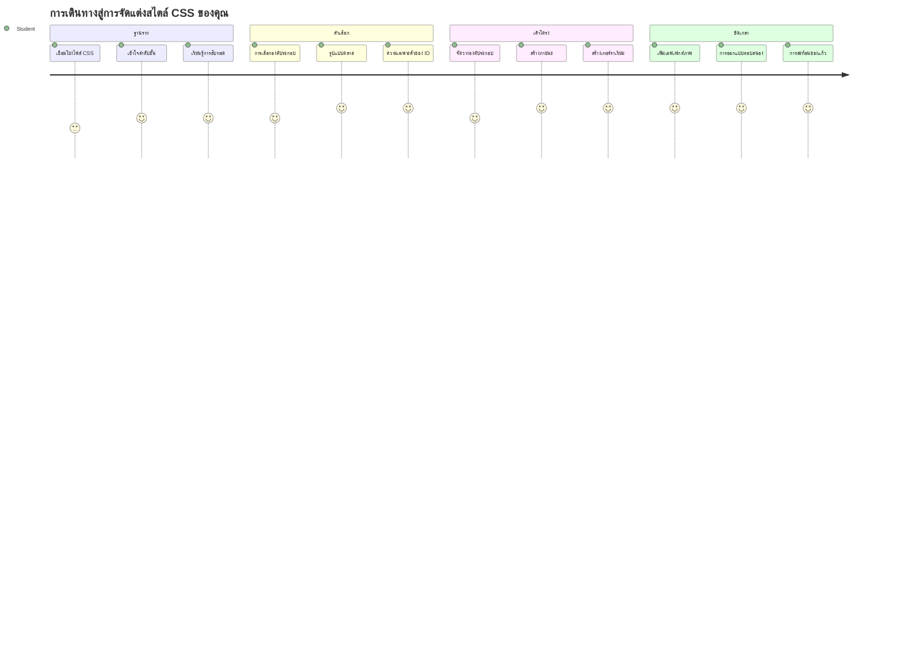
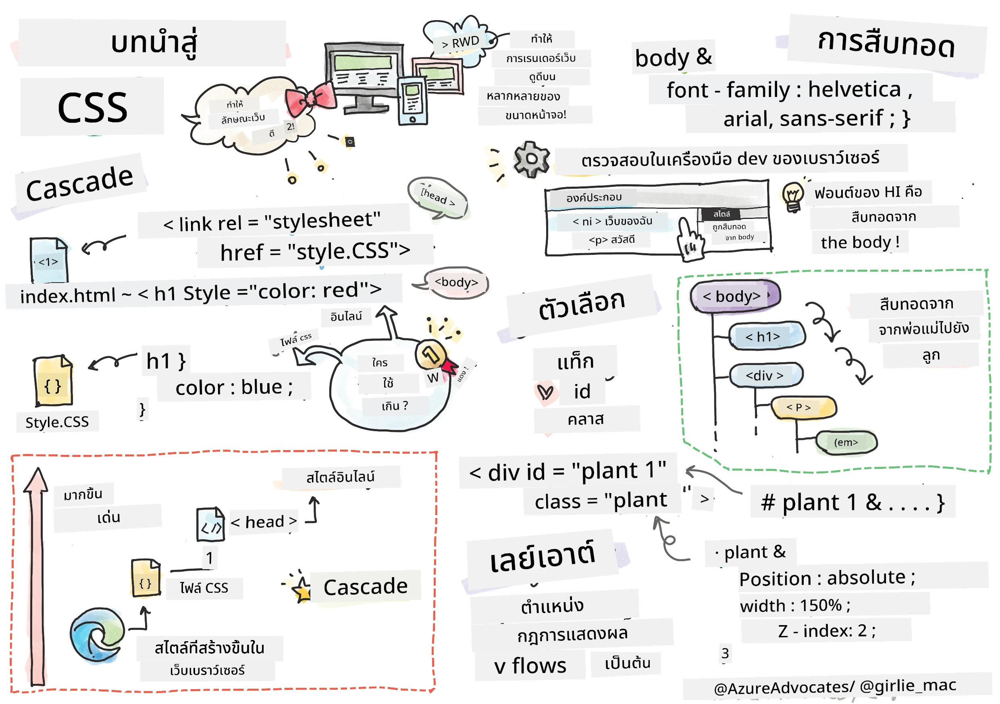
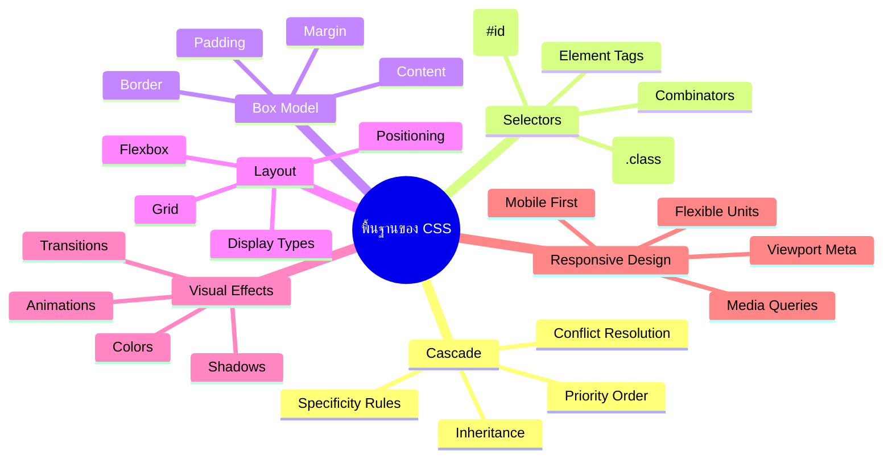
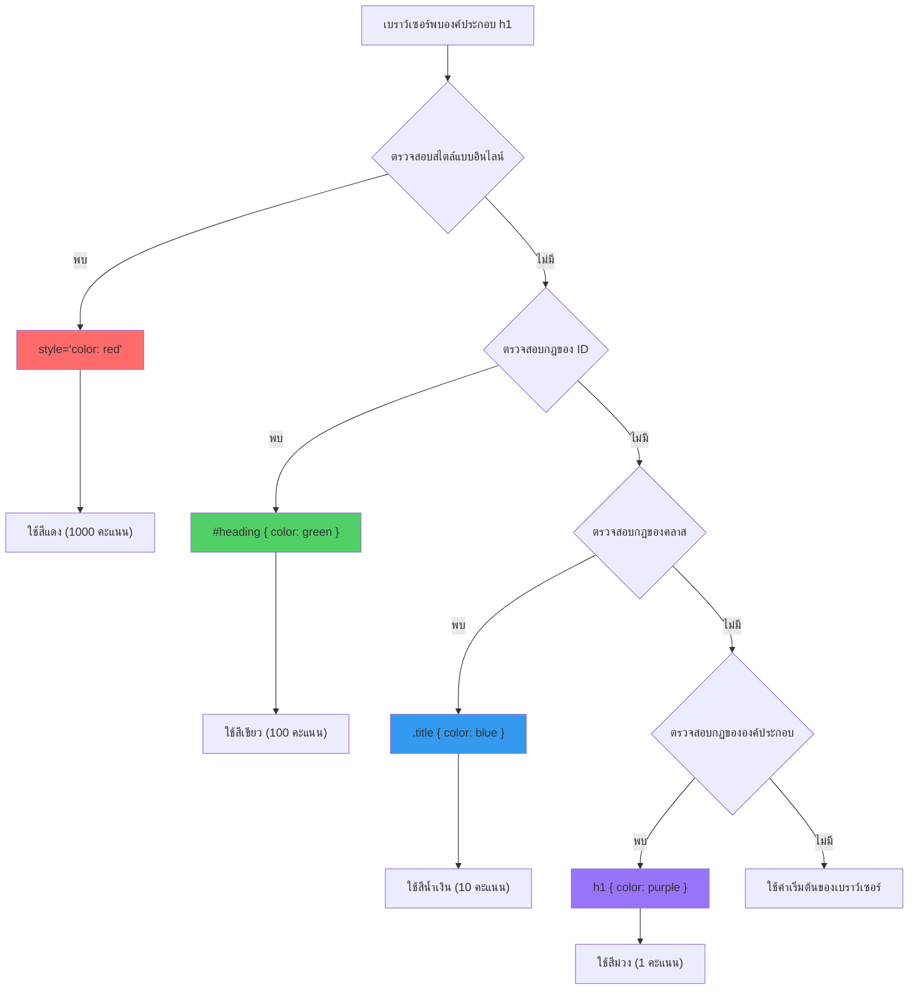
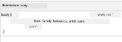
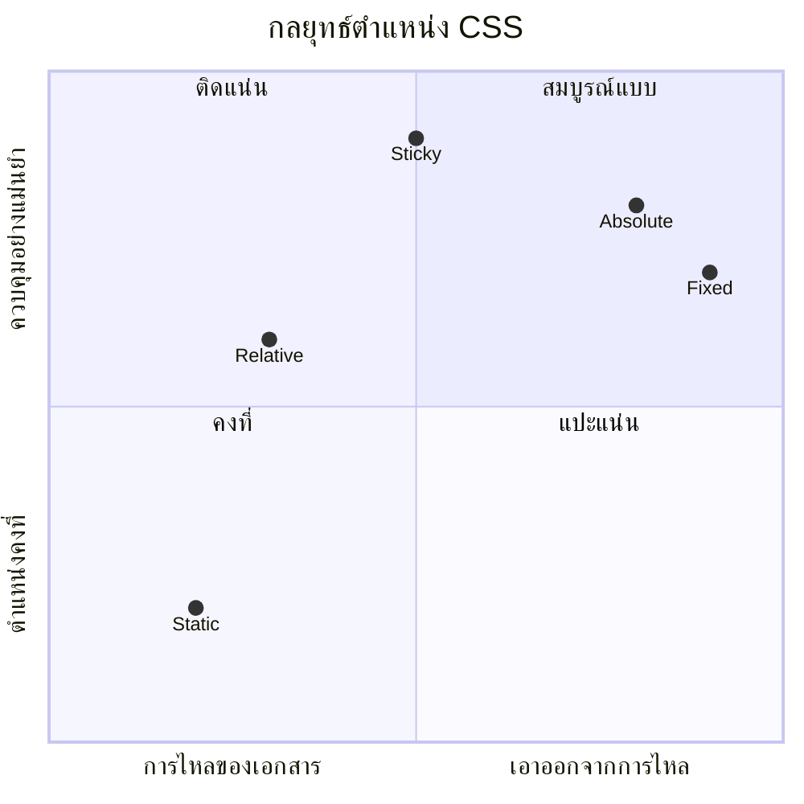
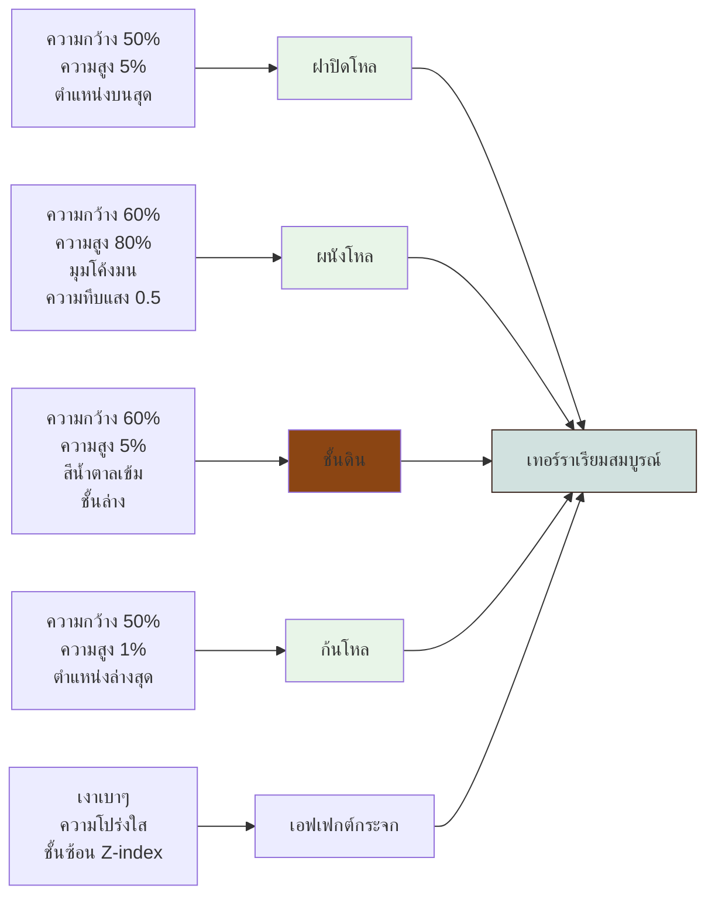
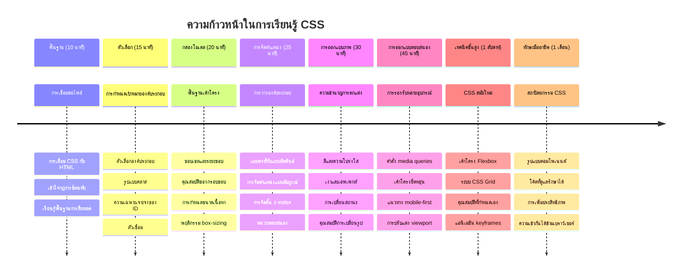

<!--
CO_OP_TRANSLATOR_METADATA:
{
  "original_hash": "e39f3a4e3bcccf94639e3af1248f8a4d",
  "translation_date": "2026-01-06T22:17:06+00:00",
  "source_file": "3-terrarium/2-intro-to-css/README.md",
  "language_code": "th"
}
-->
# โครงการ Terrarium ตอนที่ 2: แนะนำ CSS



> สเก็ตช์โน้ตโดย [Tomomi Imura](https://twitter.com/girlie_mac)

จำได้ไหมว่า Terrarium HTML ของคุณดูเรียบง่ายมาก? CSS คือที่ที่เราจะเปลี่ยนโครงสร้างธรรมดานั้นให้กลายเป็นสิ่งที่ดูน่าดึงดูดทางสายตา

ถ้า HTML คือการสร้างโครงของบ้าน CSS ก็คือทุกสิ่งที่ทำให้บ้านนั้นดูน่าอยู่ - สีทาบ้าน การจัดวางเฟอร์นิเจอร์ การจัดแสง และวิธีที่แต่ละห้องเชื่อมต่อกัน ลองนึกถึงพระราชวังแวร์ซายที่เริ่มต้นจากบ้านล่าสัตว์ธรรมดา แต่ด้วยความใส่ใจในการตกแต่งและการจัดวาง จึงกลายเป็นหนึ่งในอาคารที่งดงามที่สุดในโลก

วันนี้เราจะเปลี่ยน Terrarium ของคุณจากแค่ใช้งานได้ให้กลายเป็นงานที่ดูปราณีต คุณจะได้เรียนรู้วิธีการจัดวางองค์ประกอบอย่างแม่นยำ ทำให้เลย์เอาต์ตอบสนองต่อขนาดหน้าจอที่แตกต่างกัน และสร้างความน่าดึงดูดทางสายตาที่ทำให้เว็บไซต์น่าสนใจ

เมื่อจบบทเรียนนี้ คุณจะเห็นว่า การกำหนดสไตล์ CSS อย่างมีวิจารณญาณจะยกระดับโครงการของคุณได้อย่างมาก มาร่วมเพิ่มสไตล์ให้กับ Terrarium ของคุณกัน


## แบบทดสอบก่อนบรรยาย

[แบบทดสอบก่อนบรรยาย](https://ff-quizzes.netlify.app/web/quiz/17)

## การเริ่มต้นกับ CSS

โดยทั่วไป CSS มักถูกมองว่าเป็นแค่ "แต่งให้สวย" แต่จริงๆ แล้วมันมีบทบาทที่กว้างกว่ามาก CSS เหมือนผู้กำกับภาพยนตร์ - คุณไม่ได้ควบคุมแค่รูปลักษณ์เท่านั้น แต่ยังรวมถึงการเคลื่อนไหว การตอบสนองต่อการโต้ตอบ และการปรับตัวให้เหมาะกับสถานการณ์ต่างๆ

CSS สมัยใหม่มีความสามารถยอดเยี่ยม คุณสามารถเขียนโค้ดที่ปรับเลย์เอาต์ให้สอดคล้องกับโทรศัพท์ แท็บเล็ต และคอมพิวเตอร์เดสก์ท็อปได้อัตโนมัติ คุณสามารถสร้างแอนิเมชันที่นุ่มนวลเพื่อดึงดูดความสนใจของผู้ใช้ไปยังจุดที่ต้องการ ผลลัพธ์เมื่อทุกอย่างทำงานร่วมกันก็น่าประทับใจมาก

> 💡 **เคล็ดลับมืออาชีพ**: CSS มีการพัฒนาอย่างต่อเนื่องด้วยฟีเจอร์และความสามารถใหม่ๆ ตรวจสอบ [CanIUse.com](https://caniuse.com) เสมอเพื่อเช็คว่าบราวเซอร์รองรับฟีเจอร์ CSS ใหม่ก่อนนำไปใช้ในโครงการจริง

**สิ่งที่เราจะทำได้ในบทเรียนนี้:**
- **สร้าง** การออกแบบภาพรวมที่สมบูรณ์สำหรับ Terrarium ของคุณโดยใช้เทคนิค CSS สมัยใหม่
- **สำรวจ** แนวคิดพื้นฐานอย่างเช่น กฎ Cascade, การสืบทอด และ CSS selectors
- **นำไปใช้** การจัดวางตำแหน่งและเลย์เอาต์ที่ตอบสนอง
- **สร้าง** คอนเทนเนอร์ Terrarium โดยใช้รูปทรงและสไตล์ CSS

### ความพร้อมเบื้องต้น

คุณควรทำโครงสร้าง HTML ของ Terrarium ให้เสร็จจากบทเรียนก่อนหน้าและพร้อมสำหรับการกำหนดสไตล์

> 📺 **แหล่งวิดีโอ**: ชมวิดีโอแนะนำที่มีประโยชน์นี้
>
> [](https://www.youtube.com/watch?v=6yIdOIV9p1I)

### การตั้งค่าไฟล์ CSS ของคุณ

ก่อนที่เราจะเริ่มกำหนดสไตล์ เราต้องเชื่อมโยง CSS กับ HTML ก่อน การเชื่อมโยงนี้บอกบราวเซอร์ว่าต้องไปหาไฟล์สไตล์ที่ไหนสำหรับ Terrarium ของเรา

ในโฟลเดอร์ Terrarium ของคุณ ให้สร้างไฟล์ใหม่ชื่อ `style.css` แล้วเชื่อมโยงในส่วน `<head>` ของเอกสาร HTML ของคุณดังนี้:

```html
<link rel="stylesheet" href="./style.css" />
```

**สิ่งที่โค้ดนี้ทำ:**
- **สร้าง** การเชื่อมต่อระหว่างไฟล์ HTML กับ CSS
- **บอก** บราวเซอร์ให้โหลดและใช้สไตล์จากไฟล์ `style.css`
- **ใช้** แอตทริบิวต์ `rel="stylesheet"` เพื่อระบุว่าไฟล์นี้เป็นไฟล์ CSS
- **อ้างอิง** พาธไฟล์ด้วย `href="./style.css"`

## การทำความเข้าใจกฎ CSS Cascade

เคยสงสัยไหมว่า ทำไม CSS ถึงชื่อว่า "Cascading" Style Sheets? เพราะสไตล์มันไหลลงมาราวกับน้ำตก และบางครั้งก็ขัดแย้งกันเอง

ลองนึกถึงการทำงานของโครงสร้างคำสั่งในกองทัพ - คำสั่งทั่วไปอาจจะบอกว่า "ทุกทหารต้องใส่ชุดสีเขียว" แต่คำสั่งเฉพาะสำหรับหน่วยคุณอาจบอกว่า "ใส่ชุดงานพิธีสีน้ำเงิน" คำสั่งที่เฉพาะเจาะจงกว่าจะมีอำนาจมากกว่า CSS ก็ใช้ตรรกะนี้เหมือนกัน และการเข้าใจลำดับชั้นนี้ช่วยให้การดีบักง่ายขึ้นมาก

### ทดลองกับลำดับความสำคัญของ Cascade

เรามาลองดู Cascade ในการทำงานด้วยการสร้างความขัดแย้งของสไตล์ก่อน โดยเพิ่มสไตล์แบบ inline ให้กับแท็ก `<h1>` ของคุณ:

```html
<h1 style="color: red">My Terrarium</h1>
```

**สิ่งที่โค้ดนี้ทำ:**
- **ใช้** สีแดงโดยตรงกับองค์ประกอบ `<h1>` ผ่านสไตล์แบบ inline
- **ใช้** แอตทริบิวต์ `style` เพื่อฝัง CSS ลงไปใน HTML โดยตรง
- **สร้าง** กฎสไตล์ที่มีลำดับความสำคัญสูงสุดสำหรับองค์ประกอบนี้

ถัดไป เพิ่มกฎนี้ในไฟล์ `style.css` ของคุณ:

```css
h1 {
  color: blue;
}
```

**ในโค้ดข้างต้นเราได้:**
- **กำหนด** กฎ CSS ที่กำหนดเป้าหมายทุกองค์ประกอบ `<h1>`
- **ตั้งค่า** สีข้อความเป็นสีน้ำเงินโดยใช้สไตล์ชีตภายนอก
- **สร้าง** กฎที่มีลำดับความสำคัญต่ำกว่าแบบ inline

✅ **ตรวจสอบความเข้าใจ**: สีไหนจะแสดงในเว็บแอปของคุณ? ทำไมสีนี้ถึงได้แสดง? คุณคิดถึงสถานการณ์ไหนบ้างที่ต้องการเขียนทับสไตล์ก่อนหน้า?


> 💡 **ลำดับความสำคัญของ CSS (จากสูงไปต่ำ):**
> 1. **สไตล์แบบ inline** (แอตทริบิวต์ style)
> 2. **ไอดี** (#myId)
> 3. **คลาส** (.myClass) และแอตทริบิวต์
> 4. **ตัวเลือกองค์ประกอบ** (h1, div, p)
> 5. **ค่าปริยายของบราวเซอร์**

## การสืบทอด (Inheritance) ของ CSS ในการใช้งาน

CSS inheritance ทำงานเหมือนพันธุกรรม - องค์ประกอบจะสืบทอดคุณสมบัติบางอย่างจากองค์ประกอบพ่อแม่ ถ้าคุณตั้งค่าฟอนต์บนองค์ประกอบ body ทุกข้อความข้างในจะใช้ฟอนต์นั้นโดยอัตโนมัติ เหมือนกับว่าใบหน้ารูปขากรรไกรโดดเด่นของตระกูล Habsburg ปรากฏผ่านหลายชั่วคนโดยไม่ได้ถูกกำหนดเฉพาะสำหรับแต่ละคน

อย่างไรก็ตาม ไม่ใช่ทุกอย่างที่จะถูกสืบทอด สไตล์ข้อความอย่างฟอนต์และสีจะสืบทอด แต่คุณสมบัติเลย์เอาต์ เช่น margin และ border จะไม่สืบทอด เหมือนเด็กๆ อาจสืบทอดลักษณะทางกายภาพ แต่ไม่ได้สืบทอดรสนิยมแฟชั่นของพ่อแม่

### สังเกตการสืบทอดฟอนต์

มาลองดู inheritance ในการทำงานโดยตั้งค่าฟอนต์แฟมิลี่บนองค์ประกอบ `<body>`:

```css
body {
  font-family: 'Segoe UI', Tahoma, Geneva, Verdana, sans-serif;
}
```

**แยกย่อยสิ่งที่เกิดขึ้นที่นี่:**
- **ตั้งค่า** ฟอนต์แฟมิลี่สำหรับทั้งหน้าโดยกำหนดที่ `<body>`
- **ใช้** ฟอนต์สแตกที่มีตัวเลือก fallback เพื่อความเข้ากันได้กับบราวเซอร์ต่างๆ
- **ใช้** ฟอนต์ระบบสมัยใหม่ที่ดูดีในระบบปฏิบัติการต่างกัน
- **รับรองว่า** ทุกองค์ประกอบลูกจะสืบทอดฟอนต์นี้ ยกเว้นถูกเขียนทับเฉพาะเจาะจง

เปิดเครื่องมือสำหรับนักพัฒนาในบราวเซอร์ของคุณ (F12) ไปที่แท็บ Elements แล้วตรวจสอบองค์ประกอบ `<h1>` คุณจะเห็นว่ามันได้รับการสืบทอดฟอนต์จาก body:



✅ **เวลาทดลอง**: ลองตั้งค่าคุณสมบัติที่สืบทอดได้อื่นๆ บน `<body>` เช่น `color`, `line-height`, หรือ `text-align` ดูสิว่า heading และองค์ประกอบอื่นๆ จะเปลี่ยนอย่างไร

> 📝 **คุณสมบัติที่สืบทอดได้ประกอบด้วย**: `color`, `font-family`, `font-size`, `line-height`, `text-align`, `visibility`
>
> **คุณสมบัติที่ไม่สืบทอดได้ประกอบด้วย**: `margin`, `padding`, `border`, `width`, `height`, `position`

### 🔄 **ตรวจสอบความเข้าใจ**
**ความเข้าใจพื้นฐาน CSS**: ก่อนจะไปถึง selectors ให้แน่ใจว่าคุณสามารถ:
- ✅ อธิบายความแตกต่างระหว่าง cascade กับ inheritance ได้
- ✅ ทำนายได้ว่า สไตล์ไหนจะชนะในกรณีขัดแย้งของ specificity
- ✅ ระบุได้ว่าคุณสมบัติไหนถูกสืบทอดจากองค์ประกอบพ่อแม่
- ✅ เชื่อมต่อไฟล์ CSS กับ HTML ได้อย่างถูกต้อง

**ทดสอบด่วน**: ถ้าคุณมีสไตล์เหล่านี้ สีของ `<h1>` ที่อยู่ภายใน `<div class="special">` จะเป็นสีอะไร?
```css
div { color: blue; }
.special { color: green; }
h1 { color: red; }
```
*คำตอบ: สีแดง (element selector เล็งตรงที่ h1)*

## ชำนาญการใช้ CSS Selectors

CSS selectors คือวิธีที่คุณกำหนดเป้าหมายองค์ประกอบเฉพาะเพื่อกำหนดสไตล์ เหมือนกับการบอกทิศทางที่เจาะจง - แทนที่จะบอกว่า "บ้าน" คุณอาจจะบอกว่า "บ้านสีฟ้าที่มีประตูสีแดงบนถนน Maple"

CSS มีหลายวิธีที่จะระบุเป้าหมายอย่างเฉพาะเจาะจง และการเลือก selector ที่เหมาะสมก็เหมือนกับการเลือกเครื่องมือที่ถูกต้องสำหรับงาน บางครั้งคุณต้องการสไตล์ประตูทุกบานในย่านนี้ และบางครั้งแค่ประตูเดียวเท่านั้น

### Element Selectors (แท็ก)

Element selectors เล็งไปที่องค์ประกอบ HTML ตามชื่อแท็ก เหมาะสำหรับการตั้งค่าสไตล์พื้นฐานที่ใช้ทั่วหน้า:

```css
body {
  font-family: 'Segoe UI', Tahoma, Geneva, Verdana, sans-serif;
  margin: 0;
  padding: 0;
}

h1 {
  color: #3a241d;
  text-align: center;
  font-size: 2.5rem;
  margin-bottom: 1rem;
}
```

**เข้าใจสไตล์เหล่านี้ว่า:**
- **ตั้งค่า** Typography ที่สม่ำเสมอทั่วทั้งหน้าโดยใช้ตัวเลือก `body`
- **ลบ** margin และ padding ของบราวเซอร์ที่ตั้งไว้โดยปริยายเพื่อควบคุมได้ดีขึ้น
- **กำหนดสไตล์** ให้กับทุกองค์ประกอบหัวเรื่องด้วยสี การจัดตำแหน่ง และระยะห่าง
- **ใช้** หน่วย `rem` เพื่อขนาดฟอนต์ที่ปรับขยายได้และเข้าถึงได้ง่าย

แม้ว่า element selectors จะเหมาะกับการสไตล์ทั่วไป แต่คุณต้องการ selectors ที่เฉพาะเจาะจงมากขึ้นเพื่อสไตล์ชิ้นส่วนแต่ละชิ้น เช่น ต้นไม้ใน Terrarium ของคุณ

### ID Selectors สำหรับองค์ประกอบเฉพาะ

ID selectors ใช้เครื่องหมาย `#` และเล็งไปที่องค์ประกอบที่มีแอตทริบิวต์ `id` เฉพาะเจาะจง เนื่องจากไอดีต้องไม่ซ้ำกันในหน้า จึงเหมาะสำหรับการสไตล์องค์ประกอบพิเศษเฉพาะ เช่น ภาชนะตนนไม้ฝั่งซ้ายและขวาของเรา

มาสร้างสไตล์สำหรับคอนเทนเนอร์ด้านข้างของ Terrarium ที่จะวางต้นไม้:

```css
#left-container {
  background-color: #f5f5f5;
  width: 15%;
  left: 0;
  top: 0;
  position: absolute;
  height: 100vh;
  padding: 1rem;
  box-sizing: border-box;
}

#right-container {
  background-color: #f5f5f5;
  width: 15%;
  right: 0;
  top: 0;
  position: absolute;
  height: 100vh;
  padding: 1rem;
  box-sizing: border-box;
}
```

**โค้ดนี้ทำอะไรได้บ้าง:**
- **จัดวาง** คอนเทนเนอร์ที่ขอบซ้ายและขวาสุดโดยใช้ตำแหน่ง `absolute`
- **ใช้** หน่วย `vh` (ความสูงของหน้าจอ) เพื่อให้ความสูงตอบสนองตามขนาดหน้าจอ
- **ใช้** `box-sizing: border-box` เพื่อให้ padding รวมอยู่ในความกว้างทั้งหมด
- **ตัด** หน่วย `px` ออกจากค่าเป็นศูนย์เพื่อให้โค้ดดูสะอาดขึ้น
- **กำหนด** สีพื้นหลังที่อ่อนโยน เพื่อความสบายตากว่าการใช้สีเทาจัด

✅ **ความท้าทายเรื่องคุณภาพโค้ด**: สังเกตว่าภาษา CSS นี้ละเมิดหลักการ DRY (อย่าทำซ้ำตัวเอง) คุณสามารถปรับปรุงโค้ดนี้โดยใช้ทั้ง ID และคลาสได้หรือไม่?

**วิธีการปรับปรุง:**
```html
<div id="left-container" class="container"></div>
<div id="right-container" class="container"></div>
```

```css
.container {
  background-color: #f5f5f5;
  width: 15%;
  top: 0;
  position: absolute;
  height: 100vh;
  padding: 1rem;
  box-sizing: border-box;
}

#left-container {
  left: 0;
}

#right-container {
  right: 0;
}
```

### Class Selectors สำหรับสไตล์ที่นำกลับมาใช้ได้

Class selectors ใช้สัญลักษณ์ `.` และเหมาะกับกรณีที่ต้องการใช้สไตล์เดียวกันกับองค์ประกอบหลายชิ้น ต่างจากไอดีที่ไม่ซ้ำกัน คลาสสามารถใช้ซ้ำใน HTML ได้ ทำให้เหมาะกับแพตเทิร์นการสไตล์ที่สม่ำเสมอ

ใน Terrarium ของเรา แต่ละต้นไม้ต้องการสไตล์คล้ายกันแต่ต้องการตำแหน่งที่แตกต่าง เราจะใช้คลาสสำหรับสไตล์ที่ใช้ร่วมกัน และไอดีสำหรับตำแหน่งเฉพาะ

**นี่คือโครงสร้าง HTML ของแต่ละต้นไม้:**
```html
<div class="plant-holder">
  
</div>
```

**อธิบายองค์ประกอบหลัก:**
- **ใช้** `class="plant-holder"` สำหรับสไตล์ภาชนะที่สอดคล้องกันทั่วทุกต้นไม้
- **ใช้** `class="plant"` สำหรับการสไตล์ภาพและพฤติกรรมร่วมกัน
- **มี** `id="plant1"` เฉพาะเพื่อการตั้งตำแหน่งและการโต้ตอบกับ JavaScript
- **มี** ข้อความ alt ที่อธิบายสำหรับการเข้าถึงผู้ใช้ที่ใช้ screen reader

ตอนนี้เพิ่มสไตล์เหล่านี้ในไฟล์ `style.css` ของคุณ:

```css
.plant-holder {
  position: relative;
  height: 13%;
  left: -0.6rem;
}

.plant {
  position: absolute;
  max-width: 150%;
  max-height: 150%;
  z-index: 2;
  transition: transform 0.3s ease;
}

.plant:hover {
  transform: scale(1.05);
}
```

**แยกย่อยสไตล์เหล่านี้:**
- **สร้าง** ตำแหน่งแบบ relative ให้กับ plant-holder เพื่อกำหนด context การจัดตำแหน่ง
- **ตั้ง** ความสูง plant-holder แต่ละอันที่ 13% เพื่อให้ต้นไม้ทั้งหมดพอดีแนวตั้งโดยไม่ต้องเลื่อน
- **เลื่อน** holder ไปทางซ้ายเล็กน้อยเพื่อจัดตำแหน่งต้นไม้ให้อยู่กึ่งกลางในภาชนะ
- **อนุญาต** ให้ต้นไม้ยืดขนาดตามหน้าจอด้วย `max-width` และ `max-height`
- **ใช้** `z-index` เพื่อให้ต้นไม้ซ้อนอยู่เหนือองค์ประกอบอื่นใน Terrarium
- **เพิ่ม** เอฟเฟกต์ hover เล็กๆ ด้วยการเปลี่ยนแปลง CSS ที่นุ่มนวลเพื่อการโต้ตอบที่ดีขึ้น

✅ **คิดวิเคราะห์**: ทำไมเราถึงต้องใช้ทั้ง `.plant-holder` และ `.plant`? จะเกิดอะไรขึ้นถ้าเราใช้แค่ตัวเดียว?

> 💡 **แพตเทิร์นการออกแบบ**: ภาชนะ (`.plant-holder`) ควบคุมเลย์เอาต์และการจัดตำแหน่ง ในขณะที่เนื้อหา (`.plant`) ควบคุมรูปลักษณ์และการปรับขนาด การแยกหน้าที่แบบนี้ทำให้โค้ดดูแลรักษาและปรับเปลี่ยนได้ง่ายขึ้น

## ทำความเข้าใจการจัดตำแหน่งของ CSS

การจัดตำแหน่ง CSS ก็เหมือนผู้กำกับเวทีละคร - คุณกำหนดตำแหน่งให้นักแสดงทุกคนยืนและเคลื่อนที่ไปรอบๆ เวที นักแสดงบางคนทำตามการจัดวางปกติ ในขณะที่บางคนต้องตำแหน่งเฉพาะเพื่อเอฟเฟกต์ที่น่าสนใจ

เมื่อคุณเข้าใจการจัดตำแหน่งแล้ว ปัญหาเลย์เอาต์หลายอย่างก็จะจัดการได้ง่าย ต้องการแถบนำทางที่อยู่บนสุดแม้ผู้ใช้เลื่อนหน้าจอ? การจัดตำแหน่งช่วยได้ ต้องการ tooltip ที่แสดงในตำแหน่งเฉพาะ? นั่นก็การจัดตำแหน่ง

### ค่าการจัดตำแหน่งทั้งห้า


| ค่าการจัดตำแหน่ง | พฤติกรรม | กรณีใช้งาน |
|----------------|----------|----------|
| `static` | ไหลตามปกติ ไม่สนใจ top/left/right/bottom | เลย์เอาต์เอกสารตามปกติ |
| `relative` | จัดตำแหน่งสัมพันธ์กับตำแหน่งปกติ | ปรับแต่งเล็กน้อย สร้าง context การจัดตำแหน่ง |
| `absolute` | จัดตำแหน่งสัมพันธ์กับบรรพบุรุษที่ถูกจัดตำแหน่ง | วางตำแหน่งแม่นยำ ซ้อนทับ |
| `fixed` | จัดตำแหน่งสัมพันธ์กับ viewport | แถบนำทาง ส่วนลอย |
| `sticky` | สลับระหว่าง relative และ fixed ตามการเลื่อน | หัวเรื่องที่ยึดติดขณะเลื่อน |

### การจัดตำแหน่งใน Terrarium ของเรา

Terrarium ของเราใช้การผสมผสานของชนิดการจัดตำแหน่งอย่างเป็นกลยุทธ์เพื่อสร้างเลย์เอาต์ที่ต้องการ:

```css
/* Container positioning */
.container {
  position: absolute; /* Removes from normal flow */
  /* ... other styles ... */
}

/* Plant holder positioning */
.plant-holder {
  position: relative; /* Creates positioning context */
  /* ... other styles ... */
}

/* Plant positioning */
.plant {
  position: absolute; /* Allows precise placement within holder */
  /* ... other styles ... */
}
```

**เข้าใจกลยุทธ์การจัดตำแหน่ง:**
- **คอนเทนเนอร์ตำแหน่ง absolute** ถูกดึงออกจากฟลูว์ปกติของเอกสารและติดกับขอบหน้าจอ
- **plant-holder ตำแหน่ง relative** สร้าง context การจัดตำแหน่งในขณะที่ยังอยู่ในฟลูว์เอกสาร
- **ต้นไม้ตำแหน่ง absolute** สามารถวางตำแหน่งได้อย่างแม่นยำภายใน plant-holder ที่ relative
- **การผสมผสานนี้** ช่วยให้ต้นไม้ซ้อนแนวตั้งได้ในขณะที่ยังจัดตำแหน่งได้แต่ละต้นอย่างอิสระ

> 🎯 **ทำไมจึงสำคัญ**: องค์ประกอบ `plant` ต้องการตำแหน่งแบบ absolute เพื่อให้สามารถลากย้ายได้ในบทเรียนถัดไป การจัดตำแหน่งแบบ absolute จะดึงออกจากเลย์เอาต์ปกติ ทำให้การลากวางทำงานได้

✅ **เวลาทดลอง**: ลองเปลี่ยนค่าการจัดตำแหน่งและสังเกตผลลัพธ์:
- จะเกิดอะไรขึ้นถ้าคุณเปลี่ยน `.container` จาก `absolute` เป็น `relative`?
- เลย์เอาต์จะเปลี่ยนอย่างไรหาก `.plant-holder` ใช้ `absolute` แทน `relative`?
- จะเกิดอะไรขึ้นเมื่อคุณเปลี่ยน `.plant` เป็นตำแหน่ง `relative`?

### 🔄 **การตรวจสอบความเข้าใจ**
**ความชำนาญเกี่ยวกับ CSS Positioning**: หยุดเพื่อตรวจสอบความเข้าใจของคุณ:
- ✅ คุณอธิบายได้ไหมว่าทำไมต้นไม้จึงต้องใช้ตำแหน่งแบบ absolute สำหรับการลากและวาง?
- ✅ คุณเข้าใจไหมว่าภาชนะแบบ relative สร้างบริบทการจัดตำแหน่งอย่างไร?
- ✅ ทำไมกล่องด้านข้างจึงใช้ตำแหน่ง absolute?
- ✅ จะเกิดอะไรขึ้นถ้าคุณลบคำประกาศตำแหน่งทั้งหมดออกไป?

**การเชื่อมโยงกับโลกจริง**: คิดว่า CSS positioning คล้ายกับเลย์เอาต์ในโลกจริงอย่างไร:
- **Static**: หนังสือบนชั้นวาง (ลำดับธรรมชาติ)
- **Relative**: ขยับหนังสือเล็กน้อยแต่ยังคงตำแหน่งไว้
- **Absolute**: การวางที่คั่นหนังสือที่หน้าหนังสือที่แน่นอน
- **Fixed**: โน้ตเหนียวที่ยังคงมองเห็นได้ขณะที่คุณพลิกหน้า

## การสร้างเทอราเรียมด้วย CSS

ตอนนี้เราจะสร้างโหลแก้วโดยใช้ CSS เท่านั้น – ไม่ต้องใช้รูปภาพหรือซอฟต์แวร์กราฟิก

การสร้างแก้วที่ดูสมจริง, เงา และเอฟเฟกต์ลึกซึ้งโดยใช้ตำแหน่งและความโปร่งใสแสดงถึงศักยภาพทางภาพของ CSS เทคนิคนี้สะท้อนให้เห็นถึงวิธีที่สถาปนิกในยุค Bauhaus ใช้รูปทรงเรขาคณิตง่ายๆ เพื่อสร้างโครงสร้างที่ซับซ้อนและงดงาม เมื่อคุณเข้าใจหลักการเหล่านี้แล้ว คุณจะรู้เทคนิค CSS ที่อยู่เบื้องหลังการออกแบบเว็บหลายๆ แบบ


### การสร้างส่วนประกอบโหลแก้ว

เรามาสร้างโหลเทอราเรียมทีละชิ้น ทุกชิ้นใช้ตำแหน่ง absolute และการกำหนดขนาดเป็นเปอร์เซ็นต์เพื่อรองรับการแสดงผลที่ตอบสนอง:

```css
.jar-walls {
  height: 80%;
  width: 60%;
  background: #d1e1df;
  border-radius: 1rem;
  position: absolute;
  bottom: 0.5%;
  left: 20%;
  opacity: 0.5;
  z-index: 1;
  box-shadow: inset 0 0 2rem rgba(0, 0, 0, 0.1);
}

.jar-top {
  width: 50%;
  height: 5%;
  background: #d1e1df;
  position: absolute;
  bottom: 80.5%;
  left: 25%;
  opacity: 0.7;
  z-index: 1;
  border-radius: 0.5rem 0.5rem 0 0;
}

.jar-bottom {
  width: 50%;
  height: 1%;
  background: #d1e1df;
  position: absolute;
  bottom: 0;
  left: 25%;
  opacity: 0.7;
  border-radius: 0 0 0.5rem 0.5rem;
}

.dirt {
  width: 60%;
  height: 5%;
  background: #3a241d;
  position: absolute;
  border-radius: 0 0 1rem 1rem;
  bottom: 1%;
  left: 20%;
  opacity: 0.7;
  z-index: -1;
}
```

**การทำความเข้าใจการสร้างเทอราเรียม:**
- **ใช้** ขนาดที่ตั้งเป็นเปอร์เซ็นต์เพื่อให้ขยายได้ตามขนาดหน้าจอ
- **จัดตำแหน่ง** องค์ประกอบแบบ absolute เพื่อวางซ้อนและจัดแนวได้อย่างแม่นยำ
- **ใช้** ค่า opacity ต่าง ๆ เพื่อสร้างเอฟเฟกต์ความโปร่งใสของแก้ว
- **ตั้งค่า** `z-index` เพื่อการวางซ้อนให้ต้นไม้ปรากฏภายในโหล
- **เพิ่ม** เงากล่องและความโค้งของขอบที่ละเอียดเพื่อให้ดูสมจริงมากขึ้น

### การออกแบบตอบสนองด้วยเปอร์เซ็นต์

สังเกตว่าทุกขนาดใช้เปอร์เซ็นต์แทนค่าพิกเซลที่ตายตัว:

**เหตุผลที่สำคัญ:**
- **ทำให้** เทอราเรียมปรับขนาดตามสัดส่วนบนหน้าจอทุกขนาด
- **รักษา** ความสัมพันธ์ทางภาพระหว่างส่วนประกอบโหลแก้ว
- **ให้** ประสบการณ์ที่สอดคล้องกันตั้งแต่โทรศัพท์มือถือจนถึงจอมอนิเตอร์ใหญ่
- **อนุญาต** ให้การออกแบบปรับเปลี่ยนได้โดยไม่ทำให้เลย์เอาต์เสียหาย

### หน่วย CSS ในการปฏิบัติ

เราใช้หน่วย `rem` สำหรับ border-radius ซึ่งปรับตามขนาดฟอนต์ราก นี่ช่วยสร้างการออกแบบที่เข้าถึงง่ายขึ้นและเคารพการตั้งค่าฟอนต์ของผู้ใช้ เรียนรู้เพิ่มเติมเกี่ยวกับ [หน่วยสัมพัทธ์ CSS](https://www.w3.org/TR/css-values-3/#font-relative-lengths) ในข้อกำหนดอย่างเป็นทางการ

✅ **ทดลองปรับแต่งด้วยสายตา**: ลองแก้ไขค่าต่างๆ และสังเกตผลลัพธ์:
- เปลี่ยนความทึบของโหลจาก 0.5 เป็น 0.8 – สิ่งนี้มีผลต่อการปรากฏของแก้วอย่างไร?
- ปรับสีดินจาก `#3a241d` เป็น `#8B4513` – มีผลกระทบทางภาพอย่างไร?
- เปลี่ยน `z-index` ของดินเป็น 2 – จะเกิดอะไรขึ้นกับการวางซ้อน?

### 🔄 **การตรวจสอบความเข้าใจ**
**ความเข้าใจการออกแบบด้วย CSS**: ยืนยันความเข้าใจด้านการออกแบบด้วย CSS:
- ✅ ขนาดแบบเปอร์เซ็นต์ช่วยสร้างการออกแบบตอบสนองได้อย่างไร?
- ✅ ทำไม opacity ถึงช่วยสร้างเอฟเฟกต์ความโปร่งใสของแก้ว?
- ✅ บทบาทของ z-index ในการวางซ้อนองค์ประกอบคืออะไร?
- ✅ ค่าของ border-radius ช่วยสร้างรูปร่างโหลอย่างไร?

**หลักการออกแบบ**: สังเกตว่าเราสร้างภาพซับซ้อนจากรูปทรงง่ายๆ:
1. **สี่เหลี่ยมผืนผ้า** → **สี่เหลี่ยมมุมโค้ง** → **ส่วนประกอบโหล**
2. **สีแบนๆ** → **opacity** → **เอฟเฟกต์แก้ว**
3. **องค์ประกอบเดี่ยว** → **การวางซ้อนเป็นชั้นๆ** → **ลักษณะ 3 มิติ**

---

## ความท้าทาย GitHub Copilot Agent 🚀

ใช้โหมด Agent เพื่อทำความท้าทายต่อไปนี้ให้สำเร็จ:

**คำอธิบาย:** สร้างอนิเมชัน CSS ให้ต้นไม้ในเทอราเรียมหวิวไปมาช้าๆ เสมือนลมพัดเบาๆ ซึ่งจะช่วยฝึกทักษะการสร้างอนิเมชัน CSS, การแปลงรูป และ keyframes พร้อมเพิ่มความสวยงามให้เทอราเรียมของคุณ

**คำสั่ง:** เพิ่ม keyframe animation CSS เพื่อทำให้ต้นไม้ในเทอราเรียมหวิวช้าๆ ซ้ายขวา สร้างอนิเมชันการโยกที่หมุนต้นไม้เล็กน้อย (2-3 องศา) ซ้ายและขวา ใช้ความยาวเวลา 3-4 วินาที และใช้กับคลาส `.plant` ให้อนิเมชันวนลูปไม่รู้จบและมี easing function เพื่อการเคลื่อนไหวที่เป็นธรรมชาติ

เรียนรู้เพิ่มเติมเกี่ยวกับ [โหมด agent](https://code.visualstudio.com/blogs/2025/02/24/introducing-copilot-agent-mode) ที่นี่

## 🚀 ความท้าทาย: การเพิ่มแสงสะท้อนบนแก้ว

พร้อมหรือยังที่จะเพิ่มแสงสะท้อนที่สมจริงบนโหลเทอราเรียม? เทคนิคนี้จะเพิ่มความลึกและความสมจริงให้กับการออกแบบ

คุณจะสร้างไฮไลต์สีขาวหรือสีอ่อนในรูปวงรีเล็กๆ ที่สะท้อนแสงเสมือนจริง วางตำแหน่งอย่างเหมาะสมทางด้านซ้ายของโหล ใช้ความโปร่งใสและเบลอให้เหมาะสมเพื่อสร้างแสงสะท้อนที่สมจริง ใช้ `border-radius` เพื่อสร้างรูปฟองออร์แกนิก และลองใช้กราเดียนต์หรือกล่องเงาเพื่อเพิ่มความสมจริงยิ่งขึ้น

## แบบทดสอบหลังเรียน

[แบบทดสอบหลังเรียน](https://ff-quizzes.netlify.app/web/quiz/18)

## ขยายความรู้ CSS ของคุณ

CSS อาจดูซับซ้อนในตอนแรก แต่ความเข้าใจหลักการเหล่านี้จะเป็นพื้นฐานที่มั่นคงสำหรับเทคนิคขั้นสูง

**หัวข้อ CSS ต่อไปที่คุณควรเรียนรู้:**
- **Flexbox** – ช่วยจัดแนวและกระจายองค์ประกอบให้เรียบง่ายขึ้น
- **CSS Grid** – ให้เครื่องมือทรงพลังสำหรับสร้างเลย์เอาต์ซับซ้อน
- **CSS Variables** – ลดการซ้ำซ้อนและเพิ่มความง่ายในการบำรุงรักษา
- **Responsive design** – ทำให้เว็บไซต์ใช้งานได้ดีในขนาดหน้าจอแตกต่างกัน

### แหล่งเรียนรู้เชิงโต้ตอบ

ฝึกฝนแนวคิดเหล่านี้ด้วยเกมสนุกๆ:
- 🐸 [Flexbox Froggy](https://flexboxfroggy.com/) – ฝึก Flexbox ผ่านความท้าทายสนุกๆ
- 🌱 [Grid Garden](https://codepip.com/games/grid-garden/) – เรียน CSS Grid ด้วยการปลูกแครอทเสมือน
- 🎯 [CSS Battle](https://cssbattle.dev/) – ทดสอบทักษะ CSS ของคุณด้วยความท้าทายการเขียนโค้ด

### เรียนรู้อื่นๆ

สำหรับพื้นฐาน CSS อย่างสมบูรณ์ ให้ทำโมดูล Microsoft Learn นี้: [Style your HTML app with CSS](https://docs.microsoft.com/learn/modules/build-simple-website/4-css-basics/?WT.mc_id=academic-77807-sagibbon)

### ⚡ **สิ่งที่คุณทำได้ใน 5 นาทีถัดไป**
- [ ] เปิด DevTools และตรวจสอบสไตล์ CSS บนเว็บไซต์ใดก็ได้ผ่านแผง Elements
- [ ] สร้างไฟล์ CSS ง่ายๆ และเชื่อมโยงกับหน้า HTML
- [ ] ลองเปลี่ยนสีโดยใช้วิธีต่างๆ: hex, RGB, และชื่อสี
- [ ] ฝึกฝนกล่องโมเดล (box model) โดยเพิ่ม padding และ margin ให้กับ div

### 🎯 **สิ่งที่คุณทำได้ในชั่วโมงนี้**
- [ ] ทำแบบทดสอบหลังเรียนและทบทวนพื้นฐาน CSS
- [ ] แต่งหน้าเว็บ HTML ของคุณด้วยฟอนต์ สี และระยะห่าง
- [ ] สร้างเลย์เอาต์ง่ายๆ ด้วย flexbox หรือ grid
- [ ] ทดลองใช้ CSS transitions เพื่อเอฟเฟกต์ที่ลื่นไหล
- [ ] ฝึกทำ responsive design ด้วย media queries

### 📅 **การผจญภัยใน CSS เป็นเวลา 1 สัปดาห์**
- [ ] ทำงานมอบหมายการแต่งเทอราเรียมด้วยความคิดสร้างสรรค์
- [ ] เชี่ยวชาญ CSS Grid โดยสร้างเลย์เอาต์แกลเลอรีรูปภาพ
- [ ] เรียนรู้ CSS animations เพื่อเพิ่มชีวิตชีวาให้การออกแบบ
- [ ] สำรวจ CSS preprocessors เช่น Sass หรือ Less
- [ ] ศึกษาหลักการออกแบบและประยุกต์ใช้กับ CSS ของคุณ
- [ ] วิเคราะห์และสร้างสรรค์การออกแบบที่น่าสนใจที่คุณเจอออนไลน์

### 🌟 **ชำนาญการออกแบบ CSS ภายใน 1 เดือน**
- [ ] สร้างระบบการออกแบบเว็บไซต์ตอบสนองครบวงจร
- [ ] เรียนรู้ CSS-in-JS หรือเฟรมเวิร์กแบบ utility-first อย่าง Tailwind
- [ ] มีส่วนร่วมในโปรเจกต์โอเพนซอร์สด้วยการปรับปรุง CSS
- [ ] เชี่ยวชาญแนวคิด CSS ขั้นสูงเช่น CSS custom properties และ containment
- [ ] สร้างไลบรารีคอมโพเนนต์ที่นำกลับมาใช้ใหม่ได้ด้วย CSS แบบโมดูลาร์
- [ ] เป็นพี่เลี้ยงผู้เรียน CSS คนอื่นและแบ่งปันความรู้ด้านการออกแบบ

## 🎯 ไทม์ไลน์ความชำนาญ CSS ของคุณ


### 🛠️ สรุปชุดเครื่องมือ CSS ของคุณ

หลังจากเรียนจบบทเรียนนี้ คุณจะมี:
- **ความเข้าใจเรขาคณิตแบบ Cascade**: วิธีการที่สไตล์สืบทอดและแทนที่กัน
- **ความชำนาญในการเลือก (Selector Mastery)**: การกำหนดเป้าหมายอย่างแม่นยำด้วยองค์ประกอบ คลาส และ ID
- **ทักษะการจัดตำแหน่ง**: การวางและซ้อนส่วนประกอบอย่างมียุทธศาสตร์
- **การออกแบบด้วยการมองเห็น**: สร้างเอฟเฟกต์แก้ว เงา และความโปร่งใส
- **เทคนิคตอบสนอง**: เลย์เอาต์ที่ตั้งด้วยเปอร์เซ็นต์ซึ่งปรับให้เข้ากับหน้าจอใดก็ได้
- **การจัดการโค้ด**: โครงสร้าง CSS ที่สะอาดและดูแลรักษาง่าย
- **แนวปฏิบัติสมัยใหม่**: ใช้หน่วยสัมพัทธ์และแบบแผนการออกแบบที่เข้าถึงได้

**ขั้นตอนถัดไป**: เทอราเรียมของคุณตอนนี้มีทั้งโครงสร้าง (HTML) และสไตล์ (CSS) บทเรียนสุดท้ายจะเพิ่มความโต้ตอบด้วย JavaScript!

## งานมอบหมาย

[CSS Refactoring](assignment.md)

---

<!-- CO-OP TRANSLATOR DISCLAIMER START -->
**ข้อจำกัดความรับผิดชอบ**:  
เอกสารนี้ได้รับการแปลโดยใช้บริการแปลภาษาด้วย AI [Co-op Translator](https://github.com/Azure/co-op-translator) แม้เราจะพยายามให้ความถูกต้องสูงสุด โปรดทราบว่าการแปลอัตโนมัติอาจมีข้อผิดพลาดหรือความไม่แม่นยำ เอกสารต้นฉบับในภาษาต้นทางควรถูกถือเป็นแหล่งข้อมูลที่มีอำนาจสำหรับข้อมูลดังกล่าว สำหรับข้อมูลที่สำคัญ แนะนำให้ใช้การแปลโดยมนุษย์มืออาชีพ เราไม่รับผิดชอบต่อความเข้าใจผิดหรือการตีความผิดที่อาจเกิดขึ้นจากการใช้การแปลนี้
<!-- CO-OP TRANSLATOR DISCLAIMER END -->