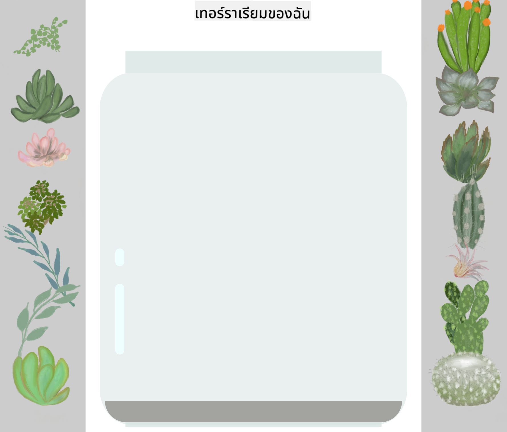

<!--
CO_OP_TRANSLATOR_METADATA:
{
  "original_hash": "acb5ae00cde004304296bb97da8ff4c3",
  "translation_date": "2025-08-29T07:37:55+00:00",
  "source_file": "3-terrarium/2-intro-to-css/README.md",
  "language_code": "th"
}
-->
# โครงการ Terrarium ตอนที่ 2: แนะนำ CSS


> สเก็ตโน้ตโดย [Tomomi Imura](https://twitter.com/girlie_mac)

## แบบทดสอบก่อนเรียน

[แบบทดสอบก่อนเรียน](https://ff-quizzes.netlify.app/web/quiz/17)

### บทนำ

CSS หรือ Cascading Style Sheets ช่วยแก้ปัญหาสำคัญในงานพัฒนาเว็บ: ทำให้เว็บไซต์ของคุณดูดี การเพิ่มสไตล์ให้แอปพลิเคชันของคุณทำให้ใช้งานง่ายขึ้นและดูสวยงามขึ้น นอกจากนี้คุณยังสามารถใช้ CSS เพื่อสร้าง Responsive Web Design (RWD) ซึ่งช่วยให้แอปพลิเคชันของคุณดูดีไม่ว่าจะอยู่บนหน้าจอขนาดใด CSS ไม่ได้มีไว้แค่เพื่อความสวยงามเท่านั้น แต่ยังมีสเปคที่รวมถึงแอนิเมชันและการเปลี่ยนแปลงที่ช่วยให้แอปพลิเคชันของคุณมีปฏิสัมพันธ์ที่ซับซ้อนมากขึ้น กลุ่ม CSS Working Group ช่วยดูแลสเปค CSS ปัจจุบัน คุณสามารถติดตามงานของพวกเขาได้ที่ [เว็บไซต์ของ World Wide Web Consortium](https://www.w3.org/Style/CSS/members)

> หมายเหตุ CSS เป็นภาษาที่พัฒนาอยู่เสมอ เช่นเดียวกับทุกสิ่งบนเว็บ และไม่ใช่ทุกเบราว์เซอร์ที่รองรับสเปคใหม่ๆ อย่าลืมตรวจสอบการใช้งานของคุณโดยดูที่ [CanIUse.com](https://caniuse.com)

ในบทเรียนนี้ เราจะเพิ่มสไตล์ให้กับ terrarium ออนไลน์ของเราและเรียนรู้เกี่ยวกับแนวคิด CSS หลายอย่าง เช่น cascade, inheritance, การใช้ selectors, การจัดตำแหน่ง และการใช้ CSS เพื่อสร้างเลย์เอาต์ ในกระบวนการนี้เราจะจัดเลย์เอาต์ของ terrarium และสร้าง terrarium จริงขึ้นมา

### ความต้องการเบื้องต้น

คุณควรมี HTML สำหรับ terrarium ของคุณที่สร้างเสร็จแล้วและพร้อมสำหรับการเพิ่มสไตล์

> ดูวิดีโอ

> 
> [](https://www.youtube.com/watch?v=6yIdOIV9p1I)

### งาน

ในโฟลเดอร์ terrarium ของคุณ สร้างไฟล์ใหม่ชื่อ `style.css` และนำเข้าไฟล์นั้นในส่วน `<head>`:

```html
<link rel="stylesheet" href="./style.css" />
```

---

## Cascade

Cascading Style Sheets มีแนวคิดที่ว่าสไตล์จะ 'cascade' โดยการใช้สไตล์จะถูกกำหนดโดยลำดับความสำคัญ สไตล์ที่กำหนดโดยผู้เขียนเว็บไซต์จะมีความสำคัญมากกว่าสไตล์ที่กำหนดโดยเบราว์เซอร์ สไตล์ที่กำหนด 'inline' จะมีความสำคัญมากกว่าสไตล์ที่กำหนดในไฟล์สไตล์ชีทภายนอก

### งาน

เพิ่มสไตล์ inline "color: red" ให้กับแท็ก `<h1>` ของคุณ:

```HTML
<h1 style="color: red">My Terrarium</h1>
```

จากนั้นเพิ่มโค้ดต่อไปนี้ในไฟล์ `style.css` ของคุณ:

```CSS
h1 {
 color: blue;
}
```

✅ สีใดที่แสดงในแอปเว็บของคุณ? ทำไม? คุณสามารถหาวิธีการ override สไตล์ได้หรือไม่? คุณจะต้องการทำเช่นนี้เมื่อใด หรือทำไมไม่ควรทำ?

---

## Inheritance

สไตล์จะถูกสืบทอดจากสไตล์ของบรรพบุรุษไปยังลูกหลาน โดยที่องค์ประกอบที่ซ้อนกันจะสืบทอดสไตล์ของพ่อแม่

### งาน

ตั้งค่าฟอนต์ของ body ให้เป็นฟอนต์ที่กำหนด และตรวจสอบดูว่าองค์ประกอบที่ซ้อนกันมีฟอนต์เดียวกันหรือไม่:

```CSS
body {
	font-family: helvetica, arial, sans-serif;
}
```

เปิดคอนโซลของเบราว์เซอร์ไปที่แท็บ 'Elements' และสังเกตฟอนต์ของ H1 มันสืบทอดฟอนต์จาก body ตามที่ระบุในเบราว์เซอร์:


✅ คุณสามารถทำให้องค์ประกอบที่ซ้อนกันสืบทอดคุณสมบัติที่แตกต่างกันได้หรือไม่?

---

## CSS Selectors

### แท็ก

จนถึงตอนนี้ ไฟล์ `style.css` ของคุณมีเพียงไม่กี่แท็กที่ถูกสไตล์ และแอปดูแปลกๆ:

```CSS
body {
	font-family: helvetica, arial, sans-serif;
}

h1 {
	color: #3a241d;
	text-align: center;
}
```

วิธีการสไตล์แท็กแบบนี้ช่วยให้คุณควบคุมองค์ประกอบเฉพาะได้ แต่คุณต้องควบคุมสไตล์ของพืชหลายชนิดใน terrarium ของคุณ เพื่อทำเช่นนั้น คุณต้องใช้ CSS selectors

### Ids

เพิ่มสไตล์ให้กับคอนเทนเนอร์ด้านซ้ายและขวา เนื่องจากมีเพียงคอนเทนเนอร์ด้านซ้ายและขวาเพียงอันเดียวในมาร์กอัป พวกมันจึงได้รับ id เพื่อสไตล์ ใช้ `#`:

```CSS
#left-container {
	background-color: #eee;
	width: 15%;
	left: 0px;
	top: 0px;
	position: absolute;
	height: 100%;
	padding: 10px;
}

#right-container {
	background-color: #eee;
	width: 15%;
	right: 0px;
	top: 0px;
	position: absolute;
	height: 100%;
	padding: 10px;
}
```

ที่นี่ คุณได้วางคอนเทนเนอร์เหล่านี้ด้วยการจัดตำแหน่งแบบ absolute ไปที่ด้านซ้ายและขวาของหน้าจอ และใช้เปอร์เซ็นต์สำหรับความกว้างเพื่อให้สามารถปรับขนาดสำหรับหน้าจอมือถือขนาดเล็กได้

✅ โค้ดนี้ค่อนข้างซ้ำซ้อน ซึ่งไม่เป็นไปตามหลัก "DRY" (Don't Repeat Yourself); คุณสามารถหาวิธีที่ดีกว่าในการสไตล์ id เหล่านี้ได้หรือไม่ เช่น ใช้ id และ class? คุณจะต้องเปลี่ยนมาร์กอัปและปรับปรุง CSS:

```html
<div id="left-container" class="container"></div>
```

### Classes

ในตัวอย่างข้างต้น คุณได้สไตล์องค์ประกอบเฉพาะสองอันบนหน้าจอ หากคุณต้องการให้สไตล์ใช้กับองค์ประกอบหลายอันบนหน้าจอ คุณสามารถใช้ CSS classes ทำเช่นนี้เพื่อจัดเลย์เอาต์พืชในคอนเทนเนอร์ด้านซ้ายและขวา

สังเกตว่าแต่ละพืชในมาร์กอัป HTML มีการผสมผสานระหว่าง id และ class id ถูกใช้โดย JavaScript ที่คุณจะเพิ่มในภายหลังเพื่อจัดการตำแหน่งพืชใน terrarium ส่วน class ให้สไตล์ที่กำหนดไว้กับพืชทั้งหมด

```html
<div class="plant-holder">
	
</div>
```

เพิ่มโค้ดต่อไปนี้ในไฟล์ `style.css` ของคุณ:

```CSS
.plant-holder {
	position: relative;
	height: 13%;
	left: -10px;
}

.plant {
	position: absolute;
	max-width: 150%;
	max-height: 150%;
	z-index: 2;
}
```

สิ่งที่น่าสังเกตในโค้ดนี้คือการผสมผสานระหว่างการจัดตำแหน่งแบบ relative และ absolute ซึ่งเราจะพูดถึงในส่วนถัดไป ดูวิธีการจัดการความสูงด้วยเปอร์เซ็นต์:

คุณตั้งค่าความสูงของที่ใส่พืชไว้ที่ 13% ซึ่งเป็นตัวเลขที่ดีเพื่อให้พืชทั้งหมดแสดงในแต่ละคอนเทนเนอร์แนวตั้งโดยไม่ต้องเลื่อน

คุณตั้งค่าที่ใส่พืชให้เลื่อนไปทางซ้ายเพื่อให้พืชอยู่ตรงกลางมากขึ้นในคอนเทนเนอร์ของพวกมัน รูปภาพมีพื้นหลังโปร่งใสจำนวนมากเพื่อให้สามารถลากได้ง่ายขึ้น ดังนั้นจึงต้องเลื่อนไปทางซ้ายเพื่อให้พอดีกับหน้าจอ

จากนั้น พืชเองถูกกำหนดให้มีความกว้างสูงสุด 150% ซึ่งช่วยให้มันปรับขนาดลงเมื่อเบราว์เซอร์ปรับขนาดลง ลองปรับขนาดเบราว์เซอร์ของคุณดู พืชยังคงอยู่ในคอนเทนเนอร์ของพวกมันแต่ปรับขนาดลงให้พอดี

สิ่งที่น่าสังเกตอีกอย่างคือการใช้ z-index ซึ่งควบคุมระดับความสูงสัมพัทธ์ขององค์ประกอบ (เพื่อให้พืชอยู่บนคอนเทนเนอร์และดูเหมือนอยู่ใน terrarium)

✅ ทำไมคุณถึงต้องการทั้ง plant holder และ plant CSS selector?

## การจัดตำแหน่งใน CSS

การผสมผสานคุณสมบัติการจัดตำแหน่ง (มี static, relative, fixed, absolute และ sticky) อาจดูซับซ้อนเล็กน้อย แต่เมื่อทำอย่างถูกต้องจะช่วยให้คุณควบคุมองค์ประกอบบนหน้าเว็บได้ดี

องค์ประกอบที่จัดตำแหน่งแบบ absolute จะถูกจัดตำแหน่งตามบรรพบุรุษที่ถูกจัดตำแหน่งใกล้ที่สุด และหากไม่มี จะถูกจัดตำแหน่งตาม body ของเอกสาร

องค์ประกอบที่จัดตำแหน่งแบบ relative จะถูกจัดตำแหน่งตามคำสั่ง CSS เพื่อปรับตำแหน่งจากตำแหน่งเริ่มต้น

ในตัวอย่างของเรา `plant-holder` เป็นองค์ประกอบที่จัดตำแหน่งแบบ relative ซึ่งถูกจัดตำแหน่งภายในคอนเทนเนอร์ที่จัดตำแหน่งแบบ absolute พฤติกรรมที่ได้คือคอนเทนเนอร์ด้านข้างถูกตรึงไว้ทางซ้ายและขวา และ `plant-holder` ถูกซ้อนอยู่ภายใน ปรับตัวเองในคอนเทนเนอร์ด้านข้าง ให้พื้นที่สำหรับพืชที่จะวางในแถวแนวตั้ง

> `plant` เองก็มีการจัดตำแหน่งแบบ absolute ซึ่งจำเป็นสำหรับการทำให้มันลากได้ ซึ่งคุณจะได้เรียนรู้ในบทเรียนถัดไป

✅ ลองเปลี่ยนประเภทการจัดตำแหน่งของคอนเทนเนอร์ด้านข้างและ `plant-holder` ดูว่าเกิดอะไรขึ้น?

## เลย์เอาต์ใน CSS

ตอนนี้คุณจะใช้สิ่งที่คุณเรียนรู้เพื่อสร้าง terrarium เอง ทั้งหมดนี้ใช้ CSS!

ก่อนอื่น สไตล์ลูกของ div `.terrarium` ให้เป็นสี่เหลี่ยมมุมมนโดยใช้ CSS:

```CSS
.jar-walls {
	height: 80%;
	width: 60%;
	background: #d1e1df;
	border-radius: 1rem;
	position: absolute;
	bottom: 0.5%;
	left: 20%;
	opacity: 0.5;
	z-index: 1;
}

.jar-top {
	width: 50%;
	height: 5%;
	background: #d1e1df;
	position: absolute;
	bottom: 80.5%;
	left: 25%;
	opacity: 0.7;
	z-index: 1;
}

.jar-bottom {
	width: 50%;
	height: 1%;
	background: #d1e1df;
	position: absolute;
	bottom: 0%;
	left: 25%;
	opacity: 0.7;
}

.dirt {
	width: 60%;
	height: 5%;
	background: #3a241d;
	position: absolute;
	border-radius: 0 0 1rem 1rem;
	bottom: 1%;
	left: 20%;
	opacity: 0.7;
	z-index: -1;
}
```

สังเกตการใช้เปอร์เซ็นต์ที่นี่ หากคุณปรับขนาดเบราว์เซอร์ลง คุณจะเห็นว่าโถปรับขนาดตามไปด้วย สังเกตความกว้างและความสูงที่ใช้เปอร์เซ็นต์สำหรับองค์ประกอบของโถ และวิธีที่แต่ละองค์ประกอบถูกจัดตำแหน่งแบบ absolute อยู่ตรงกลางและตรึงไว้ที่ด้านล่างของ viewport

เรายังใช้ `rem` สำหรับ border-radius ซึ่งเป็นความยาวที่สัมพันธ์กับฟอนต์ อ่านเพิ่มเติมเกี่ยวกับการวัดแบบสัมพันธ์ประเภทนี้ใน [สเปค CSS](https://www.w3.org/TR/css-values-3/#font-relative-lengths)

✅ ลองเปลี่ยนสีและความโปร่งใสของโถกับดิน ดูว่าเกิดอะไรขึ้น? ทำไม?

---

## 🚀ความท้าทาย

เพิ่ม 'ฟอง' เงาสะท้อนที่บริเวณด้านล่างซ้ายของโถเพื่อให้ดูเหมือนกระจกมากขึ้น คุณจะสไตล์ `.jar-glossy-long` และ `.jar-glossy-short` ให้ดูเหมือนเงาสะท้อน นี่คือลักษณะที่ควรจะเป็น:



เพื่อทำแบบทดสอบหลังเรียน ให้ผ่านโมดูล Learn นี้: [เพิ่มสไตล์ให้แอป HTML ของคุณด้วย CSS](https://docs.microsoft.com/learn/modules/build-simple-website/4-css-basics/?WT.mc_id=academic-77807-sagibbon)

## แบบทดสอบหลังเรียน

[แบบทดสอบหลังเรียน](https://ff-quizzes.netlify.app/web/quiz/18)

## ทบทวนและศึกษาด้วยตนเอง

CSS ดูเหมือนจะง่าย แต่มีความท้าทายมากมายเมื่อพยายามเพิ่มสไตล์ให้แอปพลิเคชันให้สมบูรณ์แบบสำหรับทุกเบราว์เซอร์และทุกขนาดหน้าจอ CSS-Grid และ Flexbox เป็นเครื่องมือที่ถูกพัฒนาขึ้นเพื่อทำให้งานนี้มีโครงสร้างและเชื่อถือได้มากขึ้น เรียนรู้เกี่ยวกับเครื่องมือเหล่านี้โดยการเล่น [Flexbox Froggy](https://flexboxfroggy.com/) และ [Grid Garden](https://codepip.com/games/grid-garden/)

## งานที่ได้รับมอบหมาย

[การปรับปรุง CSS](assignment.md)

---

**ข้อจำกัดความรับผิดชอบ**:  
เอกสารนี้ได้รับการแปลโดยใช้บริการแปลภาษา AI [Co-op Translator](https://github.com/Azure/co-op-translator) แม้ว่าเราจะพยายามอย่างเต็มที่เพื่อความถูกต้อง แต่โปรดทราบว่าการแปลอัตโนมัติอาจมีข้อผิดพลาดหรือความไม่แม่นยำ เอกสารต้นฉบับในภาษาต้นทางควรถือเป็นแหล่งข้อมูลที่เชื่อถือได้ สำหรับข้อมูลที่สำคัญ แนะนำให้ใช้บริการแปลภาษามนุษย์ที่เป็นมืออาชีพ เราจะไม่รับผิดชอบต่อความเข้าใจผิดหรือการตีความที่ผิดพลาดซึ่งเกิดจากการใช้การแปลนี้