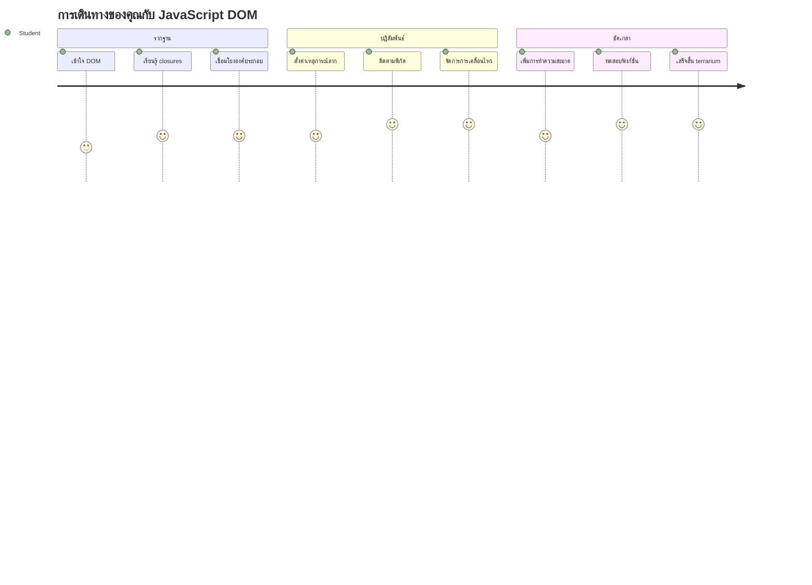
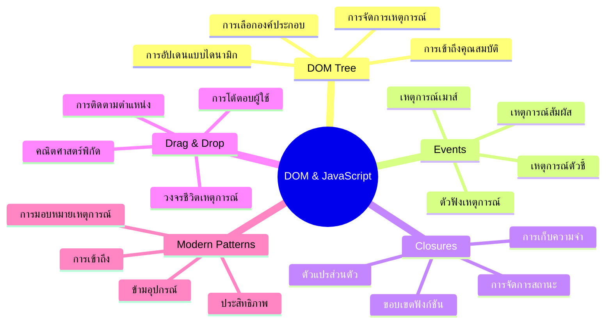
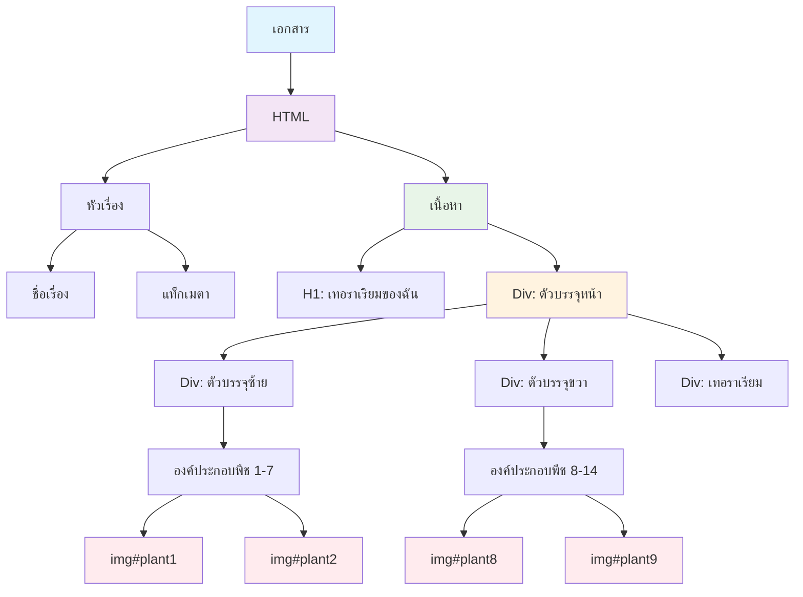
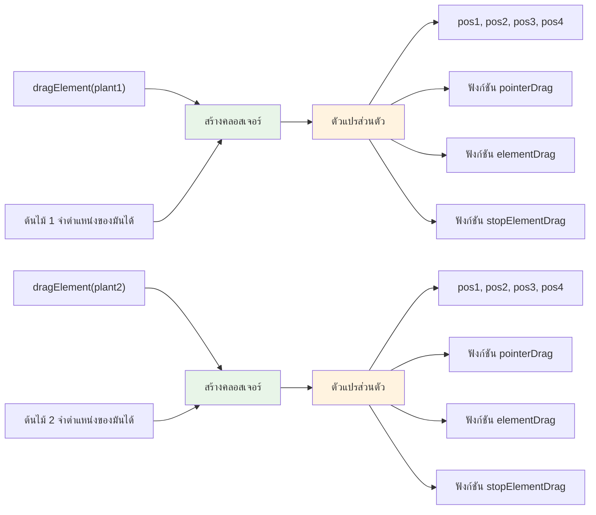
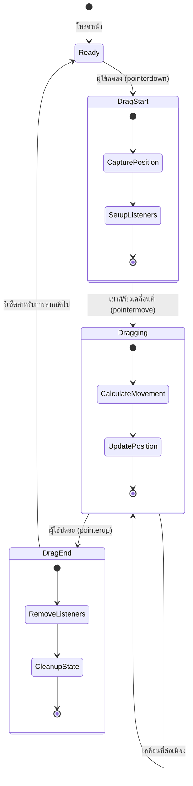
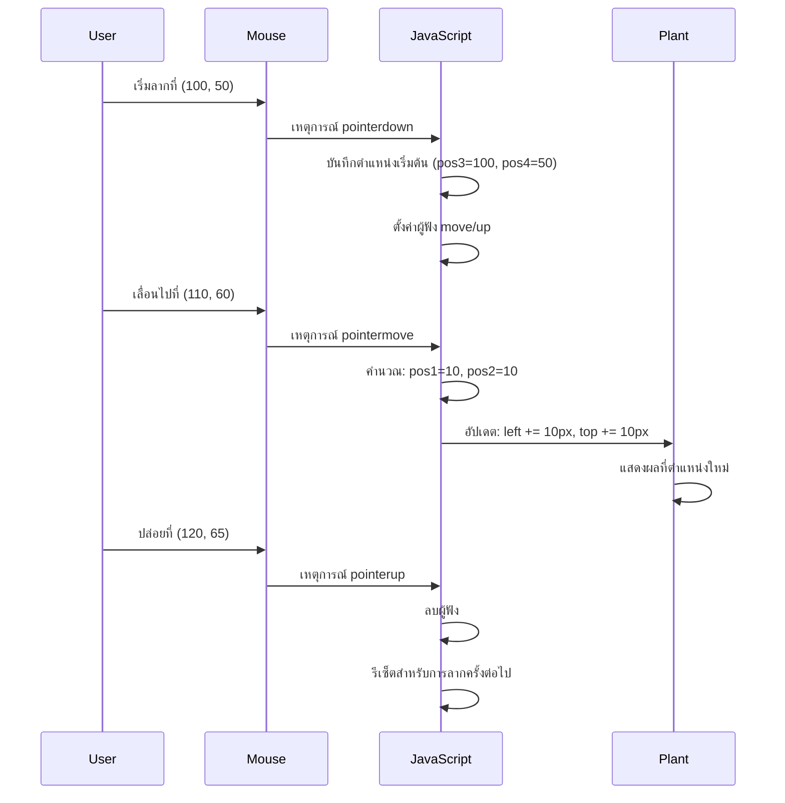
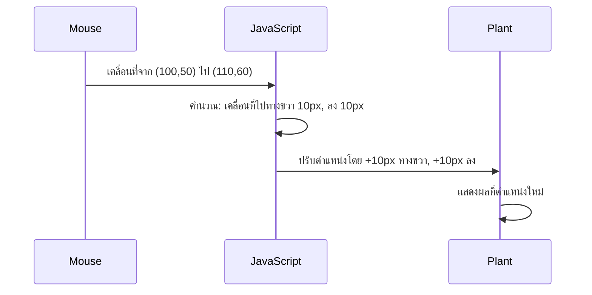
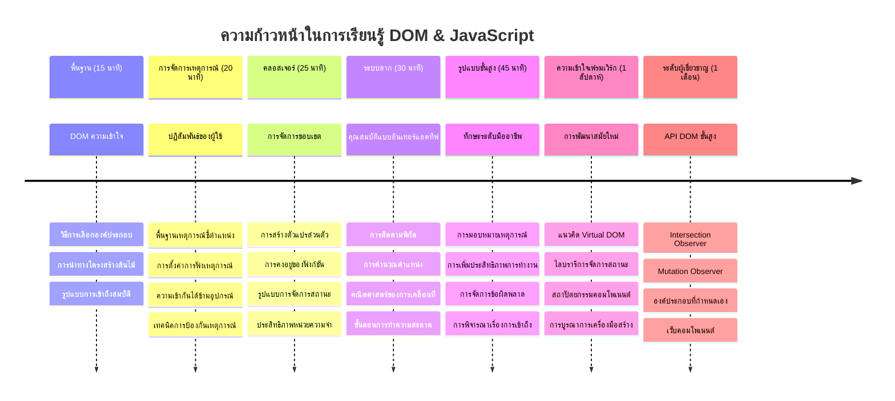

<!--
CO_OP_TRANSLATOR_METADATA:
{
  "original_hash": "973e48ad87d67bf5bb819746c9f8e302",
  "translation_date": "2026-01-06T22:14:50+00:00",
  "source_file": "3-terrarium/3-intro-to-DOM-and-closures/README.md",
  "language_code": "th"
}
-->
# โครงการ Terrarium ตอนที่ 3: การจัดการ DOM และ JavaScript Closures



> สเกตช์โน้ตโดย [Tomomi Imura](https://twitter.com/girlie_mac)

ยินดีต้อนรับสู่หนึ่งในแง่มุมที่น่าตื่นเต้นที่สุดของการพัฒนาเว็บ - การทำให้สิ่งต่าง ๆ มีปฏิสัมพันธ์! Document Object Model (DOM) เหมือนสะพานเชื่อมระหว่าง HTML และ JavaScript ของคุณ และวันนี้เราจะใช้มันเพื่อทำให้ Terrarium ของคุณมีชีวิต เมื่อ Tim Berners-Lee สร้างเว็บเบราว์เซอร์ตัวแรก เขาได้จินตนาการถึงเว็บที่เอกสารสามารถมีความไดนามิกและโต้ตอบได้ - DOM ทำให้วิสัยทัศน์นั้นเป็นไปได้

เรายังจะสำรวจ JavaScript closures ซึ่งฟังดูอาจน่ากลัวในตอนแรก คิดว่า closures เหมือนกับการสร้าง "กระเป๋าความจำ" ที่ฟังก์ชันของคุณสามารถจดจำข้อมูลสำคัญ มันเหมือนกับต้นไม้แต่ละต้นใน Terrarium ของคุณมีบันทึกข้อมูลของตัวเองเพื่อติดตามตำแหน่ง เมื่อจบบทเรียนนี้ คุณจะเข้าใจว่ามันเป็นสิ่งที่ธรรมชาติและมีประโยชน์อย่างไร

นี่คือสิ่งที่เรากำลังสร้าง: Terrarium ที่ผู้ใช้สามารถลากและวางต้นไม้ได้ทุกที่ที่ต้องการ คุณจะได้เรียนรู้เทคนิคการจัดการ DOM ที่ขับเคลื่อนทุกอย่างตั้งแต่การอัปโหลดไฟล์แบบลากแล้ววางไปจนถึงเกมที่มีปฏิสัมพันธ์ มาทำให้ Terrarium ของคุณมีชีวิตกันเถอะ


## แบบทดสอบก่อนบรรยาย

[แบบทดสอบก่อนบรรยาย](https://ff-quizzes.netlify.app/web/quiz/19)

## ทำความเข้าใจกับ DOM: ประตูสู่เว็บเพจที่มีปฏิสัมพันธ์ของคุณ

Document Object Model (DOM) คือวิธีที่ JavaScript สื่อสารกับองค์ประกอบ HTML ของคุณ เมื่อเบราว์เซอร์ของคุณโหลดหน้า HTML มันจะสร้างโครงสร้างที่มีรูปแบบของหน้านั้นในหน่วยความจำ - นั่นคือ DOM คิดว่ามันเหมือนกับต้นไม้ครอบครัวที่สมาชิกในครอบครัวแต่ละคนคือตัว HTML ที่ JavaScript สามารถเข้าถึง แก้ไข หรือจัดเรียงใหม่ได้

การจัดการ DOM เปลี่ยนหน้าที่นิ่งให้กลายเป็นเว็บไซต์ที่มีปฏิสัมพันธ์ ทุกครั้งที่คุณเห็นปุ่มเปลี่ยนสีเมื่อเอาเมาส์วาง เห็นเนื้อหาอัปเดตโดยไม่ต้องรีเฟรชหน้า หรือองค์ประกอบที่คุณลากไปมาได้ นั่นคือการทำงานของการจัดการ DOM




> การแสดงภาพของ DOM และเครื่องหมาย HTML ที่อ้างอิงถึงมัน จาก [Olfa Nasraoui](https://www.researchgate.net/publication/221417012_Profile-Based_Focused_Crawler_for_Social_Media-Sharing_Websites)

**สิ่งที่ทำให้ DOM มีพลัง:**
- **จัดหา** วิธีที่มีโครงสร้างเพื่อเข้าถึงองค์ประกอบใด ๆ บนหน้าเว็บของคุณ
- **เปิดใช้งาน** การอัปเดตเนื้อหาไดนามิกโดยไม่ต้องรีเฟรชหน้า
- **อนุญาต** ให้ตอบสนองแบบเรียลไทม์ต่อปฏิสัมพันธ์ผู้ใช้ เช่น คลิกและลาก
- **สร้าง** รากฐานสำหรับแอปพลิเคชันเว็บที่มีปฏิสัมพันธ์สมัยใหม่

## JavaScript Closures: การสร้างโค้ดที่เป็นระเบียบและทรงพลัง

[JavaScript closure](https://developer.mozilla.org/docs/Web/JavaScript/Closures) เหมือนกับการให้ฟังก์ชันมีพื้นที่ทำงานส่วนตัวของตัวเองพร้อมหน่วยความจำที่คงอยู่ ลองนึกถึงนกฟินช์ของดาร์วินในหมู่เกาะกาลาปากอสที่แต่ละตัวพัฒนาจงอยปากเฉพาะขึ้นตามสภาพแวดล้อมเฉพาะ - closures ทำงานในลักษณะเดียวกัน คือสร้างฟังก์ชันเฉพาะที่ "จดจำ" บริบทเฉพาะของมันถึงแม้ว่าฟังก์ชันแม่จะทำงานเสร็จแล้ว

ใน Terrarium ของเรา closures ช่วยให้ต้นไม้แต่ละต้นจดจำตำแหน่งของตัวเองอย่างอิสระ รูปแบบนี้พบได้ทั่วไปในการพัฒนาจริงของ JavaScript ทำให้เป็นแนวคิดที่มีคุณค่าในการเข้าใจ


> 💡 **ทำความเข้าใจ Closures**: Closures เป็นหัวข้อสำคัญใน JavaScript และนักพัฒนาหลายคนใช้มันมาหลายปีก่อนที่จะเข้าใจทุกแง่มุมทางทฤษฎี วันนี้เราจะเน้นไปที่การประยุกต์ใช้ในทางปฏิบัติ - คุณจะเห็น closures ปรากฏขึ้นเองตามธรรมชาติเมื่อเราสร้างฟีเจอร์ที่มีปฏิสัมพันธ์ ความเข้าใจจะพัฒนาขึ้นเมื่อคุณเห็นว่ามันแก้ปัญหาจริงอย่างไร


> การแสดงภาพของ DOM และเครื่องหมาย HTML ที่อ้างอิงถึงมัน จาก [Olfa Nasraoui](https://www.researchgate.net/publication/221417012_Profile-Based_Focused_Crawler_for_Social_Media-Sharing_Websites)

ในบทเรียนนี้ เราจะทำโปรเจกต์ Terrarium ที่มีปฏิสัมพันธ์เสร็จสมบูรณ์โดยการสร้าง JavaScript ที่จะช่วยให้ผู้ใช้จัดการต้นไม้บนหน้าเว็บได้

## ก่อนที่เราจะเริ่ม: การเตรียมตัวสู่ความสำเร็จ

คุณจะต้องใช้ไฟล์ HTML และ CSS จากบทเรียน Terrarium ก่อนหน้านี้ - เรากำลังจะทำให้ดีไซน์ที่นิ่งนั้นมีปฏิสัมพันธ์ หากคุณเข้าร่วมเป็นครั้งแรก การทำบทเรียนก่อนหน้านี้ให้เสร็จก่อนจะช่วยให้เข้าใจบริบทที่สำคัญ

นี่คือสิ่งที่เราจะสร้าง:
- **ลากแล้ววางอย่างราบรื่น** สำหรับต้นไม้ทั้งหมดใน Terrarium
- **ติดตามพิกัดตำแหน่ง** เพื่อให้ต้นไม้จำตำแหน่งของตัวเองได้
- **อินเทอร์เฟซแบบโต้ตอบครบถ้วน** โดยใช้ vanilla JavaScript
- **โค้ดที่สะอาดและเป็นระเบียบ** โดยใช้รูปแบบ closure

## การตั้งค่าไฟล์ JavaScript ของคุณ

มาสร้างไฟล์ JavaScript ที่จะทำให้ Terrarium ของคุณมีปฏิสัมพันธ์กันเถอะ

**ขั้นตอนที่ 1: สร้างไฟล์สคริปต์**

ในโฟลเดอร์ Terrarium ของคุณ สร้างไฟล์ชื่อว่า `script.js`

**ขั้นตอนที่ 2: เชื่อมโยง JavaScript กับ HTML ของคุณ**

เพิ่มแท็กสคริปต์นี้ในส่วน `<head>` ของไฟล์ `index.html` ของคุณ:

```html
<script src="./script.js" defer></script>
```

**ทำไมแอตทริบิวต์ `defer` ถึงสำคัญ:**
- **รับประกัน** ว่า JavaScript ของคุณจะรอจนกว่า HTML ทั้งหมดจะโหลดเสร็จ
- **ป้องกัน** ความผิดพลาดที่เกิดขึ้นเมื่อ JavaScript มองหาองค์ประกอบที่ยังไม่พร้อม
- **รับรอง** ว่าองค์ประกอบต้นไม้ทั้งหมดพร้อมสำหรับการโต้ตอบ
- **ให้ประสิทธิภาพดีกว่าการวางสคริปต์ไว้ที่ส่วนล่างของหน้า**

> ⚠️ **หมายเหตุสำคัญ**: แอตทริบิวต์ `defer` ป้องกันปัญหาเกี่ยวกับลำดับเวลาโดยทั่วไป หากไม่มีมัน JavaScript อาจพยายามเข้าถึงองค์ประกอบ HTML ก่อนที่มันจะโหลด ทำให้เกิดความผิดพลาด

---

## การเชื่อม JavaScript กับองค์ประกอบ HTML ของคุณ

ก่อนที่เราจะทำให้องค์ประกอบสามารถลากได้ JavaScript จำเป็นต้องหาองค์ประกอบเหล่านั้นใน DOM คิดว่านี่เหมือนระบบจัดหมวดหมู่ห้องสมุด - เมื่อคุณมีหมายเลขในบล็อก คุณจะสามารถหารายการหนังสือที่ต้องการและเข้าถึงเนื้อหาทั้งหมด

เราจะใช้วิธี `document.getElementById()` เพื่อสร้างการเชื่อมต่อเหล่านี้ มันเหมือนกับระบบแฟ้มที่แม่นยำ - คุณให้ ID และมันค้นหาองค์ประกอบที่ต้องการใน HTML ของคุณอย่างแม่นยำ

### เปิดใช้งานฟังก์ชันลากสำหรับต้นไม้ทั้งหมด

เพิ่มโค้ดนี้ในไฟล์ `script.js` ของคุณ:

```javascript
// เปิดใช้งานฟังก์ชันการลากสำหรับพืชทั้ง 14 ชนิด
dragElement(document.getElementById('plant1'));
dragElement(document.getElementById('plant2'));
dragElement(document.getElementById('plant3'));
dragElement(document.getElementById('plant4'));
dragElement(document.getElementById('plant5'));
dragElement(document.getElementById('plant6'));
dragElement(document.getElementById('plant7'));
dragElement(document.getElementById('plant8'));
dragElement(document.getElementById('plant9'));
dragElement(document.getElementById('plant10'));
dragElement(document.getElementById('plant11'));
dragElement(document.getElementById('plant12'));
dragElement(document.getElementById('plant13'));
dragElement(document.getElementById('plant14'));
```

**สิ่งที่โค้ดนี้ทำได้:**
- **ค้นหา** องค์ประกอบต้นไม้แต่ละต้นใน DOM โดยใช้ ID ที่ไม่ซ้ำกัน
- **ดึงข้อมูลอ้างอิงของ JavaScript** ไปยังองค์ประกอบ HTML แต่ละอัน
- **ส่งผ่าน** องค์ประกอบแต่ละอันไปยังฟังก์ชัน `dragElement` (ซึ่งเราจะสร้างขึ้นในขั้นตอนถัดไป)
- **เตรียม** ทุกต้นไม้สำหรับการลากแล้ววาง
- **เชื่อมโครงสร้าง HTML** ของคุณกับฟังก์ชันการทำงานของ JavaScript

> 🎯 **ทำไมต้องใช้ ID แทนคลาส?** ID ให้ตัวบ่งชี้ที่ไม่ซ้ำสำหรับองค์ประกอบเฉพาะ ในขณะที่คลาส CSS ถูกออกแบบมาเพื่อจัดสไตล์กลุ่มขององค์ประกอบ เมื่อ JavaScript ต้องจัดการกับองค์ประกอบที่เป็นรายบุคคล ID ให้ความแม่นยำและประสิทธิภาพที่เราต้องการ

> 💡 **เคล็ดลับมือโปร**: สังเกตว่าพวกเรากำลังเรียก `dragElement()` สำหรับต้นไม้แต่ละต้นแยกกัน วิธีนี้รับประกันว่าต้นไม้แต่ละต้นจะได้พฤติกรรมการลากอิสระของตัวเอง ซึ่งจำเป็นสำหรับประสบการณ์ผู้ใช้ที่ราบรื่น

### 🔄 **ตรวจเช็คการเรียนรู้**
**ความเข้าใจการเชื่อมต่อ DOM**: ก่อนที่จะไปขั้นตอนการลาก ให้ตรวจสอบว่าคุณสามารถ:
- ✅ อธิบายว่า `document.getElementById()` ค้นหาองค์ประกอบ HTML อย่างไร
- ✅ เข้าใจว่าทำไมเราต้องใช้ ID ที่ไม่ซ้ำสำหรับต้นไม้แต่ละต้น
- ✅ อธิบายวัตถุประสงค์ของแอตทริบิวต์ `defer` ในแท็กสคริปต์
- ✅ รับรู้ว่าการเชื่อม JavaScript กับ HTML ผ่าน DOM เป็นอย่างไร

**แบบทดสอบตนเองอย่างรวดเร็ว**: จะเกิดอะไรขึ้นถ้าองค์ประกอบสองตัวมี ID เหมือนกัน? ทำไม `getElementById()` ถึงคืนค่าแค่หนึ่งองค์ประกอบ?
*คำตอบ: ID ควรไม่ซ้ำกัน ถ้าซ้ำก็จะคืนแค่รายการแรก*

---

## การสร้าง Closure สำหรับการลากองค์ประกอบ

ตอนนี้เราจะสร้างหัวใจของฟังก์ชันการลากของเรา: closure ที่จัดการพฤติกรรมการลากสำหรับแต่ละต้นไม้ closure นี้จะมีฟังก์ชันย่อยหลายตัวทำงานร่วมกันเพื่อติดตามการเคลื่อนที่ของเมาส์และอัปเดตตำแหน่งองค์ประกอบ

Closures เหมาะสำหรับงานนี้เพราะอนุญาตให้เราสร้างตัวแปร "ส่วนตัว" ที่คงอยู่ระหว่างการเรียกใช้ฟังก์ชัน ทำให้ต้นไม้แต่ละต้นมีระบบติดตามพิกัดของตัวเองอย่างอิสระ

### ทำความเข้าใจ Closures ผ่านตัวอย่างง่าย ๆ

ให้ฉันสาธิต closures ด้วยตัวอย่างง่ายที่แสดงแนวคิดนี้:

```javascript
function createCounter() {
    let count = 0; // นี่เหมือนกับตัวแปรส่วนตัว
    
    function increment() {
        count++; // ฟังก์ชันภายในจดจำตัวแปรภายนอก
        return count;
    }
    
    return increment; // เรากำลังส่งคืนฟังก์ชันภายใน
}

const myCounter = createCounter();
console.log(myCounter()); // 1
console.log(myCounter()); // 2
```

**สิ่งที่เกิดขึ้นในรูปแบบ closure นี้:**
- **สร้าง** ตัวแปรส่วนตัว `count` ที่มีอยู่แค่ใน closure นี้
- **ฟังก์ชันภายใน** สามารถเข้าถึงและแก้ไขตัวแปรภายนอกนี้ได้ (กลไกของ closure)
- **เมื่อเราคืนค่า** ฟังก์ชันภายใน มันจะยังคงเชื่อมโยงกับข้อมูลส่วนตัวนั้น
- **แม้หลังจาก** `createCounter()` ทำงานเสร็จแล้ว `count` ก็ยังคงอยู่และจดจำค่าของมัน

### ทำไม Closures จึงเหมาะกับฟังก์ชันการลาก

สำหรับ Terrarium ของเรา ต้นไม้แต่ละต้นต้องจดจำพิกัดตำแหน่งปัจจุบันของมัน Closures ให้ทางออกที่สมบูรณ์แบบ:

**ประโยชน์หลักสำหรับโปรเจกต์ของเรา:**
- **รักษา** ตัวแปรตำแหน่งส่วนตัวสำหรับต้นไม้แต่ละต้นอย่างอิสระ
- **เก็บรักษา** ข้อมูลพิกัดระหว่างเหตุการณ์ลาก
- **ป้องกัน** ความขัดแย้งของตัวแปรระหว่างองค์ประกอบที่ลากได้ต่างกัน
- **สร้าง** โครงสร้างโค้ดที่สะอาดและเป็นระเบียบ

> 🎯 **เป้าหมายการเรียนรู้**: คุณไม่จำเป็นต้องเชี่ยวชาญทุกแง่มุมของ closures ตอนนี้ ให้เน้นดูว่ามันช่วยเราในการจัดระเบียบโค้ดและรักษาสถานะสำหรับฟังก์ชันการลากอย่างไร


### การสร้างฟังก์ชัน dragElement

ตอนนี้เรามาสร้างฟังก์ชันหลักที่จะจัดการตรรกะการลากทั้งหมด เพิ่มฟังก์ชันนี้ใต้การประกาศองค์ประกอบต้นไม้ของคุณ:

```javascript
function dragElement(terrariumElement) {
    // เริ่มต้นตัวแปรติดตามตำแหน่ง
    let pos1 = 0,  // ตำแหน่งเมาส์ X ก่อนหน้า
        pos2 = 0,  // ตำแหน่งเมาส์ Y ก่อนหน้า
        pos3 = 0,  // ตำแหน่งเมาส์ X ปัจจุบัน
        pos4 = 0;  // ตำแหน่งเมาส์ Y ปัจจุบัน
    
    // ตั้งค่าตัวฟังเหตุการณ์ลากเริ่มต้น
    terrariumElement.onpointerdown = pointerDrag;
}
```

**ทำความเข้าใจระบบติดตามตำแหน่ง:**
- **`pos1` และ `pos2`**: เก็บความแตกต่างระหว่างตำแหน่งเมาส์เก่าและใหม่
- **`pos3` และ `pos4`**: ติดตามพิกัดเมาส์ปัจจุบัน
- **`terrariumElement`**: องค์ประกอบต้นไม้เฉพาะที่เราจะทำให้ลากได้
- **`onpointerdown`**: เหตุการณ์ที่ทำงานเมื่อผู้ใช้เริ่มลาก

**นี่คือวิธีที่รูปแบบ closure ทำงาน:**
- **สร้าง** ตัวแปรตำแหน่งส่วนตัวสำหรับต้นไม้แต่ละต้น
- **รักษา** ตัวแปรเหล่านี้ตลอดวงจรชีวิตการลาก
- **รับประกัน** ว่าทุกต้นไม้จะติดตามพิกัดของตัวเองอย่างอิสระ
- **ให้** อินเทอร์เฟซที่สะอาดผ่านฟังก์ชัน `dragElement`

### ทำไมต้องใช้เหตุการณ์ Pointer?

คุณอาจสงสัยว่าทำไมเราใช้ `onpointerdown` แทน `onclick` ที่คุ้นเคย ต่อไปนี้คือเหตุผล:

| ประเภทเหตุการณ์ | เหมาะกับ | ข้อจำกัด |
|------------|----------|-------------|
| `onclick` | คลิกปุ่มง่าย ๆ | ไม่รองรับการลาก (แค่คลิกและปล่อย) |
| `onpointerdown` | ทั้งเมาส์และสัมผัส | ใหม่กว่า แต่ได้รับการสนับสนุนดีในปัจจุบัน |
| `onmousedown` | เมาส์บนเดสก์ท็อปเท่านั้น | ไม่รองรับผู้ใช้บนมือถือ |

**ทำไม pointer events ถึงเหมาะสำหรับสิ่งที่เรากำลังสร้าง:**
- **ทำงานได้ดี** ไม่ว่าจะใช้เมาส์ นิ้ว หรือปากกาดิจิทัล
- **รู้สึกเหมือนกัน** บนอุปกรณ์แล็ปท็อป แท็บเล็ต หรือโทรศัพท์
- **จัดการ** การเคลื่อนไหวลากจริง ๆ (ไม่ใช่แค่คลิกเสร็จ)
- **สร้าง** ประสบการณ์ที่ราบรื่นตามที่ผู้ใช้คาดหวังจากเว็บแอปสมัยใหม่

> 💡 **วางแผนสู่อนาคต**: Pointer events คือวิธีสมัยใหม่ในการจัดการปฏิสัมพันธ์ผู้ใช้ แทนที่จะเขียนโค้ดแยกสำหรับเมาส์และสัมผัส คุณจะได้ทั้งสองอย่างฟรี ๆ เจ๋งใช่ไหมล่ะ?

### 🔄 **ตรวจเช็คการเรียนรู้**
**ความเข้าใจการจัดการเหตุการณ์**: หยุดตรวจสอบว่าคุณเข้าใจเหตุการณ์เหล่านี้หรือไม่:
- ✅ ทำไมเราถึงใช้ pointer events แทน mouse events?
- ✅ ตัวแปร closure คงอยู่ระหว่างการเรียกใช้ฟังก์ชันอย่างไร?
- ✅ บทบาทของ `preventDefault()` ในการลากที่ราบรื่นคืออะไร?
- ✅ ทำไมเราถึงผูกผู้ฟังเหตุการณ์กับ document แทนองค์ประกอบแต่ละตัว?

**เชื่อมโยงกับโลกจริง**: ลองคิดเกี่ยวกับอินเทอร์เฟซลากแล้ววางที่คุณใช้ทุกวัน:
- **การอัปโหลดไฟล์**: ลากไฟล์เข้าไปในหน้าต่างเบราว์เซอร์
- **บอร์ด Kanban**: ย้ายงานระหว่างคอลัมน์
- **แกลเลอรีรูปภาพ**: จัดเรียงลำดับภาพใหม่
- **อินเทอร์เฟซมือถือ**: ปัดและลากบนจอสัมผัส

---

## ฟังก์ชัน pointerDrag: การจับการเริ่มต้นลาก

เมื่อผู้ใช้กดลงบนต้นไม้ (ไม่ว่าจะด้วยคลิกเมาส์หรือสัมผัสนิ้ว) ฟังก์ชัน `pointerDrag` จะทำงาน ฟังก์ชันนี้จับพิกัดเริ่มต้นและตั้งค่าระบบการลาก

เพิ่มฟังก์ชันนี้ภายใน closure `dragElement` ของคุณ ทันทีหลังบรรทัด `terrariumElement.onpointerdown = pointerDrag;`:

```javascript
function pointerDrag(e) {
    // ป้องกันพฤติกรรมเริ่มต้นของเบราว์เซอร์ (เช่น การเลือกข้อความ)
    e.preventDefault();
    
    // จับตำแหน่งเมาส์/สัมผัสเริ่มต้น
    pos3 = e.clientX;  // พิกัด X ที่การลากเริ่มต้น
    pos4 = e.clientY;  // พิกัด Y ที่การลากเริ่มต้น
    
    // ตั้งค่าตัวฟังเหตุการณ์สำหรับกระบวนการลาก
    document.onpointermove = elementDrag;
    document.onpointerup = stopElementDrag;
}
```

**ทีละขั้นตอน นี่คือสิ่งที่เกิดขึ้น:**
- **ป้องกัน** พฤติกรรมเบราว์เซอร์เริ่มต้นที่อาจรบกวนการลาก
- **บันทึก** พิกัดที่ผู้ใช้เริ่มลากอย่างแม่นยำ
- **ตั้งค่า** ตัวฟังเหตุการณ์สำหรับการเคลื่อนที่ของการลากต่อเนื่อง
- **เตรียม** ระบบเพื่อติดตามการเคลื่อนที่เมาส์/นิ้วทั่วทั้งเอกสาร

### ทำความเข้าใจการป้องกันเหตุการณ์

บรรทัด `e.preventDefault()` มีความสำคัญสำหรับการลากที่ราบรื่น:

**ถ้าไม่ป้องกัน เบราว์เซอร์อาจจะ:**
- **เลือก** ตัวอักษรเมื่อลากผ่านหน้า
- **เรียกใช้** เมนูบริบทเมื่อคลิกขวาลาก
- **รบกวน** พฤติกรรมลากแบบกำหนดเองของเรา
- **สร้าง** ความผิดปกติทางสายตาระหว่างการลาก

> 🔍 **ทดลอง**: หลังจากเรียนบทนี้ ลองลบ `e.preventDefault()` ดูและสังเกตว่ามันส่งผลต่อประสบการณ์การลากอย่างไร คุณจะเข้าใจทันทีว่าทำไมบรรทัดนี้ถึงสำคัญ!

### ระบบติดตามพิกัด

คุณสมบัติ `e.clientX` และ `e.clientY` ให้พิกัดเมาส์/สัมผัสที่แม่นยำ:

| คุณสมบัติ | วัดอะไร | กรณีใช้งาน |
|----------|------------------|----------|
| `clientX` | ตำแหน่งแนวนอนสัมพันธ์กับมุมมอง | ติดตามการเคลื่อนไหวซ้าย-ขวา |
| `clientY` | ตำแหน่งแนวตั้งสัมพันธ์กับมุมมอง | ติดตามการเคลื่อนไหวขึ้น-ลง |
**ทำความเข้าใจกับพิกัดเหล่านี้:**
- **ให้ข้อมูล** ตำแหน่งที่แม่นยำระดับพิกเซล
- **อัปเดต** แบบเรียลไทม์ขณะที่ผู้ใช้เคลื่อนที่เมาส์ของพวกเขา
- **คงที่** อย่างสม่ำเสมอในหน้าจอขนาดต่าง ๆ และระดับการซูมที่ต่างกัน
- **ช่วยให้** การลากมีความลื่นไหลและตอบสนองได้ดี

### การตั้งค่าตัวฟังเหตุการณ์ระดับเอกสาร

สังเกตว่าทำไมเราถึงผูกเหตุการณ์ move และ stop กับทั้ง `document` ไม่ใช่แค่กับองค์ประกอบต้นไม้:

```javascript
document.onpointermove = elementDrag;
document.onpointerup = stopElementDrag;
```

**ทำไมต้องผูกกับเอกสาร:**
- **ติดตามต่อเนื่อง** แม้เมื่อเมาส์ออกจากองค์ประกอบต้นไม้
- **ป้องกัน** การหยุดชะงักของการลากถ้าผู้ใช้เคลื่อนเมาส์อย่างรวดเร็ว
- **มอบ** การลากที่ลื่นไหลทั่วทั้งหน้าจอ
- **จัดการ** กรณีพิเศษเมื่อเคอร์เซอร์เคลื่อนออกนอกหน้าต่างเบราว์เซอร์

> ⚡ **หมายเหตุด้านประสิทธิภาพ**: เราจะทำความสะอาดตัวฟังเหตุการณ์ระดับเอกสารเหล่านี้เมื่อหยุดลากเพื่อลดการรั่วไหลของหน่วยความจำและปัญหาประสิทธิภาพ

## การทำให้ระบบลากสมบูรณ์: การเคลื่อนที่และการทำความสะอาด

ตอนนี้เราจะเพิ่มฟังก์ชันที่เหลือสองตัวที่จัดการกับการเคลื่อนที่ลากจริงและการทำความสะอาดเมื่อหยุดลาก ฟังก์ชันเหล่านี้ทำงานร่วมกันเพื่อสร้างการเคลื่อนไหวของต้นไม้ที่ลื่นไหลและตอบสนองได้ดีทั่วทั้งเทอร์เรียมของคุณ

### ฟังก์ชัน elementDrag: การติดตามการเคลื่อนที่

เพิ่มฟังก์ชัน `elementDrag` ทันทีหลังปีกกา ปิดของ `pointerDrag`:

```javascript
function elementDrag(e) {
    // คำนวณระยะทางที่เคลื่อนที่ตั้งแต่เหตุการณ์ครั้งล่าสุด
    pos1 = pos3 - e.clientX;  // ระยะทางที่เคลื่อนที่ในแนวนอน
    pos2 = pos4 - e.clientY;  // ระยะทางที่เคลื่อนที่ในแนวตั้ง
    
    // อัปเดตตำแหน่งปัจจุบันที่ติดตามอยู่
    pos3 = e.clientX;  // ตำแหน่ง X ปัจจุบันใหม่
    pos4 = e.clientY;  // ตำแหน่ง Y ปัจจุบันใหม่
    
    // นำการเคลื่อนที่ไปใช้กับตำแหน่งขององค์ประกอบ
    terrariumElement.style.top = (terrariumElement.offsetTop - pos2) + 'px';
    terrariumElement.style.left = (terrariumElement.offsetLeft - pos1) + 'px';
}
```

**ทำความเข้าใจกับคณิตศาสตร์พิกัด:**
- **`pos1` และ `pos2`**: คำนวณระยะทางที่เมาส์เคลื่อนที่ตั้งแต่การอัปเดตก่อนหน้า
- **`pos3` และ `pos4`**: เก็บตำแหน่งเมาส์ปัจจุบันสำหรับการคำนวณครั้งถัดไป
- **`offsetTop` และ `offsetLeft`**: รับตำแหน่งปัจจุบันขององค์ประกอบบนหน้าเพจ
- **ตรรกะการลบออก**: เคลื่อนองค์ประกอบโดยจำนวนเท่าที่เมาส์เคลื่อนที่


**นี่คือตัวอย่างการคำนวณการเคลื่อนที่:**
1. **วัด** ความแตกต่างระหว่างตำแหน่งเมาส์เก่าและใหม่
2. **คำนวณ** ระยะที่ต้องเลื่อนองค์ประกอบตามการเคลื่อนที่ของเมาส์
3. **อัปเดต** คุณสมบัติตำแหน่ง CSS ขององค์ประกอบแบบเรียลไทม์
4. **เก็บ** ตำแหน่งใหม่เป็นฐานสำหรับการคำนวณครั้งต่อไป

### แสดงภาพของคณิตศาสตร์


### ฟังก์ชัน stopElementDrag: การทำความสะอาด

เพิ่มฟังก์ชันทำความสะอาดนี้หลังปีกกาปิดของ `elementDrag`:

```javascript
function stopElementDrag() {
    // ลบตัวฟังเหตุการณ์ในระดับเอกสาร
    document.onpointerup = null;
    document.onpointermove = null;
}
```

**ทำไมการทำความสะอาดจึงสำคัญ:**
- **ป้องกัน** การรั่วไหลของหน่วยความจำจากตัวฟังเหตุการณ์ที่ค้างอยู่
- **หยุด** พฤติกรรมการลากเมื่อผู้ใช้ปล่อยต้นไม้
- **อนุญาต** ให้สามารถลากองค์ประกอบอื่นได้อย่างอิสระ
- **รีเซ็ต** ระบบสำหรับการลากครั้งถัดไป

**สิ่งที่จะเกิดขึ้นถ้าไม่ทำความสะอาด:**
- ตัวฟังเหตุการณ์ยังทำงานต่อแม้หยุดลากแล้ว
- ประสิทธิภาพลดลงเนื่องจากตัวฟังที่ไม่ใช้งานสะสมมากขึ้น
- พฤติกรรมไม่คาดคิดเมื่อโต้ตอบกับองค์ประกอบอื่น
- ทรัพยากรเบราว์เซอร์ถูกใช้งานโดยไม่จำเป็นกับการจัดการเหตุการณ์

### ทำความเข้าใจคุณสมบัติตำแหน่ง CSS

ระบบลากของเราควบคุมคุณสมบัติ CSS สำคัญสองอย่าง:

| คุณสมบัติ | ควบคุมอะไร | เราใช้ยังไง |
|----------|-------------|--------------|
| `top` | ระยะห่างจากขอบบน | การจัดตำแหน่งแนวตั้งระหว่างลาก |
| `left` | ระยะห่างจากขอบซ้าย | การจัดตำแหน่งแนวนอนระหว่างลาก |

**ข้อมูลสำคัญเกี่ยวกับคุณสมบัติ offset:**
- **`offsetTop`**: ระยะห่างปัจจุบันจากขอบบนขององค์ประกอบตำแหน่งที่อยู่เหนือ
- **`offsetLeft`**: ระยะห่างปัจจุบันจากขอบซ้ายขององค์ประกอบตำแหน่งที่อยู่เหนือ
- **บริบทการจัดตำแหน่ง**: ค่าพวกนี้สัมพันธ์กับบรรพบุรุษที่ถูกจัดตำแหน่งใกล้ที่สุด
- **อัปเดตแบบเรียลไทม์**: เปลี่ยนแปลงทันทีเมื่อแก้ไขคุณสมบัติ CSS

> 🎯 **ปรัชญาการออกแบบ**: ระบบลากนี้มีความยืดหยุ่นโดยเจตนา – ไม่มี "โซนปล่อย" หรือข้อจำกัด ผู้ใช้สามารถวางต้นไม้ได้ทุกที่ ทำให้พวกเขาควบคุมการออกแบบเทอร์เรียมได้อย่างสมบูรณ์

## การรวมทุกอย่างเข้าด้วยกัน: ระบบลากสมบูรณ์ของคุณ

ขอแสดงความยินดี! คุณเพิ่งสร้างระบบลากและวางที่ซับซ้อนโดยใช้ JavaScript มาตรฐาน ฟังก์ชัน `dragElement` ของคุณตอนนี้มีปิดล้อมที่ทรงพลังจัดการ:

**สิ่งที่ปิดล้อมของคุณทำได้:**
- **เก็บรักษา** ตัวแปรตำแหน่งส่วนตัวสำหรับต้นไม้แต่ละต้นอย่างอิสระ
- **จัดการ** วงจรชีวิตการลากเต็มรูปแบบตั้งแต่เริ่มต้นถึงสิ้นสุด
- **มอบ** การเคลื่อนไหวที่ลื่นไหลและตอบสนองดีทั่วทั้งหน้าจอ
- **ทำความสะอาด** ทรัพยากรอย่างถูกต้องเพื่อป้องกันการรั่วไหลของหน่วยความจำ
- **สร้าง** อินเทอร์เฟซที่เข้าใจง่ายและสร้างสรรค์สำหรับการออกแบบเทอร์เรียม

### ทดสอบเทอร์เรียมที่โต้ตอบได้ของคุณ

ตอนนี้ทดสอบเทอร์เรียมที่โต้ตอบได้ของคุณ! เปิดไฟล์ `index.html` ในเว็บเบราว์เซอร์แล้วลองใช้งาน:

1. **คลิกและกดค้าง** ที่ต้นไม้ใดก็ได้เพื่อเริ่มลาก
2. **เคลื่อนเมาส์หรือสัมผัส** แล้วดูต้นไม้ตามเคลื่อนอย่างลื่นไหล
3. **ปล่อย** เพื่อวางต้นไม้ในตำแหน่งใหม่
4. **ทดลองจัดวาง** ในรูปแบบต่าง ๆ เพื่อสำรวจอินเทอร์เฟซ

🥇 **ความสำเร็จ**: คุณได้สร้างแอปพลิเคชันเว็บที่โต้ตอบได้เต็มรูปแบบโดยใช้แนวคิดหลักที่นักพัฒนามืออาชีพใช้ทุกวัน ฟังก์ชันลากและวางนี้ใช้หลักการเดียวกับการอัปโหลดไฟล์ บอร์ดคานบัง และอินเทอร์เฟซโต้ตอบอื่น ๆ มากมาย

### 🔄 **ตรวจสอบเชิงการเรียนการสอน**
**ความเข้าใจระบบครบถ้วน**: ยืนยันความชำนาญของคุณในระบบลากทั้งหมด:
- ✅ ปิดล้อมช่วยเก็บสถานะอิสระสำหรับต้นไม้แต่ละต้นอย่างไร?
- ✅ ทำไมคณิตศาสตร์การคำนวณพิกัดถึงจำเป็นสำหรับการเคลื่อนที่ลื่นไหล?
- ✅ จะเกิดอะไรขึ้นถ้าเราลืมทำความสะอาดตัวฟังเหตุการณ์?
- ✅ รูปแบบนี้ขยายตัวเพื่อโต้ตอบที่ซับซ้อนกว่านี้ได้อย่างไร?

**สะท้อนคุณภาพโค้ด**: ทบทวนโซลูชันทั้งหมดของคุณ:
- **ออกแบบแยกส่วน**: แต่ละต้นไม้มีปิดล้อมตัวเอง
- **ประสิทธิภาพเหตุการณ์**: ตั้งค่าและทำความสะอาดตัวฟังเหตุการณ์อย่างถูกต้อง
- **รองรับอุปกรณ์หลากหลาย**: ทำงานได้ทั้งบนเดสก์ท็อปและมือถือ
- **รอบคอบด้านประสิทธิภาพ**: ไม่มีการรั่วไหลของหน่วยความจำหรือการคำนวณซ้ำซ้อน


---

## ความท้าทาย GitHub Copilot Agent 🚀

ใช้โหมด Agent เพื่อทำความท้าทายต่อไปนี้ให้สำเร็จ:

**คำอธิบาย:** ปรับปรุงโครงการเทอร์เรียมโดยเพิ่มฟังก์ชันรีเซ็ตที่ส่งต้นไม้ทั้งหมดกลับตำแหน่งเดิมบนแถบด้านข้างด้วยแอนิเมชันที่ลื่นไหล

**คำสั่ง:** สร้างปุ่มรีเซ็ตที่เมื่อนำเมาส์คลิกแล้วจะทำให้ต้นไม้ทั้งหมดเคลื่อนกลับไปยังตำแหน่งเดิมบนแถบด้านข้างโดยใช้การเปลี่ยนแปลง CSS (CSS transitions) ฟังก์ชันนี้ควรเก็บตำแหน่งดั้งเดิมเมื่อโหลดหน้า และเปลี่ยนตำแหน่งต้นไม้กลับไปอย่างนุ่มนวลภายใน 1 วินาทีเมื่อกดปุ่มรีเซ็ต

เรียนรู้เพิ่มเติมเกี่ยวกับ [agent mode](https://code.visualstudio.com/blogs/2025/02/24/introducing-copilot-agent-mode) ที่นี่

## 🚀 ความท้าทายเพิ่มเติม: ขยายทักษะของคุณ

พร้อมจะยกระดับเทอร์เรียมของคุณหรือยัง? ลองทำการปรับปรุงเหล่านี้:

**ส่วนขยายเชิงสร้างสรรค์:**
- **ดับเบิ้ลคลิก** ที่ต้นไม้เพื่อให้แสดงด้านหน้า (การจัดการ z-index)
- **เพิ่มฟีดแบ็คภาพ** เช่น แสงเรืองอ่อนเล็กน้อยเมื่อโฮเวอร์ต้นไม้
- **กำหนดขอบเขต** เพื่อป้องกันต้นไม้ออกจากเทอร์เรียม
- **สร้างฟังก์ชันบันทึก** ที่จำตำแหน่งต้นไม้โดยใช้ localStorage
- **เพิ่มเสียง** สำหรับการหยิบและวางต้นไม้

> 💡 **โอกาสเรียนรู้**: ความท้าทายเหล่านี้จะช่วยสอนคุณเรื่องการจัดการ DOM การจัดการเหตุการณ์ และการออกแบบประสบการณ์ผู้ใช้

## แบบทดสอบหลังบรรยาย

[แบบทดสอบหลังบรรยาย](https://ff-quizzes.netlify.app/web/quiz/20)

## ทบทวน & ศึกษาด้วยตนเอง: เพิ่มพูนความเข้าใจของคุณ

คุณเชี่ยวชาญพื้นฐานของการจัดการ DOM และปิดล้อมแล้ว แต่ยังมีอีกมากให้สำรวจ! นี่คือเส้นทางในการขยายความรู้และทักษะของคุณ

### แนวทางลากและวางทางเลือก

เราใช้ pointer events เพื่อความยืดหยุ่นสูงสุด แต่การพัฒนาเว็บมีวิธีอื่น ๆ อีกหลายวิธี:

| วิธี | เหมาะกับ | คุณค่าการเรียนรู้ |
|----------|----------|----------------|
| [HTML Drag and Drop API](https://developer.mozilla.org/docs/Web/API/HTML_Drag_and_Drop_API) | การอัปโหลดไฟล์, โซนลากแบบเป็นทางการ | เข้าใจความสามารถของเบราว์เซอร์โดยตรง |
| [Touch Events](https://developer.mozilla.org/docs/Web/API/Touch_events) | การโต้ตอบเฉพาะมือถือ | รูปแบบการพัฒนาแบบ mobile-first |
| คุณสมบัติ CSS `transform` | แอนิเมชันลื่นไหล | เทคนิคการเพิ่มประสิทธิภาพ |

### หัวข้อการจัดการ DOM ขั้นสูง

**ขั้นตอนถัดไปในการเรียนรู้ของคุณ:**
- **การมอบหมายเหตุการณ์ (Event delegation):** จัดการเหตุการณ์อย่างมีประสิทธิภาพสำหรับองค์ประกอบหลายตัว
- **Intersection Observer:** ตรวจจับเมื่อองค์ประกอบเข้าหรือออกจาก viewport
- **Mutation Observer:** เฝ้าดูการเปลี่ยนแปลงโครงสร้าง DOM
- **Web Components:** สร้างองค์ประกอบ UI ที่นำกลับมาใช้ใหม่ได้และแยกส่วน
- **แนวคิด Virtual DOM:** เข้าใจว่ากรอบงานต่าง ๆ เพิ่มประสิทธิภาพการอัปเดต DOM อย่างไร

### แหล่งข้อมูลสำคัญสำหรับการเรียนรู้ต่อเนื่อง

**เอกสารทางเทคนิค:**
- [MDN Pointer Events Guide](https://developer.mozilla.org/docs/Web/API/Pointer_events) - คู่มือเหตุการณ์ pointer ครบถ้วน
- [ข้อกำหนด Pointer Events ของ W3C](https://www.w3.org/TR/pointerevents1/) - เอกสารมาตรฐานอย่างเป็นทางการ
- [เจาะลึก JavaScript Closures](https://developer.mozilla.org/docs/Web/JavaScript/Closures) - รูปแบบปิดล้อมขั้นสูง

**ความเข้ากันได้ของเบราว์เซอร์:**
- [CanIUse.com](https://caniuse.com/) - ตรวจสอบการสนับสนุนฟีเจอร์ต่าง ๆ ในเบราว์เซอร์
- [ข้อมูลความเข้ากันได้ของ MDN](https://github.com/mdn/browser-compat-data) - ข้อมูลความเข้ากันได้อย่างละเอียด

**โอกาสฝึกฝน:**
- **สร้าง** เกมปริศนาโดยใช้กลไกลากคล้ายกัน
- **สร้าง** บอร์ดคานบังพร้อมจัดการงานด้วยลากและวาง
- **ออกแบบ** แกลเลอรีภาพที่สามารถจัดเรียงภาพได้โดยลาก
- **ทดลอง** ใช้ท่าทางสัมผัสสำหรับอินเทอร์เฟซมือถือ

> 🎯 **กลยุทธ์การเรียนรู้**: วิธีที่ดีที่สุดในการทำความเข้าใจแนวคิดเหล่านี้ให้ลึกซึ้งคือฝึกปฏิบัติ ลองสร้างอินเทอร์เฟซที่ลากได้หลายแบบ – แต่ละโปรเจกต์จะสอนคุณเกี่ยวกับการโต้ตอบผู้ใช้และการจัดการ DOM

### ⚡ **สิ่งที่คุณทำได้ใน 5 นาทีถัดไป**
- [ ] เปิด DevTools ของเบราว์เซอร์และพิมพ์ `document.querySelector('body')` ในคอนโซล
- [ ] ลองเปลี่ยนข้อความบนเว็บเพจโดยใช้ `innerHTML` หรือ `textContent`
- [ ] เพิ่มตัวฟังเหตุการณ์คลิกกับปุ่มหรือลิงก์ใดก็ได้บนหน้าเว็บ
- [ ] ตรวจสอบโครงสร้าง DOM ด้วยแผง Elements

### 🎯 **เป้าหมายที่ทำได้ภายในชั่วโมงนี้**
- [ ] ทำแบบทดสอบหลังบทเรียนและทบทวนแนวคิดการจัดการ DOM
- [ ] สร้างเว็บเพจโต้ตอบที่ตอบสนองต่อคลิกผู้ใช้
- [ ] ฝึกจัดการเหตุการณ์กับเหตุการณ์ต่าง ๆ (คลิก, เมาส์โอเวอร์, กดปุ่ม)
- [ ] สร้างรายการสิ่งที่ต้องทำหรือเคาน์เตอร์โดยใช้การจัดการ DOM
- [ ] สำรวจความสัมพันธ์ระหว่างองค์ประกอบ HTML กับวัตถุ JavaScript

### 📅 **เส้นทาง JavaScript ประจำสัปดาห์ของคุณ**
- [ ] ทำโปรเจกต์เทอร์เรียมแบบลากและวางเสร็จสมบูรณ์
- [ ] เชี่ยวชาญการมอบหมายเหตุการณ์เพื่อจัดการเหตุการณ์อย่างมีประสิทธิภาพ
- [ ] เรียนรู้เกี่ยวกับ event loop และ JavaScript แบบอะซิงโครนัส
- [ ] ฝึกสร้างโมดูลด้วยปิดล้อมเพื่อเก็บสถานะส่วนตัว
- [ ] สำรวจ API DOM สมัยใหม่ เช่น Intersection Observer
- [ ] สร้างองค์ประกอบที่โต้ตอบได้โดยไม่ใช้เฟรมเวิร์ก

### 🌟 **เส้นทางความชำนาญ JavaScript ประจำเดือนของคุณ**
- [ ] สร้างแอปพลิเคชันหน้าเดียวที่ซับซ้อนโดยใช้ vanilla JavaScript
- [ ] เรียนเฟรมเวิร์กสมัยใหม่ (React, Vue หรือ Angular) และเปรียบเทียบกับ DOM มาตรฐาน
- [ ] ร่วมพัฒนาโปรเจกต์โอเพ่นซอร์ส JavaScript
- [ ] เชี่ยวชาญแนวคิดขั้นสูง เช่น web components และองค์ประกอบที่กำหนดเอง
- [ ] สร้างเว็บแอปที่มีประสิทธิภาพโดยใช้รูปแบบ DOM ที่เหมาะสม
- [ ] สอนผู้อื่นเกี่ยวกับการจัดการ DOM และพื้นฐาน JavaScript

## 🎯 ไทม์ไลน์ความชำนาญ JavaScript DOM ของคุณ


### 🛠️ สรุปชุดเครื่องมือ JavaScript ของคุณ

หลังจากจบบทเรียนนี้ คุณมี:
- **ความเชี่ยวชาญ DOM:** การเลือกองค์ประกอบ, การจัดการคุณสมบัติ, และการนำทางต้นไม้
- **ความเชี่ยวชาญเหตุการณ์:** การจัดการโต้ตอบข้ามอุปกรณ์ด้วย pointer events
- **ความเข้าใจปิดล้อม:** การจัดการสถานะส่วนตัวและความคงอยู่ของฟังก์ชัน
- **ระบบโต้ตอบ:** การทำลากและวางครบถ้วนตั้งแต่ต้นจนจบ
- **ความตระหนักเรื่องประสิทธิภาพ:** การทำความสะอาดเหตุการณ์และจัดการหน่วยความจำอย่างถูกต้อง
- **รูปแบบสมัยใหม่:** เทคนิคการจัดระเบียบโค้ดที่ใช้ในการพัฒนามืออาชีพ
- **ประสบการณ์ผู้ใช้:** การสร้างอินเทอร์เฟซที่เข้าใจง่ายและตอบสนองดี

**ทักษะมืออาชีพที่ได้รับ:** คุณสร้างฟีเจอร์โดยใช้เทคนิคเดียวกับ:
- **บอร์ด Trello/Kanban:** การลากการ์ดระหว่างคอลัมน์
- **ระบบอัปโหลดไฟล์:** การจัดการลากและวางไฟล์
- **แกลเลอรีภาพ:** อินเทอร์เฟซจัดเรียงภาพถ่าย
- **แอปมือถือ:** รูปแบบการโต้ตอบด้วยสัมผัส

**ระดับถัดไป:** คุณพร้อมสำรวจเฟรมเวิร์กสมัยใหม่ เช่น React, Vue หรือ Angular ที่สร้างอยู่บนแนวคิดพื้นฐานการจัดการ DOM เหล่านี้! 

## Assignment

[Work a bit more with the DOM](assignment.md)

---

<!-- CO-OP TRANSLATOR DISCLAIMER START -->
**ข้อจำกัดความรับผิดชอบ**:  
เอกสารนี้ได้รับการแปลโดยใช้บริการแปลภาษาด้วย AI [Co-op Translator](https://github.com/Azure/co-op-translator) แม้ว่าเราจะพยายามให้ความถูกต้องสูงสุด แต่โปรดทราบว่าการแปลอัตโนมัติอาจมีข้อผิดพลาดหรือความไม่แม่นยำ เอกสารต้นฉบับในภาษาต้นทางถือเป็นแหล่งข้อมูลที่ถูกต้องและเชื่อถือได้ สำหรับข้อมูลสำคัญ แนะนำให้ใช้บริการแปลโดยผู้เชี่ยวชาญทางภาษามนุษย์ เราไม่รับผิดชอบต่อความเข้าใจผิดหรือการตีความที่ผิดพลาดใด ๆ ที่เกิดจากการใช้การแปลนี้
<!-- CO-OP TRANSLATOR DISCLAIMER END -->