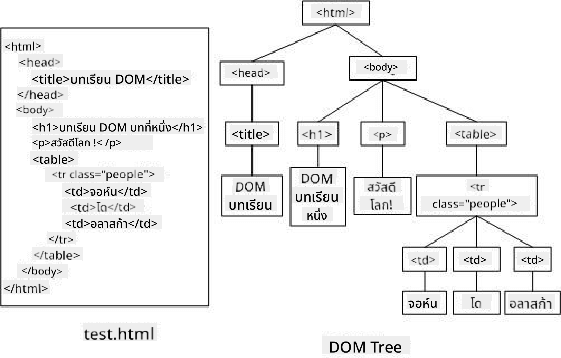
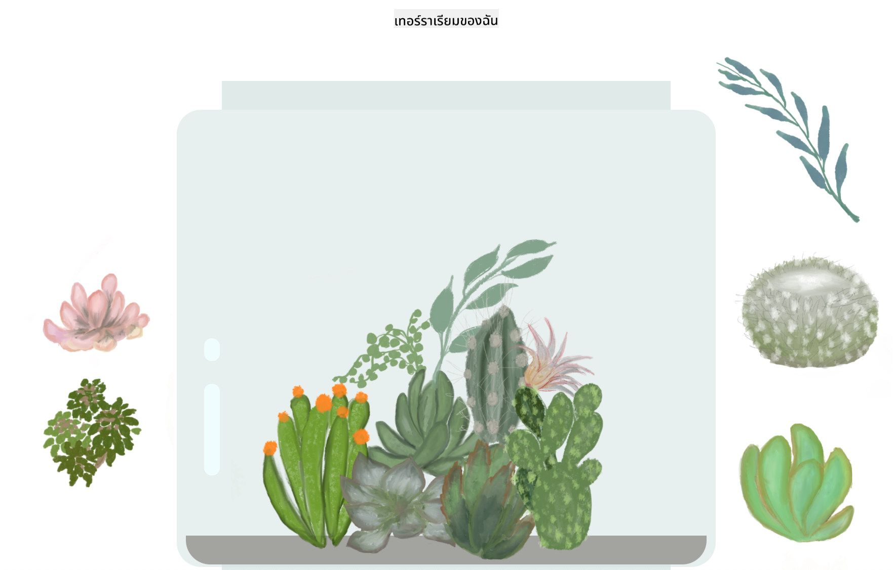

<!--
CO_OP_TRANSLATOR_METADATA:
{
  "original_hash": "61c14b27044861e5e69db35dd52c4403",
  "translation_date": "2025-08-29T07:39:21+00:00",
  "source_file": "3-terrarium/3-intro-to-DOM-and-closures/README.md",
  "language_code": "th"
}
-->
# โครงการ Terrarium ตอนที่ 3: การจัดการ DOM และ Closure


> ภาพสเก็ตโน้ตโดย [Tomomi Imura](https://twitter.com/girlie_mac)

## แบบทดสอบก่อนเรียน

[แบบทดสอบก่อนเรียน](https://ff-quizzes.netlify.app/web/quiz/19)

### บทนำ

การจัดการ DOM หรือ "Document Object Model" เป็นส่วนสำคัญของการพัฒนาเว็บ ตามที่ [MDN](https://developer.mozilla.org/docs/Web/API/Document_Object_Model/Introduction) กล่าวไว้ว่า "Document Object Model (DOM) คือการแสดงข้อมูลของวัตถุที่ประกอบขึ้นเป็นโครงสร้างและเนื้อหาของเอกสารบนเว็บ" ความท้าทายในการจัดการ DOM บนเว็บมักเป็นแรงผลักดันให้ใช้เฟรมเวิร์ก JavaScript แทนการใช้ JavaScript แบบดั้งเดิมเพื่อจัดการ DOM แต่ในบทเรียนนี้เราจะจัดการด้วยตัวเอง!

นอกจากนี้ บทเรียนนี้จะนำเสนอแนวคิดของ [JavaScript closure](https://developer.mozilla.org/docs/Web/JavaScript/Closures) ซึ่งคุณสามารถคิดว่าเป็นฟังก์ชันที่ถูกล้อมรอบด้วยฟังก์ชันอื่น เพื่อให้ฟังก์ชันภายในสามารถเข้าถึงขอบเขตของฟังก์ชันภายนอกได้

> JavaScript closures เป็นหัวข้อที่กว้างและซับซ้อน บทเรียนนี้จะกล่าวถึงแนวคิดพื้นฐานที่สุดที่ในโค้ดของ terrarium คุณจะพบ closure: ฟังก์ชันภายในและฟังก์ชันภายนอกที่ถูกสร้างขึ้นในลักษณะที่อนุญาตให้ฟังก์ชันภายในเข้าถึงขอบเขตของฟังก์ชันภายนอก สำหรับข้อมูลเพิ่มเติมเกี่ยวกับวิธีการทำงานนี้ โปรดเยี่ยมชม [เอกสารที่ครอบคลุม](https://developer.mozilla.org/docs/Web/JavaScript/Closures)

เราจะใช้ closure เพื่อจัดการ DOM

ลองนึกถึง DOM ว่าเป็นต้นไม้ที่แสดงถึงวิธีการทั้งหมดที่เอกสารหน้าเว็บสามารถถูกจัดการได้ มี API (Application Program Interfaces) ต่าง ๆ ที่ถูกเขียนขึ้นเพื่อให้โปรแกรมเมอร์สามารถเข้าถึง DOM และแก้ไข เปลี่ยนแปลง จัดเรียงใหม่ และจัดการได้ตามต้องการ



> การแสดง DOM และ HTML markup ที่อ้างถึงมัน จาก [Olfa Nasraoui](https://www.researchgate.net/publication/221417012_Profile-Based_Focused_Crawler_for_Social_Media-Sharing_Websites)

ในบทเรียนนี้ เราจะทำโครงการ terrarium แบบโต้ตอบให้เสร็จสมบูรณ์โดยสร้าง JavaScript ที่จะช่วยให้ผู้ใช้สามารถจัดการพืชบนหน้าเว็บได้

### สิ่งที่ต้องเตรียม

คุณควรมี HTML และ CSS สำหรับ terrarium ของคุณพร้อมแล้ว เมื่อจบบทเรียนนี้ คุณจะสามารถย้ายพืชเข้าและออกจาก terrarium โดยการลากและวางได้

### งานที่ต้องทำ

ในโฟลเดอร์ terrarium ของคุณ สร้างไฟล์ใหม่ชื่อ `script.js` และนำเข้าไฟล์นั้นในส่วน `<head>`:

```html
	<script src="./script.js" defer></script>
```

> หมายเหตุ: ใช้ `defer` เมื่อนำเข้าไฟล์ JavaScript ภายนอกในไฟล์ html เพื่อให้ JavaScript ทำงานหลังจากไฟล์ HTML ถูกโหลดเสร็จสมบูรณ์ คุณสามารถใช้ attribute `async` ได้เช่นกัน ซึ่งอนุญาตให้สคริปต์ทำงานขณะ HTML กำลังถูกแปลง แต่ในกรณีของเรา สิ่งสำคัญคือการมีองค์ประกอบ HTML พร้อมใช้งานสำหรับการลากก่อนที่เราจะอนุญาตให้สคริปต์ลากทำงาน
---

## องค์ประกอบ DOM

สิ่งแรกที่คุณต้องทำคือสร้างการอ้างอิงไปยังองค์ประกอบที่คุณต้องการจัดการใน DOM ในกรณีของเรา คือพืช 14 ชนิดที่รออยู่ในแถบด้านข้าง

### งานที่ต้องทำ

```html
dragElement(document.getElementById('plant1'));
dragElement(document.getElementById('plant2'));
dragElement(document.getElementById('plant3'));
dragElement(document.getElementById('plant4'));
dragElement(document.getElementById('plant5'));
dragElement(document.getElementById('plant6'));
dragElement(document.getElementById('plant7'));
dragElement(document.getElementById('plant8'));
dragElement(document.getElementById('plant9'));
dragElement(document.getElementById('plant10'));
dragElement(document.getElementById('plant11'));
dragElement(document.getElementById('plant12'));
dragElement(document.getElementById('plant13'));
dragElement(document.getElementById('plant14'));
```

เกิดอะไรขึ้นที่นี่? คุณกำลังอ้างอิงเอกสารและค้นหาใน DOM เพื่อหาองค์ประกอบที่มี Id เฉพาะ จำได้ไหมว่าในบทเรียนแรกเกี่ยวกับ HTML คุณได้ให้ Id เฉพาะแก่แต่ละภาพพืช (`id="plant1"`)? ตอนนี้คุณจะใช้ประโยชน์จากความพยายามนั้น หลังจากระบุองค์ประกอบแต่ละรายการ คุณส่งรายการนั้นไปยังฟังก์ชันที่เรียกว่า `dragElement` ซึ่งคุณจะสร้างในอีกสักครู่ ดังนั้นองค์ประกอบใน HTML จะสามารถลากได้ หรือจะสามารถลากได้ในไม่ช้า

✅ ทำไมเราถึงอ้างอิงองค์ประกอบโดย Id? ทำไมไม่ใช้ CSS class? คุณอาจอ้างอิงบทเรียนก่อนหน้านี้เกี่ยวกับ CSS เพื่อหาคำตอบสำหรับคำถามนี้

---

## Closure

ตอนนี้คุณพร้อมที่จะสร้าง closure `dragElement` ซึ่งเป็นฟังก์ชันภายนอกที่ล้อมรอบฟังก์ชันภายในหนึ่งหรือหลายฟังก์ชัน (ในกรณีของเรา เราจะมีสามฟังก์ชัน)

Closure มีประโยชน์เมื่อฟังก์ชันหนึ่งหรือหลายฟังก์ชันต้องการเข้าถึงขอบเขตของฟังก์ชันภายนอก นี่คือตัวอย่าง:

```javascript
function displayCandy(){
	let candy = ['jellybeans'];
	function addCandy(candyType) {
		candy.push(candyType)
	}
	addCandy('gumdrops');
}
displayCandy();
console.log(candy)
```

ในตัวอย่างนี้ ฟังก์ชัน `displayCandy` ล้อมรอบฟังก์ชันที่เพิ่มประเภทขนมใหม่ลงในอาร์เรย์ที่มีอยู่ในฟังก์ชัน หากคุณเรียกใช้โค้ดนี้ อาร์เรย์ `candy` จะไม่ถูกกำหนดค่า เนื่องจากมันเป็นตัวแปรท้องถิ่น (ท้องถิ่นต่อ closure)

✅ คุณจะทำให้อาร์เรย์ `candy` เข้าถึงได้อย่างไร? ลองย้ายมันออกไปนอก closure ด้วยวิธีนี้ อาร์เรย์จะกลายเป็น global แทนที่จะยังคงอยู่ในขอบเขตท้องถิ่นของ closure

### งานที่ต้องทำ

ภายใต้การประกาศองค์ประกอบใน `script.js` สร้างฟังก์ชัน:

```javascript
function dragElement(terrariumElement) {
	//set 4 positions for positioning on the screen
	let pos1 = 0,
		pos2 = 0,
		pos3 = 0,
		pos4 = 0;
	terrariumElement.onpointerdown = pointerDrag;
}
```

`dragElement` ได้รับวัตถุ `terrariumElement` จากการประกาศที่ด้านบนของสคริปต์ จากนั้นคุณตั้งค่าตำแหน่งท้องถิ่นที่ `0` สำหรับวัตถุที่ส่งผ่านไปยังฟังก์ชัน นี่คือตัวแปรท้องถิ่นที่จะถูกจัดการสำหรับแต่ละองค์ประกอบเมื่อคุณเพิ่มฟังก์ชันลากและวางภายใน closure ให้กับแต่ละองค์ประกอบ Terrarium จะถูกเติมเต็มด้วยองค์ประกอบที่ถูกลากเหล่านี้ ดังนั้นแอปพลิเคชันจำเป็นต้องติดตามตำแหน่งที่วางไว้

นอกจากนี้ `terrariumElement` ที่ถูกส่งไปยังฟังก์ชันนี้จะถูกกำหนดเหตุการณ์ `pointerdown` ซึ่งเป็นส่วนหนึ่งของ [web APIs](https://developer.mozilla.org/docs/Web/API) ที่ออกแบบมาเพื่อช่วยในการจัดการ DOM `onpointerdown` จะทำงานเมื่อปุ่มถูกกด หรือในกรณีของเรา เมื่อองค์ประกอบที่สามารถลากได้ถูกสัมผัส เหตุการณ์นี้ทำงานได้ทั้ง [เว็บและเบราว์เซอร์มือถือ](https://caniuse.com/?search=onpointerdown) โดยมีข้อยกเว้นบางประการ

✅ [เหตุการณ์ `onclick`](https://developer.mozilla.org/docs/Web/API/GlobalEventHandlers/onclick) มีการสนับสนุนข้ามเบราว์เซอร์มากกว่า; ทำไมคุณถึงไม่ใช้มันที่นี่? ลองคิดถึงประเภทของการโต้ตอบหน้าจอที่คุณพยายามสร้างที่นี่

---

## ฟังก์ชัน Pointerdrag

`terrariumElement` พร้อมที่จะถูกลากไปรอบ ๆ เมื่อเหตุการณ์ `onpointerdown` ถูกเรียกใช้ ฟังก์ชัน `pointerDrag` จะถูกเรียกใช้ เพิ่มฟังก์ชันนั้นใต้บรรทัดนี้: `terrariumElement.onpointerdown = pointerDrag;`:

### งานที่ต้องทำ

```javascript
function pointerDrag(e) {
	e.preventDefault();
	console.log(e);
	pos3 = e.clientX;
	pos4 = e.clientY;
}
```

มีหลายสิ่งเกิดขึ้นที่นี่ อย่างแรก คุณป้องกันเหตุการณ์เริ่มต้นที่ปกติจะเกิดขึ้นเมื่อ pointerdown โดยใช้ `e.preventDefault();` ด้วยวิธีนี้คุณจะมีการควบคุมพฤติกรรมของอินเทอร์เฟซมากขึ้น

> กลับมาที่บรรทัดนี้เมื่อคุณสร้างไฟล์สคริปต์เสร็จสมบูรณ์และลองใช้โดยไม่มี `e.preventDefault()` - จะเกิดอะไรขึ้น?

ถัดไป เปิด `index.html` ในหน้าต่างเบราว์เซอร์ และตรวจสอบอินเทอร์เฟซ เมื่อคุณคลิกที่พืช คุณจะเห็นว่าเหตุการณ์ 'e' ถูกจับ ลองเจาะลึกเข้าไปในเหตุการณ์เพื่อดูว่ามีข้อมูลมากแค่ไหนที่ถูกรวบรวมโดยเหตุการณ์ pointer down เพียงครั้งเดียว!

จากนั้น สังเกตว่าตัวแปรท้องถิ่น `pos3` และ `pos4` ถูกตั้งค่าเป็น e.clientX คุณสามารถค้นหาค่าของ `e` ในหน้าต่างตรวจสอบ ค่าพวกนี้จับพิกัด x และ y ของพืชในขณะที่คุณคลิกหรือสัมผัสมัน คุณจะต้องควบคุมพฤติกรรมของพืชอย่างละเอียดเมื่อคุณคลิกและลากมัน ดังนั้นคุณจึงติดตามพิกัดของมัน

✅ มันชัดเจนขึ้นหรือยังว่าทำไมแอปนี้ถึงถูกสร้างด้วย closure ขนาดใหญ่? ถ้าไม่ใช่ closure คุณจะรักษาขอบเขตสำหรับพืชที่สามารถลากได้ทั้ง 14 ชนิดได้อย่างไร?

ทำฟังก์ชันเริ่มต้นให้เสร็จโดยเพิ่มการจัดการเหตุการณ์ pointer อีกสองรายการใต้ `pos4 = e.clientY`:

```html
document.onpointermove = elementDrag;
document.onpointerup = stopElementDrag;
```

ตอนนี้คุณกำลังระบุว่าคุณต้องการให้พืชถูกลากไปพร้อมกับ pointer ขณะที่คุณเคลื่อนมัน และให้การลากหยุดเมื่อคุณยกเลิกการเลือกพืช `onpointermove` และ `onpointerup` เป็นส่วนหนึ่งของ API เดียวกันกับ `onpointerdown` อินเทอร์เฟซจะโยนข้อผิดพลาดในตอนนี้เนื่องจากคุณยังไม่ได้กำหนดฟังก์ชัน `elementDrag` และ `stopElementDrag` ดังนั้นสร้างฟังก์ชันเหล่านั้นต่อไป

## ฟังก์ชัน elementDrag และ stopElementDrag

คุณจะทำ closure ให้เสร็จสมบูรณ์โดยเพิ่มฟังก์ชันภายในอีกสองฟังก์ชันที่จะจัดการสิ่งที่เกิดขึ้นเมื่อคุณลากพืชและหยุดลากมัน พฤติกรรมที่คุณต้องการคือคุณสามารถลากพืชใด ๆ ได้ทุกเมื่อและวางมันไว้ที่ใดก็ได้บนหน้าจอ อินเทอร์เฟซนี้ค่อนข้างไม่จำกัด (ไม่มี drop zone ตัวอย่างเช่น) เพื่อให้คุณสามารถออกแบบ terrarium ของคุณได้ตามที่คุณต้องการโดยการเพิ่ม ลบ และจัดตำแหน่งพืชใหม่

### งานที่ต้องทำ

เพิ่มฟังก์ชัน `elementDrag` หลังจากปิดวงเล็บปีกกาของ `pointerDrag`:

```javascript
function elementDrag(e) {
	pos1 = pos3 - e.clientX;
	pos2 = pos4 - e.clientY;
	pos3 = e.clientX;
	pos4 = e.clientY;
	console.log(pos1, pos2, pos3, pos4);
	terrariumElement.style.top = terrariumElement.offsetTop - pos2 + 'px';
	terrariumElement.style.left = terrariumElement.offsetLeft - pos1 + 'px';
}
```

ในฟังก์ชันนี้ คุณทำการแก้ไขตำแหน่งเริ่มต้น 1-4 ที่คุณตั้งค่าเป็นตัวแปรท้องถิ่นในฟังก์ชันภายนอก เกิดอะไรขึ้นที่นี่?

ขณะที่คุณลาก คุณกำหนดค่าใหม่ให้กับ `pos1` โดยทำให้มันเท่ากับ `pos3` (ซึ่งคุณตั้งค่าไว้ก่อนหน้านี้เป็น `e.clientX`) ลบด้วยค่าปัจจุบันของ `e.clientX` คุณทำการดำเนินการที่คล้ายกันกับ `pos2` จากนั้นคุณตั้งค่าใหม่ให้กับ `pos3` และ `pos4` เป็นพิกัด X และ Y ใหม่ขององค์ประกอบ คุณสามารถดูการเปลี่ยนแปลงเหล่านี้ในคอนโซลขณะที่คุณลาก จากนั้นคุณจัดการสไตล์ css ของพืชเพื่อกำหนดตำแหน่งใหม่ของมันตามตำแหน่งใหม่ของ `pos1` และ `pos2` โดยคำนวณพิกัด X และ Y ด้านบนและด้านซ้ายของพืชโดยเปรียบเทียบ offset ของมันกับตำแหน่งใหม่เหล่านี้

> `offsetTop` และ `offsetLeft` เป็นคุณสมบัติ CSS ที่กำหนดตำแหน่งขององค์ประกอบตามตำแหน่งของ parent; parent สามารถเป็นองค์ประกอบใดก็ได้ที่ไม่ได้ถูกกำหนดตำแหน่งเป็น `static`

การคำนวณตำแหน่งใหม่ทั้งหมดนี้ช่วยให้คุณปรับแต่งพฤติกรรมของ terrarium และพืชของมันได้อย่างละเอียด

### งานที่ต้องทำ

งานสุดท้ายเพื่อทำให้อินเทอร์เฟซสมบูรณ์คือการเพิ่มฟังก์ชัน `stopElementDrag` หลังจากปิดวงเล็บปีกกาของ `elementDrag`:

```javascript
function stopElementDrag() {
	document.onpointerup = null;
	document.onpointermove = null;
}
```

ฟังก์ชันเล็ก ๆ นี้รีเซ็ตเหตุการณ์ `onpointerup` และ `onpointermove` เพื่อให้คุณสามารถเริ่มต้นความคืบหน้าของพืชใหม่ได้โดยเริ่มลากมันอีกครั้ง หรือเริ่มลากพืชใหม่

✅ จะเกิดอะไรขึ้นถ้าคุณไม่ตั้งค่าเหตุการณ์เหล่านี้เป็น null?

ตอนนี้คุณได้ทำโครงการของคุณเสร็จสมบูรณ์แล้ว!

🥇ขอแสดงความยินดี! คุณได้สร้าง terrarium ที่สวยงามเสร็จสมบูรณ์แล้ว! 

---

## 🚀ความท้าทาย

เพิ่ม event handler ใหม่ใน closure ของคุณเพื่อทำสิ่งเพิ่มเติมกับพืช; ตัวอย่างเช่น ดับเบิลคลิกที่พืชเพื่อทำให้มันอยู่ด้านหน้า ลองสร้างสรรค์ดู!

## แบบทดสอบหลังเรียน

[แบบทดสอบหลังเรียน](https://ff-quizzes.netlify.app/web/quiz/20)

## ทบทวนและศึกษาด้วยตนเอง

แม้ว่าการลากองค์ประกอบไปรอบ ๆ หน้าจอจะดูเหมือนเป็นเรื่องเล็กน้อย แต่มีหลายวิธีในการทำสิ่งนี้และมีข้อผิดพลาดมากมาย ขึ้นอยู่กับผลลัพธ์ที่คุณต้องการ ในความเป็นจริง มี [drag and drop API](https://developer.mozilla.org/docs/Web/API/HTML_Drag_and_Drop_API) ทั้งหมดที่คุณสามารถลองใช้ได้ เราไม่ได้ใช้มันในโมดูลนี้เพราะผลลัพธ์ที่เราต้องการแตกต่างออกไป แต่ลองใช้ API นี้ในโครงการของคุณเองและดูว่าคุณสามารถทำอะไรได้บ้าง

ค้นหาข้อมูลเพิ่มเติมเกี่ยวกับ pointer events ได้ที่ [เอกสาร W3C](https://www.w3.org/TR/pointerevents1/) และ [เอกสาร MDN](https://developer.mozilla.org/docs/Web/API/Pointer_events)

ตรวจสอบความสามารถของเบราว์เซอร์เสมอโดยใช้ [CanIUse.com](https://caniuse.com/)

## งานที่ได้รับมอบหมาย

[ทำงานเพิ่มเติมกับ DOM](assignment.md)

---

**ข้อจำกัดความรับผิดชอบ**:  
เอกสารนี้ได้รับการแปลโดยใช้บริการแปลภาษา AI [Co-op Translator](https://github.com/Azure/co-op-translator) แม้ว่าเราจะพยายามให้การแปลมีความถูกต้อง แต่โปรดทราบว่าการแปลอัตโนมัติอาจมีข้อผิดพลาดหรือความไม่แม่นยำ เอกสารต้นฉบับในภาษาต้นทางควรถือเป็นแหล่งข้อมูลที่เชื่อถือได้ สำหรับข้อมูลที่สำคัญ ขอแนะนำให้ใช้บริการแปลภาษาจากผู้เชี่ยวชาญ เราไม่รับผิดชอบต่อความเข้าใจผิดหรือการตีความที่ผิดพลาดซึ่งเกิดจากการใช้การแปลนี้