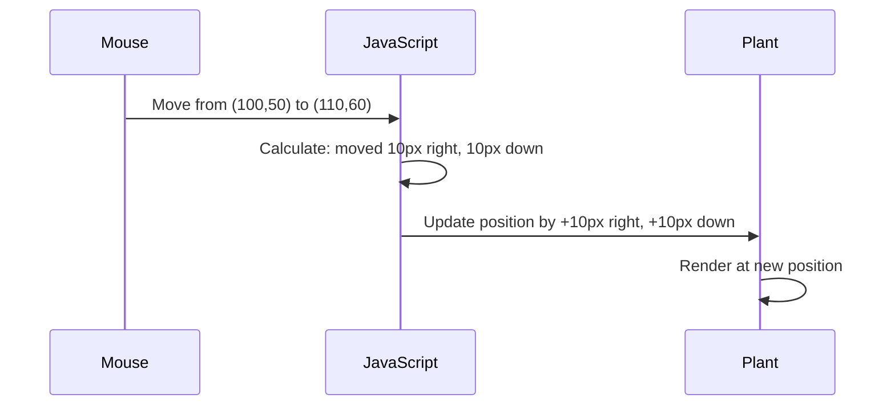

<!--
CO_OP_TRANSLATOR_METADATA:
{
  "original_hash": "bc93f6285423033ebf5b8abeb5282888",
  "translation_date": "2025-10-23T21:02:43+00:00",
  "source_file": "3-terrarium/3-intro-to-DOM-and-closures/README.md",
  "language_code": "th"
}
-->
# โครงการ Terrarium ตอนที่ 3: การจัดการ DOM และ JavaScript Closures


> ภาพวาดโดย [Tomomi Imura](https://twitter.com/girlie_mac)

ยินดีต้อนรับสู่หนึ่งในแง่มุมที่น่าสนใจที่สุดของการพัฒนาเว็บ - การทำให้สิ่งต่าง ๆ มีความโต้ตอบ! Document Object Model (DOM) เป็นเหมือนสะพานเชื่อมระหว่าง HTML และ JavaScript ของคุณ และวันนี้เราจะใช้มันเพื่อทำให้ terrarium ของคุณมีชีวิตชีวา เมื่อ Tim Berners-Lee สร้างเว็บเบราว์เซอร์ตัวแรก เขาได้จินตนาการถึงเว็บที่เอกสารสามารถเป็นแบบไดนามิกและโต้ตอบได้ - DOM ทำให้วิสัยทัศน์นั้นเป็นไปได้

เราจะสำรวจ JavaScript closures ซึ่งอาจฟังดูน่ากลัวในตอนแรก ลองนึกถึง closures ว่าเป็นการสร้าง "กระเป๋าความจำ" ที่ฟังก์ชันของคุณสามารถจดจำข้อมูลสำคัญได้ มันเหมือนกับแต่ละต้นไม้ใน terrarium ของคุณมีบันทึกข้อมูลของตัวเองเพื่อติดตามตำแหน่งของมัน เมื่อจบบทเรียนนี้ คุณจะเข้าใจว่ามันเป็นธรรมชาติและมีประโยชน์อย่างไร

นี่คือสิ่งที่เรากำลังสร้าง: terrarium ที่ผู้ใช้สามารถลากและวางต้นไม้ได้ทุกที่ที่ต้องการ คุณจะได้เรียนรู้เทคนิคการจัดการ DOM ที่ช่วยให้ทุกอย่างตั้งแต่การอัปโหลดไฟล์แบบลากและวางไปจนถึงเกมแบบโต้ตอบ มาทำให้ terrarium ของคุณมีชีวิตกันเถอะ

## แบบทดสอบก่อนเรียน

[แบบทดสอบก่อนเรียน](https://ff-quizzes.netlify.app/web/quiz/19)

## ทำความเข้าใจ DOM: ประตูสู่หน้าเว็บแบบโต้ตอบ

Document Object Model (DOM) คือวิธีที่ JavaScript สื่อสารกับองค์ประกอบ HTML ของคุณ เมื่อเบราว์เซอร์ของคุณโหลดหน้า HTML มันจะสร้างการแสดงผลแบบโครงสร้างของหน้านั้นในหน่วยความจำ - นั่นคือ DOM ลองนึกถึงมันว่าเป็นแผนผังครอบครัวที่ทุกองค์ประกอบ HTML เป็นสมาชิกครอบครัวที่ JavaScript สามารถเข้าถึง ปรับเปลี่ยน หรือจัดเรียงใหม่ได้

การจัดการ DOM เปลี่ยนหน้าคงที่ให้เป็นเว็บไซต์แบบโต้ตอบ ทุกครั้งที่คุณเห็นปุ่มเปลี่ยนสีเมื่อเลื่อนเมาส์ เนื้อหาที่อัปเดตโดยไม่ต้องรีเฟรชหน้า หรือองค์ประกอบที่คุณสามารถลากไปรอบ ๆ ได้ นั่นคือการจัดการ DOM ที่ทำงานอยู่


> การแสดงผล DOM และ HTML markup ที่อ้างอิงถึงมัน จาก [Olfa Nasraoui](https://www.researchgate.net/publication/221417012_Profile-Based_Focused_Crawler_for_Social_Media-Sharing_Websites)

**สิ่งที่ทำให้ DOM ทรงพลัง:**
- **ให้** วิธีการที่มีโครงสร้างในการเข้าถึงองค์ประกอบใด ๆ บนหน้าเว็บของคุณ
- **ช่วยให้** อัปเดตเนื้อหาแบบไดนามิกโดยไม่ต้องรีเฟรชหน้า
- **อนุญาต** การตอบสนองแบบเรียลไทม์ต่อการโต้ตอบของผู้ใช้ เช่น การคลิกและการลาก
- **สร้าง** พื้นฐานสำหรับแอปพลิเคชันเว็บแบบโต้ตอบสมัยใหม่

## JavaScript Closures: สร้างโค้ดที่มีการจัดระเบียบและทรงพลัง

[JavaScript closure](https://developer.mozilla.org/docs/Web/JavaScript/Closures) เปรียบเสมือนการให้ฟังก์ชันมีพื้นที่ทำงานส่วนตัวพร้อมหน่วยความจำที่คงอยู่ ลองนึกถึงนกฟินช์ของดาร์วินบนหมู่เกาะกาลาปาโกสที่แต่ละตัวพัฒนาปากที่เชี่ยวชาญตามสภาพแวดล้อมเฉพาะของมัน - closures ทำงานในลักษณะเดียวกัน สร้างฟังก์ชันเฉพาะที่ "จดจำ" บริบทเฉพาะของมันแม้ว่าฟังก์ชันแม่จะเสร็จสิ้นแล้วก็ตาม

ใน terrarium ของเรา closures ช่วยให้แต่ละต้นไม้จดจำตำแหน่งของตัวเองได้อย่างอิสระ รูปแบบนี้ปรากฏอยู่ทั่วการพัฒนา JavaScript ระดับมืออาชีพ ทำให้เป็นแนวคิดที่มีคุณค่าในการทำความเข้าใจ

> 💡 **ทำความเข้าใจ Closures**: Closures เป็นหัวข้อสำคัญใน JavaScript และนักพัฒนาหลายคนใช้มันมาหลายปีก่อนที่จะเข้าใจทุกแง่มุมทางทฤษฎี วันนี้เรามุ่งเน้นที่การใช้งานจริง - คุณจะเห็น closures เกิดขึ้นตามธรรมชาติเมื่อเราสร้างคุณสมบัติแบบโต้ตอบ ความเข้าใจจะพัฒนาขึ้นเมื่อคุณเห็นว่ามันแก้ปัญหาจริงได้อย่างไร


> การแสดงผล DOM และ HTML markup ที่อ้างอิงถึงมัน จาก [Olfa Nasraoui](https://www.researchgate.net/publication/221417012_Profile-Based_Focused_Crawler_for_Social_Media-Sharing_Websites)

ในบทเรียนนี้ เราจะทำโครงการ terrarium แบบโต้ตอบของเราให้เสร็จสมบูรณ์โดยการสร้าง JavaScript ที่จะช่วยให้ผู้ใช้สามารถจัดการต้นไม้บนหน้าเว็บได้

## ก่อนเริ่มต้น: การเตรียมตัวให้พร้อม

คุณจะต้องใช้ไฟล์ HTML และ CSS จากบทเรียน terrarium ก่อนหน้านี้ - เรากำลังจะทำให้การออกแบบแบบคงที่นั้นมีความโต้ตอบ หากคุณเพิ่งเข้าร่วมครั้งแรก การทำบทเรียนเหล่านั้นให้เสร็จก่อนจะช่วยให้คุณเข้าใจบริบทที่สำคัญ

นี่คือสิ่งที่เราจะสร้าง:
- **การลากและวางที่ราบรื่น** สำหรับต้นไม้ใน terrarium ทั้งหมด
- **การติดตามพิกัด** เพื่อให้ต้นไม้จดจำตำแหน่งของมัน
- **อินเทอร์เฟซแบบโต้ตอบที่สมบูรณ์** โดยใช้ JavaScript แบบ vanilla
- **โค้ดที่สะอาดและมีการจัดระเบียบ** โดยใช้รูปแบบ closure

## การตั้งค่าไฟล์ JavaScript ของคุณ

มาสร้างไฟล์ JavaScript ที่จะทำให้ terrarium ของคุณมีความโต้ตอบกันเถอะ

**ขั้นตอนที่ 1: สร้างไฟล์ script ของคุณ**

ในโฟลเดอร์ terrarium ของคุณ สร้างไฟล์ใหม่ชื่อ `script.js`

**ขั้นตอนที่ 2: เชื่อมโยง JavaScript กับ HTML ของคุณ**

เพิ่มแท็ก script นี้ในส่วน `<head>` ของไฟล์ `index.html` ของคุณ:

```html
<script src="./script.js" defer></script>
```

**ทำไมแอตทริบิวต์ `defer` ถึงสำคัญ:**
- **รับรอง** ว่า JavaScript ของคุณรอจนกว่า HTML ทั้งหมดจะโหลดเสร็จ
- **ป้องกัน** ข้อผิดพลาดที่ JavaScript พยายามค้นหาองค์ประกอบที่ยังไม่พร้อม
- **รับประกัน** ว่าองค์ประกอบต้นไม้ทั้งหมดของคุณพร้อมสำหรับการโต้ตอบ
- **ให้** ประสิทธิภาพที่ดีกว่าการวาง script ไว้ที่ด้านล่างของหน้า

> ⚠️ **หมายเหตุสำคัญ**: แอตทริบิวต์ `defer` ป้องกันปัญหาเรื่องเวลาโดยทั่วไป หากไม่มีมัน JavaScript อาจพยายามเข้าถึงองค์ประกอบ HTML ก่อนที่มันจะโหลดเสร็จ ซึ่งจะทำให้เกิดข้อผิดพลาด

---

## การเชื่อมโยง JavaScript กับองค์ประกอบ HTML ของคุณ

ก่อนที่เราจะทำให้องค์ประกอบสามารถลากได้ JavaScript จำเป็นต้องค้นหาองค์ประกอบเหล่านั้นใน DOM ลองนึกถึงสิ่งนี้เหมือนระบบการจัดหมวดหมู่ในห้องสมุด - เมื่อคุณมีหมายเลขหมวดหมู่ คุณสามารถค้นหาหนังสือที่คุณต้องการและเข้าถึงเนื้อหาทั้งหมดของมันได้

เราจะใช้เมธอด `document.getElementById()` เพื่อทำการเชื่อมโยงเหล่านี้ มันเหมือนกับการมีระบบการจัดเก็บที่แม่นยำ - คุณให้ ID และมันจะค้นหาองค์ประกอบที่คุณต้องการใน HTML ของคุณ

### การเปิดใช้งานฟังก์ชันการลากสำหรับต้นไม้ทั้งหมด

เพิ่มโค้ดนี้ในไฟล์ `script.js` ของคุณ:

```javascript
// Enable drag functionality for all 14 plants
dragElement(document.getElementById('plant1'));
dragElement(document.getElementById('plant2'));
dragElement(document.getElementById('plant3'));
dragElement(document.getElementById('plant4'));
dragElement(document.getElementById('plant5'));
dragElement(document.getElementById('plant6'));
dragElement(document.getElementById('plant7'));
dragElement(document.getElementById('plant8'));
dragElement(document.getElementById('plant9'));
dragElement(document.getElementById('plant10'));
dragElement(document.getElementById('plant11'));
dragElement(document.getElementById('plant12'));
dragElement(document.getElementById('plant13'));
dragElement(document.getElementById('plant14'));
```

**นี่คือสิ่งที่โค้ดนี้ทำ:**
- **ค้นหา** องค์ประกอบต้นไม้แต่ละตัวใน DOM โดยใช้ ID เฉพาะของมัน
- **ดึง** การอ้างอิง JavaScript ไปยังองค์ประกอบ HTML แต่ละตัว
- **ส่งต่อ** องค์ประกอบแต่ละตัวไปยังฟังก์ชัน `dragElement` (ซึ่งเราจะสร้างต่อไป)
- **เตรียม** ต้นไม้ทุกต้นสำหรับการโต้ตอบแบบลากและวาง
- **เชื่อมโยง** โครงสร้าง HTML ของคุณกับฟังก์ชัน JavaScript

> 🎯 **ทำไมต้องใช้ IDs แทน Classes?** IDs ให้ตัวระบุเฉพาะสำหรับองค์ประกอบเฉพาะ ในขณะที่ CSS classes ถูกออกแบบมาเพื่อการจัดสไตล์กลุ่มขององค์ประกอบ เมื่อ JavaScript ต้องการจัดการองค์ประกอบแต่ละตัว IDs ให้ความแม่นยำและประสิทธิภาพที่เราต้องการ

> 💡 **เคล็ดลับ**: สังเกตว่าเรากำลังเรียก `dragElement()` สำหรับต้นไม้แต่ละต้นแยกกัน วิธีนี้ช่วยให้ต้นไม้แต่ละต้นมีพฤติกรรมการลากที่เป็นอิสระ ซึ่งจำเป็นสำหรับการโต้ตอบของผู้ใช้ที่ราบรื่น

---

## การสร้าง Drag Element Closure

ตอนนี้เราจะสร้างหัวใจของฟังก์ชันการลากของเรา: closure ที่จัดการพฤติกรรมการลากสำหรับต้นไม้แต่ละต้น Closure นี้จะมีฟังก์ชันภายในหลายตัวที่ทำงานร่วมกันเพื่อติดตามการเคลื่อนไหวของเมาส์และอัปเดตตำแหน่งขององค์ประกอบ

Closures เหมาะสำหรับงานนี้เพราะช่วยให้เราสร้างตัวแปร "ส่วนตัว" ที่คงอยู่ระหว่างการเรียกฟังก์ชัน ทำให้ต้นไม้แต่ละต้นมีระบบการติดตามพิกัดที่เป็นอิสระ

### ทำความเข้าใจ Closures ด้วยตัวอย่างง่าย ๆ

ให้ฉันแสดงตัวอย่างง่าย ๆ ที่แสดงแนวคิดของ closures:

```javascript
function createCounter() {
    let count = 0; // This is like a private variable
    
    function increment() {
        count++; // The inner function remembers the outer variable
        return count;
    }
    
    return increment; // We're giving back the inner function
}

const myCounter = createCounter();
console.log(myCounter()); // 1
console.log(myCounter()); // 2
```

**นี่คือสิ่งที่เกิดขึ้นในรูปแบบ closure นี้:**
- **สร้าง** ตัวแปร `count` ส่วนตัวที่มีอยู่เฉพาะใน closure นี้
- **ฟังก์ชันภายใน** สามารถเข้าถึงและแก้ไขตัวแปรภายนอกนั้น (กลไกของ closure)
- **เมื่อเราส่งคืน** ฟังก์ชันภายใน มันยังคงเชื่อมต่อกับข้อมูลส่วนตัวนั้น
- **แม้หลังจาก** `createCounter()` เสร็จสิ้นการทำงาน `count` ยังคงอยู่และจดจำค่าของมัน

### ทำไม Closures ถึงเหมาะสำหรับฟังก์ชันการลาก

สำหรับ terrarium ของเรา ต้นไม้แต่ละต้นจำเป็นต้องจดจำพิกัดตำแหน่งปัจจุบันของมัน Closures ให้โซลูชันที่สมบูรณ์แบบ:

**ประโยชน์สำคัญสำหรับโครงการของเรา:**
- **รักษา** ตัวแปรตำแหน่งส่วนตัวสำหรับต้นไม้แต่ละต้นอย่างอิสระ
- **คงไว้** ข้อมูลพิกัดระหว่างเหตุการณ์การลาก
- **ป้องกัน** ความขัดแย้งของตัวแปรระหว่างองค์ประกอบที่ลากได้ต่าง ๆ
- **สร้าง** โครงสร้างโค้ดที่สะอาดและมีการจัดระเบียบ

> 🎯 **เป้าหมายการเรียนรู้**: คุณไม่จำเป็นต้องเข้าใจทุกแง่มุมของ closures ในตอนนี้ มุ่งเน้นที่การเห็นว่ามันช่วยเราในการจัดระเบียบโค้ดและรักษาสถานะสำหรับฟังก์ชันการลากอย่างไร

### การสร้างฟังก์ชัน dragElement

ตอนนี้มาสร้างฟังก์ชันหลักที่จะจัดการตรรกะการลากทั้งหมด เพิ่มฟังก์ชันนี้ด้านล่างการประกาศองค์ประกอบต้นไม้ของคุณ:

```javascript
function dragElement(terrariumElement) {
    // Initialize position tracking variables
    let pos1 = 0,  // Previous mouse X position
        pos2 = 0,  // Previous mouse Y position  
        pos3 = 0,  // Current mouse X position
        pos4 = 0;  // Current mouse Y position
    
    // Set up the initial drag event listener
    terrariumElement.onpointerdown = pointerDrag;
}
```

**ทำความเข้าใจระบบการติดตามตำแหน่ง:**
- **`pos1` และ `pos2`**: เก็บความแตกต่างระหว่างตำแหน่งเมาส์เก่าและใหม่
- **`pos3` และ `pos4`**: ติดตามพิกัดเมาส์ปัจจุบัน
- **`terrariumElement`**: องค์ประกอบต้นไม้เฉพาะที่เรากำลังทำให้ลากได้
- **`onpointerdown`**: เหตุการณ์ที่เริ่มต้นเมื่อผู้ใช้เริ่มลาก

**นี่คือวิธีการทำงานของรูปแบบ closure:**
- **สร้าง** ตัวแปรตำแหน่งส่วนตัวสำหรับองค์ประกอบต้นไม้แต่ละตัว
- **คงไว้** ตัวแปรเหล่านี้ตลอดวงจรการลาก
- **รับรอง** ว่าต้นไม้แต่ละต้นติดตามพิกัดของตัวเองอย่างอิสระ
- **ให้** อินเทอร์เฟซที่สะอาดผ่านฟังก์ชัน `dragElement`

### ทำไมต้องใช้ Pointer Events?

คุณอาจสงสัยว่าทำไมเราถึงใช้ `onpointerdown` แทน `onclick` ที่คุ้นเคย นี่คือเหตุผล:

| ประเภทเหตุการณ์ | เหมาะสำหรับ | ข้อจำกัด |
|------------------|-------------|-----------|
| `onclick` | การคลิกปุ่มง่าย ๆ | ไม่สามารถจัดการการลากได้ (แค่คลิกและปล่อย) |
| `onpointerdown` | ทั้งเมาส์และสัมผัส | ใหม่กว่า แต่รองรับได้ดีในปัจจุบัน |
| `onmousedown` | เฉพาะเมาส์เดสก์ท็อป | ไม่รองรับผู้ใช้มือถือ |

**ทำไม pointer events ถึงเหมาะสำหรับสิ่งที่เรากำลังสร้าง:**
- **ทำงานได้ดี** ไม่ว่าคนจะใช้เมาส์ นิ้ว หรือแม้กระทั่งปากกา
- **ให้ความรู้สึกเหมือนกัน** บนแล็ปท็อป แท็บเล็ต หรือโทรศัพท์
- **จัดการ** การเคลื่อนไหวการลากจริง (ไม่ใช่แค่คลิกและเสร็จสิ้น)
- **สร้าง** ประสบการณ์ที่ราบรื่นที่ผู้ใช้คาดหวังจากแอปเว็บสมัยใหม่

> 💡 **การเตรียมตัวสำหรับอนาคต**: Pointer events เป็นวิธีการจัดการการโต้ตอบของผู้ใช้ในยุคใหม่ แทนที่จะเขียนโค้ดแยกสำหรับเมาส์และสัมผัส คุณจะได้ทั้งสองอย่างฟรี น่าสนใจใช่ไหม?

---

## ฟังก์ชัน pointerDrag: การจับการเริ่มต้นการลาก

เมื่อผู้ใช้กดลงบนต้นไม้ (ไม่ว่าจะด้วยการคลิกเมาส์หรือสัมผัสนิ้ว) ฟังก์ชัน `pointerDrag` จะเริ่มทำงาน ฟังก์ชันนี้จับพิกัดเริ่มต้นและตั้งค่าระบบการลาก

เพิ่มฟังก์ชันนี้ภายใน closure `dragElement` หลังบรรทัด `terrariumElement.onpointerdown = pointerDrag;`:

```javascript
function pointerDrag(e) {
    // Prevent default browser behavior (like text selection)
    e.preventDefault();
    
    // Capture the initial mouse/touch position
    pos3 = e.clientX;  // X coordinate where drag started
    pos4 = e.clientY;  // Y coordinate where drag started
    
    // Set up event listeners for the dragging process
    document.onpointermove = elementDrag;
    document.onpointerup = stopElementDrag;
}
```

**ทีละขั้นตอน นี่คือสิ่งที่เกิดขึ้น:**
- **ป้องกัน** พฤติกรรมเริ่มต้นของเบราว์เซอร์ที่อาจรบกวนการลาก
- **บันทึก** พิกัดที่แน่นอนที่ผู้ใช้เริ่มต้นการลาก
- **ตั้งค่า** event listeners สำหรับการเคลื่อนไหวการลากที่กำลังดำเนินอยู่
- **เตรียม** ระบบเพื่อติดตามการเคลื่อนไหวเมาส์/นิ้วทั่วทั้งเอกสาร

### ทำความเข้าใจการป้องกันเหตุการณ์

บรรทัด `e.preventDefault()` มีความสำคัญต่อการลากที่ราบรื่น:

**หากไม่มีการป้องกัน เบราว์เซอร์อาจ:**
- **เลือก** ข้อความเมื่อลากผ่านหน้าเว็บ
- **เรียกใช้** เมนูบริบทเมื่อคลิกขวาและลาก
- **รบกวน** พฤติกรรมการลากที่กำหนดเองของเรา
- **สร้าง** สิ่งประดิษฐ์ภาพระหว่างการลาก

> 🔍 **ทดลอง**: หลังจากจบบทเรียนนี้ ลองลบบรรทัด `e.preventDefault()` และดูว่ามันส่งผลต่อประสบการณ์การลากอย่างไร คุณจะเข้าใจได้อย่างรวดเร็วว่าทำไมบรรทัดนี้ถึงจำเป็น!

### ระบบการติดตามพิกัด

คุณสมบัติ `e.clientX` และ `e.clientY` ให้พิกัดเมาส์/สัมผัสที่แม่นยำ:

| คุณสมบัติ | สิ่งที่วัด | กรณีการใช้งาน |
|-----------|------------|----------------|
| `clientX` | ตำแหน่งแนวนอนสัมพันธ์กับ viewport | ติดตามการเคลื่อนไหวซ้าย-ขวา |
| `clientY` | ตำแหน่งแนวตั้งสัมพันธ์กับ viewport | ติดตามการเคลื่อนไหวขึ้น-ลง |

**ทำความเข้าใจพิกัดเหล่านี้:**
- **ให้** ข้อมูลตำ
- **`pos3` และ `pos4`**: เก็บตำแหน่งเมาส์ปัจจุบันเพื่อใช้ในการคำนวณครั้งถัดไป  
- **`offsetTop` และ `offsetLeft`**: รับตำแหน่งปัจจุบันขององค์ประกอบบนหน้าเว็บ  
- **ตรรกะการลบ**: ย้ายองค์ประกอบตามระยะที่เมาส์เคลื่อนที่  

**นี่คือการคำนวณการเคลื่อนไหวแบบละเอียด:**  
1. **วัด** ความแตกต่างระหว่างตำแหน่งเมาส์เก่าและใหม่  
2. **คำนวณ** ระยะที่ต้องย้ายองค์ประกอบตามการเคลื่อนที่ของเมาส์  
3. **อัปเดต** คุณสมบัติตำแหน่ง CSS ขององค์ประกอบแบบเรียลไทม์  
4. **เก็บ** ตำแหน่งใหม่เป็นฐานสำหรับการคำนวณการเคลื่อนไหวครั้งถัดไป  

### การแสดงภาพของการคำนวณทางคณิตศาสตร์  


  

### ฟังก์ชัน stopElementDrag: การทำความสะอาด  

เพิ่มฟังก์ชันการทำความสะอาดหลังปีกกาปิดของ `elementDrag`:  

```javascript
function stopElementDrag() {
    // Remove the document-level event listeners
    document.onpointerup = null;
    document.onpointermove = null;
}
```
  

**ทำไมการทำความสะอาดถึงสำคัญ:**  
- **ป้องกัน** การรั่วไหลของหน่วยความจำจากตัวฟังเหตุการณ์ที่ยังค้างอยู่  
- **หยุด** พฤติกรรมการลากเมื่อผู้ใช้ปล่อยต้นไม้  
- **อนุญาต** ให้องค์ประกอบอื่นสามารถลากได้อย่างอิสระ  
- **รีเซ็ต** ระบบสำหรับการดำเนินการลากครั้งถัดไป  

**สิ่งที่เกิดขึ้นหากไม่มีการทำความสะอาด:**  
- ตัวฟังเหตุการณ์ยังคงทำงานแม้หลังจากการลากหยุดลง  
- ประสิทธิภาพลดลงเนื่องจากตัวฟังที่ไม่ได้ใช้งานสะสม  
- พฤติกรรมที่ไม่คาดคิดเมื่อโต้ตอบกับองค์ประกอบอื่น  
- ทรัพยากรของเบราว์เซอร์ถูกใช้ไปกับการจัดการเหตุการณ์ที่ไม่จำเป็น  

### ทำความเข้าใจคุณสมบัติตำแหน่ง CSS  

ระบบการลากของเราจัดการกับคุณสมบัติ CSS หลักสองตัว:  

| คุณสมบัติ | สิ่งที่ควบคุม | วิธีการใช้งาน |
|-----------|----------------|----------------|
| `top` | ระยะห่างจากขอบด้านบน | การจัดตำแหน่งแนวตั้งระหว่างการลาก |
| `left` | ระยะห่างจากขอบด้านซ้าย | การจัดตำแหน่งแนวนอนระหว่างการลาก |

**ข้อมูลสำคัญเกี่ยวกับคุณสมบัติ offset:**  
- **`offsetTop`**: ระยะห่างปัจจุบันจากด้านบนขององค์ประกอบแม่ที่มีการกำหนดตำแหน่ง  
- **`offsetLeft`**: ระยะห่างปัจจุบันจากด้านซ้ายขององค์ประกอบแม่ที่มีการกำหนดตำแหน่ง  
- **บริบทการกำหนดตำแหน่ง**: ค่าพวกนี้สัมพันธ์กับบรรพบุรุษที่มีการกำหนดตำแหน่งใกล้ที่สุด  
- **การอัปเดตแบบเรียลไทม์**: เปลี่ยนแปลงทันทีเมื่อเราปรับคุณสมบัติ CSS  

> 🎯 **ปรัชญาการออกแบบ**: ระบบการลากนี้มีความยืดหยุ่นโดยตั้งใจ – ไม่มี "โซนวาง" หรือข้อจำกัดใดๆ ผู้ใช้สามารถวางต้นไม้ได้ทุกที่ ทำให้พวกเขามีอิสระในการออกแบบสวนขวดของตัวเองอย่างเต็มที่  

## รวมทุกอย่างเข้าด้วยกัน: ระบบลากของคุณที่สมบูรณ์  

ยินดีด้วย! คุณเพิ่งสร้างระบบลากและวางที่ซับซ้อนโดยใช้ JavaScript แบบพื้นฐาน ฟังก์ชัน `dragElement` ของคุณตอนนี้มี closure ที่ทรงพลังซึ่งจัดการ:  

**สิ่งที่ closure ของคุณทำได้:**  
- **รักษา** ตัวแปรตำแหน่งส่วนตัวสำหรับต้นไม้แต่ละต้นอย่างอิสระ  
- **จัดการ** วงจรการลากทั้งหมดตั้งแต่ต้นจนจบ  
- **ให้** การเคลื่อนไหวที่ราบรื่นและตอบสนองทั่วทั้งหน้าจอ  
- **ทำความสะอาด** ทรัพยากรอย่างเหมาะสมเพื่อป้องกันการรั่วไหลของหน่วยความจำ  
- **สร้าง** อินเทอร์เฟซที่ใช้งานง่ายและสร้างสรรค์สำหรับการออกแบบสวนขวด  

### ทดสอบสวนขวดแบบโต้ตอบของคุณ  

ตอนนี้ทดสอบสวนขวดแบบโต้ตอบของคุณ! เปิดไฟล์ `index.html` ในเว็บเบราว์เซอร์และลองใช้งาน:  

1. **คลิกและกดค้าง** ที่ต้นไม้ใดๆ เพื่อเริ่มการลาก  
2. **เคลื่อนเมาส์หรือใช้นิ้ว** และดูต้นไม้เคลื่อนที่ตามอย่างราบรื่น  
3. **ปล่อย** เพื่อวางต้นไม้ในตำแหน่งใหม่  
4. **ทดลอง** จัดเรียงในรูปแบบต่างๆ เพื่อสำรวจอินเทอร์เฟซ  

🥇 **ความสำเร็จ**: คุณได้สร้างแอปพลิเคชันเว็บแบบโต้ตอบเต็มรูปแบบโดยใช้แนวคิดหลักที่นักพัฒนามืออาชีพใช้ในชีวิตประจำวัน ฟังก์ชันการลากและวางนี้ใช้หลักการเดียวกันกับการอัปโหลดไฟล์ กระดานงาน และอินเทอร์เฟซแบบโต้ตอบอื่นๆ อีกมากมาย  

  

---

## ความท้าทาย GitHub Copilot Agent 🚀  

ใช้โหมด Agent เพื่อทำความท้าทายต่อไปนี้ให้สำเร็จ:  

**คำอธิบาย:** ปรับปรุงโครงการสวนขวดโดยเพิ่มฟังก์ชันการรีเซ็ตที่คืนต้นไม้ทั้งหมดไปยังตำแหน่งเดิมด้วยแอนิเมชันที่ราบรื่น  

**คำสั่ง:** สร้างปุ่มรีเซ็ตที่เมื่อคลิกแล้วจะทำให้ต้นไม้ทั้งหมดเคลื่อนกลับไปยังตำแหน่งเดิมในแถบด้านข้างด้วยแอนิเมชัน CSS ที่ราบรื่น ฟังก์ชันควรเก็บตำแหน่งเดิมเมื่อหน้าโหลดและเปลี่ยนต้นไม้กลับไปยังตำแหน่งเหล่านั้นอย่างราบรื่นภายใน 1 วินาทีเมื่อกดปุ่มรีเซ็ต  

เรียนรู้เพิ่มเติมเกี่ยวกับ [agent mode](https://code.visualstudio.com/blogs/2025/02/24/introducing-copilot-agent-mode) ที่นี่  

## 🚀 ความท้าทายเพิ่มเติม: ขยายทักษะของคุณ  

พร้อมที่จะยกระดับสวนขวดของคุณไปอีกขั้นหรือยัง? ลองเพิ่มฟังก์ชันเหล่านี้:  

**การขยายความคิดสร้างสรรค์:**  
- **ดับเบิลคลิก** ที่ต้นไม้เพื่อให้มันอยู่ด้านหน้า (การจัดการ z-index)  
- **เพิ่มการตอบสนองทางภาพ** เช่นแสงเรืองรองเล็กน้อยเมื่อเลื่อนเมาส์ไปที่ต้นไม้  
- **กำหนดขอบเขต** เพื่อป้องกันไม่ให้ต้นไม้ถูกลากออกนอกสวนขวด  
- **สร้างฟังก์ชันบันทึก** ที่จดจำตำแหน่งต้นไม้โดยใช้ localStorage  
- **เพิ่มเสียงเอฟเฟกต์** เมื่อหยิบและวางต้นไม้  

> 💡 **โอกาสในการเรียนรู้**: ความท้าทายแต่ละข้อจะช่วยให้คุณเรียนรู้แง่มุมใหม่ๆ เกี่ยวกับการจัดการ DOM การจัดการเหตุการณ์ และการออกแบบประสบการณ์ผู้ใช้  

## แบบทดสอบหลังการบรรยาย  

[แบบทดสอบหลังการบรรยาย](https://ff-quizzes.netlify.app/web/quiz/20)  

## ทบทวนและศึกษาด้วยตัวเอง: เพิ่มพูนความเข้าใจของคุณ  

คุณได้เชี่ยวชาญพื้นฐานของการจัดการ DOM และ closures แล้ว แต่ยังมีสิ่งที่ต้องสำรวจอีกมากมาย! นี่คือเส้นทางบางส่วนเพื่อขยายความรู้และทักษะของคุณ  

### วิธีการลากและวางทางเลือก  

เราใช้ pointer events เพื่อความยืดหยุ่นสูงสุด แต่การพัฒนาเว็บมีวิธีการหลายแบบ:  

| วิธีการ | เหมาะสำหรับ | คุณค่าการเรียนรู้ |
|---------|--------------|--------------------|
| [HTML Drag and Drop API](https://developer.mozilla.org/docs/Web/API/HTML_Drag_and_Drop_API) | การอัปโหลดไฟล์ โซนลากที่เป็นทางการ | ทำความเข้าใจความสามารถของเบราว์เซอร์โดยธรรมชาติ |
| [Touch Events](https://developer.mozilla.org/docs/Web/API/Touch_events) | การโต้ตอบเฉพาะมือถือ | รูปแบบการพัฒนาสำหรับมือถือเป็นหลัก |
| คุณสมบัติ CSS `transform` | แอนิเมชันที่ราบรื่น | เทคนิคการเพิ่มประสิทธิภาพ |

### หัวข้อการจัดการ DOM ขั้นสูง  

**ขั้นตอนต่อไปในเส้นทางการเรียนรู้ของคุณ:**  
- **Event delegation**: การจัดการเหตุการณ์อย่างมีประสิทธิภาพสำหรับองค์ประกอบหลายตัว  
- **Intersection Observer**: การตรวจจับเมื่อองค์ประกอบเข้าสู่/ออกจากมุมมอง  
- **Mutation Observer**: การเฝ้าดูการเปลี่ยนแปลงในโครงสร้าง DOM  
- **Web Components**: การสร้างองค์ประกอบ UI ที่นำกลับมาใช้ใหม่ได้และมีการห่อหุ้ม  
- **แนวคิด Virtual DOM**: ทำความเข้าใจว่ากรอบงานปรับปรุงการอัปเดต DOM อย่างไร  

### แหล่งข้อมูลสำคัญสำหรับการเรียนรู้ต่อเนื่อง  

**เอกสารทางเทคนิค:**  
- [MDN Pointer Events Guide](https://developer.mozilla.org/docs/Web/API/Pointer_events) - คู่มือการอ้างอิง pointer event อย่างละเอียด  
- [W3C Pointer Events Specification](https://www.w3.org/TR/pointerevents1/) - เอกสารมาตรฐานอย่างเป็นทางการ  
- [JavaScript Closures Deep Dive](https://developer.mozilla.org/docs/Web/JavaScript/Closures) - รูปแบบ closure ขั้นสูง  

**ความเข้ากันได้ของเบราว์เซอร์:**  
- [CanIUse.com](https://caniuse.com/) - ตรวจสอบการรองรับฟีเจอร์ในเบราว์เซอร์ต่างๆ  
- [MDN Browser Compatibility Data](https://github.com/mdn/browser-compat-data) - ข้อมูลความเข้ากันได้โดยละเอียด  

**โอกาสในการฝึกฝน:**  
- **สร้าง** เกมปริศนาโดยใช้กลไกการลากที่คล้ายกัน  
- **สร้าง** กระดานงานที่มีการจัดการงานแบบลากและวาง  
- **ออกแบบ** แกลเลอรีภาพที่สามารถจัดเรียงรูปภาพได้ด้วยการลาก  
- **ทดลอง** กับท่าทางสัมผัสสำหรับอินเทอร์เฟซมือถือ  

> 🎯 **กลยุทธ์การเรียนรู้**: วิธีที่ดีที่สุดในการทำให้แนวคิดเหล่านี้มั่นคงคือการฝึกฝน ลองสร้างรูปแบบต่างๆ ของอินเทอร์เฟซที่สามารถลากได้ – แต่ละโครงการจะสอนสิ่งใหม่ๆ เกี่ยวกับการโต้ตอบของผู้ใช้และการจัดการ DOM  

## งานที่ได้รับมอบหมาย  

[ทำงานเพิ่มเติมกับ DOM](assignment.md)  

---

**ข้อจำกัดความรับผิดชอบ**:  
เอกสารนี้ได้รับการแปลโดยใช้บริการแปลภาษา AI [Co-op Translator](https://github.com/Azure/co-op-translator) แม้ว่าเราจะพยายามให้การแปลมีความถูกต้อง แต่โปรดทราบว่าการแปลโดยอัตโนมัติอาจมีข้อผิดพลาดหรือความไม่ถูกต้อง เอกสารต้นฉบับในภาษาดั้งเดิมควรถือเป็นแหล่งข้อมูลที่เชื่อถือได้ สำหรับข้อมูลที่สำคัญ ขอแนะนำให้ใช้บริการแปลภาษามืออาชีพ เราไม่รับผิดชอบต่อความเข้าใจผิดหรือการตีความผิดที่เกิดจากการใช้การแปลนี้