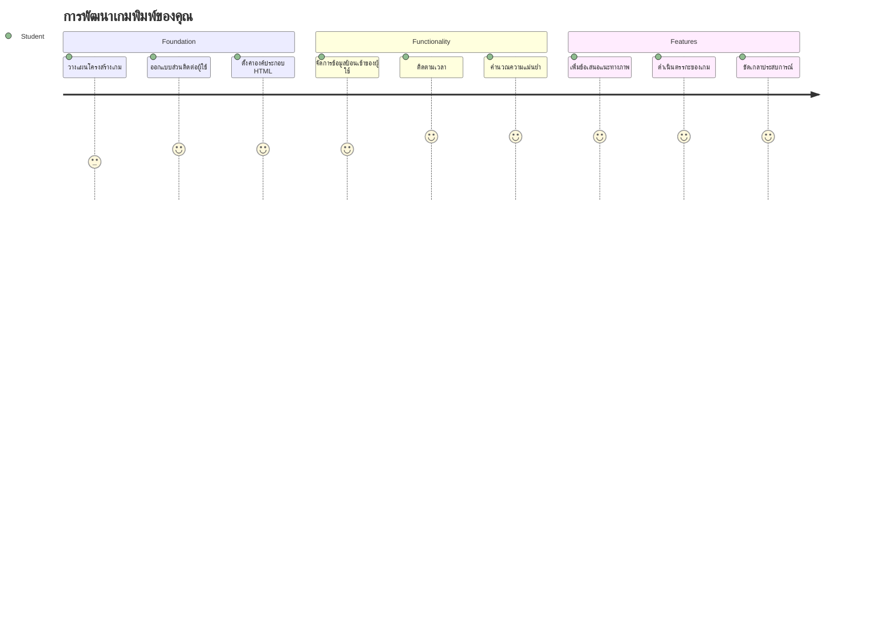
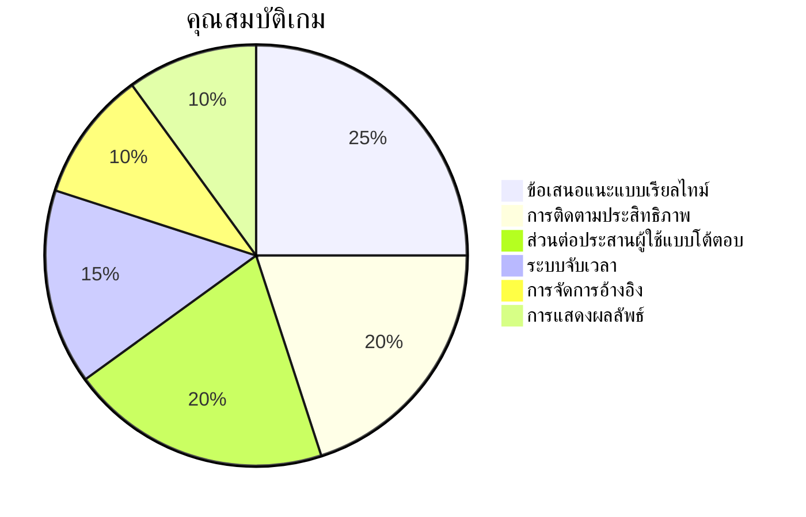
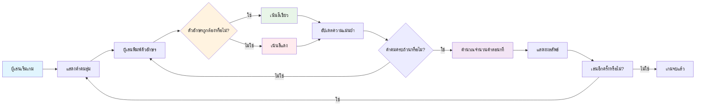
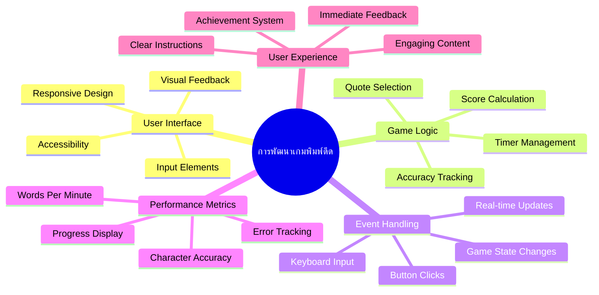
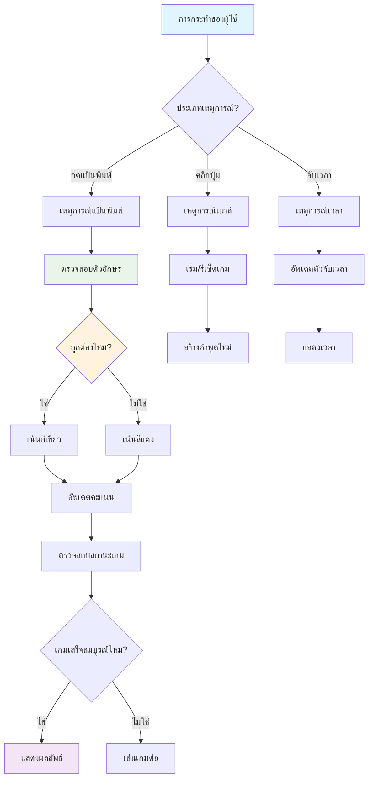
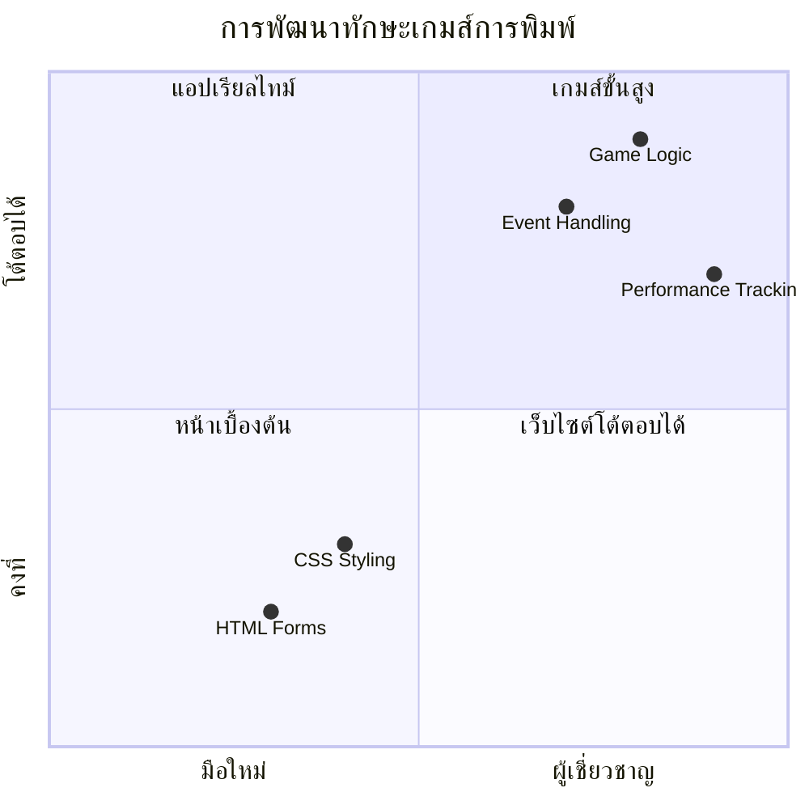
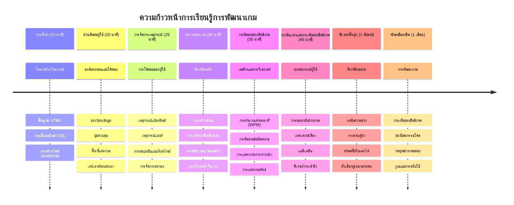

<!--
CO_OP_TRANSLATOR_METADATA:
{
  "original_hash": "efa2ab875b8bb5a7883816506da6b6d2",
  "translation_date": "2026-01-06T21:29:34+00:00",
  "source_file": "4-typing-game/README.md",
  "language_code": "th"
}
-->
# การเขียนโปรแกรมแบบขับเคลื่อนด้วยเหตุการณ์ - สร้างเกมพิมพ์ข้อความ

## บทนำ

นี่คือสิ่งที่นักพัฒนาทุกคนรู้ แต่ไม่ค่อยพูดถึง: การพิมพ์เร็วคือพลังวิเศษ! 🚀 ลองคิดดูสิ - ยิ่งคุณสามารถส่งไอเดียจากสมองสู่โปรแกรมแก้ไขโค้ดได้เร็วเท่าไร ความคิดสร้างสรรค์ของคุณก็จะไหลลื่นมากขึ้นเท่านั้น มันเหมือนกับมีกระแสตรงเชื่อมต่อระหว่างความคิดกับหน้าจอโดยตรง

อยากรู้วิธีที่ดีที่สุดวิธีหนึ่งในการพัฒนาทักษะนี้ไหม? ใช่แล้ว – เราจะสร้างเกมกัน!

> มาสร้างเกมพิมพ์ข้อความที่ยอดเยี่ยมไปด้วยกัน!

พร้อมที่จะนำทักษะ JavaScript, HTML และ CSS ที่คุณได้เรียนรู้มาลองใช้จริงหรือยัง? เราจะสร้างเกมพิมพ์ข้อความที่จะท้าทายคุณด้วยคำพูดสุ่มจากนักสืบระดับตำนานอย่าง [เชอร์ล็อก โฮล์มส์](https://en.wikipedia.org/wiki/Sherlock_Holmes) เกมนี้จะติดตามความเร็วและความแม่นยำในการพิมพ์ของคุณ - และเชื่อเถอะ มันติดใจยิ่งกว่าที่คุณคิด!

## สิ่งที่คุณต้องรู้

ก่อนที่เราจะเริ่มต้น ขอให้แน่ใจว่าคุณคุ้นเคยกับแนวคิดพวกนี้ (ไม่ต้องกังวลถ้าต้องรีเฟรชความจำ – เราต่างก็เคยเป็นแบบนั้น!):

- การสร้างช่องป้อนข้อความและปุ่มควบคุม
- CSS และการตั้งค่าสไตล์ด้วยคลาส  
- พื้นฐาน JavaScript
  - การสร้างอาร์เรย์
  - การสร้างตัวเลขสุ่ม
  - การรับเวลาปัจจุบัน

ถ้าหากว่าคุณรู้สึกว่าเรื่องพวกนี้ยังฝืด ๆ นิดหน่อย ไม่ต้องห่วง! บางครั้งวิธีที่ดีที่สุดในการฝึกให้แน่นคือการลงมือทำโครงการและค้นหาวิธีแก้ไขไปพร้อมกัน

### 🔄 **เช็คความเข้าใจเพื่อการเรียนรู้**
**การประเมินพื้นฐาน**: ก่อนเริ่มพัฒนาคุณควรเข้าใจ:
- ✅ วิธีการทำงานของฟอร์มและช่องป้อนข้อมูลใน HTML
- ✅ คลาส CSS และการตั้งค่าสไตล์แบบไดนามิค
- ✅ ตัวฟังเหตุการณ์และตัวจัดการเหตุการณ์ใน JavaScript
- ✅ การจัดการอาร์เรย์และการสุ่มเลือก
- ✅ การวัดและคำนวณเวลา

**ทดสอบตัวเองอย่างรวดเร็ว**: คุณสามารถอธิบายได้ไหมว่าแนวคิดเหล่านี้ทำงานร่วมกันอย่างไรในเกมที่โต้ตอบได้?
- **เหตุการณ์** จะถูกทริกเกอร์เมื่อผู้ใช้โต้ตอบกับส่วนประกอบ
- **ตัวจัดการ** ประมวลผลเหตุการณ์เหล่านั้นและอัปเดตสถานะเกม
- **CSS** ให้ฟีดแบ็กทางสายตาสำหรับการกระทำของผู้ใช้
- **การจับเวลา** ช่วยในการวัดความเร็วและความก้าวหน้าของเกม

## มาเริ่มสร้างสิ่งนี้กันเถอะ!

[การสร้างเกมพิมพ์ข้อความโดยใช้การเขียนโปรแกรมแบบขับเคลื่อนด้วยเหตุการณ์](./typing-game/README.md)

### ⚡ **สิ่งที่คุณสามารถลองทำภายใน 5 นาทีข้างหน้า**
- [ ] เปิดคอนโซลเบราว์เซอร์และลองฟังเหตุการณ์คีย์บอร์ดด้วย `addEventListener`
- [ ] สร้างเพจ HTML ง่าย ๆ พร้อมช่องป้อนข้อมูลและทดสอบการตรวจจับการพิมพ์
- [ ] ฝึกการจัดการสตริงด้วยการเปรียบเทียบข้อความที่พิมพ์กับข้อความเป้าหมาย
- [ ] ทดลองใช้ `setTimeout` เพื่อเข้าใจฟังก์ชันจับเวลา

### 🎯 **สิ่งที่คุณสามารถทำให้สำเร็จในชั่วโมงนี้**
- [ ] ทำแบบทดสอบหลังบทเรียนและเข้าใจการเขียนโปรแกรมแบบขับเคลื่อนด้วยเหตุการณ์
- [ ] สร้างเวอร์ชันพื้นฐานของเกมพิมพ์ข้อความพร้อมการตรวจสอบคำ
- [ ] เพิ่มฟีดแบ็คทางสายตาสำหรับการพิมพ์ถูกและผิด
- [ ] ใช้ระบบคะแนนง่าย ๆ ตามความเร็วและความแม่นยำ
- [ ] แต่งสไตล์เกมของคุณด้วย CSS ให้สวยงามน่าดู

### 📅 **การพัฒนาเกมของคุณในสัปดาห์นี้**
- [ ] สร้างเกมพิมพ์ข้อความเวอร์ชันเต็มพร้อมฟีเจอร์ครบถ้วนและความเรียบร้อย
- [ ] เพิ่มระดับความยากด้วยความซับซ้อนของคำที่แตกต่างกัน
- [ ] ติดตามสถิติผู้ใช้ (WPM, ความแม่นยำตามเวลา)
- [ ] สร้างเสียงเอฟเฟกต์และแอนิเมชันเพื่อประสบการณ์ผู้ใช้ที่ดีขึ้น
- [ ] ทำให้เกมรองรับการเล่นบนมือถือโดยการสัมผัส
- [ ] แชร์เกมออนไลน์และเก็บคำติชมจากผู้ใช้

### 🌟 **การพัฒนาแบบโต้ตอบของคุณตลอดเดือนนี้**
- [ ] สร้างเกมหลายเกมเพื่อลองรูปแบบการโต้ตอบต่าง ๆ
- [ ] เรียนรู้เกี่ยวกับลูปเกม, การจัดการสถานะ และการปรับปรุงประสิทธิภาพ
- [ ] มีส่วนร่วมในโครงการเกมโอเพ่นซอร์ส
- [ ] เชี่ยวชาญแนวคิดการจับเวลาขั้นสูงและแอนิเมชันที่ลื่นไหล
- [ ] สร้างพอร์ตโฟลิโอแสดงผลงานของแอปพลิเคชันโต้ตอบต่าง ๆ
- [ ] เป็นพี่เลี้ยงให้คนที่สนใจพัฒนาเกมและโต้ตอบกับผู้ใช้

## 🎯 กำหนดเวลาเชี่ยวชาญเกมพิมพ์ข้อความของคุณ

### 🛠️ สรุปชุดเครื่องมือพัฒนาเกมของคุณ

หลังจากทำโครงการนี้เสร็จ คุณจะชำนาญใน:
- **การเขียนโปรแกรมแบบขับเคลื่อนด้วยเหตุการณ์**: อินเทอร์เฟซตอบสนองที่ไวต่อการป้อนข้อมูล
- **ฟีดแบ็คแบบเรียลไทม์**: การอัปเดตทางสายตาและการวัดประสิทธิภาพทันที
- **การวัดประสิทธิภาพ**: ระบบจับเวลาและคะแนนที่แม่นยำ
- **การจัดการสถานะเกม**: ควบคุมการไหลของแอปและประสบการณ์ผู้ใช้
- **การออกแบบแบบโต้ตอบ**: สร้างประสบการณ์ผู้ใช้ที่น่าดึงดูดและติดใจ
- **Modern Web APIs**: ใช้ประโยชน์จากความสามารถของเบราว์เซอร์สำหรับการโต้ตอบที่หลากหลาย
- **รูปแบบการเข้าถึง**: การออกแบบแบบครอบคลุมเพื่อผู้ใช้ทุกคน

**การใช้งานในโลกจริง**: ทักษะเหล่านี้นำไปใช้ได้โดยตรงกับ:
- **เว็บแอปพลิเคชัน**: อินเทอร์เฟซโต้ตอบหรือแดชบอร์ดใด ๆ
- **ซอฟต์แวร์เพื่อการศึกษา**: แพลตฟอร์มการเรียนรู้และเครื่องมือประเมินทักษะ
- **เครื่องมือเพิ่มประสิทธิภาพการทำงาน**: ตัวแก้ไขข้อความ, IDE และซอฟต์แวร์ร่วมมือ
- **อุตสาหกรรมเกม**: เกมบนเบราว์เซอร์และความบันเทิงแบบโต้ตอบ
- **การพัฒนาบนมือถือ**: อินเทอร์เฟซสัมผัสและการจัดการท่าทาง

**ขั้นต่อไป**: คุณพร้อมที่จะสำรวจเฟรมเวิร์กเกมขั้นสูง, ระบบผู้เล่นหลายคนแบบเรียลไทม์ หรือแอปพลิเคชันโต้ตอบซับซ้อน!

## เครดิต

เขียนด้วย ♥️ โดย [Christopher Harrison](http://www.twitter.com/geektrainer)

---

<!-- CO-OP TRANSLATOR DISCLAIMER START -->
**ข้อจำกัดความรับผิดชอบ**:  
เอกสารนี้ได้รับการแปลโดยใช้บริการแปลภาษาอัตโนมัติ [Co-op Translator](https://github.com/Azure/co-op-translator) แม้เราจะพยายามรักษาความถูกต้อง แต่กรุณาทราบว่าการแปลโดยอัตโนมัติอาจมีข้อผิดพลาดหรือความไม่ถูกต้อง เอกสารต้นฉบับในภาษาดั้งเดิมถือเป็นแหล่งข้อมูลที่ถูกต้องสำหรับข้อมูลสำคัญ การแปลโดยผู้เชี่ยวชาญมนุษย์จึงเป็นที่แนะนำ เราไม่รับผิดชอบต่อความเข้าใจผิดหรือการตีความผิดที่เกิดจากการใช้การแปลนี้
<!-- CO-OP TRANSLATOR DISCLAIMER END -->