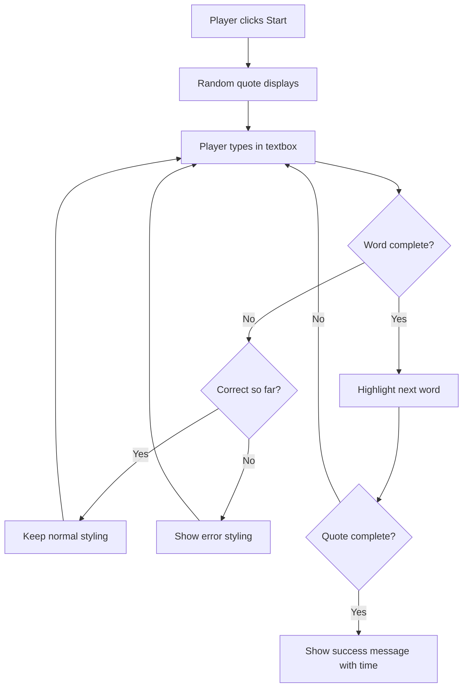
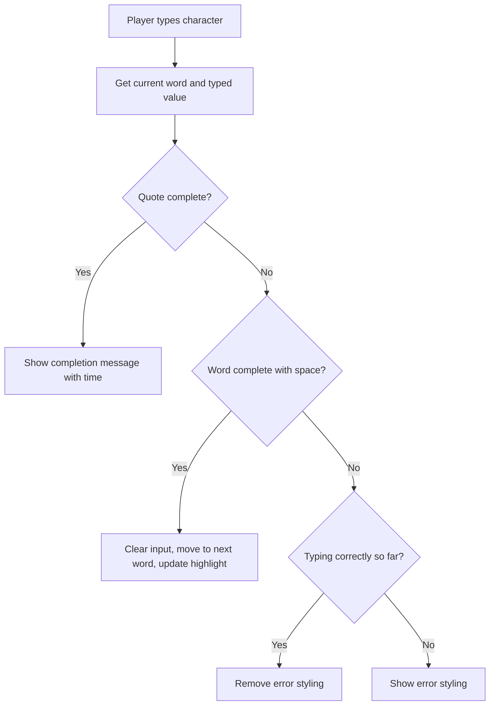

<!--
CO_OP_TRANSLATOR_METADATA:
{
  "original_hash": "e6b75e5b8caae906473a8a09d77b7121",
  "translation_date": "2025-10-23T21:15:22+00:00",
  "source_file": "4-typing-game/typing-game/README.md",
  "language_code": "th"
}
-->
# สร้างเกมโดยใช้เหตุการณ์

คุณเคยสงสัยไหมว่าเว็บไซต์รู้ได้อย่างไรเมื่อคุณคลิกปุ่มหรือพิมพ์ในกล่องข้อความ? นั่นคือความมหัศจรรย์ของการเขียนโปรแกรมแบบขับเคลื่อนด้วยเหตุการณ์! ไม่มีวิธีไหนที่จะเรียนรู้ทักษะสำคัญนี้ได้ดีไปกว่าการสร้างสิ่งที่มีประโยชน์ - เกมวัดความเร็วในการพิมพ์ที่ตอบสนองต่อทุกการกดแป้นพิมพ์ของคุณ

คุณจะได้เห็นด้วยตัวเองว่าเบราว์เซอร์ "พูดคุย" กับโค้ด JavaScript ของคุณอย่างไร ทุกครั้งที่คุณคลิก พิมพ์ หรือเลื่อนเมาส์ เบราว์เซอร์จะส่งข้อความเล็กๆ (เราเรียกมันว่าเหตุการณ์) ไปยังโค้ดของคุณ และคุณจะเป็นคนตัดสินใจว่าจะตอบสนองอย่างไร!

เมื่อเราทำเสร็จ คุณจะได้สร้างเกมพิมพ์ที่ติดตามความเร็วและความแม่นยำของคุณ ที่สำคัญกว่านั้น คุณจะเข้าใจแนวคิดพื้นฐานที่ขับเคลื่อนทุกเว็บไซต์แบบโต้ตอบที่คุณเคยใช้ มาเริ่มกันเลย!

## แบบทดสอบก่อนเรียน

[แบบทดสอบก่อนเรียน](https://ff-quizzes.netlify.app/web/quiz/21)

## การเขียนโปรแกรมแบบขับเคลื่อนด้วยเหตุการณ์

ลองคิดถึงแอปหรือเว็บไซต์ที่คุณชื่นชอบ - อะไรทำให้มันดูมีชีวิตชีวาและตอบสนอง? ทั้งหมดนี้เกี่ยวกับการตอบสนองต่อสิ่งที่คุณทำ! ทุกการแตะ คลิก ปัด หรือกดแป้นพิมพ์สร้างสิ่งที่เราเรียกว่า "เหตุการณ์" และนั่นคือที่มาของความมหัศจรรย์ของการพัฒนาเว็บ

สิ่งที่ทำให้การเขียนโปรแกรมสำหรับเว็บน่าสนใจคือ เราไม่เคยรู้เลยว่าใครจะคลิกปุ่มนั้นหรือเริ่มพิมพ์ในกล่องข้อความเมื่อไหร่ พวกเขาอาจคลิกทันที รอห้านาที หรืออาจไม่คลิกเลย! ความไม่แน่นอนนี้หมายความว่าเราต้องคิดต่างออกไปเกี่ยวกับวิธีการเขียนโค้ดของเรา

แทนที่จะเขียนโค้ดที่ทำงานจากบนลงล่างเหมือนสูตรอาหาร เราเขียนโค้ดที่รอคอยอย่างอดทนเพื่อบางสิ่งที่จะเกิดขึ้น มันคล้ายกับวิธีที่ผู้ควบคุมโทรเลขในยุค 1800 นั่งข้างเครื่องของพวกเขา พร้อมที่จะตอบสนองทันทีเมื่อข้อความผ่านสายเข้ามา

แล้ว "เหตุการณ์" คืออะไร? พูดง่ายๆ ก็คือมันคือสิ่งที่เกิดขึ้น! เมื่อคุณคลิกปุ่ม - นั่นคือเหตุการณ์ เมื่อคุณพิมพ์ตัวอักษร - นั่นคือเหตุการณ์ เมื่อคุณเลื่อนเมาส์ - นั่นคืออีกเหตุการณ์หนึ่ง

การเขียนโปรแกรมแบบขับเคลื่อนด้วยเหตุการณ์ช่วยให้เราตั้งค่าโค้ดของเราให้ฟังและตอบสนอง เราสร้างฟังก์ชันพิเศษที่เรียกว่า **event listeners** ที่รอคอยอย่างอดทนสำหรับสิ่งที่เฉพาะเจาะจงที่จะเกิดขึ้น แล้วกระโดดเข้าสู่การทำงานเมื่อมันเกิดขึ้น

ลองนึกถึง event listeners เหมือนการมีออดสำหรับโค้ดของคุณ คุณตั้งค่าออด (`addEventListener()`), บอกมันว่าเสียงอะไรที่ต้องฟัง (เช่น 'click' หรือ 'keypress') และระบุว่าจะเกิดอะไรขึ้นเมื่อมีคนกดออด (ฟังก์ชันที่คุณกำหนดเอง)

**นี่คือวิธีการทำงานของ event listeners:**
- **ฟัง** การกระทำของผู้ใช้เฉพาะ เช่น คลิก กดแป้นพิมพ์ หรือเลื่อนเมาส์
- **ดำเนินการ** โค้ดที่คุณกำหนดเองเมื่อเหตุการณ์ที่ระบุเกิดขึ้น
- **ตอบสนอง** ทันทีต่อการโต้ตอบของผู้ใช้ สร้างประสบการณ์ที่ราบรื่น
- **จัดการ** เหตุการณ์หลายเหตุการณ์ในองค์ประกอบเดียวกันโดยใช้ listeners ต่างๆ

> **NOTE:** ควรเน้นว่ามีหลายวิธีในการสร้าง event listeners คุณสามารถใช้ฟังก์ชันนิรนาม หรือสร้างฟังก์ชันที่มีชื่อ คุณสามารถใช้ทางลัดต่างๆ เช่น การตั้งค่าคุณสมบัติ `click` หรือใช้ `addEventListener()` ในการฝึกของเรา เราจะมุ่งเน้นไปที่ `addEventListener()` และฟังก์ชันนิรนาม เนื่องจากเป็นเทคนิคที่นักพัฒนาเว็บใช้กันมากที่สุด นอกจากนี้ยังมีความยืดหยุ่นมากที่สุด เนื่องจาก `addEventListener()` ใช้ได้กับทุกเหตุการณ์ และชื่อเหตุการณ์สามารถระบุเป็นพารามิเตอร์ได้

### เหตุการณ์ทั่วไป

ในขณะที่เบราว์เซอร์เว็บมีเหตุการณ์หลายสิบเหตุการณ์ที่คุณสามารถฟังได้ แอปพลิเคชันแบบโต้ตอบส่วนใหญ่พึ่งพาเหตุการณ์สำคัญเพียงไม่กี่เหตุการณ์ การเข้าใจเหตุการณ์หลักเหล่านี้จะช่วยให้คุณมีพื้นฐานในการสร้างการโต้ตอบของผู้ใช้ที่ซับซ้อน

มี [เหตุการณ์หลายสิบ](https://developer.mozilla.org/docs/Web/Events) ที่คุณสามารถฟังได้เมื่อสร้างแอปพลิเคชัน โดยพื้นฐานแล้วทุกสิ่งที่ผู้ใช้ทำบนหน้าเว็บจะสร้างเหตุการณ์ ซึ่งทำให้คุณมีพลังมากมายในการทำให้พวกเขาได้รับประสบการณ์ที่คุณต้องการ โชคดีที่คุณมักจะต้องใช้เหตุการณ์เพียงไม่กี่เหตุการณ์ นี่คือเหตุการณ์ทั่วไปบางส่วน (รวมถึงสองเหตุการณ์ที่เราจะใช้เมื่อสร้างเกมของเรา):

| เหตุการณ์ | คำอธิบาย | กรณีการใช้งานทั่วไป |
|------------|-----------|----------------------|
| `click` | ผู้ใช้คลิกบางสิ่ง | ปุ่ม ลิงก์ องค์ประกอบแบบโต้ตอบ |
| `contextmenu` | ผู้ใช้คลิกปุ่มเมาส์ขวา | เมนูคลิกขวาแบบกำหนดเอง |
| `select` | ผู้ใช้ไฮไลต์ข้อความบางส่วน | การแก้ไขข้อความ การคัดลอก |
| `input` | ผู้ใช้ป้อนข้อความ | การตรวจสอบฟอร์ม การค้นหาแบบเรียลไทม์ |

**การเข้าใจประเภทของเหตุการณ์เหล่านี้:**
- **กระตุ้น** เมื่อผู้ใช้โต้ตอบกับองค์ประกอบเฉพาะบนหน้าเว็บของคุณ
- **ให้** ข้อมูลรายละเอียดเกี่ยวกับการกระทำของผู้ใช้ผ่านวัตถุเหตุการณ์
- **ช่วยให้** คุณสร้างแอปพลิเคชันเว็บแบบโต้ตอบที่ตอบสนอง
- **ทำงาน** อย่างสม่ำเสมอในเบราว์เซอร์และอุปกรณ์ต่างๆ

## สร้างเกม

ตอนนี้คุณเข้าใจวิธีการทำงานของเหตุการณ์แล้ว มาลองนำความรู้นี้ไปใช้โดยการสร้างสิ่งที่มีประโยชน์ เราจะสร้างเกมวัดความเร็วในการพิมพ์ที่แสดงการจัดการเหตุการณ์ในขณะที่ช่วยให้คุณพัฒนาทักษะสำคัญของนักพัฒนา

เรากำลังจะสร้างเกมเพื่อสำรวจวิธีการทำงานของเหตุการณ์ใน JavaScript เกมของเราจะทดสอบทักษะการพิมพ์ของผู้เล่น ซึ่งเป็นหนึ่งในทักษะที่นักพัฒนามักมองข้ามไป ข้อเท็จจริงที่น่าสนใจ: แป้นพิมพ์ QWERTY ที่เราใช้ในปัจจุบันถูกออกแบบในปี 1870 สำหรับเครื่องพิมพ์ดีด - และทักษะการพิมพ์ที่ดียังคงมีคุณค่าอย่างมากสำหรับโปรแกรมเมอร์ในปัจจุบัน! ลำดับการทำงานของเกมจะมีลักษณะดังนี้:



**นี่คือวิธีการทำงานของเกมของเรา:**
- **เริ่มต้น** เมื่อผู้เล่นคลิกปุ่มเริ่มและแสดงข้อความสุ่ม
- **ติดตาม** ความคืบหน้าในการพิมพ์ของผู้เล่นทีละคำแบบเรียลไทม์
- **เน้น** คำปัจจุบันเพื่อช่วยให้ผู้เล่นโฟกัส
- **ให้** ข้อเสนอแนะภาพทันทีสำหรับข้อผิดพลาดในการพิมพ์
- **คำนวณ** และแสดงเวลารวมเมื่อพิมพ์ข้อความเสร็จสิ้น

มาสร้างเกมของเราและเรียนรู้เกี่ยวกับเหตุการณ์กันเถอะ!

### โครงสร้างไฟล์

ก่อนที่เราจะเริ่มเขียนโค้ด มาจัดระเบียบกันก่อน! การมีโครงสร้างไฟล์ที่สะอาดตั้งแต่เริ่มต้นจะช่วยให้คุณไม่ปวดหัวในภายหลังและทำให้โปรเจกต์ของคุณดูเป็นมืออาชีพ 😊

เราจะทำให้ทุกอย่างง่ายด้วยไฟล์เพียงสามไฟล์: `index.html` สำหรับโครงสร้างหน้าเว็บของเรา, `script.js` สำหรับตรรกะของเกมทั้งหมด และ `style.css` เพื่อทำให้ทุกอย่างดูดี นี่คือสามสิ่งที่ขับเคลื่อนเว็บส่วนใหญ่!

**สร้างโฟลเดอร์ใหม่สำหรับงานของคุณโดยเปิดคอนโซลหรือหน้าต่างเทอร์มินัลและใช้คำสั่งต่อไปนี้:**

```bash
# Linux or macOS
mkdir typing-game && cd typing-game

# Windows
md typing-game && cd typing-game
```

**นี่คือสิ่งที่คำสั่งเหล่านี้ทำ:**
- **สร้าง** ไดเรกทอรีใหม่ชื่อ `typing-game` สำหรับไฟล์โปรเจกต์ของคุณ
- **นำทาง** ไปยังไดเรกทอรีที่สร้างขึ้นใหม่โดยอัตโนมัติ
- **ตั้งค่า** พื้นที่ทำงานที่สะอาดสำหรับการพัฒนาเกมของคุณ

**เปิด Visual Studio Code:**

```bash
code .
```

**คำสั่งนี้:**
- **เปิด** Visual Studio Code ในไดเรกทอรีปัจจุบัน
- **เปิด**โฟลเดอร์โปรเจกต์ของคุณในตัวแก้ไข
- **ให้** เข้าถึงเครื่องมือพัฒนาทั้งหมดที่คุณต้องการ

**เพิ่มไฟล์สามไฟล์ลงในโฟลเดอร์ใน Visual Studio Code โดยใช้ชื่อดังนี้:**
- `index.html` - ประกอบด้วยโครงสร้างและเนื้อหาของเกมของคุณ
- `script.js` - จัดการตรรกะของเกมและ event listeners ทั้งหมด
- `style.css` - กำหนดรูปลักษณ์และการจัดรูปแบบ

## สร้างส่วนติดต่อผู้ใช้

ตอนนี้มาสร้างเวทีที่การดำเนินการของเกมทั้งหมดจะเกิดขึ้น! ลองนึกถึงสิ่งนี้เหมือนการออกแบบแผงควบคุมสำหรับยานอวกาศ - เราต้องแน่ใจว่าสิ่งที่ผู้เล่นของเราต้องการอยู่ในตำแหน่งที่พวกเขาคาดหวัง

มาดูกันว่าเกมของเราต้องการอะไรจริงๆ หากคุณกำลังเล่นเกมพิมพ์ คุณอยากเห็นอะไรบนหน้าจอ? นี่คือสิ่งที่เราต้องการ:

| องค์ประกอบ UI | วัตถุประสงค์ | องค์ประกอบ HTML |
|----------------|--------------|------------------|
| การแสดงข้อความ | แสดงข้อความที่ต้องพิมพ์ | `<p>` พร้อม `id="quote"` |
| พื้นที่ข้อความ | แสดงสถานะและข้อความสำเร็จ | `<p>` พร้อม `id="message"` |
| กล่องข้อความ | ที่ที่ผู้เล่นพิมพ์ข้อความ | `<input>` พร้อม `id="typed-value"` |
| ปุ่มเริ่ม | เริ่มเกม | `<button>` พร้อม `id="start"` |

**การเข้าใจโครงสร้าง UI:**
- **จัดระเบียบ** เนื้อหาอย่างมีตรรกะจากบนลงล่าง
- **กำหนด** ID เฉพาะให้กับองค์ประกอบเพื่อการกำหนดเป้าหมายใน JavaScript
- **ให้** ลำดับชั้นภาพที่ชัดเจนเพื่อประสบการณ์ผู้ใช้ที่ดีขึ้น
- **รวม** องค์ประกอบ HTML เชิงความหมายเพื่อการเข้าถึง

แต่ละองค์ประกอบจะต้องมี ID เพื่อให้เราสามารถทำงานกับมันใน JavaScript ของเราได้ เราจะเพิ่มการอ้างอิงไปยังไฟล์ CSS และ JavaScript ที่เรากำลังจะสร้างด้วย

สร้างไฟล์ใหม่ชื่อ `index.html` เพิ่ม HTML ต่อไปนี้:

```html
<!-- inside index.html -->
<html>
<head>
  <title>Typing game</title>
  <link rel="stylesheet" href="style.css">
</head>
<body>
  <h1>Typing game!</h1>
  <p>Practice your typing skills with a quote from Sherlock Holmes. Click **start** to begin!</p>
  <p id="quote"></p> <!-- This will display our quote -->
  <p id="message"></p> <!-- This will display any status messages -->
  <div>
    <input type="text" aria-label="current word" id="typed-value" /> <!-- The textbox for typing -->
    <button type="button" id="start">Start</button> <!-- To start the game -->
  </div>
  <script src="script.js"></script>
</body>
</html>
```

**การแยกย่อยสิ่งที่โครงสร้าง HTML นี้ทำ:**
- **ลิงก์** ไฟล์ CSS stylesheet ใน `<head>` เพื่อการจัดรูปแบบ
- **สร้าง** หัวข้อและคำแนะนำที่ชัดเจนสำหรับผู้ใช้
- **ตั้งค่า** ย่อหน้าตัวอย่างพร้อม ID เฉพาะสำหรับเนื้อหาแบบไดนามิก
- **รวม** ช่องป้อนข้อมูลพร้อมคุณสมบัติการเข้าถึง
- **ให้** ปุ่มเริ่มเพื่อเริ่มเกม
- **โหลด** ไฟล์ JavaScript ที่ท้ายสุดเพื่อประสิทธิภาพที่ดีที่สุด

### เปิดแอปพลิเคชัน

การทดสอบแอปพลิเคชันของคุณบ่อยๆ ระหว่างการพัฒนาช่วยให้คุณจับปัญหาได้เร็วและเห็นความคืบหน้าแบบเรียลไทม์ Live Server เป็นเครื่องมือที่มีค่าที่รีเฟรชเบราว์เซอร์ของคุณโดยอัตโนมัติเมื่อคุณบันทึกการเปลี่ยนแปลง ทำให้การพัฒนามีประสิทธิภาพมากขึ้น

การพัฒนาแบบค่อยเป็นค่อยไปเพื่อดูว่าทุกอย่างดูเป็นอย่างไรเป็นวิธีที่ดีที่สุด มาเปิดแอปพลิเคชันของเรากัน มีส่วนขยายที่ยอดเยี่ยมสำหรับ Visual Studio Code ชื่อ [Live Server](https://marketplace.visualstudio.com/items?itemName=ritwickdey.LiveServer&WT.mc_id=academic-77807-sagibbon) ซึ่งจะโฮสต์แอปพลิเคชันของคุณในเครื่องและรีเฟรชเบราว์เซอร์ทุกครั้งที่คุณบันทึก

**ติดตั้ง [Live Server](https://marketplace.visualstudio.com/items?itemName=ritwickdey.LiveServer&WT.mc_id=academic-77807-sagibbon) โดยทำตามลิงก์และคลิกติดตั้ง:**

**นี่คือสิ่งที่เกิดขึ้นระหว่างการติดตั้ง:**
- **กระตุ้น** เบราว์เซอร์ของคุณให้เปิด Visual Studio Code
- **แนะนำ** คุณผ่านกระบวนการติดตั้งส่วนขยาย
- **อาจต้องการ** การรีสตาร์ท Visual Studio Code เพื่อการตั้งค่าที่สมบูรณ์

**เมื่อติดตั้งแล้ว ใน Visual Studio Code คลิก Ctrl-Shift-P (หรือ Cmd-Shift-P) เพื่อเปิด command palette:**

**การเข้าใจ command palette:**
- **ให้** การเข้าถึงคำสั่งทั้งหมดของ VS Code อย่างรวดเร็ว
- **ค้นหา** คำสั่งเมื่อคุณพิมพ์
- **เสนอ** คีย์ลัดเพื่อการพัฒนาที่เร็วขึ้น

**พิมพ์ "Live Server: Open with Live Server":**

**สิ่งที่ Live Server ทำ:**
- **เริ่มต้น** เซิร์ฟเวอร์พัฒนาท้องถิ่นสำหรับโปรเจกต์ของคุณ
- **รีเฟรช** เบราว์เซอร์โดยอัตโนมัติเมื่อคุณบันทึกไฟล์
- **ให้บริการ** ไฟล์ของคุณจาก URL ท้องถิ่น (โดยทั่วไปคือ `localhost:5500`)

**เปิดเบราว์เซอร์และไปที่ `https://localhost:5500`:**

ตอนนี้คุณควรเห็นหน้าที่คุณสร้างขึ้น! มาเพิ่มฟังก์ชันกันเถอะ

## เพิ่ม CSS

ตอนนี้มาทำให้ทุกอย่างดูดี! ข้อเสนอแนะภาพมีความสำคัญต่อส่วนติดต่อผู้ใช้ตั้งแต่ยุคแรกๆ ของการคำนวณ ในปี 1980 นักวิจัยค้นพบว่าข้อเสนอแนะภาพทันทีช่วยปรับปรุงประสิทธิภาพของผู้ใช้และลดข้อผิดพลาดอย่างมาก นั่นคือสิ่งที่เรากำลังจะสร้าง

เกมของเราต้องชัดเจนอย่างยิ่งเกี่ยวกับสิ่งที่เกิดขึ้น ผู้เล่นควรรู้ทันทีว่าคำไหนที่พวกเขาควรพิมพ์ และหากพวกเขาทำผิดพลาด พวกเขาควรเห็นมันทันที มาสร้างการจัดรูปแบบที่เรียบง่ายแต่มีประสิทธิภาพกันเถอะ:

สร้างไฟล์ใหม่ชื่อ `style.css` และเพิ่มไวยากรณ์ต่อไปนี้

```css
/* inside style.css */
.highlight {
  background-color: yellow;
}

.error {
  background-color: lightcoral;
  border: red;
}
```

**การเข้าใจคลาส CSS เหล่านี้:**
- **เน้น** คำปัจจุบันด้วยพื้นหลังสีเหลืองเพื่อคำแนะนำภาพที่ชัดเจน
- **ส่งสัญญาณ** ข้อผิดพลาดในการพิมพ์ด้วยสีพื้นหลังสีปะการังอ่อน
- **ให้** ข้อเสนอแนะทันทีโดยไม่รบกวนการพิมพ์ของผู้ใช้
- **ใช้** สีที่ตัดกันเพื่อการเข้าถึงและการสื่อสารภาพที่ชัดเจน

✅ เมื่อพูดถึง CSS คุณสามารถจัดวางหน้าเว็บของคุณได้ตามที่คุณต้องการ ใช้เวลาสักครู่และทำให้หน้าดูดึงดูดมากขึ้น:

- เลือกแบบอักษรที่แตกต่าง
- เพิ่มสีให้หัวข้อ
- ปรับขนาดองค์ประกอบ

## JavaScript

นี่คือจุดที่น่าสนใจ! 🎉 เรามีโครงสร้าง HTML และการจัดรูปแบบ CSS ของเราแล้ว แต่ตอนนี้เกมของเรายังเหมือนรถสวยๆ ที่ไม่มีเครื่องยนต์ JavaScript จะเป็นเครื่องยนต์นั้น - มันคือสิ่งที่ทำให้ทุกอย่างทำงานจริงและตอบสนอง
| อาร์เรย์ของคำพูด | เก็บคำพูดทั้งหมดที่เป็นไปได้สำหรับเกม | `['Quote 1', 'Quote 2', ...]` |
| อาร์เรย์คำ | แยกคำพูดปัจจุบันออกเป็นคำแต่ละคำ | `['When', 'you', 'have', ...]` |
| ดัชนีคำ | ติดตามคำที่ผู้เล่นกำลังพิมพ์ | `0, 1, 2, 3...` |
| เวลาเริ่มต้น | คำนวณเวลาที่ผ่านไปเพื่อการให้คะแนน | `Date.now()` |

**เรายังต้องการการอ้างอิงถึงองค์ประกอบ UI ของเรา:**
| องค์ประกอบ | ID | วัตถุประสงค์ |
|------------|----|--------------|
| ช่องป้อนข้อความ | `typed-value` | ที่ที่ผู้เล่นพิมพ์ |
| การแสดงคำพูด | `quote` | แสดงคำพูดที่ต้องพิมพ์ |
| พื้นที่ข้อความ | `message` | แสดงการอัปเดตสถานะ |

```javascript
// inside script.js
// all of our quotes
const quotes = [
    'When you have eliminated the impossible, whatever remains, however improbable, must be the truth.',
    'There is nothing more deceptive than an obvious fact.',
    'I ought to know by this time that when a fact appears to be opposed to a long train of deductions it invariably proves to be capable of bearing some other interpretation.',
    'I never make exceptions. An exception disproves the rule.',
    'What one man can invent another can discover.',
    'Nothing clears up a case so much as stating it to another person.',
    'Education never ends, Watson. It is a series of lessons, with the greatest for the last.',
];
// store the list of words and the index of the word the player is currently typing
let words = [];
let wordIndex = 0;
// the starting time
let startTime = Date.now();
// page elements
const quoteElement = document.getElementById('quote');
const messageElement = document.getElementById('message');
const typedValueElement = document.getElementById('typed-value');
```

**การแยกย่อยสิ่งที่โค้ดตั้งค่าทำได้:**
- **เก็บ** อาร์เรย์ของคำพูดจาก Sherlock Holmes โดยใช้ `const` เนื่องจากคำพูดจะไม่เปลี่ยนแปลง
- **เริ่มต้น** ตัวแปรติดตามด้วย `let` เนื่องจากค่าจะอัปเดตระหว่างการเล่นเกม
- **จับ** การอ้างอิงถึงองค์ประกอบ DOM โดยใช้ `document.getElementById()` เพื่อการเข้าถึงที่มีประสิทธิภาพ
- **ตั้งค่า** พื้นฐานสำหรับฟังก์ชันการทำงานของเกมทั้งหมดด้วยชื่อตัวแปรที่ชัดเจนและอธิบายได้
- **จัดระเบียบ** ข้อมูลและองค์ประกอบที่เกี่ยวข้องอย่างมีเหตุผลเพื่อให้ง่ายต่อการดูแลรักษาโค้ด

✅ ลองเพิ่มคำพูดเพิ่มเติมในเกมของคุณ

> 💡 **เคล็ดลับมือโปร**: เราสามารถดึงองค์ประกอบได้ทุกเมื่อในโค้ดโดยใช้ `document.getElementById()` เนื่องจากเราจะอ้างถึงองค์ประกอบเหล่านี้เป็นประจำ เราจะหลีกเลี่ยงข้อผิดพลาดในการพิมพ์ด้วยตัวอักษรโดยใช้ค่าคงที่ เฟรมเวิร์คเช่น [Vue.js](https://vuejs.org/) หรือ [React](https://reactjs.org/) สามารถช่วยคุณจัดการโค้ดของคุณได้ดีขึ้น
>
**เหตุผลที่วิธีนี้ทำงานได้ดี:**
- **ป้องกัน** ข้อผิดพลาดในการสะกดเมื่ออ้างถึงองค์ประกอบหลายครั้ง
- **ปรับปรุง** ความสามารถในการอ่านโค้ดด้วยชื่อค่าคงที่ที่อธิบายได้
- **ช่วยให้** IDE สนับสนุนการเติมคำอัตโนมัติและการตรวจสอบข้อผิดพลาดได้ดีขึ้น
- **ทำให้** การปรับปรุงโค้ดง่ายขึ้นหาก ID ขององค์ประกอบเปลี่ยนแปลงในภายหลัง

ใช้เวลาสักครู่เพื่อดูวิดีโอเกี่ยวกับการใช้ `const`, `let` และ `var`

[](https://youtube.com/watch?v=JNIXfGiDWM8 "ประเภทของตัวแปร")

> 🎥 คลิกที่ภาพด้านบนเพื่อดูวิดีโอเกี่ยวกับตัวแปร

### เพิ่มตรรกะเริ่มต้น

นี่คือจุดที่ทุกอย่างเริ่มเข้าที่! 🚀 คุณกำลังจะเขียนตัวฟังเหตุการณ์จริงตัวแรกของคุณ และมีบางสิ่งที่น่าพอใจมากเกี่ยวกับการเห็นโค้ดของคุณตอบสนองต่อการคลิกปุ่ม

ลองคิดดู: ที่ไหนสักแห่ง ผู้เล่นจะคลิกปุ่ม "เริ่ม" และโค้ดของคุณต้องพร้อมสำหรับพวกเขา เราไม่มีทางรู้ว่าพวกเขาจะคลิกเมื่อไหร่ - อาจจะทันที หรือหลังจากที่พวกเขาไปหยิบกาแฟ - แต่เมื่อพวกเขาทำ เกมของคุณจะเริ่มต้นขึ้น

เมื่อผู้ใช้คลิก `start` เราต้องเลือกคำพูด ตั้งค่าการแสดงผลของผู้ใช้ และตั้งค่าการติดตามสำหรับคำปัจจุบันและเวลา ด้านล่างนี้คือ JavaScript ที่คุณต้องเพิ่ม เราจะพูดถึงมันหลังจากบล็อกสคริปต์

```javascript
// at the end of script.js
document.getElementById('start').addEventListener('click', () => {
  // get a quote
  const quoteIndex = Math.floor(Math.random() * quotes.length);
  const quote = quotes[quoteIndex];
  // Put the quote into an array of words
  words = quote.split(' ');
  // reset the word index for tracking
  wordIndex = 0;

  // UI updates
  // Create an array of span elements so we can set a class
  const spanWords = words.map(function(word) { return `<span>${word} </span>`});
  // Convert into string and set as innerHTML on quote display
  quoteElement.innerHTML = spanWords.join('');
  // Highlight the first word
  quoteElement.childNodes[0].className = 'highlight';
  // Clear any prior messages
  messageElement.innerText = '';

  // Setup the textbox
  // Clear the textbox
  typedValueElement.value = '';
  // set focus
  typedValueElement.focus();
  // set the event handler

  // Start the timer
  startTime = new Date().getTime();
});
```

**มาดูโค้ดในส่วนต่าง ๆ อย่างมีเหตุผล:**

**📊 การตั้งค่าการติดตามคำ:**
- **เลือก** คำพูดแบบสุ่มโดยใช้ `Math.floor()` และ `Math.random()` เพื่อความหลากหลาย
- **แปลง** คำพูดเป็นอาร์เรย์ของคำแต่ละคำโดยใช้ `split(' ')`
- **รีเซ็ต** `wordIndex` เป็น 0 เนื่องจากผู้เล่นเริ่มต้นที่คำแรก
- **เตรียม** สถานะเกมสำหรับรอบใหม่

**🎨 การตั้งค่าและการแสดงผล UI:**
- **สร้าง** อาร์เรย์ขององค์ประกอบ `<span>` โดยห่อแต่ละคำเพื่อการจัดรูปแบบเฉพาะ
- **รวม** องค์ประกอบ span เป็นสตริงเดียวเพื่อการอัปเดต DOM ที่มีประสิทธิภาพ
- **เน้น** คำแรกโดยเพิ่มคลาส CSS `highlight`
- **ล้าง** ข้อความเกมก่อนหน้าเพื่อให้มีพื้นที่ว่าง

**⌨️ การเตรียมช่องป้อนข้อความ:**
- **ล้าง** ข้อความที่มีอยู่ในช่องป้อนข้อความ
- **ตั้งค่าโฟกัส** ไปที่ช่องป้อนข้อความเพื่อให้ผู้เล่นเริ่มพิมพ์ได้ทันที
- **เตรียม** พื้นที่ป้อนข้อมูลสำหรับเซสชันเกมใหม่

**⏱️ การเริ่มต้นตัวจับเวลา:**
- **จับ** เวลาปัจจุบันโดยใช้ `new Date().getTime()`
- **เปิดใช้งาน** การคำนวณความเร็วในการพิมพ์และเวลาที่ใช้ในการเสร็จสิ้นอย่างแม่นยำ
- **เริ่มต้น** การติดตามประสิทธิภาพสำหรับเซสชันเกม

### เพิ่มตรรกะการพิมพ์

นี่คือจุดที่เราจัดการหัวใจของเกมของเรา! อย่ากังวลหากสิ่งนี้ดูเหมือนเยอะในตอนแรก - เราจะอธิบายทุกส่วน และเมื่อจบ คุณจะเห็นว่ามันมีเหตุผลอย่างไร

สิ่งที่เรากำลังสร้างที่นี่ค่อนข้างซับซ้อน: ทุกครั้งที่มีคนพิมพ์ตัวอักษร โค้ดของเราจะตรวจสอบสิ่งที่พวกเขาพิมพ์ ให้ข้อเสนอแนะ และตัดสินใจว่าจะเกิดอะไรขึ้นต่อไป มันคล้ายกับวิธีที่โปรแกรมประมวลผลคำในยุคแรก ๆ เช่น WordStar ในปี 1970 ให้ข้อเสนอแนะแบบเรียลไทม์แก่ผู้พิมพ์

```javascript
// at the end of script.js
typedValueElement.addEventListener('input', () => {
  // Get the current word
  const currentWord = words[wordIndex];
  // get the current value
  const typedValue = typedValueElement.value;

  if (typedValue === currentWord && wordIndex === words.length - 1) {
    // end of sentence
    // Display success
    const elapsedTime = new Date().getTime() - startTime;
    const message = `CONGRATULATIONS! You finished in ${elapsedTime / 1000} seconds.`;
    messageElement.innerText = message;
  } else if (typedValue.endsWith(' ') && typedValue.trim() === currentWord) {
    // end of word
    // clear the typedValueElement for the new word
    typedValueElement.value = '';
    // move to the next word
    wordIndex++;
    // reset the class name for all elements in quote
    for (const wordElement of quoteElement.childNodes) {
      wordElement.className = '';
    }
    // highlight the new word
    quoteElement.childNodes[wordIndex].className = 'highlight';
  } else if (currentWord.startsWith(typedValue)) {
    // currently correct
    // highlight the next word
    typedValueElement.className = '';
  } else {
    // error state
    typedValueElement.className = 'error';
  }
});
```

**การทำความเข้าใจการไหลของตรรกะการพิมพ์:**

ฟังก์ชันนี้ใช้วิธีการแบบน้ำตก โดยตรวจสอบเงื่อนไขจากเฉพาะเจาะจงที่สุดไปยังทั่วไปที่สุด มาดูแต่ละสถานการณ์:



**🏁 คำพูดเสร็จสมบูรณ์ (สถานการณ์ที่ 1):**
- **ตรวจสอบ** ว่าค่าที่พิมพ์ตรงกับคำปัจจุบันและเราอยู่ที่คำสุดท้าย
- **คำนวณ** เวลาที่ผ่านไปโดยการลบเวลาเริ่มต้นออกจากเวลาปัจจุบัน
- **แปลง** มิลลิวินาทีเป็นวินาทีโดยการหารด้วย 1,000
- **แสดง** ข้อความแสดงความยินดีพร้อมเวลาที่ใช้

**✅ คำเสร็จสมบูรณ์ (สถานการณ์ที่ 2):**
- **ตรวจจับ** การเสร็จสิ้นคำเมื่อการป้อนข้อมูลลงท้ายด้วยช่องว่าง
- **ตรวจสอบ** ว่าข้อมูลที่ตัดแต่งตรงกับคำปัจจุบันอย่างถูกต้อง
- **ล้าง** ช่องป้อนข้อมูลสำหรับคำถัดไป
- **ก้าวหน้า** ไปยังคำถัดไปโดยการเพิ่ม `wordIndex`
- **อัปเดต** การเน้นภาพโดยการลบคลาสทั้งหมดและเน้นคำใหม่

**📝 การพิมพ์ดำเนินการต่อ (สถานการณ์ที่ 3):**
- **ตรวจสอบ** ว่าคำปัจจุบันเริ่มต้นด้วยสิ่งที่พิมพ์มาจนถึงตอนนี้
- **ลบ** การจัดรูปแบบข้อผิดพลาดเพื่อแสดงว่าการป้อนข้อมูลถูกต้อง
- **อนุญาต** ให้พิมพ์ต่อไปโดยไม่มีการขัดจังหวะ

**❌ สถานะข้อผิดพลาด (สถานการณ์ที่ 4):**
- **เรียกใช้** เมื่อข้อความที่พิมพ์ไม่ตรงกับการเริ่มต้นของคำที่คาดหวัง
- **ใช้** คลาส CSS ข้อผิดพลาดเพื่อให้ข้อเสนอแนะภาพทันที
- **ช่วย** ผู้เล่นระบุและแก้ไขข้อผิดพลาดได้อย่างรวดเร็ว

## ทดสอบแอปพลิเคชันของคุณ

ดูสิ่งที่คุณทำสำเร็จ! 🎉 คุณเพิ่งสร้างเกมพิมพ์จริงที่ใช้งานได้จากศูนย์โดยใช้การเขียนโปรแกรมที่ขับเคลื่อนด้วยเหตุการณ์ ใช้เวลาสักครู่เพื่อชื่นชมสิ่งนั้น - นี่ไม่ใช่เรื่องเล็กน้อย!

ตอนนี้ถึงเวลาทดสอบ! มันจะทำงานตามที่คาดไว้หรือไม่? เราพลาดอะไรไปหรือเปล่า? นี่คือสิ่งที่: หากบางสิ่งไม่ทำงานอย่างสมบูรณ์แบบในทันที นั่นเป็นเรื่องปกติอย่างสมบูรณ์ แม้แต่นักพัฒนาที่มีประสบการณ์ก็พบข้อบกพร่องในโค้ดของพวกเขาเป็นประจำ มันเป็นส่วนหนึ่งของกระบวนการพัฒนา!

คลิกที่ `start` และเริ่มพิมพ์! มันควรจะดูคล้ายกับแอนิเมชันที่เราเห็นก่อนหน้านี้


**สิ่งที่ต้องทดสอบในแอปพลิเคชันของคุณ:**
- **ตรวจสอบ** ว่าการคลิก Start แสดงคำพูดแบบสุ่ม
- **ยืนยัน** ว่าการพิมพ์เน้นคำปัจจุบันอย่างถูกต้อง
- **ตรวจสอบ** ว่าการจัดรูปแบบข้อผิดพลาดปรากฏขึ้นเมื่อพิมพ์ผิด
- **ตรวจสอบ** ว่าการเสร็จสิ้นคำทำให้การเน้นก้าวหน้าอย่างเหมาะสม
- **ทดสอบ** ว่าการเสร็จสิ้นคำพูดแสดงข้อความเสร็จสมบูรณ์พร้อมเวลา

**เคล็ดลับการแก้ไขข้อผิดพลาดทั่วไป:**
- **ตรวจสอบ** คอนโซลเบราว์เซอร์ (F12) สำหรับข้อผิดพลาด JavaScript
- **ยืนยัน** ว่าชื่อไฟล์ทั้งหมดตรงกันอย่างถูกต้อง (ตัวพิมพ์ใหญ่-เล็ก)
- **ตรวจสอบ** ว่า Live Server กำลังทำงานและรีเฟรชอย่างเหมาะสม
- **ทดสอบ** คำพูดต่าง ๆ เพื่อยืนยันว่าการเลือกแบบสุ่มทำงาน

---

## ความท้าทาย GitHub Copilot Agent 🎮

ใช้โหมด Agent เพื่อทำความท้าทายต่อไปนี้:

**คำอธิบาย:** ขยายเกมพิมพ์โดยการเพิ่มระบบปรับระดับความยากที่ปรับเกมตามประสิทธิภาพของผู้เล่น ความท้าทายนี้จะช่วยให้คุณฝึกการจัดการเหตุการณ์ขั้นสูง การวิเคราะห์ข้อมูล และการอัปเดต UI แบบไดนามิก

**คำสั่ง:** สร้างระบบปรับระดับความยากสำหรับเกมพิมพ์ที่:
1. ติดตามความเร็วในการพิมพ์ของผู้เล่น (คำต่อนาที) และเปอร์เซ็นต์ความถูกต้อง
2. ปรับอัตโนมัติเป็นสามระดับความยาก: ง่าย (คำพูดง่าย ๆ), ปานกลาง (คำพูดปัจจุบัน), ยาก (คำพูดซับซ้อนที่มีเครื่องหมายวรรคตอน)
3. แสดงระดับความยากปัจจุบันและสถิติของผู้เล่นบน UI
4. ใช้ตัวนับสตรีคที่เพิ่มความยากหลังจากการแสดงที่ดีติดต่อกัน 3 ครั้ง
5. เพิ่มข้อเสนอแนะภาพ (สี, แอนิเมชัน) เพื่อระบุการเปลี่ยนแปลงความยาก

เพิ่มองค์ประกอบ HTML, สไตล์ CSS และฟังก์ชัน JavaScript ที่จำเป็นเพื่อดำเนินการคุณลักษณะนี้ รวมถึงการจัดการข้อผิดพลาดที่เหมาะสมและตรวจสอบให้แน่ใจว่าเกมยังคงเข้าถึงได้ด้วยป้าย ARIA ที่เหมาะสม

เรียนรู้เพิ่มเติมเกี่ยวกับ [โหมด Agent](https://code.visualstudio.com/blogs/2025/02/24/introducing-copilot-agent-mode) ที่นี่

## 🚀 ความท้าทาย

พร้อมที่จะยกระดับเกมพิมพ์ของคุณไปอีกขั้นหรือยัง? ลองใช้คุณสมบัติขั้นสูงเหล่านี้เพื่อเพิ่มความเข้าใจของคุณเกี่ยวกับการจัดการเหตุการณ์และการจัดการ DOM:

**เพิ่มฟังก์ชันการทำงานเพิ่มเติม:**

| คุณสมบัติ | คำอธิบาย | ทักษะที่คุณจะฝึกฝน |
|-----------|-----------|---------------------|
| **การควบคุมการป้อนข้อมูล** | ปิดใช้งานตัวฟังเหตุการณ์ `input` เมื่อเสร็จสิ้น และเปิดใช้งานอีกครั้งเมื่อคลิกปุ่ม | การจัดการเหตุการณ์และการควบคุมสถานะ |
| **การจัดการสถานะ UI** | ปิดใช้งานช่องป้อนข้อความเมื่อผู้เล่นเสร็จสิ้นคำพูด | การจัดการคุณสมบัติ DOM |
| **กล่องโต้ตอบแบบโมดอล** | แสดงกล่องโต้ตอบแบบโมดอลพร้อมข้อความสำเร็จ | รูปแบบ UI ขั้นสูงและการเข้าถึง |
| **ระบบคะแนนสูง** | เก็บคะแนนสูงสุดโดยใช้ `localStorage` | API การจัดเก็บข้อมูลในเบราว์เซอร์และการคงอยู่ของข้อมูล |

**เคล็ดลับการดำเนินการ:**
- **ค้นคว้า** `localStorage.setItem()` และ `localStorage.getItem()` สำหรับการจัดเก็บข้อมูลถาวร
- **ฝึกฝน** การเพิ่มและลบตัวฟังเหตุการณ์แบบไดนามิก
- **สำรวจ** องค์ประกอบ dialog ของ HTML หรือรูปแบบโมดอลของ CSS
- **พิจารณา** การเข้าถึงเมื่อปิดใช้งานและเปิดใช้งานการควบคุมฟอร์ม

## แบบทดสอบหลังการบรรยาย

[แบบทดสอบหลังการบรรยาย](https://ff-quizzes.netlify.app/web/quiz/22)

## ทบทวนและศึกษาด้วยตนเอง

อ่านเกี่ยวกับ [เหตุการณ์ทั้งหมดที่มี](https://developer.mozilla.org/docs/Web/Events) ให้กับนักพัฒนาผ่านเบราว์เซอร์ และพิจารณาสถานการณ์ที่คุณจะใช้แต่ละเหตุการณ์

## งานที่ได้รับมอบหมาย

[สร้างเกมคีย์บอร์ดใหม่](assignment.md)

---

**ข้อจำกัดความรับผิดชอบ**:  
เอกสารนี้ได้รับการแปลโดยใช้บริการแปลภาษา AI [Co-op Translator](https://github.com/Azure/co-op-translator) แม้ว่าเราจะพยายามให้การแปลมีความถูกต้อง แต่โปรดทราบว่าการแปลโดยอัตโนมัติอาจมีข้อผิดพลาดหรือความไม่ถูกต้อง เอกสารต้นฉบับในภาษาดั้งเดิมควรถือเป็นแหล่งข้อมูลที่เชื่อถือได้ สำหรับข้อมูลที่สำคัญ ขอแนะนำให้ใช้บริการแปลภาษามืออาชีพ เราจะไม่รับผิดชอบต่อความเข้าใจผิดหรือการตีความผิดที่เกิดจากการใช้การแปลนี้