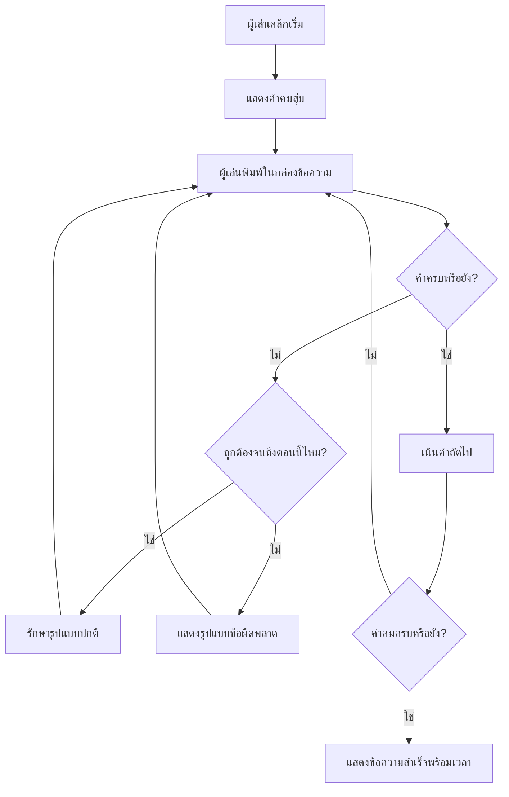
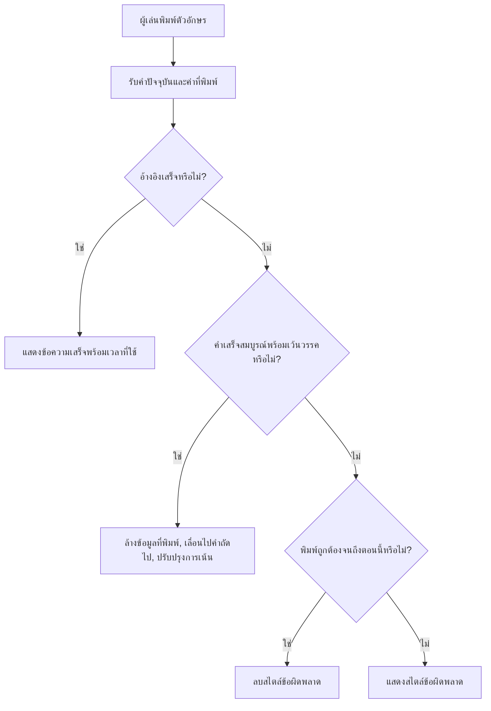
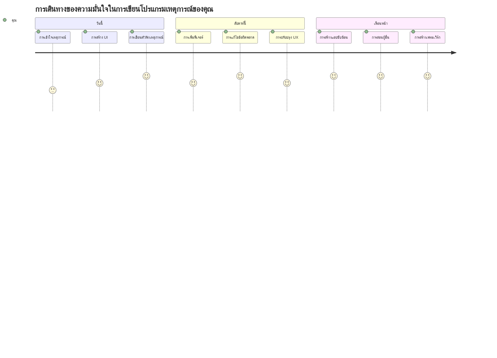

# การสร้างเกมโดยใช้เหตุการณ์

คุณเคยสงสัยไหมว่าเว็บไซต์รู้ได้อย่างไรเมื่อคุณคลิกปุ่มหรือพิมพ์ในกล่องข้อความ? นั่นคือความมหัศจรรย์ของโปรแกรมมิ่งแบบขับเคลื่อนด้วยเหตุการณ์! วิธีที่ดีที่สุดในการเรียนรู้ทักษะสำคัญนี้คือการสร้างสิ่งที่มีประโยชน์ - เกมวัดความเร็วการพิมพ์ที่ตอบสนองต่อทุกการกดแป้นที่คุณทำ

คุณจะได้เห็นด้วยตาคุณเองว่าเว็บเบราว์เซอร์ "สื่อสาร" กับโค้ด JavaScript ของคุณอย่างไร ทุกครั้งที่คุณคลิก พิมพ์ หรือเคลื่อนเมาส์ เบราว์เซอร์จะส่งข้อความเล็กๆ (เราเรียกว่าเหตุการณ์) ไปยังโค้ดของคุณ และคุณเป็นคนตัดสินใจว่าจะตอบสนองอย่างไร!

เมื่อเราทำเสร็จแล้ว คุณจะได้สร้างเกมพิมพ์จริงที่ติดตามความเร็วและความแม่นยำของคุณ ที่สำคัญกว่านั้น คุณจะเข้าใจแนวคิดพื้นฐานที่ขับเคลื่อนเว็บไซต์เชิงโต้ตอบทุกเว็บไซต์ที่คุณเคยใช้ มาเริ่มกันเลย!

## แบบทดสอบก่อนบรรยาย

[แบบทดสอบก่อนบรรยาย](https://ff-quizzes.netlify.app/web/quiz/21)

## การเขียนโปรแกรมขับเคลื่อนด้วยเหตุการณ์

คิดถึงแอปหรือเว็บไซต์ที่คุณชื่นชอบ - อะไรทำให้รู้สึกมีชีวิตชีวาและตอบสนอง? มันเกี่ยวกับวิธีที่มันตอบสนองต่อสิ่งที่คุณทำ! ทุกการแตะ คลิก ปัด หรือกดแป้นพิมพ์สร้างสิ่งที่เราเรียกว่า "เหตุการณ์" และนั่นคือจุดที่ความมหัศจรรย์ของการพัฒนาเว็บเกิดขึ้น

นี่คือสิ่งที่ทำให้การเขียนโปรแกรมสำหรับเว็บน่าสนใจ: เราไม่เคยรู้ว่าคนจะคลิกปุ่มนั้นเมื่อไหร่ หรือเริ่มพิมพ์ในกล่องข้อความเมื่อไหร่ พวกเขาอาจคลิกทันที รอห้านาที หรือบางทีอาจไม่คลิกเลย! ความไม่แน่นอนนี้หมายความว่าเราต้องคิดต่างออกไปเกี่ยวกับวิธีการเขียนโค้ดของเรา

แทนที่จะเขียนโค้ดที่ทำงานจากบนลงล่างเหมือนสูตรอาหาร เราจะเขียนโค้ดที่นั่งรออย่างอดทนเพื่อให้บางอย่างเกิดขึ้น เหมือนกับที่โอเปอเรเตอร์โทรเลขในยุค 1800 นั่งอยู่ข้างเครื่องของพวกเขา พร้อมตอบสนองทันทีที่มีข้อความผ่านสายลวด

แล้ว "เหตุการณ์" คืออะไร? ง่ายๆ คือสิ่งที่เกิดขึ้น! เมื่อคุณคลิกปุ่ม—นั่นคือเหตุการณ์ เมื่อคุณพิมพ์ตัวอักษร—นั่นคือเหตุการณ์ เมื่อคุณเคลื่อนเมาส์—นั่นคือเหตุการณ์อีกอย่างหนึ่ง

การเขียนโปรแกรมขับเคลื่อนด้วยเหตุการณ์ช่วยให้เราตั้งค่าโค้ดให้ฟังและตอบสนอง เราสร้างฟังก์ชั่นพิเศษที่เรียกว่า **event listeners** ซึ่งนั่งรออย่างอดทนเพื่อให้สิ่งเฉพาะเกิดขึ้น แล้วทำงานทันทีที่เกิดเหตุการณ์นั้น

เปรียบเสมือน event listeners เหมือนกับการติดตั้งกริ่งประตูสำหรับโค้ดของคุณ คุณตั้งกริ่ง (`addEventListener()`), บอกเสียงที่ต้องฟัง (เช่น 'click' หรือ 'keypress') และระบุว่าจะทำอะไรเมื่อมีคนกดกริ่ง (ฟังก์ชันที่คุณเขียนเอง)

**นี่คือวิธีการทำงานของ event listeners:**
- **ฟัง** การกระทำของผู้ใช้เฉพาะ เช่น การคลิก การกดแป้น หรือการเคลื่อนเมาส์
- **ดำเนินการ** โค้ดที่คุณเขียนเมื่อเกิดเหตุการณ์ที่กำหนด
- **ตอบสนอง** ทันทีต่อปฏิสัมพันธ์ของผู้ใช้ สร้างประสบการณ์ที่ไร้รอยต่อ
- **จัดการ** เหตุการณ์หลายเหตุการณ์บนองค์ประกอบเดียวกันโดยใช้ตัวฟังต่างกันหลายตัว

> **หมายเหตุ:** ควรเน้นว่าวิธีสร้าง event listeners มีหลากหลาย คุณสามารถใช้ฟังก์ชันนิรนาม หรือสร้างฟังก์ชันที่ตั้งชื่อได้ คุณสามารถใช้ทางลัดต่างๆ เช่น การตั้งค่าคุณสมบัติ `click` หรือใช้ `addEventListener()` ในการฝึกนี้เราจะเน้นที่ `addEventListener()` และฟังก์ชันนิรนามเพราะเป็นเทคนิคที่นักพัฒนาเว็บใช้บ่อยที่สุด และมีความยืดหยุ่นสูง เนื่องจาก `addEventListener()` ใช้ได้กับทุกเหตุการณ์ และชื่อเหตุการณ์สามารถระบุเป็นพารามิเตอร์ได้

### เหตุการณ์ทั่วไป

ในขณะที่เว็บเบราว์เซอร์มีเหตุการณ์ให้ฟังหลายสิบเหตุการณ์ แอปโต้ตอบส่วนใหญ่พึ่งพาเพียงไม่กี่เหตุการณ์ที่จำเป็น การเข้าใจเหตุการณ์หลักเหล่านี้จะช่วยให้คุณมีพื้นฐานในการสร้างปฏิสัมพันธ์ผู้ใช้ขั้นสูง

มี [เหตุการณ์หลายสิบเหตุการณ์](https://developer.mozilla.org/docs/Web/Events) ให้คุณฟังเมื่อสร้างแอป โปรแกรมเกือบทุกอย่างที่ผู้ใช้ทำในหน้าเว็บจะกระตุ้นเหตุการณ์ ซึ่งทำให้คุณมีอำนาจสูงในการรับประกันว่าผู้ใช้จะได้รับประสบการณ์ที่คุณต้องการ ปกติแล้วคุณจะต้องการเพียงไม่กี่เหตุการณ์เท่านั้น นี่คือตัวอย่างที่พบบ่อย (รวมถึงสองเหตุการณ์ที่เราจะใช้ในเกมของเรา):

| เหตุการณ์ | คำอธิบาย | กรณีใช้งานทั่วไป |
|-----------|-----------|------------------|
| `click` | ผู้ใช้คลิกบางอย่าง | ปุ่ม, ลิงก์, องค์ประกอบ interactive |
| `contextmenu` | ผู้ใช้คลิกเมาส์ขวา | เมนูคลิกขวาที่กำหนดเอง |
| `select` | ผู้ใช้เลือกข้อความบางส่วน | แก้ไขข้อความ, คัดลอก |
| `input` | ผู้ใช้ป้อนข้อความ | การตรวจสอบแบบฟอร์ม, การค้นหาแบบเรียลไทม์ |

**เข้าใจประเภทเหตุการณ์เหล่านี้:**
- **เปิดใช้งาน** เมื่อผู้ใช้โต้ตอบกับองค์ประกอบเฉพาะในหน้า
- **ให้ข้อมูลรายละเอียด** เกี่ยวกับการกระทำของผู้ใช้ผ่านวัตถุเหตุการณ์
- **ช่วยให้** คุณสร้างเว็บแอปพลิเคชันที่ตอบสนองและโต้ตอบได้
- **ทำงาน** อย่างสม่ำเสมอในเว็บเบราว์เซอร์และอุปกรณ์ต่างๆ

## การสร้างเกม

ตอนนี้คุณเข้าใจวิธีการทำงานของเหตุการณ์แล้ว มาใช้ความรู้นั้นกับการสร้างสิ่งที่มีประโยชน์กัน เราจะสร้างเกมวัดความเร็วการพิมพ์ที่แสดงการจัดการเหตุการณ์ในขณะที่ช่วยพัฒนาทักษะสำคัญของนักพัฒนา

เราจะสร้างเกมเพื่อสำรวจวิธีการทำงานของเหตุการณ์ใน JavaScript เกมของเราจะทดสอบทักษะการพิมพ์ของผู้เล่น ซึ่งเป็นหนึ่งในทักษะที่ผู้พัฒนาทุกคนควรมี เรื่องสนุก: แป้นพิมพ์แผงปุ่ม QWERTY ที่เราใช้ในปัจจุบันถูกออกแบบในปี 1870 สำหรับเครื่องพิมพ์ดีด — และทักษะการพิมพ์ที่ดีนั้นยังมีค่ายิ่งสำหรับโปรแกรมเมอร์สมัยนี้! รูปแบบทั่วไปของเกมจะเป็นดังนี้:


**นี่คือการทำงานของเกมเรา:**
- **เริ่มต้น** เมื่อผู้เล่นคลิกปุ่มเริ่มและแสดงคำพูดสุ่ม
- **ติดตาม** ความก้าวหน้าการพิมพ์ของผู้เล่นทีละคำแบบเรียลไทม์
- **เน้น** คำปัจจุบันเพื่อชี้แนะจุดสนใจของผู้เล่น
- **ให้** ปฏิกิริยาทันทีที่เห็นข้อผิดพลาดในการพิมพ์
- **คำนวณ** และแสดงเวลารวมเมื่อคำพูดเสร็จสมบูรณ์

มาเริ่มสร้างเกมและเรียนรู้เกี่ยวกับเหตุการณ์กันเถอะ!

### โครงสร้างไฟล์

ก่อนเริ่มเขียนโค้ด ให้เราจัดระเบียบ! การมีโครงสร้างไฟล์ที่สะอาดตั้งแต่ต้นจะช่วยลดปัญหาในภายหลังและทำให้โครงการของคุณดูเป็นมืออาชีพขึ้น 😊

เราจะทำให้ง่ายด้วยไฟล์สามไฟล์: `index.html` สำหรับโครงสร้างหน้า, `script.js` สำหรับตรรกะเกมทั้งหมด, และ `style.css` เพื่อทำให้ทุกอย่างดูดี นี่คือชุดคลาสสิกที่ขับเคลื่อนเว็บส่วนใหญ่!

**สร้างโฟลเดอร์ใหม่สำหรับงานของคุณโดยเปิดคอนโซลหรือเทอร์มินอล แล้วพิมพ์คำสั่งต่อไปนี้:**

```bash
# ลินุกซ์ หรือ macOS
mkdir typing-game && cd typing-game

# วินโดวส์
md typing-game && cd typing-game
```

**สิ่งที่คำสั่งเหล่านี้ทำ:**
- **สร้าง** โฟลเดอร์ใหม่ชื่อ `typing-game` สำหรับไฟล์โปรเจกต์ของคุณ
- **เปลี่ยน** ไปยังไดเรกทอรีที่สร้างขึ้นโดยอัตโนมัติ
- **ตั้งค่า** พื้นที่ทำงานที่สะอาดสำหรับพัฒนาเกมของคุณ

**เปิด Visual Studio Code:**

```bash
code .
```

**คำสั่งนี้:**
- **เปิด** Visual Studio Code ในไดเรกทอรีปัจจุบัน
- **เปิด** โฟลเดอร์โปรเจกต์ในตัวแก้ไข
- **ให้สิทธิ์เข้าถึง** เครื่องมือพัฒนาทั้งหมดที่คุณต้องการ

**เพิ่มไฟล์สามไฟล์ลงในโฟลเดอร์ใน Visual Studio Code โดยใช้ชื่อต่อไปนี้:**
- `index.html` - ประกอบด้วยโครงสร้างและเนื้อหาของเกมคุณ
- `script.js` - จัดการตรรกะเกมทั้งหมดและ event listeners
- `style.css` - กำหนดรูปลักษณ์และสไตล์

## สร้างส่วนติดต่อผู้ใช้

ตอนนี้มาสร้างเวทีที่เต็มไปด้วยกิจกรรมในเกมของเรา! คิดเหมือนออกแบบแผงควบคุมยานอวกาศ – เราต้องแน่ใจว่าทุกสิ่งที่ผู้เล่นต้องการอยู่ในที่ที่พวกเขาคาดหวังไว้

ให้เราคิดว่าคุณต้องการอะไรจากเกมพิมพ์ ถ้าคุณเล่นเกมพิมพ์อะไรที่คุณอยากเห็นบนหน้าจอ? นี่คือสิ่งที่เราต้องการ:

| องค์ประกอบ UI | จุดประสงค์ | องค์ประกอบ HTML |
|----------------|------------|-------------------|
| แสดงคำพูด | แสดงข้อความให้พิมพ์ | `<p>` ที่มี `id="quote"` |
| ส่วนแสดงข้อความ | แสดงสถานะและข้อความความสำเร็จ | `<p>` ที่มี `id="message"` |
| ช่องป้อนข้อความ | ที่ผู้เล่นพิมพ์คำพูด | `<input>` ที่มี `id="typed-value"` |
| ปุ่มเริ่ม | เริ่มเกม | `<button>` ที่มี `id="start"` |

**เข้าใจโครงสร้าง UI:**
- **จัดระเบียบ** เนื้อหาอย่างมีเหตุผลจากบนลงล่าง
- **กำหนด** ID เฉพาะให้แต่ละองค์ประกอบสำหรับการเข้าถึงใน JavaScript
- **ให้** ลำดับชั้นภาพที่ชัดเจนเพื่อประสบการณ์ผู้ใช้ที่ดีขึ้น
- **รวม** องค์ประกอบ HTML เชิงความหมายสำหรับการเข้าถึง

แต่ละองค์ประกอบต้องมี ID เพื่อให้เราทำงานกับมันใน JavaScript ได้ เรายังจะเพิ่มการอ้างอิงไปยังไฟล์ CSS และ JavaScript ที่กำลังจะสร้าง

สร้างไฟล์ใหม่ชื่อ `index.html` และเพิ่ม HTML ต่อไปนี้:

```html
<!-- inside index.html -->
<html>
<head>
  <title>Typing game</title>
  <link rel="stylesheet" href="style.css">
</head>
<body>
  <h1>Typing game!</h1>
  <p>Practice your typing skills with a quote from Sherlock Holmes. Click **start** to begin!</p>
  <p id="quote"></p> <!-- This will display our quote -->
  <p id="message"></p> <!-- This will display any status messages -->
  <div>
    <input type="text" aria-label="current word" id="typed-value" /> <!-- The textbox for typing -->
    <button type="button" id="start">Start</button> <!-- To start the game -->
  </div>
  <script src="script.js"></script>
</body>
</html>
```

**แจกแจงสิ่งที่โครงสร้าง HTML นี้ทำ:**
- **เชื่อมโยง** ไฟล์ CSS ใน `<head>` สำหรับสไตล์
- **สร้าง** หัวข้อที่ชัดเจนและคำแนะนำสำหรับผู้ใช้
- **ตั้งค่า** พารากราฟสำรองที่มี ID เฉพาะสำหรับเนื้อหาที่เปลี่ยนแปลงได้
- **รวม** ช่องป้อนข้อความพร้อมแอตทริบิวต์สำหรับการเข้าถึง
- **จัดเตรียม** ปุ่มเริ่มเพื่อสั่งงานเกม
- **โหลด** ไฟล์ JavaScript ตอนท้ายเพื่อประสิทธิภาพสูงสุด

### เปิดใช้งานแอปพลิเคชัน

การทดสอบแอปของคุณบ่อยครั้งในระหว่างพัฒนาจะช่วยจับปัญหาได้เร็วและดูความก้าวหน้าแบบเรียลไทม์ Live Server เป็นเครื่องมือที่มีค่าอัตโนมัติรีเฟรชเบราว์เซอร์เมื่อบันทึกไฟล์ ทำให้การพัฒนามีประสิทธิภาพยิ่งขึ้น

การพัฒนาแบบแบ่งขั้นตอนทำให้เห็นภาพชัดเจนว่าทุกอย่างเป็นอย่างไร มาเปิดแอปของเรากัน มีส่วนขยายสุดวิเศษใน Visual Studio Code ชื่อว่า [Live Server](https://marketplace.visualstudio.com/items?itemName=ritwickdey.LiveServer&WT.mc_id=academic-77807-sagibbon) ซึ่งจะเป็นเซิร์ฟเวอร์โฮสต์แอปของคุณในเครื่อง และรีเฟรชเบราว์เซอร์ทุกครั้งที่คุณบันทึก

**ติดตั้ง [Live Server](https://marketplace.visualstudio.com/items?itemName=ritwickdey.LiveServer&WT.mc_id=academic-77807-sagibbon) โดยคลิกลิงก์และเลือกติดตั้ง:**

**สิ่งที่จะเกิดขึ้นในขั้นตอนติดตั้ง:**
- **เรียก** เบราว์เซอร์ของคุณเปิด Visual Studio Code
- **แนะนำ** กระบวนการติดตั้งส่วนขยาย
- **อาจต้อง** รีสตาร์ท Visual Studio Code เพื่อเสร็จสิ้นการตั้งค่า

**เมื่อติดตั้งแล้ว ใน Visual Studio Code ให้กด Ctrl-Shift-P (หรือ Cmd-Shift-P) เพื่อเปิดแผงคำสั่ง:**

**ความเข้าใจเกี่ยวกับแผงคำสั่ง:**
- **ให้** การเข้าถึงคำสั่ง VS Code ได้อย่างรวดเร็ว
- **ค้นหา** คำสั่งขณะที่พิมพ์
- **เสนอ** คีย์ลัดสำหรับการพัฒนาเร็วยิ่งขึ้น

**พิมพ์ "Live Server: Open with Live Server":**

**สิ่งที่ Live Server ทำ:**
- **เริ่ม** เซิร์ฟเวอร์พัฒนาในเครื่องสำหรับโปรเจกต์ของคุณ
- **รีเฟรช** เบราว์เซอร์โดยอัตโนมัติเมื่อตัวไฟล์บันทึก
- **ให้บริการ** ไฟล์ของคุณผ่าน URL ในเครื่อง (โดยปกติจะเป็น `localhost:5500`)

**เปิดเบราว์เซอร์และไปที่ `https://localhost:5500`:**

คุณควรเห็นหน้าที่คุณสร้างขึ้นแล้ว! มาเพิ่มฟังก์ชันกันเถอะ

## เพิ่ม CSS

ตอนนี้เรามาทำให้สิ่งต่างๆ ดูดี! การตอบสนองทางสายตาเป็นสิ่งสำคัญสำหรับอินเทอร์เฟซผู้ใช้ตั้งแต่ยุคแรกของคอมพิวเตอร์ ในปี 1980 นักวิจัยค้นพบว่าการตอบสนองทางสายตาทันทีช่วยปรับปรุงประสิทธิภาพของผู้ใช้และลดความผิดพลาดอย่างมาก นั่นคือสิ่งที่เราจะสร้าง

เกมของเราต้องชัดเจนว่ากำลังเกิดอะไรขึ้น ผู้เล่นควรรู้ทันทีว่าคำใดที่ต้องพิมพ์ และถ้าพิมพ์ผิดควรเห็นทันที มาสร้างสไตล์ที่เรียบง่ายแต่ได้ผลดี:

สร้างไฟล์ใหม่ชื่อ `style.css` และเพิ่มโค้ดต่อไปนี้:

```css
/* inside style.css */
.highlight {
  background-color: yellow;
}

.error {
  background-color: lightcoral;
  border: red;
}
```

**เข้าใจคลาส CSS เหล่านี้:**
- **เน้น** คำปัจจุบันด้วยพื้นหลังสีเหลืองเพื่อชี้ชัดทางสายตา
- **แจ้ง** ข้อผิดพลาดการพิมพ์ด้วยพื้นหลังสีโครอลอ่อน
- **ให้** ปฏิกิริยาทันทีโดยไม่รบกวนการพิมพ์ของผู้ใช้
- **ใช้** สีที่ตัดกันเพื่อการเข้าถึงและสื่อสารที่ชัดเจน

✅ เมื่อพูดถึง CSS คุณสามารถจัดวางหน้าเว็บได้ตามที่คุณชอบ ใช้เวลานิดหน่อยเพื่อทำให้หน้าเว็บสวยงามขึ้น:

- เลือกฟอนต์ที่แตกต่าง
- ระบายสีหัวข้อ
- ปรับขนาดองค์ประกอบ

## JavaScript

นี่คือส่วนที่น่าสนใจ! 🎉 เรามีโครงสร้าง HTML และสไตล์ CSS แล้ว แต่ตอนนี้เกมของเรายังเหมือนรถยนต์สวยงามที่ไม่มีเครื่องยนต์ JavaScript จะเป็นเครื่องยนต์ที่จะทำให้ทุกอย่างใช้งานและตอบสนองต่อสิ่งที่ผู้เล่นทำได้

นี่คือที่ที่คุณจะเห็นผลงานของคุณมีชีวิต เราจะทำทีละขั้นตอนเพื่อไม่ให้รู้สึกท่วมท้น:

| ขั้นตอน | จุดประสงค์ | สิ่งที่คุณจะได้เรียนรู้ |
|---------|------------|--------------------------|
| [สร้างค่าคงที่](../../../../4-typing-game/typing-game) | ตั้งค่าคำพูดและการอ้างอิง DOM | การจัดการตัวแปรและการเลือก DOM |
| [เพิ่ม event listener เพื่อเริ่มเกม](../../../../4-typing-game/typing-game) | จัดการการเริ่มเกม | การจัดการเหตุการณ์และการอัปเดต UI |
| [เพิ่ม event listener สำหรับการพิมพ์](../../../../4-typing-game/typing-game) | ประมวลผลอินพุตของผู้ใช้แบบเรียลไทม์ | การตรวจสอบอินพุตและการตอบกลับแบบไดนามิก |

**วิธีการที่มีโครงสร้างนี้ช่วยให้คุณ:**
- **จัดระเบียบ** โค้ดเป็นส่วนๆ ที่จัดการง่าย
- **สร้าง** ฟังก์ชันอย่างค่อยเป็นค่อยไปเพื่อแก้บั๊กง่ายขึ้น
- **เข้าใจ** วิธีการทำงานร่วมกันของส่วนต่างๆ ในแอป
- **สร้าง** รูปแบบที่นำกลับมาใช้ใหม่ในโปรเจกต์อนาคต

แต่ก่อนอื่น ให้สร้างไฟล์ใหม่ชื่อ `script.js`

### เพิ่มค่าคงที่

ก่อนเข้าสู่การดำเนินการ ให้รวบรวมทรัพยากรทั้งหมด! เหมือนกับที่ศูนย์ควบคุมภารกิจของ NASA ตั้งค่าระบบการตรวจสอบก่อนปล่อยจรวด จะง่ายกว่ามากถ้าคุณเตรียมทุกอย่างพร้อมและพร้อมใช้งาน ช่วยไม่ต้องไล่หาของทีหลังและป้องกันการพิมพ์ผิด

นี่คือสิ่งที่เราต้องตั้งค่าก่อน:

| ชนิดข้อมูล | จุดประสงค์ | ตัวอย่าง |
| Array of quotes | เก็บคำคมทั้งหมดที่เป็นไปได้สำหรับเกม | `['Quote 1', 'Quote 2', ...]` |
| Word array | แยกคำคมปัจจุบันเป็นคำแยก | `['When', 'you', 'have', ...]` |
| Word index | ติดตามคำที่ผู้เล่นกำลังพิมพ์ | `0, 1, 2, 3...` |
| Start time | คำนวณเวลาที่ผ่านไปเพื่อการนับคะแนน | `Date.now()` |

**เรายังต้องการอ้างอิงองค์ประกอบ UI ของเรา:**
| Element | ID | Purpose |
|---------|----|---------|
| Text input | `typed-value` | ที่ที่ผู้เล่นพิมพ์ |
| Quote display | `quote` | แสดงคำคมที่ต้องพิมพ์ |
| Message area | `message` | แสดงการอัปเดตสถานะ |

```javascript
// ภายใน script.js
// คำพูดทั้งหมดของเรา
const quotes = [
    'When you have eliminated the impossible, whatever remains, however improbable, must be the truth.',
    'There is nothing more deceptive than an obvious fact.',
    'I ought to know by this time that when a fact appears to be opposed to a long train of deductions it invariably proves to be capable of bearing some other interpretation.',
    'I never make exceptions. An exception disproves the rule.',
    'What one man can invent another can discover.',
    'Nothing clears up a case so much as stating it to another person.',
    'Education never ends, Watson. It is a series of lessons, with the greatest for the last.',
];
// เก็บรายชื่อคำและดัชนีของคำที่ผู้เล่นกำลังพิมพ์อยู่
let words = [];
let wordIndex = 0;
// เวลาเริ่มต้น
let startTime = Date.now();
// อิลิเมนต์ของหน้า
const quoteElement = document.getElementById('quote');
const messageElement = document.getElementById('message');
const typedValueElement = document.getElementById('typed-value');
```

**แยกวิเคราะห์โค้ดการตั้งค่านี้ทำอะไร:**
- **เก็บ** อาร์เรย์ของคำคม Sherlock Holmes โดยใช้ `const` เนื่องจากคำคมจะไม่เปลี่ยนแปลง
- **เริ่มต้น** ตัวแปรติดตามด้วย `let` เพราะค่าเหล่านี้จะเปลี่ยนแปลงระหว่างเล่นเกม
- **จับ** อ้างอิงองค์ประกอบ DOM โดยใช้ `document.getElementById()` เพื่อการเข้าถึงที่มีประสิทธิภาพ
- **ตั้งค่าพื้นฐาน** สำหรับฟังก์ชันเกมทั้งหมดด้วยชื่อตัวแปรที่ชัดเจนและบรรยาย
- **จัดระเบียบ** ข้อมูลและองค์ประกอบที่เกี่ยวข้องอย่างเป็นระบบเพื่อการดูแลรักษาโค้ดที่ง่ายขึ้น

✅ ไปเพิ่มคำคมมากขึ้นในเกมของคุณ

> 💡 **เคล็ดลับมือโปร**: เราสามารถดึงองค์ประกอบเมื่อไหร่ก็ได้ในโค้ดโดยใช้ `document.getElementById()` เนื่องจากเราจะอ้างอิงองค์ประกอบเหล่านี้เป็นประจำ เราจึงหลีกเลี่ยงการพิมพ์ผิดด้วย string literals โดยใช้ constants เฟรมเวิร์กอย่าง [Vue.js](https://vuejs.org/) หรือ [React](https://reactjs.org/) ช่วยให้จัดการโค้ดกลางได้ดีขึ้น
>
**เหตุผลที่แนวทางนี้ทำงานได้ดี:**
- **ป้องกัน** ข้อผิดพลาดการสะกดคำเมื่ออ้างอิงองค์ประกอบหลายครั้ง
- **ปรับปรุง** การอ่านโค้ดด้วยชื่อตัวแปรคงที่ที่บรรยายความหมาย
- **เปิดใช้งาน** การสนับสนุน IDE ที่ดีขึ้นด้วย autocomplete และการตรวจสอบข้อผิดพลาด
- **ทำให้** การรีแฟกเตอร์ง่ายขึ้นถ้ารหัส ID องค์ประกอบเปลี่ยนในภายหลัง

ใช้เวลาสักนิดดูวิดีโอเกี่ยวกับการใช้ `const`, `let` และ `var`

[](https://youtube.com/watch?v=JNIXfGiDWM8 "Types of variables")

> 🎥 คลิกที่ภาพด้านบนเพื่อดูวิดีโอเกี่ยวกับตัวแปร

### เพิ่มตรรกะเริ่มต้น

นี่คือตำแหน่งที่ทุกอย่างเข้าที่เข้าทาง! 🚀 คุณกำลังจะเขียน event listener ตัวแรกจริงๆ และมันน่าพึงพอใจที่เห็นโค้ดของคุณตอบสนองต่อการคลิกปุ่ม

คิดดูนะ: ที่ใดแห่งหนึ่ง จะมีผู้เล่นคลิกปุ่ม "Start" และโค้ดของคุณต้องพร้อมสำหรับพวกเขา เราไม่รู้ว่าพวกเขาจะคลิกเมื่อใด อาจจะทันที หรือหลังจากดื่มกาแฟ แต่เมื่อพวกเขาคลิก เกมก็เริ่มทำงาน

เมื่อผู้ใช้คลิก `start` เราจำเป็นต้องเลือกคำคม ตั้งค่าอินเทอร์เฟซผู้ใช้ และตั้งค่าการติดตามคำและเวลา โค้ด JavaScript ด้านล่างคือสิ่งที่คุณต้องเพิ่ม; เราจะอธิบายต่อหลังบล็อกสคริปต์

```javascript
// ท้ายสคริปต์.js
document.getElementById('start').addEventListener('click', () => {
  // รับคำพูด
  const quoteIndex = Math.floor(Math.random() * quotes.length);
  const quote = quotes[quoteIndex];
  // ใส่คำพูดลงในอาเรย์ของคำ
  words = quote.split(' ');
  // รีเซ็ตดัชนีคำสำหรับการติดตาม
  wordIndex = 0;

  // อัปเดต UI
  // สร้างอาเรย์ขององค์ประกอบสแปนเพื่อที่เราจะกำหนดคลาสได้
  const spanWords = words.map(function(word) { return `<span>${word} </span>`});
  // แปลงเป็นสตริงและตั้งเป็น innerHTML บนการแสดงคำพูด
  quoteElement.innerHTML = spanWords.join('');
  // เน้นคำแรก
  quoteElement.childNodes[0].className = 'highlight';
  // ล้างข้อความก่อนหน้าใดๆ
  messageElement.innerText = '';

  // ตั้งค่ากล่องข้อความ
  // ล้างกล่องข้อความ
  typedValueElement.value = '';
  // ตั้งค่าโฟกัส
  typedValueElement.focus();
  // ตั้งตัวจัดการเหตุการณ์

  // เริ่มจับเวลา
  startTime = new Date().getTime();
});
```

**แยกวิเคราะห์โค้ดเป็นส่วนๆ อย่างมีเหตุผล:**

**📊 การตั้งค่าการติดตามคำ:**
- **เลือก** คำมสุ่มโดยใช้ `Math.floor()` และ `Math.random()` เพื่อความหลากหลาย
- **แปลง** คำคมเป็นอาร์เรย์ของคำแยกโดยใช้ `split(' ')`
- **รีเซ็ต** `wordIndex` เป็น 0 เพราะผู้เล่นเริ่มที่คำแรก
- **เตรียม** สถานะเกมสำหรับรอบใหม่

**🎨 การตั้งค่าและแสดงผล UI:**
- **สร้าง** อาร์เรย์ขององค์ประกอบ `<span>` ครอบคำแต่ละคำเพื่อสไตล์แต่ละคำ
- **เชื่อม** องค์ประกอบ span เป็นสตริงเดียวเพื่ออัปเดต DOM อย่างมีประสิทธิภาพ
- **เน้น** คำแรกด้วยการเพิ่มคลาส CSS `highlight`
- **ล้าง** ข้อความเกมก่อนหน้าเพื่อให้พื้นที่สะอาด

**⌨️ การเตรียมกล่องข้อความ:**
- **ล้าง** ข้อความใดๆ ที่มีอยู่ในช่องป้อนข้อมูล
- **ตั้งค่าโฟกัส** ไปที่กล่องข้อความเพื่อให้ผู้เล่นพิมพ์ได้ทันที
- **เตรียม** พื้นที่ป้อนข้อมูลสำหรับรอบเกมใหม่

**⏱️ การเริ่มตัวจับเวลา:**
- **จับ** เวลาปัจจุบันโดยใช้ `new Date().getTime()`
- **เปิดใช้งาน** การคำนวณความเร็วพิมพ์และเวลาที่ใช้ให้แม่นยำ
- **เริ่ม** การติดตามประสิทธิภาพสำหรับเซสชันเกม

### เพิ่มตรรกะการพิมพ์

ตรงนี้เราจะลงมือกับหัวใจของเกม! ไม่ต้องกังวลถ้าดูเยอะตอนแรก — เราจะอธิบายทุกส่วน และเมื่อถึงตอนท้าย คุณจะเห็นว่ามันสมเหตุสมผลขนาดไหน

สิ่งที่เรากำลังสร้างที่นี่ค่อนข้างซับซ้อน: ทุกครั้งที่มีคนพิมพ์ตัวอักษร ฟังก์ชันจะตรวจสอบสิ่งที่พิมพ์, ให้ฟีดแบ็ค และตัดสินใจว่าจะทำอย่างไรต่อไป เหมือนกับโปรแกรมประมวลผลคำยุคแรกๆ อย่าง WordStar ในปี 1970 ที่ให้ฟีดแบ็คแบบเรียลไทม์แก่ผู้พิมพ์

```javascript
// ที่ส่วนท้ายของ script.js
typedValueElement.addEventListener('input', () => {
  // รับคำปัจจุบัน
  const currentWord = words[wordIndex];
  // รับค่าปัจจุบัน
  const typedValue = typedValueElement.value;

  if (typedValue === currentWord && wordIndex === words.length - 1) {
    // สิ้นสุดประโยค
    // แสดงความสำเร็จ
    const elapsedTime = new Date().getTime() - startTime;
    const message = `CONGRATULATIONS! You finished in ${elapsedTime / 1000} seconds.`;
    messageElement.innerText = message;
  } else if (typedValue.endsWith(' ') && typedValue.trim() === currentWord) {
    // สิ้นสุดคำ
    // ล้าง typedValueElement สำหรับคำใหม่
    typedValueElement.value = '';
    // ไปยังคำถัดไป
    wordIndex++;
    // รีเซ็ตชื่อคลาสสำหรับทุกองค์ประกอบใน quote
    for (const wordElement of quoteElement.childNodes) {
      wordElement.className = '';
    }
    // เน้นคำใหม่
    quoteElement.childNodes[wordIndex].className = 'highlight';
  } else if (currentWord.startsWith(typedValue)) {
    // ถูกต้องในขณะนี้
    // เน้นคำถัดไป
    typedValueElement.className = '';
  } else {
    // สถานะผิดพลาด
    typedValueElement.className = 'error';
  }
});
```

**ทำความเข้าใจกระบวนการตรรกะการพิมพ์:**

ฟังก์ชันนี้ใช้แนวทาง waterfall ตรวจสอบเงื่อนไขจากเฉพาะเจาะจงที่สุดไปสู่ทั่วไปที่สุด มาแยกวิเคราะห์แต่ละสถานการณ์กัน:


**🏁 คำคมเสร็จสมบูรณ์ (สถานการณ์ 1):**
- **ตรวจสอบ** ว่าค่าที่พิมพ์ตรงกับคำปัจจุบันและเป็นคำสุดท้ายหรือไม่
- **คำนวณ** เวลาที่ผ่านไป โดยลบเวลาที่เริ่มจากเวลาปัจจุบัน
- **แปลง** มิลลิวินาทีเป็นวินาทีด้วยการหาร 1,000
- **แสดง** ข้อความแสดงความยินดีกับเวลาที่ทำได้

**✅ คำสมบูรณ์ (สถานการณ์ 2):**
- **ตรวจจับ** การพิมพ์คำสมบูรณ์เมื่ออินพุตลงท้ายด้วยช่องว่าง
- **ยืนยัน** ว่าข้อความที่ตัดช่องว่างตรงกับคำปัจจุบันโดยเป๊ะ
- **ล้าง** ช่องป้อนข้อมูลสำหรับคำถัดไป
- **ก้าวไป** คำถัดไปโดยเพิ่ม `wordIndex`
- **อัปเดต** การเน้นด้วยการลบทุกคลาสและเน้นคำใหม่

**📝 กำลังพิมพ์ (สถานการณ์ 3):**
- **ตรวจสอบ** ว่าคำปัจจุบันเริ่มต้นด้วยสิ่งที่พิมพ์ไปแล้ว
- **ลบ** การสไตล์แสดงข้อผิดพลาดเพื่อแสดงว่าถูกต้อง
- **ให้** พิมพ์ต่อเนื่องได้โดยไม่สะดุด

**❌ สถานะข้อผิดพลาด (สถานการณ์ 4):**
- **เริ่มทำงาน** เมื่อข้อความพิมพ์ไม่ตรงกับต้นคำที่คาดไว้
- **เพิ่ม** คลาส CSS แสดงข้อผิดพลาดเพื่อฟีดแบ็คทันที
- **ช่วย** ให้ผู้เล่นรู้และแก้ไขข้อผิดพลาดได้เร็วขึ้น

## ทดสอบแอปพลิเคชันของคุณ

ดูสิ่งที่คุณทำได้! 🎉 คุณเพิ่งสร้างเกมพิมพ์ที่ใช้งานได้จริงด้วยโปรแกรม event-driven ตั้งแต่เริ่มต้น ใช้เวลาชื่นชมสักครู่ — นี่ไม่ใช่เรื่องเล็กเลยนะ!

ตอนนี้เป็นเวลาทดสอบ! เกมจะทำงานตามที่คาดหวังหรือไม่? เราพลาดอะไรหรือเปล่า? เรื่องคือ: หากบางอย่างไม่ทำงานสมบูรณ์ในทันที นั่นเป็นเรื่องปกติมาก แม้แต่โปรแกรมเมอร์ที่มีประสบการณ์ยังเจอบั๊กในโค้ดเป็นประจำ ส่วนนี้คือกระบวนการพัฒนา!

คลิกที่ `start` แล้วลองพิมพ์ดู! มันควรจะดูเหมือนกับแอนิเมชันที่เราเห็นก่อนหน้านี้


**สิ่งที่ควรทดสอบในแอปพลิเคชันของคุณ:**
- **ยืนยัน** ว่าการคลิก Start แสดงคำคมแบบสุ่ม
- **ตรวจสอบ** ว่าการพิมพ์เน้นคำปัจจุบันอย่างถูกต้อง
- **ตรวจสอบ** ว่าการแสดงสไตล์ข้อผิดพลาดปรากฏเมื่อพิมพ์ผิด
- **รับรอง** ว่าการจบคำจะเลื่อนการเน้นคำอย่างถูกต้อง
- **ทดสอบ** ว่าการจบคำคมจะแสดงข้อความสำเร็จพร้อมเวลาที่ใช้

**เคล็ดลับการดีบักทั่วไป:**
- **ตรวจสอบ** คอนโซลเบราว์เซอร์ (F12) สำหรับข้อผิดพลาด JavaScript
- **ยืนยัน** ว่าชื่อไฟล์ทั้งหมดตรงกัน (ตัวพิมพ์เล็ก-ใหญ่)
- **ตรวจสอบ** ว่า Live Server ทำงานและรีเฟรชถูกต้อง
- **ทดสอบ** คำคมต่างๆ เพื่อยืนยันการเลือกแบบสุ่มทำงาน

---

## ความท้าทาย GitHub Copilot Agent 🎮

ใช้โหมด Agent เพื่อทำความท้าทายนี้ให้สำเร็จ:

**คำอธิบาย:** ขยายเกมพิมพ์โดยเพิ่มระบบปรับระดับความยากที่ปรับเกมตามประสิทธิภาพผู้เล่น การท้าทายนี้จะช่วยให้คุณฝึกการจัดการอีเวนต์ขั้นสูง การวิเคราะห์ข้อมูล และการอัปเดต UI แบบไดนามิก

**คำสั่ง:** สร้างระบบปรับระดับความยากสำหรับเกมพิมพ์ที่:
1. ติดตามความเร็วการพิมพ์ของผู้เล่น (คำต่อนาที) และเปอร์เซ็นต์ความถูกต้อง
2. ปรับอัตโนมัติเป็นสามระดับความยาก: ง่าย (คำคมง่ายๆ), กลาง (คำคมปัจจุบัน), ยาก (คำคมซับซ้อนมีเครื่องหมายวรรคตอน)
3. แสดงระดับความยากปัจจุบันและสถิติผู้เล่นบน UI
4. เพิ่มเครื่องนับสตรีคที่เพิ่มความยากหลังจากการแสดงผลดีต่อเนื่อง 3 ครั้ง
5. เพิ่มฟีดแบ็คทางสายตา (สี, แอนิเมชัน) เพื่อบ่งบอกการเปลี่ยนแปลงความยาก

เพิ่มองค์ประกอบ HTML, สไตล์ CSS และฟังก์ชัน JavaScript ที่จำเป็นเพื่อใช้งานฟีเจอร์นี้ รวมถึงจัดการข้อผิดพลาดอย่างเหมาะสม และรับรองว่าเกมเข้าถึงได้ด้วยป้ายกำกับ ARIA ที่เหมาะสม

เรียนรู้เพิ่มเติมเกี่ยวกับ [agent mode](https://code.visualstudio.com/blogs/2025/02/24/introducing-copilot-agent-mode) ที่นี่

## 🚀 ความท้าทาย

พร้อมพัฒนาเกมพิมพ์ของคุณขั้นถัดไปหรือยัง? ลองเพิ่มฟีเจอร์ขั้นสูงเหล่านี้เพื่อเพิ่มความเข้าใจเรื่องการจัดการอีเวนต์และการจัดการ DOM:

**เพิ่มฟังก์ชันมากขึ้น:**

| Feature | Description | Skills You'll Practice |
|---------|-------------|------------------------|
| **Input Control** | ปิดใช้งานตัวฟังเหตุการณ์ `input` เมื่อเสร็จสิ้น และเปิดใช้อีกครั้งเมื่อปุ่มถูกคลิก | การจัดการอีเวนต์และการควบคุมสถานะ |
| **UI State Management** | ปิดใช้งานกล่องข้อความเมื่อผู้เล่นจบคำคม | การจัดการคุณสมบัติ DOM |
| **Modal Dialog** | แสดงกล่องโต้ตอบ modal พร้อมข้อความสำเร็จ | รูปแบบ UI ขั้นสูงและการเข้าถึง |
| **High Score System** | เก็บคะแนนสูงโดยใช้ `localStorage` | API การเก็บข้อมูลเบราว์เซอร์และการเก็บถาวรข้อมูล |

**เคล็ดลับการใช้งาน:**
- **ค้นคว้า** การใช้ `localStorage.setItem()` และ `localStorage.getItem()` เพื่อเก็บข้อมูลถาวร
- **ฝึก** การเพิ่มและลบตัวฟังเหตุการณ์อย่างไดนามิก
- **สำรวจ** องค์ประกอบ dialog ของ HTML หรือรูปแบบ modal ใน CSS
- **พิจารณา** การเข้าถึงเมื่อปิดและเปิดใช้งานควบคุมฟอร์ม

## แบบทดสอบหลังบทเรียน

[แบบทดสอบหลังบทเรียน](https://ff-quizzes.netlify.app/web/quiz/22)

---

## 🚀 ไทม์ไลน์ความเชี่ยวชาญเกมพิมพ์ของคุณ

### ⚡ **สิ่งที่คุณทำได้ใน 5 นาทีถัดไป**
- [ ] ทดสอบเกมพิมพ์ด้วยคำคมต่างๆ เพื่อให้แน่ใจว่าเกมทำงานราบรื่น
- [ ] ทดลองปรับแต่งสไตล์ CSS — ลองเปลี่ยนสีเน้นและสีแสดงข้อผิดพลาด
- [ ] เปิด DevTools ของเบราว์เซอร์ (F12) และดูคอนโซลขณะเล่น
- [ ] ท้าทายตัวเองให้พิมพ์คำคมให้เสร็จเร็วที่สุด

### ⏰ **สิ่งที่คุณทำได้ภายในชั่วโมงนี้**
- [ ] เพิ่มคำคมในอาร์เรย์ (อาจจากหนังสือหรือภาพยนตร์โปรด)
- [ ] ใช้งานระบบคะแนนสูงใน localStorage จากส่วนความท้าทาย
- [ ] สร้างเครื่องคิดคำต่อนาทีที่แสดงหลังจบเกมแต่ละครั้ง
- [ ] เพิ่มเสียงประกอบสำหรับพิมพ์ถูก, พิมพ์ผิด และจบคำคม

### 📅 **การผจญภัยของคุณในสัปดาห์นี้**
- [ ] สร้างเวอร์ชันหลายผู้เล่นให้เพื่อนแข่งเคียงข้างกันได้
- [ ] สร้างระดับความยากต่างๆ ด้วยความซับซ้อนของคำคมที่แตกต่างกัน
- [ ] เพิ่มแถบความคืบหน้าที่แสดงว่าจบคำคมไปเท่าไหร่
- [ ] สร้างระบบบัญชีผู้ใช้เพื่อติดตามสถิติส่วนตัว
- [ ] ออกแบบธีมแบบกำหนดเองและให้ผู้ใช้เลือกสไตล์ที่ชอบ

### 🗓️ **การเปลี่ยนแปลงของคุณในเดือนนี้**
- [ ] สร้างคอร์สพิมพ์ที่มีบทเรียนสอนการวางนิ้วอย่างถูกต้องแบบค่อยเป็นค่อยไป
- [ ] สร้างระบบวิเคราะห์ที่แสดงว่าตัวอักษรหรือคำไหนทำให้เกิดข้อผิดพลาดมากที่สุด
- [ ] รองรับภาษาต่างๆ และแป้นพิมพ์หลายแบบ
- [ ] ผสานรวมกับ API การศึกษาเพื่อดึงคำคมจากฐานข้อมูลวรรณกรรม
- [ ] เผยแพร่เกมพิมพ์เวอร์ชันเสริมของคุณให้ผู้อื่นได้เล่นและสนุก

### 🎯 **เช็คอินหลังเรียน**

**ก่อนจะไปต่อ ให้ใช้เวลาสักนิดฉลอง:**
- ช่วงไหนของการสร้างเกมนี้ที่รู้สึกพอใจมากที่สุด?
- ตอนนี้คุณรู้สึกอย่างไรเกี่ยวกับการเขียนโปรแกรม event-driven เทียบกับตอนเริ่มต้น?
- มีฟีเจอร์อะไรที่คุณตื่นเต้นจะเพิ่มเพื่อให้เกมนี้เป็นของคุณอย่างแท้จริง?
- คุณอาจนำแนวคิดการจัดการอีเวนต์ไปใช้กับโปรเจกต์อื่นๆ อย่างไร?


> 🌟 **จำไว้**: คุณเพิ่งครอบครองหนึ่งในแนวคิดหลักที่ขับเคลื่อนเว็บและแอปพลิเคชันที่โต้ตอบได้ทุกแห่ง การเขียนโปรแกรม event-driven คือสิ่งที่ทำให้เว็บมีชีวิตชีวาและตอบสนอง ทุกครั้งที่คุณเห็นเมนูแบบเลื่อนลง ฟอร์มที่ตรวจสอบความถูกต้องขณะแก้ไข หรือเกมที่ตอบสนองต่อการคลิก — ตอนนี้คุณเข้าใจเวทมนตร์เบื้องหลังแล้ว คุณไม่ได้เพียงแต่เรียนรู้การเขียนโค้ดเท่านั้น แต่คุณกำลังเรียนรู้การสร้างประสบการณ์ที่รู้สึกใช้งานง่ายและน่าดึงดูด! 🎉

---

## ทบทวน & ศึกษาเอง

อ่านเกี่ยวกับ [อีเวนต์ทั้งหมดที่มี](https://developer.mozilla.org/docs/Web/Events) สำหรับนักพัฒนาผ่านเว็บเบราว์เซอร์ และพิจารณาสถานการณ์ที่คุณจะใช้แต่ละอีเวนต์

## การบ้าน

[สร้างเกมแป้นพิมพ์ใหม่](assignment.md)

---

<!-- CO-OP TRANSLATOR DISCLAIMER START -->
**ข้อความปฏิเสธความรับผิดชอบ**:
เอกสารนี้ได้รับการแปลโดยใช้บริการแปลภาษาด้วย AI [Co-op Translator](https://github.com/Azure/co-op-translator) แม้เราจะพยายามให้มีความถูกต้อง แต่โปรดทราบว่าการแปลอัตโนมัติอาจมีข้อผิดพลาดหรือความคลาดเคลื่อน เอกสารต้นฉบับในภาษาดั้งเดิมถือเป็นแหล่งข้อมูลที่เชื่อถือได้ สำหรับข้อมูลที่สำคัญ ขอแนะนำให้ใช้การแปลจากนักแปลมืออาชีพ เราไม่รับผิดชอบต่อความเข้าใจผิดหรือการตีความที่ผิดพลาดใดๆ ที่เกิดจากการใช้การแปลนี้
<!-- CO-OP TRANSLATOR DISCLAIMER END -->