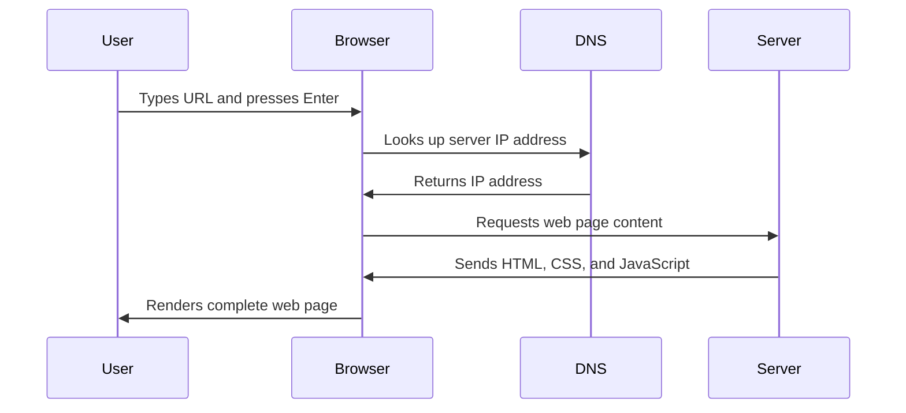

<!--
CO_OP_TRANSLATOR_METADATA:
{
  "original_hash": "33a875c522f237a2026e4653240dfc07",
  "translation_date": "2025-10-23T21:24:46+00:00",
  "source_file": "5-browser-extension/1-about-browsers/README.md",
  "language_code": "th"
}
-->
# โครงการส่วนขยายเบราว์เซอร์ ตอนที่ 1: ทุกสิ่งเกี่ยวกับเบราว์เซอร์


> สเก็ตโน้ตโดย [Wassim Chegham](https://dev.to/wassimchegham/ever-wondered-what-happens-when-you-type-in-a-url-in-an-address-bar-in-a-browser-3dob)

## แบบทดสอบก่อนการบรรยาย

[แบบทดสอบก่อนการบรรยาย](https://ff-quizzes.netlify.app/web/quiz/23)

### บทนำ

ส่วนขยายเบราว์เซอร์เป็นแอปพลิเคชันขนาดเล็กที่ช่วยเพิ่มประสบการณ์การท่องเว็บของคุณ เช่นเดียวกับวิสัยทัศน์ดั้งเดิมของ Tim Berners-Lee ที่ต้องการให้เว็บมีความโต้ตอบ ส่วนขยายช่วยเพิ่มความสามารถของเบราว์เซอร์ให้มากกว่าการดูเอกสารธรรมดา ตั้งแต่ตัวจัดการรหัสผ่านที่ช่วยรักษาความปลอดภัยบัญชีของคุณ ไปจนถึงเครื่องมือเลือกสีที่ช่วยให้นักออกแบบเลือกเฉดสีที่สมบูรณ์แบบ ส่วนขยายช่วยแก้ปัญหาการท่องเว็บในชีวิตประจำวัน

ก่อนที่เราจะสร้างส่วนขยายแรกของคุณ เรามาเรียนรู้วิธีการทำงานของเบราว์เซอร์กันก่อน เช่นเดียวกับที่ Alexander Graham Bell ต้องเข้าใจการส่งเสียงก่อนที่จะประดิษฐ์โทรศัพท์ การรู้พื้นฐานของเบราว์เซอร์จะช่วยให้คุณสร้างส่วนขยายที่ผสานรวมกับระบบเบราว์เซอร์ที่มีอยู่ได้อย่างราบรื่น

เมื่อจบบทเรียนนี้ คุณจะเข้าใจสถาปัตยกรรมของเบราว์เซอร์และเริ่มสร้างส่วนขยายแรกของคุณ

## ความเข้าใจเกี่ยวกับเว็บเบราว์เซอร์

เว็บเบราว์เซอร์เป็นตัวแปลเอกสารที่ซับซ้อน เมื่อคุณพิมพ์ "google.com" ลงในแถบที่อยู่ เบราว์เซอร์จะดำเนินการหลายขั้นตอนที่ซับซ้อน - ขอเนื้อหาจากเซิร์ฟเวอร์ทั่วโลก จากนั้นแปลและแสดงโค้ดนั้นเป็นหน้าเว็บที่โต้ตอบได้ที่คุณเห็น

กระบวนการนี้สะท้อนถึงวิธีการออกแบบเว็บเบราว์เซอร์ตัวแรก WorldWideWeb โดย Tim Berners-Lee ในปี 1990 เพื่อทำให้เอกสารที่มีการเชื่อมโยงกันสามารถเข้าถึงได้สำหรับทุกคน

✅ **ประวัติเล็กน้อย**: เบราว์เซอร์ตัวแรกมีชื่อว่า 'WorldWideWeb' และถูกสร้างขึ้นโดย Sir Timothy Berners-Lee ในปี 1990


> เบราว์เซอร์ยุคแรกบางตัว โดย [Karen McGrane](https://www.slideshare.net/KMcGrane/week-4-ixd-history-personal-computing)

### วิธีที่เบราว์เซอร์ประมวลผลเนื้อหาเว็บ

กระบวนการระหว่างการป้อน URL และการเห็นหน้าเว็บเกี่ยวข้องกับหลายขั้นตอนที่ประสานกันซึ่งเกิดขึ้นภายในไม่กี่วินาที:



**นี่คือสิ่งที่กระบวนการนี้ทำสำเร็จ:**
- **แปล** URL ที่มนุษย์อ่านได้เป็นที่อยู่ IP ของเซิร์ฟเวอร์ผ่านการค้นหา DNS
- **สร้าง**การเชื่อมต่อที่ปลอดภัยกับเว็บเซิร์ฟเวอร์โดยใช้โปรโตคอล HTTP หรือ HTTPS
- **ร้องขอ**เนื้อหาเว็บเพจเฉพาะจากเซิร์ฟเวอร์
- **รับ**โค้ด HTML, CSS และ JavaScript จากเซิร์ฟเวอร์
- **แสดงผล**เนื้อหาทั้งหมดเป็นหน้าเว็บที่โต้ตอบได้ที่คุณเห็น

### คุณสมบัติหลักของเบราว์เซอร์

เบราว์เซอร์สมัยใหม่มีคุณสมบัติมากมายที่นักพัฒนาส่วนขยายสามารถใช้ประโยชน์ได้:

| คุณสมบัติ | วัตถุประสงค์ | โอกาสสำหรับส่วนขยาย |
|-----------|---------------|------------------------|
| **Rendering Engine** | แสดงผล HTML, CSS และ JavaScript | การปรับเปลี่ยนเนื้อหา, การฉีดสไตล์ |
| **JavaScript Engine** | รันโค้ด JavaScript | สคริปต์ที่กำหนดเอง, การโต้ตอบ API |
| **Local Storage** | บันทึกข้อมูลในเครื่อง | การตั้งค่าผู้ใช้, ข้อมูลแคช |
| **Network Stack** | จัดการคำขอเว็บ | การตรวจสอบคำขอ, การวิเคราะห์ข้อมูล |
| **Security Model** | ปกป้องผู้ใช้จากเนื้อหาที่เป็นอันตราย | การกรองเนื้อหา, การเพิ่มความปลอดภัย |

**การเข้าใจคุณสมบัติเหล่านี้ช่วยให้คุณ:**
- **ระบุ**จุดที่ส่วนขยายของคุณสามารถเพิ่มคุณค่าได้มากที่สุด
- **เลือก** API ของเบราว์เซอร์ที่เหมาะสมสำหรับฟังก์ชันของส่วนขยายของคุณ
- **ออกแบบ**ส่วนขยายที่ทำงานได้อย่างมีประสิทธิภาพกับระบบเบราว์เซอร์
- **มั่นใจ**ว่าส่วนขยายของคุณปฏิบัติตามแนวทางปฏิบัติที่ดีที่สุดด้านความปลอดภัยของเบราว์เซอร์

### การพัฒนาข้ามเบราว์เซอร์

เบราว์เซอร์ต่าง ๆ มีการใช้งานมาตรฐานที่แตกต่างกันเล็กน้อย เช่นเดียวกับที่ภาษาการเขียนโปรแกรมต่าง ๆ อาจจัดการกับอัลกอริทึมเดียวกันแตกต่างกัน Chrome, Firefox และ Safari มีลักษณะเฉพาะที่นักพัฒนาต้องพิจารณาในระหว่างการพัฒนาส่วนขยาย

> 💡 **เคล็ดลับ**: ใช้ [caniuse.com](https://www.caniuse.com) เพื่อตรวจสอบว่าเทคโนโลยีเว็บใดที่รองรับในเบราว์เซอร์ต่าง ๆ สิ่งนี้มีประโยชน์มากเมื่อวางแผนคุณสมบัติของส่วนขยายของคุณ!

**ข้อควรพิจารณาสำหรับการพัฒนาส่วนขยาย:**
- **ทดสอบ**ส่วนขยายของคุณในเบราว์เซอร์ Chrome, Firefox และ Edge
- **ปรับตัว**ให้เข้ากับ API ส่วนขยายเบราว์เซอร์และรูปแบบ manifest ที่แตกต่างกัน
- **จัดการ**ลักษณะการทำงานและข้อจำกัดที่แตกต่างกัน
- **จัดเตรียม**ทางเลือกสำหรับคุณสมบัติเฉพาะเบราว์เซอร์ที่อาจไม่มี

✅ **ข้อมูลเชิงลึกด้านการวิเคราะห์**: คุณสามารถกำหนดได้ว่าผู้ใช้ของคุณชอบเบราว์เซอร์ใดโดยการติดตั้งแพ็คเกจการวิเคราะห์ในโครงการพัฒนาเว็บของคุณ ข้อมูลนี้ช่วยให้คุณจัดลำดับความสำคัญของเบราว์เซอร์ที่ควรสนับสนุนก่อน

## ความเข้าใจเกี่ยวกับส่วนขยายเบราว์เซอร์

ส่วนขยายเบราว์เซอร์ช่วยแก้ปัญหาการท่องเว็บทั่วไปโดยเพิ่มฟังก์ชันการทำงานโดยตรงในอินเทอร์เฟซเบราว์เซอร์ แทนที่จะต้องใช้แอปพลิเคชันแยกต่างหากหรือกระบวนการที่ซับซ้อน ส่วนขยายให้การเข้าถึงเครื่องมือและคุณสมบัติได้ทันที

แนวคิดนี้สะท้อนถึงวิธีที่ผู้บุกเบิกคอมพิวเตอร์ยุคแรก ๆ เช่น Douglas Engelbart มองเห็นการเพิ่มขีดความสามารถของมนุษย์ด้วยเทคโนโลยี - ส่วนขยายช่วยเพิ่มฟังก์ชันพื้นฐานของเบราว์เซอร์

**หมวดหมู่ส่วนขยายยอดนิยมและประโยชน์ของมัน:**
- **เครื่องมือเพิ่มประสิทธิภาพ**: ตัวจัดการงาน, แอปจดบันทึก และตัวติดตามเวลา ที่ช่วยให้คุณจัดระเบียบ
- **การเพิ่มความปลอดภัย**: ตัวจัดการรหัสผ่าน, ตัวบล็อกโฆษณา และเครื่องมือความเป็นส่วนตัวที่ปกป้องข้อมูลของคุณ
- **เครื่องมือสำหรับนักพัฒนา**: ตัวจัดรูปแบบโค้ด, เครื่องมือเลือกสี และเครื่องมือดีบักที่ช่วยให้การพัฒนาง่ายขึ้น
- **การปรับปรุงเนื้อหา**: โหมดการอ่าน, ตัวดาวน์โหลดวิดีโอ และเครื่องมือจับภาพหน้าจอที่ช่วยปรับปรุงประสบการณ์เว็บของคุณ

✅ **คำถามสะท้อน**: ส่วนขยายเบราว์เซอร์ที่คุณชื่นชอบคืออะไร? พวกมันทำงานเฉพาะอะไร และพวกมันช่วยปรับปรุงประสบการณ์การท่องเว็บของคุณอย่างไร?

## การติดตั้งและจัดการส่วนขยาย

การเข้าใจกระบวนการติดตั้งส่วนขยายช่วยให้คุณคาดการณ์ประสบการณ์ผู้ใช้เมื่อผู้คนติดตั้งส่วนขยายของคุณ กระบวนการติดตั้งมีมาตรฐานในเบราว์เซอร์สมัยใหม่ โดยมีความแตกต่างเล็กน้อยในด้านการออกแบบอินเทอร์เฟซ


> **สำคัญ**: อย่าลืมเปิดโหมดนักพัฒนาและอนุญาตส่วนขยายจากร้านค้าอื่น ๆ เมื่อทดสอบส่วนขยายของคุณเอง

### กระบวนการติดตั้งส่วนขยายสำหรับการพัฒนา

เมื่อคุณกำลังพัฒนาและทดสอบส่วนขยายของคุณเอง ให้ทำตามขั้นตอนนี้:

```bash
# Step 1: Build your extension
npm run build
```

**สิ่งที่คำสั่งนี้ทำสำเร็จ:**
- **คอมไพล์**โค้ดต้นฉบับของคุณเป็นไฟล์ที่พร้อมสำหรับเบราว์เซอร์
- **รวม**โมดูล JavaScript เป็นแพ็คเกจที่ปรับแต่ง
- **สร้าง**ไฟล์ส่วนขยายสุดท้ายในโฟลเดอร์ `/dist`
- **เตรียม**ส่วนขยายของคุณสำหรับการติดตั้งและการทดสอบ

**ขั้นตอนที่ 2: ไปที่ส่วนขยายของเบราว์เซอร์**
1. **เปิด**หน้าการจัดการส่วนขยายของเบราว์เซอร์ของคุณ
2. **คลิก**ปุ่ม "การตั้งค่าและอื่น ๆ" (ไอคอน `...`) ที่มุมขวาบน
3. **เลือก** "ส่วนขยาย" จากเมนูดรอปดาวน์

**ขั้นตอนที่ 3: โหลดส่วนขยายของคุณ**
- **สำหรับการติดตั้งใหม่**: เลือก `load unpacked` และเลือกโฟลเดอร์ `/dist` ของคุณ
- **สำหรับการอัปเดต**: คลิก `reload` ข้างส่วนขยายที่ติดตั้งแล้วของคุณ
- **สำหรับการทดสอบ**: เปิดใช้งาน "โหมดนักพัฒนา" เพื่อเข้าถึงคุณสมบัติการดีบักเพิ่มเติม

### การติดตั้งส่วนขยายสำหรับการใช้งานจริง

> ✅ **หมายเหตุ**: คำแนะนำการพัฒนานี้ใช้เฉพาะสำหรับส่วนขยายที่คุณสร้างเอง ในการติดตั้งส่วนขยายที่เผยแพร่แล้ว ให้ไปที่ร้านส่วนขยายเบราว์เซอร์อย่างเป็นทางการ เช่น [Microsoft Edge Add-ons store](https://microsoftedge.microsoft.com/addons/Microsoft-Edge-Extensions-Home)

**ความแตกต่างที่ควรเข้าใจ:**
- **การติดตั้งสำหรับการพัฒนา**ช่วยให้คุณทดสอบส่วนขยายที่ยังไม่ได้เผยแพร่ในระหว่างการพัฒนา
- **การติดตั้งจากร้านค้า**ให้ส่วนขยายที่ผ่านการตรวจสอบและเผยแพร่พร้อมการอัปเดตอัตโนมัติ
- **การติดตั้งแบบ sideloading**อนุญาตให้ติดตั้งส่วนขยายจากนอกร้านค้าอย่างเป็นทางการ (ต้องเปิดโหมดนักพัฒนา)

## การสร้างส่วนขยายคาร์บอนฟุตพรินต์ของคุณ

เราจะสร้างส่วนขยายเบราว์เซอร์ที่แสดงคาร์บอนฟุตพรินต์ของการใช้พลังงานในภูมิภาคของคุณ โครงการนี้แสดงแนวคิดการพัฒนาส่วนขยายที่สำคัญในขณะที่สร้างเครื่องมือที่ใช้งานได้จริงเพื่อสร้างความตระหนักด้านสิ่งแวดล้อม

วิธีการนี้เป็นไปตามหลักการ "เรียนรู้จากการลงมือทำ" ซึ่งพิสูจน์แล้วว่ามีประสิทธิภาพตั้งแต่ทฤษฎีการศึกษาของ John Dewey - การรวมทักษะทางเทคนิคเข้ากับการประยุกต์ใช้ในโลกจริงที่มีความหมาย

### ข้อกำหนดของโครงการ

ก่อนเริ่มการพัฒนา เรามารวบรวมทรัพยากรและการพึ่งพาที่จำเป็น:

**การเข้าถึง API ที่จำเป็น:**
- **[CO2 Signal API key](https://www.co2signal.com/)**: ป้อนที่อยู่อีเมลของคุณเพื่อรับ API key ฟรี
- **[รหัสภูมิภาค](http://api.electricitymap.org/v3/zones)**: ค้นหารหัสภูมิภาคของคุณโดยใช้ [Electricity Map](https://www.electricitymap.org/map) (เช่น Boston ใช้ 'US-NEISO')

**เครื่องมือพัฒนา:**
- **[Node.js และ NPM](https://www.npmjs.com)**: เครื่องมือจัดการแพ็คเกจสำหรับการติดตั้งการพึ่งพาโครงการ
- **[โค้ดเริ่มต้น](../../../../5-browser-extension/start)**: ดาวน์โหลดโฟลเดอร์ `start` เพื่อเริ่มการพัฒนา

✅ **เรียนรู้เพิ่มเติม**: เพิ่มทักษะการจัดการแพ็คเกจของคุณด้วย [โมดูลการเรียนรู้ที่ครอบคลุมนี้](https://docs.microsoft.com/learn/modules/create-nodejs-project-dependencies/?WT.mc_id=academic-77807-sagibbon)

### ความเข้าใจเกี่ยวกับโครงสร้างโครงการ

การเข้าใจโครงสร้างโครงการช่วยจัดระเบียบงานพัฒนาได้อย่างมีประสิทธิภาพ เช่นเดียวกับที่ห้องสมุดอเล็กซานเดรียถูกจัดระเบียบเพื่อการดึงข้อมูลความรู้ได้ง่าย ฐานโค้ดที่มีโครงสร้างดีช่วยให้การพัฒนามีประสิทธิภาพมากขึ้น:

```
project-root/
├── dist/                    # Built extension files
│   ├── manifest.json        # Extension configuration
│   ├── index.html           # User interface markup
│   ├── background.js        # Background script functionality
│   └── main.js              # Compiled JavaScript bundle
└── src/                     # Source development files
    └── index.js             # Your main JavaScript code
```

**การแบ่งสิ่งที่แต่ละไฟล์ทำ:**
- **`manifest.json`**: **กำหนด**ข้อมูลเมตาของส่วนขยาย, การอนุญาต และจุดเริ่มต้น
- **`index.html`**: **สร้าง**อินเทอร์เฟซผู้ใช้ที่ปรากฏเมื่อผู้ใช้คลิกส่วนขยายของคุณ
- **`background.js`**: **จัดการ**งานเบื้องหลังและตัวฟังเหตุการณ์ของเบราว์เซอร์
- **`main.js`**: **ประกอบด้วย**โค้ด JavaScript ที่ถูกรวมหลังจากกระบวนการสร้าง
- **`src/index.js`**: **เก็บ**โค้ดการพัฒนาหลักของคุณที่ถูกคอมไพล์เป็น `main.js`

> 💡 **เคล็ดลับการจัดระเบียบ**: เก็บ API key และรหัสภูมิภาคของคุณในโน้ตที่ปลอดภัยเพื่อการอ้างอิงที่ง่ายในระหว่างการพัฒนา คุณจะต้องใช้ค่าพวกนี้เพื่อทดสอบฟังก์ชันการทำงานของส่วนขยายของคุณ

✅ **หมายเหตุด้านความปลอดภัย**: อย่าคอมมิต API key หรือข้อมูลรับรองที่สำคัญลงในที่เก็บโค้ดของคุณ เราจะแสดงวิธีจัดการสิ่งเหล่านี้อย่างปลอดภัยในขั้นตอนถัดไป

## การสร้างอินเทอร์เฟซส่วนขยาย

ตอนนี้เราจะสร้างส่วนประกอบอินเทอร์เฟซผู้ใช้ ส่วนขยายใช้วิธีการแบบสองหน้าจอ: หน้าจอการตั้งค่าสำหรับการตั้งค่าเริ่มต้นและหน้าจอผลลัพธ์สำหรับการแสดงข้อมูล

สิ่งนี้เป็นไปตามหลักการเปิดเผยข้อมูลแบบก้าวหน้าที่ใช้ในการออกแบบอินเทอร์เฟซตั้งแต่ยุคแรก ๆ ของการคอมพิวเตอร์ - การเปิดเผยข้อมูลและตัวเลือกในลำดับที่มีเหตุผลเพื่อหลีกเลี่ยงการทำให้ผู้ใช้รู้สึกหนักใจ

### ภาพรวมของมุมมองส่วนขยาย

**มุมมองการตั้งค่า** - การตั้งค่าผู้ใช้ครั้งแรก:


**มุมมองผลลัพธ์** - การแสดงข้อมูลคาร์บอนฟุตพรินต์:


### การสร้างแบบฟอร์มการตั้งค่า

แบบฟอร์มการตั้งค่ารวบรวมข้อมูลการตั้งค่าผู้ใช้ในระหว่างการใช้งานครั้งแรก เมื่อกำหนดค่าแล้ว ข้อมูลนี้จะคงอยู่ในที่เก็บของเบราว์เซอร์สำหรับการใช้งานในอนาคต

ในไฟล์ `/dist/index.html` ให้เพิ่มโครงสร้างแบบฟอร์มนี้:

```html
<form class="form-data" autocomplete="on">
    <div>
        <h2>New? Add your Information</h2>
    </div>
    <div>
        <label for="region">Region Name</label>
        <input type="text" id="region" required class="region-name" />
    </div>
    <div>
        <label for="api">Your API Key from tmrow</label>
        <input type="text" id="api" required class="api-key" />
    </div>
    <button class="search-btn">Submit</button>
</form>
```

**นี่คือสิ่ง
**คำอธิบาย:** ปรับปรุงส่วนขยายเบราว์เซอร์โดยเพิ่มฟังก์ชันการตรวจสอบแบบฟอร์มและคุณสมบัติการตอบกลับผู้ใช้ เพื่อปรับปรุงประสบการณ์การใช้งานเมื่อป้อน API key และรหัสภูมิภาค

**คำสั่ง:** สร้างฟังก์ชันการตรวจสอบใน JavaScript ที่ตรวจสอบว่า API key มีความยาวอย่างน้อย 20 ตัวอักษร และรหัสภูมิภาคมีรูปแบบที่ถูกต้อง (เช่น 'US-NEISO') เพิ่มการตอบกลับแบบภาพโดยการเปลี่ยนสีขอบของช่องป้อนข้อมูลเป็นสีเขียวสำหรับข้อมูลที่ถูกต้อง และสีแดงสำหรับข้อมูลที่ไม่ถูกต้อง นอกจากนี้ให้เพิ่มฟังก์ชันการสลับเพื่อแสดง/ซ่อน API key เพื่อความปลอดภัย

เรียนรู้เพิ่มเติมเกี่ยวกับ [agent mode](https://code.visualstudio.com/blogs/2025/02/24/introducing-copilot-agent-mode) ที่นี่

## 🚀 ความท้าทาย

ลองดูที่ร้านส่วนขยายเบราว์เซอร์และติดตั้งส่วนขยายหนึ่งลงในเบราว์เซอร์ของคุณ คุณสามารถตรวจสอบไฟล์ของมันในรูปแบบที่น่าสนใจ คุณค้นพบอะไรบ้าง?

## แบบทดสอบหลังการบรรยาย

[แบบทดสอบหลังการบรรยาย](https://ff-quizzes.netlify.app/web/quiz/24)

## ทบทวนและศึกษาด้วยตนเอง

ในบทเรียนนี้คุณได้เรียนรู้เล็กน้อยเกี่ยวกับประวัติของเบราว์เซอร์ ใช้โอกาสนี้เพื่อเรียนรู้เกี่ยวกับวิธีที่ผู้สร้าง World Wide Web มองเห็นการใช้งานโดยการอ่านเพิ่มเติมเกี่ยวกับประวัติศาสตร์ของมัน เว็บไซต์ที่มีประโยชน์บางแห่งได้แก่:

[ประวัติของเบราว์เซอร์](https://www.mozilla.org/firefox/browsers/browser-history/)

[ประวัติของเว็บ](https://webfoundation.org/about/vision/history-of-the-web/)

[บทสัมภาษณ์กับ Tim Berners-Lee](https://www.theguardian.com/technology/2019/mar/12/tim-berners-lee-on-30-years-of-the-web-if-we-dream-a-little-we-can-get-the-web-we-want)

## งานที่ได้รับมอบหมาย

[ปรับแต่งส่วนขยายของคุณใหม่](assignment.md)

---

**ข้อจำกัดความรับผิดชอบ**:  
เอกสารนี้ได้รับการแปลโดยใช้บริการแปลภาษา AI [Co-op Translator](https://github.com/Azure/co-op-translator) แม้ว่าเราจะพยายามให้การแปลมีความถูกต้อง แต่โปรดทราบว่าการแปลอัตโนมัติอาจมีข้อผิดพลาดหรือความไม่ถูกต้อง เอกสารต้นฉบับในภาษาดั้งเดิมควรถือเป็นแหล่งข้อมูลที่เชื่อถือได้ สำหรับข้อมูลที่สำคัญ ขอแนะนำให้ใช้บริการแปลภาษามืออาชีพ เราจะไม่รับผิดชอบต่อความเข้าใจผิดหรือการตีความผิดที่เกิดจากการใช้การแปลนี้