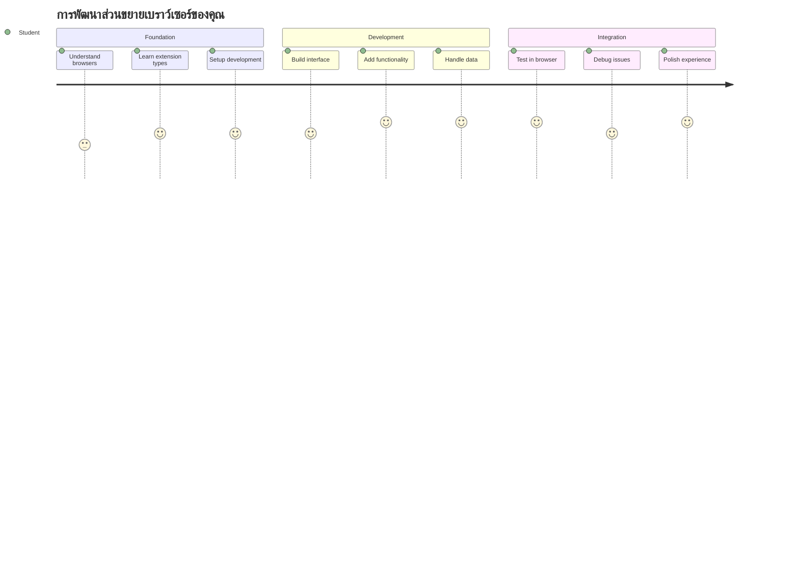
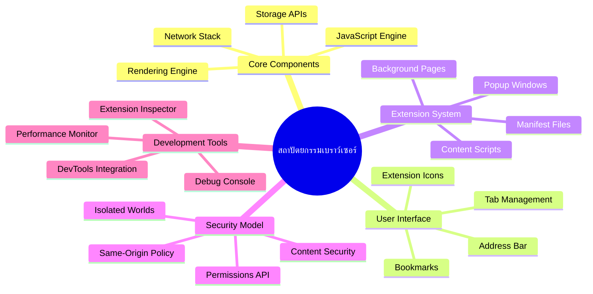
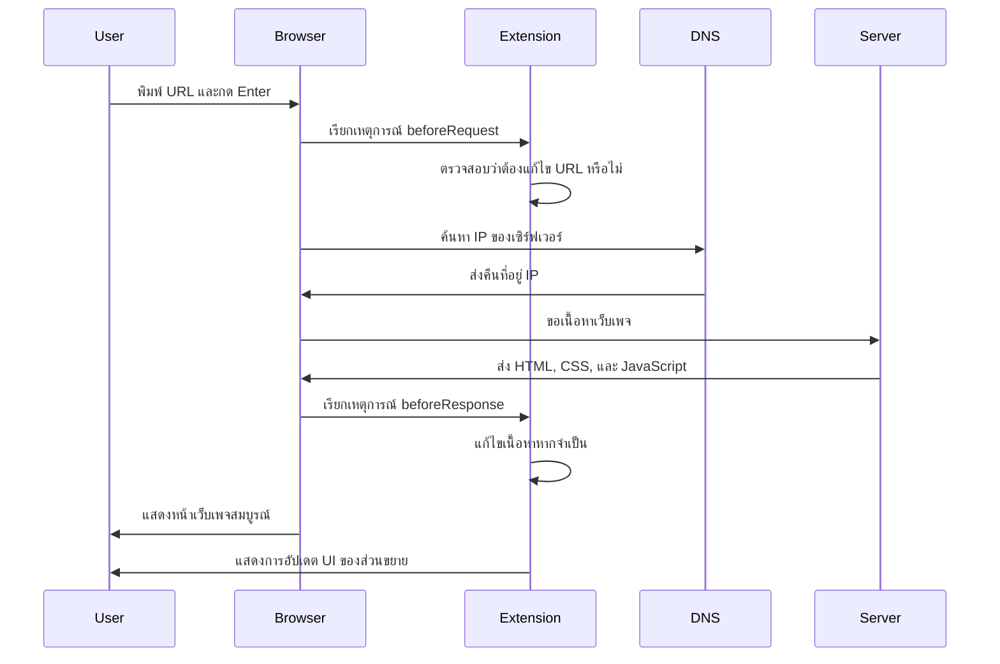
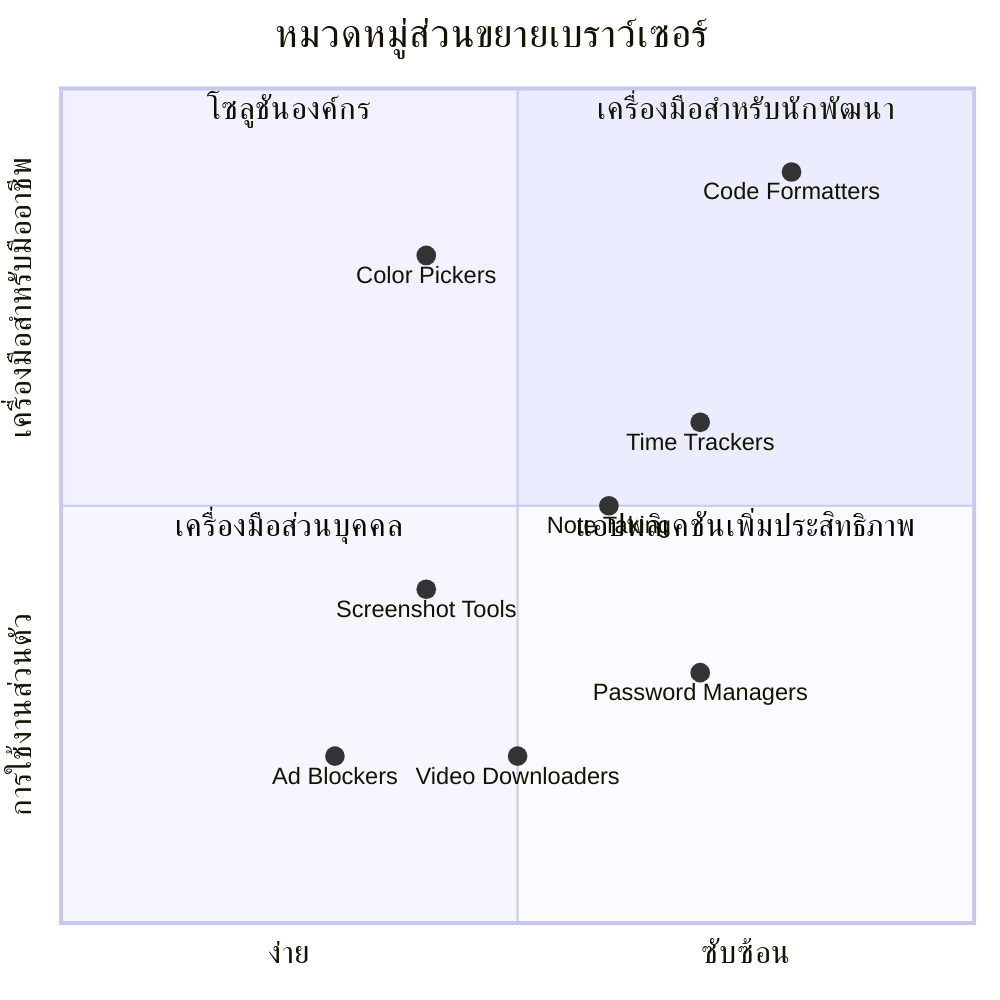
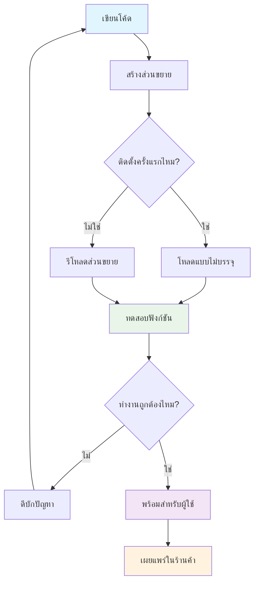
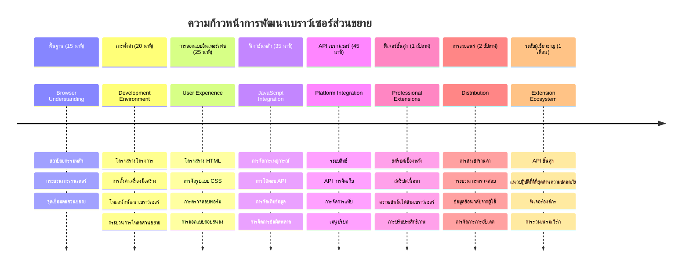

<!--
CO_OP_TRANSLATOR_METADATA:
{
  "original_hash": "00aa85715e1efd4930c17a23e3012e69",
  "translation_date": "2026-01-06T22:00:39+00:00",
  "source_file": "5-browser-extension/1-about-browsers/README.md",
  "language_code": "th"
}
-->
# โครงการส่วนขยายเบราว์เซอร์ ตอนที่ 1: ทุกอย่างเกี่ยวกับเบราว์เซอร์



> สเก็ตช์โน้ตโดย [Wassim Chegham](https://dev.to/wassimchegham/ever-wondered-what-happens-when-you-type-in-a-url-in-an-address-bar-in-a-browser-3dob)

## แบบทดสอบก่อนบรรยาย

[แบบทดสอบก่อนบรรยาย](https://ff-quizzes.netlify.app/web/quiz/23)

### บทนำ

ส่วนขยายเบราว์เซอร์คือแอปพลิเคชันขนาดเล็กที่ช่วยเสริมประสบการณ์การท่องเว็บของคุณ เช่นเดียวกับวิสัยทัศน์ดั้งเดิมของ Tim Berners-Lee ที่ต้องการเว็บแบบอินเทอร์แอคทีฟ ส่วนขยายช่วยขยายความสามารถของเบราว์เซอร์เกินกว่าการดูเอกสารธรรมดา จากผู้จัดการรหัสผ่านที่ช่วยรักษาความปลอดภัยบัญชีของคุณ ไปจนถึงเครื่องมือเลือกสีที่ช่วยนักออกแบบเลือกเฉดสีที่สมบูรณ์แบบ ส่วนขยายแก้ไขปัญหาการท่องเว็บในชีวิตประจำวัน

ก่อนที่เราจะสร้างส่วนขยายแรกของคุณ มาทำความเข้าใจว่าเบราว์เซอร์ทำงานอย่างไร เช่นเดียวกับที่ Alexander Graham Bell ต้องเข้าใจการส่งผ่านเสียงก่อนคิดค้นโทรศัพท์ การรู้พื้นฐานของเบราว์เซอร์จะช่วยให้คุณสร้างส่วนขยายที่ผสานรวมกับระบบเบราว์เซอร์ที่มีอยู่ได้อย่างลงตัว

สิ้นสุดบทเรียนนี้ คุณจะเข้าใจสถาปัตยกรรมของเบราว์เซอร์และเริ่มต้นสร้างส่วนขยายแรกของคุณได้


## เข้าใจเบราว์เซอร์เว็บ

เบราว์เซอร์เว็บโดยพื้นฐานเป็นตัวแปลเอกสารที่ซับซ้อน เมื่อคุณพิมพ์ "google.com" ในแถบที่อยู่ เบราว์เซอร์จะดำเนินการชุดขั้นตอนที่ซับซ้อน — ขอเนื้อหาจากเซิร์ฟเวอร์ทั่วโลก จากนั้นแยกวิเคราะห์และแสดงผลโค้ดนั้นเป็นหน้าเว็บแบบอินเทอร์แอคทีฟที่คุณเห็น

กระบวนการนี้สะท้อนถึงวิธีที่เบราว์เซอร์เว็บตัวแรก WorldWideWeb ได้รับการออกแบบโดย Tim Berners-Lee ในปี 1990 เพื่อให้เอกสารที่มีการเชื่อมโยงแบบไฮเปอร์ลิงก์เข้าถึงได้สำหรับทุกคน

✅ **ประวัติเล็กน้อย**: เบราว์เซอร์ตัวแรกเรียกว่า 'WorldWideWeb' และถูกสร้างโดย Sir Timothy Berners-Lee ในปี 1990


> เบราว์เซอร์ยุคแรกบางส่วน โดย [Karen McGrane](https://www.slideshare.net/KMcGrane/week-4-ixd-history-personal-computing)

### เบราว์เซอร์ประมวลผลเนื้อหาเว็บอย่างไร

กระบวนการระหว่างการป้อน URL จนเห็นหน้าเว็บประกอบด้วยขั้นตอนที่ประสานงานกันหลายอย่างซึ่งเกิดขึ้นภายในไม่กี่วินาที:


**นี่คือสิ่งที่กระบวนการนี้ทำได้:**
- **แปลง** URL ที่อ่านได้สำหรับมนุษย์เป็นที่อยู่ IP ของเซิร์ฟเวอร์ผ่านการค้นหา DNS
- **สร้าง** การเชื่อมต่อที่ปลอดภัยกับเว็บเซิร์ฟเวอร์โดยใช้โปรโตคอล HTTP หรือ HTTPS
- **ร้องขอ** เนื้อหาหน้าเว็บเฉพาะจากเซิร์ฟเวอร์
- **รับ** โค้ด HTML, การจัดรูปแบบ CSS และโค้ด JavaScript จากเซิร์ฟเวอร์
- **แสดงผล** เนื้อหาทั้งหมดเป็นหน้าเว็บแบบอินเทอร์แอคทีฟที่คุณเห็น

### คุณสมบัติเบื้องต้นของเบราว์เซอร์

เบราว์เซอร์สมัยใหม่มีคุณสมบัติมากมายที่นักพัฒนาส่วนขยายสามารถใช้ประโยชน์ได้:

| ฟีเจอร์ | วัตถุประสงค์ | โอกาสสำหรับส่วนขยาย |
|---------|--------------|----------------------|
| **เอนจินการแสดงผล** | แสดงผล HTML, CSS และ JavaScript | การแก้ไขเนื้อหา, การแทรกสไตล์ |
| **เอนจิน JavaScript** | รันโค้ด JavaScript | สคริปต์ที่กำหนดเอง, การโต้ตอบกับ API |
| **ที่เก็บข้อมูลภายในเครื่อง** | บันทึกข้อมูลภายในเครื่อง | การตั้งค่าผู้ใช้, ข้อมูลแคช |
| **โครงสร้างเครือข่าย** | จัดการคำร้องขอเว็บ | การติดตามคำร้องขอ, วิเคราะห์ข้อมูล |
| **โมเดลความปลอดภัย** | ปกป้องผู้ใช้จากเนื้อหาที่เป็นอันตราย | การกรองเนื้อหา, การเสริมความปลอดภัย |

**การเข้าใจฟีเจอร์เหล่านี้ช่วยให้คุณ:**
- **ระบุ** จุดที่ส่วนขยายของคุณสามารถเพิ่มคุณค่าได้มากที่สุด
- **เลือก** API ของเบราว์เซอร์ที่เหมาะสมสำหรับฟังก์ชันของส่วนขยาย
- **ออกแบบ** ส่วนขยายที่ทำงานได้อย่างมีประสิทธิภาพกับระบบของเบราว์เซอร์
- **มั่นใจ** ว่าส่วนขยายของคุณสอดคล้องกับแนวปฏิบัติด้านความปลอดภัยของเบราว์เซอร์

### ข้อควรพิจารณาในการพัฒนาข้ามเบราว์เซอร์

เบราว์เซอร์ที่แตกต่างกันจะใช้มาตรฐานด้วยการเปลี่ยนแปลงเล็กน้อย เช่นเดียวกับว่าภาษาโปรแกรมต่าง ๆ อาจจัดการอัลกอริทึมเดียวกันต่างกัน Chrome, Firefox และ Safari ต่างก็มีลักษณะเฉพาะตัวที่นักพัฒนาต้องคำนึงถึงในระหว่างการพัฒนาส่วนขยาย

> 💡 **เคล็ดลับมือโปร**: ใช้ [caniuse.com](https://www.caniuse.com) เพื่อตรวจสอบว่าเทคโนโลยีเว็บใดรองรับบนเบราว์เซอร์ต่าง ๆ นี่คือข้อมูลล้ำค่าขณะวางแผนฟีเจอร์ของส่วนขยาย!

**ข้อควรพิจารณาสำหรับการพัฒนาส่วนขยาย:**
- **ทดสอบ** ส่วนขยายของคุณบนเบราว์เซอร์ Chrome, Firefox และ Edge
- **ปรับ** ให้เข้ากับ API ส่วนขยายและรูปแบบ manifiest ของแต่ละเบราว์เซอร์
- **จัดการ** กับลักษณะการทำงานและข้อจำกัดที่แตกต่างกัน
- **เตรียม** กรณี fallback สำหรับฟีเจอร์เฉพาะของเบราว์เซอร์ที่อาจไม่มีอยู่

✅ **ข้อมูลเชิงวิเคราะห์**: คุณสามารถตรวจสอบว่าเบราว์เซอร์ใดที่ผู้ใช้ของคุณนิยมโดยการติดตั้งแพ็คเกจวิเคราะห์ในโปรเจกต์พัฒนาเว็บ ข้อมูลนี้ช่วยให้คุณกำหนดลำดับความสำคัญในการสนับสนุนเบราว์เซอร์ได้อย่างเหมาะสม

## เข้าใจส่วนขยายเบราว์เซอร์

ส่วนขยายเบราว์เซอร์แก้ไขปัญหาการท่องเว็บโดยการเพิ่มฟังก์ชันโดยตรงในอินเทอร์เฟซเบราว์เซอร์ แทนที่จะต้องใช้แอปแยกหรือกระบวนการที่ซับซ้อน ส่วนขยายให้การเข้าถึงเครื่องมือและฟีเจอร์ทันที

แนวคิดนี้สะท้อนถึงวิธีที่นักบุกเบิกคอมพิวเตอร์ยุคแรกอย่าง Douglas Engelbart มองเห็นการเสริมศักยภาพมนุษย์ด้วยเทคโนโลยี — ส่วนขยายช่วยเสริมฟังก์ชันพื้นฐานของเบราว์เซอร์ของคุณ


**หมวดหมู่ส่วนขยายยอดนิยมและประโยชน์ของมัน:**
- **เครื่องมือเพิ่มประสิทธิภาพ**: ตัวจัดการงาน แอปจดบันทึก และตัวติดตามเวลาช่วยให้คุณจัดระเบียบได้ดี
- **การเสริมความปลอดภัย**: ตัวจัดการรหัสผ่าน ตัวบล็อกโฆษณา และเครื่องมือความเป็นส่วนตัวช่วยปกป้องข้อมูลของคุณ
- **เครื่องมือสำหรับนักพัฒนา**: ตัวจัดรูปแบบโค้ด เครื่องมือเลือกสี และเครื่องมือดีบักที่ช่วยเร่งการพัฒนา
- **การปรับปรุงเนื้อหา**: โหมดอ่าน โปรแกรมดาวน์โหลดวิดีโอ และเครื่องมือถ่ายภาพหน้าจอที่ช่วยให้ประสบการณ์เว็บดีขึ้น

✅ **คำถามสะท้อนความคิด**: ส่วนขยายเบราว์เซอร์ที่คุณชื่นชอบคืออะไร? พวกมันช่วยทำงานอะไรเฉพาะทาง และพวกมันช่วยปรับปรุงประสบการณ์การท่องเว็บของคุณอย่างไร?

### 🔄 **ตรวจสอบความเข้าใจเชิงการเรียนการสอน**
**ความเข้าใจสถาปัตยกรรมเบราว์เซอร์**: ก่อนย้ายไปพัฒนาส่วนขยาย ตรวจสอบว่าคุณสามารถ:
- ✅ อธิบายว่าเบราว์เซอร์ประมวลผลคำร้องขอเว็บและแสดงผลเนื้อหาอย่างไร
- ✅ ระบุส่วนประกอบหลักของสถาปัตยกรรมเบราว์เซอร์
- ✅ เข้าใจวิธีการที่ส่วนขยายรวมกับฟังก์ชันของเบราว์เซอร์
- ✅ รู้จักโมเดลความปลอดภัยที่ปกป้องผู้ใช้

**แบบทดสอบตนเองรวดเร็ว**: คุณสามารถตรวจสอบเส้นทางจากการพิมพ์ URL จนเห็นหน้าเว็บได้หรือไม่?
1. **ค้นหา DNS** แปลง URL เป็นที่อยู่ IP
2. **ร้องขอ HTTP** ดึงเนื้อหาจากเซิร์ฟเวอร์
3. **การวิเคราะห์** ประมวลผล HTML, CSS และ JavaScript
4. **การแสดงผล** แสดงหน้าเว็บสุดท้าย
5. **ส่วนขยาย** สามารถแก้ไขเนื้อหาได้ในหลายขั้นตอน

## การติดตั้งและจัดการส่วนขยาย

ความเข้าใจขั้นตอนการติดตั้งส่วนขยายช่วยให้คาดการณ์ประสบการณ์ผู้ใช้เมื่อผู้คนติดตั้งส่วนขยายของคุณได้ กระบวนการติดตั้งถูกมาตรฐานแล้วในเบราว์เซอร์สมัยใหม่ โดยมีการปรับเปลี่ยนเล็กน้อยในรูปแบบอินเทอร์เฟซ


> **สำคัญ**: อย่าลืมเปิดโหมดนักพัฒนาและอนุญาตส่วนขยายจากแหล่งอื่นเมื่อทดสอบส่วนขยายของคุณเอง

### ขั้นตอนการติดตั้งส่วนขยายระหว่างพัฒนา

เมื่อคุณพัฒนาและทดสอบส่วนขยายของตัวเอง ให้ทำตามขั้นตอนนี้:


```bash
# ขั้นตอนที่ 1: สร้างส่วนขยายของคุณ
npm run build
```

**คำสั่งนี้ทำอะไร:**
- **คอมไพล์** โค้ดต้นทางของคุณให้เป็นไฟล์ที่พร้อมใช้งานบนเบราว์เซอร์
- **รวมแพ็คเกจ** โมดูล JavaScript ให้เป็นชุดที่เหมาะสม
- **สร้าง** ไฟล์ส่วนขยายสุดท้ายในโฟลเดอร์ `/dist`
- **เตรียม** ส่วนขยายของคุณสำหรับการติดตั้งและทดสอบ

**ขั้นตอนที่ 2: ไปยังส่วนขยายของเบราว์เซอร์**
1. **เปิด** หน้าจอจัดการส่วนขยายของเบราว์เซอร์
2. **คลิก** ปุ่ม "การตั้งค่าและอื่น ๆ" (ไอคอน `...`) ที่มุมขวาบน
3. **เลือก** "ส่วนขยาย" จากเมนูเลื่อนลง

**ขั้นตอนที่ 3: โหลดส่วนขยายของคุณ**
- **สำหรับการติดตั้งใหม่**: เลือก `load unpacked` และเลือกโฟลเดอร์ `/dist` ของคุณ
- **สำหรับการอัปเดต**: คลิก `reload` ข้างส่วนขยายที่ติดตั้งอยู่แล้ว
- **สำหรับการทดสอบ**: เปิดใช้งาน "โหมดนักพัฒนา" เพื่อเข้าถึงฟีเจอร์ดีบักเพิ่มเติม

### การติดตั้งส่วนขยายในสภาพแวดล้อมการผลิต

> ✅ **หมายเหตุ**: คำแนะนำการพัฒนาเหล่านี้ใช้เฉพาะกับส่วนขยายที่คุณสร้างเอง หากต้องการติดตั้งส่วนขยายที่เผยแพร่แล้ว ให้ไปที่ร้านค้าอย่างเป็นทางการของเบราว์เซอร์ เช่น [Microsoft Edge Add-ons store](https://microsoftedge.microsoft.com/addons/Microsoft-Edge-Extensions-Home)

**ทำความเข้าใจความแตกต่าง:**
- **การติดตั้งระหว่างพัฒนา** ช่วยให้ทดสอบส่วนขยายที่ยังไม่เผยแพร่ระหว่างพัฒนา
- **การติดตั้งจากร้านค้า** ให้ส่วนขยายที่ได้รับการตรวจสอบและอัปเดตอัตโนมัติ
- **การติดตั้งแบบ sideloading** อนุญาตติดตั้งส่วนขยายจากภายนอกร้านค้าอย่างเป็นทางการ (ต้องเปิดโหมดนักพัฒนา)

## สร้างส่วนขยายรอยเท้าคาร์บอนของคุณ

เราจะสร้างส่วนขยายเบราว์เซอร์ที่แสดงรอยเท้าคาร์บอนของการใช้พลังงานในพื้นที่ของคุณ โครงการนี้แสดงแนวคิดการพัฒนาส่วนขยายที่สำคัญพร้อมสร้างเครื่องมือที่ใช้งานได้จริงเพื่อความตระหนักด้านสิ่งแวดล้อม

วิธีนี้สอดคล้องกับหลักการ "เรียนรู้ด้วยการลงมือทำ" ที่ได้รับการพิสูจน์แล้วว่ามีประสิทธิภาพตั้งแต่ทฤษฎีการศึกษาโดย John Dewey — ผสมผสานทักษะทางเทคนิคกับการประยุกต์ใช้จริงที่มีความหมาย

### ข้อกำหนดของโครงการ

ก่อนเริ่มพัฒนา ให้รวบรวมทรัพยากรและ dependencies ที่จำเป็น:

**การเข้าถึง API ที่ต้องการ:**
- **[กุญแจ API ของ CO2 Signal](https://www.co2signal.com/)**: ป้อนที่อยู่อีเมลของคุณเพื่อรับกุญแจ API ฟรี
- **[รหัสภูมิภาค](http://api.electricitymap.org/v3/zones)**: ค้นหารหัสภูมิภาคของคุณโดยใช้ [Electricity Map](https://www.electricitymap.org/map) (เช่น Boston ใช้รหัส 'US-NEISO')

**เครื่องมือพัฒนา:**
- **[Node.js และ NPM](https://www.npmjs.com)**: เครื่องมือจัดการแพ็คเกจสำหรับติดตั้ง dependencies ของโปรเจกต์
- **[โค้ดเริ่มต้น](../../../../5-browser-extension/start)**: ดาวน์โหลดโฟลเดอร์ `start` เพื่อเริ่มพัฒนา

✅ **เรียนรู้เพิ่มเติม**: พัฒนาทักษะการจัดการแพ็คเกจของคุณด้วย [โมดูล Learn ที่ครอบคลุมนี้](https://docs.microsoft.com/learn/modules/create-nodejs-project-dependencies/?WT.mc_id=academic-77807-sagibbon)

### เข้าใจโครงสร้างโปรเจกต์

การเข้าใจโครงสร้างโปรเจกต์ช่วยจัดระเบียบงานพัฒนาอย่างมีประสิทธิภาพ เช่นเดียวกับที่หอสมุดอเล็กซานเดรียถูกจัดระเบียบเพื่อการเข้าถึงความรู้ได้ง่าย ฐานโค้ดที่มีโครงสร้างดีช่วยให้การพัฒนามีประสิทธิภาพมากขึ้น:

```
project-root/
├── dist/                    # Built extension files
│   ├── manifest.json        # Extension configuration
│   ├── index.html           # User interface markup
│   ├── background.js        # Background script functionality
│   └── main.js              # Compiled JavaScript bundle
├── src/                     # Source development files
│   └── index.js             # Your main JavaScript code
├── package.json             # Project dependencies and scripts
└── webpack.config.js        # Build configuration
```

**อธิบายว่าแต่ละไฟล์ทำอะไร:**
- **`manifest.json`**: **กำหนด** เมตาดาต้าส่วนขยาย, สิทธิ์ และจุดเริ่มต้น
- **`index.html`**: **สร้าง** อินเทอร์เฟซผู้ใช้ที่ปรากฏเมื่อผู้ใช้คลิกส่วนขยายของคุณ
- **`background.js`**: **จัดการ** งานเบื้องหลังและตัวฟังเหตุการณ์ของเบราว์เซอร์
- **`main.js`**: **เก็บ** โค้ด JavaScript ที่ถูกบันเดิลหลังขั้นตอน build
- **`src/index.js`**: **เป็นที่เก็บ** โค้ดหลักที่คุณพัฒนาและถูกคอมไพล์เข้าสู่ `main.js`

> 💡 **เคล็ดลับการจัดองค์กร**: เก็บกุญแจ API และรหัสภูมิภาคในโน้ตที่ปลอดภัยเพื่อใช้อ้างอิงง่ายในระหว่างพัฒนา คุณจะต้องใช้ค่านี้เพื่อตรวจสอบฟังก์ชันส่วนขยายของคุณ

✅ **หมายเหตุความปลอดภัย**: อย่าคอมมิตกุญแจ API หรือข้อมูลลับเข้าในที่เก็บโค้ด เราจะแสดงวิธีจัดการข้อมูลนี้อย่างปลอดภัยในขั้นตอนถัดไป

## สร้างอินเทอร์เฟซส่วนขยาย

ตอนนี้เราจะสร้างส่วนประกอบอินเตอร์เฟซผู้ใช้ ส่วนขยายใช้วิธีสองหน้าจอ: หน้าจอการตั้งค่าสำหรับการตั้งค่าเริ่มต้น และหน้าจอผลลัพธ์สำหรับแสดงข้อมูล

นี้สอดคล้องกับหลักการเปิดเผยข้อมูลแบบก้าวหน้าที่ใช้ในการออกแบบอินเทอร์เฟซตั้งแต่ยุคแรกของการคอมพิวเตอร์ — แสดงข้อมูลและตัวเลือกตามลำดับเหตุผลเพื่อลดความสับสนให้กับผู้ใช้

### ภาพรวมมุมมองส่วนขยาย

**มุมมองการตั้งค่า** - การตั้งค่าสำหรับผู้ใช้ครั้งแรก:


**มุมมองผลลัพธ์** - แสดงข้อมูลรอยเท้าคาร์บอน:


### สร้างฟอร์มการตั้งค่า

ฟอร์มการตั้งค่ารวบรวมข้อมูลการตั้งค่าของผู้ใช้ในครั้งแรก เมื่อตั้งค่าแล้ว ข้อมูลนี้จะถูกเก็บไว้ในที่เก็บข้อมูลเบราว์เซอร์สำหรับการใช้งานครั้งถัดไป

ในไฟล์ `/dist/index.html` ให้เพิ่มโครงสร้างฟอร์มนี้:

```html
<form class="form-data" autocomplete="on">
    <div>
        <h2>New? Add your Information</h2>
    </div>
    <div>
        <label for="region">Region Name</label>
        <input type="text" id="region" required class="region-name" />
    </div>
    <div>
        <label for="api">Your API Key from tmrow</label>
        <input type="text" id="api" required class="api-key" />
    </div>
    <button class="search-btn">Submit</button>
</form>
```

**นี่คือสิ่งที่ฟอร์มนี้ทำได้:**
- **สร้าง** โครงสร้างฟอร์มที่มีความหมายพร้อมป้ายกำกับและความสัมพันธ์กับอินพุตอย่างเหมาะสม
- **เปิดใช้งาน** ฟีเจอร์ autocomplete ของเบราว์เซอร์เพื่อประสบการณ์ผู้ใช้ที่ดีขึ้น
- **กำหนดให้** ทั้งสองช่องต้องกรอกก่อนส่งฟอร์มด้วยแอตทริบิวต์ `required`
- **จัดระเบียบ** อินพุตด้วยชื่อคลาสที่สื่อความหมายเพื่อสะดวกในการจัดสไตล์และเขียน JavaScript
- **ให้คำแนะนำ** ชัดเจนสำหรับผู้ใช้ที่กำลังตั้งค่าส่วนขยายเป็นครั้งแรก

### สร้างส่วนแสดงผลลัพธ์

ถัดไป สร้างพื้นที่แสดงผลลัพธ์ ที่จะแสดงข้อมูลรอยเท้าคาร์บอน เพิ่ม HTML นี้ใต้ฟอร์ม:

```html
<div class="result">
    <div class="loading">loading...</div>
    <div class="errors"></div>
    <div class="data"></div>
    <div class="result-container">
        <p><strong>Region: </strong><span class="my-region"></span></p>
        <p><strong>Carbon Usage: </strong><span class="carbon-usage"></span></p>
        <p><strong>Fossil Fuel Percentage: </strong><span class="fossil-fuel"></span></p>
    </div>
    <button class="clear-btn">Change region</button>
</div>
```

**รายละเอียดว่าโครงสร้างนี้ให้สิ่งใด:**
- **`loading`**: **แสดง** ข้อความกำลังโหลดระหว่างรอข้อมูลจาก API
- **`errors`**: **แสดง** ข้อความผิดพลาดหากเรียก API ล้มเหลวหรือข้อมูลไม่ถูกต้อง
- **`data`**: **เก็บ** ข้อมูลดิบเพื่อช่วยในการดีบักในระหว่างพัฒนา
- **`result-container`**: **แสดง** ข้อมูลรอยเท้าคาร์บอนที่จัดรูปแบบแล้วให้ผู้ใช้ดู
- **`clear-btn`**: **อนุญาต** ให้ผู้ใช้เปลี่ยนภูมิภาคและตั้งค่าส่วนขยายใหม่ได้

### ตั้งค่ากระบวนการ Build

ตอนนี้มาติดตั้ง dependencies ของโปรเจกต์และทดสอบกระบวนการ build:

```bash
npm install
```

**กระบวนการติดตั้งนี้ทำอะไรได้:**
- **ดาวน์โหลด** Webpack และ dependencies อื่น ๆ ที่ระบุใน `package.json`
- **ตั้งค่า** เครื่องมือ build สำหรับคอมไพล์ JavaScript สมัยใหม่
- **เตรียม** สภาพแวดล้อมการพัฒนาสำหรับการสร้างและทดสอบส่วนขยาย
- **เปิดใช้งาน** ฟีเจอร์รวมโค้ด, ปรับแต่ง และรองรับการทำงานข้ามเบราว์เซอร์

> 💡 **ข้อมูลเชิงลึกกระบวนการ Build**: Webpack รวมโค้ดของคุณจาก `/src/index.js` ไปยัง `/dist/main.js` กระบวนการนี้เพิ่มประสิทธิภาพโค้ดของคุณสำหรับการผลิตและรับประกันความเข้ากันได้กับเบราว์เซอร์

### ทดสอบความคืบหน้าของคุณ

ณ จุดนี้คุณสามารถทดสอบส่วนขยายของคุณได้:
1. **รัน** คำสั่ง build เพื่อคอมไพล์โค้ดของคุณ  
2. **โหลด** ส่วนขยายลงในเบราว์เซอร์ของคุณโดยใช้โหมดนักพัฒนา  
3. **ตรวจสอบ** แบบฟอร์มว่าปรากฏอย่างถูกต้องและดูเป็นมืออาชีพ  
4. **ตรวจเช็ก** ว่าส่วนประกอบของแบบฟอร์มทั้งหมดจัดวางอย่างถูกต้องและทำงานได้ดี  

**สิ่งที่คุณทำสำเร็จ:**  
- **สร้าง** โครงสร้าง HTML พื้นฐานสำหรับส่วนขยายของคุณ  
- **สร้าง** อินเทอร์เฟซทั้งส่วนการตั้งค่าและผลลัพธ์ด้วยมาร์กอัปเชิงความหมายที่เหมาะสม  
- **ตั้งค่า** กระบวนการพัฒนาที่ทันสมัยโดยใช้เครื่องมือมาตรฐานในอุตสาหกรรม  
- **เตรียม** รากฐานสำหรับการเพิ่มฟังก์ชันการทำงาน JavaScript ที่ตอบสนองได้  

### 🔄 **ตรวจสอบความเข้าใจเชิงการสอน**  
**ความคืบหน้าการพัฒนาส่วนขยาย:** ตรวจสอบความเข้าใจก่อนดำเนินการต่อ:  
- ✅ คุณอธิบายจุดประสงค์ของแต่ละไฟล์ในโครงสร้างโปรเจกต์ได้หรือไม่?  
- ✅ คุณเข้าใจกระบวนการ build ว่าแปลงโค้ดยังไงหรือไม่?  
- ✅ ทำไมเราถึงแยกส่วนตั้งค่าและผลลัพธ์เป็นส่วนติดต่อผู้ใช้แยกกัน?  
- ✅ โครงสร้างแบบฟอร์มสนับสนุนทั้งการใช้งานและการเข้าถึงได้อย่างไร?  

**ความเข้าใจกระบวนการพัฒนา:** ตอนนี้คุณควรจะสามารถ:  
1. **แก้ไข** HTML และ CSS สำหรับอินเทอร์เฟซส่วนขยายของคุณ  
2. **รัน** คำสั่ง build เพื่อคอมไพล์การเปลี่ยนแปลง  
3. **รีโหลด** ส่วนขยายในเบราว์เซอร์ของคุณเพื่อลองทดสอบการอัปเดต  
4. **ดีบัก** ปัญหาโดยใช้เครื่องมือสำหรับนักพัฒนาในเบราว์เซอร์  

คุณได้ทำขั้นตอนแรกของการพัฒนาส่วนขยายเบราว์เซอร์เสร็จสมบูรณ์แล้ว เช่นเดียวกับที่พี่น้องไรท์ต้องเข้าใจเรื่องพลศาสตร์การบินก่อนจะประสบความสำเร็จในการบิน ความเข้าใจพื้นฐานเหล่านี้จะเตรียมคุณสำหรับการสร้างฟีเจอร์โต้ตอบที่ซับซ้อนยิ่งขึ้นในบทเรียนต่อไป  

## ความท้าทาย GitHub Copilot Agent 🚀  

ใช้โหมด Agent เพื่อทำความท้าทายดังต่อไปนี้:  

**คำอธิบาย:** ปรับปรุงส่วนขยายเบราว์เซอร์โดยเพิ่มฟังก์ชันการตรวจสอบฟอร์มและฟีดแบคผู้ใช้ เพื่อปรับปรุงประสบการณ์ผู้ใช้เมื่อกรอกคีย์ API และรหัสภูมิภาค  

**คำสั่ง:** สร้างฟังก์ชันตรวจสอบใน JavaScript ที่ตรวจว่าฟิลด์คีย์ API มีอย่างน้อย 20 ตัวอักษรหรือไม่ และรหัสภูมิภาคเป็นรูปแบบที่ถูกต้อง (เช่น 'US-NEISO') เพิ่มฟีดแบคทางสายตาโดยเปลี่ยนสีขอบช่องป้อนข้อมูลเป็นสีเขียวสำหรับข้อมูลที่ถูกต้อง และสีแดงสำหรับข้อมูลที่ไม่ถูกต้อง พร้อมทั้งเพิ่มฟังก์ชันสลับการแสดง/ซ่อนคีย์ API เพื่อความปลอดภัย  

เรียนรู้เพิ่มเติมเกี่ยวกับ [โหมด agent](https://code.visualstudio.com/blogs/2025/02/24/introducing-copilot-agent-mode) ได้ที่นี่  

## 🚀 ความท้าทาย  

ดูที่ร้านส่วนขยายเบราว์เซอร์ และติดตั้งส่วนขยายหนึ่งในเบราว์เซอร์ของคุณ คุณสามารถตรวจสอบไฟล์ของมันในหลายวิธีที่น่าสนใจ คุณค้นพบอะไรบ้าง?  

## แบบทดสอบหลังเรียน  

[แบบทดสอบหลังเรียน](https://ff-quizzes.netlify.app/web/quiz/24)  

## ทบทวน & ศึกษาด้วยตนเอง  

ในบทเรียนนี้คุณได้เรียนรู้เล็กน้อยเกี่ยวกับประวัติของเว็บเบราว์เซอร์ ใช้โอกาสนี้เรียนรู้เกี่ยวกับวิธีที่ผู้ประดิษฐ์ World Wide Web มองเห็นการใช้งานโดยอ่านเพิ่มเติมเกี่ยวกับประวัติของมัน เว็บไซต์ที่มีประโยชน์ได้แก่:  

[ประวัติของเว็บเบราว์เซอร์](https://www.mozilla.org/firefox/browsers/browser-history/)  

[ประวัติของเว็บ](https://webfoundation.org/about/vision/history-of-the-web/)  

[บทสัมภาษณ์กับ Tim Berners-Lee](https://www.theguardian.com/technology/2019/mar/12/tim-berners-lee-on-30-years-of-the-web-if-we-dream-a-little-we-can-get-the-web-we-want)  

### ⚡ **สิ่งที่คุณทำได้ใน 5 นาทีข้างหน้า**  
- [ ] เปิดหน้าส่วนขยาย Chrome/Edge (chrome://extensions) และสำรวจส่วนขยายที่ติดตั้งอยู่  
- [ ] ดูแท็บ Network ใน DevTools ของเบราว์เซอร์ขณะโหลดหน้าเว็บ  
- [ ] ลองดูซอร์สโค้ดหน้า (Ctrl+U) เพื่อดูโครงสร้าง HTML  
- [ ] ตรวจสอบองค์ประกอบหน้าเว็บใด ๆ และแก้ไข CSS ใน DevTools  

### 🎯 **สิ่งที่คุณทำได้ในชั่วโมงนี้**  
- [ ] ทำแบบทดสอบหลังบทเรียนให้เสร็จและเข้าใจพื้นฐานเบราว์เซอร์  
- [ ] สร้างไฟล์ manifest.json พื้นฐานสำหรับส่วนขยายเบราว์เซอร์  
- [ ] สร้างส่วนขยาย "Hello World" ง่าย ๆ ที่แสดงป็อปอัป  
- [ ] ทดสอบการโหลดส่วนขยายของคุณในโหมดนักพัฒนา  
- [ ] สำรวจเอกสารส่วนขยายเบราว์เซอร์สำหรับเบราว์เซอร์เป้าหมายของคุณ  

### 📅 **เส้นทางการพัฒนาส่วนขยายของคุณตลอดสัปดาห์**  
- [ ] พัฒนาส่วนขยายเบราว์เซอร์ที่ใช้งานได้จริง  
- [ ] เรียนรู้เกี่ยวกับสคริปต์เนื้อหา สคริปต์แบ็คกราวด์ และการโต้ตอบป็อปอัป  
- [ ] เชี่ยวชาญ API ของเบราว์เซอร์ เช่น การจัดเก็บ เว็บแท็บ และการส่งข้อความ  
- [ ] ออกแบบอินเทอร์เฟซที่ใช้งานง่ายสำหรับส่วนขยายของคุณ  
- [ ] ทดสอบส่วนขยายของคุณบนเว็บไซต์และสถานการณ์ต่าง ๆ  
- [ ] เผยแพร่ส่วนขยายของคุณไปยังร้านค้าส่วนขยายของเบราว์เซอร์  

### 🌟 **เส้นเวลาการพัฒนาเบราว์เซอร์ของคุณในเดือนหนึ่ง**  
- [ ] สร้างส่วนขยายหลายตัวเพื่อแก้ปัญหาผู้ใช้ที่แตกต่างกัน  
- [ ] เรียนรู้ API เบราว์เซอร์ขั้นสูงและแนวทางปฏิบัติด้านความปลอดภัยที่ดีที่สุด  
- [ ] มีส่วนร่วมในโปรเจกต์ส่วนขยายเบราว์เซอร์โอเพนซอร์ส  
- [ ] เชี่ยวชาญความเข้ากันได้ข้ามเบราว์เซอร์และการปรับปรุงแบบก้าวหน้า  
- [ ] สร้างเครื่องมือและเทมเพลตสำหรับการพัฒนาส่วนขยายสำหรับผู้อื่น  
- [ ] เป็นผู้เชี่ยวชาญด้านส่วนขยายเบราว์เซอร์ที่ช่วยเหลือนักพัฒนารายอื่น  

## 🎯 เส้นเวลาการเชี่ยวชาญส่วนขยายเบราว์เซอร์ของคุณ  


### 🛠️ สรุปชุดเครื่องมือพัฒนาส่วนขยายของคุณ  

หลังจากเรียนบทนี้เสร็จ คุณจะมี:  
- **ความรู้โครงสร้างเบราว์เซอร์**: เข้าใจเอนจินเรนเดอร์ รูปแบบความปลอดภัย และการรวมส่วนขยาย  
- **สภาพแวดล้อมการพัฒนา**: ชุดเครื่องมือสมัยใหม่พร้อม Webpack, NPM และความสามารถในการดีบัก  
- **พื้นฐาน UI/UX**: โครงสร้าง HTML เชิงความหมายพร้อมรูปแบบการเปิดเผยข้อมูลแบบก้าวหน้า  
- **ความตระหนักด้านความปลอดภัย**: เข้าใจสิทธิ์การเข้าถึงเบราว์เซอร์และแนวทางการพัฒนาที่ปลอดภัย  
- **แนวคิดข้ามเบราว์เซอร์**: ความรู้เกี่ยวกับความเข้ากันได้และวิธีการทดสอบ  
- **การผสานรวม API**: พื้นฐานการทำงานกับแหล่งข้อมูลภายนอก  
- **กระบวนการทำงานระดับมืออาชีพ**: ขั้นตอนการพัฒนาและการทดสอบตามมาตรฐานอุตสาหกรรม  

**การใช้งานจริง:** ทักษะเหล่านี้ใช้ได้กับ:  
- **การพัฒนาเว็บ**: แอปหน้าเดียวและเว็บแอปแบบก้าวหน้า  
- **แอปเดสก์ท็อป**: Electron และซอฟต์แวร์เดสก์ท็อปที่ใช้เว็บ  
- **การพัฒนาบนอุปกรณ์เคลื่อนที่**: แอปไฮบริดและโซลูชันเว็บบนมือถือ  
- **เครื่องมือองค์กร**: แอปผลิตภาพภายในและระบบอัตโนมัติของเวิร์กโฟลว์  
- **โอเพนซอร์ส**: มีส่วนร่วมในโปรเจกต์ส่วนขยายเบราว์เซอร์และมาตรฐานเว็บ  

**ระดับถัดไป:** คุณพร้อมที่จะเพิ่มฟังก์ชันการโต้ตอบ ทำงานกับ API ของเบราว์เซอร์ และสร้างส่วนขยายที่แก้ปัญหาจริงของผู้ใช้!  

## การบ้าน  

[เปลี่ยนสไตล์ส่วนขยายของคุณ](assignment.md)

---

<!-- CO-OP TRANSLATOR DISCLAIMER START -->
**ข้อจำกัดความรับผิดชอบ**:  
เอกสารนี้ได้รับการแปลโดยใช้บริการแปลภาษาอัตโนมัติ [Co-op Translator](https://github.com/Azure/co-op-translator) ถึงแม้เราจะพยายามให้มีความถูกต้อง โปรดทราบว่าการแปลโดยอัตโนมัติอาจมีข้อผิดพลาดหรือความไม่แม่นยำ เอกสารต้นฉบับในภาษาต้นฉบับถือเป็นแหล่งข้อมูลที่เชื่อถือได้ หากเป็นข้อมูลที่สำคัญ ควรใช้การแปลโดยนักแปลมืออาชีพ เราไม่รับผิดชอบต่อความเข้าใจผิดหรือการตีความที่ผิดพลาดที่เกิดจากการใช้การแปลนี้
<!-- CO-OP TRANSLATOR DISCLAIMER END -->