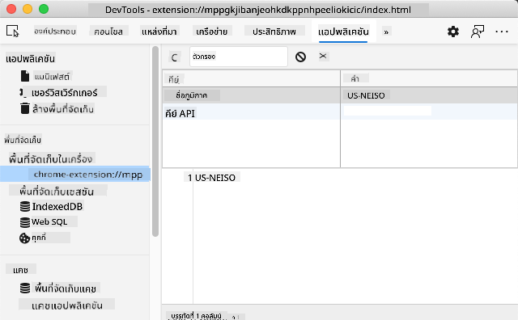

<!--
CO_OP_TRANSLATOR_METADATA:
{
  "original_hash": "8c8cd4af6086cc1d47e1d43aa4983d20",
  "translation_date": "2025-10-23T21:23:32+00:00",
  "source_file": "5-browser-extension/2-forms-browsers-local-storage/README.md",
  "language_code": "th"
}
-->
# โครงการส่วนขยายเบราว์เซอร์ ตอนที่ 2: เรียก API และใช้ Local Storage

## แบบทดสอบก่อนเรียน

[แบบทดสอบก่อนเรียน](https://ff-quizzes.netlify.app/web/quiz/25)

## บทนำ

จำส่วนขยายเบราว์เซอร์ที่คุณเริ่มสร้างไว้ได้ไหม? ตอนนี้คุณมีฟอร์มที่ดูดี แต่ยังคงเป็นแบบคงที่ วันนี้เราจะทำให้มันมีชีวิตชีวาโดยการเชื่อมต่อกับข้อมูลจริงและเพิ่มความสามารถในการจดจำ

ลองนึกถึงคอมพิวเตอร์ควบคุมภารกิจของ Apollo - พวกมันไม่ได้แสดงข้อมูลแบบคงที่เท่านั้น แต่ยังสื่อสารกับยานอวกาศอย่างต่อเนื่อง อัปเดตข้อมูลการบิน และจดจำพารามิเตอร์สำคัญของภารกิจ นั่นคือพฤติกรรมแบบไดนามิกที่เรากำลังสร้างในวันนี้ ส่วนขยายของคุณจะสามารถเชื่อมต่อกับอินเทอร์เน็ต ดึงข้อมูลสิ่งแวดล้อมจริง และจดจำการตั้งค่าของคุณสำหรับครั้งต่อไป

การรวม API อาจฟังดูซับซ้อน แต่จริงๆ แล้วมันคือการสอนโค้ดของคุณให้สื่อสารกับบริการอื่นๆ ไม่ว่าคุณจะดึงข้อมูลสภาพอากาศ ฟีดโซเชียลมีเดีย หรือข้อมูลการปล่อยก๊าซคาร์บอนเหมือนที่เราจะทำในวันนี้ มันคือการสร้างการเชื่อมต่อดิจิทัลเหล่านี้ นอกจากนี้เรายังจะสำรวจว่าทำไมเบราว์เซอร์ถึงสามารถเก็บข้อมูลได้ - คล้ายกับวิธีที่ห้องสมุดใช้แคตตาล็อกการ์ดเพื่อจดจำตำแหน่งของหนังสือ

เมื่อจบบทเรียนนี้ คุณจะมีส่วนขยายเบราว์เซอร์ที่สามารถดึงข้อมูลจริง เก็บการตั้งค่าผู้ใช้ และมอบประสบการณ์การใช้งานที่ราบรื่น มาเริ่มกันเลย!

✅ ทำตามส่วนที่มีหมายเลขในไฟล์ที่เหมาะสมเพื่อทราบว่าจะวางโค้ดของคุณที่ไหน

## ตั้งค่าธาตุที่จะใช้ในส่วนขยาย

ก่อนที่ JavaScript ของคุณจะสามารถจัดการกับอินเทอร์เฟซได้ มันต้องมีการอ้างอิงถึงธาตุ HTML เฉพาะ ลองนึกถึงกล้องโทรทรรศน์ที่ต้องชี้ไปยังดาวเฉพาะ - ก่อนที่กาลิเลโอจะศึกษาดวงจันทร์ของดาวพฤหัสบดี เขาต้องค้นหาและโฟกัสไปที่ดาวพฤหัสบดีเอง

ในไฟล์ `index.js` ของคุณ เราจะสร้างตัวแปร `const` ที่จับการอ้างอิงไปยังธาตุฟอร์มที่สำคัญแต่ละตัว นี่คล้ายกับวิธีที่นักวิทยาศาสตร์ติดป้ายอุปกรณ์ของพวกเขา - แทนที่จะค้นหาทั้งห้องปฏิบัติการทุกครั้ง พวกเขาสามารถเข้าถึงสิ่งที่ต้องการได้โดยตรง

```javascript
// form fields
const form = document.querySelector('.form-data');
const region = document.querySelector('.region-name');
const apiKey = document.querySelector('.api-key');

// results
const errors = document.querySelector('.errors');
const loading = document.querySelector('.loading');
const results = document.querySelector('.result-container');
const usage = document.querySelector('.carbon-usage');
const fossilfuel = document.querySelector('.fossil-fuel');
const myregion = document.querySelector('.my-region');
const clearBtn = document.querySelector('.clear-btn');
```

**โค้ดนี้ทำอะไร:**
- **จับ** ธาตุฟอร์มโดยใช้ `document.querySelector()` กับตัวเลือก CSS class
- **สร้าง** การอ้างอิงไปยังช่องป้อนข้อมูลสำหรับชื่อภูมิภาคและคีย์ API
- **เชื่อมต่อ** กับธาตุแสดงผลสำหรับข้อมูลการใช้คาร์บอน
- **ตั้งค่า** การเข้าถึงธาตุ UI เช่น ตัวบ่งชี้การโหลดและข้อความแสดงข้อผิดพลาด
- **เก็บ** การอ้างอิงธาตุแต่ละตัวในตัวแปร `const` เพื่อการใช้งานซ้ำในโค้ดของคุณ

## เพิ่มตัวฟังเหตุการณ์

ตอนนี้เราจะทำให้ส่วนขยายของคุณตอบสนองต่อการกระทำของผู้ใช้ ตัวฟังเหตุการณ์เป็นวิธีที่โค้ดของคุณตรวจสอบการโต้ตอบของผู้ใช้ ลองนึกถึงพนักงานรับโทรศัพท์ในระบบโทรศัพท์ยุคแรก - พวกเขาฟังการโทรเข้าและเชื่อมต่อวงจรที่ถูกต้องเมื่อมีคนต้องการโทรออก

```javascript
form.addEventListener('submit', (e) => handleSubmit(e));
clearBtn.addEventListener('click', (e) => reset(e));
init();
```

**ทำความเข้าใจแนวคิดเหล่านี้:**
- **แนบ** ตัวฟังการส่งฟอร์มที่เรียกใช้เมื่อผู้ใช้กด Enter หรือคลิกส่ง
- **เชื่อมต่อ** ตัวฟังการคลิกไปยังปุ่มล้างเพื่อรีเซ็ตฟอร์ม
- **ส่งผ่าน** วัตถุเหตุการณ์ `(e)` ไปยังฟังก์ชันตัวจัดการเพื่อการควบคุมเพิ่มเติม
- **เรียกใช้** ฟังก์ชัน `init()` ทันทีเพื่อตั้งค่าสถานะเริ่มต้นของส่วนขยายของคุณ

✅ สังเกตไวยากรณ์ฟังก์ชันลูกศรแบบย่อที่ใช้ที่นี่ วิธีการ JavaScript สมัยใหม่นี้ดูสะอาดกว่าการแสดงออกของฟังก์ชันแบบดั้งเดิม แต่ทั้งสองวิธีทำงานได้ดีเท่ากัน!

## สร้างฟังก์ชันการเริ่มต้นและรีเซ็ต

มาสร้างตรรกะการเริ่มต้นสำหรับส่วนขยายของคุณกัน ฟังก์ชัน `init()` เปรียบเสมือนระบบนำทางของเรือที่ตรวจสอบเครื่องมือของมัน - มันกำหนดสถานะปัจจุบันและปรับอินเทอร์เฟซให้เหมาะสม ฟังก์ชันนี้จะตรวจสอบว่ามีใครเคยใช้ส่วนขยายของคุณมาก่อนหรือไม่ และโหลดการตั้งค่าก่อนหน้าของพวกเขา

ฟังก์ชัน `reset()` ให้ผู้ใช้เริ่มต้นใหม่ - คล้ายกับวิธีที่นักวิทยาศาสตร์รีเซ็ตเครื่องมือของพวกเขาระหว่างการทดลองเพื่อให้ได้ข้อมูลที่สะอาด

```javascript
function init() {
	// Check if user has previously saved API credentials
	const storedApiKey = localStorage.getItem('apiKey');
	const storedRegion = localStorage.getItem('regionName');

	// Set extension icon to generic green (placeholder for future lesson)
	// TODO: Implement icon update in next lesson

	if (storedApiKey === null || storedRegion === null) {
		// First-time user: show the setup form
		form.style.display = 'block';
		results.style.display = 'none';
		loading.style.display = 'none';
		clearBtn.style.display = 'none';
		errors.textContent = '';
	} else {
		// Returning user: load their saved data automatically
		displayCarbonUsage(storedApiKey, storedRegion);
		results.style.display = 'none';
		form.style.display = 'none';
		clearBtn.style.display = 'block';
	}
}

function reset(e) {
	e.preventDefault();
	// Clear stored region to allow user to choose a new location
	localStorage.removeItem('regionName');
	// Restart the initialization process
	init();
}
```

**การแยกสิ่งที่เกิดขึ้นที่นี่:**
- **ดึง** คีย์ API และภูมิภาคที่เก็บไว้จาก local storage ของเบราว์เซอร์
- **ตรวจสอบ** ว่านี่เป็นผู้ใช้ครั้งแรก (ไม่มีข้อมูลที่เก็บไว้) หรือผู้ใช้ที่กลับมา
- **แสดง** ฟอร์มการตั้งค่าสำหรับผู้ใช้ใหม่และซ่อนธาตุอินเทอร์เฟซอื่นๆ
- **โหลด** ข้อมูลที่บันทึกไว้โดยอัตโนมัติสำหรับผู้ใช้ที่กลับมาและแสดงตัวเลือกรีเซ็ต
- **จัดการ** สถานะอินเทอร์เฟซผู้ใช้ตามข้อมูลที่มีอยู่

**แนวคิดสำคัญเกี่ยวกับ Local Storage:**
- **คงอยู่** ข้อมูลระหว่างเซสชันเบราว์เซอร์ (ไม่เหมือน session storage)
- **เก็บ** ข้อมูลเป็นคู่คีย์-ค่าโดยใช้ `getItem()` และ `setItem()`
- **คืนค่า** `null` เมื่อไม่มีข้อมูลสำหรับคีย์ที่กำหนด
- **ให้** วิธีง่ายๆ ในการจดจำการตั้งค่าและการตั้งค่าของผู้ใช้

> 💡 **ทำความเข้าใจเกี่ยวกับการเก็บข้อมูลในเบราว์เซอร์**: [LocalStorage](https://developer.mozilla.org/docs/Web/API/Window/localStorage) เปรียบเสมือนการให้ส่วนขยายของคุณมีหน่วยความจำที่คงอยู่ ลองนึกถึงวิธีที่ห้องสมุดโบราณอเล็กซานเดรียเก็บม้วนหนังสือ - ข้อมูลยังคงพร้อมใช้งานแม้เมื่อผู้เชี่ยวชาญออกไปและกลับมา
>
> **ลักษณะสำคัญ:**
> - **คงอยู่** ข้อมูลแม้หลังจากคุณปิดเบราว์เซอร์
> - **รอด** การรีสตาร์ทคอมพิวเตอร์และการล่มของเบราว์เซอร์
> - **ให้** พื้นที่เก็บข้อมูลที่มากสำหรับการตั้งค่าผู้ใช้
> - **เข้าถึง** ได้ทันทีโดยไม่มีความล่าช้าของเครือข่าย

> **หมายเหตุสำคัญ**: ส่วนขยายเบราว์เซอร์ของคุณมี local storage ที่แยกออกจากหน้าเว็บทั่วไป ซึ่งให้ความปลอดภัยและป้องกันความขัดแย้งกับเว็บไซต์อื่นๆ

คุณสามารถดูข้อมูลที่เก็บไว้ได้โดยเปิดเครื่องมือพัฒนาเบราว์เซอร์ (F12) ไปที่แท็บ **Application** และขยายส่วน **Local Storage**



> ⚠️ **ข้อควรพิจารณาด้านความปลอดภัย**: ในแอปพลิเคชันที่ใช้งานจริง การเก็บคีย์ API ใน LocalStorage มีความเสี่ยงด้านความปลอดภัยเนื่องจาก JavaScript สามารถเข้าถึงข้อมูลนี้ได้ สำหรับวัตถุประสงค์ในการเรียนรู้ วิธีนี้ใช้ได้ดี แต่แอปพลิเคชันจริงควรใช้การเก็บข้อมูลที่ปลอดภัยบนเซิร์ฟเวอร์สำหรับข้อมูลที่สำคัญ

## จัดการการส่งฟอร์ม

ตอนนี้เราจะจัดการสิ่งที่เกิดขึ้นเมื่อมีคนส่งฟอร์มของคุณ โดยค่าเริ่มต้น เบราว์เซอร์จะโหลดหน้าใหม่เมื่อส่งฟอร์ม แต่เราจะสกัดกั้นพฤติกรรมนี้เพื่อสร้างประสบการณ์ที่ราบรื่น

วิธีนี้คล้ายกับวิธีที่ศูนย์ควบคุมภารกิจจัดการการสื่อสารกับยานอวกาศ - แทนที่จะรีเซ็ตระบบทั้งหมดสำหรับการส่งข้อมูลแต่ละครั้ง พวกเขารักษาการดำเนินงานอย่างต่อเนื่องในขณะที่ประมวลผลข้อมูลใหม่

สร้างฟังก์ชันที่จับเหตุการณ์การส่งฟอร์มและดึงข้อมูลที่ผู้ใช้ป้อน:

```javascript
function handleSubmit(e) {
	e.preventDefault();
	setUpUser(apiKey.value, region.value);
}
```

**ในโค้ดด้านบน เราได้:**
- **ป้องกัน** พฤติกรรมการส่งฟอร์มเ
คุณได้เรียนรู้เกี่ยวกับ LocalStorage และ APIs ในบทเรียนนี้ ซึ่งทั้งสองอย่างนี้มีประโยชน์มากสำหรับนักพัฒนาเว็บมืออาชีพ คุณสามารถคิดได้ไหมว่าทั้งสองสิ่งนี้ทำงานร่วมกันอย่างไร? ลองคิดดูว่าคุณจะออกแบบเว็บไซต์ที่สามารถจัดเก็บรายการเพื่อใช้งานโดย API ได้อย่างไร

## งานที่ได้รับมอบหมาย

[เลือกใช้ API](assignment.md)

---

**ข้อจำกัดความรับผิดชอบ**:  
เอกสารนี้ได้รับการแปลโดยใช้บริการแปลภาษา AI [Co-op Translator](https://github.com/Azure/co-op-translator) แม้ว่าเราจะพยายามให้การแปลมีความถูกต้อง แต่โปรดทราบว่าการแปลอัตโนมัติอาจมีข้อผิดพลาดหรือความไม่ถูกต้อง เอกสารต้นฉบับในภาษาดั้งเดิมควรถือเป็นแหล่งข้อมูลที่เชื่อถือได้ สำหรับข้อมูลที่สำคัญ ขอแนะนำให้ใช้บริการแปลภาษามืออาชีพ เราจะไม่รับผิดชอบต่อความเข้าใจผิดหรือการตีความผิดที่เกิดจากการใช้การแปลนี้