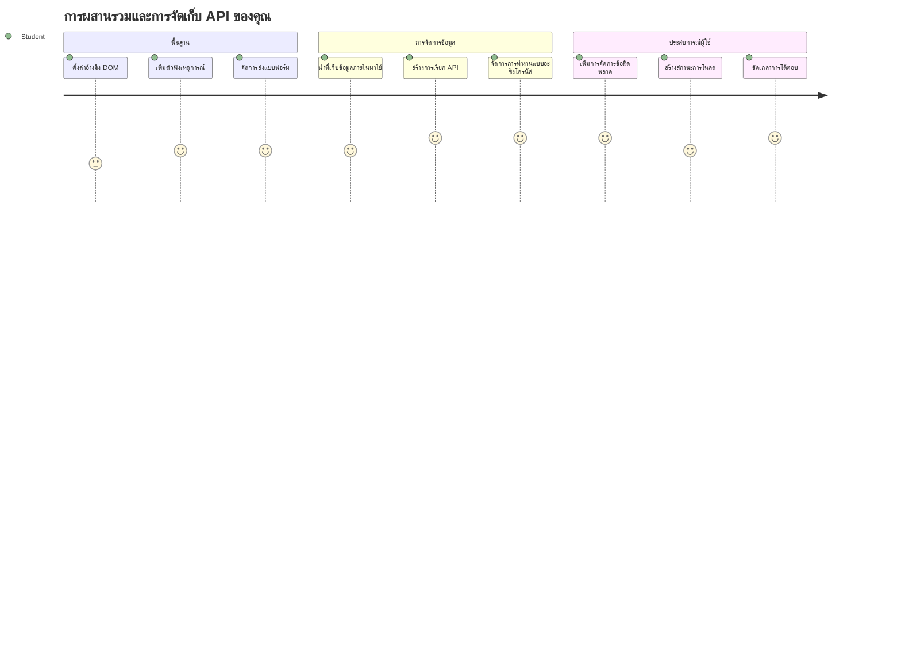
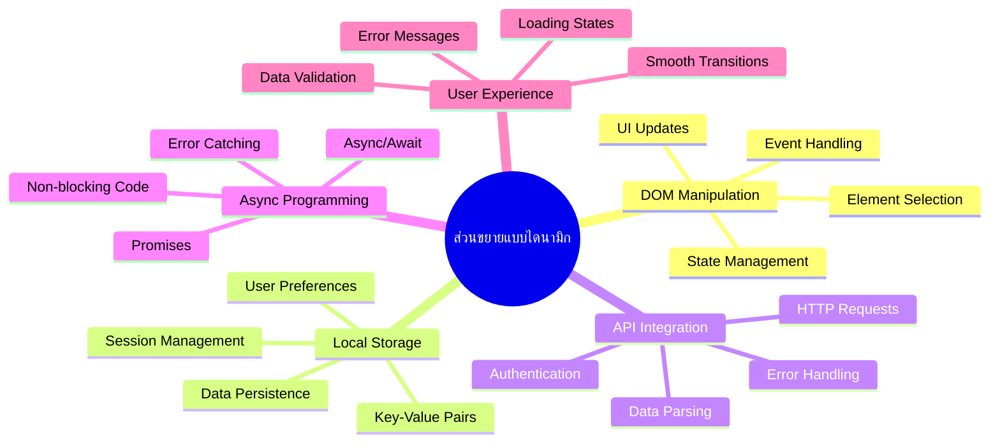
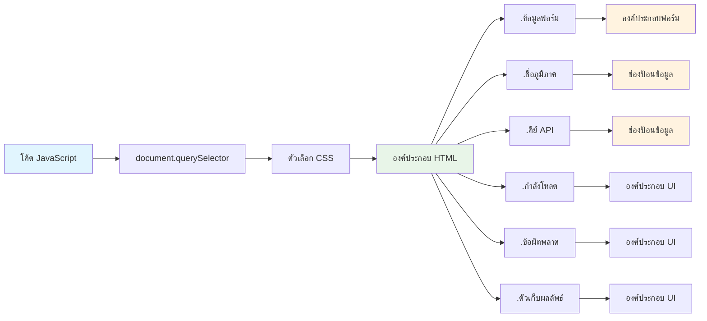
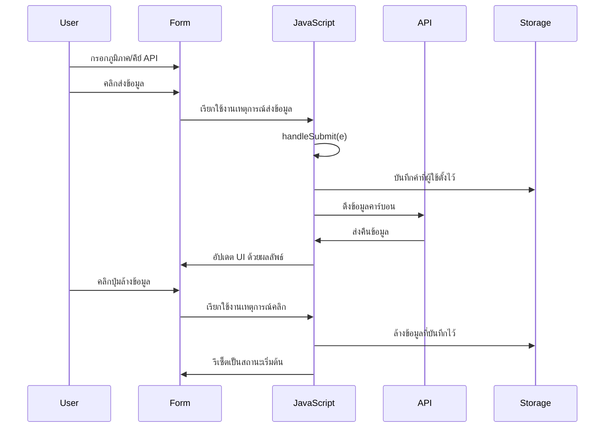
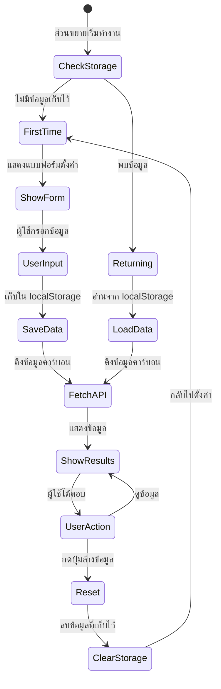
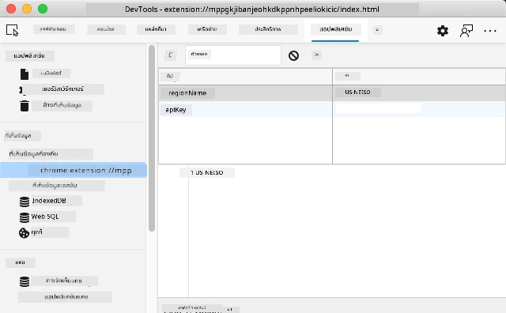
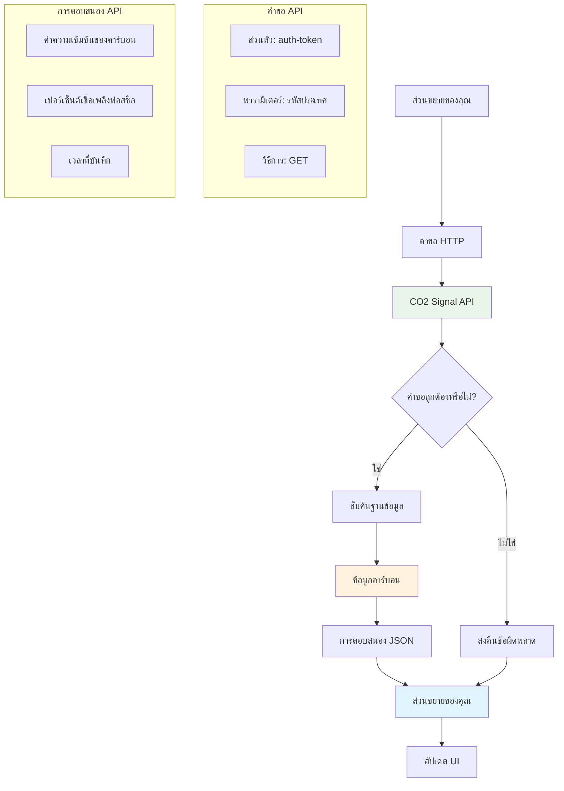
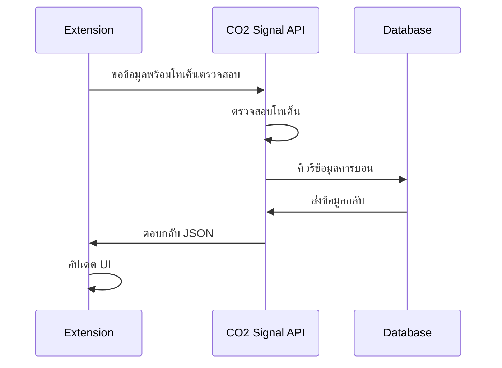
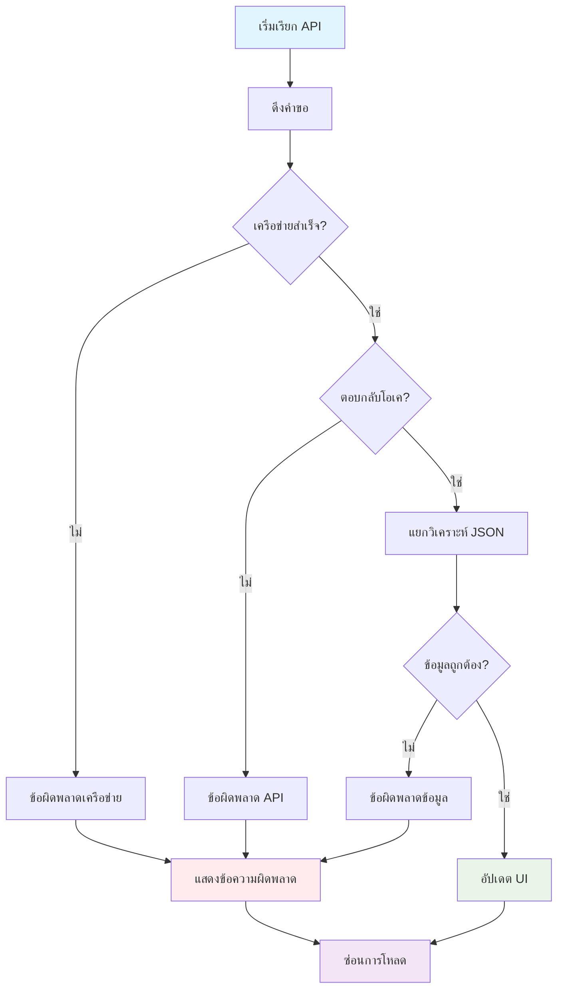
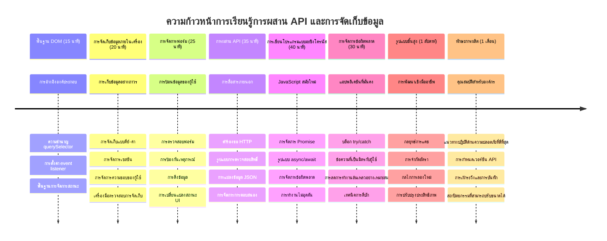

<!--
CO_OP_TRANSLATOR_METADATA:
{
  "original_hash": "2b6203a48c48d8234e0948353b47d84e",
  "translation_date": "2026-01-06T21:56:58+00:00",
  "source_file": "5-browser-extension/2-forms-browsers-local-storage/README.md",
  "language_code": "th"
}
-->
# Browser Extension Project Part 2: Call an API, use Local Storage


## Pre-Lecture Quiz

[Pre-lecture quiz](https://ff-quizzes.netlify.app/web/quiz/25)

## Introduction

จำได้ไหมว่าคุณเคยเริ่มสร้างส่วนเสริมเบราว์เซอร์อยู่? ตอนนี้คุณมีแบบฟอร์มที่ดูดี แต่โดยหลักแล้วมันยังคงเป็นแบบคงที่อยู่ วันนี้เราจะทำให้มันมีชีวิตชีวาโดยเชื่อมต่อเข้ากับข้อมูลจริงและเก็บความจำไว้

ลองนึกถึงคอมพิวเตอร์ควบคุมภารกิจอพอลโล่ - มันไม่ได้แค่แสดงข้อมูลที่ตั้งไว้ล่วงหน้า พวกมันคอยติดต่อกับยานอวกาศ อัปเดตข้อมูลเทเลเมทรี และจำค่าพารามิเตอร์สำคัญของภารกิจ นั่นคือพฤติกรรมแบบไดนามิกที่เรากำลังสร้างวันนี้ ส่วนเสริมของคุณจะดึงข้อมูลจริงจากอินเทอร์เน็ต เก็บข้อมูลสภาพแวดล้อม และจดจำการตั้งค่าขอคุณไว้สำหรับครั้งถัดไป

การบูรณาการ API อาจดูซับซ้อน แต่จริงๆ แล้วก็แค่สอนโค้ดของคุณให้สื่อสารกับบริการอื่น ไม่ว่าจะเป็นการดึงข้อมูลสภาพอากาศ ฟีดโซเชียลมีเดีย หรือข้อมูลรอยเท้าคาร์บอนเหมือนที่เราจะทำวันนี้ มันเกี่ยวกับการสร้างการเชื่อมต่อดิจิทัลเหล่านี้ เรายังจะมาสำรวจว่าบราวเซอร์เก็บข้อมูลอย่างไร — คล้ายกับที่ห้องสมุดเคยใช้บัตรแค็ตตาล็อกเพื่อจำตำแหน่งหนังสือ

เมื่อจบบทนี้ คุณจะมีส่วนเสริมเบราว์เซอร์ที่ดึงข้อมูลจริง เก็บค่าการตั้งค่าของผู้ใช้ และให้ประสบการณ์ที่ราบรื่น มาเริ่มกันเลย!


✅ ทำตามส่วนที่มีหมายเลขในไฟล์ที่เหมาะสมเพื่อรู้ว่าจะวางโค้ดส่วนไหน

## ตั้งค่าองค์ประกอบที่ต้องจัดการในส่วนเสริม

ก่อนที่ JavaScript ของคุณจะจัดการอินเทอร์เฟซ มันต้องอ้างอิงถึงองค์ประกอบ HTML เฉพาะก่อน คิดเหมือนกล้องโทรทรรศน์ที่ต้องชี้ไปยังดาวที่ต้องการ — ก่อนที่กาแลเลโอจะศึกษาดวงจันทร์ของดาวพฤหัส เขาต้องค้นหาและโฟกัสไปที่ดาวพฤหัสจริงก่อน

ในไฟล์ `index.js` ของคุณ เราจะสร้างตัวแปร `const` ที่เก็บอ้างอิงไปยังองค์ประกอบฟอร์มหลัก นี่เหมือนกับวิธีนักวิทยาศาสตร์ที่ติดป้ายอุปกรณ์ของพวกเขา — แทนที่จะค้นหาในห้องทดลองทั้งห้องทุกครั้ง พวกเขาสามารถเข้าถึงสิ่งที่ต้องการได้ทันที


```javascript
// ฟิลด์แบบฟอร์ม
const form = document.querySelector('.form-data');
const region = document.querySelector('.region-name');
const apiKey = document.querySelector('.api-key');

// ผลลัพธ์
const errors = document.querySelector('.errors');
const loading = document.querySelector('.loading');
const results = document.querySelector('.result-container');
const usage = document.querySelector('.carbon-usage');
const fossilfuel = document.querySelector('.fossil-fuel');
const myregion = document.querySelector('.my-region');
const clearBtn = document.querySelector('.clear-btn');
```

**โค้ดนี้ทำอะไร:**
- **จับ** องค์ประกอบฟอร์มโดยใช้ `document.querySelector()` กับตัวเลือกคลาส CSS
- **สร้าง** อ้างอิงไปยังช่องกรอกข้อมูลชื่อภูมิภาคและกุญแจ API
- **เชื่อมต่อ** ไปยังองค์ประกอบแสดงผลลัพธ์สำหรับข้อมูลการใช้คาร์บอน
- **ตั้งค่า** การเข้าถึงองค์ประกอบ UI อย่างตัวบ่งชี้กำลังโหลดและข้อความแสดงข้อผิดพลาด
- **เก็บ** อ้างอิงแต่ละองค์ประกอบในตัวแปร `const` เพื่อใช้งานซ้ำง่ายทั่วทั้งโค้ดของคุณ

## เพิ่ม event listeners

ตอนนี้เราจะทำให้ส่วนเสริมของคุณตอบสนองต่อการกระทำของผู้ใช้ event listeners เป็นวิธีที่โค้ดของคุณเฝ้าดูการโต้ตอบของผู้ใช้ คิดว่ามันเหมือนกับพนักงานโทรศัพท์ในยุคแรกๆ — ที่ฟังสายเรียกเข้าและเชื่อมต่อวงจรให้ถูกต้องเมื่อใครบางคนต้องการติดต่อ


```javascript
form.addEventListener('submit', (e) => handleSubmit(e));
clearBtn.addEventListener('click', (e) => reset(e));
init();
```

**ทำความเข้าใจสิ่งเหล่านี้:**
- **ผูก** listener สำหรับการส่งฟอร์ม (submit) ซึ่งจะทำงานเมื่อผู้ใช้กด Enter หรือคลิก submit
- **เชื่อมต่อ** listener สำหรับคลิกปุ่มล้างข้อมูล (clear) เพื่อรีเซ็ตฟอร์ม
- **ส่ง** วัตถุอีเวนต์ `(e)` ไปยังฟังก์ชันตัวจัดการเพื่อควบคุมเพิ่มเติม
- **เรียกใช้** ฟังก์ชัน `init()` ทันทีเพื่อตั้งค่าสถานะเริ่มต้นของส่วนเสริม

✅ สังเกต syntax ฟังก์ชันลูกศร (arrow function) แบบย่อที่ใช้ในนี้ วิธีนี้เป็น JavaScript สมัยใหม่ที่ดูสะอาดกว่าฟังก์ชันแบบดั้งเดิม แต่ทั้งสองวิธีทำงานได้ดีเท่ากัน!

### 🔄 **ตรวจสอบความเข้าใจทางการสอน**
**ความเข้าใจเกี่ยวกับการจัดการเหตุการณ์**: ก่อนจะไปต่อที่การเริ่มต้น ให้แน่ใจว่าคุณสามารถ:
- ✅ อธิบายว่า `addEventListener` เชื่อมการกระทำของผู้ใช้กับฟังก์ชัน JavaScript อย่างไร
- ✅ เข้าใจว่าทำไมเราถึงส่งวัตถุอีเวนต์ `(e)` ไปยังฟังก์ชันตัวจัดการ
- ✅ แยกแยะความแตกต่างระหว่างเหตุการณ์ `submit` และ `click`
- ✅ อธิบายว่าฟังก์ชัน `init()` ทำงานเมื่อไหร่และทำไม

**ทดสอบตัวเองอย่างรวดเร็ว**: ถ้าคุณลืมใส่ `e.preventDefault()` ในการส่งฟอร์ม จะเกิดอะไรขึ้น?
*คำตอบ: หน้าเว็บจะรีโหลดใหม่ ทำให้สถานะของ JavaScript หายไปและประสบการณ์ผู้ใช้ถูกขัดจังหวะ*

## สร้างฟังก์ชันเริ่มต้นและรีเซ็ต

เราจะสร้างตรรกะการเริ่มต้นสำหรับส่วนเสริมของคุณ ฟังก์ชัน `init()` เหมือนระบบนำทางของเรือที่ตรวจสอบเครื่องมือของมัน — มันตรวจสอบสถานะปัจจุบันและปรับอินเทอร์เฟซตามนั้น มันตรวจสอบว่ามีใครใช้ส่วนเสริมของคุณก่อนหน้านี้ไหมและโหลดการตั้งค่าก่อนหน้าไว้

ฟังก์ชัน `reset()` ให้ผู้ใช้เริ่มต้นใหม่ — คล้ายกับวิธีนักวิทยาศาสตร์รีเซ็ตเครื่องมือระหว่างการทดลองเพื่อให้ได้ข้อมูลที่สะอาด

```javascript
function init() {
	// ตรวจสอบว่าผู้ใช้เคยบันทึกข้อมูลรับรอง API หรือไม่
	const storedApiKey = localStorage.getItem('apiKey');
	const storedRegion = localStorage.getItem('regionName');

	// ตั้งค่าไอคอนส่วนขยายเป็นสีเขียวทั่วไป (เป็นที่ว่างสำหรับบทเรียนในอนาคต)
	// TODO: ดำเนินการอัปเดตไอคอนในบทเรียนถัดไป

	if (storedApiKey === null || storedRegion === null) {
		// ผู้ใช้ครั้งแรก: แสดงแบบฟอร์มการตั้งค่า
		form.style.display = 'block';
		results.style.display = 'none';
		loading.style.display = 'none';
		clearBtn.style.display = 'none';
		errors.textContent = '';
	} else {
		// ผู้ใช้ที่กลับมา: โหลดข้อมูลที่บันทึกไว้โดยอัตโนมัติ
		displayCarbonUsage(storedApiKey, storedRegion);
		results.style.display = 'none';
		form.style.display = 'none';
		clearBtn.style.display = 'block';
	}
}

function reset(e) {
	e.preventDefault();
	// ล้างข้อมูลภูมิภาคที่จัดเก็บไว้เพื่อให้ผู้ใช้เลือกตำแหน่งใหม่
	localStorage.removeItem('regionName');
	// เริ่มกระบวนการเริ่มต้นใหม่อีกครั้ง
	init();
}
```

**สรุปสิ่งที่เกิดขึ้น:**
- **ดึง** กุญแจ API และภูมิภาคที่เก็บไว้จาก local storage ของเบราว์เซอร์
- **ตรวจสอบ** ว่านี่เป็นผู้ใช้ครั้งแรก (ไม่มีข้อมูลเก็บไว้) หรือผู้ใช้เก่า
- **แสดง** ฟอร์มตั้งค่าสำหรับผู้ใช้ใหม่และซ่อนองค์ประกอบอื่น ๆ
- **โหลด** ข้อมูลที่บันทึกไว้โดยอัตโนมัติสำหรับผู้ใช้เดิมและแสดงปุ่มรีเซ็ต
- **จัดการ** สถานะของอินเทอร์เฟซผู้ใช้ตามข้อมูลที่มีอยู่

**แนวคิดสำคัญเกี่ยวกับ Local Storage:**
- **เก็บข้อมูล** ไว้ระหว่างเซสชันของเบราว์เซอร์ (ไม่เหมือน session storage)
- **เก็บข้อมูล** เป็นคู่กุญแจ-ค่าโดยใช้ `getItem()` และ `setItem()`
- **คืนค่า** `null` เมื่อไม่มีข้อมูลสำหรับกุญแจนั้น
- **ให้ทางง่ายๆ** ในการจำค่าการตั้งค่าและตัวเลือกของผู้ใช้

> 💡 **ทำความเข้าใจการเก็บข้อมูลของเบราว์เซอร์**: [LocalStorage](https://developer.mozilla.org/docs/Web/API/Window/localStorage) เปรียบเสมือนการให้ส่วนเสริมของคุณมีความทรงจำถาวร ลองนึกถึงหอสมุดอเล็กซานเดรียโบราณที่เก็บม้วนหนังสือ — ข้อมูลยังคงอยู่แม้ผู้เรียนจะออกไปแล้วกลับมาใหม่
>
> **ลักษณะสำคัญ:**
> - **เก็บข้อมูล** ต่อไปแม้คุณจะปิดเบราว์เซอร์
> - **ยังอยู่รอด** แม้คอมพิวเตอร์รีสตาร์ทหรือเบราว์เซอร์แครช
> - **ให้พื้นที่เก็บข้อมูลมาก** สำหรับค่าการตั้งค่าผู้ใช้
> - **เข้าถึงทันที** โดยไม่มีความหน่วงจากเครือข่าย

> **หมายเหตุสำคัญ**: ส่วนเสริมเบราว์เซอร์ของคุณมี local storage แยกกันโดยเฉพาะ ไม่เกี่ยวกับเว็บเพจทั่วไป ซึ่งช่วยเรื่องความปลอดภัยและป้องกันความขัดแย้งกับเว็บไซต์อื่น

คุณสามารถดูข้อมูลที่เก็บไว้โดยเปิด Developer Tools (F12) ในเบราว์เซอร์ ไปที่แท็บ **Application** แล้วขยายส่วน **Local Storage**




> ⚠️ **ข้อพิจารณาด้านความปลอดภัย**: ในแอปพลิเคชันจริง การเก็บกุญแจ API ใน LocalStorage มีความเสี่ยงทางความปลอดภัยเพราะ JavaScript เข้าถึงข้อมูลนี้ได้ สำหรับการเรียนรู้วิธีนี้ใช้ได้ แต่แอปจริงควรเก็บข้อมูลลับอย่างปลอดภัยบนเซิร์ฟเวอร์

## จัดการการส่งฟอร์ม

ตอนนี้เราจะจัดการสิ่งที่เกิดขึ้นเมื่อใครสักคนส่งฟอร์ม โดยปกติเมื่อส่งฟอร์ม เบราว์เซอร์จะรีโหลดหน้า แต่เราจะดักจับพฤติกรรมนั้นเพื่อให้ประสบการณ์ราบรื่นขึ้น

แนวทางนี้เหมือนกับการควบคุมภารกิจที่จัดการการสื่อสารกับยานอวกาศ — แทนที่จะรีเซ็ตระบบทั้งหมดสำหรับแต่ละการส่งข้อมูล พวกเขาจะดำเนินการอย่างต่อเนื่องพร้อมกับประมวลผลข้อมูลใหม่

สร้างฟังก์ชันที่จับเหตุการณ์การส่งฟอร์มและดึงข้อมูลที่ผู้ใช้กรอกมา:

```javascript
function handleSubmit(e) {
	e.preventDefault();
	setUpUser(apiKey.value, region.value);
}
```

**ในสิ่งที่ทำไปข้างต้น:**
- **ป้องกัน** พฤติกรรมส่งฟอร์มเริ่มต้นที่จะรีโหลดหน้า
- **ดึง** ค่าจากช่องกรอก API key และ region
- **ส่ง** ข้อมูลฟอร์มไปยังฟังก์ชัน `setUpUser()` เพื่อประมวลผล
- **รักษา** พฤติกรรม Single Page Application โดยไม่รีโหลดหน้า

✅ จำไว้ว่า ช่องในฟอร์ม HTML ของคุณมีแอตทริบิวต์ `required` ดังนั้นเบราว์เซอร์จะตรวจสอบให้ผู้ใช้ต้องกรอกทั้ง API key และ region ก่อนฟังก์ชันนี้จะทำงาน

## ตั้งค่าการตั้งค่าผู้ใช้

ฟังก์ชัน `setUpUser` มีหน้าที่เก็บข้อมูลรับรองของผู้ใช้และเริ่มการเรียก API ครั้งแรก เพื่อให้เปลี่ยนผ่านอย่างราบรื่นจากการตั้งค่าไปสู่การแสดงผล

```javascript
function setUpUser(apiKey, regionName) {
	// บันทึกข้อมูลรับรองของผู้ใช้สำหรับการใช้งานในอนาคต
	localStorage.setItem('apiKey', apiKey);
	localStorage.setItem('regionName', regionName);
	
	// อัปเดต UI เพื่อแสดงสถานะกำลังโหลด
	loading.style.display = 'block';
	errors.textContent = '';
	clearBtn.style.display = 'block';
	
	// ดึงข้อมูลการใช้คาร์บอนไดออกไซด์ด้วยข้อมูลรับรองของผู้ใช้
	displayCarbonUsage(apiKey, regionName);
}
```

**ลำดับขั้นตอนที่เกิดขึ้น:**
- **บันทึก** กุญแจ API และชื่อภูมิภาคไปยัง local storage เพื่อใช้ในอนาคต
- **แสดง** ตัวบ่งชี้กำลังโหลดเพื่อแจ้งว่ากำลังดึงข้อมูล
- **ล้าง** ข้อความแสดงข้อผิดพลาดก่อนหน้าออกจากหน้าจอ
- **แสดง** ปุ่มล้างข้อมูลให้ผู้ใช้รีเซ็ตการตั้งค่าในภายหลัง
- **เริ่ม** การเรียก API เพื่อดึงข้อมูลการใช้คาร์บอนจริง

ฟังก์ชันนี้สร้างประสบการณ์ผู้ใช้ที่ราบรื่นโดยจัดการทั้งการเก็บข้อมูลและการอัปเดตอินเทอร์เฟซในหนึ่งการดำเนินการ

## แสดงข้อมูลการใช้คาร์บอน

ตอนนี้เราจะเชื่อมต่อส่วนเสริมของคุณกับแหล่งข้อมูลภายนอกผ่าน API สิ่งนี้เปลี่ยนส่วนเสริมของคุณจากเครื่องมืออิสระเป็นตัวที่เข้าถึงข้อมูลเรียลไทม์จากทั่วอินเทอร์เน็ตได้

**ทำความเข้าใจเกี่ยวกับ API**

[APIs](https://www.webopedia.com/TERM/A/API.html) คือวิธีการที่แอปพลิเคชันต่างๆ สื่อสารกัน นึกว่ามันเหมือนกับระบบโทรเลขที่เชื่อมระหว่างเมืองห่างไกลในศตวรรษที่ 19 — ผู้ปฏิบัติงานจะส่งคำขอไปยังสถานีไกลๆ และได้รับคำตอบพร้อมข้อมูลที่ร้องขอ ทุกครั้งที่คุณเช็คโซเชียลมีเดีย ถามผู้ช่วยเสียง หรือใช้แอปส่งของ APIs เป็นตัวกลางให้ข้อมูลเหล่านี้


**แนวคิดสำคัญเกี่ยวกับ REST APIs:**
- **REST** ย่อมาจาก 'Representational State Transfer'
- **ใช้** วิธี HTTP มาตรฐาน (GET, POST, PUT, DELETE) เพื่อโต้ตอบกับข้อมูล
- **คืนค่า** ข้อมูลในรูปแบบที่คาดเดาได้ ส่วนใหญ่เป็น JSON
- **ให้** จุดเชื่อมต่อ URL ที่สม่ำเสมอสำหรับคำขอประเภทต่างๆ

✅ [CO2 Signal API](https://www.co2signal.com/) ที่เราจะใช้ใหข้อมูลความเข้มข้นคาร์บอนเรียลไทม์จากกริดไฟฟ้าทั่วโลก ช่วยให้ผู้ใช้เข้าใจผลกระทบต่อสิ่งแวดล้อมจากการใช้ไฟฟ้าของตน

> 💡 **ทำความเข้าใจ JavaScript แบบอะซิงโครนัส**: คีย์เวิร์ด [`async`](https://developer.mozilla.org/docs/Web/JavaScript/Reference/Statements/async_function) ช่วยให้โค้ดของคุณจัดการหลายงานพร้อมกันได้ เมื่อคุณร้องขอข้อมูลจากเซิร์ฟเวอร์ คุณไม่ต้องการให้ส่วนเสริมทั้งหมดหยุดชะงัก — มันเหมือนกับหอบังคับการบินที่หยุดการทำงานทั้งหมดขณะรอเครื่องบินตอบกลับ
>
> **ประโยชน์หลัก:**
> - **รักษา** ความตอบสนองของส่วนเสริมขณะที่ข้อมูลกำลังโหลด
> - **อนุญาต** ให้โค้ดอื่นทำงานต่อในระหว่างการร้องขอเครือข่าย
> - **ช่วย** ให้อ่านโค้ดง่ายขึ้นเมื่อเทียบกับการใช้ callback แบบดั้งเดิม
> - **เปิดทาง** ให้การจัดการข้อผิดพลาดอย่างดีเมื่อเกิดปัญหาเครือข่าย

นี่คือวิดีโอสั้นๆ เกี่ยวกับ `async`:

[](https://youtube.com/watch?v=YwmlRkrxvkk "Async and Await for managing promises")

> 🎥 คลิกภาพด้านบนเพื่อดูวิดีโอเกี่ยวกับ async/await

### 🔄 **ตรวจสอบความเข้าใจทางการสอน**
**ความเข้าใจการเขียนโปรแกรมแบบ Async**: ก่อนเข้าสู่ฟังก์ชัน API ให้ตรวจสอบว่าคุณเข้าใจ:
- ✅ ทำไมถึงใช้ `async/await` แทนการบล็อกส่วนเสริมทั้งหมด
- ✅ วิธีบล็อก `try/catch` จัดการข้อผิดพลาดเครือข่ายอย่างนุ่มนวล
- ✅ ความแตกต่างระหว่างการทำงานแบบซิงโครนัสและอะซิงโครนัส
- ✅ ทำไมการเรียก API บางครั้งล้มเหลวและวิธีจัดการกับความล้มเหลวนั้น

**การเชื่อมต่อกับโลกจริง**: ลองนึกถึงตัวอย่าง async ในชีวิตประจำวัน:
- **สั่งอาหาร**: คุณไม่ต้องยืนรอที่ครัว — คุณได้ใบเสร็จแล้วทำอย่างอื่นต่อ
- **ส่งอีเมล**: แอปอีเมลของคุณไม่หยุดชะงักขณะส่ง — คุณยังแต่งอีเมลอื่นได้
- **โหลดเว็บเพจ**: รูปภาพโหลดแบบค่อยเป็นค่อยไปในขณะที่คุณอ่านข้อความได้ทันที

**ลำดับการรับรอง API**:

สร้างฟังก์ชันเพื่อดึงและแสดงข้อมูลการใช้คาร์บอน:

```javascript
// วิธีการแบบ fetch API สมัยใหม่ (ไม่ต้องใช้ไลบรารีภายนอก)
async function displayCarbonUsage(apiKey, region) {
	try {
		// ดึงข้อมูลความเข้มข้นของคาร์บอนจาก CO2 Signal API
		const response = await fetch('https://api.co2signal.com/v1/latest', {
			method: 'GET',
			headers: {
				'auth-token': apiKey,
				'Content-Type': 'application/json'
			},
			// เพิ่มพารามิเตอร์การค้นหาสำหรับพื้นที่เฉพาะ
			...new URLSearchParams({ countryCode: region }) && {
				url: `https://api.co2signal.com/v1/latest?countryCode=${region}`
			}
		});

		// ตรวจสอบว่าการร้องขอ API สำเร็จหรือไม่
		if (!response.ok) {
			throw new Error(`API request failed: ${response.status}`);
		}

		const data = await response.json();
		const carbonData = data.data;

		// คำนวณค่าความเข้มข้นของคาร์บอนที่ปัดเศษแล้ว
		const carbonIntensity = Math.round(carbonData.carbonIntensity);

		// อัปเดตอินเทอร์เฟซผู้ใช้ด้วยข้อมูลที่ดึงมา
		loading.style.display = 'none';
		form.style.display = 'none';
		myregion.textContent = region.toUpperCase();
		usage.textContent = `${carbonIntensity} grams (grams CO₂ emitted per kilowatt hour)`;
		fossilfuel.textContent = `${carbonData.fossilFuelPercentage.toFixed(2)}% (percentage of fossil fuels used to generate electricity)`;
		results.style.display = 'block';

		// TODO: calculateColor(carbonIntensity) - นำไปใช้ในบทเรียนถัดไป

	} catch (error) {
		console.error('Error fetching carbon data:', error);
		
		// แสดงข้อความข้อผิดพลาดที่เข้าใจง่ายสำหรับผู้ใช้
		loading.style.display = 'none';
		results.style.display = 'none';
		errors.textContent = 'Sorry, we couldn\'t fetch data for that region. Please check your API key and region code.';
	}
}
```

**สรุปสิ่งที่เกิดขึ้น:**
- **ใช้** API `fetch()` สมัยใหม่แทนไลบรารีภายนอกเช่น Axios เพื่อโค้ดที่สะอาดและไม่ต้องพึ่งพา
- **ตรวจสอบ** ข้อผิดพลาดอย่างเหมาะสมโดยใช้ `response.ok` เพื่อจับความล้มเหลวของ API ตั้งแต่ต้น
- **จัดการ** งานอะซิงโครนัสด้วย `async/await` เพื่อไหลของโค้ดที่อ่านง่ายขึ้น
- **รับรอง** ด้วย CO2 Signal API โดยใช้ header `auth-token`
- **แปลง** ข้อมูล JSON ที่ตอบกลับและดึงข้อมูลความเข้มข้นคาร์บอน
- **อัปเดต** องค์ประกอบ UI หลายตัวด้วยข้อมูลสิ่งแวดล้อมที่จัดรูปแบบแล้ว
- **แสดง** ข้อความแจ้งข้อผิดพลาดที่เป็นมิตรเมื่อ API ใช้งานไม่ได้

**แนวคิด JavaScript สมัยใหม่ที่แสดงในนี้:**
- **เทมเพลตลิเทอรัล** ด้วย `${}` สำหรับการจัดรูปแบบสตริงที่สะอาด
- **การจัดการข้อผิดพลาด** ด้วยบล็อก try/catch สำหรับแอปที่ทนทาน
- **รูปแบบ async/await** สำหรับจัดการคำขอเครือข่ายอย่างนุ่มนวล
- **การทำ object destructuring** เพื่อดึงข้อมูลเฉพาะจากการตอบสนอง API
- **การเชนเมธอด** สำหรับการจัดการ DOM หลายขั้นตอน

✅ ฟังก์ชันนี้แสดงหลายแนวคิดสำคัญของการพัฒนาเว็บ — การสื่อสารกับเซิร์ฟเวอร์ภายนอก การจัดการรับรองความถูกต้อง การประมวลผลข้อมูล การอัปเดตอินเทอร์เฟซ และการจัดการข้อผิดพลาดอย่างนุ่มนวล ซึ่งเป็นทักษะพื้นฐานที่นักพัฒนามืออาชีพใช้เป็นประจำ


### 🔄 **ตรวจสอบความเข้าใจทางการสอน**
**ความเข้าใจระบบโดยรวม**: ยืนยันว่าคุณเข้าใจกระบวนการทั้งหมด:
- ✅ วิธีที่อ้างอิง DOM ช่วยให้ JavaScript ควบคุมอินเทอร์เฟซ
- ✅ ทำไม local storage สร้างความคงอยู่ระหว่างเซสชันเบราว์เซอร์
- ✅ การใช้ async/await ทำให้เรียก API โดยไม่ทำให้ส่วนเสริมหยุดชะงัก
- ✅ เกิดอะไรขึ้นเมื่อการเรียก API ล้มเหลวและการจัดการข้อผิดพลาด
- ✅ ทำไมประสบการณ์ผู้ใช้จึงรวมถึงสถานะกำลังโหลดและข้อความแสดงข้อผิดพลาด

🎉 **สิ่งที่คุณทำได้:** คุณได้สร้างส่วนเสริมเบราว์เซอร์ที่:
- **เชื่อมต่อ** กับอินเทอร์เน็ตและดึงข้อมูลสิ่งแวดล้อมจริง
- **เก็บ** การตั้งค่าผู้ใช้ระหว่างเซสชัน
- **จัดการ** ข้อผิดพลาดอย่างนุ่มนวลแทนที่จะขัดข้อง
- **มอบ** ประสบการณ์ผู้ใช้ที่ราบรื่นและเป็นมืออาชีพ

ทดสอบผลงานของคุณโดยรันคำสั่ง `npm run build` และรีเฟรชส่วนเสริมในเบราว์เซอร์ ตอนนี้คุณมีตัวติดตามรอยเท้าคาร์บอนที่ใช้งานได้ บทเรียนถัดไปจะเพิ่มความสามารถไอคอนแบบไดนามิกเพื่อให้ส่วนเสริมสมบูรณ์

---

## GitHub Copilot Agent Challenge 🚀

ใช้โหมด Agent เพื่อทำภารกิจต่อไปนี้ให้เสร็จ:
**คำอธิบาย:** ปรับปรุงส่วนขยายเบราว์เซอร์ด้วยการเพิ่มการจัดการข้อผิดพลาดและฟีเจอร์สำหรับประสบการณ์ผู้ใช้ ความท้าทายนี้จะช่วยให้คุณฝึกใช้งาน API, การเก็บข้อมูลในเครื่อง, และการจัดการ DOM ด้วยรูปแบบ JavaScript สมัยใหม่

**คำสั่ง:** สร้างฟังก์ชัน displayCarbonUsage เวอร์ชันปรับปรุงที่รวม: 1) กลไกการลองใหม่สำหรับการเรียก API ที่ล้มเหลวโดยใช้ exponential backoff, 2) การตรวจสอบความถูกต้องของรหัสภูมิภาคก่อนเรียก API, 3) แอนิเมชันการโหลดพร้อมตัวชี้วัดความก้าวหน้า, 4) การเก็บแคชผลลัพธ์ API ใน localStorage พร้อมกับเวลาหมดอายุ (แคช 30 นาที), และ 5) ฟีเจอร์แสดงข้อมูลย้อนหลังจากการเรียก API ก่อนหน้า พร้อมทั้งเพิ่มคอมเมนต์สไตล์ TypeScript JSDoc ที่เหมาะสมเพื่ออธิบายพารามิเตอร์ฟังก์ชันและประเภทค่าที่ส่งคืน

เรียนรู้เพิ่มเติมเกี่ยวกับ [โหมดตัวแทน](https://code.visualstudio.com/blogs/2025/02/24/introducing-copilot-agent-mode) ที่นี่

## 🚀 ความท้าทาย

ขยายความเข้าใจเกี่ยวกับ API โดยการสำรวจ API บนเบราว์เซอร์ที่มีอยู่อย่างมากมายสำหรับการพัฒนาเว็บ เลือกหนึ่งใน API ที่ระบุด้านล่างและสร้างสาธิตเล็กๆ:

- [Geolocation API](https://developer.mozilla.org/docs/Web/API/Geolocation_API) - ดึงตำแหน่งปัจจุบันของผู้ใช้
- [Notification API](https://developer.mozilla.org/docs/Web/API/Notifications_API) - ส่งการแจ้งเตือนบนเดสก์ท็อป
- [HTML Drag and Drop API](https://developer.mozilla.org/docs/Web/API/HTML_Drag_and_Drop_API) - สร้างอินเทอร์เฟซลากที่โต้ตอบได้
- [Web Storage API](https://developer.mozilla.org/docs/Web/API/Web_Storage_API) - เทคนิคการเก็บข้อมูลในเครื่องขั้นสูง
- [Fetch API](https://developer.mozilla.org/docs/Web/API/Fetch_API) - ทางเลือกสมัยใหม่แทน XMLHttpRequest

**คำถามวิจัยที่ควรพิจารณา:**
- ปัญหาในโลกจริงที่ API นี้ช่วยแก้ไขคืออะไร?
- API นี้จัดการกับข้อผิดพลาดและกรณีมุมอย่างไร?
- มีข้อควรระวังทางด้านความปลอดภัยอะไรบ้างเมื่อใช้ API นี้?
- API นี้ได้รับการสนับสนุนในเบราว์เซอร์ต่างๆ มากน้อยแค่ไหน?

หลังจากการวิจัยของคุณ ให้ระบุลักษณะที่ทำให้ API เป็นมิตรกับนักพัฒนาและมีความน่าเชื่อถือ

## แบบทดสอบหลังเรียน

[แบบทดสอบหลังเรียน](https://ff-quizzes.netlify.app/web/quiz/26)

## ทบทวน & ศึกษาด้วยตนเอง

คุณได้เรียนรู้เกี่ยวกับ LocalStorage และ API ในบทนี้ ซึ่งมีประโยชน์มากสำหรับนักพัฒนาเว็บมืออาชีพ ลองคิดดูว่าทั้งสองสิ่งนี้ทำงานร่วมกันอย่างไร? ลองนึกถึงการออกแบบเว็บไซต์ที่จะเก็บข้อมูลเพื่อใช้กับ API

### ⚡ **สิ่งที่คุณทำได้ใน 5 นาทีถัดไป**
- [ ] เปิดแท็บ Application ของ DevTools และสำรวจ localStorage บนเว็บไซต์ใดก็ได้
- [ ] สร้างฟอร์ม HTML ง่ายๆ และทดสอบการตรวจสอบข้อมูลฟอร์มในเบราว์เซอร์
- [ ] ทดลองเก็บและดึงข้อมูลโดยใช้ localStorage ในคอนโซลของเบราว์เซอร์
- [ ] ตรวจสอบข้อมูลฟอร์มที่ส่งผ่านแท็บ Network

### 🎯 **สิ่งที่คุณทำสำเร็จได้ในชั่วโมงนี้**
- [ ] ทำแบบทดสอบหลังเรียนให้เสร็จและเข้าใจแนวคิดการจัดการฟอร์ม
- [ ] สร้างฟอร์มส่วนขยายเบราว์เซอร์ที่บันทึกการตั้งค่าผู้ใช้
- [ ] ใช้การตรวจสอบข้อมูลฟอร์มฝั่งไคลเอนต์พร้อมข้อความข้อผิดพลาดที่ช่วยเหลือ
- [ ] ฝึกใช้งาน chrome.storage API เพื่อเก็บข้อมูลส่วนขยาย
- [ ] สร้างอินเทอร์เฟซผู้ใช้ที่ตอบสนองกับการตั้งค่าผู้ใช้ที่บันทึกไว้

### 📅 **การสร้างส่วนขยายตลอดสัปดาห์ของคุณ**
- [ ] สร้างส่วนขยายเบราว์เซอร์ครบฟีเจอร์พร้อมฟังก์ชันฟอร์ม
- [ ] เชี่ยวชาญตัวเลือกการเก็บข้อมูลหลายรูปแบบ: local, sync, และ session storage
- [ ] เพิ่มฟีเจอร์ฟอร์มขั้นสูง เช่น ออโต้คอมพลีตและการตรวจสอบความถูกต้อง
- [ ] เพิ่มฟังก์ชันนำเข้า/ส่งออกข้อมูลผู้ใช้
- [ ] ทดสอบส่วนขยายอย่างละเอียดในเบราว์เซอร์ต่างๆ
- [ ] ปรับปรุงประสบการณ์ผู้ใช้และการจัดการข้อผิดพลาดของส่วนขยาย

### 🌟 **จุดมุ่งหมายความชำนาญ API เว็บตลอดเดือนของคุณ**
- [ ] สร้างแอปพลิเคชันซับซ้อนโดยใช้ API การเก็บข้อมูลในเบราว์เซอร์ต่างๆ
- [ ] เรียนรู้แนวทางการพัฒนาแบบออฟไลน์-เฟิร์สต์
- [ ] มีส่วนร่วมกับโปรเจ็กต์โอเพ่นซอร์สร่วมกับการจัดเก็บข้อมูล
- [ ] เชี่ยวชาญการพัฒนาเน้นความเป็นส่วนตัวและการปฏิบัติตาม GDPR
- [ ] สร้างไลบรารีที่นำกลับมาใช้ใหม่สำหรับการจัดการฟอร์มและข้อมูล
- [ ] แบ่งปันความรู้เกี่ยวกับ API เว็บและการพัฒนาส่วนขยาย

## 🎯 กำหนดเส้นเวลาความชำนาญการพัฒนาส่วนขยายของคุณ


### 🛠️ สรุปชุดเครื่องมือการพัฒนาแบบฟูลสแตกของคุณ

หลังจากทำบทเรียนนี้เสร็จ คุณจะมี:
- **ความชำนาญ DOM**: การเลือกและจัดการองค์ประกอบอย่างแม่นยำ
- **ความเชี่ยวชาญการเก็บข้อมูล**: การจัดการข้อมูลถาวรด้วย localStorage
- **การผสานรวม API**: การดึงข้อมูลแบบเรียลไทม์และการรับรองตัวตน
- **การเขียนโปรแกรมแบบ Async**: การทำงานที่ไม่บล็อกด้วย JavaScript สมัยใหม่
- **การจัดการข้อผิดพลาด**: แอปที่แข็งแกร่งจัดการข้อผิดพลาดได้อย่างราบรื่น
- **ประสบการณ์ผู้ใช้**: สถานะการโหลด, การตรวจสอบข้อมูล, และการโต้ตอบที่ราบรื่น
- **รูปแบบสมัยใหม่**: fetch API, async/await, และฟีเจอร์ ES6+

**ทักษะมืออาชีพที่ได้รับ**: คุณได้นำรูปแบบที่ใช้ใน:
- **เว็บแอปพลิเคชัน**: แอปหน้าเดียวพร้อมแหล่งข้อมูลภายนอก
- **การพัฒนาโมบายล์**: แอปขับเคลื่อนด้วย API พร้อมความสามารถออฟไลน์
- **ซอฟต์แวร์เดสก์ท็อป**: แอป Electron พร้อมการเก็บข้อมูลถาวร
- **ระบบองค์กร**: การรับรองตัวตน, แคช, และการจัดการข้อผิดพลาด
- **เฟรมเวิร์คสมัยใหม่**: รูปแบบการจัดการข้อมูลใน React/Vue/Angular

**ระดับถัดไป**: คุณพร้อมสำรวจหัวข้อขั้นสูง เช่น กลยุทธ์แคช, การเชื่อมต่อ WebSocket แบบเรียลไทม์, หรือการจัดการสถานะที่ซับซ้อน!

## งานมอบหมาย

[Adopt an API](assignment.md)

---

<!-- CO-OP TRANSLATOR DISCLAIMER START -->
**ข้อจำกัดความรับผิดชอบ**:  
เอกสารนี้ได้รับการแปลโดยใช้บริการแปลภาษาอัตโนมัติ [Co-op Translator](https://github.com/Azure/co-op-translator) แม้ว่าเราจะพยายามให้การแปลมีความถูกต้อง โปรดทราบว่าการแปลโดยระบบอัตโนมัติอาจมีข้อผิดพลาดหรือความคลาดเคลื่อนได้ เอกสารต้นฉบับในภาษาต้นทางถือเป็นแหล่งข้อมูลที่เชื่อถือได้ สำหรับข้อมูลสำคัญ ควรใช้การแปลโดยมืออาชีพที่มีความชำนาญ เราจะไม่รับผิดชอบต่อความเข้าใจผิดหรือการแปลความหมายที่ผิดพลาดที่เกิดขึ้นจากการใช้การแปลนี้
<!-- CO-OP TRANSLATOR DISCLAIMER END -->