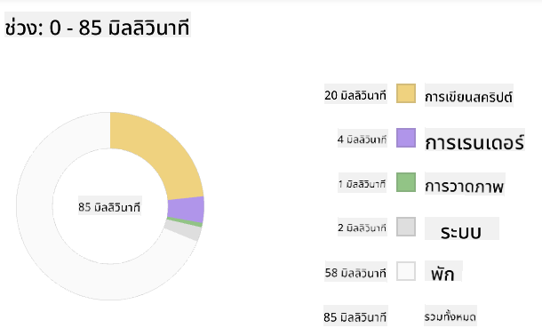
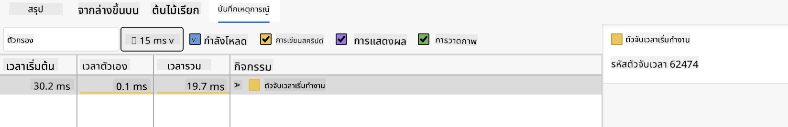

<!--
CO_OP_TRANSLATOR_METADATA:
{
  "original_hash": "f198c6b817b4b2a99749f4662e7cae98",
  "translation_date": "2025-08-26T22:42:25+00:00",
  "source_file": "5-browser-extension/3-background-tasks-and-performance/README.md",
  "language_code": "th"
}
-->
# โครงการส่วนขยายเบราว์เซอร์ ตอนที่ 3: เรียนรู้เกี่ยวกับงานเบื้องหลังและประสิทธิภาพ

## แบบทดสอบก่อนเรียน

[แบบทดสอบก่อนเรียน](https://ashy-river-0debb7803.1.azurestaticapps.net/quiz/27)

### บทนำ

ในสองบทเรียนที่ผ่านมาในโมดูลนี้ คุณได้เรียนรู้วิธีสร้างฟอร์มและพื้นที่แสดงข้อมูลที่ดึงมาจาก API ซึ่งเป็นวิธีมาตรฐานในการสร้างเว็บไซต์บนเว็บ คุณยังได้เรียนรู้วิธีจัดการการดึงข้อมูลแบบอะซิงโครนัส ส่วนขยายเบราว์เซอร์ของคุณใกล้จะเสร็จสมบูรณ์แล้ว

สิ่งที่เหลืออยู่คือการจัดการงานเบื้องหลังบางอย่าง รวมถึงการรีเฟรชสีของไอคอนส่วนขยาย ดังนั้นนี่จึงเป็นเวลาที่ดีที่จะพูดถึงวิธีที่เบราว์เซอร์จัดการงานประเภทนี้ ลองคิดถึงงานเหล่านี้ในบริบทของประสิทธิภาพของทรัพย์สินเว็บของคุณในขณะที่คุณสร้างมันขึ้นมา

## พื้นฐานของประสิทธิภาพเว็บ

> "ประสิทธิภาพของเว็บไซต์เกี่ยวกับสองสิ่ง: ความเร็วในการโหลดหน้าเว็บ และความเร็วในการทำงานของโค้ดบนหน้าเว็บ" -- [Zack Grossbart](https://www.smashingmagazine.com/2012/06/javascript-profiling-chrome-developer-tools/)

หัวข้อเกี่ยวกับวิธีทำให้เว็บไซต์ของคุณเร็วสุดขีดบนอุปกรณ์ทุกประเภท สำหรับผู้ใช้ทุกประเภท ในทุกสถานการณ์นั้นกว้างขวางอย่างไม่น่าแปลกใจ นี่คือบางจุดที่ควรคำนึงถึงในขณะที่คุณสร้างโครงการเว็บมาตรฐานหรือส่วนขยายเบราว์เซอร์

สิ่งแรกที่คุณต้องทำเพื่อให้แน่ใจว่าเว็บไซต์ของคุณทำงานได้อย่างมีประสิทธิภาพคือการรวบรวมข้อมูลเกี่ยวกับประสิทธิภาพของมัน สถานที่แรกที่คุณสามารถทำได้คือในเครื่องมือสำหรับนักพัฒนาของเบราว์เซอร์ของคุณ ใน Edge คุณสามารถเลือกปุ่ม "การตั้งค่าและอื่นๆ" (ไอคอนสามจุดที่มุมขวาบนของเบราว์เซอร์) จากนั้นไปที่ เครื่องมือเพิ่มเติม > เครื่องมือสำหรับนักพัฒนา และเปิดแท็บประสิทธิภาพ คุณยังสามารถใช้คีย์ลัด `Ctrl` + `Shift` + `I` บน Windows หรือ `Option` + `Command` + `I` บน Mac เพื่อเปิดเครื่องมือสำหรับนักพัฒนา

แท็บประสิทธิภาพมีเครื่องมือการวิเคราะห์ เปิดเว็บไซต์ (ลองเช่น [https://www.microsoft.com](https://www.microsoft.com/?WT.mc_id=academic-77807-sagibbon)) และคลิกปุ่ม 'บันทึก' จากนั้นรีเฟรชเว็บไซต์ หยุดการบันทึกเมื่อใดก็ได้ และคุณจะสามารถเห็นกระบวนการที่ถูกสร้างขึ้นเพื่อ 'script', 'render', และ 'paint' เว็บไซต์:


✅ เยี่ยมชม [เอกสาร Microsoft](https://docs.microsoft.com/microsoft-edge/devtools-guide/performance/?WT.mc_id=academic-77807-sagibbon) เกี่ยวกับแผงประสิทธิภาพใน Edge

> เคล็ดลับ: เพื่อให้ได้การอ่านเวลาการเริ่มต้นของเว็บไซต์ที่แม่นยำ ให้ล้างแคชของเบราว์เซอร์ของคุณ

เลือกองค์ประกอบของไทม์ไลน์โปรไฟล์เพื่อซูมเข้าไปในเหตุการณ์ที่เกิดขึ้นในขณะที่หน้าเว็บของคุณโหลด

รับภาพรวมของประสิทธิภาพหน้าเว็บของคุณโดยเลือกส่วนหนึ่งของไทม์ไลน์โปรไฟล์และดูที่แผงสรุป:



ตรวจสอบแผงบันทึกเหตุการณ์เพื่อดูว่ามีเหตุการณ์ใดที่ใช้เวลานานกว่า 15 มิลลิวินาทีหรือไม่:



✅ ทำความรู้จักกับเครื่องมือวิเคราะห์ของคุณ! เปิดเครื่องมือสำหรับนักพัฒนาบนเว็บไซต์นี้และดูว่ามีปัญหาคอขวดหรือไม่ อะไรคือทรัพย์สินที่โหลดช้าที่สุด? เร็วที่สุด?

## การตรวจสอบการวิเคราะห์

โดยทั่วไป มี "พื้นที่ปัญหา" บางอย่างที่นักพัฒนาเว็บทุกคนควรระวังเมื่อสร้างเว็บไซต์เพื่อหลีกเลี่ยงความประหลาดใจที่ไม่พึงประสงค์เมื่อถึงเวลาที่จะนำไปใช้ในโปรดักชั่น

**ขนาดของทรัพย์สิน**: เว็บมีน้ำหนักมากขึ้น และช้าลงในช่วงไม่กี่ปีที่ผ่านมา น้ำหนักบางส่วนนี้เกี่ยวข้องกับการใช้ภาพ

✅ ดูผ่าน [Internet Archive](https://httparchive.org/reports/page-weight) เพื่อดูมุมมองทางประวัติศาสตร์ของน้ำหนักหน้าเว็บและอื่นๆ

การปฏิบัติที่ดีคือการตรวจสอบให้แน่ใจว่าภาพของคุณได้รับการปรับแต่งและส่งมอบในขนาดและความละเอียดที่เหมาะสมสำหรับผู้ใช้ของคุณ

**การเดินทางผ่าน DOM**: เบราว์เซอร์ต้องสร้าง Document Object Model ตามโค้ดที่คุณเขียน ดังนั้นเพื่อประสิทธิภาพที่ดีของหน้าเว็บ ควรรักษาแท็กให้น้อยที่สุด ใช้และจัดแต่งเฉพาะสิ่งที่หน้าเว็บต้องการเท่านั้น ในจุดนี้ CSS ที่เกินความจำเป็นที่เกี่ยวข้องกับหน้าเว็บสามารถปรับแต่งได้; สไตล์ที่จำเป็นต้องใช้เฉพาะในหน้าเดียวไม่จำเป็นต้องรวมอยู่ในไฟล์สไตล์หลัก

**JavaScript**: นักพัฒนา JavaScript ทุกคนควรระวัง 'สคริปต์ที่บล็อกการเรนเดอร์' ซึ่งต้องโหลดก่อนที่ DOM จะสามารถเดินทางและวาดลงในเบราว์เซอร์ได้ ลองใช้ `defer` กับสคริปต์แบบอินไลน์ของคุณ (เช่นเดียวกับที่ทำในโมดูล Terrarium)

✅ ลองใช้เว็บไซต์บางแห่งบน [เว็บไซต์ทดสอบความเร็ว](https://www.webpagetest.org/) เพื่อเรียนรู้เพิ่มเติมเกี่ยวกับการตรวจสอบทั่วไปที่ทำเพื่อกำหนดประสิทธิภาพของเว็บไซต์

ตอนนี้คุณมีแนวคิดเกี่ยวกับวิธีที่เบราว์เซอร์เรนเดอร์ทรัพย์สินที่คุณส่งไปให้แล้ว ลองดูสิ่งสุดท้ายที่คุณต้องทำเพื่อทำส่วนขยายของคุณให้เสร็จสมบูรณ์:

### สร้างฟังก์ชันเพื่อคำนวณสี

ทำงานใน `/src/index.js` เพิ่มฟังก์ชันที่ชื่อ `calculateColor()` หลังจากชุดตัวแปร `const` ที่คุณตั้งค่าเพื่อเข้าถึง DOM:

```JavaScript
function calculateColor(value) {
	let co2Scale = [0, 150, 600, 750, 800];
	let colors = ['#2AA364', '#F5EB4D', '#9E4229', '#381D02', '#381D02'];

	let closestNum = co2Scale.sort((a, b) => {
		return Math.abs(a - value) - Math.abs(b - value);
	})[0];
	console.log(value + ' is closest to ' + closestNum);
	let num = (element) => element > closestNum;
	let scaleIndex = co2Scale.findIndex(num);

	let closestColor = colors[scaleIndex];
	console.log(scaleIndex, closestColor);

	chrome.runtime.sendMessage({ action: 'updateIcon', value: { color: closestColor } });
}
```

เกิดอะไรขึ้นที่นี่? คุณส่งค่าหนึ่ง (ความเข้มของคาร์บอน) จากการเรียก API ที่คุณทำเสร็จในบทเรียนที่แล้ว จากนั้นคุณคำนวณว่าค่าของมันใกล้เคียงกับดัชนีที่นำเสนอในอาร์เรย์สีแค่ไหน จากนั้นคุณส่งค่าสีที่ใกล้ที่สุดไปยัง chrome runtime

chrome.runtime มี [API](https://developer.chrome.com/extensions/runtime) ที่จัดการงานเบื้องหลังทุกประเภท และส่วนขยายของคุณกำลังใช้ประโยชน์จากมัน:

> "ใช้ chrome.runtime API เพื่อดึงหน้าเบื้องหลัง คืนรายละเอียดเกี่ยวกับ manifest และฟังและตอบสนองต่อเหตุการณ์ในวงจรชีวิตของแอปหรือส่วนขยาย คุณยังสามารถใช้ API นี้เพื่อแปลงเส้นทางสัมพัทธ์ของ URL ให้เป็น URL ที่มีคุณสมบัติครบถ้วน"

✅ หากคุณกำลังพัฒนาส่วนขยายเบราว์เซอร์นี้สำหรับ Edge คุณอาจแปลกใจที่คุณกำลังใช้ API ของ chrome เบราว์เซอร์ Edge เวอร์ชันใหม่ทำงานบนเอนจินเบราว์เซอร์ Chromium ดังนั้นคุณสามารถใช้เครื่องมือเหล่านี้ได้

> หมายเหตุ หากคุณต้องการวิเคราะห์ส่วนขยายเบราว์เซอร์ ให้เปิดเครื่องมือสำหรับนักพัฒนาจากภายในส่วนขยายเอง เนื่องจากมันเป็นอินสแตนซ์เบราว์เซอร์แยกต่างหาก

### ตั้งค่าสีไอคอนเริ่มต้น

ตอนนี้ ในฟังก์ชัน `init()` ตั้งค่าไอคอนให้เป็นสีเขียวทั่วไปเพื่อเริ่มต้นโดยเรียกการกระทำ `updateIcon` ของ chrome อีกครั้ง:

```JavaScript
chrome.runtime.sendMessage({
	action: 'updateIcon',
		value: {
			color: 'green',
		},
});
```

### เรียกฟังก์ชันและดำเนินการเรียก

ถัดไป เรียกฟังก์ชันที่คุณเพิ่งสร้างโดยเพิ่มมันลงใน promise ที่ส่งคืนโดย API C02Signal:

```JavaScript
//let CO2...
calculateColor(CO2);
```

และสุดท้าย ใน `/dist/background.js` เพิ่มตัวฟังสำหรับการเรียกการกระทำเบื้องหลังเหล่านี้:

```JavaScript
chrome.runtime.onMessage.addListener(function (msg, sender, sendResponse) {
	if (msg.action === 'updateIcon') {
		chrome.browserAction.setIcon({ imageData: drawIcon(msg.value) });
	}
});
//borrowed from energy lollipop extension, nice feature!
function drawIcon(value) {
	let canvas = document.createElement('canvas');
	let context = canvas.getContext('2d');

	context.beginPath();
	context.fillStyle = value.color;
	context.arc(100, 100, 50, 0, 2 * Math.PI);
	context.fill();

	return context.getImageData(50, 50, 100, 100);
}
```

ในโค้ดนี้ คุณกำลังเพิ่มตัวฟังสำหรับข้อความใดๆ ที่ส่งไปยังตัวจัดการงานเบื้องหลัง หากมันถูกเรียกว่า 'updateIcon' โค้ดถัดไปจะถูกเรียกใช้เพื่อวาดไอคอนสีที่เหมาะสมโดยใช้ Canvas API

✅ คุณจะได้เรียนรู้เพิ่มเติมเกี่ยวกับ Canvas API ใน [บทเรียนเกมอวกาศ](../../6-space-game/2-drawing-to-canvas/README.md)

ตอนนี้ สร้างส่วนขยายของคุณใหม่ (`npm run build`) รีเฟรชและเปิดส่วนขยายของคุณ และดูการเปลี่ยนสี ถึงเวลาที่ดีที่จะไปทำธุระหรือทำความสะอาดจานหรือยัง? ตอนนี้คุณรู้แล้ว!

ขอแสดงความยินดี คุณได้สร้างส่วนขยายเบราว์เซอร์ที่มีประโยชน์และเรียนรู้เพิ่มเติมเกี่ยวกับวิธีการทำงานของเบราว์เซอร์และวิธีวิเคราะห์ประสิทธิภาพของมัน

---

## 🚀 ความท้าทาย

สำรวจเว็บไซต์โอเพ่นซอร์สบางแห่งที่มีมานานแล้ว และจากประวัติ GitHub ของพวกเขา ดูว่าคุณสามารถกำหนดได้หรือไม่ว่าเว็บไซต์เหล่านั้นได้รับการปรับปรุงประสิทธิภาพอย่างไรในช่วงหลายปีที่ผ่านมา หากมี จุดเจ็บปวดที่พบบ่อยที่สุดคืออะไร?

## แบบทดสอบหลังเรียน

[แบบทดสอบหลังเรียน](https://ashy-river-0debb7803.1.azurestaticapps.net/quiz/28)

## ทบทวนและศึกษาด้วยตนเอง

พิจารณาลงทะเบียนรับ [จดหมายข่าวเกี่ยวกับประสิทธิภาพ](https://perf.email/)

สำรวจวิธีการต่างๆ ที่เบราว์เซอร์วัดประสิทธิภาพเว็บโดยดูผ่านแท็บประสิทธิภาพในเครื่องมือเว็บของพวกเขา คุณพบความแตกต่างที่สำคัญหรือไม่?

## งานที่ได้รับมอบหมาย

[วิเคราะห์เว็บไซต์เพื่อประสิทธิภาพ](assignment.md)

---

**ข้อจำกัดความรับผิดชอบ**:  
เอกสารนี้ได้รับการแปลโดยใช้บริการแปลภาษา AI [Co-op Translator](https://github.com/Azure/co-op-translator) แม้ว่าเราจะพยายามให้การแปลมีความถูกต้องมากที่สุด แต่โปรดทราบว่าการแปลอัตโนมัติอาจมีข้อผิดพลาดหรือความไม่ถูกต้อง เอกสารต้นฉบับในภาษาดั้งเดิมควรถือเป็นแหล่งข้อมูลที่เชื่อถือได้ สำหรับข้อมูลที่สำคัญ ขอแนะนำให้ใช้บริการแปลภาษามืออาชีพ เราไม่รับผิดชอบต่อความเข้าใจผิดหรือการตีความผิดที่เกิดจากการใช้การแปลนี้