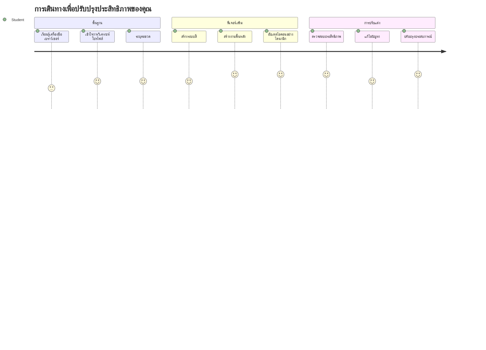
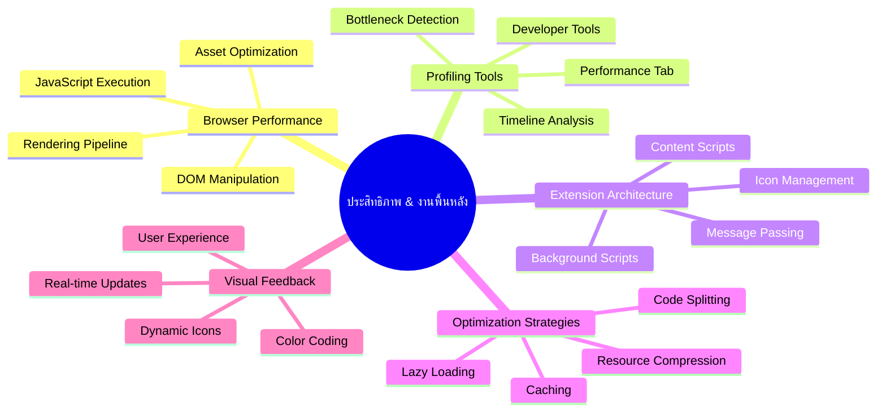
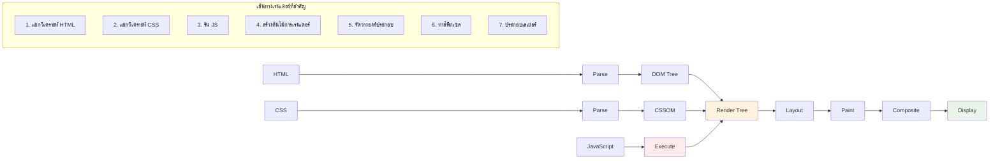
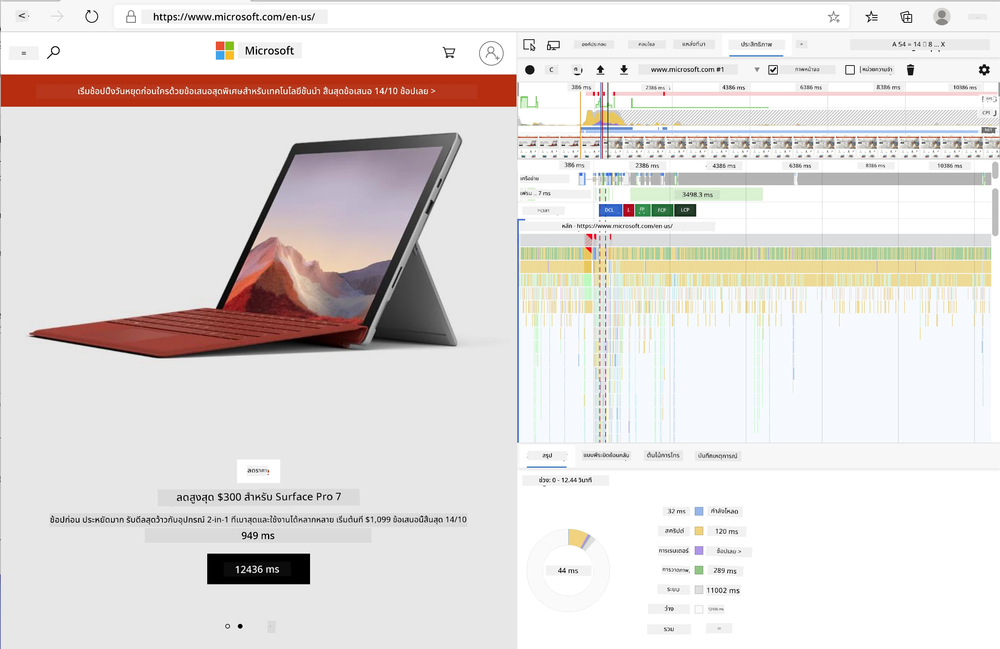
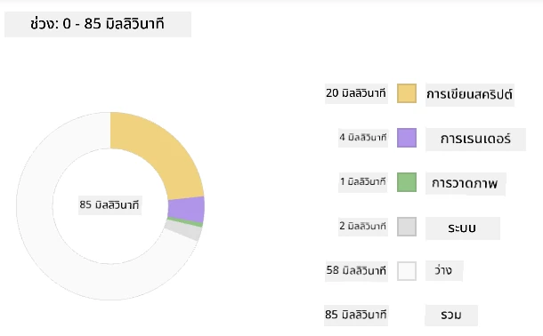
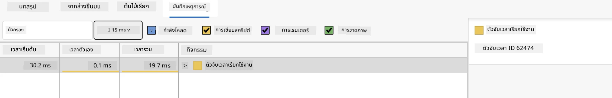
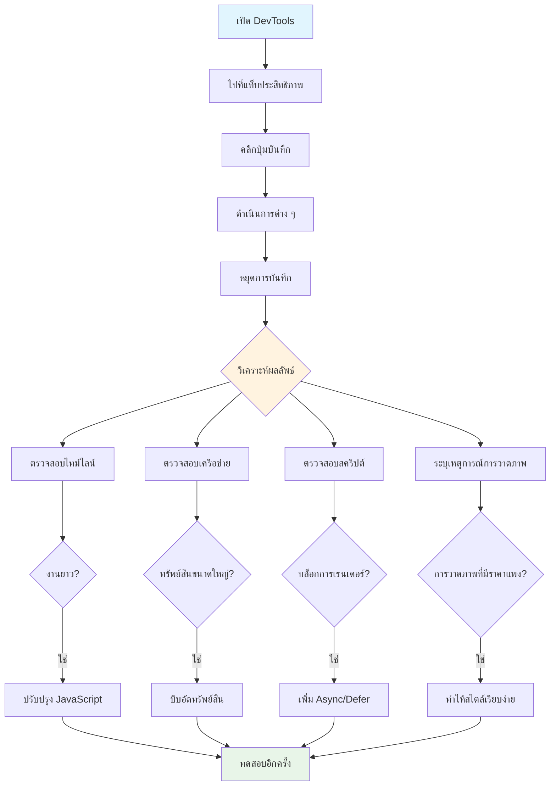
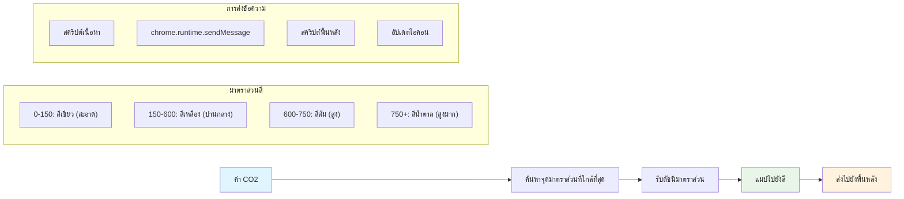
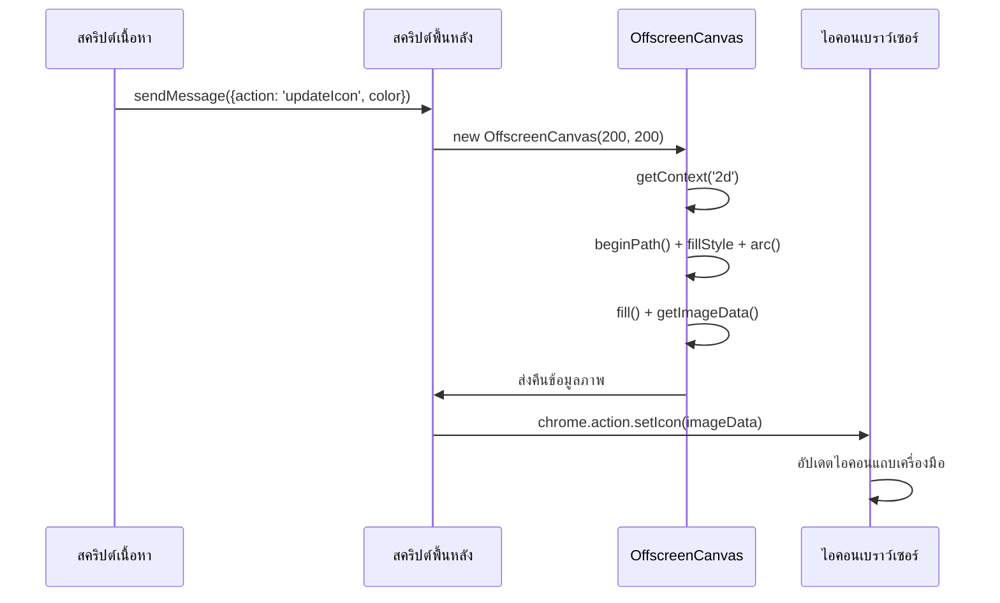
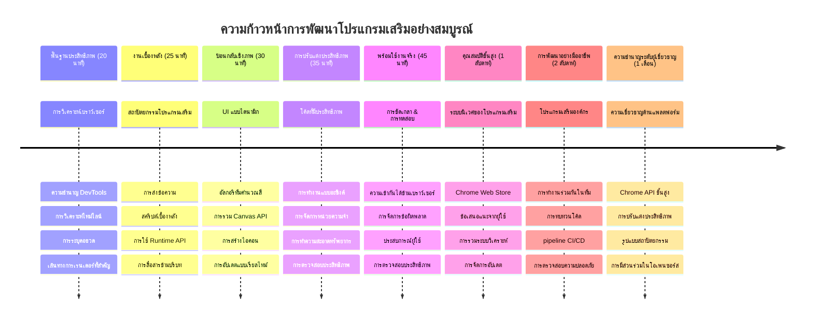

# โครงการส่วนเสริมเบราว์เซอร์ ตอนที่ 3: เรียนรู้เกี่ยวกับงานพื้นหลังและประสิทธิภาพ


เคยสงสัยไหมว่าทำไมบางส่วนเสริมเบราว์เซอร์ถึงรู้สึกตอบสนองเร็วและลื่นไหล ในขณะที่บางอันดูเหมือนจะช้า? ความลับอยู่ที่สิ่งที่เกิดขึ้นเบื้องหลัง ในขณะที่ผู้ใช้คลิกใช้งานอินเทอร์เฟซส่วนเสริมของคุณ มีโลกของกระบวนการพื้นหลังที่จัดการการดึงข้อมูล การอัปเดตไอคอน และทรัพยากรระบบอย่างเงียบ ๆ

นี่คือบทเรียนสุดท้ายในชุดส่วนเสริมเบราว์เซอร์ และเราจะทำให้ตัวติดตามรอยเท้าคาร์บอนของคุณทำงานได้อย่างราบรื่น คุณจะเพิ่มการอัปเดตไอคอนแบบไดนามิกและเรียนรู้วิธีตรวจสอบปัญหาประสิทธิภาพก่อนที่จะกลายเป็นปัญหา เหมือนการปรับแต่งรถแข่ง - การปรับเล็กน้อยสามารถทำให้การทำงานโดยรวมดียิ่งขึ้นอย่างมาก

เมื่อเราทำเสร็จแล้ว คุณจะมีส่วนเสริมที่เรียบร้อยและเข้าใจหลักการประสิทธิภาพที่แบ่งแยกระหว่างเว็บแอปที่ดีและแอปที่ยอดเยี่ยม ไปดำน้ำสู่โลกของการเพิ่มประสิทธิภาพเบราว์เซอร์กันเถอะ

## แบบทดสอบก่อนบรรยาย

[แบบทดสอบก่อนบรรยาย](https://ff-quizzes.netlify.app/web/quiz/27)

### บทนำ

ในบทเรียนก่อนหน้านี้ คุณได้สร้างฟอร์ม เชื่อมต่อกับ API และจัดการกับการดึงข้อมูลแบบอะซิงโครนัส ส่วนเสริมของคุณกำลังเริ่มเป็นรูปร่างดี

ตอนนี้เราต้องเพิ่มการแต่งแต้มขั้นสุดท้าย - เช่น การทำให้ไอคอนส่วนเสริมเปลี่ยนสีตามข้อมูลคาร์บอน นี่ทำให้นึกถึงการที่ NASA ต้องเพิ่มประสิทธิภาพระบบทุกอย่างบนยานอพอลโล พวกเขาไม่สามารถเสียรอบหรือหน่วยความจำอย่างเปล่าประโยชน์ได้เพราะชีวิตขึ้นอยู่กับประสิทธิภาพ แม้ว่าส่วนเสริมเบราว์เซอร์ของเราอาจไม่ได้สำคัญถึงขนาดนั้น แต่หลักการเดียวกันก็ใช้ได้ - โค้ดที่มีประสิทธิภาพสร้างประสบการณ์ผู้ใช้ที่ดีกว่า


## พื้นฐานประสิทธิภาพเว็บ

เมื่อโค้ดของคุณทำงานอย่างมีประสิทธิภาพ คนจะสามารถ *รู้สึก* ถึงความแตกต่างได้ คุณรู้ช่วงเวลานั้นไหมที่หน้าเว็บโหลดทันทีหรือแอนิเมชันไหลลื่น? นั่นคือประสิทธิภาพที่ดีที่ทำงานอยู่

ประสิทธิภาพไม่ได้เกี่ยวกับความเร็วอย่างเดียว - แต่มันเกี่ยวกับการสร้างประสบการณ์เว็บที่รู้สึกเป็นธรรมชาติ แทนที่จะเป็นแบบติดขัดและน่าหงุดหงิด ในสมัยแรกเริ่มของการคอมพิวเตอร์ Grace Hopper เคยเก็บวงจรนาโนวินาที (เป็นเส้นลวดยาวประมาณหนึ่งฟุต) บนโต๊ะของเธอเพื่อแสดงให้เห็นว่าแสงเดินทางได้ไกลแค่ไหนในหนึ่งพันล้านวินาที มันเป็นวิธีของเธอในการอธิบายว่าทำไมทุกไมโครวินาทีจึงสำคัญในการคอมพิวเตอร์ ลองสำรวจเครื่องมือสายลับที่จะช่วยให้คุณรู้ว่ามีอะไรที่ทำให้ระบบทำงานช้าลง

> "ประสิทธิภาพเว็บไซต์เป็นเรื่องของสองสิ่ง: ความเร็วการโหลดหน้าและความเร็วที่โค้ดทำงานบนหน้า" -- [Zack Grossbart](https://www.smashingmagazine.com/2012/06/javascript-profiling-chrome-developer-tools/)

หัวข้อการทำให้เว็บไซต์ของคุณเร็วมากบนอุปกรณ์ประเภทต่าง ๆ สำหรับผู้ใช้หลากหลายและสถานการณ์ล้วนกว้างขวางอย่างไม่น่าแปลกใจ นี่คือจุดที่ควรคำนึงถึงเมื่อคุณสร้างโปรเจกต์เว็บปกติหรือส่วนเสริมเบราว์เซอร์

ก้าวแรกในการเพิ่มประสิทธิภาพเว็บไซต์คือการเข้าใจว่าสิ่งที่เกิดขึ้นเบื้องหลังจริง ๆ คืออะไร โชคดีที่เบราว์เซอร์ของคุณมาพร้อมกับเครื่องมือสายลับทรงพลังที่ฝังอยู่แล้ว


เพื่อเปิด Developer Tools ใน Edge ให้คลิกที่จุดสามจุดมุมขวาบน แล้วไปที่ More Tools > Developer Tools หรือใช้ทางลัดแป้นพิมพ์: `Ctrl` + `Shift` + `I` บน Windows หรือ `Option` + `Command` + `I` บน Mac เมื่อเข้าไปแล้ว ให้คลิกแท็บ Performance — นี่คือที่ที่คุณจะทำการสืบสวน

**นี่คือชุดเครื่องมือสายลับประสิทธิภาพของคุณ:**  
- **เปิด** Developer Tools (คุณจะใช้บ่อยในฐานะนักพัฒนา!)  
- **ไปที่** แท็บ Performance - ให้คิดว่าเป็นเครื่องติดตามความฟิตร่างกายของเว็บแอปของคุณ  
- **กด** ปุ่ม Record และดูหน้าเว็บทำงาน  
- **ศึกษาผลลัพธ์** เพื่อตรวจสอบสิ่งที่ทำให้ช้าลง  

ลองทำกัน เปิดเว็บไซต์ (เช่น Microsoft.com) แล้วคลิก 'Record' ตอนนี้รีเฟรชหน้าและดูโปรไฟล์เลอร์จับภาพทุกอย่างที่เกิดขึ้น เมื่อคุณหยุดบันทึก คุณจะเห็นการแจกแจงรายละเอียดว่าตัวเบราว์เซอร์ 'รันสคริปต์' 'เรนเดอร์' และ 'เพ้นท์' หน้าอย่างไร มันทำให้นึกถึงวิธีที่ศูนย์ควบคุมภารกิจติดตามระบบทุกอย่างในช่วงปล่อยจรวด — คุณจะได้ข้อมูลเรียลไทม์เกี่ยวกับสิ่งที่เกิดขึ้นและเมื่อไหร่



✅ [เอกสาร Microsoft](https://docs.microsoft.com/microsoft-edge/devtools-guide/performance/?WT.mc_id=academic-77807-sagibbon) มีรายละเอียดมากมายหากคุณอยากค้นลึกลงไป

> เคล็ดลับ: ล้างแคชเบราว์เซอร์ก่อนทดสอบเพื่อดูว่าเว็บไซต์ของคุณทำงานอย่างไรสำหรับผู้เยี่ยมชมครั้งแรก — โดยปกติมันมักแตกต่างจากการเข้าชมซ้ำ!

เลือกองค์ประกอบในไทม์ไลน์ของโปรไฟล์เพื่อซูมดูเหตุการณ์ที่เกิดขึ้นในขณะที่หน้าเว็บโหลด

ดูภาพรวมประสิทธิภาพของหน้าด้วยการเลือกช่วงหนึ่งของไทม์ไลน์โปรไฟล์และดูที่แผงสรุป:



ตรวจสอบแผง Event Log เพื่อดูว่าเหตุการณ์ไหนใช้เวลานานเกิน 15 มิลลิวินาทีหรือไม่:



✅ ทำความรู้จักกับโปรไฟล์เลอร์ของคุณ! เปิด developer tools บนไซต์นี้แล้วดูว่ามีคอขวดไหนหรือไม่ ทรัพย์สินที่โหลดช้าที่สุดคืออะไร? อันที่เร็วที่สุด?


## สิ่งที่ควรสังเกตเมื่อใช้โปรไฟล์เลอร์

การใช้งานโปรไฟล์เลอร์เป็นแค่น้ำจิ้ม — ทักษะจริง ๆ คือการรู้ว่ากราฟสีสันพวกนั้นกำลังบอกอะไรคุณอยู่ ไม่ต้องกังวล คุณจะชินกับการอ่านมัน นักพัฒนาที่มีประสบการณ์เรียนรู้ที่จะสังเกตสัญญาณเตือนก่อนที่จะกลายเป็นปัญหาใหญ่

มาคุยกันเรื่องผู้ต้องสงสัยทั่วไป — ตัวการสร้างปัญหาประสิทธิภาพที่มักแอบเข้ามาในโปรเจกต์เว็บ คล้ายกับที่ Marie Curie ต้องเฝ้าระดับรังสีในห้องแล็บอย่างรอบคอบ เราต้องตรวจสอบรูปแบบบางอย่างที่บ่งบอกว่าปัญหากำลังมา จับได้เร็วจะช่วยคุณ (และผู้ใช้) ประหยัดความหงุดหงิดได้มาก

**ขนาดสินทรัพย์**: เว็บไซต์กลายเป็น "หนัก" ขึ้นเรื่อย ๆ ตลอดปี และน้ำหนักส่วนใหญ่มาจากภาพ ถือว่าเหมือนเราซุกของลงในกระเป๋าดิจิทัลมากขึ้นเรื่อย ๆ

✅ ดูที่ [Internet Archive](https://httparchive.org/reports/page-weight) เพื่อดูว่าขนาดหน้าเว็บเติบโตขึ้นอย่างไร — เปิดเผยข้อมูลน่าสนใจมาก

**นี่คือวิธีรักษาสินทรัพย์ให้เหมาะสม:**  
- **บีบอัด** ภาพเหล่านั้น! รูปแบบใหม่ ๆ อย่าง WebP ช่วยลดขนาดไฟล์ได้อย่างมาก  
- **ส่ง** ขนาดภาพที่เหมาะสมกับอุปกรณ์แต่ละเครื่อง — ไม่จำเป็นต้องส่งภาพขนาดเดสก์ท็อปขนาดใหญ่ให้โทรศัพท์  
- **ย่อ** CSS และ JavaScript ของคุณ — ทุกไบต์มีค่า  
- **ใช้** การโหลดแบบ lazy เพื่อดาวน์โหลดภาพก็ต่อเมื่อผู้ใช้เลื่อนมาถึงจริง ๆ  

**การเดินทาง DOM**: เบราว์เซอร์ต้องสร้าง Document Object Model ตามโค้ดที่คุณเขียน ดังนั้นเพื่อประสิทธิภาพที่ดีควรเก็บแท็กให้น้อยที่สุด ใช้และจัดสไตล์เฉพาะที่หน้าต้องการเท่านั้น ในจุดนี้ CSS ที่เกินจำเป็นบนหน้าอาจถูกปรับให้เหมาะสม; สไตล์ที่ใช้เฉพาะบนหน้าเดียวไม่ควรรวมอยู่ในไฟล์สไตล์หลัก ตัวอย่างเช่น

**กลยุทธ์สำคัญสำหรับการปรับ DOM:**  
- **ลดจำนวน** องค์ประกอบ HTML และระดับของการซ้อน  
- **ลบ** กฎ CSS ที่ไม่ได้ใช้และรวบรวมสไตล์ชีตอย่างมีประสิทธิภาพ  
- **จัดระเบียบ** CSS ให้โหลดเฉพาะที่จำเป็นสำหรับแต่ละหน้า  
- **สร้างโครงสร้าง** HTML อย่างมีความหมายสำหรับการวิเคราะห์ของเบราว์เซอร์ที่ดีกว่า  

**JavaScript**: นักพัฒนา JavaScript ทุกคนควรระวังสคริปต์ที่บล็อกการเรนเดอร์ ซึ่งต้องโหลดก่อนที่ DOM จะถูกเดินทางและแสดงบนเบราว์เซอร์ คิดเรื่องการใช้ `defer` กับสคริปต์อินไลน์ของคุณ (เหมือนในโมดูล Terrarium)

**เทคนิคการเพิ่มประสิทธิภาพ JavaScript สมัยใหม่:**  
- **ใช้** คุณสมบัติ `defer` เพื่อโหลดสคริปต์หลังการแยกวิเคราะห์ DOM  
- **นำมาใช้** การแบ่งโค้ดเพื่อโหลด JavaScript เฉพาะที่จำเป็น  
- **ใช้** การโหลดแบบ lazy สำหรับฟังก์ชันที่ไม่สำคัญ  
- **ลด** การใช้ไลบรารีและเฟรมเวิร์กหนัก ๆ เมื่อเป็นไปได้  

✅ ลองเว็บไซต์บางแห่งบน [Site Speed Test website](https://www.webpagetest.org/) เพื่อเรียนรู้เพิ่มเติมเกี่ยวกับการตรวจสอบทั่วไปที่ใช้วัดประสิทธิภาพเว็บไซต์

### 🔄 **ตรวจสอบความเข้าใจเชิงการสอน**  
**ความเข้าใจประสิทธิภาพ**: ก่อนสร้างฟีเจอร์ส่วนเสริม ให้แน่ใจว่าคุณ:  
- ✅ อธิบายเส้นทางการเรนเดอร์สำคัญจาก HTML ถึงพิกเซลได้  
- ✅ ระบุคอขวดประสิทธิภาพทั่วไปในเว็บแอปได้  
- ✅ ใช้เครื่องมือผู้พัฒนาเบราว์เซอร์ในการทำโปรไฟล์ประสิทธิภาพหน้าได้  
- ✅ เข้าใจว่าขนาดสินทรัพย์และความซับซ้อนของ DOM ส่งผลต่อความเร็วอย่างไร  

**ทดสอบตัวเองด่วน**: เกิดอะไรขึ้นเมื่อคุณมี JavaScript ที่บล็อกการเรนเดอร์?  
*คำตอบ: เบราว์เซอร์ต้องดาวน์โหลดและรันสคริปต์ก่อนที่จะดำเนินการแยกวิเคราะห์ HTML และเรนเดอร์หน้า*

**ผลกระทบประสิทธิภาพในโลกจริง**:  
- **ดีเลย์ 100ms**: ผู้ใช้รู้สึกถึงความช้า  
- **ดีเลย์ 1 วินาที**: ผู้ใช้เริ่มเสียสมาธิ  
- **3 วินาทีขึ้นไป**: 40% ของผู้ใช้เลิกใช้งานหน้า  
- **เครือข่ายมือถือ**: ประสิทธิภาพยิ่งสำคัญมากขึ้น  

ตอนนี้เมื่อคุณมีไอเดียเกี่ยวกับวิธีที่เบราว์เซอร์เรนเดอร์สินทรัพย์ที่คุณส่งให้ มาดูสิ่งสุดท้ายที่คุณต้องทำเพื่อสมบูรณ์ส่วนเสริมของคุณ:

### สร้างฟังก์ชันคำนวณสี

ตอนนี้เราจะสร้างฟังก์ชันที่เปลี่ยนข้อมูลตัวเลขให้เป็นสีที่มีความหมาย คิดซะว่ามันเหมือนระบบไฟจราจร - สีเขียวสำหรับพลังงานสะอาด สีแดงสำหรับความเข้มข้นของคาร์บอนสูง

ฟังก์ชันนี้จะรับข้อมูล CO2 จาก API ของเราและกำหนดว่าสีไหนที่เหมาะสมที่สุดในการแทนผลกระทบต่อสิ่งแวดล้อม มันคล้ายกับวิธีที่นักวิทยาศาสตร์ใช้รหัสสีในแผนที่ความร้อนเพื่อแสดงรูปแบบข้อมูลซับซ้อน — ตั้งแต่ อุณหภูมิมหาสมุทรจนถึงการก่อตัวดาว ลองเพิ่มฟังก์ชันนี้ใน `/src/index.js` หลังจากตัวแปร `const` ที่เรากำหนดไว้ก่อนหน้านี้เลย:


```javascript
function calculateColor(value) {
	// กำหนดมาตราส่วนความเข้มข้นของ CO2 (กรัมต่อกิโลวัตต์ชั่วโมง)
	const co2Scale = [0, 150, 600, 750, 800];
	// สีที่สอดคล้องกันจากสีเขียว (สะอาด) ถึงสีน้ำตาลเข้ม (คาร์บอนสูง)
	const colors = ['#2AA364', '#F5EB4D', '#9E4229', '#381D02', '#381D02'];

	// หาค่ามาตราส่วนที่ใกล้เคียงที่สุดกับค่าที่ป้อนเข้า
	const closestNum = co2Scale.sort((a, b) => {
		return Math.abs(a - value) - Math.abs(b - value);
	})[0];
	
	console.log(`${value} is closest to ${closestNum}`);
	
	// หาดัชนีสำหรับการจับคู่สี
	const num = (element) => element > closestNum;
	const scaleIndex = co2Scale.findIndex(num);

	const closestColor = colors[scaleIndex];
	console.log(scaleIndex, closestColor);

	// ส่งข้อความอัปเดตสีไปยังสคริปต์พื้นหลัง
	chrome.runtime.sendMessage({ action: 'updateIcon', value: { color: closestColor } });
}
```
  
**มาวิเคราะห์ฟังก์ชันเจ๋ง ๆ ตัวนี้กัน:**  
- **ตั้งค่า** อาร์เรย์สองชุด — ชุดหนึ่งสำหรับระดับ CO2 อีกชุดสำหรับสี (เขียว = สะอาด, น้ำตาล = สกปรก!)  
- **หา** ค่าที่ใกล้เคียงกับค่า CO2 จริงโดยใช้การจัดเรียงอาร์เรย์ที่สมาร์ท  
- **จับ** สีที่ตรงกับโดยใช้เมธอด findIndex()  
- **ส่ง** ข้อความไปยังสคริปต์พื้นหลังของ Chrome ด้วยสีที่เราเลือก  
- **ใช้** แม่แบบสตริง (backticks) เพื่อจัดรูปแบบข้อความให้สะอาดตา  
- **จัดการ** ทุกอย่างอย่างเป็นระบบด้วย const  

`chrome.runtime` [API](https://developer.chrome.com/extensions/runtime) เหมือนระบบประสาทของส่วนเสริมคุณ — มันจัดการการสื่อสารและงานต่าง ๆ ที่เกิดขึ้นเบื้องหลัง:

> "ใช้ chrome.runtime API เพื่อเรียกหน้าพื้นหลัง, คืนรายละเอียดเกี่ยวกับ manifest และฟังตอบสนองต่อเหตุการณ์ในช่วงชีวิตของแอปหรือส่วนเสริม คุณยังสามารถใช้ API นี้เพื่อแปลงเส้นทางสัมพัทธ์ของ URL เป็น URL ที่มีคุณสมบัติครบถ้วน"

**ทำไม Chrome Runtime API ถึงมีประโยชน์:**  
- **ให้** ส่วนต่าง ๆ ของส่วนเสริมพูดคุยกันได้  
- **จัดการ** งานเบื้องหลังโดยไม่ทำให้ UI ค้าง  
- **บริหาร** เหตุการณ์วงจรชีวิตของส่วนเสริม  
- **ทำให้** การส่งข้อความระหว่างสคริปต์ง่ายขึ้นมาก  

✅ ถ้าคุณกำลังพัฒนาส่วนเสริมนี้สำหรับ Edge คุณอาจจะประหลาดใจที่ใช้งาน API ของ chrome เวอร์ชันใหม่นี้ เบราว์เซอร์ Edge รุ่นใหม่รันบนเอนจิน Chromium ดังนั้นคุณสามารถใช้เครื่องมือนี้ได้


> **เคล็ดลับจากมือโปร**: หากคุณต้องการทำโปรไฟล์ส่วนเสริมเบราว์เซอร์ ให้เปิด dev tools ภายในตัวส่วนเสริมเอง เพราะมันเป็นอินสแตนซ์เบราว์เซอร์แยกเฉพาะ ทำให้คุณเข้าถึงเมตริกประสิทธิภาพเฉพาะส่วนเสริมได้

### ตั้งค่าสีไอคอนเริ่มต้น

ก่อนที่เราจะเริ่มดึงข้อมูลจริง มาลองให้ส่วนเสริมของเรามีจุดเริ่มต้นกันก่อน ไม่มีใครชอบมองไอคอนว่างเปล่าหรือดูเสียหาย เราจะเริ่มด้วยสีเขียวเพื่อให้ผู้ใช้รู้ว่าส่วนเสริมกำลังทำงานตั้งแต่ติดตั้ง

ในฟังก์ชัน `init()` ของคุณ ลองตั้งค่าไอคอนสีเขียวเริ่มต้น:

```javascript
chrome.runtime.sendMessage({
	action: 'updateIcon',
	value: {
		color: 'green',
	},
});
```
  
**สิ่งที่การเริ่มต้นนี้ทำได้:**  
- **ตั้งค่าสีเขียวกลาง ๆ เป็นสถานะเริ่มต้น**  
- **ให้ฟีดแบ็กทางสายตาทันทีเมื่อส่วนเสริมโหลด**  
- **สร้างรูปแบบการสื่อสารกับสคริปต์พื้นหลัง**  
- **รับรองว่าผู้ใช้เห็นส่วนเสริมที่ใช้งานได้ก่อนข้อมูลจะโหลด**

### เรียกใช้ฟังก์ชันและสั่งให้ทำงาน

ตอนนี้เรามาเชื่อมโยงทุกอย่างเข้าด้วยกัน เพื่อว่าเมื่อข้อมูล CO2 ใหม่เข้ามา ไอคอนของคุณจะอัปเดตโดยอัตโนมัติด้วยสีที่ถูกต้อง เหมือนกับการต่อวงจรไฟฟ้าสุดท้ายในอุปกรณ์อิเล็กทรอนิกส์ — ทุกส่วนประกอบจะทำงานเป็นระบบเดียวกัน

เพิ่มบรรทัดนี้เข้าไปหลังจากที่คุณได้รับข้อมูล CO2 จาก API:

```javascript
// หลังจากดึงข้อมูล CO2 จาก API
// ให้กำหนด CO2 = data.data[0].intensity.actual;
calculateColor(CO2);
```
  
**การผสานนี้ทำได้:**  
- **เชื่อมโยง** การไหลของข้อมูล API กับระบบแสดงสถานะทางสายตา  
- **กระตุ้น** การอัปเดตไอคอนโดยอัตโนมัติเมื่อมีข้อมูลใหม่  
- **ให้ฟีดแบ็กทางสายตาแบบเรียลไทม์ตามความเข้มข้นของคาร์บอนปัจจุบัน**  
- **รักษา** การแยกหน้าที่ระหว่างการดึงข้อมูลและตรรกะการแสดงผล  

สุดท้ายใน `/dist/background.js` เพิ่มผู้ฟังสำหรับคำสั่งงานพื้นหลังเหล่านี้:

```javascript
// ฟังข้อความจากสคริปต์เนื้อหา
chrome.runtime.onMessage.addListener(function (msg, sender, sendResponse) {
	if (msg.action === 'updateIcon') {
		chrome.action.setIcon({ imageData: drawIcon(msg.value) });
	}
});

// วาดไอคอนไดนามิกโดยใช้ Canvas API
// ยืมมาจากส่วนขยาย energy lollipop - ฟีเจอร์ดีมาก!
function drawIcon(value) {
	// สร้างแคนวาสออฟสกรีนเพื่อประสิทธิภาพที่ดีขึ้น
	const canvas = new OffscreenCanvas(200, 200);
	const context = canvas.getContext('2d');

	// วาดวงกลมสีแสดงถึงความเข้มของคาร์บอน
	context.beginPath();
	context.fillStyle = value.color;
	context.arc(100, 100, 50, 0, 2 * Math.PI);
	context.fill();

	// คืนค่าข้อมูลภาพสำหรับไอคอนเบราว์เซอร์
	return context.getImageData(50, 50, 100, 100);
}
```
  
**นี่คือสิ่งที่สคริปต์พื้นหลังนี้ทำ:**  
- **ฟัง** ข้อความจากสคริปต์หลักของคุณ (เหมือนพนักงานต้อนรับรับโทรศัพท์)  
- **ประมวลผล** คำขอ 'updateIcon' เพื่อเปลี่ยนไอคอนแถบเครื่องมือของคุณ  
- **สร้าง** ไอคอนใหม่ทันทีโดยใช้ Canvas API  
- **วาด** วงกลมสีง่าย ๆ ที่แสดงความเข้มข้นของคาร์บอนปัจจุบัน  
- **อัปเดต** แถบเครื่องมือเบราว์เซอร์ของคุณด้วยไอคอนใหม่  
- **ใช้** OffscreenCanvas เพื่อประสิทธิภาพที่ลื่นไหล (ไม่บล็อก UI)  

✅ คุณจะได้เรียนรู้เพิ่มเติมเกี่ยวกับ Canvas API ในบทเรียน [Space Game](../../6-space-game/2-drawing-to-canvas/README.md)


### 🔄 **ตรวจสอบความเข้าใจเชิงการสอน**  
**ความเข้าใจส่วนเสริมอย่างครบถ้วน**: ตรวจสอบความชำนาญของคุณในระบบทั้งหมด:  
- ✅ การส่งข้อความระหว่างสคริปต์ส่วนเสริมต่าง ๆ ทำงานอย่างไร?  
- ✅ ทำไมเราถึงใช้ OffscreenCanvas แทน Canvas ปกติเพื่อประสิทธิภาพ?
- ✅ Chrome Runtime API มีบทบาทอย่างไรในสถาปัตยกรรมส่วนขยาย?
- ✅ อัลกอริทึมการคำนวณสีแมปข้อมูลอย่างไรกับฟีดแบ็คทางสายตา?

**พิจารณาประสิทธิภาพ**: ส่วนขยายของคุณแสดงให้เห็นว่า:
- **การส่งข้อความที่มีประสิทธิภาพ**: การสื่อสารที่สะอาดระหว่างบริบทของสคริปต์
- **การเรนเดอร์ที่เหมาะสม**: OffscreenCanvas ป้องกันไม่ให้ UI หยุดชะงัก
- **การอัปเดตแบบเรียลไทม์**: การเปลี่ยนไอคอนแบบไดนามิกตามข้อมูลสด
- **การจัดการหน่วยความจำ**: การล้างข้อมูลและการจัดการทรัพยากรอย่างเหมาะสม

**ถึงเวลาทดสอบส่วนขยายของคุณ:**
- **สร้าง** ทุกอย่างด้วย `npm run build`
- **โหลดใหม่** ส่วนขยายของคุณในเบราว์เซอร์ (อย่าลืมขั้นตอนนี้)
- **เปิด** ส่วนขยายของคุณและดูสีของไอคอนเปลี่ยน
- **ตรวจสอบ** วิธีที่มันตอบสนองต่อข้อมูลคาร์บอนจริงจากทั่วโลก

ตอนนี้คุณจะรู้คร่าวๆ ว่าเป็นเวลาที่เหมาะสมสำหรับการซักผ้าหรือควรรอพลังงานที่สะอาดขึ้น คุณเพิ่งสร้างสิ่งที่มีประโยชน์จริงๆ และได้เรียนรู้เกี่ยวกับประสิทธิภาพของเบราว์เซอร์ไปพร้อมกัน

## ความท้าทาย GitHub Copilot Agent 🚀

ใช้โหมด Agent เพื่อทำความท้าทายต่อไปนี้ให้เสร็จ:

**คำอธิบาย:** เพิ่มความสามารถในการติดตามประสิทธิภาพของส่วนขยายเบราว์เซอร์โดยเพิ่มฟีเจอร์ที่ติดตามและแสดงเวลาการโหลดสำหรับส่วนประกอบต่างๆ ของส่วนขยาย

**คำสั่ง:** สร้างระบบติดตามประสิทธิภาพสำหรับส่วนขยายเบราว์เซอร์ที่วัดและบันทึกเวลาที่ใช้ในการดึงข้อมูล CO2 จาก API, คำนวณสี และอัปเดตไอคอน เพิ่มฟังก์ชันชื่อ `performanceTracker` ที่ใช้ Performance API เพื่อวัดการดำเนินงานเหล่านี้และแสดงผลลัพธ์ในคอนโซลของเบราว์เซอร์พร้อมกับเวลาประทับและเมตริกระยะเวลา

เรียนรู้เพิ่มเติมเกี่ยวกับ [โหมด agent](https://code.visualstudio.com/blogs/2025/02/24/introducing-copilot-agent-mode) ที่นี่

## 🚀 ความท้าทาย

นี่คือภารกิจนักสืบที่น่าสนใจ: เลือกเว็บไซต์โอเพนซอร์สที่อยู่มานานหลายปี (เช่น Wikipedia, GitHub หรือ Stack Overflow) และตรวจสอบประวัติการคอมมิตของพวกเขา คุณสามารถพบว่าพวกเขาได้ทำการปรับปรุงประสิทธิภาพตรงไหนบ้าง? ปัญหาเดิมๆ อะไรที่พวกเขาพบซ้ำๆ?

**แนวทางการสืบสวนของคุณ:**
- **ค้นหา** ข้อความคอมมิตที่มีคำเช่น "optimize," "performance," หรือ "faster"
- **ดู** หารูปแบบ - พวกเขาแก้ปัญหาแบบเดิมซ้ำไหม?
- **ระบุ** สาเหตุทั่วไปที่ทำให้เว็บไซต์ช้า
- **แบ่งปัน** สิ่งที่ค้นพบ - เพื่อให้นักพัฒนาคนอื่นเรียนรู้จากตัวอย่างจริง

## แบบทดสอบหลังบรรยาย

[แบบทดสอบหลังบรรยาย](https://ff-quizzes.netlify.app/web/quiz/28)

## ทบทวน & ศึกษาด้วยตนเอง

พิจารณาสมัครรับข่าวสารเกี่ยวกับ [ประสิทธิภาพ](https://perf.email/)

สำรวจวิธีที่เบราว์เซอร์ประเมินประสิทธิภาพเว็บโดยดูผ่านแท็บ performance ในเครื่องมือเว็บ คุณพบความแตกต่างที่สำคัญไหม?

### ⚡ **สิ่งที่คุณทำได้ใน 5 นาทีถัดไป**
- [ ] เปิดตัวจัดการงานของเบราว์เซอร์ (Shift+Esc ใน Chrome) เพื่อดูการใช้ทรัพยากรของส่วนขยาย
- [ ] ใช้แท็บ Performance ใน DevTools เพื่อบันทึกและวิเคราะห์ประสิทธิภาพหน้าเว็บ
- [ ] ตรวจสอบหน้าส่วนขยายในเบราว์เซอร์เพื่อดูว่าส่วนขยายใดมีผลต่อเวลาเริ่มต้น
- [ ] ลองปิดส่วนขยายชั่วคราวเพื่อดูความแตกต่างของประสิทธิภาพ

### 🎯 **สิ่งที่คุณทำได้ภายในชั่วโมงนี้**
- [ ] ทำแบบทดสอบหลังบทเรียนและเข้าใจแนวคิดเรื่องประสิทธิภาพ
- [ ] สร้างสคริปต์พื้นหลังสำหรับส่วนขยายเบราว์เซอร์ของคุณ
- [ ] เรียนรู้การใช้ browser.alarms สำหรับงานพื้นหลังที่มีประสิทธิภาพ
- [ ] ฝึกส่งข้อความระหว่างสคริปต์เนื้อหาและสคริปต์พื้นหลัง
- [ ] วัดและปรับแต่งการใช้ทรัพยากรของส่วนขยายของคุณ

### 📅 **การเดินทางด้านประสิทธิภาพของคุณในหนึ่งสัปดาห์**
- [ ] สร้างส่วนขยายเบราว์เซอร์ประสิทธิภาพสูงพร้อมฟังก์ชันพื้นหลัง
- [ ] เชี่ยวชาญ service workers และสถาปัตยกรรมส่วนขยายสมัยใหม่
- [ ] นำกลยุทธ์ซิงค์ข้อมูลและแคชชิ่งที่มีประสิทธิภาพมาใช้
- [ ] เรียนรู้เทคนิคการดีบักขั้นสูงสำหรับประสิทธิภาพส่วนขยาย
- [ ] ปรับแต่งส่วนขยายของคุณทั้งด้านฟังก์ชันและประสิทธิภาพการใช้ทรัพยากร
- [ ] สร้างการทดสอบที่ครอบคลุมสำหรับสถานการณ์ประสิทธิภาพของส่วนขยาย

### 🌟 **การเป็นผู้เชี่ยวชาญด้านการปรับแต่งในหนึ่งเดือน**
- [ ] สร้างส่วนขยายเบราว์เซอร์ระดับองค์กรด้วยประสิทธิภาพสูงสุด
- [ ] เรียนรู้เกี่ยวกับ Web Workers, Service Workers และประสิทธิภาพเว็บสมัยใหม่
- [ ] มีส่วนร่วมในโครงการโอเพนซอร์สที่เน้นปรับแต่งประสิทธิภาพ
- [ ] เชี่ยวชาญโครงสร้างภายในเบราว์เซอร์และเทคนิคดีบักขั้นสูง
- [ ] สร้างเครื่องมือติดตามประสิทธิภาพและคู่มือแนวปฏิบัติที่ดีที่สุด
- [ ] กลายเป็นผู้เชี่ยวชาญประสิทธิภาพที่ช่วยปรับแต่งแอปพลิเคชันเว็บ

## 🎯 เส้นเวลาการเป็นผู้เชี่ยวชาญส่วนขยายเบราว์เซอร์ของคุณ


### 🛠️ ชุดเครื่องมือพัฒนาส่วนขยายครบวงจรของคุณ

หลังจากผ่านสามตอนนี้ คุณได้เชี่ยวชาญ:
- **สถาปัตยกรรมเบราว์เซอร์**: เข้าใจลึกซึ้งว่าการผสานส่วนขยายกับระบบเบราว์เซอร์ทำงานอย่างไร
- **การติดตามประสิทธิภาพ**: ความสามารถในการระบุและแก้ไขคอขวดโดยใช้เครื่องมือสำหรับนักพัฒนา
- **การเขียนโปรแกรมแบบ Async**: รูปแบบ JavaScript สมัยใหม่สำหรับงานตอบสนองรวดเร็วไม่บล็อก
- **การรวม API**: ดึงข้อมูลภายนอกพร้อมการพิสูจน์ตัวตนและจัดการข้อผิดพลาด
- **การออกแบบภาพ**: การอัปเดต UI แบบไดนามิกและการสร้างกราฟิกด้วย Canvas
- **การส่งข้อความ**: การสื่อสารข้ามสคริปต์ในสถาปัตยกรรมส่วนขยาย
- **ประสบการณ์ผู้ใช้**: สถานะโหลด, การจัดการข้อผิดพลาด และการโต้ตอบที่เข้าใจง่าย
- **ทักษะการผลิต**: การทดสอบ, ดีบัก และปรับแต่งสำหรับการใช้จริง

**แอปพลิเคชันในโลกจริง**: ทักษะพัฒนาส่วนขยายของคุณใช้ได้โดยตรงกับ:
- **Progressive Web Apps**: สถาปัตยกรรมและรูปแบบประสิทธิภาพที่คล้ายกัน
- **แอปเดสก์ท็อป Electron**: แอปข้ามแพลตฟอร์มโดยใช้เทคโนโลยีเว็บ
- **แอปมือถือไฮบริด**: พัฒนา Cordova/PhoneGap โดยใช้เว็บ API
- **แอปเว็บองค์กร**: แดชบอร์ดและเครื่องมือเพิ่มผลิตภาพที่ซับซ้อน
- **ส่วนขยาย Chrome DevTools**: เครื่องมือและการดีบักสำหรับนักพัฒนาขั้นสูง
- **การรวม API เว็บ**: แอปที่สื่อสารกับบริการภายนอก

**ผลกระทบในงานอาชีพ**: ตอนนี้คุณสามารถ:
- **สร้าง** ส่วนขยายเบราว์เซอร์พร้อมใช้งานจริงตั้งแต่แนวคิดถึงการดีพลอย
- **ปรับแต่ง** ประสิทธิภาพแอปเว็บโดยใช้เครื่องมือติดตามมาตรฐานในอุตสาหกรรม
- **ออกแบบสถาปัตยกรรม** ระบบที่ปรับขนาดได้ด้วยการแยกส่วนที่เหมาะสม
- **ดีบัก** งาน Async ซับซ้อนและการสื่อสารข้ามบริบท
- **มีส่วนร่วม** ในโครงการส่วนขยายโอเพนซอร์สและมาตรฐานเบราว์เซอร์

**โอกาสก้าวหน้าต่อไป**:
- **นักพัฒนาร้านค้า Chrome Web Store**: เผยแพร่ส่วนขยายต่อผู้ใช้หลายล้านคน
- **วิศวกรประสิทธิภาพเว็บ**: เชี่ยวชาญด้านการปรับแต่งและประสบการณ์ผู้ใช้
- **นักพัฒนาแพลตฟอร์มเบราว์เซอร์**: มีส่วนร่วมในการพัฒนาเครื่องยนต์เบราว์เซอร์
- **ผู้สร้างเฟรมเวิร์กส่วนขยาย**: สร้างเครื่องมือช่วยนักพัฒนาคนอื่น
- **ฝ่ายสัมพันธ์นักพัฒนา**: แบ่งปันความรู้ผ่านการสอนและสร้างเนื้อหา

🌟 **สำเร็จแล้ว!**: คุณสร้างส่วนขยายเบราว์เซอร์ที่สมบูรณ์และใช้งานได้จริงซึ่งแสดงแนวปฏิบัติการพัฒนาอย่างมืออาชีพและมาตรฐานเว็บสมัยใหม่!

## การบ้าน

[วิเคราะห์เว็บไซต์เพื่อประสิทธิภาพ](assignment.md)

---

<!-- CO-OP TRANSLATOR DISCLAIMER START -->
**ข้อจำกัดความรับผิดชอบ**:
เอกสารฉบับนี้ได้รับการแปลโดยใช้บริการแปลภาษาด้วย AI [Co-op Translator](https://github.com/Azure/co-op-translator) แม้เราจะพยายามให้ความแม่นยำ โปรดทราบว่าการแปลอัตโนมัติอาจมีข้อผิดพลาดหรือความคลาดเคลื่อน เอกสารต้นฉบับในภาษาต้นทางควรถือเป็นแหล่งข้อมูลที่เป็นทางการ สำหรับข้อมูลที่สำคัญ ขอแนะนำให้ใช้บริการแปลโดยผู้เชี่ยวชาญที่เป็นมนุษย์ เราจะไม่รับผิดชอบต่อความเข้าใจผิดหรือการตีความที่ไม่ถูกต้องใดๆ ที่เกิดจากการใช้การแปลนี้
<!-- CO-OP TRANSLATOR DISCLAIMER END -->