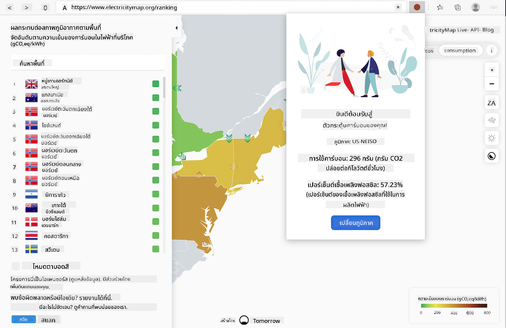

<!--
CO_OP_TRANSLATOR_METADATA:
{
  "original_hash": "dd58ae1b7707034f055718c1b68bc8de",
  "translation_date": "2025-08-26T22:47:50+00:00",
  "source_file": "5-browser-extension/solution/translation/README.hi.md",
  "language_code": "th"
}
-->
# ส่วนขยายเบราว์เซอร์ Carbon Trigger: โค้ดที่เสร็จสมบูรณ์

ใช้ API ของ CO2 Signal จาก tmrow เพื่อติดตามการใช้ไฟฟ้า สร้างส่วนขยายเบราว์เซอร์เพื่อเตือนคุณเกี่ยวกับการใช้ไฟฟ้าในพื้นที่ของคุณผ่านเบราว์เซอร์ การใช้ส่วนขยายนี้จะช่วยให้คุณตัดสินใจเกี่ยวกับกิจกรรมของคุณโดยอิงจากข้อมูลนี้



## เริ่มต้น

คุณต้องติดตั้ง [npm](https://npmjs.com) ก่อน ดาวน์โหลดสำเนาของโค้ดนี้ลงในโฟลเดอร์บนคอมพิวเตอร์ของคุณ

ติดตั้งแพ็กเกจที่จำเป็นทั้งหมด:

```
npm install
```

สร้างส่วนขยายด้วย Webpack:

```
npm run build
```

สำหรับการติดตั้งบน Edge ให้ใช้เมนู 'สามจุด' ที่มุมขวาบนของเบราว์เซอร์เพื่อค้นหาแผงส่วนขยาย จากนั้นเลือก 'โหลดแบบไม่บรรจุ' เพื่อโหลดส่วนขยายใหม่ เปิดโฟลเดอร์ 'dist' ที่ปรากฏในพรอมต์ และส่วนขยายจะถูกโหลด เพื่อใช้งาน คุณจะต้องมีคีย์ API ของ CO2 Signal ([รับได้ทางอีเมลที่นี่](https://www.co2snal.com/) โดยกรอกอีเมลของคุณในช่องบนหน้าเว็บนี้) และ [รหัสพื้นที่ของคุณ](http://api.electricitymap.org/v3/zones) จาก [แผนที่ไฟฟ้า](https://www.electricitymap.org/map) (ตัวอย่างเช่น ในบอสตัน ฉันใช้ 'US-NEISO')


เมื่อคุณป้อนคีย์ API และรหัสพื้นที่ในอินเทอร์เฟซของส่วนขยายแล้ว จุดสีในแถบส่วนขยายเบราว์เซอร์ควรเปลี่ยนไปสะท้อนการใช้พลังงานในพื้นที่ของคุณ และให้ตัวบ่งชี้ว่ากิจกรรมที่ใช้พลังงานสูงเหมาะสมกับการดำเนินการของคุณหรือไม่ แนวคิดของระบบ 'จุดสี' นี้ได้รับแรงบันดาลใจจาก [ส่วนขยาย Energy Lollipop](https://energylollipop.com/) สำหรับการปล่อยพลังงานในแคลิฟอร์เนีย

---

**ข้อจำกัดความรับผิดชอบ**:  
เอกสารนี้ได้รับการแปลโดยใช้บริการแปลภาษา AI [Co-op Translator](https://github.com/Azure/co-op-translator) แม้ว่าเราจะพยายามให้การแปลมีความถูกต้อง แต่โปรดทราบว่าการแปลอัตโนมัติอาจมีข้อผิดพลาดหรือความไม่ถูกต้อง เอกสารต้นฉบับในภาษาดั้งเดิมควรถือเป็นแหล่งข้อมูลที่เชื่อถือได้ สำหรับข้อมูลที่สำคัญ ขอแนะนำให้ใช้บริการแปลภาษามืออาชีพ เราไม่รับผิดชอบต่อความเข้าใจผิดหรือการตีความผิดที่เกิดจากการใช้การแปลนี้