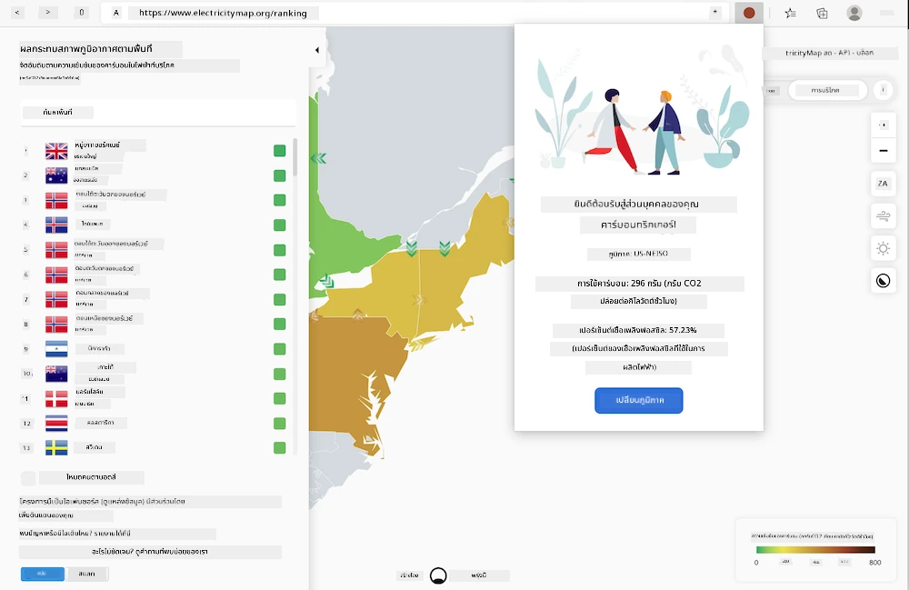
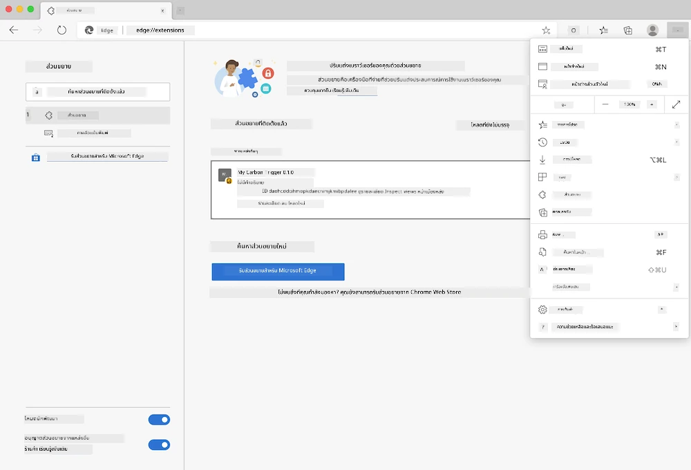

<!--
CO_OP_TRANSLATOR_METADATA:
{
  "original_hash": "9a6b22a2eff0f499b66236be973b24ad",
  "translation_date": "2025-08-26T22:50:11+00:00",
  "source_file": "5-browser-extension/solution/translation/README.it.md",
  "language_code": "th"
}
-->
# ส่วนขยายเบราว์เซอร์ Carbon Trigger: โค้ดเริ่มต้น

เราจะใช้ API Signal CO2 ของ tmrow เพื่อติดตามการใช้ไฟฟ้าและสร้างส่วนขยายสำหรับเบราว์เซอร์ เพื่อให้คุณสามารถรับการแจ้งเตือนโดยตรงในเบราว์เซอร์เกี่ยวกับการใช้ไฟฟ้าในภูมิภาคของคุณ การใช้ส่วนขยายนี้จะช่วยให้คุณประเมินกิจกรรมของคุณตามข้อมูลดังกล่าวได้



## เริ่มต้น

คุณจำเป็นต้องติดตั้ง [npm](https://npmjs.com) ก่อน ดาวน์โหลดโค้ดนี้ไปยังโฟลเดอร์ในคอมพิวเตอร์ของคุณ

ติดตั้งแพ็กเกจที่จำเป็นทั้งหมด:

```
npm install
```

สร้างส่วนขยายด้วย webpack

```
npm run build
```

สำหรับการติดตั้งบน Edge ให้ใช้เมนู "สามจุด" ที่มุมขวาบนของเบราว์เซอร์เพื่อค้นหาแผงควบคุมส่วนขยาย หากยังไม่ได้เปิดใช้งาน ให้เปิดใช้งานโหมดนักพัฒนา (ที่มุมล่างซ้าย) จากนั้นเลือก "โหลดแบบไม่บีบอัด" เพื่อเพิ่มส่วนขยายใหม่ เปิดโฟลเดอร์ "dist" ในหน้าต่างที่ปรากฏขึ้น และส่วนขยายจะถูกโหลด สำหรับการใช้งาน คุณจะต้องมี API key สำหรับ CO2 Signal API (คุณสามารถ[ขอรับได้ที่นี่ผ่านอีเมล](https://www.co2signal.com/) - ใส่อีเมลของคุณในช่องบนหน้านั้น) และ [รหัสสำหรับภูมิภาคของคุณ](http://api.electricitymap.org/v3/zones) ที่สอดคล้องกับ [แผนที่ไฟฟ้า](https://www.electricitymap.org/map) (เช่น ในบอสตัน รหัสคือ "US-NEISO")



เมื่อคุณใส่ API key และรหัสภูมิภาคในอินเทอร์เฟซของส่วนขยายแล้ว จุดสีในแถบส่วนขยายของเบราว์เซอร์ควรเปลี่ยนไปเพื่อสะท้อนการใช้พลังงานในภูมิภาค และให้คำแนะนำเกี่ยวกับกิจกรรมที่ใช้พลังงานสูงที่เหมาะสมในการดำเนินการ แนวคิดของระบบ "จุดสี" นี้ได้รับแรงบันดาลใจจาก [ส่วนขยาย Energy Lollipop](https://energylollipop.com/) สำหรับการปล่อยก๊าซในแคลิฟอร์เนีย

---

**ข้อจำกัดความรับผิดชอบ**:  
เอกสารนี้ได้รับการแปลโดยใช้บริการแปลภาษา AI [Co-op Translator](https://github.com/Azure/co-op-translator) แม้ว่าเราจะพยายามให้การแปลมีความถูกต้องมากที่สุด แต่โปรดทราบว่าการแปลอัตโนมัติอาจมีข้อผิดพลาดหรือความไม่ถูกต้อง เอกสารต้นฉบับในภาษาดั้งเดิมควรถือเป็นแหล่งข้อมูลที่เชื่อถือได้ สำหรับข้อมูลที่สำคัญ ขอแนะนำให้ใช้บริการแปลภาษามืออาชีพ เราไม่รับผิดชอบต่อความเข้าใจผิดหรือการตีความผิดที่เกิดจากการใช้การแปลนี้