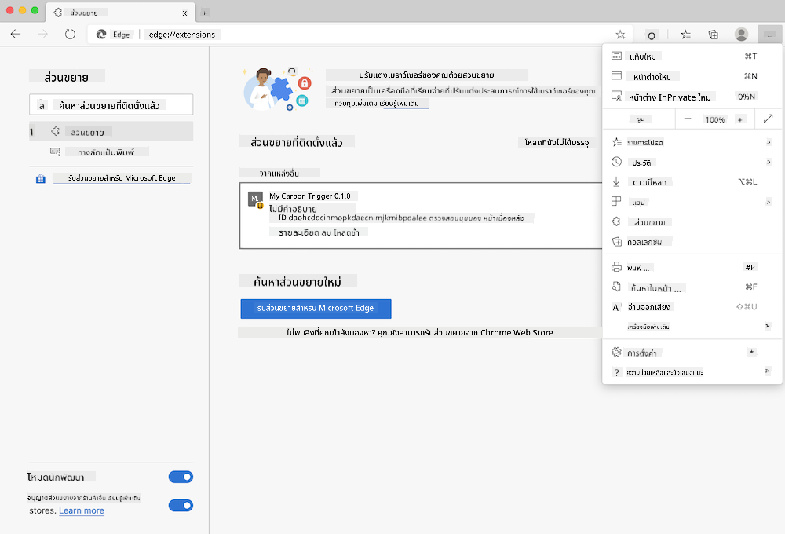

<!--
CO_OP_TRANSLATOR_METADATA:
{
  "original_hash": "26fd39046d264ba185dcb086d3a8cf3e",
  "translation_date": "2025-08-26T22:37:18+00:00",
  "source_file": "5-browser-extension/start/README.md",
  "language_code": "th"
}
-->
# ส่วนขยายเบราว์เซอร์ Carbon Trigger: โค้ดเริ่มต้น

ใช้ API C02 Signal ของ tmrow เพื่อติดตามการใช้ไฟฟ้า สร้างส่วนขยายเบราว์เซอร์เพื่อให้คุณมีการแจ้งเตือนในเบราว์เซอร์เกี่ยวกับการใช้ไฟฟ้าในภูมิภาคของคุณ การใช้ส่วนขยายนี้เป็นครั้งคราวจะช่วยให้คุณตัดสินใจเกี่ยวกับกิจกรรมต่าง ๆ โดยอิงจากข้อมูลนี้


## เริ่มต้นใช้งาน

คุณจำเป็นต้องติดตั้ง [npm](https://npmjs.com) ดาวน์โหลดสำเนาของโค้ดนี้ไปยังโฟลเดอร์ในคอมพิวเตอร์ของคุณ

ติดตั้งแพ็กเกจที่จำเป็นทั้งหมด:

```
npm install
```

สร้างส่วนขยายด้วย webpack

```
npm run build
```

สำหรับการติดตั้งบน Edge ให้ใช้เมนู 'สามจุด' ที่มุมขวาบนของเบราว์เซอร์เพื่อค้นหาแผงส่วนขยาย จากนั้นเลือก 'โหลดแบบไม่บรรจุ' เพื่อโหลดส่วนขยายใหม่ เปิดโฟลเดอร์ 'dist' เมื่อมีการแจ้งเตือนและส่วนขยายจะถูกโหลด เพื่อใช้งาน คุณจะต้องมี API key สำหรับ API ของ CO2 Signal ([รับได้ที่นี่ผ่านอีเมล](https://www.co2signal.com/) - ใส่อีเมลของคุณในช่องบนหน้านี้) และ [รหัสสำหรับภูมิภาคของคุณ](http://api.electricitymap.org/v3/zones) ที่สอดคล้องกับ [Electricity Map](https://www.electricitymap.org/map) (เช่น ในบอสตัน ฉันใช้ 'US-NEISO')



เมื่อใส่ API key และรหัสภูมิภาคลงในอินเทอร์เฟซของส่วนขยายแล้ว จุดสีในแถบส่วนขยายเบราว์เซอร์ควรเปลี่ยนไปเพื่อสะท้อนการใช้พลังงานในภูมิภาคของคุณ และให้คำแนะนำเกี่ยวกับกิจกรรมที่ใช้พลังงานหนักที่เหมาะสมสำหรับคุณ แนวคิดเบื้องหลังระบบ 'จุดสี' นี้ได้รับแรงบันดาลใจจาก [ส่วนขยาย Energy Lollipop](https://energylollipop.com/) สำหรับการปล่อยก๊าซในแคลิฟอร์เนีย

---

**ข้อจำกัดความรับผิดชอบ**:  
เอกสารนี้ได้รับการแปลโดยใช้บริการแปลภาษา AI [Co-op Translator](https://github.com/Azure/co-op-translator) แม้ว่าเราจะพยายามให้การแปลมีความถูกต้อง แต่โปรดทราบว่าการแปลโดยอัตโนมัติอาจมีข้อผิดพลาดหรือความไม่ถูกต้อง เอกสารต้นฉบับในภาษาดั้งเดิมควรถือเป็นแหล่งข้อมูลที่เชื่อถือได้ สำหรับข้อมูลที่สำคัญ ขอแนะนำให้ใช้บริการแปลภาษามืออาชีพ เราไม่รับผิดชอบต่อความเข้าใจผิดหรือการตีความผิดที่เกิดจากการใช้การแปลนี้