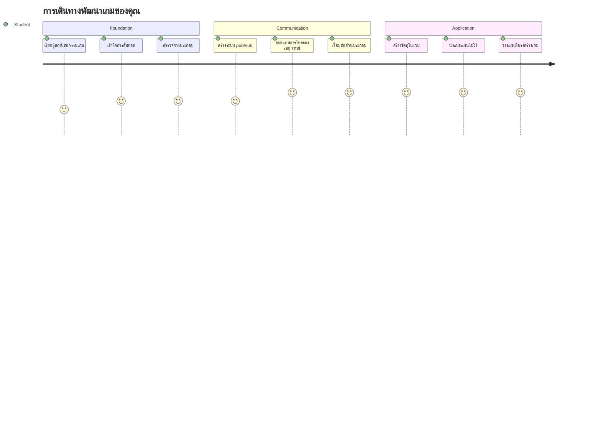
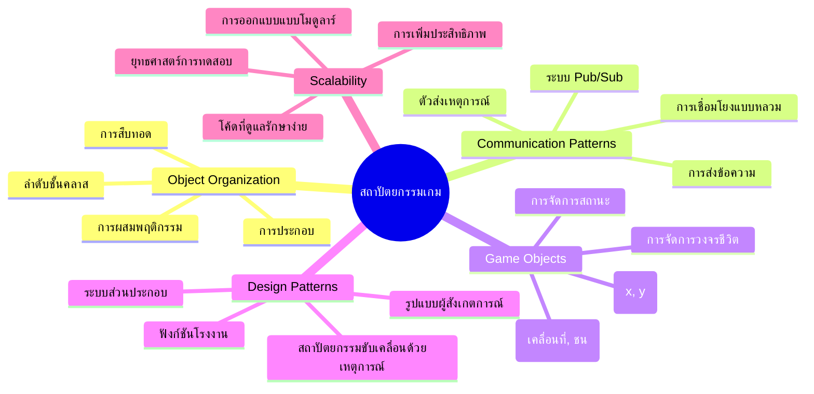
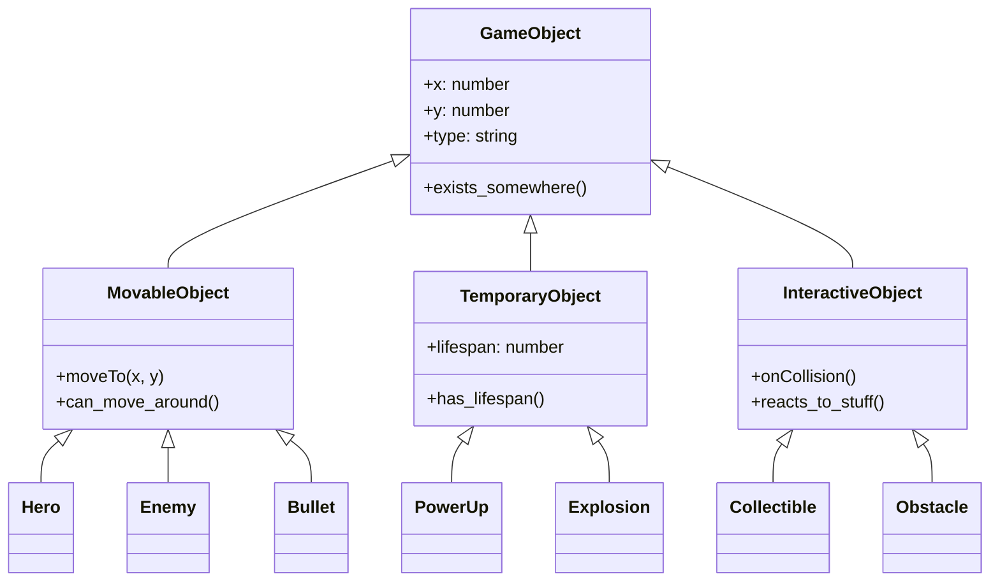
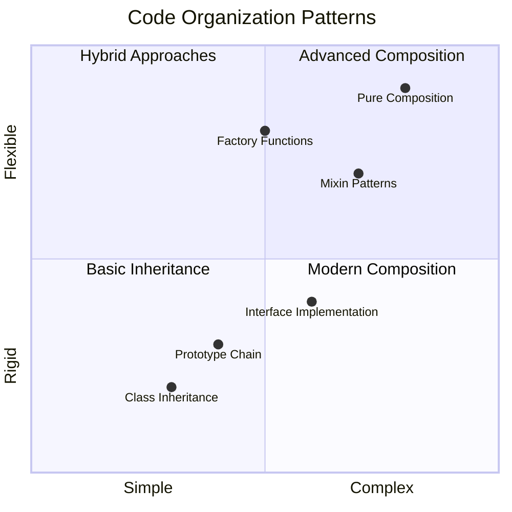
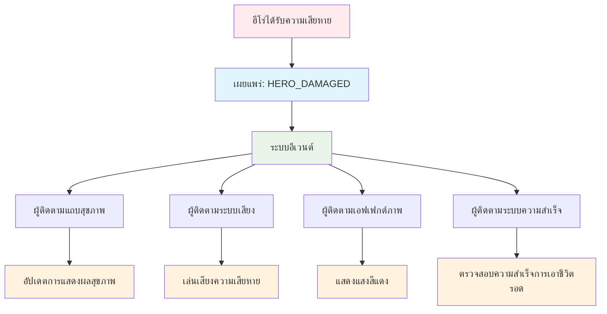
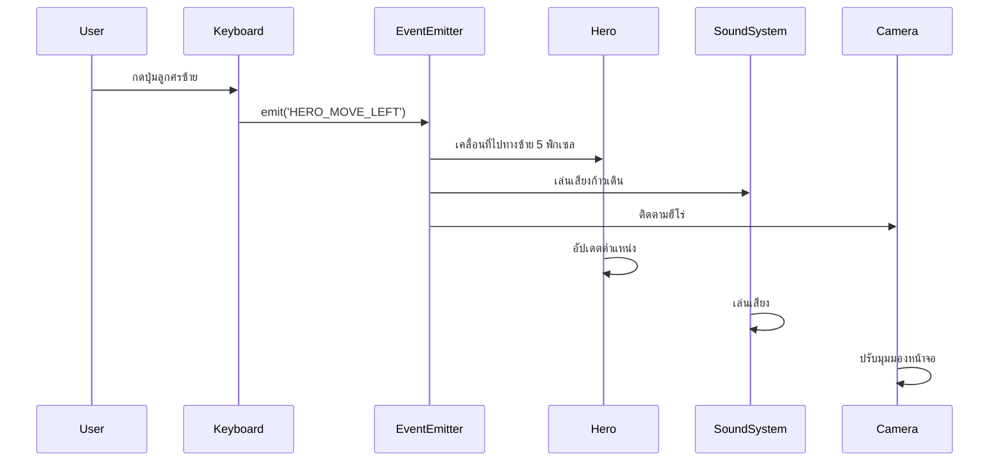
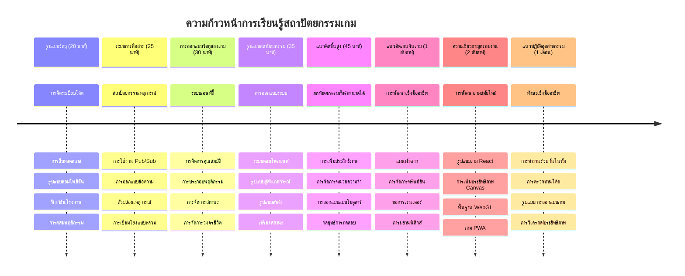

# สร้างเกมอวกาศ ตอนที่ 1: บทนำ




เหมือนกับศูนย์ควบคุมภารกิจของ NASA ที่ประสานงานระบบหลายอย่างในระหว่างการปล่อยยานอวกาศ เราจะสร้างเกมอวกาศที่แสดงให้เห็นว่าส่วนต่าง ๆ ของโปรแกรมสามารถทำงานร่วมกันได้อย่างราบรื่น ในขณะที่สร้างสิ่งที่คุณสามารถเล่นได้จริง คุณจะได้เรียนรู้แนวคิดโปรแกรมมิ่งพื้นฐานที่ใช้ได้กับโครงการซอฟต์แวร์ใด ๆ

เราจะสำรวจสองวิธีพื้นฐานในการจัดระเบียบโค้ด: การสืบทอด (inheritance) และการประกอบ (composition) ซึ่งไม่ใช่แค่แนวคิดทางวิชาการ แต่เป็นรูปแบบที่ใช้ในทุกอย่างตั้งแต่เกมวิดีโอจนถึงระบบธนาคาร เรายังจะใช้ระบบสื่อสารที่เรียกว่า pub/sub ซึ่งทำงานเหมือนเครือข่ายการสื่อสารที่ใช้บนยานอวกาศ ช่วยให้ส่วนประกอบต่าง ๆ แบ่งปันข้อมูลกันโดยไม่สร้างการพึ่งพาซึ่งกันและกัน

เมื่อจบซีรีส์นี้ คุณจะเข้าใจวิธีสร้างแอปพลิเคชันที่สามารถขยายและพัฒนาได้ ไม่ว่าคุณจะพัฒนาเกม เว็บแอปพลิเคชัน หรือระบบซอฟต์แวร์อื่น ๆ ก็ตาม


## แบบทดสอบก่อนบรรยาย

[แบบทดสอบก่อนบรรยาย](https://ff-quizzes.netlify.app/web/quiz/29)

## การสืบทอดและการประกอบในการพัฒนาเกม

เมื่อโปรเจกต์เติบโตความซับซ้อน การจัดระเบียบโค้ดก็สำคัญ สิ่งที่เริ่มต้นจากสคริปต์ง่าย ๆ อาจกลายเป็นยากต่อการดูแลหากไม่มีโครงสร้างที่เหมาะสม เหมือนกับภารกิจอพอลโลที่ต้องมีการประสานงานอย่างละเอียดระหว่างส่วนประกอบหลายพันชิ้น

เราจะสำรวจสองวิธีพื้นฐานในการจัดระเบียบโค้ด: การสืบทอดและการประกอบ ซึ่งแต่ละวิธีมีข้อดีที่แตกต่าง และการเข้าใจทั้งสองช่วยให้คุณเลือกวิธีที่เหมาะสมในแต่ละสถานการณ์ เราจะสาธิตแนวคิดเหล่านี้ผ่านเกมอวกาศของเรา ซึ่งฮีโร่ ศัตรู ไอเท็มเสริมพลัง และวัตถุอื่น ๆ ต้องทำงานร่วมกันอย่างมีประสิทธิภาพ

✅ หนึ่งในหนังสือเขียนโปรแกรมที่มีชื่อเสียงที่สุดเกี่ยวข้องกับ [รูปแบบการออกแบบ](https://en.wikipedia.org/wiki/Design_Patterns)

ในเกมใด ๆ คุณจะมี `วัตถุเกม` (game objects) — ส่วนประกอบที่โต้ตอบได้ซึ่งเติมเต็มโลกในเกมของคุณ ฮีโร่ ศัตรู ไอเท็มเสริมพลัง และเอฟเฟกต์ภาพ ทั้งหมดนี้เป็นวัตถุเกม แต่ละตัวมีพิกัดบนหน้าจอเป็นค่าของ `x` และ `y` เหมือนกับการวางจุดบนระนาบพิกัด

แม้ว่าจะมีลักษณะต่างกัน แต่พวกมันมักจะแบ่งปันพฤติกรรมพื้นฐานบางอย่าง:

- **มันอยู่ที่ใดที่หนึ่ง** — วัตถุทุกตัวมีพิกัด x และ y เพื่อให้เกมรู้ว่าจะวาดตรงไหน
- **หลายตัวสามารถเคลื่อนย้ายได้** — ฮีโร่วิ่ง ศัตรูไล่ตาม กระสุนบินข้ามหน้าจอ
- **มีอายุการใช้งาน** — บางตัวอยู่ได้ตลอดไป บางตัว (เช่น การระเบิด) ปรากฏชั่วคราวแล้วหายไป
- **ตอบสนองต่อสิ่งต่าง ๆ** — เมื่อตัวละครชนกัน ไอเท็มเสริมพลังถูกเก็บ แถบสุขภาพอัปเดต

✅ ลองคิดถึงเกมอย่าง Pac-Man คุณสามารถระบุวัตถุทั้งสี่ประเภทตามที่กล่าวมาข้างต้นในเกมนี้ได้ไหม?


### การแสดงพฤติกรรมผ่านโค้ด

ตอนนี้คุณเข้าใจพฤติกรรมพื้นฐานที่วัตถุเกมแชร์กันแล้ว มาลองสำรวจวิธีการใช้งานพฤติกรรมเหล่านี้ใน JavaScript คุณสามารถแสดงพฤติกรรมวัตถุผ่านเมธอดที่แนบมากับคลาสหรือวัตถุแต่ละตัว และมีหลายวิธีให้เลือกใช้

**แนวทางแบบคลาส**

คลาสและการสืบทอดมอบวิธีการจัดระเบียบวัตถุเกมอย่างเป็นโครงสร้าง เหมือนกับระบบจำแนกชนิดสิ่งมีชีวิตที่ Carl Linnaeus พัฒนาขึ้น คุณเริ่มจากคลาสฐานซึ่งมีคุณสมบัติทั่วไปก่อน จากนั้นสร้างคลาสเฉพาะที่สืบทอดคุณสมบัติเหล่านี้และเพิ่มเติมความสามารถเฉพาะตัว

✅ การสืบทอดเป็นแนวคิดที่สำคัญ เรียนรู้เพิ่มเติมได้ที่ [บทความของ MDN เกี่ยวกับการสืบทอด](https://developer.mozilla.org/docs/Web/JavaScript/Inheritance_and_the_prototype_chain)

นี่คือวิธีที่คุณสามารถใช้งานวัตถุเกมโดยใช้คลาสและการสืบทอด:

```javascript
// ขั้นตอนที่ 1: สร้างคลาส GameObject พื้นฐาน
class GameObject {
  constructor(x, y, type) {
    this.x = x;
    this.y = y;
    this.type = type;
  }
}
```

**มาทำความเข้าใจกันทีละขั้นตอน:**
- เรากำลังสร้างแม่แบบพื้นฐานที่วัตถุเกมทุกตัวสามารถใช้ได้
- คอนสตรัคเตอร์จะบันทึกตำแหน่งของวัตถุ (`x`, `y`) และประเภทของมัน
- นี่จะเป็นฐานที่วัตถุเกมทั้งหมดของคุณจะพัฒนาขึ้นต่อไป

```javascript
// ขั้นตอนที่ 2: เพิ่มความสามารถในการเคลื่อนที่ผ่านการสืบทอด
class Movable extends GameObject {
  constructor(x, y, type) {
    super(x, y, type); // เรียกตัวสร้างของคลาสแม่
  }

  // เพิ่มความสามารถในการย้ายไปยังตำแหน่งใหม่
  moveTo(x, y) {
    this.x = x;
    this.y = y;
  }
}
```

**จากโค้ดด้านบน เราได้:**
- **สืบทอด** คลาส GameObject เพื่อเพิ่มฟังก์ชันการเคลื่อนที่
- **เรียก** คอนสตรัคเตอร์พ่อแม่ด้วย `super()` เพื่อเริ่มต้นคุณสมบัติที่สืบทอดมา
- **เพิ่ม** เมธอด `moveTo()` ที่อัปเดตตำแหน่งของวัตถุ

```javascript
// ขั้นตอนที่ 3: สร้างประเภทวัตถุเกมเฉพาะ
class Hero extends Movable {
  constructor(x, y) {
    super(x, y, 'Hero'); // กำหนดประเภทโดยอัตโนมัติ
  }
}

class Tree extends GameObject {
  constructor(x, y) {
    super(x, y, 'Tree'); // ต้นไม้ไม่จำเป็นต้องเคลื่อนที่
  }
}

// ขั้นตอนที่ 4: ใช้วัตถุเกมของคุณ
const hero = new Hero(0, 0);
hero.moveTo(5, 5); // ฮีโร่สามารถเคลื่อนที่ได้!

const tree = new Tree(10, 15);
// tree.moveTo() จะทำให้เกิดข้อผิดพลาด - ต้นไม้ไม่สามารถเคลื่อนที่ได้
```

**เข้าใจแนวคิดเหล่านี้:**
- **สร้าง** ประเภทวัตถุเฉพาะที่สืบทอดพฤติกรรมที่เหมาะสม
- **แสดง** ว่าการสืบทอดช่วยให้เลือกเพิ่มฟีเจอร์ได้ตามต้องการ
- **ชี้ให้เห็น** ว่าฮีโร่สามารถเคลื่อนที่ได้ในขณะที่ต้นไม้คงที่
- **ยกตัวอย่าง** การป้องกันการทำงานไม่เหมาะสมด้วยลำดับชั้นของคลาส

✅ ใช้เวลาสักครู่เพื่อจินตนาการฮีโร่ Pac-Man (เช่น Inky, Pinky หรือ Blinky) ว่าจะถูกเขียนใน JavaScript อย่างไร

**แนวทางแบบ Composition**

การประกอบตามแนวคิดการออกแบบแบบโมดูลาร์ คล้ายกับการที่วิศวกรออกแบบยานอวกาศด้วยส่วนประกอบที่เปลี่ยนได้ แทนที่จะสืบทอดจากคลาสแม่ คุณรวมพฤติกรรมเฉพาะเพื่อสร้างวัตถุที่มีฟังก์ชันตามต้องการ วิธีนี้ให้ความยืดหยุ่นโดยไม่มีข้อจำกัดเรื่องลำดับชั้นที่ตายตัว

```javascript
// ขั้นตอนที่ 1: สร้างวัตถุพฤติกรรมพื้นฐาน
const gameObject = {
  x: 0,
  y: 0,
  type: ''
};

const movable = {
  moveTo(x, y) {
    this.x = x;
    this.y = y;
  }
};
```

**โค้ดนี้ทำอะไร:**
- **กำหนด** วัตถุ `gameObject` พื้นฐานที่มีตำแหน่งและชนิด
- **สร้าง** วัตถุพฤติกรรม `movable` ที่มีฟังก์ชันการเคลื่อนที่แยกต่างหาก
- **แยก** ความรับผิดชอบโดยเก็บข้อมูลตำแหน่งและตรรกะการเคลื่อนที่แยกกัน

```javascript
// ขั้นตอนที่ 2: ประกอบวัตถุโดยการรวมพฤติกรรม
const movableObject = { ...gameObject, ...movable };

// ขั้นตอนที่ 3: สร้างฟังก์ชันโรงงานสำหรับวัตถุประเภทต่าง ๆ
function createHero(x, y) {
  return {
    ...movableObject,
    x,
    y,
    type: 'Hero'
  };
}

function createStatic(x, y, type) {
  return {
    ...gameObject,
    x,
    y,
    type
  };
}
```

**จากโค้ดนี้ เราได้:**
- **ผสมผสาน** คุณสมบัติของวัตถุพื้นฐานกับพฤติกรรมการเคลื่อนที่โดยใช้ spread syntax
- **สร้าง** ฟังก์ชันโรงงานที่คืนค่าวัตถุปรับแต่งได้
- **เปิดใช้งาน** การสร้างวัตถุที่ยืดหยุ่นโดยไม่มีลำดับชั้นคลาสตายตัว
- **อนุญาต** ให้วัตถุมีพฤติกรรมที่ต้องการอย่างแม่นยำ

```javascript
// ขั้นตอนที่ 4: สร้างและใช้วัตถุที่คุณประกอบขึ้น
const hero = createHero(10, 10);
hero.moveTo(5, 5); // ทำงานได้อย่างสมบูรณ์แบบ!

const tree = createStatic(0, 0, 'Tree');
// tree.moveTo() ไม่ได้กำหนด - ไม่มีพฤติกรรมการเคลื่อนไหวถูกประกอบขึ้นมา
```

**ประเด็นหลักที่ต้องจำ:**
- **ประกอบ** วัตถุโดยผสมพฤติกรรมแทนการสืบทอด
- **มอบความยืดหยุ่น** มากกว่าลำดับชั้นการสืบทอดที่ตายตัว
- **ให้วัตถุ** มีฟีเจอร์ตามที่จำเป็นพอดี
- **ใช้** spread syntax ของ JavaScript สมัยใหม่เพื่อผสานวัตถุอย่างสะอาดตา
```

**Which Pattern Should You Choose?**

**Which Pattern Should You Choose?**



> 💡 **เคล็ดลับมือโปร**: ทั้งสองรูปแบบมีบทบาทในพัฒนา JavaScript สมัยใหม่ คลาสเหมาะกับลำดับชั้นที่ชัดเจน ในขณะที่ composition เหมาะกับความยืดหยุ่นสูงสุด
> 
**นี่คือเมื่อใช้แต่ละวิธี:**
- **เลือก** การสืบทอดเมื่อมีความสัมพันธ์ "เป็น-a" ชัดเจน (ฮีโร่ *เป็น* วัตถุที่เคลื่อนที่ได้)
- **เลือก** การประกอบเมื่อมีความสัมพันธ์ "มี-a" (ฮีโร่ *มี* ความสามารถในการเคลื่อนที่)
- **พิจารณา** ความชอบและความต้องการของทีม
- **จำไว้** ว่าสามารถผสมผสานสองวิธีนี้ในแอปเดียวกันได้

### 🔄 **ตรวจเช็คความเข้าใจเชิงการสอน**
**ความเข้าใจการจัดระเบียบวัตถุ**: ก่อนย้ายไปแพทเทิร์นสื่อสาร ให้แน่ใจว่าคุณ:
- ✅ อธิบายความแตกต่างระหว่าง inheritance และ composition ได้
- ✅ ระบุเมื่อใช้คลาสกับฟังก์ชันโรงงานได้
- ✅ เข้าใจคำสำคัญ `super()` ในการสืบทอด
- ✅ รู้ประโยชน์ของแต่ละวิธีในพัฒนาเกม

**ทดสอบตนเองอย่างรวดเร็ว**: คุณจะสร้าง Flying Enemy ที่ทั้งเคลื่อนที่และบินได้อย่างไร?
- **วิธี inheritance**: `class FlyingEnemy extends Movable`
- **วิธี composition**: `{ ...movable, ...flyable, ...gameObject }`

**ตัวอย่างจากโลกจริง**: รูปแบบนี้พบได้ทั่วไปใน:
- **React Components**: Props (composition) กับ inheritance ของคลาส
- **เกมเอนจิน**: ระบบเอนทิตี้-คอมโพเนนต์ใช้ composition
- **แอปมือถือ**: เฟรมเวิร์ค UI ส่วนใหญ่ใช้ลำดับชั้น inheritance

## แพทเทิร์นการสื่อสาร: ระบบ Pub/Sub

เมื่อแอปพลิเคชันซับซ้อนขึ้น การจัดการการสื่อสารระหว่างส่วนประกอบก็กลายเป็นเรื่องท้าทาย รูปแบบการเผยแพร่-สมัครรับ (pub/sub) แก้ปัญหานี้โดยใช้หลักการคล้ายการกระจายเสียงวิทยุ — ผู้ส่งเพียงหนึ่งรายสามารถสื่อสารถึงผู้รับหลายรายโดยไม่ต้องรู้ว่าผู้ฟังคือใคร

ลองนึกดูว่ามีอะไรเกิดขึ้นเมื่อฮีโร่ได้รับความเสียหาย: แถบสุขภาพอัปเดต เสียงประกอบดังขึ้น และมีภาพแสดงผล โดยแทนที่จะผูกวัตถุฮีโร่เข้ากับระบบเหล่านี้โดยตรง pub/sub อนุญาตให้ฮีโร่ส่งข้อความ "ได้รับความเสียหาย" ให้ระบบใดก็ได้ที่ต้องตอบสนองสมัครรับและทำงานตอบสนองตามนั้น

✅ **Pub/Sub** ย่อมาจาก 'publish-subscribe'


### เข้าใจสถาปัตยกรรม Pub/Sub

รูปแบบ pub/sub ทำให้ส่วนต่าง ๆ ของแอปพลิเคชันแยกตัวกัน ทำให้แต่ละส่วนสามารถทำงานร่วมกันโดยไม่พึ่งพาโดยตรง การแยกนี้ช่วยให้โค้ดของคุณบำรุงรักษา ทดสอบง่าย และยืดหยุ่นต่อการเปลี่ยนแปลง

**องค์ประกอบหลักของ pub/sub:**
- **ข้อความ (Messages)** – ป้ายข้อความง่าย ๆ เช่น `'PLAYER_SCORED'` เพื่อบอกว่าเกิดอะไรขึ้น (รวมถึงข้อมูลเพิ่มเติมใด ๆ)
- **ผู้เผยแพร่ (Publishers)** – วัตถุที่ส่งเสียงว่า "เกิดเหตุการณ์!" ให้กับผู้ฟังทุกคน
- **ผู้สมัครรับ (Subscribers)** – วัตถุที่บอกว่า "ฉันสนใจเหตุการณ์นี้" และทำงานตอบสนองเมื่อเหตุการณ์เกิดขึ้น
- **ระบบเหตุการณ์ (Event System)** – ตัวกลางที่ช่วยให้ข้อความส่งไปถึงผู้ฟังที่ถูกต้อง

### สร้างระบบเหตุการณ์

เราจะสร้างระบบเหตุการณ์ง่าย ๆ แต่ทรงพลังเพื่อแสดงแนวคิดเหล่านี้:

```javascript
// ขั้นตอนที่ 1: สร้างคลาส EventEmitter
class EventEmitter {
  constructor() {
    this.listeners = {}; // เก็บตัวฟังเหตุการณ์ทั้งหมด
  }
  
  // ลงทะเบียนตัวฟังสำหรับประเภทข้อความเฉพาะ
  on(message, listener) {
    if (!this.listeners[message]) {
      this.listeners[message] = [];
    }
    this.listeners[message].push(listener);
  }
  
  // ส่งข้อความไปยังตัวฟังที่ลงทะเบียนทั้งหมด
  emit(message, payload = null) {
    if (this.listeners[message]) {
      this.listeners[message].forEach(listener => {
        listener(message, payload);
      });
    }
  }
}
```

**อธิบายโค้ดนี้:**
- **สร้าง** ระบบจัดการเหตุการณ์กลางโดยใช้คลาสง่าย ๆ
- **เก็บ** รายชื่อผู้ฟังในอ็อบเจ็กต์จัดกลุ่มตามประเภทข้อความ
- **ลงทะเบียน** ผู้ฟังใหม่ผ่านเมธอด `on()`
- **เผยแพร่** ข้อความไปยังผู้ฟังที่สนใจผ่าน `emit()`
- **รองรับ** การส่งข้อมูลเสริมผ่าน payload

### ตัวอย่างใช้งานจริง

ตอนนี้ลองดูการทำงานจริง! เราจะสร้างระบบเคลื่อนที่ง่าย ๆ ที่แสดงให้เห็นความสะอาดและความยืดหยุ่นของ pub/sub:

```javascript
// ขั้นตอนที่ 1: กำหนดประเภทข้อความของคุณ
const Messages = {
  HERO_MOVE_LEFT: 'HERO_MOVE_LEFT',
  HERO_MOVE_RIGHT: 'HERO_MOVE_RIGHT',
  ENEMY_SPOTTED: 'ENEMY_SPOTTED'
};

// ขั้นตอนที่ 2: สร้างระบบเหตุการณ์และวัตถุในเกมของคุณ
const eventEmitter = new EventEmitter();
const hero = createHero(0, 0);
```

**โค้ดนี้ทำอะไร:**
- **กำหนด** ออบเจ็กต์ค่าคงที่เพื่อป้องกันการพิมพ์ผิดชื่อข้อความ
- **สร้าง** อินสแตนซ์อีเวนท์อีมิทเตอร์เพื่อจัดการการสื่อสารทั้งหมด
- **เริ่มต้น** วัตถุฮีโรที่ตำแหน่งเริ่มต้น

```javascript
// ขั้นตอนที่ 3: ตั้งค่าผู้ฟังเหตุการณ์ (ผู้สมัครสมาชิก)
eventEmitter.on(Messages.HERO_MOVE_LEFT, () => {
  hero.moveTo(hero.x - 5, hero.y);
  console.log(`Hero moved to position: ${hero.x}, ${hero.y}`);
});

eventEmitter.on(Messages.HERO_MOVE_RIGHT, () => {
  hero.moveTo(hero.x + 5, hero.y);
  console.log(`Hero moved to position: ${hero.x}, ${hero.y}`);
});
```

**ในโค้ดด้านบน เราได้:**
- **ลงทะเบียน** ผู้ฟังเหตุการณ์ที่ตอบสนองข้อความเกี่ยวกับการเคลื่อนที่
- **อัปเดต** ตำแหน่งฮีโรรองรับทิศทางการเคลื่อนที่
- **เพิ่ม** การบันทึกข้อมูลในคอนโซลเพื่อติดตามการเปลี่ยนแปลงตำแหน่งฮีโร่
- **แยก** ลอจิกการเคลื่อนที่ออกจากการจัดการอินพุต

```javascript
// ขั้นตอนที่ 4: เชื่อมต่อการป้อนข้อมูลจากแป้นพิมพ์ไปยังเหตุการณ์ (ผู้เผยแพร่)
window.addEventListener('keydown', (event) => {
  switch(event.key) {
    case 'ArrowLeft':
      eventEmitter.emit(Messages.HERO_MOVE_LEFT);
      break;
    case 'ArrowRight':
      eventEmitter.emit(Messages.HERO_MOVE_RIGHT);
      break;
  }
});
```

**เข้าใจแนวคิดเหล่านี้:**
- **เชื่อมต่อ** อินพุตคีย์บอร์ดกับเหตุการณ์เกมโดยไม่พันกันอย่างแน่นแฟ้น
- **ทำให้** ระบบอินพุตสื่อสารกับวัตถุเกมโดยอ้อม
- **อนุญาต** ระบบหลายระบบตอบสนองต่อเหตุการณ์คีย์บอร์ดเดียวกัน
- **ทำให้** การเปลี่ยนปุ่มหรือตัวเลือกอินพุตใหม่ง่ายขึ้น


> 💡 **เคล็ดลับมือโปร**: ความสวยงามของรูปแบบนี้คือความยืดหยุ่น! คุณสามารถเพิ่มเสียง เอฟเฟกต์หน้าจอ เขย่า หรืออนุภาคง่าย ๆ โดยแค่เพิ่มผู้ฟังเหตุการณ์ใหม่ ๆ โดยไม่ต้องแก้โค้ดคีย์บอร์ดหรือการเคลื่อนที่ที่มีอยู่
> 
**นี่คือเหตุผลที่คุณจะชอบวิธีนี้:**
- การเพิ่มฟีเจอร์ใหม่ง่ายมาก — แค่ฟังเหตุการณ์ที่คุณสนใจ
- หลายสิ่งตอบสนองต่อเหตุการณ์เดียวกันโดยไม่ขัดแย้งกัน
- การทดสอบง่ายขึ้นมากเพราะแต่ละส่วนทำงานอิสระกัน
- เมื่อมีปัญหา คุณรู้ได้เลยว่าจะดูตรงไหน

### ทำไม Pub/Sub จึงขยายผลได้ดี

รูปแบบ pub/sub รักษาความเรียบง่ายเมื่อแอปพลิเคชันซับซ้อนขึ้น ไม่ว่าจะจัดการศัตรูนับสิบ อัปเดต UI แบบไดนามิก หรือระบบเสียง รูปแบบช่วยให้ขยายได้โดยไม่ต้องเปลี่ยนแปลงโครงสร้าง ฟีเจอร์ใหม่สามารถผนวกเข้ากับระบบเหตุการณ์ที่มีอยู่โดยไม่กระทบฟังก์ชันที่ตั้งไว้

> ⚠️ **ข้อผิดพลาดทั่วไป**: อย่าสร้างประเภทข้อความเฉพาะเกินไปตั้งแต่แรก เริ่มจากหมวดกว้าง ๆ แล้วปรับละเอียดเมื่อความต้องการของเกมชัดเจนขึ้น
> 
**แนวปฏิบัติที่ดี:**
- **จัดกลุ่ม** ข้อความเกี่ยวข้องกันเป็นหมวดหมู่
- **ใช้** ชื่อที่บรรยายชัดเจนว่าเกิดอะไรขึ้น
- **เก็บ** ข้อมูลส่งผ่านข้อความให้ง่ายและตรงประเด็น
- **จดบันทึก** ประเภทข้อความเพื่อการทำงานร่วมกันในทีม

### 🔄 **ตรวจเช็คความเข้าใจเชิงการสอน**
**ความเข้าใจสถาปัตยกรรมขับเคลื่อนด้วยเหตุการณ์**: ตรวจสอบความเข้าใจระบบโดยรวม:
- ✅ รูปแบบ pub/sub ป้องกันการพึ่งพากันแน่นแฟ้นอย่างไร?
- ✅ ทำไมการขับเคลื่อนด้วยเหตุการณ์ช่วยให้ง่ายต่อการเพิ่มฟีเจอร์ใหม่?
- ✅ บทบาทของ EventEmitter ในการสื่อสารคืออะไร?
- ✅ การใช้ค่าคงที่ข้อความช่วยลดบั๊กและเพิ่มการบำรุงรักษาอย่างไร?

**ความท้าทายการออกแบบ**: คุณจะจัดการสถานการณ์เกมเหล่านี้ด้วย pub/sub อย่างไร?
1. **ศัตรูตาย**: อัปเดตคะแนน เล่นเสียง สปอนส์ไอเท็มเสริมพลัง ลบออกจากหน้าจอ
2. **ผ่านเลเวล**: หยุดเพลง แสดง UI บันทึกความคืบหน้า โหลดเลเวลถัดไป
3. **เก็บไอเท็มเสริมพลัง**: เพิ่มความสามารถ อัปเดต UI เล่นเอฟเฟกต์ เริ่มจับเวลา

**การเชื่อมโยงกับโลกมืออาชีพ**: รูปแบบนี้พบใน:
- **เฟรมเวิร์คด้านหน้า**: ระบบเหตุการณ์ของ React/Vue
- **บริการเบื้องหลัง**: การสื่อสารไมโครเซอร์วิส
- **เอนจินเกม**: ระบบเหตุการณ์ของ Unity
- **การพัฒนามือถือ**: ระบบแจ้งเตือนของ iOS/Android

---

## ความท้าทาย GitHub Copilot Agent 🚀

ใช้โหมด Agent เพื่อทำความท้าทายดังนี้:

**คำอธิบาย:** สร้างระบบวัตถุเกมง่าย ๆ โดยใช้ทั้ง inheritance และแพทเทิร์น pub/sub คุณจะสร้างเกมพื้นฐานที่วัตถุต่าง ๆ สามารถสื่อสารกันผ่านเหตุการณ์โดยไม่ต้องรู้จักกันโดยตรง

**คำสั่ง:** สร้างระบบเกม JavaScript โดยมีข้อกำหนดดังนี้: 1) สร้างคลาส GameObject พื้นฐานที่มีพิกัด x, y และคุณสมบัติ type 2) สร้างคลาส Hero ที่สืบทอด GameObject และสามารถเคลื่อนที่ได้ 3) สร้างคลาส Enemy ที่สืบทอด GameObject และสามารถไล่ตามฮีโร่ได้ 4) สร้างคลาส EventEmitter สำหรับแพทเทิร์น pub/sub 5) ตั้งค่าผู้ฟังเหตุการณ์เพื่อให้เมื่่อฮีโร่เคลื่อนที่ ศัตรูนอกใกล้เคียงได้รับเหตุการณ์ 'HERO_MOVED' และอัปเดตตำแหน่งเพื่อเคลื่อนไปยังฮีโร่ พร้อมแสดงข้อความ console.log แสดงการสื่อสารระหว่างวัตถุ

เรียนรู้เพิ่มเติมเกี่ยวกับ [โหมดเอเจนต์](https://code.visualstudio.com/blogs/2025/02/24/introducing-copilot-agent-mode) ที่นี่

## 🚀 ความท้าทาย
พิจารณาว่าแพทเทิร์น pub-sub ช่วยเสริมสถาปัตยกรรมเกมอย่างไร ระบุส่วนประกอบที่ควรส่งอีเวนต์และระบบควรตอบสนองอย่างไร ออกแบบแนวคิดเกมและแผนผังรูปแบบการสื่อสารระหว่างส่วนประกอบต่างๆ

## Post-Lecture Quiz

[Post-lecture quiz](https://ff-quizzes.netlify.app/web/quiz/30)

## Review & Self Study

เรียนรู้เพิ่มเติมเกี่ยวกับ Pub/Sub โดยการ [อ่านเกี่ยวกับมัน](https://docs.microsoft.com/azure/architecture/patterns/publisher-subscriber/?WT.mc_id=academic-77807-sagibbon)

### ⚡ **สิ่งที่คุณสามารถทำได้ใน 5 นาทีถัดไป**
- [ ] เปิดเกม HTML5 ใดก็ได้ทางออนไลน์และตรวจสอบโค้ดด้วย DevTools
- [ ] สร้างองค์ประกอบ HTML5 Canvas ง่ายๆ และวาดรูปร่างพื้นฐาน
- [ ] ลองใช้ `setInterval` เพื่อสร้างแอนิเมชันลูปง่ายๆ
- [ ] สำรวจเอกสาร Canvas API และลองใช้วิธีการวาดภาพ

### 🎯 **สิ่งที่คุณสามารถทำให้สำเร็จภายในชั่วโมงนี้**
- [ ] ทำแบบทดสอบหลังบทเรียนให้เสร็จและเข้าใจแนวคิดพัฒนาเกม
- [ ] ตั้งค่าโครงสร้างโปรเจกต์เกมของคุณด้วยไฟล์ HTML, CSS และ JavaScript
- [ ] สร้างเกมลูปพื้นฐานที่อัปเดตและแสดงผลอย่างต่อเนื่อง
- [ ] วาดสไปรต์เกมแรกของคุณบนแคนวาส
- [ ] นำเข้าทรัพยากรพื้นฐานสำหรับภาพและเสียง

### 📅 **การสร้างเกมตลอดสัปดาห์ของคุณ**
- [ ] ทำเกมอวกาศที่สมบูรณ์พร้อมฟีเจอร์ที่วางแผนไว้ทั้งหมด
- [ ] เพิ่มกราฟิกที่ปรับแต่งแล้ว เอฟเฟกต์เสียง และแอนิเมชันที่ราบรื่น
- [ ] ใช้สถานะเกม (หน้าจอเริ่มเกม, การเล่นเกม, เกมจบ)
- [ ] สร้างระบบคะแนนและติดตามความก้าวหน้าของผู้เล่น
- [ ] ทำให้เกมของคุณตอบสนองและเข้าถึงได้บนอุปกรณ์หลากหลาย
- [ ] แชร์เกมของคุณออนไลน์และรับคำติชมจากผู้เล่น

### 🌟 **การพัฒนาเกมตลอดเดือนของคุณ**
- [ ] สร้างเกมหลายเกมโดยสำรวจแนวเกมและกลไกที่แตกต่างกัน
- [ ] เรียนรู้เฟรมเวิร์กพัฒนาเกมเช่น Phaser หรือ Three.js
- [ ] มีส่วนร่วมในโปรเจกต์พัฒนาเกมแบบโอเพนซอร์ส
- [ ] เชี่ยวชาญแพทเทิร์นโปรแกรมเกมขั้นสูงและการปรับแต่งประสิทธิภาพ
- [ ] สร้างพอร์ตโฟลิโอที่แสดงทักษะการพัฒนาเกมของคุณ
- [ ] เป็นเมนทอร์ให้กับผู้ที่สนใจพัฒนาเกมและสื่อโต้ตอบ

## 🎯 ไทม์ไลน์ความชำนาญด้านการพัฒนาเกมของคุณ


### 🛠️ สรุปชุดเครื่องมือสถาปัตยกรรมเกมของคุณ

หลังจากเรียนจบบทนี้ คุณจะมี:
- **ความชำนาญในแพทเทิร์นการออกแบบ**: เข้าใจข้อดีข้อเสียของการสืบทอดและการประกอบ
- **สถาปัตยกรรมขับเคลื่อนด้วยเหตุการณ์**: การใช้งาน pub/sub เพื่อการสื่อสารที่ปรับขยายได้
- **การออกแบบเชิงวัตถุ**: ลำดับชั้นคลาสและการประกอบพฤติกรรม
- **JavaScript สมัยใหม่**: ฟังก์ชันโรงงาน, syntax กระจาย และแพทเทิร์น ES6+
- **สถาปัตยกรรมที่สามารถปรับขยาย**: หลวมและหลักการออกแบบโมดูลาร์
- **พื้นฐานการพัฒนาเกม**: ระบบเอนทิตีและแพทเทิร์นคอมโพเนนท์
- **แพทเทิร์นระดับมืออาชีพ**: วิธีปฏิบัติมาตรฐานอุตสาหกรรมสำหรับการจัดการโค้ด

**การประยุกต์ใช้ในโลกจริง**: แพทเทิร์นเหล่านี้ใช้โดยตรงกับ:
- **เฟรมเวิร์กหน้าเว็บ**: สถาปัตยกรรมคอมโพเนนต์และการจัดการสถานะของ React/Vue
- **บริการแบ็คเอนด์**: การสื่อสารไมโครเซอร์วิสและระบบขับเคลื่อนด้วยเหตุการณ์
- **การพัฒนาโมบาย**: สถาปัตยกรรมแอป iOS/Android และระบบแจ้งเตือน
- **เอนจินเกม**: Unity, Unreal และการพัฒนาเกมบนเว็บ
- **ซอฟต์แวร์องค์กร**: การเก็บแหล่งข้อมูลเหตุการณ์และการออกแบบระบบแบบกระจาย
- **การออกแบบ API**: บริการ RESTful และการสื่อสารเรียลไทม์

**ทักษะระดับมืออาชีพที่ได้รับ**: คุณสามารถ:
- **ออกแบบ** สถาปัตยกรรมซอฟต์แวร์ที่ปรับขยายโดยใช้แพทเทิร์นที่พิสูจน์แล้ว
- **ใช้งาน** ระบบขับเคลื่อนด้วยเหตุการณ์ที่จัดการปฏิสัมพันธ์ซับซ้อนได้
- **เลือก** กลยุทธ์การจัดองค์กรโค้ดที่เหมาะสมกับสถานการณ์ต่างๆ
- **ดีบัก** และดูแลระบบที่หลวมเชื่อมโยงได้อย่างมีประสิทธิภาพ
- **สื่อสาร** การตัดสินใจทางเทคนิคด้วยคำศัพท์มาตรฐานอุตสาหกรรม

**ระดับถัดไป**: คุณพร้อมที่จะใช้แพทเทิร์นเหล่านี้ในเกมจริง สำรวจหัวข้อการพัฒนาเกมขั้นสูง หรือใช้แนวคิดสถาปัตยกรรมนี้กับเว็บแอปพลิเคชัน!

🌟 **ความสำเร็จที่ปลดล็อกแล้ว**: คุณได้ชำนาญแพทเทิร์นสถาปัตยกรรมซอฟต์แวร์พื้นฐานที่เป็นแรงผลักดันทุกอย่างตั้งแต่เกมง่ายๆ ถึงระบบองค์กรที่ซับซ้อน!

## Assignment

[Mock up a game](assignment.md)

---

<!-- CO-OP TRANSLATOR DISCLAIMER START -->
**ข้อจำกัดความรับผิดชอบ**:  
เอกสารฉบับนี้แปลโดยใช้บริการแปลภาษาอัตโนมัติ [Co-op Translator](https://github.com/Azure/co-op-translator) แม้เราจะพยายามให้มีความถูกต้อง โปรดทราบว่าการแปลโดยระบบอัตโนมัติอาจมีข้อผิดพลาดหรือความคลาดเคลื่อนได้ เอกสารต้นฉบับในภาษาเดิมถือเป็นแหล่งข้อมูลที่ถูกต้องที่สุด สำหรับข้อมูลสำคัญ ควรใช้บริการแปลโดยมนุษย์ที่มีความเชี่ยวชาญ ทางเราไม่รับผิดชอบต่อความเข้าใจผิดหรือการตีความที่ผิดพลาดใด ๆ อันเกิดจากการใช้การแปลนี้
<!-- CO-OP TRANSLATOR DISCLAIMER END -->