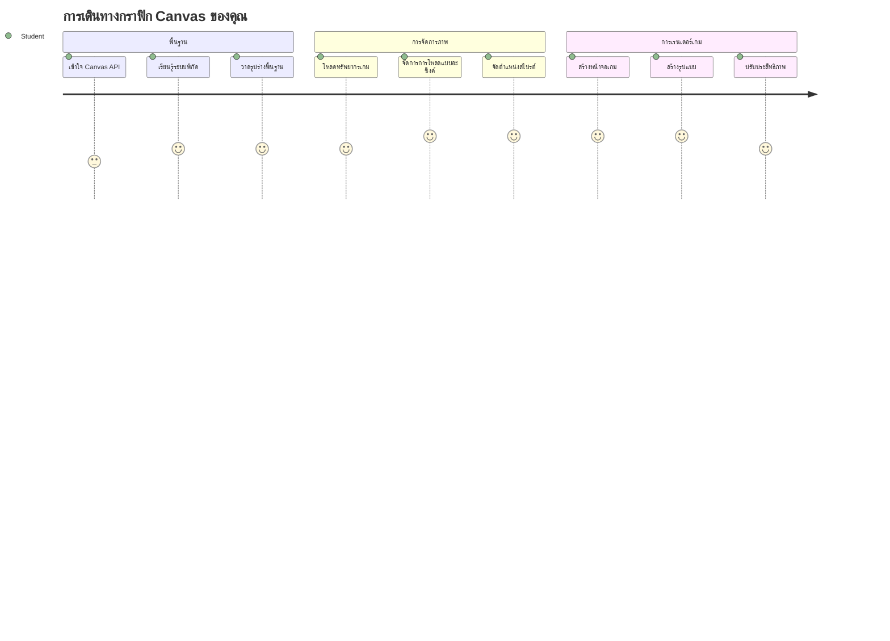
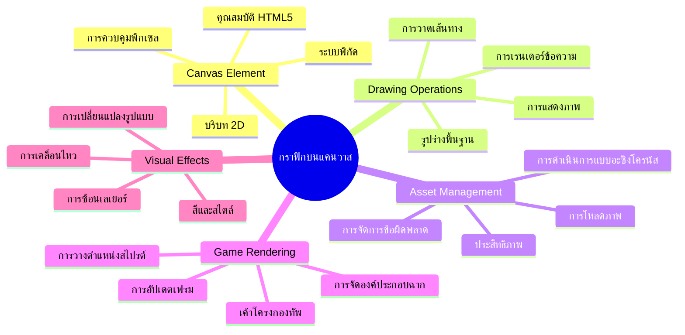
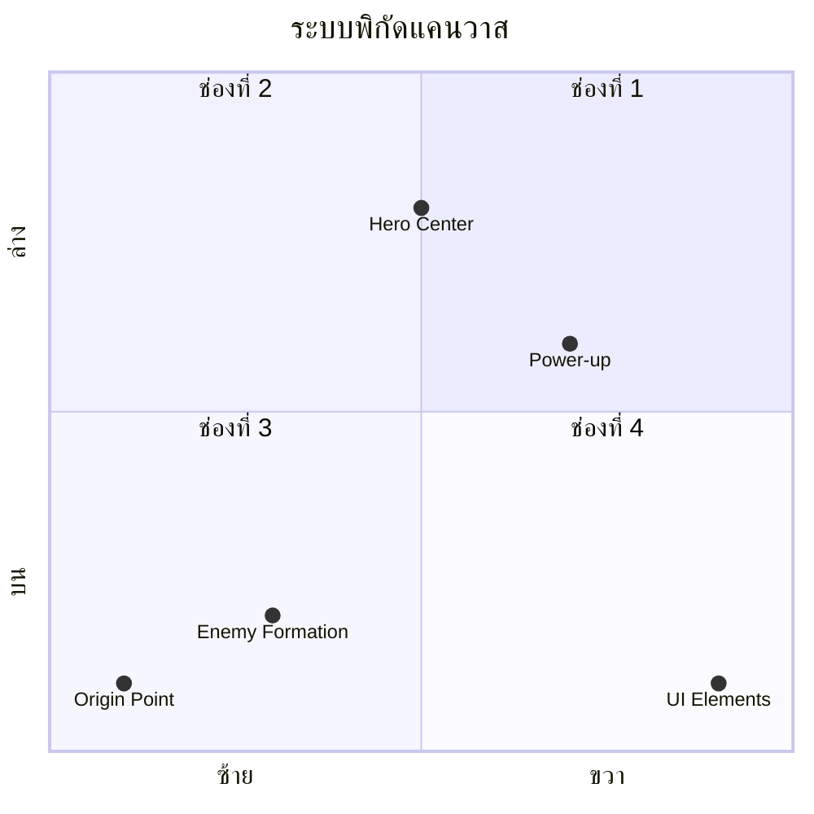
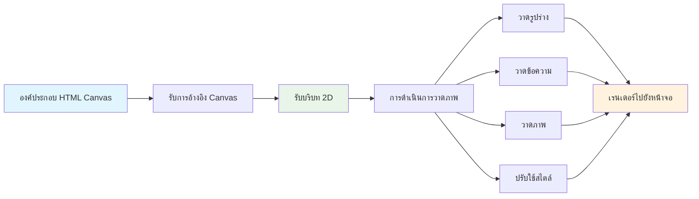
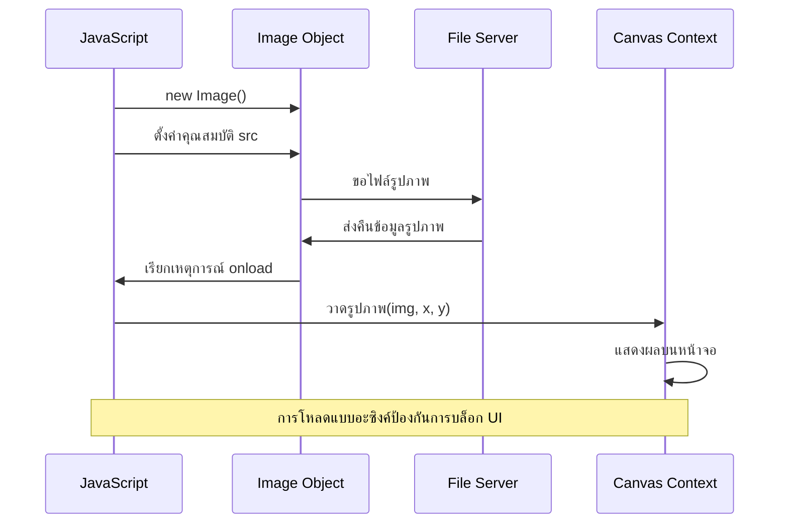
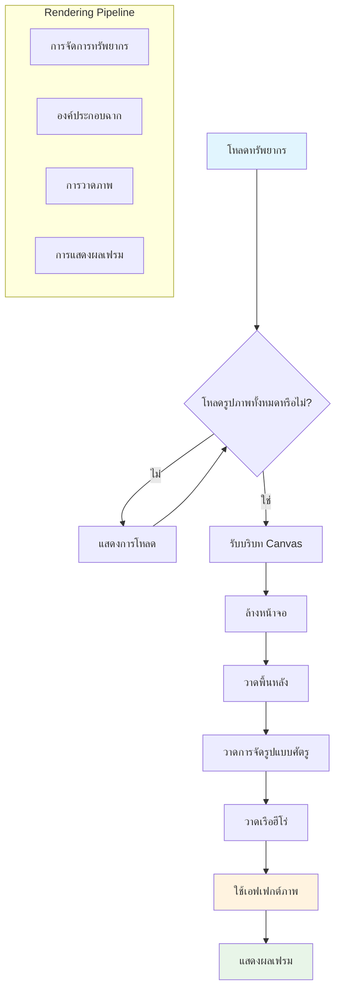
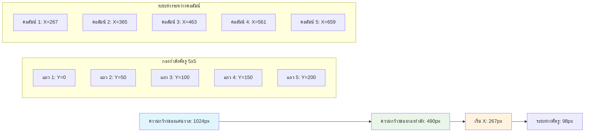
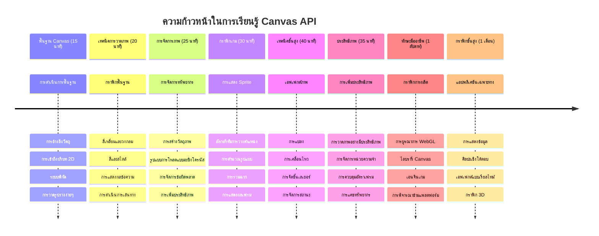

<!--
CO_OP_TRANSLATOR_METADATA:
{
  "original_hash": "7994743c5b21fdcceb36307916ef249a",
  "translation_date": "2026-01-06T21:48:12+00:00",
  "source_file": "6-space-game/2-drawing-to-canvas/README.md",
  "language_code": "th"
}
-->
# สร้างเกมอวกาศ ตอนที่ 2: วาดฮีโร่และมอนสเตอร์บนแคนวาส


Canvas API คือคุณสมบัติที่ทรงพลังที่สุดอย่างหนึ่งของการพัฒนาเว็บสำหรับการสร้างกราฟิกแบบไดนามิกและโต้ตอบได้ในเบราว์เซอร์ของคุณ ในบทเรียนนี้ เราจะเปลี่ยนองค์ประกอบ HTML `<canvas>` ที่ว่างเปล่าให้กลายเป็นโลกเกมที่เต็มไปด้วยฮีโร่และมอนสเตอร์ คิดว่าแคนวาสเป็นกระดานวาดภาพดิจิทัลที่โค้ดกลายเป็นภาพ

เรากำลังสร้างต่อยอดจากสิ่งที่คุณได้เรียนรู้ในบทเรียนก่อนหน้า และตอนนี้เราจะเจาะลึกไปที่ด้านภาพ คุณจะได้เรียนรู้วิธีโหลดและแสดงสไปรต์เกม วางตำแหน่งองค์ประกอบอย่างแม่นยำ และสร้างรากฐานภาพสำหรับเกมอวกาศของคุณ นี่เป็นสะพานเชื่อมระหว่างเว็บเพจที่นิ่งกับประสบการณ์ที่ไดนามิกและโต้ตอบได้

เมื่อจบบทเรียนนี้ คุณจะมีฉากเกมที่สมบูรณ์พร้อมกับเรือฮีโร่ของคุณที่วางตำแหน่งอย่างถูกต้อง และกองทัพศัตรูที่พร้อมสู่การต่อสู้ คุณจะเข้าใจวิธีเกมยุคใหม่แสดงผลกราฟิกในเบราว์เซอร์และเพิ่มทักษะในการสร้างประสบการณ์ภาพโต้ตอบของคุณเอง มาสำรวจกราฟิกแคนวาสและทำให้เกมอวกาศของคุณมีชีวิตกันเถอะ!


## แบบทดสอบก่อนเรียน

[แบบทดสอบก่อนเรียน](https://ff-quizzes.netlify.app/web/quiz/31)

## แคนวาส

องค์ประกอบ `<canvas>` คืออะไร? มันคือทางออกของ HTML5 สำหรับการสร้างกราฟิกและแอนิเมชันแบบไดนามิกในเว็บเบราว์เซอร์ ต่างจากภาพหรือวิดีโอทั่วไปที่เป็นแบบคงที่ แคนวาสให้คุณควบคุมพิกเซลในระดับละเอียดสำหรับทุกอย่างที่ปรากฏบนหน้าจอ สิ่งนี้ทำให้แคนวาสเหมาะอย่างยิ่งสำหรับเกม, การแสดงข้อมูลด้วยภาพ และงานศิลปะโต้ตอบ คิดว่ามันเป็นพื้นผิววาดภาพที่เขียนโปรแกรมได้โดยที่ JavaScript คือพู่กันของคุณ

โดยปกติ แคนวาสจะเหมือนกับสี่เหลี่ยมผืนผ้าโปร่งใสเปล่า ๆ บนหน้าเว็บของคุณ แต่นั่นแหละคือพลังที่ซ่อนอยู่! พลังที่แท้จริงจะเกิดขึ้นเมื่อคุณใช้ JavaScript ในการวาดรูปร่าง โหลดภาพ สร้างแอนิเมชัน และทำให้ทุกอย่างตอบสนองต่อปฏิสัมพันธ์ของผู้ใช้ มันคล้ายกับวิธีที่ผู้บุกเบิกกราฟิกคอมพิวเตอร์ยุคแรก ๆ ที่ Bell Labs ในปี 1960 ต้องเขียนโปรแกรมทุกพิกเซลเพื่อสร้างแอนิเมชันดิจิทัลชุดแรก ๆ

✅ อ่านเพิ่มเติมเกี่ยวกับ [Canvas API](https://developer.mozilla.org/docs/Web/API/Canvas_API) บน MDN

โดยปกติจะประกาศแคนวาสในส่วนของเนื้อหาของหน้าเว็บดังนี้:

```html
<canvas id="myCanvas" width="200" height="100"></canvas>
```

**นี่คือสิ่งที่โค้ดนี้ทำ:**
- **ตั้งค่า** attribute `id` เพื่อให้คุณอ้างอิงองค์ประกอบแคนวาสนี้โดยเฉพาะใน JavaScript
- **กำหนด** `width` เป็นพิกเซลเพื่อควบคุมความกว้างในแนวนอนของแคนวาส
- **ตั้งค่า** `height` เป็นพิกเซลเพื่อกำหนดความสูงในแนวตั้งของแคนวาส

## การวาดรูปทรงง่าย ๆ

ตอนนี้คุณรู้แล้วว่าองค์ประกอบแคนวาสคืออะไร เรามาลองวาดบนแคนวาสกัน! แคนวาสใช้ระบบพิกัดที่คุณอาจคุ้นเคยจากวิชาคณิตศาสตร์ แต่มีข้อแตกต่างสำคัญที่เฉพาะสำหรับกราฟิกคอมพิวเตอร์

แคนวาสใช้พิกัดคาร์ทีเซียนที่มีแกน x (แนวนอน) และแกน y (แนวตั้ง) ในการวางตำแหน่งทุกอย่างที่คุณวาด แต่สิ่งที่ต่างคือ จุดกำเนิด `(0,0)` เริ่มที่มุมซ้ายบน โดยค่า x จะเพิ่มขึ้นเมื่อเลื่อนไปขวา และค่า y จะเพิ่มขึ้นเมื่อเลื่อนลงด้านล่าง วิธีนี้ย้อนกลับไปยังจอแสดงผลคอมพิวเตอร์ยุคแรกที่ลำอิเล็กตรอนสแกนจากบนลงล่าง ทำให้มุมซ้ายบนเป็นจุดเริ่มต้นตามธรรมชาติ



> ภาพจาก [MDN](https://developer.mozilla.org/docs/Web/API/Canvas_API/Tutorial/Drawing_shapes)

ในการวาดบนองค์ประกอบแคนวาส คุณจะทำตามกระบวนการสามขั้นตอนพื้นฐานนี้ซึ่งเป็นรากฐานของกราฟิกบนแคนวาส เมื่อคุณทำได้สักพักจะกลายเป็นเรื่องง่าย:


1. **อ้างอิง** องค์ประกอบ Canvas จาก DOM (เหมือนกับองค์ประกอบ HTML อื่น ๆ)
2. **รับบริบทการแสดงผล 2D** – ซึ่งครอบคลุมฟังก์ชันวาดทั้งหมด
3. **เริ่มวาด!** ใช้วิธีที่มีในบริบทเพื่อสร้างกราฟิกของคุณ

นี่คือโค้ดตัวอย่าง:

```javascript
// ขั้นตอนที่ 1: รับองค์ประกอบแคนวาส
const canvas = document.getElementById("myCanvas");

// ขั้นตอนที่ 2: รับบริบทการเรนเดอร์ 2D
const ctx = canvas.getContext("2d");

// ขั้นตอนที่ 3: ตั้งค่าสีเติมและวาดสี่เหลี่ยม
ctx.fillStyle = 'red';
ctx.fillRect(0, 0, 200, 200); // x, y, ความกว้าง, ความสูง
```

**เรามาแจกแจงทีละขั้นตอน:**
- เรา **ดึง** องค์ประกอบแคนวาสโดยใช้ ID และเก็บไว้ในตัวแปร
- เรา **รับ** บริบทการแสดงผลแบบ 2D ซึ่งเป็นกล่องเครื่องมือเต็มไปด้วยฟังก์ชันวาด
- เรา **บอก** แคนวาสว่าเราจะเติมสีแดงด้วย `fillStyle`
- เรา **วาด** สี่เหลี่ยมที่เริ่มจากมุมซ้ายบน (0,0) ขนาด 200x200 พิกเซล

✅ Canvas API เน้นที่รูปทรง 2D เป็นหลัก แต่คุณสามารถวาดองค์ประกอบ 3D บนเว็บไซต์ได้เช่นกัน โดยใช้ [WebGL API](https://developer.mozilla.org/docs/Web/API/WebGL_API)

คุณสามารถวาดสิ่งต่าง ๆ บน Canvas API เช่น:

- **รูปทรงเรขาคณิต** เราได้แสดงวิธีวาดสี่เหลี่ยม แต่ยังมีรูปทรงอื่น ๆ อีกมากมายให้วาด
- **ข้อความ** คุณสามารถวาดข้อความด้วยฟอนต์และสีใดก็ได้ตามต้องการ
- **ภาพ** คุณสามารถวาดภาพโดยใช้ไฟล์ภาพ เช่น .jpg หรือ .png

✅ ลองดูสิ! คุณรู้วิธีวาดสี่เหลี่ยมแล้ว ลองวาดวงกลมบนหน้าเว็บดูสิ ลองดูตัวอย่างการวาด Canvas ที่น่าสนใจบน CodePen นี่คือตัวอย่างที่ [น่าประทับใจเป็นพิเศษ](https://codepen.io/dissimulate/pen/KrAwx)

### 🔄 **ตรวจสอบความเข้าใจเชิงการสอน**
**พื้นฐาน Canvas**: ก่อนจะไปโหลดภาพ ให้แน่ใจว่าคุณสามารถ:
- ✅ อธิบายว่า ระบบพิกัดของแคนวาสต่างจากระบบพิกัดทางคณิตศาสตร์อย่างไร
- ✅ เข้าใจกระบวนการสามขั้นตอนของการวาดบนแคนวาส
- ✅ บอกได้ว่าบริบทการแสดงผล 2D มีฟังก์ชันอะไรบ้าง
- ✅ อธิบายการทำงานร่วมกันของ fillStyle และ fillRect

**ทดสอบตัวเองเบื้องต้น**: คุณจะวาดวงกลมสีน้ำเงินที่ตำแหน่ง (100, 50) รัศมี 25 ได้อย่างไร?
```javascript
ctx.fillStyle = 'blue';
ctx.beginPath();
ctx.arc(100, 50, 25, 0, 2 * Math.PI);
ctx.fill();
```

**วิธีวาดด้วย Canvas ที่คุณรู้จักแล้ว**:
- **fillRect()**: วาดสี่เหลี่ยมที่เติมสีเต็ม
- **fillStyle**: ตั้งค่าสีและลวดลาย
- **beginPath()**: เริ่มเส้นทางการวาดใหม่
- **arc()**: สร้างวงกลมและโค้ง

## โหลดและวาดภาพ

การวาดรูปร่างพื้นฐานเป็นประโยชน์สำหรับการเริ่มต้น แต่เกมส่วนใหญ่ต้องการภาพจริง! สไปรต์, ภาพพื้นหลัง และเท็กซ์เจอร์คือสิ่งที่ทำให้เกมดูดี การโหลดและแสดงภาพบนแคนวาสต่างจากการวาดรูปเรขาคณิต แต่ทำได้ไม่ยากเมือเข้าใจขั้นตอน

เราต้องสร้างอ็อบเจกต์ `Image` โหลดไฟล์ภาพของเรา (ทำงานแบบอะซิงโครนัส หรือ "ในเบื้องหลัง") แล้ววาดมันลงบนแคนวาสเมื่อภาพพร้อม วิธีนี้ทำให้ภาพของคุณแสดงอย่างถูกต้องโดยไม่บล็อกแอปพลิเคชันระหว่างโหลด


### การโหลดภาพพื้นฐาน

```javascript
const img = new Image();
img.src = 'path/to/my/image.png';
img.onload = () => {
  // รูปภาพถูกโหลดและพร้อมใช้งานแล้ว
  console.log('Image loaded successfully!');
};
```

**นี่คือสิ่งที่เกิดขึ้นในโค้ดนี้:**
- เรา **สร้าง** อ็อบเจกต์ Image ใหม่เพื่อเก็บสไปรต์หรือเท็กซ์เจอร์
- เรา **บอก** ว่าจะโหลดไฟล์ภาพไหนโดยตั้งค่าแหล่งที่มา
- เรา **ฟัง** เหตุการณ์โหลดเพื่อรู้ว่าเมื่อไหร่ภาพพร้อมใช้งาน

### วิธีโหลดภาพที่ดีกว่า

นี่คือวิธีที่มืออาชีพใช้จัดการการโหลดภาพอย่างมีประสิทธิภาพ โดยใช้ฟังก์ชันที่ห่อการโหลดภาพด้วย Promise — วิธีนี้เป็นที่นิยมเมื่อ JavaScript Promises เป็นมาตรฐานใน ES6 ช่วยให้โค้ดของคุณดูเรียบร้อยและจัดการข้อผิดพลาดอย่างเหมาะสม:

```javascript
function loadAsset(path) {
  return new Promise((resolve, reject) => {
    const img = new Image();
    img.src = path;
    img.onload = () => {
      resolve(img);
    };
    img.onerror = () => {
      reject(new Error(`Failed to load image: ${path}`));
    };
  });
}

// การใช้งานสมัยใหม่ด้วย async/await
async function initializeGame() {
  try {
    const heroImg = await loadAsset('hero.png');
    const monsterImg = await loadAsset('monster.png');
    // รูปภาพพร้อมใช้งานแล้ว
  } catch (error) {
    console.error('Failed to load game assets:', error);
  }
}
```

**สิ่งที่เราทำที่นี่:**
- **ห่อ** โลจิกการโหลดภาพทั้งหมดใน Promise เพื่อจัดการง่ายขึ้น
- **เพิ่ม** การจัดการข้อผิดพลาดที่บอกเมื่อเกิดปัญหา
- **ใช้** ไวยากรณ์ async/await สมัยใหม่ซึ่งอ่านง่ายกว่า
- **มี** บล็อก try/catch เพื่อจัดการข้อผิดพลาดอย่างนุ่มนวล

เมื่อต้นโหลดภาพเสร็จแล้ว การวาดภาพลงบนแคนวาสทำได้ง่าย:

```javascript
async function renderGameScreen() {
  try {
    // โหลดทรัพยากรเกม
    const heroImg = await loadAsset('hero.png');
    const monsterImg = await loadAsset('monster.png');

    // ดึงแคนวาสและบริบท
    const canvas = document.getElementById("myCanvas");
    const ctx = canvas.getContext("2d");

    // วาดภาพไปยังตำแหน่งที่กำหนดไว้
    ctx.drawImage(heroImg, canvas.width / 2, canvas.height / 2);
    ctx.drawImage(monsterImg, 0, 0);
  } catch (error) {
    console.error('Failed to render game screen:', error);
  }
}
```

**เดินผ่านทีละขั้นตอน:**
- เรา **โหลด** ภาพฮีโร่และมอนสเตอร์พร้อมกันโดยใช้ await
- เรา **ดึง** องค์ประกอบแคนวาสและรับบริบท 2D มาที่ใช้
- เรา **วางตำแหน่ง** ภาพฮีโร่อยู่ตรงกลางโดยใช้การคำนวณพิกัด
- เรา **วาง** ภาพมอนสเตอร์ที่มุมซ้ายบนเพื่อเริ่มกองกำลังศัตรู
- เรา **จับ** ข้อผิดพลาดที่อาจเกิดขึ้นตอนโหลดหรือตอนวาด


## ถึงเวลาที่จะเริ่มสร้างเกมของคุณแล้ว

ตอนนี้เราจะนำทุกสิ่งมารวมกันเพื่อสร้างรากฐานภาพของเกมอวกาศของคุณ คุณมีความเข้าใจที่มั่นคงในพื้นฐานของแคนวาสและเทคนิคการโหลดภาพ ดังนั้นส่วนนี้จะเป็นการสอนลงมือทำเพื่อสร้างหน้าจอเกมที่สมบูรณ์โดยมีสไปรต์อยู่ในตำแหน่งที่เหมาะสม

### สิ่งที่จะสร้าง

คุณจะสร้างหน้าเว็บที่มีองค์ประกอบ Canvas ควรแสดงหน้าจอสีดำขนาด `1024*768` เราได้จัดเตรียมภาพให้คุณสองภาพ:

- เรือฮีโร่

   

- มอนสเตอร์ขนาด 5*5

   

### ขั้นตอนแนะนำสำหรับเริ่มพัฒนา

ค้นหาแฟ้มเริ่มต้นที่สร้างไว้ให้ในโฟลเดอร์ย่อย `your-work` โครงสร้างโปรเจกต์ของคุณควรประกอบด้วย:

```bash
your-work/
├── assets/
│   ├── enemyShip.png
│   └── player.png
├── index.html
├── app.js
└── package.json
```

**นี่คือสิ่งที่คุณกำลังทำงานกับมัน:**
- **สไปรต์เกม** อยู่ในโฟลเดอร์ `assets/` เพื่อให้ง่ายต่อการจัดการ
- **ไฟล์ HTML หลักของคุณ** ตั้งค่าองค์ประกอบแคนวาสและเตรียมทุกอย่าง
- **ไฟล์ JavaScript** ที่คุณจะเขียนโค้ดวาดเกมทั้งหมด
- **ไฟล์ package.json** ตั้งค่าเซิร์ฟเวอร์การพัฒนาเพื่อให้คุณทดสอบในเครื่อง

เปิดโฟลเดอร์นี้ใน Visual Studio Code เพื่อเริ่มพัฒนา คุณต้องมีสภาพแวดล้อมพัฒนาในเครื่องซึ่งติดตั้ง Visual Studio Code, NPM และ Node.js แล้ว หากคุณยังไม่มี `npm` บนเครื่อง [นี่คือวิธีการติดตั้ง](https://www.npmjs.com/get-npm)

เริ่มเซิร์ฟเวอร์พัฒนาด้วยการไปที่โฟลเดอร์ `your-work`:

```bash
cd your-work
npm start
```

**คำสั่งนี้ทำสิ่งเจ๋ง ๆ หลายอย่าง:**
- **เริ่ม** เซิร์ฟเวอร์ในเครื่องที่ `http://localhost:5000` เพื่อให้คุณทดสอบเกม
- **ให้บริการ** ไฟล์ทั้งหมดอย่างถูกต้องเพื่อให้เบราว์เซอร์โหลดได้ถูกต้อง
- **ดูแล** ไฟล์คุณสำหรับการเปลี่ยนแปลงเพื่อพัฒนาได้สะดวก
- **มอบ** สภาพแวดล้อมพัฒนาระดับมืออาชีพใหักับคุณ

> 💡 **หมายเหตุ**: เบราว์เซอร์ของคุณจะโชว์หน้าเปล่าตอนแรก – นี่เป็นเรื่องปกติ! เมื่อคุณเพิ่มโค้ด ใช้การรีเฟรชเพื่อดูการเปลี่ยนแปลง วิธีการพัฒนาแบบวนซ้ำนี้เหมือนกับที่ NASA สร้างคอมพิวเตอร์นำทาง Apollo — ทดสอบแต่ละส่วนก่อนนำไปรวมในระบบใหญ่

### เพิ่มโค้ด

เพิ่มโค้ดที่จำเป็นในไฟล์ `your-work/app.js` เพื่อทำงานตามนี้ให้ครบ:

1. **วาดแคนวาสด้วยพื้นหลังสีดำ**
   > 💡 **วิธีทำ**: หา TODO ใน `/app.js` แล้วเพิ่มแค่สองบรรทัด ตั้งค่า `ctx.fillStyle` เป็นสีดำ แล้วใช้ `ctx.fillRect()` เริ่มที่ (0,0) กับขนาดแคนวาสของคุณ ง่ายมาก!

2. **โหลดเท็กซ์เจอร์เกม**
   > 💡 **วิธีทำ**: ใช้ `await loadAsset()` เพื่อโหลดภาพผู้เล่นและศัตรู เก็บไว้ในตัวแปรเพื่อใช้งานต่อไป จำไว้ว่า – ภาพจะไม่แสดงจนกว่าคุณจะวาดมัน!

3. **วาดเรือฮีโร่ที่ตำแหน่งกลางล่าง**
   > 💡 **วิธีทำ**: ใช้ `ctx.drawImage()` วางตำแหน่งเรือฮีโร่ สำหรับค่า x ให้ใช้ `canvas.width / 2 - 45` เพื่อจัดกึ่งกลาง และสำหรับค่า y ใช้ `canvas.height - canvas.height / 4` เพื่อวางในส่วนด้านล่าง

4. **วาดแถวกองทัพศัตรูแบบ 5×5**
   > 💡 **วิธีทำ**: หา function `createEnemies` แล้วตั้งลูปซ้อนกัน คุณต้องคำนวณระยะห่างและตำแหน่ง แต่ไม่ต้องกังวล – ฉันจะแสดงวิธีทำอย่างละเอียด!

ก่อนอื่น กำหนดค่าคงที่สำหรับจัดวางกองทัพศัตรูอย่างเหมาะสม:

```javascript
const ENEMY_TOTAL = 5;
const ENEMY_SPACING = 98;
const FORMATION_WIDTH = ENEMY_TOTAL * ENEMY_SPACING;
const START_X = (canvas.width - FORMATION_WIDTH) / 2;
const STOP_X = START_X + FORMATION_WIDTH;
```

**อธิบายค่าคงที่เหล่านี้:**
- เรา **กำหนด** ให้มีศัตรู 5 ตัวต่อแถวและคอลัมน์ (ตาราง 5×5 สวยงาม)
- เรา **ตั้งค่า** ระยะห่างระหว่างศัตรูเพื่อไม่ให้ดูแออัด
- เรา **คำนวณ** ความกว้างทั้งหมดของกองทัพ
- เรา **หาจุดเริ่มต้นและสิ้นสุด** เพื่อให้กองทัพดูสมดุลและอยู่ตรงกลาง


จากนั้นสร้างลูปซ้อนเพื่อวาดกองทัพศัตรู:

```javascript
for (let x = START_X; x < STOP_X; x += ENEMY_SPACING) {
  for (let y = 0; y < 50 * 5; y += 50) {
    ctx.drawImage(enemyImg, x, y);
  }
}
```

**ลูปซ้อนนี้ทำหน้าที่:**
- ลูปภายนอก **เคลื่อนที่** จากซ้ายไปขวาผ่านกองทัพ
- ลูปภายใน **เคลื่อนที่** จากบนลงล่างเพื่อสร้างแถวเรียงสวยงาม
- เรา **วาด** สไปรต์ศัตรูแต่ละตัวที่ค่าพิกัด x,y ที่คำนวณไว้
- ทุกอย่าง **เว้นระยะห่างอย่างเท่าเทียม** ดูเป็นมืออาชีพและเป็นระเบียบ

### 🔄 **ตรวจสอบความเข้าใจเชิงการสอน**
**ความชำนาญในการแสดงผลเกม**: ตรวจสอบความเข้าใจระบบแสดงผลโดยสมบูรณ์:
- ✅ การโหลดภาพแบบอะซิงโครนัสช่วยป้องกัน UI ติดขัดในช่วงเริ่มเกมอย่างไร?
- ✅ ทำไมเราคำนวณตำแหน่งกองทัพศัตรูโดยใช้ค่าคงที่แทนระบุค่าลงโค้ดตรง ๆ?
- ✅ บริบทการแสดงผล 2D มีบทบาทอะไรในการวาดภาพ?
- ✅ ลูปซ้อนช่วยสร้างกองทัพสไปรต์อย่างเป็นระเบียบได้อย่างไร?

**ข้อควรพิจารณาด้านประสิทธิภาพ**: เกมของคุณตอนนี้แสดงถึง:
- **การโหลดแอสเซ็ตอย่างมีประสิทธิภาพ**: การจัดการภาพด้วย Promise
- **การแสดงผลอย่างเป็นระบบ**: การจัดระเบียบการวาดภาพ
- **การวางตำแหน่งด้วยคณิตศาสตร์**: การคำนวณและวางสไปรต์
- **การจัดการข้อผิดพลาด**: การ handle ข้อผิดพลาดได้อย่างนุ่มนวล

**แนวคิดการเขียนโปรแกรมเชิงภาพ**: คุณได้เรียนรู้ว่า:
- **ระบบพิกัด**: แปลงคณิตศาสตร์เป็นตำแหน่งบนหน้าจอ
- **การจัดการสไปรต์**: โหลดและแสดงกราฟิกเกม
- **อัลกอริทึมการจัดรูปแบบ**: รูปแบบทางคณิตศาสตร์สำหรับการจัดเลย์เอาต์อย่างมีระเบียบ
- **การทำงานแบบอะซิงค์**: JavaScript สมัยใหม่เพื่อประสบการณ์ผู้ใช้ที่ราบรื่น

## ผลลัพธ์

ผลลัพธ์ที่เสร็จสมบูรณ์ควรมีลักษณะดังนี้:


## วิธีแก้ปัญหา

กรุณาลองแก้ปัญหาด้วยตัวเองก่อน แต่ถ้าติดขัด สามารถดู [วิธีแก้ปัญหา](../../../../6-space-game/2-drawing-to-canvas/solution/app.js)

---

## ความท้าทาย GitHub Copilot Agent 🚀

ใช้โหมด Agent เพื่อทำภารกิจต่อไปนี้ให้สำเร็จ:

**คำอธิบาย:** ปรับปรุงผืนผ้าใบเกมอวกาศของคุณโดยเพิ่มเอฟเฟกต์ภาพและองค์ประกอบเชิงโต้ตอบโดยใช้เทคนิค Canvas API ที่คุณเรียนรู้

**คำแนะนำ:** สร้างไฟล์ใหม่ชื่อ `enhanced-canvas.html` โดยมีผืนผ้าใบที่แสดงดาวเคลื่อนไหวในพื้นหลัง แถบสุขภาพที่เต้นรัวของยานฮีโร่ และยานศัตรูที่เคลื่อนลงช้าๆ รวมโค้ด JavaScript ที่วาดดาวกระพริบโดยใช้ตำแหน่งสุ่มและความทึบแสง ดำเนินการแถบสุขภาพที่เปลี่ยนสีตามระดับสุขภาพ (เขียว > เหลือง > แดง) และทำให้องค์ประกอบยานศัตรูเคลื่อนลงจอด้วยความเร็วต่างกัน

เรียนรู้เพิ่มเติมเกี่ยวกับ [โหมด agent](https://code.visualstudio.com/blogs/2025/02/24/introducing-copilot-agent-mode) ที่นี่

## 🚀 ความท้าทาย

คุณได้เรียนรู้การวาดด้วย Canvas API ที่เน้น 2D แล้ว; ลองดู [WebGL API](https://developer.mozilla.org/docs/Web/API/WebGL_API) และลองวาดวัตถุ 3D ดู

## แบบทดสอบหลังบรรยาย

[แบบทดสอบหลังบรรยาย](https://ff-quizzes.netlify.app/web/quiz/32)

## ทบทวน & การศึกษาด้วยตนเอง

เรียนรู้เพิ่มเติมเกี่ยวกับ Canvas API โดย [อ่านรายละเอียด](https://developer.mozilla.org/docs/Web/API/Canvas_API)

### ⚡ **สิ่งที่คุณทำได้ใน 5 นาทีถัดไป**
- [ ] เปิดคอนโซลเบราว์เซอร์และสร้างองค์ประกอบ canvas ด้วย `document.createElement('canvas')`
- [ ] ลองวาดสี่เหลี่ยมโดยใช้ `fillRect()` บน context ของ canvas
- [ ] ทดลองสีต่างๆ ด้วยคุณสมบัติ `fillStyle`
- [ ] วาดวงกลมอย่างง่ายโดยใช้เมธอด `arc()`

### 🎯 **สิ่งที่คุณทำได้ใน 1 ชั่วโมงนี้**
- [ ] ทำแบบทดสอบหลังบทเรียนให้เสร็จและเข้าใจพื้นฐานของ canvas
- [ ] สร้างแอปพลิเคชันวาดภาพบน canvas ด้วยหลายรูปทรงและสีสัน
- [ ] นำเข้าภาพและเรนเดอร์สไปรต์สำหรับเกมของคุณ
- [ ] สร้างแอนิเมชันง่ายๆ ที่เคลื่อนวัตถุไปบนผืนผ้าใบ
- [ ] ฝึกการแปลง canvas เช่น การย่อขยาย การหมุน และการเลื่อนตำแหน่ง

### 📅 **เส้นทางการเรียนรู้ Canvas ของคุณในหนึ่งสัปดาห์**
- [ ] สร้างเกมอวกาศให้สมบูรณ์พร้อมกราฟิกและแอนิเมชันสไปรต์ที่สมบูรณ์แบบ
- [ ] เชี่ยวชาญเทคนิค canvas ขั้นสูง เช่น การไล่ระดับสี, รูปแบบ และการผสมภาพ
- [ ] สร้างภาพเชิงโต้ตอบโดยใช้ canvas สำหรับแสดงข้อมูล
- [ ] เรียนรู้เทคนิคการเพิ่มประสิทธิภาพ canvas เพื่อการทำงานที่ลื่นไหล
- [ ] สร้างแอปวาดภาพหรือระบายสีด้วยเครื่องมือต่างๆ
- [ ] สำรวจรูปแบบการเขียนโค้ดเชิงสร้างสรรค์และศิลปะเชิงกำเนิดด้วย canvas

### 🌟 **ความเชี่ยวชาญด้านกราฟิกในหนึ่งเดือนของคุณ**
- [ ] สร้างแอปพลิเคชันภาพเคลื่อนไหวซับซ้อนโดยใช้ Canvas 2D และ WebGL
- [ ] เรียนรู้แนวคิดการเขียนโปรแกรมกราฟิกและพื้นฐาน shader
- [ ] มีส่วนร่วมในไลบรารีกราฟิกโอเพนซอร์สและเครื่องมือสร้างภาพ
- [ ] เชี่ยวชาญการเพิ่มประสิทธิภาพสำหรับแอปที่ใช้กราฟิกความซับซ้อนสูง
- [ ] สร้างเนื้อหาการเรียนรู้เกี่ยวกับการเขียนโปรแกรม canvas และกราฟิกคอมพิวเตอร์
- [ ] เป็นผู้เชี่ยวชาญด้านการเขียนโปรแกรมกราฟิกที่ช่วยผู้อื่นสร้างประสบการณ์เชิงภาพ

## 🎯 เส้นเวลาความเชี่ยวชาญการสร้างกราฟิกบน Canvas ของคุณ


### 🛠️ สรุปเครื่องมือการสร้างกราฟิกบน Canvas ของคุณ

หลังจากจบบทเรียนนี้ คุณมี:
- **ความเชี่ยวชาญ Canvas API**: ความเข้าใจครบถ้วนเกี่ยวกับการเขียนโปรแกรมกราฟิก 2D
- **คณิตศาสตร์พิกัด**: การวางตำแหน่งและอัลกอริทึมเลย์เอาต์ที่แม่นยำ
- **การจัดการทรัพยากร**: การโหลดภาพและจัดการข้อผิดพลาดอย่างมืออาชีพ
- **กระบวนการเรนเดอร์**: วิธีการจัดองค์ประกอบซีนอย่างเป็นระบบ
- **กราฟิกเกม**: การจัดวางสไปรต์และคำนวณรูปแบบการจัดเรียง
- **โปรแกรมแบบอะซิงค์**: รูปแบบ JavaScript สมัยใหม่เพื่อประสิทธิภาพที่ราบรื่น
- **โปรแกรมเชิงภาพ**: แปลงแนวคิดทางคณิตศาสตร์เป็นกราฟิกบนหน้าจอ

**การประยุกต์ใช้ในโลกจริง**: ทักษะ Canvas ของคุณสามารถนำไปใช้กับ:
- **การแสดงข้อมูล**: แผนภูมิ กราฟ และแดชบอร์ดเชิงโต้ตอบ
- **การพัฒนาเกม**: เกม 2D, ซิมูเลชัน และประสบการณ์เชิงโต้ตอบ
- **ศิลปะดิจิทัล**: การเขียนโค้ดเชิงสร้างสรรค์และโปรเจกต์ศิลปะกำเนิด
- **ออกแบบ UI/UX**: กราฟิกแบบกำหนดเองและองค์ประกอบเชิงโต้ตอบ
- **ซอฟต์แวร์เพื่อการศึกษา**: เครื่องมือและซิมูเลชันเพื่อการเรียนรู้ในเชิงภาพ
- **เว็บแอปพลิเคชัน**: กราฟิกแบบไดนามิกและการแสดงผลเรียลไทม์

**ทักษะมืออาชีพที่ได้รับ**: คุณสามารถ:
- **สร้าง** โซลูชันกราฟิกกำหนดเองโดยไม่ต้องใช้ไลบรารีภายนอก
- **เพิ่มประสิทธิภาพ** ประสิทธิภาพการเรนเดอร์เพื่อประสบการณ์ผู้ใช้ที่ราบรื่น
- **ดีบัก** ปัญหาเชิงภาพที่ซับซ้อนโดยใช้เครื่องมือสำหรับนักพัฒนาเบราว์เซอร์
- **ออกแบบ** ระบบกราฟิกที่ปรับขนาดได้โดยใช้หลักคณิตศาสตร์
- **ผสานรวม** กราฟิก Canvas กับเฟรมเวิร์กเว็บแอปพลิเคชันสมัยใหม่

**เมธอด Canvas API ที่คุณเชี่ยวชาญ**:
- **การจัดการองค์ประกอบ**: getElementById, getContext
- **การดำเนินการวาด**: fillRect, drawImage, fillStyle
- **การโหลดทรัพยากร**: อ็อบเจ็กต์ Image, รูปแบบ Promise
- **การวางตำแหน่งทางคณิตศาสตร์**: การคำนวณพิกัด, อัลกอริทึมจัดรูปแบบ

**ระดับถัดไป**: คุณพร้อมที่จะเพิ่มแอนิเมชัน การโต้ตอบผู้ใช้ การตรวจจับการชน หรือสำรวจ WebGL สำหรับกราฟิก 3 มิติแล้ว!

🌟 **ความสำเร็จที่ปลดล็อก**: คุณได้สร้างระบบเรนเดอร์เกมครบวงจรโดยใช้เทคนิคพื้นฐานของ Canvas API!

## การบ้าน

[ทดลองเล่นกับ Canvas API](assignment.md)

---

<!-- CO-OP TRANSLATOR DISCLAIMER START -->
**ข้อจำกัดความรับผิดชอบ**:
เอกสารนี้ได้รับการแปลโดยใช้บริการแปลภาษาอัตโนมัติ [Co-op Translator](https://github.com/Azure/co-op-translator) แม้ว่าเราจะพยายามให้ความถูกต้อง โปรดทราบว่าการแปลโดยอัตโนมัติอาจมีข้อผิดพลาดหรือความคลาดเคลื่อนได้ เอกสารต้นฉบับในภาษาต้นทางถือเป็นแหล่งข้อมูลที่เชื่อถือได้ สำหรับข้อมูลที่สำคัญ ขอแนะนำให้ใช้บริการแปลโดยผู้เชี่ยวชาญมืออาชีพ เราไม่รับผิดชอบต่อความเข้าใจผิดหรือการตีความที่ผิดพลาดที่เกิดจากการใช้การแปลนี้
<!-- CO-OP TRANSLATOR DISCLAIMER END -->