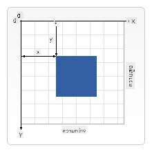

<!--
CO_OP_TRANSLATOR_METADATA:
{
  "original_hash": "84053695dca714e16ed064366503ebd5",
  "translation_date": "2025-10-23T21:18:11+00:00",
  "source_file": "6-space-game/2-drawing-to-canvas/README.md",
  "language_code": "th"
}
-->
# สร้างเกมอวกาศ ตอนที่ 2: วาดฮีโร่และมอนสเตอร์ลงบน Canvas

Canvas API เป็นหนึ่งในฟีเจอร์ที่ทรงพลังที่สุดของการพัฒนาเว็บสำหรับการสร้างกราฟิกแบบไดนามิกและโต้ตอบได้ในเบราว์เซอร์ของคุณ ในบทเรียนนี้ เราจะเปลี่ยน `<canvas>` HTML ที่ว่างเปล่าให้กลายเป็นโลกของเกมที่เต็มไปด้วยฮีโร่และมอนสเตอร์ ลองนึกถึง canvas ว่าเป็นกระดานศิลปะดิจิทัลที่โค้ดกลายเป็นภาพ

เราจะต่อยอดจากสิ่งที่คุณเรียนรู้ในบทเรียนก่อนหน้า และตอนนี้เราจะเจาะลึกในด้านภาพ คุณจะได้เรียนรู้วิธีโหลดและแสดงสไปรท์ของเกม การจัดตำแหน่งองค์ประกอบอย่างแม่นยำ และสร้างพื้นฐานภาพสำหรับเกมอวกาศของคุณ นี่คือสะพานเชื่อมระหว่างหน้าเว็บแบบคงที่และประสบการณ์แบบไดนามิกและโต้ตอบได้

เมื่อจบบทเรียนนี้ คุณจะมีฉากเกมที่สมบูรณ์พร้อมกับยานฮีโร่ที่วางตำแหน่งอย่างถูกต้องและการจัดรูปแบบศัตรูที่พร้อมสำหรับการต่อสู้ คุณจะเข้าใจวิธีที่เกมสมัยใหม่แสดงกราฟิกในเบราว์เซอร์ และได้รับทักษะในการสร้างประสบการณ์ภาพแบบโต้ตอบของคุณเอง มาสำรวจกราฟิกของ canvas และทำให้เกมอวกาศของคุณมีชีวิตชีวากันเถอะ!

## แบบทดสอบก่อนเรียน

[แบบทดสอบก่อนเรียน](https://ff-quizzes.netlify.app/web/quiz/31)

## Canvas คืออะไร

แล้ว `<canvas>` คืออะไร? มันคือโซลูชันของ HTML5 สำหรับการสร้างกราฟิกและแอนิเมชันแบบไดนามิกในเบราว์เซอร์เว็บ ไม่เหมือนกับภาพหรือวิดีโอทั่วไปที่เป็นแบบคงที่ Canvas ให้คุณควบคุมระดับพิกเซลในทุกสิ่งที่ปรากฏบนหน้าจอ ซึ่งทำให้มันเหมาะสำหรับเกม การแสดงผลข้อมูล และศิลปะเชิงโต้ตอบ ลองนึกถึงมันว่าเป็นพื้นผิวการวาดที่สามารถเขียนโปรแกรมได้ โดยที่ JavaScript เป็นแปรงวาดของคุณ

โดยปกติแล้ว องค์ประกอบ canvas จะดูเหมือนสี่เหลี่ยมโปร่งใสที่ว่างเปล่าบนหน้าเว็บของคุณ แต่ศักยภาพที่แท้จริงของมันจะปรากฏเมื่อคุณใช้ JavaScript เพื่อวาดรูปร่าง โหลดภาพ สร้างแอนิเมชัน และทำให้สิ่งต่าง ๆ ตอบสนองต่อการโต้ตอบของผู้ใช้ มันคล้ายกับวิธีที่ผู้บุกเบิกกราฟิกคอมพิวเตอร์ในยุคแรก ๆ ที่ Bell Labs ในปี 1960 ต้องเขียนโปรแกรมพิกเซลทุกจุดเพื่อสร้างแอนิเมชันดิจิทัลครั้งแรก

✅ อ่าน [เพิ่มเติมเกี่ยวกับ Canvas API](https://developer.mozilla.org/docs/Web/API/Canvas_API) บน MDN

นี่คือตัวอย่างการประกาศ canvas โดยทั่วไป ซึ่งเป็นส่วนหนึ่งของ body ของหน้าเว็บ:

```html
<canvas id="myCanvas" width="200" height="100"></canvas>
```

**สิ่งที่โค้ดนี้ทำ:**
- **ตั้งค่า** attribute `id` เพื่อให้คุณสามารถอ้างอิงถึงองค์ประกอบ canvas นี้ใน JavaScript
- **กำหนด** `width` เป็นพิกเซลเพื่อควบคุมขนาดแนวนอนของ canvas
- **กำหนด** `height` เป็นพิกเซลเพื่อกำหนดขนาดแนวตั้งของ canvas

## การวาดรูปทรงเรขาคณิตง่าย ๆ

ตอนนี้คุณรู้แล้วว่า canvas คืออะไร ลองมาสำรวจวิธีการวาดบนมันกัน! Canvas ใช้ระบบพิกัดที่อาจจะคุ้นเคยจากชั้นเรียนคณิตศาสตร์ แต่มีจุดพลิกผันสำคัญที่เฉพาะเจาะจงสำหรับกราฟิกคอมพิวเตอร์

Canvas ใช้ระบบพิกัด Cartesian ที่มีแกน x (แนวนอน) และแกน y (แนวตั้ง) เพื่อกำหนดตำแหน่งของทุกสิ่งที่คุณวาด แต่มีความแตกต่างสำคัญ: ไม่เหมือนกับระบบพิกัดในชั้นเรียนคณิตศาสตร์ จุดเริ่มต้น `(0,0)` จะอยู่ที่มุมบนซ้าย โดยค่าของ x จะเพิ่มขึ้นเมื่อคุณเลื่อนไปทางขวา และค่าของ y จะเพิ่มขึ้นเมื่อคุณเลื่อนลง วิธีนี้มีต้นกำเนิดมาจากจอคอมพิวเตอร์ในยุคแรก ๆ ที่ลำแสงอิเล็กตรอนสแกนจากบนลงล่าง ทำให้มุมบนซ้ายเป็นจุดเริ่มต้นที่เป็นธรรมชาติ


> ภาพจาก [MDN](https://developer.mozilla.org/docs/Web/API/Canvas_API/Tutorial/Drawing_shapes)

ในการวาดบน canvas คุณจะทำตามกระบวนการสามขั้นตอนเดียวกันที่เป็นพื้นฐานของกราฟิก canvas ทั้งหมด เมื่อคุณทำสิ่งนี้สองสามครั้ง มันจะกลายเป็นธรรมชาติ:

1. **อ้างอิง**ถึงองค์ประกอบ Canvas ของคุณจาก DOM (เหมือนกับองค์ประกอบ HTML อื่น ๆ)
2. **รับบริบทการเรนเดอร์ 2D** – นี่คือเครื่องมือที่มีวิธีการวาดทั้งหมด
3. **เริ่มวาด!** ใช้วิธีการในตัวของบริบทเพื่อสร้างกราฟิกของคุณ

นี่คือลักษณะของโค้ด:

```javascript
// Step 1: Get the canvas element
const canvas = document.getElementById("myCanvas");

// Step 2: Get the 2D rendering context
const ctx = canvas.getContext("2d");

// Step 3: Set fill color and draw a rectangle
ctx.fillStyle = 'red';
ctx.fillRect(0, 0, 200, 200); // x, y, width, height
```

**มาดูทีละขั้นตอน:**
- เรา **ดึง**องค์ประกอบ canvas โดยใช้ ID และเก็บไว้ในตัวแปร
- เรา **รับ**บริบทการเรนเดอร์ 2D – นี่คือชุดเครื่องมือที่เต็มไปด้วยวิธีการวาด
- เรา **บอก** canvas ว่าเราต้องการเติมสีแดงโดยใช้ property `fillStyle`
- เรา **วาด**สี่เหลี่ยมที่เริ่มต้นที่มุมบนซ้าย (0,0) ที่มีความกว้างและสูง 200 พิกเซล

✅ Canvas API ส่วนใหญ่เน้นที่รูปร่าง 2D แต่คุณสามารถวาดองค์ประกอบ 3D ลงในเว็บไซต์ได้; สำหรับสิ่งนี้ คุณอาจใช้ [WebGL API](https://developer.mozilla.org/docs/Web/API/WebGL_API)

คุณสามารถวาดสิ่งต่าง ๆ ได้หลากหลายด้วย Canvas API เช่น:

- **รูปร่างเรขาคณิต** เราได้แสดงวิธีการวาดสี่เหลี่ยมแล้ว แต่ยังมีอีกมากมายที่คุณสามารถวาดได้
- **ข้อความ** คุณสามารถวาดข้อความด้วยฟอนต์และสีใดก็ได้ที่คุณต้องการ
- **ภาพ** คุณสามารถวาดภาพจากไฟล์ภาพ เช่น .jpg หรือ .png เป็นต้น

✅ ลองทำดู! คุณรู้วิธีวาดสี่เหลี่ยมแล้ว คุณสามารถวาดวงกลมลงบนหน้าได้หรือไม่? ลองดูภาพวาด Canvas ที่น่าสนใจบน CodePen นี่คือตัวอย่างที่ [น่าประทับใจ](https://codepen.io/dissimulate/pen/KrAwx)

## โหลดและวาดภาพ

การวาดรูปร่างพื้นฐานมีประโยชน์สำหรับการเริ่มต้น แต่เกมส่วนใหญ่ต้องการภาพจริง! สไปรท์ พื้นหลัง และพื้นผิวคือสิ่งที่ทำให้เกมมีความน่าสนใจทางภาพ การโหลดและแสดงภาพบน canvas ทำงานแตกต่างจากการวาดรูปร่างเรขาคณิต แต่ก็ง่ายเมื่อคุณเข้าใจกระบวนการ

เราจำเป็นต้องสร้างวัตถุ `Image` โหลดไฟล์ภาพของเรา (สิ่งนี้เกิดขึ้นแบบอะซิงโครนัส หมายถึง "ในพื้นหลัง") และวาดมันลงบน canvas เมื่อมันพร้อม วิธีนี้ช่วยให้ภาพของคุณแสดงผลได้อย่างถูกต้องโดยไม่ทำให้แอปพลิเคชันของคุณหยุดชะงักขณะโหลด

### การโหลดภาพพื้นฐาน

```javascript
const img = new Image();
img.src = 'path/to/my/image.png';
img.onload = () => {
  // Image loaded and ready to be used
  console.log('Image loaded successfully!');
};
```

**สิ่งที่เกิดขึ้นในโค้ดนี้:**
- เรา **สร้าง**วัตถุ Image ใหม่เพื่อเก็บสไปรท์หรือพื้นผิวของเรา
- เรา **บอก**ว่าต้องโหลดไฟล์ภาพใดโดยตั้งค่าเส้นทาง source
- เรา **ฟัง**เหตุการณ์ load เพื่อให้เรารู้ว่าเมื่อใดภาพพร้อมใช้งาน

### วิธีที่ดีกว่าในการโหลดภาพ

นี่คือวิธีที่มีประสิทธิภาพมากขึ้นในการจัดการการโหลดภาพที่นักพัฒนามืออาชีพใช้กันทั่วไป เราจะห่อการโหลดภาพในฟังก์ชันที่ใช้ Promise – วิธีนี้ซึ่งได้รับความนิยมเมื่อ JavaScript Promises กลายเป็นมาตรฐานใน ES6 ทำให้โค้ดของคุณมีการจัดระเบียบมากขึ้นและจัดการข้อผิดพลาดได้อย่างดี:

```javascript
function loadAsset(path) {
  return new Promise((resolve, reject) => {
    const img = new Image();
    img.src = path;
    img.onload = () => {
      resolve(img);
    };
    img.onerror = () => {
      reject(new Error(`Failed to load image: ${path}`));
    };
  });
}

// Modern usage with async/await
async function initializeGame() {
  try {
    const heroImg = await loadAsset('hero.png');
    const monsterImg = await loadAsset('monster.png');
    // Images are now ready to use
  } catch (error) {
    console.error('Failed to load game assets:', error);
  }
}
```

**สิ่งที่เราทำในที่นี้:**
- **ห่อ**ตรรกะการโหลดภาพทั้งหมดใน Promise เพื่อให้เราจัดการได้ดีขึ้น
- **เพิ่ม**การจัดการข้อผิดพลาดที่บอกเราจริง ๆ เมื่อมีบางอย่างผิดพลาด
- **ใช้**ไวยากรณ์ async/await ที่ทันสมัยเพราะมันอ่านง่ายมาก
- **รวม**บล็อก try/catch เพื่อจัดการปัญหาการโหลดอย่างสุภาพ

เมื่อภาพของคุณโหลดเสร็จ การวาดมันลงบน canvas นั้นค่อนข้างตรงไปตรงมา:

```javascript
async function renderGameScreen() {
  try {
    // Load game assets
    const heroImg = await loadAsset('hero.png');
    const monsterImg = await loadAsset('monster.png');

    // Get canvas and context
    const canvas = document.getElementById("myCanvas");
    const ctx = canvas.getContext("2d");

    // Draw images to specific positions
    ctx.drawImage(heroImg, canvas.width / 2, canvas.height / 2);
    ctx.drawImage(monsterImg, 0, 0);
  } catch (error) {
    console.error('Failed to render game screen:', error);
  }
}
```

**มาดูทีละขั้นตอน:**
- เรา **โหลด**ภาพฮีโร่และมอนสเตอร์ในพื้นหลังโดยใช้ await
- เรา **ดึง**องค์ประกอบ canvas และรับบริบทการเรนเดอร์ 2D ที่เราต้องการ
- เรา **จัดตำแหน่ง**ภาพฮีโร่ตรงกลางโดยใช้คณิตศาสตร์พิกัดอย่างรวดเร็ว
- เรา **วาง**ภาพมอนสเตอร์ที่มุมบนซ้ายเพื่อเริ่มการจัดรูปแบบศัตรู
- เรา **จับ**ข้อผิดพลาดใด ๆ ที่อาจเกิดขึ้นระหว่างการโหลดหรือการเรนเดอร์

## ถึงเวลาสร้างเกมของคุณแล้ว

ตอนนี้เราจะรวมทุกอย่างเข้าด้วยกันเพื่อสร้างพื้นฐานภาพของเกมอวกาศของคุณ คุณมีความเข้าใจที่มั่นคงเกี่ยวกับพื้นฐานของ canvas และเทคนิคการโหลดภาพ ดังนั้นส่วนที่ลงมือทำนี้จะนำคุณผ่านการสร้างหน้าจอเกมที่สมบูรณ์พร้อมสไปรท์ที่วางตำแหน่งอย่างเหมาะสม

### สิ่งที่ต้องสร้าง

คุณจะสร้างหน้าเว็บที่มีองค์ประกอบ Canvas ซึ่งจะแสดงหน้าจอสีดำขนาด `1024*768` เราได้เตรียมภาพสองภาพให้คุณ:

- ยานฮีโร่

   

- มอนสเตอร์ 5*5

   

### ขั้นตอนที่แนะนำในการเริ่มต้นพัฒนา

ค้นหาไฟล์เริ่มต้นที่ถูกสร้างไว้ให้คุณในโฟลเดอร์ `your-work` โครงสร้างโปรเจกต์ของคุณควรมี:

```bash
your-work/
├── assets/
│   ├── enemyShip.png
│   └── player.png
├── index.html
├── app.js
└── package.json
```

**สิ่งที่คุณกำลังทำงานด้วย:**
- **สไปรท์เกม** อยู่ในโฟลเดอร์ `assets/` เพื่อให้ทุกอย่างเป็นระเบียบ
- **ไฟล์ HTML หลักของคุณ** ตั้งค่าองค์ประกอบ canvas และเตรียมทุกอย่างให้พร้อม
- **ไฟล์ JavaScript** ที่คุณจะเขียนโค้ดการเรนเดอร์เกมทั้งหมด
- **ไฟล์ package.json** ที่ตั้งค่าเซิร์ฟเวอร์พัฒนาเพื่อให้คุณทดสอบได้ในเครื่อง

เปิดโฟลเดอร์นี้ใน Visual Studio Code เพื่อเริ่มพัฒนา คุณจะต้องมีสภาพแวดล้อมการพัฒนาในเครื่องที่มี Visual Studio Code, NPM และ Node.js ติดตั้งอยู่ หากคุณยังไม่มี `npm` ตั้งค่าในคอมพิวเตอร์ของคุณ [นี่คือวิธีการติดตั้ง](https://www.npmjs.com/get-npm)

เริ่มเซิร์ฟเวอร์พัฒนาของคุณโดยไปที่โฟลเดอร์ `your-work`:

```bash
cd your-work
npm start
```

**คำสั่งนี้ทำสิ่งที่น่าสนใจ:**
- **เริ่มต้น**เซิร์ฟเวอร์ในเครื่องที่ `http://localhost:5000` เพื่อให้คุณทดสอบเกมของคุณ
- **ให้บริการ**ไฟล์ทั้งหมดของคุณอย่างถูกต้องเพื่อให้เบราว์เซอร์โหลดได้อย่างถูกต้อง
- **เฝ้าดู**ไฟล์ของคุณสำหรับการเปลี่ยนแปลงเพื่อให้คุณพัฒนาได้อย่างราบรื่น
- **ให้คุณ**สภาพแวดล้อมการพัฒนาระดับมืออาชีพเพื่อทดสอบทุกอย่าง

> 💡 **หมายเหตุ**: เบราว์เซอร์ของคุณจะแสดงหน้าเปล่าในตอนแรก – นั่นเป็นเรื่องปกติ! เมื่อคุณเพิ่มโค้ด ให้รีเฟรชเบราว์เซอร์เพื่อดูการเปลี่ยนแปลงของคุณ วิธีการพัฒนาแบบวนซ้ำนี้คล้ายกับวิธีที่ NASA สร้างคอมพิวเตอร์นำทาง Apollo – ทดสอบแต่ละส่วนก่อนที่จะรวมเข้ากับระบบใหญ่

### เพิ่มโค้ด

เพิ่มโค้ดที่จำเป็นลงใน `your-work/app.js` เพื่อทำงานต่อไปนี้ให้เสร็จ:

1. **วาด canvas พร้อมพื้นหลังสีดำ**
   > 💡 **วิธีการ**: ค้นหา TODO ใน `/app.js` และเพิ่มเพียงสองบรรทัด ตั้งค่า `ctx.fillStyle` เป็นสีดำ จากนั้นใช้ `ctx.fillRect()` เริ่มต้นที่ (0,0) พร้อมขนาดของ canvas ของคุณ ง่ายมาก!

2. **โหลดพื้นผิวเกม**
   > 💡 **วิธีการ**: ใช้ `await loadAsset()` เพื่อโหลดภาพผู้เล่นและศัตรูของคุณ เก็บไว้ในตัวแปรเพื่อให้คุณสามารถใช้มันในภายหลัง จำไว้ – มันจะไม่ปรากฏจนกว่าคุณจะวาดมันจริง ๆ!

3. **วาดยานฮีโร่ในตำแหน่งกลาง-ล่าง**
   > 💡 **วิธีการ**: ใช้ `ctx.drawImage()` เพื่อวางตำแหน่งฮีโร่ของคุณ สำหรับพิกัด x ลองใช้ `canvas.width / 2 - 45` เพื่อวางตรงกลาง และสำหรับพิกัด y ใช้ `canvas.height - canvas.height / 4` เพื่อวางในพื้นที่ด้านล่าง

4. **วาดรูปแบบมอนสเตอร์ 5×5**
   > 💡 **วิธีการ**: ค้นหาฟังก์ชัน `createEnemies` และตั้งค่าลูปซ้อนกัน คุณจะต้องทำคณิตศาสตร์สำหรับการเว้นระยะและการวางตำแหน่ง แต่ไม่ต้องกังวล – ฉันจะแสดงให้คุณเห็นว่าทำอย่างไร!

ก่อนอื่น กำหนดค่าคงที่สำหรับการจัดรูปแบบศัตรูที่เหมาะสม:

```javascript
const ENEMY_TOTAL = 5;
const ENEMY_SPACING = 98;
const FORMATION_WIDTH = ENEMY_TOTAL * ENEMY_SPACING;
const START_X = (canvas.width - FORMATION_WIDTH) / 2;
const STOP_X = START_X + FORMATION_WIDTH;
```

**มาดูว่าค่าคงที่เหล่านี้ทำอะไร:**
- เรา **ตั้งค่า**ศัตรู 5 ตัวต่อแถวและคอลัมน์ (กริด 5×5 ที่สวยงาม)
- เรา **กำหนด**ระยะห่างระหว่างศัตรูเพื่อไม่ให้ดูแออัด
- เรา **คำนวณ**ความกว้างของรูปแบบทั้งหมด
- เรา **หาจุดเริ่มต้นและจุดสิ้นสุด**เพื่อให้รูปแบบดูสมดุล

จากนั้น สร้างลูปซ้อนกันเพื่อวาดรูปแบบศัตรู:

```javascript
for (let x = START_X; x < STOP_X; x += ENEMY_SPACING) {
  for (let y = 0; y < 50 * 5; y += 50) {
    ctx.drawImage(enemyImg, x, y);
  }
}
```

**นี่คือสิ่งที่ลูปซ้อนกันนี้ทำ:**
- ลูปด้านนอก **เคลื่อนที่**จากซ้ายไปขวาในรูปแบบของเรา
- ลูปด้านใน **เคลื่อนที่**จากบนลงล่างเพื่อสร้างแถวที่เรียบร้อย
- เรา **วาด**สไปรท์ศัตรูแต่ละตัวที่พิกัด x,y ที่เราคำนวณไว้
- ทุกอย่าง **เว้นระยะห่างอย่างสม่ำเสมอ**เพื่อให้ดูเป็นมืออาชีพและเป็นระเบียบ

## ผลลัพธ์

ผลลัพธ์ที่เสร็จสมบูรณ์ควรมีลักษณะดังนี้:


## วิธีแก้ปัญหา

กรุณาลองแก้ปัญหาด้วยตัวเองก่อน แต่ถ้าคุณติดขัด ลองดู [วิธีแก้ปัญหา](../../../../6-space-game/2-drawing-to-canvas/solution/app.js)

---

## ความท้าทาย GitHub Copilot Agent 🚀

ใช้โหมด Agent เพื่อทำความท้าทายต่อไปนี้ให้สำเร็จ:

**คำอธิบาย:** เพิ่มเอฟเฟกต์ภาพและองค์ประกอบแบบโต้ตอบใน canvas เกมอวกาศของคุณโดยใช้เทคนิค Canvas API ที่คุณได้เรียนรู้

**คำสั่ง:** สร้างไฟล์ใหม่ชื่อ `enhanced-canvas.html` พร้อม canvas ที่แสดงดาวที่เคลื่อนไหวในพื้นหลัง แถบสุขภาพที่เต้นเป็นจังหวะสำหรับยานฮีโร่ และยานศัตรูที่เคลื่อนที่ลงอย่างช้า ๆ รวมโค้ด JavaScript ที่วาดดาวที่กระพริบโดยใช้ตำแหน่งและความทึบแบบสุ่ม ใช้แถบสุขภาพที่เปลี่ยนสีตามระดับสุขภาพ (เขียว > เหลือง > แดง) และทำให้ยานศัตรูเคลื่อนที่ลงหน้าจอด้วยความเร็วต่างกัน

เรียนรู้เพิ่มเติมเกี่ยวกับ [โหมด Agent](https://code

---

**ข้อจำกัดความรับผิดชอบ**:  
เอกสารนี้ได้รับการแปลโดยใช้บริการแปลภาษา AI [Co-op Translator](https://github.com/Azure/co-op-translator) แม้ว่าเราจะพยายามให้การแปลมีความถูกต้อง แต่โปรดทราบว่าการแปลอัตโนมัติอาจมีข้อผิดพลาดหรือความไม่ถูกต้อง เอกสารต้นฉบับในภาษาดั้งเดิมควรถือเป็นแหล่งข้อมูลที่เชื่อถือได้ สำหรับข้อมูลที่สำคัญ ขอแนะนำให้ใช้บริการแปลภาษามืออาชีพ เราจะไม่รับผิดชอบต่อความเข้าใจผิดหรือการตีความผิดที่เกิดจากการใช้การแปลนี้