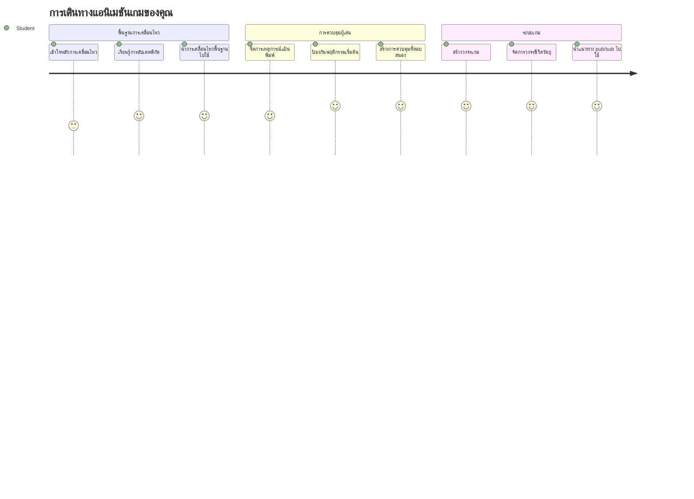
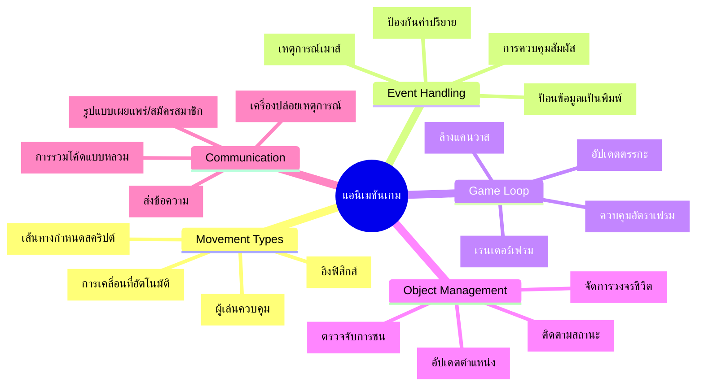
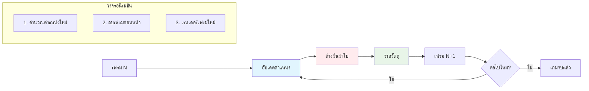
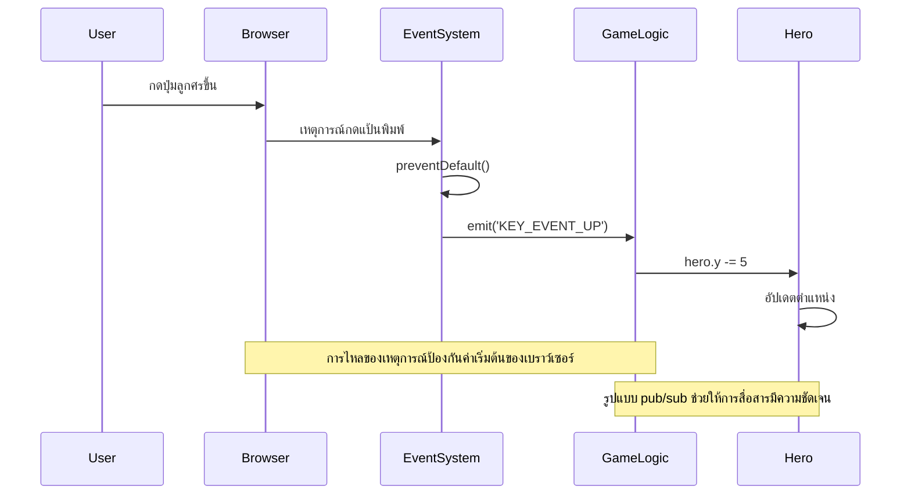
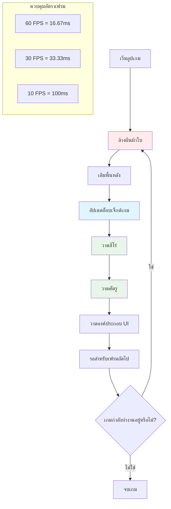
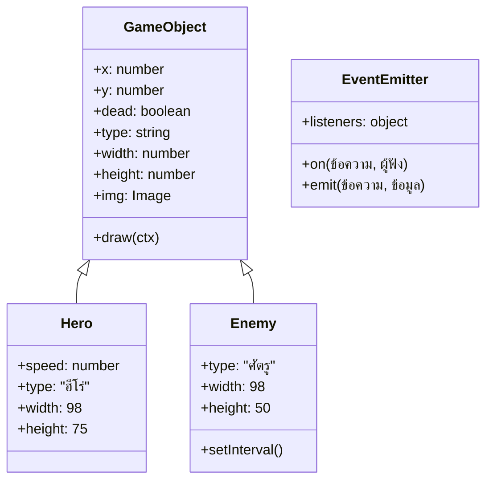
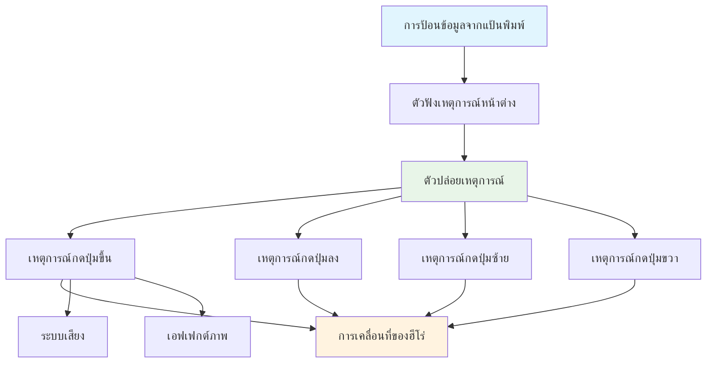
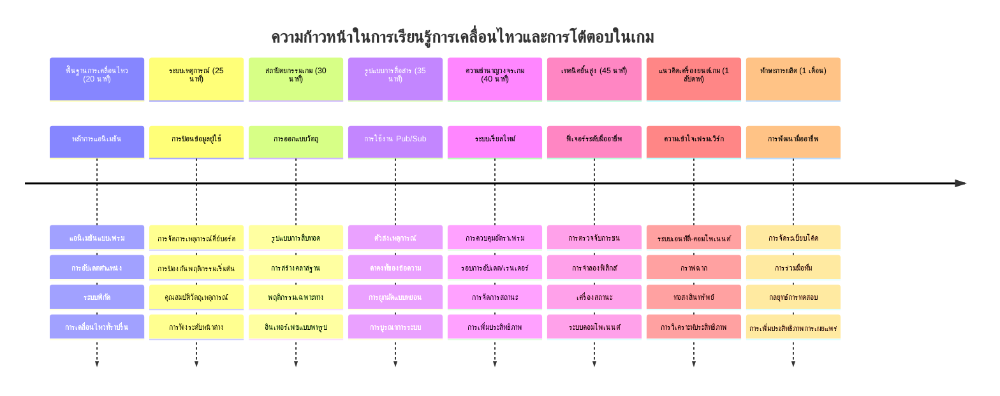

# สร้างเกมอวกาศ ตอนที่ 3: การเพิ่มการเคลื่อนที่


ลองคิดถึงเกมที่คุณชอบที่สุด – สิ่งที่ทำให้เกมเหล่านั้นน่าติดตามไม่ใช่แค่กราฟิกที่สวยงามเท่านั้น แต่คือวิธีที่ทุกอย่างเคลื่อนไหวและตอบสนองต่อการกระทำของคุณ ตอนนี้เกมอวกาศของคุณเหมือนภาพวาดที่สวยงาม แต่เรากำลังจะเพิ่มการเคลื่อนไหวที่ทำให้มันมีชีวิต

เมื่อวิศวกรของ NASA เขียนโปรแกรมคอมพิวเตอร์สำหรับการนำทางในภารกิจ Apollo พวกเขาต้องเผชิญกับความท้าทายคล้ายกัน: จะทำอย่างไรให้ยานอวกาศตอบสนองต่อการควบคุมของนักบินในขณะเดียวกันก็คงเส้นทางได้โดยอัตโนมัติ หลักการที่เราจะเรียนรู้วันนี้สะท้อนแนวคิดเหล่านั้น – การจัดการการเคลื่อนไหวที่ควบคุมโดยผู้เล่นควบคู่กับพฤติกรรมอัตโนมัติของระบบ

ในบทเรียนนี้ คุณจะได้เรียนรู้วิธีทำให้ยานอวกาศลื่นไหลผ่านหน้าจอ ตอบสนองต่อคำสั่งของผู้เล่น และสร้างรูปแบบการเคลื่อนไหวที่ราบรื่น เราจะแบ่งทุกอย่างออกเป็นแนวคิดที่เข้าใจง่ายและต่อเนื่องกันอย่างเป็นธรรมชาติ

เมื่อจบบทเรียน คุณจะมีผู้เล่นบินเรือฮีโร่ไปรอบหน้าจอ ในขณะที่เรือศัตรูก็ลาดตระเวนอยู่เหนือน่านฟ้า ที่สำคัญกว่านั้น คุณจะเข้าใจหลักการสำคัญที่ขับเคลื่อนระบบการเคลื่อนไหวของเกม


## แบบทดสอบก่อนฟังบรรยาย

[แบบทดสอบก่อนบรรยาย](https://ff-quizzes.netlify.app/web/quiz/33)

## ทำความเข้าใจการเคลื่อนไหวในเกม

เกมมีชีวิตชีวาเมื่อสิ่งต่างๆ เริ่มเคลื่อนไหว และโดยพื้นฐานมีสองวิธีที่สิ่งเหล่านี้เกิดขึ้น:

- **การเคลื่อนไหวที่ควบคุมโดยผู้เล่น**: เมื่อคุณกดปุ่มหรือคลิกเมาส์ สิ่งของบางอย่างเคลื่อนที่ นี่คือการเชื่อมโยงโดยตรงระหว่างตัวคุณกับโลกในเกม
- **การเคลื่อนไหวอัตโนมัติ**: เมื่อเกมตัดสินใจเคลื่อนไหวสิ่งของเอง เช่น เรือศัตรูที่ต้องลาดตระเวนหน้าจอไม่ว่าคุณจะทำอะไรหรือไม่ก็ตาม

การทำให้วัตถุเคลื่อนที่บนหน้าจอคอมพิวเตอร์นั้นง่ายกว่าที่คิด จำพิกัด x และ y จากชั้นเรียนคณิตศาสตร์ได้ไหม? นั่นแหละคือสิ่งที่เรากำลังทำอยู่ เมื่อกาลิเลโอเฝ้าดูดวงจันทร์ของดาวพฤหัสบดีในปี 1610 เขาก็ทำสิ่งเดียวกัน – การกำหนดตำแหน่งตามเวลาเพื่อเข้าใจรูปแบบการเคลื่อนไหว

การเคลื่อนไหวบนหน้าจอเหมือนกับการสร้างภาพเคลื่อนไหวแบบแฟลชบุ๊ก – คุณต้องปฏิบัติตามสามขั้นตอนง่ายๆ เหล่านี้:


1. **อัปเดตตำแหน่ง** – เปลี่ยนตำแหน่งของวัตถุ (เช่น เลื่อนมันไปทางขวา 5 พิกเซล)
2. **ลบเฟรมเก่า** – ล้างหน้าจอเพื่อไม่ให้เห็นเงาหรือรอยที่ไม่ต้องการ
3. **วาดเฟรมใหม่** – วางวัตถุในตำแหน่งใหม่

ทำเร็วพอ แล้วบูม! คุณจะได้การเคลื่อนไหวที่ราบรื่นและรู้สึกเป็นธรรมชาติต่อผู้เล่น

นี่คือตัวอย่างโค้ด:

```javascript
// ตั้งตำแหน่งของฮีโร่
hero.x += 5;
// ล้างสี่เหลี่ยมที่เป็นที่อยู่ของฮีโร่
ctx.clearRect(0, 0, canvas.width, canvas.height);
// วาดฉากหลังเกมและฮีโร่ใหม่
ctx.fillRect(0, 0, canvas.width, canvas.height);
ctx.fillStyle = "black";
ctx.drawImage(heroImg, hero.x, hero.y);
```

**โค้ดนี้ทำอะไร:**
- **อัปเดต** ค่าพิกัด x ของฮีโร่ให้เพิ่มขึ้น 5 พิกเซลเพื่อเคลื่อนที่ไปทางขวา
- **ล้าง** พื้นที่ของแคนวาสทั้งหมดเพื่อลบเฟรมก่อนหน้า
- **เติม** พื้นหลังของแคนวาสด้วยสีดำ
- **วาดใหม่** ภาพฮีโร่ในตำแหน่งใหม่

✅ คุณคิดได้ไหมว่าทำไมการวาดภาพฮีโร่ใหม่หลายเฟรมต่อวินาทีอาจส่งผลต่อประสิทธิภาพ? อ่านเพิ่มเติมเกี่ยวกับ [ทางเลือกของรูปแบบนี้](https://developer.mozilla.org/en-US/docs/Web/API/Canvas_API/Tutorial/Optimizing_canvas)

## การจัดการเหตุการณ์แป้นพิมพ์

นี่คือจุดที่เราต่อเชื่อมข้อมูลการป้อนจากผู้เล่นกับการกระทำในเกม เมื่อใครกดปุ่ม spacebar เพื่อยิงเลเซอร์ หรือกดปุ่มลูกศรเพื่อหลบอะสเทอรอยด์ เกมของคุณต้องตรวจจับและตอบสนองต่อข้อมูลนั้น

เหตุการณ์แป้นพิมพ์เกิดขึ้นในระดับหน้าต่างเบราว์เซอร์ หมายความว่าหน้าต่างเบราว์เซอร์ทั้งหมดจะฟังการกดปุ่มเหล่านั้น คลิกเมาส์ในทางกลับกันสามารถจับกับองค์ประกอบเฉพาะ เช่น ปุ่ม สำหรับเกมอวกาศของเรา เราจะโฟกัสที่การควบคุมด้วยแป้นพิมพ์เพราะนี่คือสิ่งที่ให้ความรู้สึกคลาสสิกแบบเกมอาร์เคด

สิ่งนี้ทำให้นึกถึงโอเปอเรเตอร์ระบบโทรเลขในช่วงปี 1800 ที่ต้องแปลงสัญญาณมอร์สให้กลายเป็นข้อความที่มีความหมาย – เราก็กำลังทำสิ่งเดียวกันคือแปลงการกดปุ่มเป็นคำสั่งเกม

ในการจัดการเหตุการณ์ คุณต้องใช้เมธอด `addEventListener()` ของวินโดวส์ พร้อมกับส่งพารามิเตอร์สองตัว ตัวแรกคือชื่อเหตุการณ์ เช่น `keyup` ตัวที่สองคือฟังก์ชันที่จะถูกเรียกใช้เมื่อเกิดเหตุการณ์

ตัวอย่างโค้ด:

```javascript
window.addEventListener('keyup', (evt) => {
  // evt.key = การแทนค่ารูปแบบสตริงของปุ่ม
  if (evt.key === 'ArrowUp') {
    // ทำบางอย่าง
  }
});
```

**สรุปสิ่งที่เกิดขึ้น:**
- **ฟัง** เหตุการณ์แป้นพิมพ์บนหน้าต่างทั้งหมด
- **รับ** อ็อบเจกต์เหตุการณ์ซึ่งมีข้อมูลว่าปุ่มไหนถูกกด
- **ตรวจสอบ** ว่าปุ่มที่กดตรงกับปุ่มที่กำหนดหรือไม่ (กรณีนี้คือปุ่มลูกศรขึ้น)
- **ดำเนินการ** โค้ดเมื่อเงื่อนไขเป็นจริง

สำหรับเหตุการณ์คีย์ มีสองคุณสมบัติในเหตุการณ์ที่คุณใช้ดูว่ากดปุ่มไหน:

- `key` - เป็นสตริงแสดงปุ่มที่กด เช่น `'ArrowUp'`
- `keyCode` - เป็นตัวเลขแสดงรหัส เช่น `37` ซึ่งหมายถึง `ArrowLeft`

✅ การจัดการเหตุการณ์คีย์มีประโยชน์นอกพัฒนาเกม คุณคิดว่าจะใช้เทคนิคนี้ทำอะไรได้อีกบ้าง?


### คีย์พิเศษ: แจ้งเตือน!

ปุ่มบางปุ่มมีพฤติกรรมในตัวของเบราว์เซอร์ที่อาจทำให้เกมของคุณมีปัญหา ปุ่มลูกศรเลื่อนหน้าเว็บ และ spacebar กระโดดลงด้านล่าง – พฤติกรรมที่คุณไม่ต้องการเวลาคนพยายามควบคุมยานอวกาศของพวกเขา

เราสามารถป้องกันพฤติกรรมเริ่มต้นเหล่านี้และปล่อยให้เกมเราเป็นคนจัดการแทน เหมือนกับที่โปรแกรมเมอร์คอมพิวเตอร์ยุคแรกต้องเขียนทับการหยุดชะงักของระบบเพื่อสร้างพฤติกรรมพิเศษ – เรากำลังทำแบบเดียวกันแต่ในระดับเบราว์เซอร์ นี่คือวิธี:

```javascript
const onKeyDown = function (e) {
  console.log(e.keyCode);
  switch (e.keyCode) {
    case 37:
    case 39:
    case 38:
    case 40: // ปุ่มลูกศร
    case 32:
      e.preventDefault();
      break; // ช่องว่าง
    default:
      break; // ไม่บล็อกปุ่มอื่น ๆ
  }
};

window.addEventListener('keydown', onKeyDown);
```

**เข้าใจโค้ดป้องกันนี้:**
- **ตรวจสอบ** รหัสคีย์ที่อาจทำให้เกิดพฤติกรรมไม่พึงประสงค์
- **ป้องกัน** พฤติกรรมเบราว์เซอร์เริ่มต้นสำหรับปุ่มลูกศรและ spacebar
- **อนุญาต** ให้ปุ่มอื่นทำงานได้ตามปกติ
- **ใช้** `e.preventDefault()` เพื่อหยุดพฤติกรรมเริ่มต้นของเบราว์เซอร์

### 🔄 **ตรวจสอบความเข้าใจเชิงการสอน**
**ความเข้าใจเกี่ยวกับการจัดการเหตุการณ์**: ก่อนย้ายไปที่การเคลื่อนไหวอัตโนมัติ ให้แน่ใจว่าคุณสามารถ:
- ✅ อธิบายความแตกต่างระหว่างเหตุการณ์ `keydown` และ `keyup`
- ✅ เข้าใจเหตุผลที่เราต้องป้องกันพฤติกรรมเริ่มต้นของเบราว์เซอร์
- ✅ อธิบายได้ว่าการฟังเหตุการณ์เชื่อมต่อกับข้อมูลป้อนของผู้ใช้อย่างไร
- ✅ ระบุได้ว่าปุ่มไหนอาจรบกวนการควบคุมเกม

**ทดสอบตัวเองแบบด่วน**: จะเกิดอะไรขึ้นถ้าคุณไม่ป้องกันพฤติกรรมเริ่มต้นของปุ่มลูกศร?
*คำตอบ: เบราว์เซอร์จะเลื่อนหน้าเว็บ ทำให้การเคลื่อนไหวในเกมเกิดการรบกวน*

**สถาปัตยกรรมระบบเหตุการณ์**: ตอนนี้คุณเข้าใจว่า:
- **การฟังในระดับหน้าต่าง**: รับเหตุการณ์ในระดับเบราว์เซอร์
- **คุณสมบัติของอ็อบเจกต์เหตุการณ์**: สตริง `key` กับตัวเลข `keyCode`
- **การป้องกันพฤติกรรมเริ่มต้น**: หยุดพฤติกรรมที่ไม่ต้องการของเบราว์เซอร์
- **ตรรกะเงื่อนไข**: ตอบสนองต่อชุดปุ่มเฉพาะ

## การเคลื่อนไหวที่เกิดจากเกม

ตอนนี้มาคุยถึงวัตถุที่เคลื่อนไหวโดยไม่มีการป้อนข้อมูลจากผู้เล่น ลองนึกถึงเรือศัตรูที่แล่นผ่านหน้าจอ กระสุนที่ยิงเป็นเส้นตรง หรือเมฆที่ลอยอยู่เบื้องหลัง การเคลื่อนไหวอิสระนี้ทำให้โลกในเกมของคุณดูมีชีวิตแม้ไม่มีใครสัมผัสการควบคุมเลย

เราจะใช้ตัวจับเวลาที่มีอยู่ใน JavaScript เพื่ออัปเดตตำแหน่งเป็นช่วงๆ แนวคิดนี้คล้ายกับนาฬิกาลูกตุ้ม – กลไกที่เรียบง่ายที่ทำงานเป็นระยะเวลาสม่ำเสมอ นี่คือตัวอย่างที่ง่าย:

```javascript
const id = setInterval(() => {
  // เคลื่อนศัตรูในแนวแกน y
  enemy.y += 10;
}, 100);
```

**โค้ดเคลื่อนไหวนี้ทำอะไร:**
- **สร้าง** ตัวจับเวลาที่ทำงานทุก 100 มิลลิวินาที
- **อัปเดต** ค่าพิกัด y ของศัตรูเพิ่มขึ้น 10 พิกเซลทุกครั้ง
- **เก็บ** รหัสตัวจับเวลาไว้เพื่อหยุดเมื่อจำเป็น
- **เคลื่อนที่** ศัตรูลงล่างบนหน้าจอโดยอัตโนมัติ

## วงจรเกม (Game Loop)

นี่คือแนวคิดที่เชื่อมทุกอย่างเข้าด้วยกัน – วงจรเกม ถ้าเกมของคุณเป็นภาพยนตร์ วงจรเกมคือเครื่องฉายภาพยนตร์ที่แสดงภาพทีละเฟรมอย่างรวดเร็วจนทุกอย่างดูเคลื่อนไหวอย่างราบรื่น

ทุกเกมมีวงจรแบบนี้ทำงานอยู่เบื้องหลัง มันเป็นฟังก์ชันที่อัปเดตวัตถุในเกมทั้งหมด วาดหน้าจอใหม่ และทำซ้ำกระบวนการนี้ตลอดเวลา เพื่อให้ติดตามฮีโร่ ศัตรู และเลเซอร์ต่างๆ ได้ทั้งหมด – สถานะของเกมโดยรวม

แนวคิดนี้ทำให้นึกถึงคนทำแอนิเมชันยุคแรกอย่าง Walt Disney ที่ต้องวาดตัวละครทีละเฟรมเพื่อสร้างภาพเคลื่อนไหว ความจริงแล้วเราแค่ใช้โค้ดแทนดินสอเท่านั้น

นี่คือตัวอย่างโค้ตเกมลูปที่ใช้บ่อย:


```javascript
const gameLoopId = setInterval(() => {
  function gameLoop() {
    ctx.clearRect(0, 0, canvas.width, canvas.height);
    ctx.fillStyle = "black";
    ctx.fillRect(0, 0, canvas.width, canvas.height);
    drawHero();
    drawEnemies();
    drawStaticObjects();
  }
  gameLoop();
}, 200);
```

**เข้าใจโครงสร้างเกมลูป:**
- **ล้าง** แคนวาสทั้งหมดเพื่อลบเฟรมก่อนหน้า
- **เติม** พื้นหลังด้วยสีทึบ
- **วาด** วัตถุทั้งหมดบนตำแหน่งปัจจุบัน
- **ทำซ้ำ** ทุก 200 มิลลิวินาทีเพื่อสร้างการเคลื่อนไหวที่ราบรื่น
- **จัดการ** อัตราเฟรมโดยควบคุมเวลาช่วง

## ต่อเนื่องกับเกมอวกาศ

ตอนนี้เราจะเพิ่มการเคลื่อนไหวให้กับฉากนิ่งที่คุณสร้างไว้ก่อนหน้า เราจะเปลี่ยนมันจากภาพนิ่งให้กลายเป็นประสบการณ์โต้ตอบได้ เราจะเดินทีละขั้นตอนเพื่อให้แต่ละชิ้นต่อเนื่องกับส่วนก่อนหน้า

ให้โหลดโค้ดที่เราเลิกไว้จากบทเรียนก่อนหน้า (หรือเริ่มใหม่จากโค้ดในโฟลเดอร์ [Part II- starter](../../../../6-space-game/3-moving-elements-around/your-work) หากต้องการเริ่มใหม่)

**นี่คือสิ่งที่เราจะสร้างวันนี้:**
- **การควบคุมฮีโร่**: ปุ่มลูกศรจะควบคุมยานอวกาศของคุณบนหน้าจอ
- **การเคลื่อนไหวศัตรู**: เรือเอเลี่ยนเหล่านั้นจะเริ่มเดินหน้า

มาเริ่มลงมือเพิ่มฟีเจอร์เหล่านี้กัน

## ขั้นตอนแนะนำ

ค้นหาไฟล์ที่ถูกสร้างให้คุณในโฟลเดอร์ย่อย `your-work` ซึ่งควรมีดังนี้:

```bash
-| assets
  -| enemyShip.png
  -| player.png
-| index.html
-| app.js
-| package.json
```

เริ่มโปรเจกต์ในโฟลเดอร์ `your-work` ด้วยคำสั่ง:

```bash
cd your-work
npm start
```

**คำสั่งนี้ทำอะไร:**
- **เปลี่ยน** ไปที่ไดเรกทอรีโปรเจกต์ของคุณ
- **เริ่ม** เซิร์ฟเวอร์ HTTP ที่อยู่ `http://localhost:5000`
- **ให้บริการ** ไฟล์เกมของคุณเพื่อทดสอบในเบราว์เซอร์

คำสั่งข้างต้นจะเริ่มเซิร์ฟเวอร์ HTTP ที่อยู่ `http://localhost:5000` เปิดเบราว์เซอร์และใส่ URL นี้ ตอนนี้ควรแสดงฮีโร่และศัตรูทั้งหมด แต่ยังไม่มีการเคลื่อนไหว!

### เพิ่มโค้ด

1. **เพิ่มวัตถุเฉพาะ** สำหรับ `hero` และ `enemy` และ `game object` แต่ละอันควรมีคุณสมบัติ `x` และ `y` (จำหัวข้อ [สืบทอดหรือประกอบ](../README.md) ไว้ด้วย)

   *เคล็ดลับ* `game object` ควรเป็นตัวเดียวที่มี `x` และ `y` และสามารถวาดตัวเองบนแคนวาสได้

   > **คำแนะนำ**: เริ่มด้วยการเพิ่มคลาส `GameObject` ใหม่ พร้อมตัวสร้างที่กำหนดไว้ดังนี้ จากนั้นวาดมันลงบนแคนวาส:

    ```javascript
    class GameObject {
      constructor(x, y) {
        this.x = x;
        this.y = y;
        this.dead = false;
        this.type = "";
        this.width = 0;
        this.height = 0;
        this.img = undefined;
      }
    
      draw(ctx) {
        ctx.drawImage(this.img, this.x, this.y, this.width, this.height);
      }
    }
    ```

    **เข้าใจคลาสฐานนี้:**
    - **กำหนด** คุณสมบัติทั่วไปที่วัตถุเกมทั้งหมดใช้ร่วมกัน (ตำแหน่ง, ขนาด, รูปภาพ)
    - **รวม** ธง `dead` เพื่อติดตามว่าวัตถุควรถูกลบหรือไม่
    - **ให้** เมธอด `draw()` เพื่อวาดวัตถุลงบนแคนวาส
    - **ตั้งค่า** ค่าเริ่มต้นสำหรับคุณสมบัติทั้งหมดที่คลาสลูกสามารถเขียนทับได้


    ตอนนี้ ขยายคลาส `GameObject` เพื่อสร้าง `Hero` และ `Enemy`:
    
    ```javascript
    class Hero extends GameObject {
      constructor(x, y) {
        super(x, y);
        this.width = 98;
        this.height = 75;
        this.type = "Hero";
        this.speed = 5;
      }
    }
    ```

    ```javascript
    class Enemy extends GameObject {
      constructor(x, y) {
        super(x, y);
        this.width = 98;
        this.height = 50;
        this.type = "Enemy";
        const id = setInterval(() => {
          if (this.y < canvas.height - this.height) {
            this.y += 5;
          } else {
            console.log('Stopped at', this.y);
            clearInterval(id);
          }
        }, 300);
      }
    }
    ```

    **ความคิดสำคัญในคลาสเหล่านี้:**
    - **สืบทอด** จาก `GameObject` ด้วยคีย์เวิร์ด `extends`
    - **เรียก** ตัวสร้างของตัวแม่ด้วย `super(x, y)`
    - **กำหนด** ขนาดและคุณสมบัติเฉพาะสำหรับแต่ละประเภทวัตถุ
    - **ดำเนินการ** การเคลื่อนไหวอัตโนมัติสำหรับศัตรูโดยใช้ `setInterval()`

2. **เพิ่มตัวจัดการเหตุการณ์คีย์** เพื่อควบคุมการนำทาง (เคลื่อนฮีโร่ขึ้น/ลง ซ้าย/ขวา)

   *จำไว้* ว่านี่คือระบบพิกัดคาร์ทีเซียน โดยตำแหน่งมุมบนซ้ายคือ `0,0` อย่าลืมเพิ่มโค้ดหยุด *พฤติกรรมเริ่มต้น*

   > **คำแนะนำ**: สร้างฟังก์ชัน `onKeyDown` และแนบเข้ากับวินโดวส์:

   ```javascript
   const onKeyDown = function (e) {
     console.log(e.keyCode);
     // เพิ่มโค้ดจากบทเรียนข้างต้นเพื่อหยุดพฤติกรรมเริ่มต้น
     switch (e.keyCode) {
       case 37:
       case 39:
       case 38:
       case 40: // ปุ่มลูกศร
       case 32:
         e.preventDefault();
         break; // ช่องว่าง
       default:
         break; // อย่าบล็อกปุ่มอื่น ๆ
     }
   };

   window.addEventListener("keydown", onKeyDown);
   ```
    
   **ตัวจัดการเหตุการณ์นี้ทำอะไร:**
   - **ฟัง** เหตุการณ์ keydown บนหน้าต่างทั้งหมด
   - **บันทึก** รหัสปุ่มเพื่อช่วยดีบักว่าปุ่มไหนถูกกด
   - **ป้องกัน** พฤติกรรมเริ่มต้นของเบราว์เซอร์สำหรับลูกศรและ spacebar
   - **ปล่อย** ให้ปุ่มอื่นทำงานตามปกติ
   
   ตรวจสอบคอนโซลเบราว์เซอร์ตอนนี้และดูการพิมพ์ปุ่มที่ถูกกด

3. **ดำเนินการ** [รูปแบบ Pub sub](../README.md) เพื่อให้โค้ดสะอาดตามส่วนที่เหลือ

   รูปแบบ Publish-Subscribe ช่วยจัดระเบียบโค้ดโดยแยกการตรวจจับเหตุการณ์ออกจากการจัดการเหตุการณ์ ทำให้โค้ดแยกส่วนง่ายและดูแลรักษาง่าย

   ทำส่วนสุดท้ายนี้โดย:

   1. **เพิ่มตัวฟังเหตุการณ์** บนวินโดวส์:

       ```javascript
       window.addEventListener("keyup", (evt) => {
         if (evt.key === "ArrowUp") {
           eventEmitter.emit(Messages.KEY_EVENT_UP);
         } else if (evt.key === "ArrowDown") {
           eventEmitter.emit(Messages.KEY_EVENT_DOWN);
         } else if (evt.key === "ArrowLeft") {
           eventEmitter.emit(Messages.KEY_EVENT_LEFT);
         } else if (evt.key === "ArrowRight") {
           eventEmitter.emit(Messages.KEY_EVENT_RIGHT);
         }
       });
       ```

   **ระบบเหตุการณ์นี้ทำอะไร:**
   - **ตรวจจับ** ข้อมูลแป้นพิมพ์และแปลงเป็นเหตุการณ์เกมส่วนตัว
   - **แยก** การตรวจจับข้อมูลกับตรรกะของเกมออกจากกัน
   - **ทำให้** เปลี่ยนการควบคุมในภายหลังได้ง่ายโดยไม่กระทบโค้ดเกม
   - **อนุญาต** ระบบหลายตัวตอบสนองข้อมูลเดียวกันได้


   2. **สร้างคลาส EventEmitter** เพื่อเผยแพร่และสมัครรับข้อความ:

       ```javascript
       class EventEmitter {
         constructor() {
           this.listeners = {};
         }
       
         on(message, listener) {
           if (!this.listeners[message]) {
             this.listeners[message] = [];
           }
           this.listeners[message].push(listener);
         }
       
   3. **เพิ่มคอนสแตนต์** และตั้งค่า EventEmitter:

       ```javascript
       const Messages = {
         KEY_EVENT_UP: "KEY_EVENT_UP",
         KEY_EVENT_DOWN: "KEY_EVENT_DOWN",
         KEY_EVENT_LEFT: "KEY_EVENT_LEFT",
         KEY_EVENT_RIGHT: "KEY_EVENT_RIGHT",
       };
       
       let heroImg, 
           enemyImg, 
           laserImg,
           canvas, ctx, 
           gameObjects = [], 
           hero, 
           eventEmitter = new EventEmitter();
       ```

   **เข้าใจการตั้งค่า:**
   - **กำหนด** ค่าคงที่ของข้อความเพื่อหลีกเลี่ยงการพิมพ์ผิดและง่ายต่อการแก้ไขโค้ด
   - **ประกาศ** ตัวแปรสำหรับภาพ แคนวาส และสถานะเกม
   - **สร้าง** อีเวนต์อีมิตเตอร์แบบทั่วโลกสำหรับระบบ pub-sub
   - **กำหนดค่าเริ่มต้น** อาร์เรย์เพื่อเก็บวัตถุในเกมทั้งหมด

   4. **เริ่มต้นเกม**

       ```javascript
       function initGame() {
         gameObjects = [];
         createEnemies();
         createHero();
       
         eventEmitter.on(Messages.KEY_EVENT_UP, () => {
           hero.y -= 5;
         });
       
         eventEmitter.on(Messages.KEY_EVENT_DOWN, () => {
           hero.y += 5;
         });
       
         eventEmitter.on(Messages.KEY_EVENT_LEFT, () => {
           hero.x -= 5;
         });
       
4. **ตั้งค่าลูปเกม**

   ปรับโค้ดฟังก์ชัน `window.onload` ให้เริ่มต้นเกมและตั้งค่าลูปเกมในช่วงเวลาที่เหมาะสม คุณจะเพิ่มลำแสงเลเซอร์ด้วย:

    ```javascript
    window.onload = async () => {
      canvas = document.getElementById("canvas");
      ctx = canvas.getContext("2d");
      heroImg = await loadTexture("assets/player.png");
      enemyImg = await loadTexture("assets/enemyShip.png");
      laserImg = await loadTexture("assets/laserRed.png");
    
      initGame();
      const gameLoopId = setInterval(() => {
        ctx.clearRect(0, 0, canvas.width, canvas.height);
        ctx.fillStyle = "black";
        ctx.fillRect(0, 0, canvas.width, canvas.height);
        drawGameObjects(ctx);
      }, 100);
    };
    ```

   **ทำความเข้าใจการตั้งค่าเกม:**
   - **รอ** ให้หน้าเว็บโหลดเสร็จสมบูรณ์ก่อนเริ่ม
   - **รับ** อิลิเมนต์แคนวาสและคอนเท็กซ์ 2D ของมัน
   - **โหลด** ไฟล์รูปภาพทั้งหมดแบบไม่ประสานโดยใช้ `await`
   - **เริ่ม** ลูปเกมทำงานที่ช่วงเวลา 100 มิลลิวินาที (10 เฟรมต่อวินาที)
   - **ล้าง** และวาดใหม่ทั้งหน้าจอในแต่ละเฟรม

5. **เพิ่มโค้ด** เพื่อให้ศัตรูเคลื่อนที่ในช่วงเวลาที่กำหนด

    ปรับโค้ดฟังก์ชัน `createEnemies()` เพื่อสร้างศัตรูและเพิ่มพวกมันเข้าในคลาส gameObjects ใหม่:

    ```javascript
    function createEnemies() {
      const MONSTER_TOTAL = 5;
      const MONSTER_WIDTH = MONSTER_TOTAL * 98;
      const START_X = (canvas.width - MONSTER_WIDTH) / 2;
      const STOP_X = START_X + MONSTER_WIDTH;
    
      for (let x = START_X; x < STOP_X; x += 98) {
        for (let y = 0; y < 50 * 5; y += 50) {
          const enemy = new Enemy(x, y);
          enemy.img = enemyImg;
          gameObjects.push(enemy);
        }
      }
    }
    ```

    **สิ่งที่การสร้างศัตรูทำ:**
    - **คำนวณ** ตำแหน่งเพื่อวางศัตรูให้อยู่กึ่งกลางหน้าจอ
    - **สร้าง** ตารางศัตรูโดยใช้ลูปซ้อนกัน
    - **กำหนด** รูปภาพศัตรูให้แก่แต่ละวัตถุศัตรู
    - **เพิ่ม** ศัตรูแต่ละตัวเข้าอาร์เรย์วัตถุเกมรวม
    
    และเพิ่มฟังก์ชัน `createHero()` เพื่อดำเนินการคล้ายกับฮีโร่
    
    ```javascript
    function createHero() {
      hero = new Hero(
        canvas.width / 2 - 45,
        canvas.height - canvas.height / 4
      );
      hero.img = heroImg;
      gameObjects.push(hero);
    }
    ```

    **สิ่งที่การสร้างฮีโร่ทำ:**
    - **วางตำแหน่ง** ฮีโร่ที่กึ่งกลางล่างของหน้าจอ
    - **กำหนด** รูปภาพฮีโร่ให้กับวัตถุฮีโร่
    - **เพิ่ม** ฮีโร่เข้าอาร์เรย์วัตถุเกมเพื่อให้สามารถวาดได้

    และสุดท้าย เพิ่มฟังก์ชัน `drawGameObjects()` เพื่อเริ่มต้นการวาด:

    ```javascript
    function drawGameObjects(ctx) {
      gameObjects.forEach(go => go.draw(ctx));
    }
    ```

    **ทำความเข้าใจฟังก์ชันวาด:**
    - **วนลูป** ผ่านวัตถุเกมทั้งหมดในอาร์เรย์
    - **เรียก** เมธอด `draw()` ในแต่ละวัตถุ
    - **ส่งผ่าน** คอนเท็กซ์ของแคนวาสเพื่อให้วัตถุวาดตัวเองได้

    ### 🔄 **ตรวจสอบความเข้าใจเชิงการสอน**
    **ความเข้าใจระบบเกมครบถ้วน**: ตรวจสอบความชำนาญของคุณในสถาปัตยกรรมทั้งหมด:
    - ✅ การสืบทอดทำให้ Hero และ Enemy แชร์คุณสมบัติของ GameObject ได้อย่างไร?
    - ✅ ทำไมรูปแบบ pub/sub ถึงทำให้โค้ดของคุณดูแลรักษาง่ายขึ้น?
    - ✅ ลูปเกมมีบทบาทอย่างไรในการสร้างอนิเมชันที่ลื่นไหล?
    - ✅ ตัวฟังเหตุการณ์เชื่อมโยงการป้อนข้อมูลของผู้ใช้เข้ากับพฤติกรรมของวัตถุเกมอย่างไร?

    **การบูรณาการระบบ**: เกมของคุณตอนนี้แสดงให้เห็น:
    - **การออกแบบเชิงวัตถุ**: คลาสแม่พร้อมการสืบทอดเฉพาะทาง
    - **สถาปัตยกรรมขับเคลื่อนด้วยเหตุการณ์**: รูปแบบ pub/sub เพื่อความยืดหยุ่น
    - **กรอบอนิเมชัน**: ลูปเกมกับการอัปเดตเฟรมที่สม่ำเสมอ
    - **ระบบป้อนข้อมูล**: กิจกรรมแป้นพิมพ์พร้อมการป้องกันค่าดีฟอลต์
    - **การจัดการทรัพยากร**: การโหลดภาพและการแสดงสไปรต์

    **รูปแบบมืออาชีพ**: คุณได้ดำเนินการ:
    - **แยกหน้าที่อย่างชัดเจน**: แยกอินพุต, โลจิก และการวาดออกจากกัน
    - **พอลิมอร์ฟิซึม**: ทุกวัตถุเกมแชร์อินเทอร์เฟซการวาดเดียวกัน
    - **การส่งผ่านข้อความ**: การสื่อสารที่สะอาดระหว่างองค์ประกอบต่างๆ
    - **การจัดการทรัพยากร**: การจัดการสไปรต์และอนิเมชันอย่างมีประสิทธิภาพ

    ศัตรูของคุณควรเริ่มต้นเคลื่อนที่เข้าหายานอวกาศของฮีโร่แล้ว!
      }
    }
    ```
    
    and add a `createHero()` function to do a similar process for the hero.
    
    ```javascript
    function createHero() {
      hero = new Hero(
        canvas.width / 2 - 45,
        canvas.height - canvas.height / 4
      );
      hero.img = heroImg;
      gameObjects.push(hero);
    }
    ```

    และสุดท้าย เพิ่มฟังก์ชัน `drawGameObjects()` เพื่อเริ่มต้นการวาด:

    ```javascript
    function drawGameObjects(ctx) {
      gameObjects.forEach(go => go.draw(ctx));
    }
    ```

    ศัตรูของคุณควรเริ่มต้นเคลื่อนที่เข้าหายานอวกาศของฮีโร่แล้ว!

---

## ความท้าทาย GitHub Copilot Agent 🚀

นี่คือความท้าทายที่จะช่วยปรับแต่งเกมของคุณ: การเพิ่มขอบเขตและการควบคุมที่ลื่นไหล ขณะนี้ ฮีโร่ของคุณสามารถบินออกนอกหน้าจอได้ และการเคลื่อนไหวอาจรู้สึกกระตุก

**ภารกิจของคุณ:** ทำให้ยานอวกาศของคุณรู้สึกสมจริงมากขึ้นด้วยการเพิ่มขอบเขตจอและการเคลื่อนไหวที่ลื่นไหล เหมือนกับระบบการควบคุมการบินของ NASA ที่ป้องกันไม่ให้ยานเกินพารามิเตอร์การทำงานที่ปลอดภัย

**สิ่งที่ต้องสร้าง:** สร้างระบบที่รักษายานอวกาศฮีโร่ให้คงอยู่ในหน้าจอ และทำให้การควบคุมรู้สึกลื่นไหล เมื่อผู้เล่นกดปุ่มลูกศรค้างไว้ ยานควรเคลื่อนต่อเนื่องแทนการเคลื่อนเป็นขั้นๆ ลองเพิ่มสัญญาณภาพเมื่อยานถึงขอบหน้าจอ – เช่น เอฟเฟกต์เบาๆ เพื่อบอกขอบเขตพื้นที่เล่น

เรียนรู้เพิ่มเติมเกี่ยวกับ [โหมด agent](https://code.visualstudio.com/blogs/2025/02/24/introducing-copilot-agent-mode) ที่นี่

## 🚀 ความท้าทาย

การจัดระเบียบโค้ดสำคัญขึ้นเรื่อยๆ เมื่อโปรเจกต์โตขึ้น คุณอาจสังเกตเห็นไฟล์ของคุณแน่นไปด้วยฟังก์ชัน, ตัวแปร และคลาสที่ผสมกัน นี่เตือนฉันถึงวิธีที่วิศวกรโค้ดของภารกิจ Apollo ต้องสร้างระบบที่ชัดเจนและดูแลรักษาง่ายซึ่งทีมหลายทีมสามารถทำงานพร้อมกันได้

**ภารกิจของคุณ:**
คิดเหมือนสถาปนิกซอฟต์แวร์ คุณจะจัดระเบียบโค้ดอย่างไรเพื่อให้หลังจากหกเดือน คุณ (หรือเพื่อนร่วมงาน) สามารถเข้าใจสิ่งที่เกิดขึ้น แม้ตอนนี้ทุกอย่างจะยังอยู่ในไฟล์เดียว คุณก็ยังสามารถจัดระเบียบได้ดีขึ้นโดย:

- **จัดกลุ่มฟังก์ชันที่เกี่ยวข้อง** ด้วยหัวข้อคอมเมนต์ที่ชัดเจน
- **แยกหน้าที่กัน** - แยกโลจิกเกมออกจากการวาด
- **ใช้การตั้งชื่อตัวแปรและฟังก์ชันที่สม่ำเสมอ**
- **สร้างโมดูล** หรือเนมสเปซเพื่อจัดการส่วนต่างๆ ของเกม
- **เพิ่มเอกสาร** อธิบายจุดประสงค์ของแต่ละส่วนหลัก

**คำถามสะท้อนความคิด:**
- ส่วนใดของโค้ดที่คุณเข้าใจยากที่สุดเวลาคุณกลับมาดูอีกครั้ง?
- คุณจะจัดระเบียบโค้ดยังไงเพื่อให้ง่ายต่อการมีส่วนร่วมของผู้อื่น?
- จะเกิดอะไรขึ้นถ้าคุณต้องการเพิ่มฟีเจอร์ใหม่ๆ เช่น power-ups หรือศัตรูประเภทใหม่?

## แบบทดสอบหลังเรียน

[แบบทดสอบหลังเรียน](https://ff-quizzes.netlify.app/web/quiz/34)

## รีวิว & เรียนรู้ด้วยตนเอง

เราสร้างทุกอย่างตั้งแต่เริ่มต้น ซึ่งดีมากสำหรับการเรียนรู้ แต่มีความลับอยู่ – มีเฟรมเวิร์ก JavaScript ที่ยอดเยี่ยมหลายตัวที่ช่วยจัดการงานหนักให้คุณได้ เมื่อคุณชำนาญพื้นฐานที่เราเรียนไปแล้ว ก็คุ้มค่าที่จะ [สำรวจสิ่งที่มีอยู่](https://github.com/collections/javascript-game-engines)

คิดว่าเฟรมเวิร์กเหมือนกล่องเครื่องมือที่เต็มไปด้วยเครื่องมือ แทนที่จะทำเครื่องมือทุกชิ้นด้วยมือเอง พวกมันช่วยแก้ปัญหาการจัดระเบียบโค้ดที่เราพูดถึง รวมถึงให้ฟีเจอร์ที่จะใช้เวลาหลายสัปดาห์ถ้าสร้างเอง

**สิ่งที่ควรสำรวจ:**
- วิธีที่เอนจินเกมจัดระเบียบโค้ด – คุณจะทึ่งกับรูปแบบสุดเจ๋งที่เขาใช้
- เทคนิคประสิทธิภาพสำหรับเกมแคนวาสให้เล่นลื่นไหล
- ฟีเจอร์ JavaScript สมัยใหม่ที่ทำให้โค้ดสะอาดและดูแลง่ายขึ้น
- แนวทางต่างๆ ในการจัดการวัตถุเกมและความสัมพันธ์ของมัน

## 🎯 กรอบเวลาการเชี่ยวชาญอนิเมชันเกมของคุณ


### 🛠️ สรุปชุดเครื่องมือพัฒนาเกมของคุณ

หลังจากจบบทเรียนนี้ คุณได้ชำนาญ:
- **หลักการอนิเมชัน**: การเคลื่อนไหวแบบเฟรมและการเปลี่ยนผ่านที่ลื่นไหล
- **โปรแกรมขับเคลื่อนด้วยเหตุการณ์**: การจัดการอินพุตด้วยแป้นพิมพ์แบบมีการจัดการเหตุการณ์ถูกต้อง
- **การออกแบบเชิงวัตถุ**: โครงสร้างการสืบทอดและอินเทอร์เฟซพอลิมอร์ฟิก
- **รูปแบบการสื่อสาร**: สถาปัตยกรรม pub/sub เพื่อโค้ดที่ดูแลรักษาง่าย
- **โครงสร้างลูปเกม**: การอัปเดตและวาดภาพแบบเรียลไทม์
- **ระบบอินพุต**: การแมปการควบคุมผู้ใช้พร้อมป้องกันพฤติกรรมดีฟอลต์
- **การจัดการทรัพยากร**: การโหลดสไปรต์และเทคนิคการเรนเดอร์ที่มีประสิทธิภาพ

### ⚡ **สิ่งที่คุณทำได้ใน 5 นาทีถัดไป**
- [ ] เปิดคอนโซลในเบราว์เซอร์แล้วลอง `addEventListener('keydown', console.log)` เพื่อตรวจเหตุการณ์แป้นพิมพ์
- [ ] สร้าง div ง่ายๆ แล้วเคลื่อนย้ายโดยใช้ปุ่มลูกศร
- [ ] ทดลองใช้ `setInterval` เพื่อสร้างการเคลื่อนที่ต่อเนื่อง
- [ ] ลองป้องกันพฤติกรรมดีฟอลต์ด้วย `event.preventDefault()`

### 🎯 **สิ่งที่ทำได้ในชั่วโมงนี้**
- [ ] ทำแบบทดสอบหลังเรียนและเข้าใจโปรแกรมขับเคลื่อนด้วยเหตุการณ์
- [ ] สร้างยานฮีโร่ที่เคลื่อนที่ได้ด้วยแป้นพิมพ์ครบถ้วน
- [ ] ใช้รูปแบบการเคลื่อนที่ศัตรูที่ลื่นไหล
- [ ] เพิ่มขอบเขตไม่ให้วัตถุเกมออกนอกหน้าจอ
- [ ] สร้างระบบตรวจจับการชนเบื้องต้นระหว่างวัตถุเกม

### 📅 **การเดินทางอนิเมชันตลอดสัปดาห์ของคุณ**
- [ ] สร้างเกมอวกาศเต็มรูปแบบที่มีการเคลื่อนไหวและปฏิสัมพันธ์ที่ปรับแต่งแล้ว
- [ ] เพิ่มรูปแบบการเคลื่อนที่ขั้นสูง เช่น เส้นโค้ง, การเร่งความเร็ว และฟิสิกส์
- [ ] สร้างการเปลี่ยนผ่านและฟังก์ชัน easing ที่ลื่นไหล
- [ ] สร้างเอฟเฟกต์อนุภาคและระบบสัญญาณภาพ
- [ ] ปรับประสิทธิภาพเกมให้เล่นลื่นไหลที่ 60fps
- [ ] เพิ่มการควบคุมด้วยสัมผัสมือถือและดีไซน์ตอบสนอง

### 🌟 **การพัฒนาแบบอินเทอร์แอคทีฟตลอดเดือนของคุณ**
- [ ] สร้างแอปพลิเคชันเชิงโต้ตอบซับซ้อนด้วยระบบอนิเมชันขั้นสูง
- [ ] เรียนรู้ไลบรารีอนิเมชันเช่น GSAP หรือสร้างเอนจินอนิเมชันของตัวเอง
- [ ] มีส่วนร่วมพัฒนาเกมและโปรเจกต์อนิเมชันแบบโอเพนซอร์ส
- [ ] เชี่ยวชาญการปรับประสิทธิภาพสำหรับแอปกราฟิกหนัก
- [ ] สร้างเนื้อหาการเรียนรู้เกี่ยวกับการพัฒนาเกมและอนิเมชัน
- [ ] สร้างพอร์ตโฟลิโอแสดงทักษะโปรแกรมเชิงโต้ตอบขั้นสูง

**แอปพลิเคชันจริง:** ทักษะอนิเมชันเกมของคุณนำไปใช้ได้กับ:
- **เว็บแอปพลิเคชันเชิงโต้ตอบ**: แดชบอร์ดแบบไดนามิกและอินเทอร์เฟซเรียลไทม์
- **การแสดงข้อมูล**: แผนภูมิอนิเมชันและกราฟิกเชิงโต้ตอบ
- **ซอฟต์แวร์การศึกษา**: การจำลองเชิงโต้ตอบและเครื่องมือเรียนรู้
- **พัฒนามือถือ**: เกมสัมผัสและการจัดการท่าทาง
- **แอปเดสก์ท็อป**: แอป Electron พร้อมอนิเมชันลื่นไหล
- **อนิเมชันเว็บ**: ไลบรารีอนิเมชัน CSS และ JavaScript

**ทักษะมืออาชีพที่ได้รับ:** ตอนนี้คุณสามารถ:
- **ออกแบบสถาปัตยกรรม** ระบบขับเคลื่อนด้วยเหตุการณ์ที่ปรับขยายได้ตามความซับซ้อน
- **สร้างอนิเมชันลื่นไหล** โดยใช้หลักคณิตศาสตร์
- **ดีบัก** ระบบปฏิสัมพันธ์ซับซ้อนด้วยเครื่องมือพัฒนาในเบราว์เซอร์
- **ปรับประสิทธิภาพ** เกมสำหรับอุปกรณ์และเบราว์เซอร์ต่างๆ
- **ออกแบบ** โครงสร้างโค้ดที่ดูแลรักษาได้โดยใช้รูปแบบที่พิสูจน์แล้ว

**ความเข้าใจแนวคิดพัฒนาเกม:**
- **การจัดการเฟรมเรต**: เข้าใจ FPS และการควบคุมเวลา
- **การจัดการอินพุต**: ระบบเหตุการณ์และแป้นพิมพ์ข้ามแพลตฟอร์ม
- **วงจรชีวิตวัตถุ**: รูปแบบการสร้าง, อัปเดต และทำลาย
- **การซิงโครไนซ์สถานะ**: รักษาสถานะเกมให้สอดคล้องระหว่างเฟรม
- **สถาปัตยกรรมเหตุการณ์**: การสื่อสารแบบแยกส่วนระหว่างระบบเกม

**ขั้นถัดไป:** คุณพร้อมเพิ่มระบบตรวจจับการชน, ระบบคะแนน, เอฟเฟกต์เสียง หรือสำรวจเฟรมเวิร์กเกมสมัยใหม่ เช่น Phaser หรือ Three.js!

🌟 **ความสำเร็จ:** คุณได้สร้างระบบเกมเชิงโต้ตอบครบสมบูรณ์ด้วยสถาปัตยกรรมมืออาชีพแล้ว!

## การบ้าน

[คอมเมนต์โค้ดของคุณ](assignment.md)

---

<!-- CO-OP TRANSLATOR DISCLAIMER START -->
**ข้อจำกัดความรับผิดชอบ**:
เอกสารนี้ได้รับการแปลโดยใช้บริการแปลด้วย AI [Co-op Translator](https://github.com/Azure/co-op-translator) แม้ว่าเราจะพยายามให้ความถูกต้องสูงสุด แต่โปรดทราบว่าการแปลอัตโนมัติอาจมีข้อผิดพลาดหรือความไม่แม่นยำ เอกสารต้นฉบับในภาษาต้นทางควรถูกพิจารณาเป็นแหล่งข้อมูลที่เชื่อถือได้ สำหรับข้อมูลที่สำคัญ ขอแนะนำให้ใช้บริการแปลโดยมนุษย์มืออาชีพ เราไม่รับผิดชอบต่อความเข้าใจผิดหรือการตีความผิดใดๆ ที่เกิดจากการใช้การแปลนี้
<!-- CO-OP TRANSLATOR DISCLAIMER END -->