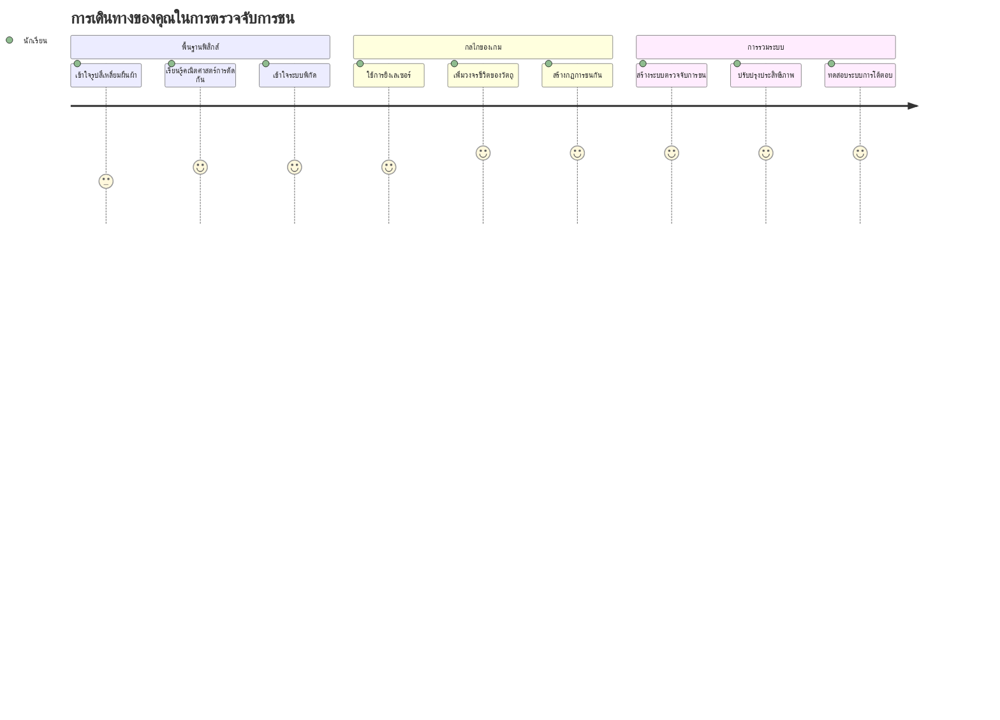
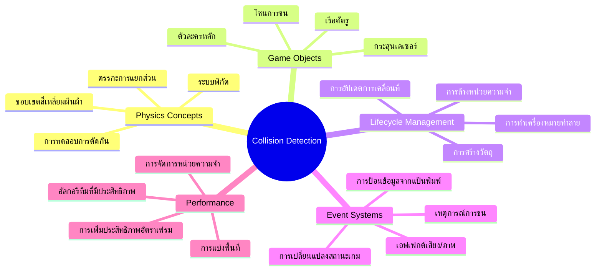
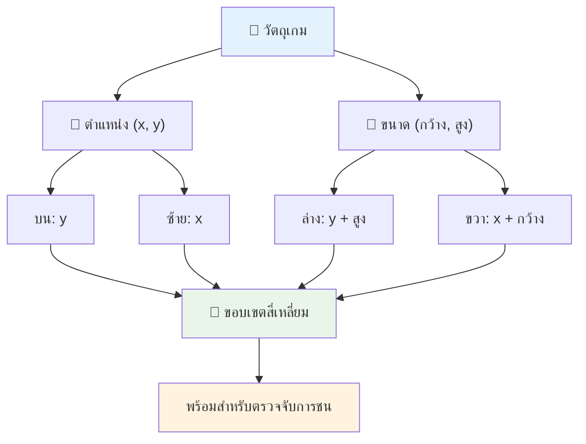
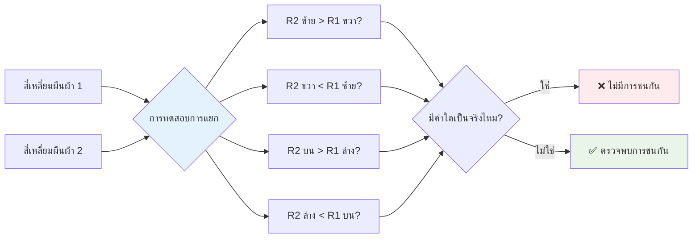
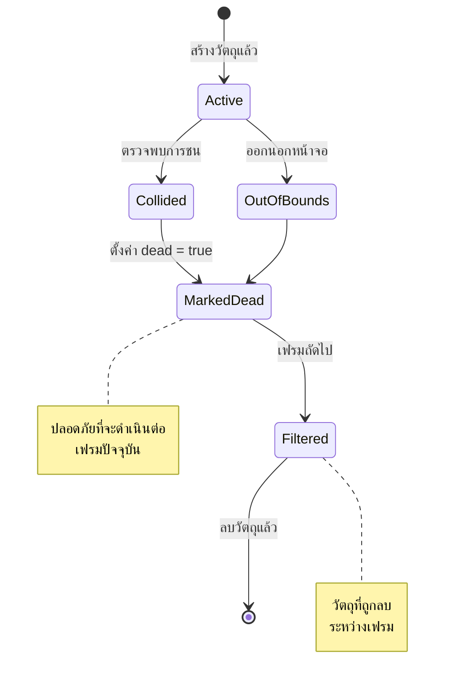
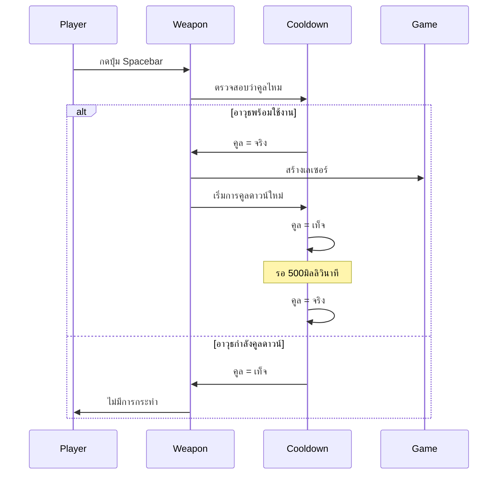
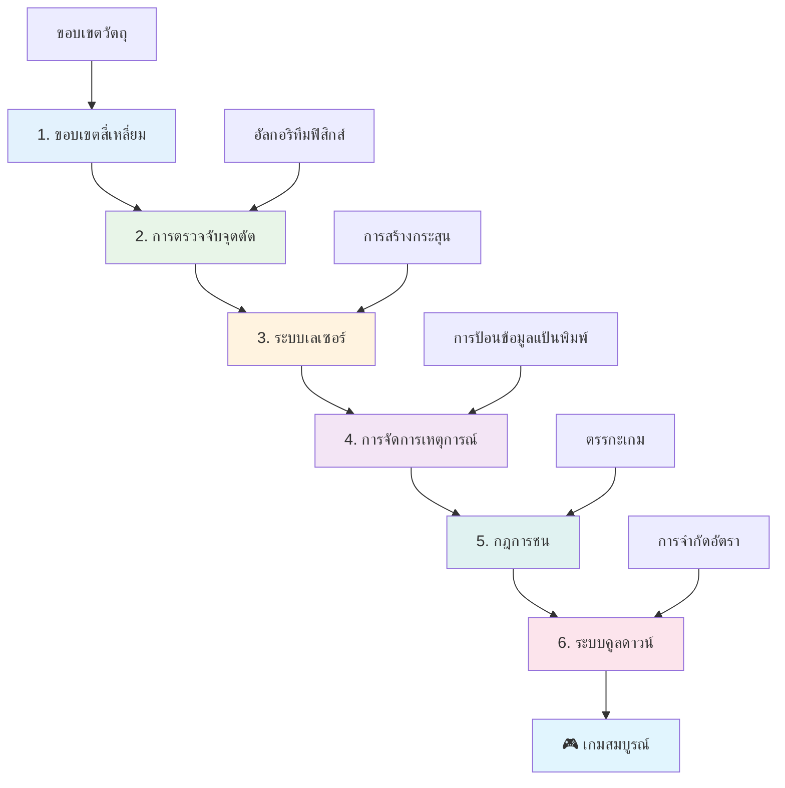
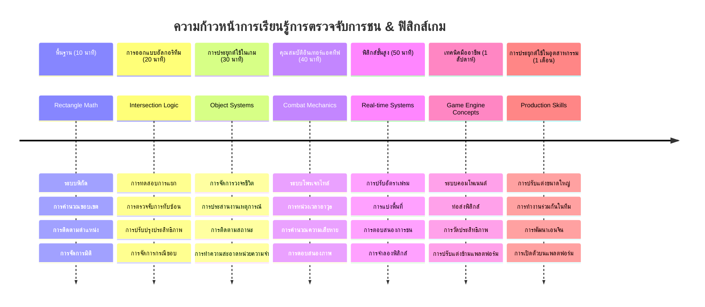

# สร้างเกมอวกาศ ตอนที่ 4: เพิ่มเลเซอร์และตรวจจับการชน


## แบบทดสอบก่อนการบรรยาย

[แบบทดสอบก่อนการบรรยาย](https://ff-quizzes.netlify.app/web/quiz/35)

ลองนึกถึงช่วงเวลาหนึ่งใน Star Wars ที่หลุมจรวดโปรตอนของลุคยิงโดนช่องระบายของดาวมรณะ การตรวจจับการชนที่แม่นยำนี้เปลี่ยนแปลงชะตากรรมของกาแล็กซี! ในเกม การตรวจจับการชนทำงานในลักษณะเดียวกัน - ซึ่งจะตัดสินว่าเมื่อไหร่ที่วัตถุมีปฏิสัมพันธ์และเกิดอะไรขึ้นต่อไป

ในบทเรียนนี้ คุณจะเพิ่มอาวุธเลเซอร์ให้กับเกมอวกาศของคุณและใช้งานระบบตรวจจับการชน คล้ายกับที่ผู้วางแผนภารกิจของ NASA คำนวณเส้นทางของยานอวกาศเพื่อหลีกเลี่ยงเศษซาก คุณจะได้เรียนรู้การตรวจจับเมื่อวัตถุในเกมทับซ้อนกัน เราจะแบ่งออกเป็นขั้นตอนที่จัดการได้ง่ายและต่อยอดกัน

เมื่อจบบทเรียนนี้ คุณจะมีระบบการต่อสู้ทำงานได้ที่เลเซอร์ทำลายศัตรู และการชนกระตุ้นเหตุการณ์ในเกม หลักการตรวจจับการชนนี้ถูกใช้ในทุกอย่างตั้งแต่การจำลองฟิสิกส์จนถึงอินเตอร์เฟซเว็บแบบโต้ตอบ


✅ ทำการค้นคว้าเล็กน้อยเกี่ยวกับเกมคอมพิวเตอร์เกมแรกสุดที่เคยถูกเขียนขึ้น ฟังก์ชันการทำงานของมันคืออะไร?

## การตรวจจับการชน

การตรวจจับการชนทำงานเหมือนเซ็นเซอร์ระยะใกล้บนโมดูลดวงจันทร์ Apollo — จะตรวจสอบระยะห่างอย่างต่อเนื่องและแจ้งเตือนเมื่อวัตถุใกล้เกินไป ในเกม ระบบนี้จะตัดสินว่าเมื่อไหร่ที่วัตถุมีปฏิสัมพันธ์และควรเกิดอะไรขึ้นต่อไป

แนวทางที่เราจะใช้ จะมองวัตถุในเกมทุกตัวเป็นสี่เหลี่ยมผืนผ้า คล้ายกับที่ระบบควบคุมการบินใช้รูปทรงเรขาคณิตแบบง่ายเพื่อติดตามเครื่องบิน วิธีการใช้สี่เหลี่ยมผืนผ้านี้อาจดูพื้นฐาน แต่ใช้ทรัพยากรคอมพิวเตอร์อย่างมีประสิทธิภาพและเหมาะกับสถานการณ์ในเกมส่วนใหญ่

### การแทนที่สี่เหลี่ยมผืนผ้า

วัตถุในเกมทุกตัวต้องมีพิกัดขอบเขต คล้ายกับที่ยาน Pathfinder สำรวจดาวอังคารกำหนดตำแหน่งของมันบนพื้นผิวดาวอังคาร นี่คือวิธีที่เรากำหนดพิกัดขอบเขตเหล่านี้:


```javascript
rectFromGameObject() {
  return {
    top: this.y,
    left: this.x,
    bottom: this.y + this.height,
    right: this.x + this.width
  }
}
```

**มาลงลึกกัน:**
- **ขอบบน**: คือจุดเริ่มต้นของวัตถุในแนวตั้ง (ตำแหน่ง y)
- **ขอบซ้าย**: จุดเริ่มต้นในแนวนอน (ตำแหน่ง x)
- **ขอบล่าง**: บวกความสูงกับตำแหน่ง y — เราจะรู้ว่าขอบล่างอยู่ตรงไหน!
- **ขอบขวา**: บวกความกว้างกับตำแหน่ง x — และเราจะได้ขอบเขตสมบูรณ์

### อัลกอริทึมตรวจจับการทับซ้อน

การตรวจจับการทับซ้อนของสี่เหลี่ยมผืนผ้าใช้ตรรกะคล้ายกับกล้องโทรทรรศน์อวกาศฮับเบิลที่ตรวจสอบว่าดวงดาวหรือวัตถุท้องฟ้าทับซ้อนในมุมมองหรือไม่ อัลกอริทึมจะตรวจสอบว่ามีการแยกกันไหม:


```javascript
function intersectRect(r1, r2) {
  return !(r2.left > r1.right ||
    r2.right < r1.left ||
    r2.top > r1.bottom ||
    r2.bottom < r1.top);
}
```

**การทดสอบการแยกนี้ทำงานคล้ายระบบเรดาร์:**
- สี่เหลี่ยมผืนผ้าที่ 2 อยู่ทางขวาทั้งหมดของสี่เหลี่ยมผืนผ้าที่ 1 หรือไม่?
- สี่เหลี่ยมผืนผ้าที่ 2 อยู่ทางซ้ายทั้งหมดของสี่เหลี่ยมผืนผ้าที่ 1 หรือไม่?
- สี่เหลี่ยมผืนผ้าที่ 2 อยู่ด้านล่างทั้งหมดของสี่เหลี่ยมผืนผ้าที่ 1 หรือไม่?
- สี่เหลี่ยมผืนผ้าที่ 2 อยู่ด้านบนทั้งหมดของสี่เหลี่ยมผืนผ้าที่ 1 หรือไม่?

ถ้าไม่มีเงื่อนไขใดเป็นจริง แสดงว่าสี่เหลี่ยมผืนผ้าทับซ้อนกัน วิธีนี้เหมือนกับที่เจ้าหน้าที่เรดาร์ตัดสินว่าเครื่องบินสองลำอยู่ในระยะปลอดภัยหรือไม่

## การจัดการวงจรชีวิตวัตถุ

เมื่อเลเซอร์ชนศัตรู วัตถุทั้งสองต้องถูกลบออกจากเกม อย่างไรก็ตาม การลบวัตถุระหว่างลูปเกมอาจทำให้เกิดข้อผิดพลาดได้ — เป็นบทเรียนที่ได้เรียนรู้จากระบบคอมพิวเตอร์ยุคแรก เช่น Apollo Guidance Computer แทนที่จะลบเลย เราใช้วิธี "ทำเครื่องหมายเพื่อลบทิ้ง" ซึ่งปลอดภัยกว่าเพราะลบวัตถุระหว่างเฟรม


นี่คือวิธีที่เราทำเครื่องหมายเพื่อลบทิ้ง:

```javascript
// ทำเครื่องหมายวัตถุสำหรับลบ
enemy.dead = true;
```

**ทำไมวิธีนี้ถึงใช้ได้:**
- เราทำเครื่องหมายวัตถุว่า "ตาย" แต่ยังไม่ลบทันที
- ทำให้เฟรมเกมปัจจุบันจบอย่างปลอดภัย
- ไม่มีข้อผิดพลาดจากการใช้วัตถุที่ถูกลบไปแล้ว!

จากนั้นกรองวัตถุที่ทำเครื่องหมายออกก่อนรอบการเรนเดอร์ถัดไป:

```javascript
gameObjects = gameObjects.filter(go => !go.dead);
```

**การกรองนี้ทำอะไร:**
- สร้างรายการใหม่ที่มีเฉพาะวัตถุ "ยังมีชีวิต"
- ทิ้งวัตถุที่ถูกทำเครื่องหมายตาย
- ทำให้เกมทำงานราบรื่น
- ป้องกันการใช้หน่วยความจำมากเกินไปจากวัตถุที่ถูกทำลายสะสม

## การใช้งานกลไกเลเซอร์

กระสุนเลเซอร์ในเกมทำงานเหมือนกับโฟตอนทอร์ปิโดใน Star Trek — เป็นวัตถุแยกชิ้นที่เดินทางเป็นเส้นตรงจนกระทั่งชนอะไรบางอย่าง ทุกครั้งที่กด spacebar จะสร้างวัตถุเลเซอร์ใหม่ที่เคลื่อนผ่านหน้าจอ

เพื่อให้ทำงานได้ เราต้องประสานงานส่วนต่างๆ ดังนี้:

**ส่วนประกอบสำคัญที่ต้องใช้งาน:**
- **สร้าง** วัตถุเลเซอร์ที่ปรากฏจากตำแหน่งฮีโร่
- **จัดการ** การรับคีย์บอร์ดเพื่อเปิดใช้งานการสร้างเลเซอร์
- **จัดการ** การเคลื่อนที่และวงจรชีวิตของเลเซอร์
- **แสดงผล** รูปแบบวัตถุกระสุนเลเซอร์ในเกม

## การควบคุมอัตราการยิง

อัตราการยิงไม่จำกัดจะทำให้เครื่องยนต์เกมล้นและเกมง่ายเกินไป ระบบอาวุธจริงก็มีข้อจำกัดเช่นกัน — แม้กระทั่งปืนเลเซอร์ของ USS Enterprise ก็ต้องใช้เวลาชาร์จระหว่างยิง

เราจะสร้างระบบ cooldown เพื่อป้องกันการยิงรวดเร็วมากเกินไป ในขณะที่ยังควบคุมการตอบสนองดีอยู่:


```javascript
class Cooldown {
  constructor(time) {
    this.cool = false;
    setTimeout(() => {
      this.cool = true;
    }, time);
  }
}

class Weapon {
  constructor() {
    this.cooldown = null;
  }
  
  fire() {
    if (!this.cooldown || this.cooldown.cool) {
      // สร้างกระสุนเลเซอร์
      this.cooldown = new Cooldown(500);
    } else {
      // อาวุธยังอยู่ในช่วงระบายความร้อน
    }
  }
}
```

**ระบบ cooldown ทำงานว่า:**
- เมื่อสร้าง จะเริ่มสถานะ "ร้อน" (ยิงไม่ได้ทันที)
- หลังหมดเวลารอ จะกลายเป็น "เย็น" (พร้อมยิง)
- ก่อนยิง จะเช็คว่า "อาวุธพร้อมยิงหรือยัง?"
- ป้องกันการยิงสแปมโดยยังคงควบคุมได้ดี

✅ อ้างอิงบทเรียนที่ 1 ในชุดเกมอวกาศเพื่อทบทวนเรื่อง cooldowns

## การสร้างระบบตรวจจับการชน

คุณจะขยายโค้ดเกมอวกาศที่มีอยู่เพื่อสร้างระบบตรวจจับการชน คล้ายกับระบบหลีกเลี่ยงการชนอัตโนมัติของสถานีอวกาศนานาชาติ เกมของคุณจะตรวจสอบตำแหน่งของวัตถุอย่างต่อเนื่องและตอบสนองต่อการทับซ้อน

เริ่มจากโค้ดที่มีอยู่ในบทเรียนก่อนหน้า คุณจะเพิ่มระบบตรวจจับการชนโดยมีกฎเฉพาะที่ควบคุมปฏิสัมพันธ์ของวัตถุ

> 💡 **เคล็ดลับมือโปร**: ตัว sprite ของเลเซอร์ได้ถูกรวมไว้ในโฟลเดอร์ assets ของคุณแล้วและอ้างอิงในโค้ดพร้อมใช้งานทันที

### กฎการชนที่ต้องใช้งาน

**กลไกเกมที่จะเพิ่ม:**
1. **เลเซอร์ชนศัตรู**: วัตถุศัตรูถูกทำลายเมื่อโดนเลเซอร์ยิง
2. **เลเซอร์ชนขอบจอ**: เลเซอร์ถูกลบเมื่อถึงขอบบนของหน้าจอ
3. **ศัตรูและฮีโร่ชนกัน**: วัตถุทั้งสองถูกทำลายเมื่อทับซ้อนกัน
4. **ศัตรูถึงขอบล่าง**: สถานะเกมจบเมื่อศัตรูถึงขอบล่างจอ

### 🔄 **เช็กความเข้าใจเชิงการสอน**
**พื้นฐานการตรวจจับการชน**: ก่อนลงมือทำต้องเข้าใจ:
- ✅ วิธีการที่ขอบเขตของสี่เหลี่ยมกำหนดโซนการชน
- ✅ ทำไมการทดสอบแยกส่วนจึงมีประสิทธิภาพกว่าการคำนวณทับซ้อนโดยตรง
- ✅ ความสำคัญของการจัดการวงจรชีวิตของวัตถุในลูปเกม
- ✅ วิธีการที่ระบบขับเคลื่อนด้วยเหตุการณ์ประสานงานการตอบสนองการชน

**ทดสอบตัวเองอย่างรวดเร็ว**: จะเกิดอะไรขึ้นถ้าคุณลบวัตถุทันทีแทนที่จะทำเครื่องหมาย?
*คำตอบ: การลบระหว่างลูปจะทำให้เกิดข้อผิดพลาดหรือข้ามวัตถุในการวนลูป*

**ความเข้าใจฟิสิกส์**: ตอนนี้คุณเข้าใจ:
- **ระบบพิกัด**: วิธีที่ตำแหน่งและขนาดสร้างขอบเขต
- **ตรรกะการทับซ้อน**: หลักคณิตศาสตร์เบื้องหลังการตรวจจับการชน
- **การเพิ่มประสิทธิภาพการทำงาน**: ทำไมอัลกอริทึมที่มีประสิทธิภาพจึงสำคัญในระบบเรียลไทม์
- **การจัดการหน่วยความจำ**: รูปแบบการจัดการวงจรชีวิตวัตถุที่ปลอดภัยสำหรับความเสถียร

## การตั้งค่าสภาพแวดล้อมพัฒนา

ข่าวดี — เราได้ตั้งค่าพื้นฐานส่วนใหญ่ไว้ให้คุณแล้ว! ไฟล์ทรัพยากรทั้งหมดและโครงสร้างพื้นฐานรอคุณอยู่ในโฟลเดอร์ `your-work` พร้อมให้คุณเพิ่มฟีเจอร์การตรวจจับการชนเจ๋งๆ

### โครงสร้างโปรเจ็กต์

```bash
-| assets
  -| enemyShip.png
  -| player.png
  -| laserRed.png
-| index.html
-| app.js
-| package.json
```

**ความเข้าใจโครงสร้างไฟล์:**
- **ประกอบด้วย** รูปภาพ sprite ของวัตถุในเกมทั้งหมด
- **รวม** ไฟล์ HTML หลักและไฟล์ JavaScript ของแอปพลิเคชัน
- **มี** การตั้งค่าแพ็กเกจสำหรับเซิร์ฟเวอร์การพัฒนาในเครื่อง

### เริ่มเซิร์ฟเวอร์สำหรับพัฒนา

ไปที่โฟลเดอร์โปรเจ็กต์ของคุณและเริ่มเซิร์ฟเวอร์ในเครื่อง:

```bash
cd your-work
npm start
```

**คำสั่งนี้:**
- **เปลี่ยน** โฟลเดอร์ไปยังโฟลเดอร์โปรเจ็กต์ของคุณ
- **เริ่ม** เซิร์ฟเวอร์ HTTP ในเครื่องที่ `http://localhost:5000`
- **ให้บริการ** ไฟล์เกมเพื่อทดสอบและพัฒนา
- **เปิดใช้งาน** การพัฒนาสดด้วยการโหลดอัตโนมัติ

เปิดเบราว์เซอร์และไปที่ `http://localhost:5000` เพื่อดูเกมของคุณพร้อมแสดงฮีโร่และศัตรูบนหน้าจอ

### การดำเนินการทีละขั้นตอน

เหมือนกับวิธีระบบ NASA ตั้งโปรแกรมยาน Voyager เราจะทำการใช้งานระบบตรวจจับการชนทีละส่วนอย่างเป็นระบบ


#### 1. เพิ่มขอบเขตสี่เหลี่ยมสำหรับการชน

เริ่มต้นด้วยการสอนวัตถุเกมของคุณให้บอกขอบเขตของตัวเอง เพิ่มเมธอดนี้ในคลาส `GameObject` ของคุณ:

```javascript
rectFromGameObject() {
    return {
      top: this.y,
      left: this.x,
      bottom: this.y + this.height,
      right: this.x + this.width,
    };
  }
```

**เมธอดนี้ทำอะไร:**
- **สร้าง** วัตถุสี่เหลี่ยมพร้อมพิกัดขอบเขตที่แม่นยำ
- **คำนวณ** ขอบล่างและขวาโดยใช้ตำแหน่งบวกขนาด
- **คืนค่า** วัตถุที่พร้อมใช้กับอัลกอริทึมตรวจจับการชน
- **เพิ่ม** อินเทอร์เฟซมาตรฐานสำหรับวัตถุเกมทุกตัว

#### 2. ใช้งานฟังก์ชันตรวจจับการทับซ้อน

ตอนนี้เราจะสร้างนักสืบการชน—a ฟังก์ชันที่บอกได้ว่าสี่เหลี่ยมสองสี่เหลี่ยมทับซ้อนกันหรือไม่:

```javascript
function intersectRect(r1, r2) {
  return !(
    r2.left > r1.right ||
    r2.right < r1.left ||
    r2.top > r1.bottom ||
    r2.bottom < r1.top
  );
}
```

**อัลกอริทึมนี้ทำงานโดย:**
- **ทดสอบ** เงื่อนไขการแยกสี่ข้อระหว่างสี่เหลี่ยม
- **คืนค่า** `false` หากมีเงื่อนไขการแยกใดเป็นจริง
- **บ่งบอก** การชนกันเมื่อไม่มีการแยก
- **ใช้** การปฏิเสธตรรกะเพื่อทดสอบการทับซ้อนอย่างมีประสิทธิภาพ

#### 3. สร้างระบบยิงเลเซอร์

ตรงนี้จะเริ่มมันส์! เรามาตั้งระบบยิงเลเซอร์กัน

##### ค่าคงที่ข้อความ

เริ่มด้วยการกำหนดประเภทข้อความเพื่อให้ส่วนต่างๆ ของเกมสื่อสารกันได้:

```javascript
KEY_EVENT_SPACE: "KEY_EVENT_SPACE",
COLLISION_ENEMY_LASER: "COLLISION_ENEMY_LASER",
COLLISION_ENEMY_HERO: "COLLISION_ENEMY_HERO",
```

**ค่าคงที่เหล่านี้ให้:**
- **มาตรฐานชื่อเหตุการณ์ทั่วทั้งแอปพลิเคชัน**
- **เปิดโอกาสให้ระบบเกมติดต่อสื่อสารอย่างสม่ำเสมอ**
- **ป้องกันข้อผิดพลาดพิมพ์ชื่อเหตุการณ์**

##### การจัดการป้อนข้อมูลคีย์บอร์ด

เพิ่มการตรวจจับปุ่ม space ในอีเวนต์ลิสต์เนอร์ของคุณ:

```javascript
} else if(evt.keyCode === 32) {
  eventEmitter.emit(Messages.KEY_EVENT_SPACE);
}
```

**ตัวจัดการป้อนข้อมูลนี้:**
- **ตรวจจับ** การกดปุ่ม space (keyCode 32)
- **ส่งออก** ข้อความเหตุการณ์มาตรฐาน
- **เปิดใช้งาน** ลอจิกการยิงที่แยกส่วน

##### การตั้งค่าอีเวนต์ลิสต์เนอร์

ลงทะเบียนพฤติกรรมยิงในฟังก์ชัน `initGame()` ของคุณ:

```javascript
eventEmitter.on(Messages.KEY_EVENT_SPACE, () => {
 if (hero.canFire()) {
   hero.fire();
 }
});
```

**อีเวนต์ลิสต์เนอร์นี้:**
- **ตอบสนอง** ต่อเหตุการณ์กดปุ่ม space
- **ตรวจสอบ** สถานะ cooldown การยิง
- **เปิดใช้งาน** การสร้างเลเซอร์เมื่อพร้อม

เพิ่มการจัดการการชนระหว่างเลเซอร์และศัตรู:

```javascript
eventEmitter.on(Messages.COLLISION_ENEMY_LASER, (_, { first, second }) => {
  first.dead = true;
  second.dead = true;
});
```

**ตัวจัดการการชนนี้:**
- **รับ** ข้อมูลเหตุการณ์ชนพร้อมวัตถุทั้งสอง
- **ทำเครื่องหมาย** วัตถุทั้งคู่เพื่อลบ
- **รับประกัน** การทำความสะอาดอย่างเหมาะสมหลังการชน

#### 4. สร้างคลาส Laser

สร้างวัตถุกระสุนเลเซอร์ที่เคลื่อนที่ขึ้นบนและจัดการวงจรชีวิตตัวเอง:

```javascript
class Laser extends GameObject {
  constructor(x, y) {
    super(x, y);
    this.width = 9;
    this.height = 33;
    this.type = 'Laser';
    this.img = laserImg;
    
    let id = setInterval(() => {
      if (this.y > 0) {
        this.y -= 15;
      } else {
        this.dead = true;
        clearInterval(id);
      }
    }, 100);
  }
}
```

**การใช้งานคลาสนี้:**
- **ขยาย** จาก GameObject เพื่อสืบทอดฟังก์ชันพื้นฐาน
- **ตั้งค่า** ขนาดที่เหมาะสมสำหรับ sprite เลเซอร์
- **สร้าง** การเคลื่อนที่ขึ้นโดยอัตโนมัติด้วย `setInterval()`
- **จัดการ** การทำลายตัวเองเมื่อถึงขอบบนหน้าจอ
- **บริหาร** เวลาแอนิเมชันและการลบตัวเอง

#### 5. ใช้งานระบบตรวจจับการชน

สร้างฟังก์ชันตรวจจับการชนที่ครอบคลุม:

```javascript
function updateGameObjects() {
  const enemies = gameObjects.filter(go => go.type === 'Enemy');
  const lasers = gameObjects.filter(go => go.type === "Laser");
  
  // ทดสอบการชนกันระหว่างเลเซอร์กับศัตรู
  lasers.forEach((laser) => {
    enemies.forEach((enemy) => {
      if (intersectRect(laser.rectFromGameObject(), enemy.rectFromGameObject())) {
        eventEmitter.emit(Messages.COLLISION_ENEMY_LASER, {
          first: laser,
          second: enemy,
        });
      }
    });
  });

  // ลบวัตถุที่ถูกทำลายแล้ว
  gameObjects = gameObjects.filter(go => !go.dead);
}
```

**ระบบการชนนี้:**
- **กรอง** วัตถุตามชนิดเพื่อทดสอบอย่างมีประสิทธิภาพ
- **ทดสอบ** เลเซอร์ทุกอันกับศัตรูทุกตัวเพื่อหาแมตช์การทับซ้อน
- **ส่งออก** เหตุการณ์ชนเมื่อพบการทับซ้อน
- **ทำความสะอาด** วัตถุที่ถูกทำลายหลังตรวจจับการชน

> ⚠️ **สำคัญ**: เพิ่ม `updateGameObjects()` ลงในลูปเกมหลักใน `window.onload` เพื่อเปิดใช้งานการตรวจจับการชน

#### 6. เพิ่มระบบ cooldown ในคลาส Hero

เพิ่มฟีเจอร์ยิงและระบบจำกัดอัตราการยิงในคลาส Hero:

```javascript
class Hero extends GameObject {
  constructor(x, y) {
    super(x, y);
    this.width = 99;
    this.height = 75;
    this.type = "Hero";
    this.speed = { x: 0, y: 0 };
    this.cooldown = 0;
  }
  
  fire() {
    gameObjects.push(new Laser(this.x + 45, this.y - 10));
    this.cooldown = 500;

    let id = setInterval(() => {
      if (this.cooldown > 0) {
        this.cooldown -= 100;
      } else {
        clearInterval(id);
      }
    }, 200);
  }
  
  canFire() {
    return this.cooldown === 0;
  }
}
```

**ความเข้าใจคลาส Hero ที่ปรับปรุง:**
- **เริ่มต้น** ตัวจับเวลาคูลดาวน์ที่ศูนย์ (พร้อมยิง)
- **สร้าง** วัตถุเลเซอร์ที่ตำแหน่งเหนือตัวฮีโร่
- **ตั้งค่า** เวลารอคูลดาวน์ เพื่อป้องกันการยิงรวดเร็วเกินไป
- **ลด** ตัวจับเวลาคูลดาวน์ด้วยการอัปเดตแบบช่วงเวลา
- **ตรวจสอบ** สถานะการยิงได้ผ่านเมธอด `canFire()`

### 🔄 **เช็กความเข้าใจเชิงการสอน**
**เข้าใจระบบครบถ้วน**: ตรวจสอบความชำนาญของคุณกับระบบชน:
- ✅ ขอบเขตสี่เหลี่ยมช่วยให้ตรวจจับชนอย่างมีประสิทธิภาพอย่างไร?
- ✅ ทำไมการจัดการวงจรชีวิตวัตถุจึงสำคัญต่อความเสถียรของเกม?
- ✅ ระบบ cooldown ป้องกันปัญหาประสิทธิภาพอย่างไร?
- ✅ สถาปัตยกรรมขับเคลื่อนด้วยเหตุการณ์ช่วยจัดการการชนอย่างไร?

**การรวมระบบ**: ระบบตรวจจับชนของคุณแสดงให้เห็น:
- **ความแม่นยำทางคณิตศาสตร์**: อัลกอริทึมการทับซ้อนของสี่เหลี่ยม
- **การเพิ่มประสิทธิภาพประสิทธิผล**: รูปแบบการทดสอบชนที่มีประสิทธิภาพ
- **การจัดการหน่วยความจำ**: รูปแบบการสร้างและทำลายวัตถุอย่างปลอดภัย
- **การประสานงานเหตุการณ์**: การสื่อสารระบบที่แยกส่วน
- **การประมวลผลเรียลไทม์**: การอัปเดตรอบเฟรมแบบต่อเนื่อง

**รูปแบบมืออาชีพ**: คุณได้ใช้งาน:
- **แยกแยะหน้าที่**: ฟิสิกส์, การแสดงผล และรับข้อมูลแยกจากกัน
- **การออกแบบเชิงวัตถุ**: การสืบทอดและพหุนิยม
- **การจัดการสถานะ**: วงจรชีวิตวัตถุและสถานะเกม
- **การเพิ่มประสิทธิภาพ**: อัลกอริทึมประสิทธิภาพสูงสำหรับใช้งานแบบเรียลไทม์

### ทดสอบการใช้งานของคุณ

เกมอวกาศของคุณตอนนี้มีระบบตรวจจับการชนและกลไกการต่อสู้ครบถ้วนแล้ว 🚀 ทดสอบสิ่งใหม่ๆ เหล่านี้:
- **เลื่อนด้วยปุ่มลูกศร เพื่อตรวจสอบการควบคุมการเคลื่อนที่**
- **ยิงเลเซอร์ด้วยปุ่ม spacebar — สังเกตว่าการ cooldown ป้องกันการยิงสแปม**
- **สังเกตการชนเมื่อเลเซอร์ยิงโดนศัตรู และเกิดการลบวัตถุ**
- **ตรวจสอบการทำความสะอาดวัตถุที่ถูกทำลายหายไปจากเกม**

คุณได้สร้างระบบตรวจจับการชนที่ใช้หลักการทางคณิตศาสตร์เดียวกับที่นำทางยานอวกาศและหุ่นยนต์แล้ว

### ⚡ **สิ่งที่คุณทำได้ใน 5 นาทีถัดไป**
- [ ] เปิด DevTools ของเบราว์เซอร์และตั้งเบรกพอยต์ในฟังก์ชันตรวจจับการชน
- [ ] ทดลองแก้ไขความเร็วเลเซอร์หรือการเคลื่อนที่ของศัตรูเพื่อดูผลของการชน
- [ ] ทดลองค่าคูลดาวน์ต่างๆ เพื่อทดสอบอัตราการยิง
- [ ] เพิ่มคำสั่ง `console.log` เพื่อติดตามเหตุการณ์การชนแบบเรียลไทม์

### 🎯 **สิ่งที่คุณสามารถทำได้ในชั่วโมงนี้**
- [ ] ทำแบบทดสอบหลังบทเรียนให้ครบถ้วนและเข้าใจอัลกอริทึมการตรวจจับการชน
- [ ] เพิ่มเอฟเฟกต์ภาพเช่นการระเบิดเมื่อเกิดการชน
- [ ] นำประเภทต่าง ๆ ของกระสุนที่มีคุณสมบัติแตกต่างกันเข้ามาใช้งาน
- [ ] สร้างพาวเวอร์อัพที่เพิ่มความสามารถให้ผู้เล่นชั่วคราว
- [ ] เพิ่มเอฟเฟกต์เสียงเพื่อให้การชนดูน่าตื่นเต้นมากขึ้น

### 📅 **โปรแกรมฟิสิกส์ตลอดสัปดาห์ของคุณ**
- [ ] พัฒนาเกมอวกาศแบบเต็มรูปแบบพร้อมระบบการชนที่สมบูรณ์
- [ ] นำรูปร่างการชนขั้นสูงนอกเหนือจากสี่เหลี่ยมผืนผ้า (วงกลม, รูปหลายเหลี่ยม) มาใช้
- [ ] เพิ่มระบบอนุภาคเพื่อเอฟเฟกต์การระเบิดที่สมจริง
- [ ] สร้างพฤติกรรมศัตรูที่ซับซ้อนพร้อมหลีกเลี่ยงการชน
- [ ] ปรับแต่งการตรวจจับการชนให้มีประสิทธิภาพสูงขึ้นกับวัตถุจำนวนมาก
- [ ] เพิ่มการจำลองฟิสิกส์เช่นโมเมนตัมและการเคลื่อนย้ายที่สมจริง

### 🌟 **ความเชี่ยวชาญฟิสิกส์เกมตลอดเดือนของคุณ**
- [ ] สร้างเกมด้วยเอนจินฟิสิกส์ขั้นสูงและการจำลองที่สมจริง
- [ ] เรียนรู้อัลกอริทึมการตรวจจับการชน 3D และการแบ่งพื้นที่
- [ ] มีส่วนร่วมในไลบรารีฟิสิกส์และเอนจินเกมแบบโอเพนซอร์ส
- [ ] เชี่ยวชาญการปรับแต่งประสิทธิภาพสำหรับแอปพลิเคชันที่ใช้กราฟิกสูง
- [ ] สร้างเนื้อหาการศึกษาเกี่ยวกับฟิสิกส์เกมและการตรวจจับการชน
- [ ] สร้างผลงานเพื่อโชว์ทักษะการเขียนโปรแกรมฟิสิกส์ขั้นสูง

## 🎯 ไทม์ไลน์ความชำนาญด้านการตรวจจับการชนของคุณ


### 🛠️ สรุปชุดเครื่องมือฟิสิกส์เกมของคุณ

หลังจากเสร็จสิ้นบทเรียนนี้ คุณได้เชี่ยวชาญใน:
- **คณิตศาสตร์การชน**: อัลกอริทึมการตัดกันของรูปสี่เหลี่ยมและระบบพิกัด
- **การปรับแต่งประสิทธิภาพ**: การตรวจจับการชนที่มีประสิทธิภาพสำหรับแอปแบบเรียลไทม์
- **การจัดการวงจรชีวิตวัตถุ**: รูปแบบการสร้าง, อัปเดต และทำลายที่ปลอดภัย
- **สถาปัตยกรรมขับเคลื่อนด้วยเหตุการณ์**: ระบบแยกส่วนสำหรับตอบสนองการชน
- **การรวมกับเกมลูป**: การอัปเดตฟิสิกส์ตามเฟรมและการประสานการเรนเดอร์
- **ระบบอินพุต**: ควบคุมที่ตอบสนองพร้อมการจำกัดอัตราและฟีดแบ็ก
- **การจัดการหน่วยความจำ**: รูปแบบการรีไซเคิลวัตถุและกลยุทธ์จัดการความสะอาด

**การใช้งานในโลกจริง**: ทักษะการตรวจจับการชนของคุณใช้ได้กับ:
- **การจำลองเชิงโต้ตอบ**: การจำลองทางวิทยาศาสตร์และเครื่องมือการศึกษา
- **การออกแบบอินเทอร์เฟซผู้ใช้**: การลากและวาง และการตรวจจับการสัมผัส
- **การแสดงผลข้อมูล**: กราฟเชิงโต้ตอบและองค์ประกอบที่คลิกได้
- **การพัฒนาโมบาย**: การรู้จำท่าทางสัมผัสและการจัดการการชน
- **การเขียนโปรแกรมหุ่นยนต์**: การวางแผนเส้นทางและการหลีกเลี่ยงสิ่งกีดขวาง
- **กราฟิกคอมพิวเตอร์**: การติดตามรังสีและอัลกอริทึมเชิงพื้นที่

**ทักษะวิชาชีพที่ได้รับ**: ตอนนี้คุณสามารถ:
- **ออกแบบ** อัลกอริทึมที่มีประสิทธิภาพสำหรับการตรวจจับการชนแบบเรียลไทม์
- **นำไปใช้** ระบบฟิสิกส์ที่รองรับความซับซ้อนของวัตถุ
- **ดีบัก** ระบบปฏิสัมพันธ์ที่ซับซ้อนด้วยหลักคณิตศาสตร์
- **ปรับแต่ง** ประสิทธิภาพสำหรับฮาร์ดแวร์และเบราว์เซอร์ต่าง ๆ
- **ออกแบบสถาปัตยกรรม** ระบบเกมที่ดูแลรักษาได้ด้วยรูปแบบที่พิสูจน์แล้ว

**แนวคิดการพัฒนาเกมที่ชำนาญ**:
- **การจำลองฟิสิกส์**: การตรวจจับการชนและตอบสนองแบบเรียลไทม์
- **วิศวกรรมประสิทธิภาพ**: อัลกอริทึมที่ปรับแต่งสำหรับแอปพลิเคชันโต้ตอบ
- **ระบบเหตุการณ์**: การสื่อสารแยกส่วนระหว่างองค์ประกอบเกม
- **การจัดการวัตถุ**: รูปแบบวงจรชีวิตที่มีประสิทธิภาพสำหรับเนื้อหาที่เปลี่ยนแปลง
- **การจัดการอินพุต**: ควบคุมที่ตอบสนองพร้อมฟีดแบ็กที่เหมาะสม

**ระดับถัดไป**: คุณพร้อมที่จะสำรวจเอนจินฟิสิกส์ขั้นสูงอย่าง Matter.js, การตรวจจับการชน 3D หรือสร้างระบบอนุภาคที่ซับซ้อนแล้ว!

🌟 **สำเร็จแล้ว**: คุณได้สร้างระบบปฏิสัมพันธ์ฟิสิกส์ครบวงจรพร้อมการตรวจจับการชนระดับมืออาชีพ!

## ความท้าทาย GitHub Copilot Agent 🚀

ใช้โหมด Agent เพื่อทำภารกิจต่อไปนี้ให้สำเร็จ:

**คำอธิบาย:** ปรับปรุงระบบตรวจจับการชนโดยการนำพาวเวอร์อัพที่เกิดขึ้นแบบสุ่มและมอบความสามารถชั่วคราวเมื่อฮีโร่เก็บได้มาใช้งาน

**คำสั่ง:** สร้างคลาส PowerUp ที่สืบทอดมาจาก GameObject และนำการตรวจจับการชนระหว่างฮีโร่กับพาวเวอร์อัพมาใช้ เพิ่มพาวเวอร์อัพอย่างน้อยสองประเภท: หนึ่งเพิ่มอัตราการยิง (ลดเวลาคูลดาวน์) และอีกหนึ่งสร้างโล่ป้องกันชั่วคราว รวมถึงตรรกะการเกิดพาวเวอร์อัพที่สุ่มเวลาและตำแหน่ง

---


## 🚀 ความท้าทาย

เพิ่มการระเบิด! ดูสินทรัพย์เกมใน [the Space Art repo](../../../../6-space-game/solution/spaceArt/readme.txt) และลองเพิ่มการระเบิดเมื่อเลเซอร์ชนเอเลี่ยน

## แบบทดสอบหลังบรรยาย

[Post-lecture quiz](https://ff-quizzes.netlify.app/web/quiz/36)

## ทบทวน & ศึกษาด้วยตนเอง

ทดลองเปลี่ยนช่วงเวลาระหว่างเหตุการณ์ในเกมของคุณจนถึงตอนนี้ จะเกิดอะไรขึ้นถ้าคุณเปลี่ยนค่าพวกนี้? อ่านเพิ่มเติมเกี่ยวกับ [เหตุการณ์จับเวลาด้วย JavaScript](https://www.freecodecamp.org/news/javascript-timing-events-settimeout-and-setinterval/)

## การบ้าน

[สำรวจการชน](assignment.md)

---

<!-- CO-OP TRANSLATOR DISCLAIMER START -->
**ข้อจำกัดความรับผิดชอบ**:
เอกสารนี้ได้รับการแปลโดยใช้บริการแปลด้วย AI [Co-op Translator](https://github.com/Azure/co-op-translator) แม้ว่าเราจะพยายามให้ความถูกต้อง โปรดทราบว่าการแปลอัตโนมัติอาจมีข้อผิดพลาดหรือความคลาดเคลื่อน เอกสารต้นฉบับในภาษาต้นฉบับถือเป็นแหล่งข้อมูลที่เชื่อถือได้ สำหรับข้อมูลที่สำคัญ ขอแนะนำให้ใช้การแปลโดยมืออาชีพที่เป็นมนุษย์ เราไม่มีความรับผิดชอบต่อความเข้าใจผิดหรือการตีความที่ผิดพลาดใด ๆ ที่เกิดจากการใช้การแปลนี้
<!-- CO-OP TRANSLATOR DISCLAIMER END -->