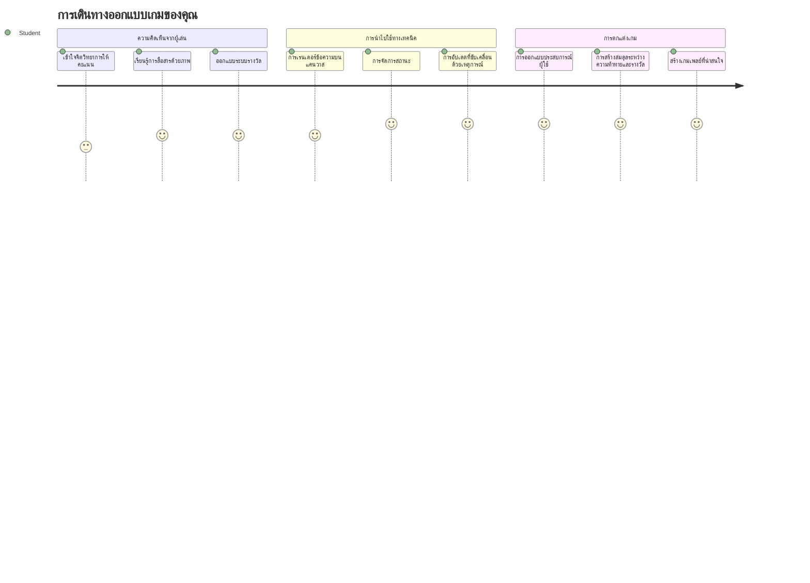
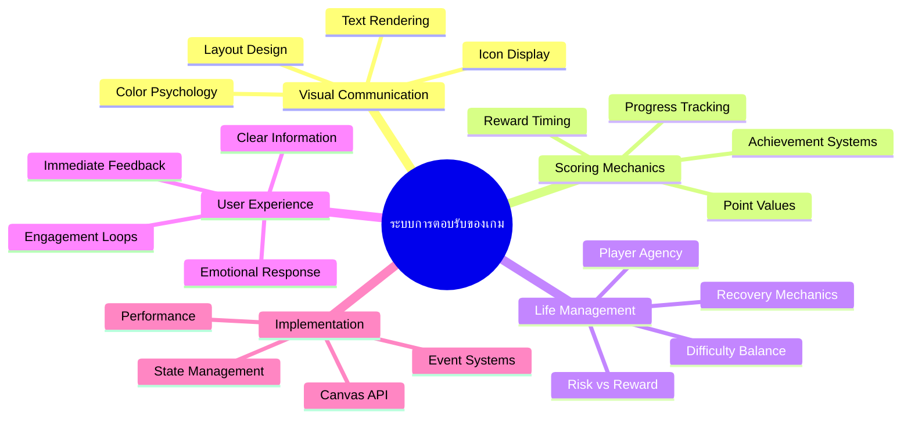
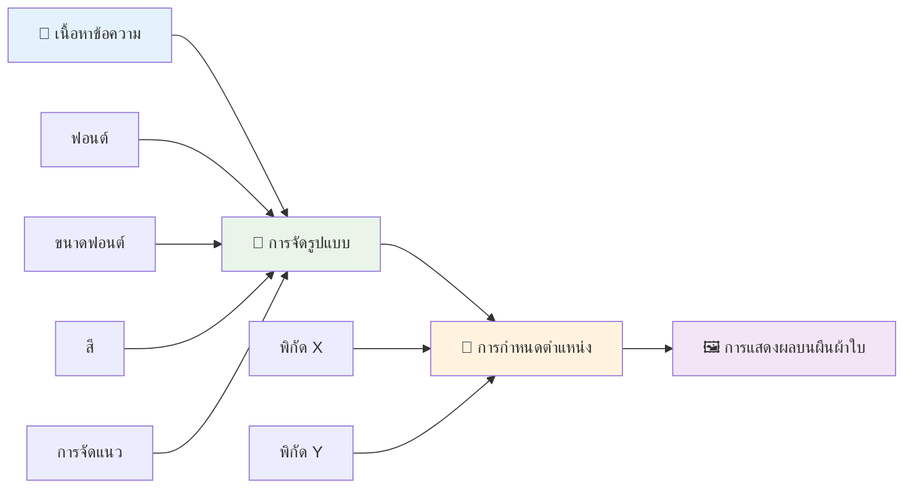
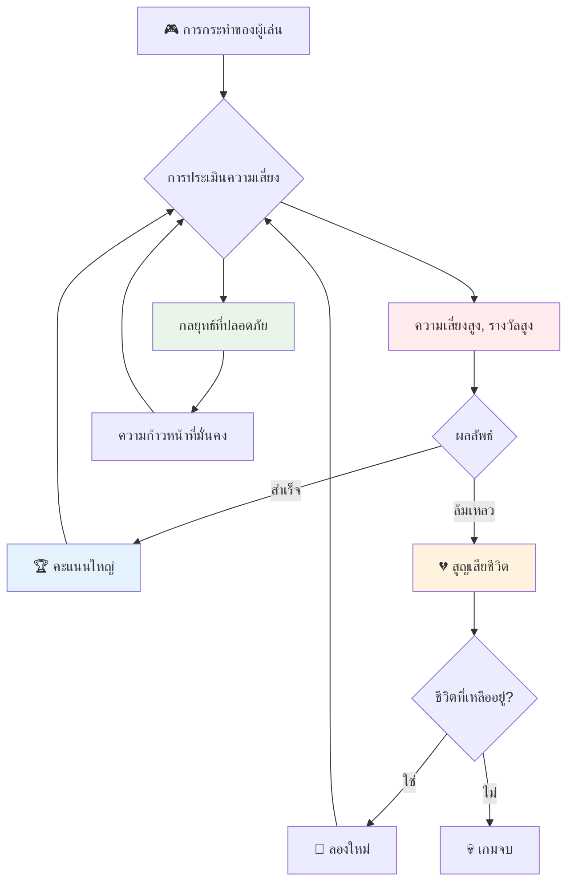
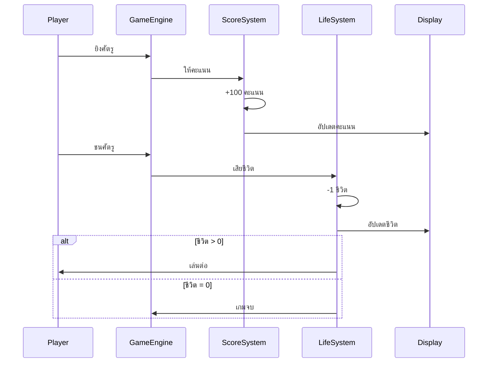
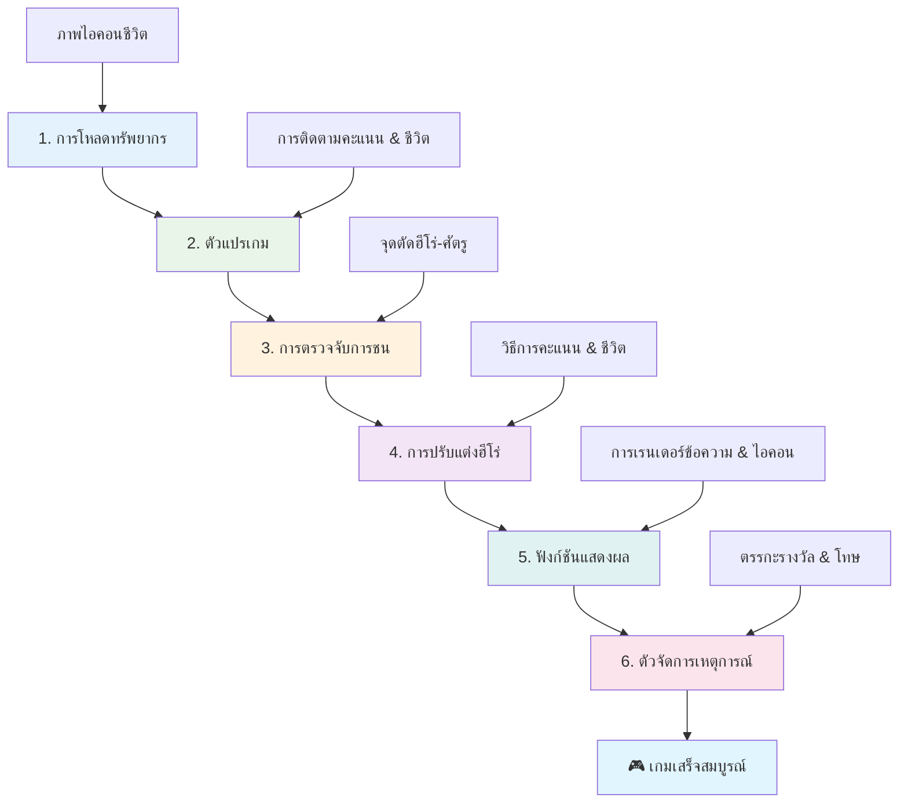
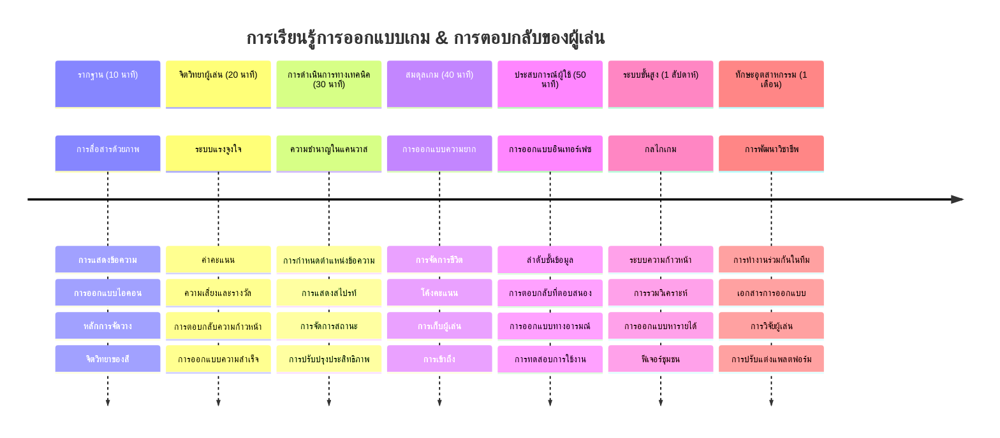

<!--
CO_OP_TRANSLATOR_METADATA:
{
  "original_hash": "2ed9145a16cf576faa2a973dff84d099",
  "translation_date": "2026-01-06T21:51:45+00:00",
  "source_file": "6-space-game/5-keeping-score/README.md",
  "language_code": "th"
}
-->
# สร้างเกมอวกาศ ตอนที่ 5: การนับคะแนนและจำนวนชีวิต


## แบบทดสอบก่อนเรียน

[แบบทดสอบก่อนเรียน](https://ff-quizzes.netlify.app/web/quiz/37)

พร้อมที่จะทำให้เกมอวกาศของคุณรู้สึกเหมือนเกมจริงหรือยัง? มาลองเพิ่มการนับคะแนนและการจัดการชีวิต — กลไกหลักที่เปลี่ยนเกมอาเขตยุคแรก ๆ อย่าง Space Invaders จากการสาธิตง่าย ๆ ให้กลายเป็นความบันเทิงที่ติดหนึบ ที่นี่เกมของคุณจะกลายเป็นเกมที่เล่นได้จริงอย่างแท้จริง


## การวาดข้อความบนหน้าจอ - เสียงของเกมคุณ

เพื่อแสดงคะแนนของคุณ เราต้องเรียนรู้วิธีการวาดข้อความบนแคนวาส เมธอด `fillText()` คือเครื่องมือหลักของคุณในเรื่องนี้ — เป็นเทคนิคเดียวกับที่ใช้ในเกมอาเขตคลาสสิกเพื่อแสดงคะแนนและข้อมูลสถานะ


คุณสามารถควบคุมลักษณะของข้อความได้อย่างเต็มที่:

```javascript
ctx.font = "30px Arial";
ctx.fillStyle = "red";
ctx.textAlign = "right";
ctx.fillText("show this on the screen", 0, 0);
```

✅ ดื่มด่ำลึกซึ้งกับ [การเพิ่มข้อความลงในแคนวาส](https://developer.mozilla.org/docs/Web/API/Canvas_API/Tutorial/Drawing_text) — คุณอาจจะแปลกใจว่าคุณสามารถสร้างสรรค์กับฟอนต์และการจัดรูปแบบได้มากแค่ไหน!

## ชีวิต - มากกว่าตัวเลขธรรมดา

ในโลกออกแบบเกม “ชีวิต” หมายถึงช่องว่างสำหรับข้อผิดพลาดของผู้เล่น แนวคิดนี้ย้อนกลับไปถึงเครื่องปิงบอลที่ผู้เล่นจะมีลูกบอลหลายลูกให้เล่น ในเกมวิดีโอยุคแรกอย่าง Asteroids การมีชีวิตช่วยให้ผู้เล่นกล้าที่จะเสี่ยงและเรียนรู้จากความผิดพลาด


การแสดงผลด้วยภาพมีความสำคัญมาก — การแสดงไอคอนยานแทนการแค่แสดงข้อความ “ชีวิต: 3” ช่วยสร้างการจดจำในทันที เช่นเดียวกับตู้เกมอาเขตยุคแรกที่ใช้ไอคอนสื่อสารข้ามอุปสรรคด้านภาษา

## สร้างระบบรางวัลของเกมคุณ

ตอนนี้เราจะสร้างระบบตอบสนองหลักที่ช่วยให้ผู้เล่นมีส่วนร่วม:


- **ระบบคะแนน**: ยานศัตรูแต่ละลำที่ถูกทำลายจะให้คะแนน 100 แต้ม (เลขกลมง่ายต่อการคำนวณในใจของผู้เล่น) คะแนนจะแสดงที่มุมล่างซ้าย
- **ตัวนับชีวิต**: ตัวละครของคุณเริ่มต้นด้วย 3 ชีวิต — มาตรฐานที่เกมอาเขตยุคแรกตั้งไว้เพื่อสมดุลความท้าทายกับความสามารถในการเล่น ทุกครั้งที่ชนกับศัตรูจะเสียชีวิตหนึ่งชีวิต เราจะแสดงชีวิตที่เหลืออยู่ที่มุมล่างขวาด้วยไอคอนยาน 

## เริ่มลงมือสร้าง!

ก่อนอื่นตั้งค่าสถานที่ทำงานของคุณ เลื่อนดูไฟล์ในโฟลเดอร์ย่อย `your-work` คุณควรเห็นไฟล์เหล่านี้:

```bash
-| assets
  -| enemyShip.png
  -| player.png
  -| laserRed.png
-| index.html
-| app.js
-| package.json
```

เพื่อทดสอบเกมของคุณ ให้รันเซิร์ฟเวอร์พัฒนาจากโฟลเดอร์ `your_work`:

```bash
cd your-work
npm start
```

นี่จะรันเซิร์ฟเวอร์ในเครื่องที่ `http://localhost:5000` เปิดที่อยู่เวบนี้ในเบราว์เซอร์เพื่อดูเกมของคุณ ทดสอบการควบคุมด้วยปุ่มลูกศรและลองยิงศัตรูเพื่อยืนยันว่าทุกอย่างทำงานได้


### ถึงเวลาตั้งโค้ดแล้ว!

1. **เตรียมไฟล์ของใช้งานภาพ** คัดลอกไฟล์ `life.png` จากโฟลเดอร์ `solution/assets/` ไปยังโฟลเดอร์ `your-work` ของคุณ แล้วเพิ่ม lifeImg เข้าไปในฟังก์ชัน window.onload:

    ```javascript
    lifeImg = await loadTexture("assets/life.png");
    ```

1. อย่าลืมเพิ่ม `lifeImg` เข้าไปในลิสต์ของไฟล์ทรัพยากรของคุณ:

    ```javascript
    let heroImg,
    ...
    lifeImg,
    ...
    eventEmitter = new EventEmitter();
    ```
  
2. **ตั้งค่าตัวแปรในเกมของคุณ** เพิ่มโค้ดเพื่อติดตามคะแนนรวมของคุณ (เริ่มที่ 0) และชีวิตที่เหลือ (เริ่มที่ 3) เราจะแสดงข้อมูลเหล่านี้บนหน้าจอเพื่อให้ผู้เล่นรู้เสมอว่าอยู่ ณ จุดไหน

3. **เพิ่มระบบตรวจจับการชน** ขยายฟังก์ชัน `updateGameObjects()` ของคุณเพื่อจับเวลาที่ศัตรูชนตัวละครของคุณ:

    ```javascript
    enemies.forEach(enemy => {
        const heroRect = hero.rectFromGameObject();
        if (intersectRect(heroRect, enemy.rectFromGameObject())) {
          eventEmitter.emit(Messages.COLLISION_ENEMY_HERO, { enemy });
        }
      })
    ```

4. **เพิ่มการติดตามชีวิตและคะแนนให้ Hero ของคุณ**  
   1. **กำหนดค่าเริ่มต้นตัวนับ** ใต้ `this.cooldown = 0` ในคลาส `Hero` ของคุณ ตั้งค่าชีวิตและคะแนน:

        ```javascript
        this.life = 3;
        this.points = 0;
        ```

   1. **แสดงค่าสถานะเหล่านี้ให้ผู้เล่นดู** สร้างฟังก์ชันวาดค่าตัวเลขเหล่านี้บนหน้าจอ:

        ```javascript
        function drawLife() {
          // ต้องทำ, 35, 27
          const START_POS = canvas.width - 180;
          for(let i=0; i < hero.life; i++ ) {
            ctx.drawImage(
              lifeImg, 
              START_POS + (45 * (i+1) ), 
              canvas.height - 37);
          }
        }
        
        function drawPoints() {
          ctx.font = "30px Arial";
          ctx.fillStyle = "red";
          ctx.textAlign = "left";
          drawText("Points: " + hero.points, 10, canvas.height-20);
        }
        
        function drawText(message, x, y) {
          ctx.fillText(message, x, y);
        }

        ```

   1. **เชื่อมฟังก์ชันเหล่านี้เข้ากับลูปเกมของคุณ** เพิ่มฟังก์ชันเหล่านี้ใน window.onload ของคุณหลังจาก `updateGameObjects()`:

        ```javascript
        drawPoints();
        drawLife();
        ```

### 🔄 **ตรวจสอบความเข้าใจทางการสอน**
**ความเข้าใจการออกแบบเกม**: ก่อนจะเพิ่มผลลัพธ์ ให้มั่นใจว่าคุณเข้าใจ:
- ✅ วิธีที่การตอบสนองด้วยภาพสื่อสารสถานะเกมกับผู้เล่น
- ✅ เหตุใดการวาง UI อย่างสม่ำเสมอจึงช่วยเพิ่มความใช้งานง่าย
- ✅ จิตวิทยาของค่าคะแนนและระบบจัดการชีวิต
- ✅ ความแตกต่างของการวาดข้อความบนแคนวาสกับข้อความ HTML

**ทดสอบตัวเองด่วน**: ทำไมเกมอาเขตจึงมักใช้เลขกลมสำหรับคะแนน?  
*คำตอบ: เลขกลมง่ายต่อการคำนวณในใจของผู้เล่นและช่วยสร้างรางวัลทางจิตใจที่น่าพอใจ*

**หลักการประสบการณ์ผู้ใช้**: ตอนนี้คุณได้นำไปใช้:
- **ลำดับชั้นทางสายตา**: ข้อมูลสำคัญวางไว้โดดเด่น
- **การตอบสนองทันที**: อัปเดตตามการกระทำของผู้เล่นแบบเรียลไทม์
- **ภาระความคิด**: การนำเสนอข้อมูลที่เรียบง่ายและชัดเจน
- **การออกแบบอารมณ์**: ไอคอนและสีที่สร้างความผูกพันกับผู้เล่น

1. **ใส่ผลลัพธ์ของเกมและรางวัล** ตอนนี้เราจะเพิ่มระบบตอบสนองที่ทำให้การกระทำของผู้เล่นมีความหมาย:

   1. **การชนทำให้เสียชีวิต** ทุกครั้งที่ตัวละครของคุณชนกับศัตรู คุณจะเสียหนึ่งชีวิต
   
      เพิ่มเมธอดนี้ในคลาส `Hero` ของคุณ:

        ```javascript
        decrementLife() {
          this.life--;
          if (this.life === 0) {
            this.dead = true;
          }
        }
        ```

   2. **การยิงศัตรูทำให้ได้คะแนน** การยิงถูกแต่ละครั้งจะให้คะแนน 100 แต้ม เป็นการตอบสนองเชิงบวกทันทีสำหรับการยิงที่แม่นยำ

      ขยายคลาส Hero ของคุณด้วยเมธอดเพิ่มแต้มนี้:
    
        ```javascript
          incrementPoints() {
            this.points += 100;
          }
        ```

        จากนั้นเชื่อมต่อฟังก์ชันเหล่านี้กับเหตุการณ์การชนของคุณ:

        ```javascript
        eventEmitter.on(Messages.COLLISION_ENEMY_LASER, (_, { first, second }) => {
           first.dead = true;
           second.dead = true;
           hero.incrementPoints();
        })

        eventEmitter.on(Messages.COLLISION_ENEMY_HERO, (_, { enemy }) => {
           enemy.dead = true;
           hero.decrementLife();
        });
        ```

✅ สนใจเกมอื่นที่สร้างด้วย JavaScript และ Canvas ไหม? ลองสำรวจดู — คุณอาจประหลาดใจกับสิ่งที่เป็นไปได้!

หลังจากเพิ่มฟีเจอร์เหล่านี้ ทดสอบเกมของคุณเพื่อดูว่าระบบตอบสนองทำงานครบถ้วน คุณควรเห็นไอคอนชีวิตที่มุมล่างขวา คะแนนแสดงที่มุมล่างซ้าย และดูว่าการชนลดชีวิตลงขณะที่ยิงสำเร็จเพิ่มคะแนน

ตอนนี้เกมของคุณมีกลไกพื้นฐานที่ทำให้เกมอาเขตยุคแรกน่าติดตาม — เป้าหมายชัดเจน การตอบสนองทันที และผลลัพธ์ที่มีความหมายต่อตัวผู้เล่น

### 🔄 **ตรวจสอบความเข้าใจทางการสอน**
**ระบบออกแบบเกมครบถ้วน**: ยืนยันความชำนาญระบบตอบสนองของผู้เล่น:
- ✅ กลไกการให้คะแนนสร้างแรงจูงใจและความผูกพันอย่างไร?
- ✅ ทำไมความสม่ำเสมอการแสดงผลจึงสำคัญสำหรับการออกแบบ UI?
- ✅ ระบบชีวิตสมดุลความท้าทายและการเก็บรักษาผู้เล่นอย่างไร?
- ✅ บทบาทการตอบสนองทันทีในสร้างความพอใจระหว่างเล่นเกม?

**การบูรณาการระบบ**: ระบบตอบสนองของคุณแสดง:
- **การออกแบบประสบการณ์ผู้ใช้**: การสื่อสารด้วยภาพและลำดับข้อมูลชัดเจน
- **สถาปัตยกรรมขับเคลื่อนโดยเหตุการณ์**: อัปเดตตอบสนองต่อการกระทำผู้เล่น
- **การจัดการสถานะ**: ติดตามและแสดงข้อมูลเกมแบบไดนามิก
- **ความชำนาญแคนวาส**: การวาดข้อความและการจัดวางสไปรต์
- **จิตวิทยาเกม**: เข้าใจแรงจูงใจและความผูกพันของผู้เล่น

**รูปแบบมืออาชีพที่นำไปใช้**:
- **สถาปัตยกรรม MVC**: แยกกลไกเกม, ข้อมูล และการนำเสนอ
- **รูปแบบผู้สังเกตการณ์**: อัปเดตสถานะเกมผ่านเหตุการณ์
- **การออกแบบส่วนประกอบ**: ฟังก์ชันที่ใช้ซ้ำสำหรับการวาดและตรรกะ
- **การเพิ่มประสิทธิภาพสมรรถนะ**: การเรนเดอร์อย่างมีประสิทธิภาพในลูปเกม

### ⚡ **สิ่งที่คุณทำได้ภายใน 5 นาทีถัดไป**
- [ ] ทดลองเปลี่ยนขนาดฟอนต์และสีสำหรับแสดงคะแนน
- [ ] ลองเปลี่ยนค่าคะแนนและดูผลต่อความรู้สึกของเกม
- [ ] เพิ่มคำสั่ง console.log เพื่อติดตามการเปลี่ยนแปลงคะแนนและชีวิต
- [ ] ทดสอบกรณีขอบเช่นชีวิตหมดหรือได้คะแนนสูงมาก

### 🎯 **สิ่งที่คุณทำได้ภายในชั่วโมงนี้**
- [ ] ทำแบบทดสอบหลังบทเรียนและเข้าใจจิตวิทยาการออกแบบเกม
- [ ] เพิ่มเสียงประกอบเมื่อได้คะแนนและเสียชีวิต
- [ ] สร้างระบบคะแนนสูงสุดโดยใช้ localStorage
- [ ] สร้างค่าคะแนนต่าง ๆ สำหรับศัตรูแต่ละประเภท
- [ ] เพิ่มเอฟเฟกต์ภาพ เช่น การสั่นหน้าจอเมื่อตาย

### 📅 **เส้นทางการออกแบบเกมของคุณในหนึ่งสัปดาห์**
- [ ] สร้างเกมอวกาศครบถ้วนพร้อมระบบตอบสนองที่สมบูรณ์
- [ ] พัฒนากลไกการนับคะแนนขั้นสูง เช่น ตัวคูณคอมโบ
- [ ] เพิ่มความสำเร็จและเนื้อหาที่ปลดล็อกได้
- [ ] สร้างระบบความยากและการปรับสมดุลเกม
- [ ] ออกแบบ UI สำหรับเมนูและหน้าจอเกมจบ
- [ ] ศึกษาเกมอื่น ๆ เพื่อเข้าใจกลไกการมีส่วนร่วม

### 🌟 **การก้าวสู่การเป็นผู้เชี่ยวชาญด้านพัฒนาเกมในหนึ่งเดือน**
- [ ] สร้างเกมสมบูรณ์ด้วยระบบพัฒนาที่ซับซ้อน
- [ ] เรียนรู้การวิเคราะห์เกมและการวัดพฤติกรรมผู้เล่น
- [ ] มีส่วนร่วมในโปรเจกต์เกมโอเพ่นซอร์ส
- [ ] เชี่ยวชาญรูปแบบการออกแบบเกมขั้นสูงและการสร้างรายได้
- [ ] สร้างเนื้อหาสอนเกี่ยวกับการออกแบบเกมและ UX
- [ ] สร้างพอร์ตโฟลิโอแสดงทักษะออกแบบและพัฒนาเกม

## 🎯 แผนผังเส้นทางความเชี่ยวชาญการออกแบบเกมของคุณ


### 🛠️ สรุปเครื่องมือออกแบบเกมของคุณ

หลังจากจบบทเรียนนี้ คุณได้เชี่ยวชาญใน:
- **จิตวิทยาผู้เล่น**: เข้าใจแรงจูงใจ, ความเสี่ยง/รางวัล และวงจรความผูกพัน
- **การสื่อสารด้วยภาพ**: การออกแบบ UI ที่ได้ผลโดยใช้ข้อความ, ไอคอน และการจัดวาง
- **ระบบตอบสนอง**: การตอบสนองแบบเรียลไทม์ต่อการกระทำของผู้เล่นและเหตุการณ์ในเกม
- **การจัดการสถานะ**: ติดตามและแสดงข้อมูลเกมแบบไดนามิกอย่างมีประสิทธิภาพ
- **การวาดข้อความแคนวาส**: การแสดงข้อความอย่างมืออาชีพด้วยการจัดสไตล์และการจัดวาง
- **การบูรณาการเหตุการณ์**: เชื่อมต่อการกระทำของผู้ใช้กับผลลัพธ์ในเกมที่มีความหมาย
- **ความสมดุลเกม**: การออกแบบความโค้งของความยากและระบบพัฒนาผู้เล่น

**การประยุกต์ใช้จริง**: ทักษะการออกแบบเกมของคุณนำไปใช้กับ:
- **การออกแบบอินเทอร์เฟซผู้ใช้**: สร้าง UI ที่น่าสนใจและใช้งานง่าย
- **การพัฒนาผลิตภัณฑ์**: เข้าใจแรงจูงใจผู้ใช้และวงจรตอบรับ
- **เทคโนโลยีเพื่อการศึกษา**: การเล่นเกมเพื่อการเรียนรู้และระบบการมีส่วนร่วม
- **การนำเสนอข้อมูล**: การทำข้อมูลซับซ้อนให้น่าสนใจและเข้าถึงง่าย
- **การพัฒนาแอปมือถือ**: กลไกการเก็บรักษาผู้ใช้และประสบการณ์ผู้ใช้
- **เทคโนโลยีการตลาด**: เข้าใจพฤติกรรมผู้ใช้และการเพิ่มประสิทธิภาพการแปลง

**ทักษะมืออาชีพที่ได้รับ**: คุณสามารถ  
- **ออกแบบ** ประสบการณ์ผู้ใช้ที่กระตุ้นและดึงดูดผู้ใช้  
- **ใช้งาน** ระบบตอบรับที่ชี้นำพฤติกรรมผู้ใช้อย่างมีประสิทธิภาพ  
- **สมดุล** ความท้าทายและการเข้าถึงที่ง่ายในระบบโต้ตอบ  
- **สร้าง** การสื่อสารด้วยภาพที่ใช้งานได้ดีในกลุ่มผู้ใช้ต่าง ๆ  
- **วิเคราะห์** พฤติกรรมผู้ใช้และปรับปรุงการออกแบบได้อย่างต่อเนื่อง  

**แนวคิดการพัฒนาเกมที่เชี่ยวชาญ**:
- **แรงจูงใจของผู้เล่น**: เข้าใจสิ่งที่ขับเคลื่อนความผูกพันและการรักษาผู้เล่น
- **การออกแบบเชิงภาพ**: สร้างอินเทอร์เฟซที่ชัดเจน สวยงาม และใช้งานได้  
- **การบูรณาการระบบ**: เชื่อมระบบเกมหลายส่วนเพื่อประสบการณ์ที่สมบูรณ์  
- **การเพิ่มประสิทธิภาพสมรรถนะ**: การเรนเดอร์และการจัดการสถานะอย่างมีประสิทธิภาพ  
- **ความง่ายการเข้าถึง**: การออกแบบสำหรับระดับทักษะและความต้องการที่แตกต่าง  

**ก้าวต่อไป**: คุณพร้อมสำรวจรูปแบบการออกแบบเกมขั้นสูง ใช้ระบบวิเคราะห์ หรือศึกษาเรื่องการสร้างรายได้และการรักษาผู้เล่น!

🌟 **ความสำเร็จที่รับรอง**: คุณได้สร้างระบบตอบรับผู้เล่นครบถ้วนด้วยหลักการออกแบบเกมมืออาชีพ!

---

## ความท้าทาย GitHub Copilot Agent 🚀

ใช้โหมด Agent เพื่อทำภารกิจต่อไปนี้:

**คำอธิบาย:** ปรับปรุงระบบคะแนนของเกมอวกาศโดยการเพิ่มฟีเจอร์คะแนนสูงสุดที่เก็บข้อมูลถาวรและระบบคะแนนโบนัส  

**ตัวกระตุ้น:** สร้างระบบคะแนนสูงสุดที่บันทึกคะแนนดีที่สุดของผู้เล่นใน localStorage เพิ่มคะแนนโบนัสสำหรับการฆ่าศัตรูติดต่อกัน (ระบบคอมโบ) และตั้งค่าคะแนนแตกต่างสำหรับศัตรูแต่ละประเภท มีตัวบ่งชี้ภาพเมื่อผู้เล่นทำคะแนนสูงสุดใหม่ และแสดงคะแนนสูงสุดปัจจุบันบนหน้าจอเกม

## 🚀 ความท้าทาย

ตอนนี้คุณมีเกมที่ทำงานได้พร้อมระบบคะแนนและชีวิต ลองคิดว่าฟีเจอร์เพิ่มเติมอะไรที่จะช่วยเพิ่มประสบการณ์ผู้เล่น

## แบบทดสอบหลังเรียน

[แบบทดสอบหลังเรียน](https://ff-quizzes.netlify.app/web/quiz/38)

## ทบทวน & ศึกษาด้วยตนเอง

อยากสำรวจเพิ่มเติมไหม? ศึกษาวิธีการต่าง ๆ ของการนับคะแนนและระบบชีวิตเกม มีเอนจินเกมน่าสนใจอย่าง [PlayFab](https://playfab.com) ที่จัดการคะแนน, กระดานผู้นำ, และความก้าวหน้าของผู้เล่น การนำอะไรแบบนี้มาใช้อาจยกระดับเกมของคุณไปอีกขั้นได้อย่างไร?

## การบ้าน

[สร้างเกมที่มีระบบคะแนน](assignment.md)

---

<!-- CO-OP TRANSLATOR DISCLAIMER START -->
**ข้อจำกัดความรับผิดชอบ**: เอกสารฉบับนี้ได้ถูกแปลโดยใช้บริการแปลด้วย AI [Co-op Translator](https://github.com/Azure/co-op-translator) แม้เราจะมุ่งมั่นเพื่อความถูกต้อง แต่โปรดทราบว่าการแปลโดยอัตโนมัติอาจมีข้อผิดพลาดหรือความไม่แม่นยำ เอกสารต้นฉบับในภาษาต้นทางควรถือเป็นแหล่งข้อมูลที่เชื่อถือได้ สำหรับข้อมูลที่สำคัญ ควรใช้บริการแปลโดยมนุษย์ที่มีความเชี่ยวชาญ เราไม่รับผิดชอบต่อความเข้าใจผิดหรือการตีความผิดที่เกิดขึ้นจากการใช้การแปลนี้
<!-- CO-OP TRANSLATOR DISCLAIMER END -->