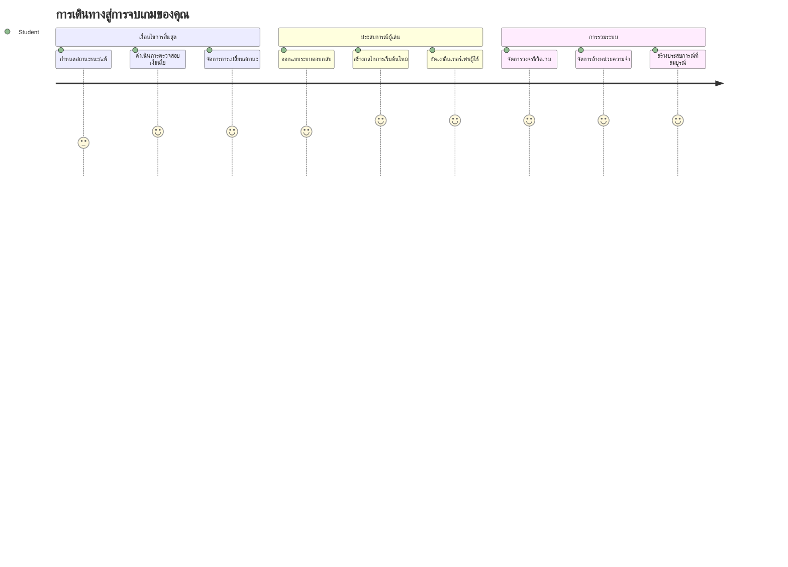
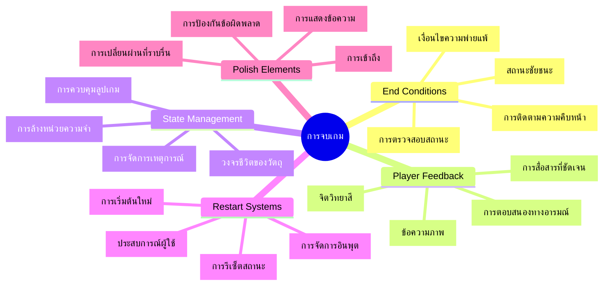
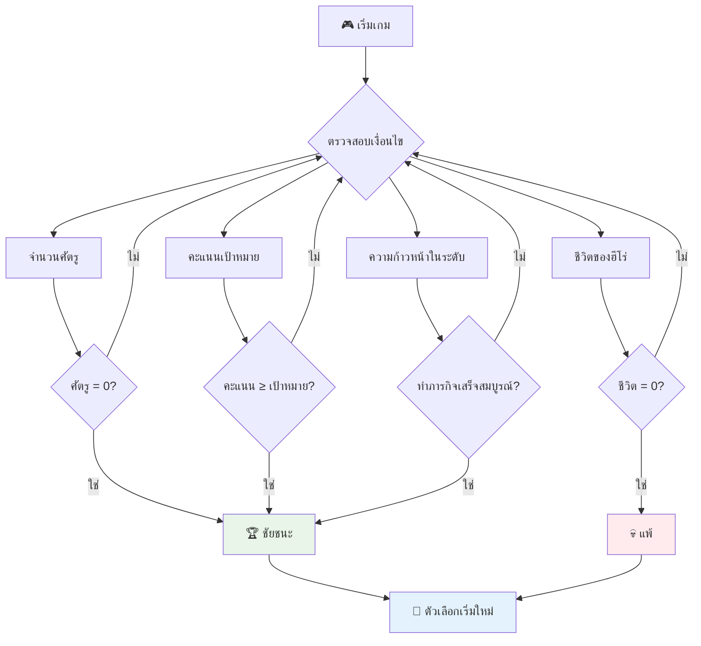
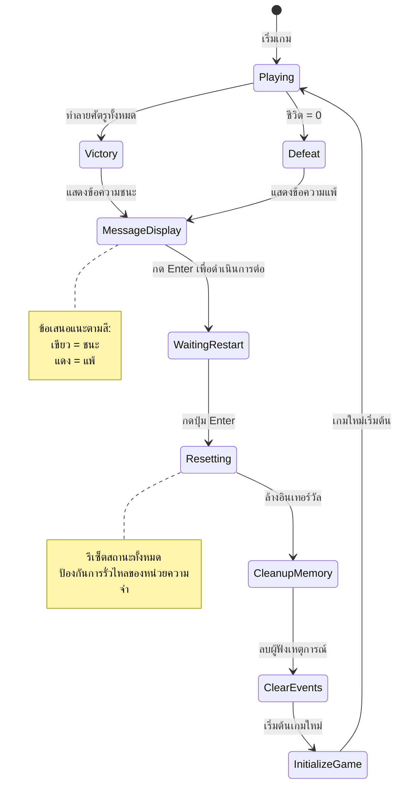
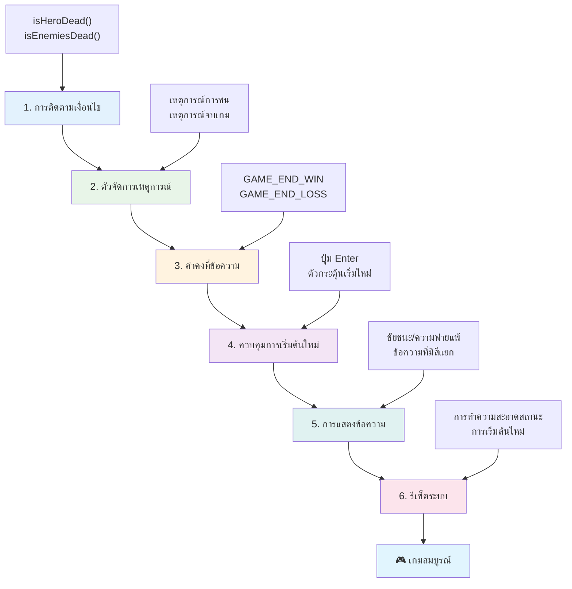
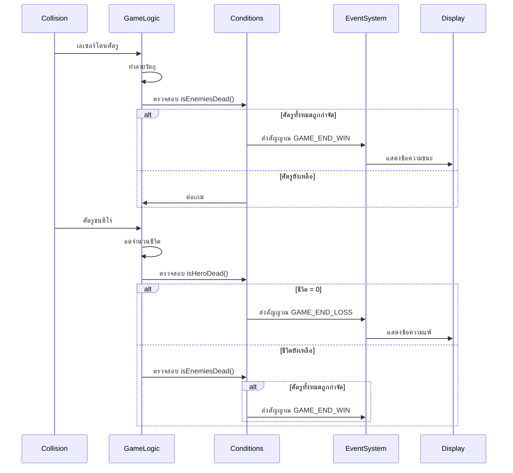
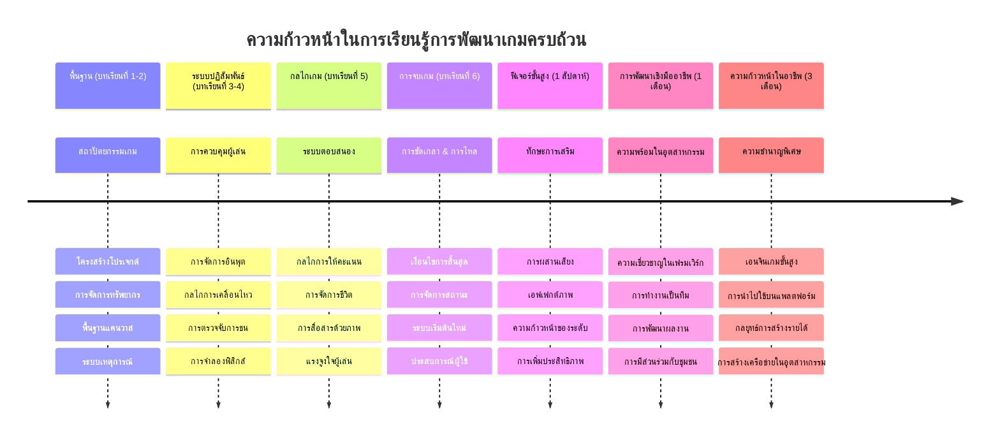

# สร้างเกมอวกาศ ตอนที่ 6: สิ้นสุดและเริ่มใหม่


เกมที่ยอดเยี่ยมทุกเกมต้องมีเงื่อนไขการจบที่ชัดเจนและกลไกเริ่มใหม่ที่ราบรื่น คุณได้สร้างเกมอวกาศที่น่าประทับใจที่มีการเคลื่อนที่ การต่อสู้ และการให้คะแนนแล้ว - ตอนนี้ถึงเวลาที่จะเพิ่มส่วนสุดท้ายที่ทำให้เกมรู้สึกสมบูรณ์

เกมของคุณตอนนี้ทำงานได้ไม่สิ้นสุด เหมือนกับยานสำรวจ Voyager ที่ NASA ส่งขึ้นไปในปี 1977 - ยังเดินทางในอวกาศอยู่หลายสิบปีหลังจากนั้น แม้ว่าจะดีสำหรับการสำรวจอวกาศ แต่เกมต้องมีจุดสิ้นสุดที่กำหนดเพื่อสร้างประสบการณ์ที่น่าพึงพอใจ

วันนี้เราจะนำเงื่อนไขชนะ/แพ้ที่เหมาะสมและระบบเริ่มต้นใหม่มาใช้ เมื่อจบบทเรียนนี้ คุณจะมีเกมที่ขัดเกลาแล้วที่ผู้เล่นสามารถจบและเล่นซ้ำได้ เหมือนกับเกมอาร์เคดคลาสสิกที่เป็นตัวแทนของวงการนี้


## แบบทดสอบก่อนเรียน

[แบบทดสอบก่อนเรียน](https://ff-quizzes.netlify.app/web/quiz/39)

## ความเข้าใจเกี่ยวกับเงื่อนไขการจบเกม

เกมของคุณควรจบเมื่อใด? คำถามพื้นฐานนี้ได้กำหนดการออกแบบเกมตั้งแต่ยุคแรกของอาร์เคด Pac-Man จบเมื่อคุณถูกผีจับหรือเก็บจุดทั้งหมด ในขณะที่ Space Invaders จบเมื่อมนุษย์ต่างดาวบุกถึงด้านล่างหรือถูกทำลายหมดแล้ว

ในฐานะผู้สร้างเกม คุณเป็นผู้กำหนดเงื่อนไขชนะและแพ้ สำหรับเกมอวกาศของเรา นี่คือวิธีที่พิสูจน์แล้วว่าสร้างการเล่นเกมที่น่าดึงดูดใจ:


- **ทำลายยานศัตรู `N` ลำ**: เป็นเรื่องปกติถ้าคุณแบ่งเกมออกเป็นเลเวลต่างๆ ที่ต้องทำลายยานศัตรูจำนวน `N` เพื่อผ่านเลเวล
- **ยานของคุณถูกทำลาย**: มีเกมหลายเกมที่คุณจะแพ้ถ้ายานตัวเองถูกทำลาย อีกวิธีหนึ่งที่ใช้คือมีแนวคิดของชีวิต ทุกครั้งที่ยานถูกทำลายจะเสียชีวิตหนึ่งครั้ง เมื่อเสียชีวิตหมดแล้วจึงแพ้
- **คุณเก็บคะแนนได้ `N` คะแนน**: อีกเงื่อนไขการจบที่พบบ่อยคือการเก็บคะแนน วิธีที่คุณได้คะแนนขึ้นอยู่กับคุณ แต่มักจะให้คะแนนจากกิจกรรมต่างๆ เช่น ทำลายยานศัตรูหรือเก็บไอเท็มที่หล่นจากการทำลาย
- **ผ่านเลเวล**: อาจจะรวมหลายเงื่อนไข เช่น ทำลายยานศัตรู `X` ลำ, เก็บคะแนนได้ `Y` คะแนน หรือเก็บไอเท็มเฉพาะได้

## การใช้งานฟังก์ชันเริ่มเกมใหม่

เกมที่ดีสร้างความน่าสนใจให้ผู้เล่นเล่นซ้ำด้วยระบบเริ่มใหม่ที่ราบรื่น เมื่อผู้เล่นจบเกม (หรือแพ้) พวกเขามักอยากเล่นใหม่ทันที ไม่ว่าจะเพื่อทำคะแนนให้ดีกว่าหรือพัฒนาฝีมือ


เกม Tetris เป็นตัวอย่างที่ดีมาก: เมื่อบล็อกของคุณสูงสุดแล้ว คุณสามารถเริ่มเกมใหม่ได้ทันทีโดยไม่ต้องเข้าเมนูซับซ้อน เราจะสร้างระบบเริ่มใหม่ที่รีเซ็ตสถานะเกมให้สะอาดและพาผู้เล่นกลับมาเล่นได้อย่างรวดเร็ว

✅ **ข้อคิด**: นึกถึงเกมที่คุณเคยเล่น พวกมันจบเมื่อไรและพวกเขาให้คุณเริ่มใหม่อย่างไร? อะไรทำให้การเริ่มใหม่รู้สึกราบรื่นหรือหงุดหงิด?

## สิ่งที่คุณจะสร้าง

คุณจะเพิ่มฟีเจอร์สุดท้ายที่เปลี่ยนโปรเจกต์ของคุณให้เป็นประสบการณ์เกมสมบูรณ์ ฟีเจอร์เหล่านี้แยกความแตกต่างระหว่างเกมที่ขัดเกลาและต้นแบบพื้นฐาน

**นี่คือสิ่งที่เราจะเพิ่มวันนี้:**

1. **เงื่อนไขชนะ**: ทำลายศัตรูทั้งหมดและมีการเฉลิมฉลองอย่างเหมาะสม (สมควรแล้ว!)
2. **เงื่อนไขแพ้**: หมดชีวิตและเผชิญหน้ากับหน้าจอแพ้
3. **กลไกเริ่มใหม่**: กด Enter เพื่อเริ่มใหม่ทันที - เพราะเล่นเกมเดียวไม่เคยพอ
4. **การจัดการสถานะ**: เริ่มต้นสะอาดทุกครั้ง - ไม่มีศัตรูหลงเหลือหรือบั๊กแปลกๆ จากเกมก่อนหน้า

## เริ่มต้น

เตรียมสภาพแวดล้อมสำหรับการพัฒนา คุณควรมีไฟล์เกมอวกาศจากบทเรียนก่อนหน้าครบถ้วน

**โปรเจกต์ของคุณควรมีโครงสร้างประมาณนี้:**

```bash
-| assets
  -| enemyShip.png
  -| player.png
  -| laserRed.png
  -| life.png
-| index.html
-| app.js
-| package.json
```

**เริ่มเซิร์ฟเวอร์สำหรับพัฒนา:**

```bash
cd your-work
npm start
```

**คำสั่งนี้:**
- รันเซิร์ฟเวอร์บน `http://localhost:5000`
- ให้บริการไฟล์ของคุณอย่างถูกต้อง
- รีเฟรชอัตโนมัติเมื่อคุณมีการเปลี่ยนแปลง

เปิด `http://localhost:5000` บนเบราว์เซอร์และตรวจสอบว่าเกมทำงานได้ คุณควรจะสามารถเคลื่อนที่ ยิง และโต้ตอบกับศัตรูได้ เมื่อตรวจสอบแล้ว เราจะไปทำการใช้งานต่อ

> 💡 **เคล็ดลับโปร**: เพื่อหลีกเลี่ยงการเตือนใน Visual Studio Code ให้ประกาศ `gameLoopId` ที่ด้านบนของไฟล์ด้วย `let gameLoopId;` แทนการประกาศในฟังก์ชัน `window.onload` ซึ่งเป็นแนวปฏิบัติที่ดีใน JavaScript สมัยใหม่


## ขั้นตอนการใช้งาน

### ขั้นตอนที่ 1: สร้างฟังก์ชันติดตามเงื่อนไขการจบเกม

เราต้องฟังก์ชันที่ตรวจสอบว่าเกมควรจบเมื่อไร เหมือนเซนเซอร์ของสถานีอวกาศนานาชาติที่คอยตรวจตราระบบสำคัญ ฟังก์ชันเหล่านี้จะตรวจสอบสถานะเกมอย่างต่อเนื่อง

```javascript
function isHeroDead() {
  return hero.life <= 0;
}

function isEnemiesDead() {
  const enemies = gameObjects.filter((go) => go.type === "Enemy" && !go.dead);
  return enemies.length === 0;
}
```

**สิ่งที่เกิดขึ้นใต้เครือง:**
- **ตรวจสอบ** ว่าฮีโร่ของเราหมดชีวิตหรือยัง (เจ็บปวด!)
- **นับ** จำนวนศัตรูที่ยังมีชีวิตและต่อสู้ได้
- **คืนค่า** `true` เมื่อสนามรบปลอดศัตรู
- **ใช้** ลอจิกแบบ true/false ทำให้ง่ายต่อความเข้าใจ
- **กรอง** ผ่านวัตถุเกมทั้งหมดเพื่อหาเหล่าสมาชิกที่รอดชีวิต

### ขั้นตอนที่ 2: อัปเดตตัวจัดการเหตุการณ์สำหรับเงื่อนไขการจบ

ตอนนี้เราจะเชื่อมการตรวจสอบเงื่อนไขเข้ากับระบบเหตุการณ์ของเกม ทุกครั้งที่เกิดการชน เกมจะประเมินว่ามันเป็นเหตุให้จบไหม วิธีนี้ทำให้มีฟีดแบ็กทันทีสำหรับเหตุการณ์สำคัญในเกม


```javascript
eventEmitter.on(Messages.COLLISION_ENEMY_LASER, (_, { first, second }) => {
    first.dead = true;
    second.dead = true;
    hero.incrementPoints();

    if (isEnemiesDead()) {
      eventEmitter.emit(Messages.GAME_END_WIN);
    }
});

eventEmitter.on(Messages.COLLISION_ENEMY_HERO, (_, { enemy }) => {
    enemy.dead = true;
    hero.decrementLife();
    if (isHeroDead())  {
      eventEmitter.emit(Messages.GAME_END_LOSS);
      return; // การสูญเสียก่อนชัยชนะ
    }
    if (isEnemiesDead()) {
      eventEmitter.emit(Messages.GAME_END_WIN);
    }
});

eventEmitter.on(Messages.GAME_END_WIN, () => {
    endGame(true);
});
  
eventEmitter.on(Messages.GAME_END_LOSS, () => {
  endGame(false);
});
```

**สิ่งที่เกิดขึ้นที่นี่:**
- **เลเซอร์โดนศัตรู**: ทั้งคู่หายไป คุณได้คะแนน และเราตรวจสอบว่าคุณชนะหรือยัง
- **ศัตรูชนคุณ**: คุณเสียชีวิตหนึ่งชีวิต และเราตรวจสอบว่าคุณยังมีชีวิตอยู่ไหม
- **เรียงลำดับอย่างชาญฉลาด**: เราตรวจสอบการแพ้ก่อน (ไม่มีใครอยากชนะและแพ้ในเวลาเดียวกัน!)
- **ตอบสนองทันที**: ทันทีที่เกิดเหตุสำคัญ เกมจะรับรู้ทันที

### ขั้นตอนที่ 3: เพิ่มค่าคงที่ข้อความใหม่

คุณต้องเพิ่มประเภทข้อความใหม่ในออบเจ็กต์ค่าคงที่ `Messages` ค่าคงที่เหล่านี้ช่วยรักษาความสม่ำเสมอและป้องกันการสะกดผิดในระบบเหตุการณ์ของคุณ

```javascript
GAME_END_LOSS: "GAME_END_LOSS",
GAME_END_WIN: "GAME_END_WIN",
```

**ในข้างต้นเราได้:**
- **เพิ่ม** ค่าคงที่สำหรับเหตุการณ์จบเกมเพื่อความสม่ำเสมอ
- **ใช้** ชื่อที่บรรยายชัดเจนเกี่ยวกับจุดประสงค์ของเหตุการณ์
- **ปฏิบัติตาม** คอนเวนชันการตั้งชื่อเดิมสำหรับประเภทข้อความ

### ขั้นตอนที่ 4: ใช้งานการควบคุมการเริ่มเกมใหม่

ตอนนี้คุณจะเพิ่มการควบคุมผ่านคีย์บอร์ดที่ช่วยให้ผู้เล่นเริ่มเกมใหม่ได้ ปุ่ม Enter เป็นตัวเลือกที่เหมาะสมเพราะมักใช้เพื่อยืนยันการกระทำและเริ่มเกมใหม่

**เพิ่มการตรวจจับปุ่ม Enter ในตัวรับฟังเหตุการณ์ keydown ที่มีอยู่:**

```javascript
else if(evt.key === "Enter") {
   eventEmitter.emit(Messages.KEY_EVENT_ENTER);
}
```

**เพิ่มค่าคงที่ข้อความใหม่:**

```javascript
KEY_EVENT_ENTER: "KEY_EVENT_ENTER",
```

**สิ่งที่คุณต้องรู้:**
- **ขยาย** ระบบจัดการเหตุการณ์คีย์บอร์ดที่มีอยู่แล้ว
- **ใช้** ปุ่ม Enter เป็นทริกเกอร์เริ่มใหม่เพื่อประสบการณ์ผู้ใช้ที่เข้าใจง่าย
- **ส่ง** เหตุการณ์ที่กำหนดเองซึ่งส่วนอื่นของเกมสามารถฟังได้
- **รักษา** รูปแบบเดียวกับการควบคุมคีย์บอร์ดอื่นๆ

### ขั้นตอนที่ 5: สร้างระบบแสดงข้อความ

เกมของคุณต้องสื่อสารผลลัพธ์ให้ผู้เล่นอย่างชัดเจน เราจะสร้างระบบข้อความที่แสดงสถานะแพ้ชนะด้วยข้อความสีต่างๆ คล้ายกับอินเทอร์เฟซเทอร์มินอลของระบบคอมพิวเตอร์ยุคแรกที่ใช้สีเขียวแสดงความสำเร็จและสีแดงแสดงข้อผิดพลาด

**สร้างฟังก์ชัน `displayMessage()`:**

```javascript
function displayMessage(message, color = "red") {
  ctx.font = "30px Arial";
  ctx.fillStyle = color;
  ctx.textAlign = "center";
  ctx.fillText(message, canvas.width / 2, canvas.height / 2);
}
```

**ทีละขั้นตอน สิ่งที่เกิดขึ้น:**
- **ตั้งค่า** ขนาดและฟอนต์เพื่อข้อความที่อ่านง่าย
- **ใช้** พารามิเตอร์สี โดยค่าเริ่มต้นคือ "แดง" สำหรับคำเตือน
- **จัดกึ่งกลาง** ข้อความทั้งแนวนอนและแนวตั้งบนแคนวาส
- **ใช้** พารามิเตอร์ดีฟอลต์ของ JavaScript เพื่อความยืดหยุ่นในสี
- **ใช้** 2D context ของแคนวาสสำหรับการเรนเดอร์ข้อความโดยตรง

**สร้างฟังก์ชัน `endGame()`:**

```javascript
function endGame(win) {
  clearInterval(gameLoopId);

  // ตั้งค่าการหน่วงเวลาเพื่อให้การเรนเดอร์ที่รอดำเนินการเสร็จสมบูรณ์
  setTimeout(() => {
    ctx.clearRect(0, 0, canvas.width, canvas.height);
    ctx.fillStyle = "black";
    ctx.fillRect(0, 0, canvas.width, canvas.height);
    if (win) {
      displayMessage(
        "Victory!!! Pew Pew... - Press [Enter] to start a new game Captain Pew Pew",
        "green"
      );
    } else {
      displayMessage(
        "You died !!! Press [Enter] to start a new game Captain Pew Pew"
      );
    }
  }, 200)  
}
```

**หน้าที่ของฟังก์ชันนี้:**
- **หยุด** การเคลื่อนที่ทั้งหมด - ไม่มีการเคลื่อนที่ของยานหรือเลเซอร์
- **หยุดชั่วครู่** (200ms) เพื่อให้เฟรมสุดท้ายวาดเสร็จ
- **ล้างหน้าจอ** และทาสีดำเพื่อสร้างเอฟเฟกต์ดราม่า
- **แสดง** ข้อความที่ต่างกันสำหรับผู้ชนะและผู้แพ้
- **ใช้สี** เขียวสำหรับดี และแดงสำหรับ... ไม่ค่อยดี
- **บอก** วิธีเริ่มใหม่แก่ผู้เล่นอย่างชัดเจน

### 🔄 **สรุปเชิงการสอน**
**การจัดการสถานะเกม**: ก่อนใช้งานฟังก์ชันรีเซ็ต ให้แน่ใจว่าคุณเข้าใจ:
- ✅ เงื่อนไขจบเกมกำหนดวัตถุประสงค์เพื่อการเล่นเกมได้อย่างไร
- ✅ ทำไมฟีดแบ็กด้วยภาพถึงสำคัญสำหรับความเข้าใจของผู้เล่น
- ✅ ความสำคัญของการทำความสะอาดที่เหมาะสมในการป้องกันหน่วยความจำรั่วไหล
- ✅ สถาปัตยกรรมขับเคลื่อนด้วยเหตุการณ์ช่วยให้เปลี่ยนสถานะได้อย่างเรียบร้อยอย่างไร

**ทดสอบตนเองอย่างรวดเร็ว**: จะเกิดอะไรขึ้นหากคุณไม่ลบตัวรับฟังเหตุการณ์เมื่อรีเซ็ต?
*คำตอบ: เกิดหน่วยความจำรั่วและตัวจัดการเหตุการณ์ซ้ำซ้อนทำให้เกมทำงานไม่คาดคิด*

**หลักการออกแบบเกม**: ตอนนี้คุณกำลังใช้งาน:
- **วัตถุประสงค์ที่ชัดเจน**: ผู้เล่นรู้ชัดเจนว่าสิ่งใดคือความสำเร็จและความล้มเหลว
- **การตอบสนองทันที**: การเปลี่ยนแปลงสถานะเกมสื่อสารให้รู้ทันที
- **การควบคุมของผู้ใช้**: ผู้เล่นสามารถเริ่มใหม่เมื่อพร้อม
- **ความน่าเชื่อถือของระบบ**: การทำความสะอาดที่เหมาะสมป้องกันบั๊กและปัญหาประสิทธิภาพ

### ขั้นตอนที่ 6: ใช้งานฟังก์ชันรีเซ็ตเกม

ระบบรีเซ็ตต้องทำความสะอาดสถานะเกมทั้งหมดและเริ่มเซสชันเกมใหม่เพื่อให้ผู้เล่นเริ่มต้นใหม่อย่างสะอาด ไม่มีข้อมูลตกค้างจากเกมก่อนหน้า

**สร้างฟังก์ชัน `resetGame()`:**

```javascript
function resetGame() {
  if (gameLoopId) {
    clearInterval(gameLoopId);
    eventEmitter.clear();
    initGame();
    gameLoopId = setInterval(() => {
      ctx.clearRect(0, 0, canvas.width, canvas.height);
      ctx.fillStyle = "black";
      ctx.fillRect(0, 0, canvas.width, canvas.height);
      drawPoints();
      drawLife();
      updateGameObjects();
      drawGameObjects(ctx);
    }, 100);
  }
}
```

**มาทำความเข้าใจแต่ละส่วน:**
- **ตรวจสอบ** ว่าตอนนี้มี game loop ทำงานอยู่หรือไม่ก่อนรีเซ็ต
- **ลบ** game loop ที่มีอยู่เพื่อหยุดกิจกรรมเกมทั้งหมด
- **ลบ** ตัวรับฟังเหตุการณ์ทั้งหมดเพื่อป้องกันหน่วยความจำรั่ว
- **เริ่มใหม่** สถานะเกมด้วยออบเจ็กต์และตัวแปรใหม่
- **เริ่ม** game loop ใหม่พร้อมฟังก์ชันที่จำเป็นทั้งหมด
- **ใช้** เวลาหน่วง 100ms เดิมเพื่อประสิทธิภาพเกมที่คงที่

**เพิ่มตัวจัดการเหตุการณ์กด Enter ในฟังก์ชัน `initGame()`:**

```javascript
eventEmitter.on(Messages.KEY_EVENT_ENTER, () => {
  resetGame();
});
```

**เพิ่มเมธอด `clear()` ให้คลาส EventEmitter ของคุณ:**

```javascript
clear() {
  this.listeners = {};
}
```

**จุดสำคัญที่ต้องจำ:**
- **เชื่อม** การกดปุ่ม Enter กับฟังก์ชันรีเซ็ตเกม
- **ลงทะเบียน** ตัวรับฟังเหตุการณ์นี้ในตอนเริ่มเกม
- **ให้วิธีล้างตัวรับฟังทั้งหมดเมื่อรีเซ็ต**
- **ป้องกัน** หน่วยความจำรั่วโดยการล้างตัวจัดการเหตุการณ์ระหว่างเกม
- **รีเซ็ต** ออบเจ็กต์ listeners ให้เป็นสถานะว่างเพื่อเริ่มต้นใหม่

## ยินดีด้วย! 🎉

👽 💥 🚀 คุณสร้างเกมสมบูรณ์ตั้งแต่เริ่มต้นได้สำเร็จ เหมือนนักโปรแกรมเมอร์ที่สร้างวิดีโอเกมแรกในยุค 1970 คุณได้แปลงโค้ดเป็นประสบการณ์ที่โต้ตอบได้พร้อมกลไกเกมและฟีดแบ็กของผู้ใช้ที่เหมาะสมแล้ว 🚀 💥 👽

**สิ่งที่คุณทำสำเร็จ:**
- **ใช้งาน** เงื่อนไขชนะและแพ้อย่างครบถ้วนพร้อมฟีดแบ็กของผู้ใช้
- **สร้าง** ระบบเริ่มเกมใหม่ที่ราบรื่นสำหรับการเล่นต่อเนื่อง
- **ออกแบบ** การสื่อสารสถานะเกมด้วยภาพที่ชัดเจน
- **จัดการ** การเปลี่ยนสถานะเกมและการทำความสะอาดซับซ้อน
- **รวม** ส่วนประกอบทั้งหมดเข้าด้วยกันเป็นเกมที่เล่นได้อย่างลงตัว

### 🔄 **สรุปเชิงการสอน**
**ระบบพัฒนาเกมครบวงจร**: เฉลิมฉลองความชำนาญในการพัฒนาเกมครบถ้วน:
- ✅ เงื่อนไขจบเกมสร้างประสบการณ์ที่น่าพึงพอใจอย่างไร
- ✅ ทำไมการจัดการสถานะที่เหมาะสมจึงสำคัญต่อความเสถียรของเกม
- ✅ ฟีดแบ็กด้วยภาพช่วยเพิ่มความเข้าใจของผู้เล่นอย่างไร
- ✅ ระบบเริ่มใหม่ช่วยรักษาผู้เล่นไว้อย่างไร

**ความชำนาญระบบ**: เกมที่สมบูรณ์ของคุณแสดงให้เห็น:
- **พัฒนาเกมเต็มรูปแบบ**: ตั้งแต่กราฟิก อินพุต ไปจนถึงการจัดการสถานะ
- **สถาปัตยกรรมมืออาชีพ**: ระบบขับเคลื่อนด้วยเหตุการณ์ที่ทำความสะอาดได้ดี
- **ออกแบบประสบการณ์ผู้ใช้**: ฟีดแบ็กชัดเจนและควบคุมได้อย่างเข้าใจง่าย
- **เพิ่มประสิทธิภาพ**: การเรนเดอร์และจัดการหน่วยความจำอย่างมีประสิทธิภาพ
- **ความสมบูรณ์และขัดเกลา**: รายละเอียดทั้งหมดที่ทำให้เกมรู้สึกสมบูรณ์

**ทักษะพร้อมใช้งานในอุตสาหกรรม**: คุณใช้งาน:
- **สถาปัตยกรรมเกมลูป**: ระบบเรียลไทม์ที่มีประสิทธิภาพคงที่
- **การเขียนโปรแกรมขับเคลื่อนด้วยเหตุการณ์**: ระบบแยกกันที่สามารถขยายได้ดี
- **การจัดการสถานะ**: การจัดการข้อมูลซับซ้อนและวงจรชีวิต
- **ออกแบบส่วนติดต่อผู้ใช้**: สื่อสารชัดเจนและควบคุมตอบสนอง
- **การทดสอบและดีบัก**: การพัฒนาแบบวนซ้ำและแก้ปัญหา

### ⚡ **สิ่งที่คุณสามารถทำได้ใน 5 นาทีถัดไป**
- [ ] เล่นเกมสมบูรณ์และทดสอบทุกเงื่อนไขชนะและแพ้
- [ ] ทดลองเปลี่ยนพารามิเตอร์เงื่อนไขจบเกมต่างๆ
- [ ] เพิ่มคำสั่ง console.log เพื่อติดตามสถานะเกม
- [ ] แชร์เกมของคุณกับเพื่อนและรับคำติชม

### 🎯 **สิ่งที่คุณสามารถทำได้ในชั่วโมงนี้**
- [ ] ทำแบบทดสอบหลังเรียนและสะท้อนเส้นทางพัฒนาของคุณ
- [ ] เพิ่มเอฟเฟกต์เสียงสำหรับสถานะแพ้และชนะ
- [ ] ใช้งานเงื่อนไขจบเกมเพิ่มเติม เช่น จำกัดเวลา หรือภารกิจโบนัส
- [ ] สร้างระดับความยากต่างๆ ด้วยจำนวนศัตรูที่แตกต่างกัน
- [ ] ขัดเกลาการแสดงผลด้วยฟอนต์และสีที่ดียิ่งขึ้น

### 📅 **การฝึกฝนพัฒนาเกมตลอดสัปดาห์ของคุณ**
- [ ] ทำเกมอวกาศขั้นสูงที่มีหลายเลเวลและการพัฒนา
- [ ] เพิ่มฟีเจอร์ขั้นสูง เช่น power-ups, ศัตรูประเภทต่างๆ และอาวุธพิเศษ
- [ ] สร้างระบบคะแนนสูงที่เก็บข้อมูลได้ถาวร
- [ ] ออกแบบอินเทอร์เฟซสำหรับเมนู การตั้งค่า และตัวเลือกเกม
- [ ] ปรับปรุงประสิทธิภาพสำหรับอุปกรณ์และเบราว์เซอร์ต่างๆ
- [ ] เปิดเล่นเกมออนไลน์และแชร์กับชุมชน
### 🌟 **สายอาชีพพัฒนาเกมของคุณตลอดหนึ่งเดือน**
- [ ] สร้างเกมหลายเกมที่สมบูรณ์แบบโดยสำรวจแนวเกมและกลไกที่แตกต่างกัน
- [ ] เรียนรู้เฟรมเวิร์กพัฒนาเกมขั้นสูงอย่าง Phaser หรือ Three.js
- [ ] ร่วมช่วยพัฒนาโปรเจกต์เกมโอเพนซอร์ส
- [ ] ศึกษาหลักการออกแบบเกมและจิตวิทยาผู้เล่น
- [ ] สร้างผลงานเพื่อแสดงทักษะการพัฒนาเกมของคุณ
- [ ] ติดต่อสื่อสารกับชุมชนผู้พัฒนาเกมและเรียนรู้ต่อเนื่อง

## 🎯 ไทม์ไลน์ความเชี่ยวชาญการพัฒนาเกมของคุณ


### 🛠️ สรุปชุดเครื่องมือพัฒนาเกมครบวงจรของคุณ

หลังจากจบซีรีส์เกมอวกาศทั้งหมดนี้ คุณได้เชี่ยวชาญในเรื่อง:
- **สถาปัตยกรรมเกม**: ระบบขับเคลื่อนด้วยเหตุการณ์, วงจรเกม, และการจัดการสถานะ
- **การเขียนโปรแกรมกราฟิก**: Canvas API, การแสดง sprite, และเอฟเฟกต์ภาพ
- **ระบบอินพุต**: การจัดการคีย์บอร์ด, ตรวจจับการชน, และการควบคุมที่ตอบสนอง
- **การออกแบบเกม**: การตอบรับผู้เล่น, ระบบความก้าวหน้า, และกลไกการดึงดูด
- **การเพิ่มประสิทธิภาพ**: การเรนเดอร์ที่มีประสิทธิผล, การจัดการหน่วยความจำ, และคุมเฟรมเรต
- **ประสบการณ์ผู้ใช้**: การสื่อสารที่ชัดเจน, การควบคุมที่เข้าใจง่าย, และรายละเอียดงานขัดเกลา
- **รูปแบบการพัฒนาเชิงมืออาชีพ**: โค้ดที่สะอาด, เทคนิคดีบัก, และการจัดการโปรเจกต์

**การประยุกต์ใช้ในโลกจริง**: ทักษะการพัฒนาเกมของคุณนำไปใช้ได้โดยตรงกับ:
- **แอปพลิเคชันเว็บแบบโต้ตอบ**: อินเทอร์เฟซที่มีการไดนามิกและระบบเรียลไทม์
- **การแสดงข้อมูล**: แผนภูมิที่มีแอนิเมชันและกราฟิกแบบโต้ตอบ
- **เทคโนโลยีเพื่อการศึกษา**: การทำเกมเป็นบทเรียนและประสบการณ์การเรียนรู้ที่น่าสนใจ
- **การพัฒนาโมบาย**: การโต้ตอบด้วยสัมผัสและการเพิ่มประสิทธิภาพ
- **ซอฟต์แวร์จำลองสถานการณ์**: เอนจินฟิสิกส์และการจำลองแบบเรียลไทม์
- **อุตสาหกรรมสร้างสรรค์**: ศิลปะโต้ตอบ, ความบันเทิง, และประสบการณ์ดิจิทัล

**ทักษะเชิงมืออาชีพที่ได้รับ**: ตอนนี้คุณสามารถ:
- **ออกแบบสถาปัตยกรรม** ระบบโต้ตอบที่ซับซ้อนตั้งแต่เริ่มต้น
- **ดีบัก** แอปพลิเคชันแบบเรียลไทม์ด้วยวิธีการเป็นระบบ
- **เพิ่มประสิทธิภาพ** เพื่อประสบการณ์ใช้งานที่ราบรื่น
- **ออกแบบ** อินเทอร์เฟซและรูปแบบการโต้ตอบที่น่าสนใจ
- **ร่วมมือ** ในโปรเจกต์เชิงเทคนิคได้อย่างมีประสิทธิภาพโดยจัดการโค้ดดี

**แนวคิดพัฒนาการเกมที่เชี่ยวชาญ**:
- **ระบบแบบเรียลไทม์**: วงจรเกม, การควบคุมเฟรมเรต, และประสิทธิภาพ
- **สถาปัตยกรรมขับเคลื่อนด้วยเหตุการณ์**: ระบบแยกส่วนและกระบวนการส่งข้อความ
- **การจัดการสถานะ**: การจัดการข้อมูลซับซ้อนและวงจรชีวิต
- **การเขียนโปรแกรมอินเทอร์เฟซผู้ใช้**: กราฟิก Canvas และการออกแบบตอบสนอง
- **ทฤษฎีการออกแบบเกม**: จิตวิทยาผู้เล่นและกลไกการดึงดูด

**ระดับถัดไป**: คุณพร้อมที่จะสำรวจเฟรมเวิร์กเกมขั้นสูง กราฟิก 3D ระบบผู้เล่นหลายคน หรือเปลี่ยนไปสู่บทบาทนักพัฒนาเกมมืออาชีพ!

🌟 **สำเร็จแล้ว**: คุณได้ทำเสร็จสิ้นเส้นทางพัฒนาเกมเต็มรูปแบบและสร้างประสบการณ์โต้ตอบคุณภาพมืออาชีพขึ้นมาได้ตั้งแต่ต้น!

**ยินดีต้อนรับสู่ชุมชนผู้พัฒนาเกม!** 🎮✨

## ความท้าทาย GitHub Copilot Agent 🚀

ใช้โหมด Agent เพื่อทำความท้าทายต่อไปนี้ให้สำเร็จ:

**คำอธิบาย:** ปรับปรุงเกมอวกาศโดยเพิ่มระบบความก้าวหน้าระดับที่มีความยากเพิ่มขึ้นพร้อมฟีเจอร์โบนัส

**พรอมต์:** สร้างระบบเกมอวกาศหลายระดับ โดยแต่ละระดับจะมีเรือศัตรูมากขึ้นด้วยความเร็วและพลังชีวิตที่เพิ่มขึ้น เพิ่มตัวคูณคะแนนที่เพิ่มขึ้นตามระดับ และเพิ่ม power-ups (เช่น ยิงเร็วหรือเกราะ) ที่สุ่มปรากฏเมื่อศัตรูถูกทำลาย รวมโบนัสจบระดับและแสดงระดับปัจจุบันบนหน้าจอพร้อมคะแนนและชีวิตเดิม

เรียนรู้เพิ่มเติมเกี่ยวกับ [agent mode](https://code.visualstudio.com/blogs/2025/02/24/introducing-copilot-agent-mode) ที่นี่

## 🚀 ความท้าทายเสริม (ไม่บังคับ)

**เพิ่มเสียงในเกมของคุณ**: เพิ่มประสบการณ์เล่นเกมของคุณด้วยการเพิ่มเอฟเฟกต์เสียง! พิจารณาเพิ่มเสียงสำหรับ:

- **เสียงเลเซอร์** เมื่อผู้เล่นยิง
- **เสียงศัตรูถูกทำลาย** เมื่อเรือโดนโจมตี
- **เสียงฮีโร่ถูกโจมตี** เมื่อผู้เล่นได้รับความเสียหาย
- **เสียงเพลงชัยชนะ** เมื่อชนะเกม
- **เสียงพ่ายแพ้** เมื่อแพ้เกม

**ตัวอย่างการใช้งานเสียง:**

```javascript
// สร้างวัตถุเสียง
const laserSound = new Audio('assets/laser.wav');
const explosionSound = new Audio('assets/explosion.wav');

// เล่นเสียงในระหว่างเหตุการณ์เกม
function playLaserSound() {
  laserSound.currentTime = 0; // รีเซ็ตไปที่ต้นฉบับ
  laserSound.play();
}
```

**สิ่งที่ควรรู้:**
- **สร้าง** ออบเจ็กต์เสียงสำหรับเอฟเฟกต์เสียงต่างๆ
- **รีเซ็ต** `currentTime` เพื่อให้เล่นเสียงซ้ำได้อย่างรวดเร็ว
- **จัดการ** นโยบายอัตโนมัติเล่นเสียงของเบราว์เซอร์โดยเรียกเสียงจากปฏิสัมพันธ์ของผู้ใช้
- **ควบคุม** ความดังและเวลาของเสียงเพื่อประสบการณ์เล่นเกมที่ดีขึ้น

> 💡 **แหล่งเรียนรู้**: สำรวจ [audio sandbox](https://www.w3schools.com/jsref/tryit.asp?filename=tryjsref_audio_play) นี้เพื่อเรียนรู้เพิ่มเติมเกี่ยวกับการใช้งานเสียงในการพัฒนาเกม JavaScript

## แบบทดสอบหลังบรรยาย

[แบบทดสอบหลังบรรยาย](https://ff-quizzes.netlify.app/web/quiz/40)

## ทบทวน & ศึกษาด้วยตนเอง

ภารกิจของคุณคือการสร้างเกมตัวอย่างใหม่ ดังนั้นลองสำรวจเกมน่าสนใจต่าง ๆ เพื่อดูว่าคุณอยากสร้างเกมแบบไหน

## งานมอบหมาย

[สร้างเกมตัวอย่าง](assignment.md)

---

<!-- CO-OP TRANSLATOR DISCLAIMER START -->
**ข้อจำกัดความรับผิดชอบ**:  
เอกสารฉบับนี้ได้รับการแปลโดยใช้บริการแปลภาษาด้วย AI [Co-op Translator](https://github.com/Azure/co-op-translator) แม้เราจะพยายามให้ความถูกต้องสูงสุด แต่โปรดทราบว่าการแปลอัตโนมัติอาจมีข้อผิดพลาดหรือความไม่ถูกต้องได้ เอกสารต้นฉบับในภาษาดั้งเดิมถือเป็นแหล่งข้อมูลที่เชื่อถือได้ที่สุด สำหรับข้อมูลที่มีความสำคัญ แนะนำให้ใช้บริการแปลโดยมืออาชีพ เรายินดีรับผิดชอบในความเข้าใจผิดหรือการตีความที่ผิดพลาดใด ๆ ที่อาจเกิดขึ้นจากการใช้การแปลนี้
<!-- CO-OP TRANSLATOR DISCLAIMER END -->