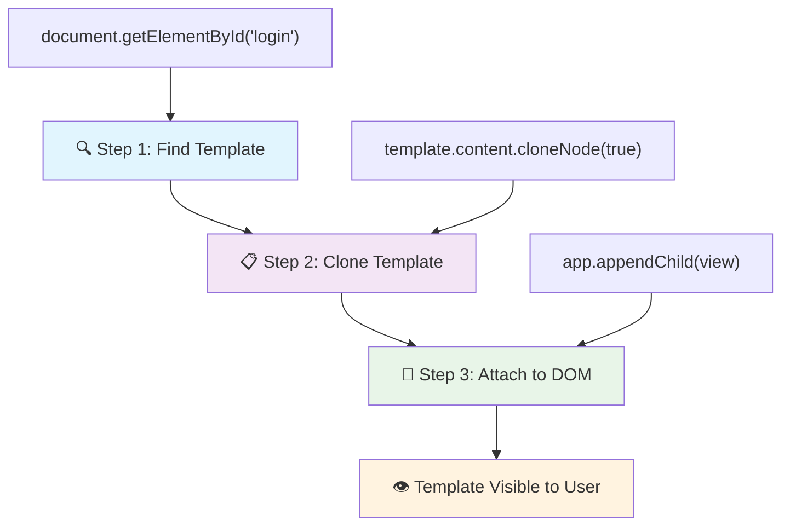
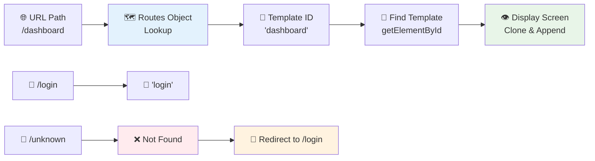
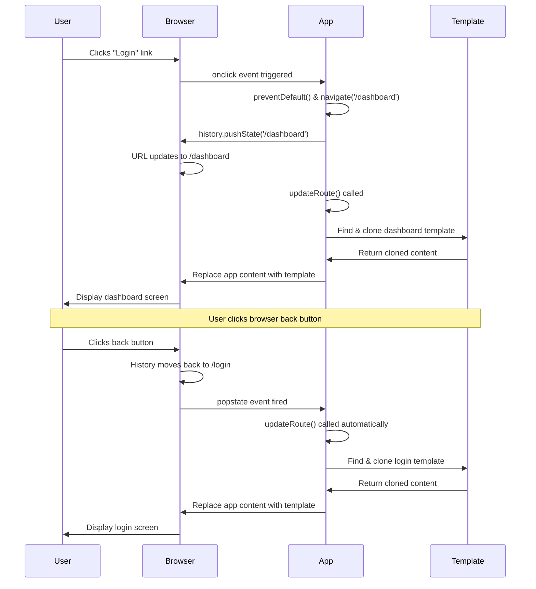

<!--
CO_OP_TRANSLATOR_METADATA:
{
  "original_hash": "5d259f6962464ad91e671083aa0398f4",
  "translation_date": "2025-10-23T21:11:38+00:00",
  "source_file": "7-bank-project/1-template-route/README.md",
  "language_code": "th"
}
-->
# สร้างแอปธนาคาร ตอนที่ 1: เทมเพลต HTML และเส้นทางในเว็บแอป

เมื่อคอมพิวเตอร์นำทางของ Apollo 11 นำทางไปยังดวงจันทร์ในปี 1969 มันต้องสลับระหว่างโปรแกรมต่าง ๆ โดยไม่ต้องรีสตาร์ทระบบทั้งหมด แอปพลิเคชันเว็บสมัยใหม่ทำงานในลักษณะเดียวกัน – เปลี่ยนสิ่งที่คุณเห็นโดยไม่ต้องโหลดทุกอย่างใหม่ตั้งแต่ต้น ซึ่งสร้างประสบการณ์ที่ราบรื่นและตอบสนองที่ผู้ใช้คาดหวังในปัจจุบัน

ต่างจากเว็บไซต์แบบดั้งเดิมที่โหลดหน้าเว็บทั้งหมดใหม่ทุกครั้งที่มีการโต้ตอบ แอปเว็บสมัยใหม่จะอัปเดตเฉพาะส่วนที่ต้องการเปลี่ยนแปลง วิธีการนี้คล้ายกับการที่ศูนย์ควบคุมภารกิจสลับระหว่างหน้าจอแสดงผลต่าง ๆ ในขณะที่ยังคงการสื่อสารอย่างต่อเนื่อง สร้างประสบการณ์ที่ราบรื่นที่เราเคยชิน

นี่คือสิ่งที่ทำให้ความแตกต่างชัดเจน:

| แอปหลายหน้าแบบดั้งเดิม | แอปหน้าเดียวสมัยใหม่ |
|----------------------------|-------------------------|
| **การนำทาง** | โหลดหน้าเว็บใหม่ทั้งหมดสำหรับแต่ละหน้าจอ | สลับเนื้อหาได้ทันที |
| **ประสิทธิภาพ** | ช้ากว่าเนื่องจากต้องดาวน์โหลด HTML ทั้งหมด | เร็วกว่าเพราะอัปเดตเฉพาะส่วนที่จำเป็น |
| **ประสบการณ์ผู้ใช้** | หน้าเว็บกระพริบ | การเปลี่ยนแปลงที่ราบรื่นเหมือนแอป |
| **การแชร์ข้อมูล** | ยากระหว่างหน้า | การจัดการสถานะง่าย |
| **การพัฒนา** | ต้องดูแลไฟล์ HTML หลายไฟล์ | ใช้ HTML เดียวกับเทมเพลตแบบไดนามิก |

**ทำความเข้าใจวิวัฒนาการ:**
- **แอปแบบดั้งเดิม** ต้องการคำขอเซิร์ฟเวอร์สำหรับทุกการกระทำการนำทาง
- **SPA สมัยใหม่** โหลดครั้งเดียวและอัปเดตเนื้อหาแบบไดนามิกโดยใช้ JavaScript
- **ความคาดหวังของผู้ใช้** ตอนนี้ชอบการโต้ตอบที่ทันทีและราบรื่น
- **ประโยชน์ด้านประสิทธิภาพ** รวมถึงการลดแบนด์วิดท์และการตอบสนองที่เร็วขึ้น

ในบทเรียนนี้ เราจะสร้างแอปธนาคารที่มีหลายหน้าจอที่ไหลลื่นไปด้วยกันอย่างราบรื่น เช่นเดียวกับที่นักวิทยาศาสตร์ใช้เครื่องมือแบบโมดูลาร์ที่สามารถปรับเปลี่ยนได้สำหรับการทดลองต่าง ๆ เราจะใช้เทมเพลต HTML เป็นส่วนประกอบที่สามารถนำมาใช้ซ้ำได้ตามต้องการ

คุณจะได้ทำงานกับเทมเพลต HTML (พิมพ์เขียวที่นำมาใช้ซ้ำสำหรับหน้าจอต่าง ๆ), การกำหนดเส้นทางด้วย JavaScript (ระบบที่สลับระหว่างหน้าจอ), และ API ประวัติของเบราว์เซอร์ (ซึ่งทำให้ปุ่มย้อนกลับทำงานตามที่คาดหวัง) สิ่งเหล่านี้เป็นเทคนิคพื้นฐานเดียวกันที่ใช้ในเฟรมเวิร์กอย่าง React, Vue และ Angular

เมื่อจบบทเรียนนี้ คุณจะมีแอปธนาคารที่แสดงหลักการของแอปพลิเคชันหน้าเดียวแบบมืออาชีพ

## แบบทดสอบก่อนเรียน

[แบบทดสอบก่อนเรียน](https://ff-quizzes.netlify.app/web/quiz/41)

### สิ่งที่คุณต้องมี

เราจะต้องมีเซิร์ฟเวอร์เว็บในเครื่องเพื่อทดสอบแอปธนาคารของเรา – ไม่ต้องกังวล มันง่ายกว่าที่คิด! หากคุณยังไม่มีเซิร์ฟเวอร์ในเครื่อง เพียงติดตั้ง [Node.js](https://nodejs.org) และรันคำสั่ง `npx lite-server` จากโฟลเดอร์โปรเจกต์ของคุณ คำสั่งนี้จะช่วยเปิดเซิร์ฟเวอร์ในเครื่องและเปิดแอปของคุณในเบราว์เซอร์โดยอัตโนมัติ

### การเตรียมตัว

บนคอมพิวเตอร์ของคุณ สร้างโฟลเดอร์ชื่อ `bank` พร้อมไฟล์ชื่อ `index.html` ภายใน เราจะเริ่มต้นจาก [boilerplate HTML](https://en.wikipedia.org/wiki/Boilerplate_code):

```html
<!DOCTYPE html>
<html lang="en">
  <head>
    <meta charset="UTF-8">
    <meta name="viewport" content="width=device-width, initial-scale=1.0">
    <title>Bank App</title>
  </head>
  <body>
    <!-- This is where you'll work -->
  </body>
</html>
```

**สิ่งที่ boilerplate นี้ให้:**
- **กำหนด** โครงสร้างเอกสาร HTML5 ด้วยการประกาศ DOCTYPE ที่เหมาะสม
- **ตั้งค่า** การเข้ารหัสตัวอักษรเป็น UTF-8 เพื่อรองรับข้อความระหว่างประเทศ
- **เปิดใช้งาน** การออกแบบที่ตอบสนองด้วยแท็ก meta viewport เพื่อความเข้ากันได้กับมือถือ
- **ตั้งค่า** ชื่อที่อธิบายซึ่งปรากฏในแท็บเบราว์เซอร์
- **สร้าง** ส่วน body ที่สะอาดซึ่งเราจะสร้างแอปพลิเคชันของเรา

> 📁 **ตัวอย่างโครงสร้างโปรเจกต์**
> 
> **เมื่อจบบทเรียนนี้ โปรเจกต์ของคุณจะมี:**
> ```
> bank/
> ├── index.html      <!-- Main HTML with templates -->
> ├── app.js          <!-- Routing and navigation logic -->
> └── style.css       <!-- (Optional for future lessons) -->
> ```
> 
> **หน้าที่ของไฟล์:**
> - **index.html**: มีเทมเพลตทั้งหมดและให้โครงสร้างแอป
> - **app.js**: จัดการการกำหนดเส้นทาง การนำทาง และการจัดการเทมเพลต
> - **Templates**: กำหนด UI สำหรับหน้าจอเข้าสู่ระบบ แดชบอร์ด และหน้าจออื่น ๆ

---

## เทมเพลต HTML

เทมเพลตแก้ปัญหาพื้นฐานในพัฒนาเว็บ เมื่อกูเทนเบิร์กคิดค้นการพิมพ์ตัวอักษรแบบเคลื่อนที่ในปี 1440 เขาตระหนักว่าแทนที่จะแกะสลักหน้าทั้งหมด เขาสามารถสร้างบล็อกตัวอักษรที่นำมาใช้ซ้ำได้และจัดเรียงตามต้องการ เทมเพลต HTML ทำงานบนหลักการเดียวกัน – แทนที่จะสร้างไฟล์ HTML แยกสำหรับแต่ละหน้าจอ คุณกำหนดโครงสร้างที่นำมาใช้ซ้ำได้ซึ่งสามารถแสดงผลเมื่อจำเป็น

คิดว่าเทมเพลตเป็นพิมพ์เขียวสำหรับส่วนต่าง ๆ ของแอปของคุณ เช่นเดียวกับที่สถาปนิกสร้างพิมพ์เขียวครั้งเดียวและใช้มันหลายครั้งแทนที่จะวาดห้องที่เหมือนกันใหม่ เราสร้างเทมเพลตครั้งเดียวและนำมาใช้เมื่อจำเป็น เบราว์เซอร์จะเก็บเทมเพลตเหล่านี้ไว้จนกว่า JavaScript จะเปิดใช้งาน

หากคุณต้องการสร้างหน้าจอหลายหน้าสำหรับหน้าเว็บ วิธีหนึ่งคือการสร้างไฟล์ HTML หนึ่งไฟล์สำหรับทุกหน้าจอที่คุณต้องการแสดง อย่างไรก็ตาม วิธีนี้มาพร้อมกับความไม่สะดวก:

- คุณต้องโหลด HTML ทั้งหมดใหม่เมื่อสลับหน้าจอ ซึ่งอาจช้า
- การแชร์ข้อมูลระหว่างหน้าจอต่าง ๆ เป็นเรื่องยาก

อีกวิธีหนึ่งคือการมีไฟล์ HTML เพียงไฟล์เดียว และกำหนด [HTML templates](https://developer.mozilla.org/docs/Web/HTML/Element/template) หลายตัวโดยใช้ `<template>` element เทมเพลตเป็นบล็อก HTML ที่นำมาใช้ซ้ำได้ซึ่งเบราว์เซอร์ไม่แสดง และต้องถูกสร้างขึ้นใน runtime โดยใช้ JavaScript

### มาสร้างกันเถอะ

เรากำลังจะสร้างแอปธนาคารที่มีหน้าจอหลักสองหน้าจอ: หน้าล็อกอินและแดชบอร์ด ก่อนอื่น ให้เพิ่มองค์ประกอบ placeholder ลงใน body ของ HTML ของเรา – นี่คือที่ที่หน้าจอต่าง ๆ ของเราจะปรากฏ:

```html
<div id="app">Loading...</div>
```

**ทำความเข้าใจ placeholder นี้:**
- **สร้าง** container ที่มี ID "app" ซึ่งหน้าจอทั้งหมดจะถูกแสดง
- **แสดง**ข้อความโหลดจนกว่า JavaScript จะเริ่มต้นหน้าจอแรก
- **ให้**จุดติดตั้งเดียวสำหรับเนื้อหาแบบไดนามิกของเรา
- **ช่วยให้**การกำหนดเป้าหมายจาก JavaScript ง่ายขึ้นโดยใช้ `document.getElementById()`

> 💡 **เคล็ดลับ**: เนื่องจากเนื้อหาขององค์ประกอบนี้จะถูกแทนที่ เราสามารถใส่ข้อความหรือตัวบ่งชี้การโหลดที่จะแสดงในขณะที่แอปกำลังโหลด

ต่อไป ให้เพิ่มเทมเพลต HTML สำหรับหน้าล็อกอินด้านล่าง สำหรับตอนนี้เราจะใส่แค่หัวข้อและส่วนที่มีลิงก์ที่เราจะใช้ในการนำทาง

```html
<template id="login">
  <h1>Bank App</h1>
  <section>
    <a href="/dashboard">Login</a>
  </section>
</template>
```

**การวิเคราะห์เทมเพลตล็อกอินนี้:**
- **กำหนด**เทมเพลตด้วยตัวระบุเฉพาะ "login" เพื่อการกำหนดเป้าหมายด้วย JavaScript
- **รวม**หัวข้อหลักที่สร้างแบรนด์ของแอป
- **มี**องค์ประกอบ `<section>` ที่มีความหมายเพื่อจัดกลุ่มเนื้อหาที่เกี่ยวข้อง
- **ให้**ลิงก์นำทางที่จะนำผู้ใช้ไปยังแดชบอร์ด

จากนั้นเราจะเพิ่มเทมเพลต HTML อีกตัวสำหรับหน้าแดชบอร์ด หน้านี้จะมีส่วนต่าง ๆ ดังนี้:

- ส่วนหัวที่มีชื่อเรื่องและลิงก์ออกจากระบบ
- ยอดเงินปัจจุบันในบัญชีธนาคาร
- รายการธุรกรรมที่แสดงในตาราง

```html
<template id="dashboard">
  <header>
    <h1>Bank App</h1>
    <a href="/login">Logout</a>
  </header>
  <section>
    Balance: 100$
  </section>
  <section>
    <h2>Transactions</h2>
    <table>
      <thead>
        <tr>
          <th>Date</th>
          <th>Object</th>
          <th>Amount</th>
        </tr>
      </thead>
      <tbody></tbody>
    </table>
  </section>
</template>
```

**มาทำความเข้าใจแต่ละส่วนของแดชบอร์ดนี้:**
- **จัดโครงสร้าง**หน้าเว็บด้วยองค์ประกอบ `<header>` ที่มีความหมายซึ่งมีการนำทาง
- **แสดง**ชื่อแอปอย่างสม่ำเสมอในหน้าจอเพื่อสร้างแบรนด์
- **ให้**ลิงก์ออกจากระบบที่นำกลับไปยังหน้าล็อกอิน
- **แสดง**ยอดเงินบัญชีปัจจุบันในส่วนที่กำหนด
- **จัดระเบียบ**ข้อมูลธุรกรรมโดยใช้ตาราง HTML ที่มีโครงสร้างอย่างเหมาะสม
- **กำหนด**หัวตารางสำหรับคอลัมน์วันที่ รายการ และจำนวนเงิน
- **เว้นว่าง**ส่วนเนื้อหาตารางสำหรับการฉีดเนื้อหาแบบไดนามิกในภายหลัง

> 💡 **เคล็ดลับ**: เมื่อสร้างเทมเพลต HTML หากคุณต้องการดูว่ามันจะมีลักษณะอย่างไร คุณสามารถแสดงความคิดเห็นบรรทัด `<template>` และ `</template>` โดยใส่ไว้ใน `<!-- -->`

✅ ทำไมคุณคิดว่าเราต้องใช้ `id` ในเทมเพลต? เราสามารถใช้สิ่งอื่นเช่น class ได้หรือไม่?

## ทำให้เทมเพลตมีชีวิตด้วย JavaScript

ตอนนี้เราต้องทำให้เทมเพลตของเราทำงานได้ เหมือนกับที่เครื่องพิมพ์ 3D ใช้พิมพ์เขียวดิจิทัลและสร้างวัตถุจริง JavaScript ใช้เทมเพลตที่ซ่อนอยู่ของเราและสร้างองค์ประกอบที่มองเห็นได้และโต้ตอบได้ที่ผู้ใช้สามารถเห็นและใช้งานได้

กระบวนการนี้มี 3 ขั้นตอนที่สม่ำเสมอซึ่งเป็นพื้นฐานของการพัฒนาเว็บสมัยใหม่ เมื่อคุณเข้าใจรูปแบบนี้ คุณจะสามารถรับรู้ได้ในเฟรมเวิร์กและไลบรารีหลายตัว

หากคุณลองไฟล์ HTML ปัจจุบันในเบราว์เซอร์ คุณจะเห็นว่ามันติดอยู่ที่การแสดง `Loading...` นั่นเป็นเพราะเราต้องเพิ่มโค้ด JavaScript เพื่อสร้างและแสดงเทมเพลต HTML

การสร้างเทมเพลตมักทำใน 3 ขั้นตอน:

1. ดึงองค์ประกอบเทมเพลตใน DOM เช่นโดยใช้ [`document.getElementById`](https://developer.mozilla.org/docs/Web/API/Document/getElementById)
2. โคลนองค์ประกอบเทมเพลต โดยใช้ [`cloneNode`](https://developer.mozilla.org/docs/Web/API/Node/cloneNode)
3. แนบมันเข้ากับ DOM ใต้องค์ประกอบที่มองเห็นได้ เช่นโดยใช้ [`appendChild`](https://developer.mozilla.org/docs/Web/API/Node/appendChild)



**การวิเคราะห์ภาพของกระบวนการ:**
- **ขั้นตอนที่ 1** ค้นหาเทมเพลตที่ซ่อนอยู่ในโครงสร้าง DOM
- **ขั้นตอนที่ 2** สร้างสำเนาที่สามารถแก้ไขได้อย่างปลอดภัย
- **ขั้นตอนที่ 3** แทรกสำเนาเข้าไปในพื้นที่หน้าเว็บที่มองเห็นได้
- **ผลลัพธ์** คือหน้าจอที่ใช้งานได้ซึ่งผู้ใช้สามารถโต้ตอบได้

✅ ทำไมเราต้องโคลนเทมเพลตก่อนแนบเข้ากับ DOM? คุณคิดว่าจะเกิดอะไรขึ้นหากเราข้ามขั้นตอนนี้?

### งาน

สร้างไฟล์ใหม่ชื่อ `app.js` ในโฟลเดอร์โปรเจกต์ของคุณและนำเข้าไฟล์นั้นในส่วน `<head>` ของ HTML:

```html
<script src="app.js" defer></script>
```

**การทำความเข้าใจการนำเข้า script นี้:**
- **เชื่อมโยง**ไฟล์ JavaScript กับเอกสาร HTML ของเรา
- **ใช้**แอตทริบิวต์ `defer` เพื่อให้สคริปต์ทำงานหลังจากการวิเคราะห์ HTML เสร็จสิ้น
- **เปิดใช้งาน**การเข้าถึงองค์ประกอบ DOM ทั้งหมดเนื่องจากโหลดเสร็จสมบูรณ์ก่อนการดำเนินการสคริปต์
- **ปฏิบัติตาม**แนวทางปฏิบัติที่ดีที่สุดในปัจจุบันสำหรับการโหลดสคริปต์และประสิทธิภาพ

ตอนนี้ใน `app.js` เราจะสร้างฟังก์ชันใหม่ชื่อ `updateRoute`:

```js
function updateRoute(templateId) {
  const template = document.getElementById(templateId);
  const view = template.content.cloneNode(true);
  const app = document.getElementById('app');
  app.innerHTML = '';
  app.appendChild(view);
}
```

**ทีละขั้นตอน นี่คือสิ่งที่เกิดขึ้น:**
- **ค้นหา**องค์ประกอบเทมเพลตโดยใช้ ID เฉพาะของมัน
- **สร้าง**สำเนาลึกของเนื้อหาเทมเพลตโดยใช้ `cloneNode(true)`
- **ค้นหา** container ของแอปที่เนื้อหาจะถูกแสดง
- **ล้าง**เนื้อหาที่มีอยู่ใน container ของแอป
- **แทรก**เนื้อหาเทมเพลตที่โคลนเข้าไปใน DOM ที่มองเห็นได้

ตอนนี้เรียกฟังก์ชันนี้ด้วยหนึ่งในเทมเพลตและดูผลลัพธ์

```js
updateRoute('login');
```

**สิ่งที่การเรียกฟังก์ชันนี้ทำสำเร็จ:**
- **เปิดใช้งาน**เทมเพลตล็อกอินโดยส่ง ID เป็นพารามิเตอร์
- **แสดงให้เห็น**วิธีการสลับระหว่างหน้าจอแอปต่าง ๆ ด้วยโปรแกรม
- **แสดง**หน้าจอล็อกอินแทนข้อความ "Loading..."

✅ วัตถุประสงค์ของโค้ดนี้ `app.innerHTML = '';` คืออะไร? จะเกิดอะไรขึ้นหากไม่มีมัน?

## การสร้างเส้นทาง

การกำหนดเส้นทางเป็นเรื่องของการเชื่อมโยง URL กับเนื้อหาที่ถูกต้อง ลองนึกถึงการที่ผู้ให้บริการโทรศัพท์ในยุคแรกใช้ switchboards เพื่อเชื่อมต่อสาย – พวกเขาจะรับคำขอที่เข้ามาและกำหนดเส้นทางไปยังปลายทางที่ถูกต้อง การกำหนดเส้นทางเว็บทำงานในลักษณะเดียวกัน โดยรับคำขอ URL และกำหนดว่าเนื้อหาใดควรแสดง

โดยปกติ เซิร์ฟเวอร์เว็บจะจัดการเรื่องนี้โดยการให้บริการไฟล์ HTML ต่าง ๆ สำหรับ URL ต่าง ๆ เนื่องจากเรากำลังสร้างแอปหน้าเดียว เราจำเป็นต้องจัดการการกำหนดเส้นทางนี้ด้วยตัวเองโดยใช้ JavaScript วิธีนี้ทำให้เราสามารถควบคุมประสบการณ์ผู้ใช้และประสิทธิภาพได้มากขึ้น



**การทำความเข้าใจการไหลของการกำหนดเส้นทาง:**
- **การเปลี่ยนแปลง URL** กระตุ้นการค้นหาในการกำหนดค่าการกำหนดเส้นทางของเรา
- **เส้นทางที่ถูกต้อง** เชื่อมโยงกับ ID เทมเพลตเฉพาะสำหรับการแสดงผล
- **เส้นทางที่ไม่ถูกต้อง** กระตุ้นพฤติกรรมสำรองเพื่อป้องกันสถานะที่เสียหาย
- **การแสดงผลเทมเพลต** ปฏิบัติตามกระบวนการสามขั้นตอนที่เราเรียนรู้มาก่อนหน้านี้

เมื่อพูดถึงเว็บแอป เราเรียก *การกำหนดเส้นทาง* ว่าความตั้งใจที่จะเชื่อมโยง **URL** กับหน้าจอเฉพาะที่ควรแสดง ในเว็บไซต์ที่มีไฟล์ HTML หลายไฟล์ สิ่งนี้จะทำโดยอัตโนมัติเนื่องจากเส้นทางไฟล์สะท้อนอยู่ใน URL ตัวอย่างเช่น ด้วยไฟล์เหล่านี้ในโฟลเดอร์โปรเจกต์ของคุณ:

```
mywebsite/index.html
mywebsite/login.html
mywebsite/admin/index.html
```

หากคุณสร้างเซิร์ฟเวอร์เว็บโดยมี `mywebsite` เป็น root การแมป URL จะเป็น:

```
https://site.com            --> mywebsite/index.html
https://site.com/login.html --> mywebsite/login.html
https://site.com/admin/     --> mywebsite/admin/index.html
```

อย่างไรก็ตาม สำหรับเว็บแอปของเรา เรากำลังใช้ไฟล์ HTML เดียวที่มีหน้าจอทั้งหมด ดังนั้นพฤติกรรมเริ่มต้นนี้
✅ จะเกิดอะไรขึ้นถ้าคุณใส่เส้นทางที่ไม่รู้จักใน URL? เราจะแก้ไขปัญหานี้ได้อย่างไร?

## เพิ่มระบบนำทาง

เมื่อมีการตั้งค่าการกำหนดเส้นทางแล้ว ผู้ใช้จำเป็นต้องมีวิธีการนำทางผ่านแอป เว็บไซต์แบบดั้งเดิมจะโหลดหน้าเว็บใหม่ทั้งหมดเมื่อคลิกลิงก์ แต่เราต้องการอัปเดตทั้ง URL และเนื้อหาโดยไม่ต้องรีเฟรชหน้าเว็บ วิธีนี้จะช่วยสร้างประสบการณ์ที่ราบรื่นเหมือนกับแอปพลิเคชันบนเดสก์ท็อปที่เปลี่ยนมุมมองต่างๆ

เราต้องประสานสองสิ่งนี้: การอัปเดต URL ของเบราว์เซอร์เพื่อให้ผู้ใช้สามารถบันทึกหน้าและแชร์ลิงก์ และการแสดงเนื้อหาที่เหมาะสม เมื่อดำเนินการอย่างถูกต้อง จะสร้างการนำทางที่ราบรื่นตามที่ผู้ใช้คาดหวังจากแอปพลิเคชันสมัยใหม่

> 🏗️ **ข้อมูลเชิงลึกเกี่ยวกับสถาปัตยกรรม**: ส่วนประกอบของระบบนำทาง
>
> **สิ่งที่คุณกำลังสร้าง:**
> - **🔄 การจัดการ URL**: อัปเดตแถบที่อยู่ของเบราว์เซอร์โดยไม่ต้องโหลดหน้าใหม่
> - **📋 ระบบเทมเพลต**: สลับเนื้อหาแบบไดนามิกตามเส้นทางปัจจุบัน  
> - **📚 การรวมประวัติ**: รักษาฟังก์ชันการทำงานของปุ่มย้อนกลับ/ไปข้างหน้าของเบราว์เซอร์
> - **🛡️ การจัดการข้อผิดพลาด**: การแก้ไขปัญหาอย่างราบรื่นสำหรับเส้นทางที่ไม่ถูกต้องหรือขาดหายไป
>
> **การทำงานร่วมกันของส่วนประกอบ:**
> - **ฟัง** เหตุการณ์การนำทาง (การคลิก การเปลี่ยนแปลงประวัติ)
> - **อัปเดต** URL โดยใช้ History API
> - **แสดงผล** เทมเพลตที่เหมาะสมสำหรับเส้นทางใหม่
> - **รักษา** ประสบการณ์ผู้ใช้ที่ราบรื่นตลอดเวลา

ขั้นตอนต่อไปสำหรับแอปของเราคือการเพิ่มความสามารถในการนำทางระหว่างหน้าโดยไม่ต้องเปลี่ยน URL ด้วยตนเอง ซึ่งหมายถึงสองสิ่ง:

  1. อัปเดต URL ปัจจุบัน
  2. อัปเดตเทมเพลตที่แสดงผลตาม URL ใหม่

เราได้ดูแลส่วนที่สองด้วยฟังก์ชัน `updateRoute` แล้ว ดังนั้นเราต้องหาวิธีอัปเดต URL ปัจจุบัน

เราจะต้องใช้ JavaScript และโดยเฉพาะอย่างยิ่ง [`history.pushState`](https://developer.mozilla.org/docs/Web/API/History/pushState) ซึ่งช่วยให้อัปเดต URL และสร้างรายการใหม่ในประวัติการท่องเว็บโดยไม่ต้องโหลด HTML ใหม่

> ⚠️ **หมายเหตุสำคัญ**: แม้ว่าองค์ประกอบ HTML anchor [`<a href>`](https://developer.mozilla.org/docs/Web/HTML/Element/a) สามารถใช้สร้างไฮเปอร์ลิงก์ไปยัง URL ต่างๆ ได้ด้วยตัวเอง แต่โดยค่าเริ่มต้นมันจะทำให้เบราว์เซอร์โหลด HTML ใหม่ จำเป็นต้องป้องกันพฤติกรรมนี้เมื่อจัดการการกำหนดเส้นทางด้วย JavaScript แบบกำหนดเอง โดยใช้ฟังก์ชัน `preventDefault()` บนเหตุการณ์คลิก

### งาน

มาสร้างฟังก์ชันใหม่ที่เราสามารถใช้ในการนำทางในแอปของเรา:

```js
function navigate(path) {
  window.history.pushState({}, path, path);
  updateRoute();
}
```

**การทำความเข้าใจฟังก์ชันการนำทางนี้:**
- **อัปเดต** URL ของเบราว์เซอร์ไปยังเส้นทางใหม่โดยใช้ `history.pushState`
- **เพิ่ม** รายการใหม่ในสแต็กประวัติของเบราว์เซอร์เพื่อรองรับปุ่มย้อนกลับ/ไปข้างหน้า
- **เรียกใช้** ฟังก์ชัน `updateRoute()` เพื่อแสดงเทมเพลตที่เกี่ยวข้อง
- **รักษา** ประสบการณ์แอปหน้าเดียวโดยไม่ต้องโหลดหน้าใหม่

วิธีนี้จะอัปเดต URL ปัจจุบันตามเส้นทางที่กำหนดก่อน แล้วจึงอัปเดตเทมเพลต คุณสมบัติ `window.location.origin` จะคืนค่ารากของ URL ซึ่งช่วยให้เราสร้าง URL ที่สมบูรณ์จากเส้นทางที่กำหนดได้

ตอนนี้เรามีฟังก์ชันนี้แล้ว เราสามารถจัดการปัญหาที่เกิดขึ้นเมื่อเส้นทางไม่ตรงกับเส้นทางที่กำหนดไว้ เราจะปรับเปลี่ยนฟังก์ชัน `updateRoute` โดยเพิ่มการแก้ไขปัญหาไปยังหนึ่งในเส้นทางที่มีอยู่หากเราไม่พบการจับคู่

```js
function updateRoute() {
  const path = window.location.pathname;
  const route = routes[path];

  if (!route) {
    return navigate('/login');
  }

  const template = document.getElementById(route.templateId);
  const view = template.content.cloneNode(true);
  const app = document.getElementById('app');
  app.innerHTML = '';
  app.appendChild(view);
}
```

**จุดสำคัญที่ต้องจำ:**
- **ตรวจสอบ** ว่ามีเส้นทางสำหรับเส้นทางปัจจุบันหรือไม่
- **เปลี่ยนเส้นทาง** ไปยังหน้าเข้าสู่ระบบเมื่อเข้าถึงเส้นทางที่ไม่ถูกต้อง
- **ให้** กลไกการแก้ไขปัญหาที่ป้องกันการนำทางที่เสียหาย
- **รับรอง** ว่าผู้ใช้จะเห็นหน้าจอที่ถูกต้องเสมอ แม้ในกรณีที่ URL ไม่ถูกต้อง

หากไม่พบเส้นทาง เราจะเปลี่ยนเส้นทางไปยังหน้า `login`

ตอนนี้มาสร้างฟังก์ชันเพื่อรับ URL เมื่อคลิกลิงก์ และป้องกันพฤติกรรมลิงก์เริ่มต้นของเบราว์เซอร์:

```js
function onLinkClick(event) {
  event.preventDefault();
  navigate(event.target.href);
}
```

**การแยกย่อยตัวจัดการคลิกนี้:**
- **ป้องกัน** พฤติกรรมลิงก์เริ่มต้นของเบราว์เซอร์โดยใช้ `preventDefault()`
- **ดึง** URL ปลายทางจากองค์ประกอบลิงก์ที่คลิก
- **เรียกใช้** ฟังก์ชันการนำทางแบบกำหนดเองแทนการโหลดหน้าใหม่
- **รักษา** ประสบการณ์แอปหน้าเดียวที่ราบรื่น

```html
<a href="/dashboard" onclick="onLinkClick(event)">Login</a>
...
<a href="/login" onclick="onLinkClick(event)">Logout</a>
```

**สิ่งที่การผูก onclick นี้ทำได้:**
- **เชื่อมโยง** ลิงก์แต่ละลิงก์กับระบบนำทางแบบกำหนดเองของเรา
- **ส่งผ่าน** เหตุการณ์คลิกไปยังฟังก์ชัน `onLinkClick` ของเราเพื่อประมวลผล
- **เปิดใช้งาน** การนำทางที่ราบรื่นโดยไม่ต้องโหลดหน้าใหม่
- **รักษา** โครงสร้าง URL ที่เหมาะสมที่ผู้ใช้สามารถบันทึกหรือแชร์ได้

แอตทริบิวต์ [`onclick`](https://developer.mozilla.org/docs/Web/API/GlobalEventHandlers/onclick) จะผูกเหตุการณ์ `click` กับโค้ด JavaScript ที่นี่คือการเรียกฟังก์ชัน `navigate()`

ลองคลิกที่ลิงก์เหล่านี้ คุณควรจะสามารถนำทางระหว่างหน้าจอต่างๆ ของแอปของคุณได้แล้ว

✅ เมธอด `history.pushState` เป็นส่วนหนึ่งของมาตรฐาน HTML5 และถูกนำไปใช้ใน [เบราว์เซอร์สมัยใหม่ทั้งหมด](https://caniuse.com/?search=pushState) หากคุณกำลังสร้างเว็บแอปสำหรับเบราว์เซอร์รุ่นเก่า มีเคล็ดลับที่คุณสามารถใช้แทน API นี้ได้: การใช้ [hash (`#`)](https://en.wikipedia.org/wiki/URI_fragment) ก่อนเส้นทาง คุณสามารถใช้การกำหนดเส้นทางที่ทำงานร่วมกับการนำทางลิงก์ปกติและไม่โหลดหน้าใหม่ เนื่องจากมีวัตถุประสงค์เพื่อสร้างลิงก์ภายในหน้า

## ทำให้ปุ่มย้อนกลับและไปข้างหน้าทำงาน

ปุ่มย้อนกลับและไปข้างหน้าเป็นสิ่งสำคัญสำหรับการท่องเว็บ เช่นเดียวกับที่ผู้ควบคุมภารกิจของ NASA สามารถตรวจสอบสถานะระบบก่อนหน้าได้ในระหว่างภารกิจอวกาศ ผู้ใช้คาดหวังว่าปุ่มเหล่านี้จะทำงาน และเมื่อไม่ทำงาน มันจะทำลายประสบการณ์การท่องเว็บที่คาดหวัง

แอปหน้าเดียวของเราต้องการการกำหนดค่าเพิ่มเติมเพื่อรองรับสิ่งนี้ เบราว์เซอร์รักษาสแต็กประวัติ (ซึ่งเราได้เพิ่มด้วย `history.pushState`) แต่เมื่อผู้ใช้นำทางผ่านประวัติ แอปของเราต้องตอบสนองโดยการอัปเดตเนื้อหาที่แสดงผลตามนั้น



**จุดปฏิสัมพันธ์สำคัญ:**
- **การกระทำของผู้ใช้** กระตุ้นการนำทางผ่านการคลิกหรือปุ่มเบราว์เซอร์
- **แอปสกัดกั้น** การคลิกลิงก์เพื่อป้องกันการโหลดหน้าใหม่
- **History API** จัดการการเปลี่ยนแปลง URL และสแต็กประวัติของเบราว์เซอร์
- **เทมเพลต** ให้โครงสร้างเนื้อหาสำหรับแต่ละหน้าจอ
- **ตัวฟังเหตุการณ์** รับรองว่าแอปตอบสนองต่อการนำทางทุกประเภท

การใช้ `history.pushState` สร้างรายการใหม่ในประวัติการนำทางของเบราว์เซอร์ คุณสามารถตรวจสอบได้โดยการกดปุ่ม *ย้อนกลับ* ของเบราว์เซอร์ มันควรจะแสดงบางอย่างเช่นนี้:


หากคุณลองคลิกปุ่มย้อนกลับหลายครั้ง คุณจะเห็นว่า URL ปัจจุบันเปลี่ยนไปและประวัติได้รับการอัปเดต แต่เทมเพลตเดียวกันยังคงแสดงผลอยู่

นั่นเป็นเพราะแอปพลิเคชันไม่ทราบว่าเราต้องเรียก `updateRoute()` ทุกครั้งที่ประวัติเปลี่ยนแปลง หากคุณดูเอกสาร [`history.pushState`](https://developer.mozilla.org/docs/Web/API/History/pushState) คุณจะเห็นว่าหากสถานะเปลี่ยนแปลง - หมายความว่าเราได้ย้ายไปยัง URL ที่แตกต่างกัน - เหตุการณ์ [`popstate`](https://developer.mozilla.org/docs/Web/API/Window/popstate_event) จะถูกกระตุ้น เราจะใช้สิ่งนั้นเพื่อแก้ไขปัญหานี้

### งาน

เพื่อให้แน่ใจว่าเทมเพลตที่แสดงผลได้รับการอัปเดตเมื่อประวัติของเบราว์เซอร์เปลี่ยนแปลง เราจะผูกฟังก์ชันใหม่ที่เรียก `updateRoute()` เราจะทำสิ่งนี้ที่ด้านล่างของไฟล์ `app.js` ของเรา:

```js
window.onpopstate = () => updateRoute();
updateRoute();
```

**การทำความเข้าใจการรวมประวัตินี้:**
- **ฟัง** เหตุการณ์ `popstate` ที่เกิดขึ้นเมื่อผู้ใช้นำทางด้วยปุ่มเบราว์เซอร์
- **ใช้** ฟังก์ชันลูกศรสำหรับไวยากรณ์ตัวจัดการเหตุการณ์ที่กระชับ
- **เรียกใช้** `updateRoute()` โดยอัตโนมัติทุกครั้งที่สถานะประวัติเปลี่ยนแปลง
- **เริ่มต้น** แอปโดยการเรียก `updateRoute()` เมื่อหน้าโหลดครั้งแรก
- **รับรอง** ว่าเทมเพลตที่ถูกต้องจะแสดงผลไม่ว่าผู้ใช้จะนำทางอย่างไร

> 💡 **เคล็ดลับมือโปร**: เราใช้ [ฟังก์ชันลูกศร](https://developer.mozilla.org/docs/Web/JavaScript/Reference/Functions/Arrow_functions) ที่นี่เพื่อประกาศตัวจัดการเหตุการณ์ `popstate` ของเราเพื่อความกระชับ แต่ฟังก์ชันปกติก็สามารถทำงานได้เหมือนกัน

นี่คือวิดีโอรีเฟรชเกี่ยวกับฟังก์ชันลูกศร:

[](https://youtube.com/watch?v=OP6eEbOj2sc "ฟังก์ชันลูกศร")

> 🎥 คลิกที่ภาพด้านบนเพื่อดูวิดีโอเกี่ยวกับฟังก์ชันลูกศร

ตอนนี้ลองใช้ปุ่มย้อนกลับและไปข้างหน้าของเบราว์เซอร์ของคุณ และตรวจสอบว่าเส้นทางที่แสดงผลได้รับการอัปเดตอย่างถูกต้องในครั้งนี้

---

## ความท้าทาย GitHub Copilot Agent 🚀

ใช้โหมด Agent เพื่อทำความท้าทายต่อไปนี้:

**คำอธิบาย:** ปรับปรุงแอปธนาคารโดยการเพิ่มการจัดการข้อผิดพลาดและเทมเพลตหน้า 404 สำหรับเส้นทางที่ไม่ถูกต้อง เพื่อปรับปรุงประสบการณ์ผู้ใช้เมื่อไปยังหน้าที่ไม่มีอยู่

**คำสั่ง:** สร้างเทมเพลต HTML ใหม่ที่มี id "not-found" ซึ่งแสดงหน้า 404 ที่เป็นมิตรต่อผู้ใช้พร้อมการจัดสไตล์ จากนั้นปรับเปลี่ยนตรรกะการกำหนดเส้นทาง JavaScript เพื่อแสดงเทมเพลตนี้เมื่อผู้ใช้นำทางไปยัง URL ที่ไม่ถูกต้อง และเพิ่มปุ่ม "Go Home" ที่นำทางกลับไปยังหน้าเข้าสู่ระบบ

เรียนรู้เพิ่มเติมเกี่ยวกับ [โหมด Agent](https://code.visualstudio.com/blogs/2025/02/24/introducing-copilot-agent-mode) ที่นี่

## 🚀 ความท้าทาย

เพิ่มเทมเพลตและเส้นทางใหม่สำหรับหน้าที่สามที่แสดงเครดิตสำหรับแอปนี้

**เป้าหมายของความท้าทาย:**
- **สร้าง** เทมเพลต HTML ใหม่ที่มีโครงสร้างเนื้อหาที่เหมาะสม
- **เพิ่ม** เส้นทางใหม่ในวัตถุการกำหนดค่าของเส้นทางของคุณ
- **รวม** ลิงก์นำทางไปและกลับจากหน้าครดิต
- **ทดสอบ** ว่าการนำทางทั้งหมดทำงานอย่างถูกต้องกับประวัติของเบราว์เซอร์

## แบบทดสอบหลังการบรรยาย

[แบบทดสอบหลังการบรรยาย](https://ff-quizzes.netlify.app/web/quiz/42)

## ทบทวนและศึกษาด้วยตนเอง

การกำหนดเส้นทางเป็นหนึ่งในส่วนที่ยุ่งยากอย่างน่าประหลาดใจของการพัฒนาเว็บ โดยเฉพาะอย่างยิ่งเมื่อเว็บเปลี่ยนจากพฤติกรรมการรีเฟรชหน้าไปเป็นการรีเฟรชหน้าในแอปพลิเคชันหน้าเดียว ลองอ่านเกี่ยวกับ [วิธีที่บริการ Azure Static Web App](https://docs.microsoft.com/azure/static-web-apps/routes/?WT.mc_id=academic-77807-sagibbon) จัดการการกำหนดเส้นทาง คุณสามารถอธิบายได้ไหมว่าทำไมการตัดสินใจบางอย่างที่อธิบายไว้ในเอกสารนั้นจึงจำเป็น?

**แหล่งเรียนรู้เพิ่มเติม:**
- **สำรวจ** วิธีที่เฟรมเวิร์กยอดนิยมอย่าง React Router และ Vue Router ใช้การกำหนดเส้นทางฝั่งไคลเอนต์
- **ค้นคว้า** ความแตกต่างระหว่างการกำหนดเส้นทางแบบ hash-based และ history API
- **เรียนรู้** เกี่ยวกับการเรนเดอร์ฝั่งเซิร์ฟเวอร์ (SSR) และวิธีที่มันส่งผลต่อกลยุทธ์การกำหนดเส้นทาง
- **ตรวจสอบ** วิธีที่ Progressive Web Apps (PWAs) จัดการการกำหนดเส้นทางและการนำทาง

## งานที่ได้รับมอบหมาย

[ปรับปรุงการกำหนดเส้นทาง](assignment.md)

---

**ข้อจำกัดความรับผิดชอบ**:  
เอกสารนี้ได้รับการแปลโดยใช้บริการแปลภาษา AI [Co-op Translator](https://github.com/Azure/co-op-translator) แม้ว่าเราจะพยายามให้การแปลมีความถูกต้อง แต่โปรดทราบว่าการแปลอัตโนมัติอาจมีข้อผิดพลาดหรือความไม่ถูกต้อง เอกสารต้นฉบับในภาษาดั้งเดิมควรถือเป็นแหล่งข้อมูลที่เชื่อถือได้ สำหรับข้อมูลสำคัญ ขอแนะนำให้ใช้บริการแปลภาษามืออาชีพ เราจะไม่รับผิดชอบต่อความเข้าใจผิดหรือการตีความผิดที่เกิดจากการใช้การแปลนี้