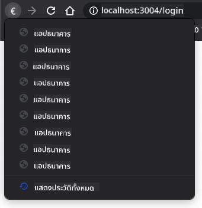

<!--
CO_OP_TRANSLATOR_METADATA:
{
  "original_hash": "8a07db14e75ac62f013b7de5df05981d",
  "translation_date": "2025-08-29T07:28:54+00:00",
  "source_file": "7-bank-project/1-template-route/README.md",
  "language_code": "th"
}
-->
# สร้างแอปธนาคาร ตอนที่ 1: HTML Templates และ Routes ในเว็บแอป

## แบบทดสอบก่อนเรียน

[แบบทดสอบก่อนเรียน](https://ff-quizzes.netlify.app/web/quiz/41)

### บทนำ

ตั้งแต่การมาของ JavaScript ในเบราว์เซอร์ เว็บไซต์ก็เริ่มมีความโต้ตอบและซับซ้อนมากขึ้นกว่าเดิม เทคโนโลยีเว็บในปัจจุบันถูกนำมาใช้สร้างแอปพลิเคชันที่ทำงานได้เต็มรูปแบบในเบราว์เซอร์ ซึ่งเราเรียกว่า [เว็บแอปพลิเคชัน](https://en.wikipedia.org/wiki/Web_application) เนื่องจากเว็บแอปมีความโต้ตอบสูง ผู้ใช้จึงไม่ต้องการรอให้หน้าเว็บโหลดใหม่ทุกครั้งที่มีการดำเนินการ นั่นคือเหตุผลที่ JavaScript ถูกใช้เพื่ออัปเดต HTML โดยตรงผ่าน DOM เพื่อมอบประสบการณ์การใช้งานที่ราบรื่นยิ่งขึ้น

ในบทเรียนนี้ เราจะวางรากฐานสำหรับการสร้างแอปธนาคาร โดยใช้ HTML templates เพื่อสร้างหน้าจอหลายหน้าที่สามารถแสดงและอัปเดตได้โดยไม่ต้องโหลดหน้า HTML ทั้งหมดใหม่

### ความรู้พื้นฐานที่ควรมี

คุณจำเป็นต้องมีเว็บเซิร์ฟเวอร์ในเครื่องเพื่อทดสอบเว็บแอปที่เราจะสร้างในบทเรียนนี้ หากคุณยังไม่มี คุณสามารถติดตั้ง [Node.js](https://nodejs.org) และใช้คำสั่ง `npx lite-server` จากโฟลเดอร์โปรเจกต์ของคุณ คำสั่งนี้จะสร้างเว็บเซิร์ฟเวอร์ในเครื่องและเปิดแอปของคุณในเบราว์เซอร์

### การเตรียมตัว

บนคอมพิวเตอร์ของคุณ ให้สร้างโฟลเดอร์ชื่อ `bank` และไฟล์ชื่อ `index.html` ภายในโฟลเดอร์นั้น เราจะเริ่มต้นด้วย [โค้ดพื้นฐาน](https://en.wikipedia.org/wiki/Boilerplate_code) HTML ดังนี้:

```html
<!DOCTYPE html>
<html lang="en">
  <head>
    <meta charset="UTF-8">
    <meta name="viewport" content="width=device-width, initial-scale=1.0">
    <title>Bank App</title>
  </head>
  <body>
    <!-- This is where you'll work -->
  </body>
</html>
```

---

## HTML Templates

หากคุณต้องการสร้างหน้าจอหลายหน้าสำหรับเว็บเพจ วิธีหนึ่งคือการสร้างไฟล์ HTML แยกสำหรับแต่ละหน้าจอที่คุณต้องการแสดง อย่างไรก็ตาม วิธีนี้มีข้อเสียบางประการ:

- คุณต้องโหลด HTML ทั้งหมดใหม่เมื่อเปลี่ยนหน้าจอ ซึ่งอาจทำให้ช้าลง
- การแชร์ข้อมูลระหว่างหน้าจอต่าง ๆ ทำได้ยาก

อีกวิธีหนึ่งคือการใช้ไฟล์ HTML เพียงไฟล์เดียว และกำหนด [HTML templates](https://developer.mozilla.org/docs/Web/HTML/Element/template) หลายตัวโดยใช้ `<template>` element ซึ่งเป็นบล็อก HTML ที่สามารถนำมาใช้ซ้ำได้ โดยเบราว์เซอร์จะไม่แสดงผล และต้องเรียกใช้งานใน runtime ด้วย JavaScript

### งานที่ต้องทำ

เราจะสร้างแอปธนาคารที่มีสองหน้าจอ: หน้าเข้าสู่ระบบและแดชบอร์ด เริ่มต้นด้วยการเพิ่ม placeholder element ใน `<body>` ของ HTML ที่เราจะใช้สำหรับแสดงหน้าจอต่าง ๆ ของแอป:

```html
<div id="app">Loading...</div>
```

เราให้ `id` กับ element นี้เพื่อให้ง่ายต่อการค้นหาด้วย JavaScript ในภายหลัง

> เคล็ดลับ: เนื่องจากเนื้อหาของ element นี้จะถูกแทนที่ คุณสามารถใส่ข้อความหรือสัญลักษณ์แสดงสถานะการโหลดไว้ในนี้เพื่อแสดงในขณะที่แอปกำลังโหลด

ถัดไป ให้เพิ่ม HTML template สำหรับหน้าเข้าสู่ระบบ ด้านล่างนี้เราจะใส่เพียงแค่หัวข้อและส่วนที่มีลิงก์สำหรับการนำทาง:

```html
<template id="login">
  <h1>Bank App</h1>
  <section>
    <a href="/dashboard">Login</a>
  </section>
</template>
```

จากนั้นเพิ่ม HTML template สำหรับหน้าแดชบอร์ด หน้านี้จะมีส่วนต่าง ๆ ดังนี้:

- ส่วนหัวที่มีหัวข้อและลิงก์ออกจากระบบ
- ยอดเงินปัจจุบันในบัญชีธนาคาร
- รายการธุรกรรมที่แสดงในรูปแบบตาราง

```html
<template id="dashboard">
  <header>
    <h1>Bank App</h1>
    <a href="/login">Logout</a>
  </header>
  <section>
    Balance: 100$
  </section>
  <section>
    <h2>Transactions</h2>
    <table>
      <thead>
        <tr>
          <th>Date</th>
          <th>Object</th>
          <th>Amount</th>
        </tr>
      </thead>
      <tbody></tbody>
    </table>
  </section>
</template>
```

> เคล็ดลับ: เมื่อสร้าง HTML templates หากคุณต้องการดูว่ามันจะมีลักษณะอย่างไร คุณสามารถคอมเมนต์ `<template>` และ `</template>` โดยใช้ `<!-- -->`

✅ ทำไมคุณคิดว่าเราต้องใช้ `id` กับ templates? เราสามารถใช้สิ่งอื่น เช่น class ได้หรือไม่?

## การแสดงผล templates ด้วย JavaScript

หากคุณลองเปิดไฟล์ HTML ปัจจุบันในเบราว์เซอร์ คุณจะเห็นว่ามันค้างอยู่ที่ข้อความ `Loading...` นั่นเป็นเพราะเราต้องเพิ่มโค้ด JavaScript เพื่อเรียกใช้งานและแสดง HTML templates

การเรียกใช้งาน template มักทำใน 3 ขั้นตอน:

1. ดึง element ของ template จาก DOM เช่น ใช้ [`document.getElementById`](https://developer.mozilla.org/docs/Web/API/Document/getElementById)
2. คัดลอก element ของ template โดยใช้ [`cloneNode`](https://developer.mozilla.org/docs/Web/API/Node/cloneNode)
3. แนบมันเข้ากับ DOM ใต้ element ที่มองเห็นได้ เช่น ใช้ [`appendChild`](https://developer.mozilla.org/docs/Web/API/Node/appendChild)

✅ ทำไมเราต้องคัดลอก template ก่อนแนบเข้ากับ DOM? คุณคิดว่าจะเกิดอะไรขึ้นหากเราข้ามขั้นตอนนี้?

### งานที่ต้องทำ

สร้างไฟล์ใหม่ชื่อ `app.js` ในโฟลเดอร์โปรเจกต์ของคุณ และนำเข้าไฟล์นั้นในส่วน `<head>` ของ HTML:

```html
<script src="app.js" defer></script>
```

ใน `app.js` เราจะสร้างฟังก์ชันใหม่ชื่อ `updateRoute`:

```js
function updateRoute(templateId) {
  const template = document.getElementById(templateId);
  const view = template.content.cloneNode(true);
  const app = document.getElementById('app');
  app.innerHTML = '';
  app.appendChild(view);
}
```

สิ่งที่เราทำในที่นี้คือ 3 ขั้นตอนที่อธิบายไว้ข้างต้น เราเรียกใช้งาน template ด้วย `id` ที่กำหนด และใส่เนื้อหาที่คัดลอกไว้ใน placeholder ของแอป โปรดทราบว่าเราต้องใช้ `cloneNode(true)` เพื่อคัดลอก subtree ทั้งหมดของ template

ตอนนี้ลองเรียกใช้ฟังก์ชันนี้ด้วย template หนึ่งตัวและดูผลลัพธ์

```js
updateRoute('login');
```

✅ โค้ด `app.innerHTML = '';` มีจุดประสงค์อะไร? จะเกิดอะไรขึ้นหากไม่มีโค้ดนี้?

## การสร้าง Routes

เมื่อพูดถึงเว็บแอป เราเรียก *Routing* ว่าการจับคู่ **URLs** กับหน้าจอเฉพาะที่ควรแสดง บนเว็บไซต์ที่มีไฟล์ HTML หลายไฟล์ สิ่งนี้จะทำโดยอัตโนมัติเนื่องจากเส้นทางไฟล์สะท้อนใน URL ตัวอย่างเช่น หากคุณมีไฟล์เหล่านี้ในโฟลเดอร์โปรเจกต์:

```
mywebsite/index.html
mywebsite/login.html
mywebsite/admin/index.html
```

หากคุณสร้างเว็บเซิร์ฟเวอร์โดยมี `mywebsite` เป็น root การจับคู่ URL จะเป็นดังนี้:

```
https://site.com            --> mywebsite/index.html
https://site.com/login.html --> mywebsite/login.html
https://site.com/admin/     --> mywebsite/admin/index.html
```

อย่างไรก็ตาม สำหรับเว็บแอปของเรา เราใช้ไฟล์ HTML เดียวที่มีหน้าจอทั้งหมด ดังนั้นพฤติกรรมเริ่มต้นนี้จะไม่ช่วยเรา เราต้องสร้างการจับคู่นี้ด้วยตนเองและอัปเดต template ที่แสดงโดยใช้ JavaScript

### งานที่ต้องทำ

เราจะใช้ object ง่าย ๆ เพื่อสร้าง [map](https://en.wikipedia.org/wiki/Associative_array) ระหว่างเส้นทาง URL และ templates ของเรา เพิ่ม object นี้ที่ด้านบนของไฟล์ `app.js`:

```js
const routes = {
  '/login': { templateId: 'login' },
  '/dashboard': { templateId: 'dashboard' },
};
```

ตอนนี้ให้ปรับเปลี่ยนฟังก์ชัน `updateRoute` เล็กน้อย แทนที่จะส่ง `templateId` โดยตรงเป็นอาร์กิวเมนต์ เราต้องการดึงมันโดยดูจาก URL ปัจจุบันก่อน จากนั้นใช้ map ของเราเพื่อรับค่า `templateId` ที่สอดคล้องกัน เราสามารถใช้ [`window.location.pathname`](https://developer.mozilla.org/docs/Web/API/Location/pathname) เพื่อดึงเฉพาะส่วน path จาก URL

```js
function updateRoute() {
  const path = window.location.pathname;
  const route = routes[path];

  const template = document.getElementById(route.templateId);
  const view = template.content.cloneNode(true);
  const app = document.getElementById('app');
  app.innerHTML = '';
  app.appendChild(view);
}
```

ที่นี่เราได้จับคู่ routes ที่เราประกาศไว้กับ template ที่สอดคล้องกัน คุณสามารถลองทดสอบว่ามันทำงานถูกต้องโดยการเปลี่ยน URL ด้วยตนเองในเบราว์เซอร์

✅ จะเกิดอะไรขึ้นหากคุณใส่ path ที่ไม่รู้จักใน URL? เราจะแก้ปัญหานี้ได้อย่างไร?

## การเพิ่มการนำทาง

ขั้นตอนถัดไปสำหรับแอปของเราคือการเพิ่มความสามารถในการนำทางระหว่างหน้าโดยไม่ต้องเปลี่ยน URL ด้วยตนเอง ซึ่งหมายถึงสองสิ่ง:

1. อัปเดต URL ปัจจุบัน
2. อัปเดต template ที่แสดงตาม URL ใหม่

เราได้จัดการส่วนที่สองด้วยฟังก์ชัน `updateRoute` แล้ว ดังนั้นเราต้องหาวิธีอัปเดต URL ปัจจุบัน

เราจะใช้ JavaScript โดยเฉพาะ [`history.pushState`](https://developer.mozilla.org/docs/Web/API/History/pushState) ซึ่งช่วยให้อัปเดต URL และสร้างรายการใหม่ในประวัติการเรียกดู โดยไม่ต้องโหลด HTML ใหม่

> หมายเหตุ: แม้ว่า anchor element HTML [`<a href>`](https://developer.mozilla.org/docs/Web/HTML/Element/a) สามารถใช้สร้างลิงก์ไปยัง URL ต่าง ๆ ได้ด้วยตัวเอง แต่โดยค่าเริ่มต้นมันจะทำให้เบราว์เซอร์โหลด HTML ใหม่ จำเป็นต้องป้องกันพฤติกรรมนี้เมื่อจัดการ routing ด้วย JavaScript โดยใช้ฟังก์ชัน `preventDefault()` บน event `click`

### งานที่ต้องทำ

สร้างฟังก์ชันใหม่ที่เราสามารถใช้สำหรับการนำทางในแอป:

```js
function navigate(path) {
  window.history.pushState({}, path, path);
  updateRoute();
}
```

ฟังก์ชันนี้จะอัปเดต URL ปัจจุบันตาม path ที่กำหนด จากนั้นอัปเดต template คุณสมบัติ `window.location.origin` จะคืนค่า root ของ URL ทำให้เราสามารถสร้าง URL ที่สมบูรณ์จาก path ที่กำหนดได้

ตอนนี้เรามีฟังก์ชันนี้แล้ว เราสามารถจัดการปัญหาที่เกิดขึ้นเมื่อ path ไม่ตรงกับ route ที่กำหนดไว้ เราจะปรับเปลี่ยนฟังก์ชัน `updateRoute` โดยเพิ่ม fallback ไปยัง route ที่มีอยู่หากเราไม่พบการจับคู่

```js
function updateRoute() {
  const path = window.location.pathname;
  const route = routes[path];

  if (!route) {
    return navigate('/login');
  }

  ...
```

หากไม่พบ route เราจะเปลี่ยนเส้นทางไปยังหน้า `login`

ตอนนี้สร้างฟังก์ชันเพื่อดึง URL เมื่อคลิกลิงก์ และป้องกันพฤติกรรมเริ่มต้นของลิงก์ในเบราว์เซอร์:

```js
function onLinkClick(event) {
  event.preventDefault();
  navigate(event.target.href);
}
```

เพิ่มระบบนำทางให้สมบูรณ์โดยเพิ่มการผูกกับลิงก์ *Login* และ *Logout* ใน HTML:

```html
<a href="/dashboard" onclick="onLinkClick(event)">Login</a>
...
<a href="/login" onclick="onLinkClick(event)">Logout</a>
```

`event` object ด้านบนจะจับ event `click` และส่งไปยังฟังก์ชัน `onLinkClick` ของเรา

ใช้ [`onclick`](https://developer.mozilla.org/docs/Web/API/GlobalEventHandlers/onclick) attribute เพื่อผูก event `click` กับโค้ด JavaScript ในที่นี้คือการเรียกฟังก์ชัน `navigate()`

ลองคลิกลิงก์เหล่านี้ คุณควรจะสามารถนำทางระหว่างหน้าจอต่าง ๆ ของแอปได้แล้ว

✅ เมธอด `history.pushState` เป็นส่วนหนึ่งของมาตรฐาน HTML5 และถูกใช้งานใน [เบราว์เซอร์สมัยใหม่ทั้งหมด](https://caniuse.com/?search=pushState) หากคุณกำลังสร้างเว็บแอปสำหรับเบราว์เซอร์รุ่นเก่า มีเทคนิคที่คุณสามารถใช้แทน API นี้ได้: การใช้ [hash (`#`)](https://en.wikipedia.org/wiki/URI_fragment) ก่อน path คุณสามารถสร้าง routing ที่ทำงานร่วมกับการนำทาง anchor ปกติและไม่โหลดหน้าใหม่ เนื่องจากจุดประสงค์ของมันคือการสร้างลิงก์ภายในหน้า

## การจัดการปุ่มย้อนกลับและเดินหน้าในเบราว์เซอร์

การใช้ `history.pushState` จะสร้างรายการใหม่ในประวัติการเรียกดูของเบราว์เซอร์ คุณสามารถตรวจสอบได้โดยการกดปุ่ม *ย้อนกลับ* ค้างไว้ในเบราว์เซอร์ของคุณ มันควรจะแสดงบางอย่างเช่นนี้:



หากคุณลองคลิกปุ่มย้อนกลับหลายครั้ง คุณจะเห็นว่า URL ปัจจุบันเปลี่ยนไปและประวัติได้รับการอัปเดต แต่ template เดิมยังคงแสดงอยู่

นั่นเป็นเพราะแอปพลิเคชันไม่รู้ว่าเราต้องเรียก `updateRoute()` ทุกครั้งที่ประวัติเปลี่ยนไป หากคุณดูที่ [เอกสาร `history.pushState`](https://developer.mozilla.org/docs/Web/API/History/pushState) คุณจะเห็นว่าหากสถานะเปลี่ยนไป - หมายความว่าเราเปลี่ยนไปยัง URL อื่น - event [`popstate`](https://developer.mozilla.org/docs/Web/API/Window/popstate_event) จะถูกเรียกใช้ เราจะใช้สิ่งนี้เพื่อแก้ไขปัญหานั้น

### งานที่ต้องทำ

เพื่อให้แน่ใจว่า template ที่แสดงได้รับการอัปเดตเมื่อประวัติของเบราว์เซอร์เปลี่ยนไป เราจะผูกฟังก์ชันใหม่ที่เรียก `updateRoute()` เราจะทำสิ่งนี้ที่ด้านล่างของไฟล์ `app.js`:

```js
window.onpopstate = () => updateRoute();
updateRoute();
```

> หมายเหตุ: เราใช้ [arrow function](https://developer.mozilla.org/docs/Web/JavaScript/Reference/Functions/Arrow_functions) ในการประกาศ event handler `popstate` เพื่อความกระชับ แต่ฟังก์ชันปกติก็สามารถทำงานได้เหมือนกัน

นี่คือวิดีโอรีเฟรชเกี่ยวกับ arrow functions:

[](https://youtube.com/watch?v=OP6eEbOj2sc "Arrow Functions")

> 🎥 คลิกที่ภาพด้านบนเพื่อดูวิดีโอเกี่ยวกับ arrow functions

ตอนนี้ลองใช้ปุ่มย้อนกลับและเดินหน้าของเบราว์เซอร์ และตรวจสอบว่า route ที่แสดงได้รับการอัปเดตอย่างถูกต้องในครั้งนี้

---

## 🚀 ความท้าทาย

เพิ่ม template และ route ใหม่สำหรับหน้าที่สามที่แสดงเครดิตสำหรับแอปนี้

## แบบทดสอบหลังเรียน

[แบบทดสอบหลังเรียน](https://ff-quizzes.netlify.app/web/quiz/42)

## ทบทวนและศึกษาด้วยตนเอง

Routing เป็นหนึ่งในส่วนที่ค่อนข้างซับซ้อนของการพัฒนาเว็บ โดยเฉพาะอย่างยิ่งเมื่อเว็บเปลี่ยนจากพฤติกรรมการรีเฟรชหน้าไปสู่การรีเฟรชหน้าแบบ Single Page Application ลองอ่านเพิ่มเติมเกี่ยวกับ [วิธีที่บริการ Azure Static Web App](https://docs.microsoft.com/azure/static-web-apps/routes/?WT.mc_id=academic-77807-sagibbon) จัดการ routing คุณสามารถอธิบายได้หรือไม่ว่าทำไมการตัดสินใจบางอย่างที่อธิบายไว้ในเอกสารนั้นจึงจำเป็น?

## การบ้าน

[ปรับปรุง routing](assignment.md)

---

**ข้อจำกัดความรับผิดชอบ**:  
เอกสารนี้ได้รับการแปลโดยใช้บริการแปลภาษา AI [Co-op Translator](https://github.com/Azure/co-op-translator) แม้ว่าเราจะพยายามให้การแปลมีความถูกต้อง แต่โปรดทราบว่าการแปลอัตโนมัติอาจมีข้อผิดพลาดหรือความไม่แม่นยำ เอกสารต้นฉบับในภาษาต้นทางควรถือเป็นแหล่งข้อมูลที่เชื่อถือได้ สำหรับข้อมูลที่สำคัญ ขอแนะนำให้ใช้บริการแปลภาษาจากผู้เชี่ยวชาญ เราไม่รับผิดชอบต่อความเข้าใจผิดหรือการตีความที่ผิดพลาดซึ่งเกิดจากการใช้การแปลนี้