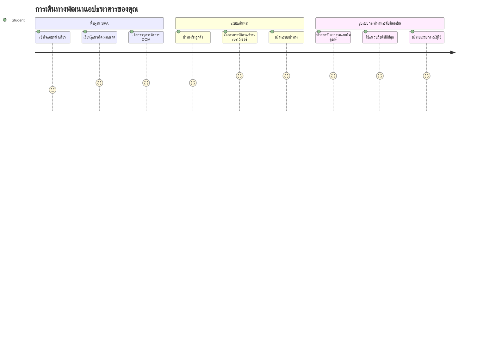
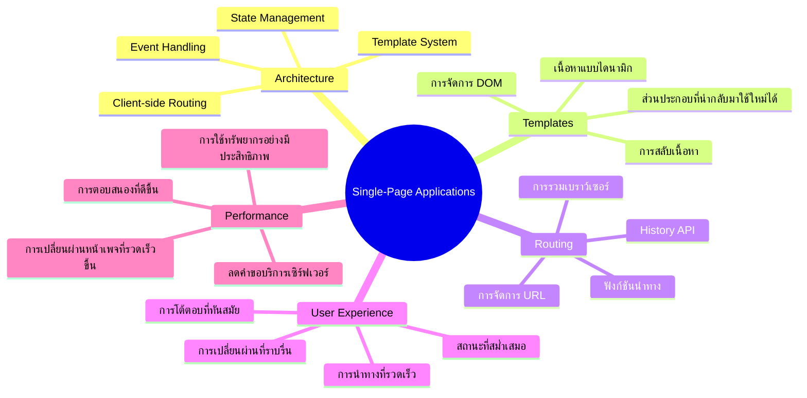
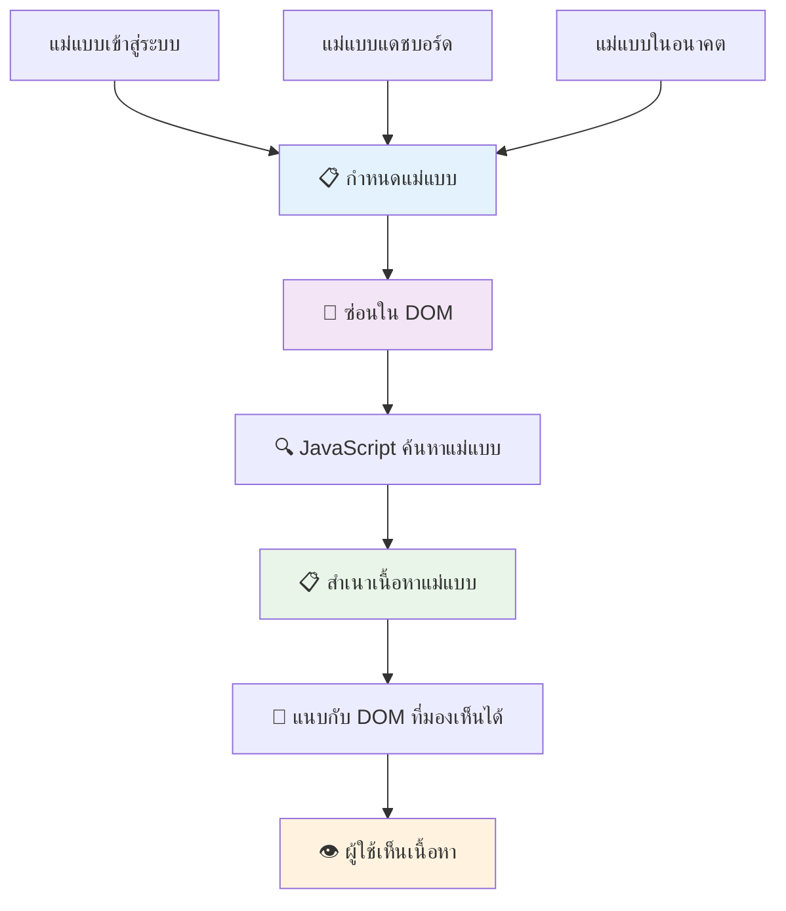
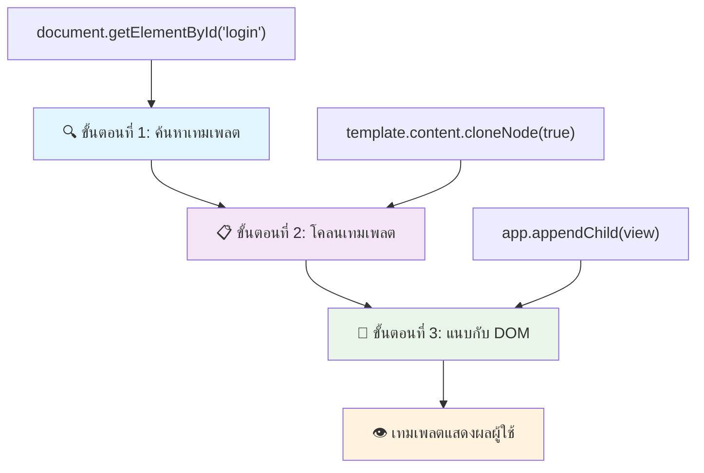
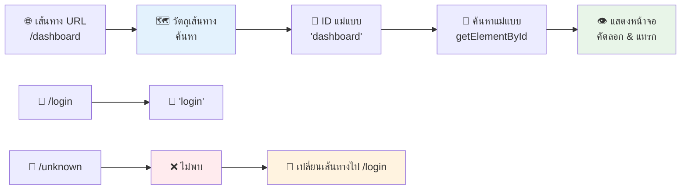
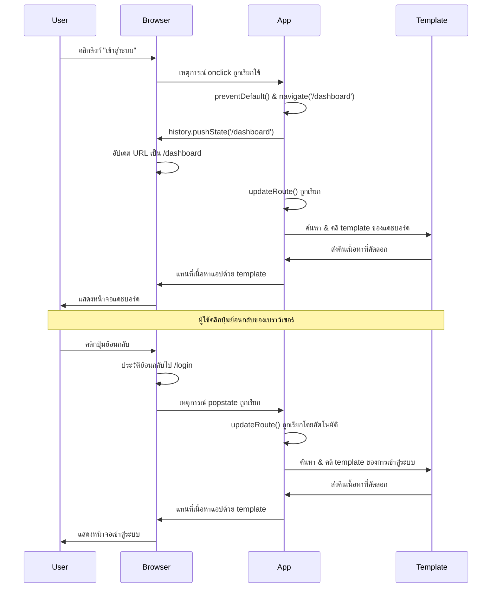
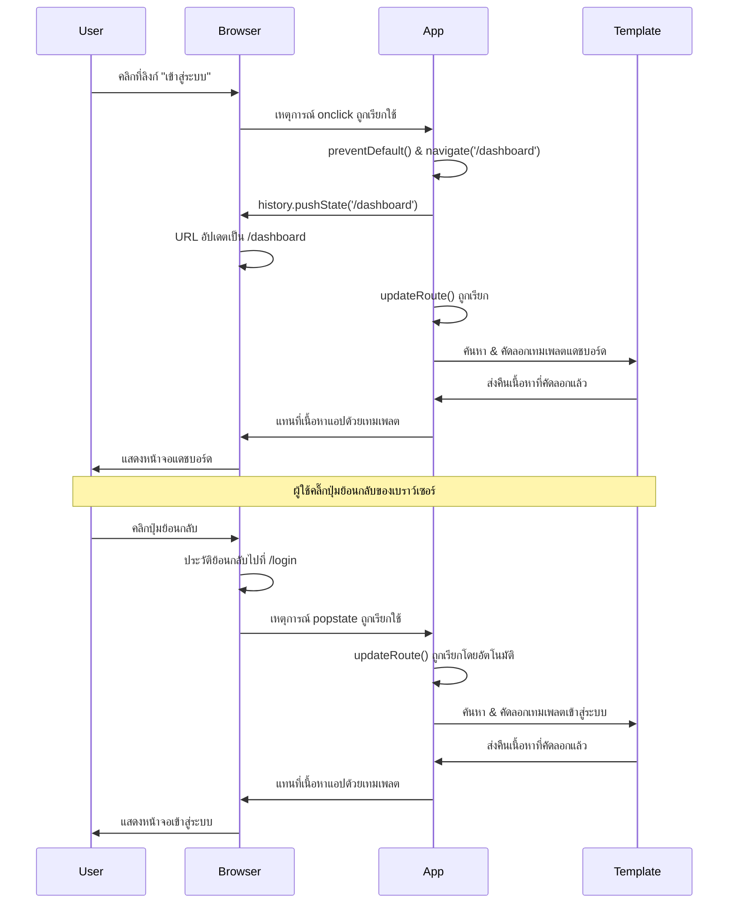
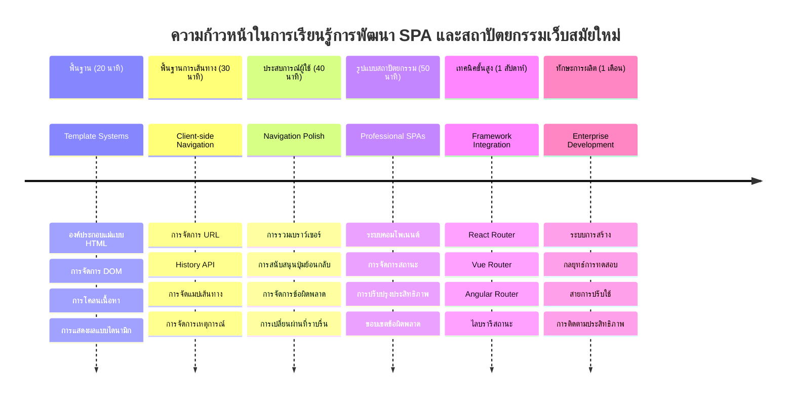

<!--
CO_OP_TRANSLATOR_METADATA:
{
  "original_hash": "351678bece18f07d9daa987a881fb062",
  "translation_date": "2026-01-06T22:04:22+00:00",
  "source_file": "7-bank-project/1-template-route/README.md",
  "language_code": "th"
}
-->
# สร้างแอปธนาคาร ภาค 1: HTML เทมเพลตและเส้นทางในเว็บแอป


เมื่อคอมพิวเตอร์นำทางของ Apollo 11 นำทางไปยังดวงจันทร์ในปี 1969 มันต้องสลับระหว่างโปรแกรมต่างๆ โดยไม่ต้องรีสตาร์ทระบบทั้งหมด เว็บแอปสมัยใหม่ก็ทำงานคล้ายกัน – พวกมันเปลี่ยนสิ่งที่คุณเห็นโดยไม่ต้องโหลดทุกอย่างใหม่ทั้งหมด ซึ่งสร้างประสบการณ์ที่ราบรื่นและตอบสนองที่ผู้ใช้คาดหวังในปัจจุบัน

ต่างจากเว็บไซต์แบบดั้งเดิมที่รีโหลดหน้าเว็บทั้งหน้าเมื่อมีการโต้ตอบ เว็บแอปสมัยใหม่จะอัปเดตเพียงส่วนที่ต้องการเปลี่ยนแปลง วิธีนี้คล้ายกับการที่ศูนย์ควบคุมภารกิจเปลี่ยนหน้าจอแสดงผลระหว่างการสื่อสารอย่างต่อเนื่อง เพื่อสร้างประสบการณ์ที่ลื่นไหลซึ่งเราได้คุ้นเคย

นี่คือเหตุผลที่ทำให้ความแตกต่างชัดเจนมาก:

| แอปแบบหลายหน้าดั้งเดิม | แอปหน้าเดียวสมัยใหม่ |
|----------------------------|-------------------------|
| **การนำทาง** | รีโหลดหน้าทั้งหมดทุกครั้งที่เปลี่ยนหน้าจอ | สลับเนื้อหาได้ทันที |
| **ประสิทธิภาพ** | ช้ากว่าเพราะต้องดาวน์โหลด HTML ทั้งหมด | เร็วขึ้นด้วยการอัปเดตเป็นส่วนๆ |
| **ประสบการณ์ผู้ใช้** | กระพริบหน้าเว็บแบบกระโชกโฮกฮาก | การเปลี่ยนผ่านราบรื่นเหมือนแอป |
| **การแชร์ข้อมูล** | ยากระหว่างหน้าเว็บต่างๆ | จัดการสถานะได้ง่าย |
| **การพัฒนา** | มีหลายไฟล์ HTML ให้ดูแล | มี HTML เดียวกับเทมเพลตแบบไดนามิก |

**เข้าใจวิวัฒนาการ:**
- **แอปแบบดั้งเดิม** ต้องร้องขอเซิร์ฟเวอร์ทุกครั้งที่นำทาง
- **SPA แบบสมัยใหม่** โหลดครั้งเดียวแล้วอัปเดตเนื้อหาโดยใช้ JavaScript
- **ความคาดหวังของผู้ใช้** ปัจจุบันต้องการปฏิสัมพันธ์ที่รวดเร็วและไร้รอยต่อ
- **ประโยชน์ทางประสิทธิภาพ** รวมทั้งลดแบนด์วิดท์และตอบสนองได้เร็วขึ้น

ในบทเรียนนี้ เราจะสร้างแอปธนาคารที่มีหลายหน้าจอที่ไหลลื่นเหมือนกัน เช่นเดียวกับนักวิทยาศาสตร์ที่ใช้เครื่องมือแบบโมดูลที่สามารถปรับแต่งได้สำหรับการทดลองต่างๆ เราจะใช้เทมเพลต HTML เป็นส่วนประกอบที่นำกลับมาใช้ซ้ำได้และแสดงผลเมื่อต้องการ

คุณจะได้ทำงานกับเทมเพลต HTML (แบบร่างซ้ำได้สำหรับหน้าจอต่างๆ), การจัดเส้นทางด้วย JavaScript (ระบบที่สลับหน้าจอ), และประวัติของเบราว์เซอร์ (API ที่ทำให้ปุ่มย้อนกลับทำงานตามที่คาดหวัง) เทคนิคพื้นฐานเดียวกันนี้ใช้ในเฟรมเวิร์กเช่น React, Vue, และ Angular

เมื่อจบบทนี้ คุณจะมีแอปธนาคารทำงานได้จริงที่แสดงหลักการของแอปแบบหน้าเดียวมืออาชีพ


## แบบทดสอบก่อนเรียน

[แบบทดสอบก่อนเรียน](https://ff-quizzes.netlify.app/web/quiz/41)

### สิ่งที่คุณต้องเตรียม

เราต้องมีเว็บเซิร์ฟเวอร์ท้องถิ่นเพื่อทดสอบแอปธนาคารของเรา – ไม่ต้องกังวล มันง่ายกว่าที่คิด! หากคุณยังไม่มีเซิร์ฟเวอร์ ให้ติดตั้ง [Node.js](https://nodejs.org) แล้วรันคำสั่ง `npx lite-server` จากโฟลเดอร์โปรเจกต์ของคุณ คำสั่งนี้จะเปิดเซิร์ฟเวอร์ท้องถิ่นและเปิดแอปของคุณในเบราว์เซอร์โดยอัตโนมัติ

### การเตรียมตัว

บนคอมพิวเตอร์ของคุณ ให้สร้างโฟลเดอร์ชื่อ `bank` และภายในโฟลเดอร์นั้นสร้างไฟล์ชื่อ `index.html` เราจะเริ่มจาก [boilerplate](https://en.wikipedia.org/wiki/Boilerplate_code) HTML นี้:

```html
<!DOCTYPE html>
<html lang="en">
  <head>
    <meta charset="UTF-8">
    <meta name="viewport" content="width=device-width, initial-scale=1.0">
    <title>Bank App</title>
  </head>
  <body>
    <!-- This is where you'll work -->
  </body>
</html>
```

**สิ่งที่ boilerplate นี้มีให้:**
- **กำหนด** โครงสร้างเอกสาร HTML5 พร้อมประกาศ DOCTYPE ที่ถูกต้อง
- **ตั้งค่า** การเข้ารหัสตัวอักษรเป็น UTF-8 รองรับข้อความหลากภาษา
- **เปิดใช้** การออกแบบตอบสนองด้วย meta tag viewport สำหรับความเข้ากันได้บนมือถือ
- **ตั้งค่า** ชื่อเรื่องให้แสดงในแท็บของเบราว์เซอร์
- **สร้าง** ส่วน body ที่สะอาดไว้สำหรับสร้างแอปของเรา

> 📁 **ภาพรวมโครงสร้างโปรเจกต์**
> 
> **เมื่อจบบทเรียนนี้ โปรเจกต์ของคุณจะมี:**
> ```
> bank/
> ├── index.html      <!-- Main HTML with templates -->
> ├── app.js          <!-- Routing and navigation logic -->
> └── style.css       <!-- (Optional for future lessons) -->
> ```
> 
> **ความรับผิดชอบของไฟล์:**
> - **index.html**: เก็บทุกเทมเพลตและโครงสร้างแอป
> - **app.js**: จัดการเส้นทาง, นำทาง และจัดการเทมเพลต
> - **เทมเพลต**: กำหนด UI สำหรับหน้าเข้าสู่ระบบ, แดชบอร์ด และหน้าจออื่นๆ

---

## เทมเพลต HTML

เทมเพลตแก้ปัญหาจากพื้นฐานในเว็บดีเวลอปเมนต์ เมื่อกูเตนเบิร์กประดิษฐ์การพิมพ์แบบตัวเรียงที่ขยับได้นั้นในทศวรรษ 1440 เขาตระหนักว่าแทนที่จะปั๊มหน้าทั้งหน้า เขาสามารถสร้างบล็อกตัวอักษรที่ใช้ซ้ำได้และจัดเรียงต่าง ๆ ตามต้องการ เทมเพลต HTML ทำงานบนหลักการเดียวกัน – แทนที่จะสร้างไฟล์ HTML แยกสำหรับแต่ละหน้าจอ คุณกำหนดโครงสร้างที่นำกลับมาใช้ซ้ำได้และแสดงผลเมื่อต้องการ


คิดว่าเทมเพลตเหมือนแผนผังสำหรับหลายส่วนของแอปคุณ เหมือนกับสถาปนิกที่สร้างแผนผังเพียงครั้งเดียวและใช้ซ้ำหลายครั้งแทนที่จะวาดห้องเหมือนกันซ้ำ เราจะสร้างเทมเพลตเพียงครั้งเดียวและสร้างอินสแตนซ์เมื่อจำเป็น เบราว์เซอร์จะเก็บเทมเพลตเหล่านี้ไว้จนกว่า JavaScript จะเรียกใช้งาน

ถ้าคุณอยากสร้างหลายหน้าจอสำหรับเว็บเพจ ทางหนึ่งคือสร้างไฟล์ HTML แยกสำหรับแต่ละหน้าที่ต้องแสดง อย่างไรก็ตามแนวทางนี้มีข้อไม่สะดวกบางประการ:

- คุณต้องรีโหลด HTML ทั้งหมดเมื่อเปลี่ยนหน้าจอ ซึ่งอาจช้า
- ยากต่อการแชร์ข้อมูลระหว่างหน้าจอต่างๆ

อีกวิธีหนึ่งคือมีไฟล์ HTML เพียงไฟล์เดียว และกำหนด [เทมเพลต HTML](https://developer.mozilla.org/docs/Web/HTML/Element/template) หลายอันโดยใช้ `<template>` เทมเพลตคือบล็อก HTML ที่นำกลับมาใช้ซ้ำได้แต่เบราว์เซอร์จะไม่แสดงจนกว่าจะมีการสร้างอินสแตนซ์ด้วย JavaScript

### มาสร้างกันเลย

เราจะสร้างแอปธนาคารที่มีหน้าจอหลักสองหน้า: หน้าเข้าสู่ระบบและแดชบอร์ด ก่อนอื่น มาสร้างอิลิเมนต์ตัวแทนใน body ของ HTML เราจะใช้ตรงนี้เพื่อแสดงหน้าจอต่างๆ

```html
<div id="app">Loading...</div>
```

**เข้าใจอิลิเมนต์ตัวแทนนี้:**
- **สร้าง** ภาชนะที่มี ID "app" เพื่อแสดงทุกหน้าจอ
- **แสดง** ข้อความโหลดจนกว่า JavaScript จะเริ่มทำงานและแสดงหน้าจอแรก
- **มอบ** จุดยึดเดียวสำหรับเนื้อหาแบบไดนามิกของเรา
- **เปิดใช้งาน** การเข้าถึงอย่างง่ายจาก JavaScript ด้วย `document.getElementById()`

> 💡 **ทริคโปร**: เนื่องจากเนื้อหาของอิลิเมนต์นี้จะถูกเปลี่ยนแปลง เราสามารถใส่ข้อความหรือไอคอนไว้ระหว่างโหลดแอปได้

ถัดไป, เพิ่มด้านล่างนี้เป็นเทมเพลต HTML สำหรับหน้าล็อกอิน ตอนนี้ใส่แค่หัวเรื่องกับส่วนที่มีลิงก์ใช้สำหรับนำทาง

```html
<template id="login">
  <h1>Bank App</h1>
  <section>
    <a href="/dashboard">Login</a>
  </section>
</template>
```

**แยกแยะเทมเพลตล็อกอินนี้:**
- **กำหนด** เทมเพลตด้วย ID เฉพาะ "login" เพื่อจับเป้าหมายด้วย JavaScript
- **รวม** หัวเรื่องหลักที่แสดงแบรนด์ของแอป
- **มี** อิลิเมนต์ `<section>` เชิงความหมายเพื่อจัดกลุ่มเนื้อหาที่เกี่ยวข้อง
- **ให้** ลิงก์นำทางที่จะพาผู้ใช้ไปแดชบอร์ด

จากนั้นเพิ่มอีกเทมเพลต HTML สำหรับหน้าแดชบอร์ด หน้านี้จะประกอบด้วยหลายส่วน:

- หัวข้อพร้อมชื่อเรื่องและลิงก์ออกจากระบบ
- ยอดคงเหลือปัจจุบันของบัญชีธนาคาร
- รายการธุรกรรม แสดงในตาราง

```html
<template id="dashboard">
  <header>
    <h1>Bank App</h1>
    <a href="/login">Logout</a>
  </header>
  <section>
    Balance: 100$
  </section>
  <section>
    <h2>Transactions</h2>
    <table>
      <thead>
        <tr>
          <th>Date</th>
          <th>Object</th>
          <th>Amount</th>
        </tr>
      </thead>
      <tbody></tbody>
    </table>
  </section>
</template>
```

**เข้าใจส่วนต่างๆ ของแดชบอร์ดนี้:**
- **สร้างโครงสร้างหน้า** ด้วยอิลิเมนต์เชิงความหมาย `<header>` ซึ่งมีการนำทาง
- **แสดง** ชื่อแอปอย่างสม่ำเสมอเพื่อสร้างแบรนด์
- **ให้** ลิงก์ออกจากระบบนำไปสู่หน้าล็อกอิน
- **แสดง** ยอดเงินคงเหลือในส่วนที่จัดไว้เฉพาะ
- **จัดการ** ข้อมูลธุรกรรมโดยใช้ตาราง HTML ที่มีโครงสร้างถูกต้อง
- **กำหนด** ส่วนหัวของตารางสำหรับวันที่, วัตถุ, และจำนวนเงิน
- **เว้น** ส่วนเนื้อหาของตารางว่างเพื่อจะเติมเนื้อหาแบบไดนามิกในภายหลัง

> 💡 **ทริคโปร**: เมื่อสร้างเทมเพลต HTML ถ้าคุณต้องการดูว่าหน้าตาเป็นยังไง คุณสามารถแสดงความคิดเห็นบรรทัด `<template>` และ `</template>` โดยใช้ `<!-- -->`

### 🔄 **ตรวจสอบความเข้าใจเชิงการสอน**
**ความเข้าใจระบบเทมเพลต**: ก่อนลงมือเขียน JavaScript ให้แน่ใจว่าคุณเข้าใจ:
- ✅ เทมเพลตแตกต่างจากอิลิเมนต์ HTML ธรรมดาอย่างไร
- ✅ ทำไมเทมเพลตถึงซ่อนจนกว่า JavaScript จะเปิดใช้งาน
- ✅ ความสำคัญของโครงสร้าง HTML เชิงความหมายในเทมเพลต
- ✅ เทมเพลตช่วยให้สร้างส่วนติดต่อผู้ใช้ที่นำกลับมาใช้ซ้ำได้อย่างไร

**ทดสอบตัวเองด่วน**: จะเกิดอะไรขึ้นถ้าคุณลบแท็ก `<template>` ออกจากรอบ HTML ของคุณ?
*คำตอบ: เนื้อหาจะเห็นได้ทันทีและสูญเสียฟังก์ชันของเทมเพลต*

**ประโยชน์ทางสถาปัตยกรรม**: เทมเพลตให้:
- **นำกลับมาใช้ซ้ำได้**: กำหนดครั้งเดียว ใช้หลายครั้ง
- **ประสิทธิภาพ**: ไม่ต้องวิเคราะห์ HTML ซ้ำ
- **การบำรุงรักษา**: โครงสร้าง UI รวมศูนย์
- **ความยืดหยุ่น**: สลับเนื้อหาแบบไดนามิก

✅ ทำไมคุณคิดว่าเราใช้แอตทริบิวต์ `id` บนเทมเพลต? เราสามารถใช้สิ่งอื่นได้ไหม เช่น คลาส?

## ทำให้เทมเพลตมีชีวิตด้วย JavaScript

ตอนนี้เราต้องทำให้เทมเพลตทำงานได้ เหมือนกับเครื่องพิมพ์ 3 มิติที่นำแบบร่างดิจิทัลมาเปลี่ยนเป็นวัตถุจริง JavaScript จะนำเทมเพลตที่ซ่อนไว้สร้างเป็นอิลิเมนต์ที่มองเห็นและโต้ตอบได้

กระบวนการนี้มีสามขั้นตอนหลักที่เป็นรากฐานของการพัฒนาเว็บสมัยใหม่ เมื่อเข้าใจแบบแผนนี้ คุณจะเห็นมันทั่วทั้งหลายเฟรมเวิร์กและไลบรารี

ถ้าคุณทดลองเปิดไฟล์ HTML ปัจจุบันนี้ในเบราว์เซอร์ คุณจะเห็นข้อความ `Loading...` ค้างอยู่ เพราะเราต้องเพิ่มโค้ด JavaScript เพื่อสร้างและแสดงเทมเพลต HTML

การสร้างอินสแตนซ์เทมเพลตมักทำในสามขั้นตอน:

1. ดึงอิลิเมนต์เทมเพลตจาก DOM เช่นใช้ [`document.getElementById`](https://developer.mozilla.org/docs/Web/API/Document/getElementById)
2. คลอน (clone) เทมเพลตโดยใช้ [`cloneNode`](https://developer.mozilla.org/docs/Web/API/Node/cloneNode)
3. แนบเทมเพลตที่คลอนแล้วเข้ากับ DOM ภายใต้อิลิเมนต์ที่มองเห็นได้ เช่นใช้ [`appendChild`](https://developer.mozilla.org/docs/Web/API/Node/appendChild)


**อธิบายภาพกระบวนการนี้:**
- **ขั้นตอนที่ 1** หาเทมเพลตที่ซ่อนอยู่ในโครงสร้าง DOM
- **ขั้นตอนที่ 2** สร้างสำเนาทำงานที่สามารถแก้ไขได้อย่างปลอดภัย
- **ขั้นตอนที่ 3** ใส่สำเนานี้ลงในพื้นที่หน้าเว็บที่มองเห็นได้
- **ผลลัพธ์** คือหน้าจอที่ใช้งานได้ซึ่งผู้ใช้โต้ตอบได้

✅ ทำไมเราจึงต้องคลอนเทมเพลตก่อนแนบมันเข้ากับ DOM? คุณคิดว่าจะเกิดอะไรขึ้นถ้าเราข้ามขั้นตอนนี้?

### งานที่ต้องทำ

สร้างไฟล์ใหม่ชื่อ `app.js` ในโฟลเดอร์โปรเจกต์ของคุณและนำเข้าไฟล์นี้ในส่วน `<head>` ของ HTML:

```html
<script src="app.js" defer></script>
```

**เข้าใจการนำเข้า script นี้:**
- **ลิงก์** ไฟล์ JavaScript เข้ากับเอกสาร HTML ของเรา
- **ใช้** แอตทริบิวต์ `defer` เพื่อให้สคริปต์ทำงานหลังจากวิเคราะห์ HTML เสร็จ
- **เปิดใช้งาน** การเข้าถึงทุกอิลิเมนต์ DOM เพราะโหลดเสร็จสมบูรณ์ก่อนรันสคริปต์
- **ปฏิบัติตาม** แนวทางปฏิบัติที่ดีที่สุดสมัยใหม่สำหรับการโหลดสคริปต์และประสิทธิภาพ

ตอนนี้ใน `app.js`, เราจะสร้างฟังก์ชันใหม่ชื่อ `updateRoute`:

```js
function updateRoute(templateId) {
  const template = document.getElementById(templateId);
  const view = template.content.cloneNode(true);
  const app = document.getElementById('app');
  app.innerHTML = '';
  app.appendChild(view);
}
```

**ทีละขั้นตอน นี่คือสิ่งที่เกิดขึ้น:**
- **หา** อิลิเมนต์เทมเพลตโดยใช้ ID เฉพาะ
- **สร้าง** สำเนาลึกของเนื้อหาเทมเพลตด้วย `cloneNode(true)`
- **หา** ภาชนะแอปที่จะใช้แสดงเนื้อหา
- **ล้าง** เนื้อหาที่มีอยู่ก่อนหน้าทิ้งจากภาชนะแอป
- **แทรก** เนื้อหาเทมเพลตที่คลอนแล้วลงใน DOM ที่มองเห็นได้

ตอนนี้เรียกใช้ฟังก์ชันนี้โดยส่งเทมเพลตหนึ่งอันและดูผลลัพธ์

```js
updateRoute('login');
```

**ฟังก์ชันนี้ทำอะไร:**
- **เปิดใช้งาน** เทมเพลตล็อกอินโดยส่ง ID ของมันเป็นพารามิเตอร์
- **สาธิต** การสลับหน้าจอของแอปแบบโปรแกรมเมติก
- **แสดง** หน้าจอเข้าสู่ระบบแทนข้อความ "Loading..."

✅ จุดประสงค์ของบรรทัด `app.innerHTML = '';` คืออะไร? จะเกิดอะไรขึ้นถ้าไม่มีบรรทัดนี้?

## การสร้างเส้นทาง (Routes)

Routing คือการเชื่อมโยง URLs กับเนื้อหาที่ถูกต้อง ลองนึกภาพนักโทรศัพท์สลับสายที่เชื่อมสายโทรเข้ากับปลายทางถูกต้อง Web routing ทำงานแบบเดียวกัน รับคำขอ URL และตัดสินใจว่าแสดงเนื้อหาอะไร


โดยปกติแล้ว เซิร์ฟเวอร์เว็บจะส่งไฟล์ HTML ต่างกันสำหรับ URLs ต่างๆ เพราะเราเขียนแอปหน้าเดียว เราต้องจัดการ routing นี้เองด้วย JavaScript ซึ่งช่วยให้เราควบคุมประสบการณ์ผู้ใช้และประสิทธิภาพได้ดีขึ้น


**เข้าใจการไหลของ routing:**
- **การเปลี่ยน URL** กระตุ้นการมองหาเส้นทางในระบบของเรา
- **เส้นทางที่มีอยู่** แมปกับ ID เทมเพลตเฉพาะเพื่อเรนเดอร์
- **เส้นทางที่ไม่มีอยู่** จะมีพฤติกรรมสำรองเพื่อป้องกันสถานะเสีย
- **การแสดงผลเทมเพลต** ตามกระบวนการสามขั้นตอนที่เราเรียนมาก่อนหน้า

เมื่อพูดถึงเว็บแอป เราเรียก *Routing* ว่าเป็นการจับคู่ **URLs** กับหน้าจอที่ควรแสดง ในเว็บไซต์ที่มีหลายไฟล์ HTML จะทำงานอัตโนมัติตามเส้นทางไฟล์ที่แสดงใน URL เช่นไฟล์เหล่านี้ในโปรเจกต์ของคุณ:

```
mywebsite/index.html
mywebsite/login.html
mywebsite/admin/index.html
```

ถ้าคุณสร้างเว็บเซิร์ฟเวอร์โดยมี `mywebsite` เป็น root, การแมป URL จะเป็น:

```
https://site.com            --> mywebsite/index.html
https://site.com/login.html --> mywebsite/login.html
https://site.com/admin/     --> mywebsite/admin/index.html
```

แต่สำหรับเว็บแอปของเรา เราใช้ไฟล์ HTML เดียวที่มีหน้าจอทั้งหมด ดังนั้นพฤติกรรมพื้นฐานนี้จะไม่ช่วย เราต้องสร้างแผนที่นี้เองและอัปเดตเทมเพลตที่แสดงด้วย JavaScript

### งานที่ต้องทำ

เราจะใช้วัตถุอย่างง่ายเพื่อทำ [map](https://en.wikipedia.org/wiki/Associative_array) ระหว่างเส้นทาง URL กับเทมเพลตของเรา เพิ่มวัตถุตัวนี้ไว้ด้านบนสุดของไฟล์ `app.js`

```js
const routes = {
  '/login': { templateId: 'login' },
  '/dashboard': { templateId: 'dashboard' },
};
```

**เข้าใจการตั้งค่าเส้นทางนี้:**
- **กำหนด** แผนที่ระหว่างเส้นทาง URL กับตัวระบุเทมเพลต
- **ใช้** ไวยากรณ์วัตถุโดยมีคีย์เป็นเส้นทาง URL และค่าระบุข้อมูลเทมเพลต
- **เปิดใช้งาน** การค้นหาเทมเพลตที่จะแสดงสำหรับ URL ใดๆ ได้ง่าย
- **มอบโครงสร้างที่ขยายได้เพื่อเพิ่มเส้นทางใหม่ในอนาคต**
ตอนนี้เรามาปรับฟังก์ชัน `updateRoute` เล็กน้อย แทนที่จะส่งค่า `templateId` โดยตรงเป็นอาร์กิวเมนต์ เราต้องการดึงค่าดังกล่าวโดยการดูที่ URL ปัจจุบันก่อน จากนั้นใช้แมปของเราเพื่อรับค่า template ID ที่สอดคล้องกัน เราสามารถใช้ [`window.location.pathname`](https://developer.mozilla.org/docs/Web/API/Location/pathname) เพื่อดึงเฉพาะส่วน path ของ URL ได้

```js
function updateRoute() {
  const path = window.location.pathname;
  const route = routes[path];

  const template = document.getElementById(route.templateId);
  const view = template.content.cloneNode(true);
  const app = document.getElementById('app');
  app.innerHTML = '';
  app.appendChild(view);
}
```

**อธิบายสิ่งที่เกิดขึ้นที่นี่:**
- **ดึงออกมา** path ปัจจุบันจาก URL ของเบราว์เซอร์โดยใช้ `window.location.pathname`
- **ค้นหา** การกำหนดเส้นทางที่ตรงกันในออบเจ็กต์ routes ของเรา
- **ดึง** template ID จากการกำหนดเส้นทางนั้น
- **ทำตาม** กระบวนการแสดงผลเทมเพลตเหมือนเดิม
- **สร้าง** ระบบไดนามิกที่ตอบสนองต่อการเปลี่ยนแปลง URL

ที่นี่เราได้แมปเส้นทางที่ประกาศไว้ให้กับเทมเพลตที่ตรงกัน คุณสามารถลองดูว่ามันทำงานถูกต้องโดยการเปลี่ยน URL ด้วยตนเองในเบราว์เซอร์ของคุณ

✅ จะเกิดอะไรขึ้นถ้าคุณป้อน path ที่ไม่รู้จักใน URL? เราจะแก้ปัญหานี้อย่างไร?

## การเพิ่มการนำทาง

เมื่อมีการกำหนด routing แล้ว ผู้ใช้จะต้องมีวิธีนำทางผ่านแอป เว็บไซต์แบบดั้งเดิมจะโหลดหน้าทั้งหมดใหม่เมื่อคลิกลิงก์ แต่เราต้องการอัปเดตทั้ง URL และเนื้อหาโดยไม่รีเฟรชหน้า สิ่งนี้จะสร้างประสบการณ์ที่ราบรื่นกว่า คล้ายกับวิธีที่แอปเดสก์ท็อปสลับระหว่างมุมมองต่างๆ

เราต้องประสานสองอย่าง: การอัปเดต URL ของเบราว์เซอร์เพื่อให้ผู้ใช้สามารถบันทึกหน้านี้และแชร์ลิงก์ และการแสดงเนื้อหาที่เหมาะสม เมื่อทำอย่างถูกต้องแล้ว มันจะสร้างการนำทางที่ราบรื่นตามที่ผู้ใช้คาดหวังจากแอปสมัยใหม่


### 🔄 **ตรวจสอบความเข้าใจเบื้องต้น**
**สถาปัตยกรรมแอปแบบหน้าเดียว (SPA)**: ตรวจสอบความเข้าใจของคุณเกี่ยวกับระบบทั้งหมด:
- ✅ การ routing ที่ฝั่งไคลเอนต์ต่างจาก routing ที่ฝั่งเซิร์ฟเวอร์แบบดั้งเดิมอย่างไร?
- ✅ ทำไม History API จึงสำคัญต่อการนำทางใน SPA อย่างถูกต้อง?
- ✅ เทมเพลตช่วยให้เนื้อหาไดนามิกโดยไม่ต้องรีโหลดหน้าได้อย่างไร?
- ✅ การจัดการเหตุการณ์มีบทบาทอย่างไรในการดักจับการนำทาง?

**การบูรณาการระบบ**: SPA ของคุณแสดงถึง:
- **การจัดการเทมเพลต**: คอมโพเนนต์ UI ที่นำกลับมาใช้ใหม่ได้พร้อมเนื้อหาไดนามิก
- **Routing ฝั่งไคลเอนต์**: การจัดการ URL โดยไม่ส่งคำขอไปยังเซิร์ฟเวอร์
- **สถาปัตยกรรมขับเคลื่อนโดยเหตุการณ์**: การนำทางและการโต้ตอบกับผู้ใช้ที่ตอบสนอง
- **การบูรณาการกับเบราว์เซอร์**: ประวัติ และปุ่มย้อนกลับ/ไปข้างหน้าที่ทำงานอย่างถูกต้อง
- **การเพิ่มประสิทธิภาพ**: การเปลี่ยนผ่านที่รวดเร็วและลดภาระเซิร์ฟเวอร์

**รูปแบบมืออาชีพ**: คุณได้ใช้งาน:
- **การแยกโมเดล-วิว**: เทมเพลตแยกจากตรรกะแอปพลิเคชัน
- **การจัดการสถานะ**: สถานะ URL ซิงโครไนซ์กับเนื้อหาที่แสดง
- **การยกระดับแบบก้าวหน้า**: JavaScript ช่วยเพิ่มฟังก์ชัน HTML พื้นฐาน
- **ประสบการณ์ผู้ใช้**: การนำทางที่ราบรื่นเหมือนแอปโดยไม่รีเฟรชหน้า

> � **ความเข้าใจด้านสถาปัตยกรรม**: องค์ประกอบของระบบนำทาง
>
> **สิ่งที่คุณกำลังสร้าง:**
> - **🔄 การจัดการ URL**: อัปเดตแถบที่อยู่ของเบราว์เซอร์โดยไม่รีโหลดหน้า
> - **📋 ระบบเทมเพลต**: สลับเนื้อหาแบบไดนามิกตามเส้นทางปัจจุบัน  
> - **📚 การบูรณาการประวัติ**: รักษาการทำงานของปุ่มย้อนกลับ/ไปข้างหน้า 
> - **🛡️ การจัดการข้อผิดพลาด**: กลไก fallback อย่างสมเหตุสมผลสำหรับเส้นทางที่ไม่ถูกต้องหรือขาดหาย
>
> **วิธีที่องค์ประกอบทำงานร่วมกัน:**
> - **ฟัง** เหตุการณ์นำทาง (คลิก, การเปลี่ยนแปลงประวัติ)
> - **อัปเดต** URL โดยใช้ History API
> - **เรนเดอร์** เทมเพลตที่เหมาะสมสำหรับเส้นทางใหม่
> - **รักษา** ประสบการณ์ผู้ใช้ที่ราบรื่นตลอดเวลา

ขั้นตอนถัดไปสำหรับแอปของเราคือเพิ่มความสามารถในการนำทางระหว่างหน้าโดยไม่ต้องเปลี่ยน URL ด้วยตนเอง นี่หมายถึงสองอย่าง:

  1. อัปเดต URL ปัจจุบัน
  2. อัปเดตเทมเพลตที่แสดงตาม URL ใหม่

เราได้ดูแลส่วนที่สองไว้แล้วด้วยฟังก์ชัน `updateRoute` ดังนั้นเราต้องหาวิธีอัปเดต URL ปัจจุบัน

เราจะต้องใช้ JavaScript และโดยเฉพาะ [`history.pushState`](https://developer.mozilla.org/docs/Web/API/History/pushState) ที่อนุญาตให้อัปเดต URL และสร้างรายการใหม่ในประวัติการเข้าชมโดยไม่รีโหลด HTML

> ⚠️ **หมายเหตุสำคัญ**: แม้ว่าองค์ประกอบแองเคอร์ HTML [`<a href>`](https://developer.mozilla.org/docs/Web/HTML/Element/a) สามารถใช้เพื่อสร้างลิงก์ไปยัง URL ต่างๆ ได้ แต่มันจะทำให้เบราว์เซอร์รีโหลด HTML โดยค่าเริ่มต้น จำเป็นต้องป้องกันพฤติกรรมนี้เมื่อต้องจัดการ routing ด้วย JavaScript แบบกำหนดเอง โดยใช้ฟังก์ชัน preventDefault() กับเหตุการณ์คลิก

### ภารกิจ

มาสร้างฟังก์ชันใหม่ที่เราสามารถใช้เพื่อการนำทางในแอปของเรากัน:

```js
function navigate(path) {
  window.history.pushState({}, path, path);
  updateRoute();
}
```

**ทำความเข้าใจฟังก์ชันนำทางนี้:**
- **อัปเดต** URL ของเบราว์เซอร์เป็น path ใหม่โดยใช้ `history.pushState`
- **เพิ่ม** รายการใหม่ลงในสแตกของประวัติการเข้าชมเพื่อรองรับปุ่มย้อนกลับ/ไปข้างหน้าอย่างเหมาะสม
- **เรียก** ฟังก์ชัน `updateRoute()` เพื่อแสดงเทมเพลตที่สอดคล้องกัน
- **รักษา** ประสบการณ์แอปหน้าเดียวโดยไม่มีการรีโหลดหน้า

วิธีนี้จะอัปเดต URL ปัจจุบันตาม path ที่กำหนดก่อน จากนั้นอัปเดตเทมเพลต คุณสมบัติ `window.location.origin` คืนค่า URL ราก ทำให้เราสามารถสร้าง URL สมบูรณ์จาก path ที่กำหนดได้

เมื่อเรามีฟังก์ชันนี้แล้ว เราสามารถแก้ปัญหาที่เกิดขึ้นถ้า path ไม่ตรงกับเส้นทางที่กำหนดไว้ เราจะปรับฟังก์ชัน `updateRoute` โดยเพิ่มการ fallback ไปยังเส้นทางที่มีอยู่ถ้าไม่พบการจับคู่

```js
function updateRoute() {
  const path = window.location.pathname;
  const route = routes[path];

  if (!route) {
    return navigate('/login');
  }

  const template = document.getElementById(route.templateId);
  const view = template.content.cloneNode(true);
  const app = document.getElementById('app');
  app.innerHTML = '';
  app.appendChild(view);
}
```

**จุดสำคัญที่ต้องจำ:**
- **ตรวจสอบ** ว่ามีเส้นทางสำหรับ path ปัจจุบันหรือไม่
- **เปลี่ยนทาง** ไปยังหน้าล็อกอินเมื่อเข้าถึงเส้นทางที่ไม่ถูกต้อง
- **จัดเตรียม** กลไก fallback ที่ป้องกันการนำทางที่ผิดพลาด
- **รับประกัน** ว่าผู้ใช้จะเห็นหน้าจอที่ถูกต้องเสมอ แม้ URL จะไม่ถูกต้อง

ถ้าไม่พบเส้นทาง เราจะเปลี่ยนเส้นทางไปหน้าล็อกอินแทน

ตอนนี้มาสร้างฟังก์ชันเพื่อดึง URL เมื่อมีการคลิกลิงก์ และเพื่อป้องกันพฤติกรรมลิงก์ปกติของเบราว์เซอร์:

```js
function onLinkClick(event) {
  event.preventDefault();
  navigate(event.target.href);
}
```

**อธิบายตัวจัดการคลิกนี้:**
- **ป้องกัน** พฤติกรรมลิงก์ปกติของเบราว์เซอร์โดยใช้ `preventDefault()`
- **ดึงออกมา** URL ปลายทางจากองค์ประกอบลิงก์ที่ถูกคลิก
- **เรียก** ฟังก์ชันนำทางที่กำหนดเองแทนการโหลดหน้าซ้ำ
- **รักษา** ประสบการณ์แอปหน้าเดียวที่ราบรื่น

```html
<a href="/dashboard" onclick="onLinkClick(event)">Login</a>
...
<a href="/login" onclick="onLinkClick(event)">Logout</a>
```

**สิ่งที่ผูกเหตุการณ์ onclick นี้ทำได้:**
- **เชื่อม** ลิงก์แต่ละอันกับระบบนำทางที่กำหนดเองของเรา
- **ส่งผ่าน** เหตุการณ์คลิกไปที่ฟังก์ชัน `onLinkClick` ของเราเพื่อนำไปประมวลผล
- **เปิดใช้งาน** การนำทางที่ราบรื่นโดยไม่มีการโหลดหน้า
- **รักษา** โครงสร้าง URL ที่ถูกต้อง ซึ่งผู้ใช้สามารถบันทึกหรือแชร์ได้

แอตทริบิวต์ [`onclick`](https://developer.mozilla.org/docs/Web/API/GlobalEventHandlers/onclick) ผูกเหตุการณ์ `click` กับโค้ด JavaScript ที่นี่คือการเรียก `navigate()` ฟังก์ชัน

ลองคลิกที่ลิงก์เหล่านี้ คุณจะสามารถนำทางระหว่างหน้าจอในแอปของคุณได้

✅ เมธอด `history.pushState` เป็นส่วนหนึ่งของมาตรฐาน HTML5 และใช้ได้ใน [เบราว์เซอร์สมัยใหม่ทุกตัว](https://caniuse.com/?search=pushState) หากคุณกำลังสร้างเว็บแอปสำหรับเบราว์เซอร์เก่า มีเทคนิคที่คุณสามารถใช้แทน API นี้ได้: ใช้ [แฮช (#)](https://en.wikipedia.org/wiki/URI_fragment) นำหน้าทางเดินเพื่อทำ routing ที่ทำงานกับการนำทางแองเคอร์ปกติและไม่โหลดหน้าใหม่ เนื่องจากจุดประสงค์เดิมคือการสร้างลิงก์ภายในหน้า

## ทำให้ปุ่มย้อนกลับและไปข้างหน้าทำงาน

ปุ่มย้อนกลับและไปข้างหน้าเป็นสิ่งสำคัญในการท่องเว็บ เหมือนกับที่เจ้าหน้าที่ควบคุมภารกิจของนาซาสามารถตรวจสอบสถานะระบบก่อนหน้าระหว่างภารกิจในอวกาศได้ ผู้ใช้คาดหวังว่าปุ่มเหล่านี้จะทำงาน และเมื่อไม่ทำงาน จะทำลายประสบการณ์การท่องเว็บที่คาดหวัง

แอปหน้าเดียวของเราต้องการการกำหนดค่าเพิ่มเติมเพื่อรองรับสิ่งนี้ เบราว์เซอร์จะเก็บสแตกประวัติ (ซึ่งเราได้เพิ่มเข้าไปด้วย `history.pushState`) แต่เมื่อผู้ใช้เดินทางผ่านประวัตินี้ แอปของเราต้องตอบสนองโดยการอัปเดตเนื้อหาที่แสดงตามนั้น


**จุดที่มีการปฏิสัมพันธ์หลัก:**
- **การกระทำของผู้ใช้** กระตุ้นการนำทางผ่านการคลิกหรือปุ่มของเบราว์เซอร์
- **แอปดักจับ** การคลิกลิงก์เพื่อป้องกันการโหลดหน้าใหม่
- **History API** จัดการการเปลี่ยนแปลง URL และสแตกประวัติของเบราว์เซอร์
- **เทมเพลต** ให้โครงสร้างเนื้อหาสำหรับแต่ละหน้าจอ
- **ตัวฟังเหตุการณ์** ทำให้แน่ใจว่าแอปตอบสนองต่อทุกประเภทของการนำทาง

การใช้ `history.pushState` สร้างรายการใหม่ในประวัติการนำทางของเบราว์เซอร์ คุณสามารถตรวจสอบได้โดยการกดปุ่ม *ย้อนกลับ* ค้างไว้ เบราว์เซอร์จะแสดงประวัติประมาณนี้:


ถ้าคุณลองกดปุ่มย้อนกลับหลายครั้ง คุณจะเห็นว่า URL ปัจจุบันเปลี่ยนและประวัติได้รับการอัปเดต แต่เทมเพลตเดิมยังคงแสดงอยู่

นั่นเป็นเพราะแอปไม่รู้ว่าเราต้องเรียก `updateRoute()` ทุกครั้งที่ประวัติเปลี่ยน หากคุณดูที่เอกสาร [`history.pushState`](https://developer.mozilla.org/docs/Web/API/History/pushState) คุณจะเห็นว่าถ้าสถานะเปลี่ยน—หมายความว่าเราไปยัง URL ใหม่—จะมีเหตุการณ์ [`popstate`](https://developer.mozilla.org/docs/Web/API/Window/popstate_event) ถูกเรียก เราจะใช้สิ่งนี้เพื่อแก้ปัญหานี้

### ภารกิจ

เพื่อให้แน่ใจว่าเทมเพลตที่แสดงได้รับการอัปเดตเมื่อประวัติของเบราว์เซอร์เปลี่ยนไป เราจะผูกฟังก์ชันใหม่ที่เรียก `updateRoute()` เราจะทำที่ด้านล่างของไฟล์ `app.js` ของเรา:

```js
window.onpopstate = () => updateRoute();
updateRoute();
```

**เข้าใจการบูรณาการประวัตินี้:**
- **ฟัง** เหตุการณ์ `popstate` ที่เกิดเมื่อผู้ใช้ใช้งานปุ่มเบราว์เซอร์
- **ใช้** ฟังก์ชันลูกศรเพื่อความกระชับของไวยากรณ์ผู้จัดการเหตุการณ์
- **เรียก** `updateRoute()` โดยอัตโนมัติเมื่อสถานะประวัติเปลี่ยน
- **เริ่มต้น** แอปโดยเรียก `updateRoute()` เมื่อหน้าโหลดครั้งแรก
- **รับประกัน** เทมเพลตที่ถูกต้องแสดงไม่ว่าใช้วิธีนำทางใด

> 💡 **เคล็ดลับมือโปร**: เราใช้ [ฟังก์ชันลูกศร](https://developer.mozilla.org/docs/Web/JavaScript/Reference/Functions/Arrow_functions) ที่นี่เพื่อประกาศผู้จัดการเหตุการณ์ `popstate` เพื่อความกระชับ แต่ฟังก์ชันปกติก็สามารถทำงานได้เช่นกัน

นี่คือวิดีโอทบทวนเรื่องฟังก์ชันลูกศร:

[](https://youtube.com/watch?v=OP6eEbOj2sc "Arrow Functions")

> 🎥 คลิกภาพด้านบนเพื่อดูวิดีโอเกี่ยวกับฟังก์ชันลูกศร

ทดลองใช้งานปุ่มย้อนกลับและไปข้างหน้าของเบราว์เซอร์ แล้วตรวจสอบว่าเส้นทางที่แสดงได้รับการอัปเดตอย่างถูกต้องในครั้งนี้

### ⚡ **สิ่งที่คุณสามารถทำได้ใน 5 นาทีถัดไป**
- [ ] ทดสอบการนำทางของแอปธนาคารโดยใช้ปุ่มย้อนกลับ/ไปข้างหน้าในเบราว์เซอร์
- [ ] พยายามพิมพ์ URL ต่างๆ ในแถบที่อยู่เพื่อลองเส้นทาง
- [ ] เปิด DevTools ของเบราว์เซอร์และตรวจสอบว่าเทมเพลตถูกโคลนเข้า DOM อย่างไร
- [ ] ทดลองเพิ่มคำสั่ง console.log เพื่อติดตามกระแสการ routing

### 🎯 **สิ่งที่คุณสามารถทำได้ในชั่วโมงนี้**
- [ ] ทำแบบทดสอบหลังบทเรียนให้เสร็จและเข้าใจแนวคิดสถาปัตยกรรม SPA
- [ ] เพิ่มการจัดสไตล์ CSS เพื่อทำให้เทมเพลตของแอปธนาคารดูมืออาชีพ
- [ ] ทำโจทย์หน้าข้อผิดพลาด 404 พร้อมจัดการข้อผิดพลาดอย่างเหมาะสม
- [ ] สร้างหน้าเครดิตพร้อมเพิ่มฟังก์ชัน routing
- [ ] เพิ่มสถานะการโหลดและการเปลี่ยนผ่านระหว่างการสลับเทมเพลต

### 📅 **เส้นทางพัฒนาการ SPA 1 สัปดาห์ของคุณ**
- [ ] พัฒนาแอปธนาคารเต็มรูปแบบพร้อมแบบฟอร์ม การจัดการข้อมูล และการเก็บข้อมูลถาวร
- [ ] เพิ่มฟีเจอร์ routing ขั้นสูง เช่น พารามิเตอร์เส้นทาง และเส้นทางซ้อน
- [ ] ทำหน้าที่ควบคุมการนำทางและ routing โดยยืนยันตัวตน
- [ ] สร้างคอมโพเนนต์เทมเพลตที่นำกลับมาใช้ได้และไลบรารีคอมโพเนนต์
- [ ] เพิ่มแอนิเมชันและการเปลี่ยนผ่านเพื่อประสบการณ์ที่ราบรื่นขึ้น
- [ ] ดีพลอยแอป SPA ของคุณบนแพลตฟอร์มโฮสติ้งและกำหนด routing อย่างถูกต้อง

### 🌟 **การเป็นผู้เชี่ยวชาญสถาปัตยกรรม frontend 1 เดือนของคุณ**
- [ ] สร้าง SPA ที่ซับซ้อนโดยใช้เฟรมเวิร์กสมัยใหม่เช่น React, Vue, หรือ Angular
- [ ] เรียนรู้รูปแบบการจัดการสถานะขั้นสูงและไลบรารีต่างๆ
- [ ] เชี่ยวชาญเครื่องมือบิวด์และเวิร์กโฟลว์การพัฒนา SPA
- [ ] ทำ Progressive Web App และฟีเจอร์ทำงานแบบออฟไลน์
- [ ] ศึกษาเทคนิคเพิ่มประสิทธิภาพสำหรับ SPA ขนาดใหญ่
- [ ] มีส่วนร่วมในโครงการ SPA แบบโอเพนซอร์สและแบ่งปันความรู้ของคุณ

## 🎯 เส้นเวลาการเป็นผู้เชี่ยวชาญแอปหน้าเดียวของคุณ


### 🛠️ สรุปชุดเครื่องมือพัฒนา SPA ของคุณ

หลังจากจบบทเรียนนี้ คุณได้เชี่ยวชาญ:
- **สถาปัตยกรรมเทมเพลต**: คอมโพเนนต์ HTML ที่นำกลับมาใช้ใหม่พร้อมการเรนเดอร์เนื้อหาไดนามิก
- **Routing ฝั่งไคลเอนต์**: การจัดการ URL และการนำทางโดยไม่รีโหลดหน้า
- **การบูรณาการกับเบราว์เซอร์**: การใช้ History API และรองรับปุ่มย้อนกลับ/ไปข้างหน้า
- **ระบบขับเคลื่อนด้วยเหตุการณ์**: จัดการการนำทางและการโต้ตอบกับผู้ใช้
- **การจัดการ DOM**: การโคลนเทมเพลต การสลับเนื้อหา และการจัดการองค์ประกอบ
- **การจัดการข้อผิดพลาด**: ระบบ fallback อย่างสมเหตุสมผลสำหรับเส้นทางไม่ถูกต้องและเนื้อหาขาดหาย
- **รูปแบบประสิทธิภาพ**: กลยุทธ์การโหลดและเรนเดอร์เนื้อหาอย่างมีประสิทธิภาพ

**แอปพลิเคชันในโลกจริง**: ทักษะการพัฒนา SPA ของคุณใช้ได้โดยตรงกับ:
- **เว็บแอปสมัยใหม่**: การพัฒนา React, Vue, Angular และเฟรมเวิร์กอื่นๆ
- **แอปเว็บก้าวหน้า (PWA)**: แอปใช้งานแบบออฟไลน์พร้อมประสบการณ์เหมือนแอป
- **แดชบอร์ดองค์กร**: แอปธุรกิจซับซ้อนพร้อมมุมมองหลายแบบ
- **แพลตฟอร์มอีคอมเมิร์ซ**: แคตตาล็อกสินค้า รถเข็น และขั้นตอนจ่ายเงิน
- **การจัดการเนื้อหา**: การสร้างเนื้อหาไดนามิกและอินเทอร์เฟซแก้ไข
- **พัฒนาโมบาย**: แอปไฮบริดใช้เทคโนโลยีเว็บ

**ทักษะมืออาชีพที่ได้รับ**: คุณสามารถ...
- **ออกแบบสถาปัตยกรรม** แอปพลิเคชันหน้าเดียวด้วยการแยกความรับผิดชอบอย่างเหมาะสม  
- **ติดตั้งใช้งาน** ระบบ routing ฝั่งไคลเอนต์ที่สามารถขยายได้ตามความซับซ้อนของแอป  
- **ดีบัก** โฟลว์การนำทางที่ซับซ้อนโดยใช้เครื่องมือสำหรับนักพัฒนาเบราว์เซอร์  
- **ปรับปรุง** ประสิทธิภาพของแอปพลิเคชันผ่านการจัดการเทมเพลตอย่างมีประสิทธิภาพ  
- **ออกแบบ** ประสบการณ์ผู้ใช้ที่ให้ความรู้สึกเหมือนแอปเนทีฟและตอบสนองได้เร็ว  

**แนวคิดการพัฒนาด้าน Frontend ที่เชี่ยวชาญ**:  
- **สถาปัตยกรรมคอมโพเนนต์**: รูปแบบ UI ที่ใช้ซ้ำได้และระบบเทมเพลต  
- **การซิงโครไนซ์สถานะ**: การจัดการสถานะ URL และประวัติของเบราว์เซอร์  
- **โปรแกรมแบบขับเคลื่อนด้วยเหตุการณ์**: การจัดการปฏิสัมพันธ์ของผู้ใช้และการนำทาง  
- **การปรับแต่งประสิทธิภาพ**: การจัดการ DOM อย่างมีประสิทธิภาพและการโหลดเนื้อหา  
- **การออกแบบประสบการณ์ผู้ใช้**: การเปลี่ยนระหว่างหน้าอย่างราบรื่นและการนำทางที่ใช้งานง่าย  

**ก้าวต่อไป**: คุณพร้อมที่จะสำรวจเฟรมเวิร์ก frontend สมัยใหม่, การจัดการสถานะขั้นสูง หรือสร้างแอปพลิเคชันระดับองค์กรที่ซับซ้อน!  

🌟 **ความสำเร็จที่ปลดล็อก**: คุณได้สร้างฐานแอปพลิเคชันหน้าเดียวระดับมืออาชีพด้วยรูปแบบสถาปัตยกรรมเว็บสมัยใหม่แล้ว!  

---

## ความท้าทาย GitHub Copilot Agent 🚀

ใช้โหมด Agent เพื่อทำความท้าทายดังต่อไปนี้:  

**คำอธิบาย:** ปรับปรุงแอปธนาคารโดยเพิ่มการจัดการข้อผิดพลาดและเทมเพลตหน้า 404 สำหรับเส้นทางที่ไม่ถูกต้อง เพื่อพัฒนาประสบการณ์ผู้ใช้เมื่อไปยังหน้าที่ไม่มีอยู่จริง  

**คำสั่ง:** สร้างเทมเพลต HTML ใหม่โดยมี id ว่า "not-found" เพื่อแสดงหน้าข้อผิดพลาด 404 ที่เป็นมิตรกับผู้ใช้พร้อมสไตล์ จากนั้นแก้ไขตรรกะ routing ใน JavaScript เพื่อแสดงเทมเพลตนี้เมื่อผู้ใช้ไปยัง URL ที่ไม่ถูกต้อง และเพิ่มปุ่ม "Go Home" ที่นำทางกลับไปยังหน้าล็อกอิน  

เรียนรู้เพิ่มเติมเกี่ยวกับ [agent mode](https://code.visualstudio.com/blogs/2025/02/24/introducing-copilot-agent-mode) ที่นี่  

## 🚀 ความท้าทาย

เพิ่มเทมเพลตและเส้นทางใหม่สำหรับหน้าที่สามซึ่งแสดงเครดิตของแอปนี้  

**เป้าหมายของความท้าทาย:**  
- **สร้าง** เทมเพลต HTML ใหม่ที่มีโครงสร้างเนื้อหาที่เหมาะสม  
- **เพิ่ม** เส้นทางใหม่ในอ็อบเจ็กต์การตั้งค่า routes ของคุณ  
- **รวม** ลิงก์นำทางไปและกลับจากหน้าคะแนน  
- **ทดสอบ** ว่าการนำทางทั้งหมดทำงานถูกต้องกับประวัติของเบราว์เซอร์  

## แบบทดสอบหลังบรรยาย

[แบบทดสอบหลังบรรยาย](https://ff-quizzes.netlify.app/web/quiz/42)  

## ทบทวน & ศึกษาด้วยตนเอง

Routing เป็นส่วนที่ค่อยข้างซับซ้อนในการพัฒนาเว็บโดยเฉพาะเมื่อเว็บเปลี่ยนจากพฤติกรรมรีเฟรชหน้าแบบดั้งเดิมไปสู่การรีเฟรชหน้าในแอปหน้าเดียว อ่านเพิ่มเติมเกี่ยวกับ [วิธีที่ Azure Static Web App service](https://docs.microsoft.com/azure/static-web-apps/routes/?WT.mc_id=academic-77807-sagibbon) จัดการ routing คุณสามารถอธิบายได้ไหมว่าทำไมบางการตัดสินใจที่อธิบายในเอกสารนั้นจึงจำเป็น?  

**แหล่งเรียนรู้เพิ่มเติม:**  
- **สำรวจ** วิธีที่เฟรมเวิร์กยอดนิยม เช่น React Router และ Vue Router ใช้ routing ฝั่งไคลเอนต์  
- **ค้นคว้า** ความแตกต่างระหว่าง routing แบบ hash-based กับ history API  
- **เรียนรู้** เกี่ยวกับการเรนเดอร์ฝั่งเซิร์ฟเวอร์ (SSR) และผลกระทบต่อกลยุทธ์ routing  
- **สืบสวน** วิธีที่ Progressive Web Apps (PWAs) จัดการ routing และการนำทาง  

## การบ้าน

[ปรับปรุงการ routing](assignment.md)

---

<!-- CO-OP TRANSLATOR DISCLAIMER START -->
**ข้อจำกัดความรับผิดชอบ**:
เอกสารนี้ได้รับการแปลโดยใช้บริการแปลภาษาโดย AI [Co-op Translator](https://github.com/Azure/co-op-translator) แม้เราจะพยายามให้ความถูกต้องสูงสุด แต่โปรดทราบว่าการแปลอัตโนมัติอาจมีข้อผิดพลาดหรือความไม่ถูกต้อง เอกสารต้นฉบับในภาษาต้นทางควรถือเป็นแหล่งข้อมูลที่เป็นทางการ สำหรับข้อมูลที่สำคัญแนะนำให้ใช้บริการแปลโดยผู้เชี่ยวชาญมนุษย์ เราจะไม่รับผิดชอบต่อความเข้าใจผิดหรือการตีความผิดใดๆ ที่เกิดขึ้นจากการใช้การแปลนี้
<!-- CO-OP TRANSLATOR DISCLAIMER END -->