<!--
CO_OP_TRANSLATOR_METADATA:
{
  "original_hash": "7cbdbd132d39a2bb493e85bc2a9387cc",
  "translation_date": "2026-01-06T22:02:11+00:00",
  "source_file": "7-bank-project/2-forms/README.md",
  "language_code": "th"
}
-->
# สร้างแอปธนาคาร ตอนที่ 2: สร้างฟอร์มเข้าสู่ระบบและลงทะเบียน

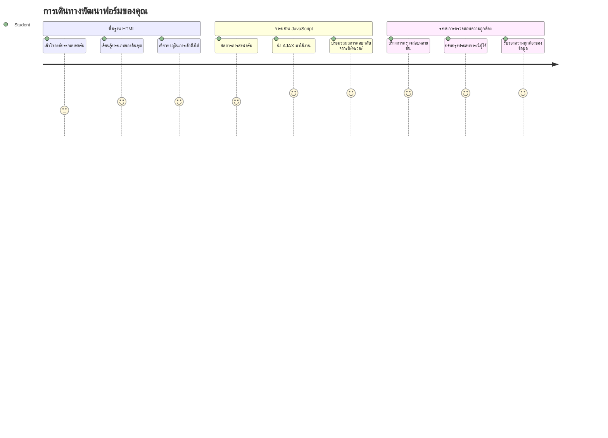
## แบบทดสอบก่อนเรียน

[แบบทดสอบก่อนเรียน](https://ff-quizzes.netlify.app/web/quiz/43)

เคยกรอกฟอร์มออนไลน์แล้วพบว่ารูปแบบอีเมลของคุณถูกปฏิเสธไหม? หรือเคยสูญเสียข้อมูลทั้งหมดเมื่อตั้งใจส่งฟอร์มหรือเปล่า? เราทุกคนล้วนเคยเจอประสบการณ์ที่น่าหงุดหงิดเหล่านี้

ฟอร์มคือสะพานเชื่อมระหว่างผู้ใช้และฟังก์ชันของแอปพลิเคชันของคุณ เช่นเดียวกับโปรโตคอลที่ระมัดระวังที่ผู้ควบคุมการบินใช้นำทางเครื่องบินไปยังจุดหมายอย่างปลอดภัย ฟอร์มที่ออกแบบมาอย่างดีช่วยให้คำติชมชัดเจนและป้องกันข้อผิดพลาดที่มีค่าใช้จ่ายสูง ฟอร์มที่ไม่ดีจะทำให้ผู้ใช้หนีไปเร็วกว่าเหตุการณ์สื่อสารผิดพลาดในสนามบินที่วุ่นวาย

ในบทเรียนนี้ เราจะเปลี่ยนแอปธนาคารที่ไม่โต้ตอบของคุณให้เป็นแอปพลิเคชันที่โต้ตอบได้ คุณจะได้เรียนรู้วิธีสร้างฟอร์มที่ตรวจสอบข้อมูลผู้ใช้ สื่อสารกับเซิร์ฟเวอร์ และให้คำติชมที่สร้างสรรค์ คิดซะว่าคุณกำลังสร้างส่วนควบคุมที่ช่วยให้ผู้ใช้สามารถนำทางฟีเจอร์ของแอปของคุณได้

เมื่อจบแล้ว คุณจะมีระบบเข้าสู่ระบบและลงทะเบียนที่สมบูรณ์พร้อมด้วยการตรวจสอบที่จะนำทางผู้ใช้ไปสู่ความสำเร็จแทนที่จะเกิดความหงุดหงิด

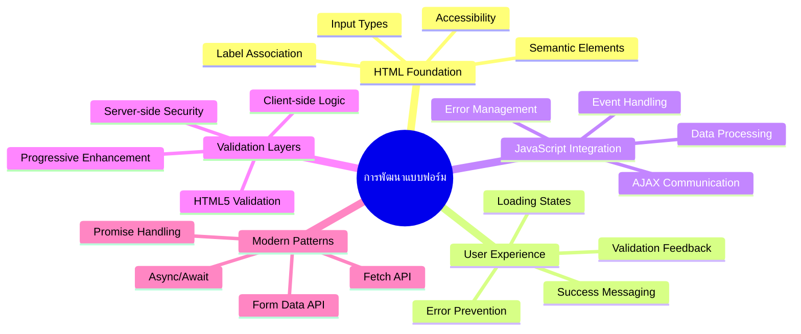
## ข้อกำหนดเบื้องต้น

ก่อนเริ่มสร้างฟอร์ม มาตรวจสอบว่าคุณได้ตั้งค่าทุกอย่างถูกต้องแล้ว บทเรียนนี้ต่อเนื่องจากบทก่อนหน้านี้ ดังนั้นถ้าคุณข้ามไปข้างหน้า อาจจะต้องกลับไปตั้งค่าพื้นฐานให้เรียบร้อยก่อน

### การตั้งค่าที่จำเป็น

| ส่วนประกอบ | สถานะ | คำอธิบาย |
|-----------|--------|-------------|
| [HTML Templates](../1-template-route/README.md) | ✅ จำเป็น | โครงสร้างแอปธนาคารพื้นฐานของคุณ |
| [Node.js](https://nodejs.org) | ✅ จำเป็น | รันไทม์ JavaScript สำหรับเซิร์ฟเวอร์ |
| [Bank API Server](../api/README.md) | ✅ จำเป็น | บริการแบ็คเอนด์สำหรับเก็บข้อมูล |

> 💡 **เคล็ดลับการพัฒนา**: คุณจะรันเซิร์ฟเวอร์สองตัวพร้อมกัน – หนึ่งตัวสำหรับแอปธนาคารฝั่งหน้า และอีกตัวสำหรับ API ฝั่งแบ็คเอนด์ การตั้งค่าแบบนี้เหมือนกับการพัฒนาในโลกจริงที่บริการ frontend และ backend ทำงานแยกจากกัน

### การตั้งค่าเซิร์ฟเวอร์

**สภาพแวดล้อมการพัฒนาของคุณจะรวม:**
- **เซิร์ฟเวอร์ฝั่งหน้า**: ให้บริการแอปธนาคารของคุณ (โดยปกติพอร์ต `3000`)
- **เซิร์ฟเวอร์ API ฝั่งแบ็คเอนด์**: จัดการเก็บและดึงข้อมูล (พอร์ต `5000`)
- **เซิร์ฟเวอร์ทั้งสองตัว** สามารถรันพร้อมกันโดยไม่มีปัญหา

**การทดสอบการเชื่อมต่อ API ของคุณ:**
```bash
curl http://localhost:5000/api
# ค่าตอบกลับที่คาดหวัง: "Bank API v1.0.0"
```

**ถ้าคุณเห็นการตอบกลับเวอร์ชันของ API แสดงว่าคุณพร้อมที่จะดำเนินการต่อ!**

---

## การเข้าใจฟอร์มและคอนโทรลใน HTML

ฟอร์ม HTML คือวิธีที่ผู้ใช้สื่อสารกับเว็บแอปพลิเคชันของคุณ คิดว่ามันเหมือนระบบโทรเลขที่เชื่อมต่อสถานที่ห่างไกลในศตวรรษที่ 19 – เป็นโปรโตคอลการสื่อสารระหว่างเจตนาของผู้ใช้และการตอบสนองของแอป เมื่อออกแบบอย่างรอบคอบ มันจะจับข้อผิดพลาด ช่วยแนะนำรูปแบบข้อมูล และให้คำแนะนำที่เป็นประโยชน์

ฟอร์มสมัยใหม่ซับซ้อนกว่าช่องกรอกข้อความพื้นฐานมาก HTML5 แนะนำชนิดอินพุตเฉพาะที่จัดการการตรวจสอบอีเมล รูปแบบตัวเลข และการเลือกวันที่โดยอัตโนมัติ การปรับปรุงเหล่านี้เป็นประโยชน์ทั้งต่อการเข้าถึงและประสบการณ์ผู้ใช้มือถือ

### องค์ประกอบฟอร์มที่จำเป็น

**ตัวสร้างพื้นฐานที่ทุกฟอร์มต้องมี:**

```html
<!-- Basic form structure -->
<form id="userForm" method="POST">
  <label for="username">Username</label>
  <input id="username" name="username" type="text" required>
  
  <button type="submit">Submit</button>
</form>
```

**โค้ดนี้ทำอะไร:**
- **สร้าง** คอนเทนเนอร์ฟอร์มที่มีตัวระบุเฉพาะ
- **ระบุ** วิธี HTTP สำหรับส่งข้อมูล
- **เชื่อมโยง** ป้ายคำกับอินพุตเพื่อรองรับการเข้าถึง
- **กำหนด** ปุ่มส่งฟอร์มเพื่อประมวลผลฟอร์ม

### ชนิดอินพุตและคุณสมบัติสมัยใหม่

| ชนิดอินพุต | จุดประสงค์ | ตัวอย่างการใช้งาน |
|------------|---------|---------------|
| `text` | กรอกข้อความทั่วไป | `<input type="text" name="username">` |
| `email` | ตรวจสอบอีเมล | `<input type="email" name="email">` |
| `password` | กรอกข้อความซ่อน | `<input type="password" name="password">` |
| `number` | กรอกตัวเลข | `<input type="number" name="balance" min="0">` |
| `tel` | หมายเลขโทรศัพท์ | `<input type="tel" name="phone">` |

> 💡 **ข้อดีของ HTML5 สมัยใหม่**: การใช้ชนิดอินพุตเฉพาะช่วยให้ตรวจสอบอัตโนมัติ ใช้แป้นพิมพ์มือถือที่เหมาะสม และรองรับการเข้าถึงมากขึ้นโดยไม่ต้องใช้ JavaScript เพิ่ม!

### ประเภทปุ่มและพฤติกรรม

```html
<!-- Different button behaviors -->
<button type="submit">Save Data</button>     <!-- Submits the form -->
<button type="reset">Clear Form</button>    <!-- Resets all fields -->
<button type="button">Custom Action</button> <!-- No default behavior -->
```

**ปุ่มแต่ละประเภททำอะไร:**
- **ปุ่มส่ง (submit)**: กระตุ้นการส่งฟอร์มและส่งข้อมูลไปยังปลายทางที่ระบุ
- **ปุ่มรีเซ็ต (reset)**: คืนค่าฟิลด์ฟอร์มทั้งหมดเป็นค่าเริ่มต้น
- **ปุ่มปกติ (button)**: ไม่มีพฤติกรรมเริ่มต้น ต้องเขียน JavaScript เพื่อใช้งาน

> ⚠️ **ข้อสำคัญ**: อิลิเมนต์ `<input>` เป็นแบบปิดตัวเองและไม่ต้องมีแท็กปิด วิธีปฏิบัติที่ดีที่สุดในยุคใหม่คือเขียนเป็น `<input>` โดยไม่ต้องใส่สแลช

### สร้างฟอร์มเข้าสู่ระบบของคุณ

ตอนนี้มาสร้างฟอร์มเข้าสู่ระบบที่ใช้งานได้จริงซึ่งแสดงตัวอย่างการใช้งานฟอร์ม HTML สมัยใหม่ เราจะเริ่มด้วยโครงสร้างพื้นฐานและปรับปรุงสิ่งที่รองรับการเข้าถึงและการตรวจสอบข้อมูล

```html
<template id="login">
  <h1>Bank App</h1>
  <section>
    <h2>Login</h2>
    <form id="loginForm" novalidate>
      <div class="form-group">
        <label for="username">Username</label>
        <input id="username" name="user" type="text" required 
               autocomplete="username" placeholder="Enter your username">
      </div>
      <button type="submit">Login</button>
    </form>
  </section>
</template>
```

**อธิบายว่ามีอะไรเกิดขึ้น:**
- **จัดโครงสร้าง** ฟอร์มด้วยอิลิเมนต์ semantic HTML5
- **จัดกลุ่ม** องค์ประกอบที่เกี่ยวข้องด้วย `div` และคลาสที่มีความหมาย
- **เชื่อมโยง** ป้ายคำกับอินพุตโดยใช้แอตทริบิวต์ `for` และ `id`
- **เพิ่ม** คุณสมบัติสมัยใหม่อย่าง `autocomplete` และ `placeholder` เพื่อ UX ที่ดีขึ้น
- **เพิ่ม** `novalidate` เพื่อจัดการการตรวจสอบด้วย JavaScript แทนเบราว์เซอร์

### พลังของป้ายคำที่ถูกต้อง

**ทำไมป้ายคำถึงสำคัญกับการพัฒนาเว็บสมัยใหม่:**

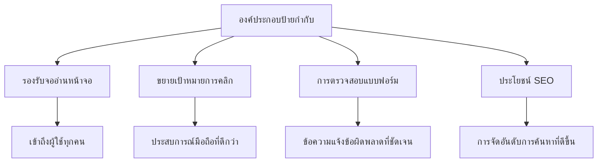
**ป้ายคำที่ดีทำอะไรได้บ้าง:**
- **ช่วยให้** โปรแกรมอ่านหน้าจอประกาศฟิลด์ฟอร์มได้ชัดเจน
- **ขยาย** พื้นที่คลิกได้ (คลิกที่ป้ายคำจะโฟกัสอินพุต)
- **ปรับปรุง** การใช้งานมือถือด้วยเป้าสัมผัสที่ใหญ่ขึ้น
- **สนับสนุน** การตรวจสอบฟอร์มพร้อมข้อความแจ้งข้อผิดพลาดที่มีความหมาย
- **เพิ่ม** SEO โดยให้ความหมาย semantic แก่องค์ประกอบฟอร์ม

> 🎯 **เป้าหมายการเข้าถึง**: อินพุตฟอร์มทุกตัวควรมีป้ายคำที่เชื่อมโยง การปฏิบัติที่ง่ายนี้ทำให้ฟอร์มของคุณใช้งานได้กับทุกคน รวมถึงผู้ใช้ที่มีความบกพร่อง และปรับปรุงประสบการณ์สำหรับผู้ใช้ทั้งหมด

### สร้างฟอร์มลงทะเบียน

ฟอร์มลงทะเบียนต้องข้อมูลรายละเอียดมากขึ้นเพื่อสร้างบัญชีผู้ใช้ที่สมบูรณ์ มาสร้างด้วยฟีเจอร์ HTML5 สมัยใหม่และเพิ่มการรองรับการเข้าถึง

```html
<hr/>
<h2>Register</h2>
<form id="registerForm" novalidate>
  <div class="form-group">
    <label for="user">Username</label>
    <input id="user" name="user" type="text" required 
           autocomplete="username" placeholder="Choose a username">
  </div>
  
  <div class="form-group">
    <label for="currency">Currency</label>
    <input id="currency" name="currency" type="text" value="$" 
           required maxlength="3" placeholder="USD, EUR, etc.">
  </div>
  
  <div class="form-group">
    <label for="description">Account Description</label>
    <input id="description" name="description" type="text" 
           maxlength="100" placeholder="Personal savings, checking, etc.">
  </div>
  
  <div class="form-group">
    <label for="balance">Starting Balance</label>
    <input id="balance" name="balance" type="number" value="0" 
           min="0" step="0.01" placeholder="0.00">
  </div>
  
  <button type="submit">Create Account</button>
</form>
```

**ในโค้ดข้างต้น เราได้:**
- **จัดระเบียบ** ฟิลด์แต่ละตัวใน div คอนเทนเนอร์เพื่อการจัดแต่งและจัดวางที่ดีขึ้น
- **เพิ่ม** แอตทริบิวต์ `autocomplete` ที่เหมาะสมเพื่อรองรับการกรอกอัตโนมัติของเบราว์เซอร์
- **ใส่** ข้อความ placeholder ที่ช่วยแนะนำการกรอกข้อมูลผู้ใช้
- **ตั้งค่า** ค่าเริ่มต้นที่เหมาะสมด้วยแอตทริบิวต์ `value`
- **ใช้** คุณสมบัติการตรวจสอบเช่น `required`, `maxlength`, และ `min`
- **ใช้** `type="number"` สำหรับฟิลด์ยอดเงินโดยรองรับเลขทศนิยม

### สำรวจชนิดอินพุตและพฤติกรรม

**ชนิดอินพุตสมัยใหม่มอบฟังก์ชันที่ดีกว่า:**

| คุณสมบัติ | ประโยชน์ | ตัวอย่าง |
|---------|---------|----------|
| `type="number"` | คีย์บอร์ดตัวเลขบนมือถือ | กรอกยอดเงินง่ายขึ้น |
| `step="0.01"` | ควบคุมความละเอียดทศนิยม | รองรับเซนต์ในสกุลเงิน |
| `autocomplete` | กรอกอัตโนมัติของเบราว์เซอร์ | เติมฟอร์มเร็วขึ้น |
| `placeholder` | คำแนะนำตามบริบท | ช่วยแนะนำความคาดหวังของผู้ใช้ |

> 🎯 **ความท้าทายด้านการเข้าถึง**: ลองนำทางฟอร์มโดยใช้แค่คีย์บอร์ด! ใช้ `Tab` เพื่อสลับระหว่างฟิลด์, `Space` เพื่อเลือกกล่อง, และ `Enter` เพื่อส่งฟอร์ม ประสบการณ์นี้ช่วยให้คุณเข้าใจวิธีที่ผู้ใช้โปรแกรมอ่านหน้าจอทำงานกับฟอร์มของคุณ

### 🔄 **ตรวจสอบความเข้าใจ**
**พื้นฐานฟอร์ม**: ก่อนใช้ JavaScript ตรวจสอบว่าคุณเข้าใจ:
- ✅ วิธีที่ semantic HTML สร้างโครงสร้างฟอร์มที่เข้าถึงได้
- ✅ เหตุผลที่ชนิดอินพุตสำคัญต่อคีย์บอร์ดมือถือและการตรวจสอบ
- ✅ ความสัมพันธ์ระหว่างป้ายคำและคอนโทรลฟอร์ม
- ✅ วิธีที่แอตทริบิวต์ฟอร์มมีผลต่อพฤติกรรมดั้งเดิมของเบราว์เซอร์

**ทดสอบตัวเองอย่างรวดเร็ว**: จะเกิดอะไรขึ้นถ้าส่งฟอร์มโดยไม่มี JavaScript คอยจัดการ?
*คำตอบ: เบราว์เซอร์จะส่งข้อมูลไปยัง URL ตามที่ระบุเป็นค่าดั้งเดิม*

**ข้อดีของฟอร์ม HTML5**: ฟอร์มสมัยใหม่มี:
- **ตรวจสอบในตัว**: ตรวจสอบรูปแบบอีเมลและตัวเลขโดยอัตโนมัติ
- **เหมาะสำหรับมือถือ**: ใช้คีย์บอร์ดที่เหมาะสมกับชนิดอินพุตต่างๆ
- **การเข้าถึง**: รองรับโปรแกรมอ่านหน้าจอและการนำทางด้วยคีย์บอร์ด
- **การปรับปรุงเชิงก้าวหน้า**: ทำงานได้แม้ JavaScript ถูกปิด

## การเข้าใจวิธีการส่งฟอร์ม

เมื่อมีคนกรอกฟอร์มของคุณแล้วกดส่ง ข้อมูลนั้นต้องไปที่ไหนสักแห่ง – ปกติคือเซิร์ฟเวอร์ที่เก็บข้อมูลไว้ มีหลายวิธีที่ข้อมูลจะถูกส่ง และรู้ว่าเมื่อไหร่ควรใช้วิธีไหนจะช่วยให้คุณหลีกเลี่ยงปัญหาในภายหลังได้

มาดูสิ่งที่เกิดขึ้นจริงเมื่อผู้ใช้กดปุ่มส่งฟอร์ม

### พฤติกรรมฟอร์มดั้งเดิม

เริ่มด้วยการสังเกตพฤติกรรมการส่งฟอร์มพื้นฐาน:

**ทดสอบฟอร์มปัจจุบันของคุณ:**
1. คลิกปุ่ม *Register* ในฟอร์มของคุณ
2. สังเกตการเปลี่ยนแปลงในแถบที่อยู่ของเบราว์เซอร์
3. สังเกตว่าหน้าดีโหลดใหม่และข้อมูลปรากฏใน URL


### การเปรียบเทียบวิธี HTTP

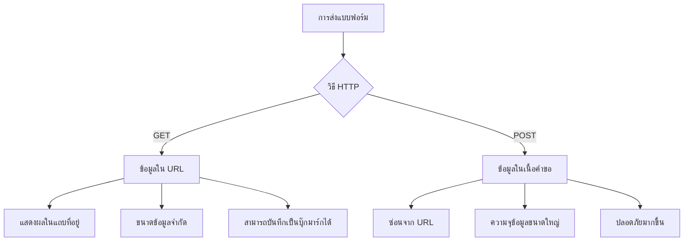
**เข้าใจความแตกต่าง:**

| วิธี | กรณีการใช้งาน | ที่ตั้งข้อมูล | ระดับความปลอดภัย | ขนาดจำกัด |
|--------|----------|---------------|----------------|-------------|
| `GET` | ค้นหา, ตัวกรอง | พารามิเตอร์ URL | ต่ำ (มองเห็นได้) | ~2000 ตัวอักษร |
| `POST` | บัญชีผู้ใช้, ข้อมูลสำคัญ | เนื้อหาในคำขอ | สูงกว่า (ซ่อน) | ไม่มีข้อจำกัดจริง |

**เข้าใจความแตกต่างพื้นฐาน:**
- **GET**: เพิ่มข้อมูลฟอร์มไปที่ URL เป็นพารามิเตอร์ (เหมาะสำหรับการค้นหา)
- **POST**: รวมข้อมูลไว้ในเนื้อหาคำขอ (จำเป็นสำหรับข้อมูลสำคัญ)
- **ข้อจำกัด GET**: ขนาดจำกัด, ข้อมูลปรากฏชัด, ประวัติในเบราว์เซอร์ค้างอยู่
- **ข้อดี POST**: รับข้อมูลขนาดใหญ่, ปกป้องความเป็นส่วนตัว, รองรับการอัปโหลดไฟล์

> 💡 **แนวทางปฏิบัติที่ดีที่สุด**: ใช้ `GET` สำหรับฟอร์มค้นหาและตัวกรอง (การดึงข้อมูล), ใช้ `POST` สำหรับการลงทะเบียนผู้ใช้, เข้าสู่ระบบ และสร้างข้อมูล

### การตั้งค่าการส่งฟอร์ม

มาตั้งค่าฟอร์มลงทะเบียนของคุณให้สื่อสารกับ API ฝั่งแบ็คเอนด์ด้วยวิธี POST:

```html
<form id="registerForm" action="//localhost:5000/api/accounts" 
      method="POST" novalidate>
```

**การตั้งค่านี้ทำอะไร:**
- **กำหนด** การส่งฟอร์มไปยังปลายทาง API ของคุณ
- **ใช้** วิธี POST สำหรับการส่งข้อมูลอย่างปลอดภัย
- **ใส่** `novalidate` เพื่อจัดการการตรวจสอบด้วย JavaScript

### การทดสอบส่งฟอร์ม

**ทำตามขั้นตอนเหล่านี้เพื่อลองทดสอบฟอร์ม:**
1. **กรอกข้อมูล** ในฟอร์มลงทะเบียน
2. **คลิก** ปุ่ม "Create Account"
3. **สังเกต** การตอบสนองจากเซิร์ฟเวอร์ในเบราว์เซอร์ของคุณ

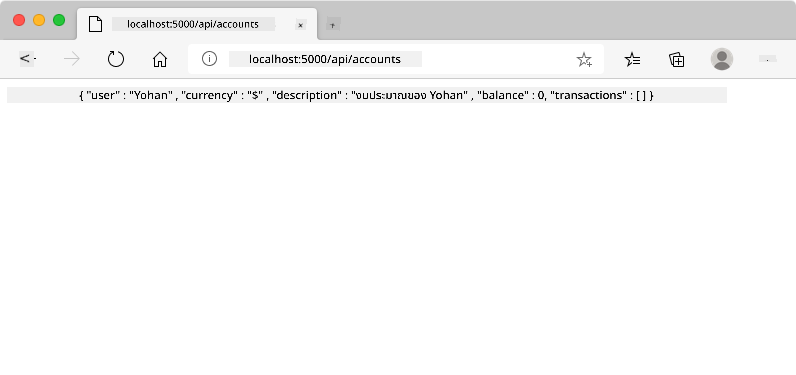

**สิ่งที่คุณควรเห็น:**
- **เบราว์เซอร์เปลี่ยนเส้นทาง** ไปที่ URL ของ API
- **การตอบสนอง JSON** ที่มีข้อมูลบัญชีที่เพิ่งสร้างใหม่ของคุณ
- **การยืนยันจากเซิร์ฟเวอร์** ว่าบัญชีถูกสร้างสำเร็จ

> 🧪 **เวลาทดลอง**: ลองลงทะเบียนอีกครั้งด้วยชื่อผู้ใช้เดิม คุณจะได้การตอบสนองแบบไหน? สิ่งนี้ช่วยให้คุณเข้าใจว่าเซิร์ฟเวอร์จัดการข้อมูลซ้ำและข้อผิดพลาดอย่างไร

### การเข้าใจการตอบสนอง JSON

**เมื่อเซิร์ฟเวอร์ประมวลผลฟอร์มของคุณสำเร็จ:**
```json
{
  "user": "john_doe",
  "currency": "$",
  "description": "Personal savings",
  "balance": 100,
  "id": "unique_account_id"
}
```

**การตอบกลับนี้ยืนยันว่า:**
- **สร้าง** บัญชีใหม่ด้วยข้อมูลที่ระบุ
- **มอบหมาย** รหัสเฉพาะเพื่อใช้อ้างอิงในอนาคต
- **ส่งคืน** ข้อมูลบัญชีทั้งหมดเพื่อตรวจสอบ
- **แสดง** ว่าการเก็บข้อมูลในฐานข้อมูลสำเร็จ

## การจัดการฟอร์มสมัยใหม่ด้วย JavaScript

การส่งฟอร์มแบบดั้งเดิมทำให้ทั้งหน้าดีโหลดใหม่ทั้งหมด เช่นเดียวกับภารกิจอวกาศยุคแรกที่ต้องรีเซ็ตระบบทั้งหมดเมื่อปรับเส้นทาง วิธีนี้ทำลายประสบการณ์ผู้ใช้และทำให้แอปสูญเสียสถานะ

การจัดการฟอร์มด้วย JavaScript เหมือนระบบนำทางต่อเนื่องในยานอวกาศสมัยใหม่ – ปรับเปลี่ยนแบบเรียลไทม์โดยไม่สูญเสียสถานะ เราสามารถดักจับการส่งฟอร์ม ให้คำติชมทันที จัดการข้อผิดพลาดได้ดี และอัปเดตอินเทอร์เฟซตามการตอบกลับจากเซิร์ฟเวอร์ พร้อมรักษาตำแหน่งของผู้ใช้ในแอป

### ทำไมต้องหลีกเลี่ยงการโหลดหน้าซ้ำ?

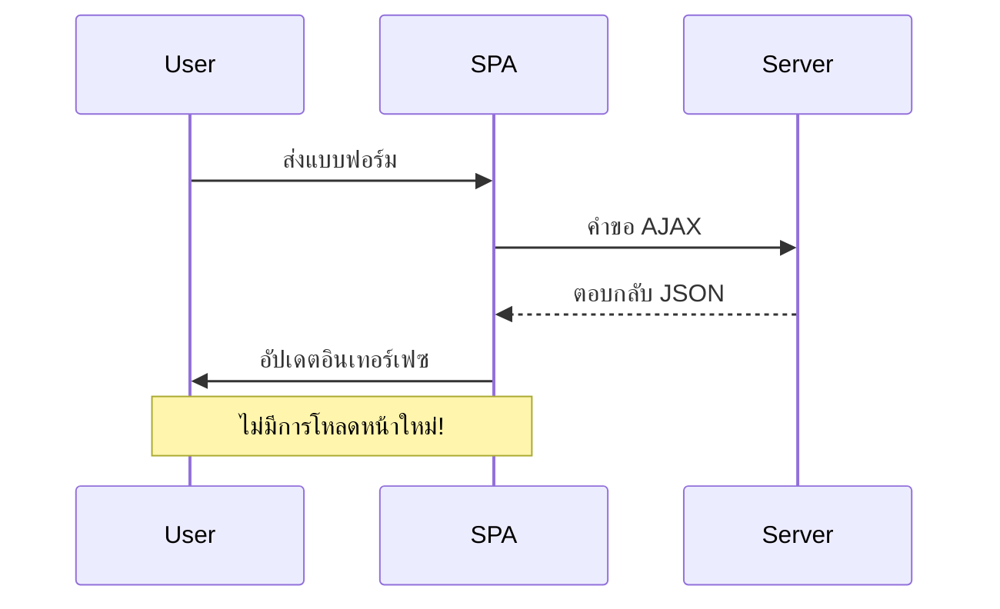
**ข้อดีของการจัดการฟอร์มด้วย JavaScript:**
- **รักษา** สถานะแอปและบริบทผู้ใช้
- **ให้** คำติชมทันทีและตัวบ่งชี้โหลด
- **เปิด** โอกาสจัดการข้อผิดพลาดและตรวจสอบอย่างไดนามิก
- **สร้าง** ประสบการณ์ใช้งานเหมือนแอปที่ลื่นไหล
- **อนุญาต** เงื่อนไขตามการตอบกลับจากเซิร์ฟเวอร์

### การเปลี่ยนจากฟอร์มดั้งเดิมเป็นสมัยใหม่

**ความท้าทายแบบดั้งเดิม:**
- **เปลี่ยนเส้นทาง** ผู้ใช้ออกจากแอปของคุณ
- **สูญเสีย** สถานะและบริบทของแอปปัจจุบัน
- **จำเป็น** ต้องโหลดหน้าซ้ำทั้งหมดสำหรับการดำเนินการง่ายๆ
- **ให้** ควบคุมคำติชมของผู้ใช้น้อย

**ข้อดีของ JavaScript สมัยใหม่:**
- **รักษา** ผู้ใช้ไว้ในแอปของคุณ
- **เก็บรักษา** สถานะและข้อมูลทั้งหมดของแอป
- **เปิดใช้** การตรวจสอบและคำติชมแบบเรียลไทม์
- **รองรับ** การปรับปรุงเชิงก้าวหน้าและการเข้าถึง

### การใช้งานการจัดการฟอร์มด้วย JavaScript

มาทดแทนการส่งฟอร์มแบบเดิมด้วยการจัดการอีเวนต์ JavaScript สมัยใหม่:

```html
<!-- Remove the action attribute and add event handling -->
<form id="registerForm" method="POST" novalidate>
```

**เพิ่มตรรกะการลงทะเบียนในไฟล์ `app.js` ของคุณ:**

```javascript
// การจัดการฟอร์มที่ขับเคลื่อนด้วยเหตุการณ์แบบสมัยใหม่
function register() {
  const registerForm = document.getElementById('registerForm');
  const formData = new FormData(registerForm);
  const data = Object.fromEntries(formData);
  const jsonData = JSON.stringify(data);
  
  console.log('Form data prepared:', data);
}

// แนบตัวฟังเหตุการณ์เมื่อหน้าเว็บโหลด
document.addEventListener('DOMContentLoaded', () => {
  const registerForm = document.getElementById('registerForm');
  registerForm.addEventListener('submit', (event) => {
    event.preventDefault(); // ป้องกันการส่งฟอร์มตามค่าเริ่มต้น
    register();
  });
});
```

**อธิบายสิ่งที่เกิดขึ้น:**
- **ป้องกัน** การส่งฟอร์มแบบดั้งเดิมด้วย `event.preventDefault()`
- **ดึง** อิลิเมนต์ฟอร์มโดยใช้การเลือก DOM ที่ทันสมัย
- **ดึงข้อมูล** จากฟอร์มโดยใช้ API อันทรงพลัง `FormData`
- **แปลง** ข้อมูล FormData เป็นวัตถุทั่วไปด้วย `Object.fromEntries()`
- **จัดรูปแบบ** ข้อมูลเป็น JSON เพื่อสื่อสารกับเซิร์ฟเวอร์
- **บันทึก** ข้อมูลที่ประมวลผลไว้สำหรับดีบักและตรวจสอบ

### การเข้าใจ FormData API

**FormData API ให้การจัดการฟอร์มที่ทรงพลัง:**
```javascript
// ตัวอย่างของสิ่งที่ FormData เก็บรวบรวม
const formData = new FormData(registerForm);

// FormData จะเก็บรวบรวมโดยอัตโนมัติ:
// {
//   "user": "john_doe",
//   "currency": "$",
//   "description": "บัญชีส่วนตัว",
//   "balance": "100"
// }
```

**ข้อดีของ FormData API:**
- **การรวบรวมที่ครอบคลุม**: จับองค์ประกอบทั้งหมดของฟอร์ม รวมถึงข้อความ ไฟล์ และข้อมูลซับซ้อน
- **รู้จักประเภทข้อมูล**: จัดการประเภทอินพุตต่าง ๆ โดยอัตโนมัติโดยไม่ต้องเขียนโค้ดพิเศษ
- **ประสิทธิภาพ**: กำจัดการเก็บข้อมูลฟิลด์ด้วยตนเองด้วยคำสั่ง API เพียงครั้งเดียว
- **ความยืดหยุ่น**: คงฟังก์ชันการทำงานได้ตามโครงสร้างฟอร์มที่เปลี่ยนแปลง

### การสร้างฟังก์ชันการสื่อสารกับเซิร์ฟเวอร์

ตอนนี้เรามาสร้างฟังก์ชันที่แข็งแกร่งสำหรับติดต่อกับเซิร์ฟเวอร์ API ของคุณโดยใช้รูปแบบ JavaScript สมัยใหม่:

```javascript
async function createAccount(account) {
  try {
    const response = await fetch('//localhost:5000/api/accounts', {
      method: 'POST',
      headers: { 
        'Content-Type': 'application/json',
        'Accept': 'application/json'
      },
      body: account
    });
    
    // ตรวจสอบว่าการตอบกลับประสบความสำเร็จหรือไม่
    if (!response.ok) {
      throw new Error(`HTTP error! status: ${response.status}`);
    }
    
    return await response.json();
  } catch (error) {
    console.error('Account creation failed:', error);
    return { error: error.message || 'Network error occurred' };
  }
}
```

**ความเข้าใจใน JavaScript แบบอะซิงโครนัส:**

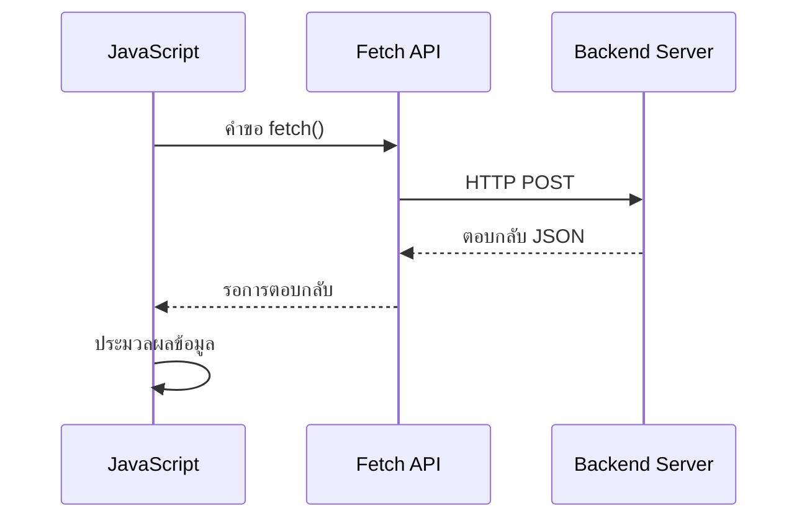
**สิ่งที่การใช้งานแบบสมัยใหม่นี้ทำได้:**
- **ใช้** `async/await` เพื่อเขียนโค้ดอะซิงโครนัสให้อ่านง่าย
- **รวม** การจัดการข้อผิดพลาดด้วยบล็อก try/catch อย่างถูกต้อง
- **ตรวจสอบ** สถานะตอบกลับก่อนประมวลผลข้อมูล
- **ตั้งค่า** เฮดเดอร์ที่เหมาะสมสำหรับการสื่อสาร JSON
- **ให้** ข้อความข้อผิดพลาดโดยละเอียดสำหรับการดีบัก
- **ส่งคืน** โครงสร้างข้อมูลที่สอดคล้องกันสำหรับกรณีสำเร็จและข้อผิดพลาด

### พลังของ Modern Fetch API

**ข้อดีของ Fetch API เมื่อเทียบกับวิธีเก่า:**

| ฟีเจอร์ | ประโยชน์ | การใช้งาน |
|---------|---------|------------|
| 基于 Promise | โค้ด async ที่สะอาด | `await fetch()` |
| การปรับแต่งคำขอ | ควบคุม HTTP ได้เต็มที่ | เฮดเดอร์, วิธี, เนื้อหา |
| การจัดการการตอบกลับ | การแปลงข้อมูลที่ยืดหยุ่น | `.json()`, `.text()`, `.blob()` |
| การจัดการข้อผิดพลาด | จับข้อผิดพลาดอย่างครบถ้วน | บล็อก try/catch |

> 🎥 **เรียนรู้เพิ่มเติม**: [Async/Await Tutorial](https://youtube.com/watch?v=YwmlRkrxvkk) - ความเข้าใจรูปแบบ JavaScript แบบอะซิงโครนัสสำหรับการพัฒนาเว็บสมัยใหม่

**แนวคิดสำคัญสำหรับการสื่อสารกับเซิร์ฟเวอร์:**
- **ฟังก์ชัน Async** ช่วยหยุดการประมวลผลเพื่อรอตอบสนองจากเซิร์ฟเวอร์
- **คีย์เวิร์ด await** ทำให้โค้ดอะซิงโครนัสอ่านเหมือนโค้ดแบบซิงโครนัส
- **Fetch API** เสนอคำขอ HTTP แบบทันสมัยที่ใช้ Promise
- **การจัดการข้อผิดพลาด** ทำให้แอปตอบสนองกับปัญหาเครือข่ายได้อย่างเรียบร้อย

### การทำฟังก์ชันลงทะเบียนให้เสร็จสมบูรณ์

มารวมทุกอย่างเข้าด้วยกันด้วยฟังก์ชันลงทะเบียนที่พร้อมใช้จริง:

```javascript
async function register() {
  const registerForm = document.getElementById('registerForm');
  const submitButton = registerForm.querySelector('button[type="submit"]');
  
  try {
    // แสดงสถานะกำลังโหลด
    submitButton.disabled = true;
    submitButton.textContent = 'Creating Account...';
    
    // ประมวลผลข้อมูลแบบฟอร์ม
    const formData = new FormData(registerForm);
    const jsonData = JSON.stringify(Object.fromEntries(formData));
    
    // ส่งไปยังเซิร์ฟเวอร์
    const result = await createAccount(jsonData);
    
    if (result.error) {
      console.error('Registration failed:', result.error);
      alert(`Registration failed: ${result.error}`);
      return;
    }
    
    console.log('Account created successfully!', result);
    alert(`Welcome, ${result.user}! Your account has been created.`);
    
    // รีเซ็ตแบบฟอร์มหลังจากลงทะเบียนสำเร็จ
    registerForm.reset();
    
  } catch (error) {
    console.error('Unexpected error:', error);
    alert('An unexpected error occurred. Please try again.');
  } finally {
    // คืนค่าสถานะปุ่ม
    submitButton.disabled = false;
    submitButton.textContent = 'Create Account';
  }
}
```

**การใช้งานที่ปรับปรุงนี้รวมถึง:**
- **แสดง** ข้อความตอบกลับในขณะส่งฟอร์ม
- **ปิดใช้งาน** ปุ่มส่งเพื่อป้องกันการส่งซ้ำ
- **จัดการ** ข้อผิดพลาดที่คาดหวังและไม่คาดคิดอย่างราบรื่น
- **แสดง** ข้อความความสำเร็จและข้อผิดพลาดที่เข้าใจง่ายสำหรับผู้ใช้
- **รีเซ็ต** ฟอร์มหลังลงทะเบียนสำเร็จ
- **คืนค่า** สถานะ UI ไม่ว่าผลลัพธ์จะเป็นอย่างไร

### การทดสอบการใช้งานของคุณ

**เปิดเครื่องมือพัฒนาเบราว์เซอร์แล้วทดสอบการลงทะเบียน:**

1. **เปิด** คอนโซลของเบราว์เซอร์ (F12 → แท็บ Console)
2. **กรอก** แบบฟอร์มลงทะเบียน
3. **คลิก** "สร้างบัญชี"
4. **สังเกต** ข้อความในคอนโซลและข้อเสนอแนะสำหรับผู้ใช้


**สิ่งที่คุณควรเห็น:**
- **สถานะโหลด** ปรากฏบนปุ่มส่ง
- **ข้อความในคอนโซล** แสดงข้อมูลละเอียดของกระบวนการ
- **ข้อความสำเร็จ** ปรากฏเมื่อสร้างบัญชีสำเร็จ
- **ฟอร์มรีเซ็ต** อัตโนมัติหลังส่งสำเร็จ

> 🔒 **ข้อควรระวังด้านความปลอดภัย**: ข้อมูลปัจจุบันส่งผ่าน HTTP ซึ่งไม่ปลอดภัยสำหรับใช้งานจริง ในแอปจริงต้องใช้ HTTPS เสมอเพื่อเข้ารหัสการส่งข้อมูล เรียนรู้เพิ่มเติมเกี่ยวกับ [ความปลอดภัย HTTPS](https://en.wikipedia.org/wiki/HTTPS) และเหตุผลว่าทำไมจึงสำคัญสำหรับการปกป้องข้อมูลผู้ใช้

### 🔄 **การตรวจสอบการเรียนรู้เชิงพฤติกรรม**
**การผสาน JavaScript สมัยใหม่**: ตรวจสอบความเข้าใจของคุณเกี่ยวกับการจัดการฟอร์มแบบอะซิงโครนัส:
- ✅ `event.preventDefault()` เปลี่ยนพฤติกรรมฟอร์มเริ่มต้นอย่างไร?
- ✅ ทำไม FormData API ถึงมีประสิทธิภาพกว่าการเก็บข้อมูลฟิลด์ด้วยตนเอง?
- ✅ รูปแบบ async/await ช่วยให้อ่านโค้ดยังไง?
- ✅ การจัดการข้อผิดพลาดมีบทบาทอย่างไรต่อประสบการณ์ผู้ใช้?

**สถาปัตยกรรมระบบ**: การจัดการฟอร์มของคุณแสดง:
- **การเขียนโปรแกรมแบบขับเคลื่อนด้วยเหตุการณ์**: ฟอร์มตอบสนองต่อการกระทำของผู้ใช้โดยไม่รีโหลดหน้า
- **การสื่อสารแบบอะซิงโครนัส**: คำขอเซิร์ฟเวอร์ไม่บล็อก UI
- **การจัดการข้อผิดพลาด**: เสถียรในกรณีเกิดปัญหาเครือข่าย
- **การจัดการสถานะ**: UI ปรับตามผลตอบสนองเซิร์ฟเวอร์
- **การเพิ่มประสิทธิภาพแบบค่อยๆ**: ฟังก์ชันพื้นฐานทำงานได้ JavaScript ช่วยปรับปรุง

**รูปแบบมืออาชีพ**: คุณได้ใช้งาน:
- **หน้าที่เดียวชัดเจน**: ฟังก์ชันมีจุดประสงค์ชัดเจน
- **ขอบเขตการจัดการข้อผิดพลาด**: บล็อก try/catch กันแอปล้ม
- **ตอบสนองผู้ใช้**: แสดงสถานะโหลดและข้อความสำเร็จ/ผิดพลาด
- **การแปลงข้อมูล**: FormData เป็น JSON สำหรับสื่อสารกับเซิร์ฟเวอร์

## การตรวจสอบฟอร์มที่ครอบคลุม

การตรวจสอบฟอร์มป้องกันประสบการณ์ที่น่าหงุดหงิดเมื่อพบข้อผิดพลาดหลังส่งฟอร์ม เหมือนกับระบบซ้ำซ้อนหลายชั้นบนสถานีอวกาศนานาชาติ การตรวจสอบที่มีประสิทธิภาพใช้การตรวจสอบหลายชั้นเพื่อความปลอดภัย

แนวทางที่ดีที่สุดคือผสมผสานการตรวจสอบที่ระดับเบราว์เซอร์เพื่อให้คำติชมทันที, การตรวจสอบด้วย JavaScript เพื่อประสบการณ์ผู้ใช้ที่ดียิ่งขึ้น และการตรวจสอบฝั่งเซิร์ฟเวอร์เพื่อความปลอดภัยและความสมบูรณ์ของข้อมูล ความซ้ำซ้อนนี้ทำให้ผู้ใช้พึงพอใจและระบบปลอดภัย

### เข้าใจชั้นการตรวจสอบ

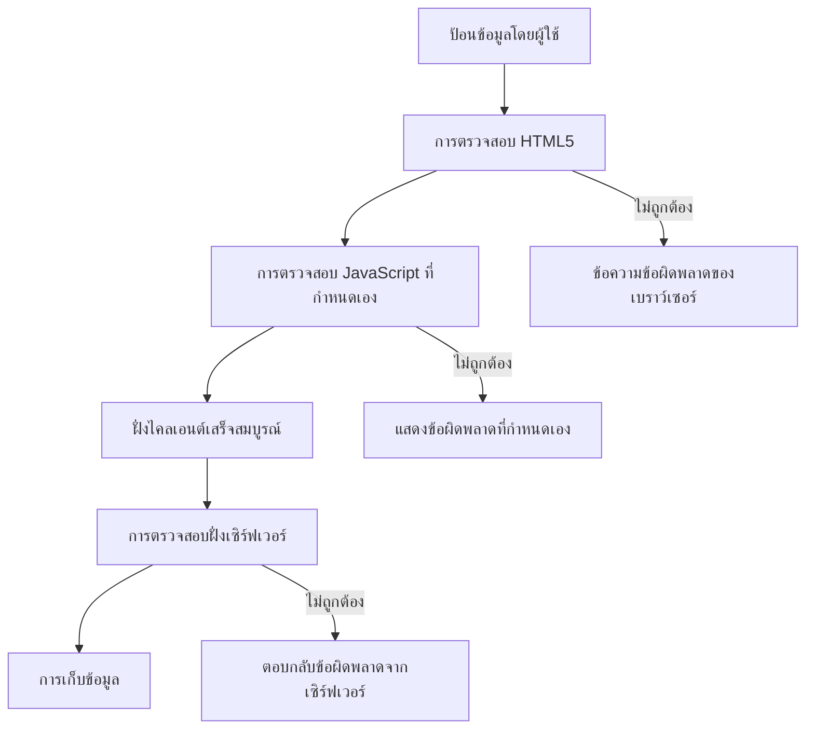
**กลยุทธ์การตรวจสอบหลายชั้น:**
- **ตรวจสอบ HTML5**: ตรวจสอบในเบราว์เซอร์ทันที
- **ตรวจสอบ JavaScript**: กรณีกำหนดเองและประสบการณ์ผู้ใช้
- **ตรวจสอบเซิร์ฟเวอร์**: ความปลอดภัยขั้นสุดท้ายและความสมบูรณ์ข้อมูล
- **การเพิ่มประสิทธิภาพแบบก้าวหน้า**: ทำงานได้แม้ไม่ใช้ JavaScript

### แอตทริบิวต์การตรวจสอบ HTML5

**เครื่องมือตรวจสอบสมัยใหม่ที่คุณมี:**

| แอตทริบิวต์ | จุดประสงค์ | ตัวอย่างการใช้งาน | พฤติกรรมเบราว์เซอร์ |
|-------------|-------------|------------------|---------------------|
| `required` | ฟิลด์บังคับ | `<input required>` | ป้องกันการส่งว่าง |
| `minlength` / `maxlength` | จำกัดความยาวข้อความ | `<input maxlength="20">` | บังคับจำกัดจำนวนตัวอักษร |
| `min` / `max` | ขอบเขตตัวเลข | `<input min="0" max="1000">` | ตรวจสอบขอบเขตตัวเลข |
| `pattern` | กฎ regex แบบกำหนดเอง | `<input pattern="[A-Za-z]+">` | ตรงกับฟอร์แมตเฉพาะ |
| `type` | ตรวจสอบประเภทข้อมูล | `<input type="email">` | ตรวจสอบฟอร์แมตเฉพาะประเภท |

### สไตล์ CSS สำหรับการตรวจสอบ

**สร้างคำแนะนำด้วยภาพสำหรับสถานะตรวจสอบ:**

```css
/* Valid input styling */
input:valid {
  border-color: #28a745;
  background-color: #f8fff9;
}

/* Invalid input styling */
input:invalid {
  border-color: #dc3545;
  background-color: #fff5f5;
}

/* Focus states for better accessibility */
input:focus:valid {
  box-shadow: 0 0 0 0.2rem rgba(40, 167, 69, 0.25);
}

input:focus:invalid {
  box-shadow: 0 0 0 0.2rem rgba(220, 53, 69, 0.25);
}
```

**สัญญาณภาพเหล่านี้ทำอะไรได้บ้าง:**
- **ขอบสีเขียว**: ระบุการตรวจสอบสำเร็จ เหมือนไฟเขียวในศูนย์ควบคุมภารกิจ
- **ขอบสีแดง**: แจ้งข้อผิดพลาดต้องสนใจ
- **ไฮไลท์โฟกัส**: ให้บริบทภาพชัดเจนสำหรับตำแหน่งอินพุตปัจจุบัน
- **สไตล์ที่สม่ำเสมอ**: สร้างรูปแบบที่เข้าใจได้และผู้ใช้จำได้

> 💡 **เคล็ดลับมือโปร**: ใช้ pseudo-classes CSS `:valid` และ `:invalid` เพื่อให้คำตอบกลับภาพทันทีเมื่อผู้ใช้พิมพ์ สร้างอินเตอร์เฟสที่ตอบสนองและช่วยเหลือ

### การเพิ่มการตรวจสอบอย่างครบถ้วน

เรามาปรับปรุงฟอร์มลงทะเบียนของคุณด้วยการตรวจสอบที่แข็งแรงซึ่งให้ประสบการณ์ผู้ใช้และคุณภาพข้อมูลที่ยอดเยี่ยม:

```html
<form id="registerForm" method="POST" novalidate>
  <div class="form-group">
    <label for="user">Username <span class="required">*</span></label>
    <input id="user" name="user" type="text" required 
           minlength="3" maxlength="20" 
           pattern="[a-zA-Z0-9_]+" 
           autocomplete="username"
           title="Username must be 3-20 characters, letters, numbers, and underscores only">
    <small class="form-text">Choose a unique username (3-20 characters)</small>
  </div>
  
  <div class="form-group">
    <label for="currency">Currency <span class="required">*</span></label>
    <input id="currency" name="currency" type="text" required 
           value="$" maxlength="3" 
           pattern="[A-Z$€£¥₹]+" 
           title="Enter a valid currency symbol or code">
    <small class="form-text">Currency symbol (e.g., $, €, £)</small>
  </div>
  
  <div class="form-group">
    <label for="description">Account Description</label>
    <input id="description" name="description" type="text" 
           maxlength="100" 
           placeholder="Personal savings, checking, etc.">
    <small class="form-text">Optional description (up to 100 characters)</small>
  </div>
  
  <div class="form-group">
    <label for="balance">Starting Balance</label>
    <input id="balance" name="balance" type="number" 
           value="0" min="0" step="0.01" 
           title="Enter a positive number for your starting balance">
    <small class="form-text">Initial account balance (minimum $0.00)</small>
  </div>
  
  <button type="submit">Create Account</button>
</form>
```

**เข้าใจการตรวจสอบที่ปรับปรุง:**
- **ผสม** ตัวบ่งชี้ฟิลด์บังคับกับคำอธิบายช่วยเหลือ
- **รวม** แอตทริบิวต์ `pattern` สำหรับการตรวจสอบรูปแบบ
- **ให้** แอตทริบิวต์ `title` เพื่อความสามารถในการเข้าถึงและคำแนะนำเครื่องมือ
- **เพิ่ม** ข้อความช่วยเหลือแนะนำการกรอกข้อมูล
- **ใช้** โครงสร้าง HTML เชิงแสดงความหมายเพื่อการเข้าถึงที่ดีกว่า

### กฎการตรวจสอบขั้นสูง

**การตรวจสอบแต่ละกฎทำอะไร:**

| ฟิลด์ | กฎการตรวจสอบ | ประโยชน์ผู้ใช้ |
|-------|----------------|----------------|
| ชื่อผู้ใช้ | `required`, `minlength="3"`, `maxlength="20"`, `pattern="[a-zA-Z0-9_]+"` | รับประกันตัวระบุที่ถูกต้องและไม่ซ้ำกัน |
| สกุลเงิน | `required`, `maxlength="3"`, `pattern="[A-Z$€£¥₹]+"` | รับสัญลักษณ์สกุลเงินทั่วไป |
| ยอดคงเหลือ | `min="0"`, `step="0.01"`, `type="number"` | ป้องกันยอดคงเหลือลบ |
| คำอธิบาย | `maxlength="100"` | จำกัดความยาวให้เหมาะสม |

### ทดสอบพฤติกรรมการตรวจสอบ

**ลองสถานการณ์ตรวจสอบเหล่านี้:**
1. **ส่ง** ฟอร์มโดยฟิลด์บังคับว่างเปล่า
2. **ป้อน** ชื่อผู้ใช้สั้นกว่า 3 ตัวอักษร
3. **ลอง** ป้อนอักขระพิเศษในฟิลด์ชื่อผู้ใช้
4. **ป้อน** ยอดคงเหลือลบ

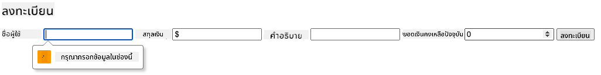

**สิ่งที่คุณจะเห็น:**
- **เบราว์เซอร์แสดง** ข้อความตรวจสอบพื้นฐานที่มีในตัว
- **สไตล์เปลี่ยน** ตามสถานะ `:valid` และ `:invalid`
- **การส่งฟอร์ม** ถูกป้องกันจนกว่าตรวจสอบผ่านทั้งหมด
- **โฟกัสเลื่อนไปยัง** ฟิลด์แรกที่มีข้อผิดพลาดโดยอัตโนมัติ

### การตรวจสอบฝั่งลูกค้า vs ฝั่งเซิร์ฟเวอร์

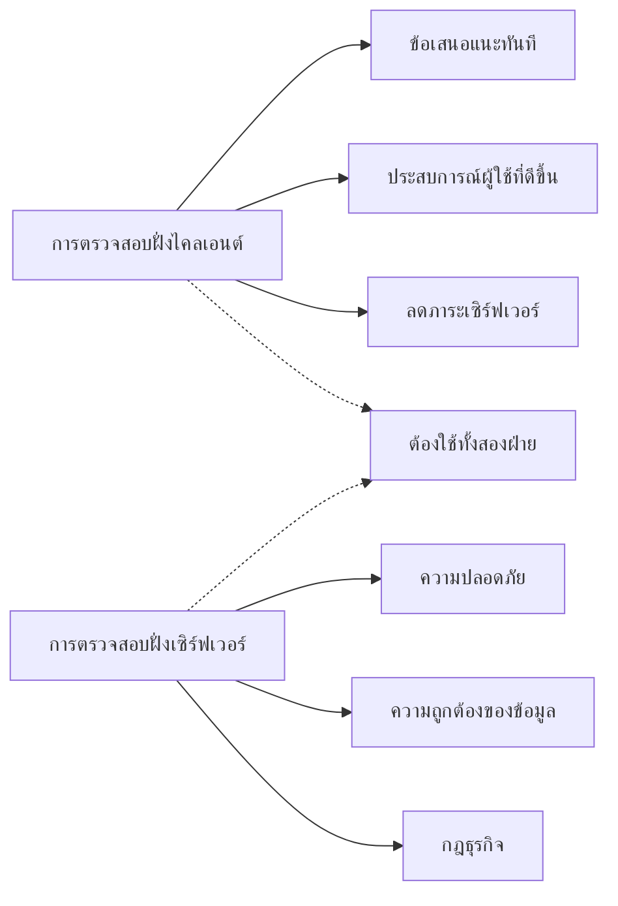
**ทำไมต้องมีทั้งสองชั้น:**
- **การตรวจสอบฝั่งลูกค้า**: ให้คำตอบกลับทันทีและปรับประสบการณ์ผู้ใช้
- **การตรวจสอบฝั่งเซิร์ฟเวอร์**: รับรองความปลอดภัยและจัดการกฎธุรกิจซับซ้อน
- **แนวทางรวม**: สร้างแอปที่แข็งแรง เป็นมิตร และปลอดภัย
- **การเพิ่มประสิทธิภาพแบบก้าวหน้า**: ทำงานแม้ไม่มี JavaScript

> 🛡️ **ข้อเตือนความปลอดภัย**: ไม่ควรเชื่อการตรวจสอบฝั่งลูกค้าเพียงอย่างเดียว! ผู้ใช้ประสงค์ร้ายสามารถข้ามตรวจสอบฝั่งลูกค้าได้ ดังนั้นตรวจสอบฝั่งเซิร์ฟเวอร์จำเป็นเพื่อความปลอดภัยและความสมบูรณ์ของข้อมูล

### ⚡ **สิ่งที่คุณทำได้ใน 5 นาทีถัดไป**
- [ ] ทดสอบฟอร์มด้วยข้อมูลไม่ถูกต้องเพื่อดูข้อความตรวจสอบ
- [ ] ลองส่งฟอร์มโดยปิด JavaScript เพื่อดูการตรวจสอบ HTML5
- [ ] เปิด DevTools ของเบราว์เซอร์และตรวจสอบข้อมูลฟอร์มที่ส่งไปเซิร์ฟเวอร์
- [ ] ทดลองใช้ชนิดอินพุตต่างๆ เพื่อดูการเปลี่ยนแปลงแป้นพิมพ์มือถือ

### 🎯 **สิ่งที่คุณสำเร็จได้ในชั่วโมงนี้**
- [ ] ทำแบบทดสอบหลังบทเรียนและเข้าใจแนวคิดการจัดการฟอร์ม
- [ ] นำการตรวจสอบครบถ้วนแบบสด ๆ มาใช้งาน
- [ ] เพิ่มสไตล์ CSS เพื่อสร้างฟอร์มที่ดูเป็นมืออาชีพ
- [ ] สร้างการจัดการข้อผิดพลาดสำหรับชื่อผู้ใช้ซ้ำและข้อผิดพลาดเซิร์ฟเวอร์
- [ ] เพิ่มฟิลด์ยืนยันรหัสผ่านพร้อมการตรวจสอบที่ตรงกัน

### 📅 **เส้นทางการเรียนรู้ฟอร์มตลอดสัปดาห์ของคุณ**
- [ ] ทำแอปธนาคารเต็มรูปแบบที่มีฟีเจอร์ฟอร์มขั้นสูง
- [ ] ใช้งานฟีเจอร์อัปโหลดไฟล์สำหรับรูปโปรไฟล์หรือเอกสาร
- [ ] เพิ่มฟอร์มหลายขั้นตอนพร้อมตัวบ่งชี้ความคืบหน้าและการจัดการสถานะ
- [ ] สร้างฟอร์มไดนามิกที่ปรับตามการเลือกของผู้ใช้
- [ ] ใช้ฟีเจอร์การบันทึกอัตโนมัติและกู้คืนฟอร์มเพื่อประสบการณ์ผู้ใช้ที่ดีขึ้น
- [ ] เพิ่มการตรวจสอบขั้นสูง เช่น การยืนยันอีเมลและรูปแบบหมายเลขโทรศัพท์

### 🌟 **การเรียนรู้การพัฒนา Frontend ตลอดเดือนของคุณ**
- [ ] สร้างแอปฟอร์มซับซ้อนด้วยตรรกะเงื่อนไขและเวิร์กโฟลว์
- [ ] เรียนรู้ไลบรารีและเฟรมเวิร์กฟอร์มเพื่อการพัฒนาอย่างรวดเร็ว
- [ ] เชี่ยวชาญแนวทางเข้าถึงและการออกแบบแบบมีส่วนร่วม
- [ ] ประยุกต์ใช้นานาชาติและการแปลในฟอร์มทั่วโลก
- [ ] สร้างไลบรารีคอมโพเนนต์ฟอร์มที่ใช้ซ้ำได้และระบบการออกแบบ
- [ ] มีส่วนร่วมกับโปรเจ็กต์ฟอร์มโอเพ่นซอร์สและแบ่งปันแนวปฏิบัติที่ดีที่สุด

## 🎯 ไทม์ไลน์ความเชี่ยวชาญการพัฒนาฟอร์มของคุณ

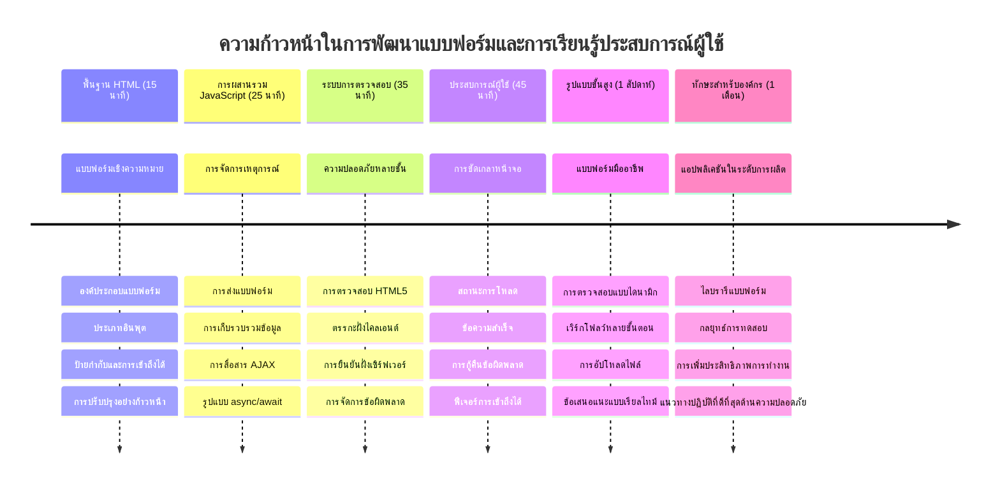
### 🛠️ สรุปชุดเครื่องมือพัฒนาฟอร์มของคุณ

หลังจากเรียนบทนี้เสร็จ คุณจะเชี่ยวชาญ:
- **ฟอร์ม HTML5**: โครงสร้างเชิงความหมาย ชนิดอินพุต และฟีเจอร์การเข้าถึง
- **การจัดการฟอร์มด้วย JavaScript**: การจัดการเหตุการณ์ การเก็บข้อมูล และการสื่อสาร AJAX
- **สถาปัตยกรรมการตรวจสอบ**: การตรวจสอบหลายชั้นเพื่อความปลอดภัยและประสบการณ์ผู้ใช้
- **การเขียนโปรแกรมอะซิงโครนัส**: Modern fetch API และรูปแบบ async/await
- **การจัดการข้อผิดพลาด**: การจับข้อผิดพลาด เทคนิคและระบบตอบกลับผู้ใช้
- **การออกแบบประสบการณ์ผู้ใช้**: สถานะโหลด, ข้อความความสำเร็จ และการกู้คืนจากข้อผิดพลาด
- **การเพิ่มประสิทธิภาพแบบก้าวหน้า**: ฟอร์มใช้งานได้ในทุกเบราว์เซอร์และความสามารถ

**แอปพลิเคชันโลกจริง**: ทักษะพัฒนาฟอร์มของคุณใช้ได้โดยตรงกับ:
- **แอปอีคอมเมิร์ซ**: กระบวนการชำระเงิน, การลงทะเบียนบัญชี และฟอร์มการชำระเงิน
- **ซอฟต์แวร์องค์กร**: ระบบป้อนข้อมูล, อินเทอร์เฟซรายงาน และแอปเวิร์กโฟลว์
- **การจัดการเนื้อหา**: แพลตฟอร์มเผยแพร่, เนื้อหาที่ผู้ใช้สร้าง และอินเทอร์เฟซผู้ดูแล
- **แอปการเงิน**: อินเทอร์เฟซธนาคาร, แพลตฟอร์มลงทุน และระบบธุรกรรม
- **ระบบสาธารณสุข**: พอร์ทัลผู้ป่วย, การจองนัด และฟอร์มบันทึกทางการแพทย์
- **แพลตฟอร์มการศึกษา**: การลงทะเบียนหลักสูตร, เครื่องมือประเมินผล และระบบจัดการการเรียนรู้

**ทักษะมืออาชีพที่ได้รับ**: คุณสามารถ:
- **ออกแบบ** ฟอร์มที่เข้าถึงได้สำหรับผู้ใช้ทุกกลุ่มรวมถึงผู้พิการ
- **ใช้** การตรวจสอบความปลอดภัยที่ป้องกันข้อมูลเสียหายและช่องโหว่
- **สร้าง** อินเทอร์เฟซตอบสนองที่ให้คำแนะนำและตอบกลับชัดเจน
- **ดีบัก** ปฏิสัมพันธ์ฟอร์มซับซ้อนด้วยเครื่องมือ dev ของเบราว์เซอร์และการวิเคราะห์เครือข่าย
- **ปรับแต่ง** ประสิทธิภาพฟอร์มผ่านการจัดการข้อมูลและกลยุทธ์ตรวจสอบอย่างมีประสิทธิภาพ

**แนวคิดการพัฒนา Frontend ที่เชี่ยวชาญ:**
- **สถาปัตยกรรมขับเคลื่อนด้วยเหตุการณ์**: การจัดการการมีปฏิสัมพันธ์ผู้ใช้และการตอบสนอง
- **การเขียนโปรแกรมแบบอะซิงโครนัส**: การสื่อสารกับเซิร์ฟเวอร์ที่ไม่ขัดจังหวะและการจัดการข้อผิดพลาด
- **การตรวจสอบข้อมูล**: ความปลอดภัยและความสมบูรณ์ที่ฝั่งลูกค้าและเซิร์ฟเวอร์
- **ออกแบบประสบการณ์ผู้ใช้**: อินเทอร์เฟซที่เข้าใจง่ายและชี้นำผู้ใช้สู่ความสำเร็จ
- **วิศวกรรมการเข้าถึง**: การออกแบบที่ครอบคลุมการใช้งานผู้ใช้หลากหลายกลุ่ม

**ก้าวสู่ระดับถัดไป**: คุณพร้อมแล้วสำหรับการสำรวจไลบรารีฟอร์มขั้นสูง ใช้กฎการตรวจสอบซับซ้อน หรือสร้างระบบเก็บข้อมูลระดับองค์กร!

🌟 **ความสำเร็จที่ปลดล็อค**: คุณได้สร้างระบบจัดการฟอร์มที่สมบูรณ์พร้อมการตรวจสอบมืออาชีพ การจัดการข้อผิดพลาด และรูปแบบประสบการณ์ผู้ใช้!

---


---

## ความท้าทาย GitHub Copilot Agent 🚀

ใช้โหมด Agent เพื่อทำความท้าทายต่อไปนี้ให้เสร็จ:

**คำอธิบาย:** ปรับปรุงฟอร์มลงทะเบียนด้วยการตรวจสอบฝั่งลูกค้าอย่างครบถ้วนและการตอบกลับผู้ใช้อย่างมีปฏิสัมพันธ์ ความท้าทายนี้จะช่วยให้คุณฝึกฝนการตรวจสอบฟอร์ม การจัดการข้อผิดพลาด และการปรับปรุงประสบการณ์ผู้ใช้ด้วยฟีดแบ็กแบบโต้ตอบได้ดีขึ้น.
**พร้อมท์:** สร้างระบบตรวจสอบแบบฟอร์มสำหรับฟอร์มลงทะเบียนที่สมบูรณ์ ซึ่งรวมถึง: 1) ฟีดแบ็กการตรวจสอบแบบเรียลไทม์สำหรับแต่ละช่องเมื่อผู้ใช้พิมพ์, 2) ข้อความตรวจสอบแบบกำหนดเองที่แสดงอยู่ใต้แต่ละช่องป้อนข้อมูล, 3) ช่องยืนยันรหัสผ่านพร้อมการตรวจสอบความตรงกัน, 4) ตัวบ่งชี้ภาพ (เช่น เครื่องหมายถูกสีเขียวสำหรับช่องที่ถูกต้องและคำเตือนสีแดงสำหรับช่องที่ผิด), 5) ปุ่มส่งที่เปิดใช้งานได้ก็ต่อเมื่อการตรวจสอบทั้งหมดผ่าน ใช้แอตทริบิวต์การตรวจสอบ HTML5, CSS สำหรับสไตล์สถานะการตรวจสอบ, และ JavaScript สำหรับพฤติกรรมเชิงโต้ตอบ

เรียนรู้เพิ่มเติมเกี่ยวกับ [โหมดเอเย่นต์](https://code.visualstudio.com/blogs/2025/02/24/introducing-copilot-agent-mode) ที่นี่

## 🚀 ความท้าทาย

แสดงข้อความแสดงข้อผิดพลาดใน HTML หากผู้ใช้มีอยู่แล้ว

นี่คือตัวอย่างของหน้าล็อกอินสุดท้ายที่ดูได้หลังจากเพิ่มสไตล์ CSS เล็กน้อย:


## แบบทดสอบหลังบรรยาย

[แบบทดสอบหลังบรรยาย](https://ff-quizzes.netlify.app/web/quiz/44)

## ทบทวน & ศึกษาด้วยตนเอง

นักพัฒนาได้สร้างสรรค์ความพยายามในการสร้างฟอร์มโดยเฉพาะเกี่ยวกับกลยุทธ์การตรวจสอบ เรียนรู้เกี่ยวกับรูปแบบฟอร์มต่างๆ โดยดูผ่าน [CodePen](https://codepen.com); คุณพบฟอร์มที่น่าสนใจและเป็นแรงบันดาลใจหรือไม่?

## งานมอบหมาย

[สไตล์แอพธนาคารของคุณ](assignment.md)

---

<!-- CO-OP TRANSLATOR DISCLAIMER START -->
**ข้อจำกัดความรับผิดชอบ**:
เอกสารนี้ได้รับการแปลโดยใช้บริการแปลด้วยปัญญาประดิษฐ์ [Co-op Translator](https://github.com/Azure/co-op-translator) แม้ว่าเราจะมุ่งเน้นความถูกต้อง แต่โปรดทราบว่าการแปลโดยอัตโนมัติอาจมีข้อผิดพลาดหรือความคลาดเคลื่อนได้ เอกสารต้นฉบับในภาษาต้นทางถือเป็นแหล่งข้อมูลที่น่าเชื่อถือ สำหรับข้อมูลที่มีความสำคัญ ขอแนะนำให้ใช้บริการแปลโดยผู้เชี่ยวชาญที่เป็นมนุษย์ เราไม่รับผิดชอบต่อความเข้าใจผิดหรือการตีความผิดใด ๆ ที่เกิดขึ้นจากการใช้การแปลนี้
<!-- CO-OP TRANSLATOR DISCLAIMER END -->